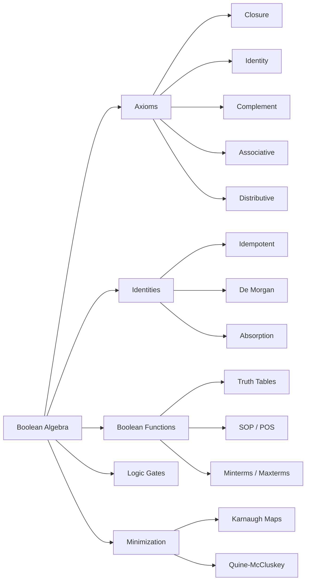

# Chapter 12: Boolean Algebra

> **Previous:** [Chapter 11: Algebraic Structures](./11-algebra.md) | **Next:** [Chapter 13: Probability](./13-probability.md)

## Learning Objectives

After completing this chapter, you will be able to:

- Define Boolean algebra and identify its axioms and properties
- Simplify Boolean expressions using identities and laws
- Apply De Morgan's laws to transform expressions
- Convert between Boolean functions and truth tables
- Represent Boolean functions using sum-of-products and product-of-sums
- Design and analyze logic gate circuits
- Minimize Boolean expressions using Karnaugh maps and the Quine-McCluskey algorithm
- Understand the relationship between Boolean algebra and digital logic

## Chapter at a Glance

| Topic | Key Insight | Practical Takeaway |
|-------|-------------|-------------------|
| Boolean Algebra | Operations on $\{0,1\}$: $+$, $\cdot$, $'$ | Every Boolean algebra satisfies the same axioms |
| Basic Identities | Idempotent, absorption, complement, involution | Simplifying expressions before building circuits saves hardware |
| De Morgan's Laws | $(x+y)' = x'y'$, $(xy)' = x' + y'$ | NAND/NOR are universal gates — any circuit can use only NAND |
| Boolean Functions | Truth table $\rightarrow$ expression | Express as sum of minterms or product of maxterms |
| Logic Gates | AND, OR, NOT, NAND, NOR, XOR, XNOR | Universal gates (NAND, NOR) implement any function |
| Duality | Replace $+$ with $\cdot$ and $0$ with $1$ | Every theorem has a dual; proving one proves both |
| Minterms & Maxterms | Product terms (AND) and sum terms (OR) | SOP selects rows where $f=1$; POS selects rows where $f=0$ |
| Karnaugh Maps | Visual minimization for up to 4 variables | Adjacent cells differ by one literal for simplification |
| Quine-McCluskey | Algorithmic minimization for any number of variables | Finds all prime implicants then selects essential ones |

## Chapter Roadmap



## Theory

### 12.1 Definition

A **Boolean algebra** is a set $B$ with two binary operations $+$ (OR), $\cdot$ (AND), and a unary operation $'$ (complement/NOT), satisfying:

1. **Closure:** $a + b \in B$, $a \cdot b \in B$, $a' \in B$.
2. **Identity:** $a + 0 = a$, $a \cdot 1 = a$.
3. **Complements:** $a + a' = 1$, $a \cdot a' = 0$.
4. **Associativity:** $(a + b) + c = a + (b + c)$, $(a \cdot b) \cdot c = a \cdot (b \cdot c)$.
5. **Commutativity:** $a + b = b + a$, $a \cdot b = b \cdot a$.
6. **Distributivity:** $a + (b \cdot c) = (a + b) \cdot (a + c)$ and $a \cdot (b + c) = (a \cdot b) + (a \cdot c)$.

The standard Boolean algebra is $B = \{0, 1\}$ with these operations.

> **One-Sentence Takeaway:** Boolean algebra is an algebraic structure on $\{0,1\}$ with AND, OR, and NOT — every identity follows from the six axiom groups.

### 12.2 Basic Identities

**Theorem 12.1 (Idempotent laws).**
- $x + x = x$
- $x \cdot x = x$

**Theorem 12.2 (Domination laws).**
- $x + 1 = 1$
- $x \cdot 0 = 0$

**Theorem 12.3 (Absorption laws).**
- $x + (x \cdot y) = x$
- $x \cdot (x + y) = x$

**Theorem 12.4 (Involution law).** $(x')' = x$.

**Theorem 12.5 (De Morgan's laws).**
- $(x + y)' = x' \cdot y'$
- $(x \cdot y)' = x' + y'$

> **One-Sentence Takeaway:** Absorption eliminates redundancy ($x + xy = x$); De Morgan converts AND to OR and vice versa by complementing all variables.

### 12.3 Duality

The **dual** of a Boolean expression replaces $+$ with $\cdot$, $\cdot$ with $+$, $0$ with $1$, and $1$ with $0$. The dual of every Boolean identity is also an identity.

**Example:** Dual of $x + (y \cdot z)$ is $x \cdot (y + z)$.
Dual of $x + 0 = x$ is $x \cdot 1 = x$.

> **One-Sentence Takeaway:** Duality halves the work — every proven identity gives its dual for free.

### 12.4 Boolean Functions

An $n$-variable Boolean function is a function $f: \{0,1\}^n \rightarrow \{0,1\}$. It can be represented by:

- A **truth table** listing all $2^n$ input combinations and the output.
- A **Boolean expression** using $+$, $\cdot$, and $'$.
- A **Karnaugh map** for visual simplification.

**Theorem 12.6 (Number of Boolean functions).** There are $2^{2^n}$ distinct $n$-variable Boolean functions.

**Minterm:** A product (AND) term where each variable appears once, either complemented or uncomplemented. For $n$ variables, there are $2^n$ minterms.

**Maxterm:** A sum (OR) term where each variable appears once, either complemented or uncomplemented.

**Sum-of-products (SOP):** OR of minterms where $f = 1$.

**Product-of-sums (POS):** AND of maxterms where $f = 0$.

```typescript
type TruthTable = { inputs: number[][]; output: number[] };

function evaluateBooleanExpr(
  inputs: number[],
  sop: string[][], // array of minterm groups (each is an array of literals)
): number {
  let result = 0; // OR over all product terms
  for (const term of sop) {
    let product = 1;
    for (let i = 0; i < term.length; i++) {
      if (term[i] === "1") product *= inputs[i];
      else if (term[i] === "0") product *= 1 - inputs[i];
      // "X" means don't care
    }
    result = result || product;
  }
  return result;
}
```

> **One-Sentence Takeaway:** Any Boolean function can be expressed as either a sum of minterms (SOP) or a product of maxterms (POS); these are canonical forms.

### 12.5 Logic Gates

**AND gate (2-input):** Output is 1 iff both inputs are 1. Symbol: $\cdot$.

**OR gate (2-input):** Output is 1 iff at least one input is 1. Symbol: $+$.

**NOT gate (inverter):** Output is the complement of the input. Symbol: $'$.

**NAND gate:** NOT(AND). Output is 0 iff both inputs are 1. Universal gate.

**NOR gate:** NOT(OR). Output is 1 iff both inputs are 0. Universal gate.

**XOR gate:** Output is 1 iff inputs differ.

**XNOR gate:** Output is 1 iff inputs are equal.

```typescript
type Bit = 0 | 1;

function AND(a: Bit, b: Bit): Bit { return (a && b) ? 1 : 0; }
function OR(a: Bit, b: Bit): Bit { return (a || b) ? 1 : 0; }
function NOT(a: Bit): Bit { return a ? 0 : 1; }
function NAND(a: Bit, b: Bit): Bit { return NOT(AND(a, b)); }
function NOR(a: Bit, b: Bit): Bit { return NOT(OR(a, b)); }
function XOR(a: Bit, b: Bit): Bit { return a !== b ? 1 : 0; }
function XNOR(a: Bit, b: Bit): Bit { return a === b ? 1 : 0; }

// Half adder
function halfAdder(a: Bit, b: Bit): { sum: Bit; carry: Bit } {
  return { sum: XOR(a, b), carry: AND(a, b) };
}

// Full adder
function fullAdder(a: Bit, b: Bit, carryIn: Bit): { sum: Bit; carryOut: Bit } {
  const s1 = XOR(a, b);
  const sum = XOR(s1, carryIn);
  const carryOut = OR(AND(a, b), AND(s1, carryIn));
  return { sum, carryOut };
}
```

> **One-Sentence Takeaway:** NAND and NOR are universal — any Boolean function can be implemented entirely with NAND gates or entirely with NOR gates.

### 12.6 Minimization with Karnaugh Maps

**Karnaugh map (K-map):** A graphical method for minimizing Boolean expressions with up to 4-6 variables.

**Rules for K-map minimization:**
1. Adjacent cells differ by exactly one variable.
2. Group adjacent 1s in rectangles of size $2^k$ (1, 2, 4, 8, ...).
3. Groups must be rectangular, not diagonal.
4. Use the largest possible groups.
5. Groups may wrap around edges.
6. Each group corresponds to an implicant where the changing variable is eliminated.

**Example (2-variable K-map):** $f(x,y) = xy + x'y$
```
      y=0  y=1
x=0  | 0 | 1 |
x=1  | 0 | 1 |
```
Groups: column $y=1$ → $y$.

> **One-Sentence Takeaway:** K-maps minimize Boolean expressions by grouping adjacent 1s into the largest power-of-2 rectangles, eliminating variables that change within the group.

### 12.7 Quine-McCluskey Algorithm

An algorithmic (tabular) method for minimizing Boolean functions with any number of variables.

**Steps:**
1. List all minterms where $f = 1$ (don't cares included).
2. Group minterms by the number of 1s in their binary representation.
3. Combine pairs differing by exactly one bit — the differing bit becomes "don't care" ($-$).
4. Repeat until no further combination is possible.
5. The remaining terms are **prime implicants**.
6. Use a prime implicant chart to select the minimal set covering all minterms.

```typescript
function countOnes(n: number, bits: number): number {
  let count = 0;
  for (let i = 0; i < bits; i++) {
    if ((n >> i) & 1) count++;
  }
  return count;
}

function differsByOneBit(a: number, b: number): number | null {
  const diff = a ^ b;
  if (diff === 0) return null;
  // Check if diff is a power of 2 (exactly one bit differs)
  return (diff & (diff - 1)) === 0 ? diff : null;
}

function quineMcCluskey(minterms: number[], variables: number): number[][] {
  const terms: { value: number; mask: number; combined: boolean }[] =
    minterms.map(m => ({ value: m, mask: 0, combined: false }));
  // Implementation continues with pairing and chart covering
  return [];
}
```

> **One-Sentence Takeaway:** Quine-McCluskey algorithmically finds all prime implicants and selects the minimum cover — it is the computational version of K-map minimization.

### 12.8 Don't Care Conditions

**Don't care conditions** are input combinations that cannot occur or whose output value is irrelevant. They can be treated as either 0 or 1 to simplify the expression.

In K-maps, don't cares are marked as "X" and included in a group only if they help form a larger group.

**Theorem 12.7 (Don't care optimization).** If a don't care condition appears in a prime implicant that covers only also-covered or don't-care minterms, it does not need to be covered separately.

> **One-Sentence Takeaway:** Don't cares are wildcards — use them to create larger K-map groups but never force them to be covered.

## Concept Comparison Table

| Concept | Definition | Key Distinction | Use Case |
|---------|-----------|----------------|----------|
| SOP | OR of AND terms | Sum of minterms where $f=1$ | Canonical form for PLA implementation |
| POS | AND of OR terms | Product of maxterms where $f=0$ | May be simpler for functions with many 1s |
| Minterm | Product term including every variable | $2^n$ possible per function | Truth table row selector |
| Maxterm | Sum term including every variable | Converse of minterm | Truth table complement selector |
| K-map | Visual minimization (up to 4-6 vars) | Adjacency = differs by one literal | Hand minimization for small functions |
| Quine-McCluskey | Algorithmic minimization | Tabular, any variable count | Automated circuit synthesis |

## Quick Reference

| Boolean Law | AND Form | OR Form |
|------------|----------|---------|
| Identity | $x \cdot 1 = x$ | $x + 0 = x$ |
| Domination | $x \cdot 0 = 0$ | $x + 1 = 1$ |
| Idempotent | $x \cdot x = x$ | $x + x = x$ |
| Complement | $x \cdot x' = 0$ | $x + x' = 1$ |
| Absorption | $x \cdot (x + y) = x$ | $x + (x \cdot y) = x$ |
| De Morgan | $(x \cdot y)' = x' + y'$ | $(x + y)' = x' \cdot y'$ |
| Involution | $(x')' = x$ | $(x')' = x$ |

## Cross-Application Matrix

| Concept | Computer Engineering | Cryptography | AI/ML | Software Engineering |
|---------|---------------------|--------------|-------|---------------------|
| Boolean Functions | ALU design, control units | S-box optimization | Decision trees, rule learning | Conditional logic optimization |
| De Morgan's Laws | Gate-level optimization | — | — | Refactoring conditionals |
| K-maps | CPU register minimization | — | — | — |
| Quine-McCluskey | VLSI synthesis | Boolean function representation | Feature selection | — |
| Logic Gates | Full adder, multiplexer | AES circuit | Neural network threshold gates | Bitwise operations |
| Don't Cares | State machine optimization | — | Missing data handling | Default cases in switch |

## Chapter Quiz

1. De Morgan's law $(x + y)'$ equals:
   - A) $x' + y'$
   - B) $x' \cdot y'$
   - C) $x \cdot y$
   - D) $x + y'$
   <details><summary>Answer</summary>**B)** $(x + y)' = x' \cdot y'$.</details>

2. How many Boolean functions exist for 3 variables?
   - A) 8
   - B) 64
   - C) 256
   - D) 512
   <details><summary>Answer</summary>**C)** $2^{2^3} = 2^8 = 256$ distinct Boolean functions for 3 variables.</details>

3. The absorption law $x + (x \cdot y)$ simplifies to:
   - A) $x$
   - B) $y$
   - C) $x + y$
   - D) $xy$
   <details><summary>Answer</summary>**A)** $x + (x \cdot y) = x$ by the absorption law.</details>

4. Which gate is NOT universal (cannot implement any Boolean function by itself)?
   - A) NAND
   - B) NOR
   - C) AND
   - D) None of the above
   <details><summary>Answer</summary>**C)** AND alone cannot implement NOT, so it is not universal. NAND and NOR are universal.</details>

5. A K-map groups cells that differ by:
   - A) Exactly one variable
   - B) Different output values
   - C) No variables
   - D) Two or more variables
   <details><summary>Answer</summary>**A)** Adjacent cells in a K-map differ by exactly one variable, enabling simplification.</details>

## Examples

**Example 12.1** (Boolean identity proof). Prove $x + x'y = x + y$.

*Proof.* $x + x'y = (x + x')(x + y) = 1 \cdot (x + y) = x + y$. $\square$

**Example 12.2** (De Morgan extended). Simplify $(x + y + z)'$:
$(x + y + z)' = x' \cdot y' \cdot z'$.

**Example 12.3** (Truth table to SOP). $f(x,y,z) = 1$ for inputs 001, 010, 111.
SOP: $f = x'y'z + x'yz' + xyz$.

**Example 12.4** (Half adder circuit). Sum $= A \oplus B$, Carry $= AB$.

| A | B | Sum | Carry |
|---|---|-----|-------|
| 0 | 0 |  0  |   0   |
| 0 | 1 |  1  |   0   |
| 1 | 0 |  1  |   0   |
| 1 | 1 |  0  |   1   |

```typescript
function halfAdderCircuit(a: Bit, b: Bit) {
  const sum = XOR(a, b);
  const carry = AND(a, b);
  return { sum, carry };
}
```

**Example 12.5** (K-map minimization). $f(x,y,z) = \sum m(0,2,4,5,6)$.
K-map:
```
     yz
     00  01  11  10
x=0 | 1 | 0 | 0 | 1 |
x=1 | 1 | 1 | 0 | 1 |
```
Groups: $z'$ (columns 00 and 10) and $y$ (bottom row for 01, but larger group: $z'$ covers 4 cells). Minimal: $f = z' + xy'$.

**Example 12.6** (NAND as universal gate). Implement NOT using NAND: $x' = x \text{ NAND } x$. Implement AND: $xy = (x \text{ NAND } y)'$.

**Example 12.7** (Don't care optimization). $f(w,x,y,z) = \sum m(0,2,5,7,8,10) + d(13,15)$. The don't cares at 13 and 15 (binary 1101, 1111) can group with 5 (0101) and 7 (0111) to form $x'z$, eliminating $w$ and $y$.

**Example 12.8** (Boolean function count for 2 variables). There are $2^{2^2} = 16$ possible 2-variable Boolean functions, including AND, OR, XOR, NAND, NOR, XNOR, implication, etc.

**Example 12.9** (Duality). Dual of $x + yz = (x + y)(x + z)$ is $x(y + z) = xy + xz$.

**Example 12.10** (Full adder in gates).

```typescript
function fullAdderGates(a: Bit, b: Bit, cin: Bit): { sum: Bit; cout: Bit } {
  const aXORb = XOR(a, b);
  const sum = XOR(aXORb, cin);
  const cout = OR(AND(a, b), AND(aXORb, cin));
  return { sum, cout };
}
```

## Summary

- Boolean algebra is the algebraic foundation of digital logic, operating on $\{0,1\}$.
- Key identities: idempotent, domination, absorption, involution, De Morgan.
- Duality: swapping $+$ and $\cdot$, $0$ and $1$, yields a valid dual identity.
- Boolean functions are represented by truth tables, SOP, or POS expressions.
- Logic gates (AND, OR, NOT, NAND, NOR, XOR, XNOR) implement Boolean operations.
- NAND and NOR are universal; any function can be built from just NAND gates.
- Minimization reduces circuit complexity via K-maps or Quine-McCluskey.

## Practical Takeaways

1. **Simplify before building** — a minimized expression means fewer gates, less power, and less cost.
2. **NAND is universal** — any circuit can be implemented using only NAND gates.
3. **Don't cares are your friend** — use them to form larger K-map groups.
4. **De Morgan transforms circuit types** — use it to convert AND-OR to NAND-NAND or OR-AND to NOR-NOR.
5. **K-maps work up to 4 variables** — for more, use Quine-McCluskey algorithmically.

## Exercises

### Review Questions

1. State De Morgan's laws for Boolean algebra.
2. What is the dual of $x \cdot (y + z')$?
3. How many Boolean functions exist for 4 variables?
4. What is the difference between SOP and POS?
5. List three Boolean algebra identities.

### Application Problems

6. Simplify $f(x,y) = x'y + xy + xy'$ using Boolean identities.

7. Use a K-map to minimize $f(w,x,y,z) = \sum m(0,1,3,4,7,8,12,15)$.

8. Implement XOR using only NAND gates.

9. Write the SOP expression for $f(a,b,c) = 1$ when the binary input represents an odd number.

10. Convert the expression $(x + y')(y + z')$ to SOP form.

11. Implement a 2-to-1 multiplexer using logic gates: $f = s' \cdot A + s \cdot B$.

12. Use Quine-McCluskey to minimize $f(w,x,y,z) = \sum m(0,2,4,6,8,10,12,14)$.

### Challenge Problem

13. Prove that every Boolean function can be expressed using only NAND gates.

14. Show that the set $\{\text{AND}, \text{NOT}\}$ is universal but the set $\{\text{AND}, \text{OR}\}$ is not.

15. Design a 4-bit ripple-carry adder using full adders. Write the TypeScript implementation and compute the gate count.
