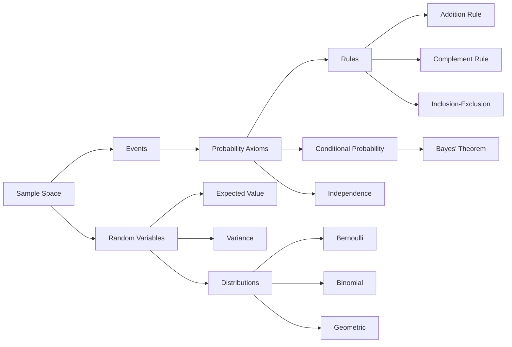

# Chapter 13: Probability

> **Previous:** [Chapter 12: Boolean Algebra](./12-boolean.md) | **Next:** [Chapter 14: Number Theory](./14-number-theory.md)

## Learning Objectives

After completing this chapter, you will be able to:

- Define sample spaces, events, and probability functions
- Apply the axioms of probability and basic rules (addition, complement, inclusion-exclusion)
- Compute conditional probabilities and apply Bayes' theorem
- Distinguish between independent and dependent events
- Understand random variables and probability distributions
- Compute expected value, variance, and standard deviation
- Recognize Bernoulli, binomial, and geometric distributions
- Apply the principle of inclusion-exclusion for probability calculations

## Chapter at a Glance

| Topic | Key Insight | Practical Takeaway |
|-------|-------------|-------------------|
| Sample Space & Event | $S$ is all possible outcomes; $E \subseteq S$ | Probability is the ratio $|E|/|S|$ for equally likely outcomes |
| Axioms of Probability | $0 \leq P(E) \leq 1$, $P(S)=1$, additivity for disjoint events | All probability rules derive from these three axioms |
| Conditional Probability | $P(A \mid B) = P(A \cap B) / P(B)$ | Knowledge of $B$ changes the probability of $A$ |
| Independence | $P(A \cap B) = P(A)P(B)$ | Product rule; $P(A \mid B) = P(A)$ |
| Bayes' Theorem | $P(H \mid E) = P(E \mid H) P(H) / P(E)$ | Updates belief given evidence; foundation of machine learning |
| Random Variables | Function from $S$ to $\mathbb{R}$ | Expected value is the weighted average of outcomes |
| Variance | $\text{Var}(X) = E[(X-\mu)^2]$ | Measures spread around the mean |
| Bernoulli Trial | Single experiment with success/failure | Building block for binomial, geometric, negative binomial |
| Binomial Distribution | $n$ independent Bernoulli trials | $P(X=k) = \binom{n}{k} p^k (1-p)^{n-k}$ |

## Chapter Roadmap



## Theory

### 13.1 Sample Space and Events

The **sample space** $S$ is the set of all possible outcomes of an experiment. An **event** is a subset $E \subseteq S$.

If all outcomes are equally likely, the probability of event $E$ is:
$$P(E) = \frac{|E|}{|S|}$$

**Operations on events:**
- $E \cup F$: at least one occurs.
- $E \cap F$: both occur.
- $E'$ (or $\overline{E}$): $E$ does not occur.
- $E$ and $F$ are **mutually exclusive (disjoint)** if $E \cap F = \emptyset$.

> **One-Sentence Takeaway:** The sample space contains all possible outcomes; events are subsets, and for equally likely outcomes, probability is the size ratio.

### 13.2 Axioms of Probability

**Kolmogorov's axioms:**
1. $0 \leq P(E) \leq 1$ for any event $E$.
2. $P(S) = 1$.
3. If $E_1, E_2, \dots$ are pairwise disjoint, then $P(\bigcup_i E_i) = \sum_i P(E_i)$ (countable additivity).

**Theorem 13.1 (Basic rules).**
- $P(\emptyset) = 0$.
- $P(E') = 1 - P(E)$ (complement rule).
- If $E \subseteq F$, then $P(E) \leq P(F)$.
- $P(E \cup F) = P(E) + P(F) - P(E \cap F)$ (addition rule).
- $0 \leq P(E) \leq 1$.

> **One-Sentence Takeaway:** Every probability rule — complement, addition, inclusion-exclusion — follows from Kolmogorov's three axioms.

### 13.3 Conditional Probability

The **conditional probability** of $A$ given $B$ is:
$$P(A \mid B) = \frac{P(A \cap B)}{P(B)}$$
provided $P(B) > 0$.

**Multiplication rule:** $P(A \cap B) = P(A \mid B) \cdot P(B) = P(B \mid A) \cdot P(A)$.

**Generalized multiplication rule:**
$$P(A_1 \cap A_2 \cap \dots \cap A_n) = P(A_1) \cdot P(A_2 \mid A_1) \cdot P(A_3 \mid A_1 \cap A_2) \cdots P(A_n \mid A_1 \cap \dots \cap A_{n-1})$$

> **One-Sentence Takeaway:** Conditional probability updates the probability of $A$ given knowledge that $B$ occurred — it renormalizes $P(A \cap B)$ over $P(B)$.

### 13.4 Independence

Events $A$ and $B$ are **independent** if any of the following equivalent conditions hold:
1. $P(A \cap B) = P(A) \cdot P(B)$.
2. $P(A \mid B) = P(A)$.
3. $P(B \mid A) = P(B)$.

**Theorem 13.2 (Independence of complements).** If $A$ and $B$ are independent, then $A$ and $B'$, $A'$ and $B$, $A'$ and $B'$ are also independent.

Events $A_1, A_2, \dots, A_n$ are **mutually independent** if for every subset $\{i_1, \dots, i_k\}$:
$$P(A_{i_1} \cap \dots \cap A_{i_k}) = P(A_{i_1}) \cdots P(A_{i_k})$$

> **One-Sentence Takeaway:** Independence means the occurrence of one event does not affect the probability of another — the joint probability is the product of marginals.

### 13.5 Bayes' Theorem

**Bayes' theorem:**
$$P(H \mid E) = \frac{P(E \mid H) \cdot P(H)}{P(E)}$$

For a partition $H_1, H_2, \dots, H_n$ of the sample space:
$$P(H_j \mid E) = \frac{P(E \mid H_j) \cdot P(H_j)}{\sum_{i=1}^n P(E \mid H_i) \cdot P(H_i)}$$

**Terminology:**
- $P(H)$: **prior probability** (before evidence).
- $P(H \mid E)$: **posterior probability** (after evidence).
- $P(E \mid H)$: **likelihood**.
- $P(E)$: **marginal likelihood** (normalization constant).

> **One-Sentence Takeaway:** Bayes' theorem tells us how to update our belief in a hypothesis given new evidence — it is the foundation of inference, spam filtering, and machine learning.

### 13.6 Random Variables

A **random variable** $X$ is a function $X: S \rightarrow \mathbb{R}$ that assigns a real number to each outcome.

**Discrete random variable:** Takes countably many values (e.g., $\{0,1,2,\dots\}$).

**Probability mass function (PMF):** $p(x) = P(X = x)$.

**Cumulative distribution function (CDF):** $F(x) = P(X \leq x)$.

**Theorem 13.3 (Properties of PMFs).**
- $0 \leq p(x) \leq 1$.
- $\sum_x p(x) = 1$.

> **One-Sentence Takeaway:** A random variable maps outcomes to numbers; its probability mass function describes how total probability is distributed across possible values.

### 13.7 Expected Value and Variance

**Expected value (mean):** $\mu = E[X] = \sum_x x \cdot p(x)$.

**Theorem 13.4 (Linearity of expectation).** For any random variables $X$ and $Y$:
- $E[aX + b] = aE[X] + b$.
- $E[X + Y] = E[X] + E[Y]$ (even if $X$ and $Y$ are not independent).

**Variance:** $\sigma^2 = \text{Var}(X) = E[(X - \mu)^2] = E[X^2] - \mu^2$.

**Standard deviation:** $\sigma = \sqrt{\text{Var}(X)}$.

**Theorem 13.5 (Variance properties).**
- $\text{Var}(aX + b) = a^2 \cdot \text{Var}(X)$.
- If $X$ and $Y$ are independent: $\text{Var}(X + Y) = \text{Var}(X) + \text{Var}(Y)$.

```typescript
interface Distribution {
  values: number[];
  probs: number[];
}

function expectedValue(dist: Distribution): number {
  let ev = 0;
  for (let i = 0; i < dist.values.length; i++) {
    ev += dist.values[i] * dist.probs[i];
  }
  return ev;
}

function variance(dist: Distribution): number {
  const mu = expectedValue(dist);
  let varSum = 0;
  for (let i = 0; i < dist.values.length; i++) {
    varSum += (dist.values[i] - mu) ** 2 * dist.probs[i];
  }
  return varSum;
}

// Example: fair die
const die: Distribution = {
  values: [1, 2, 3, 4, 5, 6],
  probs: [1/6, 1/6, 1/6, 1/6, 1/6, 1/6],
};
console.log(expectedValue(die)); // 3.5
console.log(variance(die));      // ~2.917
```

> **One-Sentence Takeaway:** Expected value is the probability-weighted average; variance measures spread — linearity of expectation holds regardless of independence.

### 13.8 Bernoulli and Binomial Distributions

**Bernoulli trial:** A single experiment with two outcomes: success (1) with probability $p$, failure (0) with probability $1-p$.
- $P(X = 1) = p$, $P(X = 0) = 1-p$.
- $E[X] = p$, $\text{Var}(X) = p(1-p)$.

**Binomial distribution:** Number of successes in $n$ independent Bernoulli trials, each with success probability $p$.
- PMF: $P(X = k) = \binom{n}{k} p^k (1-p)^{n-k}$, for $k = 0, 1, \dots, n$.
- $E[X] = np$, $\text{Var}(X) = np(1-p)$.

```typescript
function binomialProb(n: number, k: number, p: number): number {
  // P(X = k) for Binomial(n, p)
  return binomialCoeff(n, k) * Math.pow(p, k) * Math.pow(1 - p, n - k);
}

function binomialCoeff(n: number, k: number): number {
  if (k < 0 || k > n) return 0;
  if (k === 0 || k === n) return 1;
  k = Math.min(k, n - k);
  let result = 1;
  for (let i = 1; i <= k; i++) {
    result = result * (n - k + i) / i;
  }
  return result;
}

console.log(binomialProb(10, 3, 0.5)); // P(3 heads in 10 fair coin flips)
```

> **One-Sentence Takeaway:** The binomial distribution counts successes in $n$ independent Bernoulli trials; its mean is $np$ and variance is $np(1-p)$.

### 13.9 Geometric Distribution

The number of trials until the first success in independent Bernoulli trials.

**PMF:** $P(X = k) = (1-p)^{k-1} p$, for $k = 1, 2, 3, \dots$.

**Properties:**
- $E[X] = 1/p$.
- $\text{Var}(X) = (1-p)/p^2$.
- **Memoryless property:** $P(X > n + m \mid X > n) = P(X > m)$.

> **One-Sentence Takeaway:** The geometric distribution models "waiting time" until the first success; it is memoryless — past failures do not affect future probability.

### 13.10 Inclusion-Exclusion for Probability

**Principle of inclusion-exclusion for probability:**
$$P\left(\bigcup_{i=1}^n A_i\right) = \sum_i P(A_i) - \sum_{i<j} P(A_i \cap A_j) + \sum_{i<j<k} P(A_i \cap A_j \cap A_k) - \cdots + (-1)^{n+1} P(A_1 \cap \dots \cap A_n)$$

For $n = 3$:
$$P(A \cup B \cup C) = P(A) + P(B) + P(C) - P(A\cap B) - P(A\cap C) - P(B\cap C) + P(A \cap B \cap C)$$

> **One-Sentence Takeaway:** Inclusion-exclusion computes the probability of a union by alternating sums and subtractions of intersections of increasing size.

## Concept Comparison Table

| Distribution | Support | Parameter(s) | $E[X]$ | $\text{Var}(X)$ | Memoryless |
|-------------|---------|--------------|--------|-----------------|------------|
| Bernoulli | $\{0,1\}$ | $p$ | $p$ | $p(1-p)$ | — |
| Binomial | $\{0,\dots,n\}$ | $n, p$ | $np$ | $np(1-p)$ | No |
| Geometric | $\{1,2,\dots\}$ | $p$ | $1/p$ | $(1-p)/p^2$ | Yes |
| Uniform (discrete) | $\{1,\dots,n\}$ | $n$ | $(n+1)/2$ | $(n^2-1)/12$ | No |

## Cross-Application Matrix

| Concept | Data Science | AI/ML | Engineering | Finance |
|---------|-------------|-------|-------------|---------|
| Bayes' Theorem | Spam filtering, recommendation | Naive Bayes, Bayesian networks | Fault diagnosis | Risk assessment |
| Expected Value | A/B testing, RL | Loss functions | Reliability engineering | Portfolio expected return |
| Variance | Feature selection, PCA | Regularization | Quality control (6$\sigma$) | Portfolio risk (Volatility) |
| Binomial Distribution | Error rate estimation | Binary classification | Defect rate modeling | Default probability |
| Geometric Distribution | Retry modeling | — | Redundancy design | Stopping time analysis |
| Conditional Probability | Probabilistic graphs | Markov models | System reliability | Conditional VaR |

## Chapter Quiz

1. If $P(A) = 0.6$, $P(B) = 0.4$, and $P(A \cap B) = 0.2$, what is $P(A \mid B)$?
   - A) 0.2
   - B) 0.4
   - C) 0.5
   - D) 0.6
   <details><summary>Answer</summary>**C)** $P(A \mid B) = P(A \cap B) / P(B) = 0.2 / 0.4 = 0.5$.</details>

2. What is the expected value of a fair 6-sided die?
   - A) 3
   - B) 3.5
   - C) 4
   - D) 6
   <details><summary>Answer</summary>**B)** $(1+2+3+4+5+6)/6 = 3.5$.</details>

3. The variance of a Bernoulli$(p)$ random variable is:
   - A) $p$
   - B) $1-p$
   - C) $p(1-p)$
   - D) $p^2$
   <details><summary>Answer</summary>**C)** $\text{Var}(X) = p(1-p)$ for Bernoulli.</details>

4. Two events are independent if:
   - A) $P(A \cap B) = P(A) + P(B)$
   - B) $P(A \cap B) = P(A)P(B)$
   - C) $P(A \cup B) = P(A) + P(B)$
   - D) $P(A) = P(B)$
   <details><summary>Answer</summary>**B)** Independence means $P(A \cap B) = P(A)P(B)$.</details>

5. The binomial distribution $\text{Bin}(n, p)$ has expected value:
   - A) $p$
   - B) $n$
   - C) $np$
   - D) $n(1-p)$
   <details><summary>Answer</summary>**C)** $E[X] = np$ for binomial.</details>

## Examples

**Example 13.1** (Probability of a sum of dice). Roll two fair dice. $P(\text{sum} = 7)$:
$|S| = 36$. Favorable outcomes: $(1,6),(2,5),(3,4),(4,3),(5,2),(6,1)$ = 6. $P = 6/36 = 1/6$.

**Example 13.2** (Complement rule). In a deck of 52 cards, $P(\text{not a heart}) = 1 - P(\text{heart}) = 1 - 13/52 = 39/52 = 3/4$.

**Example 13.3** (Conditional probability). In a class, 60% passed math, 50% passed physics, 30% passed both. $P(\text{passed physics} \mid \text{passed math}) = 0.3 / 0.6 = 0.5$.

**Example 13.4** (Bayes theorem). A test for a disease is 99% accurate (sensitivity = 99%, specificity = 99%). Disease prevalence is 0.1%. If a person tests positive, what is the probability they have the disease?

$P(D) = 0.001$, $P(T \mid D) = 0.99$, $P(T \mid \neg D) = 0.01$.
$$P(D \mid T) = \frac{0.99 \cdot 0.001}{0.99 \cdot 0.001 + 0.01 \cdot 0.999} = \frac{0.00099}{0.01098} \approx 0.0902$$

Even with a 99% accurate test, the posterior probability is only about 9%.

```typescript
function bayesTheorem(
  prior: number,
  likelihood: number,
  falsePositiveRate: number
): number {
  const numerator = likelihood * prior;
  const denominator = numerator + falsePositiveRate * (1 - prior);
  return numerator / denominator;
}

console.log(bayesTheorem(0.001, 0.99, 0.01)); // ~0.0902
```

**Example 13.5** (Binomial probability). Fair coin flipped 10 times. $P(\text{exactly 5 heads}) = \binom{10}{5} (0.5)^{10} = 252 / 1024 \approx 0.246$.

**Example 13.6** (Linearity of expectation). Expected sum when rolling two dice: $E[X+Y] = E[X] + E[Y] = 3.5 + 3.5 = 7$.

**Example 13.7** (Geometric distribution). Probability of first 6 on the third roll of a fair die: $P(X=3) = (5/6)^2 \cdot (1/6) = 25/216 \approx 0.116$.

**Example 13.8** (Inclusion-exclusion for 3 events). $P(A) = 0.3$, $P(B) = 0.4$, $P(C) = 0.5$, all pairwise intersections = 0.1, triple intersection = 0.05.
$P(A \cup B \cup C) = 0.3 + 0.4 + 0.5 - 0.1 - 0.1 - 0.1 + 0.05 = 0.95$.

**Example 13.9** (Variance calculation). For a fair die: $\mu = 3.5$. $E[X^2] = (1+4+9+16+25+36)/6 = 91/6 = 15.167$. $\text{Var}(X) = 15.167 - 3.5^2 = 15.167 - 12.25 = 2.917$.

**Example 13.10** (Probability of at least one). $P(\text{at least one 6 in 4 dice rolls}) = 1 - P(\text{no 6}) = 1 - (5/6)^4 = 1 - 625/1296 = 671/1296 \approx 0.518$.

## Summary

- Probability measures likelihood from 0 to 1; all rules derive from Kolmogorov's axioms.
- Conditional probability updates beliefs given evidence.
- Bayes' theorem reverses conditional probabilities.
- Random variables map outcomes to numbers; expected value and variance describe the distribution.
- Bernoulli, binomial, and geometric distributions model sequences of independent trials.
- Inclusion-exclusion computes union probabilities by alternating intersections.

## Practical Takeaways

1. **Complement is your best friend** — $P(\text{at least one})$ is almost always easier as $1 - P(\text{none})$.
2. **Linearity of expectation works without independence** — this is the most powerful tool in probability.
3. **Bayes' theorem avoids false positives** — always account for the base rate (prior).
4. **Binomial counts successes in 0/1 trials** — check independence and constant $p$ before using.
5. **Variance is not linear** — $\text{Var}(X+Y) = \text{Var}(X) + \text{Var}(Y)$ only for independent variables.

## Exercises

### Review Questions

1. What are the three Kolmogorov axioms of probability?
2. State Bayes' theorem and identify each term.
3. What is the difference between mutually exclusive and independent?
4. Compute $E[X]$ and $\text{Var}(X)$ for a Bernoulli$(p)$ variable.
5. When does the geometric distribution apply?

### Application Problems

6. Roll two fair dice. What is $P(\text{sum} \geq 10)$?

7. A bag has 3 red, 5 blue, 2 green marbles. Draw two without replacement. What is $P(\text{both red})$?

8. Test sensitivity = 95%, specificity = 98%, prevalence = 2%. A person tests positive. What is $P(\text{disease})$?

9. Flip a fair coin 8 times. What is $P(3 \leq \text{heads} \leq 5)$?

10. The expected value of a random variable $X$ is 10 and $E[X^2] = 120$. Find $\text{Var}(X)$.

11. Roll a die until you get a 6. What is $P(\text{first 6 appears on roll 4})$?

12. Prove: $P(A \cup B \cup C) = P(A) + P(B) + P(C) - P(A \cap B) - P(A \cap C) - P(B \cap C) + P(A \cap B \cap C)$.

### Challenge Problem

13. Prove the memoryless property of the geometric distribution: $P(X > n+m \mid X > n) = P(X > m)$.

14. A random variable $X$ has PMF $p(k) = c/k^2$ for $k = 1, 2, 3, \dots$. Find $c$ and show whether $E[X]$ exists.

15. The **coupon collector problem**: There are $n$ distinct coupons. Each purchase yields a uniformly random coupon. Show that the expected number of purchases needed to collect all $n$ coupons is $n \cdot H_n$, where $H_n = 1 + 1/2 + \dots + 1/n$ is the $n$th harmonic number.
