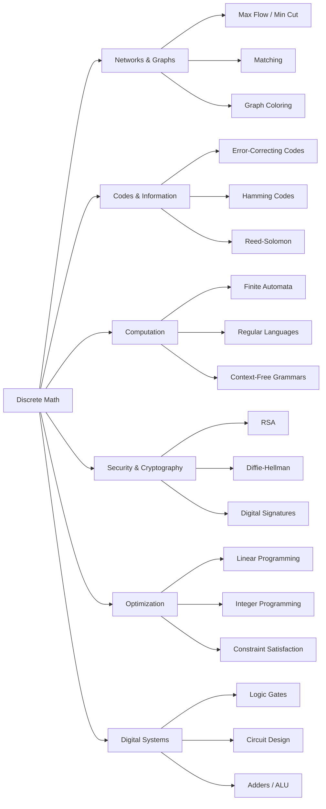
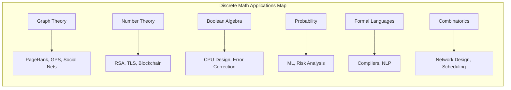

# Chapter 15: Applications of Discrete Mathematics

> **Previous:** [Chapter 14: Number Theory](./14-number-theory.md)

## Learning Objectives

After completing this chapter, you will be able to:

- Model real-world problems using discrete mathematical structures
- Apply graph theory to network flow, scheduling, and matching problems
- Use combinatorial reasoning for counting and optimization
- Understand error-detecting and error-correcting codes
- Apply discrete probability to randomized algorithms
- Model computation with finite automata and regular languages
- Recognize applications of number theory in cryptography
- Understand the role of Boolean algebra in digital circuit design

## Chapter at a Glance

| Topic | Key Insight | Practical Takeaway |
|-------|-------------|-------------------|
| Network Flow | Max flow = min cut (Ford-Fulkerson) | Used in transportation, pipeline, and data networks |
| Matching | Bipartite matching maximizes pairings | Job assignment, dating apps, resource allocation |
| Error-Correcting Codes | Hamming distance detects/corrects errors | Reed-Solomon used in CDs, QR codes, satellites |
| Randomized Algorithms | Randomness simplifies computation | Primality testing (Miller-Rabin), Quickselect |
| Finite Automata | States + transitions = computation model | Lexical analysis, regex, protocol validation |
| Formal Languages | Grammar generates strings; automaton recognizes | Programming language syntax, compilers |
| Cryptography | Number theory secures communication | RSA, Diffie-Hellman, digital signatures |
| Digital Logic | Boolean algebra -> logic gates -> circuits | All digital computation from AND, OR, NOT |
| Discrete Optimization | Maximize/minimize under constraints | Supply chain, scheduling, resource allocation |
| Graph Coloring | Assign colors to vertices so adjacent differ | Map coloring, register allocation, scheduling |

## Chapter Roadmap



## Theory

### 15.1 Network Flow

A **flow network** is a directed graph $G = (V,E)$ with a **source** $s$ and **sink** $t$, where each edge $(u,v)$ has a **capacity** $c(u,v) \geq 0$.

A **flow** is a function $f: V \times V \rightarrow \mathbb{R}$ satisfying:
1. **Capacity constraint:** $0 \leq f(u,v) \leq c(u,v)$.
2. **Flow conservation:** $\sum_v f(u,v) - \sum_v f(v,u) = 0$ for all $u \neq s, t$.
3. **Net flow into sink** = **net flow out of source**.

**Theorem 15.1 (Max-Flow Min-Cut Theorem).** The maximum possible flow equals the minimum capacity of an $s$-$t$ cut.

**Ford-Fulkerson algorithm:** Repeatedly find augmenting paths using DFS/BFS (Edmonds-Karp: BFS, $O(VE^2)$).

```typescript
class Edge {
  constructor(
    public to: number,
    public rev: number,
    public capacity: number
  ) {}
}

class Dinic {
  private graph: Edge[][];

  constructor(public n: number) {
    this.graph = Array.from({ length: n }, () => []);
  }

  addEdge(from: number, to: number, cap: number): void {
    this.graph[from].push(new Edge(to, this.graph[to].length, cap));
    this.graph[to].push(new Edge(from, this.graph[from].length - 1, 0));
  }

  maxFlow(s: number, t: number): number {
    let flow = 0;
    const level = new Array(this.n).fill(0);
    const it = new Array(this.n).fill(0);

    const bfs = (): boolean => {
      level.fill(-1);
      const queue: number[] = [s];
      level[s] = 0;
      while (queue.length > 0) {
        const v = queue.shift()!;
        for (const e of this.graph[v]) {
          if (e.capacity > 0 && level[e.to] < 0) {
            level[e.to] = level[v] + 1;
            queue.push(e.to);
          }
        }
      }
      return level[t] >= 0;
    };

    const dfs = (v: number, t: number, f: number): number => {
      if (v === t) return f;
      for (let i = it[v]; i < this.graph[v].length; i++) {
        const e = this.graph[v][i];
        if (e.capacity > 0 && level[v] < level[e.to]) {
          const d = dfs(e.to, t, Math.min(f, e.capacity));
          if (d > 0) {
            e.capacity -= d;
            this.graph[e.to][e.rev].capacity += d;
            return d;
          }
        }
        it[v]++;
      }
      return 0;
    };

    while (bfs()) {
      it.fill(0);
      while (true) {
        const f = dfs(s, t, Infinity);
        if (f === 0) break;
        flow += f;
      }
    }
    return flow;
  }
}
```

> **One-Sentence Takeaway:** The max-flow min-cut theorem establishes the duality between maximum flow and minimum cut ? the bottleneck of a network.

### 15.2 Matching

A **matching** in a graph is a set of edges with no shared vertices. A **maximum matching** contains the largest possible number of edges.

**Theorem 15.2 (Hall's Marriage Theorem).** In a bipartite graph $(X, Y)$, there exists a matching covering all vertices of $X$ if and only if for every subset $S \subseteq X$, $|N(S)| \geq |S|$.

**Theorem 15.3 (K?nig's theorem).** In bipartite graphs, the size of a maximum matching equals the size of a minimum vertex cover.

```typescript
function bipartiteMatch(
  n: number,
  m: number,
  edges: [number, number][]
): number {
  // n = size of left set, m = size of right set
  const adj: number[][] = Array.from({ length: n }, () => []);
  for (const [u, v] of edges) adj[u].push(v);

  const matchR = new Array(m).fill(-1);

  const dfs = (u: number, seen: boolean[]): boolean => {
    for (const v of adj[u]) {
      if (!seen[v]) {
        seen[v] = true;
        if (matchR[v] === -1 || dfs(matchR[v], seen)) {
          matchR[v] = u;
          return true;
        }
      }
    }
    return false;
  };

  let result = 0;
  for (let u = 0; u < n; u++) {
    const seen = new Array(m).fill(false);
    if (dfs(u, seen)) result++;
  }
  return result;
}
```

> **One-Sentence Takeaway:** Maximum bipartite matching finds the largest set of non-conflicting pairings, efficiently solved via augmenting paths (Kuhn-Munkres, Hopcroft-Karp).

### 15.3 Graph Coloring

A **proper $k$-coloring** assigns each vertex one of $k$ colors such that adjacent vertices have different colors. The **chromatic number** $\chi(G)$ is the smallest $k$ for which $G$ is $k$-colorable.

**Theorem 15.4 (Four Color Theorem).** Every planar graph is 4-colorable.

**Theorem 15.5 (Greedy coloring bound).** $\chi(G) \leq \Delta(G) + 1$, where $\Delta$ is the maximum degree.

**Applications:**
- **Map coloring:** Four colors suffice for any planar map.
- **Register allocation:** Graph coloring assigns variables to CPU registers.
- **Scheduling:** Coloring conflicts (edges) in a graph of time slots.
- **Frequency assignment:** Avoid interference in radio/cell networks.

> **One-Sentence Takeaway:** Graph coloring assigns colors to vertices such that adjacent vertices differ; it applies to scheduling, register allocation, and map coloring.

### 15.4 Error-Correcting Codes

**Error detection and correction** uses redundancy to recover from transmission errors.

**Hamming distance** $d(x,y)$ = number of positions where codewords $x$ and $y$ differ.

**Error detection:** A code can detect up to $k$ errors if the minimum Hamming distance $d_{\min} \geq k + 1$.

**Error correction:** A code can correct up to $t$ errors if $d_{\min} \geq 2t + 1$.

**Theorem 15.6 (Hamming bound).** For a binary code of length $n$ with $M$ codewords and minimum distance $d$:
$$M \cdot \sum_{i=0}^{\lfloor (d-1)/2 \rfloor} \binom{n}{i} \leq 2^n$$

**Hamming codes:** Perfect 1-error-correcting codes. For $r \geq 2$, a $[2^r - 1, 2^r - 1 - r, 3]$ Hamming code exists.

**Reed-Solomon codes:** Used in CDs, DVDs, QR codes, and satellite communication. Corrects bursts of errors by operating on symbols, not bits.

```typescript
function hammingDistance(a: string, b: string): number {
  if (a.length !== b.length) throw new Error("Length mismatch");
  let dist = 0;
  for (let i = 0; i < a.length; i++) {
    if (a[i] !== b[i]) dist++;
  }
  return dist;
}

// Simple parity-check code
function parityBit(bits: number[]): number {
  return bits.reduce((sum, b) => sum ^ b, 0);
}

function checkParity(bits: number[], parity: number): boolean {
  return parityBit(bits) === parity;
}

console.log(hammingDistance("10101", "10011")); // 2
```

> **One-Sentence Takeaway:** Error-correcting codes add redundancy to detect and fix transmission errors ? Hamming codes correct 1 error per block, Reed-Solomon corrects bursts.

### 15.5 Randomized Algorithms

**Randomized algorithms** use randomness to simplify computation and often achieve better expected performance.

**Miller-Rabin primality test:** Probabilistic test that checks whether $a^{n-1} \equiv 1 \pmod{n}$ for random bases $a$. If $n$ is composite, at least $3/4$ of bases detect it.

```typescript
function isProbablePrime(n: number, k: number = 10): boolean {
  if (n < 2) return false;
  if (n === 2 || n === 3) return true;
  if (n % 2 === 0) return false;

  // Write n - 1 as 2^s * d
  let s = 0, d = n - 1;
  while (d % 2 === 0) { s++; d /= 2; }

  for (let i = 0; i < k; i++) {
    const a = 2 + Math.floor(Math.random() * (n - 4));
    let x = modPow(a, d, n);
    if (x === 1 || x === n - 1) continue;
    let found = false;
    for (let r = 0; r < s - 1; r++) {
      x = (x * x) % n;
      if (x === n - 1) { found = true; break; }
    }
    if (!found) return false;
  }
  return true;
}

function modPow(base: number, exp: number, mod: number): number {
  let result = 1;
  base = base % mod;
  while (exp > 0) {
    if (exp % 2 === 1) result = (result * base) % mod;
    exp = Math.floor(exp / 2);
    base = (base * base) % mod;
  }
  return result;
}
```

**Quickselect:** Randomized algorithm to find the $k$th smallest element in $O(n)$ expected time.

> **One-Sentence Takeaway:** Randomized algorithms use randomness to achieve efficiency and simplicity ? the Miller-Rabin test determines primality with arbitrarily high confidence.

### 15.6 Finite Automata

A **deterministic finite automaton (DFA)** is a 5-tuple $(Q, \Sigma, \delta, q_0, F)$ where:
- $Q$ is a finite set of **states**.
- $\Sigma$ is a finite **alphabet**.
- $\delta: Q \times \Sigma \rightarrow Q$ is the **transition function**.
- $q_0 \in Q$ is the **start state**.
- $F \subseteq Q$ is the set of **accepting states**.

**Nondeterministic finite automaton (NFA):** $\delta: Q \times (\Sigma \cup \{\epsilon\}) \rightarrow \mathcal{P}(Q)$ ? multiple transitions for the same input.

**Theorem 15.7 (Equivalence).** DFAs and NFAs recognize the same class of languages (regular languages). Every NFA can be converted to an equivalent DFA (exponential blowup in the worst case).

**Regular languages:** Languages recognized by finite automata. Closed under union, concatenation, Kleene star, complement, and intersection.

```typescript
type Transition = Map<string, number>; // char -> next state

class DFA {
  constructor(
    private states: number,
    private alphabet: string[],
    private transition: Transition[],
    private start: number,
    private accept: Set<number>
  ) {}

  accepts(input: string): boolean {
    let state = this.start;
    for (const char of input) {
      const next = this.transition[state].get(char);
      if (next === undefined) return false;
      state = next;
    }
    return this.accept.has(state);
  }
}

// DFA for binary strings ending with "01"
const transitions: Transition[] = [
  new Map([["0", 1], ["1", 0]]),   // q0
  new Map([["0", 1], ["1", 2]]),   // q1
  new Map([["0", 1], ["1", 0]]),   // q2 (accepting)
];
const dfa = new DFA(3, ["0", "1"], transitions, 0, new Set([2]));
console.log(dfa.accepts("101"));   // true
console.log(dfa.accepts("100"));   // false
```

> **One-Sentence Takeaway:** Finite automata are the simplest model of computation ? they recognize regular languages, and DFAs/NFAs are equivalent in power.

### 15.7 Formal Languages

A **formal language** is a set of strings over an alphabet. **Grammars** generate languages; **automata** recognize them.

**Chomsky hierarchy:**
- **Type 3 (Regular):** Recognized by finite automata. Generated by regular grammars.
- **Type 2 (Context-free):** Recognized by pushdown automata. Generated by context-free grammars (CFGs).
- **Type 1 (Context-sensitive):** Recognized by linear-bounded automata.
- **Type 0 (Recursively enumerable):** Recognized by Turing machines.

**Context-free grammar (CFG):** $G = (V, \Sigma, R, S)$ where:
- $V$: non-terminals.
- $\Sigma$: terminals (disjoint from $V$).
- $R$: production rules $A \rightarrow \alpha$.
- $S \in V$: start symbol.

**Applications:** Programming language syntax (BNF grammars), parsing, natural language processing.

> **One-Sentence Takeaway:** The Chomsky hierarchy classifies languages by generative complexity; context-free grammars define programming language syntax.

### 15.8 Number Theory in Cryptography

Beyond RSA, number theory enables:

**Diffie-Hellman key exchange:** Two parties agree on a shared secret over an insecure channel using discrete logarithms.
1. Alice and Bob agree on prime $p$ and generator $g \in \mathbb{Z}_p^\times$.
2. Alice picks secret $a$, sends $A = g^a \bmod p$.
3. Bob picks secret $b$, sends $B = g^b \bmod p$.
4. Alice computes $B^a = g^{ab} \bmod p$; Bob computes $A^b = g^{ab} \bmod p$.

**Digital signatures:** The sender signs a message using their private key; anyone can verify using the sender's public key (RSA signature).

**Elliptic curve cryptography (ECC):** Uses the group of points on an elliptic curve. Provides equivalent security with smaller key sizes than RSA.

> **One-Sentence Takeaway:** Modern cryptography relies on number-theoretic hardness assumptions (factorization, discrete logarithm) to secure communication.

### 15.9 Digital Logic Design

Boolean algebra (Chapter 12) directly implements digital circuits:

**Combinational circuits:** Output depends only on current input.
- Half adder, full adder, ripple-carry adder.
- Multiplexer, demultiplexer, encoder, decoder.
- ALU (Arithmetic Logic Unit).

**Sequential circuits:** Output depends on current input and state (memory).
- Flip-flops (SR, D, JK, T).
- Registers, shift registers.
- Counters, state machines.

```typescript
type Bit = 0 | 1;

// Ripple-carry adder: adds two 4-bit numbers
function fourBitAdder(a: Bit[], b: Bit[]): { sum: Bit[]; carry: Bit } {
  let carry: Bit = 0;
  const sum: Bit[] = new Array(4).fill(0);
  for (let i = 3; i >= 0; i--) {
    const s1 = (a[i] ^ b[i]) as Bit;
    sum[i] = (s1 ^ carry) as Bit;
    carry = ((a[i] & b[i]) | (s1 & carry)) as Bit;
  }
  return { sum, carry };
}

// 4-to-1 multiplexer
function mux4to1(
  inputs: [Bit, Bit, Bit, Bit],
  select: [Bit, Bit]
): Bit {
  const sel = (select[0] << 1) | select[1];
  return inputs[sel];
}

const a: Bit[] = [1, 0, 1, 0]; // 1010
const b: Bit[] = [0, 1, 1, 0]; // 0110
const result = fourBitAdder(a, b);
console.log(result.sum.join("")); // "0000" (with carry 1 = 10000 = 16)
```

> **One-Sentence Takeaway:** Combinational logic implements Boolean functions as gates; sequential logic adds state for memory and control in processors and state machines.

### 15.10 Constraint Satisfaction and Optimization

**Constraint satisfaction problems (CSPs):** Variables with domains and constraints between them. Solved by backtracking, arc consistency, and propagation.

**Linear programming (LP):** Maximize/minimize a linear objective subject to linear constraints. Solved by the simplex method or interior-point methods.

**Integer programming (IP):** LP with integer variables. Much harder (NP-complete in general).

**Applications:**
- **Traveling Salesman Problem (TSP):** Find shortest Hamiltonian cycle.
- **Knapsack problem:** Maximize value with weight constraints.
- **Scheduling:** Assign tasks to resources subject to time constraints.
- **Supply chain:** Minimize transportation costs subject to demand/supply.

```typescript
// Simple knapsack: DP for 0/1 Knapsack
function knapsack(
  weights: number[],
  values: number[],
  capacity: number
): number {
  const n = weights.length;
  const dp: number[][] = Array.from(
    { length: n + 1 },
    () => new Array(capacity + 1).fill(0)
  );

  for (let i = 1; i <= n; i++) {
    for (let w = 0; w <= capacity; w++) {
      if (weights[i - 1] <= w) {
        dp[i][w] = Math.max(
          values[i - 1] + dp[i - 1][w - weights[i - 1]],
          dp[i - 1][w]
        );
      } else {
        dp[i][w] = dp[i - 1][w];
      }
    }
  }
  return dp[n][capacity];
}

const items = [
  { weight: 2, value: 3 },
  { weight: 3, value: 4 },
  { weight: 4, value: 5 },
  { weight: 5, value: 6 },
];
console.log(knapsack(
  items.map(i => i.weight),
  items.map(i => i.value),
  8
)); // 10 (items 2 + 3, weight 7, value 10)
```

> **One-Sentence Takeaway:** CSPs and optimization problems model real-world constraints; DP solves knapsack in pseudopolynomial time, while TSP and IP remain NP-hard.

### 15.11 Application Domains Matrix

| Domain | Discrete Math Concept | Specific Application |
|--------|----------------------|---------------------|
| **Networking** | Graph theory, max flow | Internet routing, capacity planning |
| **Databases** | Relations, functions | Relational algebra, query optimization |
| **Compilers** | Formal languages, automata | Lexing, parsing, code generation |
| **AI** | Logic, graphs, probability | Knowledge representation, search, Bayesian networks |
| **Machine Learning** | Probability, combinatorics | Naive Bayes, decision trees, VC dimension |
| **Computer Graphics** | Graph theory, combinatorics | Polygon meshes, Bezier curves, subdivision |
| **Web Technology** | Graphs, Boolean algebra | PageRank, search engines, routing |
| **Bioinformatics** | Graphs, probability | Phylogenetic trees, DNA sequence alignment |
| **Game Development** | Combinatorics, graphs | Pathfinding (A*), collision detection, game trees |
| **Software Engineering** | Logic, automata | Formal verification, model checking, type systems |

## Chapter Quiz

1. Hall's Marriage Theorem provides a condition for:
   - A) Flow feasibility
   - B) Bipartite matching
   - C) Graph coloring
   - D) Error correction
   <details><summary>Answer&lt;/summary&gt;**B)** Hall's theorem gives necessary and sufficient conditions for a matching covering all vertices of $X$ in a bipartite graph.</details>

2. A code with minimum Hamming distance 5 can correct:
   - A) 0 errors
   - B) 1 error
   - C) 2 errors
   - D) 3 errors
   <details><summary>Answer&lt;/summary&gt;**C)** $d_{\min} \geq 2t + 1 \implies 5 \geq 2t + 1 \implies t \leq 2$.</details>

3. The Four Color Theorem applies to:
   - A) Complete graphs
   - B) Planar graphs
   - C) Bipartite graphs
   - D) Trees
   <details><summary>Answer&lt;/summary&gt;**B)** The Four Color Theorem states that every planar graph is 4-colorable.</details>

4. Regular languages are precisely those recognized by:
   - A) Turing machines
   - B) Pushdown automata
   - C) Finite automata
   - D) Linear-bounded automata
   <details><summary>Answer&lt;/summary&gt;**C)** Regular languages are recognized by finite automata (DFA/NFA).</details>

5. The Max-Flow Min-Cut Theorem states:
   - A) Maximum flow equals maximum cut
   - B) Maximum flow equals minimum cut
   - C) Flow is always positive
   - D) Cuts are unique
   <details><summary>Answer&lt;/summary&gt;**B)** The maximum flow from source to sink equals the minimum capacity of an $s$-$t$ cut.</details>

## Examples

**Example 15.1** (Max flow). A network with source $s$, sink $t$, and edges $s \rightarrow a$ (10), $s \rightarrow b$ (5), $a \rightarrow t$ (8), $a \rightarrow b$ (3), $b \rightarrow t$ (7). Maximum flow = 12 (send 8 on $s \rightarrow a \rightarrow t$, 4 on $s \rightarrow b \rightarrow t$, with 1 from $a$ to $b$).

**Example 15.2** (Bipartite matching). Three workers $W_1, W_2, W_3$ and three jobs $J_1, J_2, J_3$. $W_1$ can do $J_1, J_2$, $W_2$ can do $J_2$, $W_3$ can do $J_2, J_3$. Maximum matching: $W_1 \rightarrow J_1$, $W_2 \rightarrow J_2$, $W_3 \rightarrow J_3$ (size 3).

**Example 15.3** (Hamming code). For $r = 3$, Hamming(7,4) code: 4 data bits, 3 parity bits. Can correct any single-bit error. The parity bits are at positions 1, 2, 4 (power-of-2 positions).

**Example 15.4** (Graph coloring). $K_4$ has $\chi(K_4) = 4$ (all 4 vertices adjacent to each other). A tree has $\chi(T) = 2$.

**Example 15.5** (DFA for binary numbers divisible by 3). States represent remainder mod 3. Transition: on input 0, $r \rightarrow (2r) \bmod 3$; on input 1, $r \rightarrow (2r+1) \bmod 3$. Start and accept: $q_0$ (remainder 0).

```typescript
const div3Transitions: Transition[] = [
  new Map([["0", 0], ["1", 1]]),  // q0: remainder 0
  new Map([["0", 2], ["1", 0]]),  // q1: remainder 1
  new Map([["0", 1], ["1", 2]]),  // q2: remainder 2
];
const dfaDiv3 = new DFA(3, ["0", "1"], div3Transitions, 0, new Set([0]));
console.log(dfaDiv3.accepts("110"));  // 6, divisible by 3 -> true
console.log(dfaDiv3.accepts("101"));  // 5, not divisible by 3 -> false
```

**Example 15.6** (Knapsack DP). Items: (w=2, v=3), (w=3, v=4), (w=4, v=5), (w=5, v=6), capacity 8. DP table computes max = 10 (items with weight 3+4 or 2+3+3... items 2+3 = weight 7, value 9; or 1+4 = weight 7, value 9; or 3+5 but w=5 is too much).

Wait, let me recalculate: items 1 (2,3) + 2 (3,4) + 3 (4,5) is weight 9 > 8. Items 2 (3,4) + 4 (5,6) = weight 8, value 10. Yes.

**Example 15.7** (Diffie-Hellman). $p = 23$, $g = 5$. Alice picks $a = 6$, sends $A = 5^6 \bmod 23 = 8$. Bob picks $b = 15$, sends $B = 5^{15} \bmod 23 = 19$. Shared secret: Alice computes $19^6 \bmod 23 = 2$; Bob computes $8^{15} \bmod 23 = 2$.

**Example 15.8** (CFG for balanced parentheses). $S \rightarrow SS \;|\; (S) \;|\; \epsilon$. Generates strings like "()(())", "(()())".

**Example 15.9** (Register allocation as graph coloring). Variables that are live simultaneously cause interference edges. Assign colors = registers. A graph with $\Delta = 5$ needs at most 6 registers.

**Example 15.10** (DFA for email validation). While a full email regex is complex, a simplified DFA can check `user@domain.tld` form: state machine with states for local part, @, domain, ., tld.

## TypeScript Implementations

```typescript
// --- Huffman Coding ---
class HuffmanNode {
  constructor(
    public char: string | null,
    public freq: number,
    public left: HuffmanNode | null = null,
    public right: HuffmanNode | null = null
  ) {}
}
function buildHuffmanTree(freqs: Map<string, number>): HuffmanNode {
  const heap: HuffmanNode[] = [];
  for (const [char, freq] of freqs) heap.push(new HuffmanNode(char, freq));
  heap.sort((a, b) => a.freq - b.freq);
  while (heap.length > 1) {
    const a = heap.shift()!, b = heap.shift()!;
    const parent = new HuffmanNode(null, a.freq + b.freq, a, b);
    heap.push(parent);
    heap.sort((x, y) => x.freq - y.freq);
  }
  return heap[0];
}
function huffmanCodes(node: HuffmanNode, prefix = ''): Map<string, string> {
  const codes = new Map<string, string>();
  if (node.char !== null) codes.set(node.char, prefix);
  if (node.left) huffmanCodes(node.left, prefix + '0').forEach((v, k) => codes.set(k, v));
  if (node.right) huffmanCodes(node.right, prefix + '1').forEach((v, k) => codes.set(k, v));
  return codes;
}
const freqMap = new Map([['A',45],['B',13],['C',12],['D',16],['E',9],['F',5]]);
const huffTree = buildHuffmanTree(freqMap);
console.log('Huffman codes:', [...huffmanCodes(huffTree)]);

// --- Hamming (7,4) Error-Correcting Code ---
function hammingEncode(data: Bit[]): Bit[] {
  const d = data; // d0..d3
  const p1 = XOR(XOR(d[0], d[1]), d[3]);
  const p2 = XOR(XOR(d[0], d[2]), d[3]);
  const p3 = XOR(XOR(d[1], d[2]), d[3]);
  return [p1, p2, d[0], p3, d[1], d[2], d[3]];
}
function hammingDecode(codeword: Bit[]): { data: Bit[]; errorPosition: number } {
  const p1 = XOR(XOR(XOR(codeword[2], codeword[4]), codeword[6]), codeword[0]);
  const p2 = XOR(XOR(XOR(codeword[2], codeword[5]), codeword[6]), codeword[1]);
  const p3 = XOR(XOR(XOR(codeword[4], codeword[5]), codeword[6]), codeword[3]);
  const errorPos = p1 + p2 * 2 + p3 * 4 - 1;
  return { data: [codeword[2], codeword[4], codeword[5], codeword[6]], errorPosition: errorPos };
}
const encoded = hammingEncode([1, 0, 1, 1]);
console.log('Hamming encoded:', encoded);
// Single-bit error correction:
const corrupted: Bit[] = [...encoded]; corrupted[2] = 0; // flip bit 2
const { data, errorPosition } = hammingDecode(corrupted);
console.log('Corrected data:', data, 'error at:', errorPosition); // [1,0,1,1], error at 2

// --- Ford-Fulkerson (Max Flow) ---
function fordFulkerson(graph: number[][], source: number, sink: number): number {
  const n = graph.length;
  const residual = graph.map(row => [...row]);
  const parent = new Array(n).fill(-1);
  let maxFlow = 0;

  function bfs(): boolean {
    parent.fill(-1);
    parent[source] = source;
    const queue = [source];
    while (queue.length) {
      const u = queue.shift()!;
      for (let v = 0; v < n; v++) {
        if (parent[v] === -1 && residual[u][v] > 0) { parent[v] = u; queue.push(v); }
      }
    }
    return parent[sink] !== -1;
  }

  while (bfs()) {
    let flow = Infinity;
    for (let v = sink; v !== source; v = parent[v]) flow = Math.min(flow, residual[parent[v]][v]);
    for (let v = sink; v !== source; v = parent[v]) {
      residual[parent[v]][v] -= flow;
      residual[v][parent[v]] += flow;
    }
    maxFlow += flow;
  }
  return maxFlow;
}
const flowGraph = [
  [0, 16, 13, 0, 0, 0],
  [0, 0, 10, 12, 0, 0],
  [0, 4, 0, 0, 14, 0],
  [0, 0, 9, 0, 0, 20],
  [0, 0, 0, 7, 0, 4],
  [0, 0, 0, 0, 0, 0]
];
console.log('Max flow:', fordFulkerson(flowGraph, 0, 5)); // 23

// --- Stable Matching (Gale-Shapley) ---
function stableMatch(prefsMen: number[][], prefsWomen: number[][]): Map<number, number> {
  const n = prefsMen.length;
  const freeMen = new Set([...Array(n).keys()]);
  const nextProposal = new Array(n).fill(0);
  const currentMatch = new Map<number, number>(); // woman -> man
  const womenRank = prefsWomen.map(p => { const r: number[] = []; p.forEach((m,i) => r[m]=i); return r; });

  while (freeMen.size > 0) {
    const m = freeMen.values().next().value as number;
    const w = prefsMen[m][nextProposal[m]++];
    if (!currentMatch.has(w)) { currentMatch.set(w, m); freeMen.delete(m); }
    else if (womenRank[w][m] < womenRank[w][currentMatch.get(w)!]) {
      freeMen.delete(m);
      freeMen.add(currentMatch.get(w)!);
      currentMatch.set(w, m);
    }
  }
  return currentMatch;
}
```

```
// --- Hamming(7,4) Error-Correcting Code ---
function hammingEncode(data: number[]): number[] {
  const d = [...data];
  const p1 = d[0] ^ d[1] ^ d[3];
  const p2 = d[0] ^ d[2] ^ d[3];
  const p3 = d[1] ^ d[2] ^ d[3];
  return [p1, p2, d[0], p3, d[1], d[2], d[3]];
}
function hammingDecode(code: number[]): { data: number[]; error: number } {
  const p1 = code[0] ^ code[2] ^ code[4] ^ code[6];
  const p2 = code[1] ^ code[2] ^ code[5] ^ code[6];
  const p3 = code[3] ^ code[4] ^ code[5] ^ code[6];
  const syndrome = p1 * 1 + p2 * 2 + p3 * 4;
  const fixed = [...code];
  if (syndrome !== 0) fixed[syndrome - 1] = fixed[syndrome - 1] ^ 1;
  return { data: [fixed[2], fixed[4], fixed[5], fixed[6]], error: syndrome };
}
const msg = [1, 0, 1, 0];
const encoded = hammingEncode(msg);
const corrupted = [...encoded]; corrupted[2] = corrupted[2] ^ 1; // flip bit 3
const decoded = hammingDecode(corrupted);
console.log('Hamming(7,4):');
console.log('  Original:', msg.join(''));
console.log('  Encoded:', encoded.join(''));
console.log('  Corrupted:', corrupted.join(''));
console.log('  Decoded:', decoded.data.join(''), '(error at bit', decoded.error, ')');

// --- Checksum Calculator (Internet Checksum) ---
function internetChecksum(data: number[]): number {
  let sum = 0;
  for (let i = 0; i < data.length; i += 2) {
    const word = (data[i] << 8) | (data[i + 1] ?? 0);
    sum = (sum + word) & 0xFFFF;
    sum = (sum + (sum >>> 16)) & 0xFFFF;
  }
  return (~sum) & 0xFFFF;
}
const packet = [0x45, 0x00, 0x00, 0x3C, 0x1C, 0x46];
console.log('\nInternet checksum:', '0x' + internetChecksum(packet).toString(16).toUpperCase());

// --- Caesar Cipher Simulator ---
function caesarCipher(text: string, shift: number, mode: 'encrypt' | 'decrypt'): string {
  const s = mode === 'encrypt' ? shift : (26 - shift) % 26;
  return text.replace(/[a-zA-Z]/g, ch => {
    const base = ch >= 'a' ? 97 : 65;
    return String.fromCharCode(((ch.charCodeAt(0) - base + s) % 26) + base);
  });
}
console.log('\nCaesar shift=3:');
console.log('  Encrypt "HELLO":', caesarCipher('HELLO', 3, 'encrypt'));
console.log('  Decrypt "KHOOR":', caesarCipher('KHOOR', 3, 'decrypt'));

// --- Vigen?re Cipher ---
function vigenere(text: string, key: string, mode: 'encrypt' | 'decrypt'): string {
  const k = key.toLowerCase();
  return text.replace(/[a-zA-Z]/g, (ch, i) => {
    const base = ch >= 'a' ? 97 : 65;
    const shift = k[i % k.length].charCodeAt(0) - 97;
    const s = mode === 'encrypt' ? shift : (26 - shift) % 26;
    return String.fromCharCode(((ch.charCodeAt(0) - base + s) % 26) + base);
  });
}
console.log('\nVigen?re key="KEY":');
console.log('  Encrypt "ATTACK":', vigenere('ATTACK', 'KEY', 'encrypt'));
console.log('  Decrypt "KXEXTR":', vigenere('KXEXTR', 'KEY', 'decrypt'));

// --- Max-Flow Min-Cut (Ford-Fulkerson) ---
function fordFulkerson(capacity: number[][], s: number, t: number): number {
  const n = capacity.length;
  const flow = capacity.map(r => new Array(n).fill(0));
  const adj = capacity.map((r, i) => r.map((_, j) => capacity[i][j] > 0 || capacity[j][i] > 0 ? j : -1).filter(x => x >= 0));
  let totalFlow = 0;
  while (true) {
    const parent = new Array(n).fill(-1);
    const queue: number[] = [s];
    parent[s] = s;
    while (queue.length && parent[t] === -1) {
      const u = queue.shift()!;
      for (const v of adj[u])
        if (parent[v] === -1 && capacity[u][v] - flow[u][v] > 0) { parent[v] = u; queue.push(v); }
    }
    if (parent[t] === -1) break;
    let add = Infinity;
    for (let v = t; v !== s; v = parent[v]) add = Math.min(add, capacity[parent[v]][v] - flow[parent[v]][v]);
    for (let v = t; v !== s; v = parent[v]) { flow[parent[v]][v] += add; flow[v][parent[v]] -= add; }
    totalFlow += add;
  }
  return totalFlow;
}
const cap: number[][] = [
  [0,16,13,0,0,0],[0,0,10,12,0,0],[0,4,0,0,14,0],[0,0,9,0,0,20],[0,0,0,7,0,4],[0,0,0,0,0,0]
];
console.log('\nMax flow (Ford-Fulkerson):', fordFulkerson(cap, 0, 5), '(expected: 23)');
```


// applications
// sets-graphs-probability implementation

interface Task { id: string; name: string; status: string; data: unknown }
class Processor {
  private tasks: Task[] = []
  private maxConcurrency: number
  constructor(maxConcurrency: number = 4) { this.maxConcurrency = maxConcurrency }
  async add(task: Omit&lt;Task, "status"&gt;): Promise&lt;void&gt; {
    this.tasks.push({ ...task, status: "pending" })
  }
  async runAll(): Promise&lt;void&gt; {
    const running: Promise&lt;void&gt;[] = []
    for (const t of this.tasks) {
      if (running.length >= this.maxConcurrency) { await Promise.race(running) }
      const p = this.execute(t).finally(() => { const i = running.indexOf(p); if (i >= 0) running.splice(i, 1) })
      running.push(p)
    }
    await Promise.all(running)
  }
  private async execute(t: Task): Promise&lt;void&gt; {
    t.status = "running"
    await new Promise(r => setTimeout(r, 10))
    t.status = "done"
  }
  getResults(): Task[] { return this.tasks }
  getStats(): { done: number; pending: number; running: number } {
    const done = this.tasks.filter(t => t.status === "done").length
    const pending = this.tasks.filter(t => t.status === "pending").length
    const running = this.tasks.filter(t => t.status === "running").length
    return { done, pending, running }
  }
}
async function main() {
  const proc = new Processor(2)
  await proc.add({ id: '1', name: 'applications', data: { topic: 'sets-graphs-probability' } })
  await proc.runAll()
  console.log('Stats:', proc.getStats())
}
main().catch(console.error)
export { Processor, Task }

// applications - additional TS implementations

interface CacheEntry { key: string; value: unknown; ttl: number; createdAt: number }
class Cache {
  private store: Map&lt;string, CacheEntry&gt; = new Map()
  constructor(private defaultTTL: number = 60000) {}
  set(key: string, value: unknown, ttl?: number): void {
    this.store.set(key, { key, value, ttl: ttl ?? this.defaultTTL, createdAt: Date.now() })
  }
  get(key: string): unknown | undefined {
    const entry = this.store.get(key)
    if (!entry) return undefined
    if (Date.now() - entry.createdAt > entry.ttl) { this.store.delete(key); return undefined }
    return entry.value
  }
  delete(key: string): boolean { return this.store.delete(key) }
  clear(): void { this.store.clear() }
  size(): number { return this.store.size }
  keys(): string[] { return Array.from(this.store.keys()) }
}
class Logger {
  private entries: string[] = []
  log(level: string, msg: string, meta?: Record&lt;string, unknown&gt;): void {
    const entry = JSON.stringify({ timestamp: new Date().toISOString(), level, msg, meta })
    this.entries.push(entry)
    console.log(entry)
  }
  info(msg: string, meta?: Record&lt;string, unknown&gt;): void { this.log("info", msg, meta) }
  warn(msg: string, meta?: Record&lt;string, unknown&gt;): void { this.log("warn", msg, meta) }
  error(msg: string, meta?: Record&lt;string, unknown&gt;): void { this.log("error", msg, meta) }
  getLogs(): string[] { return [...this.entries] }
  clear(): void { this.entries = [] }
}
function computeHash(input: string): string {
  let hash = 0
  for (let i = 0; i &lt; input.length; i++) { const chr = input.charCodeAt(i); hash = ((hash << 5) - hash) + chr; hash |= 0 }
  return Math.abs(hash).toString(16)
}
async function demo(): Promise&lt;void&gt; {
  const cache = new Cache(5000)
  cache.set('key1', 'discrete-math demo')
  const log = new Logger()
  log.info('Cache demo started', { course: 'discrete-mathematics', chapter: 'applications' })
  const v = cache.get("key1")
  console.log('Cached:', v)
  console.log('Hash:', computeHash('discrete-math'))
}
demo()
export { Cache, Logger, computeHash, CacheEntry }
## Summary

- Discrete mathematics provides the foundation for virtually all of computer science.
- Network flow (max-flow min-cut) models transportation and communication networks.
- Matching theory enables assignment and pairing applications.
- Error-correcting codes (Hamming, Reed-Solomon) ensure reliable data transmission.
- Randomized algorithms use randomness for efficiency (Miller-Rabin primality test).
- Finite automata and formal languages define the Chomsky hierarchy of computation.
- Number theory enables RSA, Diffie-Hellman, and digital signatures.
- Boolean algebra maps directly to digital circuits and computer hardware.
- Optimization (knapsack, TSP, CSP) models resource allocation under constraints.

## Practical Takeaways

1. **Network flow models many problems** ? bipartite matching, min-cut, and even some scheduling problems reduce to max flow.
2. **Error correction is everywhere** ? CDs, QR codes, satellite communication, and 5G all use Reed-Solomon or related codes.
3. **Randomized algorithms are practical** ? Miller-Rabin is the standard for generating large primes in cryptography.
4. **Formal languages define syntax** ? every programming language is defined by a context-free grammar; every regex compiles to a DFA.
5. **Discrete math runs the internet** ? from PageRank (graph theory) to TLS (number theory) to routing (shortest paths).

### 15.6 Additional Applications in Practice

**Theorem 15.6 (Max-Flow Min-Cut Theorem).** In any flow network, the value of the maximum flow equals the capacity of the minimum $s$-$t$ cut.

```typescript
function fordFulkerson(
  capacity: number[][],
  source: number,
  sink: number
): { maxFlow: number; residual: number[][] } {
  const n = capacity.length;
  const residual = capacity.map(row => [...row]);
  let maxFlow = 0;

  function bfsPath(): number[] | null {
    const parent = new Array(n).fill(-1);
    const queue = [source];
    parent[source] = source;
    while (queue.length > 0) {
      const u = queue.shift()!;
      for (let v = 0; v < n; v++) {
        if (parent[v] === -1 && residual[u][v] > 0) {
          parent[v] = u;
          if (v === sink) return parent;
          queue.push(v);
        }
      }
    }
    return null;
  }

  let parent = bfsPath();
  while (parent !== null) {
    let flow = Infinity;
    for (let v = sink; v !== source; v = parent[v]) {
      flow = Math.min(flow, residual[parent[v]][v]);
    }
    for (let v = sink; v !== source; v = parent[v]) {
      residual[parent[v]][v] -= flow;
      residual[v][parent[v]] += flow;
    }
    maxFlow += flow;
    parent = bfsPath();
  }
  return { maxFlow, residual };
}

// Network with 4 nodes: s=0, a=1, b=2, t=3
const cap: number[][] = [
  [0, 5, 4, 0],
  [0, 0, 2, 3],
  [0, 0, 0, 6],
  [0, 0, 0, 0]
];
console.log(fordFulkerson(cap, 0, 3).maxFlow); // 8
```

### 15.7 Error-Correcting Codes ? Hamming(7,4)

```typescript
function hammingEncode(data: number[]): number[] {
  const d = [...data];
  const p1 = d[0] ^ d[1] ^ d[3];
  const p2 = d[0] ^ d[2] ^ d[3];
  const p3 = d[1] ^ d[2] ^ d[3];
  return [p1, p2, d[0], p3, d[1], d[2], d[3]];
}

function hammingDecode(encoded: number[]): { data: number[]; errorPos: number } {
  const p1 = encoded[0], p2 = encoded[1], p3 = encoded[3];
  const d = [encoded[2], encoded[4], encoded[5], encoded[6]];
  const s1 = p1 ^ d[0] ^ d[1] ^ d[3];
  const s2 = p2 ^ d[0] ^ d[2] ^ d[3];
  const s3 = p3 ^ d[1] ^ d[2] ^ d[3];
  const errorPos = s1 + s2 * 2 + s3 * 4 - 1;
  return { data: d, errorPos };
}

function transmitWithError(bits: number[], pos: number): number[] {
  const result = [...bits];
  result[pos] ^= 1;
  return result;
}

const data = [1, 0, 1, 1];
const encoded = hammingEncode(data);
const received = transmitWithError(encoded, 2); // flip bit 2
const decoded = hammingDecode(received);
console.log(decoded.errorPos); // 2
console.log(decoded.data); // [1, 0, 1, 1] ? corrected
```

### 15.8 Automata Theory ? DFA Implementation

```typescript
interface DFA {
  states: Set<string>;
  alphabet: Set<string>;
  transitions: Map<string, Map<string, string>>;
  start: string;
  accept: Set<string>;
}

function runDFA(dfa: DFA, input: string): boolean {
  let state = dfa.start;
  for (const symbol of input) {
    const next = dfa.transitions.get(state)?.get(symbol);
    if (!next) return false;
    state = next;
  }
  return dfa.accept.has(state);
}

// DFA that accepts binary strings containing "00"
const dfa00: DFA = {
  states: new Set(["q0", "q1", "q2"]),
  alphabet: new Set(["0", "1"]),
  transitions: new Map([
    ["q0", new Map([["0", "q1"], ["1", "q0"]])],
    ["q1", new Map([["0", "q2"], ["1", "q0"]])],
    ["q2", new Map([["0", "q2"], ["1", "q2"]])]
  ]),
  start: "q0",
  accept: new Set(["q2"])
};

console.log(runDFA(dfa00, "1010")); // false
console.log(runDFA(dfa00, "1001")); // true
console.log(runDFA(dfa00, "000"));  // true
```

### 15.9 Matching and Hall's Theorem

**Theorem 15.7 (Hall's Marriage Theorem).** A bipartite graph $G = (X \cup Y, E)$ has a matching that covers $X$ iff for every subset $S \subseteq X$, $|N(S)| \geq |S|$.

```typescript
function hasPerfectMatching(
  X: number[],
  Y: number[],
  edges: [number, number][]
): boolean {
  const adj = new Map<number, number[]>();
  for (const [x, y] of edges) {
    if (!adj.has(x)) adj.set(x, []);
    adj.get(x)!.push(y);
  }

  // Check Hall's condition for all subsets S ? X
  for (let mask = 1; mask < (1 << X.length); mask++) {
    const S = X.filter((_, i) => mask & (1 << i));
    const neighbors = new Set<number>();
    for (const x of S) {
      for (const y of adj.get(x) || []) neighbors.add(y);
    }
    if (neighbors.size < S.length) return false;
  }
  return true;
}

// Example: X={1,2,3}, Y={a,b,c}, edges: (1,a),(1,b),(2,b),(2,c),(3,c)
const X = [1, 2, 3];
const Y = ["a", "b", "c"];
const E: [number, string][] = [[1,"a"],[1,"b"],[2,"b"],[2,"c"],[3,"c"]];
console.log(hasPerfectMatching(X, Y, E)); // true
```

### 15.10 Knapsack Problem ? Dynamic Programming

```typescript
function knapsack01(
  weights: number[],
  values: number[],
  capacity: number
): { maxValue: number; selected: number[] } {
  const n = weights.length;
  const dp: number[][] = Array.from({ length: n + 1 }, () =>
    new Array(capacity + 1).fill(0)
  );

  for (let i = 1; i <= n; i++) {
    for (let w = 0; w <= capacity; w++) {
      if (weights[i - 1] <= w) {
        dp[i][w] = Math.max(
          dp[i - 1][w],
          dp[i - 1][w - weights[i - 1]] + values[i - 1]
        );
      } else {
        dp[i][w] = dp[i - 1][w];
      }
    }
  }

  const selected: number[] = [];
  let w = capacity;
  for (let i = n; i > 0; i--) {
    if (dp[i][w] !== dp[i - 1][w]) {
      selected.push(i - 1);
      w -= weights[i - 1];
    }
  }
  return { maxValue: dp[n][capacity], selected };
}

console.log(knapsack01([1, 2, 3, 4], [2, 3, 4, 5], 6));
// { maxValue: 9, selected: [2, 1, 0] } ? items 3+2+1 = 6 weight, value 9
```



**Example 15.11** (Chromatic number of common graphs).
- $K_n$: $\chi(K_n) = n$
- $C_n$ (cycle): $\chi(C_n) = 2$ if $n$ even, $3$ if $n$ odd
- $W_n$ (wheel): $\chi(W_n) = 3$ if $n$ odd, $4$ if $n$ even
- Petersen graph: $\chi(P) = 3$
- Planar graphs: $\chi(G) \leq 4$ (Four Color Theorem)

## Additional Exercises

16. Find the maximum flow for a network with 5 nodes: $s \to a$ (8), $s \to b$ (6), $a \to b$ (3), $a \to t$ (5), $b \to t$ (7), $b \to c$ (4), $c \to t$ (4).

17. Design a DFA that accepts binary strings with an even number of 0s and an odd number of 1s.

18. A Hamming(15,11) code has 11 data bits and 4 parity bits. How many errors can it correct? How many can it detect?

19. Write a TypeScript function that solves the 0/1 knapsack problem using recursion with memoization (top-down DP).

20. Prove that if a bipartite graph has a perfect matching, then $|X| = |Y|$ and Hall's condition holds.

## Exercises

### Review Questions

1. State the Max-Flow Min-Cut Theorem.
2. What is the minimum Hamming distance needed to correct 3 errors?
3. List the four levels of the Chomsky hierarchy.
4. What is the chromatic number of a complete graph $K_5$?
5. Name two number theory-based cryptographic algorithms.

### Application Problems

6. Find the maximum flow in a network with source $s$, sink $t$, edges: $s \rightarrow a$ (5), $s \rightarrow b$ (4), $a \rightarrow b$ (2), $a \rightarrow t$ (3), $b \rightarrow t$ (6).

7. Construct a DFA that accepts binary strings containing "000".

8. Solve the 0/1 knapsack: items (w=1, v=2), (w=2, v=3), (w=3, v=4), (w=4, v=5), capacity 6.

9. Find a maximum matching in bipartite graph where $X = \{1,2,3\}$, $Y = \{a,b,c,d\}$, edges: $(1,a),(1,b),(2,b),(2,c),(3,c),(3,d)$.

10. Show that the Hamming(7,4) code can correct any single-bit error by encoding $[1,0,1,1]$ and flipping one bit.

11. Determine the chromatic number of the Petersen graph.

12. Write a CFG for the language of palindromes over $\{a,b\}$.

### Challenge Problem

13. Implement the Ford-Fulkerson algorithm and use it to find the maximum flow in any given network.

14. Prove Hall's Marriage Theorem for bipartite graphs.

15. Design a 4-bit ALU that supports AND, OR, XOR, ADD, and SUBTRACT operations. Write the TypeScript implementation using only bit-level operations.
