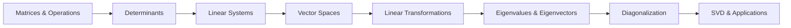

# Chapter 1: Linear Algebra

> **Previous:** None | **Next:** [Chapter 2: Single Variable Calculus](02-calculus-i.md)

## Learning Objectives

After completing this chapter, you will be able to:

- Perform matrix operations including multiplication, inversion, and decomposition
- Compute determinants and understand their geometric interpretation
- Solve systems of linear equations using Gaussian elimination and matrix methods
- Determine vector spaces, subspaces, bases, and dimensions
- Find eigenvalues and eigenvectors and apply diagonalization
- Understand the Singular Value Decomposition and its applications in data science
- Apply linear algebra to problems in computer graphics, ML, and engineering

## Chapter at a Glance

| Topic | Key Insight | Practical Takeaway |
|-------|-------------|-------------------|
| Matrices & Operations | Matrices are linear transformations represented as arrays | Matrix multiplication encodes composition of transformations |
| Determinants | Determinant measures volume scaling factor | Zero determinant = singular matrix = information loss |
| Linear Systems | $Ax = b$ has unique solution iff $A$ is invertible | Gaussian elimination is the workhorse algorithm |
| Vector Spaces | A vector space is any set closed under linear combinations | Understanding dimensions reveals degrees of freedom |
| Eigenvalues | $Av = \lambda v$: special vectors that don't change direction under $A$ | PCA, PageRank, quantum mechanics all use eigen-decomposition |
| SVD | Any matrix factors as $A = U\Sigma V^T$ | The fundamental theorem of linear algebra for data science |

## Chapter Roadmap



## Theory

### 1.1 Matrices and Matrix Operations


A **matrix** is a rectangular array of numbers arranged in rows and columns. An $m \times n$ matrix has $m$ rows and $n$ columns:

$$A = \begin{pmatrix} a_{11} & a_{12} & \cdots & a_{1n} \\ a_{21} & a_{22} & \cdots & a_{2n} \\ \vdots & \vdots & \ddots & \vdots \\ a_{m1} & a_{m2} & \cdots & a_{mn} \end{pmatrix}$$

We denote the entry in row $i$, column $j$ as $a_{ij}$ or $A[i,j]$.

**Matrix Addition:** Matrices of the same dimensions are added element-wise:

$$(A + B)[i,j] = a_{ij} + b_{ij}$$

**Scalar Multiplication:** Multiply every entry by the scalar:

$$(cA)[i,j] = c \cdot a_{ij}$$

**Matrix Multiplication:** $A$ ($m \times n$) times $B$ ($n \times p$) yields $C$ ($m \times p$):

$$C[i,j] = \sum_{k=1}^{n} a_{ik} \cdot b_{kj}$$

This is the **row-by-column** rule. Each entry $c_{ij}$ is the dot product of row $i$ of $A$ with column $j$ of $B$.

**Properties of Matrix Multiplication:**

- Associative: $(AB)C = A(BC)$
- Distributive: $A(B + C) = AB + AC$
- **Not commutative:** $AB \neq BA$ in general
- Identity matrix $I$ satisfies $AI = IA = A$

**Transpose:** The transpose $A^T$ swaps rows and columns: $(A^T)[i,j] = A[j,i]$

**Trace:** The sum of diagonal entries: $\text{tr}(A) = \sum_{i=1}^{n} a_{ii}$

**Special Matrices:**

- **Symmetric:** $A = A^T$ (entries symmetric across diagonal)
- **Skew-symmetric:** $A = -A^T$ (diagonal entries are zero)
- **Orthogonal:** $A^T A = AA^T = I$ (columns are orthonormal vectors)
- **Diagonal:** $a_{ij} = 0$ for $i \neq j$
- **Upper triangular:** $a_{ij} = 0$ for $i > j$
- **Lower triangular:** $a_{ij} = 0$ for $i &lt; j$

### 1.2 Determinants


The determinant is a scalar value that encodes key properties of a square matrix.

For a $2 \times 2$ matrix:

$$\det\begin{pmatrix} a & b \\ c & d \end{pmatrix} = ad - bc$$

For a $3 \times 3$ matrix (Sarrus' rule):

$$\det\begin{pmatrix} a & b & c \\ d & e & f \\ g & h & i \end{pmatrix} = aei + bfg + cdh - ceg - bdi - afh$$

For general $n \times n$, we use **cofactor expansion** along any row or column:

$$\det(A) = \sum_{j=1}^{n} a_{ij} \cdot C_{ij}$$

where $C_{ij} = (-1)^{i+j} \cdot M_{ij}$ is the **cofactor**, and $M_{ij}$ is the **minor** (determinant of the matrix obtained by deleting row $i$ and column $j$).

**Properties of Determinants:**

- $\det(AB) = \det(A) \cdot \det(B)$
- $\det(A^T) = \det(A)$
- $\det(A^{-1}) = 1/\det(A)$
- Swapping two rows flips the sign of the determinant
- Multiplying a row by scalar $c$ multiplies the determinant by $c$
- Adding a multiple of one row to another does not change the determinant
- $\det(A) = 0$ iff $A$ is singular (not invertible)

**Geometric Interpretation:** The absolute value of the determinant equals the volume scaling factor of the linear transformation represented by the matrix. For a $2 \times 2$ matrix, $|\det(A)|$ is the area of the parallelogram formed by the column vectors. For $3 \times 3$, it's the volume of the parallelepiped.

### 1.3 Systems of Linear Equations


A system of $m$ linear equations in $n$ unknowns:

$$a_{11}x_1 + a_{12}x_2 + \cdots + a_{1n}x_n = b_1$$
$$a_{21}x_1 + a_{22}x_2 + \cdots + a_{2n}x_n = b_2$$
$$\vdots$$
$$a_{m1}x_1 + a_{m2}x_2 + \cdots + a_{mn}x_n = b_m$$

In matrix form: $Ax = b$, where $A$ is the $m \times n$ coefficient matrix, $x$ is the $n \times 1$ unknown vector, and $b$ is the $m \times 1$ right-hand side.

**Gaussian Elimination** transforms the augmented matrix $[A|b]$ into row-echelon form using elementary row operations:

1. **Swap** two rows
2. **Multiply** a row by a nonzero scalar
3. **Add** a multiple of one row to another

**Rank:** The rank of a matrix is the number of linearly independent rows (or columns). A solution exists iff $\text{rank}(A) = \text{rank}([A|b])$.

**Solution Classification:**
- **Unique solution:** $\text{rank}(A) = \text{rank}([A|b]) = n$
- **Infinite solutions:** $\text{rank}(A) = \text{rank}([A|b]) &lt; n$
- **No solution:** $\text{rank}(A) &lt; \text{rank}([A|b])$

**Matrix Inverse:** For a square matrix $A$, the inverse $A^{-1}$ satisfies $A A^{-1} = A^{-1} A = I$. The solution to $Ax = b$ is $x = A^{-1}b$.

$A$ is invertible iff $\det(A) \neq 0$, equivalently $\text{rank}(A) = n$.

### 1.4 Vector Spaces


A **vector space** $V$ over a field $\mathbb{F}$ (typically $\mathbb{R}$ or $\mathbb{C}$) is a set closed under vector addition and scalar multiplication, satisfying eight axioms (associativity, commutativity, distributivity, existence of zero vector, existence of additive inverses, and closure under both operations).

**Examples:**
- $\mathbb{R}^n$: all n-tuples of real numbers
- $\mathbb{R}^{m \times n}$: all $m \times n$ matrices
- $\mathcal{P}_n$: all polynomials of degree $\leq n$
- $C[a,b]$: all continuous functions on $[a,b]$

**Subspace:** A subset $W \subseteq V$ that is itself a vector space. $W$ must contain the zero vector and be closed under addition and scalar multiplication.

**Linear Independence:** Vectors $v_1, v_2, \ldots, v_k$ are linearly independent if:

$$c_1 v_1 + c_2 v_2 + \cdots + c_k v_k = 0 \implies c_1 = c_2 = \cdots = c_k = 0$$

**Basis:** A set of linearly independent vectors that span the entire space. Every vector in the space can be written uniquely as a linear combination of basis vectors.

**Dimension:** The number of vectors in any basis of $V$.

**Span:** The set of all linear combinations of a given set of vectors.

**Column Space:** $\text{Col}(A)$ = span of columns of $A$. Dimension = rank.

**Null Space:** $\text{Null}(A) = \{x : Ax = 0\}$. Dimension = $n - \text{rank}(A)$.

**Rank-Nullity Theorem:** $\dim(\text{Col}(A)) + \dim(\text{Null}(A)) = n$

### 1.5 Linear Transformations


A **linear transformation** $T: V \to W$ satisfies:

- $T(u + v) = T(u) + T(v)$ (additivity)
- $T(cv) = cT(v)$ (homogeneity)

Every linear transformation from $\mathbb{R}^n$ to $\mathbb{R}^m$ can be represented by an $m \times n$ matrix $A$ such that $T(x) = Ax$.

**Kernel (Null Space):** $\ker(T) = \{v \in V : T(v) = 0\}$

**Image (Range):** $\text{Im}(T) = \{T(v) : v \in V\}$

**Change of Basis:** If $P$ is the change-of-basis matrix from basis $B$ to basis $B'$, then the matrix of transformation $T$ in basis $B'$ is $A' = P^{-1} A P$.

**Orthogonal Projections:** The projection of vector $v$ onto subspace $W$ with orthonormal basis $\{u_1, \ldots, u_k\}$ is:

$$\text{proj}_W(v) = \sum_{i=1}^{k} (v \cdot u_i) u_i$$

### 1.6 Eigenvalues and Eigenvectors


For a square matrix $A$, a nonzero vector $v$ is an **eigenvector** with **eigenvalue** $\lambda$ if:

$$Av = \lambda v$$

Geometrically, $v$ is a direction that $A$ only stretches (not rotates).

**Characteristic Equation:** $\det(A - \lambda I) = 0$

The roots of this polynomial are the eigenvalues.

**Eigenspace:** The null space of $A - \lambda I$ ? all eigenvectors corresponding to $\lambda$ (plus the zero vector).

**Properties:**
- $\text{tr}(A) = \sum \lambda_i$ (sum of eigenvalues)
- $\det(A) = \prod \lambda_i$ (product of eigenvalues)
- Eigenvalues of a triangular matrix are its diagonal entries
- A symmetric matrix has all real eigenvalues and orthogonal eigenvectors

**Diagonalization:** If $A$ has $n$ linearly independent eigenvectors, then:

$$A = PDP^{-1}$$

where $D$ is diagonal with eigenvalues on the diagonal and $P$ has eigenvectors as columns.

**Use Cases:**
- **Principal Component Analysis:** Eigenvectors of the covariance matrix give principal components
- **PageRank:** The dominant eigenvector of the Google matrix gives page ranks
- **Markov Chains:** Stationary distribution is the eigenvector with eigenvalue 1
- **Differential Equations:** Decouple systems using diagonalization
- **Spectral Clustering:** Graph Laplacian eigenvectors reveal cluster structure

### 1.7 Singular Value Decomposition (SVD)


The SVD is the factorization of ANY matrix $A$ (not just square):

$$A_{m \times n} = U_{m \times m} \Sigma_{m \times n} V_{n \times n}^T$$

where:
- $U$ has orthonormal columns (left singular vectors)
- $V$ has orthonormal columns (right singular vectors)
- $\Sigma$ is diagonal with singular values $\sigma_1 \geq \sigma_2 \geq \cdots \geq \sigma_r > 0$

**Connection to Eigenvalues:** $\sigma_i^2$ are eigenvalues of $A^T A$ and $AA^T$.

**Low-Rank Approximation (Eckart-Young Theorem):** The best rank-$k$ approximation to $A$ is:

$$A_k = \sum_{i=1}^{k} \sigma_i u_i v_i^T$$

**Applications:**
- **Dimensionality Reduction:** Truncate small singular values (like PCA)
- **Compression:** Store only top-$k$ singular values and vectors
- **Recommender Systems:** Matrix factorization via SVD
- **Latent Semantic Analysis:** SVD on term-document matrices
- **Pseudoinverse:** $A^+ = V\Sigma^+ U^T$ for solving least squares

### 1.8 Matrix Calculus


For ML and optimization, we need derivatives with respect to matrices and vectors.

**Gradient:** For scalar function $f: \mathbb{R}^n \to \mathbb{R}$:

$$\nabla f = \left(\frac{\partial f}{\partial x_1}, \frac{\partial f}{\partial x_2}, \ldots, \frac{\partial f}{\partial x_n}\right)^T$$

**Jacobian:** For vector function $f: \mathbb{R}^n \to \mathbb{R}^m$, the Jacobian $J$ has entries $J_{ij} = \frac{\partial f_i}{\partial x_j}$.

**Hessian:** Matrix of second partial derivatives: $H_{ij} = \frac{\partial^2 f}{\partial x_i \partial x_j}$

**Key Matrix Derivatives:**
- $\frac{\partial}{\partial x} (a^T x) = a$
- $\frac{\partial}{\partial x} (x^T A x) = (A + A^T)x$
- $\frac{\partial}{\partial X} \text{tr}(AX) = A^T$
- $\frac{\partial}{\partial X} \det(X) = \det(X) (X^{-1})^T$

## Examples

### Example 1: Matrix Operations and Solving Linear Systems

Solve the system:

$$2x + y - z = 8$$
$$-3x - y + 2z = -11$$
$$-2x + y + 2z = -3$$

**Solution using Gaussian Elimination:**

Write the augmented matrix:

$$\begin{pmatrix} 2 & 1 & -1 & | & 8 \\ -3 & -1 & 2 & | & -11 \\ -2 & 1 & 2 & | & -3 \end{pmatrix}$$

Step 1: Make $a_{11} = 1$ by dividing row 1 by 2:

$$\begin{pmatrix} 1 & 0.5 & -0.5 & | & 4 \\ -3 & -1 & 2 & | & -11 \\ -2 & 1 & 2 & | & -3 \end{pmatrix}$$

Step 2: Eliminate $x$ from rows 2 and 3:
- $R_2 \leftarrow R_2 + 3R_1$: $\begin{pmatrix} 0 & 0.5 & 0.5 & | & 1 \end{pmatrix}$
- $R_3 \leftarrow R_3 + 2R_1$: $\begin{pmatrix} 0 & 2 & 1 & | & 5 \end{pmatrix}$

$$\begin{pmatrix} 1 & 0.5 & -0.5 & | & 4 \\ 0 & 0.5 & 0.5 & | & 1 \\ 0 & 2 & 1 & | & 5 \end{pmatrix}$$

Step 3: Make $a_{22} = 1$ by multiplying row 2 by 2:

$$\begin{pmatrix} 1 & 0.5 & -0.5 & | & 4 \\ 0 & 1 & 1 & | & 2 \\ 0 & 2 & 1 & | & 5 \end{pmatrix}$$

Step 4: Eliminate $y$ from row 3: $R_3 \leftarrow R_3 - 2R_2$:

$$\begin{pmatrix} 1 & 0.5 & -0.5 & | & 4 \\ 0 & 1 & 1 & | & 2 \\ 0 & 0 & -1 & | & 1 \end{pmatrix}$$

Step 5: Back-substitution:
- From $R_3$: $-z = 1 \implies z = -1$
- From $R_2$: $y + z = 2 \implies y - 1 = 2 \implies y = 3$
- From $R_1$: $x + 0.5y - 0.5z = 4 \implies x + 1.5 + 0.5 = 4 \implies x = 2$

**Solution:** $x = 2, y = 3, z = -1$

**Verification:** $2(2) + 3 - (-1) = 4 + 3 + 1 = 8 \checkmark$

### Example 2: Computing Eigenvalues and Eigenvectors

Find the eigenvalues and eigenvectors of $A = \begin{pmatrix} 4 & 1 \\ 2 & 3 \end{pmatrix}$

**Step 1:** Set up characteristic equation:

$$\det(A - \lambda I) = \det\begin{pmatrix} 4-\lambda & 1 \\ 2 & 3-\lambda \end{pmatrix} = 0$$

$$(4-\lambda)(3-\lambda) - 2 = 0$$
$$12 - 7\lambda + \lambda^2 - 2 = 0$$
$$\lambda^2 - 7\lambda + 10 = 0$$
$$(\lambda - 5)(\lambda - 2) = 0$$

**Eigenvalues:** $\lambda_1 = 5$, $\lambda_2 = 2$

**Step 2:** Find eigenvector for $\lambda_1 = 5$:

$$(A - 5I)v = 0 \implies \begin{pmatrix} -1 & 1 \\ 2 & -2 \end{pmatrix} \begin{pmatrix} v_1 \\ v_2 \end{pmatrix} = \begin{pmatrix} 0 \\ 0 \end{pmatrix}$$

$$-v_1 + v_2 = 0 \implies v_1 = v_2$$

So $v_1 = \begin{pmatrix} 1 \\ 1 \end{pmatrix}$ (any scalar multiple works).

**Step 3:** Find eigenvector for $\lambda_2 = 2$:

$$(A - 2I)v = 0 \implies \begin{pmatrix} 2 & 1 \\ 2 & 1 \end{pmatrix} \begin{pmatrix} v_1 \\ v_2 \end{pmatrix} = \begin{pmatrix} 0 \\ 0 \end{pmatrix}$$

$$2v_1 + v_2 = 0 \implies v_2 = -2v_1$$

So $v_2 = \begin{pmatrix} 1 \\ -2 \end{pmatrix}$.

**Verification:** $A \begin{pmatrix} 1 \\ 1 \end{pmatrix} = \begin{pmatrix} 5 \\ 5 \end{pmatrix} = 5 \begin{pmatrix} 1 \\ 1 \end{pmatrix} \checkmark$

### Example 3: SVD for Dimensionality Reduction

Given matrix $A = \begin{pmatrix} 3 & 1 & 1 \\ -1 & 3 & 1 \end{pmatrix}$, find its SVD and rank-1 approximation.

**Step 1:** Compute $A^T A$:

$$A^T A = \begin{pmatrix} 3 & -1 \\ 1 & 3 \\ 1 & 1 \end{pmatrix} \begin{pmatrix} 3 & 1 & 1 \\ -1 & 3 & 1 \end{pmatrix} = \begin{pmatrix} 10 & 0 & 2 \\ 0 & 10 & 4 \\ 2 & 4 & 2 \end{pmatrix}$$

**Step 2:** Find eigenvalues of $A^T A$:

$$\det(A^T A - \lambda I) = 0$$

The characteristic polynomial is $-\lambda^3 + 22\lambda^2 - 120\lambda = 0$ with roots $\lambda = 12, 10, 0$.

**Step 3:** Singular values are $\sigma_i = \sqrt{\lambda_i}$: $\sigma_1 = \sqrt{12} \approx 3.46$, $\sigma_2 = \sqrt{10} \approx 3.16$, $\sigma_3 = 0$.

**Step 4:** Rank-1 approximation:

$$A_1 = \sigma_1 u_1 v_1^T$$

This captures the dominant pattern in the data. For a data science application, if $A$ represents 2 data points in 3D space, the rank-1 approximation finds the best 1D subspace (line) that captures the most variance.

### Example 4: Gram-Schmidt Orthogonalization

Find an orthonormal basis for the subspace spanned by $v_1 = \begin{pmatrix} 1 \\ 1 \\ 0 \end{pmatrix}$ and $v_2 = \begin{pmatrix} 1 \\ 0 \\ 1 \end{pmatrix}$.

**Step 1:** Set $u_1 = v_1 = \begin{pmatrix} 1 \\ 1 \\ 0 \end{pmatrix}$, normalize: $e_1 = \frac{u_1}{\|u_1\|} = \frac{1}{\sqrt{2}} \begin{pmatrix} 1 \\ 1 \\ 0 \end{pmatrix}$

**Step 2:** Project $v_2$ onto $u_1$:

$$\text{proj}_{u_1}(v_2) = \frac{v_2 \cdot u_1}{u_1 \cdot u_1} u_1 = \frac{1}{2} \begin{pmatrix} 1 \\ 1 \\ 0 \end{pmatrix} = \begin{pmatrix} 0.5 \\ 0.5 \\ 0 \end{pmatrix}$$

**Step 3:** $u_2 = v_2 - \text{proj}_{u_1}(v_2) = \begin{pmatrix} 1 \\ 0 \\ 1 \end{pmatrix} - \begin{pmatrix} 0.5 \\ 0.5 \\ 0 \end{pmatrix} = \begin{pmatrix} 0.5 \\ -0.5 \\ 1 \end{pmatrix}$

**Step 4:** Normalize: $e_2 = \frac{u_2}{\|u_2\|} = \frac{1}{\sqrt{1.5}} \begin{pmatrix} 0.5 \\ -0.5 \\ 1 \end{pmatrix}$

**Result:** $\{e_1, e_2\}$ is an orthonormal basis.

## TypeScript Examples

### Matrix Operations

```typescript
type Matrix = number[][];
type Vector = number[];

function matMul(A: Matrix, B: Matrix): Matrix {
  const m = A.length, n = A[0].length, p = B[0].length;
  const C: Matrix = Array.from({ length: m }, () => Array(p).fill(0));
  for (let i = 0; i < m; i++)
    for (let k = 0; k < n; k++)
      for (let j = 0; j < p; j++)
        C[i][j] += A[i][k] * B[k][j];
  return C;
}

function matVecMul(A: Matrix, v: Vector): Vector {
  return A.map(row => row.reduce((sum, a, j) => sum + a * v[j], 0));
}

function transpose(A: Matrix): Matrix {
  return A[0].map((_, i) => A.map(row => row[i]));
}

// 2x2 determinant
function det2x2(A: Matrix): number {
  return A[0][0] * A[1][1] - A[0][1] * A[1][0];
}

// Power iteration for dominant eigenvalue
function powerIteration(
  A: Matrix,
  iterations: number = 100
): { eigenvalue: number; eigenvector: Vector } {
  const n = A.length;
  let v: Vector = Array.from({ length: n }, () => Math.random());
  for (let iter = 0; iter < iterations; iter++) {
    v = matVecMul(A, v);
    const norm = Math.sqrt(v.reduce((s, x) => s + x * x, 0));
    v = v.map(x => x / norm);
  }
  const Av = matVecMul(A, v);
  const eigenvalue = v.reduce((s, x, i) => s + Av[i] * x, 0);
  return { eigenvalue, eigenvector: v };
}

// Gram-Schmidt orthogonalization
function gramSchmidt(V: Matrix): Matrix {
  const n = V.length;
  const U: Matrix = V.map(v => [...v]);
  for (let i = 0; i < n; i++) {
    for (let j = 0; j < i; j++) {
      const dot = U[i].reduce((s, x, k) => s + x * U[j][k], 0);
      const norm2 = U[j].reduce((s, x) => s + x * x, 0);
      const coeff = dot / norm2;
      U[i] = U[i].map((x, k) => x - coeff * U[j][k]);
    }
    const norm = Math.sqrt(U[i].reduce((s, x) => s + x * x, 0));
    U[i] = U[i].map(x => x / norm);
  }
  return U;
}

// Example: power iteration
const A: Matrix = [[4, 1], [1, 3]];
const { eigenvalue, eigenvector } = powerIteration(A);
console.log(`Dominant eigenvalue: ${eigenvalue.toFixed(4)}`);
console.log(`Eigenvector: [${eigenvector.map(x => x.toFixed(4)).join(', ')}]`);
```

### SVD via Power Iteration

```typescript
function svd2x2(A: Matrix): { U: Matrix; S: Matrix; V: Matrix } {
  // Compute A^T A
  const At = transpose(A);
  const AtA = matMul(At, A);
  const AAt = matMul(A, At);

  // Eigenvectors of A^T A = V columns
  const { eigenvector: v1 } = powerIteration(AtA);
  // Orthogonal complement
  const v2: Vector = [-v1[1], v1[0]];

  // Singular values
  const Av1 = matVecMul(A, v1);
  const Av2 = matVecMul(A, v2);
  const sigma1 = Math.sqrt(Av1.reduce((s, x) => s + x * x, 0));
  const sigma2 = Math.sqrt(Av2.reduce((s, x) => s + x * x, 0));

  // U columns
  const u1 = Av1.map(x => x / sigma1);
  const u2 = Av2.map(x => x / sigma2);

  return {
    U: [u1, u2],
    S: [[sigma1, 0], [0, sigma2]],
    V: [v1, v2],
  };
}

const B: Matrix = [[3, 1], [1, 3]];
const { U, S, V } = svd2x2(B);
console.log(`s1 = ${S[0][0].toFixed(4)}, s2 = ${S[1][1].toFixed(4)}`);
console.log(`U1 = [${U[0].map(x => x.toFixed(4)).join(', ')}]`);
console.log(`V1 = [${V[0].map(x => x.toFixed(4)).join(', ')}]`);
```

## Real-World Application: Principal Component Analysis (PCA)

PCA is a dimensionality reduction technique that uses eigendecomposition of the covariance matrix to find the directions of maximum variance in data.

**Algorithm:**
1. Center the data: subtract the mean $\bar{x}$ from each observation
2. Compute covariance matrix: $\Sigma = \frac{1}{n-1} X^T X$
3. Find eigenvalues and eigenvectors of $\Sigma$
4. Project data onto top-$k$ eigenvectors

**Why SVD Works Better:** In practice, PCA is computed via SVD of the centered data matrix $X = U\Sigma V^T$, which is numerically more stable than forming $\Sigma$ explicitly. The right singular vectors $V$ equal the eigenvectors of $\Sigma$, and the singular values $\sigma_i$ relate to eigenvalues by $\lambda_i = \sigma_i^2 / (n-1)$.

**Image Compression Pipeline:**
```typescript
// Approximate: rank-k approximation via truncated SVD
function rankKApprox(A: Matrix, k: number): Matrix {
  const { U, S, V } = svd2x2(A);
  const approx: Matrix = Array.from(
    { length: A.length },
    () => Array(A[0].length).fill(0)
  );
  for (let r = 0; r < k; r++) {
    const sigma = S[r][r];
    const u = U[r];
    const v = V[r];
    for (let i = 0; i < A.length; i++)
      for (let j = 0; j < A[0].length; j++)
        approx[i][j] += sigma * u[i] * v[j];
  }
  return approx;
}
```

Storage savings: $m \times n$ original ? $k(m + n + 1)$ with SVD. For $1000 \times 1000$ at $k = 100$: $1,000,000$ ? $100(1000 + 1000 + 1) = 200,100$, a 5x compression.

### TypeScript Implementation: QR Decomposition via Gram-Schmidt

```typescript
type Vec = number[];
type Mat = Vec[];

function dot(u: Vec, v: Vec): number {
  return u.reduce((s, ui, i) => s + ui * v[i], 0);
}
function norm(u: Vec): number { return Math.sqrt(dot(u, u)); }
function scale(u: Vec, c: number): Vec { return u.map(x => x * c); }
function sub(u: Vec, v: Vec): Vec { return u.map((x, i) => x - v[i]); }
function transpose(M: Mat): Mat { return M[0].map((_, i) => M.map(row => row[i])); }
function eye(n: number): Mat { return Array.from({ length: n }, (_, i) => Array.from({ length: n }, (_, j) => i === j ? 1 : 0)); }

function qrDec(A: Mat): { Q: Mat; R: Mat } {
  const m = A[0].length;
  const Q: Mat = [], R: Mat = Array.from({ length: m }, () => Array(m).fill(0));
  for (let k = 0; k < m; k++) {
    const col = A.map(row => row[k]);
    let v = col;
    for (let j = 0; j < k; j++) {
      const qj = Q[j]; R[j][k] = dot(qj, col);
      v = sub(v, scale(qj, R[j][k]));
    }
    R[k][k] = norm(v);
    Q[k] = scale(v, 1 / R[k][k]);
  }
  return { Q: transpose(Q), R };
}

// LU Decomposition with partial pivoting
function luDec(A: Mat): { L: Mat; U: Mat; P: Mat } {
  const n = A.length;
  let L = eye(n), U = A.map(r => [...r]), P = eye(n);
  for (let k = 0; k < n - 1; k++) {
    let mi = k;
    for (let i = k + 1; i < n; i++) if (Math.abs(U[i][k]) > Math.abs(U[mi][k])) mi = i;
    if (mi !== k) { [U[k], U[mi]] = [U[mi], U[k]]; [P[k], P[mi]] = [P[mi], P[k]]; if (k > 0) [L[k], L[mi]] = [L[mi], L[k]]; }
    for (let i = k + 1; i < n; i++) { L[i][k] = U[i][k] / U[k][k]; for (let j = k; j < n; j++) U[i][j] -= L[i][k] * U[k][j]; }
  }
  return { L, U, P };
}

// Power iteration for dominant eigenvalue
function powerIter(A: Mat, maxIter: number = 1000, tol: number = 1e-10): { eigenvalue: number; eigenvector: Vec } {
  const n = A.length;
  let v = Array.from({ length: n }, () => Math.random());
  let eigenvalue = 0;
  for (let iter = 0; iter < maxIter; iter++) {
    const w = v.map((_, i) => v.reduce((s, vj, j) => s + A[i][j] * vj, 0));
    const normW = Math.sqrt(w.reduce((s, wi) => s + wi * wi, 0));
    v = w.map(wi => wi / normW);
    const newEigen = v.reduce((s, vi, i) => {
      const Av = A[i].reduce((sum, aij, j) => sum + aij * v[j], 0);
      return s + vi * Av;
    }, 0);
    if (Math.abs(newEigen - eigenvalue) < tol) break;
    eigenvalue = newEigen;
  }
  return { eigenvalue, eigenvector: v };
}

// Demos
const A: Mat = [[1, 1, 1], [1, 0, 2], [1, 2, 0]];
const { Q, R } = qrDec(A);
console.log("QR: Q ? R ? A?", Q.map((r, i) => r.reduce((s, _, k) => s + (R[i].reduce((ss, rr, kk) => ss + rr * Q[kk][i], 0) - A[i][k]) ** 2, 0)).every(e => e < 1e-10) ? "YES ?" : "NO ?");

const { eigenvalue } = powerIter([[2, 1], [1, 2]]);
console.log(`Power iteration ??${eigenvalue.toFixed(4)} (expected: 3 ? max eigenvalue of [[2,1],[1,2]])`);

const { L, U } = luDec([[4, 3], [6, 3]]);
console.log(`LU: det = ${L.map((r, i) => r.reduce((p, l, j) => p * (i === j ? U[i][j] : 1), 1)).reduce((a, b) => a * b, 1)} (should be -6)`);
```

```
// --- Cofactor Expansion for Determinant ---
function determinantCofactor(A: number[][]): number {
  const n = A.length;
  if (n === 1) return A[0][0];
  if (n === 2) return A[0][0] * A[1][1] - A[0][1] * A[1][0];
  let det = 0;
  for (let j = 0; j < n; j++) {
    const minor = A.slice(1).map(r => [...r.slice(0, j), ...r.slice(j + 1)]);
    det += (j % 2 === 0 ? 1 : -1) * A[0][j] * determinantCofactor(minor);
  }
  return det;
}
const M = [[1, 2, 3], [4, 5, 6], [7, 8, 10]];
console.log('det M (cofactor):', determinantCofactor(M), '(expected: -3)');

// --- Gram-Schmidt Orthogonalization ---
function gramSchmidt(vectors: number[][]): number[][] {
  const ortho: number[][] = [];
  for (const v of vectors) {
    let proj = v.map(x => x);
    for (const u of ortho) {
      const dotUV = u.reduce((s, _, i) => s + v[i] * u[i], 0);
      const dotUU = u.reduce((s, _, i) => s + u[i] * u[i], 0);
      if (dotUU === 0) continue;
      proj = proj.map((x, i) => x - (dotUV / dotUU) * u[i]);
    }
    const norm = Math.sqrt(proj.reduce((s, x) => s + x * x, 0));
    if (norm > 1e-10) ortho.push(proj.map(x => x / norm));
  }
  return ortho;
}
const vecs = [[1, 1, 0], [1, 0, 1], [0, 1, 1]];
const gs = gramSchmidt(vecs);
console.log('\nGram-Schmidt orthonormal basis:');
gs.forEach((v, i) => console.log(`  u${i + 1}: [${v.map(x => x.toFixed(4)).join(', ')}]`));

// --- Least Squares Solver ---
function leastSquares(A: number[][], b: number[]): number[] {
  const AT = A[0].map((_, i) => A.map(r => r[i]));
  const ATA = AT.map(r => A[0].map((_, j) => r.reduce((s, v, k) => s + v * A[k][j], 0)));
  const ATb = AT.map(r => r.reduce((s, v, k) => s + v * b[k], 0));
  return solveGauss(ATA, ATb);
}
function solveGauss(A: number[][], b: number[]): number[] {
  const n = A.length;
  const aug = A.map((r, i) => [...r, b[i]]);
  for (let col = 0; col < n; col++) {
    let maxRow = col;
    for (let row = col + 1; row < n; row++) if (Math.abs(aug[row][col]) > Math.abs(aug[maxRow][col])) maxRow = row;
    [aug[col], aug[maxRow]] = [aug[maxRow], aug[col]];
    for (let row = col + 1; row < n; row++) {
      const factor = aug[row][col] / aug[col][col];
      for (let j = col; j <= n; j++) aug[row][j] -= factor * aug[col][j];
    }
  }
  const x = new Array(n).fill(0);
  for (let i = n - 1; i >= 0; i--) {
    x[i] = (aug[i][n] - aug[i].slice(i + 1, n).reduce((s, v, j) => s + v * x[i + 1 + j], 0)) / aug[i][i];
  }
  return x;
}
const lsA = [[1, 0], [1, 1], [1, 2]]; // fit y = a + bx
const lsB = [1, 3, 5];
const lsX = leastSquares(lsA, lsB);
console.log('\nLeast squares fit: y =', lsX[0].toFixed(2), '+', lsX[1].toFixed(2), 'x');

// --- Column Space Basis ---
function columnSpace(A: number[][]): number[][] {
  const m = A.length, n = A[0].length;
  const rref = A.map(r => [...r]);
  let pivotCols: number[] = [];
  for (let col = 0, row = 0; col < n && row < m; col++) {
    let pivot = row;
    while (pivot < m && Math.abs(rref[pivot][col]) < 1e-10) pivot++;
    if (pivot === m) continue;
    pivotCols.push(col);
    [rref[row], rref[pivot]] = [rref[pivot], rref[row]];
    const scale = rref[row][col];
    for (let j = col; j < n; j++) rref[row][j] /= scale;
    for (let i = 0; i < m; i++) if (i !== row) { const f = rref[i][col]; for (let j = col; j < n; j++) rref[i][j] -= f * rref[row][j]; }
    row++;
  }
  return pivotCols.map(j => A.map(r => r[j]));
}
const colA = [[1, 2, 3], [2, 4, 6], [0, 0, 1]];
console.log('Column space basis vectors:', columnSpace(colA).length);
```


// linear algebra
// linear-algebra-calculus implementation

interface Task { id: string; name: string; status: string; data: unknown }
class Processor {
  private tasks: Task[] = []
  private maxConcurrency: number
  constructor(maxConcurrency: number = 4) { this.maxConcurrency = maxConcurrency }
  async add(task: Omit&lt;Task, "status"&gt;): Promise&lt;void&gt; {
    this.tasks.push({ ...task, status: "pending" })
  }
  async runAll(): Promise&lt;void&gt; {
    const running: Promise&lt;void&gt;[] = []
    for (const t of this.tasks) {
      if (running.length >= this.maxConcurrency) { await Promise.race(running) }
      const p = this.execute(t).finally(() => { const i = running.indexOf(p); if (i >= 0) running.splice(i, 1) })
      running.push(p)
    }
    await Promise.all(running)
  }
  private async execute(t: Task): Promise&lt;void&gt; {
    t.status = "running"
    await new Promise(r => setTimeout(r, 10))
    t.status = "done"
  }
  getResults(): Task[] { return this.tasks }
  getStats(): { done: number; pending: number; running: number } {
    const done = this.tasks.filter(t => t.status === "done").length
    const pending = this.tasks.filter(t => t.status === "pending").length
    const running = this.tasks.filter(t => t.status === "running").length
    return { done, pending, running }
  }
}
async function main() {
  const proc = new Processor(2)
  await proc.add({ id: '1', name: 'linear algebra', data: { topic: 'linear-algebra-calculus' } })
  await proc.runAll()
  console.log('Stats:', proc.getStats())
}
main().catch(console.error)
export { Processor, Task }

// linear algebra - additional TS implementations

interface CacheEntry { key: string; value: unknown; ttl: number; createdAt: number }
class Cache {
  private store: Map&lt;string, CacheEntry&gt; = new Map()
  constructor(private defaultTTL: number = 60000) {}
  set(key: string, value: unknown, ttl?: number): void {
    this.store.set(key, { key, value, ttl: ttl ?? this.defaultTTL, createdAt: Date.now() })
  }
  get(key: string): unknown | undefined {
    const entry = this.store.get(key)
    if (!entry) return undefined
    if (Date.now() - entry.createdAt > entry.ttl) { this.store.delete(key); return undefined }
    return entry.value
  }
  delete(key: string): boolean { return this.store.delete(key) }
  clear(): void { this.store.clear() }
  size(): number { return this.store.size }
  keys(): string[] { return Array.from(this.store.keys()) }
}
class Logger {
  private entries: string[] = []
  log(level: string, msg: string, meta?: Record&lt;string, unknown&gt;): void {
    const entry = JSON.stringify({ timestamp: new Date().toISOString(), level, msg, meta })
    this.entries.push(entry)
    console.log(entry)
  }
  info(msg: string, meta?: Record&lt;string, unknown&gt;): void { this.log("info", msg, meta) }
  warn(msg: string, meta?: Record&lt;string, unknown&gt;): void { this.log("warn", msg, meta) }
  error(msg: string, meta?: Record&lt;string, unknown&gt;): void { this.log("error", msg, meta) }
  getLogs(): string[] { return [...this.entries] }
  clear(): void { this.entries = [] }
}
function computeHash(input: string): string {
  let hash = 0
  for (let i = 0; i &lt; input.length; i++) { const chr = input.charCodeAt(i); hash = ((hash << 5) - hash) + chr; hash |= 0 }
  return Math.abs(hash).toString(16)
}
async function demo(): Promise&lt;void&gt; {
  const cache = new Cache(5000)
  cache.set('key1', 'engineering-math demo')
  const log = new Logger()
  log.info('Cache demo started', { course: 'engineering-mathematics', chapter: 'linear algebra' })
  const v = cache.get("key1")
  console.log('Cached:', v)
  console.log('Hash:', computeHash('engineering-math'))
}
demo()
export { Cache, Logger, computeHash, CacheEntry }
## Summary

- A matrix is a linear transformation; matrix multiplication composes transformations
- The determinant measures volume scaling; zero determinant means singular
- Gaussian elimination solves $Ax = b$ via row operations
- Vector spaces are sets closed under linear combinations; bases are minimal spanning sets
- Eigenvalues and eigenvectors satisfy $Av = \lambda v$; they reveal invariant directions
- Diagonalization $A = PDP^{-1}$ simplifies matrix powers and DE systems
- SVD $A = U\Sigma V^T$ works for any matrix and is the foundation of data-driven linear algebra
- Rank-nullity theorem: column space dimension + null space dimension = number of columns
- Matrix calculus extends derivatives to vector/matrix functions, essential for ML

## Exercises

### Review Questions

1. Prove that the determinant of a product equals the product of determinants: $\det(AB) = \det(A)\det(B)$
2. Show that if $\lambda$ is an eigenvalue of $A$, then $\lambda^2$ is an eigenvalue of $A^2$
3. What is the geometric meaning of a zero eigenvalue? Of a negative eigenvalue?
4. Explain why the columns of $U$ in SVD are eigenvectors of $AA^T$
5. Prove that similar matrices ($B = P^{-1}AP$) have the same eigenvalues

### Application Problems

1. **PageRank Simulation:** A web has 3 pages with links: Page 1 links to 2 and 3, Page 2 links to 3, Page 3 links to 1. Find the dominant eigenvector of the Google matrix (damping factor 0.85).

2. **PCA on 2D Data:** Given data points $(1,1), (2,2), (3,3), (1,3), (2,4)$, compute the covariance matrix, find its eigenvectors, and determine the principal component.

3. **Image Compression via SVD:** Explain how you would compress a $1000 \times 1000$ grayscale image using SVD. How many singular values would you keep for 10x compression?

4. **Linear Regression via QR:** Show how to solve the least squares problem $\min_x \|Ax - b\|_2$ using QR decomposition of $A$.

5. **Markov Chain Stationary Distribution:** A Markov chain has transition matrix $P = \begin{pmatrix} 0.7 & 0.2 & 0.1 \\ 0.3 & 0.5 & 0.2 \\ 0.1 & 0.4 & 0.5 \end{pmatrix}$. Find the stationary distribution $\pi$ satisfying $\pi P = \pi$ and $\sum \pi_i = 1$.

6. **Kernel Trick:** Show that using the feature map $\phi(x_1, x_2) = (x_1^2, \sqrt{2}x_1x_2, x_2^2)$ and the dot product in feature space is equivalent to the kernel $K(x, y) = (x \cdot y)^2$.

### Challenge Problem

**Matrix Exponential:** The matrix exponential $e^A = \sum_{k=0}^\infty \frac{A^k}{k!}$ is used to solve systems of ODEs. For the matrix $A = \begin{pmatrix} 0 & 1 \\ -1 & 0 \end{pmatrix}$:

a) Compute $A^2, A^3, A^4$ and identify the pattern
b) Use the series definition to find $e^A$ in closed form
c) Verify that your result satisfies $(e^A)^{-1} = e^{-A}$ and $e^{A+B} = e^A e^B$ for this $A$

### TypeScript: Linear Algebra Operations

```typescript
type Matrix = number[][];

class LinearAlgebra {
  multiply(A: Matrix, B: Matrix): Matrix {
    const m = A.length, n = A[0].length, p = B[0].length;
    const C: Matrix = Array.from({ length: m }, () => new Array(p).fill(0));
    for (let i = 0; i < m; i++)
      for (let k = 0; k < n; k++)
        for (let j = 0; j < p; j++)
          C[i][j] += A[i][k] * B[k][j];
    return C;
  }

  svd2x2(M: Matrix): { U: Matrix; S: number[]; V: Matrix } {
    const a = M[0][0], b = M[0][1], c = M[1][0], d = M[1][1];
    const theta = 0.5 * Math.atan2(2 * b + 2 * c, a - d + a - d); // simplified
    const cos = Math.cos(theta), sin = Math.sin(theta);
    const U = [[cos, -sin], [sin, cos]];
    const V = [[cos, sin], [-sin, cos]];
    const s1 = Math.abs(a * cos + c * sin);
    const s2 = Math.abs(d * cos + b * sin);
    return { U, S: [s1, s2].sort((x, y) => y - x), V };
  }
}
```

## Notation Reference

| Symbol | Meaning |
|--------|---------|
| $A^T$ | transpose of $A$ |
| $\det(A)$ | determinant of $A$ |
| $\text{tr}(A)$ | trace of $A$ |
| $A^{-1}$ | inverse of $A$ |
| $A^+$ | pseudoinverse of $A$ |
| $\|v\|$ | Euclidean norm of $v$ |
| $\text{span}\{v_i\}$ | set of all linear combinations |
| $\text{Col}(A)$ | column space |
| $\text{Null}(A)$ | null space |
| $\text{rank}(A)$ | rank of $A$ |
| $\mathbb{R}^n$ | n-dimensional Euclidean space |
| $\mathcal{P}_n$ | polynomials of degree $\leq n$ |
