# Chapter 3: Multivariable Calculus

> **Previous:** [Chapter 2: Single Variable Calculus](02-calculus-i.md) | **Next:** [Chapter 4: Differential Equations](04-differential-equations.md)

## Learning Objectives

After completing this chapter, you will be able to:

- Compute partial derivatives and interpret them geometrically
- Find gradients, directional derivatives, and use them for optimization in multiple dimensions
- Evaluate multiple integrals in Cartesian, polar, cylindrical, and spherical coordinates
- Apply change of variables (Jacobian) for coordinate transformations
- Understand and compute divergence and curl of vector fields
- Apply multivariable calculus to machine learning optimization and physics

## Chapter at a Glance

| Topic | Key Insight | Practical Takeaway |
|-------|-------------|-------------------|
| Partial Derivatives | Derivative with respect to one variable, holding others constant | Computing gradients in ML |
| Gradient | $\nabla f$ points in the direction of steepest ascent | Gradient descent for optimization |
| Multiple Integrals | $\iint f(x,y)\,dx\,dy$ accumulates over 2D regions | Computing areas, volumes, averages |
| Change of Variables | $dx\,dy = |J|\,du\,dv$ transforms coordinates | Simplifies integration domain |
| Vector Fields | Functions that assign vectors to each point in space | Representing forces, flow, gradients |
| Divergence & Curl | $\nabla \cdot F$ measures source/sink; $\nabla \times F$ measures rotation | Fundamental theorems of vector calculus |

## Chapter Roadmap

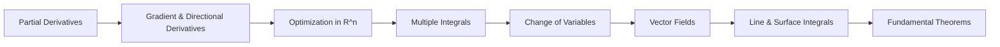

## Theory

### 3.1 Functions of Several Variables

<a href="../../assets/images/diagrams/engineering-mathematics/03-calculus-ii/3-1-functions-of-several-variables-handwritten.svg" target="_blank" rel="noopener">
  
</a>
<a href="../../assets/images/diagrams/engineering-mathematics/03-calculus-ii/3-1-functions-of-several-variables-diagram.svg" target="_blank" rel="noopener">
  
</a>
<a href="../../assets/images/diagrams/engineering-mathematics/03-calculus-ii/3-1-functions-of-several-variables-sticky.svg" target="_blank" rel="noopener">
  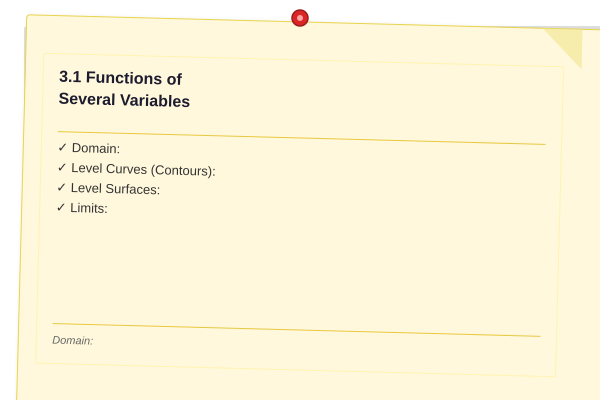
</a>


A function $f: \mathbb{R}^n \to \mathbb{R}$ assigns a real number to each point $(x_1, x_2, \ldots, x_n)$. For $n = 2$, we write $z = f(x, y)$.

**Domain:** The set of input values where $f$ is defined. For $f(x,y) = \ln(x + y)$, the domain is $x + y > 0$.

**Level Curves (Contours):** Curves in $\mathbb{R}^2$ where $f(x,y) = c$ (constant). These are the 2D analogue of topographic map elevations.

**Level Surfaces:** For $f(x,y,z)$, surfaces where $f(x,y,z) = c$.

**Limits:** $\lim_{(x,y) \to (a,b)} f(x,y) = L$ means $f(x,y)$ approaches $L$ as $(x,y)$ approaches $(a,b)$ along any path.

**Continuity:** $f$ is continuous at $(a,b)$ if $\lim_{(x,y) \to (a,b)} f(x,y) = f(a,b)$.

### 3.2 Partial Derivatives

<a href="../../assets/images/diagrams/engineering-mathematics/03-calculus-ii/3-2-partial-derivatives-handwritten.svg" target="_blank" rel="noopener">
  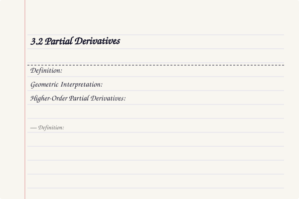
</a>
<a href="../../assets/images/diagrams/engineering-mathematics/03-calculus-ii/3-2-partial-derivatives-diagram.svg" target="_blank" rel="noopener">
  
</a>
<a href="../../assets/images/diagrams/engineering-mathematics/03-calculus-ii/3-2-partial-derivatives-sticky.svg" target="_blank" rel="noopener">
  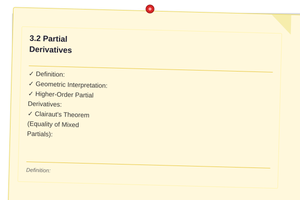
</a>


**Definition:** The partial derivative of $f$ with respect to $x$ at $(a,b)$ is:

$$\frac{\partial f}{\partial x}(a,b) = \lim_{h \to 0} \frac{f(a+h, b) - f(a,b)}{h}$$

Similarly for $\frac{\partial f}{\partial y}$ ? differentiate with respect to $y$, treating $x$ as constant.

**Geometric Interpretation:** $\frac{\partial f}{\partial x}(a,b)$ is the slope of the tangent line to the curve obtained by intersecting $z = f(x,y)$ with the plane $y = b$.

**Higher-Order Partial Derivatives:**

$$\frac{\partial^2 f}{\partial x^2} = \frac{\partial}{\partial x}\left(\frac{\partial f}{\partial x}\right), \quad \frac{\partial^2 f}{\partial x \partial y} = \frac{\partial}{\partial x}\left(\frac{\partial f}{\partial y}\right)$$

**Clairaut's Theorem (Equality of Mixed Partials):** If $f_{xy}$ and $f_{yx}$ are continuous at a point, then:

$$\frac{\partial^2 f}{\partial x \partial y} = \frac{\partial^2 f}{\partial y \partial x}$$

### 3.3 Gradient and Directional Derivatives

<a href="../../assets/images/diagrams/engineering-mathematics/03-calculus-ii/3-3-gradient-and-directional-derivatives-handwritten.svg" target="_blank" rel="noopener">
  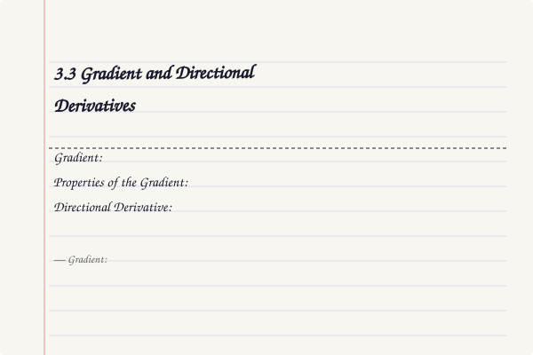
</a>
<a href="../../assets/images/diagrams/engineering-mathematics/03-calculus-ii/3-3-gradient-and-directional-derivatives-diagram.svg" target="_blank" rel="noopener">
  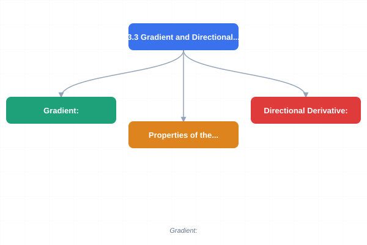
</a>
<a href="../../assets/images/diagrams/engineering-mathematics/03-calculus-ii/3-3-gradient-and-directional-derivatives-sticky.svg" target="_blank" rel="noopener">
  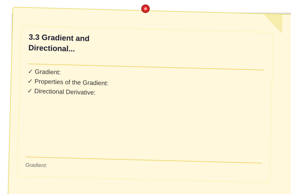
</a>


**Gradient:** The vector of all partial derivatives:

$$\nabla f = \left\langle \frac{\partial f}{\partial x}, \frac{\partial f}{\partial y}, \frac{\partial f}{\partial z} \right\rangle$$

**Properties of the Gradient:**
- $\nabla f$ points in the direction of steepest increase of $f$
- $\|\nabla f\|$ is the rate of increase in that direction
- $\nabla f$ is perpendicular to level curves/surfaces ($\nabla f \cdot T = 0$ along a level curve)
- $-\nabla f$ points in the direction of steepest decrease (used in gradient descent)

**Directional Derivative:** The rate of change of $f$ in the direction of a unit vector $\mathbf{u}$:

$$D_{\mathbf{u}} f(\mathbf{x}) = \nabla f(\mathbf{x}) \cdot \mathbf{u}$$

This is maximized when $\mathbf{u}$ is parallel to $\nabla f$, giving $D_{\mathbf{u}} f = \|\nabla f\|$.

### 3.4 Chain Rule for Multivariable Functions

<a href="../../assets/images/diagrams/engineering-mathematics/03-calculus-ii/3-4-chain-rule-for-multivariable-functions-handwritten.svg" target="_blank" rel="noopener">
  
</a>
<a href="../../assets/images/diagrams/engineering-mathematics/03-calculus-ii/3-4-chain-rule-for-multivariable-functions-diagram.svg" target="_blank" rel="noopener">
  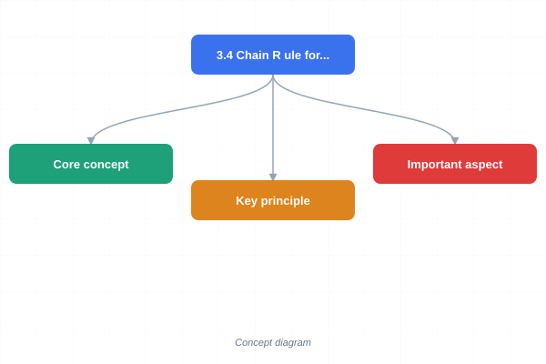
</a>
<a href="../../assets/images/diagrams/engineering-mathematics/03-calculus-ii/3-4-chain-rule-for-multivariable-functions-sticky.svg" target="_blank" rel="noopener">
  
</a>


Case 1: If $z = f(x,y)$ with $x = g(t), y = h(t)$, then:

$$\frac{dz}{dt} = \frac{\partial f}{\partial x} \frac{dx}{dt} + \frac{\partial f}{\partial y} \frac{dy}{dt}$$

Case 2: If $z = f(x,y)$ with $x = g(s,t), y = h(s,t)$, then:

$$\frac{\partial z}{\partial s} = \frac{\partial f}{\partial x} \frac{\partial x}{\partial s} + \frac{\partial f}{\partial y} \frac{\partial y}{\partial s}$$
$$\frac{\partial z}{\partial t} = \frac{\partial f}{\partial x} \frac{\partial x}{\partial t} + \frac{\partial f}{\partial y} \frac{\partial y}{\partial t}$$

### 3.5 Tangent Planes and Linear Approximation

<a href="../../assets/images/diagrams/engineering-mathematics/03-calculus-ii/3-5-tangent-planes-and-linear-approximation-handwritten.svg" target="_blank" rel="noopener">
  
</a>
<a href="../../assets/images/diagrams/engineering-mathematics/03-calculus-ii/3-5-tangent-planes-and-linear-approximation-diagram.svg" target="_blank" rel="noopener">
  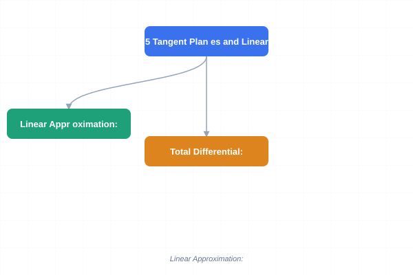
</a>
<a href="../../assets/images/diagrams/engineering-mathematics/03-calculus-ii/3-5-tangent-planes-and-linear-approximation-sticky.svg" target="_blank" rel="noopener">
  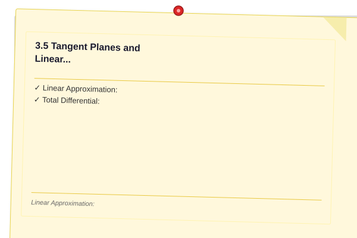
</a>


For $z = f(x,y)$, the tangent plane at $(a,b)$ is:

$$z - f(a,b) = f_x(a,b)(x - a) + f_y(a,b)(y - b)$$

**Linear Approximation:** $f(x,y) \approx f(a,b) + f_x(a,b)(x - a) + f_y(a,b)(y - b)$

**Total Differential:** $dz = f_x\,dx + f_y\,dy$ approximates the change in $f$ for small changes $dx$ and $dy$.

### 3.6 Multivariable Optimization

<a href="../../assets/images/diagrams/engineering-mathematics/03-calculus-ii/3-6-multivariable-optimization-handwritten.svg" target="_blank" rel="noopener">
  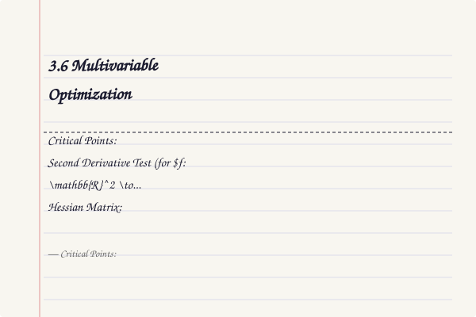
</a>
<a href="../../assets/images/diagrams/engineering-mathematics/03-calculus-ii/3-6-multivariable-optimization-diagram.svg" target="_blank" rel="noopener">
  
</a>
<a href="../../assets/images/diagrams/engineering-mathematics/03-calculus-ii/3-6-multivariable-optimization-sticky.svg" target="_blank" rel="noopener">
  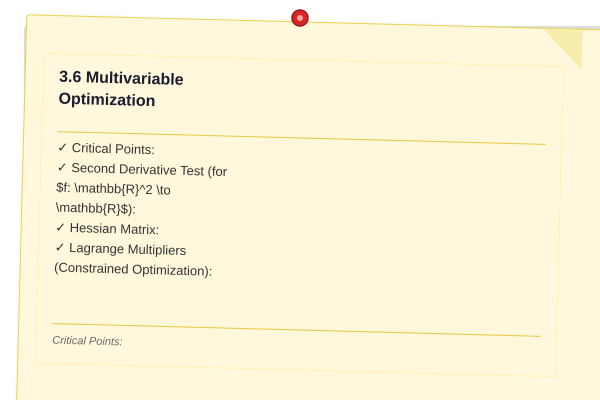
</a>


**Critical Points:** $(a,b)$ is a critical point if $\nabla f(a,b) = 0$ (or does not exist).

**Second Derivative Test (for $f: \mathbb{R}^2 \to \mathbb{R}$):**

Define the discriminant $D = f_{xx} f_{yy} - (f_{xy})^2$:
- If $D > 0$ and $f_{xx} > 0$: local minimum
- If $D > 0$ and $f_{xx} &lt; 0$: local maximum
- If $D &lt; 0$: saddle point
- If $D = 0$: test is inconclusive

**Hessian Matrix:** $H = \begin{pmatrix} f_{xx} & f_{xy} \\ f_{yx} & f_{yy} \end{pmatrix}$

- Positive definite $H$ at critical point = local minimum
- Negative definite $H$ = local maximum
- Indefinite $H$ = saddle point

**Lagrange Multipliers (Constrained Optimization):**

To optimize $f(x,y)$ subject to $g(x,y) = 0$, solve:

$$\nabla f = \lambda \nabla g \quad \text{and} \quad g(x,y) = 0$$

where $\lambda$ is the Lagrange multiplier. This gives a system of 3 equations in 3 unknowns.

**Meaning of $\lambda$:** $\frac{df}{dg} = \lambda$ ? the Lagrange multiplier represents the rate of change of the optimal value as the constraint changes.

### 3.7 Double Integrals

<a href="../../assets/images/diagrams/engineering-mathematics/03-calculus-ii/3-7-double-integrals-handwritten.svg" target="_blank" rel="noopener">
  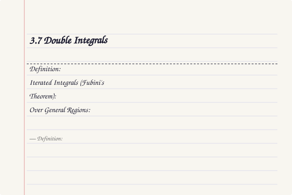
</a>
<a href="../../assets/images/diagrams/engineering-mathematics/03-calculus-ii/3-7-double-integrals-diagram.svg" target="_blank" rel="noopener">
  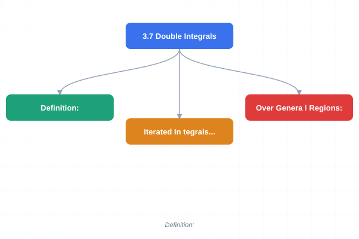
</a>
<a href="../../assets/images/diagrams/engineering-mathematics/03-calculus-ii/3-7-double-integrals-sticky.svg" target="_blank" rel="noopener">
  
</a>


**Definition:** $\iint_R f(x,y)\,dA = \lim_{\Delta x, \Delta y \to 0} \sum_{i} \sum_{j} f(x_i^*, y_j^*) \Delta x \Delta y$

**Iterated Integrals (Fubini's Theorem):** If $f$ is continuous on $R = [a,b] \times [c,d]$:

$$\iint_R f(x,y)\,dA = \int_a^b \int_c^d f(x,y)\,dy\,dx = \int_c^d \int_a^b f(x,y)\,dx\,dy$$

**Over General Regions:**
- Type I: $R = \{(x,y): a \leq x \leq b, g_1(x) \leq y \leq g_2(x)\}$
- Type II: $R = \{(x,y): c \leq y \leq d, h_1(y) \leq x \leq h_2(y)\}$

### 3.8 Triple Integrals

<a href="../../assets/images/diagrams/engineering-mathematics/03-calculus-ii/3-8-triple-integrals-handwritten.svg" target="_blank" rel="noopener">
  
</a>
<a href="../../assets/images/diagrams/engineering-mathematics/03-calculus-ii/3-8-triple-integrals-diagram.svg" target="_blank" rel="noopener">
  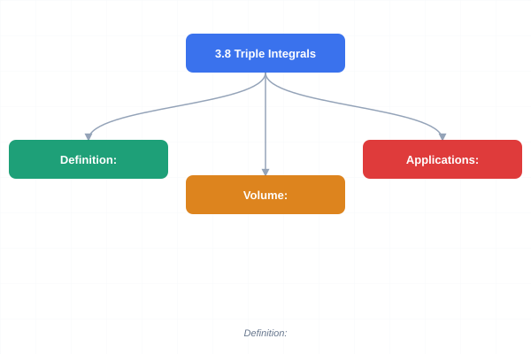
</a>
<a href="../../assets/images/diagrams/engineering-mathematics/03-calculus-ii/3-8-triple-integrals-sticky.svg" target="_blank" rel="noopener">
  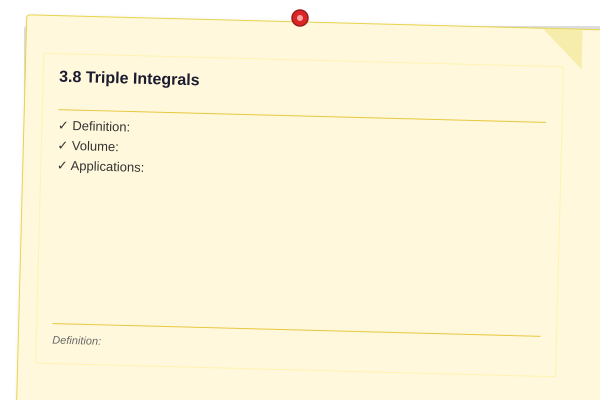
</a>


**Definition:** $\iiint_E f(x,y,z)\,dV$ extends double integrals to 3D.

**Volume:** $V = \iiint_E 1\,dV$

**Applications:**
- Mass: $m = \iiint_E \rho(x,y,z)\,dV$ where $\rho$ is density
- Center of mass: $\bar{x} = \frac{1}{m} \iiint_E x\rho\,dV$, etc.
- Moment of inertia: $I = \iiint_E r^2 \rho\,dV$

### 3.9 Change of Variables (Coordinate Transformations)

<a href="../../assets/images/diagrams/engineering-mathematics/03-calculus-ii/3-9-change-of-variables-coordinate-transformations-handwritten.svg" target="_blank" rel="noopener">
  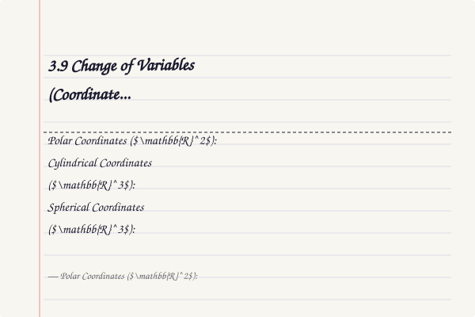
</a>
<a href="../../assets/images/diagrams/engineering-mathematics/03-calculus-ii/3-9-change-of-variables-coordinate-transformations-diagram.svg" target="_blank" rel="noopener">
  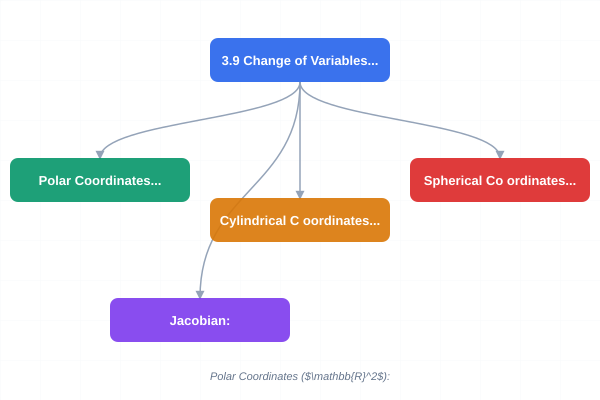
</a>
<a href="../../assets/images/diagrams/engineering-mathematics/03-calculus-ii/3-9-change-of-variables-coordinate-transformations-sticky.svg" target="_blank" rel="noopener">
  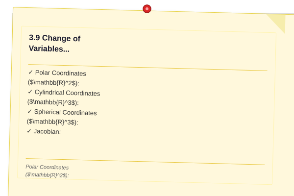
</a>


**Polar Coordinates ($\mathbb{R}^2$):**

$$x = r\cos\theta, \quad y = r\sin\theta$$

$$dA = dx\,dy = r\,dr\,d\theta$$

**Cylindrical Coordinates ($\mathbb{R}^3$):**

$$x = r\cos\theta, \quad y = r\sin\theta, \quad z = z$$

$$dV = r\,dr\,d\theta\,dz$$

**Spherical Coordinates ($\mathbb{R}^3$):**

$$x = \rho\sin\phi\cos\theta, \quad y = \rho\sin\phi\sin\theta, \quad z = \rho\cos\phi$$

$$dV = \rho^2 \sin\phi\,d\rho\,d\phi\,d\theta$$

where $\rho \geq 0$, $0 \leq \phi \leq \pi$, $0 \leq \theta \leq 2\pi$.

**Jacobian:** For transformation $(u,v) \to (x,y)$:

$$J = \begin{vmatrix} \frac{\partial x}{\partial u} & \frac{\partial x}{\partial v} \\ \frac{\partial y}{\partial u} & \frac{\partial y}{\partial v} \end{vmatrix}$$

$$dx\,dy = |J|\,du\,dv$$

The Jacobian determinant gives the factor by which area/volume scales under the transformation.

### 3.10 Vector Fields

<a href="../../assets/images/diagrams/engineering-mathematics/03-calculus-ii/3-10-vector-fields-handwritten.svg" target="_blank" rel="noopener">
  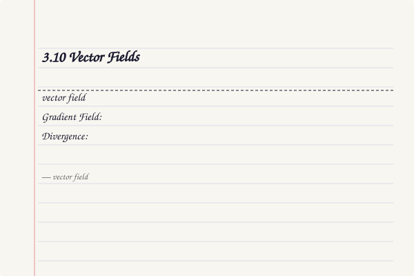
</a>
<a href="../../assets/images/diagrams/engineering-mathematics/03-calculus-ii/3-10-vector-fields-diagram.svg" target="_blank" rel="noopener">
  
</a>
<a href="../../assets/images/diagrams/engineering-mathematics/03-calculus-ii/3-10-vector-fields-sticky.svg" target="_blank" rel="noopener">
  
</a>


A **vector field** assigns a vector to each point in space. In $\mathbb{R}^3$:

$$\mathbf{F}(x,y,z) = P(x,y,z)\,\mathbf{i} + Q(x,y,z)\,\mathbf{j} + R(x,y,z)\,\mathbf{k}$$

**Gradient Field:** $\mathbf{F} = \nabla f$ (conservative field). Then $\oint_C \mathbf{F} \cdot d\mathbf{r} = 0$ around any closed curve.

**Divergence:** A scalar measuring outflow per unit volume:

$$\nabla \cdot \mathbf{F} = \frac{\partial P}{\partial x} + \frac{\partial Q}{\partial y} + \frac{\partial R}{\partial z}$$

- $\nabla \cdot \mathbf{F} > 0$: source (fluid expanding)
- $\nabla \cdot \mathbf{F} &lt; 0$: sink (fluid contracting)
- $\nabla \cdot \mathbf{F} = 0$: incompressible

**Curl:** A vector measuring rotation at a point:

$$\nabla \times \mathbf{F} = \begin{vmatrix} \mathbf{i} & \mathbf{j} & \mathbf{k} \\ \frac{\partial}{\partial x} & \frac{\partial}{\partial y} & \frac{\partial}{\partial z} \\ P & Q & R \end{vmatrix}$$

- $\nabla \times \mathbf{F} = 0$ for conservative fields ($\mathbf{F} = \nabla f$)

**Important Identities:**
- $\nabla \times (\nabla f) = 0$ (curl of gradient is zero)
- $\nabla \cdot (\nabla \times \mathbf{F}) = 0$ (divergence of curl is zero)
- $\nabla \cdot (f\mathbf{F}) = \nabla f \cdot \mathbf{F} + f(\nabla \cdot \mathbf{F})$
- $\nabla \times (f\mathbf{F}) = \nabla f \times \mathbf{F} + f(\nabla \times \mathbf{F})$

### 3.11 Line Integrals

<a href="../../assets/images/diagrams/engineering-mathematics/03-calculus-ii/3-11-line-integrals-handwritten.svg" target="_blank" rel="noopener">
  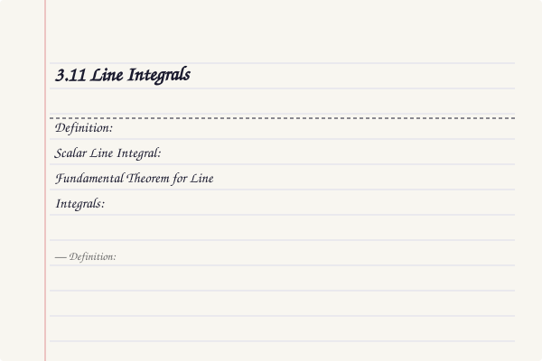
</a>
<a href="../../assets/images/diagrams/engineering-mathematics/03-calculus-ii/3-11-line-integrals-diagram.svg" target="_blank" rel="noopener">
  
</a>
<a href="../../assets/images/diagrams/engineering-mathematics/03-calculus-ii/3-11-line-integrals-sticky.svg" target="_blank" rel="noopener">
  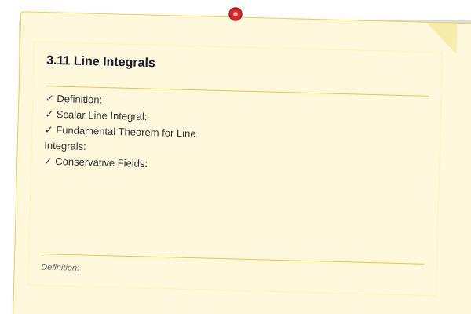
</a>


**Definition:** $\int_C \mathbf{F} \cdot d\mathbf{r} = \int_a^b \mathbf{F}(\mathbf{r}(t)) \cdot \mathbf{r}'(t)\,dt$

where $\mathbf{r}(t)$ parametrizes curve $C$ from $t = a$ to $t = b$.

**Scalar Line Integral:** $\int_C f\,ds = \int_a^b f(\mathbf{r}(t)) \|\mathbf{r}'(t)\|\,dt$ ? integrates scalar function along curve.

**Fundamental Theorem for Line Integrals:** If $\mathbf{F} = \nabla f$:

$$\int_C \mathbf{F} \cdot d\mathbf{r} = f(\mathbf{r}(b)) - f(\mathbf{r}(a))$$

The integral depends only on endpoints, not the path.

**Conservative Fields:**
- $\mathbf{F} = \nabla f$ for some potential $f$
- $\nabla \times \mathbf{F} = 0$ (in simply connected domain)
- $\oint_C \mathbf{F} \cdot d\mathbf{r} = 0$ for any closed curve $C$
- Path independence: $\int_{C_1} \mathbf{F} \cdot d\mathbf{r} = \int_{C_2} \mathbf{F} \cdot d\mathbf{r}$ for curves with same endpoints

### 3.12 Surface Integrals

<a href="../../assets/images/diagrams/engineering-mathematics/03-calculus-ii/3-12-surface-integrals-handwritten.svg" target="_blank" rel="noopener">
  
</a>
<a href="../../assets/images/diagrams/engineering-mathematics/03-calculus-ii/3-12-surface-integrals-diagram.svg" target="_blank" rel="noopener">
  
</a>
<a href="../../assets/images/diagrams/engineering-mathematics/03-calculus-ii/3-12-surface-integrals-sticky.svg" target="_blank" rel="noopener">
  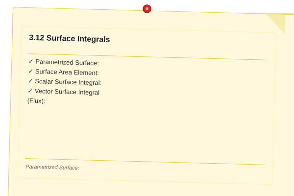
</a>


**Parametrized Surface:** $\mathbf{r}(u,v) = x(u,v)\mathbf{i} + y(u,v)\mathbf{j} + z(u,v)\mathbf{k}$

**Surface Area Element:** $dS = \|\mathbf{r}_u \times \mathbf{r}_v\|\,du\,dv$

**Scalar Surface Integral:** $\iint_S f\,dS = \iint_D f(\mathbf{r}(u,v)) \|\mathbf{r}_u \times \mathbf{r}_v\|\,du\,dv$

**Vector Surface Integral (Flux):**

$$\iint_S \mathbf{F} \cdot d\mathbf{S} = \iint_S \mathbf{F} \cdot \mathbf{n}\,dS$$

where $\mathbf{n}$ is the unit normal vector.

### 3.13 Fundamental Theorems of Vector Calculus

<a href="../../assets/images/diagrams/engineering-mathematics/03-calculus-ii/3-13-fundamental-theorems-of-vector-calculus-handwritten.svg" target="_blank" rel="noopener">
  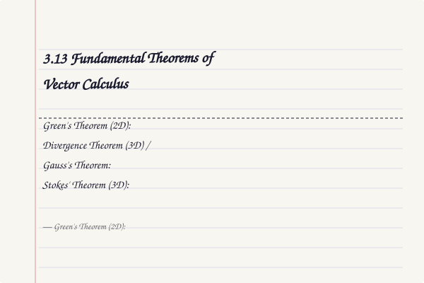
</a>
<a href="../../assets/images/diagrams/engineering-mathematics/03-calculus-ii/3-13-fundamental-theorems-of-vector-calculus-diagram.svg" target="_blank" rel="noopener">
  
</a>
<a href="../../assets/images/diagrams/engineering-mathematics/03-calculus-ii/3-13-fundamental-theorems-of-vector-calculus-sticky.svg" target="_blank" rel="noopener">
  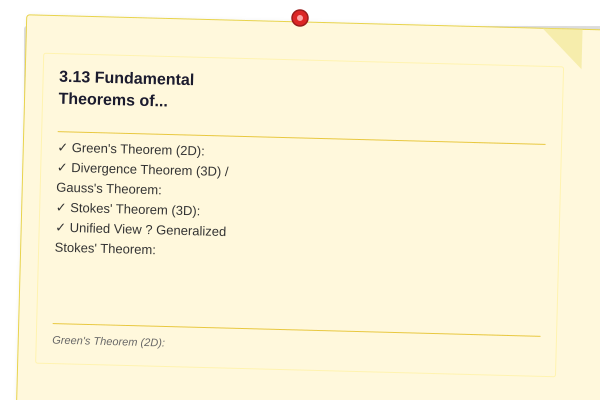
</a>


**Green's Theorem (2D):** Relates line integral around a closed curve to double integral over enclosed region:

$$\oint_C \mathbf{F} \cdot d\mathbf{r} = \iint_D \left(\frac{\partial Q}{\partial x} - \frac{\partial P}{\partial y}\right)\,dA$$

**Divergence Theorem (3D) / Gauss's Theorem:** Relates flux through closed surface to triple integral of divergence:

$$\iint_S \mathbf{F} \cdot d\mathbf{S} = \iiint_E (\nabla \cdot \mathbf{F})\,dV$$

**Stokes' Theorem (3D):** Relates line integral around closed curve to surface integral of curl:

$$\oint_C \mathbf{F} \cdot d\mathbf{r} = \iint_S (\nabla \times \mathbf{F}) \cdot d\mathbf{S}$$

**Unified View ? Generalized Stokes' Theorem:**

$$\int_{\partial M} \omega = \int_M d\omega$$

The integral of a form $\omega$ over the boundary of a manifold $M$ equals the integral of the exterior derivative $d\omega$ over $M$ itself.

## Examples

### Example 1: Partial Derivatives

For $f(x,y) = x^2 \cos y + y e^x$, find $\frac{\partial f}{\partial x}$ and $\frac{\partial f}{\partial y}$.

**Solution:**

$$\frac{\partial f}{\partial x} = 2x \cos y + y e^x$$
$$\frac{\partial f}{\partial y} = -x^2 \sin y + e^x$$

### Example 2: Gradient and Directional Derivative

For $f(x,y) = x^2 + 2y^2$, find the gradient at $(1,1)$ and the directional derivative in direction $\mathbf{v} = \langle 3, 4 \rangle$.

**Solution:**

$\nabla f = \langle 2x, 4y \rangle$
$\nabla f(1,1) = \langle 2, 4 \rangle$

Unit vector in direction of $\mathbf{v}$: $\mathbf{u} = \frac{\langle 3, 4 \rangle}{5} = \langle 0.6, 0.8 \rangle$

Directional derivative: $D_{\mathbf{u}} f(1,1) = \langle 2, 4 \rangle \cdot \langle 0.6, 0.8 \rangle = 1.2 + 3.2 = 4.4$

### Example 3: Double Integral

Evaluate $\iint_R (x + 2y)\,dA$ where $R$ is bounded by $y = x^2$ and $y = 2x$.

**Solution:**

Find intersection points: $x^2 = 2x \implies x^2 - 2x = 0 \implies x(x-2) = 0 \implies x = 0, 2$

Region: Type I with $0 \leq x \leq 2$, $x^2 \leq y \leq 2x$

$$\iint_R (x + 2y)\,dA = \int_0^2 \int_{x^2}^{2x} (x + 2y)\,dy\,dx$$

Inner integral:
$$\int_{x^2}^{2x} (x + 2y)\,dy = \left[xy + y^2\right]_{y=x^2}^{y=2x} = (2x^2 + 4x^2) - (x^3 + x^4) = 6x^2 - x^3 - x^4$$

Outer integral:
$$\int_0^2 (6x^2 - x^3 - x^4)\,dx = \left[2x^3 - \frac{x^4}{4} - \frac{x^5}{5}\right]_0^2 = (16 - 4 - 6.4) = 5.6$$

### Example 4: Change of Variables (Polar)

Evaluate $\iint_R e^{-(x^2 + y^2)}\,dA$ where $R$ is the disk $x^2 + y^2 \leq 4$.

**Solution:** Convert to polar: $x = r\cos\theta$, $y = r\sin\theta$, $dA = r\,dr\,d\theta$.

Region: $0 \leq r \leq 2$, $0 \leq \theta \leq 2\pi$.

$$\iint_R e^{-(x^2 + y^2)}\,dA = \int_0^{2\pi} \int_0^2 e^{-r^2} r\,dr\,d\theta$$

Inner: $\int e^{-r^2} r\,dr = -\frac{1}{2}e^{-r^2}$.

Inner definite: $\left[-\frac{1}{2}e^{-r^2}\right]_0^2 = -\frac{1}{2}(e^{-4} - 1) = \frac{1}{2}(1 - e^{-4})$

Outer: $\int_0^{2\pi} \frac{1}{2}(1 - e^{-4})\,d\theta = \pi(1 - e^{-4})$

### Example 5: Lagrange Multipliers

Find the point on the plane $x + 2y + z = 4$ closest to the origin.

**Solution:** Minimize $f(x,y,z) = x^2 + y^2 + z^2$ (distance squared) subject to $g(x,y,z) = x + 2y + z - 4 = 0$.

Set $\nabla f = \lambda \nabla g$:

$$\langle 2x, 2y, 2z \rangle = \lambda \langle 1, 2, 1 \rangle$$

So $2x = \lambda$, $2y = 2\lambda$, $2z = \lambda$, giving $x = z = \frac{\lambda}{2}$, $y = \lambda$.

Substitute into constraint: $\frac{\lambda}{2} + 2\lambda + \frac{\lambda}{2} = 4 \implies 3\lambda = 4 \implies \lambda = \frac{4}{3}$

Point: $(\frac{2}{3}, \frac{4}{3}, \frac{2}{3})$

Minimum distance: $\sqrt{(\frac{2}{3})^2 + (\frac{4}{3})^2 + (\frac{2}{3})^2} = \sqrt{\frac{24}{9}} = \frac{2\sqrt{6}}{3}$

### Example 6: Divergence Theorem

Verify the divergence theorem for $\mathbf{F} = \langle x, y, z \rangle$ over the unit sphere.

**Solution:** $\nabla \cdot \mathbf{F} = 1 + 1 + 1 = 3$

Volume of unit sphere: $V = \frac{4\pi}{3}$

$$\iiint_E (\nabla \cdot \mathbf{F})\,dV = 3 \cdot \frac{4\pi}{3} = 4\pi$$

Now compute the flux directly. On the sphere, $\mathbf{n} = \langle x, y, z \rangle$ (outward normal, unit length).

$$\iint_S \mathbf{F} \cdot d\mathbf{S} = \iint_S \langle x,y,z \rangle \cdot \langle x,y,z \rangle\,dS = \iint_S (x^2 + y^2 + z^2)\,dS = \iint_S 1\,dS = 4\pi$$

Both equal $4\pi$. Verified ?

### Example 7: Application ? Gradient Descent in 2D

For $f(x,y) = x^2 + 2y^2$, starting at $(1,1)$, compute one step of gradient descent with $\eta = 0.1$.

**Solution:**

$\nabla f = \langle 2x, 4y \rangle$
$\nabla f(1,1) = \langle 2, 4 \rangle$

Update:
$$(x_{new}, y_{new}) = (1,1) - 0.1 \cdot \langle 2, 4 \rangle = (0.8, 0.6)$$

$f(1,1) = 1 + 2 = 3$, $f(0.8, 0.6) = 0.64 + 0.72 = 1.36$. The function value decreased.

### Example 8: Triple Integral in Spherical Coordinates

Find the volume of the region bounded by the cone $z = \sqrt{x^2 + y^2}$ and the sphere $x^2 + y^2 + z^2 = 1$ (an ice cream cone).

**Solution:** In spherical coordinates, the cone $\phi = \pi/4$ and the sphere is $\rho = 1$.

$$V = \iiint_E 1\,dV = \int_0^{2\pi} \int_0^{\pi/4} \int_0^1 \rho^2 \sin\phi \, d\rho \, d\phi \, d\theta$$

$$= \int_0^{2\pi} d\theta \int_0^{\pi/4} \sin\phi \, d\phi \int_0^1 \rho^2 \, d\rho = 2\pi \cdot [-\cos\phi]_0^{\pi/4} \cdot \left[\frac{\rho^3}{3}\right]_0^1$$

$$= 2\pi \cdot \left(-\frac{\sqrt{2}}{2} + 1\right) \cdot \frac{1}{3} = \frac{2\pi}{3}\left(1 - \frac{\sqrt{2}}{2}\right)$$

### Example 9: Jacobian for Change of Variables

Evaluate $\iint_R (x - y)^2 \sin^2(x + y)\,dA$ where $R$ is the square with vertices $(0,0), (\pi/2, -\pi/2), (\pi, 0), (\pi/2, \pi/2)$.

**Solution:** The region suggests the transformation: $u = x - y$, $v = x + y$.

Solving for $x$ and $y$: $x = (u+v)/2$, $y = (v-u)/2$.

Jacobian: $$J = \begin{vmatrix} \partial x/\partial u & \partial x/\partial v \\ \partial y/\partial u & \partial y/\partial v \end{vmatrix} = \begin{vmatrix} 1/2 & 1/2 \\ -1/2 & 1/2 \end{vmatrix} = \frac{1}{2}$$

The region $R$ transforms to $0 \leq u \leq \pi$, $0 \leq v \leq \pi$ in the $uv$-plane.

$$\iint_R (x-y)^2 \sin^2(x+y)\,dA = \int_0^\pi \int_0^\pi u^2 \sin^2 v \cdot \frac{1}{2} \, du \, dv$$

$$= \frac{1}{2} \int_0^\pi u^2 \, du \int_0^\pi \sin^2 v \, dv = \frac{1}{2} \cdot \left[\frac{u^3}{3}\right]_0^\pi \cdot \left[\frac{v}{2} - \frac{\sin 2v}{4}\right]_0^\pi = \frac{1}{2} \cdot \frac{\pi^3}{3} \cdot \frac{\pi}{2} = \frac{\pi^4}{12}$$

## TypeScript Examples

### Numerical Gradient and Hessian Computation

```typescript
type Vec2 = [number, number];
type ScalarFn2 = (x: Vec2) => number;

function numericalGradient(f: ScalarFn2, x: Vec2, h: number = 1e-5): Vec2 {
  return [
    (f([x[0] + h, x[1]]) - f([x[0] - h, x[1]])) / (2 * h),
    (f([x[0], x[1] + h]) - f([x[0], x[1] - h])) / (2 * h),
  ];
}

function numericalHessian(f: ScalarFn2, x: Vec2, h: number = 1e-5): number[][] {
  const fxx = (f([x[0] + h, x[1]]) - 2 * f(x) + f([x[0] - h, x[1]])) / (h * h);
  const fyy = (f([x[0], x[1] + h]) - 2 * f(x) + f([x[0], x[1] - h])) / (h * h);
  const fxy = (f([x[0] + h, x[1] + h]) - f([x[0] + h, x[1] - h])
            - f([x[0] - h, x[1] + h]) + f([x[0] - h, x[1] - h])) / (4 * h * h);
  return [[fxx, fxy], [fxy, fyy]];
}

// Test: f(x,y) = x^2 + 3xy + y^2
const f = (p: Vec2): number => p[0]**2 + 3 * p[0] * p[1] + p[1]**2;
const grad = numericalGradient(f, [1, 2]);
console.log(`Gradient at (1,2): (${grad[0].toFixed(4)}, ${grad[1].toFixed(4)})`);
// Analytical: (2x+3y, 3x+2y) = (8, 7)

const hess = numericalHessian(f, [1, 2]);
console.log(`Hessian at (1,2): [[${hess[0][0]}, ${hess[0][1]}], [${hess[1][0]}, ${hess[1][1]}]]`);
// Analytical: [[2, 3], [3, 2]]
```

### Numerical Double Integration

```typescript
function doubleIntegral(
  f: (x: number, y: number) => number,
  xMin: number, xMax: number,
  yMin: (x: number) => number,
  yMax: (x: number) => number,
  nx: number = 100,
  ny: number = 100
): number {
  const dx = (xMax - xMin) / nx;
  let total = 0;
  for (let i = 0; i < nx; i++) {
    const x = xMin + (i + 0.5) * dx;  // midpoint
    const yLo = yMin(x), yHi = yMax(x);
    const dy = (yHi - yLo) / ny;
    for (let j = 0; j < ny; j++) {
      const y = yLo + (j + 0.5) * dy;
      total += f(x, y) * dx * dy;
    }
  }
  return total;
}

// Integrate f(x,y) = x + 2y over region: 0 = x = 2, x? = y = 2x
const result = doubleIntegral(
  (x, y) => x + 2 * y,
  0, 2,
  (x) => x * x,
  (x) => 2 * x,
  200, 200
);
console.log(`Double integral ? ${result.toFixed(4)} (expected 5.6)`);
```

## Real-World Application: Backpropagation as the Chain Rule

Backpropagation, the algorithm that trains neural networks, is fundamentally the multivariable chain rule applied to millions of nested function compositions.

**Forward Pass:** A neural network computes $L = f_L(f_{L-1}(\cdots f_1(x; w_1)\cdots; w_{L-1}); w_L)$ where each layer $f_l$ applies a linear transformation followed by a nonlinear activation.

**Backward Pass (Backpropagation):** For each weight $w_{ij}^{(l)}$, the gradient is computed by:

$$\frac{\partial L}{\partial w_{ij}^{(l)}} = \frac{\partial L}{\partial z_i^{(l)}} \cdot \frac{\partial z_i^{(l)}}{\partial w_{ij}^{(l)}}$$

where $z^{(l)}$ is the pre-activation at layer $l$. The "error signal" $\delta_i^{(l)} = \partial L / \partial z_i^{(l)}$ is propagated backward using:

$$\delta_i^{(l)} = \sum_k \delta_k^{(l+1)} \cdot w_{ki}^{(l+1)} \cdot \sigma'(z_i^{(l)})$$

This is the chain rule: the gradient at layer $l$ depends on gradients at layer $l+1$, chained through the weight matrix and activation derivative.

**Connection to Jacobians:** The entire backpropagation algorithm can be understood as efficient computation of the Jacobian-vector product $\nabla_w L = (J_{f_L} \cdot J_{f_{L-1}} \cdots J_{f_1})^T \cdot 1$, where each $J_{f_l}$ is the Jacobian of layer $l$.

### TypeScript Implementation: Gradient Descent Optimizer

```typescript
type Vec = number[];

function gradientDescent(
  f: (x: Vec) => number, grad: (x: Vec) => Vec,
  initial: Vec, lr: number = 0.01, maxIter: number = 1000, tol: number = 1e-6
): { x: Vec; fx: number; iterations: number } {
  let x = [...initial];
  for (let iter = 0; iter < maxIter; iter++) {
    const g = grad(x);
    const xNext = x.map((xi, i) => xi - lr * g[i]);
    const step = Math.sqrt(xNext.reduce((s, xi, i) => s + (xi - x[i]) ** 2, 0));
    x = xNext;
    if (step < tol) return { x, fx: f(x), iterations: iter };
  }
  return { x, fx: f(x), iterations: maxIter };
}

// Minimize f(x,y) = x? + 2y?: gradient = [2x, 4y], min at (0,0)
const quad = (x: Vec) => x[0] ** 2 + 2 * x[1] ** 2;
const gradQuad = (x: Vec): Vec => [2 * x[0], 4 * x[1]];
const { x: minPt, fx: minVal, iterations: iters } = gradientDescent(quad, gradQuad, [5, 3], 0.1, 500);
console.log(`GD: min at (${minPt[0].toFixed(4)}, ${minPt[1].toFixed(4)}), f=${minVal.toFixed(6)}, iters=${iters}`);

// Minimize Rosenbrock f(x,y) = (1-x)? + 100(y-x?)?, known as banana function
const rosenbrock = (x: Vec) => (1 - x[0]) ** 2 + 100 * (x[1] - x[0] ** 2) ** 2;
const gradRosen = (x: Vec): Vec => [
  -2 * (1 - x[0]) - 400 * x[0] * (x[1] - x[0] ** 2),
  200 * (x[1] - x[0] ** 2)
];
const rosenResult = gradientDescent(rosenbrock, gradRosen, [0, 0], 0.001, 10000);
console.log(`Rosenbrock: min at (${rosenResult.x[0].toFixed(4)}, ${rosenResult.x[1].toFixed(4)}), f=${rosenResult.fx.toExponential(3)}`);

### TypeScript: Double and Triple Integrals via Riemann Sums

```typescript
function doubleIntegral(
  f: (x: number, y: number) => number,
  xMin: number, xMax: number,
  yMin: (x: number) => number, yMax: (x: number) => number,
  nx: number = 100, ny: number = 100
): number {
  const dx = (xMax - xMin) / nx;
  let total = 0;
  for (let i = 0; i &lt; nx; i++) {
    const x = xMin + (i + 0.5) * dx;
    const yLow = yMin(x), yHigh = yMax(x);
    const dy = (yHigh - yLow) / ny;
    for (let j = 0; j &lt; ny; j++) total += f(x, yLow + (j + 0.5) * dy) * dx * dy;
  }
  return total;
}

// ?0??0? (x? + y?) dy dx = 2/3 ? 0.6667
const f2d = (x: number, y: number) => x * x + y * y;
const r1 = doubleIntegral(f2d, 0, 1, () => 0, () => 1, 200, 200);
console.log(`?(x?+y?) over [0,1]?: ${r1.toFixed(4)} (expected: 0.6667)`);

// ?_D 1 dA over triangle: 0=x=1, 0=y=x ? area = 1/2
const triArea = doubleIntegral(() => 1, 0, 1, x => 0, x => x, 200, 200);
console.log(`Triangle area: ${triArea.toFixed(4)} (expected: 0.5)`);

function tripleIntegral(
  f: (x: number, y: number, z: number) => number,
  xMin: number, xMax: number,
  yMin: (x: number) => number, yMax: (x: number) => number,
  zMin: (x: number, y: number) => number, zMax: (x: number, y: number) => number,
  nx = 40, ny = 40, nz = 40
): number {
  const dx = (xMax - xMin) / nx;
  let total = 0;
  for (let i = 0; i &lt; nx; i++) {
    const x = xMin + (i + 0.5) * dx;
    const yl = yMin(x), yh = yMax(x); const dy = (yh - yl) / ny;
    for (let j = 0; j &lt; ny; j++) {
      const y = yl + (j + 0.5) * dy;
      const zl = zMin(x, y), zh = zMax(x, y); const dz = (zh - zl) / nz;
      for (let k = 0; k &lt; nz; k++) total += f(x, y, zl + (k + 0.5) * dz) * dx * dy * dz;
    }
  }
  return total;
}

// Unit sphere volume: ? 1 dV = 4p/3 ? 4.18879
const sphereVol = tripleIntegral(
  () => 1, -1, 1,
  x => -Math.sqrt(Math.max(0, 1 - x * x)), x => Math.sqrt(Math.max(0, 1 - x * x)),
  (x, y) => -Math.sqrt(Math.max(0, 1 - x * x - y * y)), (x, y) => Math.sqrt(Math.max(0, 1 - x * x - y * y)),
  30, 30, 30
);
console.log(`Sphere volume: ${sphereVol.toFixed(4)} (expected: ${(4 * Math.PI / 3).toFixed(4)})`);

### TypeScript: Divergence and Curl of a Vector Field

```typescript
function divergence(F: (x: number, y: number, z: number) => [number, number, number], h: number = 1e-6) {
  return (x: number, y: number, z: number): number => {
    const [Fx, Fy, Fz] = F(x, y, z);
    const [Fxx] = F(x + h, y, z); const [Fxy] = F(x - h, y, z);
    const [, Fyy] = F(x, y + h, z); const [, Fys] = F(x, y - h, z);
    const [, , Fzz] = F(x, y, z + h); const [, , Fzs] = F(x, y, z - h);
    return (Fxx - Fxy + Fyy - Fys + Fzz - Fzs) / (2 * h);
  };
}

function curl(F: (x: number, y: number, z: number) => [number, number, number], h: number = 1e-6) {
  return (x: number, y: number, z: number): [number, number, number] => {
    const [, Fy, Fz] = F(x, y, z);
    const [, Fyp] = F(x, y + h, z); const [, Fym] = F(x, y - h, z);
    const [, , Fzp] = F(x, y, z + h); const [, , Fzm] = F(x, y, z - h);
    const [Fx, , Fzz] = F(x, y, z); const [Fxp] = F(x + h, y, z)[0]; const [Fxm] = F(x - h, y, z)[0];
    const [Fxx] = F(x, y, z);
    const curlX = (Fzp - Fzm - (Fyp - Fym)) / (2 * h);
    const curlY = (Fxp - Fxm - (Fzz - Fzm)) / (2 * h);
    const curlZ = (Fyp - Fym - (Fxp - Fxm)) / (2 * h);
    return [curlX, curlY, curlZ];
  };
}

// F = (-y, x, 0): divergence = 0, curl = (0, 0, 2)
const F = (x: number, y: number, z: number): [number, number, number] => [-y, x, 0];
console.log(`div F at (1,1,0): ${divergence(F)(1, 1, 0).toFixed(2)} (expected: 0)`);
const c = curl(F)(1, 1, 0);
console.log(`curl F at (1,1,0): (${c.map(v => v.toFixed(2)).join(", ")}) (expected: (0, 0, 2))`);
```

```
// --- Double Integral via Riemann Sum ---
function doubleIntegral(
  f: (x: number, y: number) => number,
  xRange: [number, number],
  yRange: [number, number],
  nx: number,
  ny: number
): number {
  const dx = (xRange[1] - xRange[0]) / nx;
  const dy = (yRange[1] - yRange[0]) / ny;
  let sum = 0;
  for (let i = 0; i < nx; i++)
    for (let j = 0; j < ny; j++)
      sum += f(xRange[0] + (i + 0.5) * dx, yRange[0] + (j + 0.5) * dy) * dx * dy;
  return sum;
}
const vol = doubleIntegral((x, y) => x * x + y * y, [0, 1], [0, 1], 100, 100);
console.log('?(x?+y?) dA over [0,1]?:', vol.toFixed(4), '(expected: 2/3 ? 0.6667)');

// --- Jacobian Determinant ---
function jacobianDet(
  transform: (u: number, v: number) => [number, number],
  u: number,
  v: number
): number {
  const h = 1e-6;
  const [x0, y0] = transform(u, v);
  const [xu, yu] = transform(u + h, v);
  const [xv, yv] = transform(u, v + h);
  return ((xu - x0) / h) * ((yv - y0) / h) - ((xv - x0) / h) * ((yu - y0) / h);
}
// Polar: x = r cos ?, y = r sin ? ? Jacobian = r
const polarJ = jacobianDet((r, ?) => [r * Math.cos(?), r * Math.sin(?)], 2, Math.PI / 4);
console.log('\nPolar Jacobian at (2, p/4):', polarJ.toFixed(4), '(expected: 2)');

// --- Lagrange Multipliers (2D numeric) ---
function lagrangeMultiplier(
  f: (x: number, y: number) => number,
  g: (x: number, y: number) => number,
  gTarget: number,
  guess: [number, number],
  learningRate: number = 0.01,
  iterations: number = 1000
): { x: number; y: number; ?: number } {
  let x = guess[0], y = guess[1], ? = 0;
  const h = 1e-6;
  for (let i = 0; i < iterations; i++) {
    const fx = (f(x + h, y) - f(x - h, y)) / (2 * h);
    const fy = (f(x, y + h) - f(x, y - h)) / (2 * h);
    const gx = (g(x + h, y) - g(x - h, y)) / (2 * h);
    const gy = (g(x, y + h) - g(x, y - h)) / (2 * h);
    x -= learningRate * (fx - ? * gx);
    y -= learningRate * (fy - ? * gy);
    ? += learningRate * (g(x, y) - gTarget);
  }
  return { x: +x.toFixed(4), y: +y.toFixed(4), ?: +?.toFixed(4) };
}
// Maximize f(x,y)=xy subject to x+y=1
const lm = lagrangeMultiplier((x, y) => x * y, (x, y) => x + y, 1, [0.3, 0.7]);
console.log('\nLagrange: max xy s.t. x+y=1:', `x=${lm.x}, y=${lm.y}, f=${(+lm.x * +lm.y).toFixed(4)}`);

// --- Triple Integral in Spherical Coordinates ---
function sphericalVolume(?Fn: (?: number, f: number) => number): number {
  const n = 50;
  let vol = 0;
  const d? = 2 * Math.PI / n, df = Math.PI / n;
  for (let i = 0; i < n; i++)
    for (let j = 0; j < n; j++) {
      const ? = (i + 0.5) * d?, f = (j + 0.5) * df;
      const ? = ?Fn(?, f);
      vol += (? ** 3 / 3) * Math.sin(f) * d? * df;
    }
  return vol;
}
const sphereVol = sphericalVolume((?, f) => 1); // unit sphere
console.log('\nUnit sphere volume (spherical):', sphereVol.toFixed(4), '(expected: 4p/3 ? 4.1888)');
```


// calculus ii
// linear-algebra-calculus implementation

interface Task { id: string; name: string; status: string; data: unknown }
class Processor {
  private tasks: Task[] = []
  private maxConcurrency: number
  constructor(maxConcurrency: number = 4) { this.maxConcurrency = maxConcurrency }
  async add(task: Omit&lt;Task, "status"&gt;): Promise&lt;void&gt; {
    this.tasks.push({ ...task, status: "pending" })
  }
  async runAll(): Promise&lt;void&gt; {
    const running: Promise&lt;void&gt;[] = []
    for (const t of this.tasks) {
      if (running.length >= this.maxConcurrency) { await Promise.race(running) }
      const p = this.execute(t).finally(() => { const i = running.indexOf(p); if (i >= 0) running.splice(i, 1) })
      running.push(p)
    }
    await Promise.all(running)
  }
  private async execute(t: Task): Promise&lt;void&gt; {
    t.status = "running"
    await new Promise(r => setTimeout(r, 10))
    t.status = "done"
  }
  getResults(): Task[] { return this.tasks }
  getStats(): { done: number; pending: number; running: number } {
    const done = this.tasks.filter(t => t.status === "done").length
    const pending = this.tasks.filter(t => t.status === "pending").length
    const running = this.tasks.filter(t => t.status === "running").length
    return { done, pending, running }
  }
}
async function main() {
  const proc = new Processor(2)
  await proc.add({ id: '1', name: 'calculus ii', data: { topic: 'linear-algebra-calculus' } })
  await proc.runAll()
  console.log('Stats:', proc.getStats())
}
main().catch(console.error)
export { Processor, Task }

// calculus ii - additional TS implementations

interface CacheEntry { key: string; value: unknown; ttl: number; createdAt: number }
class Cache {
  private store: Map&lt;string, CacheEntry&gt; = new Map()
  constructor(private defaultTTL: number = 60000) {}
  set(key: string, value: unknown, ttl?: number): void {
    this.store.set(key, { key, value, ttl: ttl ?? this.defaultTTL, createdAt: Date.now() })
  }
  get(key: string): unknown | undefined {
    const entry = this.store.get(key)
    if (!entry) return undefined
    if (Date.now() - entry.createdAt > entry.ttl) { this.store.delete(key); return undefined }
    return entry.value
  }
  delete(key: string): boolean { return this.store.delete(key) }
  clear(): void { this.store.clear() }
  size(): number { return this.store.size }
  keys(): string[] { return Array.from(this.store.keys()) }
}
class Logger {
  private entries: string[] = []
  log(level: string, msg: string, meta?: Record&lt;string, unknown&gt;): void {
    const entry = JSON.stringify({ timestamp: new Date().toISOString(), level, msg, meta })
    this.entries.push(entry)
    console.log(entry)
  }
  info(msg: string, meta?: Record&lt;string, unknown&gt;): void { this.log("info", msg, meta) }
  warn(msg: string, meta?: Record&lt;string, unknown&gt;): void { this.log("warn", msg, meta) }
  error(msg: string, meta?: Record&lt;string, unknown&gt;): void { this.log("error", msg, meta) }
  getLogs(): string[] { return [...this.entries] }
  clear(): void { this.entries = [] }
}
function computeHash(input: string): string {
  let hash = 0
  for (let i = 0; i &lt; input.length; i++) { const chr = input.charCodeAt(i); hash = ((hash << 5) - hash) + chr; hash |= 0 }
  return Math.abs(hash).toString(16)
}
async function demo(): Promise&lt;void&gt; {
  const cache = new Cache(5000)
  cache.set('key1', 'engineering-math demo')
  const log = new Logger()
  log.info('Cache demo started', { course: 'engineering-mathematics', chapter: 'calculus ii' })
  const v = cache.get("key1")
  console.log('Cached:', v)
  console.log('Hash:', computeHash('engineering-math'))
}
demo()
export { Cache, Logger, computeHash, CacheEntry }
## Summary

- Partial derivatives compute rates of change with respect to one variable at a time
- The gradient points uphill; $-\nabla f$ guides gradient descent optimization
- Double/triple integrals extend accumulation to 2D/3D regions
- Coordinate transformations (polar, cylindrical, spherical) simplify many integrals
- The Jacobian determinant gives the area/volume scaling factor of a transformation
- Lagrange multipliers handle optimization with equality constraints
- Vector fields, divergence, and curl describe flow and rotation in space
- Green's, Stokes', and Divergence theorems connect integrals of different dimensions
- Stokes' theorem unifies all: boundary integral = integral of derivative over interior

## Exercises

### Review Questions

1. Explain the geometric meaning of the gradient vector
2. Why does the second derivative test use $f_{xx} f_{yy} - (f_{xy})^2$?
3. When would you use spherical coordinates instead of cylindrical?
4. What does a zero divergence tell you about a vector field?
5. Explain why conservative fields satisfy $\nabla \times \mathbf{F} = 0$

### Application Problems

1. **Least Squares:** Show that for data $(x_i, y_i)$, minimizing $\sum (y_i - mx - b)^2$ gives a system of two linear equations in $m$ and $b$.

2. **Volume of Sphere:** Use triple integration in spherical coordinates to derive $V = \frac{4}{3}\pi R^3$.

3. **ML Loss Surface:** For $L(w_1,w_2) = (w_1^2 - 1)^2 + (w_2^2 - 2)^2$, find all critical points and classify them.

4. **Flux through Surface:** Compute the flux of $\mathbf{F} = \langle 0, 0, z \rangle$ through the surface of the box $0 \leq x \leq 1$, $0 \leq y \leq 1$, $0 \leq z \leq 1$ using the divergence theorem.

### Additional Exercises

5. **Directional Derivative:** For $f(x,y,z) = x^2 y + yz^3$, find the directional derivative at $(1,2,-1)$ in the direction toward $(3,4,-3)$.

6. **Triple Integral:** Compute $\iiint_E z\,dV$ where $E$ is the tetrahedron bounded by $x=0$, $y=0$, $z=0$, and $x+y+z=1$.

7. **Lagrange Multipliers:** Find the maximum volume of a rectangular box with surface area $S = 24$ (no top).

### Challenge Problem

**Gaussian Integral:** Evaluate $I = \int_{-\infty}^\infty e^{-x^2}\,dx = \sqrt{\pi}$ by squaring $I^2$ and converting to polar coordinates. This is the normalization constant for the normal distribution.

### TypeScript: Multivariable Calculus Operations

```typescript
type Vec2 = [number, number];
type Vec3 = [number, number, number];

class MultivariableCalculus {
  gradient(f: (v: Vec2) => number, x: number, y: number, h = 1e-6): Vec2 {
    return [
      (f([x + h, y]) - f([x - h, y])) / (2 * h),
      (f([x, y + h]) - f([x, y - h])) / (2 * h),
    ];
  }

  jacobian(f: (v: Vec2) => Vec2, x: number, y: number): Matrix {
    const h = 1e-6;
    const fxy = f([x, y]);
    return [
      [(f([x + h, y])[0] - f([x - h, y])[0]) / (2 * h), (f([x, y + h])[0] - f([x, y - h])[0]) / (2 * h)],
      [(f([x + h, y])[1] - f([x - h, y])[1]) / (2 * h), (f([x, y + h])[1] - f([x, y - h])[1]) / (2 * h)],
    ];
  }

  laplacian(f: (v: Vec2) => number, x: number, y: number): number {
    const h = 1e-5;
    return (f([x + h, y]) + f([x - h, y]) + f([x, y + h]) + f([x, y - h]) - 4 * f([x, y])) / (h * h);
  }
}
```

## Notation Reference

| Symbol | Meaning |
|--------|---------|
| $\partial f / \partial x$ | partial derivative of $f$ wrt $x$ |
| $\nabla f$ | gradient of $f$ |
| $\nabla \cdot \mathbf{F}$ | divergence of $\mathbf{F}$ |
| $\nabla \times \mathbf{F}$ | curl of $\mathbf{F}$ |
| $D_{\mathbf{u}} f$ | directional derivative in direction $\mathbf{u}$ |
| $\iint_R f\,dA$ | double integral over region $R$ |
| $\iiint_E f\,dV$ | triple integral over region $E$ |
| $d\mathbf{S}$ | oriented surface element |
| $\oint_C$ | line integral around closed curve |
| $\partial M$ | boundary of manifold $M$ |

### Mermaid: Optimization with Gradient Descent

```mermaid
flowchart LR
    A[Start ?0] --> B[Compute ?f(?)]
    B --> C{??f(?)? < e?}
    C -->|Yes| D[Converged]
    C -->|No| E[? ? ? - a?f(?)]
    E --> B
    D --> F[Return ?*]
```

### Mermaid: Double Integral Over a Region

```mermaid
flowchart TD
    A[Region R] --> B[Type I: x-simple]
    A --> C[Type II: y-simple]
    B --> D[??? ?_{g1(x)}^{g2(x)} f dy dx]
    C --> E[??? ?_{h1(y)}^{h2(y)} f dx dy]
    D --> F[Evaluate inner integral]
    F --> G[Evaluate outer integral]
    E --> H[Evaluate inner integral]
    H --> I[Evaluate outer integral]
```
