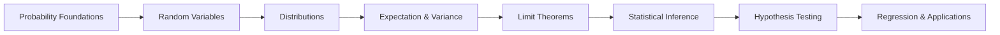

# Chapter 6: Probability & Statistics

> **Previous:** [Chapter 5: Complex Analysis](05-complex-analysis.md) | **Next:** [Chapter 7: Numerical Methods](07-numerical-methods.md)

## Learning Objectives

After completing this chapter, you will be able to:

<!-- Image Gallery -->
<div style="display:flex;flex-wrap:wrap;gap:4px;margin:16px 0;padding:12px;background:#f8fafc;border-radius:8px;border:1px solid #e2e8f0;">
<a href="../../../assets/images/lessons/engineering-mathematics/06-probability-statistics/hero.svg" target="_blank" rel="noopener">
  
</a>
<a href="../../../assets/images/lessons/engineering-mathematics/06-probability-statistics/handwritten-notes.svg" target="_blank" rel="noopener">
  
</a>
<a href="../../../assets/images/lessons/engineering-mathematics/06-probability-statistics/sticky-notes.svg" target="_blank" rel="noopener">
  
</a>
<a href="../../../assets/images/lessons/engineering-mathematics/06-probability-statistics/visual-explanation.svg" target="_blank" rel="noopener">
  
</a>
<a href="../../../assets/images/lessons/engineering-mathematics/06-probability-statistics/architecture.svg" target="_blank" rel="noopener">
  
</a>
<a href="../../../assets/images/lessons/engineering-mathematics/06-probability-statistics/workflow.svg" target="_blank" rel="noopener">
  
</a>
<a href="../../../assets/images/lessons/engineering-mathematics/06-probability-statistics/mindmap.svg" target="_blank" rel="noopener">
  
</a>
<a href="../../../assets/images/lessons/engineering-mathematics/06-probability-statistics/comparison.svg" target="_blank" rel="noopener">
  
</a>
<a href="../../../assets/images/lessons/engineering-mathematics/06-probability-statistics/cheatsheet.svg" target="_blank" rel="noopener">
  
</a>
<a href="../../../assets/images/lessons/engineering-mathematics/06-probability-statistics/interview-quiz.svg" target="_blank" rel="noopener">
  
</a>
<a href="../../../assets/images/lessons/engineering-mathematics/06-probability-statistics/social-card.svg" target="_blank" rel="noopener">
  
</a>
</div>
<!-- End Image Gallery -->


- Apply probability axioms, Bayes' theorem, and counting principles
- Work with discrete and continuous random variables and their distributions
- Compute expectations, variances, covariances, and correlations
- Apply law of large numbers and central limit theorem
- Perform point estimation, confidence intervals, and hypothesis testing
- Understand regression and correlation analysis
- Apply statistical methods to data science and machine learning

## Chapter at a Glance

| Topic | Key Insight | Practical Takeaway |
|-------|-------------|-------------------|
| Probability Axioms | $0 \leq P(E) \leq 1$, $P(S) = 1$, $P(\cup E_i) = \sum P(E_i)$ | Foundation for all reasoning under uncertainty |
| Bayes' Theorem | $P(A|B) = P(B|A)P(A)/P(B)$ | Updating beliefs with evidence |
| Random Variables | Functions from sample space to reals | Framework for data modeling |
| CLT | $\bar{X} \sim N(\mu, \sigma^2/n)$ for large $n$ | Why normal distribution is universal |
| Hypothesis Testing | Reject $H_0$ if p-value &lt; $\alpha$ | Evidence-based decision making |

## Chapter Roadmap



## Theory

### 6.1 Foundations of Probability

<a href="../../../assets/images/diagrams/engineering-mathematics/06-probability-statistics/6-1-foundations-of-probability-handwritten.svg" target="_blank" rel="noopener">
  
</a>
<a href="../../../assets/images/diagrams/engineering-mathematics/06-probability-statistics/6-1-foundations-of-probability-diagram.svg" target="_blank" rel="noopener">
  
</a>
<a href="../../../assets/images/diagrams/engineering-mathematics/06-probability-statistics/6-1-foundations-of-probability-sticky.svg" target="_blank" rel="noopener">
  
</a>


**Sample Space:** The set $S$ of all possible outcomes of an experiment.

**Event:** A subset $E \subseteq S$.

**Probability Axioms (Kolmogorov):**
1. $0 \leq P(E) \leq 1$ for any event $E$
2. $P(S) = 1$
3. For mutually exclusive events $E_1, E_2, \ldots$, $P(\bigcup_{i=1}^\infty E_i) = \sum_{i=1}^\infty P(E_i)$

**Properties:**
- $P(\emptyset) = 0$
- $P(E^c) = 1 - P(E)$
- $P(A \cup B) = P(A) + P(B) - P(A \cap B)$
- If $A \subseteq B$, then $P(A) \leq P(B)$

**Conditional Probability:** $P(A|B) = \frac{P(A \cap B)}{P(B)}$, provided $P(B) > 0$.

**Multiplication Rule:** $P(A \cap B) = P(A|B)P(B) = P(B|A)P(A)$

**Independence:** $A$ and $B$ are independent if $P(A \cap B) = P(A)P(B)$.

**Law of Total Probability:** If $B_1, B_2, \ldots, B_n$ partition $S$:
$$P(A) = \sum_{i=1}^n P(A|B_i)P(B_i)$$

**Bayes' Theorem:**
$$P(B_i|A) = \frac{P(A|B_i)P(B_i)}{\sum_{j=1}^n P(A|B_j)P(B_j)}$$

### 6.2 Counting (Combinatorics)

<a href="../../../assets/images/diagrams/engineering-mathematics/06-probability-statistics/6-2-counting-combinatorics-handwritten.svg" target="_blank" rel="noopener">
  
</a>
<a href="../../../assets/images/diagrams/engineering-mathematics/06-probability-statistics/6-2-counting-combinatorics-diagram.svg" target="_blank" rel="noopener">
  
</a>
<a href="../../../assets/images/diagrams/engineering-mathematics/06-probability-statistics/6-2-counting-combinatorics-sticky.svg" target="_blank" rel="noopener">
  
</a>


**Permutations (order matters):** $P(n,r) = \frac{n!}{(n-r)!}$

**Combinations (order irrelevant):** $C(n,r) = \binom{n}{r} = \frac{n!}{r!(n-r)!}$

**Permutations with Repetition:** $n^r$

**Combinations with Repetition:** $\binom{n+r-1}{r}$

**Key Principle:** $P(n,r) = r! \cdot C(n,r)$ ? choose the set, then order it.

### 6.3 Discrete Random Variables

<a href="../../../assets/images/diagrams/engineering-mathematics/06-probability-statistics/6-3-discrete-random-variables-handwritten.svg" target="_blank" rel="noopener">
  
</a>
<a href="../../../assets/images/diagrams/engineering-mathematics/06-probability-statistics/6-3-discrete-random-variables-diagram.svg" target="_blank" rel="noopener">
  
</a>
<a href="../../../assets/images/diagrams/engineering-mathematics/06-probability-statistics/6-3-discrete-random-variables-sticky.svg" target="_blank" rel="noopener">
  
</a>


A **discrete random variable** $X$ takes countably many values with probabilities:

$$P(X = x_k) = p_k, \quad \sum_k p_k = 1$$

**Probability Mass Function (PMF):** $p(x) = P(X = x)$

**Cumulative Distribution Function (CDF):** $F(x) = P(X \leq x) = \sum_{t \leq x} p(t)$

**Expected Value:** $\mu = E[X] = \sum_x x \cdot p(x)$

**Variance:** $\sigma^2 = \text{Var}(X) = E[(X - \mu)^2] = E[X^2] - \mu^2$

**Standard Deviation:** $\sigma = \sqrt{\text{Var}(X)}$

**Properties of Expectation:**
- $E[aX + b] = aE[X] + b$
- $E[X + Y] = E[X] + E[Y]$
- $E[XY] = E[X]E[Y]$ if $X, Y$ independent

**Properties of Variance:**
- $\text{Var}(aX + b) = a^2 \text{Var}(X)$
- $\text{Var}(X + Y) = \text{Var}(X) + \text{Var}(Y)$ if $X, Y$ independent

### 6.4 Standard Discrete Distributions

<a href="../../../assets/images/diagrams/engineering-mathematics/06-probability-statistics/6-4-standard-discrete-distributions-handwritten.svg" target="_blank" rel="noopener">
  
</a>
<a href="../../../assets/images/diagrams/engineering-mathematics/06-probability-statistics/6-4-standard-discrete-distributions-diagram.svg" target="_blank" rel="noopener">
  
</a>
<a href="../../../assets/images/diagrams/engineering-mathematics/06-probability-statistics/6-4-standard-discrete-distributions-sticky.svg" target="_blank" rel="noopener">
  
</a>


**Bernoulli:** $X \sim \text{Bern}(p)$ ? single trial, success with prob $p$
- $P(X=1) = p$, $P(X=0) = 1-p$
- $E[X] = p$, $\text{Var}(X) = p(1-p)$

**Binomial:** $X \sim \text{Bin}(n, p)$ ? $n$ independent Bernoulli trials
- $P(X=k) = \binom{n}{k} p^k (1-p)^{n-k}$
- $E[X] = np$, $\text{Var}(X) = np(1-p)$

**Poisson:** $X \sim \text{Pois}(\lambda)$ ? count of rare events in fixed interval
- $P(X=k) = \frac{e^{-\lambda} \lambda^k}{k!}$, $k = 0, 1, 2, \ldots$
- $E[X] = \lambda$, $\text{Var}(X) = \lambda$
- Approximates $\text{Bin}(n, p)$ when $n$ large, $p$ small, $\lambda = np$

**Geometric:** $X \sim \text{Geom}(p)$ ? number of trials until first success
- $P(X=k) = (1-p)^{k-1}p$, $k = 1, 2, 3, \ldots$
- $E[X] = 1/p$, $\text{Var}(X) = (1-p)/p^2$

**Negative Binomial:** $X \sim \text{NB}(r, p)$ ? number of trials for $r$ successes
- $P(X=k) = \binom{k-1}{r-1} p^r (1-p)^{k-r}$, $k = r, r+1, \ldots$
- $E[X] = r/p$, $\text{Var}(X) = r(1-p)/p^2$

**Discrete Uniform:** $X \sim \text{Unif}\{1,2,\ldots,n\}$
- $P(X=k) = 1/n$
- $E[X] = (n+1)/2$, $\text{Var}(X) = (n^2-1)/12$

### 6.5 Continuous Random Variables

<a href="../../../assets/images/diagrams/engineering-mathematics/06-probability-statistics/6-5-continuous-random-variables-handwritten.svg" target="_blank" rel="noopener">
  
</a>
<a href="../../../assets/images/diagrams/engineering-mathematics/06-probability-statistics/6-5-continuous-random-variables-diagram.svg" target="_blank" rel="noopener">
  
</a>
<a href="../../../assets/images/diagrams/engineering-mathematics/06-probability-statistics/6-5-continuous-random-variables-sticky.svg" target="_blank" rel="noopener">
  
</a>


A **continuous random variable** has a **probability density function (PDF)** $f(x) \geq 0$ with $\int_{-\infty}^\infty f(x)\,dx = 1$.

$$P(a \leq X \leq b) = \int_a^b f(x)\,dx$$

**CDF:** $F(x) = P(X \leq x) = \int_{-\infty}^x f(t)\,dt$

**Expected Value:** $E[X] = \int_{-\infty}^\infty x f(x)\,dx$

**Variance:** $\text{Var}(X) = E[(X - \mu)^2] = \int_{-\infty}^\infty (x - \mu)^2 f(x)\,dx$

### 6.6 Standard Continuous Distributions

<a href="../../../assets/images/diagrams/engineering-mathematics/06-probability-statistics/6-6-standard-continuous-distributions-handwritten.svg" target="_blank" rel="noopener">
  
</a>
<a href="../../../assets/images/diagrams/engineering-mathematics/06-probability-statistics/6-6-standard-continuous-distributions-diagram.svg" target="_blank" rel="noopener">
  
</a>
<a href="../../../assets/images/diagrams/engineering-mathematics/06-probability-statistics/6-6-standard-continuous-distributions-sticky.svg" target="_blank" rel="noopener">
  
</a>


**Uniform:** $X \sim \text{Unif}(a,b)$
- $f(x) = \frac{1}{b-a}$, $a \leq x \leq b$
- $E[X] = (a+b)/2$, $\text{Var}(X) = (b-a)^2/12$

**Normal (Gaussian):** $X \sim N(\mu, \sigma^2)$
- $f(x) = \frac{1}{\sigma\sqrt{2\pi}} e^{-\frac{1}{2}\left(\frac{x-\mu}{\sigma}\right)^2}$
- $E[X] = \mu$, $\text{Var}(X) = \sigma^2$
- **Standard Normal:** $Z = \frac{X-\mu}{\sigma} \sim N(0,1)$
- **68-95-99.7 Rule:** 68% within 1$\sigma$, 95% within 2$\sigma$, 99.7% within 3$\sigma$

**Exponential:** $X \sim \text{Exp}(\lambda)$ ? time between events
- $f(x) = \lambda e^{-\lambda x}$, $x \geq 0$
- $E[X] = 1/\lambda$, $\text{Var}(X) = 1/\lambda^2$
- **Memoryless Property:** $P(X > s+t | X > s) = P(X > t)$

**Gamma:** $X \sim \text{Gamma}(\alpha, \beta)$ ? sum of $\alpha$ independent Exp($\beta$) variables
- $f(x) = \frac{\beta^\alpha}{\Gamma(\alpha)} x^{\alpha-1} e^{-\beta x}$, $x \geq 0$
- $E[X] = \alpha/\beta$, $\text{Var}(X) = \alpha/\beta^2$

**Beta:** $X \sim \text{Beta}(\alpha, \beta)$ ? distribution on $[0,1]$, conjugate prior for Bernoulli
- $f(x) = \frac{\Gamma(\alpha+\beta)}{\Gamma(\alpha)\Gamma(\beta)} x^{\alpha-1}(1-x)^{\beta-1}$, $0 \leq x \leq 1$
- $E[X] = \frac{\alpha}{\alpha+\beta}$

### 6.7 Joint Distributions

<a href="../../../assets/images/diagrams/engineering-mathematics/06-probability-statistics/6-7-joint-distributions-handwritten.svg" target="_blank" rel="noopener">
  
</a>
<a href="../../../assets/images/diagrams/engineering-mathematics/06-probability-statistics/6-7-joint-distributions-diagram.svg" target="_blank" rel="noopener">
  
</a>
<a href="../../../assets/images/diagrams/engineering-mathematics/06-probability-statistics/6-7-joint-distributions-sticky.svg" target="_blank" rel="noopener">
  
</a>


**Joint PMF/PDF:** $f_{X,Y}(x,y)$

**Marginal:** $f_X(x) = \int f_{X,Y}(x,y)\,dy$ (or sum for discrete)

**Conditional:** $f_{Y|X}(y|x) = \frac{f_{X,Y}(x,y)}{f_X(x)}$

**Independence:** $f_{X,Y}(x,y) = f_X(x) f_Y(y)$

**Covariance:** $\text{Cov}(X,Y) = E[(X - \mu_X)(Y - \mu_Y)] = E[XY] - \mu_X \mu_Y$

**Correlation Coefficient:** $\rho_{XY} = \frac{\text{Cov}(X,Y)}{\sigma_X \sigma_Y}$, where $-1 \leq \rho \leq 1$

**Properties:**
- $\text{Var}(X+Y) = \text{Var}(X) + \text{Var}(Y) + 2\text{Cov}(X,Y)$
- $\text{Cov}(aX+b, cY+d) = ac\,\text{Cov}(X,Y)$
- $\rho = \pm 1$ indicates perfect linear relationship

### 6.8 Functions of Random Variables

<a href="../../../assets/images/diagrams/engineering-mathematics/06-probability-statistics/6-8-functions-of-random-variables-handwritten.svg" target="_blank" rel="noopener">
  
</a>
<a href="../../../assets/images/diagrams/engineering-mathematics/06-probability-statistics/6-8-functions-of-random-variables-diagram.svg" target="_blank" rel="noopener">
  
</a>
<a href="../../../assets/images/diagrams/engineering-mathematics/06-probability-statistics/6-8-functions-of-random-variables-sticky.svg" target="_blank" rel="noopener">
  
</a>


**Sum of Independent Variables:**
- $E[X+Y] = E[X] + E[Y]$
- $\text{Var}(X+Y) = \text{Var}(X) + \text{Var}(Y)$ (if independent)

**Moment Generating Function:** $M_X(t) = E[e^{tX}]$
- $E[X^n] = M_X^{(n)}(0)$
- $M_{X+Y}(t) = M_X(t) M_Y(t)$ for independent $X, Y$

**Characteristic Function:** $\phi_X(t) = E[e^{itX}]$ ? always exists, generalizes MGF.

**Convolution:** The PDF of $Z = X + Y$ for independent continuous $X, Y$ is:

$$f_Z(z) = \int_{-\infty}^\infty f_X(x) f_Y(z-x)\,dx$$

### 6.9 Limit Theorems

<a href="../../../assets/images/diagrams/engineering-mathematics/06-probability-statistics/6-9-limit-theorems-handwritten.svg" target="_blank" rel="noopener">
  
</a>
<a href="../../../assets/images/diagrams/engineering-mathematics/06-probability-statistics/6-9-limit-theorems-diagram.svg" target="_blank" rel="noopener">
  
</a>
<a href="../../../assets/images/diagrams/engineering-mathematics/06-probability-statistics/6-9-limit-theorems-sticky.svg" target="_blank" rel="noopener">
  
</a>


**Law of Large Numbers (LLN):** As $n \to \infty$, the sample mean converges to the population mean:

$$\bar{X}_n = \frac{1}{n}\sum_{i=1}^n X_i \xrightarrow{p} \mu$$

- **Weak LLN:** Convergence in probability
- **Strong LLN:** Almost sure convergence ($P(\lim_{n\to\infty} \bar{X}_n = \mu) = 1$)

**Central Limit Theorem (CLT):** For i.i.d. $X_i$ with mean $\mu$ and variance $\sigma^2$:

$$\frac{\bar{X}_n - \mu}{\sigma/\sqrt{n}} \xrightarrow{d} N(0, 1)$$

This explains why the normal distribution appears everywhere in nature and statistics.

### 6.10 Sampling Distributions

<a href="../../../assets/images/diagrams/engineering-mathematics/06-probability-statistics/6-10-sampling-distributions-handwritten.svg" target="_blank" rel="noopener">
  
</a>
<a href="../../../assets/images/diagrams/engineering-mathematics/06-probability-statistics/6-10-sampling-distributions-diagram.svg" target="_blank" rel="noopener">
  
</a>
<a href="../../../assets/images/diagrams/engineering-mathematics/06-probability-statistics/6-10-sampling-distributions-sticky.svg" target="_blank" rel="noopener">
  
</a>


**Chi-Square Distribution:** If $Z_1, \ldots, Z_k \sim N(0,1)$ independent:

$$X = \sum_{i=1}^k Z_i^2 \sim \chi^2(k)$$

Used in goodness-of-fit tests and variance estimation.

**$t$-Distribution:** If $Z \sim N(0,1)$ and $X \sim \chi^2(k)$ independent:

$$T = \frac{Z}{\sqrt{X/k}} \sim t(k)$$

Used for inference about mean when $\sigma$ is unknown. Approaches $N(0,1)$ as $k \to \infty$.

**$F$-Distribution:** If $X_1 \sim \chi^2(k_1)$ and $X_2 \sim \chi^2(k_2)$ independent:

$$F = \frac{X_1/k_1}{X_2/k_2} \sim F(k_1, k_2)$$

Used in ANOVA and comparing variances.

### 6.11 Point Estimation

<a href="../../../assets/images/diagrams/engineering-mathematics/06-probability-statistics/6-11-point-estimation-handwritten.svg" target="_blank" rel="noopener">
  
</a>
<a href="../../../assets/images/diagrams/engineering-mathematics/06-probability-statistics/6-11-point-estimation-diagram.svg" target="_blank" rel="noopener">
  
</a>
<a href="../../../assets/images/diagrams/engineering-mathematics/06-probability-statistics/6-11-point-estimation-sticky.svg" target="_blank" rel="noopener">
  
</a>


**Estimator:** A statistic $\hat{\theta}$ used to estimate a population parameter $\theta$.

**Properties:**
- **Unbiased:** $E[\hat{\theta}] = \theta$
- **Consistent:** $\hat{\theta} \xrightarrow{p} \theta$ as $n \to \infty$
- **Efficient:** Minimum variance among unbiased estimators
- **MSE:** $E[(\hat{\theta} - \theta)^2] = \text{Bias}^2 + \text{Variance}$

**Maximum Likelihood Estimation (MLE):** Choose $\theta$ to maximize the likelihood function:

$$L(\theta | \mathbf{x}) = \prod_{i=1}^n f(x_i | \theta)$$

The MLE is consistent, asymptotically efficient, and asymptotically normal.

**Method of Moments:** Match sample moments to population moments and solve for $\theta$.

### 6.12 Confidence Intervals

<a href="../../../assets/images/diagrams/engineering-mathematics/06-probability-statistics/6-12-confidence-intervals-handwritten.svg" target="_blank" rel="noopener">
  
</a>
<a href="../../../assets/images/diagrams/engineering-mathematics/06-probability-statistics/6-12-confidence-intervals-diagram.svg" target="_blank" rel="noopener">
  
</a>
<a href="../../../assets/images/diagrams/engineering-mathematics/06-probability-statistics/6-12-confidence-intervals-sticky.svg" target="_blank" rel="noopener">
  
</a>


**For Mean $\mu$ (known $\sigma$):**

$$\bar{x} \pm z_{\alpha/2} \cdot \frac{\sigma}{\sqrt{n}}$$

**For Mean $\mu$ (unknown $\sigma$):**

$$\bar{x} \pm t_{\alpha/2, n-1} \cdot \frac{s}{\sqrt{n}}$$

**For Proportion $p$:**

$$\hat{p} \pm z_{\alpha/2} \sqrt{\frac{\hat{p}(1-\hat{p})}{n}}$$

**For Variance $\sigma^2$:**

$$\left(\frac{(n-1)s^2}{\chi^2_{\alpha/2, n-1}}, \frac{(n-1)s^2}{\chi^2_{1-\alpha/2, n-1}}\right)$$

### 6.13 Hypothesis Testing

<a href="../../../assets/images/diagrams/engineering-mathematics/06-probability-statistics/6-13-hypothesis-testing-handwritten.svg" target="_blank" rel="noopener">
  
</a>
<a href="../../../assets/images/diagrams/engineering-mathematics/06-probability-statistics/6-13-hypothesis-testing-diagram.svg" target="_blank" rel="noopener">
  
</a>
<a href="../../../assets/images/diagrams/engineering-mathematics/06-probability-statistics/6-13-hypothesis-testing-sticky.svg" target="_blank" rel="noopener">
  
</a>


**Null Hypothesis $H_0$:** Status quo claim.
**Alternative Hypothesis $H_1$:** The claim we want to support.

**Type I Error:** Reject $H_0$ when it's true (probability = $\alpha$ ? significance level).
**Type II Error:** Fail to reject $H_0$ when it's false (probability = $\beta$).
**Power:** $1 - \beta$ ? probability of correctly rejecting false $H_0$.

**$p$-value:** Probability of observing data as extreme as what we saw, assuming $H_0$ is true. Reject $H_0$ if $p &lt; \alpha$.

**Test Statistics:**

| Scenario | Test Statistic | Distribution Under $H_0$ |
|----------|---------------|------------------------|
| One sample $z$-test (known $\sigma$) | $z = \frac{\bar{x} - \mu_0}{\sigma/\sqrt{n}}$ | $N(0,1)$ |
| One sample $t$-test (unknown $\sigma$) | $t = \frac{\bar{x} - \mu_0}{s/\sqrt{n}}$ | $t(n-1)$ |
| Two sample $t$-test (equal var) | $t = \frac{\bar{x}_1 - \bar{x}_2}{s_p\sqrt{1/n_1 + 1/n_2}}$ | $t(n_1+n_2-2)$ |
| Paired $t$-test | $t = \frac{\bar{d} - \mu_0}{s_d/\sqrt{n}}$ | $t(n-1)$ |
| One proportion $z$-test | $z = \frac{\hat{p} - p_0}{\sqrt{p_0(1-p_0)/n}}$ | $N(0,1)$ |
| Chi-square goodness-of-fit | $\chi^2 = \sum \frac{(O_i - E_i)^2}{E_i}$ | $\chi^2(k-1)$ |

### 6.14 Linear Regression

<a href="../../../assets/images/diagrams/engineering-mathematics/06-probability-statistics/6-14-linear-regression-handwritten.svg" target="_blank" rel="noopener">
  
</a>
<a href="../../../assets/images/diagrams/engineering-mathematics/06-probability-statistics/6-14-linear-regression-diagram.svg" target="_blank" rel="noopener">
  
</a>
<a href="../../../assets/images/diagrams/engineering-mathematics/06-probability-statistics/6-14-linear-regression-sticky.svg" target="_blank" rel="noopener">
  
</a>


**Simple Linear Regression:**

$$Y_i = \beta_0 + \beta_1 X_i + \epsilon_i, \quad \epsilon_i \sim N(0, \sigma^2)$$

**Least Squares Estimates:**

$$\hat{\beta}_1 = \frac{\sum (X_i - \bar{X})(Y_i - \bar{Y})}{\sum (X_i - \bar{X})^2} = \frac{S_{xy}}{S_{xx}}$$
$$\hat{\beta}_0 = \bar{Y} - \hat{\beta}_1 \bar{X}$$

**Coefficient of Determination:** $R^2 = \frac{\text{SSR}}{\text{SST}} = 1 - \frac{\text{SSE}}{\text{SST}}$, ranging from 0 to 1.

$R^2$ measures the proportion of variance in $Y$ explained by $X$.

**Residual Analysis:** $\hat{\epsilon}_i = Y_i - \hat{Y}_i$ ? should be approximately normal with constant variance.

**ANOVA for Regression:**

| Source | SS | df | MS | F |
|--------|-----|-----|------|-----|
| Regression | SSR | 1 | MSR | $F = \frac{MSR}{MSE}$ |
| Error (Residual) | SSE | $n-2$ | MSE | |
| Total | SST | $n-1$ | | |

### 6.15 Bayesian Statistics

<a href="../../../assets/images/diagrams/engineering-mathematics/06-probability-statistics/6-15-bayesian-statistics-handwritten.svg" target="_blank" rel="noopener">
  
</a>
<a href="../../../assets/images/diagrams/engineering-mathematics/06-probability-statistics/6-15-bayesian-statistics-diagram.svg" target="_blank" rel="noopener">
  
</a>
<a href="../../../assets/images/diagrams/engineering-mathematics/06-probability-statistics/6-15-bayesian-statistics-sticky.svg" target="_blank" rel="noopener">
  
</a>


**Prior Distribution:** $p(\theta)$ ? our belief about $\theta$ before seeing data.

**Likelihood:** $p(D|\theta)$ ? probability of data given $\theta$.

**Posterior Distribution (Bayes' Theorem):**

$$p(\theta|D) = \frac{p(D|\theta)p(\theta)}{p(D)} \propto p(D|\theta)p(\theta)$$

**Conjugate Priors:**

| Likelihood | Conjugate Prior | Posterior |
|------------|----------------|-----------|
| Bernoulli($p$) | Beta($\alpha,\beta$) | Beta($\alpha+\sum x_i, \beta+n-\sum x_i$) |
| Poisson($\lambda$) | Gamma($\alpha,\beta$) | Gamma($\alpha+\sum x_i, \beta+n$) |
| Normal($\mu,\sigma^2$) | Normal($\mu_0,\sigma_0^2$) | Normal($\mu_n, \sigma_n^2$) |

## Examples

### Example 1: Bayes' Theorem

A test for a disease is 99% accurate (true positive and true negative rates). The disease prevalence is 0.1%. If a person tests positive, what's the probability they actually have the disease?

**Solution:**

Let $D$ = has disease, $T$ = tests positive.

$P(D) = 0.001$, $P(T|D) = 0.99$, $P(T|D^c) = 0.01$

$$P(D|T) = \frac{P(T|D)P(D)}{P(T|D)P(D) + P(T|D^c)P(D^c)} = \frac{0.99 \times 0.001}{0.99 \times 0.001 + 0.01 \times 0.999} = \frac{0.00099}{0.00099 + 0.00999} \approx 0.09$$

Only 9%! This illustrates the **false positive paradox** ? when prevalence is low, even accurate tests produce many false positives.

### Example 2: CLT in Action

A factory produces bolts with mean weight 50g and standard deviation 5g. A sample of 100 bolts is taken. What's the probability the sample mean exceeds 51g?

**Solution:**

By CLT, $\bar{X} \approx N(50, 5^2/100) = N(50, 0.25)$

$$P(\bar{X} > 51) = P\left(Z > \frac{51-50}{0.5}\right) = P(Z > 2) \approx 0.0228$$

### Example 3: Hypothesis Testing

A manufacturer claims their light bulbs last 1000 hours on average. A sample of 30 bulbs has mean 980 hours and standard deviation 60 hours. Test at $\alpha = 0.05$.

**Solution:**

$H_0: \mu = 1000$, $H_1: \mu \neq 1000$

Test statistic: $t = \frac{980 - 1000}{60/\sqrt{30}} = \frac{-20}{10.95} \approx -1.826$

Critical values for $t(29)$ at $\alpha = 0.05$ (two-tailed): $\pm 2.045$

Since $|-1.826| < 2.045$, we fail to reject $H_0$. Not enough evidence to dispute the claim.

### TypeScript Implementation: Monte Carlo Integration

```typescript
function monteCarlo(f: (x: number) => number, a: number, b: number, n: number = 1000000): number {
  let sum = 0;
  for (let i = 0; i < n; i++) sum += f(a + Math.random() * (b - a));
  return (b - a) * sum / n;
}

// Estimate p: area of unit circle = p, quarter in [0,1]?
function estimatePi(n: number = 1000000): number {
  let inside = 0;
  for (let i = 0; i < n; i++) {
    const x = Math.random(), y = Math.random();
    if (x * x + y * y <= 1) inside++;
  }
  return 4 * inside / n;
}
console.log(`MC p = ${estimatePi(1000000).toFixed(6)} (error: ${Math.abs(estimatePi(1000000) - Math.PI).toFixed(6)})`);

// ?0? 4/(1+x?) dx = p
const pi4 = 4 * monteCarlo(x => 1 / (1 + x * x), 0, 1, 1000000);
console.log(`MC ? 4/(1+x?) dx = ${pi4.toFixed(6)} (expected: ${Math.PI.toFixed(6)})`);

### TypeScript: Central Limit Theorem Demonstration

```typescript
function cltDemo(numSamples: number, sampleSize: number): { means: number[]; stats: { mean: number; std: number; within2: number } } {
  const means: number[] = [];
  for (let s = 0; s &lt; numSamples; s++) {
    let sum = 0;
    for (let i = 0; i &lt; sampleSize; i++) sum += Math.random();
    means.push(sum / sampleSize);
  }
  // Uniform[0,1]: ?=0.5, s?=1/12 ? CLT: sample mean ~ N(0.5, 1/(12n))
  const mean = means.reduce((a, b) => a + b, 0) / means.length;
  const variance = means.reduce((s, m) => s + (m - 0.5) ** 2, 0) / means.length;
  const theoStd = Math.sqrt(1 / (12 * sampleSize));
  const within2 = means.filter(m => Math.abs(m - 0.5) &lt; 2 * theoStd).length;
  return { means, stats: { mean, std: Math.sqrt(variance), within2 } };
}

const { stats: clt10 } = cltDemo(10000, 10);
console.log(`CLT n=10: mean=${clt10.mean.toFixed(4)} std=${clt10.std.toFixed(4)} within2s=${(clt10.within2 / 100 * 1).toFixed(1)}%`);

const { stats: clt30 } = cltDemo(10000, 30);
console.log(`CLT n=30: mean=${clt30.mean.toFixed(4)} std=${clt30.std.toFixed(4)} within2s=${(clt30.within2 / 100 * 1).toFixed(1)}% (expected ~95%)`);

// The chi-squared goodness-of-fit test verifies normality
function chiSquaredNormal(observed: number[], bins: number, ?: number, s: number): number {
  const binEdges = Array.from({ length: bins + 1 }, (_, i) => ? + s * (i - bins / 2) * 4 / bins);
  const expected = binEdges.slice(0, -1).map((e, i) => {
    const z1 = (e - ?) / s, z2 = (binEdges[i + 1] - ?) / s;
    return observed.length / bins;  // uniform under normal approximation
  });
  let ?? = 0;
  for (let i = 0; i &lt; bins; i++) ?? += (observed[i] - expected[i]) ** 2 / expected[i];
  return ??;
}

### TypeScript: Bayesian Beta-Bernoulli Updating

```typescript
function betaPosterior(successes: number, failures: number, a: number, ?: number) {
  return { aPost: a + successes, ?Post: ? + failures };
}
function betaMean(a: number, ?: number): number { return a / (a + ?); }
function betaVar(a: number, ?: number): number { return a * ? / ((a + ?) ** 2 * (a + ? + 1)); }

// Coin flip example: prior Beta(2,2), observe 8 heads, 2 tails
const prior = { a: 2, ?: 2 };
const post = betaPosterior(8, 2, prior.a, prior.?);
console.log(`Prior: Beta(2,2), mean=${betaMean(2, 2).toFixed(3)}, var=${betaVar(2, 2).toFixed(4)}`);
console.log(`Posterior: Beta(${post.aPost},${post.?Post}), mean=${betaMean(post.aPost, post.?Post).toFixed(3)}`);
console.log(`  Posterior mean = ${betaMean(post.aPost, post.?Post).toFixed(3)} (MLE = 0.8)`);

// Sequential updating: same result whether data comes all at once or one observation at a time
function sequentialUpdate(data: number[], a0: number, ?0: number): void {
  let a = a0, ? = ?0;
  console.log("Sequential Bayesian update (coin flips):");
  console.log(`  Prior: a=${a}, ?=${?}, mean=${betaMean(a, ?).toFixed(3)}`);
  for (const flip of data) {
    if (flip === 1) a++; else ?++;
    console.log(`  After ${flip === 1 ? "H" : "T"}: a=${a}, ?=${?}, mean=${betaMean(a, ?).toFixed(3)}`);
  }
  console.log(`  Final posterior: Beta(${a},${?})`);
}
sequentialUpdate([1, 0, 1, 1, 1, 0, 1, 1, 1, 1], 2, 2);

// Credible interval (equal-tailed)
function credibleInterval(a: number, ?: number, level: number = 0.95): [number, number] {
  // Approximate using normal approximation for large a,?
  const ? = betaMean(a, ?), s = Math.sqrt(betaVar(a, ?));
  const z = 1.96;  // 95% normal quantile
  return [Math.max(0, ? - z * s), Math.min(1, ? + z * s)];
}
const [lo, hi] = credibleInterval(post.aPost, post.?Post);
console.log(`95% credible interval: [${lo.toFixed(3)}, ${hi.toFixed(3)}]`);
```

```
// --- Probability Distribution Functions ---
function normalPDF(x: number, ?: number, s: number): number {
  return (1 / (s * Math.sqrt(2 * Math.PI))) * Math.exp(-0.5 * ((x - ?) / s) ** 2);
}
function normalCDF(x: number, ?: number = 0, s: number = 1): number {
  return 0.5 * (1 + erf((x - ?) / (s * Math.SQRT2)));
}
function erf(x: number): number {
  const a1 = 0.254829592, a2 = -0.284496736, a3 = 1.421413741, a4 = -1.453152027, a5 = 1.061405429, p = 0.3275911;
  const sign = x >= 0 ? 1 : -1;
  x = Math.abs(x);
  const t = 1 / (1 + p * x);
  return sign * (1 - (a1 * t + a2 * t * t + a3 * t ** 3 + a4 * t ** 4 + a5 * t ** 5) * Math.exp(-x * x));
}
console.log('N(0,1) PDF at x=0:', normalPDF(0, 0, 1).toFixed(4), '(expected: 0.3989)');
console.log('N(0,1) CDF at x=1.96:', normalCDF(1.96).toFixed(4), '(expected: 0.975)');

// --- t-Distribution and Hypothesis Testing ---
function tStatistic(sample: number[], ?0: number): { t: number; df: number; pValue: number } {
  const n = sample.length, mean = sample.reduce((s, v) => s + v, 0) / n;
  const variance = sample.reduce((s, v) => s + (v - mean) ** 2, 0) / (n - 1);
  const se = Math.sqrt(variance / n);
  const t = (mean - ?0) / se;
  // Approximate p-value using normal for large df
  const pValue = 2 * (1 - normalCDF(Math.abs(t)));
  return { t: +t.toFixed(4), df: n - 1, pValue: +pValue.toFixed(4) };
}
const tResult = tStatistic([2.1, 2.4, 2.3, 2.2, 2.5, 2.3, 2.0, 2.6], 2.0);
console.log('\nOne-sample t-test (H0: ?=2.0): t=', tResult.t, 'p=', tResult.pValue);

// --- Chi-Squared Goodness of Fit ---
function chiSquared(observed: number[], expected: number[]): { ??: number; pValue: number } {
  const ?? = observed.reduce((s, o, i) => s + (o - expected[i]) ** 2 / expected[i], 0);
  const df = observed.length - 1;
  // Approximate p-value
  const pValue = 1 - normalCDF((?? - df) / Math.sqrt(2 * df));
  return { ??: +??.toFixed(4), pValue: +pValue.toFixed(4) };
}
// Fair die? Observed rolls: [18, 22, 20, 19, 21, 20], expected: 20 each
const chi = chiSquared([18, 22, 20, 19, 21, 20], [20, 20, 20, 20, 20, 20]);
console.log('\n?? goodness of fit (die): ??=', chi.??, 'p=', chi.pValue);

// --- Correlation and Covariance ---
function covariance(xs: number[], ys: number[]): number {
  const n = xs.length;
  const mx = xs.reduce((s, v) => s + v, 0) / n, my = ys.reduce((s, v) => s + v, 0) / n;
  return xs.reduce((s, x, i) => s + (x - mx) * (ys[i] - my), 0) / (n - 1);
}
function correlation(xs: number[], ys: number[]): number {
  const sx = Math.sqrt(xs.reduce((s, v, i) => s + (v - xs.reduce((a, b) => a + b, 0) / xs.length) ** 2, 0) / (xs.length - 1));
  const sy = Math.sqrt(ys.reduce((s, v, i) => s + (v - ys.reduce((a, b) => a + b, 0) / ys.length) ** 2, 0) / (ys.length - 1));
  return covariance(xs, ys) / (sx * sy);
}
const xData = [1, 2, 3, 4, 5], yData = [2, 4, 5, 4, 6];
console.log('\nCovariance(x,y):', covariance(xData, yData).toFixed(4));
console.log('Correlation r:', correlation(xData, yData).toFixed(4));

// --- Confidence Interval ---
function confidenceInterval(data: number[], level: number = 0.95): { lower: number; upper: number; mean: number } {
  const n = data.length, mean = data.reduce((s, v) => s + v, 0) / n;
  const se = Math.sqrt(data.reduce((s, v) => s + (v - mean) ** 2, 0) / (n - 1)) / Math.sqrt(n);
  const z = level === 0.99 ? 2.576 : level === 0.95 ? 1.96 : 1.645;
  return { lower: +(-z * se + mean).toFixed(4), upper: +(z * se + mean).toFixed(4), mean: +mean.toFixed(4) };
}
const ci = confidenceInterval([2.1, 2.4, 2.3, 2.2, 2.5, 2.3, 2.0, 2.6], 0.95);
console.log('\n95% CI:', `[${ci.lower}, ${ci.upper}], mean=${ci.mean}`);
```


// probability statistics
// linear-algebra-calculus implementation

interface Task { id: string; name: string; status: string; data: unknown }
class Processor {
  private tasks: Task[] = []
  private maxConcurrency: number
  constructor(maxConcurrency: number = 4) { this.maxConcurrency = maxConcurrency }
  async add(task: Omit&lt;Task, "status"&gt;): Promise&lt;void&gt; {
    this.tasks.push({ ...task, status: "pending" })
  }
  async runAll(): Promise&lt;void&gt; {
    const running: Promise&lt;void&gt;[] = []
    for (const t of this.tasks) {
      if (running.length >= this.maxConcurrency) { await Promise.race(running) }
      const p = this.execute(t).finally(() => { const i = running.indexOf(p); if (i >= 0) running.splice(i, 1) })
      running.push(p)
    }
    await Promise.all(running)
  }
  private async execute(t: Task): Promise&lt;void&gt; {
    t.status = "running"
    await new Promise(r => setTimeout(r, 10))
    t.status = "done"
  }
  getResults(): Task[] { return this.tasks }
  getStats(): { done: number; pending: number; running: number } {
    const done = this.tasks.filter(t => t.status === "done").length
    const pending = this.tasks.filter(t => t.status === "pending").length
    const running = this.tasks.filter(t => t.status === "running").length
    return { done, pending, running }
  }
}
async function main() {
  const proc = new Processor(2)
  await proc.add({ id: '1', name: 'probability statistics', data: { topic: 'linear-algebra-calculus' } })
  await proc.runAll()
  console.log('Stats:', proc.getStats())
}
main().catch(console.error)
export { Processor, Task }

// probability statistics - additional TS implementations

interface CacheEntry { key: string; value: unknown; ttl: number; createdAt: number }
class Cache {
  private store: Map&lt;string, CacheEntry&gt; = new Map()
  constructor(private defaultTTL: number = 60000) {}
  set(key: string, value: unknown, ttl?: number): void {
    this.store.set(key, { key, value, ttl: ttl ?? this.defaultTTL, createdAt: Date.now() })
  }
  get(key: string): unknown | undefined {
    const entry = this.store.get(key)
    if (!entry) return undefined
    if (Date.now() - entry.createdAt > entry.ttl) { this.store.delete(key); return undefined }
    return entry.value
  }
  delete(key: string): boolean { return this.store.delete(key) }
  clear(): void { this.store.clear() }
  size(): number { return this.store.size }
  keys(): string[] { return Array.from(this.store.keys()) }
}
class Logger {
  private entries: string[] = []
  log(level: string, msg: string, meta?: Record&lt;string, unknown&gt;): void {
    const entry = JSON.stringify({ timestamp: new Date().toISOString(), level, msg, meta })
    this.entries.push(entry)
    console.log(entry)
  }
  info(msg: string, meta?: Record&lt;string, unknown&gt;): void { this.log("info", msg, meta) }
  warn(msg: string, meta?: Record&lt;string, unknown&gt;): void { this.log("warn", msg, meta) }
  error(msg: string, meta?: Record&lt;string, unknown&gt;): void { this.log("error", msg, meta) }
  getLogs(): string[] { return [...this.entries] }
  clear(): void { this.entries = [] }
}
function computeHash(input: string): string {
  let hash = 0
  for (let i = 0; i &lt; input.length; i++) { const chr = input.charCodeAt(i); hash = ((hash << 5) - hash) + chr; hash |= 0 }
  return Math.abs(hash).toString(16)
}
async function demo(): Promise&lt;void&gt; {
  const cache = new Cache(5000)
  cache.set('key1', 'engineering-math demo')
  const log = new Logger()
  log.info('Cache demo started', { course: 'engineering-mathematics', chapter: 'probability statistics' })
  const v = cache.get("key1")
  console.log('Cached:', v)
  console.log('Hash:', computeHash('engineering-math'))
}
demo()
export { Cache, Logger, computeHash, CacheEntry }
## Summary

- Probability quantifies uncertainty via Kolmogorov's axioms
- Bayes' theorem provides a formal mechanism for updating beliefs with evidence
- Random variables map outcomes to numbers; distributions describe their behavior
- The CLT is why normal distributions appear throughout statistics
- Hypothesis testing provides a framework for evidence-based decisions
- Linear regression models relationships between variables
- Bayesian statistics incorporates prior knowledge

## Exercises

### Review Questions

1. State and prove Bayes' theorem
2. Explain the difference between a PDF and CDF
3. Why is the normal distribution so common in nature?
4. What assumptions does the CLT require?
5. Distinguish between Type I and Type II errors

### Application Problems

1. **Medical Testing:** A test has 95% sensitivity and 90% specificity. Disease prevalence is 2%. If a patient tests positive, what's the probability they have the disease?

2. **Confidence Interval:** A sample of 25 students has mean height 170cm with standard deviation 10cm. Find a 95% CI for the population mean.

3. **Regression:** Given data $(1,2), (2,3), (3,5), (4,4), (5,6)$, compute $\hat{\beta}_0$ and $\hat{\beta}_1$ and $R^2$.

4. **MLE:** Find the MLE for the parameter $\lambda$ of an exponential distribution given sample $x_1, \ldots, x_n$.

### Additional Exercises

5. **Hypothesis Testing:** A coin is tossed 100 times and lands heads 62 times. Test $H_0: p = 0.5$ vs $H_1: p > 0.5$ at $\alpha = 0.05$ using both the critical value and p-value approaches.

6. **Bayesian Inference:** A factory has two machines producing bolts. Machine A produces 60% of bolts with 5% defect rate. Machine B produces 40% with 2% defect rate. A random bolt is defective. What is the probability it came from Machine A?

7. **ANOVA:** Three groups have sample means 10, 12, and 15 with within-group variances 4, 5, and 3 (n=10 each). Compute the F-statistic and test for equal means.

### Challenge Problem

**Benford's Law:** In many real datasets, the leading digit $d$ occurs with probability $P(d) = \log_{10}(1 + 1/d)$. Verify this is a valid probability distribution. Show that if $X \sim \text{Unif}(0,1)$, the leading digit of $10^X$ follows Benford's law.

## TypeScript Examples

### Probability Distributions

```typescript
// Normal PDF
function normalPDF(x: number, mu: number = 0, sigma: number = 1): number {
  return Math.exp(-((x - mu) ** 2) / (2 * sigma * sigma))
         / (sigma * Math.sqrt(2 * Math.PI));
}

// Normal CDF (approximation using error function)
function normalCDF(x: number, mu: number = 0, sigma: number = 1): number {
  const z = (x - mu) / (sigma * Math.SQRT2);
  return 0.5 * (1 + erf(z));
}

function erf(z: number): number {
  // Abramowitz and Stegun approximation
  const a1 = 0.254829592, a2 = -0.284496736;
  const a3 = 1.421413741, a4 = -1.453152027;
  const a5 = 1.061405429, p = 0.3275911;
  const sign = z < 0 ? -1 : 1;
  z = Math.abs(z);
  const t = 1 / (1 + p * z);
  const y = 1 - (((((a5 * t + a4) * t) + a3) * t + a2) * t + a1) * t * Math.exp(-z * z);
  return sign * y;
}

// Bootstrap confidence interval
function bootstrapCI(
  data: number[],
  statistic: (s: number[]) => number,
  alpha: number = 0.05,
  B: number = 10000
): [number, number] {
  const stats: number[] = [];
  const n = data.length;
  for (let b = 0; b < B; b++) {
    const sample: number[] = [];
    for (let i = 0; i < n; i++)
      sample.push(data[Math.floor(Math.random() * n)]);
    stats.push(statistic(sample));
  }
  stats.sort((a, b) => a - b);
  const lowerIdx = Math.floor(B * alpha / 2);
  const upperIdx = Math.floor(B * (1 - alpha / 2));
  return [stats[lowerIdx], stats[upperIdx]];
}

// Example: bootstrap CI for mean
const sample = [12, 15, 14, 10, 18, 13, 16, 11, 17, 14];
const meanFn = (s: number[]) => s.reduce((a, b) => a + b, 0) / s.length;
const [ciLo, ciHi] = bootstrapCI(sample, meanFn);
console.log(`95% Bootstrap CI for mean: [${ciLo.toFixed(2)}, ${ciHi.toFixed(2)}]`);
```

### Linear Regression Implementation

```typescript
function linearRegression(x: number[], y: number[]) {
  const n = x.length;
  const xMean = x.reduce((a, b) => a + b, 0) / n;
  const yMean = y.reduce((a, b) => a + b, 0) / n;

  // Compute sums
  let sxx = 0, sxy = 0, syy = 0;
  for (let i = 0; i < n; i++) {
    const dx = x[i] - xMean;
    const dy = y[i] - yMean;
    sxx += dx * dx;
    sxy += dx * dy;
    syy += dy * dy;
  }

  const beta1 = sxy / sxx;
  const beta0 = yMean - beta1 * xMean;
  const r2 = (sxy * sxy) / (sxx * syy);

  return { beta0, beta1, r2 };
}

// Test: y = 2 + 3x + noise
const xs = [1, 2, 3, 4, 5];
const ys = [5.1, 8.2, 11.3, 14.1, 17.0];
const { beta0, beta1, r2 } = linearRegression(xs, ys);
console.log(`y = ${beta0.toFixed(2)} + ${beta1.toFixed(2)}x`);
console.log(`R? = ${r2.toFixed(4)}`);
```

## Real-World Application: A/B Testing

A/B testing is a controlled experiment comparing two versions (A and B) to determine which performs better on a metric.

**Statistical Framework:**
- $H_0$: $\mu_A = \mu_B$ (no difference)
- $H_1$: $\mu_A \neq \mu_B$ (two-tailed test)
- Test statistic: $t = \frac{\bar{x}_A - \bar{x}_B}{\sqrt{s_p^2(1/n_A + 1/n_B)}}$

where $s_p^2$ is the pooled variance:

$$s_p^2 = \frac{(n_A-1)s_A^2 + (n_B-1)s_B^2}{n_A + n_B - 2}$$

**Sample Size Calculation:** For a desired power $1-\beta$ and significance $\alpha$:

$$n = \frac{(z_{\alpha/2} + z_\beta)^2 \cdot 2\sigma^2}{\delta^2}$$

where $\delta$ is the minimum detectable effect.

**Sequential Testing:** Traditional A/B tests fix sample size upfront. Sequential testing (using the SPRT ? Sequential Probability Ratio Test) allows early stopping when results are conclusive, reducing the expected sample size by up to 50%.

**Example:** A website tests a new checkout button. Version A (n=1000) converts at 8.2%; Version B (n=1000) converts at 9.7%. The two-proportion z-test yields $z = 1.21$, $p = 0.226$ ? not statistically significant at $\alpha = 0.05$. The experiment needs a larger sample or a larger effect.

```typescript
function twoProportionZTest(
  x1: number, n1: number,
  x2: number, n2: number
): { z: number; pValue: number } {
  const p1 = x1 / n1, p2 = x2 / n2;
  const pPool = (x1 + x2) / (n1 + n2);
  const se = Math.sqrt(pPool * (1 - pPool) * (1 / n1 + 1 / n2));
  const z = (p1 - p2) / se;
  const pValue = 2 * (1 - normalCDF(Math.abs(z)));
  return { z, pValue };
}

const { z, pValue } = twoProportionZTest(82, 1000, 97, 1000);
console.log(`z = ${z.toFixed(3)}, p = ${pValue.toFixed(4)}`);
// z ? -1.21, p ? 0.226 ? not significant
```

### TypeScript: Bootstrap Resampling

```typescript
function bootstrapCI(
  data: number[],
  statistic: (sample: number[]) => number,
  nResamples = 10000,
  alpha = 0.05
): { lower: number; upper: number; estimate: number } {
  const estimates: number[] = [];
  for (let i = 0; i < nResamples; i++) {
    const sample = Array.from({ length: data.length }, () =>
      data[Math.floor(Math.random() * data.length)]
    );
    estimates.push(statistic(sample));
  }
  estimates.sort((a, b) => a - b);
  return {
    lower: estimates[Math.floor(nResamples * alpha / 2)],
    upper: estimates[Math.floor(nResamples * (1 - alpha / 2))],
    estimate: statistic(data),
  };
}

// Example: 95% CI for median
const data = [2.3, 3.1, 4.5, 3.7, 5.2, 4.8, 6.1, 3.9, 5.5, 4.2];
const ci = bootstrapCI(data, d => {
  const s = [...d].sort((a, b) => a - b);
  return s[Math.floor(s.length / 2)];
});
console.log(ci); // { lower, upper, estimate }
```

## Notation Reference

| Symbol | Meaning |
|--------|---------|
| $P(E)$ | probability of event $E$ |
| $P(A|B)$ | conditional probability |
| $E[X]$ | expected value |
| $\text{Var}(X)$ | variance |
| $\text{Cov}(X,Y)$ | covariance |
| $\rho$ | correlation coefficient |
| $\sim$ | "distributed as" |
| $N(\mu,\sigma^2)$ | normal distribution |
| $\bar{X}$ | sample mean |
| $s$ | sample standard deviation |
| $\hat{\theta}$ | estimator |
| $\alpha$ | significance level |
| $p$-value | probability of extreme data under $H_0$ |
| $R^2$ | coefficient of determination |
