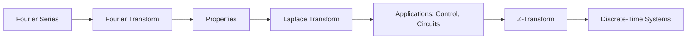

# Chapter 8: Integral Transforms

> **Previous:** [Chapter 7: Numerical Methods](07-numerical-methods.md) | **Next:** [Chapter 9: Optimization](09-optimization.md)

## Learning Objectives

After completing this chapter, you will be able to:

- Compute Fourier series expansions of periodic functions
- Apply the Fourier transform to signals and systems
- Use the Laplace transform for solving ODEs and analyzing systems
- Apply the Z-transform to discrete-time signals and systems
- Understand the relationship between time, frequency, and transform domains
- Apply transforms to signal processing, control, and data analysis

## Chapter at a Glance

| Topic | Key Insight | Practical Takeaway |
|-------|-------------|-------------------|
| Fourier Series | Any periodic function is a sum of sines and cosines | Frequency decomposition of periodic signals |
| Fourier Transform | $F(\omega) = \int_{-\infty}^\infty f(t)e^{-i\omega t}dt$ | Time $\to$ frequency domain conversion |
| Laplace Transform | $F(s) = \int_0^\infty f(t)e^{-st}dt$ | Solving DEs, analyzing control systems |
| Z-Transform | $X(z) = \sum x_n z^{-n}$ | Discrete-time signal and system analysis |
| Convolution | $(f * g)(t) \leftrightarrow F(\omega)G(\omega)$ | Multiplication in transform domain |

## Chapter Roadmap

## Theory

### 8.1 Fourier Series

Any periodic function $f(t)$ with period $T$ can be expressed as:

$$f(t) = a_0 + \sum_{n=1}^\infty \left[a_n \cos\left(\frac{2\pi nt}{T}\right) + b_n \sin\left(\frac{2\pi nt}{T}\right)\right]$$

where:
$$a_0 = \frac{1}{T} \int_0^T f(t)\,dt$$
$$a_n = \frac{2}{T} \int_0^T f(t) \cos\left(\frac{2\pi nt}{T}\right) dt$$
$$b_n = \frac{2}{T} \int_0^T f(t) \sin\left(\frac{2\pi nt}{T}\right) dt$$

**Complex Exponential Form:**
$$f(t) = \sum_{n=-\infty}^\infty c_n e^{i 2\pi nt/T}$$

where $c_n = \frac{1}{T} \int_0^T f(t) e^{-i 2\pi nt/T} dt$.

**Parseval's Identity:**
$$\frac{1}{T} \int_0^T |f(t)|^2 dt = a_0^2 + \frac{1}{2}\sum_{n=1}^\infty (a_n^2 + b_n^2) = \sum_{n=-\infty}^\infty |c_n|^2$$

**Gibbs Phenomenon:** At discontinuities, the Fourier series overshoots by about 9% regardless of the number of terms.

### 8.2 Fourier Transform

**Definition:**
$$F(\omega) = \mathcal{F}\{f(t)\} = \int_{-\infty}^\infty f(t) e^{-i\omega t}\,dt$$

**Inverse Transform:**
$$f(t) = \mathcal{F}^{-1}\{F(\omega)\} = \frac{1}{2\pi} \int_{-\infty}^\infty F(\omega) e^{i\omega t}\,d\omega$$

**Key Properties:**

| Property | Time Domain | Frequency Domain |
|----------|-------------|------------------|
| Linearity | $af(t) + bg(t)$ | $aF(\omega) + bG(\omega)$ |
| Time Shift | $f(t - t_0)$ | $e^{-i\omega t_0} F(\omega)$ |
| Frequency Shift | $e^{i\omega_0 t} f(t)$ | $F(\omega - \omega_0)$ |
| Scaling | $f(at)$ | $\frac{1}{|a|}F(\omega/a)$ |
| Time Derivative | $f'(t)$ | $i\omega F(\omega)$ |
| Frequency Derivative | $t f(t)$ | $i F'(\omega)$ |
| Convolution | $(f * g)(t)$ | $F(\omega)G(\omega)$ |
| Multiplication | $f(t)g(t)$ | $\frac{1}{2\pi}(F * G)(\omega)$ |

**Important Transform Pairs:**

| $f(t)$ | $F(\omega)$ |
|--------|-------------|
| $\delta(t)$ | $1$ |
| $1$ | $2\pi \delta(\omega)$ |
| $e^{-at}u(t)$, $a > 0$ | $\frac{1}{a + i\omega}$ |
| $e^{-a|t|}$ | $\frac{2a}{a^2 + \omega^2}$ |
| $\text{rect}(t/T)$ | $T \text{sinc}(\omega T/2)$ |
| $\text{sinc}(at)$ | $\frac{\pi}{a} \text{rect}(\omega/(2a))$ |
| $\cos(\omega_0 t)$ | $\pi[\delta(\omega-\omega_0) + \delta(\omega+\omega_0)]$ |
| $\sin(\omega_0 t)$ | $i\pi[\delta(\omega+\omega_0) - \delta(\omega-\omega_0)]$ |

### 8.3 Laplace Transform

**Definition:**
$$F(s) = \mathcal{L}\{f(t)\} = \int_0^\infty f(t) e^{-st}\,dt, \quad s = \sigma + i\omega$$

**Region of Convergence (ROC):** Values of $s$ for which the integral converges.

**Properties:**

| Property | Time Domain | Laplace Domain |
|----------|-------------|----------------|
| Linearity | $af(t) + bg(t)$ | $aF(s) + bG(s)$ |
| Time Shift | $f(t-a)u(t-a)$ | $e^{-as}F(s)$ |
| Frequency Shift | $e^{at}f(t)$ | $F(s-a)$ |
| Time Scaling | $f(at)$ | $\frac{1}{a}F(s/a)$ |
| Derivative | $f'(t)$ | $sF(s) - f(0)$ |
| Second Derivative | $f''(t)$ | $s^2F(s) - sf(0) - f'(0)$ |
| Integral | $\int_0^t f(\tau)d\tau$ | $\frac{F(s)}{s}$ |
| Convolution | $(f * g)(t)$ | $F(s)G(s)$ |
| Initial Value | $\lim_{t\to 0^+} f(t)$ | $\lim_{s\to\infty} sF(s)$ |
| Final Value | $\lim_{t\to\infty} f(t)$ | $\lim_{s\to 0} sF(s)$ |

**Transfer Function:** For a linear system with input $x(t)$ and output $y(t)$:

$$H(s) = \frac{Y(s)}{X(s)} = \frac{\text{output Laplace}}{\text{input Laplace}}$$

**Poles and Zeros:** Roots of denominator (poles) and numerator (zeros) of $H(s)$. Pole locations determine system stability: all poles must have $\text{Re}(s) < 0$ for stability.

**Partial Fraction Expansion:**
$$\frac{N(s)}{(s-p_1)(s-p_2)\cdots(s-p_n)} = \frac{r_1}{s-p_1} + \frac{r_2}{s-p_2} + \cdots + \frac{r_n}{s-p_n}$$

For repeated roots: $\frac{r_{1}}{s-p} + \frac{r_{2}}{(s-p)^2} + \cdots$

### 8.4 Z-Transform

**Definition:**
$$X(z) = \mathcal{Z}\{x[n]\} = \sum_{n=-\infty}^\infty x[n] z^{-n}, \quad z \in \mathbb{C}$$

**One-Sided Z-Transform:** $\mathcal{Z}\{x[n]\} = \sum_{n=0}^\infty x[n] z^{-n}$

**Properties:**

| Property | Time Domain | Z-Domain |
|----------|-------------|----------|
| Linearity | $ax[n] + by[n]$ | $aX(z) + bY(z)$ |
| Time Shift | $x[n-k]$ | $z^{-k}X(z)$ |
| Time Advance | $x[n+k]$ | $z^k X(z) - \sum_{m=0}^{k-1} x[m] z^{k-m}$ |
| Scaling | $a^n x[n]$ | $X(z/a)$ |
| Multiplication by $n$ | $n x[n]$ | $-z \frac{dX(z)}{dz}$ |
| Convolution | $(x * y)[n]$ | $X(z) Y(z)$ |
| Initial Value | $x[0]$ | $\lim_{z\to\infty} X(z)$ |

**Inverse Z-Transform:**
$$x[n] = \frac{1}{2\pi i} \oint_C X(z) z^{n-1}\,dz$$

Commonly computed via partial fraction expansion.

**Transfer Function (Discrete):** $H(z) = \frac{Y(z)}{X(z)}$. Stability: all poles inside $|z| = 1$.

### 8.5 Convolution and Correlation

**Continuous Convolution:**
$$(f * g)(t) = \int_{-\infty}^\infty f(\tau) g(t - \tau)\,d\tau$$

**Discrete Convolution:**
$$(x * y)[n] = \sum_{k=-\infty}^\infty x[k] y[n - k]$$

**Cross-Correlation:**
$$R_{fg}(\tau) = \int_{-\infty}^\infty f(t) g(t + \tau)\,dt$$

**Auto-Correlation:**
$$R_{ff}(\tau) = \int_{-\infty}^\infty f(t) f(t + \tau)\,dt$$

### 8.6 Sampling Theorem

**Nyquist-Shannon Sampling Theorem:** A signal $f(t)$ with bandwidth $B$ can be perfectly reconstructed from samples taken at rate $f_s > 2B$.

The critical rate $f_s = 2B$ is the **Nyquist rate**.

**Aliasing:** When $f_s < 2B$, high-frequency components appear as low-frequency artifacts.

**Ideal Reconstruction:**
$$f(t) = \sum_{n=-\infty}^\infty f(nT_s) \text{sinc}\left(\frac{t - nT_s}{T_s}\right)$$

### 8.7 Discrete Fourier Transform (DFT)

**Definition:**
$$X[k] = \sum_{n=0}^{N-1} x[n] e^{-i 2\pi kn/N}, \quad k = 0, 1, \ldots, N-1$$

**Inverse DFT:**
$$x[n] = \frac{1}{N} \sum_{k=0}^{N-1} X[k] e^{i 2\pi kn/N}$$

**Fast Fourier Transform (FFT):** Computes the DFT in $O(N\log N)$ operations (versus $O(N^2)$ for direct computation).

## Examples

### Example 1: Fourier Series

Find the Fourier series for the square wave:

$$f(t) = \begin{cases} 1 & 0 < t < \pi \\ -1 & \pi < t < 2\pi \end{cases}$$

**Solution:** Period $T = 2\pi$, $\omega_0 = 1$.

$a_0 = \frac{1}{2\pi} \int_0^{2\pi} f(t)\,dt = 0$ (odd function)

$a_n = \frac{1}{\pi} \int_0^{2\pi} f(t)\cos(nt)\,dt = 0$ (odd $\times$ even = odd)

$b_n = \frac{1}{\pi} \left[\int_0^\pi 1\cdot\sin(nt)\,dt + \int_\pi^{2\pi} (-1)\cdot\sin(nt)\,dt\right]$

$= \frac{1}{\pi}\left[\frac{-\cos(nt)}{n}\bigg|_0^\pi - \frac{-\cos(nt)}{n}\bigg|_\pi^{2\pi}\right]$

$= \frac{1}{\pi}\left[\frac{-\cos(n\pi) + 1}{n} + \frac{\cos(2n\pi) - \cos(n\pi)}{n}\right]$

$= \frac{1}{n\pi}[1 - \cos(n\pi) + \cos(2n\pi) - \cos(n\pi)] = \frac{2}{n\pi}[1 - (-1)^n]$

So $b_n = \frac{4}{n\pi}$ for odd $n$, $b_n = 0$ for even $n$.

$$f(t) = \frac{4}{\pi}\sum_{k=0}^\infty \frac{\sin((2k+1)t)}{2k+1} = \frac{4}{\pi}\left(\sin t + \frac{1}{3}\sin 3t + \frac{1}{5}\sin 5t + \cdots\right)$$

The approximation improves as we add more terms. With just the first term, we get a sine wave; with 10 terms, the square wave becomes quite sharp.

### Example 2: Fourier Transform

Find the Fourier transform of the Gaussian $f(t) = e^{-at^2}$, $a > 0$.

**Solution:**

$$F(\omega) = \int_{-\infty}^\infty e^{-at^2} e^{-i\omega t}\,dt = \int_{-\infty}^\infty e^{-(at^2 + i\omega t)}\,dt$$

Complete the square: $at^2 + i\omega t = a(t + i\omega/(2a))^2 + \omega^2/(4a)$

$$F(\omega) = e^{-\omega^2/(4a)} \int_{-\infty}^\infty e^{-a(t + i\omega/(2a))^2}\,dt = e^{-\omega^2/(4a)} \cdot \sqrt{\frac{\pi}{a}}$$

So $\mathcal{F}\{e^{-at^2}\} = \sqrt{\frac{\pi}{a}}\, e^{-\omega^2/(4a)}$.

The Fourier transform of a Gaussian is another Gaussian! This is the key property used in the Heisenberg uncertainty principle.

### Example 3: Laplace Transform IVP

Solve $y'' + 3y' + 2y = 0$, $y(0) = 1$, $y'(0) = 2$ using Laplace.

**Solution:**

Taking Laplace transform:
$$(s^2Y - s\cdot1 - 2) + 3(sY - 1) + 2Y = 0$$
$$(s^2 + 3s + 2)Y - s - 2 - 3 = 0$$
$$(s^2 + 3s + 2)Y = s + 5$$
$$Y = \frac{s + 5}{(s+1)(s+2)}$$

Partial fractions:
$$\frac{s + 5}{(s+1)(s+2)} = \frac{A}{s+1} + \frac{B}{s+2}$$
$$s + 5 = A(s+2) + B(s+1)$$

$s = -1$: $4 = A(1) \implies A = 4$
$s = -2$: $3 = B(-1) \implies B = -3$

$$Y = \frac{4}{s+1} - \frac{3}{s+2}$$

Inverse Laplace:
$$y(t) = 4e^{-t} - 3e^{-2t}$$

### Example 4: Z-Transform

Find the Z-transform of $x[n] = a^n u[n]$.

**Solution:**

$$X(z) = \sum_{n=0}^\infty a^n z^{-n} = \sum_{n=0}^\infty (a z^{-1})^n = \frac{1}{1 - az^{-1}} = \frac{z}{z - a}$$

ROC: $|z| > |a|$.

## Summary

- Fourier series decompose periodic functions into sine/cosine harmonics
- The Fourier transform converts between time and frequency domains
- Convolution in time = multiplication in frequency (fundamental for filtering)
- Laplace transform solves ODEs and characterizes system stability via poles
- Z-transform analyzes discrete-time systems similarly
- The sampling theorem dictates minimum sampling rate for digital processing
- The FFT computes discrete Fourier transforms in $O(N\log N)$ time

## Exercises

### Review Questions

1. What conditions guarantee that a Fourier series converges to the function at every point?
2. Explain Parseval's theorem in terms of signal energy
3. How do poles of a system's transfer function determine stability?
4. Compare the Laplace and Fourier transforms — when would you use each?
5. What happens when a signal is sampled below the Nyquist rate?

### Application Problems

1. **Fourier Series:** Find the Fourier series of the triangular wave $f(t) = |t|$ on $[-\pi, \pi]$, periodic with $T = 2\pi$.

2. **Laplace Transform:** Solve $y'' + 4y = \sin(2t)$, $y(0) = 0$, $y'(0) = 0$ using Laplace.

3. **System Response:** For a system with $H(s) = \frac{s+1}{s^2+2s+5}$, find the impulse response and determine stability.

4. **Z-Transform:** Find the Z-transform of $x[n] = n a^n u[n]$.

5. **FFT Application:** Explain how the FFT can be used for efficient polynomial multiplication.

## Notation Reference

| Symbol | Meaning |
|--------|---------|
| $T$ | period |
| $\omega_0$ | fundamental frequency |
| $c_n$ | complex Fourier coefficient |
| $F(\omega)$ | Fourier transform |
| $\mathcal{F}$ | Fourier transform operator |
| $F(s)$ | Laplace transform |
| $\mathcal{L}$ | Laplace transform operator |
| $H(s)$ | transfer function |
| $X(z)$ | Z-transform |
| $ROC$ | region of convergence |
| $f_s$ | sampling frequency |
| $B$ | bandwidth |
| $X[k]$ | DFT coefficient |
| * | convolution operator |
