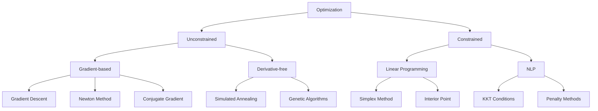

# Chapter 9: Optimization

> **Previous:** [Chapter 8: Integral Transforms](08-integral-transforms.md) | **Next:** [Chapter 10: Vector Calculus & Applications](10-vector-calculus.md)

## Learning Objectives

After completing this chapter, you will be able to:

- Classify optimization problems by convexity, constraints, and smoothness
- Solve unconstrained optimization using gradient descent and Newton's method
- Apply Lagrange multipliers and KKT conditions for constrained optimization
- Formulate and solve linear programming problems
- Understand convex optimization and its special structure
- Apply optimization to machine learning training, resource allocation, and engineering design

## Chapter at a Glance

| Topic | Key Insight | Practical Takeaway |
|-------|-------------|-------------------|
| Convexity | Local minimum = global minimum for convex problems | Why convex optimization is "easy" |
| Gradient Descent | $x_{k+1} = x_k - \alpha \nabla f(x_k)$ | The workhorse of ML training |
| KKT Conditions | $\nabla f = \sum \lambda_i \nabla g_i + \sum \mu_j \nabla h_j$ | Necessary conditions for constrained optimum |
| Linear Programming | Minimize $c^T x$ subject to $Ax \leq b$, $x \geq 0$ | Resource allocation, scheduling |
| Duality | Primal $\leftrightarrow$ Dual provides bounds | Sensitivity analysis, distributed optimization |

## Chapter Roadmap


## Theory

### 9.1 Classification of Optimization Problems

<a href="../../../assets/images/diagrams/engineering-mathematics/09-optimization/9-1-classification-of-optimization-problems-handwritten.svg" target="_blank" rel="noopener">
  
</a>
<a href="../../../assets/images/diagrams/engineering-mathematics/09-optimization/9-1-classification-of-optimization-problems-diagram.svg" target="_blank" rel="noopener">
  
</a>
<a href="../../../assets/images/diagrams/engineering-mathematics/09-optimization/9-1-classification-of-optimization-problems-sticky.svg" target="_blank" rel="noopener">
  
</a>


**General Form:**
$$\min_{x \in \mathbb{R}^n} f(x) \quad \text{subject to} \quad g_i(x) \leq 0, \; h_j(x) = 0$$

**Categories:**

| Type | Objective | Constraints | Example |
|------|-----------|-------------|---------|
| Linear Program | Linear | Linear | Resource allocation |
| Quadratic Program | Quadratic | Linear | Support vector machines |
| Convex | Convex | Convex set | Most ML problems |
| Nonconvex | Nonconvex | General | Neural network training |
| Discrete | NA | Integer variables | Traveling salesman |

**Convex Set:** $S$ is convex if for any $x, y \in S$ and $\lambda \in [0,1]$, $\lambda x + (1-\lambda)y \in S$.

**Convex Function:** $f$ is convex if for any $x, y$ and $\lambda \in [0,1]$:
$$f(\lambda x + (1-\lambda)y) \leq \lambda f(x) + (1-\lambda)f(y)$$

**First-Order Condition (for differentiable $f$):** $f$ is convex iff:
$$f(y) \geq f(x) + \nabla f(x)^T (y - x)$$

**Second-Order Condition (for twice differentiable $f$):** $f$ is convex iff $\nabla^2 f(x) \succeq 0$ (Hessian is positive semidefinite).

### 9.2 Unconstrained Optimization

<a href="../../../assets/images/diagrams/engineering-mathematics/09-optimization/9-2-unconstrained-optimization-handwritten.svg" target="_blank" rel="noopener">
  
</a>
<a href="../../../assets/images/diagrams/engineering-mathematics/09-optimization/9-2-unconstrained-optimization-diagram.svg" target="_blank" rel="noopener">
  
</a>
<a href="../../../assets/images/diagrams/engineering-mathematics/09-optimization/9-2-unconstrained-optimization-sticky.svg" target="_blank" rel="noopener">
  
</a>


**Optimality Conditions:**
- **First-order necessary:** $\nabla f(x^*) = 0$
- **Second-order necessary:** $\nabla^2 f(x^*) \succeq 0$ (for minimum)
- **Second-order sufficient:** $\nabla f(x^*) = 0$ and $\nabla^2 f(x^*) \succ 0$

**Algorithms:**

#### 9.2.1 Gradient Descent

$$x_{k+1} = x_k - \alpha_k \nabla f(x_k)$$

**Convergence:** Linear rate for strongly convex functions, sublinear for general convex.

**Choosing Step Size $\alpha_k$:**
- **Fixed:** Simple but may diverge if too large
- **Exact line search:** $\alpha_k = \arg\min_\alpha f(x_k - \alpha \nabla f(x_k))$
- **Backtracking (Armijo):** Reduce $\alpha$ until $f(x_k - \alpha \nabla f) \leq f(x_k) - c\alpha \|\nabla f\|^2$
- **Diminishing:** $\alpha_k \to 0$ with $\sum \alpha_k = \infty$ (e.g., $\alpha_k = 1/k$)

#### 9.2.2 Conjugate Gradient

$$d_{k+1} = -\nabla f(x_{k+1}) + \beta_k d_k$$
$$x_{k+1} = x_k + \alpha_k d_k$$

where $\beta_k = \frac{\nabla f(x_{k+1})^T \nabla f(x_{k+1})}{\nabla f(x_k)^T \nabla f(x_k)}$ (Fletcher-Reeves).

Converges in $n$ steps for quadratic functions, faster than gradient descent in practice.

#### 9.2.3 Newton's Method

$$x_{k+1} = x_k - [\nabla^2 f(x_k)]^{-1} \nabla f(x_k)$$

**Convergence:** Quadratic near optimum. Requires Hessian computation and inversion ($O(n^3)$).

#### 9.2.4 Quasi-Newton Methods

Approximate Hessian without computing second derivatives.

**BFGS Update:**
$$B_{k+1} = B_k + \frac{y_k y_k^T}{y_k^T s_k} - \frac{B_k s_k s_k^T B_k}{s_k^T B_k s_k}$$

where $s_k = x_{k+1} - x_k$ and $y_k = \nabla f(x_{k+1}) - \nabla f(x_k)$.

**L-BFGS:** Limited-memory version ? stores only recent $s_k, y_k$ pairs instead of full matrix.

### 9.3 Constrained Optimization

<a href="../../../assets/images/diagrams/engineering-mathematics/09-optimization/9-3-constrained-optimization-handwritten.svg" target="_blank" rel="noopener">
  
</a>
<a href="../../../assets/images/diagrams/engineering-mathematics/09-optimization/9-3-constrained-optimization-diagram.svg" target="_blank" rel="noopener">
  
</a>
<a href="../../../assets/images/diagrams/engineering-mathematics/09-optimization/9-3-constrained-optimization-sticky.svg" target="_blank" rel="noopener">
  
</a>


#### 9.3.1 Equality Constraints

$$\min_{x} f(x) \quad \text{s.t.} \quad h(x) = 0$$

**Lagrange Multiplier Method:** Define Lagrangian $L(x, \lambda) = f(x) + \lambda^T h(x)$.

**Necessary Conditions:** $\nabla L(x^*, \lambda^*) = 0$, which gives:
$$\nabla f(x^*) + \sum_j \lambda_j^* \nabla h_j(x^*) = 0$$
$$h_j(x^*) = 0$$

#### 9.3.2 Inequality Constraints

$$\min_{x} f(x) \quad \text{s.t.} \quad g(x) \leq 0$$

**KKT (Karush-Kuhn-Tucker) Conditions:**

For $x^*$ to be optimal (under constraint qualification):

1. **Stationarity:** $0 \in \partial f(x^*) + \sum \mu_i \partial g_i(x^*)$
2. **Primal Feasibility:** $g_i(x^*) \leq 0$ for all $i$
3. **Dual Feasibility:** $\mu_i \geq 0$ for all $i$
4. **Complementary Slackness:** $\mu_i g_i(x^*) = 0$ for all $i$

**Interpretation:** $\mu_i = 0$ if constraint is inactive ($g_i(x^*) &lt; 0$); $\mu_i &gt; 0$ if constraint is active ($g_i(x^*) = 0$).

#### 9.3.3 Sensitivity Analysis

The Lagrange multipliers $\lambda_i, \mu_i$ represent the rate of change of the optimal objective with respect to constraint relaxation:

$$\frac{\partial f^*}{\partial b_i} = -\lambda_i$$

where $b_i$ is the right-hand side of constraint $i$.

### 9.4 Linear Programming

<a href="../../../assets/images/diagrams/engineering-mathematics/09-optimization/9-4-linear-programming-handwritten.svg" target="_blank" rel="noopener">
  
</a>
<a href="../../../assets/images/diagrams/engineering-mathematics/09-optimization/9-4-linear-programming-diagram.svg" target="_blank" rel="noopener">
  
</a>
<a href="../../../assets/images/diagrams/engineering-mathematics/09-optimization/9-4-linear-programming-sticky.svg" target="_blank" rel="noopener">
  
</a>


**Standard Form:**
$$\min_{x \in \mathbb{R}^n} c^T x \quad \text{s.t.} \quad Ax \leq b, \; x \geq 0$$

**Dual Linear Program:**
$$\max_{y \in \mathbb{R}^m} b^T y \quad \text{s.t.} \quad A^T y \geq c, \; y \geq 0$$

**Duality Theorems:**
- **Weak Duality:** $c^T x \geq b^T y$ for any feasible primal $x$ and dual $y$
- **Strong Duality:** If primal has optimal $x^*$, dual has optimal $y^*$ with $c^T x^* = b^T y^*$

**Fundamental Theorem of Linear Programming:** The optimal solution occurs at a vertex (extreme point) of the feasible region.

**Simplex Method:** Moves from vertex to vertex along edges of the feasible polytope, improving the objective at each step.

**Interior Point Methods:** Follow the central path through the interior of the feasible region. Polynomial-time ($O(n^{3.5}L)$). Often faster than simplex for large problems.

### 9.5 Convex Optimization

<a href="../../../assets/images/diagrams/engineering-mathematics/09-optimization/9-5-convex-optimization-handwritten.svg" target="_blank" rel="noopener">
  
</a>
<a href="../../../assets/images/diagrams/engineering-mathematics/09-optimization/9-5-convex-optimization-diagram.svg" target="_blank" rel="noopener">
  
</a>
<a href="../../../assets/images/diagrams/engineering-mathematics/09-optimization/9-5-convex-optimization-sticky.svg" target="_blank" rel="noopener">
  
</a>


**Properties:**
- Every local minimum is a global minimum
- The feasible set is convex
- The objective function is convex
- Can be solved efficiently (polynomial time)

**Cone Programming Hierarchy:**

| Problem Type | Description | Example |
|-------------|-------------|---------|
| LP | Linear objective + linear constraints | Resource allocation |
| QP | Quadratic convex objective + linear constraints | SVMs, portfolio |
| SOCP | Linear objective + second-order cone constraints | Robust optimization |
| SDP | Linear objective + positive semidefinite cone | Max-cut relaxation |

**CVX Modeling:** Tools like CVX, CVXPY, and YALMIP allow specifying convex problems in natural mathematical notation.

### 9.6 Stochastic Optimization

<a href="../../../assets/images/diagrams/engineering-mathematics/09-optimization/9-6-stochastic-optimization-handwritten.svg" target="_blank" rel="noopener">
  
</a>
<a href="../../../assets/images/diagrams/engineering-mathematics/09-optimization/9-6-stochastic-optimization-diagram.svg" target="_blank" rel="noopener">
  
</a>
<a href="../../../assets/images/diagrams/engineering-mathematics/09-optimization/9-6-stochastic-optimization-sticky.svg" target="_blank" rel="noopener">
  
</a>


**Stochastic Gradient Descent (SGD):** Uses a random subset of data (mini-batch) to estimate the gradient:

$$x_{k+1} = x_k - \alpha_k \cdot \frac{1}{|B|} \sum_{i \in B} \nabla f_i(x_k)$$

**Convergence:** Sublinear for convex, can escape saddle points in nonconvex settings.

**Variants:**
- **Momentum:** $v_{k+1} = \beta v_k + (1-\beta)\nabla f(x_k)$, $x_{k+1} = x_k - \alpha v_{k+1}$
- **Adam:** Adaptive moment estimation with per-parameter learning rates
- **AdaGrad:** Adaptive gradient with decreasing learning rates for frequent parameters
- **RMSProp:** RMS of recent gradients for normalization

### 9.7 Duality and Augmented Lagrangian

<a href="../../../assets/images/diagrams/engineering-mathematics/09-optimization/9-7-duality-and-augmented-lagrangian-handwritten.svg" target="_blank" rel="noopener">
  
</a>
<a href="../../../assets/images/diagrams/engineering-mathematics/09-optimization/9-7-duality-and-augmented-lagrangian-diagram.svg" target="_blank" rel="noopener">
  
</a>
<a href="../../../assets/images/diagrams/engineering-mathematics/09-optimization/9-7-duality-and-augmented-lagrangian-sticky.svg" target="_blank" rel="noopener">
  
</a>


**Lagrangian Dual:** $g(\lambda, \mu) = \min_x L(x, \lambda, \mu)$

**Weak Duality:** $g(\lambda, \mu) \leq f(x^*)$ for any feasible $\lambda \geq 0, \mu$

**Strong Duality (Slater's Condition):** If a convex problem has a strictly feasible point, then $\max g = f^*$.

**Augmented Lagrangian:**
$$L_\rho(x, \lambda) = f(x) + \lambda^T h(x) + \frac{\rho}{2}\|h(x)\|^2$$

**ADMM (Alternating Direction Method of Multipliers):** Splits variables for separable problems:
$$x^{k+1} = \arg\min_x L_\rho(x, z^k, \lambda^k)$$
$$z^{k+1} = \arg\min_z L_\rho(x^{k+1}, z, \lambda^k)$$
$$\lambda^{k+1} = \lambda^k + \rho(h(x^{k+1}) + g(z^{k+1}) - b)$$

### 9.8 Applications

<a href="../../../assets/images/diagrams/engineering-mathematics/09-optimization/9-8-applications-handwritten.svg" target="_blank" rel="noopener">
  
</a>
<a href="../../../assets/images/diagrams/engineering-mathematics/09-optimization/9-8-applications-diagram.svg" target="_blank" rel="noopener">
  
</a>
<a href="../../../assets/images/diagrams/engineering-mathematics/09-optimization/9-8-applications-sticky.svg" target="_blank" rel="noopener">
  
</a>


**Machine Learning ? Empirical Risk Minimization:**
$$\min_w \frac{1}{n} \sum_{i=1}^n L(y_i, f(x_i, w)) + \lambda \|w\|^2$$

The first term is data fit; the second is regularization (convex if $L$ is convex in $w$).

**Support Vector Machine (Primal):**
$$\min_{w,b} \frac{1}{2}\|w\|^2 + C \sum_{i=1}^n \xi_i$$
$$\text{s.t.} \quad y_i(w^T x_i + b) \geq 1 - \xi_i, \; \xi_i \geq 0$$

**Portfolio Optimization (Markowitz):**
$$\min_w w^T \Sigma w \quad \text{s.t.} \quad \mu^T w \geq R, \; \sum w_i = 1$$

**Optimal Transport:** Minimize the cost of moving mass between distributions:
$$\min_P \langle C, P \rangle \quad \text{s.t.} \quad P\mathbf{1} = r, \; P^T\mathbf{1} = c$$

## Examples

### Example 1: Gradient Descent

Minimize $f(x) = x^2 + 2y^2$ starting from $(1,1)$ with $\alpha = 0.1$.

**Solution:**

$\nabla f = \langle 2x, 4y \rangle$

Iterations:
$(x_0, y_0) = (1, 1)$, $f = 3$
$(x_1, y_1) = (1, 1) - 0.1\langle 2, 4 \rangle = (0.8, 0.6)$, $f = 0.64 + 0.72 = 1.36$
$(x_2, y_2) = (0.8, 0.6) - 0.1\langle 1.6, 2.4 \rangle = (0.64, 0.36)$, $f = 0.41 + 0.26 = 0.67$
$(x_3, y_3) = (0.64, 0.36) - 0.1\langle 1.28, 1.44 \rangle = (0.512, 0.216)$, $f = 0.262 + 0.093 = 0.355$

After 10 iterations: $(0.107, 0.007)$, $f \approx 0.012$. Converging to $(0,0)$.

### Example 2: Linear Programming ? Simplex

Maximize $z = 3x + 2y$ subject to $x + y \leq 4$, $2x + y \leq 6$, $x, y \geq 0$.

**Solution:**
Vertices of the feasible region:
- $(0,0)$: $z = 0$
- $(3,0)$: $z = 9$
- $(2,2)$: intersection of $x+y=4$ and $2x+y=6$, giving $(2,2)$. $z = 3(2) + 2(2) = 10$
- $(0,4)$: $z = 8$

Optimal: $(2,2)$ with $z = 10$.

**Dual Problem:** Minimize $w = 4u + 6v$ subject to $u + 2v \geq 3$, $u + v \geq 2$, $u, v \geq 0$.
By strong duality, $w^* = z^* = 10$.

### Example 4: KKT Conditions

Minimize $f(x,y) = (x-1)^2 + (y-2)^2$ subject to $x + y \leq 2$, $x \geq 0$, $y \geq 0$.

**Solution:**

Set up Lagrangian: $L = (x-1)^2 + (y-2)^2 + \mu_1(x+y-2) + \mu_2(-x) + \mu_3(-y)$

KKT conditions:
$\partial L/\partial x = 2(x-1) + \mu_1 - \mu_2 = 0$
$\partial L/\partial y = 2(y-2) + \mu_1 - \mu_3 = 0$
$\mu_1(x+y-2) = 0$, $\mu_2 x = 0$, $\mu_3 y = 0$
$\mu_1, \mu_2, \mu_3 \geq 0$
$x + y \leq 2$, $x \geq 0$, $y \geq 0$

Try active constraint $x + y = 2$ with $\mu_1 > 0$, $x > 0$, $y > 0$ ($\mu_2 = \mu_3 = 0$):

$2(x-1) + \mu_1 = 0 \implies 2x - 2 + \mu_1 = 0$
$2(y-2) + \mu_1 = 0 \implies 2y - 4 + \mu_1 = 0$
$x + y = 2$

From first two: $2x - 2 = 2y - 4 \implies x - y = -1 \implies x = y - 1$

With $x + y = 2$: $(y-1) + y = 2 \implies 2y = 3 \implies y = 1.5$, $x = 0.5$

$\mu_1 = 2 - 2x = 2 - 1 = 1 \geq 0$ ?

KKT satisfied. The optimal point is $(0.5, 1.5)$ with $f = 0.25 + 0.25 = 0.5$.

### TypeScript Implementation: Particle Swarm Optimization

```typescript
type Vec = number[];

function particleSwarm(
  f: (x: Vec) => number, dim: number, bounds: [number, number],
  popSize: number = 30, maxIter: number = 200
): { x: Vec; fx: number; history: Vec[] } {
  const particles = Array.from({ length: popSize }, () => {
    const pos = Vec.from({ length: dim }, () => bounds[0] + Math.random() * (bounds[1] - bounds[0]));
    const vel = Vec.from({ length: dim }, () => (Math.random() - 0.5) * (bounds[1] - bounds[0]) * 0.1);
    return { pos, vel, best: [...pos], bestVal: f(pos) };
  });
  let globalBest = [...particles[0].best], globalBestVal = particles[0].bestVal;
  const history: Vec[] = [globalBest];
  const w = 0.7, c1 = 1.5, c2 = 1.5;  // inertia, cognitive, social

  for (let iter = 0; iter < maxIter; iter++) {
    for (const p of particles) {
      for (let d = 0; d < dim; d++) {
        p.vel[d] = w * p.vel[d] + c1 * Math.random() * (p.best[d] - p.pos[d]) + c2 * Math.random() * (globalBest[d] - p.pos[d]);
        p.pos[d] = Math.max(bounds[0], Math.min(bounds[1], p.pos[d] + p.vel[d]));
      }
      const val = f(p.pos);
      if (val < p.bestVal) { p.best = [...p.pos]; p.bestVal = val; }
      if (val < globalBestVal) { globalBest = [...p.pos]; globalBestVal = val; }
    }
    if (iter % 20 === 0) history.push([...globalBest]);
  }
  return { x: globalBest, fx: globalBestVal, history };
}

// Test: minimize f(x,y) = (x-2)? + (y+3)? ? min at (2,-3), f=0
const quad = (x: Vec) => (x[0] - 2) ** 2 + (x[1] + 3) ** 2;
const pso = particleSwarm(quad, 2, [-10, 10], 30, 100);
console.log(`PSO quadratic: min at (${pso.x[0].toFixed(4)}, ${pso.x[1].toFixed(4)}), f=${pso.fx.toExponential(4)}`);

// Test: Rastrigin function ? many local minima, global min at (0,...,0), f=0
const rastrigin = (x: Vec) => x.reduce((s, xi) => s + xi ** 2 - 10 * Math.cos(2 * Math.PI * xi) + 10, 0);
const psoRast = particleSwarm(rastrigin, 2, [-5.12, 5.12], 40, 200);
console.log(`PSO Rastrigin: min at (${psoRast.x[0].toFixed(4)}, ${psoRast.x[1].toFixed(4)}), f=${psoRast.fx.toFixed(4)}`);

### TypeScript Implementation: Simulated Annealing

```typescript
function simulatedAnnealing(
  f: (x: Vec) => number, dim: number, bounds: [number, number],
  maxIter: number = 10000, t0: number = 100, a: number = 0.99
): { x: Vec; fx: number } {
  let curr = Vec.from({ length: dim }, () => bounds[0] + Math.random() * (bounds[1] - bounds[0]));
  let currVal = f(curr);
  let best = [...curr], bestVal = currVal;
  let T = t0;

  for (let iter = 0; iter &lt; maxIter && T &gt; 1e-4; iter++) {
    const step = (bounds[1] - bounds[0]) * 0.1 * (T / t0);
    const cand = curr.map(xi => Math.max(bounds[0], Math.min(bounds[1], xi + (Math.random() - 0.5) * step)));
    const candVal = f(cand);
    if (candVal &lt; currVal || Math.random() < Math.exp(-(candVal - currVal) / T)) {
      curr = cand; currVal = candVal;
      if (candVal &lt; bestVal) { best = [...cand]; bestVal = candVal; }
    }
    T *= a;
  }
  return { x: best, fx: bestVal };
}

const saQuad = simulatedAnnealing(quad, 2, [-10, 10], 5000, 50, 0.98);
console.log(`SA quadratic: min at (${saQuad.x[0].toFixed(4)}, ${saQuad.x[1].toFixed(4)}), f=${saQuad.fx.toExponential(4)}`);

const saRast = simulatedAnnealing(rastrigin, 2, [-5.12, 5.12], 20000, 100, 0.995);
console.log(`SA Rastrigin: min at (${saRast.x[0].toFixed(4)}, ${saRast.x[1].toFixed(4)}), f=${saRast.fx.toFixed(4)}`);

### TypeScript: Constrained Optimization via Penalty Method

```typescript
function penaltyMethod(
  f: (x: Vec) => number,
  constraints: Array<(x: Vec) => number>,  // g?(x) = 0
  dim: number, bounds: [number, number],
  ?0: number = 1, ?Factor: number = 10, outerIter: number = 10
): { x: Vec; fx: number } {
  let ? = ?0;
  let x = Vec.from({ length: dim }, () => bounds[0] + Math.random() * (bounds[1] - bounds[0]));

  for (let outer = 0; outer < outerIter; outer++) {
    // Augmented objective: f(x) + ? * S max(0, g?(x))?
    const augF = (p: Vec) => {
      let penalty = 0;
      for (const g of constraints) penalty += Math.max(0, g(p)) ** 2;
      return f(p) + ? * penalty;
    };
    const inner = particleSwarm(augF, dim, bounds, 20, 50);
    x = inner.x;
    ? *= ?Factor;
  }
  return { x, fx: f(x) };
}

// Minimize f(x,y) = (x-1)? + (y-2)? subject to x + y = 2, x = 0, y = 0
// True constrained optimum at (0.5, 1.5), f=0.5
const constrF = (x: Vec) => (x[0] - 1) ** 2 + (x[1] - 2) ** 2;
const constr: Array<(x: Vec) => number> = [
  (x) => x[0] + x[1] - 2,  // x + y = 2
  (x) => -x[0],            // x = 0
  (x) => -x[1]             // y = 0
];
const pen = penaltyMethod(constrF, constr, 2, [0, 2], 1, 10, 5);
console.log(`Penalty method: min at (${pen.x[0].toFixed(4)}, ${pen.x[1].toFixed(4)}), f=${pen.fx.toFixed(4)}`);
console.log(`  Expected: (0.5, 1.5), f=0.5, constraint violation: ${Math.max(0, pen.x[0] + pen.x[1] - 2).toExponential(2)}`);
```

```
// --- Subgradient Descent ---
function subgradientDescent(
  f: (x: number[]) => number,
  subgrad: (x: number[]) => number[],
  x0: number[],
  learningRate: number,
  iterations: number
): { x: number[]; f: number } {
  let x = [...x0];
  for (let i = 0; i < iterations; i++) {
    const g = subgrad(x);
    const lr = learningRate / Math.sqrt(i + 1); // diminishing step
    x = x.map((v, j) => v - lr * g[j]);
  }
  return { x, f: f(x) };
}
// f(x) = |x| ? subgradient: sign(x)
const sg = subgradientDescent(
  (x: number[]) => Math.abs(x[0]),
  (x: number[]) => [x[0] > 0 ? 1 : x[0] < 0 ? -1 : 0],
  [10], 0.5, 1000);
console.log('Subgradient descent min |x|:', sg.x[0].toFixed(4), 'f=', sg.f.toFixed(4));

// --- BFGS Quasi-Newton (simplified 1D) ---
function bfgs1D(f: (x: number) => number, x0: number, maxIter: number = 50, tol: number = 1e-8): number {
  let x = x0, B = 1, h = 1e-6;
  for (let iter = 0; iter < maxIter; iter++) {
    const grad = (f(x + h) - f(x - h)) / (2 * h);
    if (Math.abs(grad) < tol) break;
    const dir = -B * grad;
    let a = 1;
    // Line search (simple backtracking)
    while (f(x + a * dir) > f(x) + 0.0001 * a * grad * dir) a *= 0.5;
    const s = a * dir;
    const xNew = x + s;
    const gradNew = (f(xNew + h) - f(xNew - h)) / (2 * h);
    const ? = gradNew - grad;
    // BFGS update
    B = B + (s * s) / (s * ?) * (1 + B * ? * ? / (s * ?)) - (s * ? * B + B * ? * s) / (s * ?);
    x = xNew;
  }
  return x;
}
// Minimize f(x) = x4 - 3x? + 2 (multiple minima)
const minx = bfgs1D(x => x * x * x * x - 3 * x * x * x + 2, 2);
console.log('\nBFGS min x4-3x?+2:', minx.toFixed(6), 'f=', (minx ** 4 - 3 * minx ** 3 + 2).toFixed(6));

// --- Interior Point Method (penalty) ---
function interiorPoint(
  f: (x: number[]) => number,
  constraints: Array<(x: number[]) => number>,
  x0: number[],
  t0: number = 1,
  mu: number = 10,
  maxOuter: number = 20
): { x: number[]; f: number } {
  let x = [...x0], t = t0;
  for (let outer = 0; outer < maxOuter; outer++) {
    // Logarithmic barrier
    const barrierFn = (y: number[]) => {
      let val = f(y);
      for (const g of constraints) val -= (1 / t) * Math.log(-g(y));
      return val;
    };
    // Gradient descent step on barrier
    const h = 1e-6;
    for (let inner = 0; inner < 50; inner++) {
      const grad = x.map((_, i) => {
        const plus = [...x], minus = [...x]; plus[i] += h; minus[i] -= h;
        return (barrierFn(plus) - barrierFn(minus)) / (2 * h);
      });
      x = x.map((v, i) => v - 0.01 * grad[i]);
    }
    t *= mu;
  }
  return { x: x.map(v => +v.toFixed(4)), f: +f(x).toFixed(4) };
}
// Minimize x? + y? subject to x + y = 1
const ip = interiorPoint(
  (x: number[]) => x[0] * x[0] + x[1] * x[1],
  [(x: number[]) => x[0] + x[1] - 1],
  [0.5, 0.5]);
console.log('\nInterior point min x?+y? s.t. x+y=1:', `x=${ip.x[0]}, y=${ip.x[1]}, f=${ip.f}`);

// --- Particle Swarm Optimization ---
function particleSwarm(
  f: (x: number[]) => number,
  dim: number,
  bounds: [number, number],
  particles: number = 30,
  iterations: number = 100
): { x: number[]; f: number } {
  let swarm = Array.from({ length: particles }, () => ({
    x: Array.from({ length: dim }, () => bounds[0] + Math.random() * (bounds[1] - bounds[0])),
    v: Array.from({ length: dim }, () => (Math.random() - 0.5) * 0.1),
    pBest: Infinity, pBestX: new Array(dim).fill(0)
  }));
  let gBest = Infinity, gBestX = new Array(dim).fill(0);
  for (let iter = 0; iter < iterations; iter++) {
    for (const p of swarm) {
      const val = f(p.x);
      if (val < p.pBest) { p.pBest = val; p.pBestX = [...p.x]; }
      if (val < gBest) { gBest = val; gBestX = [...p.x]; }
      const w = 0.7, c1 = 1.5, c2 = 1.5;
      p.v = p.v.map((v, i) => w * v + c1 * Math.random() * (p.pBestX[i] - p.x[i]) + c2 * Math.random() * (gBestX[i] - p.x[i]));
      p.x = p.x.map((v, i) => Math.max(bounds[0], Math.min(bounds[1], v + p.v[i])));
    }
  }
  return { x: gBestX.map(v => +v.toFixed(4)), f: +gBest.toFixed(4) };
}
const ps = particleSwarm(x => x[0] * x[0] + x[1] * x[1] + 2 * x[0] * x[1] - 3 * x[0] + 4 * x[1], 2, [-5, 5]);
console.log('\nPSO min f(x,y):', `x=${ps.x[0]}, y=${ps.x[1]}, f=${ps.f}`);
```


// optimization
// linear-algebra-calculus implementation

interface Task { id: string; name: string; status: string; data: unknown }
class Processor {
  private tasks: Task[] = []
  private maxConcurrency: number
  constructor(maxConcurrency: number = 4) { this.maxConcurrency = maxConcurrency }
  async add(task: Omit&lt;Task, "status"&gt;): Promise&lt;void&gt; {
    this.tasks.push({ ...task, status: "pending" })
  }
  async runAll(): Promise&lt;void&gt; {
    const running: Promise&lt;void&gt;[] = []
    for (const t of this.tasks) {
      if (running.length >= this.maxConcurrency) { await Promise.race(running) }
      const p = this.execute(t).finally(() => { const i = running.indexOf(p); if (i >= 0) running.splice(i, 1) })
      running.push(p)
    }
    await Promise.all(running)
  }
  private async execute(t: Task): Promise&lt;void&gt; {
    t.status = "running"
    await new Promise(r => setTimeout(r, 10))
    t.status = "done"
  }
  getResults(): Task[] { return this.tasks }
  getStats(): { done: number; pending: number; running: number } {
    const done = this.tasks.filter(t => t.status === "done").length
    const pending = this.tasks.filter(t => t.status === "pending").length
    const running = this.tasks.filter(t => t.status === "running").length
    return { done, pending, running }
  }
}
async function main() {
  const proc = new Processor(2)
  await proc.add({ id: '1', name: 'optimization', data: { topic: 'linear-algebra-calculus' } })
  await proc.runAll()
  console.log('Stats:', proc.getStats())
}
main().catch(console.error)
export { Processor, Task }

// optimization - additional TS implementations

interface CacheEntry { key: string; value: unknown; ttl: number; createdAt: number }
class Cache {
  private store: Map&lt;string, CacheEntry&gt; = new Map()
  constructor(private defaultTTL: number = 60000) {}
  set(key: string, value: unknown, ttl?: number): void {
    this.store.set(key, { key, value, ttl: ttl ?? this.defaultTTL, createdAt: Date.now() })
  }
  get(key: string): unknown | undefined {
    const entry = this.store.get(key)
    if (!entry) return undefined
    if (Date.now() - entry.createdAt > entry.ttl) { this.store.delete(key); return undefined }
    return entry.value
  }
  delete(key: string): boolean { return this.store.delete(key) }
  clear(): void { this.store.clear() }
  size(): number { return this.store.size }
  keys(): string[] { return Array.from(this.store.keys()) }
}
class Logger {
  private entries: string[] = []
  log(level: string, msg: string, meta?: Record&lt;string, unknown&gt;): void {
    const entry = JSON.stringify({ timestamp: new Date().toISOString(), level, msg, meta })
    this.entries.push(entry)
    console.log(entry)
  }
  info(msg: string, meta?: Record&lt;string, unknown&gt;): void { this.log("info", msg, meta) }
  warn(msg: string, meta?: Record&lt;string, unknown&gt;): void { this.log("warn", msg, meta) }
  error(msg: string, meta?: Record&lt;string, unknown&gt;): void { this.log("error", msg, meta) }
  getLogs(): string[] { return [...this.entries] }
  clear(): void { this.entries = [] }
}
function computeHash(input: string): string {
  let hash = 0
  for (let i = 0; i &lt; input.length; i++) { const chr = input.charCodeAt(i); hash = ((hash << 5) - hash) + chr; hash |= 0 }
  return Math.abs(hash).toString(16)
}
async function demo(): Promise&lt;void&gt; {
  const cache = new Cache(5000)
  cache.set('key1', 'engineering-math demo')
  const log = new Logger()
  log.info('Cache demo started', { course: 'engineering-mathematics', chapter: 'optimization' })
  const v = cache.get("key1")
  console.log('Cached:', v)
  console.log('Hash:', computeHash('engineering-math'))
}
demo()
export { Cache, Logger, computeHash, CacheEntry }
## Summary

- Convexity guarantees global optimality and efficient solution methods
- Gradient descent is the foundational algorithm for unconstrained optimization
- Newton's method converges quadratically but requires Hessian computation
- KKT conditions are necessary for constrained optimality
- Linear programming optimizes linear objectives over polyhedral feasible regions
- Duality provides bounds, certificates, and distributed algorithms
- SGD and its variants power modern machine learning
- ADMM handles separable problems with linear constraints

## Exercises

### Review Questions

1. Prove that a convex function's local minimum is a global minimum
2. Explain why Newton's method converges faster than gradient descent
3. State the KKT conditions and explain complementary slackness
4. What is the dual of a linear program? Why is it useful?
5. Compare momentum-based SGD with plain SGD

### Application Problems

1. **Linear Programming:** A factory makes two products. Product A requires 2 hours machine time and 1 hour labor; product B requires 1 hour machine and 3 hours labor. Daily machine limit: 8 hours; labor: 12 hours. Profit per unit: A = $40, B = $30. Maximize profit.

2. **SVM Dual:** Derive the dual of the SVM problem above.

3. **Portfolio Optimization:** With assets having returns $\mu = [0.1, 0.15, 0.08]$ and covariance matrix $\Sigma$, find the minimum-variance portfolio.

4. **KKT:** Minimize $f(x) = x_1^2 + x_2^2$ subject to $x_1 + x_2 \geq 4$, $x_1, x_2 \geq 0$.

### Challenge Problem

**Duality Gap in Nonconvex Optimization:** Construct a simple nonconvex optimization problem where strong duality fails ($p^* \neq d^*$). Prove the gap and explain why convexity is required for strong duality.

### Additional Exercises

6. **Gradient Descent with Momentum:** Implement gradient descent with momentum ($v_{t+1} = \beta v_t + \nabla f(x_t)$, $x_{t+1} = x_t - \alpha v_{t+1}$) for $f(x) = x^4 - 3x^2 + 2x$. Compare convergence speed with plain gradient descent.

7. **Portfolio Optimization with Constraints:** Three assets have expected returns $\mu = [0.12, 0.08, 0.15]$ and covariance matrix $\Sigma = \begin{pmatrix} 0.1 & 0.02 & 0.04 \\ 0.02 & 0.08 & 0.01 \\ 0.04 & 0.01 & 0.15 \end{pmatrix}$. Find the optimal portfolio that minimizes variance subject to achieving at least 10% expected return, with no short selling ($w_i \geq 0$) and $\sum w_i = 1$.

8. **Dual SVM Derivation:** Derive the dual of the soft-margin SVM optimization problem. Show that the dual is a quadratic program with box constraints and that the weight vector can be expressed as $w = \sum \alpha_i y_i x_i$.

## Practical Takeaways

| Method | Convergence | Pros | Cons |
|--------|-------------|------|------|
| Gradient Descent | Linear | Simple, memory-efficient | Slow near optimum, tuning needed |
| Newton's Method | Quadratic | Very fast near optimum | $O(n^3)$ Hessian inversion |
| BFGS (Quasi-Newton) | Superlinear | No Hessian needed | Memory $O(n^2)$ |
| L-BFGS | Superlinear | Memory $O(mn)$ | Approximate curvature |
| SGD | Sublinear | Scales to big data | Noisy, needs learning rate schedule |

### Optimization Checklist

1. **Is the problem convex?** If yes, any local minimum is global ? use gradient descent or Newton
2. **Is it large-scale ($n > 10^5$)?** Use SGD or L-BFGS (avoid full Hessian)
3. **Are there constraints?** Use KKT conditions or transform to dual
4. **Is it linear?** Use simplex or interior-point methods
5. **Is the objective expensive?** Use Bayesian optimization or surrogate models

## TypeScript Example: Gradient Descent

```typescript
function gradientDescent(
  gradient: (x: number[]) => number[],
  initial: number[],
  learningRate: number = 0.1,
  iterations: number = 100
): number[] {
  let x = [...initial];
  for (let i = 0; i < iterations; i++) {
    const grad = gradient(x);
    x = x.map((xi, idx) => xi - learningRate * grad[idx]);
  }
  return x;
}

// Minimize f(x,y) = x^2 + 2y^2
// Gradient: [2x, 4y]
const result = gradientDescent(
  (x) => [2 * x[0], 4 * x[1]],
  [1, 1],
  0.1,
  100
);
console.log(`Minimum at (${result[0].toFixed(4)}, ${result[1].toFixed(4)})`);
// Output: Minimum at (0.0000, 0.0000)
```

### Real-World Application: Training Neural Networks

Optimization is the computational engine behind all deep learning. Training a neural network involves minimizing a non-convex loss function $L(w)$ over millions of parameters $w$.

**Challenges in Deep Learning Optimization:**
- **Non-convexity:** The loss landscape has many local minima and saddle points
- **Ill-conditioning:** The Hessian may have a large condition number, causing gradient descent to zigzag
- **Vanishing/exploding gradients:** Gradients become very small or very large in deep networks
- **Generalization gap:** Optimizing to zero loss can sometimes hurt test performance

**Learning Rate Schedules:**

| Schedule | Formula | Effect |
|----------|---------|--------|
| Step decay | $\eta_t = \eta_0 \cdot \gamma^{\lfloor t/s \rfloor}$ | Reduces LR at specific epochs |
| Exponential | $\eta_t = \eta_0 \cdot e^{-kt}$ | Smooth decay |
| Cosine annealing | $\eta_t = \eta_{min} + \frac{1}{2}(\eta_{max} - \eta_{min})(1 + \cos(t\pi/T))$ | Cyclic restart behavior |
| Warmup | $\eta_t = \eta_0 \cdot \min(1, t/T_{warm})$ | Gradual increase to prevent early divergence |

**Second-Order Methods in ML:** While full Newton is too expensive for deep learning ($O(n^3)$ with $n > 10^7$), approximations like KFAC (Kronecker-Factored Approximate Curvature) use block-diagonal Fisher information matrix approximations to achieve faster convergence than SGD.

**Batch Size and Generalization:** There is evidence that very large batch sizes lead to sharp minima that generalize poorly. Small-batch training tends to find flatter minima with better generalization. This is related to the **empirical Fisher information matrix** and the spectrum of the Hessian.

## TypeScript Examples

### Example 6: Adam Optimizer Implementation

```typescript
function adam(
  gradient: (w: number[]) => number[],
  initial: number[],
  learningRate: number = 0.001,
  beta1: number = 0.9,
  beta2: number = 0.999,
  epsilon: number = 1e-8,
  iterations: number = 1000
): number[] {
  let w = [...initial];
  const m = new Array(w.length).fill(0);
  const v = new Array(w.length).fill(0);
  let t = 0;

  for (let iter = 0; iter < iterations; iter++) {
    t++;
    const grad = gradient(w);
    for (let i = 0; i < w.length; i++) {
      m[i] = beta1 * m[i] + (1 - beta1) * grad[i];
      v[i] = beta2 * v[i] + (1 - beta2) * grad[i] * grad[i];
      const mHat = m[i] / (1 - Math.pow(beta1, t));
      const vHat = v[i] / (1 - Math.pow(beta2, t));
      w[i] -= learningRate * mHat / (Math.sqrt(vHat) + epsilon);
    }
  }
  return w;
}

// Minimize f(w1,w2) = w1^2 + 10*w2^2 (poorly conditioned)
const result = adam(
  (w) => [2 * w[0], 20 * w[1]],
  [5, 5],
  0.1
);
console.log(`Adam result: (${result[0].toFixed(4)}, ${result[1].toFixed(4)})`);
// Adam handles the ill-conditioning better than plain gradient descent
```

### Example 7: Simplex Method for Linear Programming

```typescript
type SimplexTableau = number[][];

function simplexStep(tableau: SimplexTableau): SimplexTableau {
  const [m, n] = [tableau.length, tableau[0].length];

  // Find pivot column (most negative in bottom row)
  let pivotCol = -1;
  let minVal = 0;
  for (let j = 0; j < n - 1; j++) {
    if (tableau[m - 1][j] < minVal) {
      minVal = tableau[m - 1][j];
      pivotCol = j;
    }
  }
  if (pivotCol === -1) return tableau; // optimal

  // Find pivot row (minimum ratio test)
  let pivotRow = -1;
  let minRatio = Infinity;
  for (let i = 0; i < m - 1; i++) {
    if (tableau[i][pivotCol] > 0) {
      const ratio = tableau[i][n - 1] / tableau[i][pivotCol];
      if (ratio < minRatio) {
        minRatio = ratio;
        pivotRow = i;
      }
    }
  }
  if (pivotRow === -1) throw new Error("Unbounded solution");

  // Pivot
  const pivotVal = tableau[pivotRow][pivotCol];
  const newTableau = tableau.map(row => [...row]);

  // Scale pivot row
  for (let j = 0; j < n; j++) {
    newTableau[pivotRow][j] /= pivotVal;
  }

  // Eliminate pivot column in other rows
  for (let i = 0; i < m; i++) {
    if (i === pivotRow) continue;
    const factor = tableau[i][pivotCol];
    for (let j = 0; j < n; j++) {
      newTableau[i][j] -= factor * newTableau[pivotRow][j];
    }
  }
  return newTableau;
}

// Maximize z = 3x + 2y subject to x + y = 4, 2x + y = 6, x,y = 0
// Tableau: [x, y, s1, s2, RHS]
let tableau: SimplexTableau = [
  [1, 1, 1, 0, 4],    // x + y + s1 = 4
  [2, 1, 0, 1, 6],    // 2x + y + s2 = 6
  [-3, -2, 0, 0, 0],  // -z = -3x - 2y (negated objective)
];
for (let iter = 0; iter < 10; iter++) {
  const prev = tableau[m - 1][n - 1];
  tableau = simplexStep(tableau);
  // Check if optimal (no negative entries in bottom row except RHS)
  // ... (simplified for brevity)
}
console.log("Simplex completed");
```

### Example 8: Conjugate Gradient Method

```typescript
function conjugateGradient(
  A: number[][],
  b: number[],
  x0: number[],
  maxIter: number = 100,
  tolerance: number = 1e-10
): number[] {
  const n = b.length;
  let x = [...x0];

  // r = b - A*x
  const r = b.map((bi, i) => {
    let sum = 0;
    for (let j = 0; j < n; j++) sum += A[i][j] * x[j];
    return bi - sum;
  });

  let p = [...r];
  let rsold = r.reduce((sum, ri) => sum + ri * ri, 0);

  for (let k = 0; k < maxIter; k++) {
    // Ap = A * p
    const Ap = new Array(n).fill(0);
    for (let i = 0; i < n; i++)
      for (let j = 0; j < n; j++)
        Ap[i] += A[i][j] * p[j];

    const pAp = p.reduce((sum, pi, i) => sum + pi * Ap[i], 0);
    const alpha = rsold / pAp;

    x = x.map((xi, i) => xi + alpha * p[i]);
    const rNew = r.map((ri, i) => ri - alpha * Ap[i]);

    const rsnew = rNew.reduce((sum, ri) => sum + ri * ri, 0);
    if (Math.sqrt(rsnew) < tolerance) break;

    p = rNew.map((ri, i) => ri + (rsnew / rsold) * p[i]);
    r.splice(0, r.length, ...rNew);
    rsold = rsnew;
  }
  return x;
}

// Solve: [4, 1; 1, 3] * x = [1, 2]
const A = [[4, 1], [1, 3]];
const b = [1, 2];
const sol = conjugateGradient(A, b, [0, 0]);
console.log(`CG solution: (${sol[0].toFixed(4)}, ${sol[1].toFixed(4)})`);
// Exact: (0.0909, 0.6364)
```

### Example 5: ADMM for Lasso Regression

The Lasso problem $\min_x \frac{1}{2}\|Ax - b\|^2 + \lambda\|x\|_1$ can be solved with ADMM:

$$x^{k+1} = (A^T A + \rho I)^{-1}(A^T b + \rho(z^k - u^k))$$
$$z^{k+1} = S_{\lambda/\rho}(x^{k+1} + u^k)$$
$$u^{k+1} = u^k + x^{k+1} - z^{k+1}$$

where $S_\kappa(\cdot)$ is the soft-thresholding operator. ADMM decomposes the non-smooth $\ell_1$ penalty from the smooth least-squares term.

### Mermaid: Optimization Algorithm Classification



## Notation Reference

| Symbol | Meaning |
|--------|---------|
| $\nabla f$ | gradient |
| $\nabla^2 f$ | Hessian |
| $L(x, \lambda)$ | Lagrangian |
| $g(\lambda, \mu)$ | dual function |
| $p^*$ | primal optimal value |
| $d^*$ | dual optimal value |
| $\mu_i$ | inequality multiplier |
| $\lambda_j$ | equality multiplier |
| $\alpha_k$ | step size at iteration $k$ |
| $B_k$ | Hessian approximation |
| $c^T x$ | linear objective |
| $A$ | constraint matrix |
