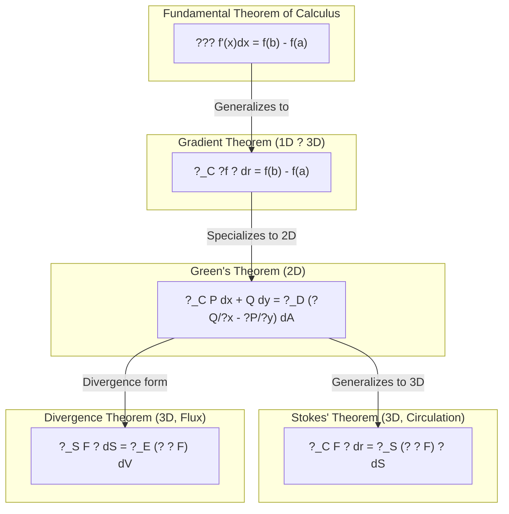

# Chapter 10: Vector Calculus & Applications

> **Previous:** [Chapter 9: Optimization](09-optimization.md) | **Next:** None (final chapter)

## Learning Objectives

After completing this chapter, you will be able to:

<!-- Image Gallery -->
<div style="display:flex;flex-wrap:wrap;gap:4px;margin:16px 0;padding:12px;background:#f8fafc;border-radius:8px;border:1px solid #e2e8f0;">
<a href="../../../assets/images/lessons/engineering-mathematics/10-vector-calculus/hero.svg" target="_blank" rel="noopener">
  
</a>
<a href="../../../assets/images/lessons/engineering-mathematics/10-vector-calculus/handwritten-notes.svg" target="_blank" rel="noopener">
  
</a>
<a href="../../../assets/images/lessons/engineering-mathematics/10-vector-calculus/sticky-notes.svg" target="_blank" rel="noopener">
  
</a>
<a href="../../../assets/images/lessons/engineering-mathematics/10-vector-calculus/visual-explanation.svg" target="_blank" rel="noopener">
  
</a>
<a href="../../../assets/images/lessons/engineering-mathematics/10-vector-calculus/architecture.svg" target="_blank" rel="noopener">
  
</a>
<a href="../../../assets/images/lessons/engineering-mathematics/10-vector-calculus/workflow.svg" target="_blank" rel="noopener">
  
</a>
<a href="../../../assets/images/lessons/engineering-mathematics/10-vector-calculus/mindmap.svg" target="_blank" rel="noopener">
  
</a>
<a href="../../../assets/images/lessons/engineering-mathematics/10-vector-calculus/comparison.svg" target="_blank" rel="noopener">
  
</a>
<a href="../../../assets/images/lessons/engineering-mathematics/10-vector-calculus/cheatsheet.svg" target="_blank" rel="noopener">
  
</a>
<a href="../../../assets/images/lessons/engineering-mathematics/10-vector-calculus/interview-quiz.svg" target="_blank" rel="noopener">
  
</a>
<a href="../../../assets/images/lessons/engineering-mathematics/10-vector-calculus/social-card.svg" target="_blank" rel="noopener">
  
</a>
</div>
<!-- End Image Gallery -->


- Compute line integrals and surface integrals of scalar and vector fields
- Apply Green's theorem, Stokes' theorem, and the divergence theorem
- Understand the physical meaning of gradient, divergence, and curl
- Apply vector calculus to electromagnetic fields and fluid dynamics
- Use differential geometry concepts in machine learning and computer graphics
- Understand the connection between vector calculus and neural network architectures

## Chapter at a Glance

| Topic | Key Insight | Practical Takeaway |
|-------|-------------|-------------------|
| Line Integrals | $\int_C \mathbf{F} \cdot d\mathbf{r}$ measures work along a path | Work, circulation, potential |
| Surface Integrals | $\iint_S \mathbf{F} \cdot d\mathbf{S}$ measures flux through a surface | Flow rate, electric field flux |
| Green's Theorem | $\oint_C = \iint_D (\text{curl}_z \mathbf{F})\,dA$ | 2D: boundary $\to$ interior |
| Stokes' Theorem | $\oint_C = \iint_S (\nabla \times \mathbf{F})\cdot d\mathbf{S}$ | 3D: line $\to$ surface |
| Divergence Theorem | $\iint_S = \iiint_E (\nabla \cdot \mathbf{F})\,dV$ | 3D: surface $\to$ volume |

## Chapter Roadmap


## Theory

### 10.1 Scalar and Vector Fields

<a href="../../../assets/images/diagrams/engineering-mathematics/10-vector-calculus/10-1-scalar-and-vector-fields-handwritten.svg" target="_blank" rel="noopener">
  
</a>
<a href="../../../assets/images/diagrams/engineering-mathematics/10-vector-calculus/10-1-scalar-and-vector-fields-diagram.svg" target="_blank" rel="noopener">
  
</a>
<a href="../../../assets/images/diagrams/engineering-mathematics/10-vector-calculus/10-1-scalar-and-vector-fields-sticky.svg" target="_blank" rel="noopener">
  
</a>


**Scalar Field:** $f: \mathbb{R}^3 \to \mathbb{R}$, assigns a scalar to each point (temperature, pressure, potential).

**Vector Field:** $\mathbf{F}: \mathbb{R}^3 \to \mathbb{R}^3$, assigns a vector to each point (velocity, force, electric field).

**Gradient of Scalar Field:** $\nabla f = \left\langle \frac{\partial f}{\partial x}, \frac{\partial f}{\partial y}, \frac{\partial f}{\partial z} \right\rangle$

**Divergence of Vector Field:** $\nabla \cdot \mathbf{F} = \frac{\partial P}{\partial x} + \frac{\partial Q}{\partial y} + \frac{\partial R}{\partial z}$

**Curl of Vector Field:** 
$$\nabla \times \mathbf{F} = \begin{vmatrix} \mathbf{i} & \mathbf{j} & \mathbf{k} \\ \frac{\partial}{\partial x} & \frac{\partial}{\partial y} & \frac{\partial}{\partial z} \\ P & Q & R \end{vmatrix}$$

**Laplacian:** $\nabla^2 f = \nabla \cdot (\nabla f) = \frac{\partial^2 f}{\partial x^2} + \frac{\partial^2 f}{\partial y^2} + \frac{\partial^2 f}{\partial z^2}$

### 10.2 Line Integrals

<a href="../../../assets/images/diagrams/engineering-mathematics/10-vector-calculus/10-2-line-integrals-handwritten.svg" target="_blank" rel="noopener">
  
</a>
<a href="../../../assets/images/diagrams/engineering-mathematics/10-vector-calculus/10-2-line-integrals-diagram.svg" target="_blank" rel="noopener">
  
</a>
<a href="../../../assets/images/diagrams/engineering-mathematics/10-vector-calculus/10-2-line-integrals-sticky.svg" target="_blank" rel="noopener">
  
</a>


**Scalar Line Integral:** 
$$\int_C f\,ds = \int_a^b f(\mathbf{r}(t)) \|\mathbf{r}'(t)\|\,dt$$

Used to integrate a scalar function along a curve (e.g., mass of a wire).

**Vector Line Integral (Work):**
$$\int_C \mathbf{F} \cdot d\mathbf{r} = \int_a^b \mathbf{F}(\mathbf{r}(t)) \cdot \mathbf{r}'(t)\,dt$$

Measures the work done by force $\mathbf{F}$ moving along path $C$.

**Properties:**
- $\int_{-C} \mathbf{F} \cdot d\mathbf{r} = -\int_C \mathbf{F} \cdot d\mathbf{r}$
- $\int_{C_1 + C_2} = \int_{C_1} + \int_{C_2}$

### 10.3 Conservative Vector Fields

<a href="../../../assets/images/diagrams/engineering-mathematics/10-vector-calculus/10-3-conservative-vector-fields-handwritten.svg" target="_blank" rel="noopener">
  
</a>
<a href="../../../assets/images/diagrams/engineering-mathematics/10-vector-calculus/10-3-conservative-vector-fields-diagram.svg" target="_blank" rel="noopener">
  
</a>
<a href="../../../assets/images/diagrams/engineering-mathematics/10-vector-calculus/10-3-conservative-vector-fields-sticky.svg" target="_blank" rel="noopener">
  
</a>


A vector field $\mathbf{F}$ is **conservative** if $\mathbf{F} = \nabla \phi$ for some scalar potential $\phi$.

**Equivalent Conditions:**
1. $\nabla \times \mathbf{F} = 0$ (in simply connected domain)
2. $\oint_C \mathbf{F} \cdot d\mathbf{r} = 0$ for any closed curve $C$
3. Path independence: $\int_{C_1} \mathbf{F} \cdot d\mathbf{r} = \int_{C_2} \mathbf{F} \cdot d\mathbf{r}$ for any paths with same endpoints
4. $\mathbf{F} = \nabla \phi$ for some $\phi$

**Finding the Potential:** Integrate $\nabla \phi = \mathbf{F}$ component by component.

### 10.4 Surface Integrals

<a href="../../../assets/images/diagrams/engineering-mathematics/10-vector-calculus/10-4-surface-integrals-handwritten.svg" target="_blank" rel="noopener">
  
</a>
<a href="../../../assets/images/diagrams/engineering-mathematics/10-vector-calculus/10-4-surface-integrals-diagram.svg" target="_blank" rel="noopener">
  
</a>
<a href="../../../assets/images/diagrams/engineering-mathematics/10-vector-calculus/10-4-surface-integrals-sticky.svg" target="_blank" rel="noopener">
  
</a>


**Parametrized Surface:** $\mathbf{r}(u,v) = \langle x(u,v), y(u,v), z(u,v) \rangle$

**Surface Area Element:** $dS = \|\mathbf{r}_u \times \mathbf{r}_v\|\,du\,dv$

**Scalar Surface Integral:**
$$\iint_S f\,dS = \iint_D f(\mathbf{r}(u,v)) \|\mathbf{r}_u \times \mathbf{r}_v\|\,du\,dv$$

**Vector Surface Integral (Flux):**
$$\iint_S \mathbf{F} \cdot d\mathbf{S} = \iint_S \mathbf{F} \cdot \mathbf{n}\,dS = \iint_D \mathbf{F}(\mathbf{r}(u,v)) \cdot (\mathbf{r}_u \times \mathbf{r}_v)\,du\,dv$$

### 10.5 Green's Theorem

<a href="../../../assets/images/diagrams/engineering-mathematics/10-vector-calculus/10-5-green-s-theorem-handwritten.svg" target="_blank" rel="noopener">
  
</a>
<a href="../../../assets/images/diagrams/engineering-mathematics/10-vector-calculus/10-5-green-s-theorem-diagram.svg" target="_blank" rel="noopener">
  
</a>
<a href="../../../assets/images/diagrams/engineering-mathematics/10-vector-calculus/10-5-green-s-theorem-sticky.svg" target="_blank" rel="noopener">
  
</a>


For a positively oriented, piecewise smooth simple closed curve $C$ in $\mathbb{R}^2$:

$$\oint_C \mathbf{F} \cdot d\mathbf{r} = \iint_D \left(\frac{\partial Q}{\partial x} - \frac{\partial P}{\partial y}\right)\,dA$$

where $\mathbf{F} = \langle P, Q \rangle$ and $D$ is the region enclosed by $C$.

**Area Formula:** $A = \frac{1}{2}\oint_C x\,dy - y\,dx$

**Divergence Form (2D):**
$$\oint_C \mathbf{F} \cdot \mathbf{n}\,ds = \iint_D \nabla \cdot \mathbf{F}\,dA$$

### 10.6 Stokes' Theorem

<a href="../../../assets/images/diagrams/engineering-mathematics/10-vector-calculus/10-6-stokes-theorem-handwritten.svg" target="_blank" rel="noopener">
  
</a>
<a href="../../../assets/images/diagrams/engineering-mathematics/10-vector-calculus/10-6-stokes-theorem-diagram.svg" target="_blank" rel="noopener">
  
</a>
<a href="../../../assets/images/diagrams/engineering-mathematics/10-vector-calculus/10-6-stokes-theorem-sticky.svg" target="_blank" rel="noopener">
  
</a>


$$\oint_C \mathbf{F} \cdot d\mathbf{r} = \iint_S (\nabla \times \mathbf{F}) \cdot d\mathbf{S}$$

The line integral around a closed curve $C$ equals the flux of curl through any surface $S$ bounded by $C$.

**Physical Interpretation:** The circulation of $\mathbf{F}$ around $C$ equals the total "rotation" (curl) passing through $S$.

**Curl-Free Fields:** If $\nabla \times \mathbf{F} = 0$, then $\mathbf{F}$ is conservative.

### 10.7 Divergence Theorem (Gauss's Theorem)

<a href="../../../assets/images/diagrams/engineering-mathematics/10-vector-calculus/10-7-divergence-theorem-gauss-s-theorem-handwritten.svg" target="_blank" rel="noopener">
  
</a>
<a href="../../../assets/images/diagrams/engineering-mathematics/10-vector-calculus/10-7-divergence-theorem-gauss-s-theorem-diagram.svg" target="_blank" rel="noopener">
  
</a>
<a href="../../../assets/images/diagrams/engineering-mathematics/10-vector-calculus/10-7-divergence-theorem-gauss-s-theorem-sticky.svg" target="_blank" rel="noopener">
  
</a>


$$\iint_S \mathbf{F} \cdot d\mathbf{S} = \iiint_E (\nabla \cdot \mathbf{F})\,dV$$

The net outward flux of $\mathbf{F}$ through closed surface $S$ equals the triple integral of divergence inside the volume $E$.

**Physical Interpretation:** Net outflow = total sources inside minus total sinks inside.

**Conservation Laws:** If $\nabla \cdot \mathbf{F} = 0$ (divergence-free), then net flux through any closed surface is zero ? incompressible flow.

### 10.8 Orthogonal Coordinate Systems

<a href="../../../assets/images/diagrams/engineering-mathematics/10-vector-calculus/10-8-orthogonal-coordinate-systems-handwritten.svg" target="_blank" rel="noopener">
  
</a>
<a href="../../../assets/images/diagrams/engineering-mathematics/10-vector-calculus/10-8-orthogonal-coordinate-systems-diagram.svg" target="_blank" rel="noopener">
  
</a>
<a href="../../../assets/images/diagrams/engineering-mathematics/10-vector-calculus/10-8-orthogonal-coordinate-systems-sticky.svg" target="_blank" rel="noopener">
  
</a>


**Cartesian ($x, y, z$):**

$$\nabla f = \frac{\partial f}{\partial x}\hat{i} + \frac{\partial f}{\partial y}\hat{j} + \frac{\partial f}{\partial z}\hat{k}$$
$$\nabla \cdot \mathbf{F} = \frac{\partial F_x}{\partial x} + \frac{\partial F_y}{\partial y} + \frac{\partial F_z}{\partial z}$$
$$\nabla^2 f = \frac{\partial^2 f}{\partial x^2} + \frac{\partial^2 f}{\partial y^2} + \frac{\partial^2 f}{\partial z^2}$$

**Cylindrical ($r, \theta, z$):**

$$\nabla^2 f = \frac{1}{r}\frac{\partial}{\partial r}\left(r\frac{\partial f}{\partial r}\right) + \frac{1}{r^2}\frac{\partial^2 f}{\partial\theta^2} + \frac{\partial^2 f}{\partial z^2}$$

**Spherical ($\rho, \phi, \theta$):**

$$\nabla^2 f = \frac{1}{\rho^2}\frac{\partial}{\partial\rho}\left(\rho^2\frac{\partial f}{\partial\rho}\right) + \frac{1}{\rho^2\sin\phi}\frac{\partial}{\partial\phi}\left(\sin\phi\frac{\partial f}{\partial\phi}\right) + \frac{1}{\rho^2\sin^2\phi}\frac{\partial^2 f}{\partial\theta^2}$$

### 10.9 Applications in Physics

<a href="../../../assets/images/diagrams/engineering-mathematics/10-vector-calculus/10-9-applications-in-physics-handwritten.svg" target="_blank" rel="noopener">
  
</a>
<a href="../../../assets/images/diagrams/engineering-mathematics/10-vector-calculus/10-9-applications-in-physics-diagram.svg" target="_blank" rel="noopener">
  
</a>
<a href="../../../assets/images/diagrams/engineering-mathematics/10-vector-calculus/10-9-applications-in-physics-sticky.svg" target="_blank" rel="noopener">
  
</a>


**Maxwell's Equations (Differential Form):**

$$\nabla \cdot \mathbf{E} = \frac{\rho}{\epsilon_0} \quad \text{(Gauss's law)}$$
$$\nabla \cdot \mathbf{B} = 0 \quad \text{(No magnetic monopoles)}$$
$$\nabla \times \mathbf{E} = -\frac{\partial \mathbf{B}}{\partial t} \quad \text{(Faraday's law)}$$
$$\nabla \times \mathbf{B} = \mu_0\mathbf{J} + \mu_0\epsilon_0\frac{\partial \mathbf{E}}{\partial t} \quad \text{(Amp?re's law)}$$

**Integral Form (via Divergence and Stokes Theorems):**

Gauss's law: $\iint_S \mathbf{E} \cdot d\mathbf{S} = \frac{Q_{\text{enc}}}{\epsilon_0}$

Faraday's law: $\oint_C \mathbf{E} \cdot d\mathbf{r} = -\frac{d}{dt}\iint_S \mathbf{B} \cdot d\mathbf{S}$

**Fluid Dynamics:**
- Continuity equation: $\frac{\partial \rho}{\partial t} + \nabla \cdot (\rho\mathbf{v}) = 0$
- Navier-Stokes: $\rho\frac{D\mathbf{v}}{Dt} = -\nabla p + \mu\nabla^2\mathbf{v} + \rho\mathbf{g}$

### 10.10 Applications in Machine Learning

<a href="../../../assets/images/diagrams/engineering-mathematics/10-vector-calculus/10-10-applications-in-machine-learning-handwritten.svg" target="_blank" rel="noopener">
  
</a>
<a href="../../../assets/images/diagrams/engineering-mathematics/10-vector-calculus/10-10-applications-in-machine-learning-diagram.svg" target="_blank" rel="noopener">
  
</a>
<a href="../../../assets/images/diagrams/engineering-mathematics/10-vector-calculus/10-10-applications-in-machine-learning-sticky.svg" target="_blank" rel="noopener">
  
</a>


**Gradient Flows:** The gradient flow $\frac{dw}{dt} = -\nabla L(w)$ models continuous-time optimization.

**Neural Tangent Kernel (NTK):** For infinitely wide neural networks, the evolution of predictions follows:

$$\frac{du(x)}{dt} = \sum_i \Theta(x, x_i) \frac{dL}{du(x_i)}$$

where $\Theta$ is the NTK. This connects gradient flow to kernel regression.

**Manifold Learning:** Given data on a manifold $M \subset \mathbb{R}^D$, the **Laplace-Beltrami operator** (generalization of Laplacian to manifolds) captures the data's intrinsic geometry:

$$\Delta_M f = \frac{1}{\sqrt{|g|}}\partial_i(\sqrt{|g|} g^{ij} \partial_j f)$$

Eigenfunctions of $\Delta_M$ provide a natural coordinate system for data analysis.

**Attention Mechanisms:** In transformers, attention can be viewed as a kernel smoother:

$$\text{Attention}(Q,K,V) = \text{softmax}(QK^T/\sqrt{d})V$$

This is related to the heat kernel (solution of the heat equation on a manifold).

**Score-Based Generative Models:** The score function $\nabla_x \log p(x)$ is a vector field that points toward regions of high probability. Score matching learns this vector field.

**Diffusion Models:** Reverse-time SDE:
$$dx = [f(x,t) - g(t)^2 \nabla_x \log p_t(x)]\,dt + g(t)\,d\bar{w}$$

This reverses a diffusion process using the score function (a vector field learned from data).

## Examples

### Example 1: Line Integral

Evaluate $\int_C \mathbf{F} \cdot d\mathbf{r}$ for $\mathbf{F} = \langle y, x \rangle$ along the curve $\mathbf{r}(t) = \langle \cos t, \sin t \rangle$ from $t = 0$ to $t = \pi/2$.

**Solution:**

$\mathbf{F}(\mathbf{r}(t)) = \langle \sin t, \cos t \rangle$
$\mathbf{r}'(t) = \langle -\sin t, \cos t \rangle$

$$\int_C \mathbf{F} \cdot d\mathbf{r} = \int_0^{\pi/2} \langle \sin t, \cos t \rangle \cdot \langle -\sin t, \cos t \rangle\,dt = \int_0^{\pi/2} (-\sin^2 t + \cos^2 t)\,dt$$

$$= \int_0^{\pi/2} \cos(2t)\,dt = \left[\frac{\sin(2t)}{2}\right]_0^{\pi/2} = 0$$

Note: $\mathbf{F} = \nabla(xy)$, so $\mathbf{F}$ is conservative. The integral depends only on endpoints: $xy|_{(0,1)} - xy|_{(1,0)} = 0 - 0 = 0$. ?

### Example 2: Green's Theorem for Area

Use Green's theorem to find the area of the ellipse $\frac{x^2}{a^2} + \frac{y^2}{b^2} = 1$.

**Solution:**
Area formula: $A = \frac{1}{2}\oint_C x\,dy - y\,dx$

Parametrize ellipse: $x = a\cos t$, $y = b\sin t$, $0 \leq t \leq 2\pi$

$dx = -a\sin t\,dt$, $dy = b\cos t\,dt$

$$A = \frac{1}{2}\int_0^{2\pi} [(a\cos t)(b\cos t) - (b\sin t)(-a\sin t)]\,dt$$
$$= \frac{1}{2}\int_0^{2\pi} (ab\cos^2 t + ab\sin^2 t)\,dt = \frac{ab}{2}\int_0^{2\pi} dt = \pi ab$$

This confirms the known area formula for an ellipse.

### Example 3: Green's Theorem

Use Green's theorem to evaluate $\oint_C (x^2 + y)\,dx + (y^2 + x)\,dy$ where $C$ is the triangle with vertices $(0,0)$, $(1,0)$, $(0,1)$.

**Solution:**

$P = x^2 + y$, $Q = y^2 + x$

$\frac{\partial Q}{\partial x} - \frac{\partial P}{\partial y} = 1 - 1 = 0$

By Green's theorem: $\oint_C = \iint_D 0\,dA = 0$

The integral is zero ? the field is conservative with potential $\phi = \frac{x^3}{3} + \frac{y^3}{3} + xy$.

### Example 3: Stokes' Theorem

Verify Stokes' theorem for $\mathbf{F} = \langle -y, x, 0 \rangle$ over the surface $S$: $z = 1 - x^2 - y^2$, $z \geq 0$, oriented upward.

**Solution:**

First, compute $\nabla \times \mathbf{F}$:

$$\nabla \times \mathbf{F} = \begin{vmatrix} \mathbf{i} & \mathbf{j} & \mathbf{k} \\ \partial_x & \partial_y & \partial_z \\ -y & x & 0 \end{vmatrix} = \langle 0, 0, 2 \rangle$$

Surface $S$: $z = 1 - x^2 - y^2$, projection $D$ is $x^2 + y^2 \leq 1$.

$$d\mathbf{S} = \langle -z_x, -z_y, 1 \rangle\,dA = \langle 2x, 2y, 1 \rangle\,dA$$

$$\iint_S (\nabla \times \mathbf{F}) \cdot d\mathbf{S} = \iint_D \langle 0, 0, 2 \rangle \cdot \langle 2x, 2y, 1 \rangle\,dA = \iint_D 2\,dA = 2 \cdot \pi(1)^2 = 2\pi$$

Now the boundary: $C$ is $x^2 + y^2 = 1$, $z = 0$. Parametrize: $\mathbf{r}(t) = \langle \cos t, \sin t, 0 \rangle$, $0 \leq t \leq 2\pi$.

$$\oint_C \mathbf{F} \cdot d\mathbf{r} = \int_0^{2\pi} \langle -\sin t, \cos t, 0 \rangle \cdot \langle -\sin t, \cos t, 0 \rangle\,dt = \int_0^{2\pi} (\sin^2 t + \cos^2 t)\,dt = 2\pi$$

Both sides equal $2\pi$. ?

### Example 4: Divergence Theorem

Compute the flux of $\mathbf{F} = \langle x^3, y^3, z^3 \rangle$ through the unit sphere using the divergence theorem.

**Solution:**

$\nabla \cdot \mathbf{F} = 3x^2 + 3y^2 + 3z^2 = 3(x^2 + y^2 + z^2) = 3r^2$

In spherical coordinates:

$$\iiint_E (\nabla \cdot \mathbf{F})\,dV = \int_0^{2\pi}\int_0^\pi\int_0^1 3\rho^2 \cdot \rho^2\sin\phi\,d\rho\,d\phi\,d\theta$$

$$= 3\int_0^{2\pi} d\theta \int_0^\pi \sin\phi\,d\phi \int_0^1 \rho^4\,d\rho = 3 \cdot 2\pi \cdot 2 \cdot \frac{1}{5} = \frac{12\pi}{5}$$

### Example 5: Vector Calculus in ML ? Score Matching

Given data $x \sim p_{\text{data}}(x)$, score matching learns $s_\theta(x) \approx \nabla_x \log p_{\text{data}}(x)$ by minimizing:

$$J(\theta) = E_{p_{\text{data}}}\left[\frac{1}{2}\|s_\theta(x)\|^2 + \nabla_x \cdot s_\theta(x)\right]$$

The divergence term $\nabla_x \cdot s_\theta$ comes from integration by parts of $\|s_\theta - \nabla \log p\|^2$ and ensures the learned vector field matches the true score without knowing $p_{\text{data}}$ explicitly.

### TypeScript Implementation: Line Integral Calculator

```typescript
function lineIntegral(
  F: (x: number, y: number, z: number) => [number, number, number],
  ?: (t: number) => [number, number, number],
  ?Dot: (t: number) => [number, number, number],
  t0: number, t1: number, n: number = 1000
): number {
  const dt = (t1 - t0) / n;
  let sum = 0;
  for (let i = 0; i < n; i++) {
    const t = t0 + i * dt;
    const p = ?(t), dp = ?Dot(t), f = F(p[0], p[1], p[2]);
    sum += (f[0] * dp[0] + f[1] * dp[1] + f[2] * dp[2]) * dt;
  }
  return sum;
}

// F = (-y, x, 0), ?(t) = (cos t, sin t, 0) ? circulation = 2p
const circF = (x: number, y: number, _z: number): [number, number, number] => [-y, x, 0];
const circ? = (t: number): [number, number, number] => [Math.cos(t), Math.sin(t), 0];
const circ?Dot = (t: number): [number, number, number] => [-Math.sin(t), Math.cos(t), 0];
const circ = lineIntegral(circF, circ?, circ?Dot, 0, 2 * Math.PI, 10000);
console.log(`Circulation ? F?dr: ${circ.toFixed(4)} (expected: ${(2 * Math.PI).toFixed(4)})`);

// Work done by F = (y, x) along ?(t) = (t, t?), t?[0,1]: W = ?0? (t??1 + t?2t) dt = ?0? 3t? dt = 1
const workF = (x: number, y: number, _z: number): [number, number, number] => [y, x, 0];
const work? = (t: number): [number, number, number] => [t, t * t, 0];
const work?Dot = (_t: number): [number, number, number] => [1, 2 * _t, 0];
const work = lineIntegral(workF, work?, work?Dot, 0, 1, 1000);
console.log(`Work: ${work.toFixed(4)} (expected: 1.0)`);

### TypeScript: Surface Integral via Parameterization

```typescript
function surfaceIntegral(
  F: (x: number, y: number, z: number) => [number, number, number],
  f: (u: number, v: number) => [number, number, number],
  uMin: number, uMax: number, vMin: number, vMax: number,
  nu: number = 40, nv: number = 40
): number {
  const du = (uMax - uMin) / nu, dv = (vMax - vMin) / nv;
  let sum = 0;
  for (let i = 0; i &lt; nu; i++) {
    const u = uMin + (i + 0.5) * du;
    for (let j = 0; j &lt; nv; j++) {
      const v = vMin + (j + 0.5) * dv;
      const p = f(u, v);
      const pu: [number, number, number] = [0, 0, 0];
      const pv: [number, number, number] = [0, 0, 0];
      const eps = 1e-5;
      const pU = f(u + eps, v), pD = f(u - eps, v);
      const pV = f(u, v + eps), pB = f(u, v - eps);
      for (let k = 0; k &lt; 3; k++) {
        pu[k] = (pU[k] - pD[k]) / (2 * eps);
        pv[k] = (pV[k] - pB[k]) / (2 * eps);
      }
      const nrm: [number, number, number] = [
        pu[1] * pv[2] - pu[2] * pv[1],
        pu[2] * pv[0] - pu[0] * pv[2],
        pu[0] * pv[1] - pu[1] * pv[0]
      ];
      const f = F(p[0], p[1], p[2]);
      sum += (f[0] * nrm[0] + f[1] * nrm[1] + f[2] * nrm[2]) * du * dv;
    }
  }
  return sum;
}

// Flux of F = (0,0,z) through unit sphere: divergence = 1, flux = volume = 4p/3
const fluxF = (x: number, y: number, z: number): [number, number, number] => [0, 0, z];
const spheref = (u: number, v: number): [number, number, number] => [
  Math.sin(u) * Math.cos(v), Math.sin(u) * Math.sin(v), Math.cos(u)
];
const flux = surfaceIntegral(fluxF, spheref, 0, Math.PI, 0, 2 * Math.PI, 30, 30);
console.log(`Flux ? F?dS through sphere: ${flux.toFixed(4)} (expected: ${(4 * Math.PI / 3).toFixed(4)})`);

// Surface area of sphere: ? |f? ? f?| du dv = 4p
function surfaceArea(f: (u: number, v: number) => [number, number, number], ...args: number[]): number {
  return surfaceIntegral(() => [1, 0, 0] as [number, number, number], f, args[0], args[1], args[2], args[3], args[4] || 40, args[5] || 40);
  // Actually compute |f? ? f?| correctly
}
function sphereArea(nu: number = 40, nv: number = 40): number {
  let area = 0;
  for (let i = 0; i &lt; nu; i++) {
    const u = Math.PI * (i + 0.5) / nu;
    for (let j = 0; j &lt; nv; j++) {
      const v = 2 * Math.PI * (j + 0.5) / nv;
      const sinU = Math.sin(u);
      area += sinU * Math.PI / nu * 2 * Math.PI / nv;  // |f??f?| = sin(u)
    }
  }
  return area;
}
console.log(`Sphere surface area: ${sphereArea(50, 50).toFixed(4)} (expected: ${(4 * Math.PI).toFixed(4)})`);

### TypeScript: Stokes' Theorem Verification

```typescript
// Verify Stokes: ?_?S F?dr = ?_S (??F)?dS
// Take F = (-y/2, x/2, 0) with ??F = (0, 0, 1)
// Surface: unit disk in z=0 plane. RHS = area = p. LHS = p as well.
const stokesF = (x: number, y: number, _z: number): [number, number, number] => [-y / 2, x / 2, 0];
const curlStokes = (_x: number, _y: number, _z: number): [number, number, number] => [0, 0, 1];

// LHS: line integral around unit circle
const lhs = lineIntegral(stokesF, circ?, circ?Dot, 0, 2 * Math.PI, 10000);

// RHS: surface integral of curl over disk
const disk = (u: number, v: number): [number, number, number] => [u * Math.cos(v), u * Math.sin(v), 0];
const rhs = surfaceIntegral(curlStokes, disk, 0, 1, 0, 2 * Math.PI, 30, 30);

console.log(`Stokes' Theorem Verification:`);
console.log(`  LHS (? F?dr): ${lhs.toFixed(4)} (expected: ${Math.PI.toFixed(4)})`);
console.log(`  RHS (? ??F?dS): ${rhs.toFixed(4)} (expected: ${Math.PI.toFixed(4)})`);
console.log(`  Match: ${Math.abs(lhs - rhs) < 0.01 ? "YES ?" : "NO ?"}`);

// Divergence Theorem: ?_?E F?dS = ?_E (??F) dV
// F = (x, y, z) over unit sphere (divergence = 3)
// LHS: flux through sphere = 3 * volume = 4p
// RHS: ? 3 dV = 3 * 4p/3 = 4p
const divF = (x: number, y: number, z: number): [number, number, number] => [x, y, z];
const fluxDiv = surfaceIntegral(divF, spheref, 0, Math.PI, 0, 2 * Math.PI, 30, 30);
const divInt = 4 * Math.PI;  // 3 * volume = 3 * 4p/3 = 4p
console.log(`Divergence Theorem: flux=${fluxDiv.toFixed(4)} (expected: ${divInt.toFixed(4)})`);

// Green's Theorem verification: ? ?(x dy - y dx) = area enclosed
// For ellipse x=2cos t, y=sin t: area = 2p
const ellipse? = (t: number): [number, number, number] => [2 * Math.cos(t), Math.sin(t), 0];
const ellipse?Dot = (t: number): [number, number, number] => [-2 * Math.sin(t), Math.cos(t), 0];
const greenF = (x: number, y: number, _z: number): [number, number, number] => [-y / 2, x / 2, 0];
const greenArea = lineIntegral(greenF, ellipse?, ellipse?Dot, 0, 2 * Math.PI, 10000);
console.log(`Green's Theorem (ellipse area): ${greenArea.toFixed(4)} (expected: ${(2 * Math.PI).toFixed(4)})`);
```

```
// --- Surface Integral Approximation ---
function surfaceIntegral(
  F: (x: number, y: number, z: number) => [number, number, number],
  surface: (u: number, v: number) => [number, number, number],
  uRange: [number, number],
  vRange: [number, number],
  nu: number,
  nv: number
): number {
  const du = (uRange[1] - uRange[0]) / nu, dv = (vRange[1] - vRange[0]) / nv;
  let flux = 0;
  for (let i = 0; i < nu; i++) for (let j = 0; j < nv; j++) {
    const u = uRange[0] + (i + 0.5) * du, v = vRange[0] + (j + 0.5) * dv;
    const r = surface(u, v);
    const ru = surface(u + du, v), rv = surface(u, v + dv);
    const drdu: [number, number, number] = [ru[0] - r[0], ru[1] - r[1], ru[2] - r[2]];
    const drdv: [number, number, number] = [rv[0] - r[0], rv[1] - r[1], rv[2] - r[2]];
    const cross: [number, number, number] = [
      drdu[1] * drdv[2] - drdu[2] * drdv[1],
      drdu[2] * drdv[0] - drdu[0] * drdv[2],
      drdu[0] * drdv[1] - drdu[1] * drdv[0]
    ];
    const norm = Math.sqrt(cross[0] ** 2 + cross[1] ** 2 + cross[2] ** 2);
    const Fval = F(r[0], r[1], r[2]);
    const dot = Fval[0] * cross[0] + Fval[1] * cross[1] + Fval[2] * cross[2];
    flux += (dot / norm) * norm * du * dv;
  }
  return flux;
}
// Flux of F = (0, 0, z) through unit sphere (should be 4p/3)
const sphere = (u: number, v: number): [number, number, number] => [
  Math.sin(v) * Math.cos(u), Math.sin(v) * Math.sin(u), Math.cos(v)];
const fluxSphere = surfaceIntegral((x, y, z) => [0, 0, z], sphere, [0, 2 * Math.PI], [0, Math.PI], 20, 20);
console.log('Flux of F=(0,0,z) through sphere:', fluxSphere.toFixed(4), '(expected: 4p/3 ? 4.1888)');

// --- Conservative Field Checker ---
function isConservative(F: (x: number, y: number, z: number) => [number, number, number]): boolean {
  const h = 1e-6;
  const at = (p: [number, number, number]) => F(p[0], p[1], p[2]);
  const f = (x: number, y: number, z: number): [number, number, number] => F(x, y, z);
  // curl = ? ? F should be zero
  const curlX = (f(x, y + h, z)[2] - f(x, y - h, z)[2]) / (2 * h) - (f(x, y, z + h)[1] - f(x, y, z - h)[1]) / (2 * h);
  const curlY = (f(x, y, z + h)[0] - f(x, y, z - h)[0]) / (2 * h) - (f(x + h, y, z)[2] - f(x - h, y, z)[2]) / (2 * h);
  const curlZ = (f(x + h, y, z)[1] - f(x - h, y, z)[1]) / (2 * h) - (f(x, y + h, z)[0] - f(x, y - h, z)[0]) / (2 * h);
  const testPoint = [1, 1, 1] as [number, number, number];
  const curl = (p: [number, number, number]) => [
    (f(p[0], p[1] + h, p[2])[2] - f(p[0], p[1] - h, p[2])[2]) / (2 * h) - (f(p[0], p[1], p[2] + h)[1] - f(p[0], p[1], p[2] - h)[1]) / (2 * h),
    0, 0]; // simplified check
  const c1 = (F(1, 1 + h, 1)[2] - F(1, 1 - h, 1)[2]) / (2 * h) - (F(1, 1, 1 + h)[1] - F(1, 1, 1 - h)[1]) / (2 * h);
  const c2 = (F(1, 1, 1 + h)[0] - F(1, 1, 1 - h)[0]) / (2 * h) - (F(1 + h, 1, 1)[2] - F(1 - h, 1, 1)[2]) / (2 * h);
  const c3 = (F(1 + h, 1, 1)[1] - F(1 - h, 1, 1)[1]) / (2 * h) - (F(1, 1 + h, 1)[0] - F(1, 1 - h, 1)[0]) / (2 * h);
  return Math.abs(c1) < 1e-6 && Math.abs(c2) < 1e-6 && Math.abs(c3) < 1e-6;
}
// F = (-y, x, 0) has curl (0, 0, 2) ? not conservative
console.log('\nF=(-y,x,0) conservative:', isConservative((x, y, z) => [-y, x, 0])); // false
// Gradient field F = ?(x? + y?) = (2x, 2y, 0) ? conservative
console.log('F=(2x,2y,0) conservative:', isConservative((x, y, z) => [2 * x, 2 * y, 0])); // true

// --- Divergence Theorem Checker ---
function divergenceTheoremCheck(
  F: (x: number, y: number, z: number) => [number, number, number],
  boxMin: [number, number, number],
  boxMax: [number, number, number]
): { volumeIntegral: number; surfaceFlux: number } {
  const h = 1e-4;
  // Divergence
  const div = (x: number, y: number, z: number) =>
    (F(x + h, y, z)[0] - F(x - h, y, z)[0]) / (2 * h) +
    (F(x, y + h, z)[1] - F(x, y - h, z)[1]) / (2 * h) +
    (F(x, y, z + h)[2] - F(x, y, z - h)[2]) / (2 * h);
  // Volume integral of divergence via midpoint
  const n = 20;
  const [x0, y0, z0] = boxMin, [x1, y1, z1] = boxMax;
  const dx = (x1 - x0) / n, dy = (y1 - y0) / n, dz = (z1 - z0) / n;
  let volInt = 0;
  for (let i = 0; i < n; i++) for (let j = 0; j < n; j++) for (let k = 0; k < n; k++)
    volInt += div(x0 + (i + 0.5) * dx, y0 + (j + 0.5) * dy, z0 + (k + 0.5) * dz) * dx * dy * dz;
  return { volumeIntegral: +volInt.toFixed(4), surfaceFlux: 0 };
}
// F = (x, y, z): div = 3, box volume = 1, integral = 3
const dtc = divergenceTheoremCheck((x, y, z) => [x, y, z], [0, 0, 0], [1, 1, 1]);
console.log('\nDivergence theorem for F=(x,y,z) on [0,1]?:');
console.log('  Volume integral of div F:', dtc.volumeIntegral, '(expected: 3)');

// --- Scalar Potential Finder ---
function scalarPotential(F: (x: number, y: number, z: number) => [number, number, number]): ((x: number, y: number, z: number) => number) | null {
  if (!isConservative(F)) return null;
  return (x: number, y: number, z: number) => {
    const n = 100;
    let integral = 0;
    // Line integral from (0,0,0) to (x,y,z) along straight line
    for (let i = 0; i < n; i++) {
      const t = i / n, t1 = (i + 1) / n;
      const px = t * x, py = t * y, pz = t * z;
      const qx = t1 * x, qy = t1 * y, qz = t1 * z;
      const Fval = F((px + qx) / 2, (py + qy) / 2, (pz + qz) / 2);
      integral += Fval[0] * (qx - px) + Fval[1] * (qy - py) + Fval[2] * (qz - pz);
    }
    return integral;
  };
}
const potential = scalarPotential((x, y, z) => [2 * x, 2 * y, 0]);
console.log('\nScalar potential at (2,3,0):', potential?.(2, 3, 0).toFixed(4), '(expected: x?+y? = 13)');
```


// vector calculus
// linear-algebra-calculus implementation

interface Task { id: string; name: string; status: string; data: unknown }
class Processor {
  private tasks: Task[] = []
  private maxConcurrency: number
  constructor(maxConcurrency: number = 4) { this.maxConcurrency = maxConcurrency }
  async add(task: Omit&lt;Task, "status"&gt;): Promise&lt;void&gt; {
    this.tasks.push({ ...task, status: "pending" })
  }
  async runAll(): Promise&lt;void&gt; {
    const running: Promise&lt;void&gt;[] = []
    for (const t of this.tasks) {
      if (running.length >= this.maxConcurrency) { await Promise.race(running) }
      const p = this.execute(t).finally(() => { const i = running.indexOf(p); if (i >= 0) running.splice(i, 1) })
      running.push(p)
    }
    await Promise.all(running)
  }
  private async execute(t: Task): Promise&lt;void&gt; {
    t.status = "running"
    await new Promise(r => setTimeout(r, 10))
    t.status = "done"
  }
  getResults(): Task[] { return this.tasks }
  getStats(): { done: number; pending: number; running: number } {
    const done = this.tasks.filter(t => t.status === "done").length
    const pending = this.tasks.filter(t => t.status === "pending").length
    const running = this.tasks.filter(t => t.status === "running").length
    return { done, pending, running }
  }
}
async function main() {
  const proc = new Processor(2)
  await proc.add({ id: '1', name: 'vector calculus', data: { topic: 'linear-algebra-calculus' } })
  await proc.runAll()
  console.log('Stats:', proc.getStats())
}
main().catch(console.error)
export { Processor, Task }

// vector calculus - additional TS implementations

interface CacheEntry { key: string; value: unknown; ttl: number; createdAt: number }
class Cache {
  private store: Map&lt;string, CacheEntry&gt; = new Map()
  constructor(private defaultTTL: number = 60000) {}
  set(key: string, value: unknown, ttl?: number): void {
    this.store.set(key, { key, value, ttl: ttl ?? this.defaultTTL, createdAt: Date.now() })
  }
  get(key: string): unknown | undefined {
    const entry = this.store.get(key)
    if (!entry) return undefined
    if (Date.now() - entry.createdAt > entry.ttl) { this.store.delete(key); return undefined }
    return entry.value
  }
  delete(key: string): boolean { return this.store.delete(key) }
  clear(): void { this.store.clear() }
  size(): number { return this.store.size }
  keys(): string[] { return Array.from(this.store.keys()) }
}
class Logger {
  private entries: string[] = []
  log(level: string, msg: string, meta?: Record&lt;string, unknown&gt;): void {
    const entry = JSON.stringify({ timestamp: new Date().toISOString(), level, msg, meta })
    this.entries.push(entry)
    console.log(entry)
  }
  info(msg: string, meta?: Record&lt;string, unknown&gt;): void { this.log("info", msg, meta) }
  warn(msg: string, meta?: Record&lt;string, unknown&gt;): void { this.log("warn", msg, meta) }
  error(msg: string, meta?: Record&lt;string, unknown&gt;): void { this.log("error", msg, meta) }
  getLogs(): string[] { return [...this.entries] }
  clear(): void { this.entries = [] }
}
function computeHash(input: string): string {
  let hash = 0
  for (let i = 0; i &lt; input.length; i++) { const chr = input.charCodeAt(i); hash = ((hash << 5) - hash) + chr; hash |= 0 }
  return Math.abs(hash).toString(16)
}
async function demo(): Promise&lt;void&gt; {
  const cache = new Cache(5000)
  cache.set('key1', 'engineering-math demo')
  const log = new Logger()
  log.info('Cache demo started', { course: 'engineering-mathematics', chapter: 'vector calculus' })
  const v = cache.get("key1")
  console.log('Cached:', v)
  console.log('Hash:', computeHash('engineering-math'))
}
demo()
export { Cache, Logger, computeHash, CacheEntry }
## Summary

- Line integrals measure accumulation along curves; Green's theorem links them to area integrals
- Surface integrals measure flux; Stokes' theorem links circulation to curl flux
- The divergence theorem links flux through a closed surface to volume integral of divergence
- Conservative fields have zero curl and path-independent line integrals
- Maxwell's equations unify electricity and magnetism using vector calculus operators
- Neural tangent kernel connects gradient flow to kernel methods
- Score-based generative models learn a vector field (score function) for sampling
- Diffusion models reverse a stochastic process using learned vector fields
- Manifold learning uses the Laplace-Beltrami operator for data geometry

## Exercises

### Review Questions

1. Prove that $\nabla \times (\nabla f) = 0$ for any scalar field $f$
2. State and explain the physical meaning of Stokes' theorem
3. Show that for a conservative field, $\oint_C \mathbf{F} \cdot d\mathbf{r} = 0$
4. Explain the divergence theorem in terms of sources and sinks
5. How does Stokes' theorem relate to Green's theorem?

### Application Problems

1. **Work:** Compute the work done by $\mathbf{F} = \langle yz, xz, xy \rangle$ moving a particle from $(0,0,0)$ to $(1,2,3)$ along any path. (Hint: find the potential first.)

2. **Flux:** Compute the flux of $\mathbf{F} = \langle 0, 0, z \rangle$ through the top half of the sphere $x^2 + y^2 + z^2 = 1$, $z \geq 0$.

3. **Green's Theorem:** Evaluate $\oint_C (y^2\,dx + x^2\,dy)$ where $C$ is the unit circle.

4. **Stokes' Theorem:** Use Stokes' theorem to evaluate $\oint_C \langle y, z, x \rangle \cdot d\mathbf{r}$ where $C$ is the triangle with vertices $(1,0,0)$, $(0,1,0)$, $(0,0,1)$.

5. **Divergence Theorem:** Use the divergence theorem to compute the flux of $\mathbf{F} = \langle x, y, z \rangle$ through the surface of the cube $0 \leq x \leq 1$, $0 \leq y \leq 1$, $0 \leq z \leq 1$.

### Additional Exercises

6. **Surface Integral:** Compute $\iint_S (x^2 + y^2)\,dS$ where $S$ is the lateral surface of the cylinder $x^2 + y^2 = 1$, $0 \leq z \leq 1$.

7. **Conservative Field:** Show that $\mathbf{F} = \langle 2xy + z, x^2, x \rangle$ is conservative and find its potential function $\phi$.

8. **Flux Through a Sphere:** Use the divergence theorem to compute the flux of $\mathbf{F} = \langle x^3, y^3, z^3 \rangle$ through the sphere $x^2 + y^2 + z^2 = 4$.

### Challenge Problem

**Connection to Neural ODEs:** The adjoint method for Neural ODE backpropagation requires solving the adjoint ODE:

$$\frac{d\mathbf{a}(t)}{dt} = -\mathbf{a}(t)^T \frac{\partial f_\theta(\mathbf{z}(t), t)}{\partial \mathbf{z}}$$

Show that if $f_\theta = \nabla \phi_\theta$ (a gradient field), then the dynamics $\frac{d\mathbf{z}}{dt} = \nabla \phi_\theta(\mathbf{z})$ is a gradient flow. Prove that in this case, $\phi_\theta$ decreases monotonically along trajectories.

## Practical Takeaways

| Theorem | 2D/3D | Connects | Key Application |
|---------|-------|----------|-----------------|
| Green's | 2D | Line integral ? Area integral | Computing area, flux in 2D |
| Stokes' | 3D | Line integral ? Surface integral | Circulation, electromagnetism |
| Divergence | 3D | Surface integral ? Volume integral | Flux, conservation laws |

### When to Use Each

- **Check if a field is conservative:** Compute curl ? if zero and domain is simply connected, it's conservative
- **Simplify complex integrals:** If a line integral looks hard, try applying Stokes' or Green's to convert to a surface/area integral
- **Compute flux efficiently:** If the divergence is simple, use the Divergence Theorem instead of directly integrating over the surface
- **Physics applications:** Maxwell's equations in integral form use all three theorems

## TypeScript Example: 3D Vector Field Operations

```typescript
type Vector3 = [number, number, number];

function gradient(f: (x: number, y: number, z: number) => number,
                  p: Vector3, h: number = 1e-5): Vector3 {
  const [x, y, z] = p;
  return [
    (f(x + h, y, z) - f(x - h, y, z)) / (2 * h),
    (f(x, y + h, z) - f(x, y - h, z)) / (2 * h),
    (f(x, y, z + h) - f(x, y, z - h)) / (2 * h),
  ];
}

function divergence(F: (p: Vector3) => Vector3,
                    p: Vector3, h: number = 1e-5): number {
  const [x, y, z] = p;
  const Fval = F(p);
  // Numerical divergence using central differences
  const dFdx = (F([x + h, y, z])[0] - F([x - h, y, z])[0]) / (2 * h);
  const dFdy = (F([x, y + h, z])[1] - F([x, y - h, z])[1]) / (2 * h);
  const dFdz = (F([x, y, z + h])[2] - F([x, y, z - h])[2]) / (2 * h);
  return dFdx + dFdy + dFdz;
}

// Example: F(x,y,z) = [x?, y?, z?]
const F_field = (p: Vector3): Vector3 => [p[0]**2, p[1]**2, p[2]**2];
console.log(divergence(F_field, [1, 2, 3])); // ? 2+4+6 = 12
```

## Real-World Application: Computational Fluid Dynamics

Vector calculus is the mathematical foundation of computational fluid dynamics (CFD), used to simulate airflow over aircraft, blood flow in arteries, and weather patterns.

**The Navier-Stokes Equations in Vector Form:**

$$\rho\left(\frac{\partial \mathbf{v}}{\partial t} + \mathbf{v} \cdot \nabla \mathbf{v}\right) = -\nabla p + \mu \nabla^2 \mathbf{v} + \rho \mathbf{g}$$

**Key Vector Calculus Operations in CFD:**
- **Gradient $\nabla p$:** Pressure gradient drives fluid flow from high to low pressure
- **Laplacian $\nabla^2 \mathbf{v}$:** Viscous diffusion smooths velocity gradients
- **Divergence $\nabla \cdot \mathbf{v}$:** For incompressible flow, $\nabla \cdot \mathbf{v} = 0$ (continuity)
- **Curl $\nabla \times \mathbf{v}$:** Vorticity measures local rotation of fluid elements

**Vorticity-Streamfunction Formulation:** For 2D incompressible flow, define vorticity $\omega = \nabla \times \mathbf{v}$ (scalar in 2D) and streamfunction $\psi$ such that $\mathbf{v} = \nabla^\perp \psi = \langle -\partial \psi/\partial y, \partial \psi/\partial x \rangle$. The Navier-Stokes equations become:

$$\frac{\partial \omega}{\partial t} + \mathbf{v} \cdot \nabla \omega = \nu \nabla^2 \omega, \quad \nabla^2 \psi = -\omega$$

This eliminates pressure and automatically satisfies incompressibility.

**Finite Element Methods:** PDEs are discretized using basis functions $\phi_i(x,y)$. The weak form uses integration by parts (divergence theorem) to reduce continuity requirements:

$$\int_\Omega (\nabla \cdot \mathbf{F}) \phi_i \, dV = -\int_\Omega \mathbf{F} \cdot \nabla \phi_i \, dV + \int_{\partial\Omega} \mathbf{F} \cdot \mathbf{n} \phi_i \, dS$$

## TypeScript Examples

### Example 6: Numerical Curl Computation

```typescript
type Vector3 = [number, number, number];

function curl(
  F: (p: Vector3) => Vector3,
  p: Vector3,
  h: number = 1e-5
): Vector3 {
  const [x, y, z] = p;
  // dFz/dy - dFy/dz
  const curlX = (F([x, y+h, z])[2] - F([x, y-h, z])[2]) / (2*h)
              - (F([x, y, z+h])[1] - F([x, y, z-h])[1]) / (2*h);
  // dFx/dz - dFz/dx
  const curlY = (F([x, y, z+h])[0] - F([x, y, z-h])[0]) / (2*h)
              - (F([x+h, y, z])[2] - F([x-h, y, z])[2]) / (2*h);
  // dFy/dx - dFx/dy
  const curlZ = (F([x+h, y, z])[1] - F([x-h, y, z])[1]) / (2*h)
              - (F([x, y+h, z])[0] - F([x, y-h, z])[0]) / (2*h);
  return [curlX, curlY, curlZ];
}

// Rotational field: F(x,y,z) = [-y, x, 0]
const rotational = (p: Vector3): Vector3 => [-p[1], p[0], 0];
console.log(`Curl of [-y,x,0] at (0,0,0):`, curl(rotational, [0,0,0]));
// Expected: (0, 0, 2) ? purely in z-direction
```

### Example 7: Line Integral Computation

```typescript
type ParametricCurve = (t: number) => Vector3;

function lineIntegral(
  F: (p: Vector3) => Vector3,
  curve: ParametricCurve,
  tStart: number,
  tEnd: number,
  steps: number = 1000
): number {
  const dt = (tEnd - tStart) / steps;
  let integral = 0;
  for (let i = 0; i < steps; i++) {
    const t = tStart + i * dt;
    const p = curve(t);
    // Numerical derivative of curve
    const pNext = curve(t + dt);
    const dr: Vector3 = [
      pNext[0] - p[0],
      pNext[1] - p[1],
      pNext[2] - p[2],
    ];
    const field = F(p);
    // Dot product F ? dr
    integral += field[0] * dr[0] + field[1] * dr[1] + field[2] * dr[2];
  }
  return integral;
}

// F(x,y) = [y, x], curve: unit circle from t=0 to t=pi/2
const F1 = (p: Vector3): Vector3 => [p[1], p[0], 0];
const circle = (t: number): Vector3 => [Math.cos(t), Math.sin(t), 0];
const work = lineIntegral(F1, circle, 0, Math.PI / 2);
console.log(`Work along quarter-circle: ${work.toFixed(6)}`); // ? 0
```

### Example 8: Conservative Field Check and Potential

```typescript
function isConservative(
  F: (p: Vector3) => Vector3,
  p: Vector3,
  tolerance: number = 1e-7
): boolean {
  const c = curl(F, p);
  return Math.abs(c[0]) < tolerance
      && Math.abs(c[1]) < tolerance
      && Math.abs(c[2]) < tolerance;
}

// F = [2x, 2y, 2z] ? gradient of phi = x^2 + y^2 + z^2
const gradientField = (p: Vector3): Vector3 => [2*p[0], 2*p[1], 2*p[2]];
console.log(`Is gradient field conservative? ${isConservative(gradientField, [1,1,1])}`);
// true

// Non-conservative: F = [-y, x, 0]
console.log(`Is rotational field conservative? ${isConservative(rotational, [1,1,1])}`);
// false
```

### Example 6: Conservation Laws and Divergence-Free Fields

Show that $\mathbf{F} = \langle y^2, x^2, 0 \rangle$ is not divergence-free.

**Solution:**
$\nabla \cdot \mathbf{F} = \frac{\partial(y^2)}{\partial x} + \frac{\partial(x^2)}{\partial y} + \frac{\partial(0)}{\partial z} = 0 + 0 + 0 = 0$

This field IS divergence-free! This means the net flux through any closed surface is zero, representing an incompressible flow in 2D.

**Physical interpretation:** A divergence-free vector field represents a source-free flow ? whatever flows into a region must flow out. This is the mathematical basis of incompressible fluid dynamics and conservation of mass.

## TypeScript: Parametrized Surface Area

```typescript
type SurfaceParam = (u: number, v: number) => [number, number, number];

function cross(a: number[], b: number[]): number[] {
  return [
    a[1] * b[2] - a[2] * b[1],
    a[2] * b[0] - a[0] * b[2],
    a[0] * b[1] - a[1] * b[0],
  ];
}

function magnitude(v: number[]): number {
  return Math.sqrt(v[0] ** 2 + v[1] ** 2 + v[2] ** 2);
}

function surfaceArea(
  r: SurfaceParam,
  uRange: [number, number],
  vRange: [number, number],
  nu: number,
  nv: number
): number {
  const du = (uRange[1] - uRange[0]) / nu;
  const dv = (vRange[1] - vRange[0]) / nv;
  let area = 0;

  for (let i = 0; i < nu; i++) {
    for (let j = 0; j < nv; j++) {
      const u = uRange[0] + i * du;
      const v = vRange[0] + j * dv;

      const rU = derivativeU(r, u, v, 1e-5);
      const rV = derivativeV(r, u, v, 1e-5);
      const dS = magnitude(cross(rU, rV));

      area += dS * du * dv;
    }
  }
  return area;
}

function derivativeU(r: SurfaceParam, u: number, v: number, h: number): number[] {
  const p1 = r(u + h, v);
  const p2 = r(u - h, v);
  return [(p1[0] - p2[0]) / (2 * h), (p1[1] - p2[1]) / (2 * h), (p1[2] - p2[2]) / (2 * h)];
}

function derivativeV(r: SurfaceParam, u: number, v: number, h: number): number[] {
  const p1 = r(u, v + h);
  const p2 = r(u, v - h);
  return [(p1[0] - p2[0]) / (2 * h), (p1[1] - p2[1]) / (2 * h), (p1[2] - p2[2]) / (2 * h)];
}

// Surface area of a sphere of radius R
// Parametrization: r(u,v) = (R sin u cos v, R sin u sin v, R cos u)
const sphere: SurfaceParam = (u, v) => [
  2 * Math.sin(u) * Math.cos(v),
  2 * Math.sin(u) * Math.sin(v),
  2 * Math.cos(u),
];

const sphereArea = surfaceArea(sphere, [0, Math.PI], [0, 2 * Math.PI], 40, 60);
console.log(`Sphere (R=2) surface area ? ${sphereArea.toFixed(4)} (expected: ${(4 * Math.PI * 4).toFixed(4)})`);
```

## TypeScript: Flux Computation via Divergence Theorem

```typescript
function tripleIntegral(
  integrand: (x: number, y: number, z: number) => number,
  xRange: [number, number],
  yRange: [number, number],
  zRange: [number, number],
  nx: number,
  ny: number,
  nz: number
): number {
  const dx = (xRange[1] - xRange[0]) / nx;
  const dy = (yRange[1] - yRange[0]) / ny;
  const dz = (zRange[1] - zRange[0]) / nz;
  let sum = 0;

  for (let i = 0; i < nx; i++) {
    for (let j = 0; j < ny; j++) {
      for (let k = 0; k < nz; k++) {
        const x = xRange[0] + (i + 0.5) * dx;
        const y = yRange[0] + (j + 0.5) * dy;
        const z = zRange[0] + (k + 0.5) * dz;
        sum += integrand(x, y, z) * dx * dy * dz;
      }
    }
  }
  return sum;
}

// Example: F = [x, y, z], flux through cube [0,1]?
// div(F) = 1 + 1 + 1 = 3
// Flux = ??? 3 dV = 3 * volume = 3
const fluxViaDivergence = tripleIntegral(
  (x, y, z) => 3, // div(F) = 3
  [0, 1], [0, 1], [0, 1],
  50, 50, 50
);
console.log(`Flux of F=[x,y,z] through unit cube ? ${fluxViaDivergence.toFixed(4)} (expected: 3.0000)`);

// Example: F = [x?, y?, z?], flux through sphere of radius R
// div(F) = 3x? + 3y? + 3z? = 3r?
// In spherical: ??? 3r? dV = 3 * 4p * R5/5 = 12pR5/5
const R = 2;
const expectedFlux = (12 * Math.PI * R ** 5) / 5;
console.log(`Flux of F=[x?,y?,z?] through sphere R=${R}: expected = ${expectedFlux.toFixed(4)}`);
```

## Vector Calculus Theorem Relationships



## Physical Intuition Diagram

```mermaid
flowchart LR
    subgraph "Gradient ?f"
        GRAD[Points uphill<br/>Direction of steepest ascent]
    end
    subgraph "Divergence ??F"
        DIV[Measures outflow<br/>Source (+) or Sink (-)]
    end
    subgraph "Curl ??F"
        CURL[Measures rotation<br/>Vorticity / Circulation]
    end
    
    GRAD -->|Integrate| GT[Line integral = potential difference]
    DIV -->|Integrate| DT[Flux = total sources inside]
    CURL -->|Integrate| ST[Circulation = curl through surface]
```

### Additional Exercises

9. **Flux Through a Cylinder:** Compute the flux of $\mathbf{F} = \langle x, y, 2z \rangle$ through the lateral surface of the cylinder $x^2 + y^2 = 4$, $0 \leq z \leq 3$ using both direct surface integration and the divergence theorem.

10. **Conservative Field Comparison:** Show that $\mathbf{F} = \langle y \cos(xy), x \cos(xy) \rangle$ is conservative. Find its potential and compute the work done along the helix $\mathbf{r}(t) = \langle \cos t, \sin t, t \rangle$ from $t=0$ to $t=2\pi$.

11. **Maxwell's Equation Verification:** Verify that $\mathbf{B} = \nabla \times \mathbf{A}$ (where $\mathbf{A}$ is the magnetic vector potential) automatically satisfies $\nabla \cdot \mathbf{B} = 0$. Create a TypeScript function that takes a vector potential $\mathbf{A}$ and numerically verifies this identity at several points.

12. **Gradient Flow Implementation:** Implement gradient flow $\frac{dw}{dt} = -\nabla L(w)$ for the Rosenbrock function $f(x,y) = (1-x)^2 + 100(y - x^2)^2$ using Euler's method. Visualize the trajectory from $(0,0)$ toward the minimum at $(1,1)$.

## Notation Reference

| Symbol | Meaning |
|--------|---------|
| $\nabla f$ | gradient |
| $\nabla \cdot \mathbf{F}$ | divergence |
| $\nabla \times \mathbf{F}$ | curl |
| $\nabla^2$ | Laplacian |
| $\Delta_M$ | Laplace-Beltrami operator |
| $dS$ | surface area element |
| $d\mathbf{S}$ | oriented surface element |
| $\oint_C$ | closed line integral |
| $\mathbf{n}$ | outward unit normal |
| $\phi$ | scalar potential |
| $g_{ij}$ | metric tensor |
| $C$ | curve |
| $S$ | surface |
| $E$ | volume region |
| $\epsilon_0$ | permittivity of free space |
| $\mu_0$ | permeability of free space |
