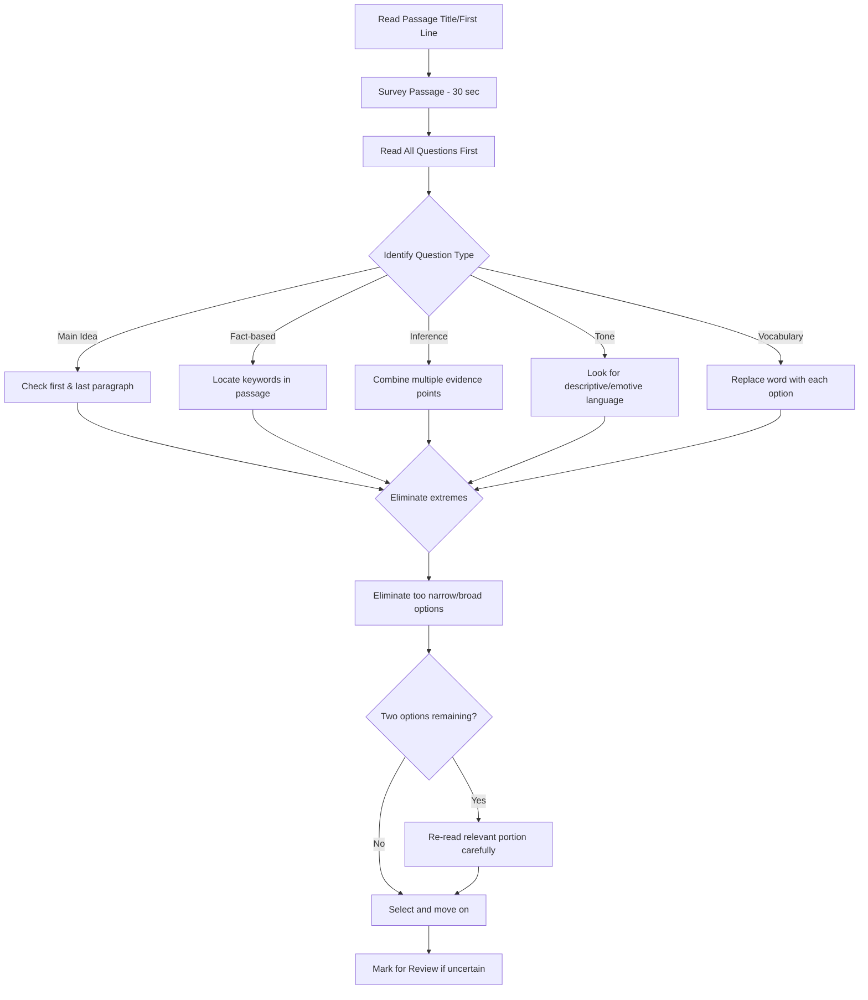
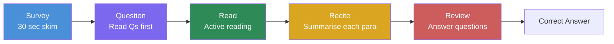

# Chapter 1: Reading Comprehension

## Learning Objectives

By the end of this chapter, you will be able to:
- Identify the main idea and purpose of a given passage
- Answer inference-based and fact-based questions accurately
- Distinguish between direct, inferred, and tone-based questions
- Apply time-efficient reading strategies for IBPS SO Prelims
- Solve Cloze Test questions that accompany RC passages

---

## Theory

### 1.1 What Is Reading Comprehension in Govt Exams?

<a href="../../../assets/images/diagrams/english-language/01-reading-comprehension/1-1-what-is-reading-comprehension-in-govt-exams-handwritten.svg" target="_blank" rel="noopener">
  
</a>
<a href="../../../assets/images/diagrams/english-language/01-reading-comprehension/1-1-what-is-reading-comprehension-in-govt-exams-diagram.svg" target="_blank" rel="noopener">
  
</a>
<a href="../../../assets/images/diagrams/english-language/01-reading-comprehension/1-1-what-is-reading-comprehension-in-govt-exams-sticky.svg" target="_blank" rel="noopener">
  
</a>


Reading Comprehension (RC) is the single highest-weightage topic in IBPS SO IT Officer Prelims, accounting for **8–10 questions** out of 25 English Language questions. Typically, **2 passages** are given — one of moderate length (350–500 words) and another shorter passage (200–300 words). Questions test your ability to understand, interpret, and analyse written text.

Exams that feature RC passages:
- **IBPS SO Prelims** — 2 passages, 8–10 questions
- **SBI PO Prelims** — 2 passages, 8–10 questions
- **RBI Grade B** — 3 passages, 10–12 questions
- **SSC CGL Tier 2** — 3–4 passages
- **Insurance exams (UIIC, NICL, NIACL)** — 2 passages

### 1.2 Types of Passages

<a href="../../../assets/images/diagrams/english-language/01-reading-comprehension/1-2-types-of-passages-handwritten.svg" target="_blank" rel="noopener">
  
</a>
<a href="../../../assets/images/diagrams/english-language/01-reading-comprehension/1-2-types-of-passages-diagram.svg" target="_blank" rel="noopener">
  
</a>
<a href="../../../assets/images/diagrams/english-language/01-reading-comprehension/1-2-types-of-passages-sticky.svg" target="_blank" rel="noopener">
  
</a>


| Type | Theme | Example Topics |
|------|-------|----------------|
| **Economic / Business** | Finance, banking, trade | Digital payments, inflation, RBI policy |
| **Social** | Education, health, gender | Women empowerment, literacy schemes |
| **Science & Technology** | IT, AI, cybersecurity | Blockchain in banking, AI in governance |
| **Philosophical / Abstract** | Ethics, values, thought | Leadership, work-life balance |
| **Historical / Political** | Governance, constitution | Indian financial system evolution |

> **IBPS SO-specific note:** Passages often have a **technology-in-banking** or **digital-finance** flavour. Reading The Hindu's Business Line is excellent preparation.

### 1.3 Types of Questions

<a href="../../../assets/images/diagrams/english-language/01-reading-comprehension/1-3-types-of-questions-handwritten.svg" target="_blank" rel="noopener">
  
</a>
<a href="../../../assets/images/diagrams/english-language/01-reading-comprehension/1-3-types-of-questions-diagram.svg" target="_blank" rel="noopener">
  
</a>
<a href="../../../assets/images/diagrams/english-language/01-reading-comprehension/1-3-types-of-questions-sticky.svg" target="_blank" rel="noopener">
  
</a>


#### A. Main Idea / Central Theme
- *"What is the main idea of the passage?"*
- *"The central theme of the passage is:"*
- Strategy: Look at the first and last paragraphs. Eliminate options that are too narrow or too broad.

#### B. Fact-Based / Direct
- *"According to the passage, which of the following is true?"*
- *"Which of the following statements is correct?"*
- Strategy: Locate keywords from the options in the passage. Verify verbatim.

#### C. Inference Based
- *"Which of the following can be inferred from the passage?"*
- *"The author implies that:"*
- Strategy: The answer is NOT directly stated. Combine two or more pieces of evidence from the passage.

#### D. Tone / Attitude
- *"The tone of the passage is:"*
- *"The author's attitude towards X can be described as:"*
- Common tones: Analytical, critical, appreciative, neutral, sarcastic, optimistic, pessimistic, factual, persuasive.

#### E. Vocabulary in Context
- *"What is the meaning of the word 'X' as used in the passage?"*
- Strategy: Replace the word with each option and see which fits the context.

#### F. Author's Recommendation / Purpose
- *"What does the author suggest?"*
- *"The purpose of the passage is to:"*

### 1.4 The SQ3R Method for RC

<a href="../../../assets/images/diagrams/english-language/01-reading-comprehension/1-4-the-sq3r-method-for-rc-handwritten.svg" target="_blank" rel="noopener">
  
</a>
<a href="../../../assets/images/diagrams/english-language/01-reading-comprehension/1-4-the-sq3r-method-for-rc-diagram.svg" target="_blank" rel="noopener">
  
</a>
<a href="../../../assets/images/diagrams/english-language/01-reading-comprehension/1-4-the-sq3r-method-for-rc-sticky.svg" target="_blank" rel="noopener">
  
</a>


**S — Survey:** Skim the passage in 30 seconds (read first line of each paragraph, look for dates, proper nouns, keywords).

**Q — Question:** Read the questions FIRST. Underline keywords in each question.

**R — Read:** Read the passage actively. Keep the questions in mind. Mark relevant sentences with a pencil (on paper) or mental note (on screen).

**R — Recite:** After each paragraph, mentally summarise in one sentence.

**R — Review:** Answer questions by revisiting marked portions.

```text
[Start] --&gt; Survey (30s skim) --&gt; Read Questions --&gt; Active Read
                                           |
                                     [Answer Qs & Review]
```

### 1.5 Speed vs Accuracy Trade-off

<a href="../../../assets/images/diagrams/english-language/01-reading-comprehension/1-5-speed-vs-accuracy-trade-off-handwritten.svg" target="_blank" rel="noopener">
  
</a>
<a href="../../../assets/images/diagrams/english-language/01-reading-comprehension/1-5-speed-vs-accuracy-trade-off-diagram.svg" target="_blank" rel="noopener">
  
</a>
<a href="../../../assets/images/diagrams/english-language/01-reading-comprehension/1-5-speed-vs-accuracy-trade-off-sticky.svg" target="_blank" rel="noopener">
  
</a>


In IBPS SO Prelims, you have approximately **55 minutes for all sections**. English should take **12–15 minutes max**. For RC:

| Step | Time |
|------|------|
| Survey | 30 seconds |
| Read questions | 1 minute |
| Active reading | 3–4 minutes |
| Answering | 3–4 minutes |
| **Total per passage** | **7–9 minutes** |

### 1.6 Cloze Test Integration

<a href="../../../assets/images/diagrams/english-language/01-reading-comprehension/1-6-cloze-test-integration-handwritten.svg" target="_blank" rel="noopener">
  
</a>
<a href="../../../assets/images/diagrams/english-language/01-reading-comprehension/1-6-cloze-test-integration-diagram.svg" target="_blank" rel="noopener">
  
</a>
<a href="../../../assets/images/diagrams/english-language/01-reading-comprehension/1-6-cloze-test-integration-sticky.svg" target="_blank" rel="noopener">
  
</a>


Many exams combine RC with **Cloze Test** — a passage with blanked-out words. You must choose the most appropriate word from options.

**Cloze Test strategies:**
1. Read the entire passage first (ignore blanks initially)
2. Identify the part of speech needed for each blank (noun, verb, adjective, adverb)
3. Check for grammatical agreement (subject-verb, tense, number)
4. Look for contextual clues in surrounding sentences
5. Eliminate obviously wrong options

---

## Examples with Solved Exercises

### Example 1: Economic Passage (IBPS SO Level)

**Passage:**

The Unified Payments Interface (UPI) has transformed the digital payments landscape in India since its launch in 2016. From a modest 1 million transactions in August 2016, UPI has grown to over 10 billion transactions per month in 2024. This exponential growth has been driven by the proliferation of smartphones, affordable data plans, and the interoperable architecture of UPI itself. Unlike traditional payment systems that required merchant discount rates and complex settlement processes, UPI operates on a simple push-pull model. The user initiates a payment from their bank account through a third-party app, and the transaction is settled almost instantly. However, this growth has not been without challenges. Cybersecurity concerns, fraud incidents, and the digital divide between urban and rural areas continue to pose significant hurdles. The Reserve Bank of India has responded with increasingly stringent regulatory frameworks, including transaction limits and mandatory two-factor authentication. Going forward, the integration of UPI with international payment systems and the advent of CBDCs (Central Bank Digital Currencies) promise to further reshape the payments ecosystem.

**Questions:**

**Q1.** What is the main idea of the passage?

a) UPI transactions have grown exponentially and face no significant challenges
b) UPI has revolutionised digital payments in India but faces cybersecurity and regulatory challenges
c) UPI is the only payment system in India
d) RBI has opposed the growth of UPI

**Explanation:**
Option (b) correctly captures both the growth and the challenges mentioned. Option (a) is incorrect because challenges ARE mentioned. Option (c) is false — other systems exist. Option (d) is contradicted; RBI has regulated, not opposed.

**Answer:** b

---

**Q2.** Which of the following can be inferred about the future of UPI?

a) UPI transactions will decline due to cybersecurity concerns
b) UPI will likely integrate with international payment systems
c) UPI will be replaced by CBDCs completely
d) Two-factor authentication will be removed

**Explanation:**
The passage states "the integration of UPI with international payment systems and the advent of CBDCs promise to further reshape the payments ecosystem." This directly supports (b). Option (a) contradicts the positive outlook. Option (c) is extreme — "reshape" does not mean replace. Option (d) contradicts the passage.

**Answer:** b

---

**Q3.** The tone of the passage can best be described as:

a) Highly critical
b) Sarcastic
c) Analytical and balanced
d) Enthusiastic only

**Explanation:**
The passage presents both the growth story AND the challenges, maintaining a balanced, factual tone. (c) is correct. It is not predominantly critical (a), sarcastic (b), or only enthusiastic (d).

**Answer:** c

---

**Q4.** What does the word "proliferation" mean in the context of this passage?

a) Reduction
b) Rapid increase
c) Regulation
d) Elimination

**Explanation:**
"The proliferation of smartphones" in the context of driving UPI growth means rapid increase or widespread adoption. (b) is correct.

**Answer:** b

---

### Example 2: Technology & Society Passage

**Passage:**

Artificial Intelligence is no longer confined to science fiction. In India, AI applications have permeated sectors ranging from agriculture to banking. In the financial sector, AI-powered chatbots handle customer queries, machine learning algorithms detect fraudulent transactions, and robo-advisors offer investment recommendations. The National Strategy for Artificial Intelligence, released by NITI Aayog, identifies five focus areas: healthcare, agriculture, education, smart cities, and mobility. Despite these advances, experts warn about algorithmic bias, data privacy concerns, and the potential displacement of jobs. The challenge for policymakers is to foster innovation while ensuring ethical safeguards. India's large pool of IT talent and its status as a data-rich economy position it favourably in the global AI race. However, without adequate investment in foundational research and robust data protection laws, India risks becoming a consumer rather than a creator of AI technologies.

**Q5.** According to the passage, which of the following is a concern related to AI adoption?

a) Lack of IT talent
b) Algorithmic bias and data privacy
c) Excessive government regulation
d) Insufficient data generation

**Explanation:**
The passage explicitly mentions "algorithmic bias, data privacy concerns, and the potential displacement of jobs." Option (b) matches. Option (a) contradicts the passage which mentions "large pool of IT talent." Option (c) is not mentioned. Option (d) contradicts "data-rich economy."

**Answer:** b

---

**Q6.** What is the author's primary purpose in writing this passage?

a) To criticise AI implementation in India
b) To provide a balanced overview of AI's potential and challenges in India
c) To promote NITI Aayog's strategy exclusively
d) To argue against AI adoption

**Explanation:**
The passage presents both opportunities and challenges in a balanced manner. Option (b) is correct. The author is not exclusively critical (a), promotional (c), or opposed (d).

**Answer:** b

---

### Example 3: Cloze Test (Blank-Filling)

**Passage with blanks:**

The Reserve Bank of India has ___(1)___ a new framework for digital lending to address growing concerns about data privacy and predatory lending practices. Under the new guidelines, all digital lending apps must undergo ___(2)___ verification by a nodal agency. The framework also mandates that loan disbursement and repayment should occur directly between the borrower's bank account and the ___(3)___ lender, without funds flowing through third-party intermediaries. Lenders are also required to provide a Key Fact Statement (KFS) to borrowers, ___(4)___ the Annual Percentage Rate (APR), the total repayment amount, and the tenure. This move is expected to bring much-needed ___(5)___ to the digital lending ecosystem.

**Blanks and Options:**

**(1)** a) announced  b) revoked  c) criticised  d) ignored
**(2)** a) optional  b) mandatory  c) voluntary  d) random
**(3)** a) unauthorised  b) registered  c) foreign  d) unregulated
**(4)** a) hiding  b) omitting  c) disclosing  d) complicating
**(5)** a) chaos  b) confusion  c) transparency  d) secrecy

**Explanation:**

1. (a) announced — RBI introducing a framework is best described as announcing it. Revoked/ignored are opposite. Criticised doesn't fit.
2. (b) mandatory — "must undergo" implies mandatory. Optional/voluntary contradict.
3. (b) registered — Loans must come from registered lenders. Unauthorised/unregulated are the opposite of what regulation intends.
4. (c) disclosing — KFS reveals APR and terms. Hiding/omitting are opposite.
5. (c) transparency — The framework aims to bring clarity/openness. Chaos/secrecy are opposite.

**Answers:** 1-a, 2-b, 3-b, 4-c, 5-c

---

## 📝 Solved Examples (20 MCQs)

### Passage 1: Digital Lending Revolution (Economic)

**Passage:**

The digital lending ecosystem in India has witnessed unprecedented growth over the past five years, driven by the convergence of smartphone penetration, affordable data, and favourable regulatory policies. According to a report by the Reserve Bank of India, digital lending disbursements grew at a compound annual growth rate (CAGR) of 39% between 2020 and 2025, reaching approximately ₹15 lakh crore. This growth has been particularly pronounced in the microfinance and personal loan segments, where fintech platforms have leveraged alternative credit scoring models to serve customers with no formal credit history. These platforms use non-traditional data sources such as utility bill payments, mobile recharge history, and even social media activity to assess creditworthiness. However, concerns about data privacy, predatory lending practices, and customer harassment by recovery agents have prompted the RBI to tighten regulations. The Digital Lending Guidelines, effective from 2023, mandate that all loan disbursements and repayments must occur directly between the borrower's bank account and the registered lender, eliminating third-party pass-through accounts. Lenders must also provide a standardised Key Fact Statement (KFS) containing the annual percentage rate (APR), the total repayment amount, and the tenure. While these regulations have increased compliance costs, they have also enhanced borrower confidence and reduced instances of over-indebtedness.

**Q1.** What is the primary reason digital lending platforms have been able to serve customers without formal credit histories?

a) Their use of traditional credit scoring models
b) Their use of alternative data sources for credit assessment
c) Their partnership with established banks
d) Their lower interest rates compared to traditional lenders

<details>
<summary>Answer</summary>
b) Their use of alternative data sources for credit assessment. The passage explicitly states that platforms "use non-traditional data sources such as utility bill payments, mobile recharge history, and even social media activity to assess creditworthiness." Options (a) contradicts the passage, (c) is not mentioned, and (d) is not stated.
</details>

---

**Q2.** Which of the following is NOT a requirement under the RBI's Digital Lending Guidelines?

a) Direct disbursement and repayment between borrower and lender accounts
b) Provision of a standardised Key Fact Statement
c) Mandatory physical branch presence for all digital lenders
d) Elimination of third-party pass-through accounts

<details>
<summary>Answer</summary>
c) Mandatory physical branch presence for all digital lenders. The passage mentions direct disbursement (a), provision of KFS (b), and elimination of third-party pass-through accounts (d). Mandatory physical branch presence is not mentioned and would contradict the nature of digital lending.
</details>

---

**Q3.** The tone of the passage can best be described as:

a) Highly critical of digital lending
b) Uncritically optimistic
c) Analytical and balanced
d) Sarcastic and dismissive

<details>
<summary>Answer</summary>
c) Analytical and balanced. The passage presents both the growth story (39% CAGR, ₹15 lakh crore) and the concerns (data privacy, predatory lending). It acknowledges regulatory responses as having both costs and benefits. It is not predominantly critical (a), only optimistic (b), or sarcastic (d).
</details>

---

**Q4.** What does "over-indebtedness" in the final line most likely mean?

a) Complete elimination of debt
b) A situation where borrowers take on more debt than they can repay
c) Reduction in overall lending
d) Increase in banking profits

<details>
<summary>Answer</summary>
b) A situation where borrowers take on more debt than they can repay. In the context of digital lending regulations reducing instances of this, "over-indebtedness" refers to borrowers accumulating excessive debt beyond their repayment capacity.
</details>

---

### Passage 2: AI in Governance (Science & Technology)

**Passage:**

Artificial Intelligence is increasingly being deployed in government service delivery across India, promising efficiency gains and improved citizen outcomes. The use of AI-powered chatbots for grievance redressal, predictive analytics for resource allocation, and computer vision for traffic management are no longer experimental — they are operational realities. The Ministry of Electronics and Information Technology (MeitY) has identified over 40 use cases for AI in governance, ranging from crop yield prediction using satellite imagery to real-time sentiment analysis of public feedback. However, the adoption of AI in governance raises significant ethical questions. Algorithmic bias remains a pressing concern — if the data used to train AI models reflects historical inequalities, the AI system may perpetuate or even amplify these biases. For instance, an AI system trained on historical loan approval data may replicate past discriminatory lending practices. Transparency is another challenge: citizens have a right to know when decisions affecting them are made by algorithms rather than humans. The government's proposed Digital India Act aims to address these concerns by mandating algorithmic accountability and impact assessments for high-risk AI applications. Without such safeguards, the efficiency gains from AI may come at the cost of fairness and due process.

**Q5.** According to the passage, which of the following is a concern about AI in governance?

a) AI systems are too expensive to implement
b) AI systems may perpetuate historical biases through algorithmic bias
c) AI systems are not efficient enough for government use
d) AI systems reduce citizen engagement with government

<details>
<summary>Answer</summary>
b) AI systems may perpetuate historical biases through algorithmic bias. The passage explicitly states "if the data used to train AI models reflects historical inequalities, the AI system may perpetuate or even amplify these biases." The other options are either contradictory or not mentioned.
</details>

---

**Q6.** Which of the following can be inferred from the passage?

a) India has banned the use of AI in government decision-making
b) The government is considering legal frameworks to regulate AI in governance
c) AI adoption in Indian governance is limited to experimental stages
d) Algorithmic bias is not a serious concern for policymakers

<details>
<summary>Answer</summary>
b) The government is considering legal frameworks to regulate AI in governance. The passage mentions "The government's proposed Digital India Act aims to address these concerns by mandating algorithmic accountability." Option (a) is contradicted — AI is already deployed. Option (c) is contradicted — use cases are "operational realities." Option (d) is contradicted — the passage highlights bias as a concern.
</details>

---

**Q7.** What is the primary purpose of the proposed Digital India Act as described in the passage?

a) To promote AI adoption in the private sector
b) To mandate algorithmic accountability and impact assessments for high-risk AI
c) To ban all non-human decision-making in government
d) To allocate more funding for AI research

<details>
<summary>Answer</summary>
b) To mandate algorithmic accountability and impact assessments for high-risk AI. The passage directly states this. Option (a) misses the regulatory focus. Option (c) is extreme and not stated. Option (d) is not mentioned.
</details>

---

**Q8.** The author's attitude towards the use of AI in governance is best described as:

a) Strong opposition
b) Unconditional support
c) Cautious optimism — recognising benefits while highlighting risks
d) Complete indifference

<details>
<summary>Answer</summary>
c) Cautious optimism — recognising benefits while highlighting risks. The passage acknowledges efficiency gains and improved outcomes but devotes equal attention to ethical concerns and the need for safeguards.
</details>

---

### Passage 3: Climate Finance (Economic/Social)

**Passage:**

Climate finance has emerged as a critical pillar of global economic policy, with developing nations at the centre of the debate. India, as the world's third-largest emitter of greenhouse gases but also one of the most vulnerable countries to climate change, occupies a unique position in this discourse. The country has committed to achieving net-zero emissions by 2070 and has set ambitious targets of 500 GW of non-fossil fuel energy capacity by 2030. However, the transition to a low-carbon economy requires significant financial resources. Estimates by the Council on Energy, Environment and Water (CEEW) suggest that India needs approximately $10 trillion in climate finance by 2070 to meet its net-zero target. Currently, the gap between available and required climate finance is substantial. While developed countries have committed $100 billion annually to support climate action in developing nations, actual disbursements have fallen short. India has also launched its own initiatives, including sovereign green bonds and the National Adaptation Fund for Climate Change (NAFCC). The challenge lies not merely in mobilising resources but in ensuring their efficient deployment — projects must be bankable, and the financial mechanisms must be transparent and accountable.

**Q9.** What is the main idea of the passage?

a) India does not need climate finance because it has sufficient resources
b) Climate finance is essential for India's transition to net-zero, but there is a significant funding gap
c) Developed countries have fully met their climate finance commitments
d) India should abandon its net-zero targets due to financial constraints

<details>
<summary>Answer</summary>
b) Climate finance is essential for India's transition to net-zero, but there is a significant funding gap. The passage presents both the need ($10 trillion by 2070) and the gap (shortfall in disbursements). Options (a), (c), and (d) are all contradicted by the passage.
</details>

---

**Q10.** Which of the following is NOT mentioned as an Indian initiative for climate finance?

a) Sovereign green bonds
b) National Adaptation Fund for Climate Change
c) Carbon tax on fossil fuels
d) Commitments to 500 GW non-fossil fuel capacity

<details>
<summary>Answer</summary>
c) Carbon tax on fossil fuels. The passage mentions sovereign green bonds (a), NAFCC (b), and the 500 GW target (d). Carbon tax is not mentioned in the passage.
</details>

---

**Q11.** The passage uses the word "bankable" in the context of climate projects. What does it most likely mean?

a) Related to banking operations
b) Likely to be profitable and therefore attractive to investors
c) Dependent on bank loans
d) Located near a bank

<details>
<summary>Answer</summary>
b) Likely to be profitable and therefore attractive to investors. In the context of financing, "bankable" means a project that is financially viable and meets the criteria for lending or investment.
</details>

---

**Q12.** What can be inferred about the author's view on developed countries' climate finance commitments?

a) They have been fully honoured
b) They have been inadequate compared to what was promised
c) They are unnecessary for climate action
d) They exceed what is required

<details>
<summary>Answer</summary>
b) They have been inadequate compared to what was promised. The passage states "actual disbursements have fallen short" of the $100 billion annual commitment, implying the author views the fulfilment as insufficient.
</details>

---

### Passage 4: Cybersecurity in Banking (Technology)

**Passage:**

The Indian banking sector has witnessed a dramatic escalation in cyber threats over the past three years, correlating closely with the rapid pace of digital adoption. According to the Indian Computer Emergency Response Team (CERT-In), the banking sector reported over 300,000 cybersecurity incidents in 2024, a 150% increase from 2021. These incidents range from sophisticated ransomware attacks targeting core banking systems to large-scale phishing campaigns aimed at retail customers. The nature of these threats has also evolved — attackers are no longer lone hackers but organised crime syndicates and, in some cases, state-sponsored groups. The financial implications are severe: the average cost of a data breach in the Indian financial sector is estimated at ₹18.5 crore, according to an IBM report. In response, banks have been investing heavily in cybersecurity infrastructure. AI-powered Security Information and Event Management (SIEM) systems are now standard, and biometric authentication has replaced traditional passwords for high-value transactions. The RBI's Cyber Security Framework, updated in 2024, mandates that all scheduled commercial banks conduct quarterly vulnerability assessments, annual penetration testing, and maintain a dedicated Cyber Crisis Management Plan (CCMP). Despite these measures, a significant challenge persists: the shortage of skilled cybersecurity professionals in India, estimated at over 300,000 unfilled positions.

**Q13.** Which of the following statements is true based on the passage?

a) Cybersecurity incidents in banking have decreased since 2021
b) The average cost of a data breach in Indian banking is ₹18.5 crore
c) Cyber threats in banking come exclusively from lone hackers
d) RBI does not require banks to conduct vulnerability assessments

<details>
<summary>Answer</summary>
b) The average cost of a data breach in Indian banking is ₹18.5 crore. The passage explicitly states this figure. Option (a) contradicts the 150% increase. Option (c) contradicts the mention of organised crime syndicates and state-sponsored groups. Option (d) contradicts the mandate for quarterly assessments.
</details>

---

**Q14.** The primary challenge to banking cybersecurity in India, as mentioned in the passage, is:

a) Lack of regulatory guidelines
b) Insufficient technology adoption
c) Shortage of skilled cybersecurity professionals
d) Low digital adoption among customers

<details>
<summary>Answer</summary>
c) Shortage of skilled cybersecurity professionals. The passage concludes with "a significant challenge persists: the shortage of skilled cybersecurity professionals." Options (a) and (b) are contradicted — regulations exist and AI-powered systems are standard.
</details>

---

**Q15.** The author's tone in describing the cybersecurity situation is:

a) Alarmist and exaggerated
b) Reassuring and dismissive
c) Factual and concerned
d) Sarcastic and mocking

<details>
<summary>Answer</summary>
c) Factual and concerned. The passage presents statistics and facts (300,000 incidents, ₹18.5 crore cost) while also conveying concern about the "dramatic escalation" and "severe" implications. It is not alarmist (a), dismissive (b), or sarcastic (d).
</details>

---

**Q16.** What does CCMP stand for in the context of the passage?

a) Cyber Crisis Management Plan
b) Central Computer Monitoring Protocol
c) Critical Control Measurement Process
d) Comprehensive Cyber Mitigation Programme

<details>
<summary>Answer</summary>
a) Cyber Crisis Management Plan. The passage explicitly states "maintain a dedicated Cyber Crisis Management Plan (CCMP)."
</details>

---

### Passage 5: The Gig Economy (Social/Philosophical)

**Passage:**

The gig economy in India has expanded rapidly, with an estimated 7.7 million workers engaged in platform-based gig work as of 2024. Platforms such as Swiggy, Zomato, Uber, and Urban Company have created income opportunities for millions, particularly for semi-skilled and unskilled workers who struggle to find employment in the formal sector. The flexibility of gig work — the ability to choose when and how much to work — is often cited as its primary advantage. For students, caregivers, and those with multiple income needs, this flexibility is genuinely valuable. However, the gig economy's growth has also exposed significant gaps in worker protections. Gig workers are typically classified as independent contractors rather than employees, which means they are not entitled to minimum wage guarantees, paid leave, health insurance, or retirement benefits under existing labour laws. The absence of social security for gig workers has become a pressing policy issue. The government's Code on Social Security, 2020, recognises gig workers as a distinct category for the first time and proposes extending social security benefits to them. Yet, implementation has been slow, and questions remain about how such a system would be funded. The debate ultimately centres on a fundamental tension: how to preserve the flexibility that makes gig work attractive while ensuring basic protections for workers.

**Q17.** What is the primary advantage of gig work according to the passage?

a) High income compared to formal employment
b) Flexibility in choosing work hours
c) Guaranteed minimum wage
d) Comprehensive health insurance

<details>
<summary>Answer</summary>
b) Flexibility in choosing work hours. The passage states "The flexibility of gig work — the ability to choose when and how much to work — is often cited as its primary advantage." Options (c) and (d) are explicitly mentioned as missing protections.
</details>

---

**Q18.** Which of the following is a challenge faced by gig workers as mentioned in the passage?

a) Excessive regulation by the government
b) Lack of social security and worker protections
c) Too many employment opportunities
d) Mandatory pension contributions

<details>
<summary>Answer</summary>
b) Lack of social security and worker protections. The passage states gig workers are "not entitled to minimum wage guarantees, paid leave, health insurance, or retirement benefits." Options (a), (c), and (d) are not supported.
</details>

---

**Q19.** What does the Code on Social Security, 2020, represent in the context of the passage?

a) A law that classifies gig workers as formal employees
b) The first recognition of gig workers as a distinct category in law
c) A law that bans gig work in India
d) A law that mandates all gig workers receive minimum wage

<details>
<summary>Answer</summary>
b) The first recognition of gig workers as a distinct category in law. The passage states the Code "recognises gig workers as a distinct category for the first time." It proposes extending benefits but has not been fully implemented.
</details>

---

**Q20.** The central tension discussed in the passage is between:

a) Urban and rural gig workers
b) Flexibility and worker protections
c) Platform owners and customers
d) State and central government regulations

<details>
<summary>Answer</summary>
b) Flexibility and worker protections. The concluding sentence states "how to preserve the flexibility that makes gig work attractive while ensuring basic protections for workers" as the fundamental tension.
</details>

---

## TypeScript Example: RC Passage Analyzer

The following TypeScript utility implements a reading comprehension passage analyzer that can extract key information to help identify main ideas, tone, and important keywords.

```typescript
interface PassageAnalysis {
  wordCount: number;
  averageSentenceLength: number;
  tone: string;
  mainKeywords: string[];
  readabilityScore: string;
  paragraphCount: number;
}

function analyzePassage(text: string): PassageAnalysis {
  const words = text.trim().split(/\s+/).filter(w => w.length > 0);
  const sentences = text.split(/[.!?]+/).filter(s => s.trim().length > 0);
  const paragraphs = text.split(/\n\s*\n/).filter(p => p.trim().length > 0);

  const wordCount = words.length;
  const averageSentenceLength = Math.round(wordCount / sentences.length);

  // Tone detection based on keyword frequency
  const toneKeywords: Record&lt;string, string[]&gt; = {
    analytical: ["however", "although", "while", "despite", "nevertheless"],
    critical: ["problem", "failure", "concern", "issue", "flaw", "shortcoming"],
    optimistic: ["potential", "opportunity", "growth", "promising", "breakthrough"],
    alarmist: ["crisis", "threat", "emergency", "catastrophe", "alarming"],
    neutral: ["states", "reports", "indicates", "according to", "data shows"],
  };

  let maxScore = 0;
  let detectedTone = "analytical";
  const lowerText = text.toLowerCase();

  for (const [tone, keywords] of Object.entries(toneKeywords)) {
    const score = keywords.reduce(
      (sum, kw) => sum + (lowerText.match(new RegExp(kw, "g")) || []).length,
      0
    );
    if (score > maxScore) {
      maxScore = score;
      detectedTone = tone;
    }
  }

  // Extract keywords (words appearing 3+ times, excluding stop words)
  const stopWords = new Set([
    "the", "a", "an", "in", "of", "to", "and", "is", "are", "was", "were",
    "has", "have", "had", "be", "been", "being", "it", "its", "this", "that",
  ]);
  const wordFrequency: Record&lt;string, number&gt; = {};
  for (const word of words) {
    const cleaned = word.replace(/[^a-zA-Z]/g, "").toLowerCase();
    if (cleaned.length > 3 && !stopWords.has(cleaned)) {
      wordFrequency[cleaned] = (wordFrequency[cleaned] || 0) + 1;
    }
  }
  const mainKeywords = Object.entries(wordFrequency)
    .sort((a, b) => b[1] - a[1])
    .slice(0, 5)
    .map(([word]) => word);

  // Readability estimate (simple: avg sentence length &lt; 20 = easy, 20-30 = moderate, &gt;30 = complex)
  let readabilityScore: string;
  if (averageSentenceLength < 20) readabilityScore = "Easy";
  else if (averageSentenceLength < 30) readabilityScore = "Moderate";
  else readabilityScore = "Complex";

  return {
    wordCount,
    averageSentenceLength,
    tone: detectedTone,
    mainKeywords,
    readabilityScore,
    paragraphCount: paragraphs.length,
  };
}

// Example usage:
const passage = `The Unified Payments Interface (UPI) has transformed the digital payments landscape in India since its launch in 2016. From a modest 1 million transactions in August 2016, UPI has grown to over 10 billion transactions per month in 2024. This exponential growth has been driven by the proliferation of smartphones, affordable data plans, and the interoperable architecture of UPI itself. However, this growth has not been without challenges. Cybersecurity concerns, fraud incidents, and the digital divide between urban and rural areas continue to pose significant hurdles. The Reserve Bank of India has responded with increasingly stringent regulatory frameworks.`;

const analysis = analyzePassage(passage);
console.log(`Word Count: ${analysis.wordCount}`);
console.log(`Avg Sentence Length: ${analysis.averageSentenceLength}`);
console.log(`Tone: ${analysis.tone}`);
console.log(`Keywords: ${analysis.mainKeywords.join(", ")}`);
console.log(`Readability: ${analysis.readabilityScore}`);
```

## Mermaid Flowchart: RC Question-solving Strategy



## Mermaid Flowchart: The SQ3R Method



---

## 📖 Exercise Bank (30 Questions)

### Section A: Passage-Based Questions (Q1-Q15)

**Passage 1 (Q1-Q3):** *The National Education Policy (NEP) 2020 represents a fundamental shift in India's approach to education. For the first time, the policy emphasises multidisciplinary learning, allowing students to combine arts and sciences, vocational and academic streams. The policy also introduces the 5+3+3+4 curricular structure, replacing the traditional 10+2 system. Early childhood education is now formally recognised within the school curriculum. Critics, however, argue that implementation faces significant hurdles — inadequate teacher training, infrastructure gaps in rural schools, and the challenge of curriculum revision at scale.*

1. What is the primary change introduced by NEP 2020 according to the passage?
2. What is the new curricular structure introduced by NEP 2020?
3. Which of the following is NOT mentioned as a challenge to NEP implementation?

**Passage 2 (Q4-Q6):** *Quantum computing promises to revolutionise cryptography, drug discovery, and climate modelling. Unlike classical computers that use bits (0 or 1), quantum computers use qubits that can exist in multiple states simultaneously through superposition. Google's Sycamore processor achieved quantum supremacy in 2019, performing a calculation in 200 seconds that would take a classical supercomputer 10,000 years. However, practical quantum computers capable of solving real-world problems remain years away. Current quantum processors are extremely sensitive to environmental noise, requiring near-absolute-zero temperatures to operate. Error correction remains another major technical hurdle.*

4. What makes quantum computers different from classical computers?
5. What did Google's Sycamore processor demonstrate?
6. What are two major challenges facing practical quantum computing?

**Passage 3 (Q7-Q8):** *The Securities and Exchange Board of India (SEBI) has introduced a new framework for ESG (Environmental, Social, and Governance) disclosures by listed companies. Under the Business Responsibility and Sustainability Report (BRSR) framework, the top 1,000 listed entities must disclose their ESG performance from FY2023-24 onwards. The framework covers nine principles including ethical conduct, environmental sustainability, and stakeholder engagement. While this is a significant step towards transparency, concerns about greenwashing — where companies exaggerate their environmental credentials — remain.*

7. What does the BRSR framework require of the top 1,000 listed companies?
8. What concern does the passage raise about ESG disclosures?

**Passage 4 (Q9-Q10):** *The concept of Universal Basic Income (UBI) has gained traction globally as a potential solution to job displacement caused by automation. Under UBI, every citizen receives a regular, unconditional cash transfer from the government. Pilot programmes in Finland, Kenya, and California have shown mixed results — while UBI reduced stress and improved well-being, it did not significantly reduce employment as critics had feared. In the Indian context, fiscal constraints make a full-scale UBI challenging, though some form of targeted basic income may be feasible.*

9. What is Universal Basic Income as described in the passage?
10. What did pilot programmes reveal about UBI's impact on employment?

### Section B: Cloze Tests (Q11-Q15)

**Cloze Test 1 (Q11-Q13):**

The Goods and Services Tax (GST) has ___(11)___ the indirect tax landscape in India since its introduction in 2017. By subsuming multiple central and state taxes into a single tax, GST has ___(12)___ the compliance burden for businesses and improved tax transparency. However, the multiple tax slabs — 5%, 12%, 18%, and 28% — have been ___(13)___ for a simplified tax regime.

11. a) complicated b) transformed c) maintained d) reversed
12. a) increased b) reduced c) ignored d) complicated
13. a) praised b) ideal c) criticised d) celebrated

**Cloze Test 2 (Q14-Q15):**

The RBI's Monetary Policy Committee (MPC) meets ___(14)___ to review the repo rate. In 2024, the MPC maintained a status quo on rates for five consecutive meetings, citing concerns about inflation. The ___(15)___ inflation target remains at 4%, with a tolerance band of +/- 2%.

14. a) annually b) bi-monthly c) weekly d) daily
15. a) short-term b) medium-term c) long-term d) flexible

### Section C: Tone Identification (Q16-Q20)

Match each passage excerpt with the correct tone:

**Tone Bank:** Laudatory, Critical, Neutral/Factual, Sceptical, Optimistic

16. "The government's polio eradication programme stands as one of the most successful public health campaigns in human history, saving millions of children from lifelong disability."
17. "While GDP growth has improved, the quality of employment remains a concern, with most new jobs being in the informal sector."
18. "The total expenditure on infrastructure in the Union Budget 2025-26 is budgeted at ₹11.11 lakh crore, representing a 12% increase over the previous fiscal year."
19. "If the current trajectory of climate change continues, coastal cities like Mumbai and Chennai could face catastrophic flooding within our lifetime."
20. "The new tax regime has simplified compliance for some taxpayers, but its long-term impact on savings behaviour remains to be seen."

### Section D: Vocabulary in Context (Q21-Q25)

Choose the correct meaning of the word as used in the sentence:

21. *The new regulations will **curtail** the powers of unregulated digital lenders.*
    a) Expand b) Restrict c) Ignore d) Promote

22. *The committee's **ad hoc** approach to the crisis was widely criticised.*
    a) Systematic b) Planned c) Improvised d) Permanent

23. *The proposal met with **unanimous** approval from all board members.*
    a) Divided b) Partial c) Complete d) Reluctant

24. *The **tenuous** relationship between the two departments affected project timelines.*
    a) Weak b) Strong c) Stable d) Formal

25. *The CEO's **laconic** response surprised the team expecting a detailed explanation.*
    a) Verbose b) Lengthy c) Brief d) Enthusiastic

### Section E: Main Idea and Inference (Q26-Q30)

26. *"The shift to work-from-home has reduced office overheads but has also created challenges in team collaboration and performance monitoring."* What is the main idea?
27. *"The stock market rallied after the RBI maintained the repo rate. However, analysts warned that inflation concerns remain."* What can be inferred?
28. *"Despite significant investment in cybersecurity, the number of successful attacks continues to rise, suggesting that technology alone is insufficient."* What does the author imply?
29. *"The decline in manufacturing output, coupled with rising input costs, paints a concerning picture for the industrial sector."* What is the author's attitude?
30. *"Fintech startups have disrupted traditional banking by offering faster, cheaper services. However, their long-term sustainability remains unproven."* What is the central theme?

**Answer Key:**

| Q | Answer | Q | Answer | Q | Answer | Q | Answer | Q | Answer |
|---|--------|---|--------|---|--------|---|--------|---|--------|
| 1 | Multidisciplinary learning emphasis | 2 | 5+3+3+4 | 3 | Lack of digital devices | 4 | Qubits can exist in multiple states |
| 5 | Quantum supremacy | 6 | Noise sensitivity &amp; error correction | 7 | Disclose ESG performance via BRSR | 8 | Greenwashing concerns |
| 9 | Regular unconditional cash transfer | 10 | Did not significantly reduce employment | 11 | b) transformed | 12 | b) reduced |
| 13 | c) criticised | 14 | b) bi-monthly | 15 | b) medium-term | 16 | Laudatory |
| 17 | Critical | 18 | Neutral/Factual | 19 | Alarmist | 20 | Sceptical |
| 21 | b) Restrict | 22 | c) Improvised | 23 | c) Complete | 24 | a) Weak |
| 25 | c) Brief | 26 | WFH reduces costs but challenges collaboration | 27 | Market reacted positively but risks remain | 28 | Technology alone is insufficient for cybersecurity |
| 29 | Concerning/worried | 30 | Fintech disruption has benefits but sustainability uncertain |

---

## Summary

- Reading Comprehension carries **8–10 questions** in IBPS SO Prelims — the largest share of the English section
- Master the **SQ3R method**: Survey, Question, Read, Recite, Review
- Identify **question types** early — fact-based, inference, tone, main idea, vocabulary
- Technology and economics passages are common in IT officer exams
- **Cloze Test** is often integrated — use part-of-speech and context clues
- Time management is critical: **7–9 minutes per passage**
- Practice reading The Hindu/Business Line editorials daily

---

## Practical Takeaways

| Strategy | Implementation |
|----------|----------------|
| Pre-read questions | Read all questions before reading the passage (1 minute) |
| Highlight keywords | Mark transition words (however, therefore, but) and proper nouns |
| Eliminate extremes | Options with "always", "never", "completely" are usually wrong |
| Trust the passage | Do not use outside knowledge — base answers ONLY on the given text |
| Tone vocabulary | Learn 10–15 tone words: analytical, ambivalent, laudatory, disparaging, etc. |
| Negative marking | If unsure, eliminate 2 options and guess intelligently |

---

## Chapter Quiz

**Q1.** What is the first step in the SQ3R reading method?

a) Read
b) Survey
c) Question
d) Review

<details>
<summary>Show Answer</summary>

**Answer:** b) Survey

The SQ3R method begins with Survey — skimming the passage quickly before reading questions or diving into details.
</details>

---

**Q2.** In IBPS SO Prelims, approximately how much time should you allocate per reading comprehension passage?

a) 2–3 minutes
b) 7–9 minutes
c) 15–20 minutes
d) 1 minute

<details>
<summary>Show Answer</summary>

**Answer:** b) 7–9 minutes

With ~55 minutes for the entire paper, English should take 12–15 minutes total. Each passage should be handled in 7–9 minutes.
</details>

---

**Q3.** Which type of RC question requires you to combine two or more pieces of evidence from the passage?

a) Fact-based
b) Vocabulary in context
c) Inference
d) Tone

<details>
<summary>Show Answer</summary>

**Answer:** c) Inference

Inference questions are not directly answered by one sentence. You must logically combine multiple pieces of evidence from the passage.
</details>

---

**Q4.** In a Cloze Test, what should you identify first before looking at the options for each blank?

a) The author's name
b) The part of speech needed
c) The total word count
d) The tone of the passage

<details>
<summary>Show Answer</summary>

**Answer:** b) The part of speech needed

Identifying whether the blank needs a noun, verb, adjective, or adverb immediately eliminates many wrong options.
</details>

---

**Q5.** If an RC option contains the word "always" or "never", what should you do?

a) Immediately select it
b) Treat it with suspicion — extreme words are often incorrect
c) Ignore the passage and rely on common sense
d) Skip the question

<details>
<summary>Show Answer</summary>

**Answer:** b) Treat it with suspicion — extreme words are often incorrect

In RC questions, options with absolute words like "always", "never", "completely", or "entirely" are rarely correct because passages usually acknowledge nuance.
</details>

---

## Exercises

### Exercise 1: Passage Analysis

Read the following passage and answer the questions that follow:

*"The Open Network for Digital Commerce (ONDC) is a government-backed initiative aimed at democratising e-commerce in India. Unlike existing platforms by Amazon and Flipkart, which operate on a walled-garden model, ONDC uses an open protocol similar to UPI in digital payments. This means that any seller — from a large enterprise to a small kirana store — can list their products on ONDC-compatible apps. The initiative is expected to reduce the dominance of large e-commerce players and provide a level playing field for small businesses. However, challenges remain: low digital literacy among sellers, logistics integration issues, and the need for consumer trust in a decentralised marketplace."*

1. What is the main purpose of ONDC as described in the passage?
2. How does ONDC differ from traditional e-commerce platforms like Amazon?
3. What challenges does ONDC face in its implementation?
4. What does the phrase "walled-garden model" imply in this context?
5. The tone of the passage can best be described as:

### Exercise 2: Cloze Test

Fill in the blanks with the most appropriate word:

*Cybersecurity has become a ___(1)___ concern for Indian banks following a series of high-profile data breaches. The RBI has ___(2)___ all banks to conduct mandatory third-party audits of their IT systems. Banks have been given a ___(3)___ of six months to comply with the new guidelines. Failure to do so may result in ___(4)___ including monetary penalties and restrictions on digital banking operations. The guidelines also require banks to maintain ___(5)___ records of all security incidents for a minimum of five years.*

Options:
(1) a) minor  b) critical  c) trivial  d) optional
(2) a) requested  b) advised  c) directed  d) suggested
(3) a) deadline  b) holiday  c) extension  d) waiver
(4) a) rewards  b) incentives  c) penalties  d) promotions
(5) a) minimal  b) detailed  c) partial  d) deleted

### Exercise 3: Tone Identification

Match each passage excerpt with the correct tone from the word bank:

**Word Bank:** Sarcastic, Analytical, Laudatory, Alarmist, Neutral

| Excerpt | Tone |
|---------|------|
| "The government's flagship programme has achieved unprecedented success, transforming the lives of millions." | |
| "If current trends continue, the banking sector could face a crisis of epic proportions." | |
| "While the policy has yielded some positive results, certain aspects require careful re-examination." | |
| "The budget allocates 3.2 trillion rupees to infrastructure, representing a 12% increase over last year." | |
| "Oh brilliant, another committee to study a problem we already have five reports on." | |

### Answer Key for Exercises

**Exercise 1 (Passage Analysis):**
1. The main purpose of ONDC is to democratise e-commerce in India by providing an open protocol platform.
2. Unlike Amazon and Flipkart (walled-garden model), ONDC uses an open protocol similar to UPI, allowing any seller to participate.
3. Low digital literacy among sellers, logistics integration issues, and building consumer trust in a decentralised marketplace.
4. A "walled-garden model" refers to a closed ecosystem where the platform controls what sellers and buyers can do.
5. The tone is analytical and balanced — presenting both the potential and challenges of ONDC.

**Exercise 2 (Cloze Test):**
1. (b) critical — Cybersecurity is a critical concern, not minor or trivial.
2. (c) directed — RBI has the authority to direct banks, stronger than requested/suggested.
3. (a) deadline — A specific time period for compliance is a deadline.
4. (c) penalties — Non-compliance leads to penalties, not rewards.
5. (b) detailed — The context requires comprehensive records, not minimal or partial.

**Exercise 3 (Tone Identification):**

| Excerpt | Tone |
|---------|------|
| "The government's flagship programme has achieved unprecedented success..." | Laudatory |
| "If current trends continue, the banking sector could face a crisis..." | Alarmist |
| "While the policy has yielded some positive results..." | Analytical |
| "The budget allocates 3.2 trillion rupees to infrastructure..." | Neutral |
| "Oh brilliant, another committee to study a problem we already have five reports on." | Sarcastic |

---

*Proceed to Chapter 2 — Grammar Essentials*
