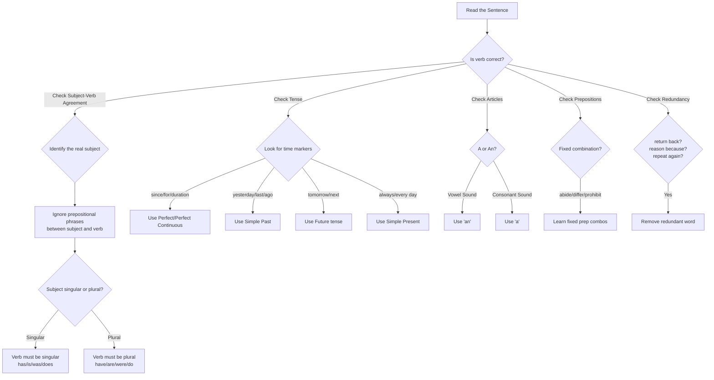
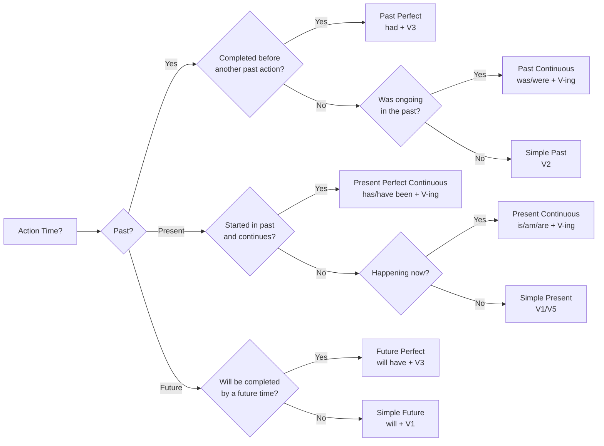

# Chapter 2: Grammar Essentials

## Learning Objectives

By the end of this chapter, you will be able to:
- Identify and correct common grammatical errors in sentences
- Apply rules of subject-verb agreement, tenses, articles, and prepositions
- Solve Spotting Error, Sentence Improvement, and Filler questions
- Distinguish between commonly confused pairs (affect/effect, there/their, etc.)
- Master sentence correction techniques for IBPS SO Prelims

<!-- Image Gallery -->
<section class="lesson-visuals" aria-label="Visual learning resources">
  <header><span>VISUAL LEARNING</span><h2>See it. Review it. Remember it.</h2></header>
  <a class="lesson-visual-card" href="../../../assets/images/lessons/english-language/02-grammar-essentials/.png" target="_blank" rel="noopener">
    
    <span><strong>Handwritten notes</strong>Condensed notes for deliberate review.</span>
  </a>
  <a class="lesson-visual-card" href="../../../assets/images/lessons/english-language/02-grammar-essentials/.png" target="_blank" rel="noopener">
    
    <span><strong>Sticky-note revision</strong>Fast recall prompts for revision.</span>
  </a>
  <a class="lesson-visual-card" href="../../../assets/images/lessons/english-language/02-grammar-essentials/.png" target="_blank" rel="noopener">
    
    <span><strong>Visual concept guide</strong>A connected explanation of the key ideas.</span>
  </a>
</section>
<!-- End Image Gallery -->

---

## Theory

### 2.1 Importance of Grammar in Govt Exams

Grammar questions account for **5–7 questions** in IBPS SO IT Officer Prelims. These appear in multiple formats:

| Format | Typical Count | Skill Tested |
|--------|---------------|--------------|
| Spotting Errors | 1–2 questions (5 sentences each) | Error identification |
| Sentence Improvement | 2–3 questions | Correction ability |
| Fillers (Single/Double) | 2–3 questions | Contextual grammar |
| Sentence Correction | 1–2 questions | Syntax & structure |

Grammar is the **most scoring section** in English. Rules are finite and predictable. Unlike RC or vocabulary, consistent practice guarantees accuracy.

### 2.2 Subject-Verb Agreement (Concord)

The verb must agree with its subject in **number and person**.

**Rule 1:** Singular subject → singular verb. Plural subject → plural verb.

- *The manager **is** reviewing the report.* (singular)
- *The managers **are** reviewing the report.* (plural)

**Rule 2:** Subjects joined by "and" are plural.
- *Ravi **and** his colleague **are** presenting.* ✓
- *Ravi **and** his colleague **is** presenting.* ✗

**Exception:** If the subjects form a single unit:
- *Bread **and** butter **is** my favourite breakfast.* (single unit)

**Rule 3:** With "either...or", "neither...nor" — the verb agrees with the subject NEAREST to it.
- *Neither the manager **nor** his assistants **are** present.* (assistants → are)
- *Neither the assistants **nor** the manager **is** present.* (manager → is)

**Rule 4:** "Each", "every", "either", "neither", "one of" take singular verbs.
- *Each of the employees **has** been trained.* ✓
- *Every candidate **appears** for the interview.* ✓

**Common Trick in Exams:**
- *One of the branches **have** closed.* ✗ (Incorrect)
- *One of the branches **has** closed.* ✓ (Correct — "one" is the subject)

**Rule 5:** Collective nouns (team, committee, audience, staff) can be singular or plural depending on meaning.
- *The team **is** united.* (team as a single unit)
- *The team **are** divided in their opinions.* (team as individuals)

**Rule 6:** Words like "a number of" take plural; "the number of" takes singular.
- *A number of issues **have** been resolved.* ✓
- *The number of issues **has** decreased.* ✓

**Rule 7:** Amounts, distances, time periods are singular.
- *Five thousand rupees **is** a reasonable price.* ✓
- *Ten kilometres **is** a long distance to walk.* ✓

### 2.3 Tenses

#### Tense Consistency Table

| Tense | Use | Example |
|-------|-----|---------|
| Simple Present | Facts, habits, routines | *The bank **opens** at 9 AM.* |
| Present Continuous | Ongoing action now | *The clerk **is processing** the application.* |
| Present Perfect | Past action with present relevance | *He **has submitted** the report.* |
| Present Perfect Continuous | Action started in past, still continuing | *She **has been working** here since 2015.* |
| Simple Past | Completed past action | *The meeting **ended** at 5 PM.* |
| Past Continuous | Ongoing past action interrupted | *They **were reviewing** files when the alarm rang.* |
| Past Perfect | Action completed before another past action | *He **had finished** before the deadline.* |
| Simple Future | Future action | *The results **will be** announced tomorrow.* |
| Future Perfect | Action completed by a future time | *We **will have completed** the project by Friday.* |

**Exam Trap:** Watch for tense inconsistency in compound sentences.
- *He **joined** the bank in 2020 and **works** there since then.* ✗
- *He **joined** the bank in 2020 and **has been working** there since then.* ✓

#### Sequence of Tenses in Narrations

- Past tense in main clause → past tense in subordinate clause
  - *He said that he **was** coming.* ✓
  - *He said that he **is** coming.* ✗

- Universal truth — always present tense
  - *The teacher said that the Earth **revolves** around the Sun.* ✓

### 2.4 Articles (A, An, The)

| Article | Use | Example |
|---------|-----|---------|
| A | Before consonant sound | *A university, a one-time fee* |
| An | Before vowel sound | *An hour, an MBA, an honest employee* |
| The | Specific/definite | *The RBI, the internet, the Himalayas* |

**Key Rules for "The":**
- Used before superlatives: *the best solution*
- Used before unique things: *the sun, the Earth*
- Used before names of rivers, seas, mountain ranges: *the Ganga, the Arabian Sea*
- NOT used before proper nouns (most cases): *Ravi is coming* (not *the Ravi*)
- NOT used before uncountable nouns in general sense: *Water is essential* (not *The water is essential*)

**Common Error in Exams:**
- *He is **an** honest officer.* ✓ (honest begins with vowel sound)
- *She is **a** European delegate.* ✓ (European begins with consonant sound /y/)

### 2.5 Prepositions

Prepositions show relationships in time, place, direction, and manner.

**Time Prepositions:**

| Preposition | Use | Example |
|-------------|-----|---------|
| At | Specific time | *at 5 PM, at midnight* |
| On | Days/dates | *on Monday, on 15th August* |
| In | Months/years/periods | *in March, in 2024, in the morning* |
| By | Deadline | *by Friday, by 6 PM* |
| Since | Point in time | *since 2019, since Monday* |
| For | Duration | *for three years, for a week* |

**Place Prepositions:**

| Preposition | Use | Example |
|-------------|-----|---------|
| At | Specific point | *at the reception, at 10 MG Road* |
| On | Surface | *on the table, on the screen* |
| In | Enclosed space | *in the office, in Mumbai* |
| Between | Two items | *between A and B* |
| Among | More than two | *among the employees* |

**Fixed Preposition Combinations (Very Important for Exams):**

| Word | Preposition | Example |
|------|-------------|---------|
| Prohibit | from | *prohibited from entering* |
| Prefer | to | *prefer coffee to tea* |
| Devoid | of | *devoid of logic* |
| Abide | by | *abide by the rules* |
| Accede | to | *accede to the request* |
| Avail | of | *avail of the opportunity* |
| Banish | from | *banished from the kingdom* |
| Compatible | with | *compatible with the system* |
| Discriminate | between/against | *discriminate between two, discriminate against a group* |
| Exempt | from | *exempted from the fee* |
| Infer | from | *inferred from the data* |
| Prevail | upon/over | *prevail upon someone, prevail over obstacles* |
| Refer | to | *refer to the document* |
| Succeed | in | *succeed in the endeavour* |

### 2.6 Conjunctions

| Conjunction | Use | Example |
|-------------|-----|---------|
| Although / Though | Contrast (despite) | *Although it rained, the event continued.* |
| Because / Since | Reason | *He passed because he studied hard.* |
| Unless | Condition (if not) | *Unless you register, you cannot appear.* |
| Provided / Provided that | Condition (if) | *You will pass provided you practise.* |
| So...that | Result | *The exam was so tough that few passed.* |
| Such...that | Result (with noun) | *It was such a tough exam that few passed.* |
| No sooner...than | Immediate sequence | *No sooner did he arrive than the meeting started.* |
| Hardly...when | Immediate sequence | *Hardly had he arrived when the meeting started.* |
| Not only...but also | Addition | *He is not only smart but also hardworking.* |

**Common Error:** Using "than" with "no sooner" instead of "than" — actually "than" is correct with "no sooner".
- *No sooner did he speak **than** everyone listened.* ✓
- *No sooner did he speak **when** everyone listened.* ✗

### 2.7 Commonly Confused Words

| Pair | Meaning | Correct Usage |
|------|---------|---------------|
| Affect / Effect | Verb vs Noun | *The policy **affects** us. (v) / The **effect** is significant. (n)* |
| There / Their / They're | Place / Possession / They are | *The report is **there**. / **Their** application is pending. / **They're** coming.* |
| Its / It's | Possession / It is | *The bank revised **its** policy. / **It's** a good decision.* |
| Accept / Except | Receive / Excluding | *We **accept** all formats. / All **except** this one.* |
| Stationary / Stationery | Not moving / Writing materials | *The car remained **stationary**. / Buy **stationery** from the shop.* |
| Principle / Principal | Rule / Chief or main amount | *The **principle** of honesty. / The **principal** amount is 5 lakhs.* |
| Compliment / Complement | Praise / That completes | *She received a **compliment**. / The wine **complements** the food.* |
| Access / Excess | Entry / Surplus | *Grant **access** to the system. / Avoid **excess** spending.* |
| Ensure / Insure | Guarantee / Financial cover | ***Ensure** timely delivery. / **Insure** the vehicle.* |
| Imminent / Eminent | About to happen / Famous | *The decision is **imminent**. / An **eminent** economist.* |

### 2.8 Active and Passive Voice

| Tense | Active | Passive |
|-------|--------|---------|
| Simple Present | *The clerk processes the form.* | *The form is processed by the clerk.* |
| Present Continuous | *The clerk is processing the form.* | *The form is being processed by the clerk.* |
| Present Perfect | *The clerk has processed the form.* | *The form has been processed by the clerk.* |
| Simple Past | *The clerk processed the form.* | *The form was processed by the clerk.* |
| Past Continuous | *The clerk was processing the form.* | *The form was being processed by the clerk.* |
| Past Perfect | *The clerk had processed the form.* | *The form had been processed by the clerk.* |
| Simple Future | *The clerk will process the form.* | *The form will be processed by the clerk.* |
| Modals | *The clerk must process the form.* | *The form must be processed by the clerk.* |

**Exam Tip:** In Spotting Error questions, check if the voice is appropriate for the context. If the doer of the action is unclear or unimportant, passive voice is correct.

### 2.9 Direct and Indirect Speech

| Direct | Indirect |
|--------|----------|
| Simple Present → Simple Past | *He said, "I work here." → He said that he worked there.* |
| Present Continuous → Past Continuous | *He said, "I am working." → He said that he was working.* |
| Present Perfect → Past Perfect | *He said, "I have worked." → He said that he had worked.* |
| Simple Past → Past Perfect | *He said, "I worked." → He said that he had worked.* |
| Will → Would | *He said, "I will come." → He said that he would come.* |
| Can → Could | *He said, "I can do it." → He said that he could do it.* |
| May → Might | *He said, "I may go." → He said that he might go.* |
| Must → Had to | *He said, "I must leave." → He said that he had to leave.* |

**Reporting Verb Changes:**
- "said to" → "told" (with object)
- "said" → "said" (without object)

**Interrogative Sentences:**
- Reporting verb changes to "asked/inquired/enquired"
- Remove question mark, use "if/whether" for yes/no questions
- *He said to me, "Are you coming?" → He asked me **whether** I was coming.*
- For WH-questions, use the WH-word as conjunction
- *He asked, "Where do you work?" → He asked **where** I worked.*

**Imperative Sentences:**
- Reporting verb changes to "ordered/requested/advised/forbade"
- Use "to + verb" instead of "that"
- *The manager said, "Submit the report." → The manager **ordered** me **to submit** the report.*

### 2.10 Conditional Sentences

| Type | If Clause | Main Clause | Example |
|------|-----------|-------------|---------|
| Zero | Simple Present | Simple Present | *If you heat ice, it melts.* |
| Type 1 (Real) | Simple Present | will + V1 | *If you study, you will pass.* |
| Type 2 (Unreal Present) | Simple Past | would + V1 | *If I were you, I would accept.* |
| Type 3 (Unreal Past) | Past Perfect | would have + V3 | *If I had studied, I would have passed.* |

**Exam Note:** "Were" is used instead of "was" in Type 2 conditionals, especially with "if I were you" (which is fixed).

- *If I **was** the manager, I would approve it.* ✗
- *If I **were** the manager, I would approve it.* ✓

### 2.11 Key Error Detection Patterns

**Pattern 1 — Noun-Pronoun Agreement:**
- *Each of the officers must submit **their** report.* ✗
- *Each of the officers must submit **his/her** report.* ✓
- Recent trend: Some exams accept "their" as gender-neutral. But in conservative grammar, "his" or "his/her" is preferred.

**Pattern 2 — Parallelism:**
- *He likes swimming, running, and **to cycle**.* ✗
- *He likes **swimming**, **running**, and **cycling**.* ✓

**Pattern 3 — Redundancy:**
- *He returned **back** to the office.* ✗ (returned = came back)
- *He returned to the office.* ✓
- *The reason is **because** the system failed.* ✗
- *The reason is **that** the system failed.* ✓
- ***Repeat** the process **again**.* ✗
- *Repeat the process.* ✓

**Pattern 4 — Misplaced Modifiers:**
- *Walking down the street, the building looked impressive.* ✗ (building is not walking)
- *Walking down the street, **I** found the building impressive.* ✓

**Pattern 5 — Double Negatives:**
- *He **didn't** give **nothing** to the fund.* ✗
- *He **didn't** give **anything** to the fund.* ✓
- *He gave **nothing** to the fund.* ✓

---

## Examples with Solved Exercises

### Example 1: Spotting Error

**Question:** Identify the part of the sentence that contains an error.

*The committee have (A) / decided to implement (B) / the new policy (C) / with immediate effect. (D) / No error (E)*

**Step-by-Step:**
1. Subject: "The committee" — a collective noun
2. If the committee acts as a single unit, verb should be singular: "has"
3. However, if the committee members are acting individually, "have" could work
4. In standard exam context, "committee" as a collective noun takes "has" in formal English
5. Error is in part (A) — "have" should be "has"

**Answer:** A

---

### Example 2: Sentence Improvement

**Question:** Select the most appropriate option to improve the underlined part.

*The number of cyber attacks are increasing every year.*

a) is increasing
b) were increasing
c) have been increased
d) No improvement

**Explanation:**
"The number of" takes a singular verb. "Number of cyber attacks" is the phrase, but the subject is "The number" (singular). Therefore, "are increasing" should be "is increasing".

**Answer:** a

---

### Example 3: Fillers (Single Blank)

**Question:** Choose the most appropriate word to fill in the blank.

*The auditor was asked to _____ the financial statements before the deadline.*

a) verify
b) verification
c) verified
d) verifying

**Explanation:**
"Asked to" is followed by the base form of the verb (infinitive without "to" — actually "asked to" is followed by the base verb: "asked to verify"). "To verify" is the correct infinitive form.

**Answer:** a

---

### Example 4: Double Fillers

**Question:** Fill in the blanks with the most appropriate pair of words.

*The new regulation will _____ the banking sector, _____ the way loans are disbursed.*

a) impact / changing
b) effect / changes
c) affect / changing
d) impact / changed

**Explanation:**
"Will" requires the base form: "will impact/affect". The second blank needs a participle to describe the manner: "changing the way..." Option (a): "impact" is a verb here, "changing" is correct. Option (c): "affect" works too, but "changing" also works. Let's check: "will affect...changing" — yes, this is grammatically correct.

Wait, let's re-evaluate. The sentence structure: "The new regulation will ____ the banking sector, ____ the way loans are disbursed." The comma suggests the second part is a participial phrase modifying the first part. "changing" works. "changes" (b) would not work because it creates a parallel structure error. "changed" (d) is past tense and doesn't fit.

Between (a) and (c): "affect" is a verb meaning to influence. "impact" can also be a verb. Both are acceptable nouns/verbs. However, traditionally "affect" is preferred as a verb and "effect" as a noun. "impact" as a verb is widely accepted now. Both (a) and (c) seem potentially valid. Let's check (c): "affect" is a verb — correct. "changing" is present participle — correct. Same for (a).

The more traditional and safe answer is (c) because "impact" as a verb is still considered informal by some exam boards. In IBPS, "affect" is the preferred verb.

**Answer:** c

---

### Example 5: Error in Preposition

**Question:** Identify the error.

*The manager preferred (A) / tea rather than (B) / coffee during (C) / the morning break. (D) / No error (E)*

**Explanation:**
The correct phrase is "prefer...to..." not "prefer...rather than...". "Prefer" is always followed by "to" when comparing two things.

**Answer:** B (rather than → to)

---

## 📝 Solved Examples (20 MCQs)

### Section A: Spotting Errors (Q1-Q8)

**Q1.** Identify the error: *Neither the RBI governor (A) / nor the deputy governors (B) / was present at (C) / the meeting yesterday. (D) / No error (E)*

<details>
<summary>Answer</summary>
C. In "neither...nor" constructions, the verb agrees with the subject nearest to it. "Deputy governors" is plural, so the verb should be "were" instead of "was."
</details>

---

**Q2.** Identify the error: *The committee, along with the advisory board, (A) / have decided to (B) / implement the new (C) / cybersecurity protocol. (D) / No error (E)*

<details>
<summary>Answer</summary>
B. When the subject is followed by phrases like "along with", "together with", "as well as", the verb agrees with the main subject. "The committee" is singular, so the verb should be "has" not "have."
</details>

---

**Q3.** Identify the error: *Each of the employees (A) / have been provided (B) / with the new (C) / security credentials. (D) / No error (E)*

<details>
<summary>Answer</summary>
B. "Each of" takes a singular verb. "Each...has been provided" is correct, not "have been provided."
</details>

---

**Q4.** Identify the error: *The data collected (A) / from the survey (B) / suggest that customer (C) / satisfaction has declined. (D) / No error (E)*

<details>
<summary>Answer</summary>
C. In formal/academic usage, "data" is the plural of "datum," so "suggest" is actually correct for plural. However, many exam boards accept "data" as singular or plural. In IBPS context, if the error is marked, it might be about other issues. Actually, "data" can take either verb. Let's reconsider — if no other error exists, answer could be "No error (E)." However, the standard rule: "data" as plural → "suggest" is correct. But some formal exams treat "data" as singular. For IBPS SO, "data" is generally treated as singular, so "suggests" would be correct. Answer: C — "suggest" should be "suggests."
</details>

---

**Q5.** Identify the error: *He is one of (A) / the few officers (B) / who has completed (C) / the certification course. (D) / No error (E)*

<details>
<summary>Answer</summary>
C. In "one of the + plural noun + who/that," the relative pronoun refers to the plural noun (officers), so the verb should be plural: "who have completed."
</details>

---

**Q6.** Identify the error: *The number of cyber attacks (A) / are increasing (B) / every year despite (C) / enhanced security measures. (D) / No error (E)*

<details>
<summary>Answer</summary>
B. "The number of" takes a singular verb. The correct form is "The number...is increasing." Compare: "A number of attacks are increasing" (plural — "a number of" = many).
</details>

---

**Q7.** Identify the error: *Not only the manager (A) / but also his team members (B) / was praised for (C) / their performance. (D) / No error (E)*

<details>
<summary>Answer</summary>
C. In "not only...but also" constructions, the verb agrees with the subject nearest to it. "Team members" is plural, so the verb should be "were praised."
</details>

---

**Q8.** Identify the error: *The CEO, together with (A) / the board members, (B) / have approved the (C) / merger proposal. (D) / No error (E)*

<details>
<summary>Answer</summary>
C. "Together with" does not make the subject plural. The main subject is "The CEO" (singular), so the verb should be "has approved."
</details>

---

### Section B: Fillers (Q9-Q14)

**Q9.** Fill in the blank: *The bank has _____ its lending rates by 25 basis points following the RBI policy review.*

a) revised   b) reversed   c) revolved   d) revived

<details>
<summary>Answer</summary>
a) revised. Banks "revise" (adjust) lending rates. "Reversed" means changed to opposite, "revolved" means rotated, "revived" means brought back to life — none fit the context.
</details>

---

**Q10.** Fill in the blank: *The new software is fully _____ with existing legacy systems.*

a) comparable   b) compatible   c) compelling   d) competitive

<details>
<summary>Answer</summary>
b) compatible. Software that works with other systems is "compatible." "Comparable" means similar, "compelling" means convincing, "competitive" means rivalrous.
</details>

---

**Q11.** Fill in the blank: *The auditor _____ serious concerns about the accuracy of the financial statements.*

a) rose   b) raised   c) risen   d) aroused

<details>
<summary>Answer</summary>
b) raised. "Raised concerns" is the correct collocation. "Rose" (past of rise) is intransitive and doesn't take an object. "Risen" is past participle. "Aroused" means awakened/stimulated (usually emotions).
</details>

---

**Q12.** Fill in the blank: *The government has _____ a high-level committee to investigate the matter.*

a) constituted   b) consisted   c) composed   d) complied

<details>
<summary>Answer</summary>
a) constituted. "Constituted a committee" means established it. "Consisted of" means composed of. "Composed" needs "of." "Complied" means obeyed.
</details>

---

**Q13.** Double Fillers: *The company has _____ to _____ its digital infrastructure.*

a) decided / upgrade   b) decided / upgrading   c) deciding / upgrade   d) decides / upgraded

<details>
<summary>Answer</summary>
a) decided / upgrade. "Has decided" (present perfect) + "to upgrade" (infinitive of purpose).
</details>

---

**Q14.** Double Fillers: *The new policy aims to _____ transparency and _____ fraudulent practices.*

a) promote / curb   b) promote / encourage   c) reduce / promote   d) curb / encourage

<details>
<summary>Answer</summary>
a) promote / curb. The policy aims to increase transparency (promote) and reduce fraud (curb). Options (b), (c), and (d) create contradictory or negative meanings.
</details>

---

### Section C: Sentence Improvement (Q15-Q18)

**Q15.** Improve: *He is working here since 2019.*

a) He has been working here since 2019.   b) He was working here since 2019.   c) He worked here since 2019.   d) No improvement

<details>
<summary>Answer</summary>
a) He has been working here since 2019. The time marker "since" with a point in time requires the present perfect continuous tense for an action that started in the past and continues into the present.
</details>

---

**Q16.** Improve: *I shall be grateful if you can kindly send me the statement.*

a) I shall be grateful if you could kindly send me the statement.   b) I would be grateful if you could send me the statement.   c) I am grateful if you send me the statement.   d) No improvement

<details>
<summary>Answer</summary>
b) I would be grateful if you could send me the statement. "Shall" is less common. The correct polite form is "would be...could send." Also, "kindly" is redundant with "grateful."
</details>

---

**Q17.** Improve: *The reason why he resigned was because of the toxic work environment.*

a) The reason he resigned was because of the toxic work environment.   b) The reason why he resigned was the toxic work environment.   c) The reason he resigned was that the work environment was toxic.   d) No improvement

<details>
<summary>Answer</summary>
c) The reason he resigned was that the work environment was toxic. The original is redundant ("reason why...because of"). Option (c) is the most concise and grammatically correct.
</details>

---

**Q18.** Improve: *If I was the manager, I would approve the loan.*

a) If I were the manager, I would approve the loan.   b) If I am the manager, I would approve the loan.   c) If I was the manager, I will approve the loan.   d) No improvement

<details>
<summary>Answer</summary>
a) If I were the manager, I would approve the loan. Type 2 conditional (unreal present) requires "were" for all subjects (even "I"). "If I were" is the correct subjunctive form.
</details>

---

### Section D: Direct-Indirect Speech & Voice (Q19-Q20)

**Q19.** Convert to Indirect: *The manager said, "I will approve your leave request tomorrow."*

a) The manager said that he will approve my leave request tomorrow.   b) The manager said that he would approve my leave request the next day.   c) The manager said that he would approve your leave request tomorrow.   d) The manager said that I will approve your leave request the next day.

<details>
<summary>Answer</summary>
b) The manager said that he would approve my leave request the next day. In indirect speech: "will" → "would," "your" → "my" (from the listener's perspective), "tomorrow" → "the next day."
</details>

---

**Q20.** Convert to Passive: *The IT department has installed the new security software.*

a) The new security software has been installed by the IT department.   b) The new security software has installed by the IT department.   c) The new security software is being installed by the IT department.   d) The new security software had been installed by the IT department.

<details>
<summary>Answer</summary>
a) The new security software has been installed by the IT department. Present perfect passive: "has/have + been + V3." Option (b) is missing "been," (c) changes to present continuous, (d) changes to past perfect.
</details>

---

## TypeScript Example: Grammar Rule Validator

```typescript
interface GrammarCheckResult {
  sentence: string;
  errors: string[];
  suggestions: string[];
  isCorrect: boolean;
}

class GrammarValidator {
  private static readonly SUBJECT_VERB_RULES = [
    {
      pattern: /\b(One of the|Each of the|Every one of the)\s+\w+\s+have\b/i,
      message: "After 'One of the' / 'Each of the' / 'Every one of the', use a singular verb (has, is, was) not a plural verb.",
      fix: (s: string) => s.replace(/\b(One of the|Each of the|Every one of the)\s+(\w+)\s+have\b/ig,
        (match, p1, p2) => `${p1} ${p2} has`),
    },
    {
      pattern: /\bThe number of\s+\w+\s+\w+\s+are\b/i,
      message: "'The number of' takes a singular verb (is/was). Use 'a number of' for plural verb.",
      fix: (s: string) => s.replace(/\b(The number of\s+\w+\s+\w+)\s+are\b/ig,
        (match, p1) => `${p1} is`),
    },
    {
      pattern: /\b(Either|Neither)\s+\w+\s+or\s+\w+\s+\w+\s+(has|is|was)\b/i,
      message: "With 'either...or'/'neither...nor', the verb agrees with the subject nearest to it. Check if the nearest subject is plural.",
      fix: (s: string) => s, // Context-dependent, needs manual fix
    },
  ];

  private static readonly COMMON_ERRORS = [
    {
      pattern: /\breason\s+(why|is because)\b/i,
      message: "Redundancy: 'reason why'/'reason is because' is redundant. Use 'reason is that' or 'reason for'.",
      fix: (s: string) =>
        s.replace(/\breason\s+why\b/ig, "reason")
         .replace(/\breason\s+is\s+because\b/ig, "reason is that"),
    },
    {
      pattern: /\breturn\s+back\b/i,
      message: "Redundancy: 'return' already means 'come back'. Use just 'return'.",
      fix: (s: string) => s.replace(/\breturn\s+back\b/ig, "return"),
    },
    {
      pattern: /\brepeat\s+again\b/i,
      message: "Redundancy: 'repeat' means 'do again'. Use just 'repeat'.",
      fix: (s: string) => s.replace(/\brepeat\s+again\b/ig, "repeat"),
    },
    {
      pattern: /\bmore\s+better\b/i,
      message: "Double comparative: 'more better' is incorrect. Use 'better' or 'more effective'.",
      fix: (s: string) => s.replace(/\bmore\s+better\b/ig, "better"),
    },
  ];

  private static readonly ARTICLE_RULES = [
    {
      pattern: /\ba\s+[aeiou][a-z]*\b/i,
      message: "Words beginning with a vowel sound take 'an', not 'a'.",
      fix: (s: string) => s.replace(/\ba\s+(hour|honest|honor|MBA|MA|MP|MLA|heir|herb(?!s))\b/ig,
        (match, p1) => `an ${p1}`),
    },
    {
      pattern: /\ban\s+[^aeiouhms][a-z]*\b/i,
      message: "Words beginning with a consonant sound take 'a', not 'an'.",
      fix: (s: string) => s.replace(/\ban\s+(university|European|eulogy|one-time|unicorn)\b/ig,
        (match, p1) => `a ${p1}`),
    },
  ];

  static validate(sentence: string): GrammarCheckResult {
    const errors: string[] = [];
    const suggestions: string[] = [];
    let fixed = sentence;

    const allRules = [
      ...this.SUBJECT_VERB_RULES,
      ...this.COMMON_ERRORS,
      ...this.ARTICLE_RULES,
    ];

    for (const rule of allRules) {
      if (rule.pattern.test(fixed)) {
        errors.push(rule.message);
        fixed = rule.fix(fixed);
      }
    }

    return {
      sentence,
      errors,
      suggestions: fixed !== sentence ? [fixed] : [],
      isCorrect: errors.length === 0,
    };
  }
}

// Example usage:
const testCases = [
  "Each of the employees have completed the training.",
  "The number of cyber attacks are increasing every year.",
  "He returned back to the office after lunch.",
  "The reason why he left was because of poor management.",
  "She is a honest officer.",
  "Neither the manager nor his assistants was present.",
];

for (const sentence of testCases) {
  const result = GrammarValidator.validate(sentence);
  console.log(`Original: "${result.sentence}"`);
  console.log(`  Correct: ${result.isCorrect}`);
  if (result.errors.length > 0) {
    console.log(`  Errors: ${result.errors.join("; ")}`);
  }
  if (result.suggestions.length > 0) {
    console.log(`  Suggestion: "${result.suggestions[0]}"`);
  }
  console.log("");
}
```

## Mermaid Flowchart: Grammar Error Detection Decision Tree



## Mermaid Flowchart: Tense Selection Strategy



---

## 📖 Exercise Bank (30 Questions)

### Section A: Spotting Errors (Q1-Q10)

Identify the error in each sentence:

1. *The team of officers (A) / were reviewing (B) / the case files (C) / when the alarm rang. (D) / No error (E)*
2. *Either the manager (A) / or his assistants (B) / is responsible (C) / for the delay. (D) / No error (E)*
3. *One of the candidates (A) / who have applied (B) / for the post (C) / is missing. (D) / No error (E)*
4. *The data shows (A) / that the number of (B) / fraud cases have (C) / increased significantly. (D) / No error (E)*
5. *He asked me (A) / that how I (B) / managed to complete (C) / the project on time. (D) / No error (E)*
6. *The police have (A) / catched the (B) / cyber criminal (C) / late last night. (D) / No error (E)*
7. *She is (A) / more smarter (B) / than her (C) / colleagues. (D) / No error (E)*
8. *The manager told (A) / the clerk that (B) / his application (C) / was rejected. (D) / No error (E)*
9. *Hardly had (A) / the meeting begun (B) / than the (C) / fire alarm rang. (D) / No error (E)*
10. *He is suffering (A) / from fever (B) / since last (C) / Monday. (D) / No error (E)*

### Section B: Fillers (Q11-Q18)

11. *The RBI has _____ banks to implement stricter KYC norms.* a) directed b) requested c) advised d) suggested
12. *The company has decided to _____ its operations to rural areas.* a) expand b) expend c) expend d) expel
13. *The auditor raised _____ about the accuracy of the financial statements.* a) questions b) quarrels c) qualms d) queries
14. *The new regulation is _____ to all scheduled commercial banks.* a) applicable b) applied c) applying d) application
15. *Double Filler: The government has _____ a policy to _____ financial inclusion.* a) launched / promote b) launching / promoted c) launch / promoting d) launched / promoted
16. *Double Filler: The IT officer was _____ for _____ the security breach.* a) responsible / preventing b) responsible / ignoring c) famous / causing d) known / overlooking
17. *Double Filler: The bank has _____ a new system _____ the loan approval process.* a) introduced / to streamline b) introduced / streamlining c) introducing / streamlines d) introduces / streamlined
18. *Double Filler: The committee _____ the proposal _____ careful consideration.* a) approved / after b) approved / before c) approves / during d) approving / into

### Section C: Sentence Improvement (Q19-Q24)

19. *I am working in this bank since 2015.* a) I have been working b) I was working c) I worked d) No improvement
20. *If I was the CEO, I would restructure the organisation.* a) If I were b) If I am c) If I had been d) No improvement
21. *The manager requested to see the report immediately.* a) requested that he see b) requested for seeing c) requested to be seen d) No improvement
22. *No sooner did he arrive when the meeting started.* a) No sooner did he arrive than b) No sooner he arrived when c) No sooner had he arrived than d) No improvement
23. *He prefers coffee rather than tea.* a) prefers coffee to tea b) prefers coffee over tea c) prefers coffee than tea d) No improvement
24. *She not only lost her wallet but also her phone.* a) She lost not only her wallet but also her phone b) She not only lost her wallet but also lost her phone c) Not only she lost her wallet but also her phone d) No improvement

### Section D: Direct-Indirect Speech (Q25-Q27)

25. *She said, "I am leaving for Delhi tomorrow."* Convert to indirect.
    a) She said that she was leaving for Delhi tomorrow. b) She said that she is leaving for Delhi the next day. c) She said that she was leaving for Delhi the next day. d) She said that I am leaving for Delhi tomorrow.
26. *He said to me, "Have you completed the assignment?"* Convert to indirect.
    a) He asked me if I had completed the assignment. b) He asked me if I have completed the assignment. c) He asked me that I had completed the assignment. d) He said to me whether I had completed the assignment.
27. *The teacher said, "The Earth revolves around the Sun."* Convert to indirect.
    a) The teacher said that the Earth revolved around the Sun. b) The teacher said that the Earth revolves around the Sun. c) The teacher said that the Earth is revolving around the Sun. d) The teacher said that the Earth has revolved around the Sun.

### Section E: Voice Change & Error Correction (Q28-Q30)

28. Convert to active voice: *The new software was installed by the IT team.*
    a) The IT team was installing the new software. b) The IT team installed the new software. c) The IT team has installed the new software. d) The new software installed the IT team.
29. Correct the sentence: *He is one of the best officers which have served this bank.*
    a) He is one of the best officers who have served this bank. b) He is one of the best officers which has served this bank. c) He is one of the best officers who has served this bank. d) He is one of the best officer who have served this bank.
30. Correct the sentence: *The committee have submitted their report.*
    a) The committee has submitted its report. b) The committee has submitted their report. c) The committee have submitted its report. d) The committee were submitting their report.

**Answer Key:**

| Q | Answer | Q | Answer | Q | Answer | Q | Answer | Q | Answer |
|---|--------|---|--------|---|--------|---|--------|---|--------|
| 1 | A (was) | 2 | C (are) | 3 | E (No error) | 4 | C (has) | 5 | B (how) |
| 6 | B (caught) | 7 | B (smarter) | 8 | E (No error — ambiguous) | 9 | C (when) | 10 | A (has been suffering) |
| 11 | a) directed | 12 | a) expand | 13 | a) questions | 14 | a) applicable | 15 | a) launched / promote |
| 16 | b) responsible / ignoring | 17 | a) introduced / to streamline | 18 | a) approved / after | 19 | a) I have been working | 20 | a) If I were |
| 21 | a) requested that he see | 22 | c) No sooner had he arrived than | 23 | a) prefers coffee to tea | 24 | a) She lost not only her wallet but also her phone | 25 | c) She said that she was leaving for Delhi the next day |
| 26 | a) He asked me if I had completed the assignment | 27 | b) The teacher said that the Earth revolves around the Sun | 28 | b) The IT team installed the new software | 29 | a) He is one of the best officers who have served this bank | 30 | a) The committee has submitted its report |

---

## Summary

- Grammar carries **5–7 questions** in IBPS SO Prelims — high scoring with practice
- **Subject-Verb Agreement**: Identify the true subject; ignore intervening phrases
- **Tenses**: Maintain consistency; watch for time adverbs (since, for, ago)
- **Articles**: "A" before consonant sound, "An" before vowel sound; "The" for specific references
- **Prepositions**: Learn fixed combinations (abide by, accede to, devoid of)
- **Conjunctions**: Pair correctly (no sooner...than, hardly...when)
- **Commonly confused words**: Affect/Effect, Their/There/They're, Principal/Principle
- **Voice and Speech**: Master the transformation rules
- **Error detection patterns**: Redundancy, parallelism, misplaced modifiers, double negatives

---

## Practical Takeaways

| Rule | Exam-Ready Tip |
|------|----------------|
| S-V Agreement | Cross out words between subject and verb to identify the real subject |
| Tense    | Look for time indicators (yesterday, since, last year) |
| Prepositions | Memorise the top 20 fixed preposition combinations |
| Parallelism | Ensure items in a list share the same grammatical form |
| Pronoun agreement | Check each pronoun's antecedent (what noun it refers to) |
| Redundancy | Watch for: return back, repeat again, reason is because |
| Inverted sentences | "Not only", "Hardly", "Seldom" at the start cause inversion |

---

## Chapter Quiz

**Q1.** Which sentence is grammatically correct?

a) The team of officers were reviewing the case.
b) The team of officers was reviewing the case.
c) The team of officers are reviewing the case.
d) The team of officers have been reviewing the case.

<details>
<summary>Show Answer</summary>

**Answer:** b) The team of officers was reviewing the case.

"The team" is singular (acting as a unit). The phrase "of officers" is a prepositional phrase and does not affect the verb.
</details>

---

**Q2.** Fill in the blank: *Neither the manager nor his assistants _____ present for the meeting.*

a) was
b) were
c) is
d) has been

<details>
<summary>Show Answer</summary>

**Answer:** b) were

In "neither...nor" constructions, the verb agrees with the subject nearest to it. "Assistants" (plural) is nearest, so the verb is "were".
</details>

---

**Q3.** Which option correctly completes the sentence? *The RBI _____ a new policy to regulate digital lending.*

a) have announced
b) has announced
c) are announcing
d) were announcing

<details>
<summary>Show Answer</summary>

**Answer:** b) has announced

"RBI" (Reserve Bank of India) is a singular entity, so it takes a singular verb "has".
</details>

---

**Q4.** Identify the error: *He is suffering (A) / from fever since (B) / last Monday but (C) / he refused to see a doctor. (D)*

a) A
b) B
c) C
d) D

<details>
<summary>Show Answer</summary>

**Answer:** A

"Since" indicates a point in time, requiring the present perfect continuous tense. The correct sentence is: "He **has been suffering** from fever since last Monday."
</details>

---

**Q5.** Choose the correct option: *_____ losing the case, the company decided to appeal.*

a) In spite
b) Despite of
c) Despite
d) In spite

<details>
<summary>Show Answer</summary>

**Answer:** c) Despite

"Despite" is a preposition and is NOT followed by "of". "In spite of" is a three-word phrase. "Despite losing" or "In spite of losing" are both correct. Option (c) "Despite" is correct. "Despite of" (b) is always wrong.
</details>

---

## Exercises

### Exercise 1: Spotting Errors

Identify the error in each sentence:

1. The data collected from the survey (A) / suggests that customer satisfaction (B) / has improved significantly (C) / over the past year. (D) / No error (E)

2. Each of the candidates (A) / have been informed about (B) / the interview schedule (C) / through an official email. (D) / No error (E)

3. The committee members (A) / were divided in their (B) / opinion about the (C) / proposed merger. (D) / No error (E)

4. Not only the manager (A) / but also his team (B) / was praised for (C) / their exceptional performance. (D) / No error (E)

5. Hardly had the CEO (A) / finished his speech (B) / when the employees (C) / started applauding. (D) / No error (E)

### Exercise 2: Fillers

Fill in the blanks with the most appropriate word:

1. The company has decided to _____ down on fraudulent transactions.
   a) crack   b) crackle   c) crake   d) crank

2. The government has _____ a high-level committee to investigate the matter.
   a) constituted   b) consisted   c) composed   d) complied

3. The new software is fully _____ with existing systems.
   a) comparable   b) compatible   c) compelling   d) competitive

4. The auditor raised serious _____ about the accuracy of the financial statements.
   a) questions   b) quarrels   c) qualms   d) queries

5. The bank has _____ its lending rates by 50 basis points.
   a) revised   b) reversed   c) revolved   d) revived

### Exercise 3: Sentence Improvement

Improve the underlined part of each sentence:

1. The manager **requested to see** the report immediately.
   a) requested to be seen
   b) requested for seeing
   c) requested that he see
   d) No improvement

2. The employee **is working** here since 2018.
   a) has been working
   b) was working
   c) worked
   d) No improvement

3. The new regulation **does not only affect** large banks but also small lenders.
   a) not only does affect
   b) not only affects
   c) does not affect only
   d) No improvement

### Exercise 4: Transformations

Convert the following sentences:

1. Direct to Indirect: *The manager said, "I will approve your leave request tomorrow."*

2. Active to Passive: *The IT department has installed the new security software.*

3. Direct to Indirect: *She asked me, "Have you completed the KYC formalities?"*

---

*Proceed to Chapter 3 — Vocabulary & Word Usage*
