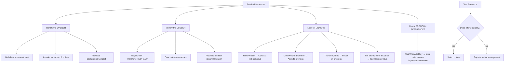
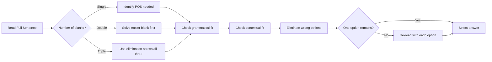

# Chapter 4: Verbal Ability

## Learning Objectives

By the end of this chapter, you will be able to:
- Rearrange jumbled sentences into a coherent paragraph
- Identify the correct sequence of sentences in Para Jumble questions
- Answer Fillers with multiple blanks (double and triple fillers)
- Identify the odd sentence or word from a group
- Solve verbal analogy questions with precision
- Detect and correct illogical or poorly constructed sentences

<!-- Image Gallery -->
<div style="display:flex;flex-wrap:wrap;gap:4px;margin:16px 0;padding:12px;background:#f8fafc;border-radius:8px;border:1px solid #e2e8f0;">
<a href="../../../assets/images/lessons/english-language/04-verbal-ability/hero.svg" target="_blank" rel="noopener">
  
</a>
<a href="../../../assets/images/lessons/english-language/04-verbal-ability/handwritten-notes.svg" target="_blank" rel="noopener">
  
</a>
<a href="../../../assets/images/lessons/english-language/04-verbal-ability/sticky-notes.svg" target="_blank" rel="noopener">
  
</a>
<a href="../../../assets/images/lessons/english-language/04-verbal-ability/visual-explanation.svg" target="_blank" rel="noopener">
  
</a>
<a href="../../../assets/images/lessons/english-language/04-verbal-ability/architecture.svg" target="_blank" rel="noopener">
  
</a>
<a href="../../../assets/images/lessons/english-language/04-verbal-ability/workflow.svg" target="_blank" rel="noopener">
  
</a>
<a href="../../../assets/images/lessons/english-language/04-verbal-ability/mindmap.svg" target="_blank" rel="noopener">
  
</a>
<a href="../../../assets/images/lessons/english-language/04-verbal-ability/comparison.svg" target="_blank" rel="noopener">
  
</a>
<a href="../../../assets/images/lessons/english-language/04-verbal-ability/cheatsheet.svg" target="_blank" rel="noopener">
  
</a>
<a href="../../../assets/images/lessons/english-language/04-verbal-ability/interview-quiz.svg" target="_blank" rel="noopener">
  
</a>
<a href="../../../assets/images/lessons/english-language/04-verbal-ability/social-card.svg" target="_blank" rel="noopener">
  
</a>
</div>
<!-- End Image Gallery -->

---

## Theory

### 4.1 What Is Verbal Ability?

Verbal Ability in government exams is a broad category that tests your command over sentence structure, logical sequencing, and contextual appropriateness. In IBPS SO Prelims, **4–5 questions** are typically drawn from this area.

**Topics Covered:**
- Para Jumbles (Sentence Rearrangement)
- Fillers (Single, Double, Triple)
- Odd One Out (Sentence / Word)
- Verbal Analogies
- Sentence Correction / Improvement
- Word Usage in Context

### 4.2 Para Jumbles (Sentence Rearrangement)

Para Jumbles present 4–6 sentences labelled (A), (B), (C), (D), etc. in a random order. You must arrange them into a logical paragraph.

#### Strategic Approach

**Step 1 — Identify the Opening Sentence**
Look for a sentence that:
- Introduces a subject or concept for the first time
- Does NOT begin with conjunctions (However, But, Therefore, Hence)
- Does NOT contain pronouns referring to something not yet introduced (it, they, this, these, such)
- Does NOT start with transitional phrases (On the other hand, In addition, Moreover)

**Step 2 — Identify the Closing Sentence**
Look for a sentence that:
- Concludes or summarises the discussion
- May start with "Thus", "Therefore", "Hence", "In conclusion"
- Does NOT leave the thought incomplete

**Step 3 — Look for Logical Linkers**

| Linker Type | Examples | Purpose |
|-------------|----------|---------|
| Additive | Moreover, Furthermore, Additionally, Also | Continues the same point |
| Contrast | However, But, Nevertheless, On the contrary, Although | Introduces opposite view |
| Causal | Therefore, Thus, Hence, Consequently, As a result | Shows cause-effect |
| Sequential | Firstly, Secondly, Then, Next, Finally | Shows order |
| Illustrative | For example, For instance, Such as | Provides examples |

**Step 4 — Pronoun Reference**
A sentence with "This", "These", "Such", "It", "They" must follow a sentence that introduces the noun these words refer to.

**Step 5 — Chronological/Causal Order**
If the sentences describe a process or sequence, arrange them in the order of events.

#### Example Walkthrough

**Question:** Arrange the following sentences into a coherent paragraph.

(A) This has led to a significant reduction in processing time.
(B) The bank has implemented a new automated workflow system.
(C) Previously, loan approvals took an average of two weeks.
(D) As a result, customer satisfaction scores have improved considerably.
(E) The system uses AI to verify documents and assess creditworthiness.

**Step-by-Step:**
1. (B) introduces the subject (new automated workflow system) — likely opening
2. (E) describes the system (uses AI) — follows (B)
3. (A) "This" refers to the system described in (E) — follows (E)
4. (C) contrasts with the new system (mentions previous timeline) — follows (A)
5. (D) "As a result" connects the reduction in time (A) to improved satisfaction — closing

**Correct Sequence:** B → E → A → C → D

---

**Another Example with Exam-Style Options:**

**Question:** Rearrange the following sentences in the correct order.

P: The primary advantage of blockchain technology in banking is enhanced security.
Q: Each block in the chain contains a cryptographic hash of the previous block.
R: However, scalability remains a significant challenge for widespread adoption.
S: This makes it practically impossible to alter transaction records without detection.

a) P → Q → S → R
b) P → R → Q → S
c) Q → P → S → R
d) S → Q → P → R

**Answer:** a (P introduces topic, Q explains how it works, S explains the result, R introduces a contrasting challenge)

---

### 4.3 Fillers (Single, Double, Triple)

Fillers test your vocabulary and grammatical knowledge in context. The difficulty increases with the number of blanks.

#### Single Filler Strategy

1. Read the entire sentence to understand context
2. Identify the part of speech needed for the blank
3. Eliminate options that don't fit grammatically
4. Eliminate options that don't fit contextually
5. If two options are close, choose the more precise one

**Example:**
*The bank has _____ new guidelines for digital lending.*

a) issued   b) issued from   c) issued to   d) issued with

**Answer:** a ("issued" is transitive and takes a direct object — "guidelines")

#### Double Filler Strategy

1. Both blanks are usually of the same part of speech or different
2. Check the first blank with half the options
3. Check the second blank independently
4. Match pairs that work together

**Example:**
*The government has _____ a high-level committee to _____ the matter.*

a) constituted / investigate
b) constitute / investigating
c) constituting / investigated
d) constituted / investigated

**Explanation:**
First blank: "has" + past participle = "has constituted" ✓
Second blank: "to" + base verb = "to investigate" ✓
Only option (a) gives us [constituted + investigate].

**Answer:** a

#### Triple Filler Strategy

Triple fillers are challenging. Use the process of elimination across all three blanks systematically.

**Example:**
*The _____ IT systems were found to be _____, _____ the bank's operations.*

a) obsolete / adequate / hindering
b) obsolete / inadequate / hindering
c) modern / adequate / facilitating
d) obsolete / inadequate / enhancing

**Explanation:**
Context suggests a negative tone (problems with systems). Option (a): "obsolete" + "adequate" is contradictory — obsolete systems are not adequate. Option (b): "obsolete" + "inadequate" + "hindering" — consistent negative tone. Option (c): positive tone, doesn't fit the implied problem. Option (d): "obsolete" + "inadequate" + "enhancing" is contradictory.

**Answer:** b

---

### 4.4 Odd One Out (Sentence)

In this question type, you are given 4–5 sentences. Three or four form a coherent paragraph. One sentence does NOT belong — it is either thematically different, chronologically out of place, or logically inconsistent.

**Strategy:**
1. Read all sentences to identify the overall theme
2. Look for the sentence that breaks the logical flow
3. Check for pronoun references — the odd sentence may have no antecedent
4. Check for chronological inconsistency

**Example:**
(A) Cybersecurity is a growing concern for financial institutions.
(B) Many banks have increased their IT security budgets.
(C) The new branch opened in a prime location.
(D) Training programmes for employees on phishing attacks are now mandatory.

**Answer:** C (All other sentences are about cybersecurity. Sentence C is about branch location — unrelated theme.)

---

### 4.5 Odd One Out (Word)

Given 4–5 words, identify the word that does NOT belong to the group.

**Types of Word Odd-One-Out:**
1. **Synonym groups** — three synonyms, one antonym
2. **Thematic groups** — three related to one domain, one from another
3. **Grammatical groups** — three of one part of speech, one different
4. **Prefix/Suffix groups** — three with same prefix, one different

**Example:**
a) Benevolent   b) Malevolent   c) Benign   d) Beneficial

**Answer:** b (Malevolent means evil/wishing harm; the other three have positive connotations. Benevolent = kind, Benign = harmless, Beneficial = helpful.)

**Another Example:**
a) Phishing   b) Ransomware   c) Malware   d) Firefly

**Answer:** d (Firefly is an insect; the other three are types of cybersecurity threats.)

---

### 4.6 Verbal Analogies

Verbal analogies test your ability to recognise relationships between words.

**Common Relationship Types:**

| Relationship | Pattern | Example |
|--------------|---------|---------|
| Synonym | A is a synonym of B | Happy : Joyful |
| Antonym | A is the opposite of B | Hot : Cold |
| Part-Whole | A is a part of B | Petal : Flower |
| Cause-Effect | A causes B | Virus : Disease |
| Tool-Function | A is used for B | Pen : Write |
| Worker-Product | A produces B | Author : Book |
| Degree | A is a higher degree of B | Angry : Furious |
| Class-Member | A is a category, B is an instance | Fruit : Mango |
| Location | A is located in B | Bird : Nest |
| Purpose | A is used for the purpose of B | Key : Lock |

**Strategy:**
1. Establish the relationship between the first pair
2. Find the option with the SAME relationship
3. Apply the "sentence test": "A is to B as C is to D" — your sentence should make sense

**Example:**
*Doctor : Hospital :: Teacher : ?*

a) Book    b) Student    c) School    d) Education

**Relationship:** A doctor works in a hospital (worker-place). A teacher works in a school.

**Answer:** c

**Another Example:**
*Prologue : Play :: Preface : ?*

a) Chapter    b) Book    c) Introduction    d) Author

**Relationship:** A prologue comes before a play; a preface comes before a book.

**Answer:** b

---

### 4.7 Sentence Correction / Improvement

This topic overlaps with grammar but tests broader verbal ability — logic, conciseness, and style.

**Common Errors in Sentence Correction:**

1. **Wordiness / Redundancy**
   - ✗ *The reason is because the system failed.*
   - ✓ *The reason is that the system failed.*
   - ✗ *The two different systems are similar to each other.*
   - ✓ *The two systems are similar.*

2. **Dangling Modifiers**
   - ✗ *Having completed the audit, the report was filed.* (Who completed the audit?)
   - ✓ *Having completed the audit, the accountant filed the report.*

3. **Faulty Parallelism**
   - ✗ *The training covers compliance, security, and how to handle customers.*
   - ✓ *The training covers compliance, security, and customer handling.*

4. **Ambiguous Pronoun Reference**
   - ✗ *The manager told the clerk that his application was rejected.* (Whose application?)
   - ✓ *The manager told the clerk that the clerk's application was rejected.*

5. **Illogical Comparison**
   - ✗ *The profits of bank A are higher than bank B.* (Comparing profits to bank)
   - ✓ *The profits of bank A are higher than those of bank B.*

6. **Wrong Tense Sequence**
   - ✗ *If the system detects fraud, it would trigger an alert.*
   - ✓ *If the system detects fraud, it triggers an alert.* (Zero conditional)
   - ✓ *If the system detected fraud, it would trigger an alert.* (Type 2)

---

### 4.8 Word Usage Games

Some exams test your ability to use a given word correctly in a sentence.

**Strategy:**
1. Understand the word's meaning and part of speech
2. Check if the word is used grammatically in each option
3. Check if the usage makes sense contextually
4. Look out for words that sound similar but have different meanings (homophones)

**Example:** Choose the sentence where the word "CLEAR" is used appropriately.

a) The manager gave a clear instruction.
b) The manager clear the desk.
c) She clear the exam.
d) They clear the pending work.

**Answer:** a ("Clear" as an adjective meaning unambiguous. In b, c, and d, "clear" should be "cleared" (past tense).)

---

## Examples with Solved Exercises

### Example 1: Para Jumble

**Question:** Rearrange the following sentences.

P: However, the implementation of the new policy faced several obstacles.
Q: The government announced a new digital payments policy last month.
R: This resistance came primarily from small merchants who lack digital infrastructure.
S: Many stakeholders were reluctant to adopt the new system.

**Options:**
a) Q → P → S → R
b) Q → S → P → R
c) P → Q → R → S
d) S → R → Q → P

**Explanation:**
- Q introduces the topic (government announced policy) — opening sentence
- P "However" introduces contrast — policy faced obstacles
- S "Many stakeholders reluctant" — explains the obstacles
- R "This resistance came from..." — elaborates on who resisted

**Correct sequence:** Q → P → S → R

**Answer:** a

---

### Example 2: Double Filler

**Question:** Fill in the blanks.

The new regulation is intended to _____ the banking sector and _____ customer confidence.

a) stabilise / restore
b) destabilise / reduce
c) ignore / diminish
d) challenge / weaken

**Explanation:**
The word "intended to" suggests a positive outcome. "Stabilise" (make stable) and "restore" (bring back) are both positive. The other options have negative connotations.

**Answer:** a

---

### Example 3: Odd One Out (Sentence)

**Question:** Find the sentence that does NOT belong.

a) AI-powered chatbots have reduced customer service response times significantly.
b) Machine learning algorithms are now used for fraud detection.
c) The bank's net profit increased by 15% this quarter.
d) Robotic Process Automation (RPA) handles repetitive data entry tasks.

**Explanation:**
Sentences a, b, and d all discuss AI/automation technologies in banking. Sentence c talks about net profit, which is a financial metric, not a technology topic.

**Answer:** c

---

### Example 4: Verbal Analogy

**Question:** Select the correct option.

*Virus : Computer :: Bacteria : ?*

a) Medicine
b) Human
c) Antibiotic
d) Cleanliness

**Relationship:** A virus infects a computer; bacteria infect a human body. Both are biological/pathogen metaphors.

**Answer:** b

---

### Example 5: Sentence Correction

**Question:** Which option correctly improves the sentence?

*The data shows that the number of cyber attacks are increasing.*

a) The data shows that the number of cyber attacks is increasing.
b) The data show that the number of cyber attacks are increasing.
c) The data shows that the numbers of cyber attacks is increasing.
d) No improvement needed.

**Explanation:**
"The number of" takes a singular verb. "The number...is increasing" is correct. "Data" can be singular or plural depending on context, but the main error is "are increasing" should be "is increasing."

**Answer:** a

---

### Example 6: Triple Filler

**Question:** Fill in the three blanks.

The _____ of the new software was _____, _____ widespread dissatisfaction among users.

a) implementation / smooth / generating
b) implementation / flawed / generating
c) removal / flawless / creating
d) installation / seamless / causing

**Explanation:**
"Generating widespread dissatisfaction" is a negative outcome. This requires a negative first half. "Implementation...flawed" (negative) → "generating dissatisfaction" (negative result). Option (a) is contradictory (smooth → dissatisfaction doesn't make sense). Options (c) and (d) have positive first parts that don't match the negative outcome.

**Answer:** b

---

## 📝 Solved Examples (20 MCQs)

### Section A: Para Jumbles (Q1-Q8)

**Q1.** Arrange the following sentences into a coherent paragraph:

P: This data is then analysed by AI algorithms to identify patterns and anomalies.
Q: The bank has deployed a new fraud detection system across all its branches.
R: The system automatically flags suspicious transactions for manual review.
S: It captures real-time transaction data from multiple sources.

a) Q → S → P → R   b) Q → P → S → R   c) S → Q → P → R   d) P → S → Q → R

<details>
<summary>Answer</summary>
a) Q → S → P → R. Q introduces the subject (new fraud detection system). S explains what the system does (captures data). P follows logically (data is analysed). R concludes (flags suspicious transactions).
</details>

---

**Q2.** Arrange the following sentences:

P: However, the transition to electric vehicles faces significant infrastructure challenges.
Q: The government has set an ambitious target of 30% electric vehicle sales by 2030.
R: The lack of charging stations in urban and rural areas remains a critical bottleneck.
S: Battery technology and range anxiety are additional consumer concerns.

a) Q → P → R → S   b) P → Q → R → S   c) Q → R → P → S   d) R → Q → P → S

<details>
<summary>Answer</summary>
a) Q → P → R → S. Q introduces the target. P introduces contrast (However...challenges). R and S elaborate on the challenges. R (charging stations) and S (battery concerns) — both are specific challenges following P.
</details>

---

**Q3.** Arrange the following sentences:

P: The first step involves identifying the key risks facing the organisation.
Q: Based on this assessment, controls are designed to mitigate the identified risks.
R: A robust risk management framework is essential for any financial institution.
S: Regular monitoring and review ensure that controls remain effective.

a) P → Q → R → S   b) R → P → Q → S   c) R → Q → P → S   d) S → R → P → Q

<details>
<summary>Answer</summary>
b) R → P → Q → S. R introduces the topic (risk management framework). P describes the first step (identifying risks). Q follows (designing controls based on assessment). S concludes (monitoring and review).
</details>

---

**Q4.** Arrange the following sentences:

P: In response, the RBI has tightened norms for unsecured lending.
Q: The sharp rise in retail credit has raised concerns about asset quality.
R: Banks have been asked to increase their provisioning for such loans.
S: Unsecured personal loans have grown at over 25% annually in recent years.

a) Q → P → R → S   b) S → Q → P → R   c) P → Q → R → S   d) Q → S → P → R

<details>
<summary>Answer</summary>
b) S → Q → P → R. S presents data (personal loans grew 25%). Q interprets (sharp rise raises concerns). P describes the response (RBI tightened norms). R elaborates on the response (increased provisioning).
</details>

---

**Q5.** Arrange the following sentences:

P: Similarly, machine learning algorithms are used to detect fraudulent transactions.
Q: Artificial intelligence is transforming banking operations in multiple ways.
R: For instance, chatbots handle customer queries round the clock.
S: These technologies have significantly improved operational efficiency.

a) Q → R → P → S   b) Q → P → R → S   c) R → Q → P → S   d) S → Q → R → P

<details>
<summary>Answer</summary>
a) Q → R → P → S. Q introduces the broad topic (AI transforming banking). R gives first example (chatbots — "For instance"). P gives second example ("Similarly" — ML for fraud). S concludes (improved efficiency).
</details>

---

**Q6.** Arrange the following sentences:

P: Open banking allows third-party developers to build services around financial institutions.
Q: This is achieved through APIs that enable secure data sharing with customer consent.
R: However, concerns about data privacy and security remain significant.
S: Customers can benefit from personalised financial products and services.

a) P → Q → S → R   b) Q → P → S → R   c) P → S → Q → R   d) R → P → Q → S

<details>
<summary>Answer</summary>
a) P → Q → S → R. P introduces open banking. Q explains how it works (through APIs). S describes benefits for customers. R introduces contrast (However...concerns).
</details>

---

**Q7.** Arrange the following sentences:

P: Cloud computing has emerged as a key enabler of digital transformation in banking.
Q: Banks have moved their core banking systems to the cloud for better scalability.
R: This shift has reduced infrastructure costs significantly.
S: Additionally, cloud platforms enable faster deployment of new features.

a) Q → P → R → S   b) P → Q → R → S   c) P → R → Q → S   d) S → P → Q → R

<details>
<summary>Answer</summary>
b) P → Q → R → S. P introduces cloud computing as a key enabler. Q explains the action (banks moved to cloud). R presents cost benefit. S adds another benefit ("Additionally").
</details>

---

**Q8.** Arrange the following sentences:

P: Climate change poses significant risks to the global financial system.
Q: Physical risks include damage to assets from extreme weather events.
R: Transition risks arise from the shift to a low-carbon economy.
S: Financial institutions must incorporate both types of risks into their assessments.

a) P → Q → R → S   b) P → R → Q → S   c) Q → P → R → S   d) S → P → Q → R

<details>
<summary>Answer</summary>
a) P → Q → R → S. P introduces the main idea (climate change risks). Q explains "physical risks." R explains "transition risks." S concludes by stating what institutions must do.
</details>

---

### Section B: Double & Triple Fillers (Q9-Q14)

**Q9.** *The government's decision to _____ the GST rates has been _____ by the industry.*

a) reduce / welcomed   b) reduce / criticised   c) increase / welcomed   d) maintain / opposed

<details>
<summary>Answer</summary>
a) reduce / welcomed. The pairing must make logical sense. "Reduce...welcomed" is a natural, positive outcome. "Increase...welcomed" and "maintain...opposed" are less logical without additional context.
</details>

---

**Q10.** *The IT officer was _____ for his _____ approach to problem-solving.*

a) known / innovative   b) criticised / innovative   c) famous / careless   d) awarded / reckless

<details>
<summary>Answer</summary>
a) known / innovative. Positive context: being "known" for an "innovative" approach is logical. "Criticised for innovative" is contradictory. "Famous for careless" is unlikely. "Awarded for reckless" is illogical.
</details>

---

**Q11.** *The bank has _____ a comprehensive training programme _____ its employees _____ new technology.*

a) launched / to train / on   b) launched / training / in   c) launching / to train / for   d) launches / training / with

<details>
<summary>Answer</summary>
a) launched / to train / on. "Has launched" (present perfect) + "to train" (infinitive of purpose) + "on new technology" (correct preposition).
</details>

---

**Q12.** *The committee was _____ to _____ the feasibility of the project and _____ recommendations.*

a) formed / assess / make   b) forming / assessing / making   c) formed / assess / made   d) form / assess / make

<details>
<summary>Answer</summary>
a) formed / assess / make. "Was formed" (passive) + "to assess" (infinitive) + "make" (parallel infinitive after "and").
</details>

---

**Q13.** *The _____ audit _____ several _____ in the internal control system.*

a) independent / revealed / weaknesses   b) dependent / hid / strengths   c) internal / created / issues   d) external / ignored / problems

<details>
<summary>Answer</summary>
a) independent / revealed / weaknesses. An audit typically reveals findings; "independent...revealed...weaknesses" is the most logical combination.
</details>

---

**Q14.** *The _____ of digital payment systems has _____ the need for physical currency, _____ financial inclusion.*

a) growth / reduced / boosting   b) decline / increased / hindering   c) growth / increased / hindering   d) decline / reduced / boosting

<details>
<summary>Answer</summary>
a) growth / reduced / boosting. Growth of digital payments → reduced need for cash → boosting financial inclusion. This causal chain is logical.
</details>

---

### Section C: Odd One Out (Q15-Q17)

**Q15.** Which word is the odd one out?

a) Phishing   b) Ransomware   c) Malware   d) Encryption

<details>
<summary>Answer</summary>
d) Encryption. Phishing, ransomware, and malware are all types of cyber threats. Encryption is a security measure against threats.
</details>

---

**Q16.** Which sentence is the odd one out?

a) The bank's net profit increased by 18% this quarter.
b) The board has approved a dividend of ₹5 per share.
c) The bank launched a new mobile banking application.
d) The return on equity improved to 14.5%.

<details>
<summary>Answer</summary>
c) The bank launched a new mobile banking application. Sentences (a), (b), and (d) are all financial performance metrics. Sentence (c) is a product launch — a different category.
</details>

---

**Q17.** Which word is the odd one out?

a) Benevolent   b) Malevolent   c) Benign   d) Beneficial

<details>
<summary>Answer</summary>
b) Malevolent. Benevolent, benign, and beneficial all have positive connotations. Malevolent (wishing harm) is negative — the odd one out.
</details>

---

### Section D: Verbal Analogies (Q18-Q19)

**Q18.** *Cryptography : Security :: Insurance : ?*

a) Risk   b) Premium   c) Policy   d) Claim

<details>
<summary>Answer</summary>
a) Risk. Cryptography provides security (protection). Insurance provides risk mitigation. Both are protective measures — cryptography against breaches, insurance against financial loss.
</details>

---

**Q19.** *Algorithm : Computer :: Blueprint : ?*

a) Architect   b) Building   c) Design   d) Engineer

<details>
<summary>Answer</summary>
b) Building. An algorithm is a set of instructions for a computer to execute; a blueprint is a set of plans for a building to be constructed. Both are guiding frameworks.
</details>

---

### Section E: Sentence Correction (Q20)

**Q20.** Which sentence is grammatically CORRECT?

a) The data collected by the server were corrupted.   b) The committee have decided to postpone the meeting.   c) One of the officers have submitted the report.   d) Neither the manager nor his colleagues were present at the briefing.

<details>
<summary>Answer</summary>
d) Neither the manager nor his colleagues were present at the briefing. "Colleagues" (plural) is nearest to the verb → "were" is correct. In (a), "data" as singular → "was" (or treat it differently by context). In (b), "committee" as singular → "has." In (c), "One...has" not "have."
</details>

---

## TypeScript Example: Para Jumble Solver

```typescript
interface Sentence {
  id: string;
  text: string;
  features: {
    startsWithLinker: boolean;
    startsWithPronoun: boolean;
    hasConcludingMarker: boolean;
    hasIntroductoryMarker: boolean;
    pronounReferences: string[];
  };
}

class ParaJumbleSolver {
  private static readonly LINKER_WORDS = new Set([
    "however", "but", "nevertheless", "nonetheless", "yet",
    "moreover", "furthermore", "additionally", "also", "besides",
    "therefore", "thus", "hence", "consequently", "as a result",
    "meanwhile", "subsequently", "finally", "eventually", "then",
    "for example", "for instance", "in addition", "on the other hand",
    "in contrast", "similarly", "likewise", "conversely",
  ]);

  private static readonly CONCLUDING_WORDS = new Set([
    "therefore", "thus", "hence", "so", "consequently",
    "in conclusion", "to summarise", "overall", "finally",
  ]);

  private static readonly PRONOUNS = new Set([
    "it", "its", "this", "that", "these", "those",
    "he", "she", "they", "them", "their", "his", "her",
    "such", "the former", "the latter",
  ]);

  static analyze(sentences: Sentence[]): {
    likelyOpening: string[];
    likelyClosing: string[];
    score: number;
  } {
    const openings: string[] = [];
    const closings: string[] = [];

    for (const s of sentences) {
      const firstWord = s.text.split(" ")[0]?.toLowerCase() || "";

      // Check if it could be opening sentence
      const couldBeOpening =
        !this.LINKER_WORDS.has(firstWord) &&
        !this.PRONOUNS.has(firstWord) &&
        !this.LINKER_WORDS.has(s.text.slice(0, 15).toLowerCase());

      // Check if it could be closing sentence
      const couldBeClosing =
        this.CONCLUDING_WORDS.has(firstWord) ||
        this.CONCLUDING_WORDS.has(s.text.slice(0, 20).toLowerCase());

      if (couldBeOpening) openings.push(s.id);
      if (couldBeClosing) closings.push(s.id);
    }

    return {
      likelyOpening: openings,
      likelyClosing: closings,
      score: openings.length + closings.length,
    };
  }

  static suggestSequence(sentences: string[]): string[] {
    // Simplified algorithm: identify connectors between sentences
    const result: string[] = [];
    const remaining = new Set(sentences.map((_, i) => i));

    // Find first: sentence without linker/pronoun at start
    const firstIdx = sentences.findIndex(s => {
      const firstWord = s.split(" ")[0]?.toLowerCase() || "";
      return !this.LINKER_WORDS.has(firstWord) &&
             !this.PRONOUNS.has(firstWord);
    });

    if (firstIdx >= 0) {
      result.push(sentences[firstIdx]);
      remaining.delete(firstIdx);
    }

    // For the remaining, look for logical connections
    while (remaining.size > 0) {
      const lastSentence = result[result.length - 1] || "";
      const lastWords = lastSentence.split(" ").slice(-5).join(" ").toLowerCase();

      let bestMatch = -1;
      for (const idx of remaining) {
        const current = sentences[idx].toLowerCase();
        // Score based on pronoun connection and linker match
        let score = 0;
        if (this.LINKER_WORDS.has(current.split(" ")[0])) score += 2;
        if (sentences[idx].toLowerCase().includes(lastWords.slice(0, 10))) score += 1;

        if (score > 0 && bestMatch === -1) bestMatch = idx;
      }

      if (bestMatch >= 0) {
        result.push(sentences[bestMatch]);
        remaining.delete(bestMatch);
      } else {
        // Pick first remaining
        const next = remaining.values().next().value;
        result.push(sentences[next]);
        remaining.delete(next);
      }
    }

    return result;
  }
}

// Example usage
const sentences = [
  "The bank has implemented a new automated workflow system.",
  "This has led to a significant reduction in processing time.",
  "The system uses AI to verify documents and assess creditworthiness.",
  "As a result, customer satisfaction scores have improved considerably.",
  "Previously, loan approvals took an average of two weeks.",
];

const analysis = ParaJumbleSolver.analyze(
  sentences.map((text, i) => ({
    id: String.fromCharCode(65 + i), // A, B, C, D, E
    text,
    features: {
      startsWithLinker: ParaJumbleSolver["LINKER_WORDS"]
        .has(text.split(" ")[0]?.toLowerCase()),
      startsWithPronoun: ParaJumbleSolver["PRONOUNS"]
        .has(text.split(" ")[0]?.toLowerCase()),
      hasConcludingMarker: ParaJumbleSolver["CONCLUDING_WORDS"]
        .has(text.split(" ")[0]?.toLowerCase()),
      hasIntroductoryMarker: false,
      pronounReferences: [],
    },
  }))
);

console.log("Analysis:", analysis);
console.log("Suggested Sequence:",
  ParaJumbleSolver.suggestSequence(sentences));
```

## Mermaid Flowchart: Para Jumble Solving Strategy



## Mermaid Flowchart: Filler Question Strategy



---

## 📖 Exercise Bank (30 Questions)

### Section A: Para Jumbles (Q1-Q8)

Arrange the following sentences into logical paragraphs:

**Q1.** P: This transparency has helped in reducing corruption in subsidy distribution.
&nbsp;&nbsp;&nbsp;&nbsp;Q: The Direct Benefit Transfer (DBT) scheme transfers subsidies directly to beneficiaries' accounts.
&nbsp;&nbsp;&nbsp;&nbsp;R: Earlier, subsidies were routed through multiple intermediaries.
&nbsp;&nbsp;&nbsp;&nbsp;S: This led to leakages and delays in the system.

**Q2.** P: However, this growth has not been uniform across all sectors.
&nbsp;&nbsp;&nbsp;&nbsp;Q: The Indian economy has shown remarkable resilience in the face of global headwinds.
&nbsp;&nbsp;&nbsp;&nbsp;R: While the services sector has boomed, manufacturing continues to face challenges.
&nbsp;&nbsp;&nbsp;&nbsp;S: GDP growth has remained above 6% despite geopolitical uncertainties.

**Q3.** P: The first step is to identify the root cause of the problem.
&nbsp;&nbsp;&nbsp;&nbsp;Q: A systematic approach is essential for effective problem-solving.
&nbsp;&nbsp;&nbsp;&nbsp;R: Finally, the solution must be implemented and monitored.
&nbsp;&nbsp;&nbsp;&nbsp;S: Once the cause is identified, alternative solutions can be evaluated.

**Q4.** P: This data is encrypted and stored securely on the blockchain.
&nbsp;&nbsp;&nbsp;&nbsp;Q: Aadhaar, India's biometric ID system, collects demographic and biometric data from residents.
&nbsp;&nbsp;&nbsp;&nbsp;R: Authentication requests are processed by the Unique Identification Authority of India (UIDAI).
&nbsp;&nbsp;&nbsp;&nbsp;S: The system enables paperless, electronic verification of identity.

**Q5.** P: First, they have diversified their revenue streams through fee-based income.
&nbsp;&nbsp;&nbsp;&nbsp;Q: Indian banks have adopted multiple strategies to improve profitability.
&nbsp;&nbsp;&nbsp;&nbsp;R: Finally, digital channels have reduced operating costs significantly.
&nbsp;&nbsp;&nbsp;&nbsp;S: Second, they have focused on retail lending to improve margins.

**Q6.** P: The committee recommended several measures to address the issue.
&nbsp;&nbsp;&nbsp;&nbsp;Q: The government had constituted a high-level committee to examine the NPAs in the banking sector.
&nbsp;&nbsp;&nbsp;&nbsp;R: The government has accepted most of these recommendations.
&nbsp;&nbsp;&nbsp;&nbsp;S: The rising level of non-performing assets (NPAs) has been a major concern for Indian banks.

**Q7.** P: This shift has been accelerated by the COVID-19 pandemic.
&nbsp;&nbsp;&nbsp;&nbsp;Q: Companies across sectors have adopted work-from-home policies.
&nbsp;&nbsp;&nbsp;&nbsp;R: Employees have reported improved work-life balance as a result.
&nbsp;&nbsp;&nbsp;&nbsp;S: However, concerns about productivity monitoring and employee well-being remain.

**Q8.** P: This framework categorises risks into strategic, operational, and financial risks.
&nbsp;&nbsp;&nbsp;&nbsp;Q: Banks are required to have a robust enterprise risk management (ERM) framework.
&nbsp;&nbsp;&nbsp;&nbsp;R: Each category requires specific mitigation strategies and monitoring mechanisms.
&nbsp;&nbsp;&nbsp;&nbsp;S: The RBI has mandated ERM implementation for all scheduled commercial banks.

### Section B: Double & Triple Fillers (Q9-Q15)

**Q9.** *The company has _____ to _____ its product portfolio.*
    a) decided / diversify   b) decision / diversify   c) decided / diversification   d) deciding / diversifying

**Q10.** *The auditor _____ the accounts and _____ several discrepancies.*
    a) examined / found   b) examining / finds   c) examines / finding   d) examined / finding

**Q11.** *The government _____ a new policy _____ digital payments.*
    a) announced / to promote   b) announces / promoted   c) announcing / promotes   d) announced / promoting

**Q12.** *The new regulation is _____ to protect consumer interests _____ ensure fair competition.*
    a) designed / and   b) designing / or   c) designed / but   d) design / and

**Q13.** *The bank has _____ its digital platform _____ customers _____ services anytime.*
    a) upgraded / to enable / access   b) upgraded / enabling / accessed   c) upgrade / enabled / accessing   d) upgrading / enables / accessible

**Q14.** *Triple Filler: The _____ of the old system was _____, _____ operational disruptions.*
    a) replacement / smooth / minimising   b) replacement / chaotic / causing   c) removal / smooth / causing   d) upgrade / seamless / increasing

**Q15.** *Triple Filler: The _____ team _____ the issue and _____ a solution within 24 hours.*
    a) technical / resolved / implemented   b) technical / identified / implemented   c) management / ignored / delayed   d) legal / created / complicated

### Section C: Odd One Out (Q16-Q20)

**Q16.** Which word is the odd one out? a) Optimistic   b) Sanguine   c) Pessimistic   d) Hopeful

**Q17.** Which word is the odd one out? a) Cryptography   b) Biometrics   c) Authentication   d) Breach

**Q18.** Which sentence is the odd one out?
    a) The RBI has maintained the repo rate at 6.5%.
    b) Inflation has moderated to 4.8% in the latest reading.
    c) The bank has launched a new credit card with travel benefits.
    d) Industrial production grew by 5.2% in the last quarter.

**Q19.** Which word is the odd one out? a) Speedy   b) Rapid   c) Swift   d) Sluggish

**Q20.** Which sentence is the odd one out?
    a) Cloud computing reduces IT infrastructure costs.
    b) AI-powered analytics improve decision-making.
    c) The annual general meeting was held on Friday.
    d) Blockchain enhances transparency in transactions.

### Section D: Verbal Analogies (Q21-Q24)

**Q21.** *Bank : Branch :: University : ?* a) Student   b) College   c) Professor   d) Education

**Q22.** *Phishing : Email :: Fraud : ?* a) Bank   b) Transaction   c) Police   d) Law

**Q23.** *Opaque : Transparent :: Ambiguous : ?* a) Clear   b) Vague   c) Confusing   d) Unclear

**Q24.** *Sculptor : Statue :: Author : ?* a) Book   b) Reader   c) Publisher   d) Pen

### Section E: Sentence Correction (Q25-Q30)

Identify the incorrect sentence and correct it:

25. a) The data shows that customer satisfaction has improved.
    b) The committee have reached a unanimous decision.
    c) Neither the manager nor his assistants were present.
    d) One of the officers has received a commendation.

26. a) He has been working here since three years.
    b) She joined the bank in 2020.
    c) They have completed the project on time.
    d) The meeting will be held tomorrow.

27. a) The reason for the delay was technical issues.
    b) The system is not only efficient but also cost-effective.
    c) Hardly had he arrived when the meeting started.
    d) The number of fraud cases are increasing.

28. a) The CEO, along with the board members, has approved the proposal.
    b) Each of the candidates have been shortlisted for the interview.
    c) The new software is compatible with existing systems.
    d) He prefers coffee to tea.

29. a) The auditor requested to see the financial statements.
    b) If I were you, I would accept the offer.
    c) The team have been divided in their opinions.
    d) She is an honest and hardworking employee.

30. a) The company has less employees this year.
    b) The amount of work has increased substantially.
    c) He is one of the few employees who have completed the certification.
    d) The committee has submitted its report.

**Answer Key:**

| Q | Answer | Q | Answer | Q | Answer | Q | Answer | Q | Answer |
|---|--------|---|--------|---|--------|---|--------|---|--------|
| 1 | Q → R → S → P | 2 | Q → S → P → R | 3 | Q → P → S → R | 4 | Q → P → R → S | 5 | Q → P → S → R |
| 6 | S → Q → P → R | 7 | Q → P → R → S | 8 | Q → P → R → S | 9 | a) decided / diversify | 10 | a) examined / found |
| 11 | a) announced / to promote | 12 | a) designed / and | 13 | a) upgraded / to enable / access | 14 | a) replacement / smooth / minimising | 15 | b) technical / identified / implemented |
| 16 | c) Pessimistic | 17 | d) Breach | 18 | c) bank launched credit card | 19 | d) Sluggish | 20 | c) AGM on Friday |
| 21 | b) College | 22 | b) Transaction | 23 | a) Clear | 24 | a) Book | 25 | b) committee has reached |
| 26 | a) has been working FOR three years | 27 | d) number...is increasing | 28 | b) Each...has been | 29 | c) team is divided (or team members are divided) | 30 | a) fewer employees |

---

## Summary

- Verbal Ability encompasses **4–5 questions** in IBPS SO Prelims
- **Para Jumbles**: Identify the opening sentence (introduces subject), look for linker words, check pronoun references
- **Fillers**: Read the entire sentence first, identify part of speech, use contextual elimination
- **Odd One Out**: Find the sentence/word that breaks the theme, logic, or chronology
- **Verbal Analogies**: Establish the relationship type (synonym, antonym, part-whole, cause-effect, etc.)
- **Sentence Correction**: Watch for wordiness, dangling modifiers, parallelism, ambiguous pronouns, illogical comparisons

---

## Practical Takeaways

| Topic | Key Technique |
|-------|---------------|
| Para Jumble | First sentence = no linker, no pronoun; last sentence = concluding |
| Double Filler | Solve one blank at a time, then match pairs |
| Triple Filler | Use elimination; all three blanks must fit together |
| Odd One Out | Identify the common theme first, then find the exception |
| Analogy | Build a sentence connecting the first pair; apply to all options |
| Sentence Correction | Read aloud — if it sounds wrong, it probably is wrong |

---

## Chapter Quiz

**Q1.** In a Para Jumble, which sentence is most likely to be the opening sentence?

a) However, this approach has significant drawbacks.
b) The Reserve Bank of India has introduced a new framework for digital payments.
c) Therefore, the committee recommended further study.
d) This has led to improved transparency.

<details>
<summary>Show Answer</summary>

**Answer:** b) The Reserve Bank of India has introduced a new framework for digital payments.

Option (b) introduces a subject for the first time. Options (a), (c), and (d) begin with linker words (However, Therefore, This) that refer to something previously mentioned.
</details>

---

**Q2.** Choose the correct pair for the double filler: *The company decided to _____ its operations _____ the growing demand.*

a) expand / to meet
b) expand / meeting
c) expanding / to meet
d) expansion / to meet

<details>
<summary>Show Answer</summary>

**Answer:** a) expand / to meet

"Decided to" requires the base form of the verb: "expand". The second blank expresses purpose, so "to meet" (infinitive of purpose) is correct.
</details>

---

**Q3.** Which word is the odd one out?

a) Optimistic
b) Pessimistic
c) Hopeful
d) Confident

<details>
<summary>Show Answer</summary>

**Answer:** b) Pessimistic

Optimistic, hopeful, and confident all have positive connotations (expecting good outcomes). Pessimistic means expecting the worst — negative connotation.
</details>

---

**Q4.** Complete the analogy: *Opaque : Transparent :: Ambiguous : ?*

a) Clear
b) Vague
c) Confusing
d) Unclear

<details>
<summary>Show Answer</summary>

**Answer:** a) Clear

Opaque and transparent are opposites. Ambiguous (unclear) and clear are also opposites.
</details>

---

**Q5.** Which sentence is grammatically INCORRECT?

a) The committee have submitted their report.
b) The committee has submitted its report.
c) Neither the manager nor his colleagues were present.
d) One of the employees have been promoted.

<details>
<summary>Show Answer</summary>

**Answer:** d) One of the employees have been promoted.

"One of the employees" — the subject is "one" (singular), so the verb should be "has" (singular), not "have" (plural). The correct sentence: "One of the employees has been promoted."
</details>

---

## Exercises

### Exercise 1: Para Jumble

Rearrange the following sentences into a logical paragraph:

P: This allows customers to withdraw cash even without their debit card.
Q: The bank has introduced cardless ATM withdrawals through its mobile app.
R: Users generate a one-time code on the app and enter it on the ATM screen.
S: This feature is particularly useful for customers who may have forgotten their cards at home.

---

### Exercise 2: Double Fillers

Fill in the blanks with the correct pairs:

1. The RBI has _____ banks to _____ strict KYC norms.
   a) directed / implement
   b) directed / implementing
   c) directing / implemented
   d) directs / implements

2. The IT officer was _____ for _____ the security breach.
   a) responsible / preventing
   b) responsible / ignoring
   c) famous / causing
   d) known / overlooking

---

### Exercise 3: Odd One Out

Find the sentence that does NOT belong in the group:

a) The bank launched a new mobile banking application.
b) The app allows users to transfer funds instantly.
c) The bank's annual general meeting was held on Friday.
d) The app uses biometric authentication for secure login.

### Exercise 4: Verbal Analogies

Complete the analogies:

1. Architect : Building :: Programmer : _____
2. Pen : Write :: Keyboard : _____
3. Judge : Court :: Teacher : _____
4. Spam : Email :: Fraud : _____
5. Simplicity : Complex :: Clarity : _____

### Exercise 5: Sentence Correction

Correct the following sentences:

1. The data collected by the server were corrupted.
2. Either the manager or his team have to attend the meeting.
3. The success of the project depend on the cooperation of all departments.
4. He is one of the few employees which have completed the certification.
5. The company has less employees this year than last year.

---

*Proceed to Chapter 5 — Descriptive English*
