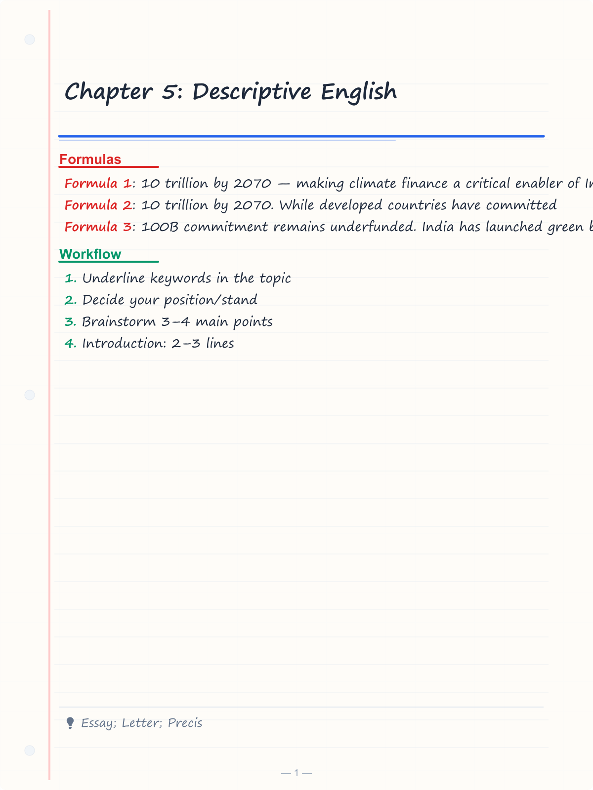
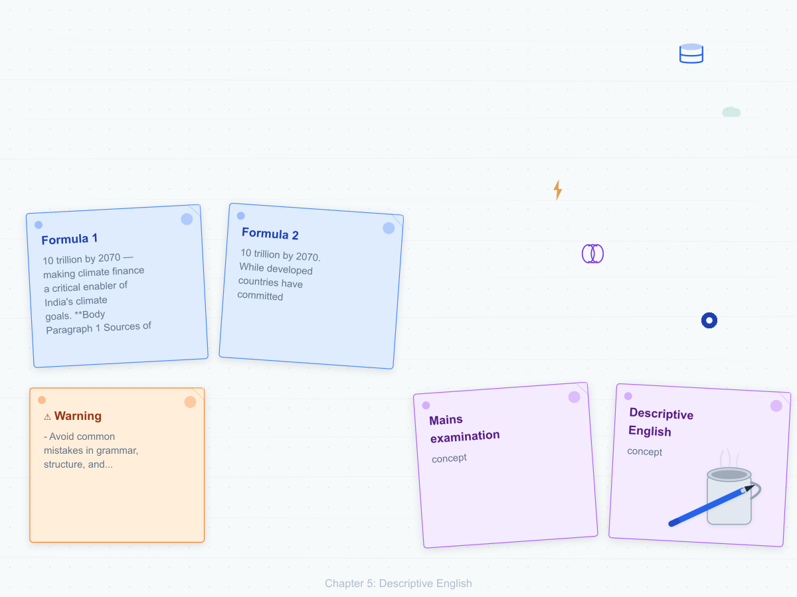
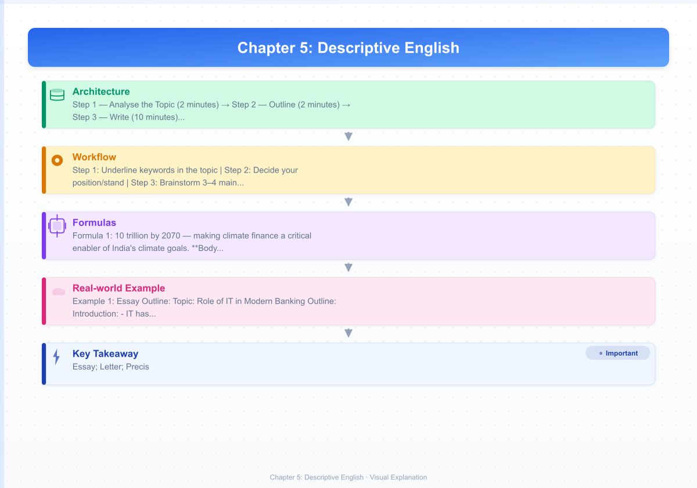
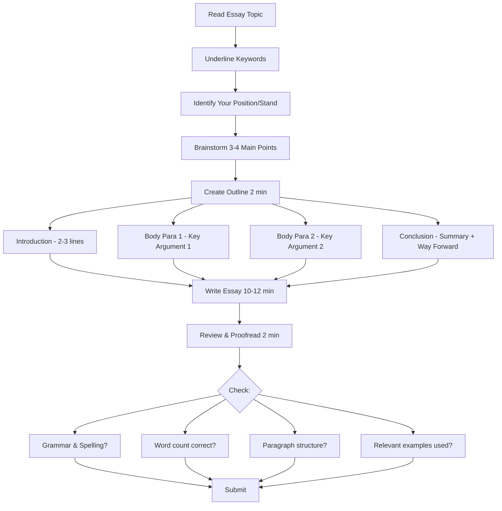

# Chapter 5: Descriptive English

## Learning Objectives

By the end of this chapter, you will be able to:
- Write a well-structured essay on exam-relevant topics
- Draft formal and semi-formal letters in the correct format
- Write a precis that preserves the essence of a passage in one-third the length
- Understand report writing for banking and IT contexts
- Manage time effectively during the descriptive English paper
- Avoid common mistakes in grammar, structure, and presentation

<!-- Image Gallery -->
<section class="lesson-visuals" aria-label="Visual learning resources">
  <header><span>VISUAL LEARNING</span><h2>See it. Review it. Remember it.</h2></header>
  <a class="lesson-visual-card" href="../../assets/images/lessons/english-language/05-descriptive-english/handwritten-notes.png" target="_blank" rel="noopener">
    
    <span><strong>Handwritten notes</strong>Condensed notes for deliberate review.</span>
  </a>
  <a class="lesson-visual-card" href="../../assets/images/lessons/english-language/05-descriptive-english/sticky-notes.png" target="_blank" rel="noopener">
    
    <span><strong>Sticky-note revision</strong>Fast recall prompts for revision.</span>
  </a>
  <a class="lesson-visual-card" href="../../assets/images/lessons/english-language/05-descriptive-english/visual-explanation.png" target="_blank" rel="noopener">
    
    <span><strong>Visual concept guide</strong>A connected explanation of the key ideas.</span>
  </a>
</section>
<!-- End Image Gallery -->

---

## Theory

### 5.1 Descriptive English in Government Exams

Unlike the objective Prelims paper, the **Mains examination** in IBPS SO, SBI PO, RBI Grade B, and other government exams includes a **Descriptive English** paper. This paper tests your ability to express ideas clearly, logically, and coherently.

| Exam | Descriptive English Weightage |
|------|------------------------------|
| **IBPS SO Mains** | Essay (100–150 words) + Letter (100–150 words) = 25 marks |
| **SBI PO Mains** | Essay (150–200 words) + Letter (120–150 words) = 25 marks |
| **RBI Grade B** | Essay (300 words) + Precis (100 words) = 50 marks |
| **SSC CGL Tier 3** | Essay + Letter + Precis = 100 marks |
| **NABARD Grade A/B** | Essay + Report = 30 marks |

### 5.2 Essay Writing

#### Structure of an Exam Essay

A well-structured essay follows the **PEEL** format:

| Section | Purpose | Length (for 150-word essay) |
|---------|---------|---------------------------|
| **P** — Point (Introduction) | Introduce the topic, provide context, state your thesis | 30–40 words |
| **E** — Explanation (Body Para 1) | Explain one key aspect with evidence/examples | 40–50 words |
| **E** — Evidence (Body Para 2) | Provide another perspective, data, or example | 40–50 words |
| **L** — Link (Conclusion) | Summarise, offer a recommendation or way forward | 20–30 words |

#### Essay Writing Process

**Step 1 — Analyse the Topic (2 minutes)**
- Underline keywords in the topic
- Decide your position/stand
- Brainstorm 3–4 main points

**Step 2 — Outline (2 minutes)**
- Introduction: 2–3 lines
- Body Point 1: 3–4 lines
- Body Point 2: 3–4 lines
- Conclusion: 2–3 lines

**Step 3 — Write (10 minutes)**
- Follow your outline
- Use simple, clear sentences
- Avoid overly complex vocabulary

**Step 4 — Review (2 minutes)**
- Check spelling and grammar
- Ensure word count is appropriate
- Make sure paragraphs are distinct

#### Types of Essay Topics

**1. Banking & Economy**
- "Digital India: Transforming the Banking Sector"
- "Financial Inclusion and the Role of Technology"
- "Impact of UPI on the Indian Economy"
- "RBI's Role in Controlling Inflation"
- "NPAs in Indian Banking: Causes and Solutions"

**2. Technology & Society**
- "Artificial Intelligence in Banking: Opportunities and Challenges"
- "Cybersecurity: The Need of the Hour"
- "Social Media and Its Impact on Society"
- "Role of IT in Good Governance"
- "Blockchain Technology: Beyond Cryptocurrency"

**3. Current Affairs & Social Issues**
- "Climate Change and Sustainable Development"
- "Make in India: Progress and Prospects"
- "Women Empowerment in Modern India"
- "Education Reform in India"
- "The Gig Economy: Boon or Bane?"

**4. Ethics & Values**
- "Importance of Ethics in Banking"
- "Work-Life Balance in the Corporate World"
- "Leadership Lessons from Indian History"
- "The Role of Youth in Nation Building"
- "Transparency and Accountability in Public Life"

#### Sample Essay

**Topic:** Digital India: Transforming the Banking Sector

**Introduction (Point):**
The Digital India initiative, launched in 2015, has fundamentally transformed the banking sector in India. From account opening to fund transfers, every aspect of banking has been digitised, making financial services accessible to millions of previously unbanked citizens.

**Body Paragraph 1 (Explanation):**
UPI-based payments have revolutionised the way Indians transact. With over 10 billion monthly transactions in 2024, UPI has reduced India's dependence on cash. Features like immediate fund transfers, QR code payments, and bill splitting have made digital payments the preferred mode of transaction for people across all age groups.

**Body Paragraph 2 (Evidence):**
The Jan Dhan-Aadhaar-Mobile (JAM) trinity has been instrumental in this transformation. Over 50 crore Jan Dhan accounts have been opened, and Aadhaar-based e-KYC has simplified account opening. Direct Benefit Transfer (DBT) has eliminated leakages and ensured that subsidies reach intended beneficiaries directly.

**Conclusion (Link):**
While challenges like the digital divide and cybersecurity concerns remain, the trajectory is clear — digital banking is the future. Continued investment in digital infrastructure and financial literacy will ensure that the benefits of digital banking reach every Indian.

#### Common Essay Mistakes

| Mistake | Why It Hurts | Fix |
|---------|--------------|-----|
| Going off-topic | Shows lack of focus | Underline keywords before writing |
| No paragraph breaks | Hard to read | Use 3–4 distinct paragraphs |
| Poor grammar | Creates bad impression | Spend 2 minutes reviewing |
| Exceeding word limit | Penalised for verbosity | Practise writing within limits |
| Vague statements | Lacks substance | Use specific examples and data |
| Extremely long sentences | Loses clarity | Keep sentences to 15–20 words |

---

### 5.3 Letter Writing

#### Types of Letters in Exams

| Type | Receiver | Tone | Example Topics |
|------|----------|------|----------------|
| **Formal (Official)** | Government officials, bank managers, companies | Professional, respectful | Complaint about poor service, request for information |
| **Semi-Formal** | Known but senior person (manager, professor) | Polite, respectful | Leave application, request for leave |
| **Formal (Business)** | Business partners, vendors | Professional, courteous | Placing order, complaining about defective goods |

#### Letter Format

```
[Your Address]
[City, Pin Code]

[Date]

[Receiver's Name]
[Designation]
[Organisation Name]
[Organisation Address]

Subject: [Concise subject line — 8–12 words]

Salutation: Dear Sir/Madam, / Respected Sir,

[Body Paragraph 1 — Introduce yourself and state the purpose]

[Body Paragraph 2 — Provide details, explanation, or elaboration]

[Body Paragraph 3 — State expected action or request]

Closing: Thanking you,

Yours faithfully,    (if salutation = Dear Sir/Madam)
Yours sincerely,     (if salutation = Dear Mr/Ms [Name])

[Your Full Name]
[Your Designation (optional)]
[Contact Number]
```

#### Sample Letter 1 — Formal Complaint

```
123, Sunshine Apartments
MG Road
Mumbai — 400001

15 October 2024

The Branch Manager
State Bank of India
MG Road Branch
Mumbai — 400001

Subject: Complaint Regarding Unauthorised Debit from Savings Account

Dear Sir/Madam,

I am a savings account holder at your MG Road branch (Account No: 12345678901). I wish to bring to your kind attention that an amount of ₹15,000 was debited from my account on 12 October 2024 without my authorisation. The transaction reference shows a payment to an unknown merchant.

I have not made any such transaction nor shared my OTP or card details with anyone. I request you to investigate this matter immediately and reverse the unauthorised debit. I have already reported this to the cyber crime helpline (1930).

I request an acknowledgment of this complaint and a resolution within the next 7 working days.

Thanking you,

Yours faithfully,

Ravi Sharma
Contact: 9876543210
```

#### Sample Letter 2 — Leave Application

```
456, Greenfield Colony
Sector 12
Noida — 201301

15 October 2024

The Manager
IT Department
Punjab National Bank
Noida

Subject: Application for Casual Leave — 18 October 2024

Respected Sir/Madam,

I, Anjali Verma, working as IT Officer (Scale I), request you to grant me casual leave for one day on 18 October 2024 due to a personal family commitment.

I have completed all pending work and have coordinated with my colleague Mr. Amit Singh to handle any urgent matters in my absence. I will resume work on 19 October 2024.

I shall be grateful for your approval.

Thanking you,

Yours faithfully,

Anjali Verma
IT Officer
Employee ID: PNB/IT/2341
```

#### Common Letter Writing Mistakes

| Mistake | Correction |
|---------|------------|
| Forgetting the subject line | Always include a clear subject |
| Wrong salutation-closing match | Dear Sir → Yours faithfully; Dear Mr X → Yours sincerely |
| Too casual tone | Maintain formal/professional tone |
| Exceeding word limit | Keep letters to 100–150 words as required |
| Missing address or date | Both sender and receiver addresses are essential |
| Multiple issues in one letter | Stick to one topic per letter |

---

### 5.4 Precis Writing

A precis is a concise summary of a passage that preserves the essential meaning, tone, and logical flow. It should be approximately **one-third the length** of the original passage.

#### Rules of Precis Writing

1. **Read the passage carefully** — Understand the main idea and supporting points
2. **Identify the central theme** — What is the author trying to convey?
3. **Draft in your own words** — Do NOT copy phrases from the original
4. **Preserve the tone** — If the original is critical, the precis must also be critical
5. **Maintain logical order** — Do not rearrange the author's argument
6. **No examples or illustrations** — Skip statistics, anecdotes, and examples unless they are central
7. **One-third length** — If the passage is 300 words, the precis should be around 100 words
8. **Do not add your opinion** — The precis must be objective
9. **Give a suitable title** — The title should capture the essence
10. **Write in reported speech (third person)** — Never use "I" or "you"

#### Precis Writing Process

| Step | Action | Time |
|------|--------|------|
| 1 | Read the passage twice | 3 minutes |
| 2 | Underline key points | 2 minutes |
| 3 | Write a rough draft | 5 minutes |
| 4 | Count words and trim | 3 minutes |
| 5 | Write final version with title | 2 minutes |

#### Sample Precis

**Original Passage (300 words):**

"The growing threat of cyber attacks has become a major concern for the Indian banking sector. With the rapid digitisation of financial services, banks have become prime targets for cyber criminals. According to RBI data, the number of cyber fraud incidents in the banking sector increased by over 400% between 2019 and 2024. Common attacks include phishing, ransomware, and data breaches. The financial losses from these attacks run into thousands of crores annually. In response, the RBI has mandated that all banks implement robust cybersecurity frameworks, conduct regular audits, and establish dedicated IT security teams. Banks have also been asked to adopt advanced technologies like AI and machine learning for real-time fraud detection. Customer awareness programmes have been launched to educate users about safe digital banking practices. Despite these measures, challenges remain. The shortage of skilled cybersecurity professionals, the rapidly evolving nature of cyber threats, and the need for continuous investment in security infrastructure are significant hurdles. Going forward, a collaborative approach involving banks, regulators, and law enforcement agencies will be essential to safeguard the banking ecosystem from cyber threats."

**Precis (100 words — one-third):**

**Title:** Cybersecurity Challenges in Indian Banking

The rapid digitisation of financial services has made Indian banks prime targets for cyber criminals. RBI data reveals a 400% increase in cyber fraud incidents between 2019 and 2024, with financial losses running into thousands of crores annually. In response, the RBI has mandated robust cybersecurity frameworks, regular audits, and dedicated IT security teams. Banks are adopting AI-based fraud detection systems and launching customer awareness programmes. However, challenges persist — a shortage of skilled professionals, evolving threats, and the need for continuous investment. A collaborative approach involving banks, regulators, and law enforcement agencies is essential.

---

### 5.5 Report Writing

Report writing is less common in IBPS SO but appears in RBI Grade B and NABARD exams.

#### Structure of a Formal Report

```
REPORT TITLE

Submitted To: [Name/Designation]
Submitted By: [Name/Designation]
Date: [Date]

1. INTRODUCTION
   — Background of the issue
   — Purpose of the report
   — Scope and limitations

2. FINDINGS / OBSERVATIONS
   — Key facts discovered
   — Data collected
   — Analysis of the situation

3. RECOMMENDATIONS
   — Suggested actions
   — Implementation plan
   — Expected outcomes

4. CONCLUSION
   — Summary of findings
   — Final remarks
```

#### Report vs Essay — Key Differences

| Aspect | Essay | Report |
|--------|-------|--------|
| Purpose | Express opinion/argue | Present facts/information |
| Structure | Continuous prose | Sections with headings |
| Tone | Persuasive/analytical | Objective/factual |
| First person | Sometimes used | Avoided |
| Recommendations | Optional | Usually included |
| Data/evidence | May include | Expected |

---

### 5.6 Time Management for the Descriptive Paper

| Activity | Time Budget (for 60-min paper) |
|----------|-------------------------------|
| Read all questions | 3 minutes |
| Brainstorm / Outline | 5 minutes |
| Essay writing | 20 minutes |
| Letter writing | 15 minutes |
| Precis / Report (if applicable) | 12 minutes |
| Review and proofread | 5 minutes |

---

### 5.7 Vocabulary for Descriptive Writing

#### Banking & Finance Vocabulary

| Word/Phrase | Meaning |
|-------------|---------|
| Fiscal deficit | Excess of government expenditure over revenue |
| Monetary policy | RBI's policy on money supply and interest rates |
| Repo rate | Rate at which RBI lends to banks |
| CRR | Cash Reserve Ratio — portion of deposits kept with RBI |
| Non-performing asset (NPA) | Loan that is not being repaid |
| Insolvency | Inability to pay debts |
| Amalgamation | Merger of two or more entities |
| Disbursement | The act of paying out money |
| Collateral | Asset pledged as security for a loan |
| Underwriting | Guaranteeing to buy unsold shares |

#### Technology Vocabulary

| Word/Phrase | Meaning |
|-------------|---------|
| Interoperability | Ability of systems to work together |
| Scalability | Ability to handle growth |
| Encryption | Converting data into code to prevent unauthorised access |
| Blockchain | Decentralised digital ledger |
| Phishing | Fraudulent attempt to obtain sensitive information |
| Ransomware | Malware that demands payment to restore access |
| Biometric authentication | Identification using biological traits |
| API (Application Programming Interface) | Interface for software applications to communicate |
| Cloud computing | Internet-based computing services |
| Machine learning | AI systems that learn from data |

#### Transitional Phrases for Essays

| Purpose | Phrases |
|---------|---------|
| To introduce a point | *Firstly, To begin with, In the first place* |
| To add information | *Moreover, Furthermore, In addition, Additionally* |
| To contrast | *However, On the other hand, Nevertheless, Conversely* |
| To give examples | *For instance, For example, Such as, In particular* |
| To show cause | *Because, Since, As a result of, Owing to* |
| To show effect | *Therefore, Consequently, Hence, Thus, As a result* |
| To conclude | *In conclusion, To summarise, In a nutshell, Overall* |

---

### 5.8 Presentation Tips

| Factor | Best Practice |
|--------|---------------|
| Handwriting (offline exams) | Legible, moderately sized, evenly spaced |
| Margins | Leave 1-inch margins on both sides |
| Paragraphs | Indent the first line of each paragraph |
| Neatness | Avoid scribbling; one clear strike-through for corrections |
| Line spacing | Leave adequate space between paragraphs |
| Underlining | Underline the title/heading |
| Word count | Mention word count at the end if required |

---

## Examples with Solved Exercises

### Example 1: Essay Outline

**Topic:** Role of IT in Modern Banking

**Outline:**

**Introduction:**
- IT has become the backbone of modern banking
- From core banking solutions to AI-powered services

**Body Point 1 — Operational Efficiency:**
- CBS enables anytime-anywhere banking
- Automated processes reduce manual errors and turnaround time

**Body Point 2 — Customer Experience:**
- Mobile apps, internet banking, chatbots
- Personalised services based on data analytics

**Body Point 3 — Security:**
- AI-based fraud detection
- Biometric authentication and encryption

**Conclusion:**
- IT is indispensable but needs continuous investment and cybersecurity focus

---

### Example 2: Letter Drafting

**Topic:** Write a letter to the bank manager requesting a loan statement for the last three years.

**Solution:**

```
C-45, Vikas Nagar
Lucknow — 226001

15 October 2024

The Branch Manager
Bank of Baroda
Vikas Nagar Branch
Lucknow — 226001

Subject: Request for Loan Statement (Last 3 Years)

Dear Sir/Madam,

I, Suresh Kumar, am a home loan account holder at your branch (Loan Account No: HL/2021/4587). I request you to provide me with a detailed statement of my home loan account for the period from 1 October 2021 to 30 September 2024.

The statement is required for my income tax filing purposes. I need details of principal repaid, interest paid, and the outstanding balance for each financial year covered in this period.

Kindly provide the statement at the earliest. I am ready to pay any applicable charges for this service.

Thanking you,

Yours faithfully,

Suresh Kumar
Contact: 9876543210
```

---

### Example 3: Precis Writing

**Original Passage:**

"Financial literacy is the ability to understand and effectively use various financial skills, including personal financial management, budgeting, and investing. In India, the level of financial literacy remains low, especially in rural areas. According to the National Centre for Financial Education, only about 24% of Indian adults are financially literate. This lack of financial knowledge leads to poor financial decisions — people fall into debt traps, fail to save adequately, and are vulnerable to fraudulent investment schemes. The government has launched several initiatives to address this issue. The National Strategy for Financial Education (NSFE) aims to create awareness about financial products and services. Pradhan Mantri Jan Dhan Yojana has brought banking services to the unbanked. However, awareness alone is not enough. There is a need for practical financial education in schools and colleges. Simple concepts like compound interest, inflation, and risk diversification should be taught from an early age. Financial literacy is not a luxury — it is a necessity for financial well-being."

**Precis (100 words):**

**Title:** The Need for Financial Literacy in India

Financial literacy — the ability to manage personal finances effectively — remains low in India, with only 24% of adults being financially literate. This leads to debt traps, inadequate savings, and vulnerability to fraud. While government initiatives like the National Strategy for Financial Education and Jan Dhan Yojana have created awareness, practical financial education is needed. Teaching concepts like compound interest, inflation, and risk diversification in schools and colleges is essential. Financial literacy is a necessity, not a luxury, for ensuring financial well-being.

---

### Example 4: Letter vs Essay — Spot the Differences

| Feature | The letter should... | The essay should... |
|---------|---------------------|---------------------|
| Have an address and date | ✓ Required | ✗ Not needed |
| Use "I" | ✓ Appropriate | ✓ Acceptable but limited |
| Have a subject line | ✓ Required | ✗ Not needed |
| End with signature | ✓ Required | ✗ Not needed |
| Use paragraphs | ✓ Yes | ✓ Yes |
| Have a title | ✗ Not needed | ✓ Recommended |

---

## 📝 Solved Examples (20 MCQs)

### Section A: Essay Writing Templates (Q1-Q5) — Solved Essay Templates

#### Solved Essay Template 1: Financial Inclusion

**Topic:** "Financial Inclusion in India: Progress, Challenges, and the Way Forward"

**Introduction:**
Financial inclusion — ensuring access to affordable financial services for all citizens — has been a cornerstone of India's economic policy. From the Pradhan Mantri Jan Dhan Yojana (PMJDY) to UPI-based payment systems, India has made remarkable strides in bringing the unbanked into the formal financial system.

**Body Paragraph 1 (Progress):**
The Jan Dhan-Aadhaar-Mobile (JAM) trinity has been transformative. Over 50 crore Jan Dhan accounts have been opened, enabling direct benefit transfers (DBT) that eliminated intermediaries and reduced leakages. UPI has revolutionised digital payments, with over 10 billion monthly transactions, reaching even small vendors in tier-3 cities.

**Body Paragraph 2 (Challenges):**
Despite progress, significant gaps remain. According to the Global Findex Report, nearly 20% of Indian adults remain unbanked. The digital divide between urban and rural areas persists, with limited internet connectivity in remote regions. Financial literacy levels remain low, particularly among women and marginalised communities, limiting the effective use of financial services.

**Body Paragraph 3 (Way Forward):**
The way forward requires a multi-pronged approach. Expanding digital infrastructure to rural areas, promoting financial literacy through school curricula, and developing vernacular-language banking apps can bridge the inclusion gap. The government's vision of a "less-cash" economy must be complemented with robust consumer protection mechanisms.

**Conclusion:**
Financial inclusion is not merely about opening bank accounts — it is about ensuring meaningful access to credit, insurance, and investment products. With sustained policy focus and technological innovation, India can achieve its vision of universal financial inclusion.

---

#### Solved Essay Template 2: Cybersecurity in Banking

**Topic:** "Cybersecurity in the Indian Banking Sector: Threats and Mitigation Strategies"

**Introduction:**
As Indian banks accelerate their digital transformation, cybersecurity has emerged as a critical concern. With over 300,000 cybersecurity incidents reported in the banking sector in 2024, protecting customer data and financial assets has become paramount for the stability of the financial system.

**Body Paragraph 1 (Nature of Threats):**
Cyber threats have evolved from lone hackers to sophisticated organised crime syndicates and state-sponsored groups. Phishing attacks targeting retail customers, ransomware aimed at core banking systems, and data breaches exploiting third-party vulnerabilities represent the primary threat categories. The average cost of a data breach in Indian financial services is estimated at ₹18.5 crore.

**Body Paragraph 2 (Regulatory Framework):**
The RBI has mandated a comprehensive Cyber Security Framework requiring banks to conduct quarterly vulnerability assessments, annual penetration testing, and maintain a Cyber Crisis Management Plan (CCMP). AI-powered Security Information and Event Management (SIEM) systems have become standard, and biometric authentication has replaced passwords for high-value transactions.

**Body Paragraph 3 (Remaining Challenges):**
The acute shortage of skilled cybersecurity professionals — over 300,000 unfilled positions — remains a significant vulnerability. Additionally, the rapidly evolving nature of cyber threats requires continuous investment in security infrastructure. A collaborative approach involving banks, regulators, CERT-In, and law enforcement agencies is essential.

**Conclusion:**
Cybersecurity is not a one-time investment but an ongoing process. As the banking sector embraces emerging technologies like AI and blockchain, a proactive security posture — combining technology, talent, and regulation — will be crucial to safeguarding India's digital financial ecosystem.

---

#### Solved Essay Template 3: Ethical AI in Governance

**Topic:** "Artificial Intelligence in Governance: Balancing Innovation with Ethics"

**Introduction:**
Artificial Intelligence is being deployed across Indian governance — from AI-powered chatbots handling citizen queries to predictive analytics for resource allocation. While AI promises unprecedented efficiency gains, its deployment raises profound ethical questions that must be addressed to ensure public trust.

**Body Paragraph 1 (Opportunities):**
MeitY has identified over 40 use cases for AI in governance. Crop yield prediction using satellite imagery helps farmers make informed decisions. Real-time sentiment analysis enables policymakers to gauge public response. AI-driven fraud detection saves taxpayers billions. These applications demonstrate AI's potential to transform service delivery.

**Body Paragraph 2 (Ethical Concerns):**
Algorithmic bias poses a serious risk — AI systems trained on historical data may perpetuate existing inequalities. Transparency is another challenge; citizens have a right to know when algorithmic decisions affect their access to services. Data privacy concerns arise from the extensive data collection required for AI systems.

**Body Paragraph 3 (Regulatory Response):**
The proposed Digital India Act aims to mandate algorithmic accountability and impact assessments for high-risk AI applications. Ethical AI frameworks emphasising fairness, accountability, and transparency must be built into the design of governance systems from the outset.

**Conclusion:**
AI in governance is inevitable and desirable. The key is to harness its potential while ensuring robust safeguards. With principled regulation and inclusive design, AI can be a force for equitable and efficient governance.

---

#### Solved Essay Template 4: Climate Finance

**Topic:** "Climate Finance and India's Path to Net-Zero"

**Introduction:**
India has committed to achieving net-zero emissions by 2070, with an ambitious target of 500 GW of non-fossil fuel energy capacity by 2030. However, this transition requires substantial financial resources — approximately $10 trillion by 2070 — making climate finance a critical enabler of India's climate goals.

**Body Paragraph 1 (Sources of Climate Finance):**
India has mobilised resources through sovereign green bonds, the National Adaptation Fund for Climate Change (NAFCC), and international climate finance mechanisms. The developed countries' commitment of $100 billion annually to support climate action in developing nations, though not fully met, provides a framework for international collaboration.

**Body Paragraph 2 (The Funding Gap):**
The gap between available and required climate finance remains substantial. Domestic sources are insufficient, and private sector participation is limited by the perceived risk of green projects. The absence of standardised green taxonomy and measurement frameworks further constrains investment.

**Body Paragraph 3 (Strategies to Bridge the Gap):**
Creating a robust green bond market, establishing a national green bank, and developing bankable project pipelines can attract private capital. Innovative instruments like blended finance and green loans, coupled with transparent reporting mechanisms, can build investor confidence.

**Conclusion:**
Climate finance is not merely an environmental imperative but an economic opportunity. India's leadership in climate action, combined with innovative financing mechanisms and global partnerships, can mobilise the resources needed for a sustainable, low-carbon future.

---

#### Solved Essay Template 5: The Gig Economy

**Topic:** "The Gig Economy in India: Flexibility versus Worker Protection"

**Introduction:**
With an estimated 7.7 million platform-based gig workers in 2024, the gig economy has become a significant component of India's labour market. Platforms like Swiggy, Zomato, and Uber have created income opportunities while raising critical questions about worker protections and social security.

**Body Paragraph 1 (Benefits):**
The gig economy offers flexibility — workers can choose when and how much to work, making it attractive for students, caregivers, and those seeking supplementary income. It has lowered barriers to entry for semi-skilled and unskilled workers who struggle to find formal employment, providing a vital livelihood source.

**Body Paragraph 2 (Challenges):**
Gig workers are classified as independent contractors, not employees. This excludes them from minimum wage guarantees, paid leave, health insurance, and retirement benefits. The absence of social security nets leaves workers vulnerable during illness or economic downturns. Income volatility and lack of career progression are additional concerns.

**Body Paragraph 3 (Policy Response):**
The Code on Social Security, 2020, recognises gig workers as a distinct category for the first time, proposing to extend social security benefits. However, implementation has been slow, and funding mechanisms remain unclear. Platform accountability and algorithm transparency are emerging regulatory priorities.

**Conclusion:**
The gig economy is here to stay. The challenge for policymakers is to preserve flexibility while ensuring basic protections. A balanced approach — portable benefits, platform contributions to social security, and skill development programmes — can create a sustainable gig ecosystem.

---

### Section B: Letter Writing Formats (Q6-Q10) — Solved Examples

#### Solved Letter 1: Complaint About Unauthorised Transaction (Formal)

**Scenario:** An unauthorised amount of ₹25,000 was debited from your savings account.

```
A-42, Krishna Apartments
Banjara Hills
Hyderabad — 500034

25 October 2024

The Branch Manager
HDFC Bank
Banjara Hills Branch
Hyderabad — 500034

Subject: Complaint Regarding Unauthorised Debit of ₹25,000 from Savings Account

Dear Sir/Madam,

I, Priya Sharma, am a savings account holder at your Banjara Hills branch (Account No: 50100234567890). I wish to bring to your notice that an amount of ₹25,000 (Rupees Twenty-Five Thousand Only) was debited from my account on 23 October 2024 without my knowledge or authorisation. The transaction reference is TXN/2024/10/23/45872.

I have not made this transaction nor shared my debit card details, CVV, OTP, or internet banking credentials with anyone. I suspect this may be a case of digital fraud. I request you to immediately reverse the transaction and investigate the matter. I have also registered a complaint with the cyber crime helpline at 1930.

I request an acknowledgment of this complaint and a resolution within the next 7 working days as per RBI guidelines on customer protection.

Thanking you,

Yours faithfully,

Priya Sharma
Contact: 9988776655
Account No: 50100234567890
```

---

#### Solved Letter 2: Leave Application to Reporting Manager (Semi-Formal)

**Scenario:** You need to take 3 days of casual leave for a family function.

```
House No. 78, Sector 15
Noida — 201301

25 October 2024

The Branch Manager
State Bank of India
Sector 15 Branch
Noida — 201301

Subject: Application for Casual Leave — 28 to 30 October 2024

Respected Sir/Madam,

I, Arjun Mehta, working as Assistant Manager (IT), request you to grant me casual leave for three days from 28 October 2024 to 30 October 2024 due to a family function.

I have completed all pending tasks and have briefed my colleague, Mr. Vikram Singh, about any urgent matters that may require attention during my absence. I will be available on phone should any critical issue arise. I will resume duty on 31 October 2024.

I shall be grateful for your kind approval.

Thanking you,

Yours faithfully,

Arjun Mehta
Assistant Manager (IT)
Employee ID: SBI/IT/4521
Contact: 9876543210
```

---

#### Solved Letter 3: Request for Loan Statement (Formal)

**Scenario:** You need a detailed loan statement for the last 3 years for income tax purposes.

```
B-15, Vikas Nagar
Lucknow — 226022

25 October 2024

The Branch Manager
Bank of Baroda
Vikas Nagar Branch
Lucknow — 226022

Subject: Request for Home Loan Statement (1 April 2021 to 31 March 2024)

Dear Sir/Madam,

I, Suresh Verma, am a home loan account holder at your branch (Loan Account No: HL/2021/8745). I request you to provide me a detailed statement of my home loan account for the period from 1 April 2021 to 31 March 2024.

The statement is required for filing my income tax returns. I need the following details for each financial year:
1. Total principal repaid
2. Total interest paid
3. Outstanding loan balance at the end of each financial year

Kindly provide the statement at the earliest. I am willing to pay any applicable processing charges for this service.

Thanking you,

Yours faithfully,

Suresh Verma
Contact: 9876543210
Loan Account: HL/2021/8745
```

---

#### Solved Letter 4: Request for Software Upgrade (Formal Internal)

**Scenario:** As an IT officer, you need to request approval for upgrading security software.

```
IT Department
Canara Bank
Zonal Office
Mumbai — 400001

25 October 2024

The General Manager (IT)
Canara Bank
Head Office
Bengaluru — 560001

Subject: Proposal for Upgrading Cybersecurity Software — Approval Request

Respected Sir,

This is regarding the current cybersecurity infrastructure at our zonal office. Our existing endpoint protection software, licensed in 2021, has reached end-of-life status and is no longer receiving security updates from the vendor.

I propose upgrading to the latest Enterprise Security Suite (Version 4.0) which offers advanced features including AI-based threat detection, real-time malware protection, and centralised management console. The estimated cost for a 3-year license covering 200 endpoints is ₹12.5 lakhs.

The upgrade is critical as our current system is vulnerable to emerging cyber threats. I request your kind approval to initiate the procurement process. Detailed quotations from three vendors are attached for your reference.

Thanking you,

Yours faithfully,

Rahul Kumar
IT Officer
Canara Bank, Zonal Office
Employee ID: CB/IT/7890
Contact: 9988776655
```

---

#### Solved Letter 5: Complaint About ATM Outage (Formal)

**Scenario:** The ATM near your residence has been non-functional for two weeks.

```
D-12, River View Colony
Civil Lines
Delhi — 110054

25 October 2024

The Branch Manager
Punjab National Bank
Civil Lines Branch
Delhi — 110054

Subject: Complaint Regarding Persistent Non-Functioning of ATM at Civil Lines

Dear Sir/Madam,

I am a customer of your Civil Lines branch (Account No: 12345678901). I wish to bring to your notice that the PNB ATM located at Civil Lines Chowk has been non-functional for the past two weeks. The ATM screen displays an "Out of Service" message consistently.

This ATM is the only PNB ATM in a 2-kilometre radius and serves a large number of senior citizens and residents of the surrounding colonies. The non-availability of the ATM has caused significant inconvenience, forcing customers to travel long distances for cash withdrawal and other banking services.

I request you to restore the ATM service at the earliest and keep the machine adequately stocked with cash. An update on the resolution timeline would be appreciated.

Thanking you,

Yours faithfully,

Neha Gupta
Contact: 9812345678
Account No: 12345678901
```

---

### Section C: Solved Essay & Letter Topics (Q11-Q20)

#### Solved Essay Topic 6: Digital India — Transforming the Banking Sector

**Outline:**
- **Intro:** Digital India launched in 2015; banking sector transformation
- **Body 1:** UPI revolution — 10B+ monthly transactions; JAM trinity; DBT
- **Body 2:** Challenges — digital divide, cybersecurity, financial literacy
- **Body 3:** Future — AI in banking, CBDCs, open banking
- **Conclusion:** Digital banking is the future; inclusive growth is key

#### Solved Essay Topic 7: Women Empowerment in Modern India

**Outline:**
- **Intro:** Constitutional vision of equality; progress and persistent gaps
- **Body 1:** Achievements — education enrolment, political reservation, entrepreneurship
- **Body 2:** Challenges — workforce participation decline (from 31% to 25%), safety concerns, wage gap
- **Body 3:** Way forward — skilling programmes, legal awareness, infrastructure (creches, safe transport)
- **Conclusion:** Women's empowerment is essential for India's development — Saksham Nari, Samriddh Bharat

#### Solved Essay Topic 8: The Role of IT in Good Governance

**Outline:**
- **Intro:** e-Governance as a tool for transparency and efficiency
- **Body 1:** Success stories — DigiLocker, UMANG, e-Courts, Common Service Centres
- **Body 2:** Benefits — reduced corruption, faster service delivery, data-driven policy
- **Body 3:** Challenges — digital divide, data privacy, interoperability
- **Conclusion:** Technology can transform governance if implemented with citizen-centric design

#### Solved Essay Topic 9: NPAs in Indian Banking — Causes and Solutions

**Outline:**
- **Intro:** NPAs as the biggest challenge for Indian banking post-2015
- **Body 1:** Causes — wilful default, economic slowdown, inadequate due diligence, political interference
- **Body 2:** Impact — reduced profitability, lower credit growth, fiscal burden
- **Body 3:** Solutions — Insolvency and Bankruptcy Code (IBC), National Asset Reconstruction Company, credit culture reforms
- **Conclusion:** A combination of legal reforms, better underwriting, and economic growth is needed

#### Solved Essay Topic 10: Importance of Ethics in Public Service

**Outline:**
- **Intro:** Ethics as the foundation of trust in public institutions
- **Body 1:** Need — efficient service delivery, fair decision-making, anti-corruption
- **Body 2:** Framework — Code of Conduct, vigilance mechanisms, RTI Act
- **Body 3:** Challenges — moral dilemmas, pressure groups, lack of accountability
- **Conclusion:** Strong ethical frameworks and personal integrity are both essential

#### Solved Letter Topic 6: Request for Change of Mobile Number Linked to Account

**Format includes:** Sender address, date, bank manager address, subject: "Request for Updating Mobile Number Linked to Savings Account", body explaining old number lost/not in use, new number, KYC documents enclosed.

#### Solved Letter Topic 7: Request for New Software for Data Analysis

**Format includes:** Sender IT department address, head of department, subject: "Proposal for Procurement of Advanced Data Analytics Software", body explaining current limitations, benefits of new software, estimated cost.

#### Solved Letter Topic 8: Request for Transfer to Different Branch

**Format includes:** Sender address, regional manager address, subject: "Application for Inter-Branch Transfer on Personal Grounds", body explaining personal circumstances, willingness to work in any branch of a particular region.

#### Solved Letter Topic 9: Request for Issuance of Duplicate Passbook

**Format includes:** Sender address, branch manager, subject: "Request for Issuance of Duplicate Passbook", body explaining passbook lost/misplaced, account details, request for reissue.

#### Solved Letter Topic 10: Complaint About Delay in Loan Processing

**Format includes:** Sender address, branch manager, subject: "Complaint Regarding Undue Delay in Home Loan Processing", body explaining application date, current status, follow-up attempts, request for expeditious processing.

---

## TypeScript Example: Essay Structure Analyzer

```typescript
interface EssayStructure {
  paragraphs: string[];
  paragraphCount: number;
  wordCount: number;
  hasPEELStructure: boolean;
  hasIntroduction: boolean;
  hasConclusion: boolean;
  transitionWordsUsed: string[];
}

class EssayAnalyzer {
  private static readonly TRANSITION_WORDS = {
    additive: ["firstly", "secondly", "furthermore", "moreover", "additionally", "also", "besides"],
    contrast: ["however", "nevertheless", "nonetheless", "on the other hand", "conversely", "although"],
    causal: ["therefore", "thus", "hence", "consequently", "as a result", "because", "since"],
    illustrative: ["for example", "for instance", "such as", "specifically", "in particular"],
    concluding: ["in conclusion", "to summarise", "overall", "finally", "in a nutshell"],
  };

  static analyze(essay: string): EssayStructure {
    // Split into paragraphs
    const paragraphs = essay
      .split(/\n\s*\n/)
      .map(p => p.trim())
      .filter(p => p.length > 0);

    const words = essay.split(/\s+/).filter(w => w.length > 0);
    const lowerText = essay.toLowerCase();

    // Check for PEEL structure
    const hasIntroduction = paragraphs.length >= 1;
    const hasConclusion = lowerText.includes("in conclusion")
      || lowerText.includes("to conclude")
      || lowerText.includes("to summarise")
      || paragraphs[paragraphs.length - 1]?.length < paragraphs[0]?.length;

    // Count transition words
    const transitionWordsUsed: string[] = [];
    for (const [, words] of Object.entries(this.TRANSITION_WORDS)) {
      for (const word of words) {
        if (lowerText.includes(word)) {
          transitionWordsUsed.push(word);
        }
      }
    }

    // PEEL check
    const hasPEEL = paragraphs.length >= 3
      && hasIntroduction
      && hasConclusion
      && transitionWordsUsed.length >= 2;

    return {
      paragraphs,
      paragraphCount: paragraphs.length,
      wordCount: words.length,
      hasPEELStructure: hasPEEL,
      hasIntroduction,
      hasConclusion,
      transitionWordsUsed: [...new Set(transitionWordsUsed)],
    };
  }

  static suggestImprovements(analysis: EssayStructure): string[] {
    const suggestions: string[] = [];

    if (analysis.paragraphCount < 3) {
      suggestions.push("Add more paragraphs — aim for 3-4 (Introduction, Body 1, Body 2, Conclusion).");
    }
    if (!analysis.hasConclusion) {
      suggestions.push("Add a concluding paragraph that summarises your main points.");
    }
    if (analysis.transitionWordsUsed.length < 2) {
      suggestions.push("Use transition words (However, Moreover, Therefore) to improve flow.");
    }
    if (analysis.wordCount < 120) {
      suggestions.push("Your essay is too short. Aim for 150-200 words for Mains exams.");
    } else if (analysis.wordCount > 250) {
      suggestions.push("Your essay exceeds the word limit. Trim unnecessary content.");
    }

    return suggestions;
  }

  static extractKeywords(essay: string): string[] {
    const stopWords = new Set([
      "the", "a", "an", "in", "of", "to", "and", "is", "are", "was", "were",
      "has", "have", "had", "be", "been", "being", "it", "its", "this", "that",
      "for", "on", "with", "by", "at", "from", "as", "but", "not", "or",
    ]);

    const frequency: Record&lt;string, number&gt; = {};
    const words = essay.toLowerCase().split(/\s+/);

    for (const word of words) {
      const clean = word.replace(/[^a-z]/g, "");
      if (clean.length > 3 && !stopWords.has(clean)) {
        frequency[clean] = (frequency[clean] || 0) + 1;
      }
    }

    return Object.entries(frequency)
      .sort((a, b) => b[1] - a[1])
      .slice(0, 8)
      .map(([word]) => word);
  }
}

// Example usage
const essay = `Financial inclusion has been a cornerstone of India's economic policy. The Jan Dhan-Aadhaar-Mobile (JAM) trinity has been transformative for the banking sector.

Over 50 crore Jan Dhan accounts have been opened, enabling direct benefit transfers that eliminated intermediaries. UPI has revolutionised digital payments with over 10 billion monthly transactions.

However, significant challenges remain. The digital divide between urban and rural areas persists, and financial literacy levels remain low.

In conclusion, financial inclusion requires sustained policy focus and technological innovation to achieve universal access.`;

const analysis = EssayAnalyzer.analyze(essay);
console.log("Word Count:", analysis.wordCount);
console.log("Paragraphs:", analysis.paragraphCount);
console.log("Has PEEL Structure:", analysis.hasPEELStructure);
console.log("Transitions:", analysis.transitionWordsUsed);
console.log("Keywords:", EssayAnalyzer.extractKeywords(essay));
console.log("Suggestions:", EssayAnalyzer.suggestImprovements(analysis));
```

## Mermaid Flowchart: Essay Writing Process



## Mermaid Flowchart: Letter Writing Format

```mermaid
flowchart TD
    A[Letter Writing] --> B[Sender's Address<br/>Top Right]
    B --> C[Date<br/>Below Address]
    C --> D[Receiver's Address<br/>Left Side]
    D --> E[Subject Line<br/>8-12 words, precise]
    E --> F[Salutation]
    F --> G{Recipient known?}
    G -->|Yes, by name| H[Dear Mr/Ms Name]
    G -->|No, generic| I[Dear Sir/Madam]
    H --> J[Body Para 1 - Introduce &amp; State Purpose]
    I --> J
    J --> K[Body Para 2 - Provide Details]
    K --> L[Body Para 3 - Expected Action]
    L --> M{Salutation type?}
    M -->|Dear Sir/Madam| N[Yours faithfully]
    M -->|Dear Mr/Ms X| O[Yours sincerely]
    N --> P[Signature with Name]
    O --> P
    P --> Q[Designation &amp; Contact<br/>(optional)]
```

---

## 📖 Exercise Bank (30 Questions)

### Section A: Essay Writing Topics (Q1-Q10)

Write an essay of approximately 150-200 words on any **five** of the following topics. Use the PEEL format.

1. "The Impact of UPI on India's Digital Economy"
2. "Artificial Intelligence: Opportunities and Ethical Challenges"
3. "Climate Change and India's Sustainable Development Goals"
4. "The Role of Youth in Nation Building"
5. "Make in India: Progress, Challenges, and the Road Ahead"
6. "Work-Life Balance in the Modern Corporate World"
7. "The Importance of Financial Literacy for Economic Growth"
8. "Blockchain Technology: Beyond Cryptocurrency"
9. "Education Reform in India: The NEP 2020 Vision"
10. "Transparency and Accountability in Public Life"

### Section B: Letter Writing Topics (Q11-Q20)

Write formal/semi-formal letters on any **five** of the following topics:

11. Write a letter to your bank manager requesting to stop the cheque book issuance and opt for digital statements only.
12. Write a letter to the IT department head requesting permission to attend a certification course in cybersecurity.
13. Write a letter to the electricity department complaining about frequent power outages in your area.
14. Write a letter to the regional manager of your bank requesting a transfer to your hometown branch due to family circumstances.
15. Write a letter to the vendor regarding a delayed delivery of printer cartridges ordered for the office.
16. Write a letter to your bank manager requesting reactivation of your dormant savings account.
17. Write a letter to the HR department requesting a No Objection Certificate (NOC) for a passport application.
18. Write a letter to the branch manager requesting an increase in your credit card limit.
19. Write a letter to the municipal corporation complaining about improper waste disposal in your locality.
20. Write a letter to the insurance company requesting claim settlement for a vehicle damaged in an accident.

### Section C: Precis Writing (Q21-Q25)

Write a precis (approximately one-third the length) for each of the following passages:

21. *"The Unified Payments Interface (UPI) has emerged as India's most successful digital payment system. From 1 million transactions in August 2016, UPI has grown to over 10 billion monthly transactions in 2024. This growth is driven by smartphone proliferation, affordable data, and UPI's interoperable architecture. UPI operates on a push-pull model where users initiate payments from their bank accounts through third-party apps. Challenges include cybersecurity concerns, fraud incidents, and the digital divide. The RBI has responded with regulatory frameworks including transaction limits and mandatory two-factor authentication. The integration of UPI with international payment systems and the advent of CBDCs promise to further reshape the payments ecosystem."*

22. *"The National Education Policy (NEP) 2020 represents a paradigm shift in Indian education. It introduces a 5+3+3+4 curricular structure, replacing the 10+2 system. The policy emphasises multidisciplinary learning, allowing students to combine arts and sciences. Early childhood education is formally recognised within the school curriculum for the first time. Vocational education is integrated from Class 6 onwards. The policy also proposes the establishment of a single regulator for higher education — the Higher Education Commission of India (HECI). Implementation challenges include inadequate teacher training, infrastructure gaps in rural schools, and the challenge of curriculum revision at scale."*

23. *"Climate finance refers to local, national, or transnational financing drawn from public, private, and alternative sources to support climate change mitigation and adaptation. India has committed to achieving net-zero emissions by 2070 and set a target of 500 GW non-fossil fuel capacity by 2030. The Council on Energy, Environment and Water (CEEW) estimates India's climate finance requirement at approximately $10 trillion by 2070. While developed countries have committed $100 billion annually, actual disbursements have fallen short. India has launched sovereign green bonds and the National Adaptation Fund for Climate Change (NAFCC). The key challenges are mobilising resources and ensuring efficient deployment through bankable projects."*

24. *"Artificial Intelligence is rapidly transforming the global economy. In the banking sector, AI is used for fraud detection, customer service chatbots, credit scoring, and personalised product recommendations. According to Accenture, AI could add nearly $1 trillion to India's economy by 2035. However, this transformation brings challenges — job displacement, data privacy concerns, algorithmic bias, and the need for a skilled workforce. India's National Strategy for AI emphasises ethical AI development. Balancing innovation with regulation will be key to harnessing AI's potential while mitigating risks."*

25. *"The gig economy in India has expanded to 7.7 million platform-based workers as of 2024. Platforms like Swiggy and Uber offer flexibility — workers can choose when and how much to work. This flexibility is valuable for students, caregivers, and those seeking supplementary income. However, gig workers are typically classified as independent contractors, excluding them from minimum wage guarantees, paid leave, health insurance, and retirement benefits. The Code on Social Security, 2020, recognises gig workers as a distinct category for the first time, but implementation has been slow. The central challenge is preserving flexibility while ensuring basic worker protections."*

### Section D: Spot the Error — Letter Writing Format (Q26-Q30)

Identify the format error in each letter snippet:

26. *Salutation: "Dear Sir" — Closing: "Yours sincerely"*
27. *Subject line: "letter"*
28. *Body: "I want to tell u that my account has some problem. Kindly fix it ASAP."*
29. *The letter begins directly with "I am writing to request..." without any sender address or date.*
30. *Closing: "Yours faithfully, Ravi" (no contact details or account information mentioned in the letter)*

**Answer Key:**

| Q | Guidance |
|---|----------|
| 1-10 | Essays should follow PEEL: Introduction (state thesis) → Body 1 (key argument with evidence) → Body 2 (another perspective) → Conclusion (summary + way forward). Word count: 150-200 words. |
| 11-20 | Letters must include: sender address, date, receiver address, subject line, salutation (Dear Sir/Madam / Dear Mr/Ms), 2-3 body paragraphs, closing (Yours faithfully/sincerely), name, signature. |
| 21 | UPI has grown from 1M to 10B monthly transactions (2016-2024), driven by smartphone adoption and interoperable architecture. Challenges include cybersecurity and digital divide. RBI has responded with regulations. UPI-international integration and CBDCs are future developments. (Target: ~80-100 words) |
| 22 | NEP 2020 introduces 5+3+3+4 structure, multidisciplinary learning, early childhood education, and vocational integration from Class 6. A single higher education regulator (HECI) is proposed. Challenges include teacher training and rural infrastructure gaps. (Target: ~80-100 words) |
| 23 | Climate finance supports mitigation and adaptation. India targets net-zero by 2070 with 500 GW non-fossil capacity. Estimated requirement: $10 trillion. Developed countries' $100B commitment remains underfunded. India has launched green bonds and NAFCC. Mobilisation and efficient deployment are key challenges. (Target: ~80-100 words) |
| 24 | AI transforms banking through fraud detection, chatbots, and credit scoring. Potential GDP contribution: $1 trillion by 2035. Challenges include job displacement, data privacy, and algorithmic bias. India's National AI Strategy emphasises ethical development and regulatory balance. (Target: ~60-80 words) |
| 25 | India's gig economy has 7.7M workers. Platforms offer flexibility but workers lack minimum wage, leave, insurance, and retirement benefits as independent contractors. The Code on Social Security 2020 recognises gig workers but implementation is slow. Challenge: balance flexibility with protection. (Target: ~60-80 words) |
| 26 | **Error:** Salutation "Dear Sir" should close with "Yours faithfully," not "Yours sincerely." "Yours sincerely" is used when the recipient is addressed by name (e.g., Dear Mr Sharma). |
| 27 | **Error:** The subject line is too vague. It should be specific and descriptive, e.g., "Subject: Complaint Regarding Unauthorised Debit from Savings Account" |
| 28 | **Error:** The tone is too informal ("u", "ASAP"). Formal letters must use complete words, formal language, and polite phrasing. |
| 29 | **Error:** A formal letter must begin with the sender's address and date before the body. Missing address and date is a significant format error. |
| 30 | **Error:** While "Yours faithfully" with name is acceptable, the letter should include identifying details (account number, contact information) in the body to facilitate action. |

---

## Summary

- Descriptive English in Mains exams carries **25–50 marks** depending on the exam
- **Essay**: 3–4 paragraph structure (Introduction → Body 1 → Body 2 → Conclusion); PEEL format
- **Letter**: Formal format with addresses, date, subject, salutation, body, closing, signature
- **Precis**: One-third the length, own words, preserve tone, no opinion, add a title
- **Report**: Structured with sections, objective, data-driven
- Time management is essential — outline before writing and review after writing
- Presentation matters — legible handwriting, neat formatting, proper paragraphing

---

## Practical Takeaways

| Task | Key Rules |
|------|-----------|
| Essay | PEEL format, 3–4 paragraphs, specific examples |
| Formal Letter | Address + Date + Subject + Salutation + Body + Closing + Signature |
| Precis | 1/3 length, own words, title, no opinion, third person |
| Report | Sections with headings, objective tone, recommendations |
| Time | Outline (5 min) + Write (35 min) + Review (5 min) |
| Presentation | Legible writing, margins, paragraph indentation |

---

## Chapter Quiz

**Q1.** What is the ideal structure of a 150-word essay?

a) One continuous paragraph
b) Introduction, Body, Conclusion (3–4 paragraphs)
c) Only bullet points
d) Introduction only

<details>
<summary>Show Answer</summary>

**Answer:** b) Introduction, Body, Conclusion (3–4 paragraphs)

A well-structured essay has a clear introduction, 2 body paragraphs with supporting points, and a conclusion that summarises or offers a way forward.
</details>

---

**Q2.** Which salutation matches "Yours faithfully"?

a) Dear Mr Sharma
b) Dear Sir/Madam
c) Dear Ravi
d) Hello Sir

<details>
<summary>Show Answer</summary>

**Answer:** b) Dear Sir/Madam

"Yours faithfully" is used when the salutation is "Dear Sir/Madam" (generic). "Yours sincerely" is used when the recipient is addressed by name.
</details>

---

**Q3.** What is the correct length of a precis?

a) Same as the original
b) One-third of the original
c) Half of the original
d) Double the original

<details>
<summary>Show Answer</summary>

**Answer:** b) One-third of the original

A precis should be approximately one-third the length of the original passage while preserving all essential points and the tone.
</details>

---

**Q4.** Which of the following is NOT a requirement for letter writing in exams?

a) Sender's address
b) Subject line
c) Sender's signature
d) Fancy fonts or decorations

<details>
<summary>Show Answer</summary>

**Answer:** d) Fancy fonts or decorations

Letters require a proper format with address, date, subject, salutation, body, closing, and signature. Fancy fonts or decorations are not appropriate in formal letters.
</details>

---

**Q5.** How should you handle correction of mistakes in a handwritten descriptive exam?

a) Use whitener
b) Strike through neatly with a single line
c) Scribble heavily until the mistake is hidden
d) Leave the mistake uncorrected

<details>
<summary>Show Answer</summary>

**Answer:** b) Strike through neatly with a single line

A single clear strike-through is the accepted method. Whitener is often prohibited, scribbling is messy, and leaving mistakes uncorrected loses marks.
</details>

---

## Exercises

### Exercise 1: Essay Writing

Write an essay of approximately 150 words on any **one** of the following topics:

1. "The Role of Artificial Intelligence in Transforming Banking"
2. "Financial Inclusion: Progress and Challenges"
3. "Cybersecurity in the Digital Age"
4. "The Importance of Ethics in Public Service"
5. "India's Journey Towards a Cashless Economy"

### Exercise 2: Letter Writing

Write a formal letter on any **one** of the following:

1. Write a letter to your bank manager requesting change of your mobile number linked to your account.
2. Write a letter to the IT department head of your organisation requesting new software for data analysis.
3. Write a letter to the manager of your branch complaining about frequent ATM outages.
4. Write a letter to the regional manager requesting a transfer to a different branch due to personal reasons.

### Exercise 3: Precis Writing

Write a precis of the following passage (target: approximately 100 words):

"Artificial Intelligence is rapidly transforming the global economy, and India is no exception. In the banking sector, AI is being used for fraud detection, customer service, credit scoring, and personalised product recommendations. According to a report by Accenture, AI has the potential to add nearly one trillion dollars to India's economy by 2035. However, this transformation comes with challenges. The displacement of jobs due to automation is a major concern. India's education and skilling systems need to adapt to prepare the workforce for AI-driven roles. Data privacy is another critical issue — AI systems require vast amounts of data, and there are concerns about how this data is collected, stored, and used. The government's National Strategy for Artificial Intelligence recognises these challenges and emphasises the need for ethical AI development. Going forward, striking a balance between innovation and regulation will be key to harnessing AI's potential while mitigating its risks."

### Exercise 4: Identify the Error

Identify the error in each of the following letter snippets:

1. Salutation: "Dear Sir" — Closing: "Yours sincerely"
2. Subject line: "letter"
3. Body: "I want to tell you that my account has some problem."
4. Address: No sender address mentioned

### Exercise 5: Expand the Outline

Expand the following outline into a full essay (practise by writing):

**Topic:** Importance of Digital Literacy in Rural India

**Outline:**
- Introduction — Digital divide between urban and rural India
- Body 1 — Government initiatives (Digital India, CSC centres)
- Body 2 — Benefits (access to banking, education, healthcare, government services)
- Body 3 — Challenges (lack of infrastructure, language barriers, low awareness)
- Conclusion — Need for multi-stakeholder approach

---

*This concludes the English Language for Government Exams course. Proceed to mock tests and practice papers to consolidate your learning.*
