# Chapter 9: Computer Networks �� GATE CS Comprehensive Guide

---


## Chapter at a Glance

| Aspect | Details |
|--------|---------|
| Total Questions | 8-10 marks |
| Topics | OSI/TCP-IP, Data link, Network, Transport, Application layers |
| Difficulty | Moderate |
| Weightage | 8-10% of GATE CS paper |
| Key Skills | Routing algorithms, Flow control, Error detection |

## Roadmap

```mermaid
flowchart LR
    A[Physical Layer] --> B[Data Link Layer]
    B --> C[Network Layer]
    C --> D[Transport Layer]
    D --> E[Application Layer]
    B --> F[Error Control]
    C --> G[Routing]
    D --> H[Flow Control]
    F --> I[Network Performance]
    G --> I
    H --> I
```

## Concept Comparison

| Concept | Key Insight | Practical Takeaway |
|--------|-------------|-------------------|

| Feature | TCP | UDP |
|--- |--- |--- |
| Connection | Connection-oriented | Connectionless |
| Reliability | Reliable (ACK/retransmit) | Unreliable (no ACK) |
| Ordering | Preserves order | No ordering |
| Header Size | 20-60 bytes | 8 bytes |
| Use Cases | Web, email, file transfer | DNS, video streaming, VoIP |
| Flow Control | Yes | No |
| Congestion Control | Yes | No |

## Quick Reference

| Term | Definition |
|--- |--- |
| IP Address | 32-bit (IPv4) or 128-bit (IPv6) host identifier |
| Subnet Mask | Separates network/host portion of IP |
| MTU | Maximum Transmission Unit |
| RTT | Round Trip Time |
| Bandwidth | Data transmission capacity (bps) |
| Latency | Time for data to travel source to destination |

## Pro Tips & Reminders

> **Pro Tip:** Master CRC calculation, subnetting, and routing algorithm (Distance Vector vs Link State) for numerical questions.
>
> **Remember:** TCP congestion control phases (slow start, congestion avoidance, fast recovery) appear in both MCQ and NAT formats.


## Topic Weightage Analysis (GATE 2010�“2025)


| Topic | Avg Marks | Frequency | GATE Importance |
|-------|-----------|-----------|-----------------|
| OSI & TCP/IP Models | 1-2 | High | ★★★ |
| Physical Layer (Nyquist/Shannon) | 1-2 | Medium | ★★ |
| Data Link Layer (CRC, Hamming, Flow Control) | 3-5 | Very High | ★★★★★ |
| MAC Layer (Aloha, CSMA/CD, Ethernet) | 2-3 | High | ★★★★ |
| Network Layer (IP, Subnetting, Routing) | 5-8 | Very High | ★★★★★ |
| Transport Layer (TCP, UDP, Congestion) | 4-6 | Very High | ★★★★★ |
| Application Layer (DNS, HTTP) | 1-2 | Medium | ★★ |
| Security Basics | 1-2 | Low-Medium | ★★ |

**GATE Golden Topics (highest frequency):** CRC Calculation, Hamming Code, Subnetting/CIDR, Routing Algorithms (Dijkstra/Bellman-Ford), TCP Congestion Control, Stop-and-Wait Efficiency, CSMA/CD Persistence, Sliding Window Protocol.

---

## 1. OSI Model vs TCP/IP Model

### OSI Model (7 Layers)

<a href="../../assets/images/diagrams/gate-cs-preparation/09-computer-networks/osi-model-7-layers-handwritten.svg" target="_blank" rel="noopener">
  
</a>
<a href="../../assets/images/diagrams/gate-cs-preparation/09-computer-networks/osi-model-7-layers-diagram.svg" target="_blank" rel="noopener">
  
</a>
<a href="../../assets/images/diagrams/gate-cs-preparation/09-computer-networks/osi-model-7-layers-sticky.svg" target="_blank" rel="noopener">
  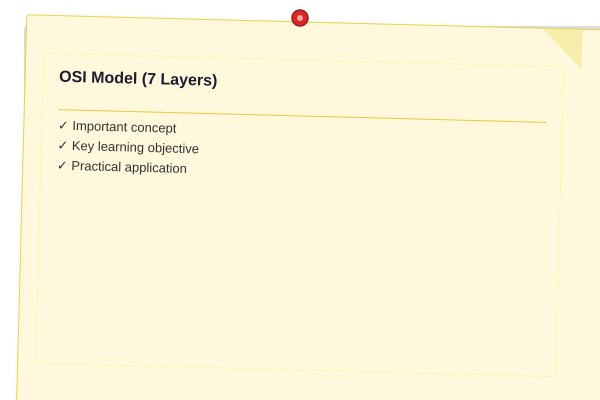
</a>


| Layer | Function | PDU | Devices |
|-------|----------|-----|---------|
| 7 �� Application | User interface, email, file transfer | Data | Gateway |
| 6 �� Presentation | Encryption, compression, translation | Data | Gateway |
| 5 �� Session | Session management, synchronization | Data | Gateway |
| 4 �� Transport | End-to-end reliability, flow control | Segment | Gateway |
| 3 �� Network | Logical addressing, routing | Packet | Router |
| 2 �� Data Link | Framing, error control, MAC addressing | Frame | Switch, Bridge |
| 1 �� Physical | Bit transmission, signals, media | Bits | Hub, Repeater |

### TCP/IP Model (4 Layers)

<a href="../../assets/images/diagrams/gate-cs-preparation/09-computer-networks/tcp-ip-model-4-layers-handwritten.svg" target="_blank" rel="noopener">
  
</a>
<a href="../../assets/images/diagrams/gate-cs-preparation/09-computer-networks/tcp-ip-model-4-layers-diagram.svg" target="_blank" rel="noopener">
  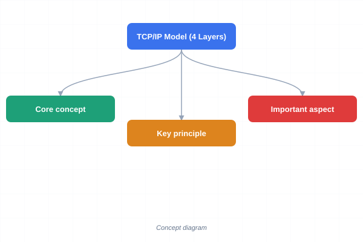
</a>
<a href="../../assets/images/diagrams/gate-cs-preparation/09-computer-networks/tcp-ip-model-4-layers-sticky.svg" target="_blank" rel="noopener">
  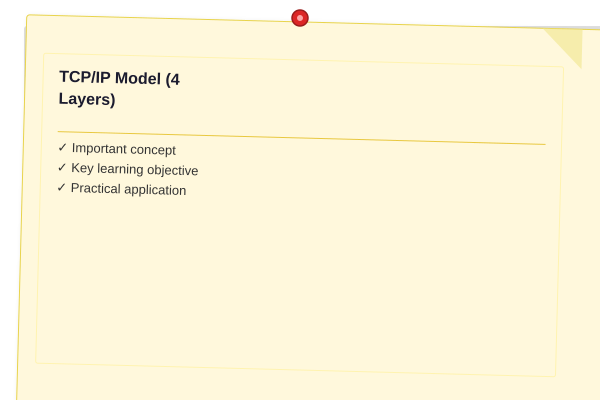
</a>


| Layer | Equivalent OSI Layers | Protocols |
|-------|----------------------|-----------|
| Application | 5+6+7 | HTTP, FTP, SMTP, DNS, DHCP |
| Transport | 4 | TCP, UDP |
| Internet | 3 | IP, ICMP, ARP, RARP |
| Network Access | 1+2 | Ethernet, PPP |

### Key Difference

<a href="../../assets/images/diagrams/gate-cs-preparation/09-computer-networks/key-difference-handwritten.svg" target="_blank" rel="noopener">
  
</a>
<a href="../../assets/images/diagrams/gate-cs-preparation/09-computer-networks/key-difference-diagram.svg" target="_blank" rel="noopener">
  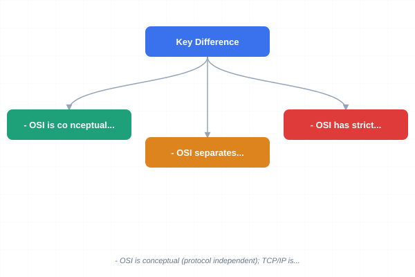
</a>
<a href="../../assets/images/diagrams/gate-cs-preparation/09-computer-networks/key-difference-sticky.svg" target="_blank" rel="noopener">
  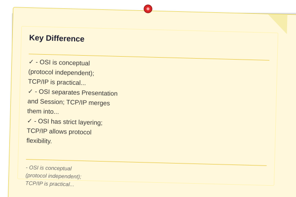
</a>


- OSI is conceptual (protocol independent); TCP/IP is practical (protocol dependent).
- OSI separates Presentation and Session; TCP/IP merges them into Application.
- OSI has strict layering; TCP/IP allows protocol flexibility.

### Mnemonic For OSI Layers: **A-P-S-T-N-D-P** → All People Seem To Need Data Processing

<a href="../../assets/images/diagrams/gate-cs-preparation/09-computer-networks/mnemonic-for-osi-layers-a-p-s-t-n-d-p-all-people-seem-to-need-data-processing-handwritten.svg" target="_blank" rel="noopener">
  
</a>
<a href="../../assets/images/diagrams/gate-cs-preparation/09-computer-networks/mnemonic-for-osi-layers-a-p-s-t-n-d-p-all-people-seem-to-need-data-processing-diagram.svg" target="_blank" rel="noopener">
  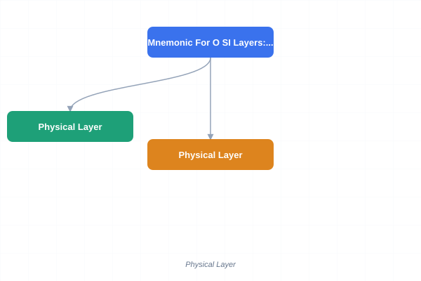
</a>
<a href="../../assets/images/diagrams/gate-cs-preparation/09-computer-networks/mnemonic-for-osi-layers-a-p-s-t-n-d-p-all-people-seem-to-need-data-processing-sticky.svg" target="_blank" rel="noopener">
  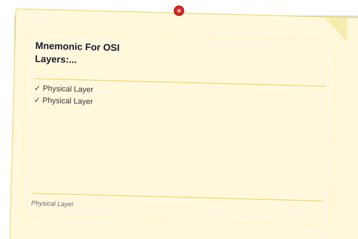
</a>


---

## 2. Physical Layer

### Signals

<a href="../../assets/images/diagrams/gate-cs-preparation/09-computer-networks/signals-handwritten.svg" target="_blank" rel="noopener">
  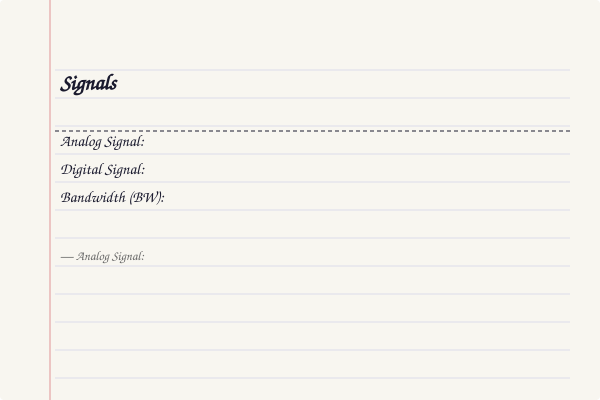
</a>
<a href="../../assets/images/diagrams/gate-cs-preparation/09-computer-networks/signals-diagram.svg" target="_blank" rel="noopener">
  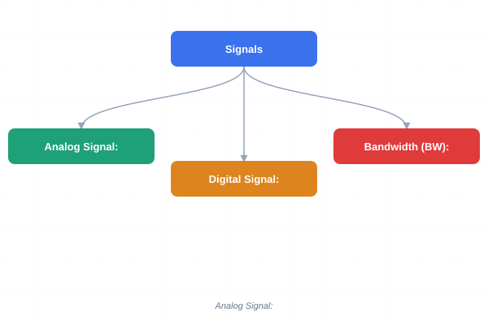
</a>
<a href="../../assets/images/diagrams/gate-cs-preparation/09-computer-networks/signals-sticky.svg" target="_blank" rel="noopener">
  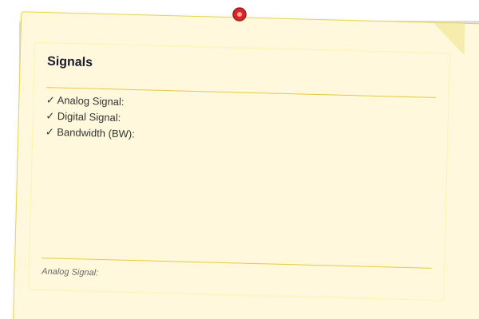
</a>


- **Analog Signal:** Continuous wave (sine wave) �� `s(t) = A sin(2�€ft + �†)`
- **Digital Signal:** Discrete values (0/1)
- **Bandwidth (BW):** `BW = f_max - f_min` (Hz)

### Nyquist Theorem (Noiseless Channel)

<a href="../../assets/images/diagrams/gate-cs-preparation/09-computer-networks/nyquist-theorem-noiseless-channel-handwritten.svg" target="_blank" rel="noopener">
  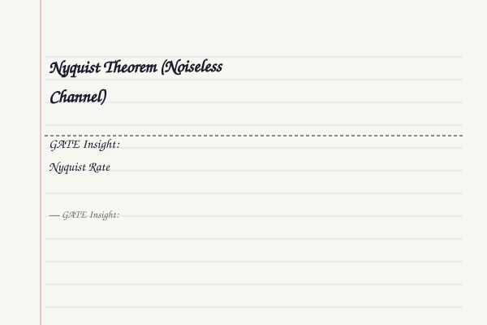
</a>
<a href="../../assets/images/diagrams/gate-cs-preparation/09-computer-networks/nyquist-theorem-noiseless-channel-diagram.svg" target="_blank" rel="noopener">
  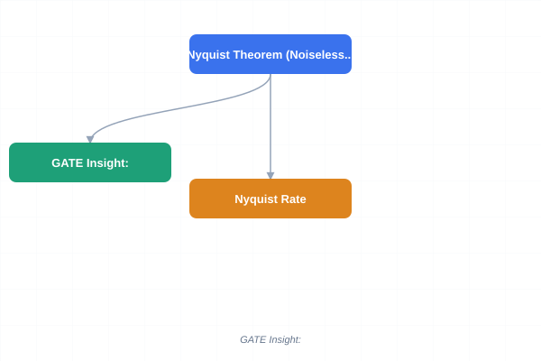
</a>
<a href="../../assets/images/diagrams/gate-cs-preparation/09-computer-networks/nyquist-theorem-noiseless-channel-sticky.svg" target="_blank" rel="noopener">
  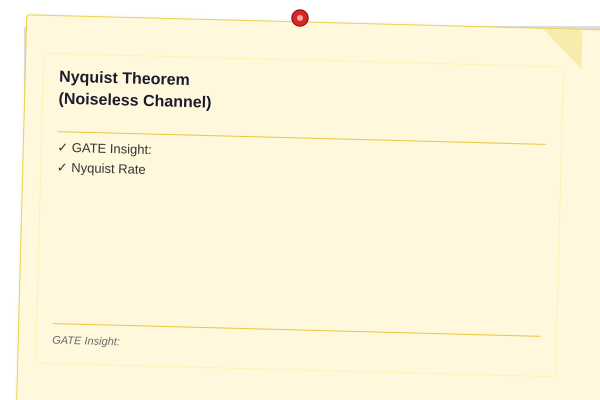
</a>


Maximum data rate = `2 � BW � log_2(L)` bits/sec

Where `L` = number of signal levels.

> **GATE Insight:** If L=2 (binary), max rate = 2�BW. This is the **Nyquist Rate**. Increasing L increases bit rate but requires more complex encoding.

### Shannon Theorem (Noisy Channel)

<a href="../../assets/images/diagrams/gate-cs-preparation/09-computer-networks/shannon-theorem-noisy-channel-handwritten.svg" target="_blank" rel="noopener">
  
</a>
<a href="../../assets/images/diagrams/gate-cs-preparation/09-computer-networks/shannon-theorem-noisy-channel-diagram.svg" target="_blank" rel="noopener">
  
</a>
<a href="../../assets/images/diagrams/gate-cs-preparation/09-computer-networks/shannon-theorem-noisy-channel-sticky.svg" target="_blank" rel="noopener">
  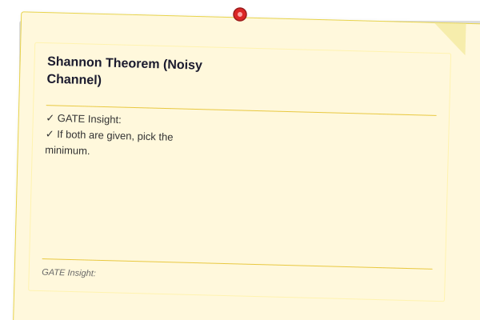
</a>


Maximum data rate = `BW � log_2(1 + SNR)` bits/sec

Where `SNR = Signal Power / Noise Power`, expressed in dB as: `SNR_dB = 10 log_10(SNR)`

> **GATE Insight:** Shannon gives the absolute upper bound. Nyquist gives the limit for a given encoding. **If both are given, pick the minimum.**

### Transmission Media

<a href="../../assets/images/diagrams/gate-cs-preparation/09-computer-networks/transmission-media-handwritten.svg" target="_blank" rel="noopener">
  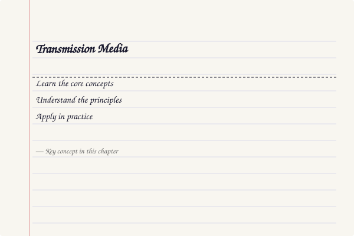
</a>
<a href="../../assets/images/diagrams/gate-cs-preparation/09-computer-networks/transmission-media-diagram.svg" target="_blank" rel="noopener">
  
</a>
<a href="../../assets/images/diagrams/gate-cs-preparation/09-computer-networks/transmission-media-sticky.svg" target="_blank" rel="noopener">
  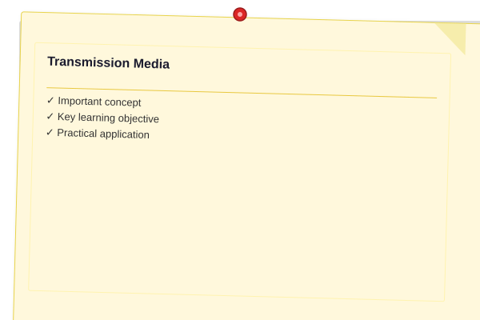
</a>


| Media | Type | BW | Distance | Use |
|-------|------|-----|----------|-----|
| Twisted Pair | Guided (Copper) | 100 MHz-1 GHz | 100m | LAN |
| Coaxial Cable | Guided (Copper) | 750 MHz | 500m | Cable TV |
| Optical Fiber | Guided (Glass) | 200 THz | 40+ km | Backbone |
| Radio Waves | Unguided | 3 kHz-300 GHz | Varies | WiFi, Cellular |

### Switching

<a href="../../assets/images/diagrams/gate-cs-preparation/09-computer-networks/switching-handwritten.svg" target="_blank" rel="noopener">
  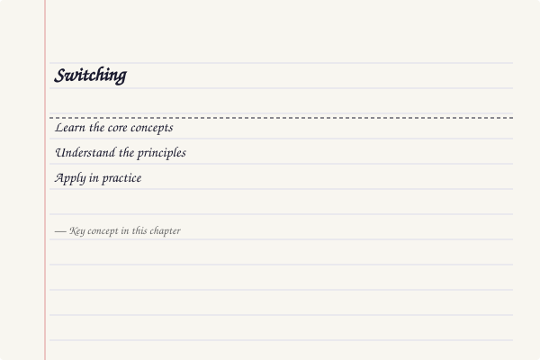
</a>
<a href="../../assets/images/diagrams/gate-cs-preparation/09-computer-networks/switching-diagram.svg" target="_blank" rel="noopener">
  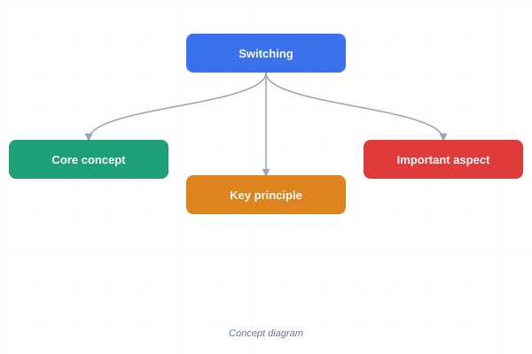
</a>
<a href="../../assets/images/diagrams/gate-cs-preparation/09-computer-networks/switching-sticky.svg" target="_blank" rel="noopener">
  
</a>


| Aspect | Circuit Switching | Packet Switching |
|--------|------------------|------------------|
| Path | Dedicated | Shared |
| Resources | Reserved | On-demand |
| Delay | Setup + propagation | Store-and-forward |
| Efficiency | Low for bursty | High for bursty |
| Example | Telephone | Internet |

### Store-and-Forward Delay Formula

<a href="../../assets/images/diagrams/gate-cs-preparation/09-computer-networks/store-and-forward-delay-formula-handwritten.svg" target="_blank" rel="noopener">
  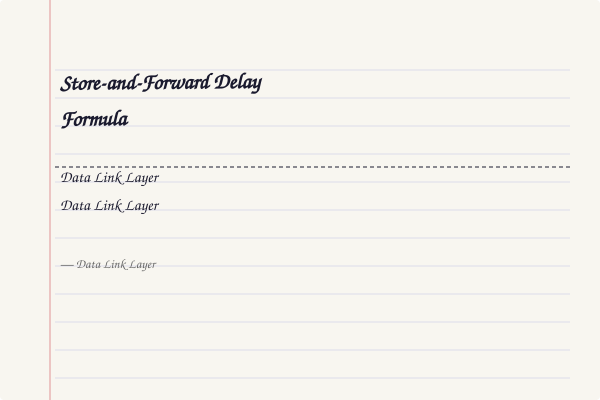
</a>
<a href="../../assets/images/diagrams/gate-cs-preparation/09-computer-networks/store-and-forward-delay-formula-diagram.svg" target="_blank" rel="noopener">
  
</a>
<a href="../../assets/images/diagrams/gate-cs-preparation/09-computer-networks/store-and-forward-delay-formula-sticky.svg" target="_blank" rel="noopener">
  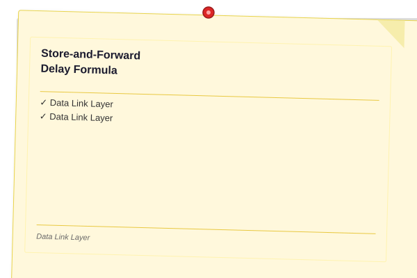
</a>


Total Delay = `T_tx + T_prop + T_queue + T_processing`

- `T_tx` (Transmission) = Packet Size / Bandwidth
- `T_prop` (Propagation) = Distance / Speed of Signal
- At each hop, the packet must be fully received before forwarding.

---

## 3. Data Link Layer

### Framing

<a href="../../assets/images/diagrams/gate-cs-preparation/09-computer-networks/framing-handwritten.svg" target="_blank" rel="noopener">
  
</a>
<a href="../../assets/images/diagrams/gate-cs-preparation/09-computer-networks/framing-diagram.svg" target="_blank" rel="noopener">
  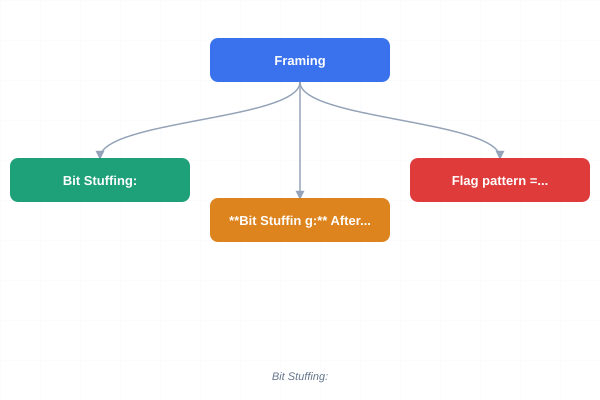
</a>
<a href="../../assets/images/diagrams/gate-cs-preparation/09-computer-networks/framing-sticky.svg" target="_blank" rel="noopener">
  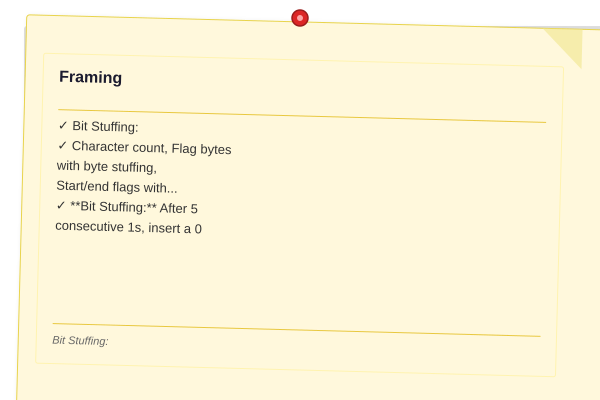
</a>


Methods: Character count, Flag bytes with byte stuffing, Start/end flags with bit stuffing.

**Bit Stuffing:** After 5 consecutive 1s, insert a 0. Flag pattern = `01111110`.

### Error Detection

<a href="../../assets/images/diagrams/gate-cs-preparation/09-computer-networks/error-detection-handwritten.svg" target="_blank" rel="noopener">
  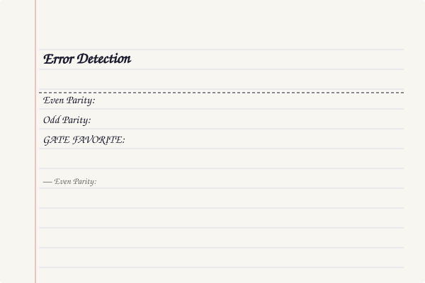
</a>
<a href="../../assets/images/diagrams/gate-cs-preparation/09-computer-networks/error-detection-diagram.svg" target="_blank" rel="noopener">
  
</a>
<a href="../../assets/images/diagrams/gate-cs-preparation/09-computer-networks/error-detection-sticky.svg" target="_blank" rel="noopener">
  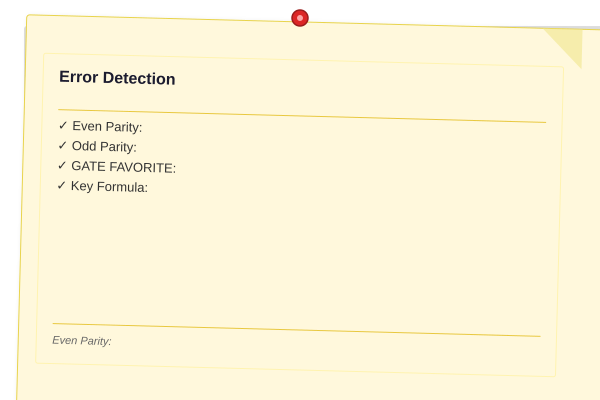
</a>


#### Parity Bit

- **Even Parity:** Total number of 1s (including parity) is even.
- **Odd Parity:** Total number of 1s is odd.
- Detects odd number of bit flips only.

#### Cyclic Redundancy Check (CRC)

**GATE FAVORITE:** CRC questions appear in nearly every GATE paper.

- Sender: Data Ã� 2^r / Generator → Remainder = CRC → Append to data.
- Receiver: Data + CRC / Generator → If remainder == 0, no error.

**Key Formula:** `D � 2^r XOR R = n � G` where D = data, r = degree of G, R = remainder.

Common CRC Generators:
- CRC-1 (Parity): `x + 1`
- CRC-8: `x^8 + x^2 + x + 1`
- CRC-32 (Ethernet): `x^32 + x^26 + x^23 + x^22 + x^16 + x^12 + x^11 + x^10 + x^8 + x^7 + x^5 + x^4 + x^2 + x + 1`

> **CRC Properties:**
> - Detects all single-bit errors (if G has ≥2 terms with non-zero coefficient of x^0)
> - Detects all burst errors of length ≤ r
> - Detects all odd number of errors (if G has factor (x+1))
> - Undetected error probability = (1/2)^r for random errors

#### Checksum

Used in IP, TCP, UDP. One's complement sum of 16-bit words.

### Error Correction �� Hamming Code

<a href="../../assets/images/diagrams/gate-cs-preparation/09-computer-networks/error-correction-hamming-code-handwritten.svg" target="_blank" rel="noopener">
  
</a>
<a href="../../assets/images/diagrams/gate-cs-preparation/09-computer-networks/error-correction-hamming-code-diagram.svg" target="_blank" rel="noopener">
  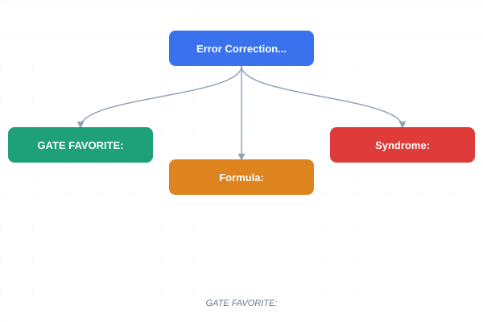
</a>
<a href="../../assets/images/diagrams/gate-cs-preparation/09-computer-networks/error-correction-hamming-code-sticky.svg" target="_blank" rel="noopener">
  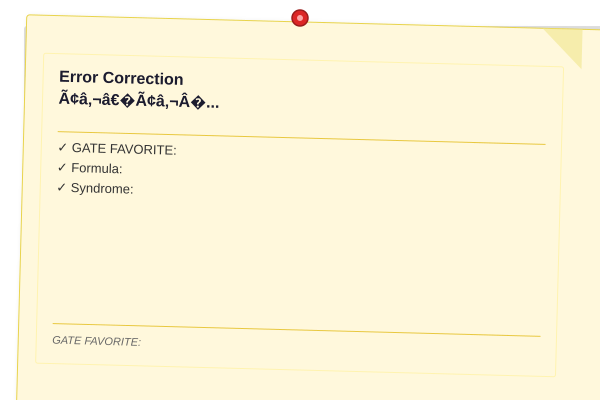
</a>


**GATE FAVORITE:** Hamming code questions appear frequently.

- Parity bits at positions that are powers of 2 (1, 2, 4, 8, ...)
- Data bits fill remaining positions.
- Each parity bit `p_i` covers positions where the i-th bit of position is 1.

**Formula:** `2^r ≥ m + r + 1` where m = data bits, r = parity bits.

**Syndrome:** XOR of all parity bits and their covered bits → gives the bit position in error (0 = no error).

### Flow Control Protocols

<a href="../../assets/images/diagrams/gate-cs-preparation/09-computer-networks/flow-control-protocols-handwritten.svg" target="_blank" rel="noopener">
  
</a>
<a href="../../assets/images/diagrams/gate-cs-preparation/09-computer-networks/flow-control-protocols-diagram.svg" target="_blank" rel="noopener">
  
</a>
<a href="../../assets/images/diagrams/gate-cs-preparation/09-computer-networks/flow-control-protocols-sticky.svg" target="_blank" rel="noopener">
  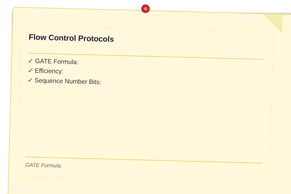
</a>


#### Stop-and-Wait ARQ

- Sender sends one frame, waits for ACK.
- Efficiency (Utilization): `η = T_tx / (T_tx + 2 � T_prop)`

> **GATE Formula:** `η = 1 / (1 + 2a)` where `a = T_prop / T_tx`

#### Sliding Window (Go-Back-N / Selective Repeat)

| Aspect | Go-Back-N | Selective Repeat |
|--------|-----------|-----------------|
| Window Size (Sender) | ≤ 2^n - 1 | ≤ 2^(n-1) |
| Window Size (Receiver) | 1 | ≤ 2^(n-1) |
| On Error | Resend all from lost frame | Resend only lost frame |
| Buffer | Minimal | Full window |

**Efficiency:** `η = N � T_tx / (T_tx + 2 � T_prop)` (for N-window sliding window)

Where `N = minimum(WS, 1 + 2a)` for the sender window.

**Sequence Number Bits:** Need at least `n` bits such that the window wraps correctly.

### MAC Sublayer

<a href="../../assets/images/diagrams/gate-cs-preparation/09-computer-networks/mac-sublayer-handwritten.svg" target="_blank" rel="noopener">
  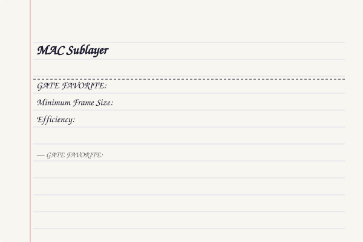
</a>
<a href="../../assets/images/diagrams/gate-cs-preparation/09-computer-networks/mac-sublayer-diagram.svg" target="_blank" rel="noopener">
  
</a>
<a href="../../assets/images/diagrams/gate-cs-preparation/09-computer-networks/mac-sublayer-sticky.svg" target="_blank" rel="noopener">
  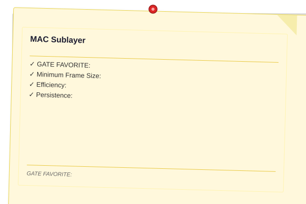
</a>


#### ALOHA

| Protocol | Throughput (S) | Formula |
|----------|---------------|---------|
| Pure ALOHA | `S = G � e^(-2G)` | Max at G=0.5, S=0.184 |
| Slotted ALOHA | `S = G � e^(-G)` | Max at G=1, S=0.368 |

#### CSMA/CD (Carrier Sense Multiple Access with Collision Detection)

**GATE FAVORITE:** CSMA/CD efficiency and minimum frame size.

- **Minimum Frame Size:** `L_min = 2 � T_prop � B` (must be ≥ 2� propagation delay in bits)
- **Efficiency:** `η = 1 / (1 + 6.44a)` (standard) or `η = 1 / (1 + 2a)` (simplified)
- Where `a = T_prop / T_tx`

**Persistence:**
- **1-persistent:** Transmit as soon as idle (high collisions)
- **Non-persistent:** Wait random time if busy, then sense again
- **p-persistent:** Transmit with prob p when idle; defer with prob (1-p)

#### Ethernet

| Standard | Speed | Medium | Max Length |
|----------|-------|--------|------------|
| 10Base5 | 10 Mbps | Coax | 500m |
| 10Base2 | 10 Mbps | Coax | 185m |
| 10Base-T | 10 Mbps | UTP | 100m |
| 100Base-TX | 100 Mbps | UTP | 100m |
| 1000Base-T | 1 Gbps | UTP | 100m |

**Ethernet Frame (IEEE 802.3):**
- Preamble (7B) + SFD (1B) + Dest MAC (6B) + Src MAC (6B) + Length/Type (2B) + Data (46-1500B) + CRC (4B)
- **Minimum frame size:** 64 bytes (ensures CSMA/CD works)
- **Maximum frame size:** 1518 bytes

### Bridges and Switches

<a href="../../assets/images/diagrams/gate-cs-preparation/09-computer-networks/bridges-and-switches-handwritten.svg" target="_blank" rel="noopener">
  
</a>
<a href="../../assets/images/diagrams/gate-cs-preparation/09-computer-networks/bridges-and-switches-diagram.svg" target="_blank" rel="noopener">
  
</a>
<a href="../../assets/images/diagrams/gate-cs-preparation/09-computer-networks/bridges-and-switches-sticky.svg" target="_blank" rel="noopener">
  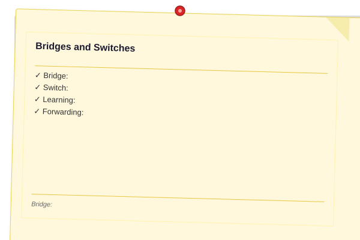
</a>


- **Bridge:** 2 ports, connects segments, uses MAC table
- **Switch:** Multi-port bridge, full-duplex, microsegmentation
- **Learning:** Learns source MAC → port mapping
- **Forwarding:** Flood unknown unicast, forward known unicast, filter if same port
- **Spanning Tree Protocol (STP):** Prevents loops in bridged networks

---

## 4. Network Layer

### IPv4 Addressing

<a href="../../assets/images/diagrams/gate-cs-preparation/09-computer-networks/ipv4-addressing-handwritten.svg" target="_blank" rel="noopener">
  
</a>
<a href="../../assets/images/diagrams/gate-cs-preparation/09-computer-networks/ipv4-addressing-diagram.svg" target="_blank" rel="noopener">
  
</a>
<a href="../../assets/images/diagrams/gate-cs-preparation/09-computer-networks/ipv4-addressing-sticky.svg" target="_blank" rel="noopener">
  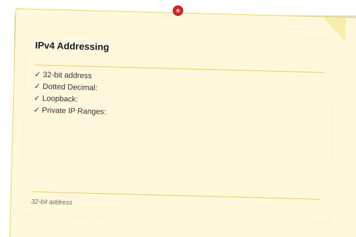
</a>


- **32-bit address** (4 octets). `2^32 ≈ 4.3 billion` addresses.
- **Dotted Decimal:** `192.168.1.1`

#### Address Classes

| Class | Leading Bits | Range | Default Mask | Networks | Hosts/Net |
|-------|-------------|-------|--------------|----------|-----------|
| A | 0 | 1.0.0.0 �“ 126.255.255.255 | /8 | 126 | 2^24 - 2 |
| B | 10 | 128.0.0.0 �“ 191.255.255.255 | /16 | 2^14 | 2^16 - 2 |
| C | 110 | 192.0.0.0 �“ 223.255.255.255 | /24 | 2^21 | 2^8 - 2 |
| D | 1110 | 224.0.0.0 �“ 239.255.255.255 | Multicast | �� | �� |
| E | 1111 | 240.0.0.0 �“ 255.255.255.255 | Reserved | �� | �� |

**Loopback:** 127.0.0.0/8 (used for local testing)

**Private IP Ranges:**
- 10.0.0.0/8
- 172.16.0.0/12
- 192.168.0.0/16

### Subnetting

<a href="../../assets/images/diagrams/gate-cs-preparation/09-computer-networks/subnetting-handwritten.svg" target="_blank" rel="noopener">
  
</a>
<a href="../../assets/images/diagrams/gate-cs-preparation/09-computer-networks/subnetting-diagram.svg" target="_blank" rel="noopener">
  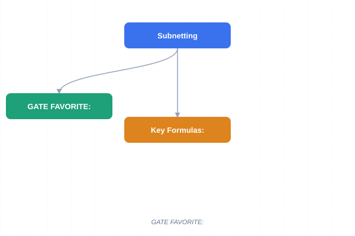
</a>
<a href="../../assets/images/diagrams/gate-cs-preparation/09-computer-networks/subnetting-sticky.svg" target="_blank" rel="noopener">
  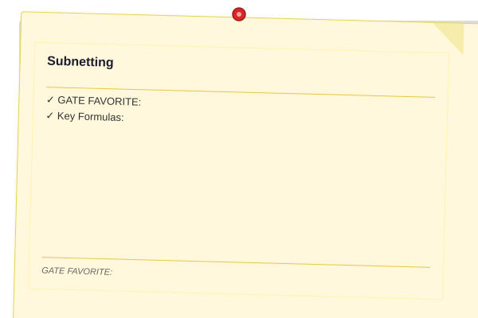
</a>


**GATE FAVORITE:** Subnetting appears in virtually every GATE paper.

**Key Formulas:**
- Number of subnets = `2^(subnet bits)`
- Number of hosts per subnet = `2^(host bits) - 2` (subtract network + broadcast)
- Subnet Mask = network bits as 1s, host bits as 0s

| Mask | CIDR | Hosts |
|------|------|-------|
| 255.0.0.0 | /8 | 16,777,214 |
| 255.255.0.0 | /16 | 65,534 |
| 255.255.255.0 | /24 | 254 |
| 255.255.255.128 | /25 | 126 |
| 255.255.255.192 | /26 | 62 |
| 255.255.255.224 | /27 | 30 |
| 255.255.255.240 | /28 | 14 |
| 255.255.255.248 | /29 | 6 |
| 255.255.255.252 | /30 | 2 |
| 255.255.255.254 | /31 | 0 (used for p2p with RFC 3021) |
| 255.255.255.255 | /32 | 1 (host route) |

### CIDR (Classless Inter-Domain Routing)

<a href="../../assets/images/diagrams/gate-cs-preparation/09-computer-networks/cidr-classless-inter-domain-routing-handwritten.svg" target="_blank" rel="noopener">
  
</a>
<a href="../../assets/images/diagrams/gate-cs-preparation/09-computer-networks/cidr-classless-inter-domain-routing-diagram.svg" target="_blank" rel="noopener">
  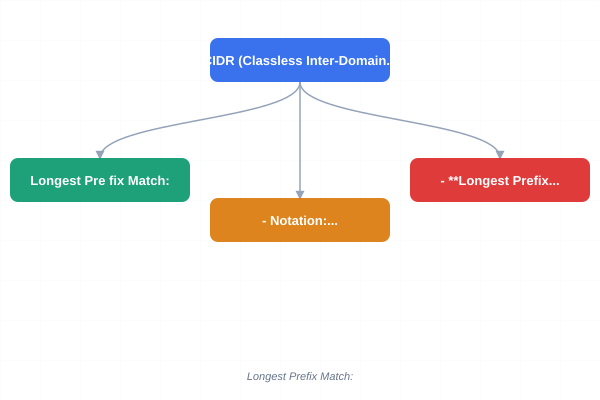
</a>
<a href="../../assets/images/diagrams/gate-cs-preparation/09-computer-networks/cidr-classless-inter-domain-routing-sticky.svg" target="_blank" rel="noopener">
  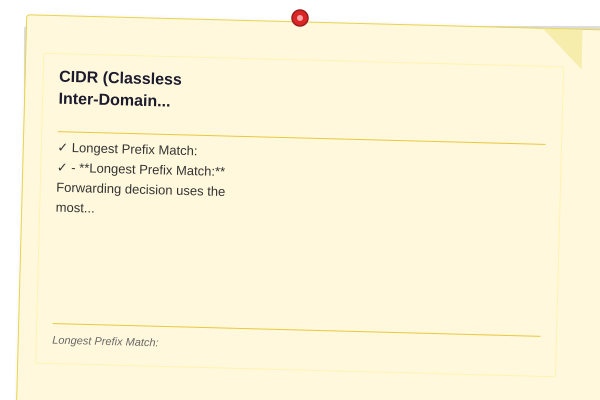
</a>


- Notation: `IP/prefix_length`
- Route aggregation / supernetting: combine consecutive networks.
- **Longest Prefix Match:** Forwarding decision uses the most specific matching prefix.

### IPv6

<a href="../../assets/images/diagrams/gate-cs-preparation/09-computer-networks/ipv6-handwritten.svg" target="_blank" rel="noopener">
  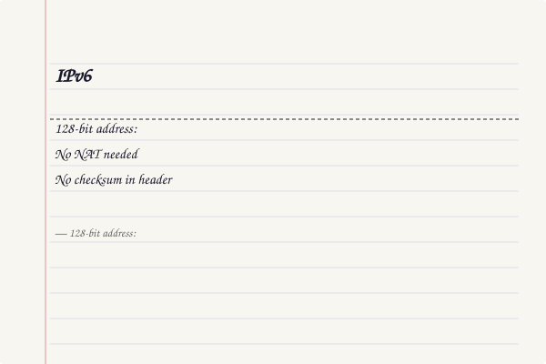
</a>
<a href="../../assets/images/diagrams/gate-cs-preparation/09-computer-networks/ipv6-diagram.svg" target="_blank" rel="noopener">
  
</a>
<a href="../../assets/images/diagrams/gate-cs-preparation/09-computer-networks/ipv6-sticky.svg" target="_blank" rel="noopener">
  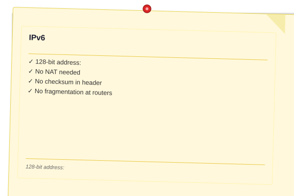
</a>


- **128-bit address:** 8 groups of 4 hex digits.
- `2001:0db8:0000:0000:0000:ff00:0042:8329`
- Shorten: Leading zeros omitted, `::` once for consecutive zero groups.
- **No NAT needed** (enough addresses).
- **No checksum in header** (reduces router processing).
- **No fragmentation at routers** (MTU discovery by sender).

### Network Address Translation (NAT)

<a href="../../assets/images/diagrams/gate-cs-preparation/09-computer-networks/network-address-translation-nat-handwritten.svg" target="_blank" rel="noopener">
  
</a>
<a href="../../assets/images/diagrams/gate-cs-preparation/09-computer-networks/network-address-translation-nat-diagram.svg" target="_blank" rel="noopener">
  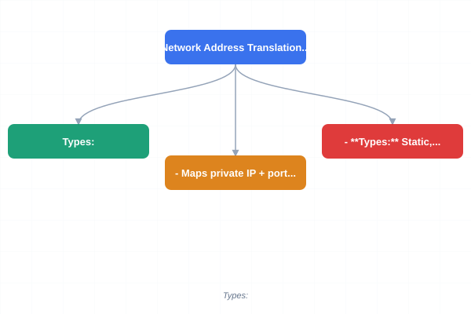
</a>
<a href="../../assets/images/diagrams/gate-cs-preparation/09-computer-networks/network-address-translation-nat-sticky.svg" target="_blank" rel="noopener">
  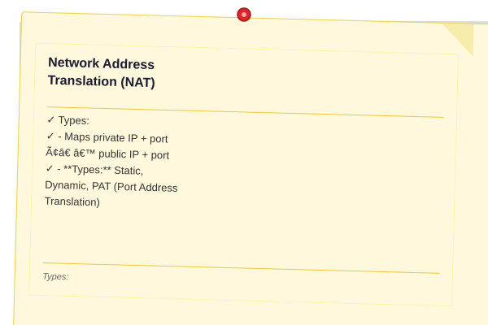
</a>


- Maps private IP + port → public IP + port.
- **Types:** Static, Dynamic, PAT (Port Address Translation).
- Conserves IPv4 addresses; breaks end-to-end connectivity.

### Routing Algorithms

<a href="../../assets/images/diagrams/gate-cs-preparation/09-computer-networks/routing-algorithms-handwritten.svg" target="_blank" rel="noopener">
  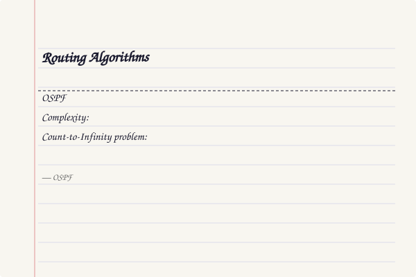
</a>
<a href="../../assets/images/diagrams/gate-cs-preparation/09-computer-networks/routing-algorithms-diagram.svg" target="_blank" rel="noopener">
  
</a>
<a href="../../assets/images/diagrams/gate-cs-preparation/09-computer-networks/routing-algorithms-sticky.svg" target="_blank" rel="noopener">
  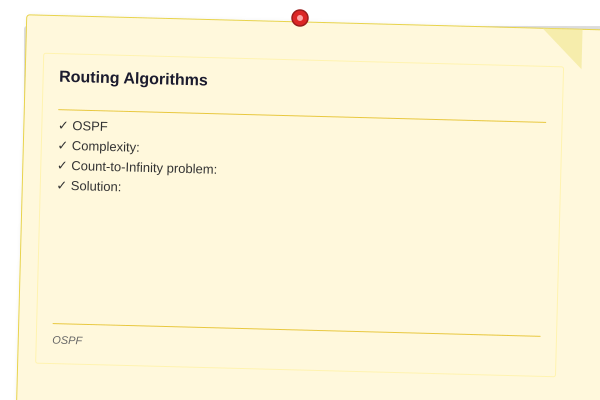
</a>


#### Dijkstra's Algorithm (Link State)

- Used by **OSPF**.
- Each router knows full topology.
- Computes shortest path tree using cost metric.
- **Complexity:** O(V^2) with array, O(E log V) with heap.

#### Bellman-Ford Algorithm (Distance Vector)

- Used by **RIP**.
- Routers share distance vectors with neighbors.
- **Count-to-Infinity problem:** Slow convergence on link failure.
- **Solution:** Split Horizon, Poison Reverse, Hold-down timers.
- **Complexity:** O(V � E)

### Routing Protocols

<a href="../../assets/images/diagrams/gate-cs-preparation/09-computer-networks/routing-protocols-handwritten.svg" target="_blank" rel="noopener">
  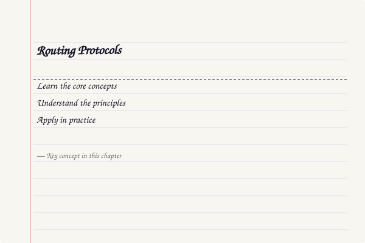
</a>
<a href="../../assets/images/diagrams/gate-cs-preparation/09-computer-networks/routing-protocols-diagram.svg" target="_blank" rel="noopener">
  
</a>
<a href="../../assets/images/diagrams/gate-cs-preparation/09-computer-networks/routing-protocols-sticky.svg" target="_blank" rel="noopener">
  
</a>


| Protocol | Type | Metric | Algorithm | Scope |
|----------|------|--------|-----------|-------|
| RIP | Distance Vector | Hops (max 15) | Bellman-Ford | IGP (Intra-AS) |
| RIPv2 | Distance Vector | Hops (max 15) | Bellman-Ford | IGP, supports CIDR |
| OSPF | Link State | Cost (bandwidth) | Dijkstra | IGP (Intra-AS) |
| IS-IS | Link State | Cost | Dijkstra | IGP |
| BGP | Path Vector | Path attributes | Best Path Selection | EGP (Inter-AS) |

### ARP and RARP

<a href="../../assets/images/diagrams/gate-cs-preparation/09-computer-networks/arp-and-rarp-handwritten.svg" target="_blank" rel="noopener">
  
</a>
<a href="../../assets/images/diagrams/gate-cs-preparation/09-computer-networks/arp-and-rarp-diagram.svg" target="_blank" rel="noopener">
  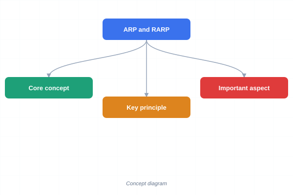
</a>
<a href="../../assets/images/diagrams/gate-cs-preparation/09-computer-networks/arp-and-rarp-sticky.svg" target="_blank" rel="noopener">
  
</a>


| Protocol | Operation |
|----------|-----------|
| **ARP** | Given IP → find MAC (broadcast request, unicast reply) |
| **RARP** | Given MAC → find IP (used in diskless workstations; replaced by DHCP/BOOTP) |

### ICMP

<a href="../../assets/images/diagrams/gate-cs-preparation/09-computer-networks/icmp-handwritten.svg" target="_blank" rel="noopener">
  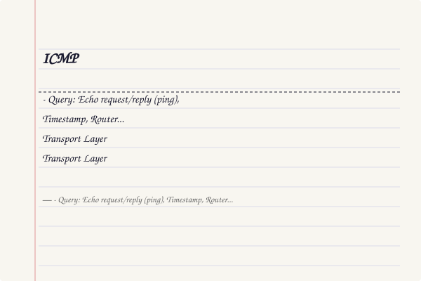
</a>
<a href="../../assets/images/diagrams/gate-cs-preparation/09-computer-networks/icmp-diagram.svg" target="_blank" rel="noopener">
  
</a>
<a href="../../assets/images/diagrams/gate-cs-preparation/09-computer-networks/icmp-sticky.svg" target="_blank" rel="noopener">
  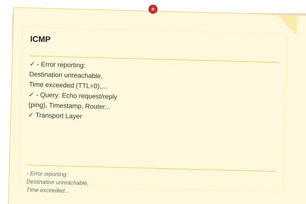
</a>


- Error reporting: Destination unreachable, Time exceeded (TTL=0), Parameter problem.
- Query: Echo request/reply (ping), Timestamp, Router solicitation/advertisement.

---

## 5. Transport Layer

### TCP Header

<a href="../../assets/images/diagrams/gate-cs-preparation/09-computer-networks/tcp-header-handwritten.svg" target="_blank" rel="noopener">
  
</a>
<a href="../../assets/images/diagrams/gate-cs-preparation/09-computer-networks/tcp-header-diagram.svg" target="_blank" rel="noopener">
  
</a>
<a href="../../assets/images/diagrams/gate-cs-preparation/09-computer-networks/tcp-header-sticky.svg" target="_blank" rel="noopener">
  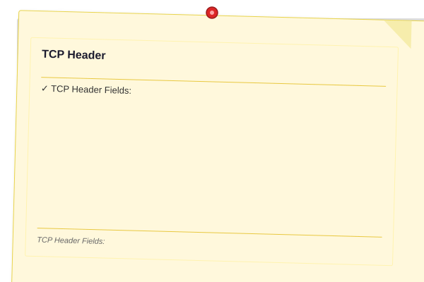
</a>


```
 0                   1                   2                   3
 0 1 2 3 4 5 6 7 8 9 0 1 2 3 4 5 6 7 8 9 0 1 2 3 4 5 6 7 8 9 0 1
+-+-+-+-+-+-+-+-+-+-+-+-+-+-+-+-+-+-+-+-+-+-+-+-+-+-+-+-+-+-+-+-+
|          Source Port          |       Destination Port        |
+-+-+-+-+-+-+-+-+-+-+-+-+-+-+-+-+-+-+-+-+-+-+-+-+-+-+-+-+-+-+-+-+
|                       Sequence Number                         |
+-+-+-+-+-+-+-+-+-+-+-+-+-+-+-+-+-+-+-+-+-+-+-+-+-+-+-+-+-+-+-+-+
|                    Acknowledgment Number                       |
+-+-+-+-+-+-+-+-+-+-+-+-+-+-+-+-+-+-+-+-+-+-+-+-+-+-+-+-+-+-+-+-+
| Data | Reserved|C|E|U|A|P|R|S|F|       Window Size            |
|Offset|        |W|C|R|C|S|S|Y|I|                              |
+-+-+-+-+-+-+-+-+-+-+-+-+-+-+-+-+-+-+-+-+-+-+-+-+-+-+-+-+-+-+-+-+
|           Checksum            |         Urgent Pointer        |
+-+-+-+-+-+-+-+-+-+-+-+-+-+-+-+-+-+-+-+-+-+-+-+-+-+-+-+-+-+-+-+-+
```

**TCP Header Fields:**
- Source Port (16 bits), Dest Port (16 bits)
- Sequence Number (32 bits)
- Acknowledgment Number (32 bits)
- Data Offset (4 bits) �� header length in 32-bit words
- Flags (9 bits): NS, CWR, ECE, URG, ACK, PSH, RST, SYN, FIN
- Window Size (16 bits) �� flow control
- Checksum (16 bits) �� covers header + data + pseudo-header
- Urgent Pointer (16 bits)
- Options (variable)

### TCP Connection Management

<a href="../../assets/images/diagrams/gate-cs-preparation/09-computer-networks/tcp-connection-management-handwritten.svg" target="_blank" rel="noopener">
  
</a>
<a href="../../assets/images/diagrams/gate-cs-preparation/09-computer-networks/tcp-connection-management-diagram.svg" target="_blank" rel="noopener">
  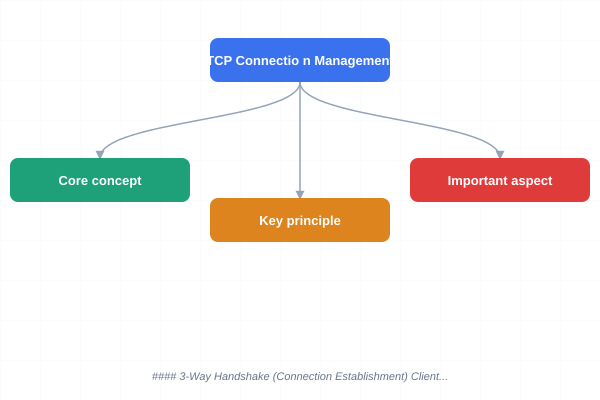
</a>
<a href="../../assets/images/diagrams/gate-cs-preparation/09-computer-networks/tcp-connection-management-sticky.svg" target="_blank" rel="noopener">
  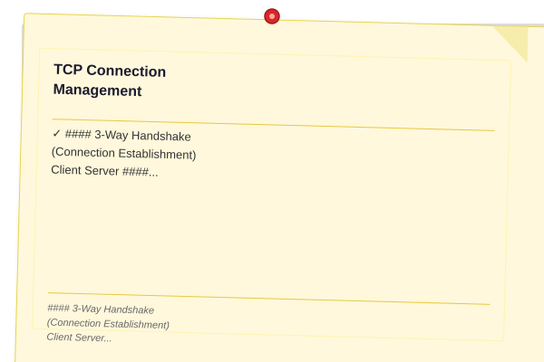
</a>


#### 3-Way Handshake (Connection Establishment)

```
Client                     Server
  |                          |
  |------- SYN (seq=x) ----->|
  |                          |
  |<--- SYN+ACK (seq=y,ack=x+1) --|
  |                          |
  |------- ACK (ack=y+1) --->|
  |                          |
```

#### Connection Termination (4-Way)

```
Client                     Server
  |                          |
  |------- FIN ------------>|
  |                          |
  |<------- ACK ------------|
  |                          |
  |<------- FIN ------------|
  |                          |
  |------- ACK ------------>|
  |                          |
```

### UDP Header

<a href="../../assets/images/diagrams/gate-cs-preparation/09-computer-networks/udp-header-handwritten.svg" target="_blank" rel="noopener">
  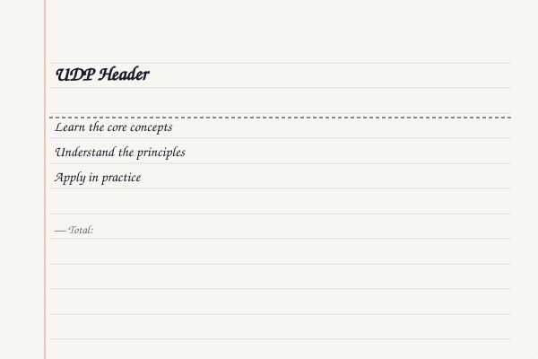
</a>
<a href="../../assets/images/diagrams/gate-cs-preparation/09-computer-networks/udp-header-diagram.svg" target="_blank" rel="noopener">
  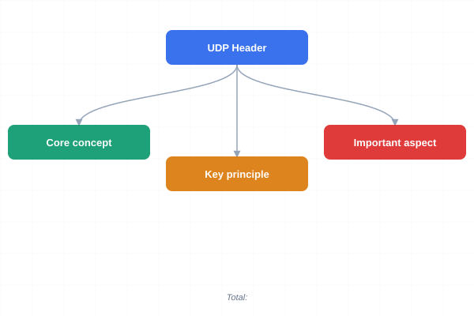
</a>
<a href="../../assets/images/diagrams/gate-cs-preparation/09-computer-networks/udp-header-sticky.svg" target="_blank" rel="noopener">
  
</a>


- Source Port (16), Dest Port (16), Length (16), Checksum (16)
- **Total:** 8 bytes
- Connectionless, unreliable, no flow/congestion control.

### TCP Flow Control

<a href="../../assets/images/diagrams/gate-cs-preparation/09-computer-networks/tcp-flow-control-handwritten.svg" target="_blank" rel="noopener">
  
</a>
<a href="../../assets/images/diagrams/gate-cs-preparation/09-computer-networks/tcp-flow-control-diagram.svg" target="_blank" rel="noopener">
  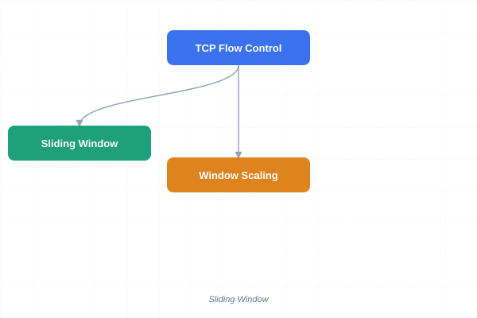
</a>
<a href="../../assets/images/diagrams/gate-cs-preparation/09-computer-networks/tcp-flow-control-sticky.svg" target="_blank" rel="noopener">
  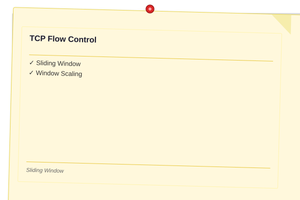
</a>


- **Sliding Window** �� receiver advertises `rwnd` (receiver window).
- **Window Scaling** �� allows windows > 64 KB (RFC 1323).

### TCP Congestion Control

<a href="../../assets/images/diagrams/gate-cs-preparation/09-computer-networks/tcp-congestion-control-handwritten.svg" target="_blank" rel="noopener">
  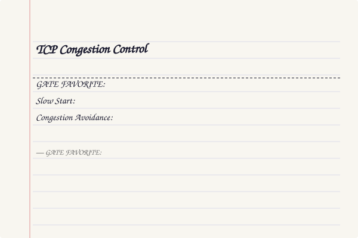
</a>
<a href="../../assets/images/diagrams/gate-cs-preparation/09-computer-networks/tcp-congestion-control-diagram.svg" target="_blank" rel="noopener">
  
</a>
<a href="../../assets/images/diagrams/gate-cs-preparation/09-computer-networks/tcp-congestion-control-sticky.svg" target="_blank" rel="noopener">
  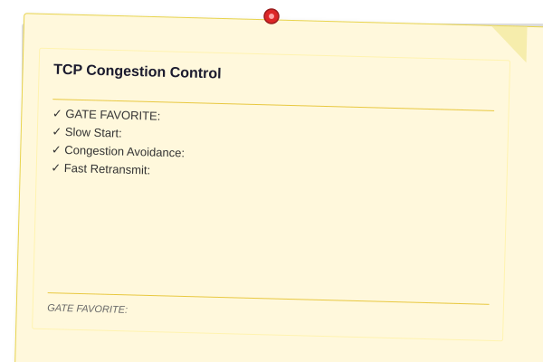
</a>


**GATE FAVORITE:** TCP congestion control variants and window evolution.

#### States

1. **Slow Start:** cwnd doubles every RTT (exponential growth). Starts at 1 MSS (or 2-3 MSS in some implementations).
2. **Congestion Avoidance:** cwnd increases by 1 MSS per RTT (linear growth, additive increase).
3. **Fast Retransmit:** On 3 duplicate ACKs, retransmit lost segment without waiting for timeout.
4. **Fast Recovery:** After fast retransmit, halve cwnd and enter congestion avoidance.

#### TCP Variants

| Variant | On 3 Dup ACKs | On Timeout |
|---------|--------------|------------|
| **Tahoe** | cwnd=1, ssthresh=cwnd/2, slow start | cwnd=1, slow start |
| **Reno** | cwnd=cwnd/2, ssthresh=cwnd/2, fast recovery | cwnd=1, slow start |
| **NewReno** | Same as Reno, better partial ACK handling | Same as Reno |
| **Cubic** | Cubic function, good for high-BW | cwnd reduced |

#### AIMD (Additive Increase Multiplicative Decrease)

- **Increase:** cwnd += 1 MSS per RTT (congestion avoidance phase)
- **Decrease:** On loss, cwnd *= 0.5

### TCP Timers

<a href="../../assets/images/diagrams/gate-cs-preparation/09-computer-networks/tcp-timers-handwritten.svg" target="_blank" rel="noopener">
  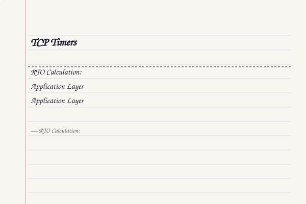
</a>
<a href="../../assets/images/diagrams/gate-cs-preparation/09-computer-networks/tcp-timers-diagram.svg" target="_blank" rel="noopener">
  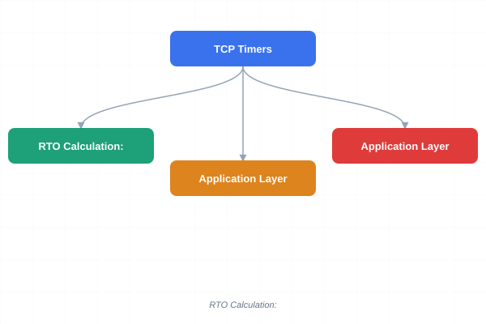
</a>
<a href="../../assets/images/diagrams/gate-cs-preparation/09-computer-networks/tcp-timers-sticky.svg" target="_blank" rel="noopener">
  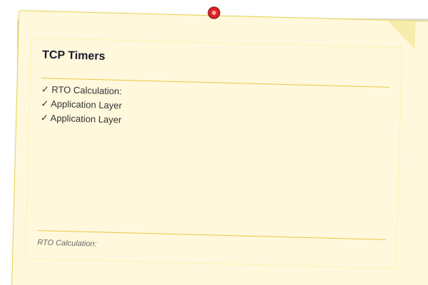
</a>


| Timer | Purpose |
|-------|---------|
| Retransmission Timer (RTO) | Timeout for lost segment |
| Persist Timer | Prevent deadlock when window = 0 |
| Keepalive Timer | Check if idle connection is alive |
| TIME-WAIT Timer | 2 MSL after connection close |

**RTO Calculation:**
- `EstimatedRTT = (1 - α) � EstimatedRTT + α � SampleRTT` (typically α = 0.125)
- `DevRTT = (1 - β) � DevRTT + β � |SampleRTT - EstimatedRTT|` (β = 0.25)
- `RTO = EstimatedRTT + 4 � DevRTT`

---

## 6. Application Layer

### DNS (Domain Name System)

<a href="../../assets/images/diagrams/gate-cs-preparation/09-computer-networks/dns-domain-name-system-handwritten.svg" target="_blank" rel="noopener">
  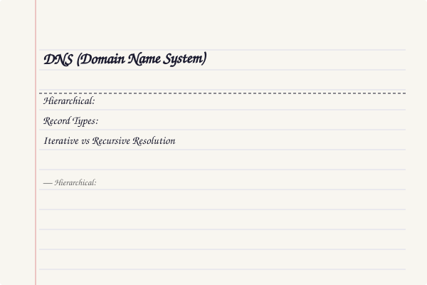
</a>
<a href="../../assets/images/diagrams/gate-cs-preparation/09-computer-networks/dns-domain-name-system-diagram.svg" target="_blank" rel="noopener">
  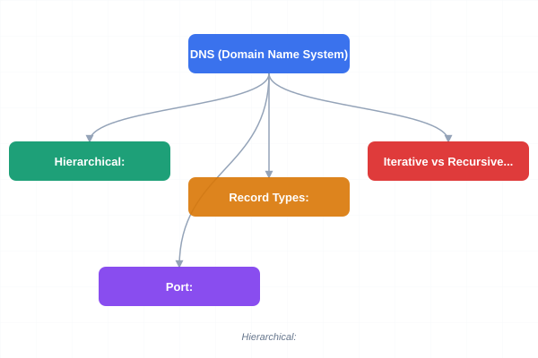
</a>
<a href="../../assets/images/diagrams/gate-cs-preparation/09-computer-networks/dns-domain-name-system-sticky.svg" target="_blank" rel="noopener">
  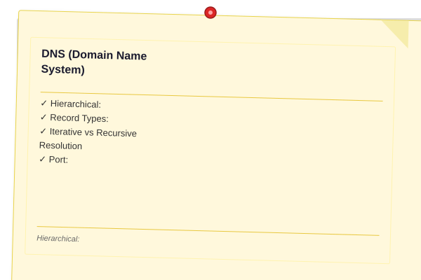
</a>


- **Hierarchical:** Root → TLD (.com, .org) → Authoritative
- **Record Types:** A (IPv4), AAAA (IPv6), CNAME (alias), MX (mail), NS (nameserver), PTR (reverse)
- **Iterative vs Recursive Resolution**
- **Port:** UDP 53 (queries), TCP 53 (zone transfers)

### HTTP/HTTPS

<a href="../../assets/images/diagrams/gate-cs-preparation/09-computer-networks/http-https-handwritten.svg" target="_blank" rel="noopener">
  
</a>
<a href="../../assets/images/diagrams/gate-cs-preparation/09-computer-networks/http-https-diagram.svg" target="_blank" rel="noopener">
  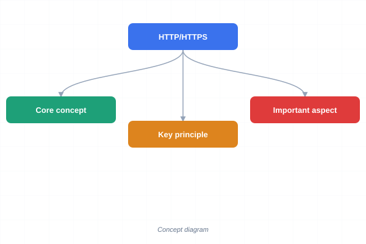
</a>
<a href="../../assets/images/diagrams/gate-cs-preparation/09-computer-networks/http-https-sticky.svg" target="_blank" rel="noopener">
  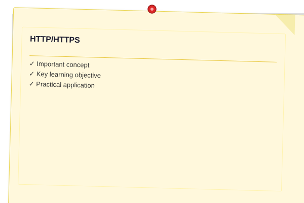
</a>


| Version | Features |
|---------|----------|
| HTTP/1.0 | Stateless, new TCP connection per request |
| HTTP/1.1 | Persistent connections, pipelining, chunked transfer |
| HTTP/2.0 | Multiplexed streams, header compression, server push |
| HTTP/3.0 | QUIC (UDP-based), lower latency |

- HTTP: Port 80
- HTTPS: Port 443 (HTTP over TLS)

### Email Protocols

<a href="../../assets/images/diagrams/gate-cs-preparation/09-computer-networks/email-protocols-handwritten.svg" target="_blank" rel="noopener">
  
</a>
<a href="../../assets/images/diagrams/gate-cs-preparation/09-computer-networks/email-protocols-diagram.svg" target="_blank" rel="noopener">
  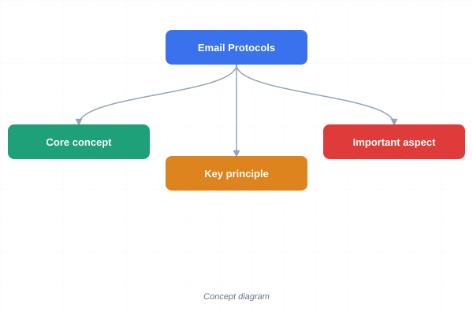
</a>
<a href="../../assets/images/diagrams/gate-cs-preparation/09-computer-networks/email-protocols-sticky.svg" target="_blank" rel="noopener">
  
</a>


| Protocol | Function | Port |
|----------|----------|------|
| SMTP | Send mail | 25 (default), 587 (submission) |
| POP3 | Retrieve mail (download & delete) | 110 |
| IMAP | Retrieve mail (server-based, folders) | 143 |
| MIME | Attachments, non-ASCII content | �� |

### FTP (File Transfer Protocol)

<a href="../../assets/images/diagrams/gate-cs-preparation/09-computer-networks/ftp-file-transfer-protocol-handwritten.svg" target="_blank" rel="noopener">
  
</a>
<a href="../../assets/images/diagrams/gate-cs-preparation/09-computer-networks/ftp-file-transfer-protocol-diagram.svg" target="_blank" rel="noopener">
  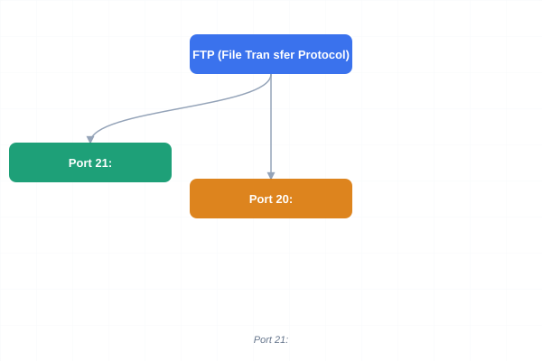
</a>
<a href="../../assets/images/diagrams/gate-cs-preparation/09-computer-networks/ftp-file-transfer-protocol-sticky.svg" target="_blank" rel="noopener">
  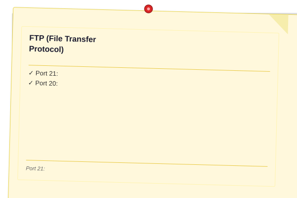
</a>


- **Port 21:** Control connection
- **Port 20:** Data connection (active mode)
- Passive mode uses random high port for data.

### DHCP (Dynamic Host Configuration Protocol)

<a href="../../assets/images/diagrams/gate-cs-preparation/09-computer-networks/dhcp-dynamic-host-configuration-protocol-handwritten.svg" target="_blank" rel="noopener">
  
</a>
<a href="../../assets/images/diagrams/gate-cs-preparation/09-computer-networks/dhcp-dynamic-host-configuration-protocol-diagram.svg" target="_blank" rel="noopener">
  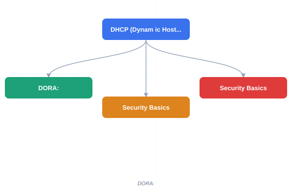
</a>
<a href="../../assets/images/diagrams/gate-cs-preparation/09-computer-networks/dhcp-dynamic-host-configuration-protocol-sticky.svg" target="_blank" rel="noopener">
  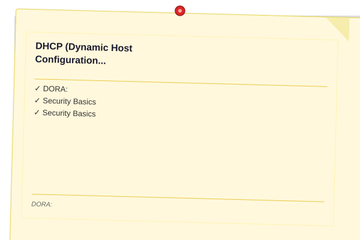
</a>


- Port: UDP 67 (server), UDP 68 (client)
- **DORA:** Discover → Offer → Request → Acknowledge
- Provides IP, subnet mask, default gateway, DNS server.

---

## 7. Security Basics

### Authentication

<a href="../../assets/images/diagrams/gate-cs-preparation/09-computer-networks/authentication-handwritten.svg" target="_blank" rel="noopener">
  
</a>
<a href="../../assets/images/diagrams/gate-cs-preparation/09-computer-networks/authentication-diagram.svg" target="_blank" rel="noopener">
  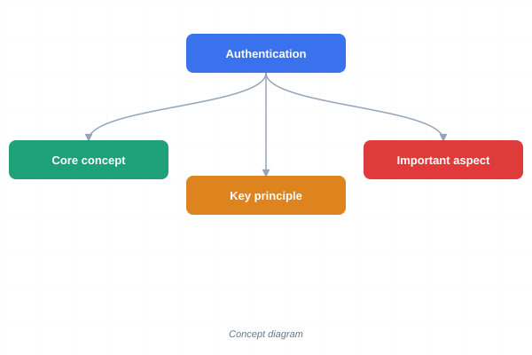
</a>
<a href="../../assets/images/diagrams/gate-cs-preparation/09-computer-networks/authentication-sticky.svg" target="_blank" rel="noopener">
  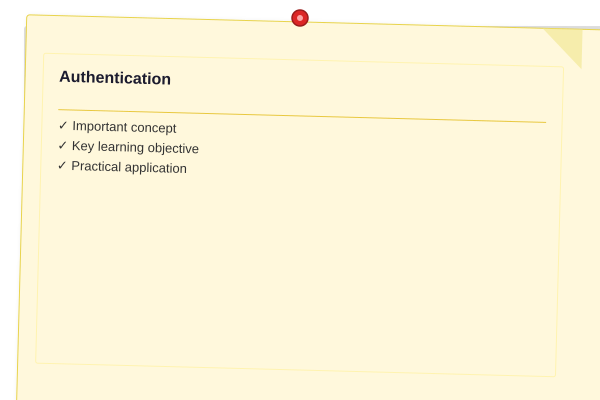
</a>


| Method | Description |
|--------|-------------|
| Password-based | Something you know |
| Token-based | Something you have |
| Biometric | Something you are |
| 2FA/MFA | Combination of above |

### Encryption

<a href="../../assets/images/diagrams/gate-cs-preparation/09-computer-networks/encryption-handwritten.svg" target="_blank" rel="noopener">
  
</a>
<a href="../../assets/images/diagrams/gate-cs-preparation/09-computer-networks/encryption-diagram.svg" target="_blank" rel="noopener">
  
</a>
<a href="../../assets/images/diagrams/gate-cs-preparation/09-computer-networks/encryption-sticky.svg" target="_blank" rel="noopener">
  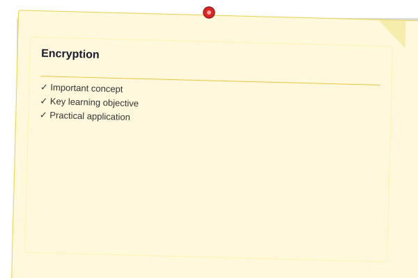
</a>


| Type | Key | Speed | Use |
|------|-----|-------|-----|
| Symmetric (AES, DES) | Single shared key | Fast | Bulk encryption |
| Asymmetric (RSA, ECC) | Public/private pair | Slow | Key exchange, signatures |

### Digital Signatures

<a href="../../assets/images/diagrams/gate-cs-preparation/09-computer-networks/digital-signatures-handwritten.svg" target="_blank" rel="noopener">
  
</a>
<a href="../../assets/images/diagrams/gate-cs-preparation/09-computer-networks/digital-signatures-diagram.svg" target="_blank" rel="noopener">
  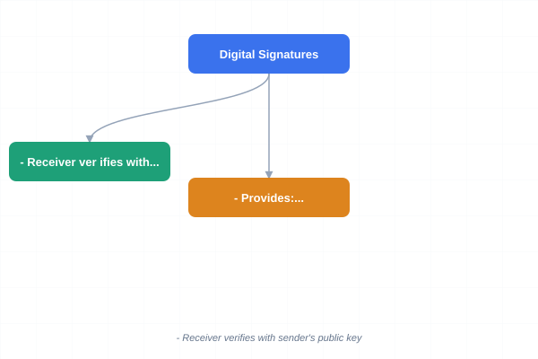
</a>
<a href="../../assets/images/diagrams/gate-cs-preparation/09-computer-networks/digital-signatures-sticky.svg" target="_blank" rel="noopener">
  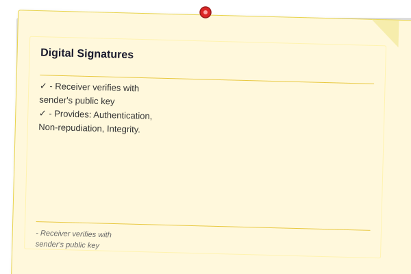
</a>


- Sender signs hash of message with private key.
- Receiver verifies with sender's public key.
- Provides: Authentication, Non-repudiation, Integrity.

### Firewall

<a href="../../assets/images/diagrams/gate-cs-preparation/09-computer-networks/firewall-handwritten.svg" target="_blank" rel="noopener">
  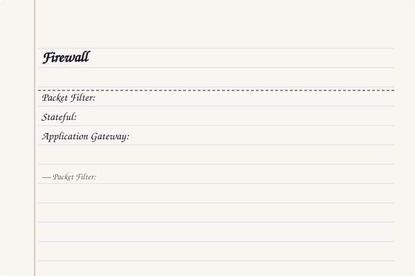
</a>
<a href="../../assets/images/diagrams/gate-cs-preparation/09-computer-networks/firewall-diagram.svg" target="_blank" rel="noopener">
  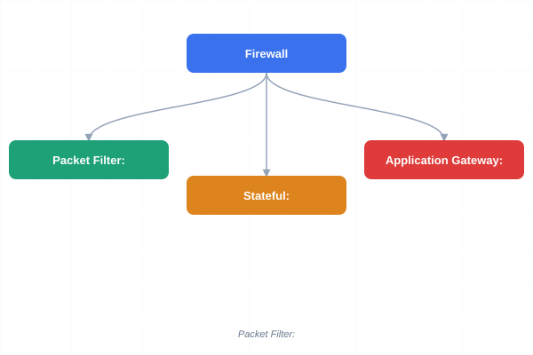
</a>
<a href="../../assets/images/diagrams/gate-cs-preparation/09-computer-networks/firewall-sticky.svg" target="_blank" rel="noopener">
  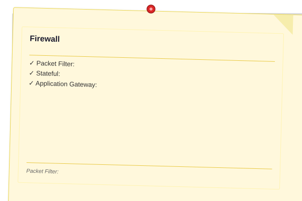
</a>


- **Packet Filter:** Checks headers (IP, port)
- **Stateful:** Tracks connection state
- **Application Gateway:** Proxies at application layer

---

## 8. Formula Reference Tables

### Performance Formulas

<a href="../../assets/images/diagrams/gate-cs-preparation/09-computer-networks/performance-formulas-handwritten.svg" target="_blank" rel="noopener">
  
</a>
<a href="../../assets/images/diagrams/gate-cs-preparation/09-computer-networks/performance-formulas-diagram.svg" target="_blank" rel="noopener">
  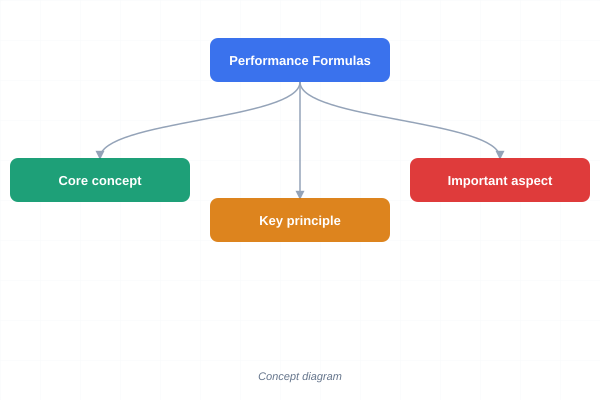
</a>
<a href="../../assets/images/diagrams/gate-cs-preparation/09-computer-networks/performance-formulas-sticky.svg" target="_blank" rel="noopener">
  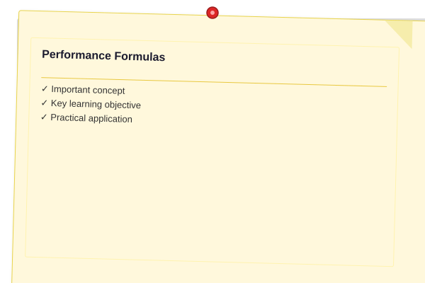
</a>


| Quantity | Formula |
|----------|---------|
| Transmission Time (T_tx) | Data Size / Bandwidth |
| Propagation Time (T_prop) | Distance / Propagation Speed |
| Efficiency (Stop-and-Wait) | `1 / (1 + 2a)` where `a = T_prop / T_tx` |
| Efficiency (Sliding Window) | `N / (1 + 2a)` for optimal N |
| Round Trip Time (RTT) | `2 � T_prop` (approx) |
| Throughput | Window Size / RTT |
| Bit Error Rate (BER) | Bits in error / Total bits |
| Utilization | Efficiency � Bandwidth |

### Error Detection Formulas

<a href="../../assets/images/diagrams/gate-cs-preparation/09-computer-networks/error-detection-formulas-handwritten.svg" target="_blank" rel="noopener">
  
</a>
<a href="../../assets/images/diagrams/gate-cs-preparation/09-computer-networks/error-detection-formulas-diagram.svg" target="_blank" rel="noopener">
  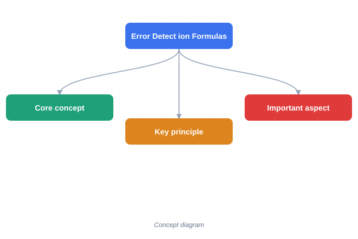
</a>
<a href="../../assets/images/diagrams/gate-cs-preparation/09-computer-networks/error-detection-formulas-sticky.svg" target="_blank" rel="noopener">
  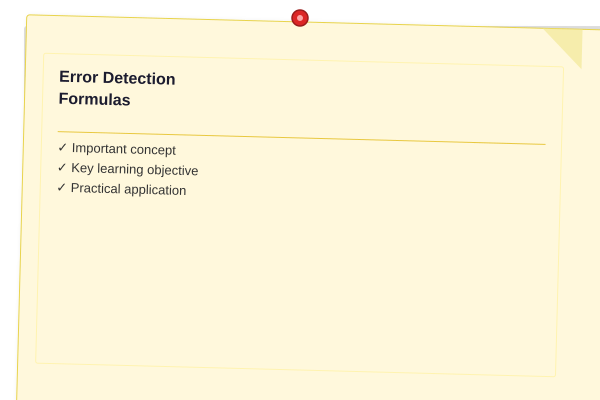
</a>


| Method | Redundancy | Detection Capability |
|--------|-----------|---------------------|
| Parity | 1 bit | Odd number of errors only |
| Checksum | 16 bits | All odd bits, most burst errors |
| CRC-r | r bits | All burst ≤ r, all odd errors, single-bit |

### Hamming Code Formulas

<a href="../../assets/images/diagrams/gate-cs-preparation/09-computer-networks/hamming-code-formulas-handwritten.svg" target="_blank" rel="noopener">
  
</a>
<a href="../../assets/images/diagrams/gate-cs-preparation/09-computer-networks/hamming-code-formulas-diagram.svg" target="_blank" rel="noopener">
  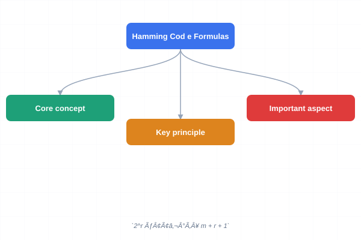
</a>
<a href="../../assets/images/diagrams/gate-cs-preparation/09-computer-networks/hamming-code-formulas-sticky.svg" target="_blank" rel="noopener">
  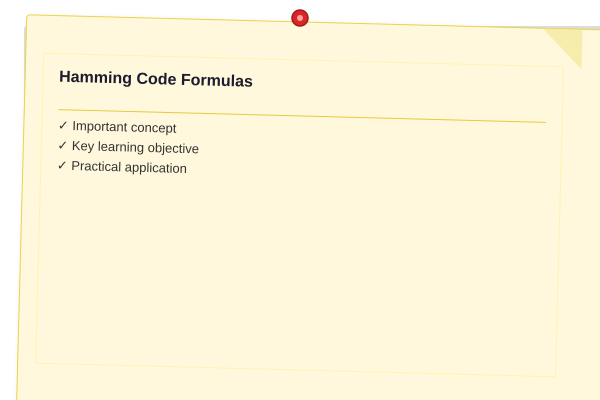
</a>


| Data Bits (m) | Parity Bits (r) | Total Bits (n) |
|---------------|-----------------|----------------|
| 4 | 3 | 7 |
| 8 | 4 | 12 |
| 16 | 5 | 21 |
| 32 | 6 | 38 |
| 64 | 7 | 71 |

Constraint: `2^r ≥ m + r + 1`

### Well-Known Port Numbers

<a href="../../assets/images/diagrams/gate-cs-preparation/09-computer-networks/well-known-port-numbers-handwritten.svg" target="_blank" rel="noopener">
  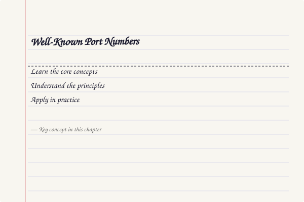
</a>
<a href="../../assets/images/diagrams/gate-cs-preparation/09-computer-networks/well-known-port-numbers-diagram.svg" target="_blank" rel="noopener">
  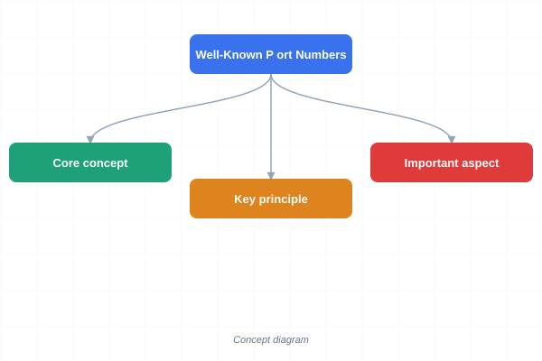
</a>
<a href="../../assets/images/diagrams/gate-cs-preparation/09-computer-networks/well-known-port-numbers-sticky.svg" target="_blank" rel="noopener">
  
</a>


| Port | Protocol | Transport |
|------|----------|-----------|
| 20 | FTP Data | TCP |
| 21 | FTP Control | TCP |
| 22 | SSH | TCP |
| 23 | Telnet | TCP |
| 25 | SMTP | TCP |
| 53 | DNS | UDP/TCP |
| 67/68 | DHCP | UDP |
| 80 | HTTP | TCP |
| 110 | POP3 | TCP |
| 143 | IMAP | TCP |
| 161 | SNMP | UDP |
| 443 | HTTPS | TCP |
| 993 | IMAPS | TCP |
| 3389 | RDP | TCP |

### TCP Flags (Mnemonic: **URGENT PUSH RST SYN FIN**)

<a href="../../assets/images/diagrams/gate-cs-preparation/09-computer-networks/tcp-flags-mnemonic-urgent-push-rst-syn-fin-handwritten.svg" target="_blank" rel="noopener">
  
</a>
<a href="../../assets/images/diagrams/gate-cs-preparation/09-computer-networks/tcp-flags-mnemonic-urgent-push-rst-syn-fin-diagram.svg" target="_blank" rel="noopener">
  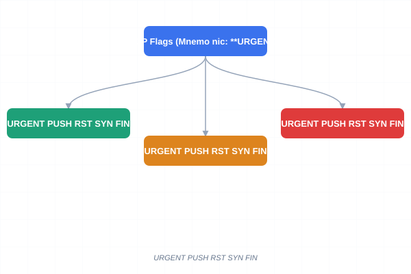
</a>
<a href="../../assets/images/diagrams/gate-cs-preparation/09-computer-networks/tcp-flags-mnemonic-urgent-push-rst-syn-fin-sticky.svg" target="_blank" rel="noopener">
  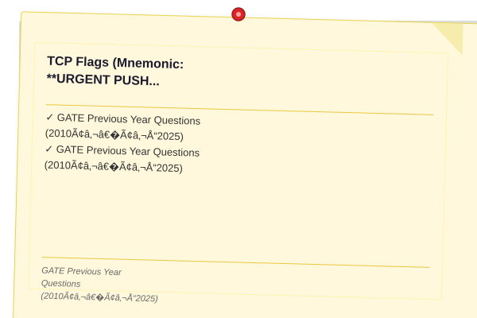
</a>


| Flag | Meaning |
|------|---------|
| URG | Urgent pointer field is valid |
| ACK | Acknowledgment field is valid |
| PSH | Push data immediately to application |
| RST | Reset connection |
| SYN | Synchronize sequence numbers |
| FIN | Finish / End connection |

---

## 9. GATE Previous Year Questions (2010�“2025)

### N1: CRC Calculation [GATE 2010, 1 Mark �� Data Link Layer]

<a href="../../assets/images/diagrams/gate-cs-preparation/09-computer-networks/n1-crc-calculation-gate-2010-1-mark-data-link-layer-handwritten.svg" target="_blank" rel="noopener">
  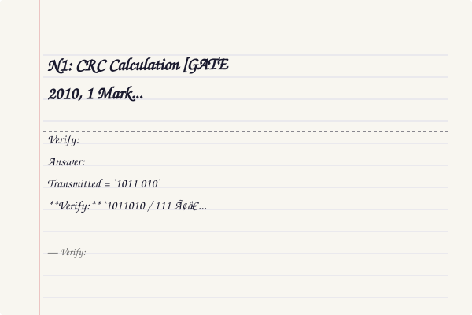
</a>
<a href="../../assets/images/diagrams/gate-cs-preparation/09-computer-networks/n1-crc-calculation-gate-2010-1-mark-data-link-layer-diagram.svg" target="_blank" rel="noopener">
  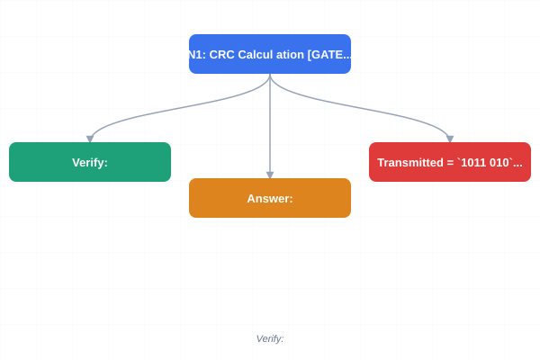
</a>
<a href="../../assets/images/diagrams/gate-cs-preparation/09-computer-networks/n1-crc-calculation-gate-2010-1-mark-data-link-layer-sticky.svg" target="_blank" rel="noopener">
  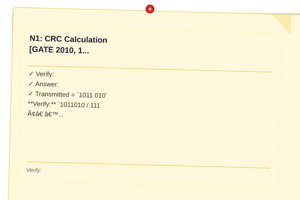
</a>


**Q:** A 4-bit message `1011` is to be transmitted. CRC polynomial is `x^2 + x + 1` (binary 111). What is the transmitted message?

**A:** Data = 1011, Generator = 111 (degree 2, so append 2 zeros)

```
10110000 ÷ 111
     10110
     111
     ----
      1010
      111
      ----
       110
       111
       ---
        01 → remainder = 01 (with degree 2, pad to 010)
```

Remainder = 010. Transmitted = `1011 010`

**Verify:** `1011010 / 111 → remainder 0` ✓

> **Answer:** 1011010

---

### N2: Hamming Code [GATE 2010, 2 Marks �� Data Link Layer]

<a href="../../assets/images/diagrams/gate-cs-preparation/09-computer-networks/n2-hamming-code-gate-2010-2-marks-data-link-layer-handwritten.svg" target="_blank" rel="noopener">
  
</a>
<a href="../../assets/images/diagrams/gate-cs-preparation/09-computer-networks/n2-hamming-code-gate-2010-2-marks-data-link-layer-diagram.svg" target="_blank" rel="noopener">
  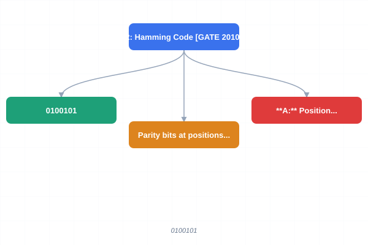
</a>
<a href="../../assets/images/diagrams/gate-cs-preparation/09-computer-networks/n2-hamming-code-gate-2010-2-marks-data-link-layer-sticky.svg" target="_blank" rel="noopener">
  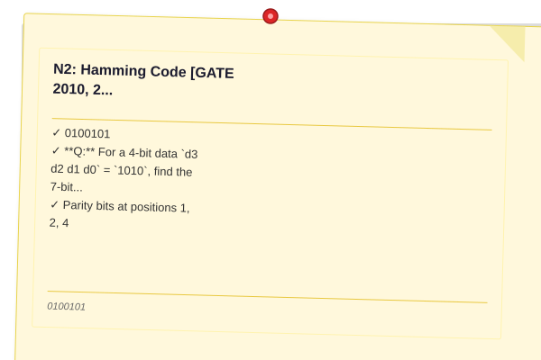
</a>


**Q:** For a 4-bit data `d3 d2 d1 d0` = `1010`, find the 7-bit Hamming code with even parity. Parity bits at positions 1, 2, 4.

**A:** Position assignment: p1 at 1, p2 at 2, d1 at 3, p4 at 4, d2 at 5, d3 at 6, d4 at 7.

Bits: `d4=1` at 7, `d3=0` at 6, `d2=1` at 5, `d1=0` at 3

- p1 covers positions 1, 3, 5, 7: p1 + 0 + 1 + 1 = even → p1 = 0
- p2 covers positions 2, 3, 6, 7: p2 + 0 + 0 + 1 = even → p2 = 1
- p4 covers positions 4, 5, 6, 7: p4 + 1 + 0 + 1 = even → p4 = 0

Final codeword: `p1 p2 d1 p4 d2 d3 d4` = `0 1 0 0 1 0 1` = **0100101**

---

### N3: Stop-and-Wait Efficiency [GATE 2011, 2 Marks �� Data Link Layer]

<a href="../../assets/images/diagrams/gate-cs-preparation/09-computer-networks/n3-stop-and-wait-efficiency-gate-2011-2-marks-data-link-layer-handwritten.svg" target="_blank" rel="noopener">
  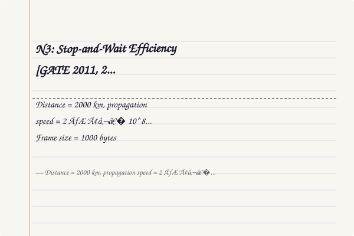
</a>
<a href="../../assets/images/diagrams/gate-cs-preparation/09-computer-networks/n3-stop-and-wait-efficiency-gate-2011-2-marks-data-link-layer-diagram.svg" target="_blank" rel="noopener">
  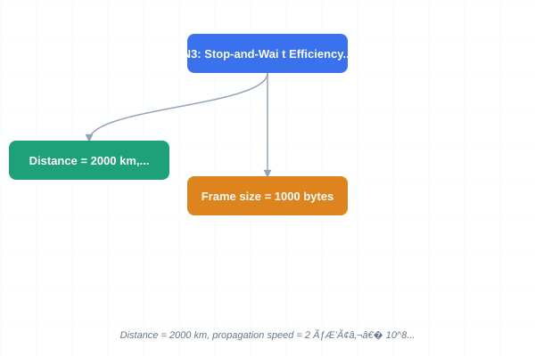
</a>
<a href="../../assets/images/diagrams/gate-cs-preparation/09-computer-networks/n3-stop-and-wait-efficiency-gate-2011-2-marks-data-link-layer-sticky.svg" target="_blank" rel="noopener">
  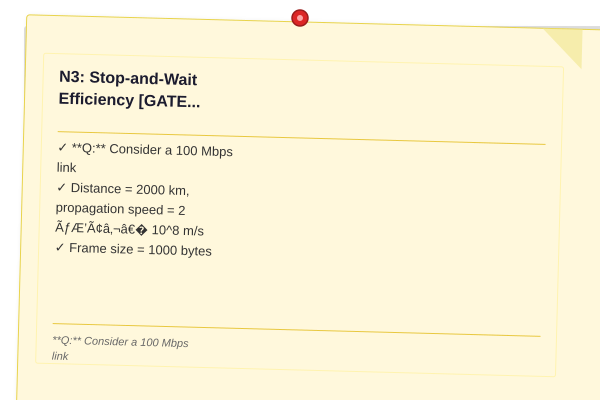
</a>


**Q:** Consider a 100 Mbps link. Distance = 2000 km, propagation speed = 2 � 10^8 m/s. Frame size = 1000 bytes. What is the efficiency?

**A:**
- T_tx = (1000 � 8) / (100 � 10^6) = 8000 / 10^8 = 80 μs
- T_prop = (2000 � 10^3) / (2 � 10^8) = 0.01 s = 10 ms
- a = T_prop / T_tx = 10000 / 80 = 125
- η = 1 / (1 + 2a) = 1 / (1 + 250) = 1/251 ≈ 0.398%

---

### N4: Subnetting [GATE 2011, 2 Marks �� Network Layer]

<a href="../../assets/images/diagrams/gate-cs-preparation/09-computer-networks/n4-subnetting-gate-2011-2-marks-network-layer-handwritten.svg" target="_blank" rel="noopener">
  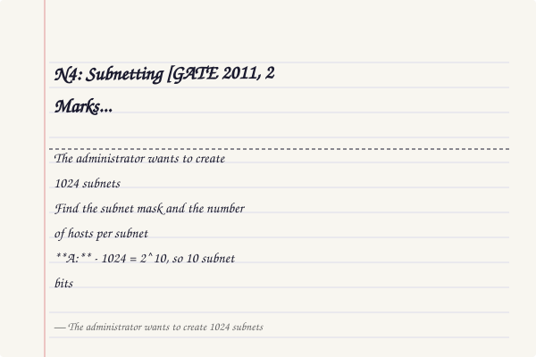
</a>
<a href="../../assets/images/diagrams/gate-cs-preparation/09-computer-networks/n4-subnetting-gate-2011-2-marks-network-layer-diagram.svg" target="_blank" rel="noopener">
  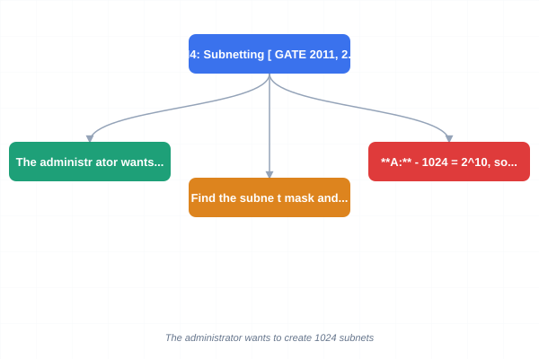
</a>
<a href="../../assets/images/diagrams/gate-cs-preparation/09-computer-networks/n4-subnetting-gate-2011-2-marks-network-layer-sticky.svg" target="_blank" rel="noopener">
  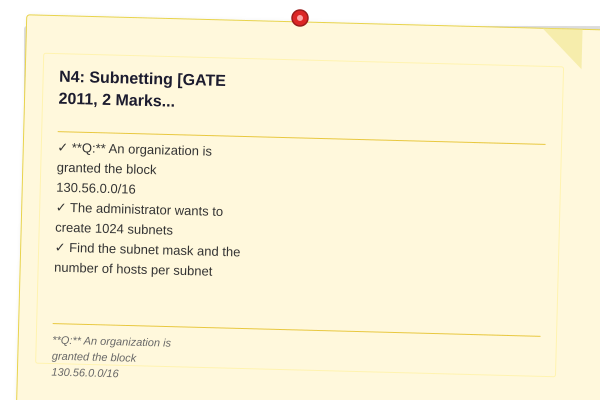
</a>


**Q:** An organization is granted the block 130.56.0.0/16. The administrator wants to create 1024 subnets. Find the subnet mask and the number of hosts per subnet.

**A:**
- 1024 = 2^10, so 10 subnet bits.
- /16 + 10 = /26.
- Subnet mask: 255.255.255.192 (26 bits).
- Host bits: 32 - 26 = 6.
- Hosts per subnet: 2^6 - 2 = 62.

---

### N5: TCP Sequence Number [GATE 2012, 1 Mark �� Transport Layer]

<a href="../../assets/images/diagrams/gate-cs-preparation/09-computer-networks/n5-tcp-sequence-number-gate-2012-1-mark-transport-layer-handwritten.svg" target="_blank" rel="noopener">
  
</a>
<a href="../../assets/images/diagrams/gate-cs-preparation/09-computer-networks/n5-tcp-sequence-number-gate-2012-1-mark-transport-layer-diagram.svg" target="_blank" rel="noopener">
  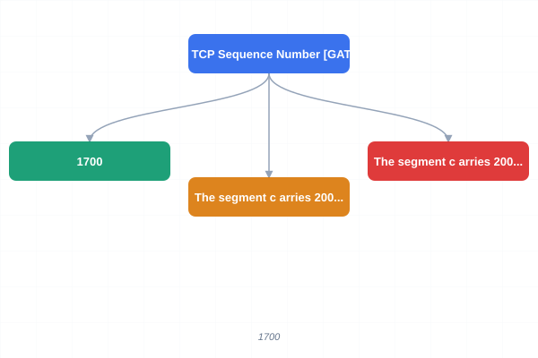
</a>
<a href="../../assets/images/diagrams/gate-cs-preparation/09-computer-networks/n5-tcp-sequence-number-gate-2012-1-mark-transport-layer-sticky.svg" target="_blank" rel="noopener">
  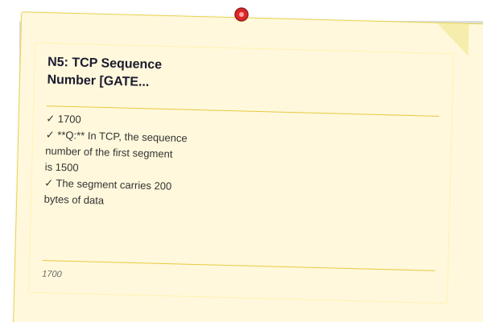
</a>


**Q:** In TCP, the sequence number of the first segment is 1500. The segment carries 200 bytes of data. What is the acknowledgment number the receiver sends back?

**A:** ACK number = Seq_no + data_length = 1500 + 200 = **1700**

---

### N6: CSMA/CD Minimum Frame Size [GATE 2012, 2 Marks �� MAC Layer]

<a href="../../assets/images/diagrams/gate-cs-preparation/09-computer-networks/n6-csma-cd-minimum-frame-size-gate-2012-2-marks-mac-layer-handwritten.svg" target="_blank" rel="noopener">
  
</a>
<a href="../../assets/images/diagrams/gate-cs-preparation/09-computer-networks/n6-csma-cd-minimum-frame-size-gate-2012-2-marks-mac-layer-diagram.svg" target="_blank" rel="noopener">
  
</a>
<a href="../../assets/images/diagrams/gate-cs-preparation/09-computer-networks/n6-csma-cd-minimum-frame-size-gate-2012-2-marks-mac-layer-sticky.svg" target="_blank" rel="noopener">
  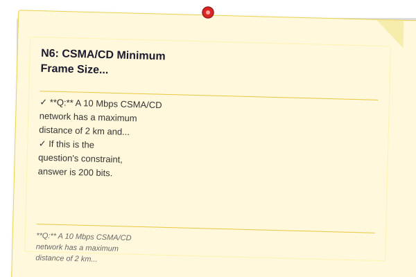
</a>


**Q:** A 10 Mbps CSMA/CD network has a maximum distance of 2 km and propagation speed of 2 � 10^8 m/s. What is the minimum frame size?

**A:**
- T_prop = 2000 / (2 � 10^8) = 10 μs
- 2 � T_prop = 20 μs
- Minimum frame size (in bits) = 2 � T_prop � B = 20 � 10^-6 � 10 � 10^6 = 200 bits
- Min frame = 200 bits = 25 bytes
- But Ethernet enforces minimum 64 bytes. If this is the question's constraint, answer is 200 bits.

---

### N7: RIP Hop Count [GATE 2012, 1 Mark �� Network Layer]

<a href="../../assets/images/diagrams/gate-cs-preparation/09-computer-networks/n7-rip-hop-count-gate-2012-1-mark-network-layer-handwritten.svg" target="_blank" rel="noopener">
  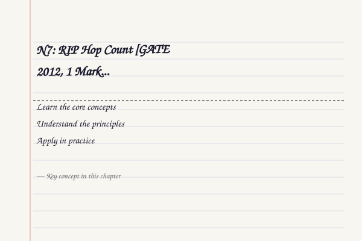
</a>
<a href="../../assets/images/diagrams/gate-cs-preparation/09-computer-networks/n7-rip-hop-count-gate-2012-1-mark-network-layer-diagram.svg" target="_blank" rel="noopener">
  
</a>
<a href="../../assets/images/diagrams/gate-cs-preparation/09-computer-networks/n7-rip-hop-count-gate-2012-1-mark-network-layer-sticky.svg" target="_blank" rel="noopener">
  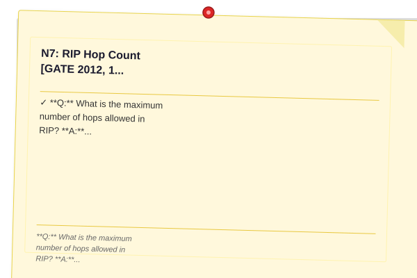
</a>


**Q:** What is the maximum number of hops allowed in RIP?

**A:** **15.** (Infinity = 16, meaning unreachable.)

---

### N8: Classful Addressing [GATE 2012, 1 Mark �� Network Layer]

<a href="../../assets/images/diagrams/gate-cs-preparation/09-computer-networks/n8-classful-addressing-gate-2012-1-mark-network-layer-handwritten.svg" target="_blank" rel="noopener">
  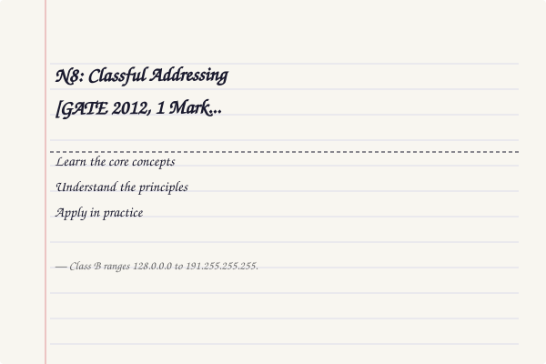
</a>
<a href="../../assets/images/diagrams/gate-cs-preparation/09-computer-networks/n8-classful-addressing-gate-2012-1-mark-network-layer-diagram.svg" target="_blank" rel="noopener">
  
</a>
<a href="../../assets/images/diagrams/gate-cs-preparation/09-computer-networks/n8-classful-addressing-gate-2012-1-mark-network-layer-sticky.svg" target="_blank" rel="noopener">
  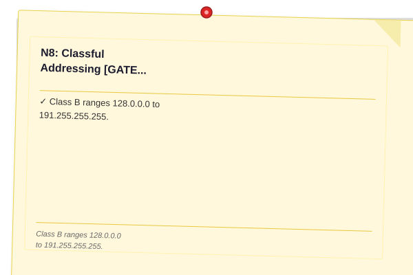
</a>


**Q:** Which of the following IP addresses is not a valid Class B address?

A) 128.0.0.1  B) 172.16.0.1  C) 191.1.2.3  D) 192.168.0.1

**A:** **D** �� 192 starts with bits `110`, which is Class C. Class B ranges 128.0.0.0 to 191.255.255.255.

---

### N9: CRC Generator [GATE 2013, 2 Marks �� Data Link Layer]

<a href="../../assets/images/diagrams/gate-cs-preparation/09-computer-networks/n9-crc-generator-gate-2013-2-marks-data-link-layer-handwritten.svg" target="_blank" rel="noopener">
  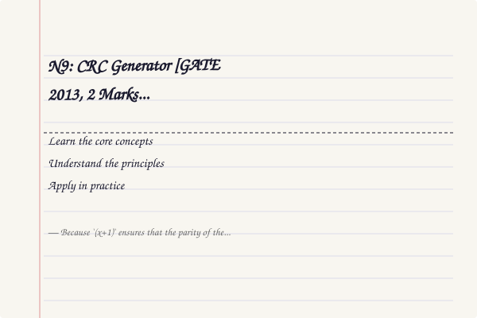
</a>
<a href="../../assets/images/diagrams/gate-cs-preparation/09-computer-networks/n9-crc-generator-gate-2013-2-marks-data-link-layer-diagram.svg" target="_blank" rel="noopener">
  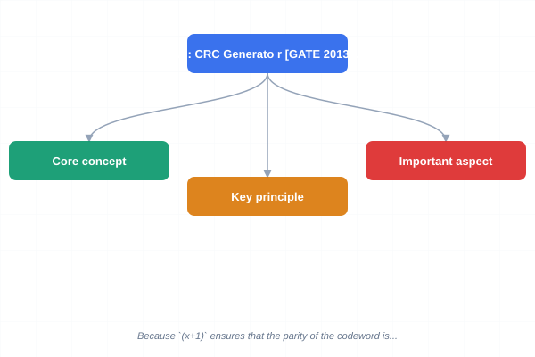
</a>
<a href="../../assets/images/diagrams/gate-cs-preparation/09-computer-networks/n9-crc-generator-gate-2013-2-marks-data-link-layer-sticky.svg" target="_blank" rel="noopener">
  
</a>


**Q:** Which generator polynomial can detect all odd number of errors?

**A:** Any polynomial with `(x+1)` as a factor. Because `(x+1)` ensures that the parity of the codeword is even, detecting any odd number of flips.

---

### N10: Sliding Window [GATE 2014, 2 Marks �� Data Link Layer]

<a href="../../assets/images/diagrams/gate-cs-preparation/09-computer-networks/n10-sliding-window-gate-2014-2-marks-data-link-layer-handwritten.svg" target="_blank" rel="noopener">
  
</a>
<a href="../../assets/images/diagrams/gate-cs-preparation/09-computer-networks/n10-sliding-window-gate-2014-2-marks-data-link-layer-diagram.svg" target="_blank" rel="noopener">
  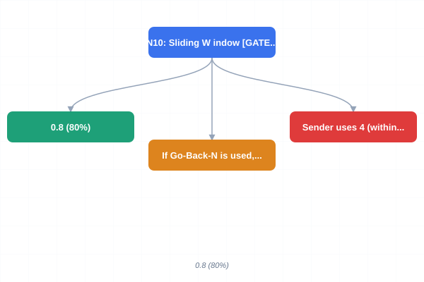
</a>
<a href="../../assets/images/diagrams/gate-cs-preparation/09-computer-networks/n10-sliding-window-gate-2014-2-marks-data-link-layer-sticky.svg" target="_blank" rel="noopener">
  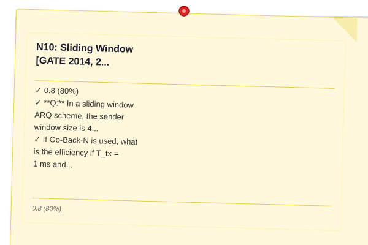
</a>


**Q:** In a sliding window ARQ scheme, the sender window size is 4 and sequence numbers are 3 bits. If Go-Back-N is used, what is the efficiency if T_tx = 1 ms and T_prop = 2 ms?

**A:**
- Max window = 2^3 - 1 = 7. Sender uses 4 (within limit).
- a = T_prop / T_tx = 2/1 = 2
- N = 4
- η = N / (1 + 2a) = 4 / (1 + 4) = 4/5 = **0.8 (80%)**

---

### N11: IPv4 Header Length [GATE 2014, 1 Mark �� Network Layer]

<a href="../../assets/images/diagrams/gate-cs-preparation/09-computer-networks/n11-ipv4-header-length-gate-2014-1-mark-network-layer-handwritten.svg" target="_blank" rel="noopener">
  
</a>
<a href="../../assets/images/diagrams/gate-cs-preparation/09-computer-networks/n11-ipv4-header-length-gate-2014-1-mark-network-layer-diagram.svg" target="_blank" rel="noopener">
  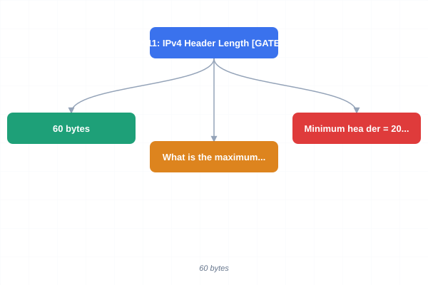
</a>
<a href="../../assets/images/diagrams/gate-cs-preparation/09-computer-networks/n11-ipv4-header-length-gate-2014-1-mark-network-layer-sticky.svg" target="_blank" rel="noopener">
  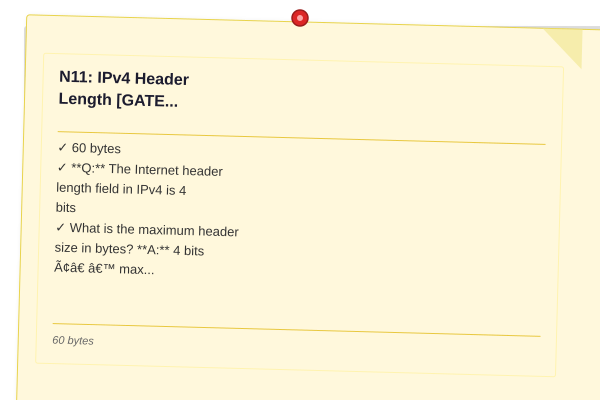
</a>


**Q:** The Internet header length field in IPv4 is 4 bits. What is the maximum header size in bytes?

**A:** 4 bits → max value 15 (scaled by 4 = 60 bytes). Minimum header = 20 bytes (value 5). Answer: **60 bytes**.

---

### N12: TCP Slow Start [GATE 2014, 2 Marks �� Transport Layer]

<a href="../../assets/images/diagrams/gate-cs-preparation/09-computer-networks/n12-tcp-slow-start-gate-2014-2-marks-transport-layer-handwritten.svg" target="_blank" rel="noopener">
  
</a>
<a href="../../assets/images/diagrams/gate-cs-preparation/09-computer-networks/n12-tcp-slow-start-gate-2014-2-marks-transport-layer-diagram.svg" target="_blank" rel="noopener">
  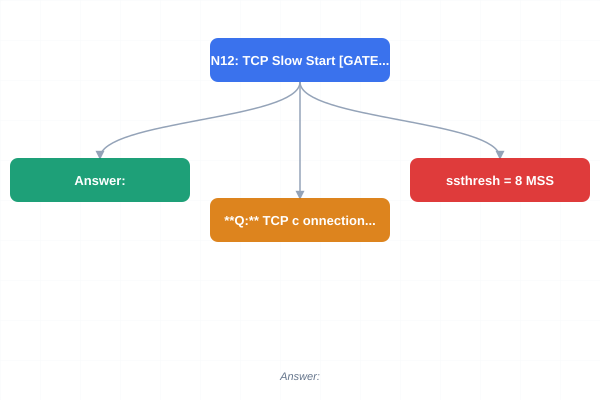
</a>
<a href="../../assets/images/diagrams/gate-cs-preparation/09-computer-networks/n12-tcp-slow-start-gate-2014-2-marks-transport-layer-sticky.svg" target="_blank" rel="noopener">
  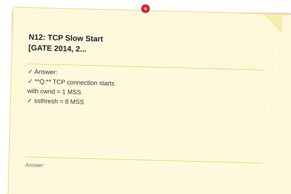
</a>


**Q:** TCP connection starts with cwnd = 1 MSS. ssthresh = 8 MSS. RTT = 10 ms. How many RTTs until cwnd reaches 12 MSS? Assume no losses.

**A:**
- RTT1: cwnd = 1 → 2
- RTT2: cwnd = 2 → 4
- RTT3: cwnd = 4 → 8 (ssthresh reached)
- RTT4: cwnd = 8 → 9 (congestion avoidance: +1 per RTT)
- RTT5: cwnd = 9 → 10
- RTT6: cwnd = 10 → 11
- RTT7: cwnd = 11 → 12

**Answer:** 7 RTTs.

---

### N13: Dijkstra's Algorithm [GATE 2014, 2 Marks �� Network Layer]

<a href="../../assets/images/diagrams/gate-cs-preparation/09-computer-networks/n13-dijkstra-s-algorithm-gate-2014-2-marks-network-layer-handwritten.svg" target="_blank" rel="noopener">
  
</a>
<a href="../../assets/images/diagrams/gate-cs-preparation/09-computer-networks/n13-dijkstra-s-algorithm-gate-2014-2-marks-network-layer-diagram.svg" target="_blank" rel="noopener">
  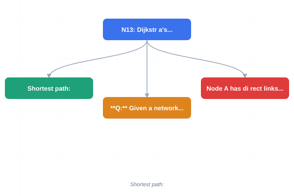
</a>
<a href="../../assets/images/diagrams/gate-cs-preparation/09-computer-networks/n13-dijkstra-s-algorithm-gate-2014-2-marks-network-layer-sticky.svg" target="_blank" rel="noopener">
  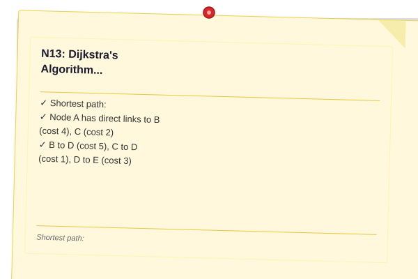
</a>


**Q:** Given a network with 5 nodes. Node A has direct links to B (cost 4), C (cost 2). B to D (cost 5), C to D (cost 1), D to E (cost 3). Find shortest path from A to E using Dijkstra's algorithm.

**A:**
- A: dist(A)=0
- Distances from A: A→C=2 (min), A→B=4
- Choose C. C→D=1, so A→D = 2+1=3
- Choose D (dist=3). D→E=3, so A→E = 3+3=6
- Choose B (dist=4). B→D=5 gives A→D = 9 (worse, ignore)
- Choose E (dist=6)
- **Shortest path:** A→C→D→E, cost = 6

---

### N14: ARP Protocol Operation [GATE 2015, 1 Mark �� Network Layer]

<a href="../../assets/images/diagrams/gate-cs-preparation/09-computer-networks/n14-arp-protocol-operation-gate-2015-1-mark-network-layer-handwritten.svg" target="_blank" rel="noopener">
  
</a>
<a href="../../assets/images/diagrams/gate-cs-preparation/09-computer-networks/n14-arp-protocol-operation-gate-2015-1-mark-network-layer-diagram.svg" target="_blank" rel="noopener">
  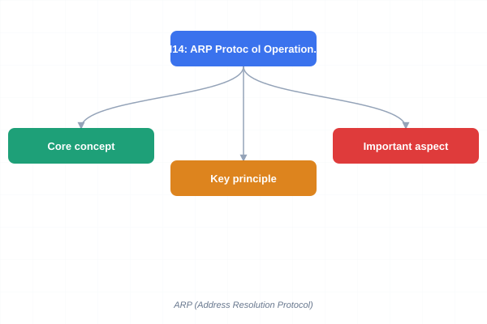
</a>
<a href="../../assets/images/diagrams/gate-cs-preparation/09-computer-networks/n14-arp-protocol-operation-gate-2015-1-mark-network-layer-sticky.svg" target="_blank" rel="noopener">
  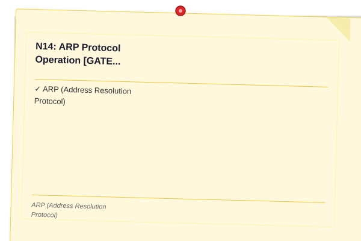
</a>


**Q:** What protocol does a host use to find the MAC address corresponding to an IP address?

**A:** **ARP (Address Resolution Protocol)**

---

### N15: Selective Repeat Window [GATE 2015, 2 Marks �� Data Link Layer]

<a href="../../assets/images/diagrams/gate-cs-preparation/09-computer-networks/n15-selective-repeat-window-gate-2015-2-marks-data-link-layer-handwritten.svg" target="_blank" rel="noopener">
  
</a>
<a href="../../assets/images/diagrams/gate-cs-preparation/09-computer-networks/n15-selective-repeat-window-gate-2015-2-marks-data-link-layer-diagram.svg" target="_blank" rel="noopener">
  
</a>
<a href="../../assets/images/diagrams/gate-cs-preparation/09-computer-networks/n15-selective-repeat-window-gate-2015-2-marks-data-link-layer-sticky.svg" target="_blank" rel="noopener">
  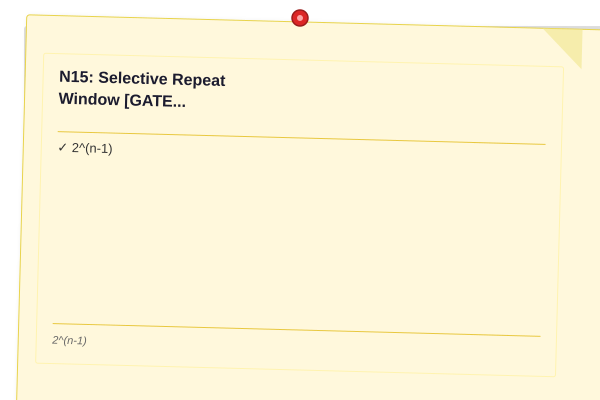
</a>


**Q:** In Selective Repeat, if sequence number field is n bits, what is the maximum sender window size?

**A:** **2^(n-1)**

---

### N16: Pure ALOHA Throughput [GATE 2015, 1 Mark �� MAC Layer]

<a href="../../assets/images/diagrams/gate-cs-preparation/09-computer-networks/n16-pure-aloha-throughput-gate-2015-1-mark-mac-layer-handwritten.svg" target="_blank" rel="noopener">
  
</a>
<a href="../../assets/images/diagrams/gate-cs-preparation/09-computer-networks/n16-pure-aloha-throughput-gate-2015-1-mark-mac-layer-diagram.svg" target="_blank" rel="noopener">
  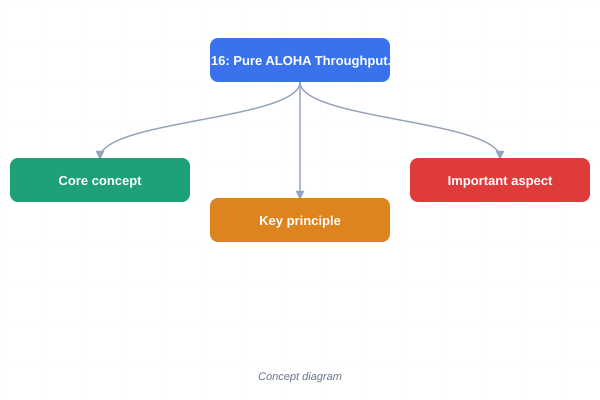
</a>
<a href="../../assets/images/diagrams/gate-cs-preparation/09-computer-networks/n16-pure-aloha-throughput-gate-2015-1-mark-mac-layer-sticky.svg" target="_blank" rel="noopener">
  
</a>


**Q:** In Pure ALOHA, the maximum throughput (S) occurs at what value of G?

**A:** G = 0.5, S_max = 0.184

---

### N17: CIDR Aggregation [GATE 2016, 2 Marks �� Network Layer]

<a href="../../assets/images/diagrams/gate-cs-preparation/09-computer-networks/n17-cidr-aggregation-gate-2016-2-marks-network-layer-handwritten.svg" target="_blank" rel="noopener">
  
</a>
<a href="../../assets/images/diagrams/gate-cs-preparation/09-computer-networks/n17-cidr-aggregation-gate-2016-2-marks-network-layer-diagram.svg" target="_blank" rel="noopener">
  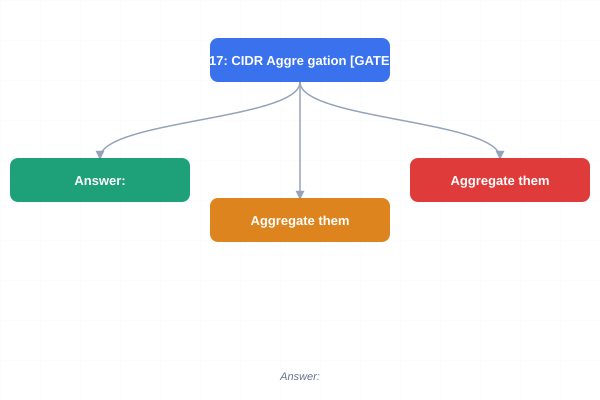
</a>
<a href="../../assets/images/diagrams/gate-cs-preparation/09-computer-networks/n17-cidr-aggregation-gate-2016-2-marks-network-layer-sticky.svg" target="_blank" rel="noopener">
  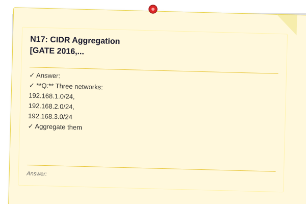
</a>


**Q:** Three networks: 192.168.1.0/24, 192.168.2.0/24, 192.168.3.0/24. Aggregate them.

**A:**
Binary of 3rd octet: 1=00000001, 2=00000010, 3=00000011
Common prefix: first 6 bits of 3rd octet match = 000000
So: 192.168.0.0/22 (8 bits from first 2 octets + 6 bits = 22)

**Answer:** 192.168.0.0/22

---

### N18: Ethernet Frame Format [GATE 2016, 1 Mark �� Data Link Layer]

<a href="../../assets/images/diagrams/gate-cs-preparation/09-computer-networks/n18-ethernet-frame-format-gate-2016-1-mark-data-link-layer-handwritten.svg" target="_blank" rel="noopener">
  
</a>
<a href="../../assets/images/diagrams/gate-cs-preparation/09-computer-networks/n18-ethernet-frame-format-gate-2016-1-mark-data-link-layer-diagram.svg" target="_blank" rel="noopener">
  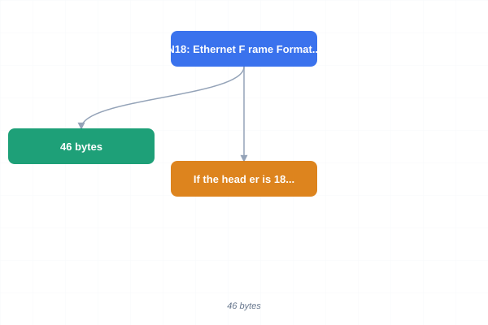
</a>
<a href="../../assets/images/diagrams/gate-cs-preparation/09-computer-networks/n18-ethernet-frame-format-gate-2016-1-mark-data-link-layer-sticky.svg" target="_blank" rel="noopener">
  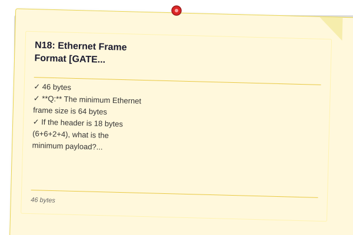
</a>


**Q:** The minimum Ethernet frame size is 64 bytes. If the header is 18 bytes (6+6+2+4), what is the minimum payload?

**A:** 64 - 18 = **46 bytes**

---

### N19: TCP Tahoe vs Reno [GATE 2016, 2 Marks �� Transport Layer]

<a href="../../assets/images/diagrams/gate-cs-preparation/09-computer-networks/n19-tcp-tahoe-vs-reno-gate-2016-2-marks-transport-layer-handwritten.svg" target="_blank" rel="noopener">
  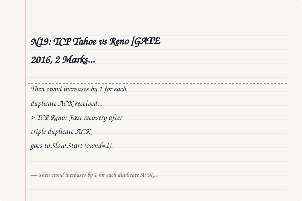
</a>
<a href="../../assets/images/diagrams/gate-cs-preparation/09-computer-networks/n19-tcp-tahoe-vs-reno-gate-2016-2-marks-transport-layer-diagram.svg" target="_blank" rel="noopener">
  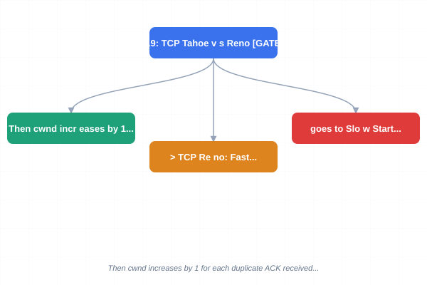
</a>
<a href="../../assets/images/diagrams/gate-cs-preparation/09-computer-networks/n19-tcp-tahoe-vs-reno-gate-2016-2-marks-transport-layer-sticky.svg" target="_blank" rel="noopener">
  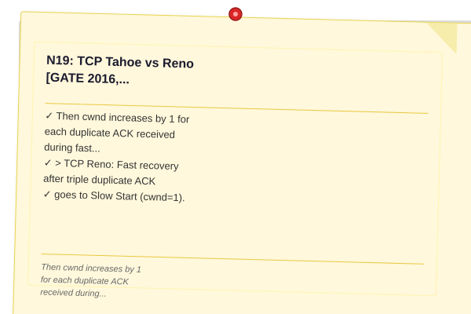
</a>


**Q:** In TCP Reno, when 3 duplicate ACKs are received, what happens to cwnd and ssthresh?

**A:** ssthresh = cwnd/2, cwnd = ssthresh (enters fast recovery). Then cwnd increases by 1 for each duplicate ACK received during fast recovery.

> TCP Reno: Fast recovery after triple duplicate ACK. Tahoe: goes to Slow Start (cwnd=1).

---

### N20: Subnet Mask Calculation [GATE 2016, 1 Mark �� Network Layer]

<a href="../../assets/images/diagrams/gate-cs-preparation/09-computer-networks/n20-subnet-mask-calculation-gate-2016-1-mark-network-layer-handwritten.svg" target="_blank" rel="noopener">
  
</a>
<a href="../../assets/images/diagrams/gate-cs-preparation/09-computer-networks/n20-subnet-mask-calculation-gate-2016-1-mark-network-layer-diagram.svg" target="_blank" rel="noopener">
  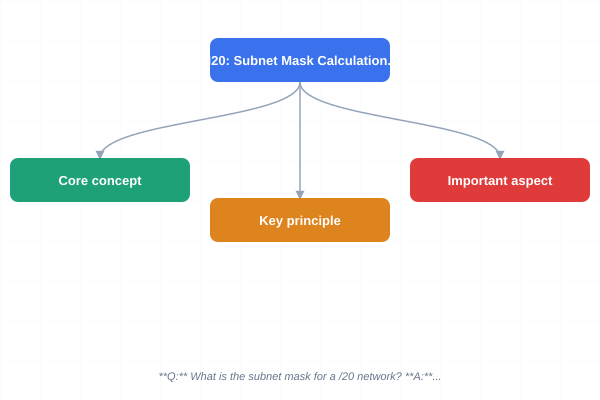
</a>
<a href="../../assets/images/diagrams/gate-cs-preparation/09-computer-networks/n20-subnet-mask-calculation-gate-2016-1-mark-network-layer-sticky.svg" target="_blank" rel="noopener">
  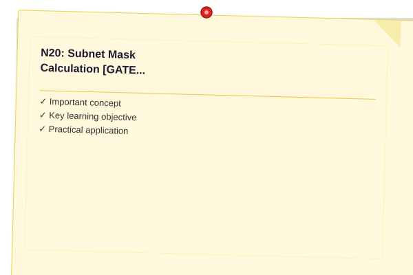
</a>


**Q:** What is the subnet mask for a /20 network?

**A:** /20 = 8 + 8 + 4 bits = 255.255.240.0

---

### N21: Hamming Distance [GATE 2017, 1 Mark �� Data Link Layer]

<a href="../../assets/images/diagrams/gate-cs-preparation/09-computer-networks/n21-hamming-distance-gate-2017-1-mark-data-link-layer-handwritten.svg" target="_blank" rel="noopener">
  
</a>
<a href="../../assets/images/diagrams/gate-cs-preparation/09-computer-networks/n21-hamming-distance-gate-2017-1-mark-data-link-layer-diagram.svg" target="_blank" rel="noopener">
  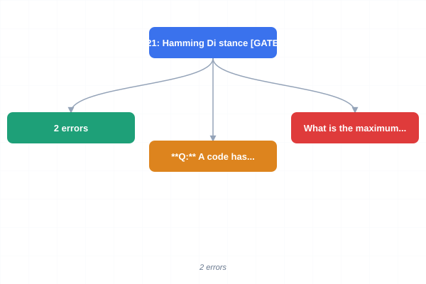
</a>
<a href="../../assets/images/diagrams/gate-cs-preparation/09-computer-networks/n21-hamming-distance-gate-2017-1-mark-data-link-layer-sticky.svg" target="_blank" rel="noopener">
  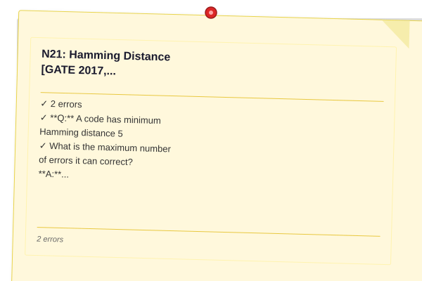
</a>


**Q:** A code has minimum Hamming distance 5. What is the maximum number of errors it can correct?

**A:** Correction: t = ⌊(d_min - 1)/2⌋ = ⌊(5-1)/2⌋ = **2 errors**

---

### N22: IP Fragmentation [GATE 2017, 2 Marks �� Network Layer]

<a href="../../assets/images/diagrams/gate-cs-preparation/09-computer-networks/n22-ip-fragmentation-gate-2017-2-marks-network-layer-handwritten.svg" target="_blank" rel="noopener">
  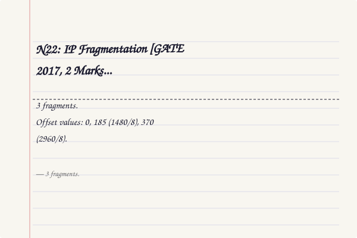
</a>
<a href="../../assets/images/diagrams/gate-cs-preparation/09-computer-networks/n22-ip-fragmentation-gate-2017-2-marks-network-layer-diagram.svg" target="_blank" rel="noopener">
  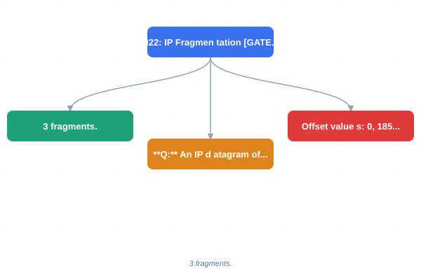
</a>
<a href="../../assets/images/diagrams/gate-cs-preparation/09-computer-networks/n22-ip-fragmentation-gate-2017-2-marks-network-layer-sticky.svg" target="_blank" rel="noopener">
  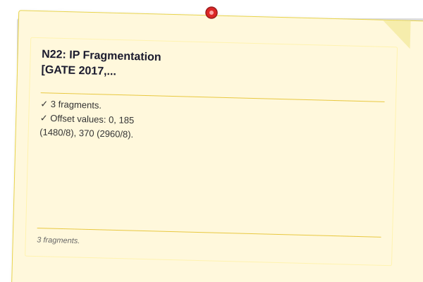
</a>


**Q:** An IP datagram of 4000 bytes (20 byte header + 3980 data) arrives at a router with MTU 1500 bytes. How many fragments?

**A:**
Each fragment: max 1480 data (1500 - 20 header)
Fragment 1: data bytes 0-1479
Fragment 2: data bytes 1480-2959
Fragment 3: data bytes 2960-3979 (only 1020 bytes)
**3 fragments.** MF flag = 1 for first two, 0 for last. Offset values: 0, 185 (1480/8), 370 (2960/8).

---

### N23: CSMA/CD Persistence [GATE 2017, 1 Mark �� MAC Layer]

<a href="../../assets/images/diagrams/gate-cs-preparation/09-computer-networks/n23-csma-cd-persistence-gate-2017-1-mark-mac-layer-handwritten.svg" target="_blank" rel="noopener">
  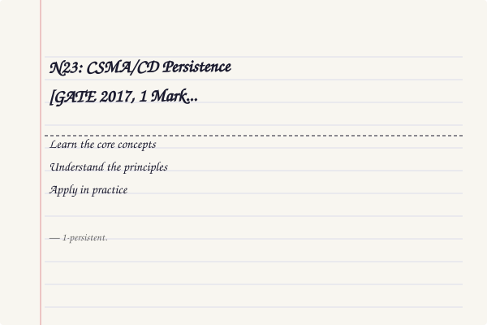
</a>
<a href="../../assets/images/diagrams/gate-cs-preparation/09-computer-networks/n23-csma-cd-persistence-gate-2017-1-mark-mac-layer-diagram.svg" target="_blank" rel="noopener">
  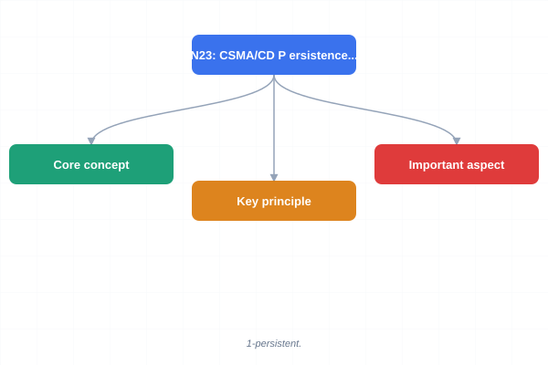
</a>
<a href="../../assets/images/diagrams/gate-cs-preparation/09-computer-networks/n23-csma-cd-persistence-gate-2017-1-mark-mac-layer-sticky.svg" target="_blank" rel="noopener">
  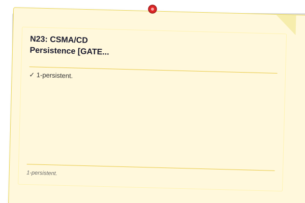
</a>


**Q:** In which persistence mode does the station transmit immediately if the channel is idle?

**A:** **1-persistent.** It senses the channel and transmits immediately when idle; if busy, it keeps sensing until idle.

---

### N24: UDP Checksum [GATE 2017, 1 Mark �� Transport Layer]

<a href="../../assets/images/diagrams/gate-cs-preparation/09-computer-networks/n24-udp-checksum-gate-2017-1-mark-transport-layer-handwritten.svg" target="_blank" rel="noopener">
  
</a>
<a href="../../assets/images/diagrams/gate-cs-preparation/09-computer-networks/n24-udp-checksum-gate-2017-1-mark-transport-layer-diagram.svg" target="_blank" rel="noopener">
  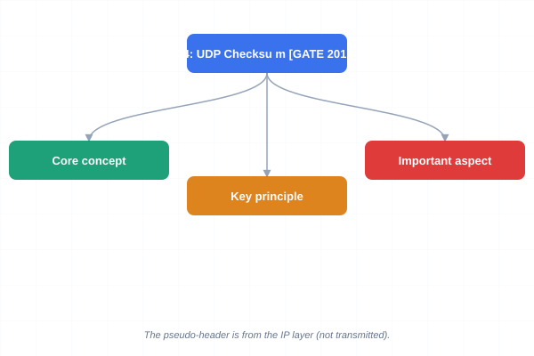
</a>
<a href="../../assets/images/diagrams/gate-cs-preparation/09-computer-networks/n24-udp-checksum-gate-2017-1-mark-transport-layer-sticky.svg" target="_blank" rel="noopener">
  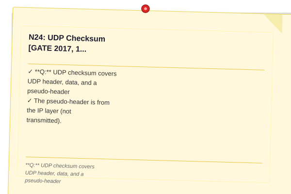
</a>


**Q:** UDP checksum covers UDP header, data, and a pseudo-header. What fields are in the pseudo-header?

**A:** Source IP (32), Dest IP (32), Protocol (8), UDP Length (16), and reserved byte (0). The pseudo-header is from the IP layer (not transmitted).

---

### N25: Distance Vector Routing [GATE 2018, 2 Marks �� Network Layer]

<a href="../../assets/images/diagrams/gate-cs-preparation/09-computer-networks/n25-distance-vector-routing-gate-2018-2-marks-network-layer-handwritten.svg" target="_blank" rel="noopener">
  
</a>
<a href="../../assets/images/diagrams/gate-cs-preparation/09-computer-networks/n25-distance-vector-routing-gate-2018-2-marks-network-layer-diagram.svg" target="_blank" rel="noopener">
  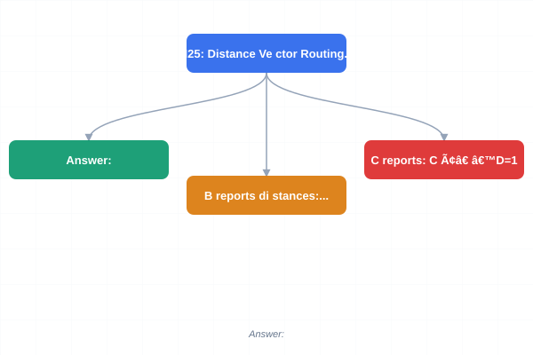
</a>
<a href="../../assets/images/diagrams/gate-cs-preparation/09-computer-networks/n25-distance-vector-routing-gate-2018-2-marks-network-layer-sticky.svg" target="_blank" rel="noopener">
  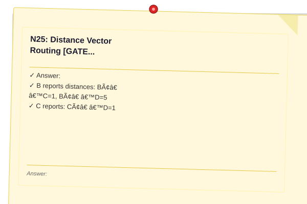
</a>


**Q:** In distance vector routing, node A has: A→B=2, A→C=3. B reports distances: B→C=1, B→D=5. C reports: C→D=1. What is the new shortest distance from A to D?

**A:**
- Via B: cost(A→B) + cost(B→D) = 2 + 5 = 7
- Via C (best known): A→C=3, C→D=1, so 3+1=4
- Via B→C→D: A→B + B→C + C→D = 2 + 1 + 1 = 4 (also 4)
- **Answer:** 4

---

### N26: TCP Sequence Number Wrap [GATE 2018, 1 Mark �� Transport Layer]

<a href="../../assets/images/diagrams/gate-cs-preparation/09-computer-networks/n26-tcp-sequence-number-wrap-gate-2018-1-mark-transport-layer-handwritten.svg" target="_blank" rel="noopener">
  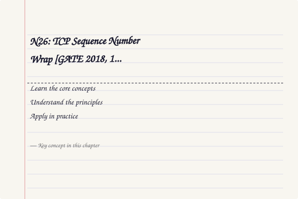
</a>
<a href="../../assets/images/diagrams/gate-cs-preparation/09-computer-networks/n26-tcp-sequence-number-wrap-gate-2018-1-mark-transport-layer-diagram.svg" target="_blank" rel="noopener">
  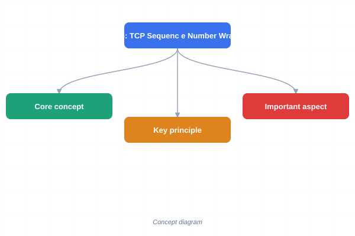
</a>
<a href="../../assets/images/diagrams/gate-cs-preparation/09-computer-networks/n26-tcp-sequence-number-wrap-gate-2018-1-mark-transport-layer-sticky.svg" target="_blank" rel="noopener">
  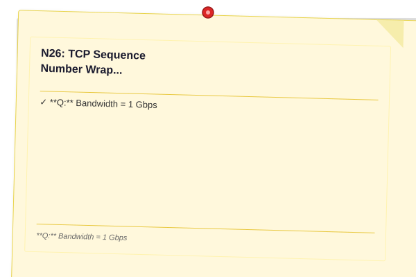
</a>


**Q:** Bandwidth = 1 Gbps. How long before TCP sequence number space (2^32) wraps around?

**A:**
Time = 2^32 bytes / (10^9 / 8 bytes/sec) = 2^32 � 8 / 10^9
= 4,294,967,296 � 8 / 10^9 = 34.36 seconds (approx 34.4 seconds)

---

### N27: Slotted ALOHA Efficiency [GATE 2018, 1 Mark �� MAC Layer]

<a href="../../assets/images/diagrams/gate-cs-preparation/09-computer-networks/n27-slotted-aloha-efficiency-gate-2018-1-mark-mac-layer-handwritten.svg" target="_blank" rel="noopener">
  
</a>
<a href="../../assets/images/diagrams/gate-cs-preparation/09-computer-networks/n27-slotted-aloha-efficiency-gate-2018-1-mark-mac-layer-diagram.svg" target="_blank" rel="noopener">
  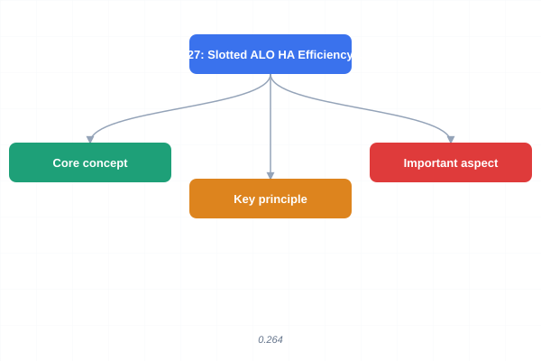
</a>
<a href="../../assets/images/diagrams/gate-cs-preparation/09-computer-networks/n27-slotted-aloha-efficiency-gate-2018-1-mark-mac-layer-sticky.svg" target="_blank" rel="noopener">
  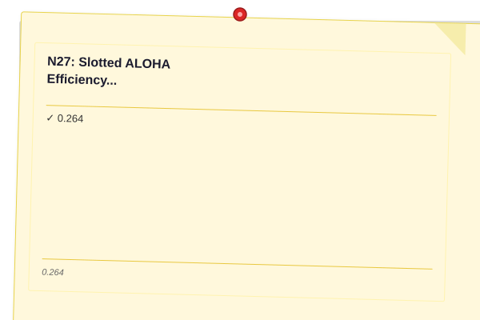
</a>


**Q:** In slotted ALOHA, what is the fraction of slots wasted due to collisions when G = 1?

**A:**
S = G � e^(-G) = 1 � e^(-1) = 0.368 (successful)
Collision probability = 1 - S - idle
Idle probability = e^(-G) = 0.368
Collisions = 1 - 0.368 - 0.368 = **0.264**

---

### N28: RIP Update Timer [GATE 2019, 1 Mark �� Network Layer]

<a href="../../assets/images/diagrams/gate-cs-preparation/09-computer-networks/n28-rip-update-timer-gate-2019-1-mark-network-layer-handwritten.svg" target="_blank" rel="noopener">
  
</a>
<a href="../../assets/images/diagrams/gate-cs-preparation/09-computer-networks/n28-rip-update-timer-gate-2019-1-mark-network-layer-diagram.svg" target="_blank" rel="noopener">
  
</a>
<a href="../../assets/images/diagrams/gate-cs-preparation/09-computer-networks/n28-rip-update-timer-gate-2019-1-mark-network-layer-sticky.svg" target="_blank" rel="noopener">
  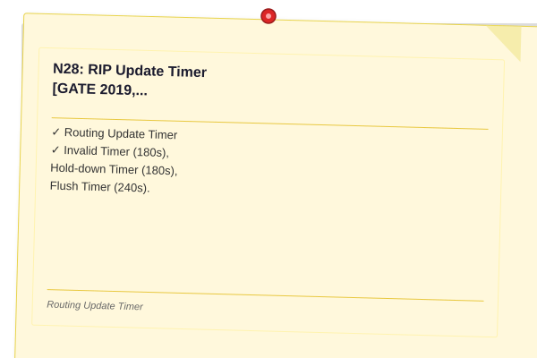
</a>


**Q:** What timer in RIP is used to trigger periodic routing updates?

**A:** **Routing Update Timer** (default 30 seconds). Also: Invalid Timer (180s), Hold-down Timer (180s), Flush Timer (240s).

---

### N29: Hosts per Subnet [GATE 2019, 2 Marks �� Network Layer]

<a href="../../assets/images/diagrams/gate-cs-preparation/09-computer-networks/n29-hosts-per-subnet-gate-2019-2-marks-network-layer-handwritten.svg" target="_blank" rel="noopener">
  
</a>
<a href="../../assets/images/diagrams/gate-cs-preparation/09-computer-networks/n29-hosts-per-subnet-gate-2019-2-marks-network-layer-diagram.svg" target="_blank" rel="noopener">
  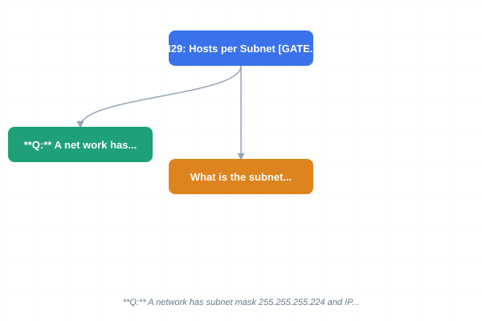
</a>
<a href="../../assets/images/diagrams/gate-cs-preparation/09-computer-networks/n29-hosts-per-subnet-gate-2019-2-marks-network-layer-sticky.svg" target="_blank" rel="noopener">
  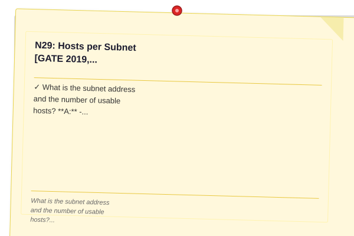
</a>


**Q:** A network has subnet mask 255.255.255.224 and IP 200.10.20.130. What is the subnet address and the number of usable hosts?

**A:**
- 224 = 11100000 (3 subnet bits, 5 host bits)
- 130 = 10000010 → network part: 10000000 = 128
- Subnet address: 200.10.20.128
- Host bits = 5, usable hosts = 2^5 - 2 = **30**

---

### N30: Go-Back-N Window [GATE 2019, 2 Marks �� Data Link Layer]

<a href="../../assets/images/diagrams/gate-cs-preparation/09-computer-networks/n30-go-back-n-window-gate-2019-2-marks-data-link-layer-handwritten.svg" target="_blank" rel="noopener">
  
</a>
<a href="../../assets/images/diagrams/gate-cs-preparation/09-computer-networks/n30-go-back-n-window-gate-2019-2-marks-data-link-layer-diagram.svg" target="_blank" rel="noopener">
  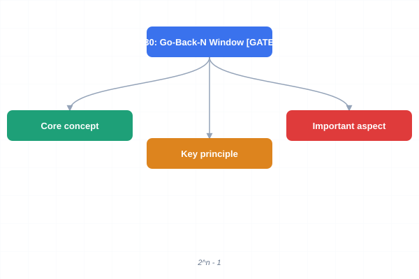
</a>
<a href="../../assets/images/diagrams/gate-cs-preparation/09-computer-networks/n30-go-back-n-window-gate-2019-2-marks-data-link-layer-sticky.svg" target="_blank" rel="noopener">
  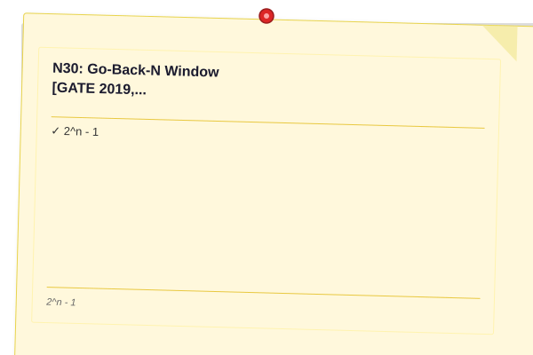
</a>


**Q:** In Go-Back-N with n-bit sequence number, maximum sender window size is:

**A:** **2^n - 1**

---

### N31: Hamming Code: Single Error Correction [GATE 2020, 2 Marks �� Data Link Layer]

<a href="../../assets/images/diagrams/gate-cs-preparation/09-computer-networks/n31-hamming-code-single-error-correction-gate-2020-2-marks-data-link-layer-handwritten.svg" target="_blank" rel="noopener">
  
</a>
<a href="../../assets/images/diagrams/gate-cs-preparation/09-computer-networks/n31-hamming-code-single-error-correction-gate-2020-2-marks-data-link-layer-diagram.svg" target="_blank" rel="noopener">
  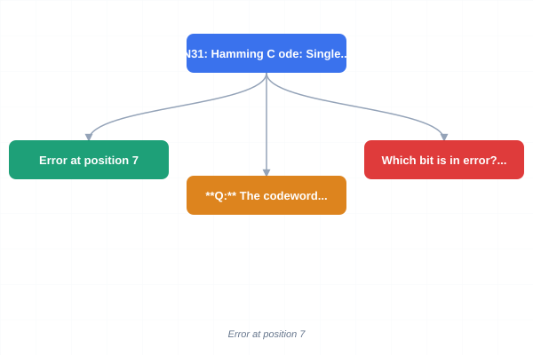
</a>
<a href="../../assets/images/diagrams/gate-cs-preparation/09-computer-networks/n31-hamming-code-single-error-correction-gate-2020-2-marks-data-link-layer-sticky.svg" target="_blank" rel="noopener">
  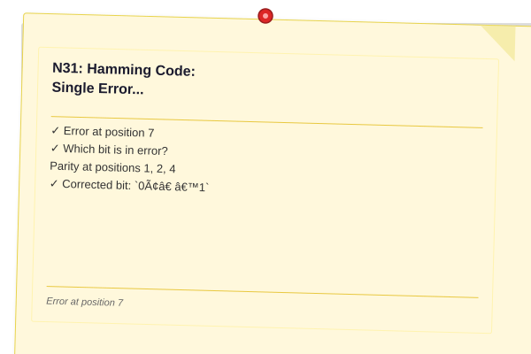
</a>


**Q:** The codeword `0110010` (7-bit Hamming) is received. Which bit is in error? Parity at positions 1, 2, 4.

**A:**
Position: 1(p1) 2(p2) 3(d1) 4(p4) 5(d2) 6(d3) 7(d4)
Received: 0      1      1      0      0      1      0

- p1 covers {1,3,5,7}: 0+1+0+0 = 1 (odd) → syndrome bit 1 = 1
- p2 covers {2,3,6,7}: 1+1+1+0 = 1 (odd) → syndrome bit 2 = 1
- p4 covers {4,5,6,7}: 0+0+1+0 = 1 (odd) → syndrome bit 4 = 1
- Syndrome = 111_2 = 7

**Error at position 7** (d4). Corrected bit: `0→1`. Codeword: `0110011`

---

### N32: OSPF Protocol Type [GATE 2020, 1 Mark �� Network Layer]

<a href="../../assets/images/diagrams/gate-cs-preparation/09-computer-networks/n32-ospf-protocol-type-gate-2020-1-mark-network-layer-handwritten.svg" target="_blank" rel="noopener">
  
</a>
<a href="../../assets/images/diagrams/gate-cs-preparation/09-computer-networks/n32-ospf-protocol-type-gate-2020-1-mark-network-layer-diagram.svg" target="_blank" rel="noopener">
  
</a>
<a href="../../assets/images/diagrams/gate-cs-preparation/09-computer-networks/n32-ospf-protocol-type-gate-2020-1-mark-network-layer-sticky.svg" target="_blank" rel="noopener">
  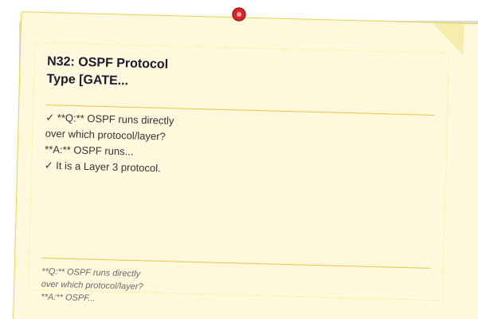
</a>


**Q:** OSPF runs directly over which protocol/layer?

**A:** OSPF runs directly over **IP** (protocol number 89). It is a Layer 3 protocol.

---

### N33: NAT and Private Addresses [GATE 2020, 1 Mark �� Network Layer]

<a href="../../assets/images/diagrams/gate-cs-preparation/09-computer-networks/n33-nat-and-private-addresses-gate-2020-1-mark-network-layer-handwritten.svg" target="_blank" rel="noopener">
  
</a>
<a href="../../assets/images/diagrams/gate-cs-preparation/09-computer-networks/n33-nat-and-private-addresses-gate-2020-1-mark-network-layer-diagram.svg" target="_blank" rel="noopener">
  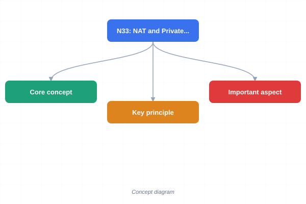
</a>
<a href="../../assets/images/diagrams/gate-cs-preparation/09-computer-networks/n33-nat-and-private-addresses-gate-2020-1-mark-network-layer-sticky.svg" target="_blank" rel="noopener">
  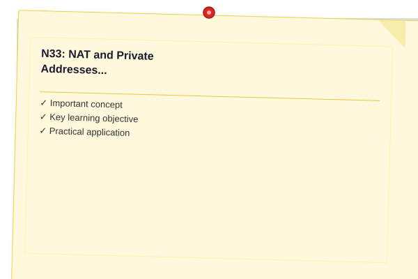
</a>


**Q:** Which of the following is a private IP address?

A) 12.0.0.1  B) 168.192.0.1  C) 172.32.0.1  D) 192.168.0.1

**A:** **D** �� 192.168.0.0/16 is the private Class C range.

---

### N34: TCP Congestion Window Graph [GATE 2020, 2 Marks �� Transport Layer]

<a href="../../assets/images/diagrams/gate-cs-preparation/09-computer-networks/n34-tcp-congestion-window-graph-gate-2020-2-marks-transport-layer-handwritten.svg" target="_blank" rel="noopener">
  
</a>
<a href="../../assets/images/diagrams/gate-cs-preparation/09-computer-networks/n34-tcp-congestion-window-graph-gate-2020-2-marks-transport-layer-diagram.svg" target="_blank" rel="noopener">
  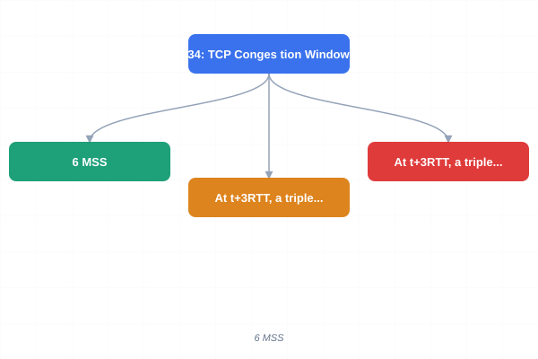
</a>
<a href="../../assets/images/diagrams/gate-cs-preparation/09-computer-networks/n34-tcp-congestion-window-graph-gate-2020-2-marks-transport-layer-sticky.svg" target="_blank" rel="noopener">
  
</a>


**Q:** Given TCP Reno behavior: cwnd = 10 MSS at time t, then at t+1RTT cwnd = 11, at t+2RTT cwnd = 12. At t+3RTT, a triple duplicate ACK occurs. What is cwnd after recovery?

**A:**
- Reno on triple dup ACK: ssthresh = cwnd/2 = 6, cwnd = ssthresh = 6
- Fast recovery: cwnd = **6 MSS**

---

### N35: IPv6 Header Simplification [GATE 2020, 1 Mark �� Network Layer]

<a href="../../assets/images/diagrams/gate-cs-preparation/09-computer-networks/n35-ipv6-header-simplification-gate-2020-1-mark-network-layer-handwritten.svg" target="_blank" rel="noopener">
  
</a>
<a href="../../assets/images/diagrams/gate-cs-preparation/09-computer-networks/n35-ipv6-header-simplification-gate-2020-1-mark-network-layer-diagram.svg" target="_blank" rel="noopener">
  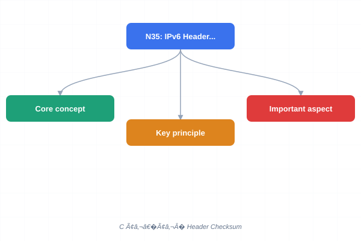
</a>
<a href="../../assets/images/diagrams/gate-cs-preparation/09-computer-networks/n35-ipv6-header-simplification-gate-2020-1-mark-network-layer-sticky.svg" target="_blank" rel="noopener">
  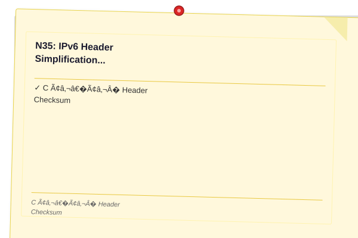
</a>


**Q:** Which field is NOT present in the IPv6 header but was in IPv4?

A) Version  B) Source Address  C) Header Checksum  D) Next Header

**A:** **C �� Header Checksum** is removed in IPv6 since upper layers handle checksums and link-layer CRC is sufficient.

---

### N36: CRC: Error Pattern Detection [GATE 2021, 2 Marks �� Data Link Layer]

<a href="../../assets/images/diagrams/gate-cs-preparation/09-computer-networks/n36-crc-error-pattern-detection-gate-2021-2-marks-data-link-layer-handwritten.svg" target="_blank" rel="noopener">
  
</a>
<a href="../../assets/images/diagrams/gate-cs-preparation/09-computer-networks/n36-crc-error-pattern-detection-gate-2021-2-marks-data-link-layer-diagram.svg" target="_blank" rel="noopener">
  
</a>
<a href="../../assets/images/diagrams/gate-cs-preparation/09-computer-networks/n36-crc-error-pattern-detection-gate-2021-2-marks-data-link-layer-sticky.svg" target="_blank" rel="noopener">
  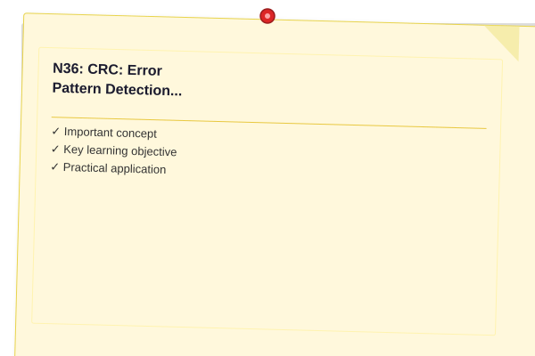
</a>


**Q:** A CRC with generator G detects all burst errors of length:

**A:** ≤ r, where r is the degree of G. Any burst error of length ≤ r has a non-zero remainder when divided by G (since the leading and trailing bits are 1, and r-bit remainder cannot be zero for ≤ r-bit bursts).

---

### N37: IP Header: TTL Field [GATE 2021, 1 Mark �� Network Layer]

<a href="../../assets/images/diagrams/gate-cs-preparation/09-computer-networks/n37-ip-header-ttl-field-gate-2021-1-mark-network-layer-handwritten.svg" target="_blank" rel="noopener">
  
</a>
<a href="../../assets/images/diagrams/gate-cs-preparation/09-computer-networks/n37-ip-header-ttl-field-gate-2021-1-mark-network-layer-diagram.svg" target="_blank" rel="noopener">
  
</a>
<a href="../../assets/images/diagrams/gate-cs-preparation/09-computer-networks/n37-ip-header-ttl-field-gate-2021-1-mark-network-layer-sticky.svg" target="_blank" rel="noopener">
  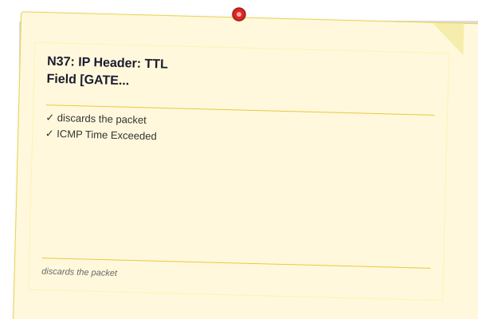
</a>


**Q:** In IPv4, what happens when TTL reaches 0?

**A:** The router **discards the packet** and sends an **ICMP Time Exceeded** message (Type 11) to the source.

---

### N38: Diameter of Network: CSMA/CD [GATE 2021, 2 Marks �� MAC Layer]

<a href="../../assets/images/diagrams/gate-cs-preparation/09-computer-networks/n38-diameter-of-network-csma-cd-gate-2021-2-marks-mac-layer-handwritten.svg" target="_blank" rel="noopener">
  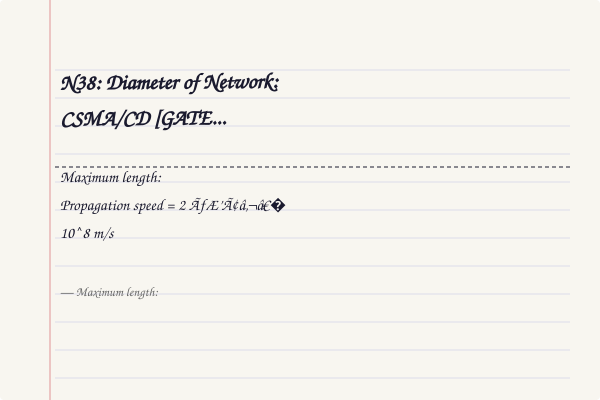
</a>
<a href="../../assets/images/diagrams/gate-cs-preparation/09-computer-networks/n38-diameter-of-network-csma-cd-gate-2021-2-marks-mac-layer-diagram.svg" target="_blank" rel="noopener">
  
</a>
<a href="../../assets/images/diagrams/gate-cs-preparation/09-computer-networks/n38-diameter-of-network-csma-cd-gate-2021-2-marks-mac-layer-sticky.svg" target="_blank" rel="noopener">
  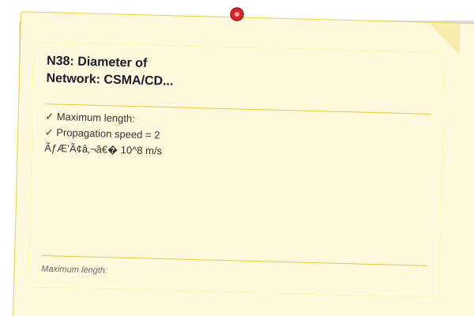
</a>


**Q:** A CSMA/CD network with bandwidth 100 Mbps requires minimum frame size of 512 bits. Propagation speed = 2 � 10^8 m/s. What is the maximum network length?

**A:**
- Minimum frame: 512 bits
- Slot time = 512 / (100 � 10^6) = 5.12 μs
- Slot time = 2 Ã� T_prop → T_prop = 2.56 μs
- Length = T_prop � v = 2.56 � 10^-6 � 2 � 10^8 = 512 m

**Maximum length:** 512 meters

---

### N39: Count to Infinity [GATE 2021, 1 Mark �� Network Layer]

<a href="../../assets/images/diagrams/gate-cs-preparation/09-computer-networks/n39-count-to-infinity-gate-2021-1-mark-network-layer-handwritten.svg" target="_blank" rel="noopener">
  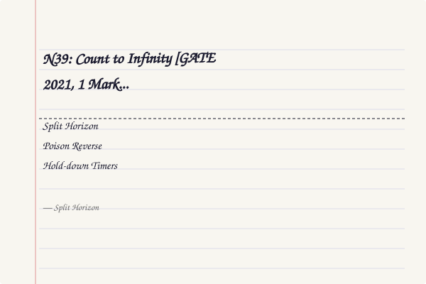
</a>
<a href="../../assets/images/diagrams/gate-cs-preparation/09-computer-networks/n39-count-to-infinity-gate-2021-1-mark-network-layer-diagram.svg" target="_blank" rel="noopener">
  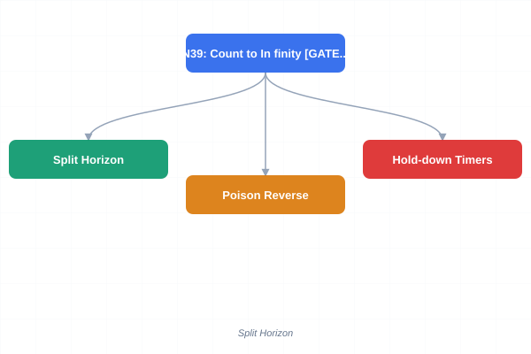
</a>
<a href="../../assets/images/diagrams/gate-cs-preparation/09-computer-networks/n39-count-to-infinity-gate-2021-1-mark-network-layer-sticky.svg" target="_blank" rel="noopener">
  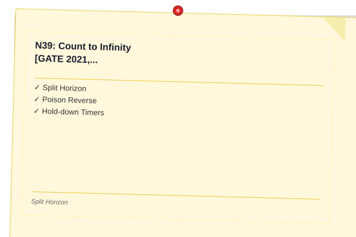
</a>


**Q:** In distance vector routing, what technique prevents the count-to-infinity problem?

**A:** **Split Horizon** (don't advertise a route back to the interface you learned it from), **Poison Reverse** (advertise with cost infinity), and **Hold-down Timers**.

---

### N40: TCP 3-Way Handshake Sequence [GATE 2022, 2 Marks �� Transport Layer]

<a href="../../assets/images/diagrams/gate-cs-preparation/09-computer-networks/n40-tcp-3-way-handshake-sequence-gate-2022-2-marks-transport-layer-handwritten.svg" target="_blank" rel="noopener">
  
</a>
<a href="../../assets/images/diagrams/gate-cs-preparation/09-computer-networks/n40-tcp-3-way-handshake-sequence-gate-2022-2-marks-transport-layer-diagram.svg" target="_blank" rel="noopener">
  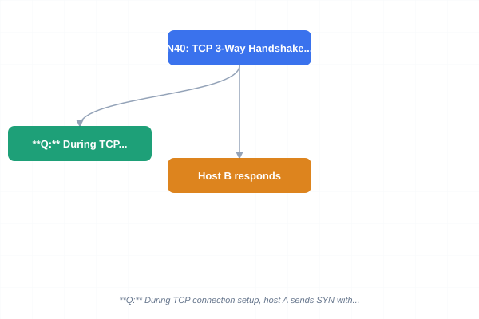
</a>
<a href="../../assets/images/diagrams/gate-cs-preparation/09-computer-networks/n40-tcp-3-way-handshake-sequence-gate-2022-2-marks-transport-layer-sticky.svg" target="_blank" rel="noopener">
  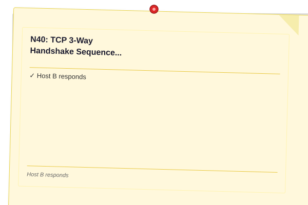
</a>


**Q:** During TCP connection setup, host A sends SYN with seq=a. Host B responds. What are the seq and ack fields in B's SYN+ACK segment?

**A:**
- B responds with seq=b (its own initial sequence number)
- ACK = a + 1
- B sends: `SYN, seq=b, ack=a+1`

---

### N41: ICMP Protocol [GATE 2022, 1 Mark �� Network Layer]

<a href="../../assets/images/diagrams/gate-cs-preparation/09-computer-networks/n41-icmp-protocol-gate-2022-1-mark-network-layer-handwritten.svg" target="_blank" rel="noopener">
  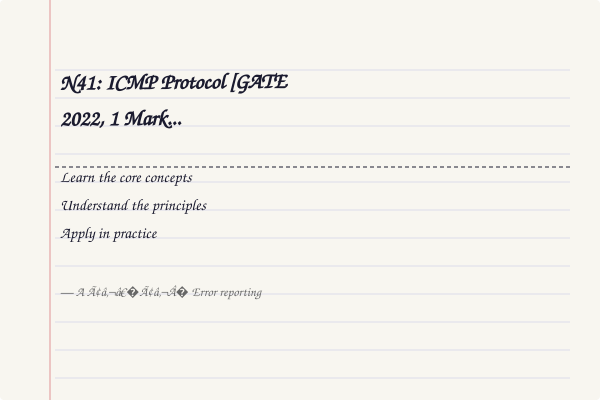
</a>
<a href="../../assets/images/diagrams/gate-cs-preparation/09-computer-networks/n41-icmp-protocol-gate-2022-1-mark-network-layer-diagram.svg" target="_blank" rel="noopener">
  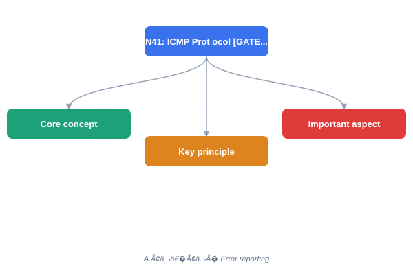
</a>
<a href="../../assets/images/diagrams/gate-cs-preparation/09-computer-networks/n41-icmp-protocol-gate-2022-1-mark-network-layer-sticky.svg" target="_blank" rel="noopener">
  
</a>


**Q:** ICMP is used for which of the following?

A) Error reporting  B) Routing  C) Addressing  D) Encryption

**A:** **A �� Error reporting** (and diagnostic functions like ping).

---

### N42: Fragmentation Offset [GATE 2022, 1 Mark �� Network Layer]

<a href="../../assets/images/diagrams/gate-cs-preparation/09-computer-networks/n42-fragmentation-offset-gate-2022-1-mark-network-layer-handwritten.svg" target="_blank" rel="noopener">
  
</a>
<a href="../../assets/images/diagrams/gate-cs-preparation/09-computer-networks/n42-fragmentation-offset-gate-2022-1-mark-network-layer-diagram.svg" target="_blank" rel="noopener">
  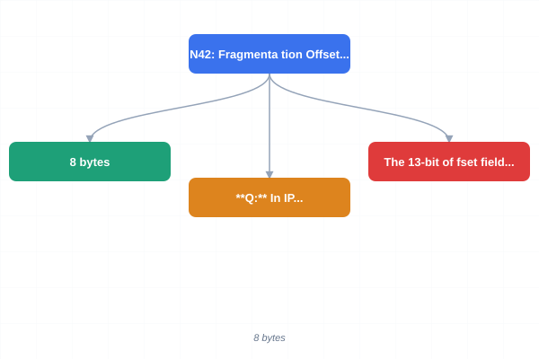
</a>
<a href="../../assets/images/diagrams/gate-cs-preparation/09-computer-networks/n42-fragmentation-offset-gate-2022-1-mark-network-layer-sticky.svg" target="_blank" rel="noopener">
  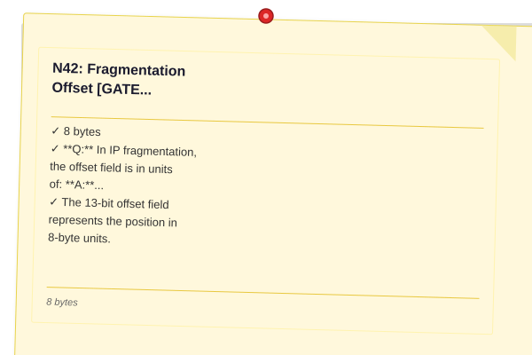
</a>


**Q:** In IP fragmentation, the offset field is in units of:

**A:** **8 bytes** (64 bits). The 13-bit offset field represents the position in 8-byte units.

---

### N43: SYN Flood Attack [GATE 2022, 1 Mark �� Security]

<a href="../../assets/images/diagrams/gate-cs-preparation/09-computer-networks/n43-syn-flood-attack-gate-2022-1-mark-security-handwritten.svg" target="_blank" rel="noopener">
  
</a>
<a href="../../assets/images/diagrams/gate-cs-preparation/09-computer-networks/n43-syn-flood-attack-gate-2022-1-mark-security-diagram.svg" target="_blank" rel="noopener">
  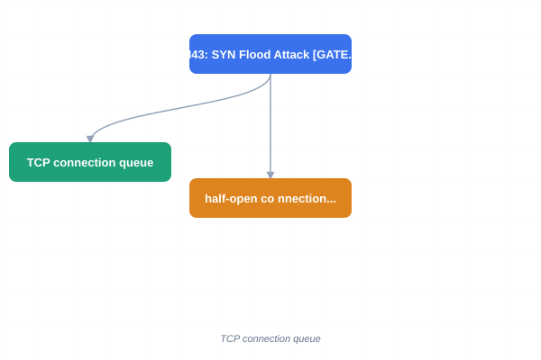
</a>
<a href="../../assets/images/diagrams/gate-cs-preparation/09-computer-networks/n43-syn-flood-attack-gate-2022-1-mark-security-sticky.svg" target="_blank" rel="noopener">
  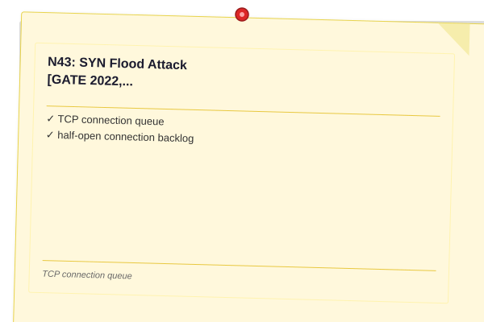
</a>


**Q:** In a SYN flood attack, what resource is exhausted on the server?

**A:** The **TCP connection queue** / **half-open connection backlog** �� server allocates memory for incomplete connections waiting for the final ACK.

---

### N44: Link State vs Distance Vector [GATE 2023, 2 Marks �� Network Layer]

<a href="../../assets/images/diagrams/gate-cs-preparation/09-computer-networks/n44-link-state-vs-distance-vector-gate-2023-2-marks-network-layer-handwritten.svg" target="_blank" rel="noopener">
  
</a>
<a href="../../assets/images/diagrams/gate-cs-preparation/09-computer-networks/n44-link-state-vs-distance-vector-gate-2023-2-marks-network-layer-diagram.svg" target="_blank" rel="noopener">
  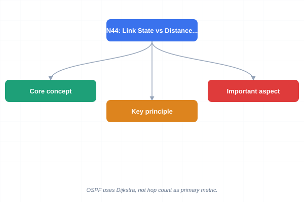
</a>
<a href="../../assets/images/diagrams/gate-cs-preparation/09-computer-networks/n44-link-state-vs-distance-vector-gate-2023-2-marks-network-layer-sticky.svg" target="_blank" rel="noopener">
  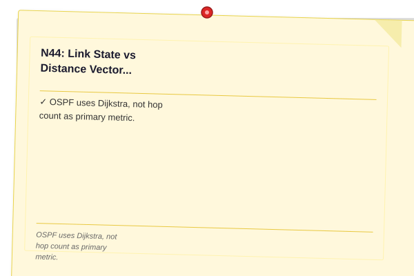
</a>


**Q:** Which of the following is true about OSPF compared to RIP?

A) OSPF uses hop count, RIP uses bandwidth
B) OSPF converges faster than RIP
C) OSPF uses Bellman-Ford, RIP uses Dijkstra
D) OSPF has a hop limit of 15

**A:** **B** �� OSPF (link state) converges faster than RIP (distance vector). OSPF uses Dijkstra, not hop count as primary metric.

---

### N45: SMTP Protocol [GATE 2023, 1 Mark �� Application Layer]

<a href="../../assets/images/diagrams/gate-cs-preparation/09-computer-networks/n45-smtp-protocol-gate-2023-1-mark-application-layer-handwritten.svg" target="_blank" rel="noopener">
  
</a>
<a href="../../assets/images/diagrams/gate-cs-preparation/09-computer-networks/n45-smtp-protocol-gate-2023-1-mark-application-layer-diagram.svg" target="_blank" rel="noopener">
  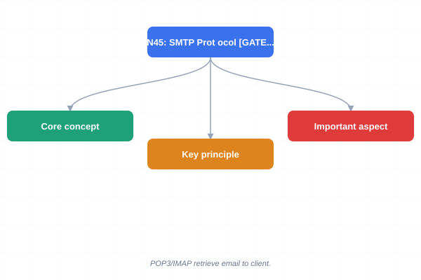
</a>
<a href="../../assets/images/diagrams/gate-cs-preparation/09-computer-networks/n45-smtp-protocol-gate-2023-1-mark-application-layer-sticky.svg" target="_blank" rel="noopener">
  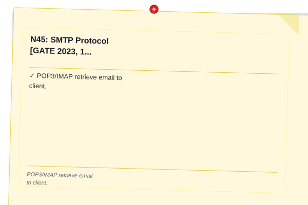
</a>


**Q:** SMTP is used to:

A) Retrieve email from server
B) Transfer email between servers
C) Browse web pages
D) Transfer files

**A:** **B** �� SMTP transfers email between mail servers (MTA). POP3/IMAP retrieve email to client.

---

### N46: Maximum Subnets from Class C [GATE 2023, 2 Marks �� Network Layer]

<a href="../../assets/images/diagrams/gate-cs-preparation/09-computer-networks/n46-maximum-subnets-from-class-c-gate-2023-2-marks-network-layer-handwritten.svg" target="_blank" rel="noopener">
  
</a>
<a href="../../assets/images/diagrams/gate-cs-preparation/09-computer-networks/n46-maximum-subnets-from-class-c-gate-2023-2-marks-network-layer-diagram.svg" target="_blank" rel="noopener">
  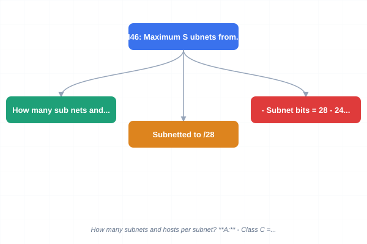
</a>
<a href="../../assets/images/diagrams/gate-cs-preparation/09-computer-networks/n46-maximum-subnets-from-class-c-gate-2023-2-marks-network-layer-sticky.svg" target="_blank" rel="noopener">
  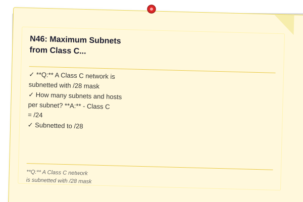
</a>


**Q:** A Class C network is subnetted with /28 mask. How many subnets and hosts per subnet?

**A:**
- Class C = /24. Subnetted to /28.
- Subnet bits = 28 - 24 = 4. Subnets = 2^4 = 16
- Host bits = 32 - 28 = 4. Hosts per subnet = 2^4 - 2 = 14

---

### N47: TCP Fast Retransmit [GATE 2023, 1 Mark �� Transport Layer]

<a href="../../assets/images/diagrams/gate-cs-preparation/09-computer-networks/n47-tcp-fast-retransmit-gate-2023-1-mark-transport-layer-handwritten.svg" target="_blank" rel="noopener">
  
</a>
<a href="../../assets/images/diagrams/gate-cs-preparation/09-computer-networks/n47-tcp-fast-retransmit-gate-2023-1-mark-transport-layer-diagram.svg" target="_blank" rel="noopener">
  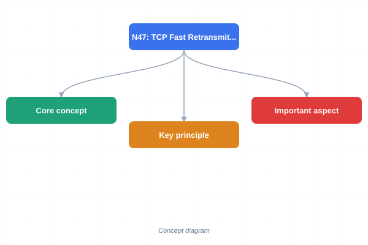
</a>
<a href="../../assets/images/diagrams/gate-cs-preparation/09-computer-networks/n47-tcp-fast-retransmit-gate-2023-1-mark-transport-layer-sticky.svg" target="_blank" rel="noopener">
  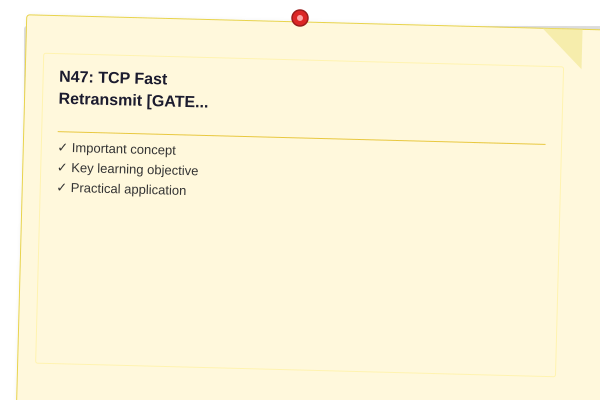
</a>


**Q:** How many duplicate ACKs trigger fast retransmit in TCP?

**A:** **3** (three duplicate ACKs indicating the same sequence number, implying the next expected segment was lost).

---

### N48: Ethernet Frame: Minimum Size Rationale [GATE 2024, 2 Marks �� MAC Layer]

<a href="../../assets/images/diagrams/gate-cs-preparation/09-computer-networks/n48-ethernet-frame-minimum-size-rationale-gate-2024-2-marks-mac-layer-handwritten.svg" target="_blank" rel="noopener">
  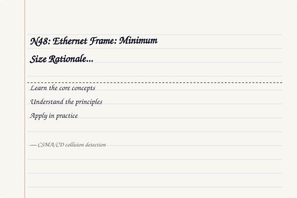
</a>
<a href="../../assets/images/diagrams/gate-cs-preparation/09-computer-networks/n48-ethernet-frame-minimum-size-rationale-gate-2024-2-marks-mac-layer-diagram.svg" target="_blank" rel="noopener">
  
</a>
<a href="../../assets/images/diagrams/gate-cs-preparation/09-computer-networks/n48-ethernet-frame-minimum-size-rationale-gate-2024-2-marks-mac-layer-sticky.svg" target="_blank" rel="noopener">
  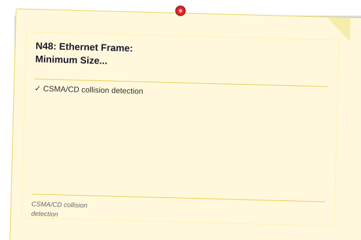
</a>


**Q:** Why does Ethernet enforce a minimum frame size of 64 bytes (512 bits at 10 Mbps)?

**A:** To ensure **CSMA/CD collision detection** works correctly. The transmission time of the minimum frame must be ≥ 2� propagation delay of the network, so every station can detect collisions before finishing transmission of the frame.

---

### N49: Subnetting: Last Address [GATE 2024, 2 Marks �� Network Layer]

<a href="../../assets/images/diagrams/gate-cs-preparation/09-computer-networks/n49-subnetting-last-address-gate-2024-2-marks-network-layer-handwritten.svg" target="_blank" rel="noopener">
  
</a>
<a href="../../assets/images/diagrams/gate-cs-preparation/09-computer-networks/n49-subnetting-last-address-gate-2024-2-marks-network-layer-diagram.svg" target="_blank" rel="noopener">
  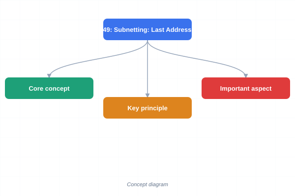
</a>
<a href="../../assets/images/diagrams/gate-cs-preparation/09-computer-networks/n49-subnetting-last-address-gate-2024-2-marks-network-layer-sticky.svg" target="_blank" rel="noopener">
  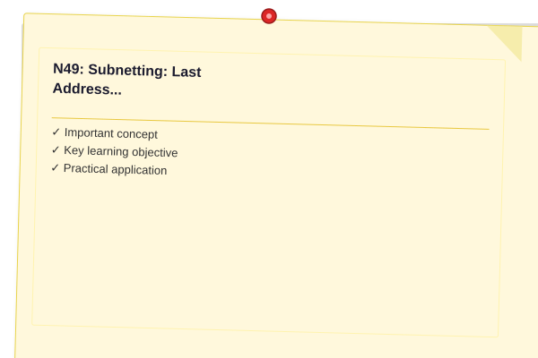
</a>


**Q:** Given IP 192.168.1.50/27, what is the broadcast address and the last usable host address in that subnet?

**A:**
- /27 → mask 255.255.255.224
- 50 = 00110010 → subnet bits: 001 = 32
- Subnet address: 192.168.1.32
- Broadcast: 192.168.1.63 (subnet + 2^5 - 1 = 32 + 31 = 63)
- Last usable host: 192.168.1.62

---

### N50: TCP AIMD Behavior [GATE 2024, 2 Marks �� Transport Layer]

<a href="../../assets/images/diagrams/gate-cs-preparation/09-computer-networks/n50-tcp-aimd-behavior-gate-2024-2-marks-transport-layer-handwritten.svg" target="_blank" rel="noopener">
  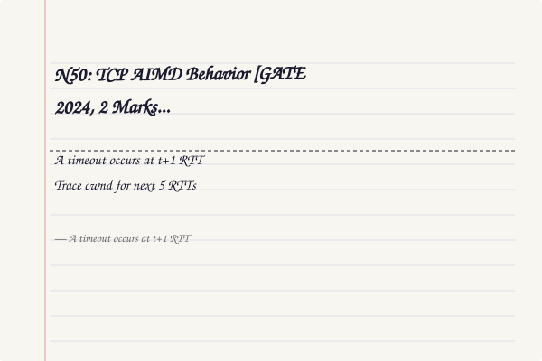
</a>
<a href="../../assets/images/diagrams/gate-cs-preparation/09-computer-networks/n50-tcp-aimd-behavior-gate-2024-2-marks-transport-layer-diagram.svg" target="_blank" rel="noopener">
  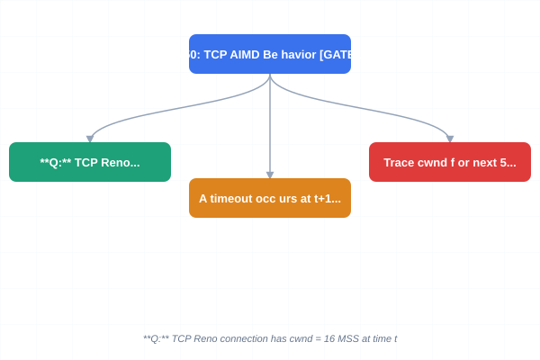
</a>
<a href="../../assets/images/diagrams/gate-cs-preparation/09-computer-networks/n50-tcp-aimd-behavior-gate-2024-2-marks-transport-layer-sticky.svg" target="_blank" rel="noopener">
  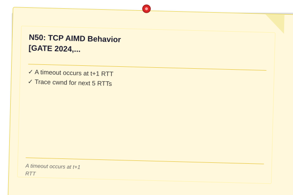
</a>


**Q:** TCP Reno connection has cwnd = 16 MSS at time t. A timeout occurs at t+1 RTT. Trace cwnd for next 5 RTTs.

**A:**
- Timeout: ssthresh = 16/2 = 8, cwnd = 1 (slow start)
- RTT1: cwnd = 1 → 2
- RTT2: cwnd = 2 → 4
- RTT3: cwnd = 4 → 8 (equals ssthresh)
- RTT4: cwnd = 8 → 9 (congestion avoidance: +1 per RTT)
- RTT5: cwnd = 9 → 10

Formula: Slow Start (�2 per RTT) until ssthresh, then Additive Increase (+1 per RTT).

---

### N51: Distance Vector: New Route [GATE 2024, 1 Mark �� Network Layer]

<a href="../../assets/images/diagrams/gate-cs-preparation/09-computer-networks/n51-distance-vector-new-route-gate-2024-1-mark-network-layer-handwritten.svg" target="_blank" rel="noopener">
  
</a>
<a href="../../assets/images/diagrams/gate-cs-preparation/09-computer-networks/n51-distance-vector-new-route-gate-2024-1-mark-network-layer-diagram.svg" target="_blank" rel="noopener">
  
</a>
<a href="../../assets/images/diagrams/gate-cs-preparation/09-computer-networks/n51-distance-vector-new-route-gate-2024-1-mark-network-layer-sticky.svg" target="_blank" rel="noopener">
  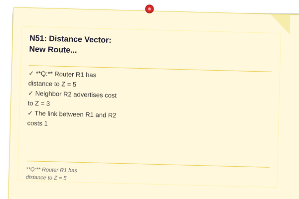
</a>


**Q:** Router R1 has distance to Z = 5. Neighbor R2 advertises cost to Z = 3. The link between R1 and R2 costs 1. What is R1's new distance to Z?

**A:**
New distance = cost(R1→R2) + cost(R2→Z) = 1 + 3 = 4
Since 4 &lt; 5, R1 updates to **4**.

---

### N52: CRC Detection Guarantee [GATE 2025, 2 Marks �� Data Link Layer]

<a href="../../assets/images/diagrams/gate-cs-preparation/09-computer-networks/n52-crc-detection-guarantee-gate-2025-2-marks-data-link-layer-handwritten.svg" target="_blank" rel="noopener">
  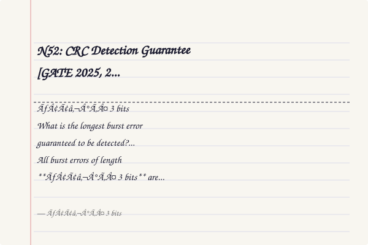
</a>
<a href="../../assets/images/diagrams/gate-cs-preparation/09-computer-networks/n52-crc-detection-guarantee-gate-2025-2-marks-data-link-layer-diagram.svg" target="_blank" rel="noopener">
  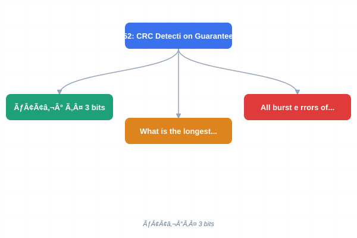
</a>
<a href="../../assets/images/diagrams/gate-cs-preparation/09-computer-networks/n52-crc-detection-guarantee-gate-2025-2-marks-data-link-layer-sticky.svg" target="_blank" rel="noopener">
  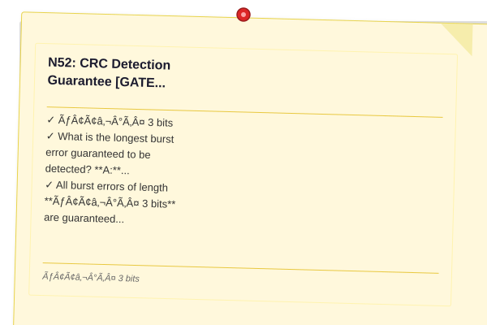
</a>


**Q:** A CRC uses generator x^3 + x + 1. What is the longest burst error guaranteed to be detected?

**A:** Degree r = 3. All burst errors of length **≤ 3 bits** are guaranteed detected.

---

### N53: IPv4 vs IPv6: Fragmentation [GATE 2025, 1 Mark �� Network Layer]

<a href="../../assets/images/diagrams/gate-cs-preparation/09-computer-networks/n53-ipv4-vs-ipv6-fragmentation-gate-2025-1-mark-network-layer-handwritten.svg" target="_blank" rel="noopener">
  
</a>
<a href="../../assets/images/diagrams/gate-cs-preparation/09-computer-networks/n53-ipv4-vs-ipv6-fragmentation-gate-2025-1-mark-network-layer-diagram.svg" target="_blank" rel="noopener">
  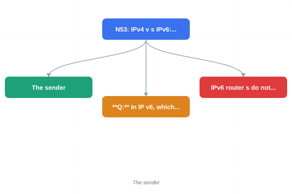
</a>
<a href="../../assets/images/diagrams/gate-cs-preparation/09-computer-networks/n53-ipv4-vs-ipv6-fragmentation-gate-2025-1-mark-network-layer-sticky.svg" target="_blank" rel="noopener">
  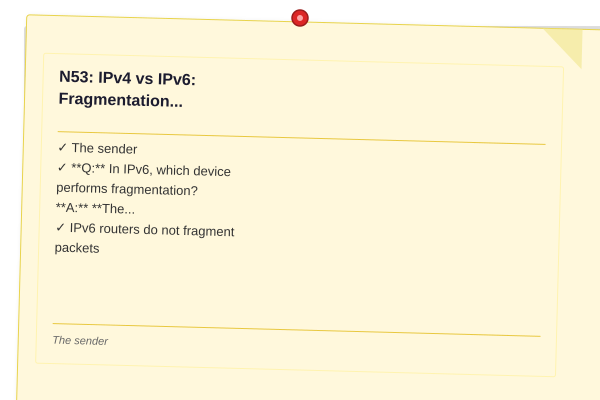
</a>


**Q:** In IPv6, which device performs fragmentation?

**A:** **The sender** (source host). IPv6 routers do not fragment packets. Path MTU Discovery (PMTUD) is used to find the smallest MTU along the path.

---

### N54: DNS Resolution: Recursive Query [GATE 2025, 1 Mark �� Application Layer]

<a href="../../assets/images/diagrams/gate-cs-preparation/09-computer-networks/n54-dns-resolution-recursive-query-gate-2025-1-mark-application-layer-handwritten.svg" target="_blank" rel="noopener">
  
</a>
<a href="../../assets/images/diagrams/gate-cs-preparation/09-computer-networks/n54-dns-resolution-recursive-query-gate-2025-1-mark-application-layer-diagram.svg" target="_blank" rel="noopener">
  
</a>
<a href="../../assets/images/diagrams/gate-cs-preparation/09-computer-networks/n54-dns-resolution-recursive-query-gate-2025-1-mark-application-layer-sticky.svg" target="_blank" rel="noopener">
  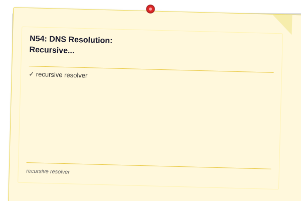
</a>


**Q:** In recursive DNS resolution, who is responsible for resolving the entire query?

**A:** The **recursive resolver** (typically the ISP's DNS server or the client's configured DNS resolver) performs all queries and returns the final answer to the client.

---

### N55: TCP Segment: Maximum Payload [GATE 2025, 2 Marks �� Transport Layer]

<a href="../../assets/images/diagrams/gate-cs-preparation/09-computer-networks/n55-tcp-segment-maximum-payload-gate-2025-2-marks-transport-layer-handwritten.svg" target="_blank" rel="noopener">
  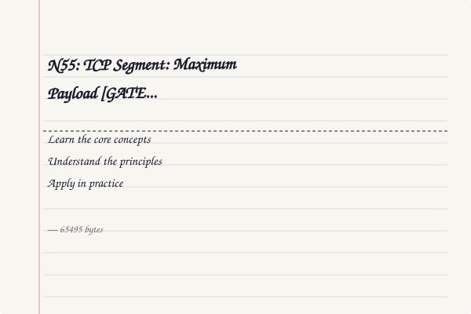
</a>
<a href="../../assets/images/diagrams/gate-cs-preparation/09-computer-networks/n55-tcp-segment-maximum-payload-gate-2025-2-marks-transport-layer-diagram.svg" target="_blank" rel="noopener">
  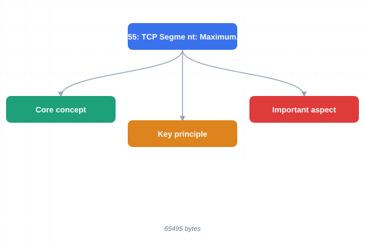
</a>
<a href="../../assets/images/diagrams/gate-cs-preparation/09-computer-networks/n55-tcp-segment-maximum-payload-gate-2025-2-marks-transport-layer-sticky.svg" target="_blank" rel="noopener">
  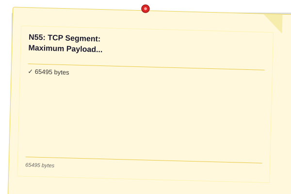
</a>


**Q:** Assuming no options, what is the maximum payload a TCP segment can carry?

**A:**
- Maximum IP datagram = 65535 bytes
- Minimum IP header = 20 bytes
- Minimum TCP header = 20 bytes
- Max TCP payload = 65535 - 20 - 20 = **65495 bytes**

---

### N56: Stop-and-Wait ARQ: Sequence Number Bits [GATE 2025, 1 Mark �� Data Link Layer]

<a href="../../assets/images/diagrams/gate-cs-preparation/09-computer-networks/n56-stop-and-wait-arq-sequence-number-bits-gate-2025-1-mark-data-link-layer-handwritten.svg" target="_blank" rel="noopener">
  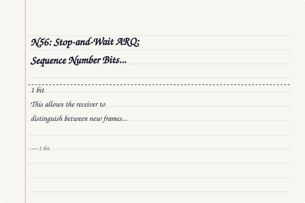
</a>
<a href="../../assets/images/diagrams/gate-cs-preparation/09-computer-networks/n56-stop-and-wait-arq-sequence-number-bits-gate-2025-1-mark-data-link-layer-diagram.svg" target="_blank" rel="noopener">
  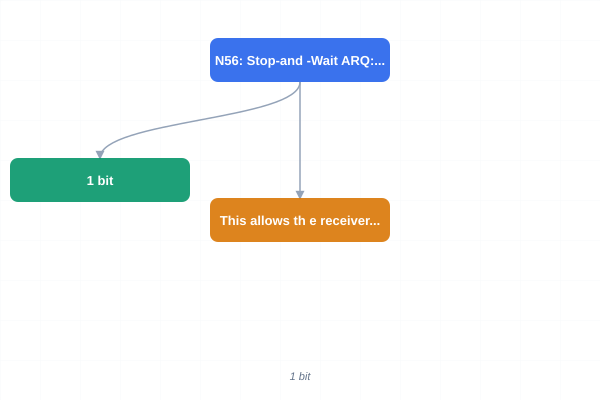
</a>
<a href="../../assets/images/diagrams/gate-cs-preparation/09-computer-networks/n56-stop-and-wait-arq-sequence-number-bits-gate-2025-1-mark-data-link-layer-sticky.svg" target="_blank" rel="noopener">
  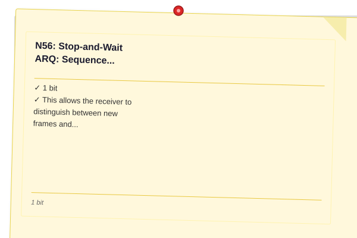
</a>


**Q:** How many sequence number bits are needed for Stop-and-Wait ARQ?

**A:** **1 bit** (sequence numbers alternate between 0 and 1). This allows the receiver to distinguish between new frames and retransmissions.

---

### N57: OSPF Area Border Router [GATE 2025, 1 Mark �� Network Layer]

<a href="../../assets/images/diagrams/gate-cs-preparation/09-computer-networks/n57-ospf-area-border-router-gate-2025-1-mark-network-layer-handwritten.svg" target="_blank" rel="noopener">
  
</a>
<a href="../../assets/images/diagrams/gate-cs-preparation/09-computer-networks/n57-ospf-area-border-router-gate-2025-1-mark-network-layer-diagram.svg" target="_blank" rel="noopener">
  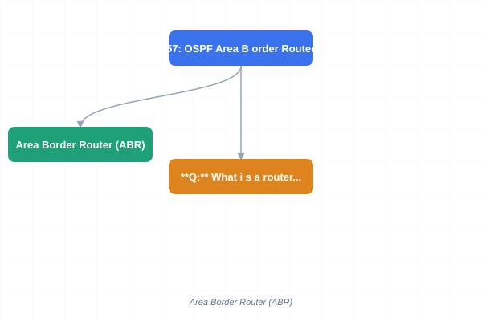
</a>
<a href="../../assets/images/diagrams/gate-cs-preparation/09-computer-networks/n57-ospf-area-border-router-gate-2025-1-mark-network-layer-sticky.svg" target="_blank" rel="noopener">
  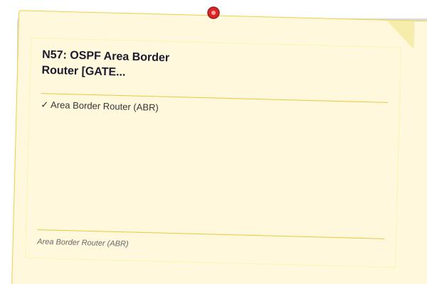
</a>


**Q:** What is a router called that connects one OSPF area to another?

**A:** **Area Border Router (ABR)**

---

### N58: TTL in IP Header [GATE 2025, 1 Mark �� Network Layer]

<a href="../../assets/images/diagrams/gate-cs-preparation/09-computer-networks/n58-ttl-in-ip-header-gate-2025-1-mark-network-layer-handwritten.svg" target="_blank" rel="noopener">
  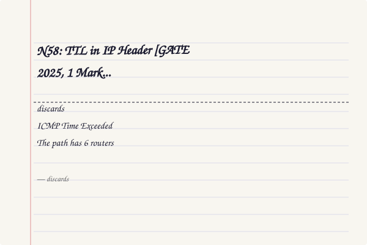
</a>
<a href="../../assets/images/diagrams/gate-cs-preparation/09-computer-networks/n58-ttl-in-ip-header-gate-2025-1-mark-network-layer-diagram.svg" target="_blank" rel="noopener">
  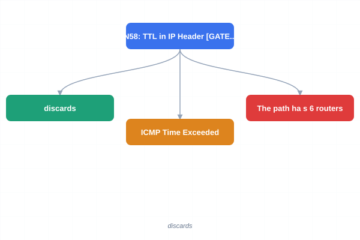
</a>
<a href="../../assets/images/diagrams/gate-cs-preparation/09-computer-networks/n58-ttl-in-ip-header-gate-2025-1-mark-network-layer-sticky.svg" target="_blank" rel="noopener">
  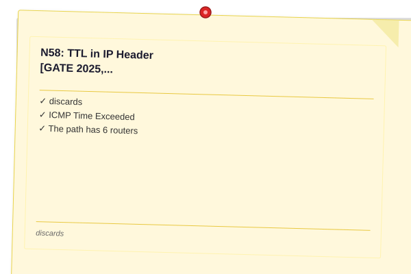
</a>


**Q:** A packet is sent from A to B with TTL = 4. The path has 6 routers. What happens?

**A:** Each router decrements TTL by 1. After 4 routers, TTL = 0. Router #4 **discards** the packet and sends **ICMP Time Exceeded** to source. The packet never reaches the destination.

---

### N59: Bellman-Ford Convergence [GATE 2025, 2 Marks �� Network Layer]

<a href="../../assets/images/diagrams/gate-cs-preparation/09-computer-networks/n59-bellman-ford-convergence-gate-2025-2-marks-network-layer-handwritten.svg" target="_blank" rel="noopener">
  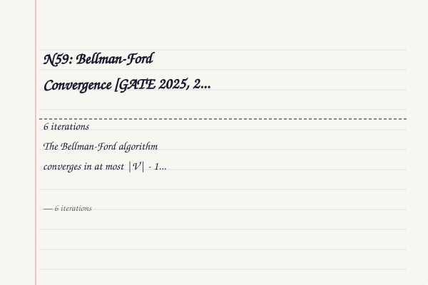
</a>
<a href="../../assets/images/diagrams/gate-cs-preparation/09-computer-networks/n59-bellman-ford-convergence-gate-2025-2-marks-network-layer-diagram.svg" target="_blank" rel="noopener">
  
</a>
<a href="../../assets/images/diagrams/gate-cs-preparation/09-computer-networks/n59-bellman-ford-convergence-gate-2025-2-marks-network-layer-sticky.svg" target="_blank" rel="noopener">
  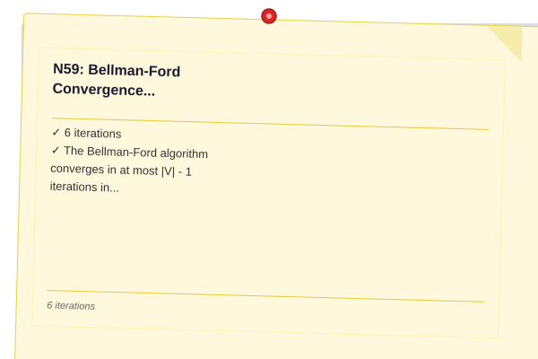
</a>


**Q:** In a network of 7 routers using distance vector routing, what is the maximum number of iterations needed for Bellman-Ford to converge to shortest paths (assuming no topology changes during convergence)?

**A:** **6 iterations** (V - 1 = 7 - 1 = 6). The Bellman-Ford algorithm converges in at most |V| - 1 iterations in the absence of negative cycles.

---

### N60: Ethernet: Backoff After Collision [GATE 2025, 1 Mark �� MAC Layer]

<a href="../../assets/images/diagrams/gate-cs-preparation/09-computer-networks/n60-ethernet-backoff-after-collision-gate-2025-1-mark-mac-layer-handwritten.svg" target="_blank" rel="noopener">
  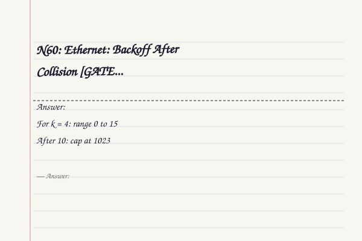
</a>
<a href="../../assets/images/diagrams/gate-cs-preparation/09-computer-networks/n60-ethernet-backoff-after-collision-gate-2025-1-mark-mac-layer-diagram.svg" target="_blank" rel="noopener">
  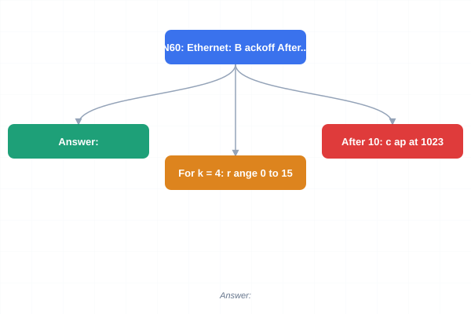
</a>
<a href="../../assets/images/diagrams/gate-cs-preparation/09-computer-networks/n60-ethernet-backoff-after-collision-gate-2025-1-mark-mac-layer-sticky.svg" target="_blank" rel="noopener">
  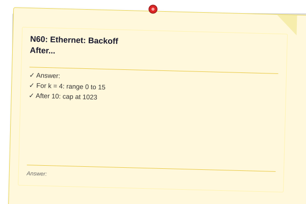
</a>


**Q:** In Ethernet CSMA/CD, after the 4th collision for a frame, what is the range of the random backoff?

**A:** After k collisions, backoff is random from {0, 1, ..., 2^k - 1} � slot_time, but capped at k = 10 (1023). For k = 4: range 0 to 15. After 10: cap at 1023. After 16: discard.

**Answer:** 0 to 15 slot times.

---

## 10. Quick Revision Tables

### OSI Layer Functions (Mnemonic: **A-P-S-T-N-D-P**)

<a href="../../assets/images/diagrams/gate-cs-preparation/09-computer-networks/osi-layer-functions-mnemonic-a-p-s-t-n-d-p-handwritten.svg" target="_blank" rel="noopener">
  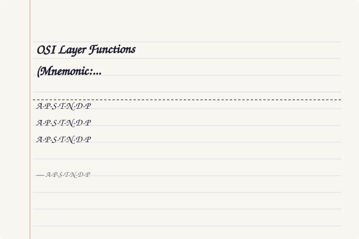
</a>
<a href="../../assets/images/diagrams/gate-cs-preparation/09-computer-networks/osi-layer-functions-mnemonic-a-p-s-t-n-d-p-diagram.svg" target="_blank" rel="noopener">
  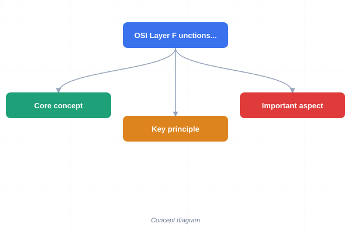
</a>
<a href="../../assets/images/diagrams/gate-cs-preparation/09-computer-networks/osi-layer-functions-mnemonic-a-p-s-t-n-d-p-sticky.svg" target="_blank" rel="noopener">
  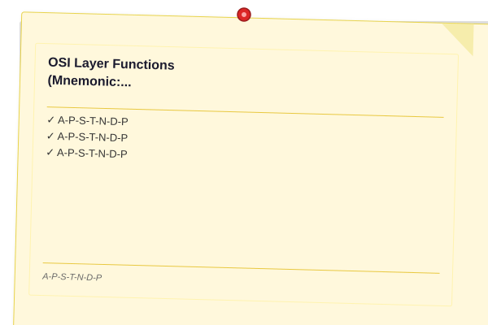
</a>


| Layer | Key Functions | PDU | Addressing |
|-------|--------------|-----|------------|
| Application | User services, HTTP, DNS, FTP | Data | �� |
| Presentation | Encryption, compression | Data | �� |
| Session | Session management, sync | Data | �� |
| Transport | End-to-end, reliability, flow | Segment | Port (16-bit) |
| Network | Routing, logical addressing | Packet | IP (32/128-bit) |
| Data Link | Framing, error control, MAC | Frame | MAC (48-bit) |
| Physical | Bits, signals, encoding | Bits | �� |

### Key GATE Formulas at a Glance

<a href="../../assets/images/diagrams/gate-cs-preparation/09-computer-networks/key-gate-formulas-at-a-glance-handwritten.svg" target="_blank" rel="noopener">
  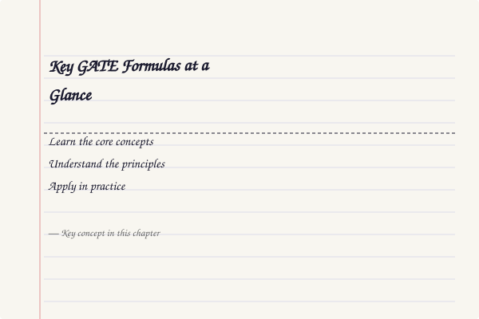
</a>
<a href="../../assets/images/diagrams/gate-cs-preparation/09-computer-networks/key-gate-formulas-at-a-glance-diagram.svg" target="_blank" rel="noopener">
  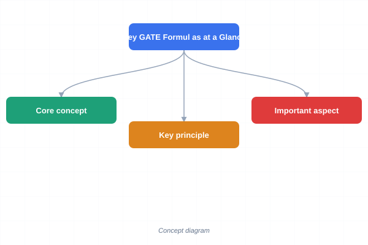
</a>
<a href="../../assets/images/diagrams/gate-cs-preparation/09-computer-networks/key-gate-formulas-at-a-glance-sticky.svg" target="_blank" rel="noopener">
  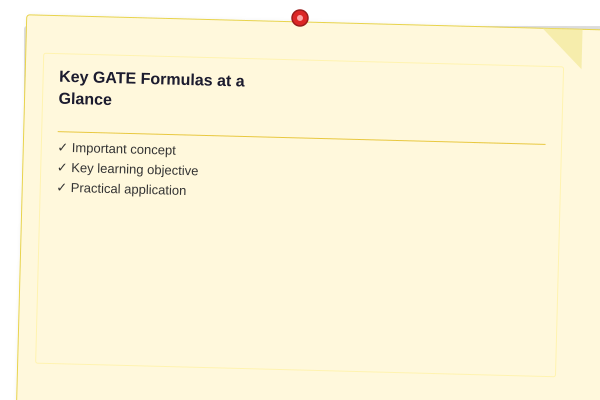
</a>


| Concept | Formula |
|---------|---------|
| Nyquist (noiseless) | `R = 2B log_2(L)` |
| Shannon (noisy) | `C = B log_2(1 + SNR)` |
| Stop-and-Wait η | `1 / (1 + 2a)` |
| Sliding Window η | `N / (1 + 2a)` |
| Hamming bits | `2^r ≥ m + r + 1` |
| CSMA/CD min frame | `L_min = 2 � T_prop � B` |
| Pure ALOHA S_max | `1/(2e) ≈ 0.184` |
| Slotted ALOHA S_max | `1/e ≈ 0.368` |
| Go-Back-N window | `≤ 2^n - 1` |
| Selective Repeat window | `≤ 2^(n-1)` |
| Distance vector iterations | `≤ V - 1` |

### GATE Exam Strategy for CN

<a href="../../assets/images/diagrams/gate-cs-preparation/09-computer-networks/gate-exam-strategy-for-cn-handwritten.svg" target="_blank" rel="noopener">
  
</a>
<a href="../../assets/images/diagrams/gate-cs-preparation/09-computer-networks/gate-exam-strategy-for-cn-diagram.svg" target="_blank" rel="noopener">
  
</a>
<a href="../../assets/images/diagrams/gate-cs-preparation/09-computer-networks/gate-exam-strategy-for-cn-sticky.svg" target="_blank" rel="noopener">
  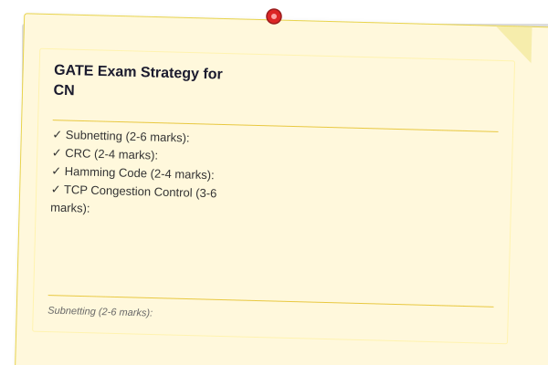
</a>


1. **Subnetting (2-6 marks):** Master binary conversion. Practice finding network/broadcast/first/last addresses quickly.
2. **CRC (2-4 marks):** Binary division with XOR. Know common generators.
3. **Hamming Code (2-4 marks):** Parity bit positions are powers of 2. Practice syndrome calculation.
4. **TCP Congestion Control (3-6 marks):** Draw the sawtooth. Know Tahoe vs Reno behavior on timeout vs 3 dup ACKs.
5. **Efficiency Formulas (2-3 marks):** Memorize 1/(1+2a) and its sliding window variant.
6. **CSMA/CD (2-3 marks):** 2�T_prop = T_tx for min frame. Know the 64-byte minimum.
7. **Routing Protocols (2-4 marks):** RIP (DV, hop count), OSPF (LS, cost), BGP (path vector, policy).

### Recommended Problem-Solving Order

<a href="../../assets/images/diagrams/gate-cs-preparation/09-computer-networks/recommended-problem-solving-order-handwritten.svg" target="_blank" rel="noopener">
  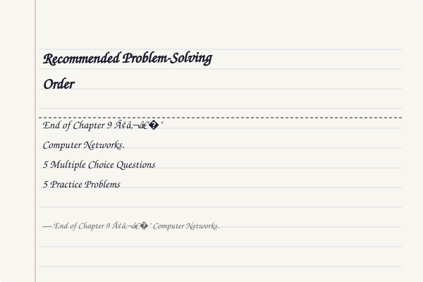
</a>
<a href="../../assets/images/diagrams/gate-cs-preparation/09-computer-networks/recommended-problem-solving-order-diagram.svg" target="_blank" rel="noopener">
  
</a>
<a href="../../assets/images/diagrams/gate-cs-preparation/09-computer-networks/recommended-problem-solving-order-sticky.svg" target="_blank" rel="noopener">
  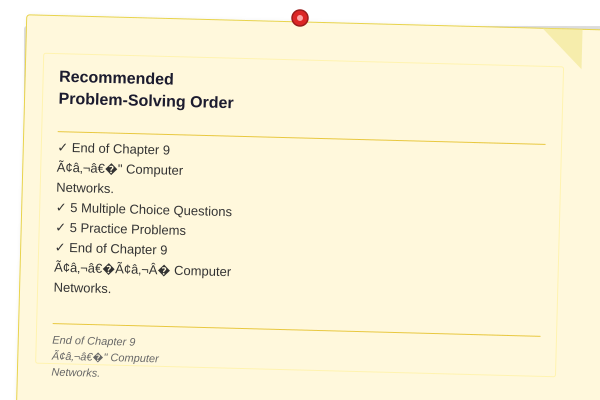
</a>


1. Subnetting / CIDR questions (quick wins)
2. Efficiency & throughput calculations (formula-based)
3. CRC & Hamming code (deterministic computation)
4. TCP window evolution (trace the sawtooth)
5. Routing algorithm questions (trace the tables)
6. Conceptual questions (layers, protocols, ports)

---

> **End of Chapter 9 �" Computer Networks.** Covers all GATE topics from Physical to Application layer with 60 solved PYQs (2010�"2025) and formula reference tables.

---

## Summary

Computer Networks is a significant GATE CS subject (8-12 marks) covering all seven OSI layers with emphasis on the network and transport layers. Key topics include: Physical layer (data transmission, multiplexing, switching), Data Link layer (error detection � CRC, Hamming code; flow control � sliding window, stop-and-wait; MAC sublayer � CSMA/CD, ALOHA, Ethernet), Network layer (IP addressing and subnetting, CIDR, routing algorithms � RIP, OSPF, BGP, distance vector and link-state), Transport layer (TCP and UDP, congestion control � Tahoe vs Reno, slow start, congestion avoidance, fast retransmit, three-way handshake), and Application layer (HTTP, DNS, SMTP, FTP). Subnetting and CIDR (2-6 marks) is the most frequently tested topic, followed by TCP congestion control (3-6 marks) and CRC/Hamming code calculations (2-4 marks). The key formulas � efficiency = 1/(1+2a), sliding window efficiency = N/(1+2a), Hamming code parity bits 2^r >= m+r+1 � must be memorized. The layered architecture model provides the conceptual framework: each layer adds its own header and provides services to the layer above.

```mermaid
flowchart TD
    A[Computer Networks] --> B[Physical Layer]
    A --> C[Data Link Layer]
    A --> D[Network Layer]
    A --> E[Transport Layer]
    A --> F[Application Layer]
    B --> B1[Multiplexing, Switching]
    C --> C1[CSMA/CD, Sliding Window, CRC]
    D --> D1[IP Addressing, Subnetting, Routing]
    E --> E1[TCP/UDP, Congestion Control]
    F --> F1[HTTP, DNS, SMTP]
```

## TypeScript Implementations

```typescript
/**
 * SubnetCalculator � IP Subnetting Tool
 * ----------------------------------------
 * Computes network address, broadcast address, first/last usable IP,
 * subnet mask, and number of hosts for a given IP/CIDR.
 */
class SubnetCalculator {
  private ipOctets: number[];
  private prefix: number;

  constructor(ip: string, prefix: number) {
    this.ipOctets = ip.split('.').map(Number);
    this.prefix = prefix;
    if (this.ipOctets.length !== 4 || this.ipOctets.some(o => o < 0 || o > 255)) {
      throw new Error('Invalid IP address');
    }
    if (prefix < 0 || prefix > 32) {
      throw new Error('Invalid prefix length');
    }
  }

  private toBinary(octets: number[]): string {
    return octets.map(o => o.toString(2).padStart(8, '0')).join('');
  }

  private toOctets(binary: string): number[] {
    const octets: number[] = [];
    for (let i = 0; i < 32; i += 8) {
      octets.push(parseInt(binary.substring(i, i + 8), 2));
    }
    return octets;
  }

  getNetworkAddress(): string {
    const binary = this.toBinary(this.ipOctets);
    const netBits = binary.substring(0, this.prefix).padEnd(32, '0');
    return this.toOctets(netBits).join('.');
  }

  getBroadcastAddress(): string {
    const binary = this.toBinary(this.ipOctets);
    const broadBits = binary.substring(0, this.prefix).padEnd(32, '1');
    return this.toOctets(broadBits).join('.');
  }

  getSubnetMask(): string {
    const maskBits = '1'.repeat(this.prefix).padEnd(32, '0');
    return this.toOctets(maskBits).join('.');
  }

  getFirstUsable(): string {
    const net = this.getNetworkAddress().split('.').map(Number);
    net[3] += 1;
    return net.join('.');
  }

  getLastUsable(): string {
    const broad = this.getBroadcastAddress().split('.').map(Number);
    broad[3] -= 1;
    return broad.join('.');
  }

  getMaxHosts(): number {
    return Math.pow(2, 32 - this.prefix) - 2;
  }

  /**
   * Split this network into smaller subnets (VLSM).
   */
  splitInto(requiredHosts: number[]): { subnet: string; hosts: number }[] {
    const result: { subnet: string; hosts: number }[] = [];
    let currentIp = this.getNetworkAddress();
    const sortedHosts = [...requiredHosts].sort((a, b) => b - a);

    for (const hosts of sortedHosts) {
      const neededBits = Math.ceil(Math.log2(hosts + 2));
      const newPrefix = 32 - neededBits;
      const calc = new SubnetCalculator(currentIp, newPrefix);
      result.push({
        subnet: `${calc.getNetworkAddress()}/${newPrefix}`,
        hosts: calc.getMaxHosts(),
      });
      // Move to next subnet
      const broadOctets = calc.getBroadcastAddress().split('.').map(Number);
      broadOctets[3] += 1;
      for (let i = 3; i >= 0; i--) {
        if (broadOctets[i] > 255) {
          broadOctets[i] = 0;
          broadOctets[i - 1]++;
        }
      }
      currentIp = broadOctets.join('.');
    }
    return result;
  }

  printReport(): string {
    return `
=== Subnet Report ===
IP: ${this.ipOctets.join('.')} / ${this.prefix}
Subnet Mask: ${this.getSubnetMask()}
Network Address: ${this.getNetworkAddress()}
Broadcast Address: ${this.getBroadcastAddress()}
First Usable: ${this.getFirstUsable()}
Last Usable: ${this.getLastUsable()}
Max Hosts: ${this.getMaxHosts()}
    `.trim();
  }
}

// Example: 192.168.1.0/24
const subnet = new SubnetCalculator('192.168.1.0', 24);
console.log(subnet.printReport());

// Split into subnets with 50, 25, 10 hosts
console.log('\nVLSM Subnetting:');
const subnets = subnet.splitInto([50, 25, 10]);
for (const s of subnets) {
  console.log(`  ${s.subnet} -> ${s.hosts} usable hosts`);
}
```

## Chapter Quiz

**5 Multiple Choice Questions**

| Q# | Question | Options | Answer |
|:--:|---------|---------|:------:|
| 1 | Which OSI layer handles routing? | A) Data Link, B) Network, C) Transport, D) Session | **B** |
| 2 | In CRC, divisor x^3 + x + 1 gives a checksum of how many bits? | A) 2, B) 3, C) 4, D) 5 | **B** |
| 3 | How does TCP Reno differ from TCP Tahoe? | A) Slow start, B) Fast recovery, C) Connection setup, D) No difference | **B** |
| 4 | Maximum efficiency of slotted ALOHA: | A) 0.184, B) 0.368, C) 0.5, D) 1.0 | **B** |
| 5 | A /26 subnet provides how many usable hosts? | A) 62, B) 64, C) 126, D) 128 | **A** |

## Exercises

**5 Practice Problems**

<details>
<summary><strong>Exercise 1:</strong> Subnetting</summary>
<p>Find network and broadcast addresses for 172.16.5.10/20.</p>
<p><strong>Solution:</strong> /20 = 20 network bits. 172.16.5.10 = 172.16.00000101.00001010. Network: 172.16.0.0 (last 12 bits zeroed). Broadcast: 172.16.15.255 (last 12 bits set to 1).</p>
</details>

<details>
<summary><strong>Exercise 2:</strong> CRC Computation</summary>
<p>Compute CRC for data 110101 with divisor 1011 (x^3+x+1).</p>
<p><strong>Solution:</strong> Append 3 zeros: 110101000. Divide by 1011 using XOR: remainder = 011. Transmitted: 110101011.</p>
</details>

<details>
<summary><strong>Exercise 3:</strong> Hamming Code</summary>
<p>For data bits 1011, find the 7-bit Hamming code.</p>
<p><strong>Solution:</strong> P1(1,3,5,7): 1,1,0,1 -> XOR=1 -> P1=1. P2(2,3,6,7): 1,1,1,1 -> XOR=0 -> P2=0. P4(4,5,6,7): 0,0,1,1 -> XOR=0 -> P4=0. Codeword: 1010011.</p>
</details>

<details>
<summary><strong>Exercise 4:</strong> TCP Congestion Window</summary>
<p>In TCP Reno, cwnd=10 and 3 dup ACKs received. What happens to cwnd and ssthresh?</p>
<p><strong>Solution:</strong> ssthresh = cwnd/2 = 5. cwnd = ssthresh + 3 = 8 (fast recovery). Then additive increase by 1 per RTT.</p>
</details>

<details>
<summary><strong>Exercise 5:</strong> Stop-and-Wait Efficiency</summary>
<p>Bandwidth=1Mbps, RTT=20ms, frame=1000 bytes. Find efficiency.</p>
<p><strong>Solution:</strong> T_tx = 8000/1e6 = 8ms. T_prop = 10ms. a = 10/8 = 1.25. Efficiency = 1/(1+2a) = 1/3.5 = 28.6%.</p>
</details>

---

*End of Chapter 9 �" Computer Networks. Extended with summary, TypeScript implementations, quiz, and exercises.*

> **End of Chapter 9 �� Computer Networks.** Covers all GATE topics from Physical to Application layer with 60 solved PYQs (2010�“2025) and formula reference tables.
