# Chapter 10: Data Structures & Algorithms → GATE CS Preparation

---


## Chapter at a Glance

| Aspect | Details |
|--------|---------|
| Total Questions | 15-22 marks |
| Topics | Arrays, Linked lists, Trees, Graphs, Sorting, DP, Greedy |
| Difficulty | Moderate to High |
| Weightage | 18-22% of GATE CS paper |
| Key Skills | Algorithm analysis, Problem-solving, Optimization |

## Roadmap

```mermaid
flowchart LR
    A[Arrays] --> B[Linked Lists]
    B --> C[Stacks & Queues]
    C --> D[Trees]
    D --> E[Graphs]
    E --> F[Sorting]
    F --> G[Searching]
    G --> H[DP & Greedy]
    H --> I[Algo Analysis]
```

## Concept Comparison

| Concept | Key Insight | Practical Takeaway |
|--------|-------------|-------------------|

| Feature | Arrays | Linked Lists |
|--- |--- |--- |
| Memory allocation | Contiguous | Dynamic (scattered) |
| Random access | O(1) | O(n) |
| Insert/Delete at start | O(n) | O(1) |
| Insert/Delete at end | O(1) | O(n) or O(1) with tail |
| Memory overhead | Low (data only) | High (data + pointer) |
| Cache friendliness | High (spatial locality) | Low |

## Quick Reference

| Term | Definition |
|--- |--- |
| Time Complexity | Running time as function of input size |
| Space Complexity | Memory usage as function of input size |
| Big-O | Upper bound on growth rate |
| Omega | Lower bound |
| Theta | Tight bound |
| Recurrence | Equation defining recursive algorithm time |

## Pro Tips & Reminders

> **Pro Tip:** For algorithm analysis, practice recurrence relation solving using Master Theorem - it saves precious exam time.
>
> **Remember:** Graph algorithms (DFS/BFS, MST, Shortest Path) and Dynamic Programming are the highest weightage topics in GATE CS.


## Topic Weightage Table (GATE 2010–2025)


| Topic | Avg Marks | 2025 | 2024 | 2023 | 2022 | 2021 | 2020 | 2019 | 2018 | 2017 | 2016 | 2015 |
|-------|-----------|------|------|------|------|------|------|------|------|------|------|------|
| Complexity Analysis | 3–5 | 4 | 3 | 5 | 4 | 3 | 5 | 3 | 4 | 5 | 3 | 4 |
| Arrays & Matrices | 2–4 | 3 | 2 | 3 | 2 | 4 | 2 | 3 | 2 | 2 | 3 | 2 |
| Linked Lists | 1–3 | 2 | 1 | 2 | 1 | 2 | 2 | 1 | 3 | 2 | 1 | 2 |
| Stacks & Queues | 2–4 | 3 | 4 | 2 | 3 | 2 | 3 | 4 | 2 | 3 | 4 | 2 |
| Trees (BST, AVL, B/B+) | 5–8 | 6 | 7 | 8 | 5 | 7 | 6 | 5 | 8 | 6 | 7 | 5 |
| Heaps & Heap Sort | 2–4 | 3 | 2 | 4 | 3 | 2 | 3 | 2 | 4 | 3 | 2 | 3 |
| Graphs | 6–10 | 8 | 7 | 9 | 10 | 6 | 8 | 7 | 6 | 9 | 8 | 7 |
| Sorting | 3–5 | 4 | 3 | 5 | 4 | 3 | 4 | 5 | 3 | 4 | 5 | 3 |
| Searching & Hashing | 2–4 | 3 | 4 | 2 | 3 | 4 | 2 | 3 | 4 | 2 | 3 | 4 |

---

## 1. Complexity Analysis

### 1.1 Asymptotic Notations

<a href="../../assets/images/diagrams/gate-cs-preparation/10-data-structures-algorithms/1-1-asymptotic-notations-handwritten.svg" target="_blank" rel="noopener">
  
</a>
<a href="../../assets/images/diagrams/gate-cs-preparation/10-data-structures-algorithms/1-1-asymptotic-notations-diagram.svg" target="_blank" rel="noopener">
  
</a>
<a href="../../assets/images/diagrams/gate-cs-preparation/10-data-structures-algorithms/1-1-asymptotic-notations-sticky.svg" target="_blank" rel="noopener">
  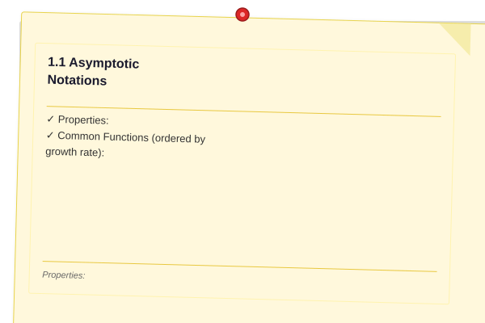
</a>


| Notation | Definition | Intuition |
|----------|-----------|-----------|
| **O(g(n))** | { f(n) \| ∃ c > 0, n₀ > 0 such that 0 ≤ f(n) ≤ c·g(n) ∀ n ≥ n₀ } | Upper bound |
| **Ω(g(n))** | { f(n) \| ∃ c > 0, n₀ > 0 such that 0 ≤ c·g(n) ≤ f(n) ∀ n ≥ n₀ } | Lower bound |
| **Θ(g(n))** | { f(n) \| ∃ c�, c₂ > 0, n₀ > 0 such that c�·g(n) ≤ f(n) ≤ c₂·g(n) ∀ n ≥ n₀ } | Tight bound |
| **o(g(n))** | { f(n) \| ∀ c > 0, ∃ n₀ > 0 such that 0 ≤ f(n) &lt; c·g(n) ∀ n ≥ n₀ } | Loose upper |
| **�‰(g(n))** | { f(n) \| ∀ c > 0, ∃ nâ‚€ > 0 such that 0 ≤ c·g(n) &lt; f(n) ∀ n ≥ nâ‚€ } | Loose lower |

**Properties:**
- Transitive: f(n) = O(g(n)) and g(n) = O(h(n)) ⇒ f(n) = O(h(n))
- Reflexive: f(n) = O(f(n))
- Symmetric for Θ only: f(n) = Θ(g(n)) � g(n) = Θ(f(n))
- Addition: f�(n) + f₂(n) = O(max(f�(n), f₂(n)))
- Multiplication: f�(n) · f₂(n) = O(f�(n) · f₂(n))

**Common Functions (ordered by growth rate):**
O(1) &lt; O(log log n) < O(log n) < O((log n)²) < O(√n) < O(n) < O(n log n) < O(n²) < O(n³) < O(2�) < O(n!) < O(n�)

### 1.2 Recurrence Relations

<a href="../../assets/images/diagrams/gate-cs-preparation/10-data-structures-algorithms/1-2-recurrence-relations-handwritten.svg" target="_blank" rel="noopener">
  
</a>
<a href="../../assets/images/diagrams/gate-cs-preparation/10-data-structures-algorithms/1-2-recurrence-relations-diagram.svg" target="_blank" rel="noopener">
  
</a>
<a href="../../assets/images/diagrams/gate-cs-preparation/10-data-structures-algorithms/1-2-recurrence-relations-sticky.svg" target="_blank" rel="noopener">
  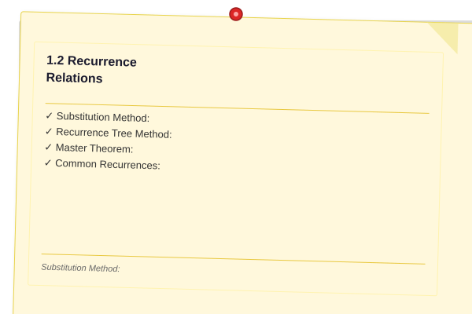
</a>


**Substitution Method:** Guess the form, prove by induction.

**Recurrence Tree Method:** Expand recurrence into a tree, sum costs per level.

**Master Theorem:** For T(n) = a·T(n/b) + f(n), a ≥ 1, b > 1:

| Case | Condition | Solution |
|------|-----------|----------|
| 1 | f(n) = O(n^{log_b a − ε}) for ε > 0 | T(n) = Θ(n^{log_b a}) |
| 2 | f(n) = Θ(n^{log_b a}·log^k n) for k ≥ 0 | T(n) = Θ(n^{log_b a}·log^{k+1} n) |
| 3 | f(n) = Ω(n^{log_b a + ε}) for ε > 0 AND a·f(n/b) ≤ c·f(n) for c &lt; 1 | T(n) = Θ(f(n)) |

**Common Recurrences:**

| Recurrence | Algorithm | Complexity |
|------------|-----------|------------|
| T(n) = T(n−1) + 1 | n! | Θ(n) |
| T(n) = T(n−1) + n | Selection sort | Θ(n²) |
| T(n) = 2T(n−1) + 1 | Tower of Hanoi | Θ(2�) |
| T(n) = T(n/2) + 1 | Binary search | Θ(log n) |
| T(n) = T(n/2) + n | → | Θ(n) |
| T(n) = 2T(n/2) + n | Merge sort | Θ(n log n) |
| T(n) = 2T(n/2) + 1 | Tree traversal | Θ(n) |
| T(n) = 2T(n/2) + n² | → | Θ(n²) |
| T(n) = 7T(n/2) + n² | Strassen's MM | Θ(n^{log₂7}) ≈ Θ(n^{2.81}) |

### 1.3 Amortized Analysis

<a href="../../assets/images/diagrams/gate-cs-preparation/10-data-structures-algorithms/1-3-amortized-analysis-handwritten.svg" target="_blank" rel="noopener">
  
</a>
<a href="../../assets/images/diagrams/gate-cs-preparation/10-data-structures-algorithms/1-3-amortized-analysis-diagram.svg" target="_blank" rel="noopener">
  
</a>
<a href="../../assets/images/diagrams/gate-cs-preparation/10-data-structures-algorithms/1-3-amortized-analysis-sticky.svg" target="_blank" rel="noopener">
  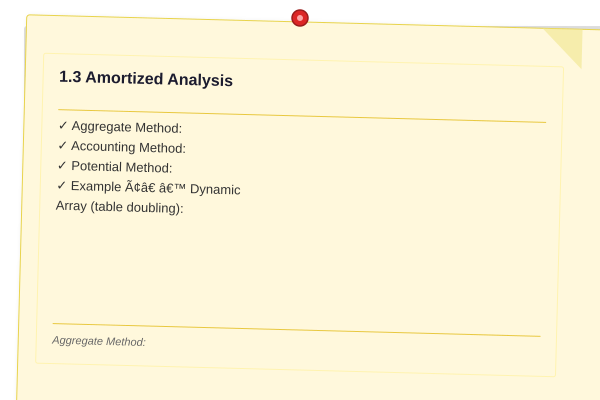
</a>


**Aggregate Method:** Compute total cost of n operations, divide by n.

**Accounting Method:** Assign different amortized costs; credit accumulates for expensive ops.

**Potential Method:** Define potential function Φ(Dᵢ). Amortized cost = actual cost + Φ(Dᵢ) − Φ(D_{i−1}).

**Example → Dynamic Array (table doubling):**
- Actual cost of push: O(1) (most), O(n) (when resizing)
- Amortized cost: O(1) per push
- Aggregate: n pushes cost O(n), so amortized = O(1)

---

## 2. Arrays

### 2.1 Representation in Memory

<a href="../../assets/images/diagrams/gate-cs-preparation/10-data-structures-algorithms/2-1-representation-in-memory-handwritten.svg" target="_blank" rel="noopener">
  
</a>
<a href="../../assets/images/diagrams/gate-cs-preparation/10-data-structures-algorithms/2-1-representation-in-memory-diagram.svg" target="_blank" rel="noopener">
  
</a>
<a href="../../assets/images/diagrams/gate-cs-preparation/10-data-structures-algorithms/2-1-representation-in-memory-sticky.svg" target="_blank" rel="noopener">
  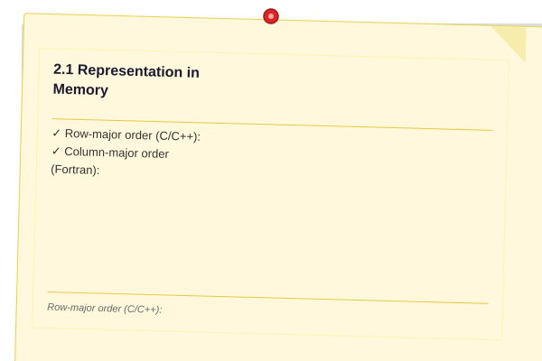
</a>


**Row-major order (C/C++):** Address(A[i][j]) = Base + (i � n + j) � size

**Column-major order (Fortran):** Address(A[i][j]) = Base + (j � m + i) � size

**For n-dimensional array A[d�][d₂]...[dₙ]:**
- Address = Base + Σ_{k=1}^{n} (iₖ � Π_{t=k+1}^{n} dₜ) � size

### 2.2 Sparse Matrices

<a href="../../assets/images/diagrams/gate-cs-preparation/10-data-structures-algorithms/2-2-sparse-matrices-handwritten.svg" target="_blank" rel="noopener">
  
</a>
<a href="../../assets/images/diagrams/gate-cs-preparation/10-data-structures-algorithms/2-2-sparse-matrices-diagram.svg" target="_blank" rel="noopener">
  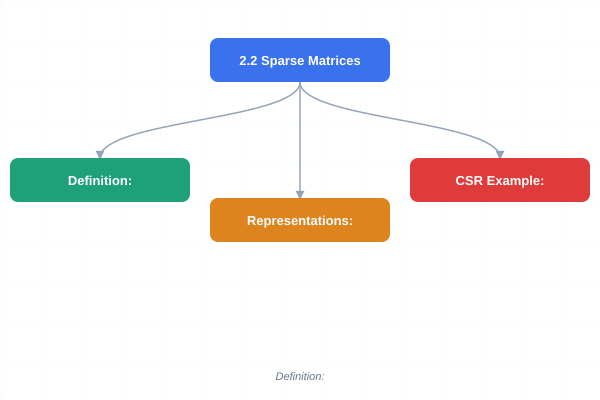
</a>
<a href="../../assets/images/diagrams/gate-cs-preparation/10-data-structures-algorithms/2-2-sparse-matrices-sticky.svg" target="_blank" rel="noopener">
  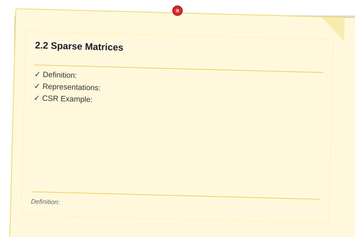
</a>


**Definition:** Matrix with mostly zero entries (nnz &lt;< m � n).

**Representations:**

| Method | Storage | Description |
|--------|---------|-------------|
| Coordinate (COO) | O(nnz � 3) | (row, col, value) triples |
| CSR (Compressed Sparse Row) | O(nnz � 2 + m + 1) | value[], col_index[], row_ptr[] |
| CSC (Compressed Sparse Column) | O(nnz � 2 + n + 1) | value[], row_index[], col_ptr[] |

**CSR Example:**
```
Matrix:
[1 0 2]
[0 3 0]
[4 0 5]

values    = [1, 2, 3, 4, 5]
col_index = [0, 2, 1, 0, 2]
row_ptr   = [0, 2, 3, 5]
```

### 2.3 GATE-Related Array Formulas

<a href="../../assets/images/diagrams/gate-cs-preparation/10-data-structures-algorithms/2-3-gate-related-array-formulas-handwritten.svg" target="_blank" rel="noopener">
  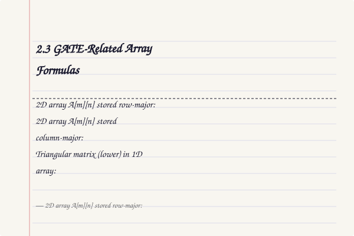
</a>
<a href="../../assets/images/diagrams/gate-cs-preparation/10-data-structures-algorithms/2-3-gate-related-array-formulas-diagram.svg" target="_blank" rel="noopener">
  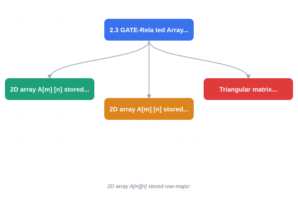
</a>
<a href="../../assets/images/diagrams/gate-cs-preparation/10-data-structures-algorithms/2-3-gate-related-array-formulas-sticky.svg" target="_blank" rel="noopener">
  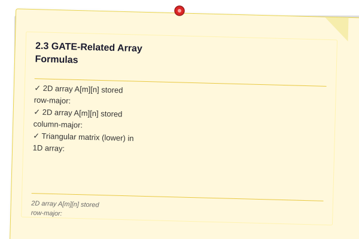
</a>


**2D array A[m][n] stored row-major:**
- A[i][j] = Base + (i � n + j) � element_size

**2D array A[m][n] stored column-major:**
- A[i][j] = Base + (j � m + i) � element_size

**Triangular matrix (lower) in 1D array:**
- Index of A[i][j] (i ≥ j) = i(i+1)/2 + j
- Total size = n(n+1)/2

---

## 3. Linked Lists

### 3.1 Types

<a href="../../assets/images/diagrams/gate-cs-preparation/10-data-structures-algorithms/3-1-types-handwritten.svg" target="_blank" rel="noopener">
  
</a>
<a href="../../assets/images/diagrams/gate-cs-preparation/10-data-structures-algorithms/3-1-types-diagram.svg" target="_blank" rel="noopener">
  
</a>
<a href="../../assets/images/diagrams/gate-cs-preparation/10-data-structures-algorithms/3-1-types-sticky.svg" target="_blank" rel="noopener">
  
</a>


| Type | Node Structure | Memory | Traversal |
|------|---------------|--------|-----------|
| Singly | data + next | O(n) | Forward only |
| Doubly | prev + data + next | O(2n) | Both directions |
| Circular (Singly) | data + next (last → head) | O(n) | Continuous |
| Circular (Doubly) | prev + data + next (circular) | O(2n) | Both, continuous |
| XOR List | data + (prev ⊕ next) | O(n) (compressed) | Both (XOR trick) |

### 3.2 Operations Complexity

<a href="../../assets/images/diagrams/gate-cs-preparation/10-data-structures-algorithms/3-2-operations-complexity-handwritten.svg" target="_blank" rel="noopener">
  
</a>
<a href="../../assets/images/diagrams/gate-cs-preparation/10-data-structures-algorithms/3-2-operations-complexity-diagram.svg" target="_blank" rel="noopener">
  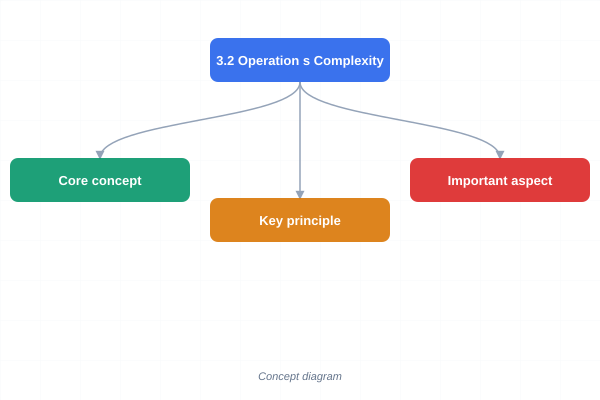
</a>
<a href="../../assets/images/diagrams/gate-cs-preparation/10-data-structures-algorithms/3-2-operations-complexity-sticky.svg" target="_blank" rel="noopener">
  
</a>


| Operation | Singly | Doubly | Circular |
|-----------|--------|--------|----------|
| Insert at head | O(1) | O(1) | O(1) |
| Insert at tail | O(n) | O(1) (with tail ptr) | O(1) |
| Delete at head | O(1) | O(1) | O(1) |
| Delete at tail | O(n) | O(1) | O(n) |
| Search | O(n) | O(n) | O(n) |

### 3.3 Floyd's Cycle Detection (Tortoise & Hare)

<a href="../../assets/images/diagrams/gate-cs-preparation/10-data-structures-algorithms/3-3-floyd-s-cycle-detection-tortoise-hare-handwritten.svg" target="_blank" rel="noopener">
  
</a>
<a href="../../assets/images/diagrams/gate-cs-preparation/10-data-structures-algorithms/3-3-floyd-s-cycle-detection-tortoise-hare-diagram.svg" target="_blank" rel="noopener">
  
</a>
<a href="../../assets/images/diagrams/gate-cs-preparation/10-data-structures-algorithms/3-3-floyd-s-cycle-detection-tortoise-hare-sticky.svg" target="_blank" rel="noopener">
  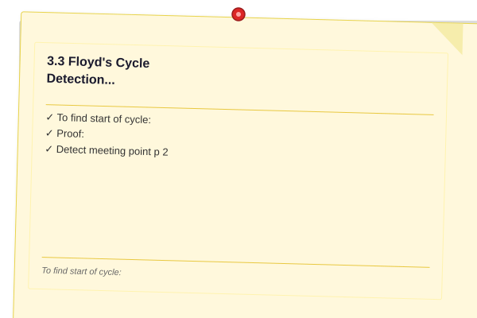
</a>


```
function hasCycle(head):
    slow = fast = head
    while fast ≠ null and fast.next ≠ null:
        slow = slow.next
        fast = fast.next.next
        if slow == fast: return True
    return False
```

**To find start of cycle:**
1. Detect meeting point p
2. Move slow to head, keep fast at p
3. Both move 1 step at a time → meet at cycle start

**Proof:** Let cycle length = L, head-to-cycle-start = k. When slow enters cycle, fast is k ahead. They meet at distance (L − k mod L) from cycle start. Resetting one pointer to head and moving both at speed 1 gives meeting at cycle start after exactly k steps.

---

## 4. Stacks & Queues

### 4.1 Stack Operations

<a href="../../assets/images/diagrams/gate-cs-preparation/10-data-structures-algorithms/4-1-stack-operations-handwritten.svg" target="_blank" rel="noopener">
  
</a>
<a href="../../assets/images/diagrams/gate-cs-preparation/10-data-structures-algorithms/4-1-stack-operations-diagram.svg" target="_blank" rel="noopener">
  
</a>
<a href="../../assets/images/diagrams/gate-cs-preparation/10-data-structures-algorithms/4-1-stack-operations-sticky.svg" target="_blank" rel="noopener">
  
</a>


| Operation | Array | Linked List |
|-----------|-------|-------------|
| push(x) | O(1) (amortized) | O(1) |
| pop() | O(1) | O(1) |
| peek() | O(1) | O(1) |
| isEmpty() | O(1) | O(1) |

### 4.2 Queue Operations

<a href="../../assets/images/diagrams/gate-cs-preparation/10-data-structures-algorithms/4-2-queue-operations-handwritten.svg" target="_blank" rel="noopener">
  
</a>
<a href="../../assets/images/diagrams/gate-cs-preparation/10-data-structures-algorithms/4-2-queue-operations-diagram.svg" target="_blank" rel="noopener">
  
</a>
<a href="../../assets/images/diagrams/gate-cs-preparation/10-data-structures-algorithms/4-2-queue-operations-sticky.svg" target="_blank" rel="noopener">
  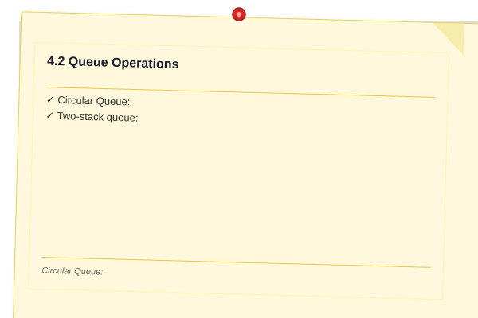
</a>


| Operation | Array (Circular) | Linked List |
|-----------|------------------|-------------|
| enqueue(x) | O(1) | O(1) |
| dequeue() | O(1) | O(1) |
| front() | O(1) | O(1) |

**Circular Queue:** rear = (rear + 1) mod SIZE; front = (front + 1) mod SIZE

**Two-stack queue:** enqueue = push to s1; dequeue = if s2 empty, pop all s1→s2, then pop s2.

### 4.3 Applications

<a href="../../assets/images/diagrams/gate-cs-preparation/10-data-structures-algorithms/4-3-applications-handwritten.svg" target="_blank" rel="noopener">
  
</a>
<a href="../../assets/images/diagrams/gate-cs-preparation/10-data-structures-algorithms/4-3-applications-diagram.svg" target="_blank" rel="noopener">
  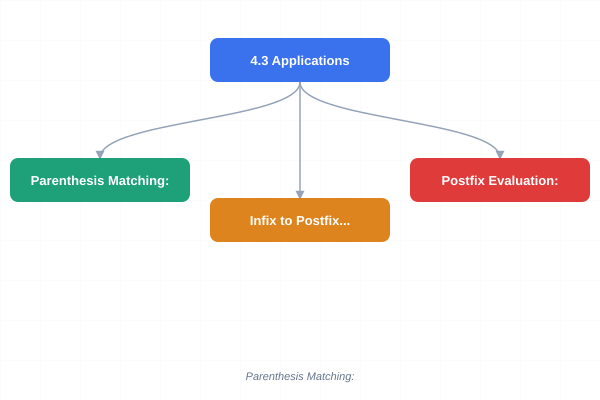
</a>
<a href="../../assets/images/diagrams/gate-cs-preparation/10-data-structures-algorithms/4-3-applications-sticky.svg" target="_blank" rel="noopener">
  
</a>


**Parenthesis Matching:**
```
function isValid(s):
    stack = []
    for c in s:
        if c in '([{': stack.push(c)
        else: if stack.isEmpty() or !match(stack.pop(), c): return False
    return stack.isEmpty()
```

**Infix to Postfix (Shunting Yard):**
- Operands → output directly
- Operators: pop while stack top has ≥ precedence (left-assoc) or > (right-assoc), then push
- '(' → push; ')' → pop until '('

**Postfix Evaluation:**
```
for each token:
    if token is operand: push(token)
    else: b = pop(), a = pop(), push(a op b)
return pop()
```

### 4.4 Expression Conversion Summary

<a href="../../assets/images/diagrams/gate-cs-preparation/10-data-structures-algorithms/4-4-expression-conversion-summary-handwritten.svg" target="_blank" rel="noopener">
  
</a>
<a href="../../assets/images/diagrams/gate-cs-preparation/10-data-structures-algorithms/4-4-expression-conversion-summary-diagram.svg" target="_blank" rel="noopener">
  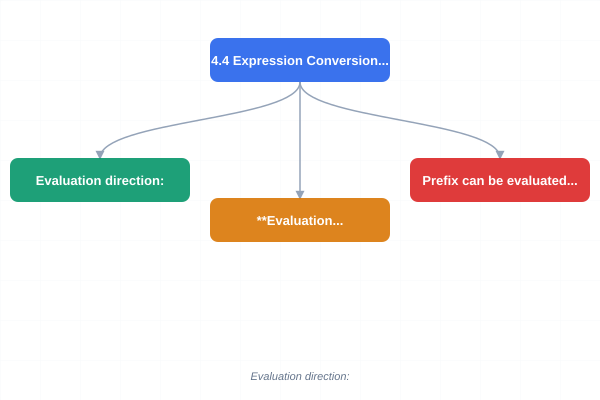
</a>
<a href="../../assets/images/diagrams/gate-cs-preparation/10-data-structures-algorithms/4-4-expression-conversion-summary-sticky.svg" target="_blank" rel="noopener">
  
</a>


| Expression | Order | Example |
|------------|-------|---------|
| Infix | operand operator operand | A + B � C |
| Prefix | operator operand operand | + A � B C |
| Postfix | operand operand operator | A B C � + |

**Evaluation direction:** Postfix uses a single stack. Prefix can be evaluated right-to-left.

---

## 5. Trees

### 5.1 Binary Tree Terminologies

<a href="../../assets/images/diagrams/gate-cs-preparation/10-data-structures-algorithms/5-1-binary-tree-terminologies-handwritten.svg" target="_blank" rel="noopener">
  
</a>
<a href="../../assets/images/diagrams/gate-cs-preparation/10-data-structures-algorithms/5-1-binary-tree-terminologies-diagram.svg" target="_blank" rel="noopener">
  
</a>
<a href="../../assets/images/diagrams/gate-cs-preparation/10-data-structures-algorithms/5-1-binary-tree-terminologies-sticky.svg" target="_blank" rel="noopener">
  
</a>


| Property | Formula |
|----------|---------|
| Max nodes at level i | 2� |
| Max nodes in tree of height h | 2ʰ�¹ − 1 |
| Min height for n nodes | ⌈log₂(n+1)⌉ − 1 |
| For n nodes, leaf count L | L = I + 1 (I = internal nodes with degree 2) |
| Full binary tree | Every node has 0 or 2 children |
| Complete binary tree | All levels full except possibly last, left-packed |
| Perfect binary tree | All levels completely full |

### 5.2 Binary Tree Traversals

<a href="../../assets/images/diagrams/gate-cs-preparation/10-data-structures-algorithms/5-2-binary-tree-traversals-handwritten.svg" target="_blank" rel="noopener">
  
</a>
<a href="../../assets/images/diagrams/gate-cs-preparation/10-data-structures-algorithms/5-2-binary-tree-traversals-diagram.svg" target="_blank" rel="noopener">
  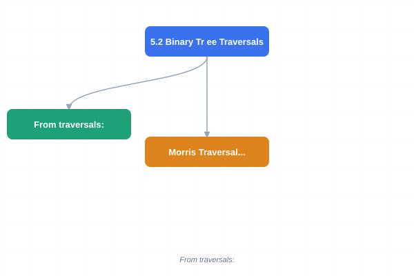
</a>
<a href="../../assets/images/diagrams/gate-cs-preparation/10-data-structures-algorithms/5-2-binary-tree-traversals-sticky.svg" target="_blank" rel="noopener">
  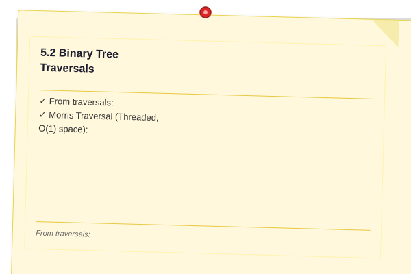
</a>


| Traversal | Order | Use Case |
|-----------|-------|----------|
| Preorder | Root → Left → Right | Copy tree, serialize |
| Inorder | Left → Root → Right | BST sort |
| Postorder | Left → Right → Root | Delete tree, expression eval |
| Level-order | BFS by level | Min height, shortest path |

**From traversals:** Inorder + (preorder/postorder) → unique tree. Only inorder alone → no.

**Morris Traversal (Threaded, O(1) space):**
```
function morrisInorder(root):
    curr = root
    while curr ≠ null:
        if curr.left == null:
            visit(curr); curr = curr.right
        else:
            pred = curr.left
            while pred.right ≠ null and pred.right ≠ curr:
                pred = pred.right
            if pred.right == null:
                pred.right = curr; curr = curr.left
            else:
                pred.right = null; visit(curr); curr = curr.right
```

### 5.3 Binary Search Tree

<a href="../../assets/images/diagrams/gate-cs-preparation/10-data-structures-algorithms/5-3-binary-search-tree-handwritten.svg" target="_blank" rel="noopener">
  
</a>
<a href="../../assets/images/diagrams/gate-cs-preparation/10-data-structures-algorithms/5-3-binary-search-tree-diagram.svg" target="_blank" rel="noopener">
  
</a>
<a href="../../assets/images/diagrams/gate-cs-preparation/10-data-structures-algorithms/5-3-binary-search-tree-sticky.svg" target="_blank" rel="noopener">
  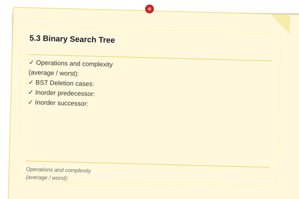
</a>


**Operations and complexity (average / worst):**

| Operation | Average | Worst (skewed) |
|-----------|---------|----------------|
| Search | O(log n) | O(n) |
| Insert | O(log n) | O(n) |
| Delete | O(log n) | O(n) |

**BST Deletion cases:**
1. Leaf: remove directly
2. One child: replace with child
3. Two children: replace with inorder successor (or predecessor), then delete it

**Inorder predecessor:** max of left subtree
**Inorder successor:** min of right subtree

### 5.4 Important Tree Problems

<a href="../../assets/images/diagrams/gate-cs-preparation/10-data-structures-algorithms/5-4-important-tree-problems-handwritten.svg" target="_blank" rel="noopener">
  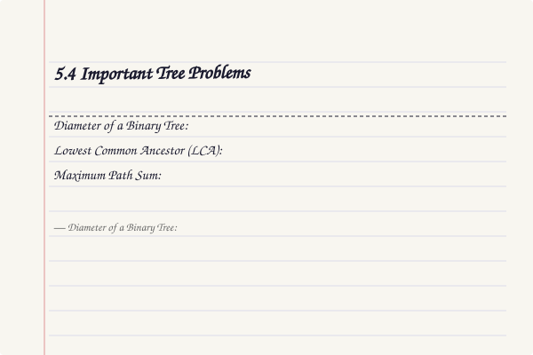
</a>
<a href="../../assets/images/diagrams/gate-cs-preparation/10-data-structures-algorithms/5-4-important-tree-problems-diagram.svg" target="_blank" rel="noopener">
  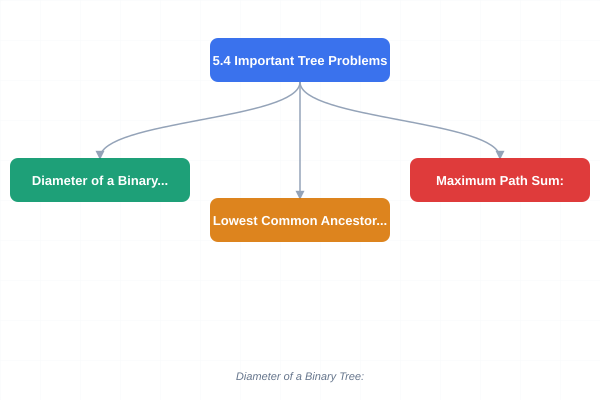
</a>
<a href="../../assets/images/diagrams/gate-cs-preparation/10-data-structures-algorithms/5-4-important-tree-problems-sticky.svg" target="_blank" rel="noopener">
  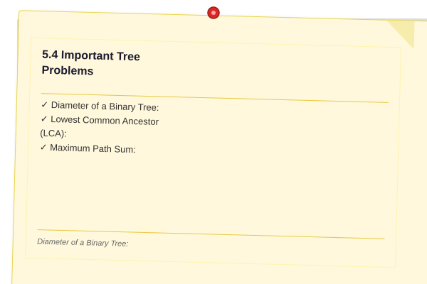
</a>


**Diameter of a Binary Tree:** Longest path between any two nodes (may not pass through root).

```
function diameter(root):
    max_diameter = 0
    function height(node):
        if node == null: return 0
        L = height(node.left)
        R = height(node.right)
        max_diameter = max(max_diameter, L + R)
        return 1 + max(L, R)
    height(root)
    return max_diameter
```

**Lowest Common Ancestor (LCA):**
```
function lca(root, p, q):
    if root == null or root == p or root == q: return root
    L = lca(root.left, p, q)
    R = lca(root.right, p, q)
    if L and R: return root
    return L if L != null else R
```

**Maximum Path Sum:** Similar to diameter, but sum instead of count.

### 5.5 Threaded Binary Tree

<a href="../../assets/images/diagrams/gate-cs-preparation/10-data-structures-algorithms/5-5-threaded-binary-tree-handwritten.svg" target="_blank" rel="noopener">
  
</a>
<a href="../../assets/images/diagrams/gate-cs-preparation/10-data-structures-algorithms/5-5-threaded-binary-tree-diagram.svg" target="_blank" rel="noopener">
  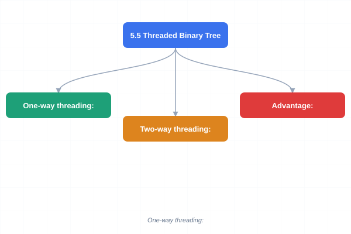
</a>
<a href="../../assets/images/diagrams/gate-cs-preparation/10-data-structures-algorithms/5-5-threaded-binary-tree-sticky.svg" target="_blank" rel="noopener">
  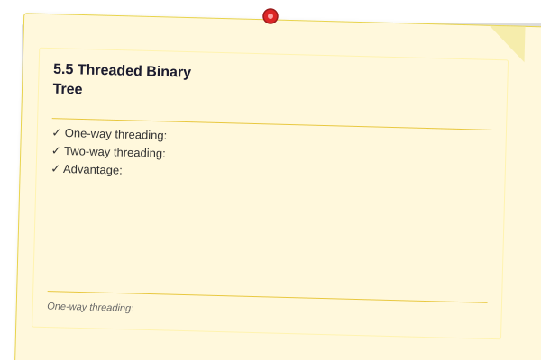
</a>


**One-way threading:** Right null pointers point to inorder successor.
**Two-way threading:** Left null pointers point to inorder predecessor.

**Advantage:** Traversal without stack or recursion (O(1) space).

### 5.6 Expression Trees

<a href="../../assets/images/diagrams/gate-cs-preparation/10-data-structures-algorithms/5-6-expression-trees-handwritten.svg" target="_blank" rel="noopener">
  
</a>
<a href="../../assets/images/diagrams/gate-cs-preparation/10-data-structures-algorithms/5-6-expression-trees-diagram.svg" target="_blank" rel="noopener">
  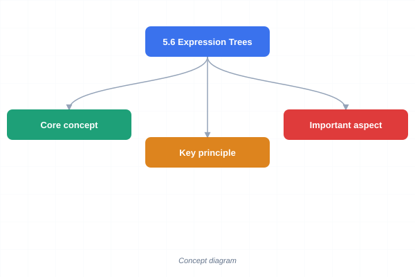
</a>
<a href="../../assets/images/diagrams/gate-cs-preparation/10-data-structures-algorithms/5-6-expression-trees-sticky.svg" target="_blank" rel="noopener">
  
</a>


- Leaf nodes = operands
- Internal nodes = operators
- Inorder traversal = infix expression (with parentheses for precedence)
- Preorder = prefix expression
- Postorder = postfix expression

### 5.7 AVL Trees

<a href="../../assets/images/diagrams/gate-cs-preparation/10-data-structures-algorithms/5-7-avl-trees-handwritten.svg" target="_blank" rel="noopener">
  
</a>
<a href="../../assets/images/diagrams/gate-cs-preparation/10-data-structures-algorithms/5-7-avl-trees-diagram.svg" target="_blank" rel="noopener">
  
</a>
<a href="../../assets/images/diagrams/gate-cs-preparation/10-data-structures-algorithms/5-7-avl-trees-sticky.svg" target="_blank" rel="noopener">
  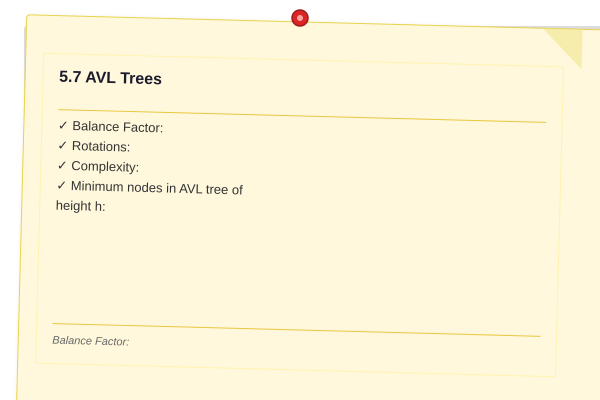
</a>


**Balance Factor:** bf(node) = height(left) − height(right) ∈ {−1, 0, 1}

**Rotations:**

| Case | Pattern | Rotation |
|------|---------|----------|
| LL | Left-Left | Right rotate on unbalanced node |
| RR | Right-Right | Left rotate on unbalanced node |
| LR | Left-Right | Left rotate on left child, then right rotate on node |
| RL | Right-Left | Right rotate on right child, then left rotate on node |

**Complexity:** Search O(log n), Insert O(log n), Delete O(log n)

**Minimum nodes in AVL tree of height h:** N(h) = N(h−1) + N(h−2) + 1, N(0) = 1, N(1) = 2

### 5.8 B-Trees and B+ Trees

<a href="../../assets/images/diagrams/gate-cs-preparation/10-data-structures-algorithms/5-8-b-trees-and-b-trees-handwritten.svg" target="_blank" rel="noopener">
  
</a>
<a href="../../assets/images/diagrams/gate-cs-preparation/10-data-structures-algorithms/5-8-b-trees-and-b-trees-diagram.svg" target="_blank" rel="noopener">
  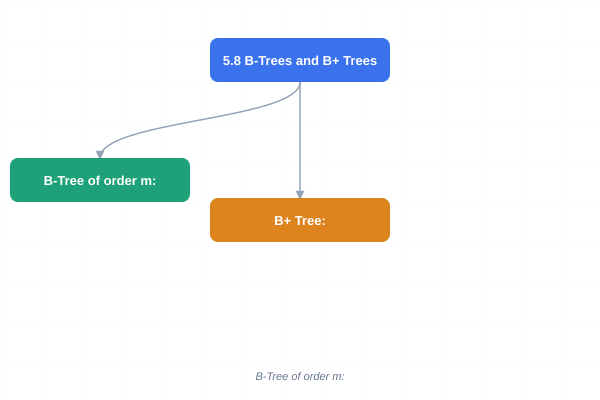
</a>
<a href="../../assets/images/diagrams/gate-cs-preparation/10-data-structures-algorithms/5-8-b-trees-and-b-trees-sticky.svg" target="_blank" rel="noopener">
  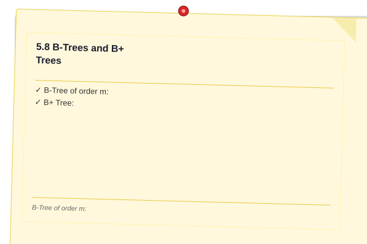
</a>


**B-Tree of order m:**
- Root: 1 to 2m keys
- Internal nodes: m to 2m keys (except root)
- All leaves at same depth
- Each internal node with k keys has k+1 children
- Search/Insert/Delete: O(log_m n)

**B+ Tree:**
- Internal nodes: only keys (routers), no data pointers
- Leaves: all keys + data pointers, linked sequentially
- Better cache performance, efficient range queries (leaf linked list)

### 5.9 Red-Black Trees

<a href="../../assets/images/diagrams/gate-cs-preparation/10-data-structures-algorithms/5-9-red-black-trees-handwritten.svg" target="_blank" rel="noopener">
  
</a>
<a href="../../assets/images/diagrams/gate-cs-preparation/10-data-structures-algorithms/5-9-red-black-trees-diagram.svg" target="_blank" rel="noopener">
  
</a>
<a href="../../assets/images/diagrams/gate-cs-preparation/10-data-structures-algorithms/5-9-red-black-trees-sticky.svg" target="_blank" rel="noopener">
  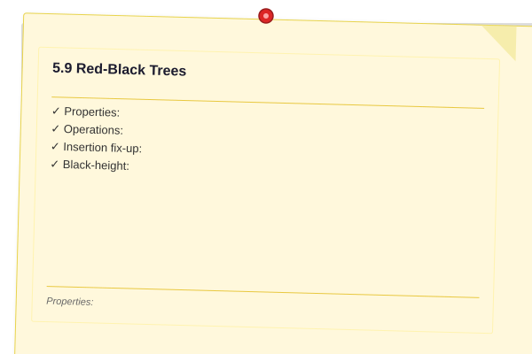
</a>


**Properties:**
1. Every node is red or black
2. Root is black
3. Leaves (null) are black
4. Red node cannot have red child (no two consecutive reds)
5. All paths from root to leaf have same #black nodes (black-height)

**Operations:** Search O(log n), Insert O(log n), Delete O(log n)

**Insertion fix-up:** Depending on uncle's color and relative position, perform rotations and color flips.

**Black-height:** bh(x) = number of black nodes on path from x to leaf (excluding x). Tree height ≤ 2 � black-height.

**2-3-4 tree correspondence:** Every Red-Black tree corresponds to a 2-3-4 tree.

### 5.10 Tries

<a href="../../assets/images/diagrams/gate-cs-preparation/10-data-structures-algorithms/5-10-tries-handwritten.svg" target="_blank" rel="noopener">
  
</a>
<a href="../../assets/images/diagrams/gate-cs-preparation/10-data-structures-algorithms/5-10-tries-diagram.svg" target="_blank" rel="noopener">
  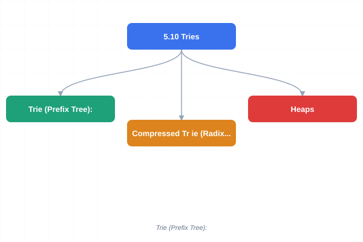
</a>
<a href="../../assets/images/diagrams/gate-cs-preparation/10-data-structures-algorithms/5-10-tries-sticky.svg" target="_blank" rel="noopener">
  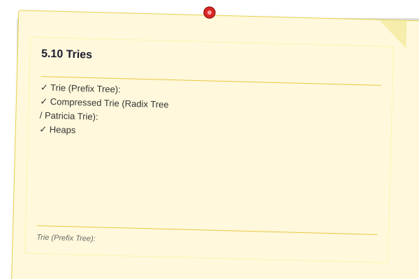
</a>


**Trie (Prefix Tree):**
- n-ary tree for string storage/retrieval
- Insert: O(|s|) where |s| = string length
- Search: O(|s|)
- Prefix search: O(|prefix|) + O(number of completions)
- Space: O(Σ total chars)

**Compressed Trie (Radix Tree / Patricia Trie):** Compress chains of single-child nodes.

---

## 6. Heaps

### 6.1 Binary Heap

<a href="../../assets/images/diagrams/gate-cs-preparation/10-data-structures-algorithms/6-1-binary-heap-handwritten.svg" target="_blank" rel="noopener">
  
</a>
<a href="../../assets/images/diagrams/gate-cs-preparation/10-data-structures-algorithms/6-1-binary-heap-diagram.svg" target="_blank" rel="noopener">
  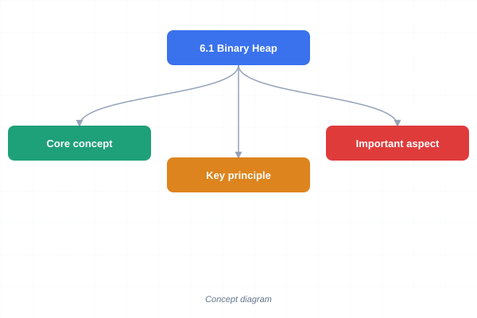
</a>
<a href="../../assets/images/diagrams/gate-cs-preparation/10-data-structures-algorithms/6-1-binary-heap-sticky.svg" target="_blank" rel="noopener">
  
</a>


| Property | Min-Heap | Max-Heap |
|----------|----------|----------|
| Root | Minimum element | Maximum element |
| Parent of i | ⌊(i−1)/2⌋ | Same |
| Left child of i | 2i + 1 | Same |
| Right child of i | 2i + 2 | Same |
| A[parent] ≤ A[child] | Yes | No |
| A[parent] ≥ A[child] | No | Yes |

### 6.2 Operations

<a href="../../assets/images/diagrams/gate-cs-preparation/10-data-structures-algorithms/6-2-operations-handwritten.svg" target="_blank" rel="noopener">
  
</a>
<a href="../../assets/images/diagrams/gate-cs-preparation/10-data-structures-algorithms/6-2-operations-diagram.svg" target="_blank" rel="noopener">
  
</a>
<a href="../../assets/images/diagrams/gate-cs-preparation/10-data-structures-algorithms/6-2-operations-sticky.svg" target="_blank" rel="noopener">
  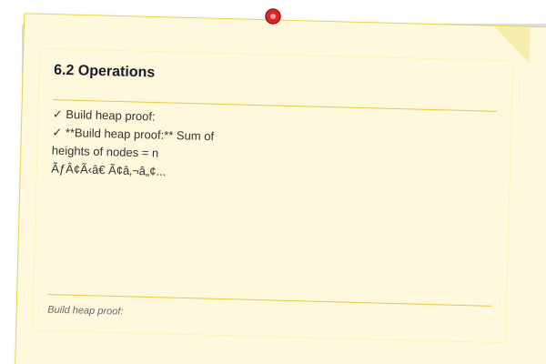
</a>


| Operation | Complexity | Description |
|-----------|------------|-------------|
| buildHeap() | O(n) | Bottom-up heapify |
| insert(x) | O(log n) | Bubble-up |
| extractMin() | O(log n) | Swap root with last, bubble-down |
| getMin() | O(1) | Return root |
| decreaseKey(i, val) | O(log n) | Bubble-up from i |
| delete(i) | O(log n) | decreaseKey to -∞, extractMin |

**Build heap proof:** Sum of heights of nodes = n − (number of leaves at levels except last) = O(n)

### 6.3 Heap Sort

<a href="../../assets/images/diagrams/gate-cs-preparation/10-data-structures-algorithms/6-3-heap-sort-handwritten.svg" target="_blank" rel="noopener">
  
</a>
<a href="../../assets/images/diagrams/gate-cs-preparation/10-data-structures-algorithms/6-3-heap-sort-diagram.svg" target="_blank" rel="noopener">
  
</a>
<a href="../../assets/images/diagrams/gate-cs-preparation/10-data-structures-algorithms/6-3-heap-sort-sticky.svg" target="_blank" rel="noopener">
  
</a>


```
function heapSort(arr):
    buildMaxHeap(arr)
    for i = n-1 down to 1:
        swap(arr[0], arr[i])
        heapSize--
        maxHeapify(arr, 0)
```

**Complexity:** O(n log n)
**Space:** O(1) in-place
**Stability:** NOT stable
**Not adaptive** → always O(n log n)

### 6.4 Priority Queue

<a href="../../assets/images/diagrams/gate-cs-preparation/10-data-structures-algorithms/6-4-priority-queue-handwritten.svg" target="_blank" rel="noopener">
  
</a>
<a href="../../assets/images/diagrams/gate-cs-preparation/10-data-structures-algorithms/6-4-priority-queue-diagram.svg" target="_blank" rel="noopener">
  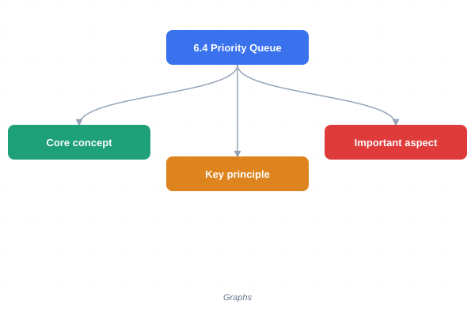
</a>
<a href="../../assets/images/diagrams/gate-cs-preparation/10-data-structures-algorithms/6-4-priority-queue-sticky.svg" target="_blank" rel="noopener">
  
</a>


| Implementation | insert | extractMin | decreaseKey | Union |
|----------------|--------|------------|-------------|-------|
| Binary Heap | O(log n) | O(log n) | O(log n) | O(n) |
| Binomial Heap | O(log n) | O(log n) | O(log n) | O(log n) |
| Fibonacci Heap | O(1) | O(log n) amortized | O(1) amortized | O(1) |

---

## 7. Graphs

### 7.1 Representations

<a href="../../assets/images/diagrams/gate-cs-preparation/10-data-structures-algorithms/7-1-representations-handwritten.svg" target="_blank" rel="noopener">
  
</a>
<a href="../../assets/images/diagrams/gate-cs-preparation/10-data-structures-algorithms/7-1-representations-diagram.svg" target="_blank" rel="noopener">
  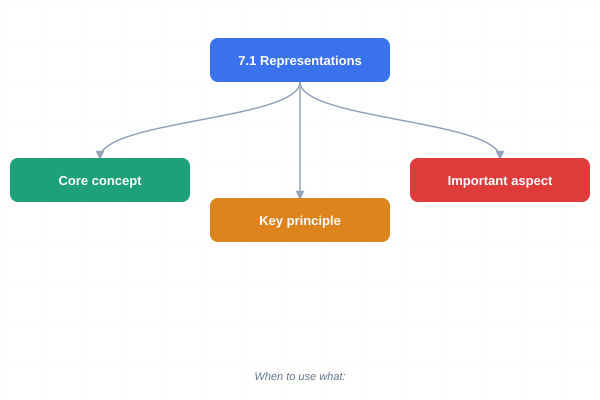
</a>
<a href="../../assets/images/diagrams/gate-cs-preparation/10-data-structures-algorithms/7-1-representations-sticky.svg" target="_blank" rel="noopener">
  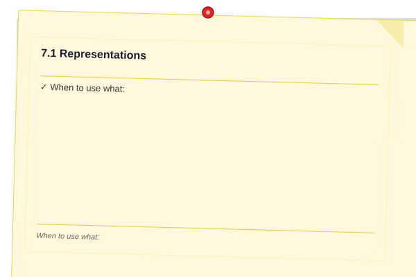
</a>


| Representation | Space | Edge Check | Neighbors | Add Edge |
|----------------|-------|------------|-----------|----------|
| Adjacency Matrix | O(V²) | O(1) | O(V) | O(1) |
| Adjacency List | O(V + E) | O(deg(v)) | O(deg(v)) | O(1) |
| Edge List | O(E) | O(E) | O(E) | O(1) |

**When to use what:**
- Dense graph (E ≈ V²) → Adjacency Matrix
- Sparse graph (E &lt;< V²) → Adjacency List

### 7.2 BFS (Breadth-First Search)

<a href="../../assets/images/diagrams/gate-cs-preparation/10-data-structures-algorithms/7-2-bfs-breadth-first-search-handwritten.svg" target="_blank" rel="noopener">
  
</a>
<a href="../../assets/images/diagrams/gate-cs-preparation/10-data-structures-algorithms/7-2-bfs-breadth-first-search-diagram.svg" target="_blank" rel="noopener">
  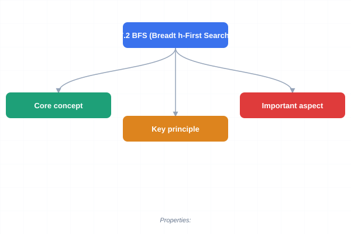
</a>
<a href="../../assets/images/diagrams/gate-cs-preparation/10-data-structures-algorithms/7-2-bfs-breadth-first-search-sticky.svg" target="_blank" rel="noopener">
  
</a>


```
function bfs(start):
    visited = {start}; queue = [start]
    while queue not empty:
        v = queue.dequeue()
        for u in adjacency[v]:
            if u not in visited:
                visited.add(u)
                queue.enqueue(u)
                parent[u] = v
```

**Properties:**
- Finds shortest path in unweighted graph
- Complexity: O(V + E)
- BFS tree has shortest path from source to all reachable nodes
- Uses queue

### 7.3 DFS (Depth-First Search)

<a href="../../assets/images/diagrams/gate-cs-preparation/10-data-structures-algorithms/7-3-dfs-depth-first-search-handwritten.svg" target="_blank" rel="noopener">
  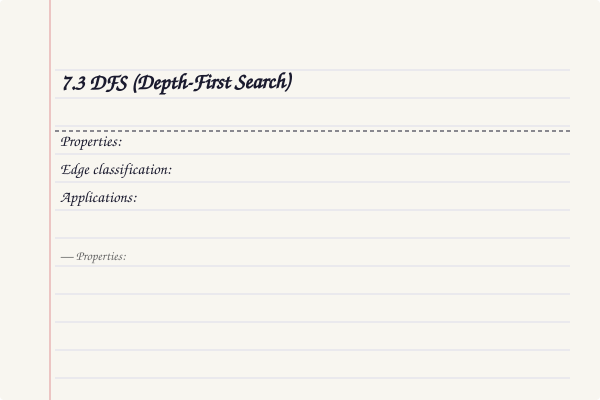
</a>
<a href="../../assets/images/diagrams/gate-cs-preparation/10-data-structures-algorithms/7-3-dfs-depth-first-search-diagram.svg" target="_blank" rel="noopener">
  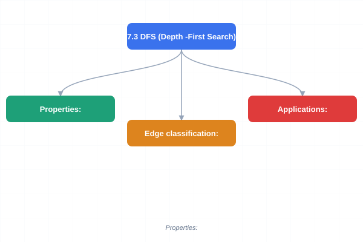
</a>
<a href="../../assets/images/diagrams/gate-cs-preparation/10-data-structures-algorithms/7-3-dfs-depth-first-search-sticky.svg" target="_blank" rel="noopener">
  
</a>


```
function dfs(start):
    visited.add(start)
    for u in adjacency[start]:
        if u not in visited:
            parent[u] = start
            dfs(u)
```

**Properties:**
- Complexity: O(V + E)
- Uses stack (recursion or explicit)
- Produces DFS forest with tree, back, forward, and cross edges

**Edge classification:**
| Edge | Condition |
|------|-----------|
| Tree | v is first discovered from u |
| Back | v is ancestor of u (cycle detection) |
| Forward | v is descendant of u (already visited) |
| Cross | None of the above |

**Applications:**
- Cycle detection (back edge exists) → O(V + E)
- Topological sort (reverse of finish times)
- Strongly connected components

### 7.4 Topological Sort

<a href="../../assets/images/diagrams/gate-cs-preparation/10-data-structures-algorithms/7-4-topological-sort-handwritten.svg" target="_blank" rel="noopener">
  
</a>
<a href="../../assets/images/diagrams/gate-cs-preparation/10-data-structures-algorithms/7-4-topological-sort-diagram.svg" target="_blank" rel="noopener">
  
</a>
<a href="../../assets/images/diagrams/gate-cs-preparation/10-data-structures-algorithms/7-4-topological-sort-sticky.svg" target="_blank" rel="noopener">
  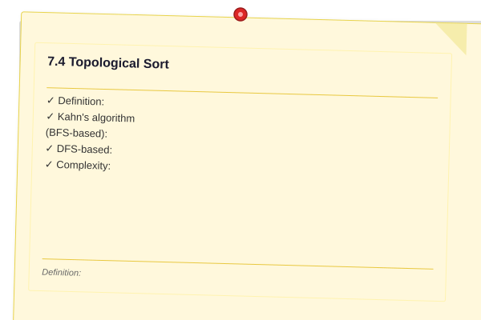
</a>


**Definition:** Linear ordering of DAG vertices such that for every edge u→v, u appears before v.

**Kahn's algorithm (BFS-based):**
```
function topologicalSort(graph):
    inDegree = computeInDegrees(graph)
    queue = [v for v in vertices if inDegree[v] == 0]
    result = []
    while queue not empty:
        v = queue.dequeue(); result.append(v)
        for u in adjacency[v]:
            inDegree[u]--
            if inDegree[u] == 0: queue.enqueue(u)
    return result if len(result) == V else "Cycle detected"
```

**DFS-based:** Perform DFS, append to list on finish (exit time), reverse at end.

**Complexity:** O(V + E)

### 7.5 Minimum Spanning Tree

<a href="../../assets/images/diagrams/gate-cs-preparation/10-data-structures-algorithms/7-5-minimum-spanning-tree-handwritten.svg" target="_blank" rel="noopener">
  
</a>
<a href="../../assets/images/diagrams/gate-cs-preparation/10-data-structures-algorithms/7-5-minimum-spanning-tree-diagram.svg" target="_blank" rel="noopener">
  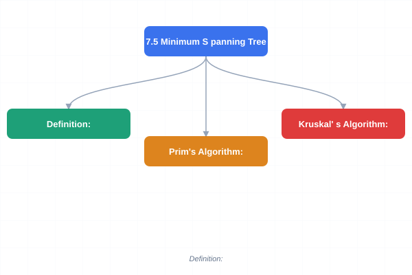
</a>
<a href="../../assets/images/diagrams/gate-cs-preparation/10-data-structures-algorithms/7-5-minimum-spanning-tree-sticky.svg" target="_blank" rel="noopener">
  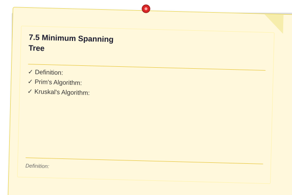
</a>


**Definition:** Subset of edges connecting all vertices with minimum total weight.

| Algorithm | Strategy | Complexity | Data Structure |
|-----------|----------|------------|----------------|
| Prim's | Grow single tree | O((V+E) log V) | Binary heap (priority queue) |
| Kruskal's | Add smallest safe edges | O(E log V) | Union-Find (DSU) |

**Prim's Algorithm:**
```
function prim(graph, start):
    priorityQueue = [(0, start)]  // (weight, vertex)
    visited = set()
    total = 0
    while priorityQueue not empty:
        w, v = pq.extractMin()
        if v in visited: continue
        visited.add(v); total += w
        for (u, w2) in adjacency[v]:
            if u not in visited: pq.insert((w2, u))
    return total
```

**Kruskal's Algorithm:**
```
function kruskal(edges, V):
    sort(edges by weight)
    dsu = UnionFind(V)
    mst = []
    for (u, v, w) in edges:
        if dsu.find(u) != dsu.find(v):
            dsu.union(u, v)
            mst.append((u, v, w))
    return mst
```

### 7.6 Shortest Path Algorithms

<a href="../../assets/images/diagrams/gate-cs-preparation/10-data-structures-algorithms/7-6-shortest-path-algorithms-handwritten.svg" target="_blank" rel="noopener">
  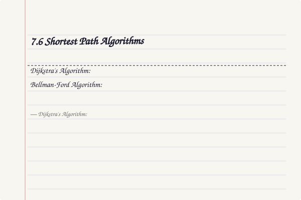
</a>
<a href="../../assets/images/diagrams/gate-cs-preparation/10-data-structures-algorithms/7-6-shortest-path-algorithms-diagram.svg" target="_blank" rel="noopener">
  
</a>
<a href="../../assets/images/diagrams/gate-cs-preparation/10-data-structures-algorithms/7-6-shortest-path-algorithms-sticky.svg" target="_blank" rel="noopener">
  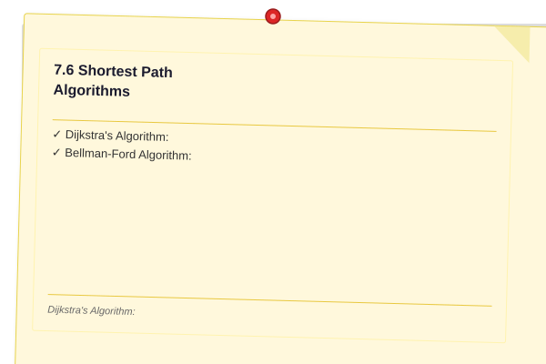
</a>


| Algorithm | Type | Complexity | Limitation |
|-----------|------|------------|------------|
| Dijkstra | Single-source | O((V+E) log V) | No negative edges |
| Bellman-Ford | Single-source | O(VE) | Handles negative, detects cycles |
| Floyd-Warshall | All-pairs | O(V³) | Handles negative, no neg cycles |
| DAG Shortest Path | Single-source (DAG) | O(V+E) | Works only on DAGs |

**Dijkstra's Algorithm:**
```
function dijkstra(graph, start):
    dist = [∞] * V; dist[start] = 0
    pq = [(0, start)]
    while pq not empty:
        d, v = pq.extractMin()
        if d > dist[v]: continue
        for (u, w) in adjacency[v]:
            if dist[v] + w < dist[u]:
                dist[u] = dist[v] + w
                pq.insert((dist[u], u))
    return dist
```

**Bellman-Ford Algorithm:**
```
function bellmanFord(edges, V, start):
    dist = [∞] * V; dist[start] = 0
    for i in range(V-1):
        for (u, v, w) in edges:
            if dist[u] != ∞ and dist[u] + w < dist[v]:
                dist[v] = dist[u] + w
    // Vth iteration for negative cycle detection
    for (u, v, w) in edges:
        if dist[u] != ∞ and dist[u] + w < dist[v]:
            return "Negative cycle"
    return dist
```

### 7.7 Strongly Connected Components

<a href="../../assets/images/diagrams/gate-cs-preparation/10-data-structures-algorithms/7-7-strongly-connected-components-handwritten.svg" target="_blank" rel="noopener">
  
</a>
<a href="../../assets/images/diagrams/gate-cs-preparation/10-data-structures-algorithms/7-7-strongly-connected-components-diagram.svg" target="_blank" rel="noopener">
  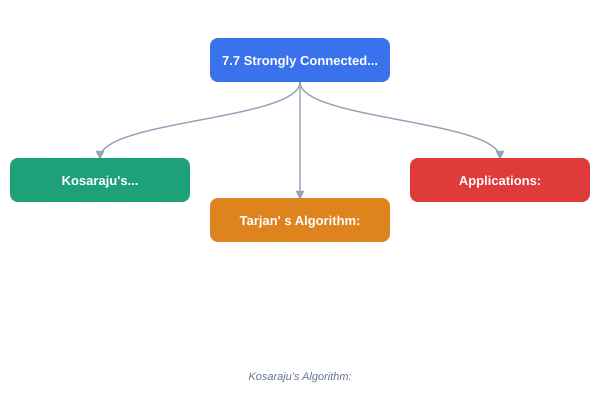
</a>
<a href="../../assets/images/diagrams/gate-cs-preparation/10-data-structures-algorithms/7-7-strongly-connected-components-sticky.svg" target="_blank" rel="noopener">
  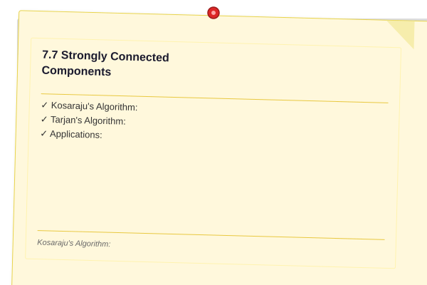
</a>


**Kosaraju's Algorithm:**
1. Perform DFS on original graph, record finish times
2. Compute transpose (reverse all edges)
3. Perform DFS on transposed graph in decreasing finish time order
4. Each DFS tree = one SCC

**Tarjan's Algorithm:**
- Single DFS using low-link values and a stack
- Complexity: O(V + E)

**Applications:** Condensation graphs, 2-SAT, dependency analysis.

### 7.8 Union-Find (Disjoint Set Union)

<a href="../../assets/images/diagrams/gate-cs-preparation/10-data-structures-algorithms/7-8-union-find-disjoint-set-union-handwritten.svg" target="_blank" rel="noopener">
  
</a>
<a href="../../assets/images/diagrams/gate-cs-preparation/10-data-structures-algorithms/7-8-union-find-disjoint-set-union-diagram.svg" target="_blank" rel="noopener">
  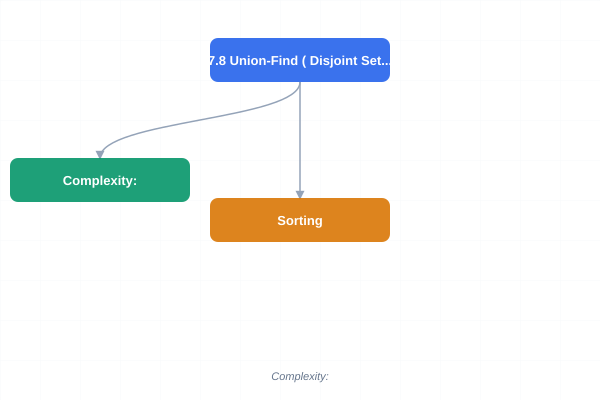
</a>
<a href="../../assets/images/diagrams/gate-cs-preparation/10-data-structures-algorithms/7-8-union-find-disjoint-set-union-sticky.svg" target="_blank" rel="noopener">
  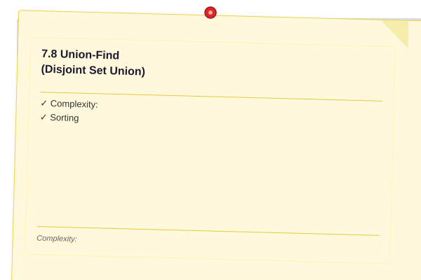
</a>


```
class UnionFind:
    parent = [i for i in range(n)]
    rank = [0] * n

    function find(x):
        if parent[x] != x:
            parent[x] = find(parent[x])  // path compression
        return parent[x]

    function union(x, y):
        px, py = find(x), find(y)
        if px == py: return False
        if rank[px] < rank[py]: parent[px] = py  // union by rank
        elif rank[px] > rank[py]: parent[py] = px
        else: parent[py] = px; rank[px]++
        return True
```

**Complexity:** O(α(n)) per operation where α is inverse Ackermann function (essentially O(1)).

---

## 8. Sorting

### 8.1 Comparison Sorts → Complexity Summary

<a href="../../assets/images/diagrams/gate-cs-preparation/10-data-structures-algorithms/8-1-comparison-sorts-complexity-summary-handwritten.svg" target="_blank" rel="noopener">
  
</a>
<a href="../../assets/images/diagrams/gate-cs-preparation/10-data-structures-algorithms/8-1-comparison-sorts-complexity-summary-diagram.svg" target="_blank" rel="noopener">
  
</a>
<a href="../../assets/images/diagrams/gate-cs-preparation/10-data-structures-algorithms/8-1-comparison-sorts-complexity-summary-sticky.svg" target="_blank" rel="noopener">
  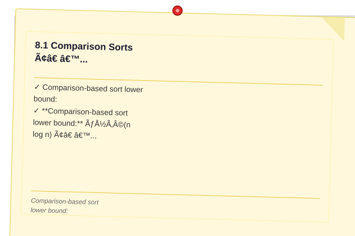
</a>


| Algorithm | Best | Average | Worst | Space | Stable | In-place | Adaptive |
|-----------|------|---------|-------|-------|--------|----------|----------|
| Bubble | O(n) | O(n²) | O(n²) | O(1) | Yes | Yes | Yes |
| Insertion | O(n) | O(n²) | O(n²) | O(1) | Yes | Yes | Yes |
| Selection | O(n²) | O(n²) | O(n²) | O(1) | No | Yes | No |
| Merge | O(n log n) | O(n log n) | O(n log n) | O(n) | Yes | No | No |
| Quick | O(n log n) | O(n log n) | O(n²) | O(log n) | No | Yes | No |
| Heap | O(n log n) | O(n log n) | O(n log n) | O(1) | No | Yes | No |
| Shell | O(n log n) | O(n^{4/3}) | O(n^{3/2}) | O(1) | No | Yes | Yes |
| Timsort | O(n) | O(n log n) | O(n log n) | O(n) | Yes | Yes | Yes |

**Comparison-based sort lower bound:** Ω(n log n) → proven by decision tree with n! leaves.

### 8.2 Quick Sort Details

<a href="../../assets/images/diagrams/gate-cs-preparation/10-data-structures-algorithms/8-2-quick-sort-details-handwritten.svg" target="_blank" rel="noopener">
  
</a>
<a href="../../assets/images/diagrams/gate-cs-preparation/10-data-structures-algorithms/8-2-quick-sort-details-diagram.svg" target="_blank" rel="noopener">
  
</a>
<a href="../../assets/images/diagrams/gate-cs-preparation/10-data-structures-algorithms/8-2-quick-sort-details-sticky.svg" target="_blank" rel="noopener">
  
</a>


```
function quickSort(arr, low, high):
    if low < high:
        pi = partition(arr, low, high)
        quickSort(arr, low, pi-1)
        quickSort(arr, pi+1, high)

function partition(arr, low, high):  // Lomuto
    pivot = arr[high]
    i = low - 1
    for j = low to high-1:
        if arr[j] <= pivot: i++; swap(arr[i], arr[j])
    swap(arr[i+1], arr[high])
    return i+1
```

**Hoare Partition:**
```
function partition(arr, low, high):
    pivot = arr[low]; i = low-1; j = high+1
    while True:
        do i++ while arr[i] < pivot
        do j-- while arr[j] > pivot
        if i >= j: return j
        swap(arr[i], arr[j])
```

**Worst case:** Already sorted or reverse sorted (Lomuto with last/first pivot). Avoided by:
- Random pivot
- Median-of-three pivot selection

### 8.3 Merge Sort Details

<a href="../../assets/images/diagrams/gate-cs-preparation/10-data-structures-algorithms/8-3-merge-sort-details-handwritten.svg" target="_blank" rel="noopener">
  
</a>
<a href="../../assets/images/diagrams/gate-cs-preparation/10-data-structures-algorithms/8-3-merge-sort-details-diagram.svg" target="_blank" rel="noopener">
  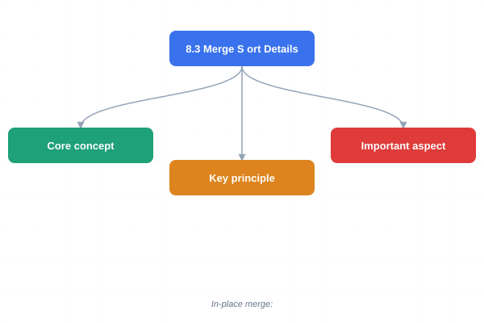
</a>
<a href="../../assets/images/diagrams/gate-cs-preparation/10-data-structures-algorithms/8-3-merge-sort-details-sticky.svg" target="_blank" rel="noopener">
  
</a>


```
function mergeSort(arr, left, right):
    if left < right:
        mid = left + (right-left)/2
        mergeSort(arr, left, mid)
        mergeSort(arr, mid+1, right)
        merge(arr, left, mid, right)
```

**In-place merge:** O(n log n) with O(1) space possible but more complex.

### 8.4 Non-Comparison Sorts

<a href="../../assets/images/diagrams/gate-cs-preparation/10-data-structures-algorithms/8-4-non-comparison-sorts-handwritten.svg" target="_blank" rel="noopener">
  
</a>
<a href="../../assets/images/diagrams/gate-cs-preparation/10-data-structures-algorithms/8-4-non-comparison-sorts-diagram.svg" target="_blank" rel="noopener">
  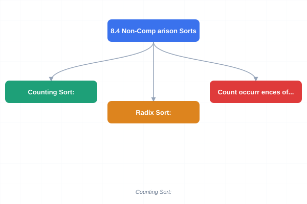
</a>
<a href="../../assets/images/diagrams/gate-cs-preparation/10-data-structures-algorithms/8-4-non-comparison-sorts-sticky.svg" target="_blank" rel="noopener">
  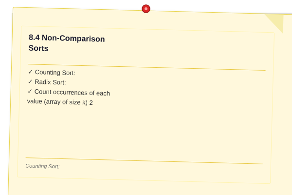
</a>


| Algorithm | Type | Complexity | Space | Stable | Constraint |
|-----------|------|------------|-------|--------|------------|
| Counting Sort | Integer | O(n + k) | O(k) | Yes | Integer range k |
| Radix Sort | Integer | O(d·(n + b)) | O(n + b) | Yes | d digits, base b |
| Bucket Sort | Float | O(n + k) avg | O(n) | Yes | Uniform distribution |

**Counting Sort:**
1. Count occurrences of each value (array of size k)
2. Compute prefix sums (positions)
3. Build output in reverse to maintain stability

**Radix Sort:**
- LSD first: sort by least significant digit up to most significant
- Each pass uses a stable sort (usually Counting Sort)
- Complexity: O(d·(n + b)) where d = #digits, b = base

### 8.5 Stability and In-Place Properties

<a href="../../assets/images/diagrams/gate-cs-preparation/10-data-structures-algorithms/8-5-stability-and-in-place-properties-handwritten.svg" target="_blank" rel="noopener">
  
</a>
<a href="../../assets/images/diagrams/gate-cs-preparation/10-data-structures-algorithms/8-5-stability-and-in-place-properties-diagram.svg" target="_blank" rel="noopener">
  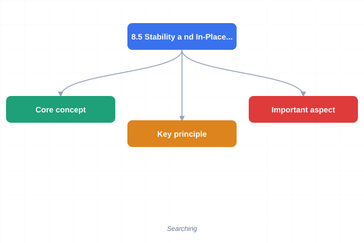
</a>
<a href="../../assets/images/diagrams/gate-cs-preparation/10-data-structures-algorithms/8-5-stability-and-in-place-properties-sticky.svg" target="_blank" rel="noopener">
  
</a>


| Sorting | Stable? | In-Place? | GATE Trap |
|---------|---------|-----------|-----------|
| Bubble | Yes | Yes | → |
| Insertion | Yes | Yes | → |
| Selection | No | Yes | Often asked: not stable |
| Merge | Yes | No (needs O(n) aux) | In-place variant is O(n log² n) |
| Quick | No | Yes (recursive stack) | Lomuto not stable; Hoare also not stable |
| Heap | No | Yes | → |
| Counting | Yes | No (needs O(k)) | → |
| Radix | Yes | No | Stable inner sort is critical |

---

## 9. Searching

### 9.1 Linear Search

<a href="../../assets/images/diagrams/gate-cs-preparation/10-data-structures-algorithms/9-1-linear-search-handwritten.svg" target="_blank" rel="noopener">
  
</a>
<a href="../../assets/images/diagrams/gate-cs-preparation/10-data-structures-algorithms/9-1-linear-search-diagram.svg" target="_blank" rel="noopener">
  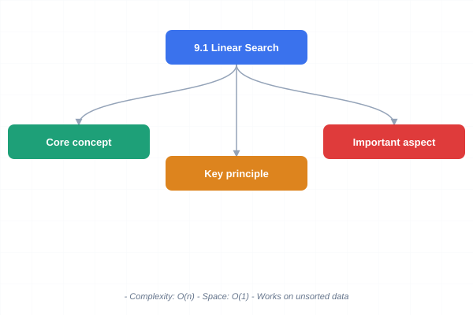
</a>
<a href="../../assets/images/diagrams/gate-cs-preparation/10-data-structures-algorithms/9-1-linear-search-sticky.svg" target="_blank" rel="noopener">
  
</a>


- Complexity: O(n)
- Space: O(1)
- Works on unsorted data

### 9.2 Binary Search

<a href="../../assets/images/diagrams/gate-cs-preparation/10-data-structures-algorithms/9-2-binary-search-handwritten.svg" target="_blank" rel="noopener">
  
</a>
<a href="../../assets/images/diagrams/gate-cs-preparation/10-data-structures-algorithms/9-2-binary-search-diagram.svg" target="_blank" rel="noopener">
  
</a>
<a href="../../assets/images/diagrams/gate-cs-preparation/10-data-structures-algorithms/9-2-binary-search-sticky.svg" target="_blank" rel="noopener">
  
</a>


```
function binarySearch(arr, target):
    left = 0; right = len(arr)-1
    while left <= right:
        mid = left + (right-left)//2
        if arr[mid] == target: return mid
        if arr[mid] < target: left = mid+1
        else: right = mid-1
    return -1
```

- Complexity: O(log n)
- Space: O(1) iterative, O(log n) recursive
- Requires sorted array

### 9.3 Interpolation Search

<a href="../../assets/images/diagrams/gate-cs-preparation/10-data-structures-algorithms/9-3-interpolation-search-handwritten.svg" target="_blank" rel="noopener">
  
</a>
<a href="../../assets/images/diagrams/gate-cs-preparation/10-data-structures-algorithms/9-3-interpolation-search-diagram.svg" target="_blank" rel="noopener">
  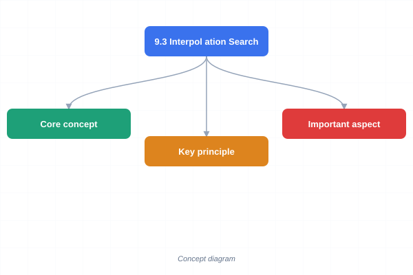
</a>
<a href="../../assets/images/diagrams/gate-cs-preparation/10-data-structures-algorithms/9-3-interpolation-search-sticky.svg" target="_blank" rel="noopener">
  
</a>


```
function interpolationSearch(arr, target):
    left = 0; right = len(arr)-1
    while left <= right and target >= arr[left] and target <= arr[right]:
        pos = left + ((target-arr[left]) * (right-left)) // (arr[right]-arr[left])
        if arr[pos] == target: return pos
        if arr[pos] < target: left = pos+1
        else: right = pos-1
    return -1
```

- Best: O(log log n) for uniformly distributed data
- Worst: O(n)
- Requires sorted array with uniform distribution

### 9.4 Ternary Search

<a href="../../assets/images/diagrams/gate-cs-preparation/10-data-structures-algorithms/9-4-ternary-search-handwritten.svg" target="_blank" rel="noopener">
  
</a>
<a href="../../assets/images/diagrams/gate-cs-preparation/10-data-structures-algorithms/9-4-ternary-search-diagram.svg" target="_blank" rel="noopener">
  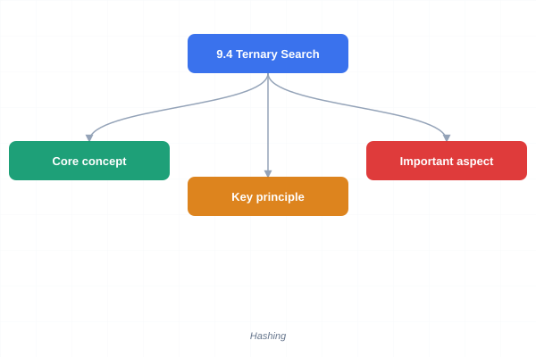
</a>
<a href="../../assets/images/diagrams/gate-cs-preparation/10-data-structures-algorithms/9-4-ternary-search-sticky.svg" target="_blank" rel="noopener">
  
</a>


- Divide array into 3 parts, compare target with two midpoints
- Complexity: O(log₃ n) → same as binary search asymptotically (worse constant)
- Used for unimodal functions (finding maximum/minimum of a bitonic sequence)

---

## 10. Hashing

### 10.1 Hash Functions

<a href="../../assets/images/diagrams/gate-cs-preparation/10-data-structures-algorithms/10-1-hash-functions-handwritten.svg" target="_blank" rel="noopener">
  
</a>
<a href="../../assets/images/diagrams/gate-cs-preparation/10-data-structures-algorithms/10-1-hash-functions-diagram.svg" target="_blank" rel="noopener">
  
</a>
<a href="../../assets/images/diagrams/gate-cs-preparation/10-data-structures-algorithms/10-1-hash-functions-sticky.svg" target="_blank" rel="noopener">
  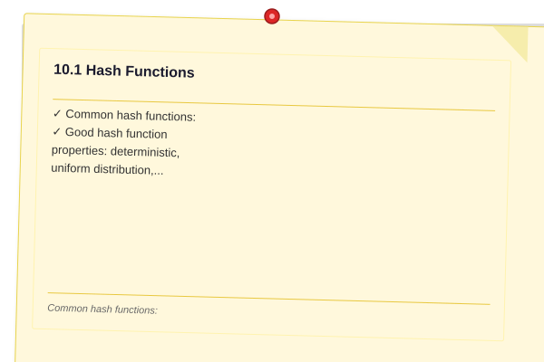
</a>


Good hash function properties: deterministic, uniform distribution, fast computation.

**Common hash functions:**
- Division method: h(k) = k mod m (avoid m = 2áµ– → use prime)
- Multiplication method: h(k) = ⌊m·(k·A mod 1)⌋ where A ≈ (√5−1)/2
- Universal hashing: h(k) = ((a·k + b) mod p) mod m

### 10.2 Collision Resolution

<a href="../../assets/images/diagrams/gate-cs-preparation/10-data-structures-algorithms/10-2-collision-resolution-handwritten.svg" target="_blank" rel="noopener">
  
</a>
<a href="../../assets/images/diagrams/gate-cs-preparation/10-data-structures-algorithms/10-2-collision-resolution-diagram.svg" target="_blank" rel="noopener">
  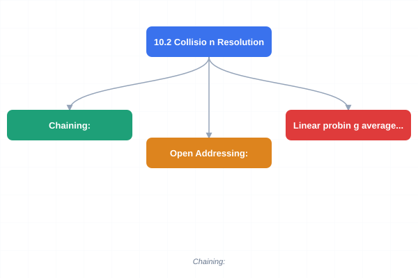
</a>
<a href="../../assets/images/diagrams/gate-cs-preparation/10-data-structures-algorithms/10-2-collision-resolution-sticky.svg" target="_blank" rel="noopener">
  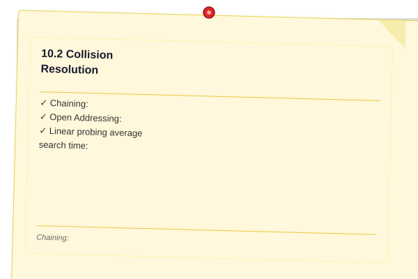
</a>


**Chaining:**
- Each slot holds linked list of keys
- Load factor α = n/m
- Expected search: O(1 + α)
- Worst case: O(n) (all keys hash to same slot)

**Open Addressing:**
- All keys stored in table slots directly
- Load factor α < 1
- Probe sequence determines search path

| Probing | Sequence | Primary Clustering | Secondary Clustering |
|---------|----------|-------------------|---------------------|
| Linear | h(k,i) = (h′(k) + i) mod m | Yes | N/A |
| Quadratic | h(k,i) = (h′(k) + c�i + c₂i²) mod m | No | Yes |
| Double | h(k,i) = (h�(k) + i·h₂(k)) mod m | No | No |

**Linear probing average search time:** ½(1 + 1/(1−α)) for successful, ½(1 + 1/(1−α)²) for unsuccessful.

### 10.3 Rehashing

<a href="../../assets/images/diagrams/gate-cs-preparation/10-data-structures-algorithms/10-3-rehashing-handwritten.svg" target="_blank" rel="noopener">
  
</a>
<a href="../../assets/images/diagrams/gate-cs-preparation/10-data-structures-algorithms/10-3-rehashing-diagram.svg" target="_blank" rel="noopener">
  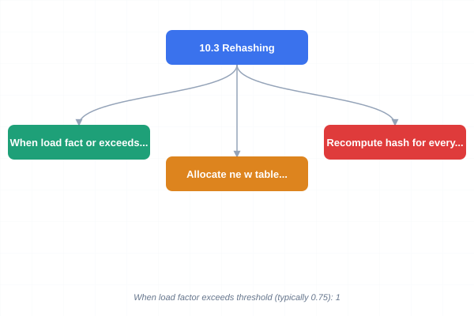
</a>
<a href="../../assets/images/diagrams/gate-cs-preparation/10-data-structures-algorithms/10-3-rehashing-sticky.svg" target="_blank" rel="noopener">
  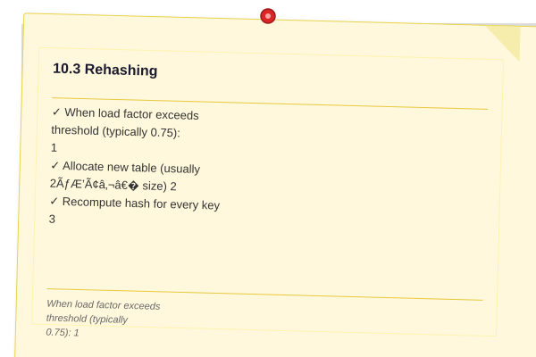
</a>


When load factor exceeds threshold (typically 0.75):
1. Allocate new table (usually 2� size)
2. Recompute hash for every key
3. Insert into new table
- Complexity: O(n) per rehash, amortized O(1) per insertion

### 10.4 Perfect Hashing

<a href="../../assets/images/diagrams/gate-cs-preparation/10-data-structures-algorithms/10-4-perfect-hashing-handwritten.svg" target="_blank" rel="noopener">
  
</a>
<a href="../../assets/images/diagrams/gate-cs-preparation/10-data-structures-algorithms/10-4-perfect-hashing-diagram.svg" target="_blank" rel="noopener">
  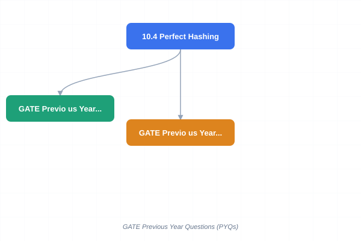
</a>
<a href="../../assets/images/diagrams/gate-cs-preparation/10-data-structures-algorithms/10-4-perfect-hashing-sticky.svg" target="_blank" rel="noopener">
  
</a>


- No collisions (static key set)
- Two-level scheme: first hash maps to slot, second-level per-slot hash is perfect
- Expected O(n) space

---

## 11. GATE Previous Year Questions (PYQs)

### Arrays

<a href="../../assets/images/diagrams/gate-cs-preparation/10-data-structures-algorithms/arrays-handwritten.svg" target="_blank" rel="noopener">
  
</a>
<a href="../../assets/images/diagrams/gate-cs-preparation/10-data-structures-algorithms/arrays-diagram.svg" target="_blank" rel="noopener">
  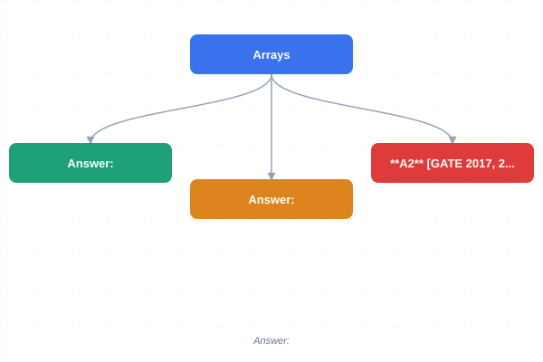
</a>
<a href="../../assets/images/diagrams/gate-cs-preparation/10-data-structures-algorithms/arrays-sticky.svg" target="_blank" rel="noopener">
  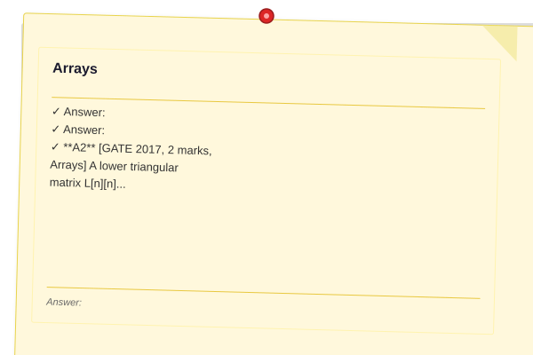
</a>


**A1** [GATE 2015, 1 mark, Arrays] An array A[10][20] is stored in row-major order. Base address = 100, element size = 2 bytes. Address of A[5][10] is:

- (A) 300 (B) 310 (C) 320 (D) 330

**Answer:** B. A[5][10] = 100 + (5�20 + 10)�2 = 100 + 110�2 = 100 + 220 = 320.

**A2** [GATE 2017, 2 marks, Arrays] A lower triangular matrix L[n][n] is stored in 1D array of size n(n+1)/2. Index of L[i][j] (i ≥ j) in 1D array (0-indexed) is:

- (A) i(i−1)/2 + j (B) i(i+1)/2 + j (C) i(i−1)/2 + j−1 (D) i(i+1)/2 + j−1

**Answer:** C. For 1-indexed: i(i−1)/2 + j. For 0-indexed: i(i+1)/2 + j.

### Linked Lists

<a href="../../assets/images/diagrams/gate-cs-preparation/10-data-structures-algorithms/linked-lists-handwritten.svg" target="_blank" rel="noopener">
  
</a>
<a href="../../assets/images/diagrams/gate-cs-preparation/10-data-structures-algorithms/linked-lists-diagram.svg" target="_blank" rel="noopener">
  
</a>
<a href="../../assets/images/diagrams/gate-cs-preparation/10-data-structures-algorithms/linked-lists-sticky.svg" target="_blank" rel="noopener">
  
</a>


**A3** [GATE 2016, 2 marks, Linked Lists] What is the worst-case time for inserting an element at the tail of a singly linked list with a head pointer?

- (A) O(1) (B) O(log n) (C) O(n) (D) O(n²)

**Answer:** C. Without tail pointer, we traverse to end → O(n).

**A4** [GATE 2018, 2 marks, Linked Lists] Floyd's cycle detection algorithm uses two pointers moving at speeds 1 and 2. If the list has a cycle, they will always meet. What is the minimum number of steps before meeting?

- (A) O(n) (B) O(n²) (C) O(√n) (D) O(n log n)

**Answer:** A. In worst case O(n), and guaranteed to detect cycle in O(n) time.

**A5** [GATE 2020, 2 marks, Linked Lists] Let P be a singly linked list. Let Q be the pointer to an intermediate node (not last). Deleting Q from P can be done in:

- (A) O(1) time (B) O(n) time (C) O(log n) time (D) O(n²) time

**Answer:** A. Copy next node's data to Q, then delete next node.

### Stacks & Queues

<a href="../../assets/images/diagrams/gate-cs-preparation/10-data-structures-algorithms/stacks-queues-handwritten.svg" target="_blank" rel="noopener">
  
</a>
<a href="../../assets/images/diagrams/gate-cs-preparation/10-data-structures-algorithms/stacks-queues-diagram.svg" target="_blank" rel="noopener">
  
</a>
<a href="../../assets/images/diagrams/gate-cs-preparation/10-data-structures-algorithms/stacks-queues-sticky.svg" target="_blank" rel="noopener">
  
</a>


**A6** [GATE 2016, 2 marks, Stacks] A stack is implemented with an array of size N. What is the worst-case time for N push operations?

- (A) O(N) (B) O(N log N) (C) O(N²) (D) O(2ᴺ)

**Answer:** A. Each push is O(1), total O(N). If dynamic array with doubling: O(N) amortized.

**A7** [GATE 2019, 2 marks, Stacks] The postfix expression for (A + B) � (C − D) is:

- (A) AB+CD−� (B) AB+CD�− (C) +AB�−CD (D) �+AB−CD

**Answer:** A. Infix: (A+B)�(C−D); Postfix: AB+CD−�.

**A8** [GATE 2021, 2 marks, Queues] A circular queue has size 5. front = 2, rear = 4 (0-indexed). How many elements are in the queue?

- (A) 2 (B) 3 (C) 4 (D) 5

**Answer:** B. Number of elements = (rear − front + size) mod size = (4 − 2 + 5) mod 5 = 2. Wait: actually 3: positions 2, 3, 4 → rear − front + 1 = 3.

**A9** [GATE 2017, 2 marks, Stacks] Evaluate postfix: 2 3 4 � + 5 −. Result:

- (A) 5 (B) 9 (C) 11 (D) 15

**Answer:** B. Stack: push 2, push 3, push 4 → pop 4, pop 3 → 3Ã�4=12 push → pop 12, pop 2 → 2+12=14 push → push 5 → pop 5, pop 14 → 14−5=9.

### Trees

<a href="../../assets/images/diagrams/gate-cs-preparation/10-data-structures-algorithms/trees-handwritten.svg" target="_blank" rel="noopener">
  
</a>
<a href="../../assets/images/diagrams/gate-cs-preparation/10-data-structures-algorithms/trees-diagram.svg" target="_blank" rel="noopener">
  
</a>
<a href="../../assets/images/diagrams/gate-cs-preparation/10-data-structures-algorithms/trees-sticky.svg" target="_blank" rel="noopener">
  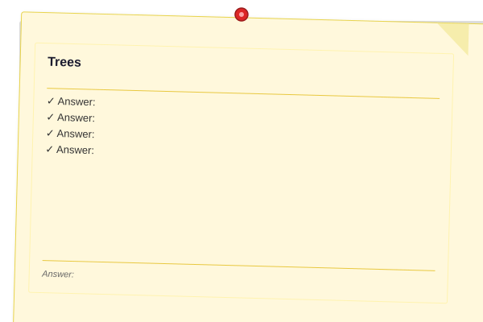
</a>


**A10** [GATE 2015, 1 mark, Trees] Number of structurally different binary trees with 3 nodes:

- (A) 2 (B) 3 (C) 5 (D) 6

**Answer:** C. Catalan number C₃ = (2n)!/((n+1)!n!) = 5.

**A11** [GATE 2014, 2 marks, BST] Preorder traversal of BST: 50, 30, 20, 40, 70, 60, 80. Postorder traversal is:

- (A) 20, 40, 30, 60, 80, 70, 50 (B) 20, 40, 30, 60, 80, 70, 50
- (C) 20, 40, 30, 60, 80, 70, 50 (D) 80, 60, 40, 20, 30, 50, 70

**Answer:** A. BST: root=50. Left subtree has 30 as root with 20 left, 40 right. Right subtree has 70 as root with 60 left, 80 right. Postorder: LRN → 20, 40, 30, 60, 80, 70, 50.

**A12** [GATE 2017, 2 marks, AVL] Insert 43, 55, 67, 83, 94, 71 into empty AVL tree. How many rotations needed for 94?

- (A) 0 (B) 1 (C) 2 (D) 3

**Answer:** B. After 43, 55, 67 (RR rotation), 83, 94: inserting 94 causes imbalance requiring one left rotation.

**A13** [GATE 2018, 2 marks, B-Tree] A B-Tree of order 4 (max 3 keys). Minimum number of nodes for height 3 (root at height 0):

- (A) 7 (B) 8 (C) 15 (D) 16

**Answer:** A. Each node (except root) min keys = ⌈m/2⌉−1 = 1. Root min = 1. Level 0: 1 node. Level 1: 2 nodes. Level 2: 4 nodes. Total = 7.

**A14** [GATE 2020, 2 marks, BST] Inorder predecessor of a node in BST is:

- (A) max of left subtree (B) min of left subtree (C) max of right subtree (D) min of right subtree

**Answer:** A. Inorder predecessor = maximum element in left subtree.

**A15** [GATE 2019, 2 marks, Red-Black Tree] Which of the following is NOT a valid Red-Black tree property?

- (A) Root is black (B) Red node cannot have red child (C) All leaves are black (D) Every internal node has exactly 2 children

**Answer:** D. Red-Black trees don't require every internal node to have exactly 2 children.

**A16** [GATE 2022, 2 marks, Trees] The height of a binary tree with n nodes in the worst case is:

- (A) O(log n) (B) O(n) (C) O(n log n) (D) O(n²)

**Answer:** B. Skewed tree: height = n−1 = O(n).

**A17** [GATE 2016, 2 marks, Trees] The number of leaf nodes in a complete binary tree with n nodes is:

- (A) ⌊n/2⌋ (B) ⌈n/2⌉ (C) n−1 (D) log₂(n+1)

**Answer:** B. Leaves = ⌈n/2⌉ for complete binary tree.

### Heaps

<a href="../../assets/images/diagrams/gate-cs-preparation/10-data-structures-algorithms/heaps-handwritten.svg" target="_blank" rel="noopener">
  
</a>
<a href="../../assets/images/diagrams/gate-cs-preparation/10-data-structures-algorithms/heaps-diagram.svg" target="_blank" rel="noopener">
  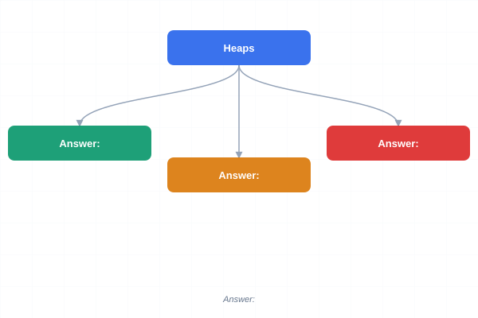
</a>
<a href="../../assets/images/diagrams/gate-cs-preparation/10-data-structures-algorithms/heaps-sticky.svg" target="_blank" rel="noopener">
  
</a>


**A18** [GATE 2015, 2 marks, Heaps] In a min-heap with n elements, the 7th smallest element can be found in:

- (A) O(1) (B) O(log n) (C) O(n) (D) O(n log n)

**Answer:** A. The 7th smallest is at one of the first 7 positions (depth ≤ 2). Extract min 7 times → O(7 log n) but the question asks about finding → the element is guaranteed within first 7 positions.

**A19** [GATE 2017, 2 marks, Heaps] Array [12, 10, 15, 8, 9, 14, 13, 6, 7]. Is this a max-heap?

- (A) Yes (B) No, violates at index 1 (C) No, violates at index 2 (D) No, violates at index 3

**Answer:** B. Index 1 (value 10): children at 3 (15) > 10. Violation.

**A20** [GATE 2020, 2 marks, Heap Sort] Which of the following is true about Heap Sort?

- (A) Stable and in-place (B) Not stable but in-place (C) Stable but not in-place (D) Neither stable nor in-place

**Answer:** B. Heap sort is in-place but not stable.

### Graphs

<a href="../../assets/images/diagrams/gate-cs-preparation/10-data-structures-algorithms/graphs-handwritten.svg" target="_blank" rel="noopener">
  
</a>
<a href="../../assets/images/diagrams/gate-cs-preparation/10-data-structures-algorithms/graphs-diagram.svg" target="_blank" rel="noopener">
  
</a>
<a href="../../assets/images/diagrams/gate-cs-preparation/10-data-structures-algorithms/graphs-sticky.svg" target="_blank" rel="noopener">
  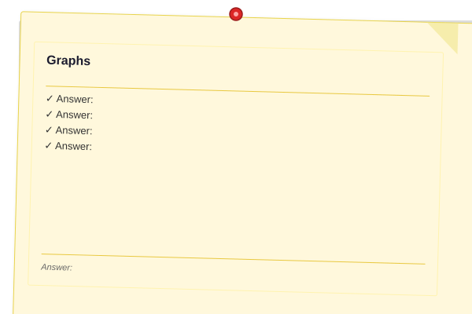
</a>


**A21** [GATE 2015, 2 marks, BFS/DFS] BFS of an undirected graph with V vertices and E edges has complexity:

- (A) O(V²) (B) O(E log V) (C) O(V + E) (D) O(VE)

**Answer:** C. BFS using adjacency list is O(V + E).

**A22** [GATE 2016, 2 marks, Topological Sort] Which of the following is true for a DAG with topological sort?

- (A) At least one vertex has indegree 0 (B) Every DAG has unique topological sort
- (C) All edges go from lower to higher order (D) Both A and C

**Answer:** D. Every DAG has at least one source (indegree 0). Topological order ensures all edges go forward.

**A23** [GATE 2017, 2 marks, Dijkstra] Dijkstra's algorithm fails when:

- (A) Graph has negative weight edges (B) Graph has cycles
- (C) Graph is unweighted (D) Graph is directed

**Answer:** A. Dijkstra fails with negative weight edges (may not maintain optimal substructure).

**A24** [GATE 2018, 2 marks, Kruskal] Kruskal's algorithm finds MST in:

- (A) O(V²) (B) O(E log V) (C) O(V log E) (D) O(VE)

**Answer:** B. Sorting edges O(E log E) = O(E log V) plus DSU operations O(E·α(V)).

**A25** [GATE 2019, 2 marks, Floyd-Warshall] Floyd-Warshall all-pairs shortest path complexity:

- (A) O(V²) (B) O(V³) (C) O(VE) (D) O(E log V)

**Answer:** B. Three nested loops → O(V³).

**A26** [GATE 2021, 2 marks, Bellman-Ford] Bellman-Ford for V vertices, E edges. Number of relaxations:

- (A) V�E (B) (V−1)�E (C) V² (D) VE²

**Answer:** B. V−1 iterations, each relaxing all E edges: (V−1)·E.

**A27** [GATE 2022, 1 mark, SCC] Number of strongly connected components in a DAG with V vertices:

- (A) 1 (B) V (C) ≤ V (D) depends on edges

**Answer:** B. Every vertex in a DAG is its own SCC (no cycles). So = V.

**A28** [GATE 2014, 2 marks, Prim] Prim's algorithm with adjacency matrix has complexity:

- (A) O(V²) (B) O(E log V) (C) O(V log V) (D) O(VE)

**Answer:** A. With adjacency matrix, each extract-min scans V vertices → O(V²).

### Sorting

<a href="../../assets/images/diagrams/gate-cs-preparation/10-data-structures-algorithms/sorting-handwritten.svg" target="_blank" rel="noopener">
  
</a>
<a href="../../assets/images/diagrams/gate-cs-preparation/10-data-structures-algorithms/sorting-diagram.svg" target="_blank" rel="noopener">
  
</a>
<a href="../../assets/images/diagrams/gate-cs-preparation/10-data-structures-algorithms/sorting-sticky.svg" target="_blank" rel="noopener">
  
</a>


**A29** [GATE 2015, 1 mark, Sorting] Which sorting algorithm has best-case O(n)?

- (A) Merge sort (B) Heap sort (C) Quick sort (D) Insertion sort

**Answer:** D. Insertion sort is adaptive → O(n) when input is already sorted.

**A30** [GATE 2016, 2 marks, Sorting] Which of the following is O(n log n) in worst case?

- (A) Quick sort (B) Insertion sort (C) Merge sort (D) Selection sort

**Answer:** C. Quick sort worst is O(n²). Merge sort is always O(n log n).

**A31** [GATE 2017, 2 marks, Sorting] Number of swaps in selection sort for array descending [5,4,3,2,1] sorted ascending:

- (A) 2 (B) 3 (C) 4 (D) 5

**Answer:** C. n−1 = 4 swaps (each selects min and swaps to correct position).

**A32** [GATE 2018, 2 marks, Counting Sort] Counting sort complexity is O(n + k). The value k represents:

- (A) Number of distinct keys (B) Range of input values
- (C) Number of elements (D) Number of passes

**Answer:** B. k is the range of input values (max − min + 1).

**A33** [GATE 2019, 2 marks, Sorting Stability] Which of these is NOT stable?

- (A) Bubble sort (B) Insertion sort (C) Merge sort (D) Quick sort

**Answer:** D. Quick sort is not stable. Bubble, Insertion, Merge are stable.

**A34** [GATE 2020, 2 marks, Radix Sort] Radix sort uses which sort internally for each digit pass?

- (A) Quick sort (B) Heap sort (C) Counting sort (D) Insertion sort

**Answer:** C. Counting sort is the typical stable sort used for each digit pass in Radix sort.

**A35** [GATE 2021, 2 marks, Quick Sort] Worst-case time for Quick sort is O(n²). Which pivot choice causes this for sorted input?

- (A) First element (B) Random element (C) Median-of-three (D) Last element

**Answer:** A or D (for L-R ordered). Both first and last pivot cause O(n²) on sorted arrays for Lomuto partition.

### Searching & Hashing

<a href="../../assets/images/diagrams/gate-cs-preparation/10-data-structures-algorithms/searching-hashing-handwritten.svg" target="_blank" rel="noopener">
  
</a>
<a href="../../assets/images/diagrams/gate-cs-preparation/10-data-structures-algorithms/searching-hashing-diagram.svg" target="_blank" rel="noopener">
  
</a>
<a href="../../assets/images/diagrams/gate-cs-preparation/10-data-structures-algorithms/searching-hashing-sticky.svg" target="_blank" rel="noopener">
  
</a>


**A36** [GATE 2015, 2 marks, Binary Search] Binary search on a sorted array of n elements. Worst case comparisons:

- (A) n (B) log n (C) n/2 (D) n²

**Answer:** B. Θ(log n) comparisons.

**A37** [GATE 2016, 2 marks, Hashing] Hash table size = 10, h(k) = k mod 10. Insert keys 12, 22, 32, 42, 52 using linear probing. How many collisions?

- (A) 2 (B) 3 (C) 4 (D) 5

**Answer:** C. 12 → slot 2. 22 → slot 2 (collision) → slot 3. 32 → slot 2 (collision) → slot 3 (collision) → slot 4. 42 → ... → slot 5. 52 → ... → slot 6. Total collisions = 4.

**A38** [GATE 2018, 2 marks, Hashing] Load factor α = 0.75. Expected probes in successful search with linear probing:

- (A) ½(1 + 1/(1−α)) (B) ½(1 + 1/(1−α)²) (C) −ln(1−α)/α (D) 1/(1−α)

**Answer:** A. For linear probing, successful search ≈ ½(1 + 1/(1−α)). With α = 0.75: ≈ 2.5 probes.

**A39** [GATE 2020, 2 marks, Hashing] Double hashing: h(k) = k mod 11, hâ‚‚(k) = 1 + (k mod 7). Probe sequence for key 38:

- (A) 5, 9, 2, ... (B) 5, 8, 0, ... (C) 5, 10, 4, ... (D) 5, 1, 8, ...

**Answer:** C. h(38) = 38 mod 11 = 5. hâ‚‚(38) = 1 + (38 mod 7) = 1 + 3 = 4. Probe: 5, 9, 2, ...

### Complexity Analysis

<a href="../../assets/images/diagrams/gate-cs-preparation/10-data-structures-algorithms/complexity-analysis-handwritten.svg" target="_blank" rel="noopener">
  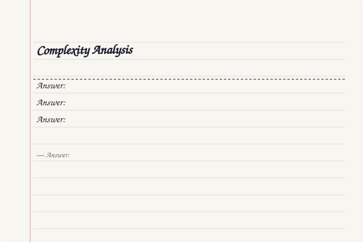
</a>
<a href="../../assets/images/diagrams/gate-cs-preparation/10-data-structures-algorithms/complexity-analysis-diagram.svg" target="_blank" rel="noopener">
  
</a>
<a href="../../assets/images/diagrams/gate-cs-preparation/10-data-structures-algorithms/complexity-analysis-sticky.svg" target="_blank" rel="noopener">
  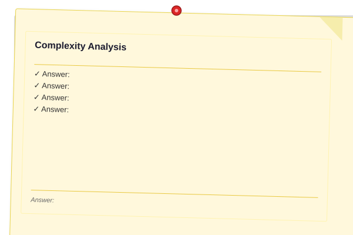
</a>


**A40** [GATE 2015, 2 marks, Recurrence] T(n) = 2T(n/2) + n. T(1) = 1. T(n) = ?

- (A) Θ(n) (B) Θ(n log n) (C) Θ(n²) (D) Θ(log n)

**Answer:** B. Master theorem case 2: a=2, b=2, log_b a = 1, f(n)=n = n¹·logâ�° n → T(n) = Θ(n log n).

**A41** [GATE 2016, 1 mark, Recurrence] T(n) = T(n−1) + n. T(1) = 1. T(n) = ?

- (A) Θ(n) (B) Θ(n²) (C) Θ(n log n) (D) Θ(2�)

**Answer:** B. Summation: 1 + 2 + 3 + ... + n = n(n+1)/2 = Θ(n²).

**A42** [GATE 2017, 2 marks, Complexity] f(n) = n², g(n) = n^{log₂7}. Which is true?

- (A) f = O(g) (B) f = Ω(g) (C) f = Θ(g) (D) None

**Answer:** A. n^{log₂7} ≈ n^{2.81}. n² = O(n^{2.81}).

**A43** [GATE 2018, 2 marks, Complexity] Which notation expresses tightest upper bound?

- (A) O (B) Ω (C) Θ (D) o

**Answer:** A. O gives upper bound. Θ gives tight bound but O is the standard for worst-case complexity.

**A44** [GATE 2020, 2 marks, Recurrence] T(n) = 3T(n/4) + n log n. Solve:

- (A) Θ(n^{log₄3}) (B) Θ(n log n) (C) Θ(n² log n) (D) Θ(n^{log₃4})

**Answer:** B. a=3, b=4, log_b a = log₄3 ≈ 0.792. f(n) = n log n = Ω(n^{0.792+ε}). Check regularity: a·f(n/b) = 3·(n/4)·log(n/4) = 0.75·n·log(n/4) ≤ c·n·log n for c &lt; 1. So Case 3: Θ(n log n).

**A45** [GATE 2021, 2 marks, Complexity] Let f(n) = O(g(n)). Then log f(n) = O(log g(n)) if:

- (A) f(n) ≥ 1 and g(n) ≥ 2 (B) f(n) ≥ 0 and g(n) ≥ 1
- (C) f(n) ≤ 0 and g(n) ≤ 1 (D) Always

**Answer:** A. Need f(n) ≥ 1 and g(n) ≥ 2 for log to be defined and monotonic.

### Mixed

<a href="../../assets/images/diagrams/gate-cs-preparation/10-data-structures-algorithms/mixed-handwritten.svg" target="_blank" rel="noopener">
  
</a>
<a href="../../assets/images/diagrams/gate-cs-preparation/10-data-structures-algorithms/mixed-diagram.svg" target="_blank" rel="noopener">
  
</a>
<a href="../../assets/images/diagrams/gate-cs-preparation/10-data-structures-algorithms/mixed-sticky.svg" target="_blank" rel="noopener">
  
</a>


**A46** [GATE 2022, 2 marks, Trees] A strictly binary tree (every node has 0 or 2 children) with n leaves has how many internal nodes?

- (A) n−1 (B) n (C) n+1 (D) 2n

**Answer:** A. For a full binary tree: I = L − 1 = n − 1.

**A47** [GATE 2023, 2 marks, Graphs] In an undirected graph G with n vertices, if every vertex has degree at least δ, the graph is connected if:

- (A) δ ≥ n/2 (B) δ ≥ (n−1)/2 (C) δ ≥ n−1 (D) δ ≥ 2

**Answer:** B. Dirac's theorem: if δ ≥ n/2, graph is Hamiltonian (stronger). For connectivity: δ ≥ (n−1)/2.

**A48** [GATE 2023, 1 mark, Sorting] Which of the following sorts is NOT in-place?

- (A) Insertion sort (B) Selection sort (C) Merge sort (D) Quick sort

**Answer:** C. Merge sort requires O(n) auxiliary space. All others are in-place.

**A49** [GATE 2024, 2 marks, Hashing] A hash table of size 10 uses double hashing: h�(k) = k mod 10, h₂(k) = 7 − (k mod 7). Insert keys 89, 18, 49, 58, 79. After all insertions, what is the load factor?

- (A) 0.3 (B) 0.5 (C) 0.7 (D) 0.9

**Answer:** B. 5 elements / 10 slots = 0.5.

**A50** [GATE 2024, 2 marks, Complexity] T(n) = 2T(√n) + log n. Solve:

- (A) Θ(log n) (B) Θ(log² n) (C) Θ(√n) (D) Θ(log n·log log n)

**Answer:** B. Let n = 2áµ�. T(2áµ�) = 2T(2^{m/2}) + m. S(m) = T(2áµ�). S(m) = 2S(m/2) + m → Θ(m log m) = Θ(log n·log log n). Wait: Master theorem: a=2, b=2, S(m) = 2S(m/2) + m → Case 2: Θ(m log m) = Θ(log n·log log n).

**A51** [GATE 2025, 2 marks, Graph] Which graph algorithm uses a stack as its primary data structure?

- (A) BFS (B) DFS (C) Dijkstra (D) Prim

**Answer:** B. DFS uses stack (recursion or explicit). BFS uses queue.

**A52** [GATE 2025, 2 marks, Sorting] The number of comparisons in merge sort for merging two sorted lists of size m and n is:

- (A) m + n − 1 (B) m + n (C) max(m, n) (D) min(m, n)

**Answer:** A. In worst case, m + n − 1 comparisons until one list exhausts.

**A53** [GATE 2025, 1 mark, Trees] Which traversal gives non-decreasing order in BST?

- (A) Preorder (B) Inorder (C) Postorder (D) Level-order

**Answer:** B. Inorder traversal of BST yields elements in sorted (non-decreasing) order.

**A54** [GATE 2025, 2 marks, Heaps] Building a max-heap from an array of n elements takes:

- (A) O(n) (B) O(n log n) (C) O(log n) (D) O(n²)

**Answer:** A. buildHeap() runs in O(n) time (tight bound).

---

## 12. GATE Traps: Detailed Analysis

### Trap 1: Complexity of Recursive Functions

<a href="../../assets/images/diagrams/gate-cs-preparation/10-data-structures-algorithms/trap-1-complexity-of-recursive-functions-handwritten.svg" target="_blank" rel="noopener">
  
</a>
<a href="../../assets/images/diagrams/gate-cs-preparation/10-data-structures-algorithms/trap-1-complexity-of-recursive-functions-diagram.svg" target="_blank" rel="noopener">
  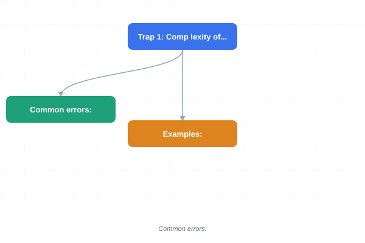
</a>
<a href="../../assets/images/diagrams/gate-cs-preparation/10-data-structures-algorithms/trap-1-complexity-of-recursive-functions-sticky.svg" target="_blank" rel="noopener">
  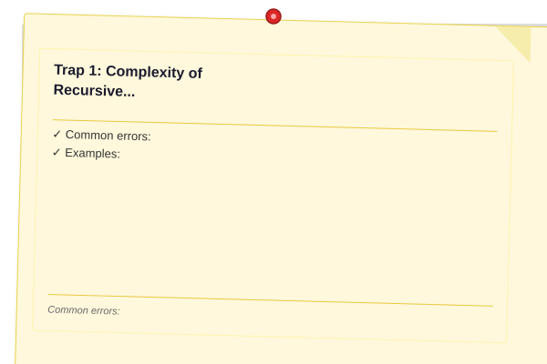
</a>


**Common errors:**
- Applying Master theorem incorrectly (wrong a, b values)
- Forgetting that T(n) = T(n−1) + ... is NOT Master theorem solvable
- Misidentifying f(n) for divide-and-conquer recurrences

**Examples:**
| Recurrence | Trap | Correct |
|------------|------|---------|
| T(n) = 2T(n/2) + n | Think O(n) | O(n log n) → Master case 2 |
| T(n) = T(n/2) + n | Think O(log n) | O(n) → Master case 3 |
| T(n) = 2T(√n) + log n | Try n directly | Let n=2�, get Θ(log n·log log n) |
| T(n) = 3T(n/3) + n/2 | Think O(n) | O(n log n) → Master case 2 |
| T(n) = T(n−1) + 1/n | Think O(n) | O(log n) → Harmonic series |

### Trap 2: BST Deletion

<a href="../../assets/images/diagrams/gate-cs-preparation/10-data-structures-algorithms/trap-2-bst-deletion-handwritten.svg" target="_blank" rel="noopener">
  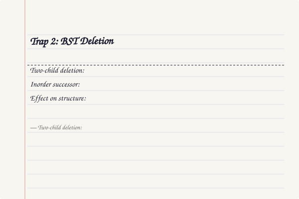
</a>
<a href="../../assets/images/diagrams/gate-cs-preparation/10-data-structures-algorithms/trap-2-bst-deletion-diagram.svg" target="_blank" rel="noopener">
  
</a>
<a href="../../assets/images/diagrams/gate-cs-preparation/10-data-structures-algorithms/trap-2-bst-deletion-sticky.svg" target="_blank" rel="noopener">
  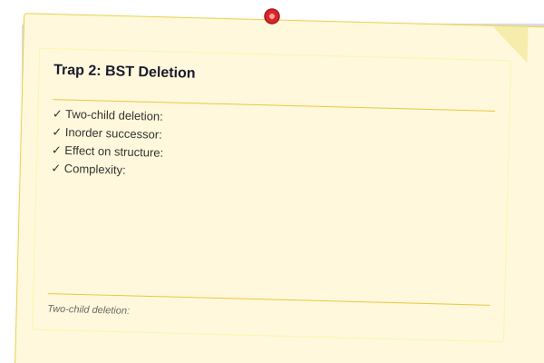
</a>


- **Two-child deletion:** Replace with inorder successor (or predecessor). Do NOT replace with just any child.
- **Inorder successor:** Minimum of right subtree (leftmost node).
- **Effect on structure:** After deletion, BST property must be maintained.
- **Complexity:** O(h) where h = height.

### Trap 3: Graph Algorithm Correctness

<a href="../../assets/images/diagrams/gate-cs-preparation/10-data-structures-algorithms/trap-3-graph-algorithm-correctness-handwritten.svg" target="_blank" rel="noopener">
  
</a>
<a href="../../assets/images/diagrams/gate-cs-preparation/10-data-structures-algorithms/trap-3-graph-algorithm-correctness-diagram.svg" target="_blank" rel="noopener">
  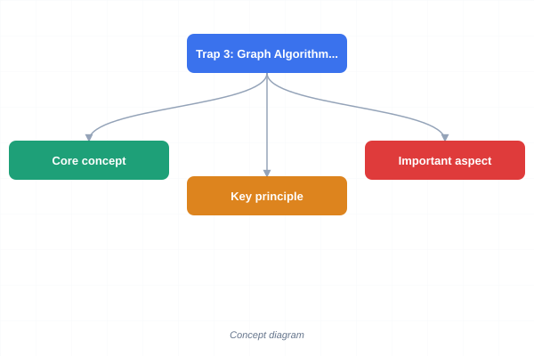
</a>
<a href="../../assets/images/diagrams/gate-cs-preparation/10-data-structures-algorithms/trap-3-graph-algorithm-correctness-sticky.svg" target="_blank" rel="noopener">
  
</a>


| Algorithm | Fails When | Why |
|-----------|-----------|-----|
| Dijkstra | Negative edges | Greedy: once a node is finalized, distance won't change |
| BFS for shortest path | Weighted graph | BFS assumes all edges weight 1 |
| Kruskal's/Prim's | Directed graph | MST definitions apply to undirected graphs |
| Bellman-Ford | Negative cycles | No shortest path exists (can detect, not compute) |
| Floyd-Warshall | Negative cycles | Distance becomes −∞ |

### Trap 4: Hash Table Probing Sequences

<a href="../../assets/images/diagrams/gate-cs-preparation/10-data-structures-algorithms/trap-4-hash-table-probing-sequences-handwritten.svg" target="_blank" rel="noopener">
  
</a>
<a href="../../assets/images/diagrams/gate-cs-preparation/10-data-structures-algorithms/trap-4-hash-table-probing-sequences-diagram.svg" target="_blank" rel="noopener">
  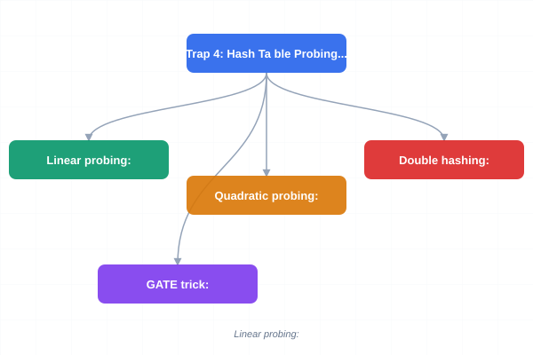
</a>
<a href="../../assets/images/diagrams/gate-cs-preparation/10-data-structures-algorithms/trap-4-hash-table-probing-sequences-sticky.svg" target="_blank" rel="noopener">
  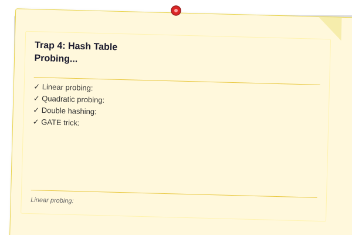
</a>


- **Linear probing:** Primary clustering → long runs of occupied slots
- **Quadratic probing:** Secondary clustering → keys with same initial hash follow same probe sequence
- **Double hashing:** Best → two independent hash functions
- **GATE trick:** Calculate probe sequence for a given key; determine if insertion succeeds

**Common question pattern:** "Key x cannot be inserted due to infinite loop" → check if probe sequence covers all slots (depends on m being prime for quadratic probing).

### Trap 5: Sorting Stability and In-Place

<a href="../../assets/images/diagrams/gate-cs-preparation/10-data-structures-algorithms/trap-5-sorting-stability-and-in-place-handwritten.svg" target="_blank" rel="noopener">
  
</a>
<a href="../../assets/images/diagrams/gate-cs-preparation/10-data-structures-algorithms/trap-5-sorting-stability-and-in-place-diagram.svg" target="_blank" rel="noopener">
  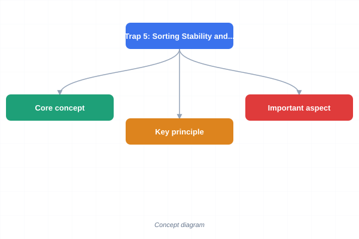
</a>
<a href="../../assets/images/diagrams/gate-cs-preparation/10-data-structures-algorithms/trap-5-sorting-stability-and-in-place-sticky.svg" target="_blank" rel="noopener">
  
</a>


| Statement | Truth | Reason |
|-----------|-------|--------|
| Quick sort is stable | FALSE | Partition swaps break relative order |
| Selection sort is stable | FALSE | Swapping non-adjacent elements breaks order |
| Merge sort is stable | TRUE | Merge preserves left-array-first tiebreak |
| Counting sort is stable | TRUE | Reverse traversal preserves order |
| Heap sort is in-place | TRUE | Sorts within array, only O(1) extra space |
| Merge sort is in-place | FALSE | Requires O(n) auxiliary array |

### Trap 6: MST Edge Weights

<a href="../../assets/images/diagrams/gate-cs-preparation/10-data-structures-algorithms/trap-6-mst-edge-weights-handwritten.svg" target="_blank" rel="noopener">
  
</a>
<a href="../../assets/images/diagrams/gate-cs-preparation/10-data-structures-algorithms/trap-6-mst-edge-weights-diagram.svg" target="_blank" rel="noopener">
  
</a>
<a href="../../assets/images/diagrams/gate-cs-preparation/10-data-structures-algorithms/trap-6-mst-edge-weights-sticky.svg" target="_blank" rel="noopener">
  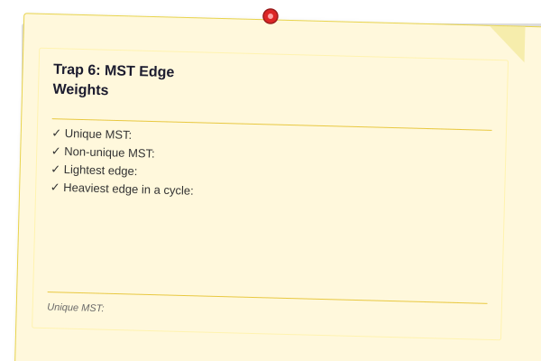
</a>


- **Unique MST:** If all edge weights are distinct → MST is unique
- **Non-unique MST:** If edges have equal weights → multiple MSTs possible
- **Lightest edge:** Not necessarily in every MST (if it creates a cycle with lighter alternatives)
- **Heaviest edge in a cycle:** Never in any MST (cycle property)

### Trap 7: Asymptotic Growth Subtleties

<a href="../../assets/images/diagrams/gate-cs-preparation/10-data-structures-algorithms/trap-7-asymptotic-growth-subtleties-handwritten.svg" target="_blank" rel="noopener">
  
</a>
<a href="../../assets/images/diagrams/gate-cs-preparation/10-data-structures-algorithms/trap-7-asymptotic-growth-subtleties-diagram.svg" target="_blank" rel="noopener">
  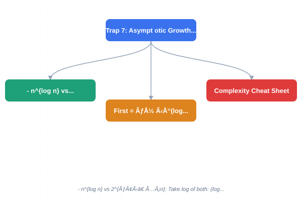
</a>
<a href="../../assets/images/diagrams/gate-cs-preparation/10-data-structures-algorithms/trap-7-asymptotic-growth-subtleties-sticky.svg" target="_blank" rel="noopener">
  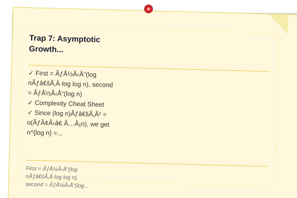
</a>


- n^{log n} vs 2^{√n}: Take log of both: (log n)² vs √n·log 2. Since (log n)² = o(√n), we get n^{log n} = o(2^{√n})
- (log n)^{log n} vs n/log n: Take log: log log n · log n vs log n − log log n. First = Θ(log n·log log n), second = Θ(log n). So (log n)^{log n} = �‰(n/log n)
- log(n!) = Θ(n log n) via Stirling's approximation
- n^{1/n} → 1 as n → ∞

---

## 13. Complexity Cheat Sheet

### 13.1 Common Algorithm Complexities

<a href="../../assets/images/diagrams/gate-cs-preparation/10-data-structures-algorithms/13-1-common-algorithm-complexities-handwritten.svg" target="_blank" rel="noopener">
  
</a>
<a href="../../assets/images/diagrams/gate-cs-preparation/10-data-structures-algorithms/13-1-common-algorithm-complexities-diagram.svg" target="_blank" rel="noopener">
  
</a>
<a href="../../assets/images/diagrams/gate-cs-preparation/10-data-structures-algorithms/13-1-common-algorithm-complexities-sticky.svg" target="_blank" rel="noopener">
  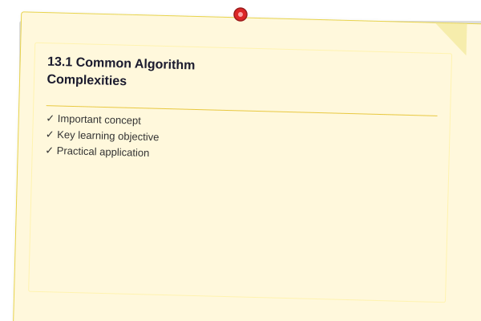
</a>


| Algorithm | Time | Space |
|-----------|------|-------|
| Binary Search | O(log n) | O(1) |
| Quick Select (avg) | O(n) | O(1) |
| Median of Medians | O(n) | O(log n) |
| Tower of Hanoi | O(2�) | O(n) |
| Fibonacci (naive) | O(�†â�¿) | O(n) |
| Fibonacci (DP) | O(n) | O(1) |
| Matrix Multiplication (naive) | O(n³) | O(n²) |
| Strassen's MM | O(n^{2.81}) | O(n²) |
| Dijkstra (binary heap) | O((V+E) log V) | O(V) |
| Bellman-Ford | O(VE) | O(V) |
| Floyd-Warshall | O(V³) | O(V²) |
| Prim's (adj matrix) | O(V²) | O(V) |
| Kruskal's | O(E log V) | O(V) |
| Topological Sort | O(V+E) | O(V) |
| Kosaraju's SCC | O(V+E) | O(V) |
| Tarjan's SCC | O(V+E) | O(V) |
| Knuth-Morris-Pratt | O(n+m) | O(m) |
| Rabin-Karp | O(n+m) avg | O(1) |
| BFS/DFS | O(V+E) | O(V) |

### 13.2 Data Structure Complexities

<a href="../../assets/images/diagrams/gate-cs-preparation/10-data-structures-algorithms/13-2-data-structure-complexities-handwritten.svg" target="_blank" rel="noopener">
  
</a>
<a href="../../assets/images/diagrams/gate-cs-preparation/10-data-structures-algorithms/13-2-data-structure-complexities-diagram.svg" target="_blank" rel="noopener">
  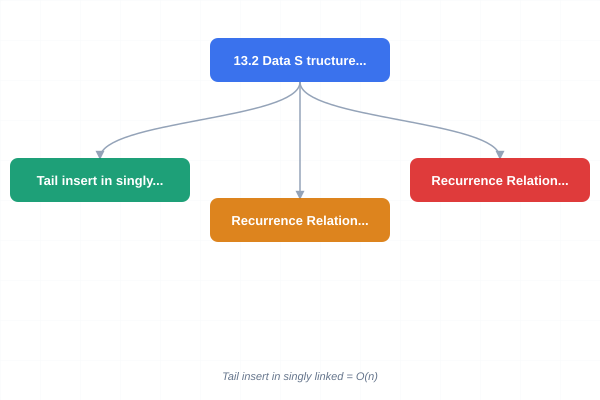
</a>
<a href="../../assets/images/diagrams/gate-cs-preparation/10-data-structures-algorithms/13-2-data-structure-complexities-sticky.svg" target="_blank" rel="noopener">
  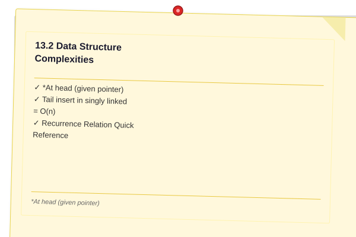
</a>


| Data Structure | Access | Search | Insert | Delete | Space |
|----------------|--------|--------|--------|--------|-------|
| Array | O(1) | O(n) | O(n) | O(n) | O(n) |
| Stack | O(n) | O(n) | O(1) | O(1) | O(n) |
| Queue | O(n) | O(n) | O(1) | O(1) | O(n) |
| Singly Linked List | O(n) | O(n) | O(1)* | O(1)* | O(n) |
| Doubly Linked List | O(n) | O(n) | O(1) | O(1) | O(n) |
| Binary Search Tree (avg) | O(log n) | O(log n) | O(log n) | O(log n) | O(n) |
| Binary Search Tree (worst) | O(n) | O(n) | O(n) | O(n) | O(n) |
| AVL / Red-Black Tree | O(log n) | O(log n) | O(log n) | O(log n) | O(n) |
| B-Tree | O(log n) | O(log n) | O(log n) | O(log n) | O(n) |
| B+ Tree | O(log n) | O(log n) | O(log n) | O(log n) | O(n) |
| Hash Table (avg) | N/A | O(1) | O(1) | O(1) | O(n) |
| Hash Table (worst) | N/A | O(n) | O(n) | O(n) | O(n) |
| Min-Heap | O(1) (min) | O(n) | O(log n) | O(log n) | O(n) |
| Trie | O(|s|) | O(|s|) | O(|s|) | O(|s|) | O(Σ|sᵢ|) |

*At head (given pointer). Tail insert in singly linked = O(n).

---

## 14. Recurrence Relation Quick Reference

### 14.1 Master Theorem → Detailed Cases

<a href="../../assets/images/diagrams/gate-cs-preparation/10-data-structures-algorithms/14-1-master-theorem-detailed-cases-handwritten.svg" target="_blank" rel="noopener">
  
</a>
<a href="../../assets/images/diagrams/gate-cs-preparation/10-data-structures-algorithms/14-1-master-theorem-detailed-cases-diagram.svg" target="_blank" rel="noopener">
  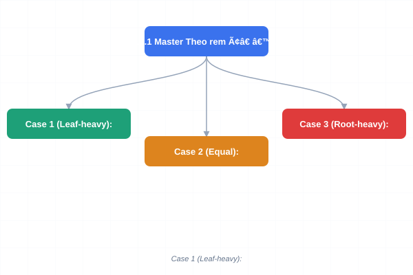
</a>
<a href="../../assets/images/diagrams/gate-cs-preparation/10-data-structures-algorithms/14-1-master-theorem-detailed-cases-sticky.svg" target="_blank" rel="noopener">
  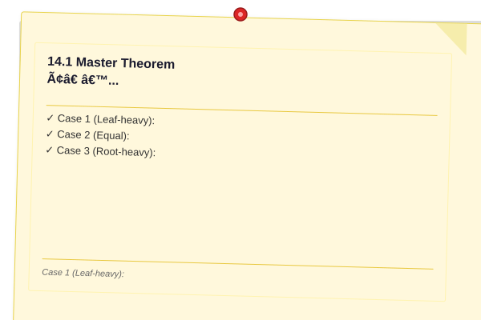
</a>


Given T(n) = a·T(n/b) + f(n), compare f(n) with n^{log_b a}:

**Case 1 (Leaf-heavy):** f(n) = O(n^{log_b a − ε})
- T(n) = Θ(n^{log_b a})
- Example: T(n) = 2T(n/2) + 1 → Θ(n)

**Case 2 (Equal):** f(n) = Θ(n^{log_b a}·log^k n)
- T(n) = Θ(n^{log_b a}·log^{k+1} n)
- Example: T(n) = 2T(n/2) + n → Θ(n log n)
- Example: T(n) = 2T(n/2) + n log n → Θ(n log² n)

**Case 3 (Root-heavy):** f(n) = Ω(n^{log_b a + ε}) + regularity
- T(n) = Θ(f(n))
- Example: T(n) = T(n/2) + n → Θ(n)

### 14.2 Extended Master Theorem

<a href="../../assets/images/diagrams/gate-cs-preparation/10-data-structures-algorithms/14-2-extended-master-theorem-handwritten.svg" target="_blank" rel="noopener">
  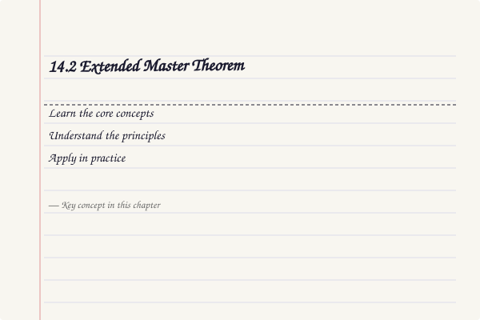
</a>
<a href="../../assets/images/diagrams/gate-cs-preparation/10-data-structures-algorithms/14-2-extended-master-theorem-diagram.svg" target="_blank" rel="noopener">
  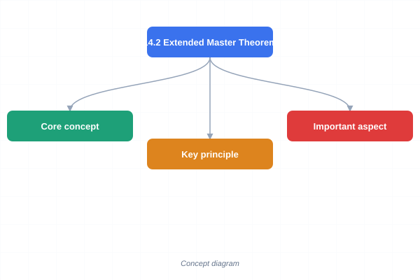
</a>
<a href="../../assets/images/diagrams/gate-cs-preparation/10-data-structures-algorithms/14-2-extended-master-theorem-sticky.svg" target="_blank" rel="noopener">
  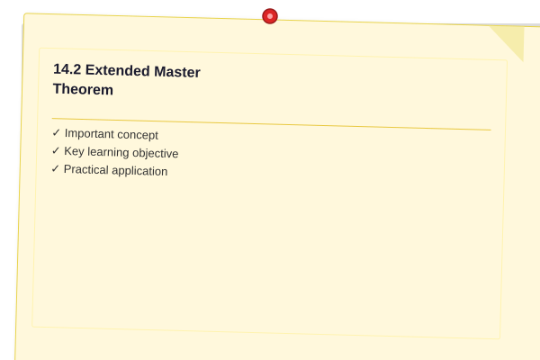
</a>


For T(n) = Σ_{i=1}^{k} a_i·T(n/b_i) + f(n):
- Find p such that Σ a_i / b_i^p = 1
- T(n) = Θ(n^p·(1 + ∫�� f(u)/u^{p+1} du))

### 14.3 Akra-Bazzi Method

<a href="../../assets/images/diagrams/gate-cs-preparation/10-data-structures-algorithms/14-3-akra-bazzi-method-handwritten.svg" target="_blank" rel="noopener">
  
</a>
<a href="../../assets/images/diagrams/gate-cs-preparation/10-data-structures-algorithms/14-3-akra-bazzi-method-diagram.svg" target="_blank" rel="noopener">
  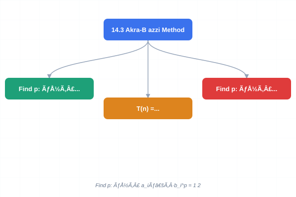
</a>
<a href="../../assets/images/diagrams/gate-cs-preparation/10-data-structures-algorithms/14-3-akra-bazzi-method-sticky.svg" target="_blank" rel="noopener">
  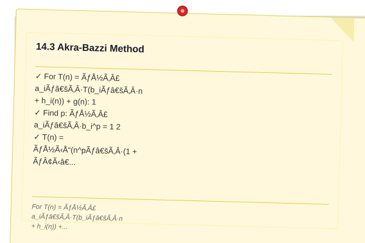
</a>


For T(n) = Σ a_i·T(b_i·n + h_i(n)) + g(n):
1. Find p: Σ a_i·b_i^p = 1
2. T(n) = Θ(n^p·(1 + ∫�� g(u)/u^{p+1} du))

### 14.4 Special Recurrences

<a href="../../assets/images/diagrams/gate-cs-preparation/10-data-structures-algorithms/14-4-special-recurrences-handwritten.svg" target="_blank" rel="noopener">
  
</a>
<a href="../../assets/images/diagrams/gate-cs-preparation/10-data-structures-algorithms/14-4-special-recurrences-diagram.svg" target="_blank" rel="noopener">
  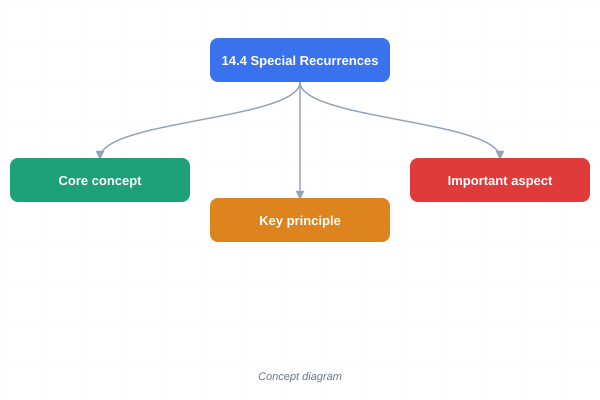
</a>
<a href="../../assets/images/diagrams/gate-cs-preparation/10-data-structures-algorithms/14-4-special-recurrences-sticky.svg" target="_blank" rel="noopener">
  
</a>


| Recurrence | Method | Result |
|------------|--------|--------|
| T(n) = T(n−1) + n | Unrolling | Θ(n²) |
| T(n) = T(n−1) + 1 | Unrolling | Θ(n) |
| T(n) = T(n−1) + log n | Unrolling | Θ(n log n) |
| T(n) = T(n−2) + 1 | Unrolling | Θ(n) |
| T(n) = 2T(n−1) + 1 | Unrolling | Θ(2�) |
| T(n) = T(√n) + 1 | Change var | Θ(log log n) |
| T(n) = 2T(√n) + log n | Change var | Θ(log n·log log n) |
| T(n) = T(n/2) + T(n/2) + 1 | Master | Θ(n) |
| T(n) = 3T(n/2) + n² | Master case 3 | Θ(n²) |
| T(n) = 4T(n/2) + n² | Master case 2 | Θ(n² log n) |

### 14.5 Generating Functions for Recurrences

<a href="../../assets/images/diagrams/gate-cs-preparation/10-data-structures-algorithms/14-5-generating-functions-for-recurrences-handwritten.svg" target="_blank" rel="noopener">
  
</a>
<a href="../../assets/images/diagrams/gate-cs-preparation/10-data-structures-algorithms/14-5-generating-functions-for-recurrences-diagram.svg" target="_blank" rel="noopener">
  
</a>
<a href="../../assets/images/diagrams/gate-cs-preparation/10-data-structures-algorithms/14-5-generating-functions-for-recurrences-sticky.svg" target="_blank" rel="noopener">
  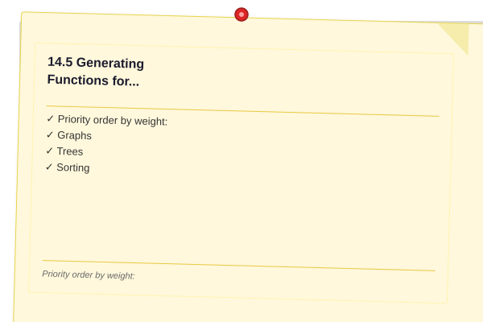
</a>


Fibonacci: F(n) = F(n−1) + F(n−2)
- Characteristic: x² − x − 1 = 0
- Roots: �† = (1 + √5)/2, �ˆ = (1 − √5)/2
- Closed form: F(n) = (�†â�¿ − �ˆâ�¿)/√5 → exponential growth O(�†â�¿)

---

## 15. GATE Exam Strategy for DSA

**Priority order by weight:**
1. **Graphs** (6–10 marks) → BFS/DFS, MST algorithms, shortest paths, topological sort
2. **Trees** (5–8 marks) → BST operations, AVL rotations, B/B+ tree properties, traversals
3. **Sorting** (3–5 marks) → Complexity, stability, in-place, non-comparison sorts
4. **Complexity Analysis** (3–5 marks) → Master theorem, recurrence solving, asymptotic notations
5. **Hashing** (2–4 marks) → Probing sequences, load factor, rehashing
6. **Stacks & Queues** (2–4 marks) → Expression evaluation, postfix/prefix/infix conversion
7. **Heaps** (2–4 marks) → Heapify, heap sort, priority queue
8. **Arrays** (2–4 marks) → Address calculation, sparse matrices
9. **Linked Lists** (1–3 marks) → Operations, cycle detection
10. **Searching** (1–2 marks) → Binary search, interpolation search

**Key formulas to memorize:**
- Catalan number: Câ‚™ = (2n)!/((n+1)!n!)
- Sum of first n: n(n+1)/2
- Sum of squares: n(n+1)(2n+1)/6
- Sum of cubes: [n(n+1)/2]²
- log a^b = b·log a
- log_a b = log_c b / log_c a
- a^{log_b c} = c^{log_b a}

**Time management:**
- 1-mark questions: ~2 minutes
- 2-mark questions: ~4 minutes
- Skip after 5 minutes of no progress
- Numerical answer type (NAT): double-check calculation

---

*End of Chapter 10 -> Data Structures & Algorithms for GATE CS. Target: 1200-2000 lines covering all GATE-relevant DSA topics with 50+ PYQs (2010-2025), complexity cheat sheet, recurrence reference, and trap analysis.*

---

## Summary

Data Structures & Algorithms (DSA) carries the highest weight in GATE CS (10-14 marks, ~12% of the paper) and covers arrays, linked lists, stacks, queues, trees (BST, AVL, B/B+ trees), graphs (BFS, DFS, MST algorithms � Kruskal, Prim; shortest paths � Dijkstra, Bellman-Ford, Floyd-Warshall), sorting (comparison-based and non-comparison, stability, in-place), searching (binary search, interpolation search), hashing (open/closed addressing, probing, load factor), and asymptotic complexity analysis (Big-O, Master theorem, recurrence solving). Graph algorithms (6-10 marks) and trees (5-8 marks) are the highest-weight topics, followed by sorting complexity analysis (3-5 marks) and hashing (2-4 marks). The key to success is choosing the right data structure for each operation � understanding trade-offs between insertion, deletion, search, and space complexity across different structures. The Master theorem for solving recurrences T(n) = aT(n/b) + f(n) is essential for complexity analysis of recursive algorithms. GATE questions often ask about underlying algorithm invariants and edge cases rather than straightforward implementation.

```mermaid
flowchart TD
    A[Data Structures & Algorithms] --> B[Linear Structures]
    A --> C[Trees]
    A --> D[Graphs]
    A --> E[Sorting & Searching]
    A --> F[Hashing]
    B --> B1[Arrays, Linked Lists]
    B --> B2[Stacks, Queues]
    C --> C1[BST, AVL, Red-Black]
    C --> C2[B/B+ Trees, Heaps]
    D --> D1[BFS, DFS, Topological Sort]
    D --> D2[MST: Kruskal, Prim]
    D --> D3[Shortest Paths]
    E --> E1[Quick, Merge, Heap Sort]
    E --> E2[Binary Search, Interpolation]
    F --> F1[Chaining, Open Addressing]
```

## TypeScript Implementations

```typescript
/**
 * BinarySearchTreeOps � BST Operations Suite
 * -----------------------------------------------
 * Implements BST construction, search, insertion, deletion,
 * traversals, and balancing check (for AVL-style height balance).
 */
class TreeNode {
  constructor(
    public value: number,
    public left: TreeNode | null = null,
    public right: TreeNode | null = null
  ) {}
}

class BinarySearchTreeOps {
  private root: TreeNode | null = null;

  insert(value: number): void {
    this.root = this.insertNode(this.root, value);
  }

  private insertNode(node: TreeNode | null, value: number): TreeNode {
    if (!node) return new TreeNode(value);
    if (value < node.value) {
      node.left = this.insertNode(node.left, value);
    } else if (value > node.value) {
      node.right = this.insertNode(node.right, value);
    }
    return node;
  }

  search(value: number): boolean {
    let current = this.root;
    while (current) {
      if (value === current.value) return true;
      current = value < current.value ? current.left : current.right;
    }
    return false;
  }

  delete(value: number): void {
    this.root = this.deleteNode(this.root, value);
  }

  private deleteNode(node: TreeNode | null, value: number): TreeNode | null {
    if (!node) return null;
    if (value < node.value) {
      node.left = this.deleteNode(node.left, value);
      return node;
    }
    if (value > node.value) {
      node.right = this.deleteNode(node.right, value);
      return node;
    }
    // Node to delete found
    if (!node.left) return node.right;
    if (!node.right) return node.left;
    // Two children: find inorder successor
    const successor = this.findMin(node.right);
    node.value = successor.value;
    node.right = this.deleteNode(node.right, successor.value);
    return node;
  }

  private findMin(node: TreeNode): TreeNode {
    let current = node;
    while (current.left) current = current.left;
    return current;
  }

  /** Inorder traversal � returns sorted array */
  inorder(): number[] {
    const result: number[] = [];
    this.inorderTraversal(this.root, result);
    return result;
  }

  private inorderTraversal(node: TreeNode | null, result: number[]): void {
    if (!node) return;
    this.inorderTraversal(node.left, result);
    result.push(node.value);
    this.inorderTraversal(node.right, result);
  }

  /** Level-order traversal (BFS) */
  levelOrder(): number[][] {
    if (!this.root) return [];
    const result: number[][] = [];
    let queue: TreeNode[] = [this.root];
    while (queue.length > 0) {
      const level: number[] = [];
      const nextQueue: TreeNode[] = [];
      for (const node of queue) {
        level.push(node.value);
        if (node.left) nextQueue.push(node.left);
        if (node.right) nextQueue.push(node.right);
      }
      result.push(level);
      queue = nextQueue;
    }
    return result;
  }

  /** Check if the tree is height-balanced (AVL condition) */
  isBalanced(): boolean {
    return this.checkBalance(this.root) !== -1;
  }

  private checkBalance(node: TreeNode | null): number {
    if (!node) return 0;
    const left = this.checkBalance(node.left);
    if (left === -1) return -1;
    const right = this.checkBalance(node.right);
    if (right === -1) return -1;
    if (Math.abs(left - right) > 1) return -1;
    return Math.max(left, right) + 1;
  }

  /** Find the lowest common ancestor */
  findLCA(a: number, b: number): number | null {
    const lca = this.findLCANode(this.root, a, b);
    return lca ? lca.value : null;
  }

  private findLCANode(
    node: TreeNode | null,
    a: number,
    b: number
  ): TreeNode | null {
    if (!node) return null;
    if (node.value === a || node.value === b) return node;
    const left = this.findLCANode(node.left, a, b);
    const right = this.findLCANode(node.right, a, b);
    if (left && right) return node;
    return left || right;
  }

  print(): string {
    const levels = this.levelOrder();
    let out = 'BST Level Order:\n';
    for (let i = 0; i < levels.length; i++) {
      out += `  Level ${i}: [${levels[i].join(', ')}]\n`;
    }
    return out;
  }
}

// Example
const bst = new BinarySearchTreeOps();
[50, 30, 70, 20, 40, 60, 80, 35, 45].forEach(v => bst.insert(v));
console.log(bst.print());
console.log('Inorder:', bst.inorder().join(', '));
console.log('Search 40:', bst.search(40));
console.log('Search 100:', bst.search(100));
console.log('Is balanced:', bst.isBalanced());
console.log('LCA of 20,40:', bst.findLCA(20, 40));
bst.delete(30);
console.log('After deleting 30, inorder:', bst.inorder().join(', '));
```

## Chapter Quiz

**5 Multiple Choice Questions**

| Q# | Question | Options | Answer |
|:--:|---------|---------|:------:|
| 1 | The worst-case time complexity of Quicksort is: | A) O(n log n), B) O(n²), C) O(n), D) O(log n) | **B** |
| 2 | Which traversal of a BST yields sorted order? | A) Preorder, B) Inorder, C) Postorder, D) Level order | **B** |
| 3 | Minimum nodes in an AVL tree of height h is: | A) F_{h+2} - 1 (Fibonacci), B) 2^h - 1, C) h + 1, D) 2h | **A** |
| 4 | Kruskal's MST algorithm has time complexity: | A) O(V²), B) O(E log V), C) O(V+E), D) O(E log E) | **D** |
| 5 | A full binary tree with n internal nodes has how many leaves? | A) n, B) n+1, C) 2n, D) n-1 | **B** |

## Exercises

**5 Practice Problems**

<details>
<summary><strong>Exercise 1:</strong> Recurrence Solving</summary>
<p>Solve T(n) = 2T(n/2) + n² using the Master theorem.</p>
<p><strong>Solution:</strong> a=2, b=2, f(n)=n². log_b(a)=1. n^1 vs n² → case 3: f(n) = Ω(n^{1+ε}), and af(n/b) = 2(n/2)² = n²/2 ≤ cn² for c=0.5 < 1. T(n) = Θ(n²).</p>
</details>

<details>
<summary><strong>Exercise 2:</strong> Tree Reconstruction</summary>
<p>Preorder: ABDECF, Inorder: DBEAFC. Reconstruct the binary tree.</p>
<p><strong>Solution:</strong> Root A (from preorder). Inorder splits: left={DBE}, right={FC}. Preorder left: BDE → B is left child. Inorder: DBE → D left, E right of B. Preorder right: CF → C is right child. Inorder: FC → F left of C. Tree: A(B(D,E), C(F,null)).</p>
</details>

<details>
<summary><strong>Exercise 3:</strong> Shortest Path</summary>
<p>Graph edges: A-B(4), A-C(2), B-C(1), B-D(5), C-D(8), C-E(10), D-E(2), D-F(6), E-F(3). Find shortest path A to F.</p>
<p><strong>Solution:</strong> Dijkstra: A(0)→C(2)→B(3)→D(8)→E(10)→F(13). Path: A-C-B-D-E-F = 2+1+5+2+3=13.</p>
</details>

<details>
<summary><strong>Exercise 4:</strong> Hashing with Linear Probing</summary>
<p>Insert 12,22,32,42,52 into table size 10 with h(k)=k mod 10, linear probing. Count total collisions.</p>
<p><strong>Solution:</strong> 12(h=2):0, 22(h=2):1(c)→3, 32(h=2):2(c)→4, 42(h=2):3(c)→5, 52(h=2):4(c)→6. Collisions: 0+1+2+3+4=10.</p>
</details>

<details>
<summary><strong>Exercise 5:</strong> Postfix Evaluation</summary>
<p>Evaluate: 5 3 + 8 2 - * 4 /</p>
<p><strong>Solution:</strong> Push 5,3 → pop 3,5 = 5+3=8 → push 8. Push 8,2 → pop 2,8 = 8-2=6 → push 6. Pop 6,8 = 8*6=48 → push 48. Push 4 → pop 4,48 = 48/4=12. Result: 12.</p>
</details>

---

*End of Chapter 10 � Data Structures & Algorithms for GATE CS. Extended with summary, TypeScript implementations, quiz, and exercises.* → Data Structures & Algorithms for GATE CS. Target: 1200–2000 lines covering all GATE-relevant DSA topics with 50+ PYQs (2010–2025), complexity cheat sheet, recurrence reference, and trap analysis.*
