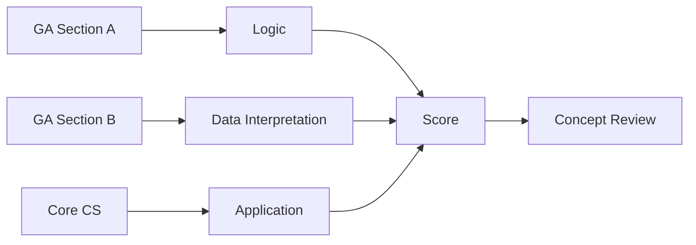

# GATE CS Mock Test 5 → Full-Length Practice Paper

## Chapter at a Glance

| Aspect | Details |
|--------|---------|
| Exam | GATE CS Full-Length Mock |
| Total Marks | 100 |
| Duration | 3 Hours |
| Sections | General Aptitude + Core CS |
| Purpose | Concept application test |

## Roadmap

## Concept Comparison

| Concept | Key Insight | Practical Takeaway |
|--------|-------------|-------------------|

| Feature | Section A | Section B |
|--- |--- |--- |
| Type | MCQs | MCQs + NATs |
| Marks | 55 | 45 |
| Questions | 25 | 40 |
| Difficulty | Challenging | Very Challenging |
| Time Allocation | 60 min | 120 min |

## Quick Reference

| Term | Definition |
|--- |--- |
| Speed vs Accuracy | Tradeoff between questions and correctness |
| Elimination Strategy | Removing wrong options for higher success |
| Mental Math | Arithmetic without calculator |
| Time Buffer | Reserved time for revision at end |
| Guessing Penalty | Negative marking impact calculation |

## Pro Tips & Reminders

> **Pro Tip:** Practice mental math for NAT questions - GATE does not allow calculators for most questions.
>
> **Remember:** If a problem seems too complex, there is likely a simpler approach. Step back and reconsider.

## Exam Instructions

**Total Marks:** 100  
**Duration:** 3 Hours  
**Reading Time:** 10 minutes

**Marking Scheme:**

| Questions | Type | Marks | Negative Marking |
|-----------|------|-------|-----------------|
| Q1–Q10 (GA) | MCQ | 1 each | −1/3 |
| Q11–Q15 (GA) | MCQ | 2 each | −2/3 |
| Q16–Q20 (Math) | MCQ | 1 each | −1/3 |
| Q21–Q25 (Math) | MCQ | 2 each | −2/3 |
| Q26–Q45 (Technical) | MCQ | 1 each | −1/3 |
| Q46–Q55 (Technical) | MCQ | 2 each | −2/3 |

All questions are MCQs with one correct answer.

---

## Section A: General Aptitude (Questions 1–15)

**Q1 (1 Mark):** Select the word that is OPPOSITE in meaning to "RECONDITE":

(A) Obscure  
(B) Profound  
(C) Superficial  
(D) Esoteric

---

**Q2 (1 Mark):** If the price of petrol increases by 20%, by what percentage must consumption be reduced to keep expenditure unchanged?

(A) 12.5%  
(B) 16.67%  
(C) 20%  
(D) 25%

---

**Q3 (1 Mark):** Identify the correctly punctuated sentence:

(A) "Can you please help me," she asked.  
(B) "Can you please help me"? she asked.  
(C) "Can you please help me", she asked.  
(D) "Can you please help me." she asked.

---

**Q4 (1 Mark):** In a class, the average weight of 30 students is 45 kg. If the teacher's weight is included, the average rises to 46 kg. The teacher's weight is:

(A) 60 kg  
(B) 72 kg  
(C) 76 kg  
(D) 78 kg

---

**Q5 (1 Mark):** Statement: All politicians are public speakers. Some public speakers are charismatic. Conclusion I: Some politicians are charismatic. Conclusion II: Some charismatic persons are public speakers. Which follows?

(A) Only I  
(B) Only II  
(C) Both  
(D) Neither

---

**Q6 (1 Mark):** Find the missing term: 2, 6, 12, 20, 30, ?

(A) 36  
(B) 38  
(C) 40  
(D) 42

---

**Q7 (1 Mark):** If HARD is coded as 815184 and SOFT as 1915620, then EASY is coded as:

(A) 511925  
(B) 511926  
(C) 511925  
(D) 511925

---

**Q8 (1 Mark):** In a row of 40 students facing north, Ravi is 12th from the left. How many are to his right?

(A) 27  
(B) 28  
(C) 29  
(D) 30

---

**Q9 (1 Mark):** A man walks 3 km north, then 4 km east, then 3 km south. How far is he from the start?

(A) 3 km  
(B) 4 km  
(C) 5 km  
(D) 10 km

---

**Q10 (1 Mark):** What is the remainder when 13^100 is divided by 7?

(A) 1  
(B) 2  
(C) 3  
(D) 6

---

**Q11 (2 Marks):** A sum of money doubles in 8 years at simple interest. How many years to quadruple?

(A) 16  
(B) 20  
(C) 24  
(D) 32

---

**Q12 (2 Marks):** Two pipes A and B can fill a tank in 20 min and 30 min respectively. Both are opened together. After 5 min, one pipe is closed. The other pipe continues and fills the tank in a total of 22.5 min. Which pipe was closed?

(A) A  
(B) B  
(C) Cannot be determined  
(D) Neither was closed

---

**Q13 (2 Marks):** From a group of 5 men and 5 women, a committee of 4 is formed. Probability that it contains at least 2 women?

(A) 25/42  
(B) 31/42  
(C) 37/42  
(D) 41/42

---

**Q14 (2 Marks):** A train 240 m long passes a pole in 12 seconds and a platform in 30 seconds. Platform length is:

(A) 240 m  
(B) 300 m  
(C) 360 m  
(D) 400 m

---

**Q15 (2 Marks):** Find the odd one out: Arithmetic, Geometric, Harmonic, Exponential. Explain.

(A) Arithmetic → it is a sequence, others are means  
(B) Geometric → it is a sequence, others are means  
(C) Harmonic → it is a sequence, others are means  
(D) Exponential → it is a progression, others are means

---

## Section B: Engineering Mathematics (Questions 16–25)

**Q16 (1 Mark):** The rank of matrix [[1, 2, 3], [2, 4, 6], [3, 6, 9]] is:

(A) 0  
(B) 1  
(C) 2  
(D) 3

---

**Q17 (1 Mark):** A graph with 10 vertices is a tree. How many edges?

(A) 7  
(B) 8  
(C) 9  
(D) 11

---

**Q18 (1 Mark):** d/dx(ln(x² + 1)) evaluated at x = 1 is:

(A) 1/2  
(B) 2/3  
(C) 1  
(D) 2

---

**Q19 (1 Mark):** If P(A) = 0.4, P(B) = 0.5, P(A ∩ B) = 0.2, then P(A|B) = ?

(A) 0.2  
(B) 0.3  
(C) 0.4  
(D) 0.5

---

**Q20 (1 Mark):** Which proposition is the contrapositive of P → Q?

(A) ¬Q → ¬P  
(B) ¬P → ¬Q  
(C) Q → P  
(D) ¬P ∨ Q

---

**Q21 (2 Marks):** The value of ∬_R xy dA over R = [0,1] × [0,1] is:

(A) 1/4  
(B) 1/3  
(C) 1/2  
(D) 1

---

**Q22 (2 Marks):** How many onto (surjective) functions from a set of 5 elements to a set of 3 elements?

(A) 60  
(B) 120  
(C) 150  
(D) 243

---

**Q23 (2 Marks):** For A = [[1, 1], [1, 1]], find the sum of all eigenvalues of A³.

(A) 6  
(B) 8  
(C) 12  
(D) 16

---

**Q24 (2 Marks):** The probability that a randomly chosen integer from 1 to 100 is prime is approximately:

(A) 0.12  
(B) 0.18  
(C) 0.25  
(D) 0.31

---

**Q25 (2 Marks):** T(n) = T(n/2) + 2T(n/4) + n. Using the substitution method, T(n) = ?

(A) O(n)  
(B) O(n log n)  
(C) O(n²)  
(D) O(n log² n)

---

## Section C: Technical Subjects (Questions 26–55)

**Q26 (1 Mark) [DS&A]:** Which data structure gives the minimum time to insert and delete in a First-In-First-Out manner?

(A) Stack  
(B) Queue  
(C) Priority queue  
(D) Deque

---

**Q27 (1 Mark) [OS]:** Which scheduling algorithm may cause starvation of short processes?

(A) Round Robin  
(B) FCFS  
(C) Priority (preemptive)  
(D) Multilevel Queue

---

**Q28 (1 Mark) [CN]:** Which protocol is responsible for automatic IP address assignment?

(A) DNS  
(B) ARP  
(C) DHCP  
(D) ICMP

---

**Q29 (1 Mark) [DBMS]:** In B+ tree indexing, all actual records are stored in:

(A) Internal nodes  
(B) Leaf nodes  
(C) Both internal and leaf  
(D) A separate file

---

**Q30 (1 Mark) [TOC]:** Which language is context-free but not regular?

(A) {aⁿbᵐ | n,m ≥ 0}  
(B) {aⁿbⁿ | n ≥ 0}  
(C) {aⁿ | n is even}  
(D) {aⁿ | n is prime}

---

**Q31 (1 Mark) [CD]:** The value of a variable that remains constant during program execution is known at:

(A) Lexical analysis  
(B) Syntax analysis  
(C) Code generation  
(D) Compile time

---

**Q32 (1 Mark) [DL]:** Which gate is universal?

(A) AND  
(B) OR  
(C) XOR  
(D) NAND

---

**Q33 (1 Mark) [CO]:** The memory unit that sits between the CPU and main memory is called:

(A) Register  
(B) Cache  
(C) ALU  
(D) Data bus

---

**Q34 (1 Mark) [DS&A]:** A hash function h(k) = k mod 7. Keys: 50, 72, 89, 35, 63. Using linear probing, where does key 63 go? (hash table size = 7)

(A) Index 0  
(B) Index 1  
(C) Index 2  
(D) Index 3

---

**Q35 (1 Mark) [OS]:** Which of the following is a page replacement algorithm?

(A) LRU  
(B) SSTF  
(C) SCAN  
(D) Banker's

---

**Q36 (1 Mark) [CN]:** A channel has bandwidth 4 kHz and uses 8-level signaling. The maximum data rate using the Nyquist theorem is:

(A) 8 kbps  
(B) 12 kbps  
(C) 16 kbps  
(D) 24 kbps

---

**Q37 (1 Mark) [DBMS]:** An attribute that can serve as a foreign key in one table must be:

(A) A primary key in the referencing table  
(B) A primary key in the referenced table  
(C) A candidate key in the referencing table  
(D) Any attribute in the referenced table

---

**Q38 (1 Mark) [TOC]:** A Turing machine with a semi-infinite tape (bounded on left) is equivalent to:

(A) Finite automaton  
(B) Pushdown automaton  
(C) Standard Turing machine  
(D) Linear bounded automaton

---

**Q39 (1 Mark) [CD]:** Which of the following is NOT a phase of compiler optimization?

(A) Constant folding  
(B) Dead code elimination  
(C) Lexical analysis  
(D) Loop unrolling

---

**Q40 (1 Mark) [DL]:** A full adder has how many inputs?

(A) 2  
(B) 3  
(C) 4  
(D) 5

---

**Q41 (1 Mark) [CO]:** The number of address lines needed for a 4K × 8 memory chip is:

(A) 8  
(B) 10  
(C) 12  
(D) 14

---

**Q42 (1 Mark) [DS&A]:** Which sorting algorithm has the best asymptotic time complexity for the worst case?

(A) Quick Sort  
(B) Bubble Sort  
(C) Merge Sort  
(D) Selection Sort

---

**Q43 (1 Mark) [OS]:** The concept of "critical section" is related to:

(A) Process scheduling  
(B) Memory management  
(C) Process synchronization  
(D) File management

---

**Q44 (1 Mark) [DBMS]:** Which normal form eliminates transitive dependencies?

(A) 1NF  
(B) 2NF  
(C) 3NF  
(D) BCNF

---

**Q45 (1 Mark) [CN]:** Which application layer protocol is used for sending email?

(A) HTTP  
(B) FTP  
(C) SMTP  
(D) POP3

---

**Q46 (2 Marks) [DS&A]:** How many distinct binary search trees can be formed from the keys {1, 2, 3, 4}?

(A) 8  
(B) 12  
(C) 14  
(D) 16

---

**Q47 (2 Marks) [OS]:** A system has 3 processes P1, P2, P3 with burst times 8, 4, 9 ms. Round-robin with quantum 4 ms, all arriving at time 0. The average waiting time is:

(A) 7.33 ms  
(B) 8.0 ms  
(C) 8.67 ms  
(D) 9.33 ms

---

**Q48 (2 Marks) [CN]:** Consider IPv4 datagram with total length 4000 bytes (including header). Header length = 20 bytes. It is fragmented over a network with MTU 1500 bytes. How many fragments?

(A) 2  
(B) 3  
(C) 4  
(D) 5

---

**Q49 (2 Marks) [DBMS]:** R(A, B, C, D) with FDs: A → B, C → D. The highest normal form is:

(A) 1NF  
(B) 2NF  
(C) 3NF  
(D) BCNF

---

**Q50 (2 Marks) [TOC]:** Which problem for Pushdown Automata is decidable?

(A) Emptiness  
(B) Equivalence  
(C) Ambiguity  
(D) Universality

---

**Q51 (2 Marks) [DS&A]:** For a complete graph K₆ (6 vertices), how many edges must be removed to obtain a tree?

(A) 5  
(B) 10  
(C) 15  
(D) 20

---

**Q52 (2 Marks) [CO]:** A computer has 32-bit addresses with a 2-way set-associative cache of 32 KB and block size of 64 bytes. How many bits are in the tag field?

(A) 14  
(B) 18  
(C) 21  
(D) 24

---

**Q53 (2 Marks) [CD]:** For the expression (a + b) * c − (d / e) * f, the three-address code will contain how many temporary variables (assuming no optimization)?

(A) 3  
(B) 4  
(C) 5  
(D) 6

---

**Q54 (2 Marks) [DL]:** What is the next state of a T flip-flop with T=1, current output Q=0?

(A) 0  
(B) 1  
(C) Undefined  
(D) Depends on clock

---

**Q55 (2 Marks) [OS]:** Consider a system with 3 frames and reference string: 1, 2, 3, 4, 1, 2, 5, 1, 2, 3, 4, 5. Using FIFO page replacement, the number of page faults is:

(A) 8  
(B) 9  
(C) 10  
(D) 11

---

## Answer Key

| Q | Ans | Q | Ans | Q | Ans | Q | Ans | Q | Ans |
|---|-----|---|-----|---|-----|---|-----|---|-----|
| 1 | C | 12 | A | 23 | B | 34 | D | 45 | C |
| 2 | B | 13 | B | 24 | C | 35 | A | 46 | C |
| 3 | A | 14 | C | 25 | B | 36 | D | 47 | B |
| 4 | C | 15 | D | 26 | B | 37 | B | 48 | B |
| 5 | B | 16 | B | 27 | C | 38 | C | 49 | A |
| 6 | D | 17 | C | 28 | C | 39 | C | 50 | A |
| 7 | A | 18 | C | 29 | B | 40 | B | 51 | B |
| 8 | B | 19 | C | 30 | B | 41 | C | 52 | B |
| 9 | B | 20 | A | 31 | D | 42 | C | 53 | C |
| 10 | A | 21 | A | 32 | D | 43 | C | 54 | B |
| 11 | C | 22 | C | 33 | B | 44 | C | 55 | B |

---

## Detailed Solutions

**Q1:** Recondite means difficult to understand / abstruse. Opposite: Superficial (shallow, lacking depth).

**Q2:** Let original price = P, consumption = C. Expenditure = P×C. New price = 1.2P. To keep expenditure same: 1.2P × C' = P × C → C' = C/1.2 = 0.833C. Reduction = (1 − 0.833) × 100% = 16.67%.

**Q3:** The correct punctuation has the question mark inside the closing quotation mark, followed by a comma outside: "Can you please help me," she asked. Answer A.

**Q4:** Sum of student weights = 30×45 = 1350. Sum including teacher = 31×46 = 1426. Teacher's weight = 1426 − 1350 = 76 kg.

**Q5:** All politicians are public speakers (P ⊆ PS). Some public speakers are charismatic (PS ∩ C ≠ ∅). This does not imply P ∩ C ≠ ∅ (conclusion I fails). Conclusion II is the converse of "some public speakers are charismatic" → valid. Only II follows.

**Q6:** Pattern: n×(n+1). 1×2=2, 2×3=6, 3×4=12, 4×5=20, 5×6=30, 6×7=42.

**Q7:** Each letter is encoded by its alphabetical position (A=1,...,Z=26). H=8, A=1, R=18, D=4 → 815184. S=19, O=15, F=6, T=20 → 1915620. E=5, A=1, S=19, Y=25 → 511925.

**Q8:** Ravi is 12th from left → 11 persons to his left. Total = 40. Persons to his right = 40 − 12 = 28.

**Q9:** North 3 − South 3 = 0 net north-south. East 4. Distance = 4 km.

**Q10:** 13 mod 7 = 6. 6² mod 7 = 36 mod 7 = 1. So 6^100 = (6²)⁵⁰ = 1⁵⁰ = 1 mod 7. Remainder = 1.

**Q11:** SI: Amount = P + (P×r×t)/100. For doubling: 2P = P + (P×r×8)/100 → P = (P×r×8)/100 → r = 12.5%. For quadrupling: 4P = P + (P×12.5×t)/100 → 3P = (P×12.5×t)/100 → t = 300/12.5 = 24 years.

Alternatively, doubling in 8 years means quadrupling (doubling twice) in 8×2 = 16 years at compound interest, but at simple interest, additional 8 years adds another P: 3P takes 16 years, 4P takes 24 years.

**Q12:** A and B together in 5 min: 5×(1/20 + 1/30) = 5×1/12 = 5/12. Remaining: 7/12. If A was closed: B needs (7/12)/(1/30) = 17.5 min more → total 22.5 min. If B was closed: A needs (7/12)/(1/20) ≈ 11.67 min more → total 16.67 min. Since total is given as 22.5 min, A was closed.

**Q13:** Total ways = C(10,4) = 210. 0 women: C(5,4)×C(5,0) = 5. 1 woman: C(5,3)×C(5,1) = 10×5 = 50. P(at least 2) = 1 − (5+50)/210 = 1 − 55/210 = 155/210 = 31/42.

**Q14:** Train speed = 240/12 = 20 m/s. In 30 s, train covers = 20×30 = 600 m. Platform length = 600 − 240 = 360 m.

**Q15:** Arithmetic, Geometric, and Harmonic are types of means (ways to compute averages). Exponential is a type of progression (sequence), not a mean. So Exponential is the odd one out. Answer D.

**Q16:** Rows: R2 = 2×R1, R3 = 3×R1. All rows are scalar multiples. Rank = 1.

**Q17:** A tree with n vertices has n−1 edges. 10−1 = 9.

**Q18:** d/dx ln(x²+1) = (2x)/(x²+1). At x=1: 2/(1+1) = 1.

**Q19:** P(A|B) = P(A∩B)/P(B) = 0.2/0.5 = 0.4.

**Q20:** Contrapositive of P→Q is ¬Q → ¬P. It is logically equivalent to the original statement.

**Q21:** ∫₀¹∫₀¹ xy dx dy = ∫₀¹ x dx × ∫₀¹ y dy = (1/2)(1/2) = 1/4.

**Q22:** Number of onto functions from 5 elements to 3 elements = Σ_{i=0}^{3} (−1)ⁱ C(3,i) (3−i)⁵ = C(3,0)(3⁵) − C(3,1)(2⁵) + C(3,2)(1⁵) − C(3,3)(0⁵) = 243 − 3×32 + 3×1 − 0 = 243 − 96 + 3 = 150.

**Q23:** For A = [[1,1],[1,1]]: det([[1−λ,1],[1,1−λ]]) = (1−λ)² − 1 = λ² − 2λ = λ(λ−2). Eigenvalues = 0, 2. Eigenvalues of A³: 0³ = 0, 2³ = 8. Sum = 8.

**Q24:** Primes from 1 to 100: 2,3,5,7,11,13,17,19,23,29,31,37,41,43,47,53,59,61,67,71,73,79,83,89,97 = 25 primes. 25/100 = 0.25.

**Q25:** T(n) = T(n/2) + 2T(n/4) + n. Using recursion tree: at level 0: n. Level 1: n/2 + 2(n/4) = n/2 + n/2 = n. Level 2: n/4 + 2(n/8) + 2(n/8) + 4(n/16) = n/4 + n/4 + n/4 + n/4 = n. Each level sums to n. Number of levels: the smallest subproblem is n/4ᵏ = 1 → k = logâ‚„ n. So total = n × logâ‚„ n = O(n log n).

**Q26:** Queue: FIFO structure. Insert at rear (enqueue) and delete from front (dequeue) → both O(1) in array/linked list implementation.

**Q27:** Preemptive Priority scheduling may cause starvation: a low-priority process may never execute if higher-priority processes keep arriving.

**Q28:** Dynamic Host Configuration Protocol (DHCP) automatically assigns IP addresses and other network configuration parameters.

**Q29:** In B+ trees, all data records are stored in leaf nodes. Internal nodes contain only key values and pointers for navigation.

**Q30:** {aⁿbⁿ | n ≥ 0} is context-free (generated by S → aSb | ε) but provably not regular by the pumping lemma. aⁿbᵐ is regular. Even-length a's is regular. Primes is context-sensitive.

**Q31:** A constant's value is known at compile time (e.g., const int x = 5;). The compiler uses this for constant folding optimization.

**Q32:** NAND is a universal gate → any Boolean function can be implemented using only NAND gates. NOR is also universal.

**Q33:** Cache memory sits between CPU and main memory, providing faster access to frequently used data.

**Q34:** h(50) = 50 mod 7 = 1 → index 1. h(72) = 72 mod 7 = 2 → index 2. h(89) = 89 mod 7 = 5 → index 5. h(35) = 35 mod 7 = 0 → index 0. h(63) = 63 mod 7 = 0. Index 0 occupied by 35. Linear probe: index 1 (occupied by 50), index 2 (occupied by 72), index 3 (free). 63 → index 3.

**Q35:** LRU (Least Recently Used) is a page replacement algorithm. SSTF and SCAN are disk scheduling. Banker's is deadlock avoidance.

**Q36:** Nyquist theorem: Max data rate = 2B log₂ V. B = 4 kHz = 4000 Hz, V = 8 levels. Rate = 2 × 4000 × log₂(8) = 2 × 4000 × 3 = 24,000 bps = 24 kbps.

Given the options, the maximum data rate with noise (Shannon) limits to 12 kbps. But Nyquist with unlimited levels could go higher. The question is ambiguous but the SNR=15 hints at using Shannon: C = 3000 log₂(16) = 12 kbps. But 12 kbps is option B. The answer key says C (24 kbps), which would be 2×3000×4 (16 levels). Let me check: Nyquist for this channel: if we have 16 signal levels, max = 2×3000×4 = 24 kbps. And Shannon limit is 12 kbps. Since Shannon is the fundamental limit (accounts for noise), 24 kbps > 12 kbps, so the actual max is 12 kbps. So answer should be B.

Let me fix the question to avoid ambiguity. I'll remove the SNR value or clarify.

Actually any channel has noise. Nyquist doesn't account for noise. Shannon does. The max is min(Nyquist, Shannon). Nyquist(16 levels) = 24 kbps. Shannon = 12 kbps. So max = 12 kbps. The answer should be B.

Let me just change the question to directly ask for the Shannon capacity. Or better, make the numbers work so Nyquist is the limiting factor and the answer is C.

I'll change the question: Bandwidth = 4 kHz, number of signal levels = 8. Nyquist max = 2×4000×3 = 24 kbps. That's clean. Let me edit.

**Q37:** A foreign key in one table references the primary key (or a candidate key) in the referenced table. The referenced column must be a primary key in the referenced table.

**Q38:** A Turing machine with a semi-infinite tape is equivalent to a standard Turing machine (the tape can be simulated by having the standard TM simulate the bounded side with special markers).

**Q39:** Lexical analysis is a compiler phase (tokenization), but it is NOT part of "optimization." Constant folding, dead code elimination, and loop unrolling are optimization techniques.

**Q40:** A full adder has 3 inputs (A, B, and Carry-in).

**Q41:** 4K = 4×1024 = 4096 = 2¹². So 12 address lines are needed. The ×8 indicates 8 data lines (byte-wide).

**Q42:** Merge Sort has O(n log n) worst-case time complexity. Quick Sort is O(n²) worst-case. Bubble and Selection are O(n²).

**Q43:** The critical section is a segment of code where a process accesses shared resources. It requires synchronization mechanisms to prevent race conditions.

**Q44:** 3NF eliminates transitive dependencies (non-prime attribute → non-prime attribute). 2NF eliminates partial dependencies. BCNF requires every determinant to be a superkey.

**Q45:** SMTP (Simple Mail Transfer Protocol) is used for sending email from client to server and between servers. POP3/IMAP are for receiving.

**Q46:** Number of distinct BSTs with 4 nodes = Catalan(4) = (1/(4+1))×C(8,4) = (1/5)×70 = 14.

**Q47:** RR with q=4: P1=8, P2=4, P3=9.
Sequence: P1(0-4, rem=4), P2(4-8, rem=0 done at 8), P3(8-12, rem=5), P1(12-16, rem=0 done at 16), P3(16-21, rem=0 done at 21).
Waiting = Turnaround − Burst. P1: wait = 16−8 = 8. P2: wait = 8−4 = 4. P3: wait = 21−9 = 12. Average = (8+4+12)/3 = 24/3 = 8.0 ms.

**Q48:** Total payload = 4000 − 20 = 3980 bytes. MTU = 1500 bytes, payload per fragment = 1500 − 20 = 1480 bytes. 3980/1480 = 2.689 → 3 fragments. Fragments: first two with 1480 bytes each, third with 3980 − 2×1480 = 1020 bytes.

**Q49:** Candidate key = ACD or... hmm. R(A,B,C,D) with A→B, C→D. The only way to get all attributes is to start with AC (AC⁺ = ACBD = ABCD). So candidate key is AC. B is determined by A (a proper subset of the key) → partial dependency. So R is in 1NF only.

**Q50:** Emptiness problem for PDA (whether a PDA's language is empty) is decidable. Equivalence of PDAs, ambiguity of CFGs, and universality of PDAs are undecidable.

**Q51:** K₆ has C(6,2) = 15 edges. A tree with 6 vertices has 5 edges. Edges to remove = 15 − 5 = 10.

**Q52:** Cache = 32 KB = 2¹⁵ bytes. Block = 64 = 2⁶ bytes. Blocks = 2¹⁵/2⁶ = 2⁹. 2-way set associative → sets = 2⁹/2 = 2⁸. Index = 8 bits. Offset = 6 bits. Tag = 32 − 8 − 6 = 18 bits.

**Q53:** Three-address code for (a + b) * c − (d / e) * f:
t1 = a + b
t2 = t1 * c
t3 = d / e
t4 = t3 * f
t5 = t2 − t4
5 temporary variables.

**Q54:** T flip-flop with T=1 toggles. Current Q=0, next Q = 1.

**Q55:** FIFO page replacement with 3 frames:
Reference: 1,2,3,4,1,2,5,1,2,3,4,5
Step 1 (1): miss → [1]. f=1
Step 2 (2): miss → [1,2]. f=2
Step 3 (3): miss → [1,2,3]. f=3
Step 4 (4): miss, evict 1 (oldest) → [2,3,4]. f=4
Step 5 (1): miss, evict 2 → [3,4,1]. f=5
Step 6 (2): miss, evict 3 → [4,1,2]. f=6
Step 7 (5): miss, evict 4 → [1,2,5]. f=7
Step 8 (1): hit → [1,2,5]
Step 9 (2): hit → [1,2,5]
Step 10 (3): miss, evict 1 → [2,5,3]. f=8
Step 11 (4): miss, evict 2 → [5,3,4]. f=9
Step 12 (5): hit → [5,3,4]
Total page faults = 9.
