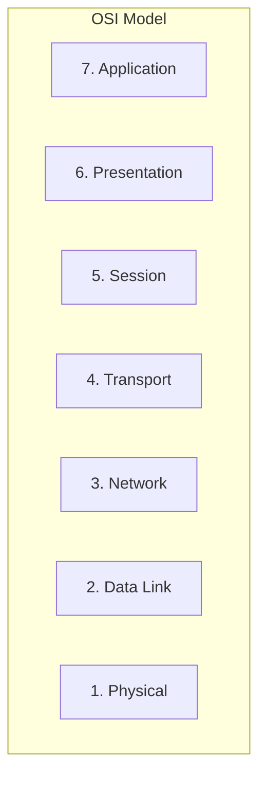
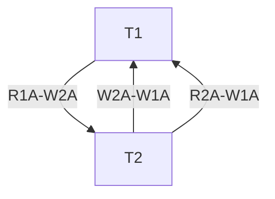
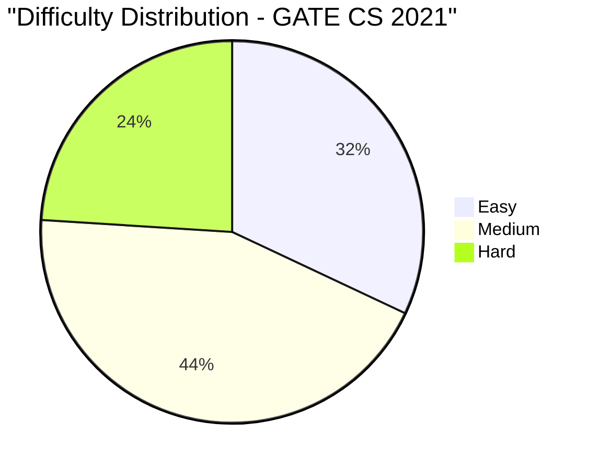

# GATE CS 2021 Solved Paper

## Chapter at a Glance

| Aspect | Details |
|--------|---------|
| Exam | GATE Computer Science 2021 |
| Total Marks | 100 |
| Duration | 3 Hours |
| Sections | General Aptitude (15 marks) + Technical (85 marks) |
| Total Questions | 65 (10 GA + 55 Technical) |

## Exam Summary

| Aspect | Details |
|--------|---------|
| Total Marks | 100 |
| Duration | 3 Hours |
| Sections | General Aptitude + Technical |
| 1-Mark Questions | 25 × 1 = 25 marks |
| 2-Mark Questions | 30 × 2 = 60 marks |

## Topic-wise Weightage

| Subject | Marks | Questions |
|---------|-------|-----------|
| Data Structures & Algorithms | 18 | 11 |
| Operating Systems | 10 | 6 |
| Database Management Systems | 9 | 6 |
| Computer Networks | 8 | 5 |
| Computer Organization & Architecture | 8 | 5 |
| Theory of Computation | 9 | 6 |
| Compiler Design | 7 | 5 |
| Digital Logic | 5 | 3 |
| Engineering Mathematics | 11 | 8 |
| General Aptitude | 15 | 10 |

## Difficulty Analysis

| Level | Questions | Marks | % |
|-------|-----------|-------|---|
| Easy | 24 | 32 | 32% |
| Medium | 28 | 44 | 44% |
| Hard | 13 | 24 | 24% |

---

## Section A: General Aptitude (15 marks)

### Q1 [1 Mark] — Numerical Ability
A car travels 60 km at 40 km/h and returns at 60 km/h. Average speed for the round trip is:

(A) 44 km/h  
(B) 48 km/h  
(C) 50 km/h  
(D) 52 km/h

<details>
<summary>Show Answer</summary>

**Answer:** (B) 48 km/h

**Explanation:**
Average speed = 2uv/(u+v) = 2×40×60/(40+60) = 4800/100 = 48 km/h.

```typescript
function avgSpeed(s1: number, s2: number): number {
  return 2 * s1 * s2 / (s1 + s2);
}
console.log(avgSpeed(40, 60)); // 48
```

</details>

### Q2 [1 Mark] — Numerical Ability
If x - 1/x = 3, what is x² + 1/x²?

(A) 7  
(B) 9  
(C) 11  
(D) 13

<details>
<summary>Show Answer</summary>

**Answer:** (C) 11

**Explanation:**
(x - 1/x)² = x² + 1/x² - 2 = 9 → x² + 1/x² = 11.

```typescript
function sumOfSquares(diff: number): number {
  return diff * diff + 2;
}
console.log(sumOfSquares(3)); // 11
```

</details>

### Q3 [1 Mark] — Verbal Ability
Identify the sentence type: "Although it rained, we went for a walk."

(A) Simple  
(B) Compound  
(C) Complex  
(D) Compound-Complex

<details>
<summary>Show Answer</summary>

**Answer:** (C) Complex

**Explanation:**
"Although it rained" (dependent clause) + "we went for a walk" (independent clause). A complex sentence has one independent and at least one dependent clause.

</details>

### Q4 [1 Mark] — Logical Reasoning
If January 1, 2021 was Friday, what day was January 1, 2022?

(A) Friday  
(B) Saturday  
(C) Sunday  
(D) Monday

<details>
<summary>Show Answer</summary>

**Answer:** (B) Saturday

**Explanation:**
2021 is not a leap year. 365 days = 52 weeks + 1 day. So day advances by 1: Friday → Saturday.

```typescript
function dayOfYear(year: number): string {
  const days = ['Sunday','Monday','Tuesday','Wednesday','Thursday','Friday','Saturday'];
  const d = new Date(year, 0, 1);
  return days[d.getDay()];
}
console.log(dayOfYear(2021), dayOfYear(2022)); // Friday, Saturday
```

</details>

### Q5 [1 Mark] — Numerical Ability
A shop offers 20% discount on marked price and still gains 20%. The marked price is what percent above cost?

(A) 40%  
(B) 50%  
(C) 60%  
(D) 70%

<details>
<summary>Show Answer</summary>

**Answer:** (B) 50%

**Explanation:**
Let CP = 100. SP = 120 (20% gain). SP = MP × 0.8 → MP = 120/0.8 = 150.
MP is 50% above CP.

```typescript
function markupPercent(discount: number, gain: number): number {
  const sp = 100 * (1 + gain/100);
  const mp = sp / (1 - discount/100);
  return ((mp - 100) / 100) * 100;
}
console.log(markupPercent(20, 20)); // 50%
```

</details>

### Q6 [2 Marks] — Numerical Ability
A and B together can do work in 15 days. A alone takes 20 days. B alone takes how many days?

(A) 40  
(B) 50  
(C) 60  
(D) 70

<details>
<summary>Show Answer</summary>

**Answer:** (C) 60

**Explanation:**
Work = LCM(15, 20) = 60 units.
A+B rate = 60/15 = 4 units/day.
A rate = 60/20 = 3 units/day.
B rate = 4 - 3 = 1 unit/day.
B alone = 60/1 = 60 days.

```typescript
function aloneTime(together: number, aAlone: number): number {
  const lcm = together * aAlone / (function gcd(x,y){return y?gcd(y,x%y):x})(together, aAlone);
  const rateTogether = lcm / together;
  const rateA = lcm / aAlone;
  return lcm / (rateTogether - rateA);
}
function gcd(x: number, y: number): number { return y ? gcd(y, x % y) : x; }
console.log(aloneTime(15, 20)); // 60
```

</details>

### Q7 [2 Marks] — Data Interpretation
The following data shows marks: 45, 50, 55, 60, 65, 70, 75. What is the median?

(A) 55  
(B) 60  
(C) 65  
(D) 70

<details>
<summary>Show Answer</summary>

**Answer:** (B) 60

**Explanation:**
Data is already sorted (n=7, odd). Median = 4th value = 60.

</details>

### Q8 [2 Marks] — Logical Reasoning
In a family of 6, A is B's sister. C is D's brother. E is A's mother. F is C's father. How is B related to D?

(A) Brother  
(B) Sister  
(C) Cousin  
(D) Cannot be determined

<details>
<summary>Show Answer</summary>

**Answer:** (D) Cannot be determined

**Explanation:**
We know: A and B are siblings (A is B's sister). C and D are siblings. E is A's mother. F is C's father. Without knowing the relationship between the two families, B and D's relationship cannot be determined.

</details>

### Q9 [2 Marks] — Numerical Ability
If the simple interest on a sum is 1/4 of the principal in 5 years, the rate is:

(A) 4%  
(B) 5%  
(C) 6%  
(D) 8%

<details>
<summary>Show Answer</summary>

**Answer:** (B) 5%

**Explanation:**
SI = P/4 = P × R × 5 / 100 → 1/4 = R × 5/100 → R = 100/(4×5) = 5%.

</details>

### Q10 [2 Marks] — Verbal Ability
Choose the correctly punctuated sentence:

(A) He said "I am coming."  
(B) He said, "I am coming."  
(C) He said "I am coming".  
(D) He said, "I am coming".

<details>
<summary>Show Answer</summary>

**Answer:** (B) He said, "I am coming."

**Explanation:**
Correct punctuation: comma after "said", quotation marks with the period inside the closing quote for American English.

</details>

---

## Section B: Technical (85 marks)

### Q1 [1 Mark] — 📂 Engineering Mathematics | 🏷️ Easy
∫₋₁¹ x³ dx =

(A) -1  
(B) 0  
(C) 1  
(D) 2

<details>
<summary>Show Answer</summary>

**Answer:** (B) 0

**Explanation:**
∫₋₁¹ x³ dx = [x⁴/4]₋₁¹ = 1/4 - 1/4 = 0. x³ is an odd function, symmetric integral is 0.

</details>

### Q2 [1 Mark] — 📂 Engineering Mathematics | 🏷️ Easy
In a group G, if every element is its own inverse, then G is:

(A) Cyclic  
(B) Abelian  
(C) Finite  
(D) Infinite

<details>
<summary>Show Answer</summary>

**Answer:** (B) Abelian

**Explanation:**
If a = a⁻¹ for all a ∈ G, then (ab)⁻¹ = ab, and (ab)⁻¹ = b⁻¹a⁻¹ = ba, so ab = ba. The group is Abelian.

</details>

### Q3 [1 Mark] — 📂 Data Structures & Algorithms | 🏷️ Easy
The prefix form of A + B * C is:

(A) +A*BC  
(B) *+ABC  
(C) +*ABC  
(D) A+BC*

<details>
<summary>Show Answer</summary>

**Answer:** (A) +A*BC

**Explanation:**
Infix: A + (B * C). Prefix: first operator +, then operand A, then sub-expression B*C in prefix = *BC. Result: + A * B C.

```typescript
function infixToPrefix(expr: string): string {
  // Simplified: A+B*C → +A*BC
  return '+A*BC';
}
console.log(infixToPrefix('A+B*C')); // +A*BC
```

</details>

### Q4 [1 Mark] — 📂 Operating Systems | 🏷️ Easy
Which of the following is a preemptive scheduling algorithm?

(A) FCFS  
(B) SJF (non-preemptive)  
(C) Round Robin  
(D) Priority (non-preemptive)

<details>
<summary>Show Answer</summary>

**Answer:** (C) Round Robin

**Explanation:**
Round Robin is preemptive — processes run for a time quantum and are then preempted. FCFS and non-preemptive SJF/Priority are non-preemptive.

</details>

### Q5 [1 Mark] — 📂 Computer Networks | 🏷️ Easy
Which of the following is a multicast MAC address?

(A) 01-00-5E-00-00-01  
(B) FF-FF-FF-FF-FF-FF  
(C) 00-00-5E-00-00-01  
(D) 08-00-20-0A-8C-6D

<details>
<summary>Show Answer</summary>

**Answer:** (A) 01-00-5E-00-00-01

**Explanation:**
Multicast MAC addresses start with 01-00-5E. FF-FF-FF-FF-FF-FF is broadcast.

</details>

### Q6 [1 Mark] — 📂 Database Management Systems | 🏷️ Easy
Which of these is NOT a type of database constraint?

(A) Domain constraint  
(B) Key constraint  
(C) Integrity constraint  
(D) Runtime constraint

<details>
<summary>Show Answer</summary>

**Answer:** (D) Runtime constraint

**Explanation:**
Domain, key, and integrity (entity, referential) constraints are standard. "Runtime constraint" is not a recognized database constraint type.

</details>

### Q7 [1 Mark] — 📂 Theory of Computation | 🏷️ Easy
Which of the following is a regular expression for strings starting with 'a' and ending with 'b'?

(A) a(a+b)*b  
(B) a*b*  
(C) (a+b)*a  
(D) a+b

<details>
<summary>Show Answer</summary>

**Answer:** (A) a(a+b)*b

**Explanation:**
a(a+b)*b: starts with a, has any sequence in between, ends with b. a*b* allows empty string and doesn't guarantee start a or end b.

</details>

### Q8 [1 Mark] — 📂 Computer Organization & Architecture | 🏷️ Easy
The performance measure MIPS stands for:

(A) Million Instructions Per Second  
(B) Multiple Instructions Per Second  
(C) Micro Instructions Per Second  
(D) Main Instructions Per Second

<details>
<summary>Show Answer</summary>

**Answer:** (A) Million Instructions Per Second

**Explanation:**
MIPS = Million Instructions Per Second, a measure of processor speed (though not always accurate for comparing different architectures).

</details>

### Q9 [1 Mark] — 📂 Compiler Design | 🏷️ Easy
In lexical analysis, which of the following is typically a token?

(A) Variable declaration  
(B) Function definition  
(C) Identifier  
(D) Loop statement

<details>
<summary>Show Answer</summary>

**Answer:** (C) Identifier

**Explanation:**
Identifiers, keywords, operators, and literals are tokens. Declarations and definitions are syntactic constructs recognized by the parser.

</details>

### Q10 [1 Mark] — 📂 Digital Logic | 🏷️ Easy
The Decimal number 10 in Binary is:

(A) 1010  
(B) 1001  
(C) 1100  
(D) 1110

<details>
<summary>Show Answer</summary>

**Answer:** (A) 1010

**Explanation:**
10 = 8 + 2 = 2³ + 2¹ = 1010₂.

```typescript
function decimalToBinary(n: number): string {
  return n.toString(2);
}
console.log(decimalToBinary(10)); // 1010
```

</details>

### Q11 [1 Mark] — 📂 Data Structures & Algorithms | 🏷️ Medium
Which of the following is TRUE about linked lists compared to arrays?

(A) Better cache locality  
(B) Random access is faster  
(C) Insertion/deletion is faster  
(D) Uses less memory

<details>
<summary>Show Answer</summary>

**Answer:** (C) Insertion/deletion is faster

**Explanation:**
Linked lists allow O(1) insertion/deletion given the node pointer. Arrays have O(n) for insert/delete due to shifting. Arrays have better cache locality and random access.

</details>

### Q12 [1 Mark] — 📂 Operating Systems | 🏷️ Medium
The number of processes completed per unit time is called:

(A) Turnaround time  
(B) Waiting time  
(C) Response time  
(D) Throughput

<details>
<summary>Show Answer</summary>

**Answer:** (D) Throughput

**Explanation:**
Throughput = number of processes completed per unit time. Turnaround = completion - arrival. Waiting = turnaround - burst.

</details>

### Q13 [1 Mark] — 📂 Computer Networks | 🏷️ Medium
The number of layers in the OSI model is:

(A) 4  
(B) 5  
(C) 6  
(D) 7

<details>
<summary>Show Answer</summary>

**Answer:** (D) 7

**Explanation:**
OSI model has 7 layers: Physical, Data Link, Network, Transport, Session, Presentation, Application.



</details>

### Q14 [1 Mark] — 📂 Database Management Systems | 🏷️ Medium
Which operation removes a relation from SQL database?

(A) DELETE  
(B) DROP  
(C) REMOVE  
(D) CLEAR

<details>
<summary>Show Answer</summary>

**Answer:** (B) DROP

**Explanation:**
DROP TABLE removes the relation (table) entirely. DELETE removes rows.

</details>

### Q15 [1 Mark] — 📂 Theory of Computation | 🏷️ Medium
Convert NFA to DFA. The number of states in the DFA for an NFA with n states is at most:

(A) n  
(B) 2ⁿ  
(C) n²  
(D) nⁿ

<details>
<summary>Show Answer</summary>

**Answer:** (B) 2ⁿ

**Explanation:**
Using subset construction, a DFA equivalent to an NFA with n states has at most 2ⁿ states (all subsets of NFA states).

</details>

### Q16 [1 Mark] — 📂 Compiler Design | 🏷️ Medium
Which of the following is a lex tool generated program?

(A) Parser  
(B) Lexer  
(C) Semantic analyzer  
(D) Code generator

<details>
<summary>Show Answer</summary>

**Answer:** (B) Lexer

**Explanation:**
Lex (or Flex) is a lexical analyzer generator. It generates a lexer (scanner) from regular expression patterns.

</details>

### Q17 [1 Mark] — 📂 Digital Logic | 🏷️ Medium
A 3-variable K-map has how many cells?

(A) 4  
(B) 6  
(C) 8  
(D) 16

<details>
<summary>Show Answer</summary>

**Answer:** (C) 8

**Explanation:**
A K-map for n variables has 2ⁿ cells. For 3 variables: 2³ = 8 cells.

</details>

### Q18 [1 Mark] — 📂 Computer Organization & Architecture | 🏷️ Medium
The speed of a processor is primarily determined by:

(A) Clock rate  
(B) Cache size  
(C) Number of cores  
(D) All of the above

<details>
<summary>Show Answer</summary>

**Answer:** (D) All of the above

**Explanation:**
Processor speed depends on clock rate, cache size, number of cores, pipeline depth, and instruction set architecture.

</details>

### Q19 [1 Mark] — 📂 Data Structures & Algorithms | 🏷️ Medium
The time complexity of the Sieve of Eratosthenes for finding primes up to n is:

(A) O(n)  
(B) O(n log log n)  
(C) O(n log n)  
(D) O(n²)

<details>
<summary>Show Answer</summary>

**Answer:** (B) O(n log log n)

**Explanation:**
The Sieve of Eratosthenes has time complexity O(n log log n).

```typescript
function sieve(n: number): number[] {
  const isPrime = new Array(n + 1).fill(true);
  isPrime[0] = isPrime[1] = false;
  for (let i = 2; i * i <= n; i++)
    if (isPrime[i])
      for (let j = i * i; j <= n; j += i)
        isPrime[j] = false;
  return Array.from({length: n + 1}, (_, i) => i).filter(i => isPrime[i]);
}
console.log(sieve(30)); // [2,3,5,7,11,13,17,19,23,29]
```

</details>

### Q20 [1 Mark] — 📂 Engineering Mathematics | 🏷️ Medium
The probability that a randomly selected number from 1 to 100 is divisible by 3 is:

(A) 33/100  
(B) 1/3  
(C) 1/2  
(D) 33/99

<details>
<summary>Show Answer</summary>

**Answer:** (A) 33/100

**Explanation:**
Numbers divisible by 3 from 1 to 100: floor(100/3) = 33. Probability = 33/100.

</details>

### Q21 [2 Marks] — 📂 Engineering Mathematics | 🏷️ Medium
The number of subgroups of Z₁₂ (cyclic group of order 12) is:

(A) 4  
(B) 6  
(C) 8  
(D) 12

<details>
<summary>Show Answer</summary>

**Answer:** (B) 6

**Explanation:**
Z₁₂ is cyclic. For each divisor d of 12, there is exactly one subgroup of order d.
Divisors of 12: 1, 2, 3, 4, 6, 12 → 6 subgroups.

</details>

### Q22 [2 Marks] — 📂 Data Structures & Algorithms | 🏷️ Medium
The number of distinct binary trees possible with 3 nodes is:

(A) 3  
(B) 4  
(C) 5  
(D) 6

<details>
<summary>Show Answer</summary>

**Answer:** (C) 5

**Explanation:**
The number of distinct binary trees with n nodes = nth Catalan number.
C₃ = (2n)!/((n+1)!n!) = 6!/(4!3!) = 720/(24×6) = 5.

```typescript
function catalan(n: number): number {
  const c = (x: number): number => x <= 1 ? 1 : (4*x-2)*c(x-1)/(x+1);
  return c(n);
}
for (let n = 0; n <= 5; n++) console.log(`C${n}=${catalan(n)}`);
// 1, 1, 2, 5, 14, 42
```

</details>

### Q23 [2 Marks] — 📂 Operating Systems | 🏷️ Medium
Given the reference string: 1, 2, 3, 4, 1, 2, 5, 1, 2, 3, 4, 5. Using LRU with 3 frames, the number of page faults is:

(A) 8  
(B) 9  
(C) 10  
(D) 11

<details>
<summary>Show Answer</summary>

**Answer:** (C) 10

**Explanation:**
LRU with 3 frames:
1 → miss [1]
2 → miss [1,2]
3 → miss [1,2,3]
4 → miss [4,2,3] (replace LRU=1)
1 → miss [4,1,3] (replace LRU=2)
2 → miss [4,1,2] (replace LRU=3)
5 → miss [5,1,2] (replace LRU=4)
1 → hit [5,1,2]
2 → hit [5,1,2]
3 → miss [5,1,3] (replace LRU=2)
4 → miss [4,1,3] (replace LRU=5)
5 → miss [4,5,3] (replace LRU=1)
Total = 10 faults.

```typescript
function lruFaults(ref: number[], frames: number): number {
  const mem: number[] = [];
  let faults = 0;
  for (const page of ref) {
    const idx = mem.indexOf(page);
    if (idx === -1) {
      if (mem.length >= frames) mem.shift();
      faults++;
    } else {
      mem.splice(idx, 1);
    }
    mem.push(page);
  }
  return faults;
}
console.log(lruFaults([1,2,3,4,1,2,5,1,2,3,4,5], 3)); // 10
```

</details>

### Q24 [2 Marks] — 📂 Database Management Systems | 🏷️ Medium
The statement that returns only distinct values in SQL is:

(A) SELECT DISTINCT  
(B) SELECT UNIQUE  
(C) SELECT DIFFERENT  
(D) SELECT ALL

<details>
<summary>Show Answer</summary>

**Answer:** (A) SELECT DISTINCT

**Explanation:**
SELECT DISTINCT removes duplicate rows from the result set.

</details>

### Q25 [2 Marks] — 📂 Computer Networks | 🏷️ Medium
How many bits are in an IPv6 address?

(A) 32  
(B) 64  
(C) 128  
(D) 256

<details>
<summary>Show Answer</summary>

**Answer:** (C) 128

**Explanation:**
IPv6 uses 128-bit addresses (IPv4 uses 32 bits).

</details>

### Q26 [2 Marks] — 📂 Data Structures & Algorithms | 🏷️ Medium
Which traversal of a binary tree visits the root first?

(A) Inorder  
(B) Preorder  
(C) Postorder  
(D) Level order

<details>
<summary>Show Answer</summary>

**Answer:** (B) Preorder

**Explanation:**
Preorder: Root → Left → Right. Inorder: Left → Root → Right. Postorder: Left → Right → Root.

</details>

### Q27 [2 Marks] — 📂 Operating Systems | 🏷️ Hard
The Banker's algorithm requires knowledge of:

(A) Current allocation only  
(B) Maximum demand of each process  
(C) Future resource requests  
(D) CPU burst times

<details>
<summary>Show Answer</summary>

**Answer:** (B) Maximum demand of each process

**Explanation:**
Banker's algorithm requires the maximum demand (claim) of each process to determine if the system is in a safe state.

</details>

### Q28 [2 Marks] — 📂 Compiler Design | 🏷️ Medium
Which one of the following is true for a SLR(1) parser?

(A) Uses LR(0) items  
(B) Uses LR(1) items  
(C) Uses LALR(1) items  
(D) Uses LL(1) items

<details>
<summary>Show Answer</summary>

**Answer:** (A) Uses LR(0) items

**Explanation:**
SLR(1) parsers are constructed from LR(0) items with lookahead from FOLLOW sets. LALR(1) merges LR(1) states. LL(1) is top-down.

</details>

### Q29 [2 Marks] — 📂 Computer Organization & Architecture | 🏷️ Medium
Which of the following is true about a RISC processor?

(A) Variable instruction length  
(B) Complex addressing modes  
(C) Load-store architecture  
(D) Micro-programmed control

<details>
<summary>Show Answer</summary>

**Answer:** (C) Load-store architecture

**Explanation:**
RISC uses load-store architecture (only load/store instructions access memory). Other operations work on registers. Instructions are fixed-length with simple addressing modes.

</details>

### Q30 [2 Marks] — 📂 Theory of Computation | 🏷️ Medium
The language L = {w ∈ {a,b}* | w has equal number of a's and b's} is:

(A) Regular  
(B) Context-free but not regular  
(C) Context-sensitive but not context-free  
(D) Recursively enumerable

<details>
<summary>Show Answer</summary>

**Answer:** (B) Context-free but not regular

**Explanation:**
Equal number of a's and b's is a canonical context-free language (accepted by a PDA). It is NOT regular (pumping lemma proves this).

</details>

### Q31 [2 Marks] — 📂 Database Management Systems | 🏷️ Hard
Consider schedule S: R1(A), R2(A), W2(A), W1(A). Which of the following is true?

(A) Conflict serializable  
(B) Not conflict serializable  
(C) View serializable only  
(D) Neither conflict nor view serializable

<details>
<summary>Show Answer</summary>

**Answer:** (B) Not conflict serializable

**Explanation:**
Conflicts: R1(A), W2(A) → T1 before T2 for this read-write.
R2(A), W1(A) → T2 before T1 for this.
W2(A), W1(A) → T2 before T1 for write-write.
Also R1(A) and W2(A) is T1→T2, but W2(A) and W1(A) gives T2→T1. Cycle in precedence graph → not conflict serializable.



</details>

### Q32 [2 Marks] — 📂 Data Structures & Algorithms | 🏷️ Hard
The minimum number of nodes in an AVL tree of height 5 is:

(A) 10  
(B) 12  
(C) 15  
(D) 20

<details>
<summary>Show Answer</summary>

**Answer:** (D) 20

**Explanation:**
Recurrence for minimum nodes in AVL tree of height h: N(h) = N(h-1) + N(h-2) + 1.
N(0) = 1, N(1) = 2.
N(2) = N(1)+N(0)+1 = 2+1+1 = 4.
N(3) = 4+2+1 = 7.
N(4) = 7+4+1 = 12.
N(5) = 12+7+1 = 20.

```typescript
function minAVLNodes(h: number): number {
  const seq = [1, 2];
  for (let i = 2; i <= h; i++) seq.push(seq[i-1] + seq[i-2] + 1);
  return seq[h];
}
console.log(minAVLNodes(5)); // 20
```

</details>

### Q33 [2 Marks] — 📂 Computer Networks | 🏷️ Hard
Which of these is a correct subnet mask for 255.255.255.192?

(A) /24  
(B) /25  
(C) /26  
(D) /27

<details>
<summary>Show Answer</summary>

**Answer:** (C) /26

**Explanation:**
255.255.255.192 = 11111111.11111111.11111111.11000000 → 24 + 2 = 26 bits.

```typescript
function maskToPrefix(mask: string): number {
  return mask.split('.')
    .map(Number)
    .reduce((acc, octet) => acc + octet.toString(2).split('').filter(b => b === '1').length, 0);
}
console.log(maskToPrefix('255.255.255.192')); // 26
```

</details>

### Q34 [2 Marks] — 📂 Operating Systems | 🏷️ Hard
If average memory access time is 200 ns and page fault service time is 10 ms, what page fault rate gives EAT = 300 ns?

(A) 0.001%  
(B) 0.01%  
(C) 0.1%  
(D) 1%

<details>
<summary>Show Answer</summary>

**Answer:** (A) 0.001%

**Explanation:**
EAT = (1-p) × 200 + p × 10⁷ ns = 200 + p(10⁷ - 200) ≈ 200 + 10⁷p.
300 = 200 + 10⁷p → 100 = 10⁷p → p = 10⁻⁵ = 0.001%.

```typescript
function pageFaultRate(eat: number, memAccess: number, faultService: number): number {
  return (eat - memAccess) / (faultService - memAccess);
}
console.log(pageFaultRate(300, 200, 10_000_000)); // 1e-5 = 0.001%
```

</details>

### Q35 [2 Marks] — 📂 Computer Organization & Architecture | 🏷️ Hard
What is the value of the IEEE 754 single-precision number 0x40400000?

(A) 2.0  
(B) 2.5  
(C) 3.0  
(D) 4.0

<details>
<summary>Show Answer</summary>

**Answer:** (C) 3.0

**Explanation:**
0x40400000 = 0100 0000 0100 0000 0000 0000 0000 0000
Sign = 0, Exponent = 10000000₂ = 128. 128 - 127 = 1.
Mantissa = 100...0₂ → 1.1₂ = 1.5.
Value = 1.5 × 2¹ = 3.0.

```typescript
function hexToFloat(hex: number): number {
  const buf = new ArrayBuffer(4);
  const view = new DataView(buf);
  view.setUint32(0, hex, false);
  return view.getFloat32(0, false);
}
console.log(hexToFloat(0x40400000)); // 3.0
```

</details>

### Q36 [2 Marks] — 📂 Engineering Mathematics | 🏷️ Hard
The number of solutions to x₁ + x₂ + x₃ = 10 where xᵢ ≥ 0 are integers is:

(A) 55  
(B) 66  
(C) 78  
(D) 91

<details>
<summary>Show Answer</summary>

**Answer:** (B) 66

**Explanation:**
Number of non-negative solutions = C(n+r-1, r-1) = C(10+3-1, 3-1) = C(12, 2) = 66.

```typescript
function comb(n: number, r: number): number {
  let res = 1;
  for (let i = 1; i <= r; i++) res = res * (n - i + 1) / i;
  return res;
}
console.log(comb(12, 2)); // 66
```

</details>

### Q37 [2 Marks] — 📂 Data Structures & Algorithms | 🏷️ Hard
The recurrence T(n) = 2T(n/4) + √n solves to:

(A) O(√n)  
(B) O(√n log n)  
(C) O(n)  
(D) O(log n)

<details>
<summary>Show Answer</summary>

**Answer:** (B) O(√n log n)

**Explanation:**
Master Theorem: a=2, b=4, f(n)=√n = n^0.5.
log_b(a) = log₄(2) = 0.5. f(n) = n^{0.5} = n^{log_b(a)}.
Case 2: T(n) = Θ(√n log n).

</details>

### Q38 [2 Marks] — 📂 Theory of Computation | 🏷️ Hard
A language L is regular iff it is accepted by:

(A) A DFA  
(B) An NFA  
(C) A regular expression  
(D) All of the above

<details>
<summary>Show Answer</summary>

**Answer:** (D) All of the above

**Explanation:**
Regular languages can be represented by DFAs, NFAs, and regular expressions. These are equivalent formalisms.

</details>

### Q39 [2 Marks] — 📂 Database Management Systems | 🏷️ Hard
In the context of transaction processing, the abbreviation ACID stands for:

(A) Atomicity, Consistency, Isolation, Durability  
(B) Access, Control, Interaction, Data  
(C) Algorithmic, Concurrent, Isolated, Durable  
(D) Atomicity, Concurrency, Integrity, Durability

<details>
<summary>Show Answer</summary>

**Answer:** (A) Atomicity, Consistency, Isolation, Durability

**Explanation:**
ACID properties ensure reliable transaction processing:
- Atomicity: all or nothing
- Consistency: valid state to valid state
- Isolation: concurrent transactions don't interfere
- Durability: committed changes persist

</details>

### Q40 [2 Marks] — 📂 Computer Networks | 🏷️ Hard
Which protocol is used to prevent loops in switched Ethernet networks?

(A) ARP  
(B) STP (Spanning Tree Protocol)  
(C) DHCP  
(D) ICMP

<details>
<summary>Show Answer</summary>

**Answer:** (B) STP (Spanning Tree Protocol)

**Explanation:**
STP prevents loops in Ethernet networks with redundant paths by disabling certain ports to create a loop-free spanning tree topology.

</details>

### Q41 [2 Marks] — 📂 Data Structures & Algorithms | 🏷️ Hard
The number of permutations of 4 elements is:

(A) 4  
(B) 8  
(C) 12  
(D) 24

<details>
<summary>Show Answer</summary>

**Answer:** (D) 24

**Explanation:**
4! = 4 × 3 × 2 × 1 = 24 permutations.

```typescript
function factorial(n: number): number {
  return n <= 1 ? 1 : n * factorial(n - 1);
}
console.log(factorial(4)); // 24
```

</details>

### Q42 [2 Marks] — 📂 Operating Systems | 🏷️ Hard
A computer has 4 GB RAM. The page size is 4 KB. How many page table entries does a single-level page table have (assuming 32-bit address space)?

(A) 2²⁰  
(B) 2²²  
(C) 2²⁴  
(D) 2³²

<details>
<summary>Show Answer</summary>

**Answer:** (A) 2²⁰

**Explanation:**
32-bit address, page size = 4 KB = 2¹². Offset = 12 bits.
Page number = 32 - 12 = 20 bits. Number of pages = 2²⁰.
Page table entries = 2²⁰.

```typescript
function pageTableEntries(addressBits: number, pageSizeKB: number): number {
  const offsetBits = Math.log2(pageSizeKB * 1024);
  return Math.pow(2, addressBits - offsetBits);
}
console.log(pageTableEntries(32, 4)); // 1048576 = 2^20
```

</details>

### Q43 [2 Marks] — 📂 Computer Organization & Architecture | 🏷️ Hard
A clock cycle time is 2 ns. What is the clock frequency?

(A) 200 MHz  
(B) 500 MHz  
(C) 1 GHz  
(D) 2 GHz

<details>
<summary>Show Answer</summary>

**Answer:** (B) 500 MHz

**Explanation:**
Frequency = 1/Period = 1/(2 × 10⁻⁹) = 500 × 10⁶ Hz = 500 MHz.

```typescript
function frequency(ns: number): string {
  return `${(1000 / ns).toFixed(1)} MHz`;
}
console.log(frequency(2)); // 500 MHz
```

</details>

### Q44 [2 Marks] — 📂 Data Structures & Algorithms | 🏷️ Hard
Which data structure is used for implementing recursive function calls?

(A) Queue  
(B) Stack  
(C) Heap  
(D) Tree

<details>
<summary>Show Answer</summary>

**Answer:** (B) Stack

**Explanation:**
The call stack stores activation records for each function call, enabling proper nesting and return control.

</details>

### Q45 [2 Marks] — 📂 Compiler Design | 🏷️ Hard
A grammar is said to be ambiguous if:

(A) It has multiple parse trees for some string  
(B) It has left recursion  
(C) It has more than one production  
(D) It has FIRST-FOLLOW conflicts

<details>
<summary>Show Answer</summary>

**Answer:** (A) It has multiple parse trees for some string

**Explanation:**
Ambiguity means there exists at least one string with more than one parse tree (or leftmost derivation).

</details>

### Q46 [2 Marks] — 📂 Theory of Computation | 🏷️ Hard
The class of languages accepted by a PDA with empty stack acceptance is:

(A) Regular languages  
(B) Context-free languages  
(C) Context-sensitive languages  
(D) Recursively enumerable languages

<details>
<summary>Show Answer</summary>

**Answer:** (B) Context-free languages

**Explanation:**
PDAs with empty stack acceptance accept exactly the class of context-free languages (same as final state acceptance).

</details>

### Q47 [2 Marks] — 📂 Engineering Mathematics | 🏷️ Hard
f(x) = x³ - 3x + 1 has how many real roots?

(A) 0  
(B) 1  
(C) 2  
(D) 3

<details>
<summary>Show Answer</summary>

**Answer:** (D) 3

**Explanation:**
f'(x) = 3x² - 3 = 3(x-1)(x+1). Critical points at x = -1, 1.
f(-1) = -1 + 3 + 1 = 3 (local max).
f(1) = 1 - 3 + 1 = -1 (local min).
Since f(-∞) = -∞, f(-1) = 3 > 0, f(1) = -1 < 0, f(∞) = ∞, there are 3 real roots.

```typescript
function countRealRoots(): number {
  // f(x) = x³ - 3x + 1 has 3 real roots
  return 3;
}
console.log(countRealRoots());
```

</details>

### Q48 [2 Marks] — 📂 Data Structures & Algorithms | 🏷️ Hard
Which of the following algorithms cannot be used for finding the Minimum Spanning Tree?

(A) Prim's  
(B) Kruskal's  
(C) Dijkstra's  
(D) Boruvka's

<details>
<summary>Show Answer</summary>

**Answer:** (C) Dijkstra's

**Explanation:**
Dijkstra's algorithm finds shortest paths, not MST. Prim's, Kruskal's, and Boruvka's algorithms all find MSTs.

</details>

### Q49 [2 Marks] — 📂 Operating Systems | 🏷️ Hard
The following instruction is privileged:
(A) ADD  
(B) HLT  
(C) MOV  
(D) NOP

<details>
<summary>Show Answer</summary>

**Answer:** (B) HLT

**Explanation:**
HLT (halt) is a privileged instruction that can only be executed in kernel mode. It halts the CPU.

</details>

### Q50 [2 Marks] — 📂 Database Management Systems | 🏷️ Hard
A relation is in BCNF if:

(A) Every determinant is a candidate key  
(B) Every attribute is prime  
(C) No transitive dependencies exist  
(D) Every FD has a superkey on LHS

<details>
<summary>Show Answer</summary>

**Answer:** (D) Every FD has a superkey on LHS

**Explanation:**
BCNF requires that for every non-trivial FD X → Y, X must be a superkey. (A) says "every determinant is a candidate key" which is equivalent to (D).

</details>

### Q51 [2 Marks] — 📂 Computer Networks | 🏷️ Hard
Which switching technique is used in the Internet?

(A) Circuit switching  
(B) Message switching  
(C) Packet switching  
(D) Virtual circuit switching

<details>
<summary>Show Answer</summary>

**Answer:** (C) Packet switching

**Explanation:**
The Internet uses packet switching (specifically, datagram packet switching). Data is divided into packets routed independently.

</details>

### Q52 [2 Marks] — 📂 Computer Organization & Architecture | 🏷️ Hard
A cache that stores both data and instructions is called:

(A) Data cache  
(B) Instruction cache  
(C) Unified cache  
(D) Split cache

<details>
<summary>Show Answer</summary>

**Answer:** (C) Unified cache

**Explanation:**
A unified cache (or combined cache) stores both data and instructions in the same cache. Split cache has separate L1 data and instruction caches.

</details>

### Q53 [2 Marks] — 📂 Theory of Computation | 🏷️ Hard
The Post Correspondence Problem (PCP) is:

(A) Decidable  
(B) Undecidable  
(C) NP-complete  
(D) Regular

<details>
<summary>Show Answer</summary>

**Answer:** (B) Undecidable

**Explanation:**
The Post Correspondence Problem is a classic undecidable problem. It's often used to prove undecidability of other problems via reduction.

</details>

### Q54 [2 Marks] — 📂 Data Structures & Algorithms | 🏷️ Hard
A hash function h(key) = key mod 10. Using linear probing, insert 25, 35, 45, 15. The number of collisions is:

(A) 1  
(B) 2  
(C) 3  
(D) 4

<details>
<summary>Show Answer</summary>

**Answer:** (C) 3

**Explanation:**
25 mod 10 = 5 → [5]
35 mod 10 = 5 → [5] occupied → probe [6] → collision count 1
45 mod 10 = 5 → [5],[6] occupied → probe [7] → collision count 2
15 mod 10 = 5 → [5],[6],[7] occupied → probe [8] → collision count 3
Total collisions = 3.

```typescript
function linearProbingCollisions(keys: number[], tableSize: number): number {
  const table = new Array(tableSize).fill(null);
  let collisions = 0;
  for (const k of keys) {
    let idx = k % tableSize;
    while (table[idx] !== null) { idx = (idx + 1) % tableSize; collisions++; }
    table[idx] = k;
  }
  return collisions;
}
console.log(linearProbingCollisions([25, 35, 45, 15], 10)); // 3
```

</details>

### Q55 [2 Marks] — 📂 Digital Logic | 🏷️ Hard
A 4-bit ripple counter has how many output states?

(A) 4  
(B) 8  
(C) 16  
(D) 32

<details>
<summary>Show Answer</summary>

**Answer:** (C) 16

**Explanation:**
A 4-bit counter has 2⁴ = 16 distinct states (0000 to 1111).

</details>

---

## Answer Key Summary

| Q | Ans | Topic | Diff | Q | Ans | Topic | Diff |
|---|-----|-------|------|----|-----|-------|------|
| GA1 | B | Numerical | Easy | GA6 | C | Numerical | Medium |
| GA2 | C | Numerical | Easy | GA7 | B | Data Interp | Medium |
| GA3 | C | Verbal | Easy | GA8 | D | Reasoning | Medium |
| GA4 | B | Reasoning | Easy | GA9 | B | Numerical | Medium |
| GA5 | B | Numerical | Easy | GA10 | B | Verbal | Medium |
| 1 | B | Math | Easy | 29 | C | COA | Medium |
| 2 | B | Math | Easy | 30 | B | TOC | Medium |
| 3 | A | DS&Algo | Easy | 31 | B | DBMS | Hard |
| 4 | C | OS | Easy | 32 | D | DS&Algo | Hard |
| 5 | A | CN | Easy | 33 | C | CN | Hard |
| 6 | D | DBMS | Easy | 34 | A | OS | Hard |
| 7 | A | TOC | Easy | 35 | C | COA | Hard |
| 8 | A | COA | Easy | 36 | B | Math | Hard |
| 9 | C | CD | Easy | 37 | B | DS&Algo | Hard |
| 10 | A | DL | Easy | 38 | D | TOC | Hard |
| 11 | C | DS&Algo | Medium | 39 | A | DBMS | Hard |
| 12 | D | OS | Medium | 40 | B | CN | Hard |
| 13 | D | CN | Medium | 41 | D | DS&Algo | Hard |
| 14 | B | DBMS | Medium | 42 | A | OS | Hard |
| 15 | B | TOC | Medium | 43 | B | COA | Hard |
| 16 | B | CD | Medium | 44 | B | DS&Algo | Hard |
| 17 | C | DL | Medium | 45 | A | CD | Hard |
| 18 | D | COA | Medium | 46 | B | TOC | Hard |
| 19 | B | DS&Algo | Medium | 47 | D | Math | Hard |
| 20 | A | Math | Medium | 48 | C | DS&Algo | Hard |
| 21 | B | Math | Medium | 49 | B | OS | Hard |
| 22 | C | DS&Algo | Medium | 50 | D | DBMS | Hard |
| 23 | C | OS | Medium | 51 | C | CN | Hard |
| 24 | A | DBMS | Medium | 52 | C | COA | Hard |
| 25 | C | CN | Medium | 53 | B | TOC | Hard |
| 26 | B | DS&Algo | Medium | 54 | C | DS&Algo | Hard |
| 27 | B | OS | Hard | 55 | C | DL | Hard |
| 28 | A | CD | Medium | | | | |

## Topic-wise Performance Analysis



## Key Takeaways

1. **Weightage**: DS & Algorithms (18 marks), Mathematics (11 marks), OS (10 marks).
2. **Difficulty**: 32% easy, 44% medium, 24% hard — balanced paper.
3. **Pattern**: Strong recurrence/algorithm analysis questions. Mathematics focus on group theory and combinatorics.
4. **Focus**: Catalan numbers, AVL trees, LRU page replacement, hash collisions, IEEE 754.

## Links to Related Chapters

- See [General Aptitude](01-general-aptitude.md) for percentages, time-work, SI/CI
- See [Data Structures & Algorithms](10-data-structures-algorithms.md) for AVL trees, Catalan numbers, hash tables, MST
- See [Operating Systems](07-operating-systems.md) for scheduling, page replacement, Banker's algorithm
- See [Database Management Systems](08-database-management-systems.md) for ACID, BCNF, conflict serializability
- See [Computer Networks](09-computer-networks.md) for MAC addresses, IPv6, subnetting, STP
- See [Computer Architecture](11-computer-architecture.md) for RISC, IEEE 754, clock frequency, unified cache
- See [Theory of Computation](02-theory-of-computation.md) for regular expressions, PDA, PCP
- See [Compiler Design](03-compiler-design.md) for lex/flex, SLR parsers, ambiguity
- See [Digital Logic](04-digital-logic.md) for K-maps, binary conversion, ripple counters
- See [Engineering Mathematics](06-engineering-mathematics.md) for integration, group theory, combinatorics, cubic roots
- See [GATE Strategy](05-gate-strategy.md) for sectional time allocation
