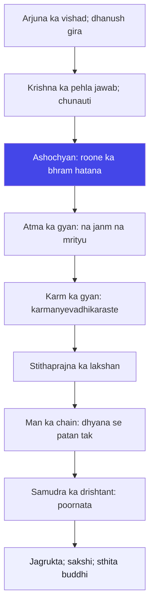

# अध्याय २: सांख्य योग — Jagrukta hi asli gyan hai

> **"Krishna tumhe karm ka gyan nahin de rahe — woh tumhe karm ke andar dekhne wali jagrukta de rahe hain. Gyan matlab kitaabein nahin; gyan matlab aankhein."**
> — **ओशो**

---

Adhyay 1 khatam hua — Arjuna ro chuka hai, usne dhanush giraya hai, aur usne kah diya hai: "Main nahin ladunga." Adhyay 2 ki shuruaat yahin se hoti hai — Krishna ka jawab. Aur Osho kehte hain: yeh jawab hi poora Gita hai. Baaki ke 16 adhyay isi jawab ka vistar hain. Isliye Osho ne kabhi kaha: "Gita ko samajhna hai toh adhyay 2 ko samajh lo. Adhyay 2 mein poora Gita hai — baaki sab vyakhya hai."

Krishna ka jawab kya hai? Pehle woh Arjuna ko jhunjhodaate hain — "ashochyan anvashochastvam" (2.11) — tum uske liye ro rahe ho jis roone ki cheez nahin hai. Phir woh atma ka gyan dete hain — atma na paida hoti hai, na marti hai (2.20). Phir woh karm ka gyan dete hain — "karmanyevadhikaraste" (2.47). Phir woh sthitaprajna ka poora lakshan batate hain (2.54-55), man ke andar ke gyaarh (mechanism) batate hain (2.62-63), aur samudra ka drishtant dete hain (2.70). Yahi SANKHYA yog hai.

Osho is adhyay ko kaise padhte hain? Unki sabse badi baat: Krishna ka uttar koi "doosra uttar" nahin hai — woh ek naya saaf-saaf raasta hai. Arjuna ke saamne do raaste the: ladna ya bhaagna. Krishna teesra raasta dete hain: jagrukta. Na bhaag, na jhootha bal — balki saari sthiti ko sakshi ban ke dekhna. Osho kehte hain: sthitaprajna ka matlab "gyan-prapta" nahin hai — sthitaprajna ka matlab hai "sthita jagrukta" — woh aadmi jiski jagrukta kisi bhi sthiti mein hile nahin. Na labh mein, na hani mein, na sukha mein, na dukh mein. Yahi to asli gyan hai.

## Learning Objectives

Is chapter ko complete karne ke baad aap:

1. **Samajh payenge** — Osho kyon kehte hain ki adhyay 2 mein poora Gita samaya hai aur baaki sab vyakhya hai.
2. **Pehchan payenge** — sthitaprajna ka asli arth: gyan-prapta nahin, sthita jagrukta — witnessing state.
3. **Jaan payenge** — Osho ka twist: Gita ka jawab na tyaag hai, na ichchha-dabana — balki man ke gyaarh (mechanics) ke prati jagrukta.
4. **Vishleshan kar payenge** — 2.62-63 ka poison-chain: dhyana se sanga, sanga se kama, kama se krodh, krodh se sammoh, sammoh se smriti-bhram, smriti-bhram se buddhi-naash, buddhi-naash se patan.
5. **Prayog kar payenge** — TypeScript mein **Sthitaprajna Checker** banana jo 10 gunon par aapki sthita-jagrukta ko score karta hai aur Osho-style commentary deta hai.

---

## Sankhya Yoga ka Parichay

### "Sankhya" ka matlab kya hai

"Sankhya" ka seedha arth hai "gunna" — lekin Osho kehte hain: yeh gunna koi hisaab-kitaab nahin hai; yeh woh gunna hai jo aadmi tab karta hai jab woh cheezein alag-alag dekhna shuru karta hai. Sankhya darshan — India ka sabse purana darshan — kehta hai: jagat mein do cheezein hain — prakriti (padarth, energy, man, sharir) aur purusha (chetan, sakshi). Jab tak in dono ko alag-alag nahin dekha jaata, tab tak aadmi dukhi hai. Krishna Arjuna ko wahi sikhate hain — lekin Osho kehte hain: Krishna ne Sankhya ko ek theory nahin banaya; unhonne usse ek kriya banaya. Sankhya yog = sthitaprajna ka abhyas.

Osho ki asli baat: Gita ke is adhyay ko padhne wale log atma ka gyan (2.20) aur karm ka gyan (2.47) alag-alag padhte hain — jaise yeh do alag topics hon. Osho kehte hain: yeh ek hi cheez hai. Atma ko jaanna aur karm ko dekhna — dono ek hi jagrukta ke do pehlu hain. Jab tum dekhte ho ki atma karm nahin karti — woh to karm ko dekh rahi hai — tab tum karm mein bhi thehar sakte ho. Yahi Sankhya yog ka kendra hai.

### Arjuna ka sawal aur Krishna ka jawab: do samjhe jaa sakne wale kshatra

Arjuna adhyay 2 ke aarambh mein (2.4-2.10) wahi purana sawal dohraata hai: "Mai kaise in Bhishma aur Drona par baan chalaun?" Aur Krishna ka jawab 2.11 se shuru hota hai. Par dhyan do — Krishna ka pehla shabd kya hai? "Ashochyan anvashochastvam" — tum ro rahe ho unke liye jo roone ke yogya nahin. Osho kehte hain: Krishna Arjuna ko pehli baat yeh nahin sikhate ki "kya karna hai" — woh pehli baat yeh bataate hain ki "tum kya dekh rahe ho woh galat hai". Yani — pehla kadam jagrukta hai, pehla kadam drishti ka sudhaar hai. Karm ki baat baad mein aayegi.

Aur isi mein Osho ka sabse bada yogdaan hai: Krishna ka uttar koi "command" nahin hai — "yeh karo, woh karo" nahin. Krishna ka uttar ek "awareness" hai: dekh, samajh, phir karm khud sahi hoga. Osho kehte hain: jo guru tumhe sirf hukm deta hai, woh guru nahin — woh ek saipahi banata hai. Krishna Arjuna ko saipahi nahin banate — woh use jagate hain. Yani: Krishna ka uttar tumhe kisi baat par "vishwas" karne ko nahin kehta — woh tumhe "dekhne" ko kehta hai. Vishwas kehta hai: "karo". Jagrukta kehti hai: "dekh kar kar". Yahi Gita ka asli marg hai.

### Traditional reading vs Osho's reading

| Aayaam | Traditional reading | Osho's reading |
|--------|---------------------|----------------|
| **Sankhya yog ka arth** | Atma ka gyan — shastra se, shiksha se | Jagrukta ka abhyas — dekhna, samajhna, theharna |
| **Stithaprajna** | Gyan prapta kiya hua yogi | Woh aadmi jiski jagrukta kisi sthiti mein hilti nahin |
| **Karmanyevadhikaraste** | Karm karo, phal ki chinta mat karo | Karm ko poora karo kyonki woh ek "prakriya" hai; phal ke baare mein jagruk raho, aasakti mat rakho |
| **Ichehchha ka dabana** | Parampara mein kaafi baar: vishayon se dur rehna | Dabana nahin — vishay ko jagrukta se dekhna; dabai ichchha phat jaati hai |
| **Atma ka gyan** | Moksha ka sadhan | Jeevan ko poora dekhne ka aaina — "main sharir nahin hoon" nahin, "main dekh sakta hoon" |
| **Krishna ka kram** | Pehle gyan, phir karm, phir bhakti | Pehle jagao, phir karm mein utaro, phir prem khud aa jayega |

### Is adhyay ka structure (72 shlok)

Sankhya Yog ke 72 shlokon ko Osho teen tarang mein baantte hain:

1. **Atma ka gyan (2.11-2.30)** — "Na janm hai na mrityu" — Krishna ka pehla vishad-uttar. Osho kehte hain: yeh gyan koi "faith" nahin hai jo maan lo; yeh ek drishti hai jo jagao — jab tak tum apne sharir se, apne vicharon se alag dekhne lagein. Is hisse mein 20 shlok hain aur yeh Gita ka sabse "darshanik" hissa hai — lekin Osho kehte hain: yahan darshan ki baat nahin hai, drishti ki baat hai. Arjuna ko atma ka "siddhant" nahin chahiye — use atma ka "anubhav" chahiye. Aur anubhav tab aata hai jab tum dekhna shuru karte ho.

2. **Karm ka gyan (2.31-2.53)** — "Karmanyevadhikaraste" — karm ka yog, buddhi-yog, aur phir "phala mein aasakti mat rakho". Osho kehte hain: yeh adhyay ka sabse kathin hissa hai, kyonki yahin parampara ka sabse bada galt-fahmi hai: "karm karo, phal mat chaho" ko "karm se door raho" samajh liya gaya. Asli arth: phal ki chinta karm ko bekarar kar deti hai — isliye phal ki chinta chhodo, aur karm ko poori jagrukta se karo. Yahi buddhi-yog hai — buddhi jo karm aur phal ke beech mein khadi rehti hai.

3. **Stithaprajna ka poora lakshan (2.54-2.72)** — Arjuna ka sawal: "stithaprajna kaisa dikhta hai?" — aur Krishna ka jawab: 19 shlokon mein poora man ka map. Osho kehte hain: yeh 19 shlok ek poora psychology hain — aaj ka psychology bhi isse aage nahin gaya hai. Is hisse mein 2.62-63 ka chain, 2.70 ka samudra-drishtant, aur 2.71-72 ka antim nishkarsh hai: "wahi shanti paata hai jisne sab kuch chhod diya." Osho kehte hain: yeh hissa koi "aadharsh" nahin deta — yeh "aaina" deta hai. Ise padho aur apne andar dekho: tum kitne sthit ho, kitne dhil ho?

## Key Shlokas

### Shloka 2.11

> श्रीभगवानुवाच |
> अशोच्यानन्वशोचस्त्वं प्रज्ञावादांश्च भाषसे |
> गतासूनगतासूंश्च नानुशोचन्ति पण्डिताः ॥

**Transliteration:** śhrī-bhagavān uvācha | aśhochyān-anvaśhochas-tvaṁ prajñā-vādāṁśhcha bhāṣhase | gatāsūn-agatāsūṁśhcha nānuśhochanti paṇḍitāḥ ||

**Arth (Hinglish):** Bhagwan ne kaha — tum un logon ke liye shok karte ho jinke liye shok karna uchit nahin, aur phir bhi pandit-vakya bolte ho. Jo gyaani hain, woh na jeevon ke liye shok karte hain na mrutyu ke liye.

**Osho ka drishtikon:** Osho kehte hain — yeh Krishna ka pehla jhunjhod hai. "Tum pandit-vakya bolte ho" — Arjuna ne abhi-ahin 14 shlokon mein sirf roya hai, aur Krishna kehte hain: tum shastra ki baatein karte ho! Osho ka point: sabse khatarnak aadmi woh hai jo rote hue bhi gyani hone ka natak kare. Arjuna ne "dharm" ke naam par ladne se mana kiya — aur Krishna kehte hain: yeh dharm ka naam le kar bhaag-na hai. Osho ka drishtikon: asli pandit woh nahin jo shlok ratte hain; asli pandit woh hai jo dekh leta hai ki kya mrityu ke paar hai. Arjuna ko "gyan" nahin chahiye — use dekhna chahiye. Aur Krishna ka pehla kaam hai Arjuna ke aankhon par baitha "dharm" ka natak hatana.

### Shloka 2.20

> न जायते म्रियते वा कदाचिन्नायं भूत्वा भविता वा न भूयः |
> अजो नित्यः शाश्वतोऽयं पुराणो न हन्यते हन्यमाने शरीरे ॥

**Transliteration:** na jāyate mriyate vā kadāchin nāyaṁ bhūtvā bhavitā vā na bhūyaḥ | ajo nityaḥ śhāśhvato 'yaṁ purāṇo na hanyate hanyamāne śharīre ||

**Arth (Hinglish):** Yeh (atma) kabhi paida nahin hota, kabhi marta nahin; ek baar ho jaane ke baad phir kabhi nahin hota — yeh ajanma, nitya, shashvat aur purana hai. Sharir marne par bhi yeh nahin mara jaata.

**Osho ka drishtikon:** Osho kehte hain — yeh shloka koi "maan lo" wala theory nahin hai; yeh ek anubhav ka darwaza hai. Jab tak tum atma ko "maante" ho, woh sirf ek vishwas hai. Jab tum atma ko "dekhte" ho — apne andar us cheez ko jo kabhi nahin badalti, jo bachpan mein bhi wahi thi, jo aaj bhi wahi hai — tab woh gyan hai. Osho ka asli point: Krishna Arjuna ko mrityu ka dar door karne ke liye atma ka gyan nahin de rahe — woh use dekhne ki takat de rahe hain. Aur Osho ka twis: tum sharir ko "tum" maan ke darte ho; jab tum dekhte ho ki sharir ke piche ek dekhne-wala hai, toh dar khud gir jata hai. Dar ka jawab gyan nahin — drishti hai. Aur isi drishti ko Osho "sakshi" kehte hain.

### Shloka 2.47

> कर्मण्येवाधिकारस्ते मा फलेषु कदाचन |
> मा कर्मफलहेतुर्भूर्मा ते सङ्गोऽस्त्वकर्मणि ॥

**Transliteration:** karmaṇy-evādhikāras-te mā phaleṣhu kadāchana | mā karma-phala-hetur-bhūr mā te saṅgo 'stvakarmaṇi ||

**Arth (Hinglish):** Tumhara adhikar sirf karm par hai, phal par kabhi nahin. Phal ki ichchha mein hetu mat bano, aur akarma (bina karma ke theharna) mein bhi aasakti mat rakho.

**Osho ka drishtikon:** Osho kehte hain — yeh Gita ka sabse behatarin shloka hai, aur sabse galt samjha gaya shloka bhi. Parampara ise kehti hai: "karm karo, phal mat chaho." Osho kehte hain: yeh to theek hai, lekin iska asli arth yah hai: tum "karm" ke andar itne poore ho jao ki phal ka koi prashna hi na rahe. Jaise ek prem karta hai toh phal ka sawal nahin uthta. Jaise ek maan apne bache ko palta hai toh usse "phala" nahin chahiye. Isi tarah karm ko prem karo — aur phir phal ka sawal khud gayab ho jayega. Osho ka twist: "phala mat chaho" ka matlab "karm se bhagna" nahin hai — karm se bhag ke log "akarm" mein baith gaye. Krishna ne pehle hi keh diya: "mā te saṅgo 'stvakarmaṇi" — akarm mein bhi aasakti mat rakho. Doosri aasakti — karm se bhaag-ne ki — utni hi khatarnak hai.

### Shloka 2.54-55 (Stithaprajna ka lakshan)

> अर्जुन उवाच |
> स्थितप्रज्ञस्य का भाषा समाधिस्थस्य केशव |
> स्थितधीः किं प्रभाषेत किमासीत व्रजेत किम् ॥
> श्रीभगवानुवाच |
> प्रजहाति यदा कामान्सर्वान्पार्थ मनोगतान् |
> आत्मन्येवात्मना तुष्टः स्थितप्रज्ञस्तदोच्यते ॥

**Transliteration:** arjuna uvācha | sthita-prajñasya kā bhāṣhā samādhi-sthasya keśhava | sthita-dhīḥ kiṁ prabhāṣheta kimāsīta vrajet kim || śhrī-bhagavān uvācha | prajahāti yadā kāmān sarvān pārtha mano-gatān | ātmany-evātmanā tuṣhṭaḥ sthita-prajñas-tadochyate ||

**Arth (Hinglish):** Arjuna ne poocha — Krishna, sthitaprajna (samadhi mein sthit) kaise baat karta hai, kaise baithta hai, kaise chalta hai? Bhagwan ne kaha — he Partha, jab woh man mein paida hone wale saare kaamon ko chhod deta hai, aur atma mein hi atma se santusht rehta hai, tab woh sthitaprajna kahlata hai.

**Osho ka drishtikon:** Osho kehte hain — yeh sawal hi adhyay ka sabse gahra point hai: "sthitaprajna kaise baat karta hai?" Matlab — gyan sirf theory nahin hai; gyan dikhta hai. Osho kehte hain: koi aadmi dekhne se pehchan jata hai — uske aankhon mein, uski awaaz mein, uski chal mein ek shanti hoti hai. Aur Krishna ka jawab: woh man mein uthne wale kaamon ko chhod deta hai. Osho ka twist yahan hai: "chhod deta hai" ka matlab "dabata hai" nahin. Kam ko dabana phat-ne ka rasta hai. Kam ko dekhna — uski utpatti ko dekhna — wohi "prajahaati" hai. Jaise koi diye ko dekh le, aur diya bina dabaye bujh jaye. Isi liye Osho kehte hain: sthitaprajna koi "vijeta" nahin hai jisne kamon ko jita; woh woh hai jisne kamon ko dekh kar unhe swabhaavik roop se jharna diya.

### Shloka 2.62-63 (Man ka poison-chain)

> ध्यायतो विषयान्पुंसः सङ्गस्तेषूपजायते |
> सङ्गात्सङ्गजायते कामः कामात्क्रोधोऽभिजायते ॥
> क्रोधाद्भवति सम्मोहः सम्मोहात्स्मृतिविभ्रमः |
> स्मृतिभ्रंशाद् बुद्धिनाशो बुद्धिनाशात्प्रणश्यति ॥

**Transliteration:** dhyāyato viṣhayān puṁsaḥ saṅgas-teṣhūpajāyate | saṅgāt saṅgajāyate kāmaḥ kāmāt krodho 'bhijāyate || krodhād bhavati sammohaḥ sammohāt smṛiti-vibhramaḥ | smṛiti-bhraṁśhād buddhi-nāśho buddhi-nāśhāt praṇaśhyati ||

**Arth (Hinglish):** Jo aadmi vishayon ke baare mein sochta rehta hai, uske andar unse sanga (lagav) utpann hota hai. Sanga se kama (ichchha) paida hota hai; kama se krodh. Krodh se sammoh (bhram), sammoh se smriti ka bhram, smriti ke bhram se buddhi ka naash, aur buddhi ke naash se aadmi ka poora patan.

**Osho ka drishtikon:** Osho kehte hain — yeh do shlok Gita ka sabse scientific hissa hain. Yeh ek chain-reaction ka poora formula hai: dhyana → sanga → kama → krodh → sammoh → smriti-bhram → buddhi-naash → patan. Osho kehte hain: is chain mein sabse pehla link "dhyana" hai — yaani sochna, ratna, vishayon ko man mein ghoomana. Aur yahi sabse khatarnak bhi hai, kyonki yahi sabse sookshma hai. Osho ka point: Krishna buddhi ke naash ko nahin rokte — woh "dhyana" ko rokte hain. Aur dhyana ko rokne ka tarika vishayon se bhagna nahin hai — vishayon ko jagrukta se dekhna hai. Sochna aur dekhna alag cheezein hain. Sochna mein tum vishay mein kho jaate ho; dekhna mein tum vishay ke bahar khade rehte ho. Yahi Sankhya yog hai.

### Shloka 2.70

> आपूर्यमाणमचलप्रतिष्ठं समुद्रमापः प्रविशन्ति यद्वत् |
> तद्वत्कामा यं प्रविशन्ति सर्वे स शान्तिमाप्नोति न कामकामी ॥

**Transliteration:** āpūryamāṇam-achala-pratiṣhṭhaṁ samudram-āpaḥ praviśhanti yadvat | tadvat-kāmā yaṁ praviśhanti sarve sa śhāntim-āpnoti na kāma-kāmī ||

**Arth (Hinglish):** Jaise bhari hui hui nahin, sthir samudra mein saari nadiyan pravesh karti hain aur woh na hilti hai — waise hi jiske andar saare kama (vishay) pravesh karte hain, wohi shanti ko paata hai; kama-kami (ichchha-wala) nahin.

**Osho ka drishtikon:** Osho kehte hain — Krishna ka sabse sundar drishtant: samudra. Osho ka twist: samudra nadiyon ko rokta nahin — samudra unhe apne mein le leta hai. Isi tarah sthitaprajna vishayon ko rokta nahin; woh unhe apne andar le leta hai — bina hile. Osho kehte hain: vishay duniya se bhagne wala koi sant nahin hai — woh to andar hi andar bhaag raha hai. Asli sant woh hai jo duniya ke saath rehte hue bhi sthir hai. Isi liye Osho ne is shloka ko "Gita ka sarvottam drishtant" kaha. Aur note karo: Krishna ne keh diya — "na kamakami" — woh shanti paata hai jo kama ko peeta hai, woh nahin jo kama ke piche bhaagta hai. Samudra ka arth: poornata. Jab aadmi apne andar itna poora ho jata hai ki koi vishay use hila nahin sakta — tab shanti. Yahi sthitaprajna hai.

---

## Jagrukta — Osho ki gahrai mein

### Gyan vs Vishwas: Osho ka sabse bada bhed

Osho ka sabse bada prashna: tum "maante" ho ya "dekhate" ho? Vishwas kehta hai — "maine suna, isliye maanta hoon." Gyan kehta hai — "maine dekha, isliye jaanta hoon." Osho kehte hain: Gita ka gyan "maanne" wala gyan nahin hai — "dekhne" wala gyan hai. Krishna Arjuna se "vishwas karo" nahin kehte — woh kehte hain "dekh". Aur yahi Sankhya yog hai: cheezein alag-alag dekhna — sharir alag, atma alag; karm alag, kartta alag; aasakti alag, jagrukta alag.

Osho is bhed ko ek example se samjhaate hain: ek admi ko andhere mein saap dikhta hai. Woh darta hai, bhaagta hai, chillata hai. Doosra admi aa kar torch jalata hai — aur dekh leta hai ki woh saap nahin, rassi hai. Ab kya hua? Andha-wala dar kahan gaya? Dar wahan gaya jahan uska bhram tha. Rassi ko dekhne ke baad dar khud apne aap gayab. Osho kehte hain: yahi Gita ka marg hai — bhram ko hatao, dar khud gayab. Bhram kya hai? "Main sharir hoon" — yeh bhram. "Main dhanush hoon" — yeh bhram. "Mera phal mera hai" — yeh bhram. Jagrukta rassi ko dikhati hai — aur saap ka dar chala jata hai. Yahi Sankhya yog hai: cheezein waisi dekhna jaisi hain.

### Vishwas vs Gyan: ek comparison

| Pehlu | Vishwas (Faith) | Gyan (Awareness) |
|-------|------------------|-------------------|
| **Aadhaar** | Doosron ka kathana — guru, shastra, parampara | Apna anubhav — dekhna, samajhna |
| **Bhed** | Bina dekhe maan lena | Dekh kar jaanna |
| **Dar** | Andha vishwas dar ko dabata hai | Gyan dar ko khud hatata hai (rassi ka drishtant) |
| **Krishna ka marg** | "Maano" — yahi parampara mein ho gaya | "Dekho" — yahi Sankhya yog hai |
| **Patan ka khatra** | Maanna toot sakta hai — vishwas bhi khatam | Gyan kabhi nahin toot sakta — ek baar dekh liya toh dekh liya |
| **Osho ka bhed** | Vishwas doosre ka hai | Gyan tumhara apna hai |

### Krishn ka strategist chehra

Osho ki Gita-drishti mein ek bahut hi vivaadaaspad baat hai: Krishna sirf bhagwan nahin hain — woh ek strategist bhi hain. Osho kehte hain: Krishna ko Arjuna se sirf gyan nahin chahiye — unhe yudh bhi jeetna hai. Isliye woh Arjuna ko pehle jhunjhodaate hain (2.11), phir atma ka gyan dete hain (2.20), phir karm ka gyan (2.47) — aur har kadam par yudh ki taraf le jaate hain. Osho ise galat nahin maante — woh ise "ek maaster ka khel" maante hain: pehle aadmi ko jagao, phir use kaam mein lagao.

Lekin Osho ka ek aur point hai: Krishna ka strategist hona hi Gita ko "living document" banata hai. Agar Krishna sirf bhagwan hote, toh woh Arjuna ko pehle hi "yudh karo" keh dete. Lekin woh nahin kehte — woh samjhaate hain, jhunjhodaate hain, aur dheere dheere Arjuna ke andar ka faisla khud jagate hain. Isi liye Osho kehte hain: Gita koi aadesh nahin hai — Gita ek sambandh hai. Krishna aur Arjuna ke beech ka sambandh — guru aur shishya nahin, saarthi aur yoddha nahin — do jagruk aatmaon ka sambandh, jismein ek doosre ko dekhna sikhata hai.

### Stithaprajna: koi ideal nahin, ek state

Parampara mein sthitaprajna ko ek "ideal" ke roop mein padha jata hai — ek aadarsh jise paana mushkil hai, aur isliye use "doosre janam" ke liye chhod diya jata hai. Osho ise turant tode dete hain: sthitaprajna koi doosre janm ka phal nahin hai — woh ek state hai jo isi janm mein, isi kshan mein ho sakti hai. Osho kehte hain: sthitaprajna ka matlab "siddha" nahin hai — ka matlab hai "jagruk". Aur jagrukta koi sadhana nahin hai — jagrukta ek swabhaav hai jo kabhi bhi utth sakta hai.

Osho ka doosra twist: sthitaprajna ka matlab bhavnayen nahin hona nahin hai. Woh aadmi jiske andar krodh nahin aata — woh murda hai ya dabaya hua. Stithaprajna woh hai jiske andar krodh aata hai — aur woh use turant dekh leta hai. Krodh aana swabhaavik hai; krodh ko "main hoon" ke roop mein pehchan lena hi patan hai. Osho kehte hain: bhed yeh nahin hai ki tumhare andar kya uthta hai — bhed yeh hai ki tum uthti hui cheez ko dekh rahe ho ya usme kho rahe ho. Yani sthitaprajna "bhavna-shunya" nahin hai — woh "bhavna-sakshi" hai.

### Man ke gyaarh (mechanics): 2.62-63 ka chain — aur ise kaise toda jaye

2.62-63 ka chain Osho ke liye ek poora vigyan hai. Ek aur table se ise samjho:

| Link | Arth | Osho ka pratikaar |
|------|------|-------------------|
| **Dhyana** | Vishay ko man mein ratna, sochna | Sochna ko dekhna mein badlo — vishay ko andar mat bulao, bahar dekho |
| **Sanga** | Lagav paida hona | Lagav ko "mera" mat kaho — "yeh aaya" kaho, "yeh gaya" kaho |
| **Kama** | Ichchha paida hona | Ichchha ko na dabaao na bhogo — use apne andar se guzarne do |
| **Krodh** | Ichchha ke tootne par krodh | Krodh ko dekh lo — woh ek lehar hai, woh guzar jayegi |
| **Sammoh** | Krodh se bhram — kaun sahi kaun galat | Bhram mein mat jao — stithi ko naya aankh se dekho |
| **Smriti-bhram** | Yaadon ka jhooth — purana gussa phir aata hai | Yaadon ko bhoot samjho — unmein jeevan nahin hai |
| **Buddhi-naash** | Samajh ka patan — faisle galat hone lagte hain | Wapas jagrukta par lao — sansaaran ki madad se |
| **Patan** | Aadmi ka poora girav | Girav se pehle chain ko pehle hi link par todo |

Osho kehte hain: is chain ko aakhri link se todna mushkil hai — krodh aa chuka, buddhi ja chuki. Chain ko sabse pehle link par toda jata hai — dhyana par. Aur dhyana ka matlab vishayon ko bhoolna nahin — unhe dekhna. Yeh "doosra marg" hai jo na bhoga na dabaya. Osho kehte hain: isi liye Gita ko "sankhya" kaha gaya — kyonki yeh cheezein ginta hai, alag karta hai. Aur alag dekhna hi asli gyan hai.

### Sakshi: Osho ka sabse bada shabd

Osho ki poori shiksha — chaahe woh Tantra ho, Zen ho, Sufi ho, ya Gita ho — ek hi shabd par khadi hai: **sakshi**. Aur Sankhya Yog hi woh adhyay hai jahan sakshi ka poora varnan hai. Osho kehte hain: "sthitaprajna" ka matlab hai "sthita sakshi" — woh aaina jo kabhi dhabba nahin hota, chahe koi bhi cheez uske saamne aaye. Aaina ganda nahin hota — aaine ke saamne ganda-pakka aata hai, jaata hai. Aaina usse na lipakta hai na bhagne lagta hai.

Yahi to 2.70 ka samudra hai — aur yahi 2.55 ka atma-tushti. Osho kehte hain: Krishna ne poore adhyay mein jo bhi kaha — atma ka gyan, karm ka gyan, sthitaprajna ka lakshan — woh sab ek hi cheez ke alag naam hain: sakshi. Aur isi liye Osho Gita ko "India ka sabse bada psychology text" kehte hain: kyonki yahan man ka poora nap-tol hai — aur iska ilaaj bhi: sakshi hona. Aaj ke psychology mein ise "meta-cognition" kehte hain — apne vicharon ko dekhne wali drishti. Krishna ne use 2400 saal pehle kaha: "sakshi bano, sthit raho."

### Stithaprajna ke 10 aaine: 2.54-2.72 ka kram

| Shlok | Stithaprajna ka aaina | Aaj ke jeevan mein |
|-------|------------------------|---------------------|
| 2.55 | Kamaon ko chhod diya; atma mein tushti | Jab kuch bhi pakadne ki jaldi nahin hai |
| 2.56 | Dukh mein udvega nahin; sukh mein trishna nahin | Failure aur success par ek si aankhein |
| 2.57 | Nirpekshta — na priya na apriya | Logon ki taareef aur aalochana par samta |
| 2.58 | Kachhue jaisa — indriyon ko andar samet lena | Phone, TV, khane se an-aasakti |
| 2.59 | Vishay-chinta bhi shanti se chhod di | Kisi cheez ko "chhodna" bhi na sochna |
| 2.60 | Indriyaan khinchti hain; phir bhi sthir | Jab mann machalta hai, tab bhi na hila |
| 2.61 | Saari indriyon ko vash mein; samadhi mein sthit | Sansaar mein rehte hue bhi andar shanti |
| 2.64 | Vishay bhogte hue bhi raag-dwesha rahit | Khana, kama — bina "chahiye" ke |
| 2.65 | Sarva-dukh-khaya prasad | Jab koi baat aapko tod nahin sakti |
| 2.70 | Samudra jaisi sthirta; na kamakami | Jab bade se bada labh bhi na hila paye |

Osho kehte hain: yeh table koi "checklist" nahin hai — yeh ek aaina hai. Checklist mein tum check karte ho; aaine mein tum dekhate ho. Aur dekhna hi sadhana hai. Isi liye yeh adhyay "Sankhya" hai: yeh ginta nahin, dikhata hai.

## Jagrukta ka marg: ek diagram



## TypeScript Implementation — Sthitaprajna Checker

```typescript
/*
 * Sthitaprajna Checker
 * Sankhya Yog ke aadhar par: sthitaprajna ke 10 gunon par
 * aapki jagrukta ko score karta hai.
 * Osho ka drishtikon: sthitaprajna koi ideal nahin; ek state hai.
 */

interface SthitaprajnaTrait {
  key: string;
  label: string;
  shlokaRef: string;
  question: string;
}

interface TraitScore {
  key: string;
  label: string;
  score: number; // 1-10
  level: 'Patan' | 'Sangharsh' | 'Jagruk' | 'Sthitaprajna';
  oshoComment: string;
}

interface SthitaprajnaReport {
  totalScore: number; // 0-100
  avgLevel: string;
  topTrait: string;
  weakestTrait: string;
  oshoMessage: string;
  traitScores: TraitScore[];
}

class SthitaprajnaChecker {
  private traits: SthitaprajnaTrait[] = [
    { key: 'noAnxietyLoss', label: 'Hani mein chinta nahin', shlokaRef: '2.56', question: 'Kisi cheez ke tootne par kya main usse 5 minute se zyada sochta hoon?' },
    { key: 'noCravingGain', label: 'Labh mein lobh nahin', shlokaRef: '2.57', question: 'Koi achhi cheez milne par kya main usse pakadne ke liye bekaraar ho jaata hoon?' },
    { key: 'equanimity', label: 'Sukha-dukh mein samta', shlokaRef: '2.57', question: 'Kaamyaabi aur nakami par kya meri aankhein wahi rehti hain?' },
    { key: 'sensesUnderWitness', label: 'Indriyon ka sakshi', shlokaRef: '2.58', question: 'Kachumba khana, phone, TV — kya main bhogta hoon ya dekh raha hoon?' },
    { key: 'noAccumulation', label: 'Sangrah ka tyag', shlokaRef: '2.59', question: 'Kya mere paas woh sab kuch hai jinki mujhe zaroorat nahin?' },
    { key: 'desireSeenNotHeld', label: 'Ichchha dekhi, pakdi nahin', shlokaRef: '2.62', question: 'Jab koi ichchha uthti hai, kya main use dekh leta hoon ya uske piche bhaagta hoon?' },
    { key: 'angerObserved', label: 'Krodh dekha gaya', shlokaRef: '2.63', question: 'Gussa aane par kya main usse pehle hi dekh leta hoon ya usme kho jaata hoon?' },
    { key: 'noSankalpaClutter', label: 'Man mein kam-kam nahin', shlokaRef: '2.66', question: 'Mera man kitne kaamon se bhara hai jo mujhe nahin karne hain?' },
    { key: 'oceanLikeStillness', label: 'Samudra jaisi sthirta', shlokaRef: '2.70', question: 'Bahut saari cheezein ek saath aa rahi hon, tab bhi kya main sthir hoon?' },
    { key: 'selfContentment', label: 'Atma mein tushti', shlokaRef: '2.55', question: 'Kya main akele, kuch bhi kiye bina, khush reh sakta hoon?' }
  ];

  private levelFor(score: number): 'Patan' | 'Sangharsh' | 'Jagruk' | 'Sthitaprajna' {
    if (score <= 3) return 'Patan';
    if (score <= 5) return 'Sangharsh';
    if (score <= 8) return 'Jagruk';
    return 'Sthitaprajna';
  }

  private comments: Record<string, string> = {
    noAnxietyLoss: 'Hani par chinta swabhaavik hai; par usse pakadna patan hai. Chinta aaye; dekho; jao.',
    noCravingGain: 'Labh ka lobh jagrukta ko bhatkata hai. Mila hai; swikaar karo. Pakde jaana mat.',
    equanimity: 'Sukha aur dukh do leharein hain; wahi sakshi hai jo dono ko dekhta hai.',
    sensesUnderWitness: 'Indriyaan bhogti hain; sakshi dekhta hai. Bhog aur drishti ka antar hi gyan hai.',
    noAccumulation: 'Sangrah bheetar ka khali pan bharta hai. Jab andar poora ho, sangrah khud gir jaata hai.',
    desireSeenNotHeld: 'Ichchha ko dabana phat-ne ka rasta hai; use dekhna jharne ka rasta hai.',
    angerObserved: 'Krodh ke pehle ek chhota sa gap hota hai. Woh gap hi jagrukta ka darwaza hai.',
    noSankalpaClutter: 'Man jitne anavaashyak kaamon se bhara, utna hi karm se door. Khali man hi poora karm karta hai.',
    oceanLikeStillness: 'Nadiyan aati hain; samudra sthir. Tumhari sthirta tumhe shanti degi, cheezein nahin.',
    selfContentment: 'Akele reh kar khush rehna sabse bada test hai. Wohi atma-tushti hai; wohi sthitaprajna hai.'
  };

  score(traitScores: Record<string, number>): SthitaprajnaReport {
    const result: TraitScore[] = [];
    for (const trait of this.traits) {
      const raw = traitScores[trait.key] ?? 5;
      const score = Math.max(1, Math.min(10, raw));
      result.push({
        key: trait.key,
        label: trait.label,
        score,
        level: this.levelFor(score),
        oshoComment: this.comments[trait.key]
      });
    }

    const totalScore = Math.round(result.reduce((sum, t) => sum + t.score, 0) * 10 / this.traits.length);
    const sorted = [...result].sort((a, b) => b.score - a.score);
    const weakest = sorted[sorted.length - 1];

    let oshoMessage = totalScore >= 75
      ? 'Tumhari jagrukta gahri hai; ab ise aur thehro. Sthitaprajna ek state hai; isi mein thehre raho.'
      : 'Koi baat nahin; sthitaprajna koi ideal nahin. Ek ek trait dekho; ek ek chain ka link toda jaa sakta hai. Sabse pehle: weakest link par jagrukta lao.';

    return {
      totalScore,
      avgLevel: this.levelFor(Math.round(totalScore / 10)),
      topTrait: sorted[0].label,
      weakestTrait: weakest.label,
      oshoMessage,
      traitScores: result
    };
  }
}

function runDemo(): void {
  const checker = new SthitaprajnaChecker();
  const myScores: Record<string, number> = {
    noAnxietyLoss: 3,
    noCravingGain: 4,
    equanimity: 6,
    sensesUnderWitness: 5,
    noAccumulation: 2,
    desireSeenNotHeld: 7,
    angerObserved: 8,
    noSankalpaClutter: 5,
    oceanLikeStillness: 6,
    selfContentment: 9
  };

  const report = checker.score(myScores);
  console.log('=== Sthitaprajna Checker ===');
  console.log(`Total score: ${report.totalScore}/100`);
  console.log(`Average level: ${report.avgLevel}`);
  console.log(`Top trait: ${report.topTrait}`);
  console.log(`Weakest trait: ${report.weakestTrait}`);
  console.log('\n--- Har trait ka score ---');
  for (const t of report.traitScores) {
    console.log(`${t.label} | ${t.score}/10 | ${t.level}`);
    console.log(`   Osho: ${t.oshoComment}`);
  }
  console.log(`\n--- Osho ka sandesh ---`);
  console.log(report.oshoMessage);
  console.log('\nSadhana: weakest trait ko hafte mein 3 baar dekho; jagrukta se theek hoga.');
}

runDemo();
```

## Summary

| Bindu | Saar |
|-------|------|
| **Adhyay 2 = poora Gita** | Osho: adhyay 2 mein hi saara Gita hai; baaki vyakhya hai |
| **Sankhya ka arth** | Cheezein alag dekhna — sharir aur atma, karm aur kartta, aasakti aur jagrukta |
| **Gyan vs Vishwas** | Krishna "maano" nahin kehte — "dekho" kehte hain; gyan dekhna hai |
| **Stithaprajna** | Ideal nahin — ek state; bhavna-shunya nahin — bhavna-sakshi |
| **Man ka chain** | 2.62-63: dhyana se patan tak — chain ko pehle link par toda jaye |

## Contradictions

- **Osho kehte hain 2.47 ka arth "karm se door rehna" nahin hai:** Bahut si paramparayein "karm karo, phal mat chaho" ko ek tarah ke vairagya mein badal deti hain — karm se bhag kar log akarm mein baith gaye. Osho kehte hain: Krishna ne pehle hi keh diya — "ma te sangostvakarmani" — akarm mein bhi aasakti mat rakho. Asli arth: karm mein poore ho jao, phal ka prashna hi na rahe.
- **Osho atma ke gyan ko "faith" nahin maante:** Traditional reading 2.20 ko ek vishwas-sutra maanti hai jo maan lena chahiye. Osho kehte hain: bina dekhe maanna sirf andha vishwas hai. Atma ko maano nahin — atma ko dekho (sakshi ka abhyas). Yahi Sankhya yog hai.
- **Osho "ichchha-dabana" ko galat kehte hain:** Parampara mein kaafi baar sikhaya gaya ki vishayon se dur rehna hi sadhana hai. Osho kehte hain: dabaai ichchha andar se khaati hai. 2.62-63 ka rasta bhagna nahin — dekhna hai. Samudra nadiyon ko rokta nahin — unhe le leta hai.
- **Stithaprajna ko "aadharsh" banana:** Traditional approach sthitaprajna ko ek aadharsh maanti hai jo bahut mushkil se milta hai. Osho kehte hain: yeh state isi janm mein, isi kshan mein ho sakti hai — kyonki jagrukta koi badi cheez nahin, woh tumhare andar pehle se hai.
- **Krishna ka "strategist" chehra:** Parampara Krishna ko keval bhagwan maanti hai. Osho kehte hain: Krishna ek strategist bhi hain — woh Arjuna ko pehle yudh ke liye taiyar karte hain, phir gyan dete hain. Par yahi unki kala hai: pehle jagao, phir samjhao.

## Open Questions

- Agar Krishna ka uttar sirf "dekho" hai, toh phir 18 adhyay kyon? Kya "dekho" itna kathin hai ki 700 shlok lag gaye?
- 2.62-63 ka chain kaun si taraf se toota jaaye — kya dhyana (sochna) ko rokna sach mein sambhav hai, ya sochna rokne ka sochna hi doosri aasakti ban jaati hai?
- Osho kehte hain sthitaprajna bhavna-sakshi hai, bhavna-shunya nahin. Par Gita ke 2.58 mein "kurvan api na lipyate" — kya iska matlab kabhi na lipne wala aadmi duniya mein kaise karm karta hai?
- Samudra ka drishtant — kya samudra ko nadiyon ka koi bhed-bhaav hota hai? Yaani kya sthitaprajna ke liye kisi cheez se prem ka rishta hi nahin rehta?

## Practical Takeaways

| Situation | Gita shloka | Osho's lens | Action |
|-----------|-------------|-------------|--------|
| Failure ke baad chinta | 2.56 (duhkheshvanudvigna) | Chinta ko dekho; woh lehar hai, guzar jayegi | 3 saansein; chinta ko naam do — "yeh chinta hai" |
| Success ke baad lobh | 2.57 (labhalabha) | Labh ko pakdo mat; swikaar karo, aage badho | Jeet ke baad 1 ghante tak faisla mat lo |
| Phone/social media ka kheenchav | 2.62 (dhyayato vishayan) | Bhog aur drishti ka antar | Phone uthane se pehle 3 saansein; phir dekho kaise utha rahe ho |
| Gussa aa raha hai | 2.63 (krodhat sammoha) | Krodh se pehle gap hota hai; wohi darwaza | Gussa aate hi apna haath dekho ya apni saans dekho |
| Man bhara hua, kuch nahin kar pa rahe | 2.66 (nashti buddhir ayuktasya) | Khali man hi poora karm karta hai | 5 minute ki "do nothing" practice — sirf baitho |
| Akele rehna mushkil lagta hai | 2.55 (atmanyevatmana tustah) | Atma-tushti hi asli test hai | Roz 10 minute bina phone ke, bina kaam ke, bas baitho |

## Chapter Quiz

### Question 1
Osho ke anusar Gita ka kaunsa adhyay poora Gita hai?

a) Adhyay 1
b) Adhyay 2
c) Adhyay 3
d) Adhyay 12

<details><summary>Answer</summary>b) Adhyay 2 — Osho: "Adhyay 2 mein poora Gita hai; baaki sab vyakhya hai"</details>

### Question 2
"Sankhya" ka asli matlab kya hai, Osho ke anusar?

a) Gunna aur hisaab-kitaab
b) Cheezein alag-alag dekhna — prakriti aur purusha
c) Ek devi ka naam
d) Sankhya mein khelna

<details><summary>Answer</summary>b) Cheezein alag dekhna — jab tum prakriti aur purusha, karm aur kartta alag dekhte ho, wohi sankhya hai</details>

### Question 3
2.62-63 ke chain mein krodh ke baad kya aata hai?

a) Buddhi naash
b) Smriti bhram
c) Sammoh (bhram)
d) Patan

<details><summary>Answer</summary>c) Sammoh — chain: dhyana → sanga → kama → krodh → sammoh → smriti-bhram → buddhi-naash → patan</details>

### Question 4
Osho ke anusar sthitaprajna kaun hai?

a) Jiske andar koi bhavna nahin uthti
b) Jo bhavnaon ko daba deta hai
c) Jo bhavna ko uthti hui dekh leta hai — bhavna-sakshi
d) Jo sansar chhod kar van mein chala gaya

<details><summary>Answer</summary>c) Bhavna-sakshi — bhavna aati hai, par woh usme kho nahin jaata; use dekhta hai</details>

### Question 5
"Karmanyevadhikaraste" (2.47) ka Osho kya arth batate hain?

a) Karm mat karo
b) Karm se door reh ke bhakti karo
c) Karm mein poore ho jao; phal ka prashna hi na rahe
d) Sirf phal ki chinta karo

<details><summary>Answer</summary>c) Karm mein poore ho jao — jaise prem mein phal ka sawal nahin uthta, waise karm ko prem karo</details>

### Question 6
2.20 mein atma ke baare mein kya kaha gaya hai?

a) Atma paida hoti hai aur marti hai
b) Atma na paida hoti hai na marti hai
c) Atma sirf sharir ke saath hoti hai
d) Atma ko sirf shastra se jaana ja sakta hai

<details><summary>Answer</summary>b) Na jayate mriyate va — atma ajanma, nitya aur shashvat hai; sharir marne par bhi nahin mara jaata</details>

### Question 7
Osho ke anusar "dhyana" (sochna) ko kaise roka jaaye?

a) Vishayon se dur reh kar
b) Vishayon ko jagrukta se dekh kar
c) Sirf mantra jap kar
d) Sochna band karne ka sankalp kar ke

<details><summary>Answer</summary>b) Vishay ko dekhna, sochna nahin — sochna mein tum vishay mein kho jaate ho; dekhna mein tum bahar khade rehte ho</details>

### Question 8
2.70 mein Krishna kaunsa drishtant dete hain?

a) Kamal ka phool
b) Samudra — jismein nadiyan pravesh karti hain aur woh sthir rehta hai
c) Baadal
d) Agni

<details><summary>Answer</summary>b) Samudra — nadiyan (kama) aati hain, samudra sthir; wohi shanti paata hai jo kama ko peeta hai</details>

### Question 9
Gita ka adhyay 2 mein kitne shlok hain?

a) 47
b) 72
c) 43
d) 18

<details><summary>Answer</summary>b) 72 shlok</details>

### Question 10
Osho ke anusar Krishna ka "ashochyan" (2.11) ka asli maqsad kya tha?

a) Arjuna ko atma ka gyan dena
b) Arjuna ko jhunjhod kar jagana — pehle drishti ka sudhaar
c) Arjuna ko duniya se door karna
d) Sanjaya ko khatam karna

<details><summary>Answer</summary>b) Jhunjhod kar jagana — pehla kadam jagrukta hai, drishti ka sudhaar; karm ki baat baad mein</details>

## Exercises

1. **"Dekho ya maano" journal (5 din):** Har roz ek cheez lo jise tum "maante" ho (dharam, raajneeti, logon ke baare mein dhaarna) aur ek din usse "dekhne" ki koshish karo — bina judgement ke. Likho: kya farak pada?
2. **Chain ka pehla link (2.62-63):** Roz ek baar jab tum kisi vishay ke baare mein sochne lag jaao (phone, khana, koi rishta) — ruk kar poochho: "Main soch raha hoon ya dekh raha hoon?" Isse 7 din karo.
3. **Samudra practice:** Ek glass paani lo, usme namak dhalo aur dekho kaise ghul jata hai — koi hulchul nahin. Phir apni ichchhaon ko namak samajho jo samudra mein ghar gayi hain. 5 minute roz.
4. **Stithaprajna Checker:** Har hafte apne 10 traits ko 1-10 score karo. Weakest trait chuno aur us par agla hafta sadhana karo — phir report ka compare karo.
5. **"Atma-tushti" test:** Roz 10 minute bilkul akele, bina phone, bina kaam ke baitho. Yeh 2.55 ka test hai. Pehle din mushkil lagega — 30 din mein dekho kya badalta hai.
6. **Krodh ka gap:** Jab kabhi gussa aaye, 2.63 ka chain yaad karo: krodh → sammoh → smriti-bhram → buddhi-naash. Aur 3 saansein lo — chain ko pehle link par roko.

## Further Reading

- **Osho — "Gita Darshan" (Volume 1, 2):** Adhyay 2 par Osho ke 12 pravaachan — Sankhya Yog ka sabse gahra vishleshan, Bombay (1973-76).
- **Osho — "The Heart Sutra" aur "The Diamond Sutra":** Buddhist drishti se "dekhna vs sochna" — Osho ki jagrukta-drishti ko aur gehrayi mein.
- **Swami Vivekananda — "Karma Yoga":** 2.47 ka doosra (karm-parak) vachan — Osho ke virodhi ya sahayogi dono roop mein.
- **Shrimad Bhagavad Gita (Gita Press, Gorakhpur):** Shlokon ka mool roop aur traditional vyakhya — Osho ke twist ko samajhne ke liye zaroori sandarbh.
- **Eckhart Tolle — "The Power of Now":** Stithaprajna ka aadhunik roop — wohi "witnessing" jise Osho sakshi kehte hain.