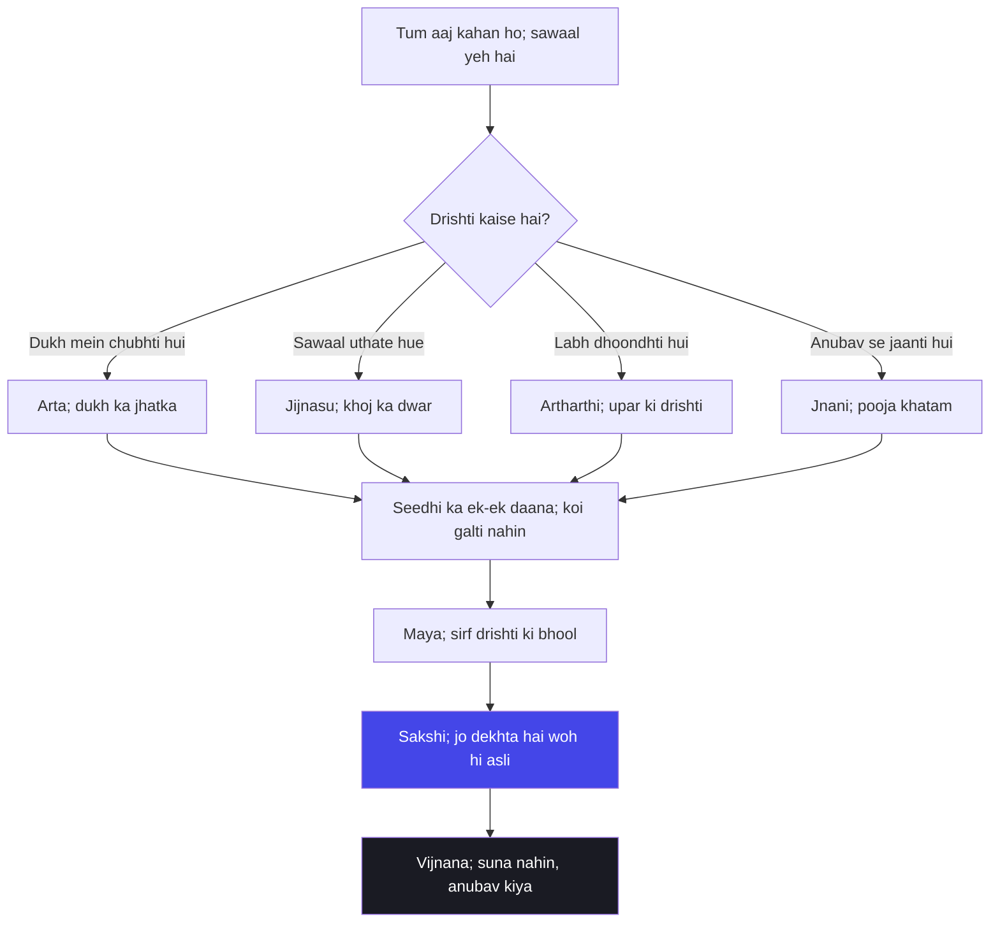

# अध्याय ७: ज्ञान विज्ञान योग — Maya koi illusion nahin, bhool hai

> **"Maya koi jadoo nahin hai, maya ek bhool hai — apne hi hone ki bhool. Tum us aadmi ki tarah ho jo suraj ko dekhte hue keh raha hai ki andhera hai. Duniya bahar utni hi sach hai jitna tumhara andar ka aina — magar jis din tum apne aap ko aine mein dekhte ho, maya paani ki tarah peeche reh jaati hai."**
> — **ओशो**

---

Yeh adhyaya Mahabharat ke us din aata hai jab Arjuna ab tak gir chuka hai, uth chuka hai, aur ab woh aakhri rukawat par khada hai — sab kuch jaanna chahne ki rukawat. Pehle chaar adhyayon mein Krishna ne karm ki baat ki, gyan ki baat ki, tyaag ki baat ki. Paanchween aur chhathi adhyay mein dhyan aur yog ka raasta dikhaya. Ab saatwaan adhyaya mein sawaal palat jaata hai: Krishna Arjuna se kahta hai — "Arjuna, ab tak maine tumhe karm ka vigyan bataya. Ab jaano yeh — main kaun hoon, yeh duniya kya hai, aur yeh maya kya cheez hai jo tumhe ulajhaaye rakhti hai."

Kurukshetra ka maidan ab bhi wahin hai. Do armies wahin khadi hain. Magar Krishna ki drishti is maidan se bahar jaati hai — woh Arjuna ko dikhata hai ki jo maya ke paarde ke peeche chhupi hai, woh uske saamne bhi hai. Aur yahaan Osho ka swar sabse gehra aata hai. Unhone Gita Darshan ke in adhyayon mein maya ko sabse bara rog bataya — magar us tarah nahin jaise pandit log bolte hain. Pandit kahte hain maya ek bhavya dhaar hai, ek cosmic film hai jisme hum sab naach rahe hain. Osho kahte hain — nahin, maya koi cosmic film nahin hai. Maya tumhari apni aankhon ki chhod hai. Filmein sirf tab tak chal rahi hain jab tak tum jaanta hi nahin ki tum dekh rahe ho.

Osho ne Gita ko hamesha Arjuna ki katha ke roop mein padha — ek sawaal uthane wale ki katha. Arjuna is adhyaya mein poochhta hai ki "bhakti karke tumhe kaun jaanta hai" — aur Krishna uska jawab deta hai. Magar Osho kahti hain ki is adhyaya ka asli paatra Arjuna nahin hai — asli paatra tum ho. Is adhyaya ka asli sawaal yeh hai: tum apne jeevan ko kaisi drishti se dekh rahe ho? Tum us drishti se dekh rahe ho jo alag karti hai, jo baant-tod karti hai, jo bhagti hai? Ya us drishti se dekh rahe ho jo jodti hai, jo ek karti hai, jo theher jaati hai? Pehli drishti maya hai. Doosri drishti gyan hai.

Aur yahan Osho ka ek aur gehra bhed khulta hai: gyan aur vijnana mein fark. Gyan woh hai jo tumne kitaabon se suna, jo kisi ne tumhe bataya, jo tumhare sir mein ghoomta hai. Vijnana woh hai jo tumne khud anubhav kiya, jo tumhare rogon-rogon mein utar gaya, jo tumhare hone ka hissa ban gaya. Krishna is adhyaya mein kahta hai — "mattah parataram nanyat kichchid asti dhananjaya" — mere se bada aur kuch nahin. Osho is shloka ko aise padhte hain: jis din tum anubhav se jaante ho ki yeh saari duniya ek sootr par bani hui hai, us din tumhare liye koi aur "sabse bada" cheez nahin bachti. Sirf wohi reh jaata hai. Aur wohi gyan ka antim bindu hai.

Ek aur baat jo Osho baar-baar dohraate hain — maya ka dar sabse ghera hai kyunki woh bheetar se aata hai. Tum bahar ke bhooton se darte nahin ho, tum apne hi khayaal ke bhoot se darte ho. Krishna is adhyaya mein kahta hai — "daivi hyesha gunamayi mama maya duratyaya" — meri yeh maya gunon se bani hai, isse paar jana mushkil hai. Osho kahte hain — yeh baat theek hai, magar iske aage hi asli raaz hai: jo maya ko jaan leta hai woh maya se pare ho jaata hai. Koi jadoo nahin hai, sirf pehchaan ka pal hai. Aur wohi pal is adhyaya ka kendra hai.

Aur ek cheez jo Osho is adhyaya mein baar-baar nikalte hain: "mam tu veda na kashchana" — mujhe koi nahin jaanta. Pandit is line ko adbhut maante hain, ek mahima ki baat. Osho ise ek aaine mein badal dete hain. Woh kahte hain — Krishna yeh nahin keh raha ki woh kitna bada hai; woh tumhe yeh bata raha hai ki jaanna aur jaana jaane wala ka khel kya hai. Tum ghar ko jaante ho, dost ko jaante ho, formula ko jaante ho — magar "jaanta" woh kaun hai, yeh tumne kabhi nahin dekha. Krishna ka "main" wohi hai — woh jaanta jo jaane jaane se pehle tha. Aur usse "jaanna" matlab usse hissab mein badalna hai — isliye koi nahin jaanta. Osho kehti hain — is line ko padh ke tumhe darr nahin lagana chahiye, ek sukoon aana chahiye: kuch aisa hai jo hisaab se pare hai, aur tum wahi ho.

## Learning Objectives

Is chapter ko complete karne ke baad aap:

1. Samajh payenge — Osho maya ko kaise dekhte hain: koi cosmic illusion nahin, apni hi chetna ki bhool aur chhod.
2. Jaankar rahenge — char prakar ke seekers — arta, jijnasu, artharthi, jnani — aur unmein se har ek ka Osho ki drishti mein sthaan.
3. Seekh payenge — gyan aur vijnana ka antar: suna hua gyan vs anubhav se jaana hua gyan — aur kyun Osho kahte hain ki vijnana hi asli hai.
4. Parakh payenge — shloka 7.7, 7.14, 7.16-19 aur 7.26 ko apne aaj ke jeevan mein: maya ka pal, upaasana ka pal, aur sakshi ka pal.
5. Bana payenge — ek TypeScript "Seeker Type Matcher" jo aapki aaj ki mann-sthiti ko char seeker types mein milaaye aur Osho ka commentary de.

---

## Adhyaya 7 ka Parichay

### Kahan khada hai yeh adhyaya?

Mahabharat ke kurukshetra mein Arjuna ka patan pehle adhyaya mein hua, phir Krishna ne use uthaya. Teesre adhyaya mein karma ka gyan mila, chauthwe mein avatar aur yajna ka raaz khula, paanchween mein yog ka abhyaas aur chhathi mein dhyan ka vigyan bataaya. Saatwaan adhyaya ab us bindu par aata hai jahan Krishna Arjuna ke saamne apni gyan ki pooree vistaar mein vyakhya karta hai. Arjuna ne poochha — "Yoginam api sarvesham... katham bhavanti nirmalam" — tumhe kaun jaanta hai? Aur Krishna ka jawab pooree katha ko ghuma deta hai.

Is adhyaya mein Krishna batata hai ki main duniya ka aadhaar hoon, main hi sab kuch hoon, aur jo mujhe anubhav se jaanta hai woh maya se pare ho jaata hai. Yahi wah adhyaya hai jahan Gita ka "vedanta" chehra dikhta hai — magar Osho ise vedanta ke roop mein nahin, aaine ke roop mein padhte hain. Unka kehna hai — Krishna yahan Arjuna ko bahar ki baat nahin bata raha; woh Arjuna ke andar ka darwaza khol raha hai.

### Osho ka lens: gyan ki baat, gyaani ki baat

Osho ke liye is adhyaya ka sabse bada paatr Krishna nahin, Arjuna hai — aur usse bhi bada paatr woh anjaan seekhne wala hai jo aaj is page ko kholta hai. Osho kahti hain — jab Krishna kehti hain "mattah parataram nanyat", to yeh koi itihaasik dawa nahin hai, yeh ek anubhav ka varnan hai. Jis aadmi ne apne bheetar ke sakshi ko pehchaan liya, uske liye duniya ke sabse bade se bada bhi chhota ho jaata hai — kyunki woh ab sab cheezon ka aadhaar dekh raha hai. Osho is shloka ko aise samjhaate hain: jaise haath paani ko pakadta hai, paani haath ko nahin pakadta — waise hi tum duniya ko jaante ho, duniya tumhe nahin jaanti. Jaanna hi tumhara swaroop hai.

Magar Osho ki aalochana yahan bhi hai. Krishna ka yahaan jo "strategist" chehra hai — jo Arjuna ko duniya ka poora naksha dikhaata hai taaki woh ladai mein lage — Osho use na toh sahi maante hain na galat. Unka kehna hai: raajneeti se Krishna ki jeet hui, magar gyan se Krishna ki chetna khuli. Is adhyaya mein Krishna strategist se zyada sakshi hai — aur yehi woh chehra hai jise Osho pakadte hain. Strategist Krishna se seekhna nahin, sakshi Krishna se seekhna hai.

### Arjuna ka sawaal: "tumhe kaun jaanta hai?"

Yeh adhyaya ek sawaal se shuru hota hai — Arjuna poochhta hai ki yoginon mein se koi tumhe kaisa jaanta hai, kis roop mein jaanta hai. Yeh ek anjaan-sa sawaal hai, magar Osho ise pakad lete hain. Unka kehna hai — Arjuna ka sawaal hi poore adhyaya ka sankshep hai. "Kis roop mein tumhe jaanta hoon?" — matlab, Krishna tumhara kaun sa chehra asli hai? Osho kahte hain — asli chehra koi bhi nahin hai; tumhara har chehra ek chehra hai. Arjuna bhagwaan ko "roop" mein dhoondh raha hai — aur Krishna use roop ke pare le jaata hai: main sab kuch hoon, mere se pare kuch nahin. Osho kehti hain — yeh wahi purani galti hai jo har seekhne wala karta hai: us roop ki khoj karta hai jo uske saamne khada hai, jabki sach woh hai jo roop ko dekh raha hai. Is adhyaya ka raasta yehi hai — roop se roop ke dekhne wale tak.

### Purani padhti aur Osho ki padhti

| Traditional reading | Osho's reading |
|--------------------|----------------|
| Maya ek cosmic illusion hai — yeh duniya apne aap mein jhoothi hai, sirf brahman sach hai | Maya koi illusion nahin — duniya sach hai; bhool sirf yeh hai ki tum khud ko duniya se alag dekhte ho |
| Maya bhagwan ki aadhaaratmak shakti hai jo atma ko baandhti hai | Maya tumhari apni drishti ki chhod hai — woh baantne wali aankh, alag karne wali aankh |
| Gyan shastra mein milta hai, guru se milta hai, padhne se milta hai | Gyan suna hua samaan hai; vijnana anubhav ka phal hai — aur vijnana hi asli hai |
| Char prakar ke bhakt — arta, jijnasu, artharthi, jnani — sab bhagwan ke samaan pyaare | Chaaron seedhi ke daane hain — lekin jnani aakhri seedhi hai, aur woh sabse durlaabh hai |
| Bhagwan ke "main hoon" ko jaanna ek shraddha ka vishay hai | "Main hoon" koi vishay nahin — woh jaanta hi hai jo anubhav se apne bheetar utarta hai |
| Past, present, future ka gyan bhagwan ka vishal jnaan hai | Bhoot-bhavishya ka gyan chhota gyan hai; apne hone ka gyan sachcha gyan hai |

---

## Key Shlokas

### Shloka 7.7

> मत्तः परतरं नान्यत्किञ्चिदस्ति धनञ्जय।
> मयि सर्वमिदं प्रोतं सूत्रे मणिगणा इव।।

**Transliteration:** Mattah parataram nanyat kinchid asti dhananjaya; mayi sarvam idam protam sutre mani-gana iva.

**Arth (Hinglish):** He Dhananjaya, mere se pare koi aur bada vastu nahin hai. Yeh saara jagat mujh mein hi piroya hua hai — jaise dhaage mein moti pirothe hote hain.

**Osho ka drishtikon:** Osho kehti hain — yeh shloka koi itihaasik dawa nahin, yeh ek anubhav ka sootr hai. Jab tum apne bheetar ke sakshi ko dekh lete ho, tab duniya tumhe alag-alag tukdon mein nahin dikhti — sab kuch ek sootr par piroya dikhta hai. Dhaage ko nahin dekhne se moti alag-alag lagte hain; dhaage ko dekhne se maala ek ho jaati hai. Isi tarah tumhari drishti hi faisla karti hai — maala ya tukde. Krishna yahan tumhe sootr dikha raha hai, koi naya mandir nahin.

### Shloka 7.14

> दैवी ह्येषा गुणमयी मम माया दुरत्यया।
> मामेव ये प्रपद्यन्ते मायामेतां तरन्ति ते।।

**Transliteration:** Daivi hyesha gunamayi mama maya duratyaya; mam eva ye prapadyante mayam etam taranti te.

**Arth (Hinglish):** Yeh meri maya — jo teeno gunon se bani hai — daivi hai aur isse paar jana bahut mushkil hai. Magar jo mujhe hi samarpan ho jaate hain, woh is maya se paar ho jaate hain.

**Osho ka drishtikon:** Osho is shloka ko todte hain — maya "duratyaya" hai, mushkil hai paar jana — kyunki woh bahar nahin, bheetar hai. Tum us paar ho jaana chaahte ho jise tumne kabhi apna hi nahin maana. "Mam eva ye prapadyante" — Osho kehti hain, yeh samarpan koi aankh band karne ka dharma nahin hai; yeh khud ko pehchanne ki jagah hai. Jab tum apne andar ke us swaroop ke saamne khade ho jaate ho jiska na janm hai na mrityu, tab maya tumhe chhoo bhi nahin sakti — woh toh bas chhaaya thi, tumhara hi saaya.

### Shloka 7.16-19

> चतुर्विधा भजन्ते मां जनाः सुकृतिनोऽर्जुन।
> आर्तो जिज्ञासुरर्थार्थी ज्ञानी च भरतर्षभ।।
> तेषां ज्ञानी नित्ययुक्त एकभक्तिर्विशिष्यते।
> प्रियो हि ज्ञानिनोऽत्यर्थमहं स च मम प्रियः।।
> उदाराः सर्व एवैते ज्ञानी त्वात्मैव मे मतम्।
> अस्थितः स हि युक्तात्मा मामेवानुत्तमां गतिम्।।
> बहूनां जन्मनामन्ते ज्ञानवान्मां प्रपद्यते।
> वासुदेवः सर्वमिति स महात्मा सुदुर्लभः।।

**Transliteration:** Chaturvidha bhajante mam janah sukritinah arjuna; arto jijnasur artharthi jnani cha bharatarshabha. Tesham jnani nityayukta eka-bhaktir vishishyate; priyo hi jnanino-tyartham aham sa cha mama priyah. Udarah sarva evaite jnani tvatmaiva me matam; asthitah sa hi yuktatma mam evanuttamam gatim. Bahunam janmanam ante jnanavan mam prapadyate; vasudevah sarvam iti sa mahatma sudurlabhah.

**Arth (Hinglish):** He Arjuna, punya ke dhaani chaar prakar ke log meri bhajana karte hain: aarta (dukh se pida), jijnasu (sawaal uthane wala), artharthi (labh chahne wala) aur jnani (anubhav se jaanta hua). Un sabmein jnani nitya-yukt hai aur ek-bhakti se vishesh hai — jnani mujhe atyant priya hai aur main usse priya hoon. Yeh chaaron hi udar hain, magar jnani to mere hi roop mein hai — woh yuktatma ho kar mujhe hi uttam gati maanta hai. Kai janmon ke baad jnani mujhe jaanta hai ki "Vasudeva hi sab kuch hai" — aisa mahatma sudurlabh hai.

**Osho ka drishtikon:** Osho is char-prakar ke vibhajan ko seedhi ke roop mein dekhte hain. Arta bhagwaan ke paas dukh lekar aata hai — uski pooja sawaal mein shuru hoti hai. Jijnasu ka sawaal gehra hota hai — woh dukh nahin, jigyasa lekar aata hai. Artharthi labh maangta hai — magar Osho kehti hain, labh bhi ek rasta ho sakta hai agar woh kholta ho. Aur jnani? Jnani kuch maangta hi nahin — woh aata hai isliye kyunki woh jaanta hai. Osho kehti hain — is adhyaya ki seedhi ka aakhri daana woh hai jahan pooja khatam ho jaati hai aur prem shuru hota hai. Aur yehi woh "sudurlabh" mahatma hai — jiska dharma riti-riwaaz nahin, anubhav hai.

### Shloka 7.26

> वेदाहं समतीतानि वर्तमानानि चार्जुन।
> भविष्याणि च भूतानि मां तु वेद न कश्चन।।

**Transliteration:** Vedaham samatitani vartamanani charjuna; bhavishyani cha bhutani mam tu veda na kashchana.

**Arth (Hinglish):** He Arjuna, main bhoot (beeja), vartaman (beej se utpann) aur bhavishya (honne wale) sab praniyon ko jaanta hoon. Magar mujhe koi nahin jaanta.

**Osho ka drishtikon:** Osho is shloka ke aakhri hisse ko pakadte hain — "mam tu veda na kashchana". Krishna kehti hain ki mujhe koi nahin jaanta. Osho poochhte hain — kyun? Kyunki jo "main" yahan hai woh koi vishay nahin hai ki usse jaana jaye. Tum kisiko object ki tarah jaante ho; magar apne aap ko? Tum apne aap ko jaante bhi ho aur jaante nahin — kyunki jaanta aur jaana jaane wala ek hi ho jaate hain. Krishna ka "main hoon" koi information nahin hai — woh anubhav hai. Aur anubhav ko koi "jaanta" nahin, anubhav "hota" hai. Isliye woh sudurlabh hai.

---

## Maya, Gyan aur Vijnana — Osho ki gahrai mein

### Maya: bahar ka jadoo nahin, andar ki bhool

Pandit parampara maya ko ek aisi shakti maanti hai jo bhagwan ne hi rachi hai taaki atma bhool jaaye. Osho is puri baat ko ulta kar dete hain. Unka kehna hai — maya koi bhagwan ki rachna nahin hai, maya tumhari drishti ki galti hai. Duniya bilkul sach hai — yeh patthar patthar hai, yeh aag aag hai, yeh prem prem hai. Bhool sirf yahan hoti hai ki tum apne aap ko is duniya se alag dekhne lagte ho — jaise nadi apne aap ko kinare se alag dekhne lage. Nadi ka pani alag nahin hai, magar jab woh apna hisaab karne lage ki main kitna baha, kitna bacha — wohi hisaab maya hai.

Osho isliye kehte hain ki maya "duratyaya" hai — kyunki isse paar jaane ke liye bahar ka koi ilaaj nahin hai. Na tirth, na tapasya, na mantra. Ilaaj ek hi hai: apni aankh ko seedha karna. Jab tum dekhte ho ki jo dekh raha hai woh hi asli hai — aur jo dekha ja raha hai woh uska khel — tab maya khud gir jaati hai. Jaise koi sapna dekh raha ho aur sapne ke beech mein hi jaag jaye — sapna bhaagta nahin, sapna "tha hi nahin apna" — isi tarah maya. Osho kahte hain — duniya se bhago mat, duniya ko jaan lo. Bhagana bhi maya ka hi khel hai.

### Chaar seekers: seedhi ke char daane

Krishna ka char-prakar ka vibhajan Osho ke liye ek mahan manovigyan hai. Arta — woh jo dukh mein hai — Osho kehti hain, dukh ek achhi shuruat hai. Jab tak dukh nahin hota, tum sawaal nahin uthaate. Dukh hi pehla jhatka hai jo tumhe neend se jagata hai. Jijnasu — woh jo sawaal uthata hai — Osho ke liye sabse bada adhikari. Unka kehna hai, bhagwaan se sawaal karne wala bhagwaan se darrne wale se behtar hai. Kyonki sawaal dwar kholta hai, darr dwar band karta hai.

Artharthi — labh dhoondhne wala — isse traditional pandit niche rakhte hain. Osho ulta kehte hain: artharthi bhi udar hai, kyunki woh kuch chaah kar bhi upar ki taraf dekh raha hai. Jo duniya mein poora dooba ho woh aur kuch maangta hi nahin. Aur jnani? Jnani ki pooja bhi pooja nahin rehti — woh samiipya hai, woh upasthiti hai. Osho kehti hain — in charon mein se jnani "sudurlabh" hai kyunki use laana tumhare haath mein nahin hai. Arta ka dukh, jijnasu ka sawaal, artharthi ki lalak — yeh sab tum la sakte ho. Magar jnana? Jnana sirf anubav se aata hai, aur anubav ko koi "kara" nahin sakta — woh ghatta hai.

| Seeker | Kya maangta hai | Osho ka vishleshan | Seedhi ka sthaan |
|--------|----------------|--------------------|------------------|
| Arta | Dukh se mukti | Dukh pehla jhatka hai — jagruti ki shuruaat | Pehla daana: dukh se sawaal |
| Jijnasu | Sach jaanne ki lalak | Sawaal sabse bada adhikaar hai | Doosra daana: sawaal se khoj |
| Artharthi | Labh aur vriddhi | Udarta ka roop — upar ki taraf dekhna | Teesra daana: khoj se shraddha |
| Jnani | Kuch nahin — sirf hai | Anubav ka phal — pooja khatam, prem shuru | Aakhri daana: shraddha se anubav |

### Gyan vs Vijnana: suna hua vs anubav kiya hua

Osho ke liye is adhyaya ka sabse bada yogdaan yeh hai ki Krishna "jnana-vijnana" dono ko milakar bolta hai. Osho is antar ko aise samjhaate hain: gyan woh map hai, vijnana woh safar. Map rakhne se tum pahad nahin chadh jaate; chadhai ka har kadam vijnana hai. Gyan sabko mil sakta hai — kitaab se, lecture se, internet se. Vijnana sirf unhe milta hai jo kadam uthate hain. Osho kahte hain — isliye to duniya mein bahut gyaani hain, magar unka jeevan anjaan jaisa hai. Gyaani ko pata hai ki prem kya hai, magar gyaani prem nahin kar sakta. Jaanna bhar gyan hai, hona vijnana hai.

Aur yehi vijnana hi "mam eva prapadyante" ka dwar hai. Krishna kehti hain jo mujhe samarpan ho jaate hain woh maya paar kar jaate hain. Osho ise aise samjhaate hain: samarpan kisi aur ke saamne nahin hota — samarpan apne gyan ke saamne hota hai. Jab tum apna map gira dete ho, jab tum apna "mujhe pata hai" chhod dete ho, tab pehli baar kuch "jaana" jaata hai — kyunki tab koi beech mein nahin hota. Vijnana ki wohi state hai: jaanta aur jaana jaane wala — dono gayab. Sirf jaanna rehta hai. Usko Osho kehti hain — bhagwan ka milan. Usko traditional bhasha mein kehti hain — moksha.

### Vijnana ke teen lakshen — Osho ki nigah mein

Osho ne is adhyaya mein vijnana ko teen lakshen dekar samjhaaya hai, taaki seekhne wala use pehchan sake. Pehla laksan: vijnana kabhi "main jaanta hoon" nahin bolta. Gyan garv karta hai — "mujhe pata hai" — magar vijnana shant rehta hai, kyunki jaana jaane wala koi nahin bachta. Doosra laksan: vijnana hissa nahin deta. Gyan tukdon mein hota hai — yeh mera gyan, woh tera gyan. Vijnana ek sootr ki tarah hota hai — jahan pohochta hai, tukde jod deta hai. Teesra laksan: vijnana kisi par thopa nahin jaata. Gyan keh sakta hai "maan lo", vijnana kehti hai "anubhav karo". Osho kehti hain — jab tum in teen lakshen ko apne andar dekhte ho, tab tum jaante ho ki tum vijnana ke dwar par ho.

Aur yehi teen lakshen is adhyaya ke shlokon mein bikhre hue hain. "Maya duratyaya" — maya ko todna mushkil hai — kyunki maya ke saath tumhara gyan ka garv jura hota hai. "Jnani nityayukta" — jnani nitya yukt hai — kyunki jnani ko koi hissa nahin hai, woh poora hai. "Mam tu veda na kashchana" — koi mujhe nahin jaanta — kyunki vijnana ko bataaya nahin jaata, use anubav kiya jaata hai. Osho kehti hain — is adhyaya ko ek baar gyan ke roop mein mat padho; teesri baar vijnana ke roop mein padho — jab padhte padhte tum khud ko kitaab ke peeche kho jaate ho, tab samajhna ki kuch hua.

### Jnani: pooja ka ant aur prem ka shuruaat

Osho kehti hain — char seekers mein jnani ko samajhne ke liye ek aur baat zaroori hai: jnani ki pooja koi pooja nahin rehti. Arta poojta hai kyunki use dukh se chhutkara chahiye; jijnasu poojta hai kyunki use jawab chahiye; artharthi poojta hai kyunki use labh chahiye — teeno pooja mein maang hai. Jnani? Jnani ko kuch nahin chahiye. Isliye woh pooja bhi nahin karta — woh sirf hai. Aur Osho kahte hain — jab pooja mein maang khatam ho jaati hai, tab pooja prem ban jaati hai. "Priyo hi jnanino-tyartham aham sa cha mama priyah" — jnani mujhe atyant priya hai aur main use priya hoon — Osho is shloka ko prem ka parichay kehte hain: jahan maang khatam hoti hai, wahan priyata shuru hoti hai.

Aur yahi woh bindu hai jahan adhyaya 7 aage ke adhyayon se judta hai. Adhyaya 9 mein Krishna "ananyash chintayanto" kehkar yahi baat kholenge — wohi ananya, wohi bina-maang wala bhaav. Osho kehti hain — isliye seedhi ka aakhri daana (jnani) aur raajvidya (prem) ek hi cheez ke do naam hain. Jo jaan leta hai ki "Vasudevah sarvam" — woh pooja se aage nikal jaata hai, aur wohi prem hai. Gita ka poora naksha isi doore ki taraf jaata hai — gyan se vijnana, vijnana se prem. Aur yehi is adhyaya ka asli sthaan hai — seedhi ka woh hissa jahan tumhe pata chal jaata hai ki seedhi chadhna hi ant mein utarna hai.



Osho is chitr ko dekh kar kehte hain — yeh seedhi koi race nahin hai, yeh tumhare din ka naksha hai. Aaj subah tum aarte the, dopahar mein jijnasu ho gaye, raat ko artharthi. Kal jnani. Yehi Gita ka vigyan hai — koi ek baar ka faisla nahin, roz ka milan. Sirf ek cheez pakadna hai: jahan bhi ho, use pahchaan lo. Pahchaan hi maya ka vinaash hai.

---

## TypeScript Implementation

```typescript
/**
 * Seeker Type Matcher
 * -------------------
 * Adhyaya 7 ka TypeScript roop — Osho ki drishti mein char seekers:
 * arta, jijnasu, artharthi, jnani.
 * 12 sawaalon ka reflection flow — aaj tum kaun se seeker type ho.
 * Osho kehti hain: "Types roz badalte hain; koi ek type tumhara
 * identity card nahin hai — aaj ka aaina hai."
 * Demo mein default answers diye hain; apne machine par khud jawab do.
 */

type SeekerType = "arta" | "jijnasu" | "artharthi" | "jnani";

interface SeekerQuestion {
  id: number;
  sawaal: string;
  type: SeekerType;
}

interface SeekerAnswer {
  questionId: number;
  agree: boolean;
}

interface SeekerResult {
  primary: SeekerType;
  scores: Record<SeekerType, number>;
  oshoNote: string;
}

const QUESTIONS: SeekerQuestion[] = [
  { id: 1, sawaal: "Aaj jab main musibat mein tha, pehla vichaar bhagwaan ya dhyan ki taraf gaya", type: "arta" },
  { id: 2, sawaal: "Dukh ho to use bhagwaan ke saamne rakhna meri aadat hai", type: "arta" },
  { id: 3, sawaal: "Aaj koi sawaal mere andar aaya jo mujhe raat tak nahin chhodega", type: "jijnasu" },
  { id: 4, sawaal: "Gyaan ko padhna nahin, khodna mere liye jyada zaroori lagta hai", type: "jijnasu" },
  { id: 5, sawaal: "Aaj maine kaam se phal aur labh ki taraf pehle dekha", type: "artharthi" },
  { id: 6, sawaal: "Meri prathna mein aksar maang hoti hai; isse main an-ucit nahin maanta", type: "artharthi" },
  { id: 7, sawaal: "Aaj koi pal aisa tha jab main bhool gaya ki main karta hoon", type: "jnani" },
  { id: 8, sawaal: "Mujhe pooja se zyada chuppi mein sukoon milta hai", type: "jnani" },
  { id: 9, sawaal: "Aaj maine apni galti ko jhooth se nahin, aankhon mein dekha", type: "jnani" },
  { id: 10, sawaal: "Aaj maine apni chinta kisi ko batakar halka kiya", type: "arta" },
  { id: 11, sawaal: "Aaj maine kisi shastra se zyada apne anubhav se seekha", type: "jnani" },
  { id: 12, sawaal: "Aaj mujhe labh ka mann hua; magar maine use samajhne ka prayas kiya", type: "artharthi" },
];

const OSHO_COMMENTS: Record<SeekerType, string> = {
  arta: "Osho kehti hain — dukh pehla jhatka hai; darwaaza dukhte hue hi khulta hai. Arta hona sharam ki baat nahin, seedhi ka pehla daana hai.",
  jijnasu: "Osho kehti hain — sawaal sabse bada adhikaar hai. Bhagwaan se sawaal karne wala, darrne wale se behtar hai. Tum dwar par ho.",
  artharthi: "Osho kehti hain — labh maangna bhi udarta hai; woh upar ki drishti hai. Bas yeh yaad rakho ki maang se door jaane ka bhi rasta hai.",
  jnani: "Osho kehti hain — jnani kuch nahin maangta; woh sirf hai. Aaj tum us pal ko chu gaye jahan pooja khatam hoti hai.",
};

class SeekerTypeMatcher {
  private answers: Map<number, boolean> = new Map();

  answer(questionId: number, agree: boolean): void {
    this.answers.set(questionId, agree);
  }

  private tally(): Record<SeekerType, number> {
    const scores: Record<SeekerType, number> = { arta: 0, jijnasu: 0, artharthi: 0, jnani: 0 };
    for (const q of QUESTIONS) {
      const agreed = this.answers.get(q.id);
      if (agreed === undefined) continue;
      if (agreed) scores[q.type]++;
    }
    return scores;
  }

  result(): SeekerResult {
    const scores = this.tally();
    const primary = (Object.keys(scores) as SeekerType[]).reduce((a, b) =>
      scores[b] > scores[a] ? b : a
    );
    const total = Array.from(this.answers.values()).filter(Boolean).length;
    let note = OSHO_COMMENTS[primary];
    if (total === 0) {
      note = "Osho kehti hain — koi jawab nahin diya; yeh bhi ek jawab hai. Kal se seedha apne aap se poochhna shuru karo.";
    }
    note += " Yaad rakho — yeh aaj ka aaina hai, janm ka identity card nahin. Kal yeh seedhi badal sakti hai.";
    return { primary, scores, oshoNote: note };
  }

  summary(): string {
    const r = this.result();
    const parts = Object.entries(r.scores)
      .map(([type, score]) => `${type}: ${score}`)
      .join(" | ");
    return `Aaj ka profile — ${parts}\nPrimary: ${r.primary}\n${r.oshoNote}`;
  }
}

function runDemo(): void {
  const matcher = new SeekerTypeMatcher();
  matcher.answer(1, true);
  matcher.answer(3, true);
  matcher.answer(4, true);
  matcher.answer(7, true);
  matcher.answer(9, true);
  matcher.answer(11, true);

  console.log("=== Seeker Type Matcher: Demo ===");
  console.log("Jawab diye: sawaal 1, 3, 4, 7, 9, 11 — sab agree.");
  console.log("\n" + matcher.summary());
  console.log("\nOsho kehti hain — 'Is seedhi ko raat ko soch ke dekhna:");
  console.log("Aaj kis daane par khade the? Kal kis daane par chadhna hai?'");
}

runDemo();
```

Yeh code ek roz ka aaina hai, koi report card nahin. In 12 sawaalon ko apne liye bolo, apne jawab do, aur dekho — aaj ka profile kya bana. Osho kehti hain — profile ko type mat banao; woh aaj ka mausam hai, kal ka mausam alag hoga. Bas mausam ko jaan lena hi seekh hai — aur yahi janna "jnana", aur yahi jeena "vijnana".

---

## Summary

| Bindu | Saar |
|-------|------|
| Maya | Koi cosmic illusion nahin — apni drishti ki bhool; duniya sach hai, alag dekhna bhool hai |
| Char seekers | Arta, jijnasu, artharthi, jnani — seedhi ke chaar daane; koi galat nahin, sab udar hain |
| Jnani | Aakhri daana, sudurlabh — jo maangta nahin, sirf hai; pooja khatam ho kar prem ban jaata hai |
| Gyan vs Vijnana | Gyan suna hua samaan hai; vijnana anubav hai — suna hua koi kaam nahin karta, anubav hi badalta hai |
| Sakshi | Krishna ka "mam tu veda na kashchana" — "main hoon" koi vishay nahin, anubav hai; use sirf anubav se jaana jaata hai |

---

## Contradictions

- **Maya ka traditional arth vs Osho ka arth:** Vedanta maya ko "jagat jhooth hai" ke roop mein padhta hai. Osho kehti hain — duniya jhoothi nahin hai; bhool sirf yeh hai ki tum khud ko alag dekhte ho. May a illusion nahin, bhool hai.
- **Char seekers ki shreni-vyavastha vs ekta ka sootr:** Traditional padhti charon bhakt ko alag-alag darje deti hai. Osho kehti hain — yeh seedhi hai, jaati nahin; aaj ka tum arthi ho, kal jijnasu, parso jnani — koi ek fixed label nahin.
- **Artharthi ki halki shreni vs Osho ki udarta:** Pandit log artharthi ko nichhha maante hain — labh maangne wala. Osho kehti hain — woh bhi udar hai; jo upar ki taraf dekh raha hai woh bhi raste par hai.
- **Bhagwan ko "jaanna" shraddha vs anubav ka maamla:** Traditional dharma kehti hai bhagwan ko jaanna shraddha se hota hai. Osho kehti hain — shraddha andhi ho to woh maya hi hai; jaanna anubav se hota hai, aur anubav koi maang kar nahin laata.
- **Krishna ka "main sab kuch hoon" vs Osho ka sakshi-bhaav:** Krishna ke "main" ko traditional parampara bhagwan ke roop mein jaanti hai. Osho ise apne bheetar ke sakshi ke roop mein padhte hain — bahar ka god nahin, andar ka jaagruti pal.

---

## Open Questions

- Agar maya sirf drishti ki bhool hai, to Krishna kehti hain "daivi maya duratyaya" — yeh maya bhagwan ki bhi kyun hai? Kya bhagwan bhi khud se chhupane wali shakti rakhta hai — aur woh khud kyon?
- Jnani "sudurlabh" hai kyunki woh sirf ghatta hai, kiya nahin jaata — to phir abhyaas ka kya kaam? Kya abhyaas bhi maya ka hi hissa hai, ya usse bhi paar jaana padta hai?
- Gyan aur vijnana ka fark samjhaaya gaya — magar kya koi bina gyan ke vijnana tak pahunch sakta hai? Ya gyan ek zaroori seedhi hai jo baad mein todi jaati hai?
- Arta ke dukh ke bina kya koi jijnasu ban sakta hai? Agar koi dukh ke bina hee sawaal uthata hai, to kya woh Krishna ki chaar-shreni se bahar hai?

---

## Practical Takeaways

| Situation | Gita shloka | Osho's lens | Action |
|-----------|-------------|-------------|--------|
| Aaj sab kuch tukdon mein alag-alag lag raha hai | 7.7 (sootr mein moti) | Dhaaga hamesha hota hai; bas dikhta nahin | 5 minute soch ke dekho — aaj ke din ka ek sootr kya tha |
| Mann kahta hai "duniya jhoothi hai, sab vyarth hai" | 7.14 (maya duratyaya) | Duniya sach hai; alag dekhna bhool hai | Ek kaam ko poore mann se karo aur karte hue khud ko dekho |
| Dukh mein bhagwaan ko yaad kar rahe ho | 7.16 (arta) | Dukh pehla jhatka hai — darwaza yahin khulta hai | Dukh ko bhaago mat; use ek line mein likho aur saamne rakho |
| "Mujhe sab pata hai" ka ghamand aa raha hai | 7.17 (jijnasu) | Gyan suna hua hai; sawaal hi anubav ka dwar hai | Aaj ek sawaal likho jiska jawab kisi kitaab mein nahin |
| Labh aur uddeshya ke beech phasa hua mann | 7.16 (artharthi) | Maang bhi rasta hai — bas upar dekho | Apni maang ke peeche ki jaroorat ko pehchano |
| Raat ko lage ki "main to jaan hi gaya sab kuch" | 7.26 (vedaham) | Bhagwan ko koi "jaanta" nahin — anubav hota hai | Us ghamand ko aaj hee haath se jaane do — chuppi baitho |

---

## Chapter Quiz

### Question 1

Osho ke anusaar maya asli mein kya hai?

a) Ek cosmic illusion jo duniya ko jhootha banata hai
b) Apni drishti ki bhool — khud ko duniya se alag dekhna
c) Bhagwan ki ek rachna jo atma ko satati hai
d) Ek jadoo jo sirf raat ko chalta hai

<details>
<summary>Answer</summary>
b) Osho kehti hain — maya koi illusion nahin, bhool hai; duniya sach hai, alag dekhna asli bhool hai.
</details>

### Question 2

Shloka 7.7 mein Krishna ka udaharan kya hai?

a) Aag aur dhuaan
b) Soory aur chhaaya
c) Sootr mein pirothe hue moti
d) Nadi aur samundar

<details>
<summary>Answer</summary>
c) "Sutre manigana iva" — jaise dhaage mein moti pirothe hote hain, waise hi sab kuch Krishna mein pirota hai.
</details>

### Question 3

Krishna char prakar ke bhakt kaun kaun se hain?

a) Brahman, kshatriya, vaishya, shudra
b) Arta, jijnasu, artharthi, jnani
c) Raja, pandit, vyapari, kisan
d) Shravak, bhakt, yogi, sanyasi

<details>
<summary>Answer</summary>
b) Arta (dukh se pida), jijnasu (sawaal uthane wala), artharthi (labh dhoondhne wala), jnani (anubav se jaanta hua).
</details>

### Question 4

Osho kehti hain ki jnani "sudurlabh" kyun hai?

a) Kyunki jnani ka janm mahan ghar mein hota hai
b) Kyunki jnana ko laaya nahin jaata, woh anubav se ghatta hai
c) Kyunki jnani kaun hi abhyaas karta hai
d) Kyunki jnani ko duniya se darr lagta hai

<details>
<summary>Answer</summary>
b) Jnana kisi koshish ka phal nahin — anubav hai jo ghatta hai; isliye jnani sudurlabh hai.
</details>

### Question 5

Osho ke anusaar gyan aur vijnana mein kya fark hai?

a) Gyan Sanskrit mein hai, vijnana Hindi mein
b) Gyan suna hua samaan hai, vijnana anubav ka phal hai
c) Gyan padhai hai, vijnana naukri hai
d) Gyan purushon ka hai, vijnana striyon ka

<details>
<summary>Answer</summary>
b) Gyan map hai, vijnana safar hai — suna hua koi kaam nahin karta, anubav hi badalta hai.
</details>

### Question 6

"Daivi hyesha gunamayi mama maya duratyaya" — iska kya arth hai?

a) Meri maya asaan hai, paar jana aasaan hai
b) Meri yeh maya gunon se bani hai aur isse paar jana mushkil hai
c) Maya sirf devi logon ko dikhti hai
d) Maya ka ilaaj mantra se hota hai

<details>
<summary>Answer</summary>
b) Yeh maya teeno gunon se bani hai — isse paar jana mushkil hai, magar jo mujhe samarpan hote hain woh paar jaate hain.
</details>

### Question 7

Osho arta (dukh se pida bhakt) ko kaise dekhte hain?

a) Sabse kama se kama shreni
b) Dukh pehla jhatka hai jo jagruti ka dwar kholta hai
c) Arta ko pooja ka adhikaar nahin hai
d) Arta ka dukh bhagwaan ki saja hai

<details>
<summary>Answer</summary>
b) Dukh hi pehla jhatka hai — jab tak dukh nahin hota, sawaal nahin uthta; arta seedhi ka pehla daana hai.
</details>

### Question 8

Shloka 7.26 ke aakhri hisse "mam tu veda na kashchana" par Osho kya kahte hain?

a) Krishna kisi ko apne paas nahin aane deta
b) "Main hoon" koi vishay nahin — woh anubav hai, jaana nahin jaata
c) Bhagwaan ko jaanna har aadmi ka adhikaar nahin hai
d) Krishna ne gyan ko sirf Arjuna ke liye rakha

<details>
<summary>Answer</summary>
b) Krishna ka "main" koi object nahin hai ki use jaana jaye — woh anubav hai jo hota hai, information nahin.
</details>

### Question 9

Osho ki drishti mein "samarpan" (prapadyante) kya hai?

a) Aankh band karke mann maanne ki baat
b) Apne map aur gyan ko girana — taaki pehli baar kuch dikhe
c) Guru ke aage sir jhukana
d) Duniya ko chhod dena

<details>
<summary>Answer</summary>
b) Samarpan kisi aur ke saamne nahin hota — apne "mujhe pata hai" ke saamne hota hai; wohi anubav ka dwar hai.
</details>

### Question 10

Seeker Type Matcher ka aaina (profile) kya batata hai?

a) Aap janm se kaun se bhakt hain
b) Aap aaj kis seedhi par hain — aur yeh kal badal sakti hai
c) Aap kitne saalon mein jnani banenge
d) Aapke sabse achhe gun kaun se hain

<details>
<summary>Answer</summary>
b) Profile roz ka mausam hai, identity card nahin — jahan ho use pahchano, wahi seekh hai.
</details>

---

## Exercises

1. **Maya diary (5-min):** Aaj raat, ek aisa pal likho jab tumne apne aap ko "alag" dekh liya — sab se alag, duniya se alag, apne pyaaron se alag. Us pal ke aage ek line likho: "Is pal mein mera alag hona — kya asli tha, kya sirf dekhna tha?"

2. **Seedhi ka hisaab (10-min):** Aaj ke din ke chaar pal yaad karo: ek jisme dukh tha, ek jisme sawaal utha, ek jisme labh ka mann hua, ek jisme shanti thi. Har pal ko likho aur type do — arta, jijnasu, artharthi, jnani. Dekho, ek din mein charon aate hain — Osho kehti hain, yahi seedhi ka vigyan hai.

3. **Gyan vs vijnana ka test (15-min):** Ek cheez chuno jo tumne padhi hai — jaise dhyan, jaise prem, jaise koi coding concept. Ab poochho: "Maine isse sirf pada hai ya anubav kiya hai?" Agar sirf pada hai, to is hafte usse anubav karne ka ek chhota prayog likho.

4. **TypeScript chalao:** `SeekerTypeMatcher` ko apne machine par run karo. Ab 12 sawaalon ke jawab badal-badal kar dekho — kya aaj ka profile badalta hai? Osho kehti hain — "Profile tumhara faisla nahin, tumhara aaina hai. Aine ke saamne khud ko badlo."

5. **Ek sawaal ka abhyaas (roz):** Har subah ek sawaal likho — woh nahin jiska jawab Google mein hai, woh jo sirf tumhare andar se aata hai. Osho kehti hain — jijnasu woh hai jo sawaal ko chhodta nahin; chhoda hua sawaal bhi maya hai.

6. **Vijnana ka 60-second dhyan:** Din mein ek baar, 60 second ke liye kuch mat karo — na socho, na karo, bas "dekho" ki kala abhyaas karo. Jaise tum khidki se gali ko dekhte ho — waise hi apne vichaaron ko dekho. Osho kehti hain — yahi dekhte rehna vijnana ka dwar hai; gyan toh bas isi dwar par khada aadmi hai.

---

## Further Reading

- **Osho, "Gita Darshan" (Volume 1-2)** — Bombay 1973-1976, Woodlands apartment ki discourse series; adhyaya 7 ki vyakhya is series ke madhya bhaag mein aati hai.
- **Bhagavad Gita — "Gita Press" (Gorakhpur)** — shloka ka shuddh paath aur traditional bhashya; Osho ki tulna ke liye yeh aadhaar hai.
- **Osho, "Krishna: The Man and His Philosophy"** — is series mein Osho Krishna ke strategic aur sakshi — dono chehron ki aalochana karte hain.
- **Adi Shankaracharya ka Vivekachudamani** — maya aur adhyasa (adhyaropa) ki traditional vyakhya; Osho ke virodhi padhne ka rasta samajhne ke liye.
- **Osho, "The Book of Secrets"** — sakshi aur drishti ke abhyaas; adhyaya 7 ke vijnana-bhaav ko aur gehrayi mein jaane ke liye.
