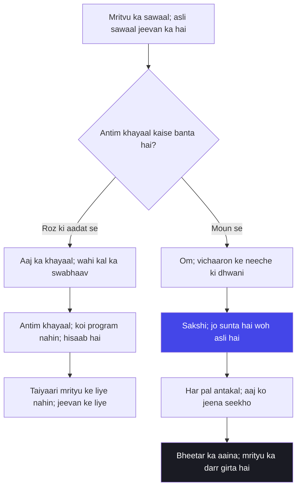

# अध्याय ८: अक्षर ब्रह्म योग — Maut ka sawaal nahin, jeevan ka pal hai

> **"Tum maut ke liye taiyaari karte ho — yeh sabse badi bhool hai. Antim khayaal koi taiyaari ka natija nahin hai; woh tumhare poore jeevan ka hisaab hai. Agar tum maut se pyaar karte ho, to marne se pehle jee lo — isi pal, isi saans mein. Maut ki chinta karna band karo; jeevan ka bhar lo."**
> — **ओशो**

---

Kurukshetra ka maidan, arjuna ka rath, aur wohi do armies — magar is adhyaya mein Krishna ka naksha badal jaata hai. Ab woh Arjuna ko duniya ke maidaan se bahar le jaata hai — us andhere dwar tak jahan jeevan aur mrityu ki seema khadi hai. Pehle saat adhyayon mein Krishna ne karm, gyan, maya aur bhakti ki baat ki. Ab aathwaan adhyaya mein woh aakhri prashn uthata hai: jab deha chhooti, tab kya hota hai? Arjuna poochhta hai — "bhagwan, antim samay mein kya karna chahiye? Kaisa khayaal rakhna chahiye taaki tumhe paoon?"

Krishna ka jawab traditional bhasha mein hai — antim samay mein mera smaran karo, mujhe hi yaad karke pran chhodo. Yeh baat saadi-lagaav se sundar lagti hai. Magar Osho is adhyaya ko aise padhte hain jaise kisi ne isi bhasha ke neeche ek doosra sandesh chhupa diya ho. Osho kahte hain — tum antim khayaal ki taiyaari nahin kar sakte, kyunki antim khayaal taiyaari ka natija nahin hota. Woh toh poore jeevan ki aadat ka aakhri hisaab hai. Jo aadmi roz greed mein soya hai, woh mrityu ke dwar par dhan soch kar nahin marega — uski aadat khud bol degi. Isliye Osho is adhyaya ka poora zor ulta kar dete hain: mrityu ke liye taiyaari karne ke bajaye, har pal aisa jio ki mrityu kisi pal mein tumhe chhoo bhi na sake.

Osho ne Gita Darshan ko hamesha Arjuna ki katha ke roop mein pada hai — sawaal uthane wale ki katha. Arjuna yahan mrityu ka sawaal uthata hai, magar Osho kahti hain — Arjuna ka asli sawaal mrityu ka nahin hai, jeevan ka hai. Jab koi poochhta hai "marne ke waqt kya karna chahiye", to woh asli mein yeh poochh raha hota hai "abhi kaise jeena chahiye ki maut na darr lage". Aur isi adhyaya ka asli sandesh yeh hai: antim khayaal ki chinta chhodo, apne aaj ke khayaal ko dekhna seekho. Aaj ka khayaal hi kal ka swabhaav hai; swabhaav hi antim khayaal hai.

Aur is adhyaya mein ek aur gehri baat hai — Om. Krishna kehti hain — "om ityekaksharam brahma" — Om ek akshar hai jo brahma hai. Traditional padhti ise mrityu ke samay ka mantra banati hai — marte waqt Om ka jaap karo. Osho ise aise samjhaate hain: Om koi formula nahin hai jo mrityu ke waqt kaam aaye. Om jeevan ke har pal ki dhwani hai — us shaant nadi ki dhwani jo tumhare andar hamesha beh rahi hai. Jab tum gehre dhyan mein utarte ho, jab tum shor se pare hoti ho, tab jo pehli dhwani uthhti hai wohi Om hai. Yeh koi uchcharan nahin, yeh svanubhuti hai. Aur jo aadmi is dhwani ko jeevan mein sun leta hai, use mrityu mein koi jaap nahin chahiye — woh khud hi Om mein sama jaata hai.

Osho ka is adhyaya par sabse bada zor yeh hai: mrityu koi anjaan dur desh nahin hai jo ant mein aayegi. Mrityu har pal ke saath chalti hai — har saans ke saath. Aur isi liye jeevan ka poora khel yeh nahin hai ki mrityu se ladna seekho, balki mrityu ke saath jeevant rehna seekho. Krishna kehti hain "antakale cha mam eva smaran" — Osho ise sunkar kehte hain: theek hai, magar "antakal" har pal hai. Isi pal tumhare jeevan ka antim pal ho sakta hai. Kya tum is pal aise jee rahe ho ki ise apna antim pal keh sako? Isi sawaal se aathwaan adhyaya shuru hota hai.

Aur yahan Osho ki ek aur baat hai jo sunne wale ko jhatka deti hai: mrityu ke liye taiyaari karne wala aadmi, asli mein, jeevan se bhag raha hota hai. Woh mrityu ke dwar par ek achha performance dena chahta hai — ek sundar antim khayaal, ek pavitra mantra, ek shant chitra. Magar Osho kehti hain — performance mrityu ke saamne nahin tikti. Mrityu ke saamne sirf sach tikta hai — woh sach jo tumhare jeevan mein tha. Agar tumhare jeevan mein moun nahin tha, to mrityu ke dwar par Om kaise aayega? Agar tumhare jeevan mein prem nahin tha, to mrityu ke dwar par bhagwan ka smaran kaise aayega? Mrityu ek aaina hai — aur aina wahi dikhata hai jo saamne rakha hai. Osho kahte hain — is aaine ke saamne khud ko sajane ka koi upaay nahin; khud ko sudhaarna padega, isi jeevan mein, isi pal mein.

## Learning Objectives

Is chapter ko complete karne ke baad aap:

1. Samajh payenge — Osho "antakale smaran" ko kaise ulta karte hain: antim khayaal taiyaari ka natija nahin, poore jeevan ki aadat ka hisaab hai.
2. Jaankar rahenge — shloka 8.5-6 ka gehra arth: last thought ka manovigyan aur kyun woh jeevan ka darpan hai.
3. Seekh payenge — Om ko mrityu ka formula nahin, jeevan ki dhwani — sakshi ki dhwani — ke roop mein anubhav karna.
4. Parakh payenge — mrityu-jagrukta ke teen pal: aaj ka antim pal, bheetar ka aaina, aur Om ka moun.
5. Bana payenge — ek TypeScript "Death Awareness Prompt Generator" jo roz ke reflection prompts banaye aur 7-din ke journal ka rasta dikhaye.

---

## Adhyaya 8 ka Parichay

### Kahan khada hai yeh adhyaya?

Mahabharat ke maidaan par ab Krishna ne gyan ka poora khel bichha diya hai. Arjuna ne maya, gyan aur bhakti ki baatein sun li hain. Magar ek sawaal abhi baaki hai — woh sawaal jo har aadmi ke andar hota hai, magar jo koi poochhna nahin chahta: mrityu ke dwar par kya hota hai? Arjuna poochhta hai — "bhagwan, brahm-yog ka swaroop kya hai? Aur usi samay — antim samay mein — tumhe kaise paaya jaata hai?" Krishna ka jawab is adhyaya mein hai — akshar brahma, aadhaar, aur antim smaran.

Is adhyaya ka traditional naam "Akshara Brahma Yoga" hai — woh brahma jo kabhi girti nahin, woh akshar jo kabhi mitta nahin. Krishna kehti hain — mrityu ke samay jo mujhe smaran karta hai, woh mujh tak pohochta hai; jo kisi aur bhaav mein marta hai, woh usi bhaav mein phir aata hai. Osho is adhyaya ko padhte hain — aur unki pehli baat yeh hoti hai: yeh adhyaya mrityu ke baare mein nahin hai, jeevan ke baare mein hai. Mrityu toh bas woh aaina hai jisme tumhara poora jeevan ek pal mein dikh jaata hai.

Is adhyaya mein Krishna ek ke baad ek bataate hain — akshar, kshar, avyakta, purshottam — char cheezon ka vibhajan. Osho is vibhajan ko le kar kehte hain: yeh classification koi vigyan ka paper nahin hai jise yaad karna hai; yeh ek drishti hai. Jab tum is duniya ko dekhte ho — ek cheez girti hai, ek rehti hai — tab tum pehli baar dekh paate ho ki tumhare andar bhi ek cheez hai jo kabhi girti nahin. Wohi "akshar" hai. Aur Osho kahte hain — is akshar ko mrityu ke baad dhoondhne ke liye taiyaari mat karo; use aaj dhyan ke pal mein dekhna seekho. Jo aaj dikhta hai, wohi ant mein bhi dikhega.

### Osho ka lens: antim khayaal ka hisaab

Osho kahte hain — jis din tum "mrityu ke liye kaun sa mantra yaad karoonga" ki taiyaari karne lagaoge, usi din tum jeevan ko chhod rahe ho. Kyunki taiyaari ka matlab hai ki mrityu door hai aur use abhi sochna chahiye. Osho kahti hain — mrityu door nahin hai; woh is pal mein hai. Is pal mein tumhari saans chal rahi hai — wohi mrityu ka pata hai. Isliye asli sawaal yeh nahin hai ki "antim samay mein kya karoonga", asli sawaal yeh hai ki "is pal kya kar raha hoon". Antim khayaal koi program nahin hai jo load kiya jaye; woh toh jeevan ka aakhri output hai — wohi nikalega jo andar bhara hua hai.

Osho ise ek mithak se samjhaate hain: ek aadmi saal bhar kaach ke ghar mein betha kaam karta hai, aur ek din usse kahte hain ki kal se tere kaam ki pariksha hogi. Kya woh raat bhar mehnat kar ke asli gyaani ban sakta hai? Nahi. Jo saal bhar padha hai, wohi kal likhega. Waise hi mrityu ke dwar par koi naya khayaal nahin aata — wahi aata hai jo jeevan bhar bhara gaya. Isliye Osho kehte hain — mrityu ke liye taiyaari mat karo; jeevan ke liye taiyaari karo. Aur jeevan ki taiyaari hai — har pal sakshi banna. Wohi sabse gehra abhyaas hai jo ant mein khud-ba-khud bol uthta hai.

### Arjuna ka sawaal: mrityu ka bhagwan se rishta

Yeh adhyaya Arjuna ke ek gehre sawaal se shuru hota hai. Woh poochhta hai — "bhagwan, brahm ka swaroop kya hai, adhyaatma kya hai, karm ka phal kya hai — aur us sabse bada, antim samay mein tumhe kaise paaya jaata hai?" Osho is sawaal ko aise padhte hain jaise Arjuna ne poore adhyaya ka naksha hi de diya ho. Kyunki asli sawaal yeh hai: jo cheez is duniya mein na dikhe, woh mrityu ke dwar par kaise milti hai? Osho kahte hain — Arjuna bhool raha hai ki woh jis cheez ko dhoondh raha hai, woh uske saath baithi hai. Krishna rath par Arjuna ke saath hai — aur mrityu ke dwar par wohi rath, wohi saarthi, wohi smaran. Bhagwan koi door ka adhikaar nahin hai jo mrityu par milta hai; woh wahi hai jise tum aaj ke pal mein dekhte ho — apne bheetar ke sakshi ke roop mein.

Osho kehti hain — Arjuna ka sawaal bhi hum sab ka sawaal hai. Hum sochte hain ki mrityu par kuch "hoga" — isliye mrityu ke baad ki taiyaari karte hain. Magar Gita ka poora khel ulta hai: mrityu par wahi hota hai jo is pal mein tumhare andar hai. Isliye Krishna Arjuna ko mrityu ka naksha nahin dete — woh use aaj ka darpan dete hain. "Antakale" ko yaad rakhne se pehle, "aaj" ko yaad rakho. Osho kahte hain — yahi Gita ka sabse krantikaari sandesh hai: mrityu ka bhagwan se rishta nahin hota; jeevan ka bhagwan se rishta hota hai. Aur jeevan ka rishta aaj ke pal mein banta hai, kal ke vachan mein nahin.

### Purani padhti aur Osho ki padhti

| Traditional reading | Osho's reading |
|--------------------|----------------|
| Antim samay mein bhagwan ka smaran karo — yahi moksha ka raasta hai | Antim khayaal koi chuna hua khayaal nahin — woh poore jeevan ka hisaab hai; isliye aaj ke khayaal ko dekho |
| Mrityu ke liye taiyaari karna zaroori hai — mantra, jaap, smaran | Taiyaari mrityu ko door rakhne ka bahana hai; mrityu is pal mein hai, is pal ko jee lo |
| Om ek mrityu-mantra hai — marte waqt jaap karo | Om jeevan ki dhwani hai — moun ke dwar par uthne wali pehli dhwani; use jeevan mein suno |
| "Yam yam bhaavam smaran" — kaisa bhaav hoga waisa janm | Bhaav koi coincidence nahin — woh aadat ka natija hai; aaj ki aadat hi kal ka bhaav hai |
| Akshar brahma door ka ek parama sach hai, jaana jaane wala | Akshar brahma tumhare andar hai — woh sakshi hai jo kabhi girti nahin, chhoda nahin jaata |
| Mrityu ek ghatna hai jo ant mein hoti hai | Mrityu har pal sath chalti hai; jeevant rehna usi ka naam hai |

---

## Key Shlokas

### Shloka 8.5

> अन्तकाले च मामेव स्मरन्मुक्त्वा कलेवरम्।
> यः प्रयाति स मद्भावं याति नास्त्यत्र संशयः।।

**Transliteration:** Antakale cha mam eva smaran muktva kalevaram; yah prayati sa mad-bhavam yati nasti atra samshayah.

**Arth (Hinglish):** Antim samay mein mujhe smaran karte hue jo sharir ko chhod ke jaata hai — woh mere bhaav ko prapt hota hai; ismein koi sandeh nahin hai.

**Osho ka drishtikon:** Osho kehti hain — "antakale" shabd ko pakad lo. Krishna koi calendar nahin bata raha — woh kah raha hai ki har pal antakal ho sakta hai. Aur phir sawaal yeh hai: jo aadmi roz nahin smaran karta, woh antakal mein kaise smaran karega? Antim samay ki yaad koi nakli cheez nahin hai — woh toh wahi hai jo dil mein saal bhar bhari hai. Isliye Osho kahte hain — yeh shloka mrityu ka mantra nahin, jeevan ka aaina hai. Aaj ke khayaal ko dekho — wahi tera antim khayaal hai, jo bhi hai.

### Shloka 8.6

> यं यं वापि स्मरन्भावं त्यजत्यन्ते कलेवरम्।
> तं तमेवैति कौन्तेय सदा तद्भावभावितः।।

**Transliteration:** Yam yam vapi smaran bhavam tyajaty ante kalevaram; tam tam evaiti kaunteya sada tad-bhava-bhavitah.

**Arth (Hinglish):** He Kaunteya, jo bhi bhaav ko smaran karte hue antim samay mein sharir chhodta hai — usi bhaav ko woh paata hai, kyunki jeevan bhar woh usi bhaav se bhavit raha.

**Osho ka drishtikon:** Osho is shloka ko Gita ka sabse gehra manovigyan kehte hain — "sada tad-bhava-bhavitah". Antim khayaal koi akasmik ghatna nahin hai; woh jeevan bhar ke abhyaas ka aakhri swar hai. Jo aadmi roz rukna chahta hai, woh mrityu ke dwar par bhi rukta hua hi jaata hai. Jo roz prem mein jeeta hai, woh prem ka jaap karte hue nahin marta — woh prem mein hi mil jaata hai. Osho kahte hain — yeh shloka koi rebirth ka theory nahin hai; yeh aadat ka vigyan hai. Aaj ka chhota khayaal, kal ka bada swabhaav. Isliye antim khayaal ki chinta chhodo — aaj ke khayaal ko dekhna shuru karo.

### Shloka 8.13-14

> ओमित्येकाक्षरं ब्रह्म व्याहरन्मामनुस्मरन्।
> यः प्रयाति त्यजन्देहं स याति परमां गतिम्।।
> अनन्यचेताः सततं यो मां स्मरति नित्यशः।
> तस्याहं सुलभः पार्थ नित्ययुक्तस्य योगिनः।।

**Transliteration:** Om iti ekaksharam brahma vyaharan mam anusmaran; yah prayati tyajan deham sa yati paramam gatim. Ananya-chetah satatam yo mam smarati nityashah; tasyaham sulabhah partha nitya-yuktasya yoginah.

**Arth (Hinglish):** Jo Om — yeh ek akshar brahma — ka uchcharan karte hue aur mujhe smaran karte hue deha chhodta hai, woh param gati ko prapt hota hai. He Partha, jo ananya chit se satat mujhe smaran karta hai, us nitya-yukt yogi ko main sulabh hoon.

**Osho ka drishtikon:** Osho kahte hain — Om ko mrityu ka formula mat banao. Om koi jaap nahin hai jo antim ghari mein chalu karna hai; Om woh dhwani hai jo us moun mein hoti hai jahan shor khatam ho jaata hai. Jab tum dhyan mein gehre utarte ho, jab vichaar shaant ho jaate hain, tab jo bhitar se dhwani uththi hai — wohi Om hai. "Sulabh" — Krishna kehti hain ki aisa yogi mujhe sulabh paata hai. Osho kehti hain — woh sulabh isliye hai kyunki woh khoj nahin kar raha, woh anubhav kar raha hai. Om ko uchcharan se nahin, moun se jaana jaata hai — aur moun ka abhyaas mrityu ke liye nahin, jeevan ke liye hota hai.

---

## Mrityu, Antim Khayaal aur Om — Osho ki gahrai mein

### Mrityu: dur ki ghatna nahin, har pal ka saathi

Osho ka is adhyaya par sabse bada jhukaav yeh hai: mrityu ko door ka koi din mat samjho. Jaise tumhari saans is pal chal rahi hai, waise hi is pal tumhari mrityu bhi tumhare saath hai. Osho kehti hain — yeh baat darr dene ke liye nahin hai; yeh baat jagane ke liye hai. Jab mrityu dur lagti hai, tab jeevan ki kadar khatam ho jaati hai. Tum kal ke liye jiye jaate ho, parso ke liye, retirement ke liye — aur aaj, yeh ek maatha wala pal, khaali haath nikal jaata hai. Mrityu ko saamne rakho — aur har pal ka mol dikhne lagta hai.

Aur yehi Osho ki sabse bada ulat hai: traditional padhti kehti hai "mrityu ke baad kya milega" — Osho kahte hain "is pal mein kya hai". Swarg aur narak ka hisaab mrityu ke baad nahin hota; woh is pal mein hota hai. Jo aadmi is pal mein jeeta hai, uska swarg isi pal hai. Jo kal ke liye jeeta hai, uska narak isi pal hai — kyunki woh kabhi "abhi" nahin aata. Osho kahte hain — Krishna ke "antakale" ko antim din mat banao; use har subah banao. Har subah woh khayaal uthana chahiye: "Aaj mera aakhri din ho sakta hai — to main aaj kaise jeena chahta hoon?" Yeh poochhne se jeevan badal jaata hai.

### Antim khayaal: program nahin, aadat ka hisaab

Jab Krishna kehte hain "yam yam vapi smaran bhavam" — jo bhaav smaran karte hue jaaoge — to traditional padhti ise ek dhamki ya ek vachan ke roop mein padhti hai. Osho ise ek tulana ke roop mein padhte hain. Aaj tum kaise sochte ho, kaise rehte ho, kya chaahte ho — wahi kal ka tumhara swaroop hai. Yeh koi janm-antar ki kahani nahin hai; yeh aaj ki aadat ki kahani hai. Jo aadmi roz gussa karta hai, uske andar gussa bhara hai — woh kahin bhi jaaye, gussa uske saath jayega. Jo aadmi roz jagruti mein jeeta hai, uske andar jagruti bhari hai — woh kisi bhi dwar par khada ho, jagruti khud bol uthegi.

Osho isliye kahte hain — antim khayaal ki taiyaari karna bekaar hai. Tum kisi ke saamne "main bhagwaan ko yaad karke marunga" bol sakte ho, magar mrityu ke dwar par tumhara woh nakli vaada kaam nahin karega. Wahan wohi aayega jo tumhara asli jeevan tha. Isliye Osho ka sadhya ulta hai: mrityu ko mat dekho, jeevan ko dekho. Antim khayaal kya hoga, yeh sawaal chhodo. Aaj ka khayaal kya hai — yeh poochhna shuru karo. Aaj ke khayaal ko sudhaaro; antim khayaal khud sudhar jaayega. Jaise nadi ka saaf pani, saagar tak saaf pohochta hai — waise hi saaf khayaal mrityu ke dwar tak saaf pohochte hain.

| Aadat aaj ki | Antim khayaal kal ka | Osho ka nuskha |
|--------------|----------------------|----------------|
| Roz darr aur chinta mein jeena | Mrityu par bhi darr chhaa jayega | Aaj ka darr dekh lo — wohi kal ki mrityu ka dar hai |
| Roz greed aur lobh mein jeena | Mrityu par bhi labh ka khayaal | Aaj ka lobh chhodna seekho — wohi mrityu ka bhaar halka karega |
| Roz kisi ka saath le kar jeena | Mrityu par bhi asahayta ka bhaav | Aaj ek pal akele thehro — mrityu ki taiyaari yahi hai |
| Roz sakshi banna | Mrityu par bhi sakshi hi uthta hai | Sakshi ka abhyaas hi antim smaran ka asli roop hai |

Osho kahte hain — is table ko ek baar padh ke mat bhoolo; ise har hafte padho. Kyunki is table ka har daana ek kriya hai, koi gyaan nahin. Darr ko aaj dekhna, lobh ko aaj chhodna, akele theharna, sakshi banna — yeh char abhyaas hain. Aur in char abhyaason se mrityu ka darr khud apni jagah kho deta hai. Yehi is adhyaya ka upayog hai — mrityu ka koi ilaaj nahin hai, magar mrityu ka darr ka ilaaj hai. Aur woh ilaaj isi jeevan mein, aaj ke pal mein, in char chhote abhyaason mein chhupa hai.

### Om: mrityu ka formula nahin, moun ki pehli dhwani

Om ke baare mein Osho ka swar sabse mool hai. Traditional parampara ne Om ko ek mrityu-mantra bana diya — marte waqt jaap karo, mukti mil jayegi. Osho kehti hain — yeh Om ka apmaan hai. Om koi uchcharan nahin hai jo labh par labh deta hai; Om woh dhwani hai jo jeevan ke bhitar har samay hoti hai. Jaise samundar mein lehron ke neeche ek shaant dhwani hoti hai, waise hi tumhare vichaaron ke neeche ek shaant dhwani hai — wohi Om hai. Usse jaapa nahin jaata, usse suna jaata hai. Aur usse sunne ke liye moun chahiye — bheetar ka moun.

Isliye Osho kahte hain — Om ka abhyaas mrityu ke liye nahin, aaj ke liye hai. Roz thoda moun, roz kuch pal vichaaron se pare — yehi Om ki taiyaari hai. Aur jab Om bheetar se uththa hai, tab koi mantra nahin chahiye. Krishna kehti hain "sulabh" — Osho ise aise samjhaate hain: jo aadmi moun mein rehta hai, woh Om ko nahin dhoondhta; Om khud uske paas aata hai. Aur wohi "sulabh" hai. Mrityu ke dwar par woh aadmi koi jaap nahin karega — woh khud dhwani ban jaayega. Yeh Osho ki is adhyaya ki sabse gehri baat hai.

### Mrityu ko jaana: dhyan ka antim fayda

Osho kahte hain — dhyan ka ek fayda bahut kam log jaante hain: dhyan hi mrityu ko jaanna seekhne ka rasta hai. Jab tum dhyan mein vichaaron ko chhodte ho, tab tum ek chhoti mrityu mar rahe ho — vichaar ka shor marta hai, pehchaan mitti ho jaati hai, aur jo bachta hai woh shaant sakshi hai. Osho kehti hain — jis aadmi ne dhyan mein yeh chhoti mrityu anubhav ki hai, uske liye badi mrityu koi anjaani nahin rahti. Woh jaanta hai ki "marne" ka matlab kya hota hai — ek roop girta hai, aur jo kabhi gira hi nahin woh reh jaata hai.

Aur yahin se is adhyaya ka sabse mool sandesh nikalta hai: dhyan mrityu ki taiyaari nahin hai, dhyan mrityu ka abhyaas hai. Roz thodi mrityu mar lo — apne vichaaron ko, apni pehchaan ko, apne "main" ko — aur phir dekho ki mrityu se kya bachta hai. Wohi bachta hai jo Krishna kehte hain — akshar, jo kabhi nahin girti. Osho kahte hain — yehi "akshara brahma" hai: woh jo har pal girti cheezon ke beech bhi kabhi nahin girti. Aur use mrityu ke baad nahin, dhyan mein abhi dekha jaata hai.

Aur isi baat ko Osho apne roj ke jeevan se jodte hain. Woh kehte hain — jab tum neend mein jaate ho, toh tum bhi ek chhoti mrityu mar rahe ho; jab tum neend se uthhte ho, toh naya janm hota hai. Har raat ek abhyaas hai, har subah ek pariksha. Jo aadmi roz so kar uthta hai woh mrityu aur janm ke khel ko roz dekhta hai — magar dekhta nahin, kyunki woh so jaata hai. Osho kehti hain — neend se pehle ka aakhri khayaal bhi wohi hai jo mrityu ke dwar par aayega. Isliye raat ka antim khayaal bhi sudhaaro — wohi aaj ka antim khayaal hai, wohi mrityu ke dwar ka pahunchta hai.

Aur ek aakhri gehri baat: Osho kehti hain — is adhyaya ka naam "akshara brahma" hai, magar Krishna use ek jaane wale ke roop mein nahin rakhte. Woh kehte hain — akshar ko "jaana" jaata hai, yeh bhi gyan hai. Magar jab tum akshar ke saath ek ho jaate ho — jab dhyan mein bheetar aur bahar ka fark gir jaata hai — tab koi jaanna nahin bachta, sirf hona rehta hai. Osho kahte hain — mrityu ke dwar par wohi fark girti hai: tum aur tumhara — dono ek. Aur yehi ek hona "sulabh" hai jiske baare mein Krishna kehte hain. Yeh koi philosophy nahin hai jo padhni hai; yeh anubav hai jo dhyan mein ghatta hai. Isliye is adhyaya ka abhyaas padhna nahin, dhyan karna hai.



Osho is chitr ko dekh kar kehte hain — yeh koi mrityu ka map nahin hai; yeh aaj ke din ka rasta hai. Jab tum har subah is raste se guzarte ho — aaj ka khayaal, uski aadat, aur moun ka ek pal — tab mrityu ka darr apne aap gir jaata hai. Kyunki jo aadmi aaj mein jeeta hai, uske paas kal ka darr kaise aayega?

Aur yeh adhyaya ka aakhri sandesh yeh hai: mrityu se darrna mrityu ki jeet hai, mrityu ko jaanna jeevan ki jeet hai. Krishna kehti hain — "nastyatra samshayah" — ismein koi sandeh nahin. Osho ise aise samjhaate hain: jis aadmi ne apne bheetar ke akshar ko dekha hai, uske liye mrityu koi prashn hi nahin rahti. Woh jaanta hai ki jo girta hai woh deha hai, jo rehta hai woh swaroop hai. Aur yeh jaanna kisi mantra se nahin, kisi jaap se nahin — is jaanna se aata hai jo har pal, har saans mein, aaj ke pal mein anubav hota hai. Isliye Osho kahte hain — mrityu ka sawaal mat poochho, jeevan ka pal jeena shuru karo. Baaki sab apne aap theek ho jaayega.

---

## TypeScript Implementation

```typescript
/**
 * Death Awareness Prompt Generator
 * --------------------------------
 * Adhyaya 8 ka TypeScript roop — Osho ki drishti mein mrityu:
 * mrityu dur ki ghatna nahin, har pal ka saathi hai.
 * Yeh class roz ke reflective prompts banati hai: umra, adhura kaam,
 * aaj ka antim khayaal, aur 7-din ka journal template.
 * Osho kehti hain: "Mritvu ke liye taiyaari nahin; jeevan ke liye."
 */

type DayOfWeek = "somvar" | "mangalvar" | "budhvar" | "guruvar" | "shukravar" | "shanivar" | "ravivar";

interface LifeSnapshot {
  umra: number;
  adhuraKaam: string;
  aajKaKhayaal: string;
  aakhriBaatein: string[];
}

interface DailyPrompt {
  day: DayOfWeek;
  title: string;
  sawaal: string;
  oshoNote: string;
}

const PROMPT_DAYS: DayOfWeek[] = ["somvar", "mangalvar", "budhvar", "guruvar", "shukravar", "shanivar", "ravivar"];

const PROMPT_OSHO: Record<DayOfWeek, string> = {
  somvar: "Osho kehti hain — umra umra nahin hai; umra yeh hai ki tum kitne pal jeevit ho.",
  mangalvar: "Osho kehti hain — adhura kaam isliye adhura hai kyunki uske liye kal chahiye; aaj hi kuch pura karo.",
  budhvar: "Osho kehti hain — aaj ka aakhri khayaal aaj ka aina hai; usme darr hai ya prem, dekho.",
  guruvar: "Osho kehti hain — aakhri baatein wo nahin jo marne par bolni hain; wo baatein jo aaj kehni hain.",
  shukravar: "Osho kehti hain — mritvu ke saamne jhooth nahin tikta; aaj ka sach dekhna seekho.",
  shanivar: "Osho kehti hain — mritvu darr nahin hai; anjaan ka darr hai. Aaj kisi anjaan cheez se milo.",
  ravivar: "Osho kehti hain — hafta mritvu ke saamne thama; ab naya hafta jeevan ke saath shuru karo.",
};

class DeathAwarenessPromptGenerator {
  private snapshot: LifeSnapshot;

  constructor(snapshot: LifeSnapshot) {
    this.snapshot = snapshot;
  }

  private lastThoughtToday(): string {
    return this.snapshot.aajKaKhayaal.trim().length > 0
      ? this.snapshot.aajKaKhayaal
      : "Aaj ka antim khayaal abhi tak likha nahin gaya; wahi pehla sawaal hai.";
  }

  promptFor(day: DayOfWeek): DailyPrompt {
    const titles: Record<DayOfWeek, string> = {
      somvar: "Umra ka hisaab",
      mangalvar: "Adhura kaam",
      budhvar: "Aaj ka antim khayaal",
      guruvar: "Aakhri baatein",
      shukravar: "Sach ka aaina",
      shanivar: "Anjaan se milan",
      ravivar: "Hafta ka hisaab",
    };
    const questions: Record<DayOfWeek, string> = {
      somvar: `Tum ${this.snapshot.umra} saal ke ho. Agar mritvu kal aa jaye, to umra ka kaun sa hissa tumhe dukh degi?`,
      mangalvar: `Tumhara adhura kaam: ${this.snapshot.adhuraKaam}. Is hafte uske liye ek chhota sa kadam kya hoga?`,
      budhvar: `Aaj ka antim khayaal kya hoga: ${this.lastThoughtToday()}. Kya woh swabhaav hai ya majboori?`,
      guruvar: `Aakhri baatein: ${this.snapshot.aakhriBaatein.join(", ")}. Inmein se kaun si baat aaj kahi ja sakti hai?`,
      shukravar: `Aaj kis baat par tumne jhooth bola ya chhupaya? Woh jhooth mritvu ke saamne tikta?`,
      shanivar: `Aaj ek aisi cheez karo jo tumne kabhi nahin ki; anjaan se darr mat khao.`,
      ravivar: `Is hafte ke 7 din ka hisaab: kitne din jeevit the, kitne din darr mein guzare?`,
    };
    return {
      day,
      title: titles[day],
      sawaal: questions[day],
      oshoNote: PROMPT_OSHO[day],
    };
  }

  weekTemplate(): DailyPrompt[] {
    return PROMPT_DAYS.map((day) => this.promptFor(day));
  }

  oshoSummary(): string {
    return [
      "Osho kehti hain —",
      `Aaj ki umra: ${this.snapshot.umra}; adhura kaam: ${this.snapshot.adhuraKaam}.`,
      `Aaj ka antim khayaal: ${this.lastThoughtToday()}.`,
      "Mritvu ka sawaal nahin, jeevan ka pal hai. Har subah wahi pal jeena shuru karo.",
    ].join("\n");
  }
}

function runDemo(): void {
  const generator = new DeathAwarenessPromptGenerator({
    umra: 22,
    adhuraKaam: "placement ka final round",
    aajKaKhayaal: "kal ka intezaar aur aaj ki thakan",
    aakhriBaatein: ["maa se prem", "dost se maafi", "khud se sach"],
  });

  console.log("=== Death Awareness Prompt Generator: Demo ===");
  console.log(generator.oshoSummary());
  console.log("\n--- 7-din ka journal template ---");
  for (const prompt of generator.weekTemplate()) {
    console.log(`[${prompt.day}] ${prompt.title}`);
    console.log(`   Sawaal: ${prompt.sawaal}`);
    console.log(`   ${prompt.oshoNote}`);
  }
  console.log("\nOsho kehti hain — 'Is journal ko mritvu ke liye mat bharna; jeevan ke liye bharna.'");
}

runDemo();
```

Yeh code mrityu ka koi bhayankaar hisaab nahin hai — yeh jeevan ka har subah ka jhatka hai. Is generator ko chalao, apni umra daalo, apna adhura kaam likho — aur dekho ki 7 din ka journal kitna badalta hai. Osho kehti hain — mrityu ke saamne jo sabse zyada pachtaata hai woh kiya hua nahin, chhoda hua hai. Yeh generator isliye bana hai ki aaj hee kuch chhoda hua kaam ho jaye, koi baat keh di jaye, koi pal poora ho jaye.

Aur ek aakhri baat: is code ka naam "Death Awareness" hai — magar Osho ki drishti mein yeh "Life Awareness" hai. Mrityu ke saamne khud ko rakhna ek tarika hai — magar us tarike ka maqsad mrityu ko dekhna nahin, jeevan ko dekhna hai. Jaise ek aadmi apna waqt nikalne ke liye ghaadi ko nahin dekhta — woh ghaadi ko isliye dekhta hai ki waqt bacha sake. Waise hi mrityu ka aaina isliye chahiye ki jeevan ka har pal keemti ho jaaye. Yeh generator har subah woh ghaadi hai — aur ghaadi ko dekhte hi tumhe yaad aa jaaye ki aaj ka pal asli hai, baaki sab kal hai.

---

## Summary

| Bindu | Saar |
|-------|------|
| Mrityu | Dur ki ghatna nahin — har pal ka saathi; isliye kal ki chinta nahin, aaj ka pal |
| Antim khayaal | Koi program nahin jo load kiya jaye — poore jeevan ki aadat ka aakhri hisaab |
| Aadat ka vigyan | Aaj ka khayaal hi kal ka swabhaav; swabhaav hi antim khayaal ban jaata hai |
| Om | Mrityu ka formula nahin — moun ke dwar par uthne wali jeevan ki dhwani |
| Sakshi | Har pal ka abhyaas — jo mrityu ke dwar par bhi wahi uthta hai, wohi asli smaran hai |

---

## Contradictions

- **Antim smaran ka vachan vs aadat ka vigyan:** Traditional padhti kehti hai antim samay mein smaran karo aur mukti pao. Osho kehti hain — antim khayaal koi chuna hua khayaal nahin hai; woh jeevan bhar ki aadat ka aakhri output hai. Mrityu ke dwar par wahi milega jo andar bhara hai.
- **Mrityu ki taiyaari vs jeevan ka bhar:** Sampraday mrityu ke liye mantra, jaap aur smaran ki taiyaari sikhata hai. Osho ise ulta karte hain — taiyaari mrityu ko door rakhne ka bahana hai; asli kaam aaj ke pal mein hai.
- **Om mrityu-mantra vs Om jeevan-dhwani:** Om ko marte waqt ka jaap maana jaata hai. Osho kehti hain — Om jeevan mein sunne wali dhwani hai; moun ka abhyaas isliye chahiye ki woh aaj sunai de, mrityu par nahin.
- **Janm-antar ka sidhant vs aadat ka vigyan:** "Yam yam bhaavam" ko agla janm taiyaar karne wala theory maana jaata hai. Osho ise rebirth ke roop mein nahin padhte — aaj ki aadat kal ka swaroop banati hai, yahi is shloka ka gehra arth hai.
- **Krishna ka aashvasan vs Osho ka jhatka:** Krishna kehti hain "nastyatra samshayah" — ismein koi sandeh nahin. Osho kehti hain — is aashvasan ko taiyaari mat samjho; yeh aaina hai. Apne aaj ke khayaal ko dekho — wahi tumhara sandeh ya nishchay hai.

---

## Open Questions

- Agar antim khayaal aadat ka natija hai, to kya saal bhar ka apmaan ek pal ke naye khayaal se sudharna sambhav hai? Ya aadat ki gati hi sab faisla karti hai?
- Osho kehti hain mrityu har pal saath hai — to kya is jagruti se zyada jeevan mein bhay nahin aata? Kahan hai "mrityu prem" aur "mrityu bhay" ki seema?
- Om ko moun se sunna bataaya gaya — magar Krishna "vyaharan" (uchcharan) kahta hai. Kya uchcharan bhi kisi sthaan par kaam karta hai, ya woh sirf shuruaat hai?
- Agar is pal hi mrityu aa jaye to kya kisi ka jeevan "poora" kahla sakta hai? Ya poore hone ki paribhasha hi mrityu ki taiyaari ka dhoong hain?

---

## Practical Takeaways

| Situation | Gita shloka | Osho's lens | Action |
|-----------|-------------|-------------|--------|
| Raat ko mrityu ka darr saata hai | 8.5 (antakale smaran) | Darr kal ke liye hai; aaj ka pal jeene do | Darr aaye to 5 saansein gehra lo aur aaj ke 3 achhe pal yaad karo |
| "Aaj kuch nahin hua" ka khali ehsaas | 8.6 (sada tadbhavabhavitah) | Aaj ka khayaal hi kal ka swabhaav hai | Roz raat ek line likho — aaj ka antim khayaal kya tha |
| Mrityu ke liye mantra seekhne ka mann | 8.13 (om ityekaksharam) | Om jeevan ki dhwani hai, mrityu ka jaap nahin | Roz 2 minute moun — vichaar band karo, dhwani suno |
| Kal ke liye jeena, aaj ko tangna | 8.14 (satatam smarati) | Har pal antakal hai; aaj ko jee lo | Subah uthkar poochho — "Agar aaj aakhri din ho, to kya karoonga?" |
| Kisi baat ko "baad mein" kehna | 8.5-6 (kaunteya) | Aakhri baatein aaj kehni hain | Aaj hi ek pyaar ki baat, ek maafi, ek sach bolo |

---

## Chapter Quiz

### Question 1

Osho ke anusaar "antakale cha mam eva smaran" ka asli arth kya hai?

a) Marne se pehle Krishna ka naam yaad karna zaroori hai
b) Har pal antakal hai — aaj ka khayaal hi asli smaran hai
c) Antim samay ka jaap koi bhi kar sakta hai
d) Mrityu ke samay ke liye alag se taiyaari chahiye

<details>
<summary>Answer</summary>
b) Osho kehti hain — antim khayaal koi program nahin; woh jeevan ki aadat ka hisaab hai. Isliye aaj ke khayaal ko dekho.
</details>

### Question 2

Shloka 8.6 mein "sada tadbhavabhavitah" ka kya arth hai?

a) Jeevan bhar wahi bhaav rakha, wahi antim samay mein prakat hota hai
b) Bhaav ko sirf antim samay mein yaad karna chahiye
c) Bhaav har janm mein badal jaata hai
d) Bhaav ka koi asar nahin hota

<details>
<summary>Answer</summary>
a) Jo bhaav se jeevan bhar bhavit raha, wahi antim samay mein prakat hota hai — aadat ka vigyan.
</details>

### Question 3

Osho antim khayaal ki taiyaari ko kya kehte hain?

a) Sabase zaroori abhyaas
b) Mrityu ko door rakhne ka bahana
c) Bhagwan ka aadesh
d) Ghar mein beth kar kiya jane wala kaam

<details>
<summary>Answer</summary>
b) Taiyaari ka matlab mrityu ko door maanna hai; asli kaam aaj ke pal mein hai — mrityu is pal mein hai.
</details>

### Question 4

Osho ke anusaar Om kya hai?

a) Mrityu ke samay ka mantra
b) Moun ke dwar par uthne wali jeevan ki dhwani
c) Sirf panditon ka uchcharan
d) Ek akshar jo jaldboli mein bana

<details>
<summary>Answer</summary>
b) Om koi formula nahin; woh dhwani hai jo vichaar shaant hone par bheetar se uthhti hai — use jaapa nahin jaata, suna jaata hai.
</details>

### Question 5

Krishna kehti hain ki nitya-yukt yogi ko woh "sulabh" hain. Osho ise kaise samjhaate hain?

a) Krishna har yogi ko paas bulate hain
b) Sulabh woh hai jo khoj nahin kar raha, anubhav kar raha hai
c) Sulabh ka matlab bhagwan ki kripa hai
d) Sulabh sirf vriddho ko hai

<details>
<summary>Answer</summary>
b) Jo aadmi moun mein rehta hai, woh Om ko dhoondhta nahin — Om khud aata hai; yahi sulabh ka arth hai.
</details>

### Question 6

Osho ke anusaar "yam yam bhaavam smaran" ka asli sandesh kya hai?

a) Antim samay ka khayaal chuno
b) Aaj ki aadat hi kal ka swaroop hai
c) Janm-antar ka bhagya likha hai
d) Bhaav ko chhupana chahiye

<details>
<summary>Answer</summary>
b) Yeh koi rebirth theory nahin — aaj ka chhota khayaal kal ka bada swabhaav ban jaata hai.
</details>

### Question 7

Death Awareness Prompt Generator kya banata hai?

a) Mritvu ke liye taiyaari ka programme
b) Roz ke reflection prompts aur 7-din ka journal template
c) Janm kundali ka hisaab
d) Mantra ki list

<details>
<summary>Answer</summary>
b) Yeh class roz ke sawaal banati hai — umra, adhura kaam, aaj ka antim khayaal — aur 7-din ka journal ka rasta dikhati hai.
</details>

### Question 8

Osho kehti hain ki mrityu ka darr kya hai?

a) Anjaan cheez ka darr
b) Bhagwan ki saja
c) Koi darr nahin hai
d) Janm-antar ka darr

<details>
<summary>Answer</summary>
a) Mrityu darr nahin hai; anjaan ka darr hai. Aaj kisi anjaan cheez se milo — darr tutega.
</details>

### Question 9

Osho ke anusaar swarg aur narak kahan hain?

a) Mrityu ke baad kahin door
b) Is pal mein — jo aaj jeeta hai uska swarg isi pal hai
c) Himalaya ke us paar
d) Sirf kitaabon mein

<details>
<summary>Answer</summary>
b) Swarg-narak mrityu ke baad nahin; woh is pal ka hisaab hai — kal ke liye jeena narak hai, aaj mein jeena swarg.
</details>

### Question 10

"Antim khayaal ka hisaab" ka sabse achha abhyaas kya hai?

a) Har roz mrityu ka mantra padhna
b) Aaj ke khayaal ko dekhna aur har subah "aaj aakhri din ho to kya karoonga" poochhna
c) Mrityu ki baatein karna band karna
d) Antim khayaal ko likh kar bhool jaana

<details>
<summary>Answer</summary>
b) Antim khayaal ki taiyaari nahin — aaj ke khayaal ki jagruti; wahi asli abhyaas hai.
</details>

---

## Exercises

1. **Subah ka jhatka (5-min):** Har subah uthkar apne aap se poochho: "Agar aaj mera aakhri din ho, to main kaise jeena chahta hoon?" Is sawaal ka jawab ek line mein likho. Osho kehti hain — yeh ek hafte mein hi jeevan ka naksha badal deta hai.

2. **Antim khayaal diary (10-min):** Roz raat soone se pehle likho — "Aaj ka mera antim khayaal kya tha?" Pehle hafte dekho ki woh khayaal darr ka hai, thakan ka, prem ka, ya kuch aur. Doosre hafte us khayaal ko badalne ka prayas karo.

3. **Moun ka ek pal (5-min):** Din mein ek baar 2 minute ke liye vichaar band karo — bas saansein dekho, shor khatam karo. Jab vichaar shaant honge, bheetar se jo dhwani uthhegi usse suno. Osho kehti hain — wohi Om hai; use jaapo mat, suno.

4. **Adhura kaam ka hisaab (15-min):** Ek kaagaz par woh sab kuch likho jo tumne "baad mein" ke liye chhoda hai — baatein, maafi, safar, seekhna. Ab us list mein se ek cheez chuno aur is hafte karo. Osho kehti hain — "Mritvu ke saamne pachtawa chhoda hua kaam hai."

5. **TypeScript chalao:** `DeathAwarenessPromptGenerator` ko run karo, apni apni umra aur apna adhura kaam daalo. 7-din ke journal ko hafte bhar follow karo — har din sirf 5 minute. Hafta khatam hone par apne aap se poochho: mrityu ka darr badla ya jeevan ka swaad?

6. **Aakhri baatein abhi (10-min):** Teen log socho jinse tumne kuch kehna chhoda hai — pyaar, maafi, sach. Ab in teeno se aaj ya kal baat karo. Osho kehti hain — "Jo aakhri baatein mrityu ke liye sochi jaati hain, woh aaj kehne se jeevan ho jaati hain."

7. **Raat ka antim khayaal (3-min):** Soone se pehle, aankh band karke poochho — "Agar abhi neend mrityu ban jaaye, to mera antim khayaal kya hoga?" Us khayaal ko chhota karo — ek aisi line banao jo tum khud se kehna chaho: "Main aaj poora tha", "Maine aaj prem kiya", "Mera kaam aaj theek tha". Osho kehti hain — raat ka antim khayaal hi subah ka pehla swar hai; use hamesha sundar rakho.

---

## Further Reading

Is adhyaya ko padhne ke baad mrityu ka sawaal gehre ho jaata hai — aur gehre sawaal ke liye gehre aadhaar chahiye. Yehi woh kitaabein aur references hain jo is adhyaya ki duniya ko aage kholti hain:

- **Osho, "Gita Darshan" (Volume 1-2)** — Bombay 1973-1976, Woodlands apartment ki discourse series; adhyaya 8 ki vyakhya is series mein mrityu ke prashn par gehre chintan ke saath milti hai.
- **Bhagavad Gita — "Gita Press" (Gorakhpur)** — shloka ka shuddh paath aur traditional bhashya; antakal aur Om ki traditional vyakhya ke liye aadhaar.
- **Osho, "The Book of Secrets"** — moun, dhwani aur Om par Osho ki tantrik vyakhya; is adhyaya ke Om-bhaav ko aur gehrayi mein jaane ke liye.
- **Osho, "Death: The Greatest Fiction"** — mrityu aur jagruti par Osho ki alag series; is adhyaya ke darr ko todne ke liye.
- **Elisabeth Kubler-Ross, "On Death and Dying"** — modern manovigyan mein mrityu ka prashn; Osho ke gehre abhyaas ko samajhne ke liye ek tulanaatmak aadhaar.

Aakhri shabd: mrityu ke baare mein padhna bhi gyan hai, magar Osho is adhyaya ko yahi chhodte hain — mrityu ko gyan mat banao, use jeena seekho. Kitabein raasta dikhati hain; rasta aaj ke pal mein hai.
