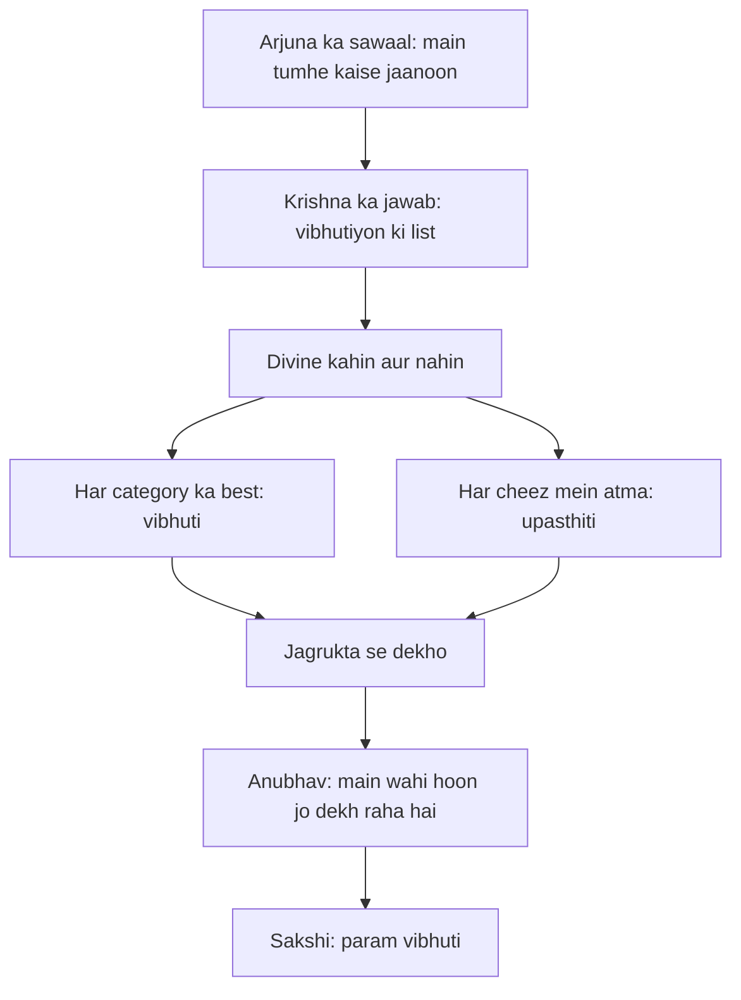

# अध्याय १०: विभूति योग — Divine kahin aur nahin, yahin har cheez mein hai

> **"Tum divine ko khojne ke liye aakash mein mat dekho — apni chai ki pyali mein dekho, apni saans mein dekho, apne aansu mein dekho. Jo har cheez mein hai, wahi sachcha hai. Vibhuti ka matlab hi yeh hai — best of everything, kyunki best mein jo chamakta hai, wahi divine hai."**
> — **ओशो**

---

Kurukshetra ka maidan, dono senaen taiyar, aur beech mein Arjuna ka rath — jahan Krishna ne is poore samvaad ki shuruaat ki thi. Ab dasvaan adhyaya aata hai. Bees varsh ke andar yeh nahi hua tha ki koi is tarah poochhta; Arjuna ka vishad, uska sawaal, aur Krishna ke uthre hue jawab — Gita isi natak ka maanch hai. Is adhyaya mein Arjuna ek aisa sawaal poochhta hai jo har sachche khojne wale ke dil mein kabhi na kabhi uthta hai: "Main tumhe kaise jaanoon? Kaise tumhe dhyan karoon?" (10.17)

Aur Krishna ka jawab — yeh jawab kisi temple mein nahi le jaata, kisi heaven mein nahi le jaata. Krishna aakash ki taraf ungli nahi uthaata; woh dharti ki taraf ungli uthaata hai — "Jo bhi srishti mein best hai, jo bhi sabse sundar hai, jo bhi sabse gehrai mein jaata hai — woh main hoon." Osho ise kya kehte hain? Osho kehte hain — yeh list koi theology nahi hai, yeh ek darpan hai. Krishna tumhe bahar nahi le ja raha; woh tumhe tumhari hi aankhon se dekhna sikha raha hai.

Osho ki drishti mein yeh adhyaya sabse krantikari hai, kyunki yahin Krishna kisi andekhe bhagvan ki baat nahi karta — woh saaf karta hai ki divine kahin aur nahin, yahin har cheez mein hai. Aur Osho ka gahra sandesh: vibhuti ko bahar dhoondhna hi kya — jab tum jagruk hote ho, jab tum sakshi bante ho, tab tum khud hi vibhuti ban jaate ho. Yehi is adhyaya ka asli utsav hai.

---

## Learning Objectives

Is chapter ko complete karne ke baad aap:

1. Vibhuti yoga ke asli sandesh ko samjhenge — divine kisi dur sthaan par nahin, har sadharan cheez mein chhipa hai
2. Krishna ke "I am" statements ko Osho ke nazaariye se padhenge — yeh naam nahin, pointers hain
3. Har category ka best ek vibhuti hai — is nazaariye ko roz ke jeevan mein lagana seekhenge
4. Shakti aur upasthiti (power vs presence) ke beech Osho ka bhed samjhenge
5. "Vibhuti Explorer" TypeScript tool ko samajh kar khud ek daily vibhuti-log bana payenge

---

## Vibhuti Yoga ka Parichay

### Kahani mein is adhyaya ka sthaan

Mahabharata ki kahani mein yeh ek anokha kshan hai. Arjuna ne Krishna ko pehle dekha ek saarthi ke roop mein, phir ek shikshak ke roop mein, phir ek mitra ke roop mein. Nau adhyayon tak Krishna ne karm, jnana, bhakti, dhyan — sab baatein kahi hain. Ab Arjuna kuch aur poochhta hai: "Krishna, yeh sab sunkar meri aankhein khul gayi hain — lekin main tumhe kaise jaanoon? Tumne kaha ki tum sab kuch ho — lekin main toh sirf ek saarthi dekhta hoon. Tumhari asli shakti kya hai?"

Yeh sawaal kisi tapasvi ka nahin — yeh ek yoddha ka sawaal hai jo ladai se pehle, aakhri pal mein, apne sabse gahre rishte ke baare mein poochhta hai. Aur Krishna is sawaal ka jawab dene ke liye koi rahasya nahin kholta — woh ek list deta hai. Vibhutiyon ki list: devon mein main Vishnu hoon, jyotishon mein surya hoon, Vedo mein Sama Veda hoon, Indriyon mein man hoon (10.21-22). Isi tarah woh ginta chala jaata hai — ped, pahaad, nadi, akhshar, kala — har category ka best.

Osho is list ko ek gehra design samajhte hain. Krishna keval bade-bade devta nahin gin raha — woh chhoti-chhoti cheezon mein bhi jaata hai: akhshar, smriti, medha, dhriti, kshama, vaak, shri, kirti (10.34). Osho kehte hain — yeh list isliye hai ki tumhe pata chale: divine sirf mandir mein nahin hai, divine tumhari yaad mein hai, tumhari buddhi mein hai, tumhare dhairya mein hai. Jab tum dhairya se kaam karte ho, tab tum divine ke aas-paas khade ho. Jab tum kisi ko kshama karte ho, tab tum divine ko jee rahe ho. Krishna ke design mein chhoti cheez bhi badi cheez ke barabar hai — kyunki har cheez mein wahi ek upasthiti hai.

### Arjuna ka sawaal — asli sawaal

Osho kehte hain — Arjuna ka sawaal poore Gita ka sabse sundar sawaal hai. Kyunki yeh sawaal jigyasa se paida nahin hua, prem se paida hua hai. Arjuna Krishna se yeh nahin poochh raha ki "tum kya ho" — woh poochh raha hai ki "main tumhe kaise jaanoon". Jaanna sirf information nahin hai; jaanna ek rishta hai. Aur Osho ka drishtikon: jab bhi koi is tarah poochhta hai — prem ke saath, jigyasa ke saath — tab hi asli dhyan shuru hota hai. Sadharan sawaal ke jawab mil jaate hain; asli sawaal jawab nahin maangta, woh anubhav maangta hai.

### Krishna ka jawab — vibhutiyon ki list

Krishna ki list ka pattern dekho — woh kahin nahin jaata. Woh kehta hai: "सर्गाणामादिरन्तश्च" — srishti ka aadi aur ant (10.32); "अक्षराणामकारोऽस्मि" — akhsharon mein main "A" hoon (10.33); "मृत्युः सर्वहरश्चाहम्" — aur haan, main mrityu hoon (10.34). Osho kehte hain — yeh list sunkar aisa lagta hai jaise Krishna kisi exhibition mein har cheez ka best dikha raha hai. Lekin dhyan se dekho: woh sirf cheezein nahin gin raha, woh tumhe dekhna sikha raha hai. Jab tum har category mein best ko dekhte ho, tab tum ek nayi jagrukta mein aate ho — wahi jagrukta dhyan hai.

| Pehlu | Traditional Reading | Osho ki Reading |
|-------|---------------------|-----------------|
| Vibhuti ka arth | Bhagvan ki alaukik shakti ka prakatikaran, chamatkaar | Har category ka best — jismein chamak hai, wahi divine hai |
| List ka uddeshya | Bhagvan ki mahima ka varnan, bhakt ko aashcharya | Ek darpan — seekhne wale ko dekhna sikhaana |
| "Main hoon" statements | Krishna ki apni divine identity ka daava | Pointers — har vyakti ke andar wahi atma hai |
| Bhakti ka aadesh | Upasana, mantra, pooja ka nirdesh | Bhaav ki upasana — feeling ke saath, belief ke bina |
| Aakhri sandesh | Krishna hi param satya hain | Sakshi bano — tabhi tum vibhuti ko pehchanoge |

---

## Key Shlokas

Is adhyaya ke 42 shlokon mein Krishna ka poora sandesh chhipa hai. In shlokon ko isi kram mein dekho — 10.8 mein udbhav, 10.10 mein upahaar, 10.20 mein upasthiti, aur 10.32-34 mein visthaar. Har shloka ek kadam hai — aur aakhri kadam tumhe wapas tumhare andar laata hai.

### Shloka 10.8

> अहं सर्वस्य प्रभवो मत्तः सर्वं प्रवर्तते।
> इति मत्वा भजन्ते मां बुधा भावसमन्विताः॥

**Transliteration:** aham sarvasya prabhavo mattaḥ sarvaṁ pravartate; iti matvā bhajante māṁ budhā bhāvasamanvitāḥ

**Arth (Hinglish):** Main sab kuch ka udbhav hoon; mujhse hi sab kuch pravartit hota hai. Yah jaankar buddhiman log bhaav se bhare hue mujhe bhajte hain.

**Osho ka drishtikon:** "Main har cheez ka udbhav hoon" — isko agar ego se suno toh yeh Krishna ka daava lagta hai. Lekin Osho kehte hain — jab tum apne andar utroge, jab tum apne astitva ke mool ko dekho ge, tab tumhe milega ki tum bhi ek udbhav ho — ek source. Aur dhyan rakho, yahan "bhajante" hai — bhajna koi ritual nahin, bhajna bhaav hai. Bhaav ka matlab hai feeling se bharna — aankhein, dil, roon-roun. Belief se nahin, bhaav se.

### Shloka 10.10

> तेषां सततयुक्तानां भजतां प्रीतिपूर्वकम्।
> ददामि बुद्धियोगं तं येन मामुपयान्ति ते॥

**Transliteration:** teṣāṁ satatayuktānāṁ bhajatāṁ prītipūrvakam; dadāmi buddhiyogaṁ taṁ yena māmupayānti te

**Arth (Hinglish):** Jo log sataat (lagataar) yukt hain aur prem ke saath bhajte hain — unhein main woh buddhi-yoga deta hoon jiske dwara woh mujh tak pahunchte hain.

**Osho ka drishtikon:** Osho is shloka ko is tarah padhte hain — divine tumhe cheezein nahin deta, samajh deta hai. Tum maango toh kuch aur maango: jagrukta maango, clarity maango. "Buddhi-yoga" ka matlab hai — ek aisi buddhi jo baahar nahin, andar dekhti hai. Aur Osho ka prem se rishta dekho: yahan "preetipoorvakam" hai — bhajan prem se hona chahiye. Prem ke bina bhajan ek khaali aadat hai. Prem ke saath bhajan ek kranti hai.

### Shloka 10.20

> अहमात्मा गुडाकेश सर्वभूताशयस्थितः।
> अहमादिश्च मध्यं च भूतानामन्त एव च॥

**Transliteration:** ahamātmā guḍākeśa sarvabhūtāśayasthitaḥ; ahamādiśca madhyaṁ ca bhūtānāmanta eva ca

**Arth (Hinglish):** He Gudakesha (nidra par vijay paane wale), main sab bhooton ke hriday mein sthit atma hoon. Main hi sab bhooton ka aadi, madhya aur ant hoon.

**Osho ka drishtikon:** Yehi is adhyaya ka sabse bada shloka hai — "aham atma" — main atma hoon, jo har praani ke bheetar betha hai. Osho kehte hain — yeh Krishna ka apna daava nahin hai; yeh har vyakti ka apna vishvasa hai jo use bhool gaya hai. Tumhare andar wahi atma hai jo mere andar hai — wahi ek, wahi sakshi. Aur "gudakesha" — Osho is par hasste hain: Arjuna woh hai jisne nidra ko jeeta — matlab ek jagruk vyakti. Aur Osho ka sandesh: jagrukta hi atma ko dekhne ki aankh hai. Nidra mein sapne aate hain; jagrukta mein satya dikhta hai.

### Shloka 10.32

> सर्गाणामादिरन्तश्च मध्यं चैवाहमर्जुन।
> अध्यात्मविद्या विद्यानां वादः प्रवदतामहम्॥

**Transliteration:** sargāṇāmādirantaśca madhyaṁ caivāhamarjuna; adhyātmavidyā vidyānāṁ vādaḥ pravadatāmaham

**Arth (Hinglish):** He Arjuna, main hi srishtiyon ka aadi, ant aur madhya hoon. Vidyayon mein main adhyatma-vidya hoon; vivad karne walon mein main vivek-poorak vaad hoon.

**Osho ka drishtikon:** Is samuh (10.32-34) mein Krishna vibhutiyon ki chhanti karta hai — har category ka best. Osho kehte hain — notice karo ki Krishna ne "sabse bada ped" nahin kaha; kaha "ashwattha sab vrikshon mein" — lekin zyada gehri baat: "aadi, madhya, ant". Divine sirf sabse bada nahin hai — divine har shuruaat mein hai, har beech mein hai, har ant mein hai. Aur "adhyatma-vidya" — sabse uttam vidya wahi hai jo apne andar dekhe. Isi samuh mein aage Krishna kehta hai: devon mein main Indra hoon (10.22) aur mantron mein pranava (7.8) — kyunki unke bina koi shuruaat nahin hoti.

### Shloka 10.33

> अक्षराणामकारोऽस्मि द्वन्द्वः सामासिकस्य च।
> अहमेवाक्षयः कालो धाताहं विश्वतोमुखः॥

**Transliteration:** akṣarāṇāmakāro'smi dvandvaḥ sāmāsikasya ca; ahamevākṣayaḥ kālo dhātāhaṁ viśvatomukhaḥ

**Arth (Hinglish):** Akhsharon mein main "A" (akaar) hoon; samasik shabdon mein dvandva-samas hoon. Main hi akshay kaal hoon; main hi viswatomukh dhaata hoon.

**Osho ka drishtikon:** Osho kehte hain — Krishna keh raha hai: main akhsharon ka pehla akhshar hoon. Socho — har shabda, har mantra, har geet ki shuruaat "A" se hoti hai. Shuruaat mein hi poora srishti chhipa hai. Aur "akshay kaal" — jo kabhi khatam nahin hota, wohi akshar hai. Osho isko is tarah samjhate hain: jab tum kisi bhi cheez ki shuruaat ko poore dhyan se dekhte ho, jab tum kisi bhi samay ko akshay drishti se dekhte ho — tab tumhe usme divine dikhne lagta hai. Yeh koi chamatkaar nahin; yeh dekhne ki nayi vidhi hai.

### Shloka 10.34

> मृत्युः सर्वहरश्चाहमुद्भवश्च भविष्यताम्।
> कीर्तिः श्रीर्वाक् च नारीणां स्मृतिर्मेधा धृतिः क्षमा॥

**Transliteration:** mṛtyuḥ sarvaharaścāhamudbhavaśca bhaviṣyatām; kīrtiḥ śrīrvāk ca nārīṇāṁ smṛtirmedhā dhṛtiḥ kṣamā

**Arth (Hinglish):** Main hi mrityu hoon jo sab kuch har leta hai, aur jo aane wale hain unka udbhav bhi main hi hoon. Naariyon mein main kirti, shri, vaak, smriti, medha, dhriti aur kshama hoon.

**Osho ka drishtikon:** Osho is shloka ko is adhyaya ka sabse gehara shloka maante hain. Krishna kahe hi nahin "main devta hoon" — kehta hai "main mrityu hoon". Osho kehte hain — mrityu sabse badi vibhuti hai, kyunki woh tumhe yaad dilati hai ki tum anant ho. Jo log mrityu ko bhool jaate hain, woh bhi bhool jaate hain. Aur Osho is baat ko aur gahrai se dekhte hain — naariyon mein Krishna ki vibhutiyan gun hain: kirti, shri, vaak, smriti, medha, dhriti, kshama. Shakti ke roop nahin — gun ke roop. Divine stree mein bhi wahi chamakta hai jo purush mein — aur yeh chamak gunon ki hai, roopon ki nahin.

---

## Divine yahin hai — Osho ki gahrai mein

### Vibhuti kya hai — shakti ya upasthiti?

Osho kehte hain — "vibhuti" shabd ko sunte hi log sochte hain: koi alaukik shakti, koi siddhi, koi chamatkaar. Lekin Krishna ki list dekho — ped, nadi, akhshar, smriti, kshama. Yahan koi chamatkaar nahin hai. Osho kehte hain — vibhuti ka matlab hai "presence", upasthiti. Jab tum kisi cheez mein itne gehre ho jaate ho ki woh cheez tumhare saath ho jaati hai, tab woh vibhuti ban jaati hai. Ek kavi jab apne geet mein gehrai se beh jaata hai, tab shabda vibhuti ban jaate hain. Ek doctor jab mrig se prem se chhoota hai, tab uska haath vibhuti ban jaata hai. Shakti ko pakadne ki koshish karo — woh tumhe nashtha kar degi. Upasthiti ko jee lo — woh tumhe khud bana degi.

Osho yahan ek darpan ka drishtanta dete hain: jaise saaf darpan mein tumhara poora chehra dikhta hai, waise hi saaf man mein divine ka poora chehra dikhta hai. Vibhuti ko bahar dhoondhne se pehle apne darpan ko saaf karo — woh darpan tumhara man hai. Kshama se saaf, shanti se saaf, jagrukta se saaf. Krishna ki list mein bade-bade naam hain, lekin Osho kehte hain — asli saaf-darpan wali cheez tumhare andar hai: wahi tumhari param vibhuti hai.

### "I am" statements — pointers, bade daave nahin

Krishna ke "aham asmi" — "main hoon" — kehne wale statements ko Osho ek alag roshni mein rakhte hain. Osho kehte hain — kisi bhi statement ko literal mat lena; use ek ungli ki tarah dekho jo chand ki taraf uthi hai. Ungli ko dekhoge toh chand kho jaayega. Krishna keh raha hai: "aham atma" — main atma hoon — iska matlab yeh nahin ki sirf Krishna atma hai; iska matlab hai ki tum jahan bhi atma dekho, wahan main hoon. Jab tum apne andar woh shant, witness-jaise bhaav ko dekhte ho — jab tum apne vicharon ko dekh rahe hote ho, apne gusse ko dekh rahe hote ho — tab wahan kaun hai jo dekh raha hai? Wahi "I am" hai. Osho ka nishkarsh: Krishna ke saare "I am" statements tumhare apne andar ke "I am" ke pointers hain.

Aur Osho ise is tarah aage le jaate hain: jab tum "main hoon" ko ghor kar dekhte ho — bina naam ke, bina pehchaan ke, bina kahani ke — tab tum usi upasthiti ko dekhte ho jise Krishna vibhuti keh raha hai. "Main hoon" tumhare paas hamesha hai; woh kabhi nahin jaata. Na sapne mein jaata hai, na neend mein, na gusse mein. Woh hi tumhara asli chehra hai — aur wohi sabke andar ek hai. Isliye Krishna ke statements ko bahar ki taraf mat dekho; andar ki taraf dekho — wahan tumhe wahi milega.

| Krishna ka statement | Traditional arth | Osho ka andar-ke-pointer |
|----------------------|------------------|--------------------------|
| अहं सर्वस्य प्रभवः | Krishna hi srishti ka karta hai | Tumhare andar bhi ek source hai — wahi upasthiti hai |
| अहमात्मा सर्वभूताशयस्थितः | Krishna sabke hriday mein atma roop se hai | Har vyakti ke andar wahi ek atma hai — bhed khaali hai |
| अहमेवाक्षयः कालः | Krishna hi akshay kaal hai | Samay ki drishti hi akshay hai — isee drishti ko jagrukta kehte hain |
| मृत्युः सर्वहरश्चाहम् | Krishna hi mrityu hai | Mrityu ki yaad hi tumhe anant se jodti hai |
| अध्यात्मविद्या विद्यानाम् | Krishna hi adhyatma-vidya hai | Sabse uttam vidya wahi hai jo andar dekhti hai |

### Sakshi hi param vibhuti hai

Osho is adhyaya ka aakhri sandesh kya maante hain? Woh kehte hain — vibhutiyon ki list koi ant nahin hai; ant toh tab aata hai jab tum khud hi vibhuti ban jaate ho. Aur uske liye ek hi raasta hai — sakshi banna, witnessing. Jab tum roz ke jeevan mein ek cheez ko — chai ki pyali, ek patta, apne bacche ka haath — poore dhyan se dekhte ho, bina soch-samajh ke, bina label ke, tab tum usme wahi chamak dekhte ho jise Krishna vibhuti keh raha hai. Osho kehte hain — Krishna ne list de kar tumhe dekhna nahin sikhaya; usne tumhe apni aankh de kar dikhaya ki kaise dekho. Wahi aankh dhyan hai.

### Roz ke jeevan mein vibhuti — teen jagah

Osho is adhyaya ko sirf padhne ke liye nahin, jee ne ke liye dete hain. Woh kehte hain — vibhuti dhoondhne ke liye kisi Himalayan ki zaroorat nahin hai; teen jagah dekho. Pehli: apne kaam mein — jab tum koi bhi kaam poore dhyan se karte ho, chahe woh roti belna ho ya code likhna, us kaam mein ek chamak aati hai — wahi chamak vibhuti hai. Doosri: apne sambandhon mein — jab tum kisi ki baat bina judge kiye sunte ho, tab tumhari sunai hi vibhuti ban jaati hai. Teesri: apne andar — jab tum gusse, darr ya khushi ko dekhte ho, bina usme beh ke, tab tumhari jagrukta hi vibhuti ban jaati hai. Osho kehte hain — Krishna ne 42 shlokon mein itni lambi list di, par asli list toh tumhari hai: har din, har moment, tumhari apni vibhuti.

Aur isi teen-jagah wali practice ko Osho "chhota vibhuti-dhyan" kehte hain — kyunki ismein na aasan hai, na kathin; sirf dekhna hai. Din mein 3 baar ruko: ek baar kaam ke beech, ek baar kisi se baat karte hue, ek baar akele. Har baar 30 second ke liye poochho — "is moment mein kaun si chamak hai?" Jawab chhota ho sakta hai — ek rangi, ek awaaz, ek ehsaas. Par Osho kehte hain — yeh chhoti chamak hi usi roshni ka tukda hai jise Krishna 42 shlokon mein gin raha hai.

### Vibhuti aur dhyan — ek saath chalta hua maarg



Is flow mein Gita ka poora is adhyaya ka kram chhipa hai: sawaal se jawab tak, jawab se jagrukta tak, jagrukta se anubhav tak. Osho kehte hain — is kram ko yaad rakhna hi vibhuti yoga ki sadhna hai. Roz sawaal uthao — "is moment mein divine kahan hai?" — aur jawab kabhi bahar nahin milega, hamesha andar milega: dekhne wali jagrukta hi divine hai. List sirf shuru karti hai; asli yatra tumhari jagrukta se hoti hai.

---

## TypeScript Implementation

```typescript
/**
 * Geeta Darshan — Adhyaya 10: Vibhuti Yoga
 * Vibhuti Explorer: roz ke jeevan mein chhipe divine ko
 * dhoondhne ka ek chhota instrument.
 * Har category ka best — wahin vibhuti hai.
 * Shloka 10.20: aham atma — har vibhuti ke peeche
 * wahi ek upasthiti hai.
 * Chalane ke liye: npx ts-node 10-vibhuti-explorer.ts
 */

interface VibhutiEntry {
  category: string;
  item: string;
  reason: string;
  oshoHint: string;
}

interface VibhutiLogEntry {
  date: string;
  moment: string;
  category: string;
  item: string;
  oshoNote: string;
}

const MODERN_VIBHUTIS: VibhutiEntry[] = [
  {
    category: 'Energies',
    item: 'Light',
    reason: 'Har roshni ka mool — surya se diye tak',
    oshoHint: 'Andhere mein diya jalao — wahin divine hai, kahin aur nahin'
  },
  {
    category: 'Expressions',
    item: 'Speech',
    reason: 'Jo vaak hai wahi srishti ka darwaza hai',
    oshoHint: 'Aaj jo bhi bolo — usme adhyatma-vidya ki jhalak do'
  },
  {
    category: 'Mind',
    item: 'Attention',
    reason: 'Jahan dhyan hai wahan chetna hai',
    oshoHint: 'Ek minute ke liye poora dhyan — wahin vibhuti mil jayegi'
  },
  {
    category: 'Nature',
    item: 'River',
    reason: 'Behta hua jeevan — rukta nahin, saaf karta hai',
    oshoHint: 'Paani ko dekho — uska bahav hi uski vibhuti hai'
  },
  {
    category: 'Human Qualities',
    item: 'Kshama',
    reason: 'Sahne ki shakti — sabse gehri shakti',
    oshoHint: 'Aaj kisi ko maaf kar do — wahi vibhuti-darshan hai'
  },
  {
    category: 'Technology',
    item: 'Open Source',
    reason: 'Jo sabko de deta hai — wahi vibhuti hai',
    oshoHint: 'Apna kuch bhi share karo — vibhuti badhegi'
  }
];

class VibhutiExplorer {
  private vibhutis: VibhutiEntry[];
  private log: VibhutiLogEntry[] = [];

  constructor(vibhutis: VibhutiEntry[]) {
    this.vibhutis = vibhutis;
  }

  findVibhuti(moment: string): VibhutiEntry {
    const index = moment.length % this.vibhutis.length;
    return this.vibhutis[index];
  }

  dailyPrompt(): string {
    const index = new Date().getDate() % this.vibhutis.length;
    const v = this.vibhutis[index];
    return 'Aaj ki vibhuti: ' + v.category + ' — ' + v.item + '. ' + v.oshoHint;
  }

  logVibhuti(date: string, moment: string, oshoNote: string): void {
    const entry = this.findVibhuti(moment);
    this.log.push({ date, moment, category: entry.category, item: entry.item, oshoNote });
  }

  showLog(): void {
    if (this.log.length === 0) {
      console.log('Abhi koi vibhuti log nahin hui — aaj se shuru karo.');
      return;
    }
    for (const entry of this.log) {
      console.log(entry.date + ' | ' + entry.moment + ' | ' + entry.category + ': ' + entry.item);
      console.log('   Osho note: ' + entry.oshoNote);
    }
  }

  summary(): string {
    return 'Total log: ' + this.log.length + ' vibhutiyan. ' +
      'Shloka 10.20: aham atma — har vibhuti ke peeche wahi upasthiti hai.';
  }
}

function runDemo(): void {
  const explorer = new VibhutiExplorer(MODERN_VIBHUTIS);
  console.log('=== Vibhuti Explorer — Adhyaya 10 ===');
  console.log(explorer.dailyPrompt());
  console.log('');
  console.log('Ek sadharan moment lo: subah ki chai');
  const v = explorer.findVibhuti('subah ki chai');
  console.log('Us moment ki vibhuti: ' + v.category + ' — ' + v.item);
  console.log('Kyun: ' + v.reason);
  console.log('');
  explorer.logVibhuti('2026-08-19', 'subah ki chai', 'Chai mein bhi wahi atma hai jo mere andar hai.');
  explorer.logVibhuti('2026-08-19', 'dost ki baat', 'Sunna hi prem hai; prem hi vibhuti hai.');
  explorer.showLog();
  console.log('');
  console.log(explorer.summary());
}

runDemo();
```

---

## Summary

| Bindu | Saar |
|-------|------|
| Vibhuti ka asli arth | Divine kahin dur nahin — har cheez ka best, har category ka chamakta hua — wahi divine hai |
| "I am" statements | Naam nahin, pointers — Krishna ke andar wahi atma jo tumhare andar hai |
| 10.20 ka sandesh | Aham atma — atma har praani ke hriday mein ek hai |
| 10.32-34 ka pattern | Aadi, madhya, ant — divine shuruaat aur ant dono mein hai |
| Param vibhuti | Sakshi — jagrukta se dekhna hi sabse badi vibhuti hai |
| Krishna ka design | Chhoti cheez bhi badi ke barabar — kyunki har cheez mein wahi upasthiti hai |

---

## Contradictions

- **Vibhuti = divine power:** Traditional reading vibhuti ko alaukik shakti maanti hai — Osho kehte hain yeh power nahin, presence hai. Shakti dhundhte hue tum divine ko pakad nahin sakte; presence jee kar tum divine ban jaate ho.
- **"Main hoon" ka daava:** Traditional reading Krishna ke "I am" statements ko unki akele ki divine identity maanti hai — Osho kehte hain yeh har vyakti ka apna satya hai; Krishna keval yaad dila raha hai.
- **Bhakti ka aadesh:** Traditional reading ise pooja-path, temple, ritual ki shiksha maanti hai — Osho kehte hain bhajna bhaav se hota hai, belief se nahin; ritual ke bina bhi bhajan ho sakta hai.
- **List ka uddeshya:** Traditional reading maanti hai ki list Krishna ki mahima dikhane ke liye hai — Osho kehte hain yeh seekhne wale ka darpan hai; Arjuna ko khud ko dekhna hai, Krishna ko nahin.
- **Mrityu ek vibhuti:** Yeh dharmik parampra mein ashubh hai — Osho ise shubh maante hain: mrityu ki yaad anant ki yaad dilati hai.

---

## Open Questions

- Agar divine har cheez ka best hai, toh kya jo log "best" nahin hain woh divine se door hain? Ya best ko dekhne wali aankh hi divine hai?
- Krishna ne list kyun di — kya yeh seekhne wale ke man ko santusht karne ka ek taktiki (strategic) khel tha?
- "Aham atma" — jab tum apne andar atma ko dekhte ho, toh wahan Krishna hai ya koi aur? Kya naamon ka koi arth bhi hai?
- Vibhuti ko daily practice mein lagana — kya yeh dhyan ka raasta hai ya sirf ek sundar idea?

---

## Practical Takeaways

| Situation | Gita shloka | Osho's lens | Action |
|-----------|-------------|-------------|--------|
| Subah uthkar sabse pehla kaam | 10.20 (aham atma) | Uthne se pehle ek saans dekho — wahin atma hai | 5 saanson tak apni saans ko dekho |
| Kaam mein boring moment | 10.32 (aadi, madhya, ant) | Har kaam ka shuruaat aur ant divine hai | Kaam ki shuruaat mein 10 second ka poora dhyan do |
| Kisi se narazgi | 10.34 (kshama) | Kshama vibhuti hai — gunon mein divine chamakta hai | Aaj ek naraazgi chhod do |
| "Divine kahaan hai" ka sawaal | 10.8 (aham sarvasya prabhavah) | Har cheez ka udbhav divine hai | Ek ped ko 2 minute tak bina label ke dekho |
| Raat ko sote waqt | 10.33 (akshay kaal) | Samay akshay hai — chinta samay ki nahin, man ki hai | So jaane se pehle din ki ek vibhuti yaad karo |

---

## Chapter Quiz

### Question 1

Osho ke nazaariye se vibhuti ka asli matlab kya hai?

a) Koi alaukik chamatkaar ya siddhi
b) Har category ka best — jismein chamak hai, wahi divine hai
c) Sirf devtaon ki shakti
d) Kisi mantra ka jaap

<details><summary>Answer</summary>
**b) Har category ka best — jismein chamak hai, wahi divine hai** — Osho kehte hain vibhuti power nahin, presence hai; divine kahin aur nahin, yahin har cheez mein hai.
</details>

### Question 2

Arjuna ka sawaal (10.17) kis bhaav se paida hua tha?

a) Jigyasa se — jaankari lene ki ichha se
b) Prem se — "main tumhe kaise jaanoon" ke rishte wale bhaav se
c) Dar se
d) Pratispardha se

<details><summary>Answer</summary>
**b) Prem se** — Osho kehte hain asli sawaal jawab nahin maangta, anubhav maangta hai; Arjuna ka sawaal prem se paida hua tha.
</details>

### Question 3

Shloka 10.20 mein "aham atma" ka Osho kya arth maante hain?

a) Sirf Krishna atma hai, baaki sab nahin
b) Atma ek hi hai — har praani ke hriday mein, tumhare andar bhi
c) Atma keval devtaon mein hoti hai
d) Atma ka koi arth nahin

<details><summary>Answer</summary>
**b) Atma ek hi hai** — Osho kehte hain yeh Krishna ka daava nahin, har vyakti ka apna satya hai jo use bhool gaya hai.
</details>

### Question 4

"Gudakesha" (10.20) ka Osho ke anusaar kya sanket hai?

a) Arjuna ke baalon ki rashi
b) Nidra par vijay paane wala — jagruk vyakti
c) Ek rakshas ka naam
d) Gud ki ek khasi

<details><summary>Answer</summary>
**b) Nidra par vijay paane wala — jagruk vyakti** — Osho kehte hain jagrukta hi atma ko dekhne ki aankh hai; nidra mein sapne, jagrukta mein satya.
</details>

### Question 5

Krishna ne vibhutiyon ki list mein kya nahin kaha — Osho ki drishti se?

a) Divine kisi door ke sthaan par hai
b) Har category ka best divine hai
c) Aadi, madhya aur ant divine mein hain
d) Mrityu bhi divine hai

<details><summary>Answer</summary>
**a) Divine kisi door ke sthaan par hai** — Osho kehte hain Krishna ki poori list yahin ki hai: ped, nadi, akhshar, kshama — divine yahin har cheez mein hai.
</details>

### Question 6

10.32 mein Krishna "vidyayon mein adhyatma-vidya" ko vibhuti kyun kehte hain?

a) Kyunki woh sabse kathin vidya hai
b) Kyunki woh apne andar dekhna sikhata hai — yahi sabse uttam vidya hai
c) Kyunki woh sabse purani vidya hai
d) Kyunki usme jadui mantra hain

<details><summary>Answer</summary>
**b) Kyunki woh apne andar dekhna sikhata hai** — Osho kehte hain sabse uttam vidya wahi hai jo tumhe bahar se andar le jaaye.
</details>

### Question 7

10.33 mein "aksharon mein akaar" ka Osho kya sandesh dete hain?

a) Alphabet A ka mahatva
b) Har shuruaat mein poora srishti chhipa hai — shuruaat hi divine hai
c) Sirf Sanskrit akhshar divine hain
d) Akhshar likhna band kar do

<details><summary>Answer</summary>
**b) Har shuruaat mein poora srishti chhipa hai** — Osho kehte hain jab tum kisi bhi shuruaat ko poore dhyan se dekhte ho, tab usme divine dikhne lagta hai.
</details>

### Question 8

Osho mrityu (10.34) ko vibhuti kyun maante hain?

a) Kyunki mrityu se darna chahiye
b) Kyunki mrityu ki yaad tumhe anant ki yaad dilati hai
c) Kyunki mrityu khel ka hissa hai
d) Kyunki mrityu se bachna chahiye

<details><summary>Answer</summary>
**b) Kyunki mrityu ki yaad tumhe anant ki yaad dilati hai** — Osho kehte hain jo log mrityu ko bhool jaate hain, woh jeevan ko bhi bhool jaate hain.
</details>

### Question 9

Osho ke anusaar Krishna ke "I am" statements ko kaise padhna chahiye?

a) Literally — Krishna ki akele ki mahima
b) Ungli ki tarah jo chand ki taraf uthi hai — pointers, bade daave nahin
c) Srijanshil fiction ki tarah
d) Sirf shloka yaad karne ke liye

<details><summary>Answer</summary>
**b) Pointers** — Osho kehte hain Krishna ke saare "I am" statements tumhare apne andar ke "I am" ke pointers hain.
</details>

### Question 10

Vibhuti Explorer ka "dailyPrompt" kya karta hai?

a) Roz ki vibhuti category ko randomly select karke ek oshoHint deta hai
b) Vibhutiyon ki list delete karta hai
c) Shlokon ka jaap karta hai
d) Internet se vibhutiyan download karta hai

<details><summary>Answer</summary>
**a) Roz ki vibhuti category ko randomly select karke ek oshoHint deta hai** — yeh tool din bhar mein ek vibhuti ko jagrukta se dekhne ki practice deta hai.
</details>

---

## Exercises

1. **5-min daily practice:** Roz subah 5 minute kisi ek sadharan cheez ko — chai, ped, haath — bina label ke dekho. Jo chamak dikhe, use apni diary mein likho. Isse tum Vibhuti Explorer ke "log" ko real jeevan mein bana rahe ho.

2. **Vibhuti journaling:** Har category ka best likho — apne jeevan ke 10 categories: dost, khaana, kaam, music, nature, technology, family, books, sports, silence. Har category mein best kya hai? Usse 5 minute dhyan se dekho.

3. **"I am" meditation:** 15 minute ke liye ek saaf kagaz par "Main kaun hoon?" likh kar baitho. Bina jawab diye, bas is sawaal ko apne andar baithne do. Osho kehte hain — yeh sawaal hi dhyan hai.

4. **Mrit-yu yaad practice:** Din mein ek baar 2 minute socho — "Mera ant aayega, mera samay akshay hai." Darr ke bina, jagrukta ke saath. Dekho ki yeh yaad tumhe kaisa banati hai.

5. **Vibhuti Explorer ka extension:** Diye gaye TypeScript code mein apni 4 nayi vibhutiyan add karo — apne jeevan se. Har ek ke liye oshoHint likho. Code ko chala kar dekho ki dailyPrompt kaise badalta hai.

6. **Kshama practice:** 10.34 ki "kshama" vibhuti ko aaj jee lo — kisi ko phone karke ya personally maaf kar do. Us din ka anubhav 5 line mein likho.

---

## Further Reading

- Osho, *Gita Darshan* — Vol 3 (Vibhuti Yoga par sampoorn vyaakhya), Bombay ke Woodlands apartment ke pravachan, 1973-76
- Osho, *Krishna: The Man and His Philosophy* — Krishna ke vyaktitva par Osho ka alag drishtikon
- Bhagavad Gita (Gita Press, Gorakhpur) — Shlok 10.1 se 10.42 tak ka mool path
- Swami Sivananda, *Bhagavad Gita: Commentary* — traditional reading ko samajhne ke liye
- Aldous Huxley, *The Perennial Philosophy* — "divine har cheez mein hai" ke universal darshan par
