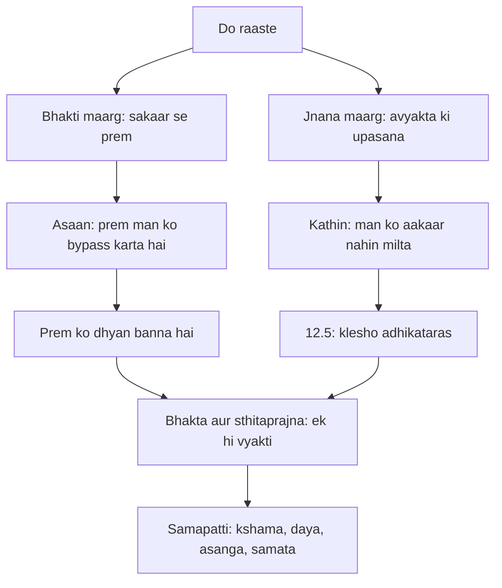

# अध्याय १२: भक्ति योग — Prem sabse chhota raasta hai

> **"Bhakti koi dharam nahin hai — bhakti prem hai. Aur prem sabse chhota raasta hai kyunki woh man ko bypass kar deta hai. Jnani ko vivek ke hazaaron chalne padte hain; bhakta ko bas ek chhaang bharne ki zaroorat hoti hai. Lekin yaad rakhna: prem ko dhyan banna hai, sentimentality nahin."**
> — **ओशो**

---

Gita ki kahani mein ab sabse chhota adhyaya aata hai — sirf 20 shlokon ka — aur Osho kehte hain, sabse uncha. Vishvarupa ke bhayankar darshan ke baad Arjuna ka man kaanp raha hai; woh ab sab kuch dekh chuka hai. Ab uske man mein ek aakhri sawaal uthta hai: "Jo log tumhe (sakaar) bhajte hain aur jo log avyakta (niraakaar) ki upasana karte hain — in dono mein se kaun yog mein adhik siddh hai?" (12.1). Ek saadhaaran adhyayon ka aakhri pehlu — aur Krishna ka jawab: jo mujhe shraddha se bhajte hain, woh yuktatam hain.

Osho is adhyaya ko "Gita ka hriday" kehte hain. Kyonki yahan Krishna koi nayi technique nahin deta, koi naya karma-yog nahin sikhata — woh bas ek baat kehta hai: prem se upasana karo. Osho ke nazaariye se yeh Gita ka sabse bada sandesh hai — sab kuch sunne ke baad, sab kuch dekhe ke baad, aakhri baat prem hai. Bhakti koi bhaag-daud nahin hai; bhakti wapas aake ghar mein baith jaana hai — apne dil mein, apne astitva mein.

Osho ka drishtikon yahan ek gehra twist deta hai: adhyay 2 ka sthitaprajna aur adhyay 12 ka bhakta — Osho kehte hain — dono ek hi vyakti hain. Jo jnana se shant hua, woh prem se pighal gaya. Koi virodh nahin hai. Aur Osho ki chetavani: prem sentimentality nahin ban jana chahiye — prem meditation banna chahiye. Temple ka dhoom-dhaam, rote-bahate bhakti — woh prem nahin, woh bhaavna ka khel hai. Asli bhakti woh hai jo tumhe shant kare, jagruk kare, aur tumhe sab praaniyon se jode.

---

## Learning Objectives

Is chapter ko complete karne ke baad aap:

1. Bhakti ko Osho ke nazaariye se samjhenge — prem ka raasta, koi ritual nahin
2. Adhyay 2 ka sthitaprajna aur adhyay 12 ka bhakta ek hi vyakti kyun hain — yeh milan samjhenge
3. 12.5 ka sandesh jaanenge — avyakta ka raasta kathin kyon hai, aur prem ka raasta chhota kyon
4. Prem ko dhyan banane ka fark samjhenge — sentimentality vs meditation
5. "Bhakti-Jnana Path Comparator" TypeScript tool se apne man ka raasta pehchanenge

---

## Bhakti Yoga ka Parichay

### Kahani mein is adhyaya ka sthaan

Kahani ka kram dekho: Arjuna ne vishvarupa dekha, darr se kaanpa, Krishna ne use shaant kiya, aur phir Arjuna wapas apne sawaal par aa jaata hai. Yeh adhyaya Gita ka aakhri "shanti-ka-baad ka sawaal" hai. Ab Arjuna ladne ke liye taiyar hai — lekin ek baat aur jaanna chahta hai: "Kaun sa raasta behtar hai — sakaar ki upasana ya niraakaar ki?" Yeh sawaal kisi theoretical logician ka nahin hai; yeh ek aise vyakti ka sawaal hai jo ab chalna chahta hai aur bas ek rasta chunna chahta hai.

Krishna ka jawab chhota hai — poora adhyaya sirf 20 shlokon ka — lekin jawab mein pura Gita ka sar hai: shraddha se prem karo (12.2), man ko mujhmein lagao (12.2), aur woh bhakta kaisa hai — 12.13-14 mein uska poora chitra. Osho kehte hain — Gita ke lekhak ne is adhyaya ko chhota rakha hai kyunki prem lambi baat nahin hai. Prem ek sandesh hai, ek sparsha hai — woh lambi vyakhya maangta hi nahin.

### Chhota adhyaya, bada sandesh

Gita ke 18 adhyayon mein se yeh sabse chhota hai — sirf 20 shlok. Osho kehte hain — ismein Gita ka apna design chhipa hai: jitna gahra satya, utna kam shabd. Vishvarupa dekhne ke liye 55 shlok lage; prem ke baare mein sirf 20 kaafi the. Osho kehte hain — prem ko lambi vyakhya nahin chahiye; prem ko sirf jee nahi sakte ho toh koi shabd kaam nahin aayega. Isliye is adhyaya ko padhte waqt ginti mat karo — ruko, aur apne dil mein dekho ki kya tum is chhote se adhyaya ka koi ek gun aaj jee sakte ho.

Aur Osho is baat par jore dete hain: yeh adhyaya chhota isliye hai ki iska sandesh har kisi ke liye hai. Gita ke doosre adhyaya kisi vishesh buddhi ke liye hain — is adhyaya ka darwaza sabke liye khula hai. Bachcha bhi prem kar sakta hai, buddha bhi; ameer bhi, gareeb bhi. Isliye Krishna ne is adhyaya ko sabke baithne ki jagah banaya — Gita ka aakhri rasta sabke liye hai.

### Arjuna ka aakhri sawaal — sakaar ya niraakaar?

Arjuna ka sawaal (12.1) bada hi insaani sawaal hai. Duniya bhar ke dharmon mein yeh ladai chalti hai: murti-pooja vs niraakaar upasana. Osho kehte hain — yeh ladai bekaar ki hai, kyunki sakaar aur niraakaar ek hi satya ke do chehre hain. Lekin Krishna ek saaf jawab deta hai: sakaar ka raasta behtar hai — kyunki niraakaar ko man samajh hi nahin sakta (12.5). Osho ise is tarah samjhate hain: man ko ek aakaar chahiye, ek bridge chahiye. Prem ko woh bridge mil jaata hai — kisi ke roop mein, kisi ke naam mein, kisi ke sangeet mein. Avyakta ka raasta kathin hai kyunki wahan koi pakad nahin hai — aur man bina pakad ke giro jaata hai.

### Krishna ka jawab — prem hi upasana hai

Krishna ka jawab koi aadesh nahin hai — woh ek varnan hai: "मय्यावेश्य मनो ये मां नित्ययुक्ता उपासते" — jo man ko mujh mein lagaa kar, nitya yukt ho kar, shraddha ke saath mujhe bhajte hain — woh yuktatam hain (12.2). Osho kehte hain — yahan "mujh mein" kisi vyakti ka matlab nahin hai; "mujh mein" ka matlab hai us presence mein jo tumhare andar hai aur jo har cheez mein hai. Aur uske baad Krishna bhakta ka chitra deta hai — advesta, maitra, karuna, nirmama, nirahankara (12.13-14) — Osho kehte hain — yeh chitra sun kar aisa lagta hai jaise adhyay 2 ka sthitaprajna phir se aa gaya hai. Kyunki wahi hai.

### Krishna ka bhakta-chitra — 12.13-19 ka visthaar

Krishna is adhyaya mein bhakta ka ek poora chitra banata hai — 12.13 se 12.19 tak saath shlok. Osho ise ek portrait ki tarah samjhaate hain: pehle chehra — advesta, maitra, karuna (12.13); phir shakti — nirmama, nirahankara, kshama (12.13); phir sthiti — santusht, sanyami, dridh nishchay (12.14); aur phir roz ka jeevan — jispar duniya ka bhaar nahin padta, jo na dukh mein beh jaata hai na sukh mein (12.15-19). Osho kehte hain — dhyan se dekho: is portrait mein koi bhagvan ki photo nahin hai, koi temple nahin hai, koi mantra nahin hai. Sirf ek insaan hai jo jeevan ko is tarah jee raha hai ki divine usme dikhta hai. Yahi bhakti ka asli roop hai — aur yehi is adhyaya ka sabse bada aashcharya hai: chhota sa adhyaya, aur uska nishkarsh itna bada.

Aur Osho is portrait ka ek aur kona dekhte hain: yeh bhakta koi alag duniya ka prani nahin hai — woh tumhara padosi ho sakta hai. Woh roz ka kaam karta hai, woh roz ke rishte jee ta hai — sirf ek fark hai: uske andar koi vair nahin hai, koi "mera" ka bhaar nahin hai, koi ahankaar nahin hai. Osho kehte hain — bhakti ko bahar dhoondhne ki zaroorat nahin; apne aas-paas dekho, aur un logon ko pehchano jo bina shout kiye santusht hain. Wohi is adhyaya ke asli bhakt hain.

| Pehlu | Traditional Reading | Osho ki Reading |
|-------|---------------------|-----------------|
| Bhakti ka arth | Bhagvan ki pooja, ritual, temple, mantra | Prem — man ko bypass karne wala raasta |
| Sakaar vs niraakaar | Do alag raaste — ek behtar | Ek hi satya ke do chehre; man ko bridge chahiye |
| Bhakta ka lakshan | Bhagvan ka prashansa-paath | Stithaprajna hi bhakta hai — adhyay 2 aur 12 milte hain |
| Prem ka khatra | Koi khatra nahin — bhakti hi sab kuch | Sentimentality — bhaav mein bahna bhakti nahin |
| Aakhri sandesh | Bhagvan ko priya bhakta | Prem ko dhyan banna hai — tabhi bhakti poori hai |

---

## Key Shlokas

### Shloka 12.2

> मय्यावेश्य मनो ये मां नित्ययुक्ता उपासते।
> श्रद्धया परयोपेतास्ते मे युक्ततमा मताः॥

**Transliteration:** mayyāveśya mano ye māṁ nityayuktā upāsate; śraddhayā parayopetās te me yuktatamā matāḥ

**Arth (Hinglish):** Jo log man ko mujh mein lagaa kar, nitya yukt ho kar, param shraddha ke saath mujhe bhajte hain — mere vichar se wahi yuktatam hain.

**Osho ka drishtikon:** "Man ko mujh mein lagao" — Osho kehte hain — yahan "mujh" koi vyakti nahin hai; woh presence hai, woh atma hai. Aur "shraddha" — shraddha belief nahin hai, shraddha trust hai. Belief toh doosron se utha lete ho; trust tumhara apna anubhav hota hai. Osho is shloka mein Gita ka saar dekhte hain: koi technique nahin, koi sadhna-vidhi nahin — bas ek baat: prem se bhar jao, aur woh prem hi upasana ban jaayegi.

### Shloka 12.5

> क्लेशोऽधिकतरस्तेषामव्यक्तासक्तचेतसाम्।
> अव्यक्ता हि गतिर्दुःखं देहवद्भिरवाप्यते॥

**Transliteration:** kleśo'dhikataras teṣām avyaktāsaktacetasām; avyaktā hi gatir duḥkhaṁ dehavadbhir avāpyate

**Arth (Hinglish):** Jin manon ki aasakti avyakta mein hai, unhein adhik klesh (dukh) hota hai. Avyakta gati ko dehdhari log dukh se paate hain.

**Osho ka drishtikon:** Osho kehte hain — yeh shloka bada insaaf wala hai. Niraakaar upasana bhagvan ke liye sahi ho sakti hai, par tumhare liye nahin — kyunki tumhare paas ek man hai jo aakaar maangta hai. Man kisi cheez ko pakadne ke liye bana hai; niraakaar ko pakad nahin sakta. Isliye Krishna ka jawab insaaf wala hai: prem ke roop mein, kisi sakaar mein — wahan man ko pakad milti hai. Osho kehte hain — yeh koi kamzori nahin hai; yeh man ki prakriti hai. Aur isi liye bhakti sabse chhota raasta hai — woh man ki prakriti ke saath chalata hai, uske khilaaf nahin.

### Shloka 12.13

> अद्वेष्टा सर्वभूतानां मैत्रः करुण एव च।
> निर्ममो निरहङ्कारः समदुःखसुखः क्षमी॥

**Transliteration:** adveṣṭā sarvabhūtānāṁ maitraḥ karuṇa eva ca; nirmamo nirahaṅkāraḥ samaduḥkhasukhaḥ kṣamī

**Arth (Hinglish):** Jo sab praaniyon ka adveshta hai, maitra (mitra-sa) hai, karuna se bhara hai, nirmama (apnapan se rahit), nirahankara (ahankaar se rahit), dukh-sukh mein sam, aur kshamashil hai — woh mere priya hai.

**Osho ka drishtikon:** Yahan Krishna bhakta ka poora chitra deta hai — aur Osho kehte hain — dhyan se dekho: yahan koi bhajan nahin, koi mantra nahin, koi temple nahin. Sirf gun hain: advesta, maitra, karuna, nirmama, nirahankara, samata, kshama. Osho kehte hain — yeh wahi sthitaprajna hai jo adhyay 2 mein tha, ab iska naam badal kar "bhakta" rakh diya gaya hai. Jnana aur bhakti yahan ek ho jaate hain — aur yehi Gita ka sabse gehara sandesh hai.

### Shloka 12.14

> सन्तुष्टः सततं योगी यतात्मा दृढनिश्चयः।
> मय्यर्पितमनोबुद्धिर्यो मद्भक्तः स मे प्रियः॥

**Transliteration:** santuṣṭaḥ satataṁ yogī yatātmā dṛḍhaniścayaḥ; mayyarpitamanobuddhir yo madbhaktaḥ sa me priyaḥ

**Arth (Hinglish):** Jo sataat santusht hai, yogi hai, yat-atma (sanyami) hai, dridh nishchay wala hai, jisne man aur buddhi mujhe arpan kar di hai — woh mera bhakta hai, woh mujhe priya hai.

**Osho ka drishtikon:** "Man aur buddhi arpan kar di" — Osho kehte hain — arpan ka matlab kisi vyakti ke haath mein dena nahin hai; arpan ka matlab hai apne man-buddhi ka bhara vaheen chhod dena — asakti se mukta ho jaana. Santushti, sanyam, dridh nishchay — yeh sab andar ke gun hain. Osho kehte hain — yeh chitra dekh kar pata chalta hai ki bhakti koi aasaan-बहकाव wali cheez nahin hai; bhakti bhi utna hi gehrai maangti hai jitna jnana. Sirf raasta alag hai — prem ka raasta.

### Shloka 12.20

> ये तु धर्म्यामृतमिदं यथोक्तं पर्युपासते।
> श्रद्दधाना मत्परमा भक्तास्तेऽतीव मे प्रियाः॥

**Transliteration:** ye tu dharmyāmṛtamidaṁ yathoktaṁ paryupāsate; śraddadhānā matparamā bhaktās te'tīva me priyāḥ

**Arth (Hinglish):** Jo log is dharmyamrit (dharma ke amrit) ko, jaisa kaha gaya hai, shraddha ke saath upasate hain, mujhe param maante hain — woh bhakt mujhe atyadhik priya hain.

**Osho ka drishtikon:** Gita ke is aakhri shloka mein Krishna kahta hai — jo shraddha se is amrit ko jee lete hain, woh atyadhik priya hain. Osho kehte hain — "priya" ka matlab koi favoritism nahin hai; "priya" ka matlab hai — woh state jo prem ke saath rehna jaanti hai. Aur Osho ka aakhri taan: Gita ka aakhri shabd "priya" hai — logic ka nahin, prem ka shabd. Krishna ne poore Gita mein vivek diya, karm diya, dhyan diya — aur khatam prem par kiya. Osho kehte hain — yeh koi coincidence nahin hai.

---

## Prem sabse chhota raasta — Osho ki gahrai mein

### Prem man ko bypass karta hai

Osho kehte hain — bhakti sabse chhota raasta kyun hai? Kyunki woh man ke aage se seedha nikal jaata hai. Jnana ka raasta man ke saath chalata hai — vivek, tulana, vishleshan, hazaaron kadam. Prem ka raasta man ko rokta hi nahin — tum kabhi kisi se prem mein pade ho toh kya tune socha tha? Prem mein tumne koi analysis nahin kiya; tum beh gaye. Aur Osho kehte hain — yahi upasana hai. Kisi ek presence ke saath — Krishna ka roop, ek nadi, ek sangeet, apni saans — itna beh jaao ki "tum" na raho, sirf prem rahe. Wahi bhakti hai. Isliye chhota raasta — kyunki wahan jaane ki zaroorat hi nahin; prem ho jaata hai.

Osho yahan ek nadi ka drishtanta dete hain: jnana ka raasta ek nadi ki tarah hai — woh sab jagah se behti hai, har chattan ko cheer kar, lamba rasta. Bhakti ka raasta us nadi ka samundar mein milna hai — jahan woh ruk jaati hai aur bas mil jaati hai. Osho kehte hain — dono ka pani ek hai; sirf safar alag hai. Jnani bhi prem ke bina akele reh jaata hai — ek barf ka tohda, chamakta hua par thanda. Bhakta bhi jagrukta ke bina keval bhaavna mein ghul jaata hai — ek nadi bina kinare ki. Isliye Gita dono ko ek hi choti par milata hai — sthitaprajna aur bhakta.

Aur isi drishtanta se Osho ek aur baat jaante hain: nadi ko kinare ka bhi mahatva hai. Bin kinare ke nadi samundar nahin ban sakti — woh kheton mein phail kar kho jaati hai. Kinara wahi jagrukta hai, wahi dhyan hai. Prem ke bina kinara sookha lagta hai; kinare ke bina prem bekaar behta hai. Isliye Gita ka bhakta dono se bhara hai — nadi bhi aur kinara bhi. Osho kehte hain — isi complete hone ka naam "yuktatam" hai.

### Stithaprajna aur bhakta — ek hi vyakti

Osho is adhyaya ka sabse bada milan dekhte hain: adhyay 2 ka sthitaprajna aur adhyay 12 ka bhakta — dono ek hi vyakti hain. Adhyay 2 mein Krishna kehta hai — sthitaprajna dukh-sukh mein sam rehta hai (2.56), kaam-krodh se mukta hai (2.64), nirmama hai (2.71). Adhyay 12 mein bhakta ka bhi wahi chitra hai — samaduhkhasukhah, nirmamah, nirahankarah (12.13). Osho kehte hain — yeh koi coincidence nahin hai; yeh Gita ka design hai. Pehle jnana se shanti aati hai, phir wahi shanti prem ban kar bahar nikalati hai. Jnana andar ki roshni hai; bhakti wahi roshni ka bahar ka garmahat.

Aur isi milan se Osho ek aakhri nishkarsh nikalte hain: koi jnana adhura hai bina prem ke, aur koi prem adhura hai bina jagrukta ke. Jo sirf jaanta hai woh thanda reh jaata hai; jo sirf prem karta hai woh andha reh jaata hai. Krishna ka bhakta dono ka sangam hai — isliye woh "yuktatam" hai (12.2) aur isliye woh "priya" hai (12.14). Osho kehte hain — tumhe koi ek chunne ki zaroorat nahin; chuno dono ka milan. Jnana se dekho, prem se jee lo.

| Gun | Adhyay 2 ka sthitaprajna | Adhyay 12 ka bhakta |
|-----|---------------------------|----------------------|
| Dukh-sukh | समदुःखसुखः (2.15, 2.38) | समदुःखसुखः (12.13) |
| Apnapan | निर्ममः (2.71) | निर्ममः (12.13) |
| Ahankaar | निरहङ्कारः (2.71) | निरहङ्कारः (12.13) |
| Santushti | प्रसाद (2.64-65) | सन्तुष्टः सततम् (12.14) |
| Aakhri pehchan | शान्ति (2.70-71) | प्रियः (12.14, 12.20) |

### Prem ke bina jnana adhura hai

Osho is adhyaya mein ek aur baat jaante hain jo shayad sabse anokhi hai: prem ke bina jnana adhura hai. Osho kehte hain — jnana ek aisi roshni hai jo sab kuch dikhaati hai lekin kisi ko chhooti nahin. Tum samajh sakte ho ki sab kuch ek hai, lekin us samajh mein agar prem nahin hai, toh woh samajh ek photo hai — sunder, par thandi. Bhakti woh garmahat hai jo us photo ko zinda kar deti hai. Isliye Gita jnana se shuru hoti hai (adhyay 2) aur prem par khatam hoti hai (adhyay 12) — kyunki raasta jitna bhi lamba ho, aakhri kadam hamesha dil ka hota hai. Osho kehte hain — aur isliye sabse bada jnani aur sabse bada bhakta milte hain: dono ki roshni aur garmahat ek hi hai.

Aur isi baat se Osho ek aur sawaal uthaate hain: tumhara apna jnana kaisa hai? Kya tum bahut kuch samajhte ho — par prem mein kamzor ho? Kya tumhari samajh tumhe aur bhi akele kar deti hai? Osho kehte hain — agar aisa hai, toh woh jnana koi jnana nahin, woh information hai. Asli jnana hamesha tumhe prem ki taraf khulta hai — kyunki asli jnana tumhe sabmein apna dekhna sikhata hai. Aur jab sabmein apna dikhta hai, toh prem ho jaata hai — woh koi kaam nahin karna padta.

| Bhaav | Sentimentality | Meditation se bhara prem |
|-------|----------------|--------------------------|
| "Main" | Aur bhi bhaari ho jaata hai — apne aansuon par garv | Khatam ho jaata hai — sirf anubhav bachta hai |
| Jagrukta | Kho jaati hai — beh jaate ho | Bani rehti hai — beh kar bhi jagruk |
| Kaam | Kuch nahin badalta — raat ke baad wahi duniya | Roz ke kaam ko badal deta hai — kaam hi upasana |
| Aakhri sthiti | Thakavat aur khoalapan | Shanti aur santushti (12.14) |

### Santushti — bhakti ki sabse badi nishani

Osho kehte hain — is adhyaya mein Krishna ne bhakti ka sabse gehri nishani di hai: santushti (12.14). Aur Osho ise bada gehrai se samjhaate hain: santushti ka matlab yeh nahin hai ki tumhare paas sab kuch hai; santushti ka matlab hai ki tumhare andar "aur chahiye" ka dar nahin hai. Krishna ka bhakta niraakaar se naraz nahin, sakaar se chipka nahin — woh jahan hai wahin poora hai. Osho kehte hain — yahi bhakti ka test hai: bina kisi cheez ko badle, bina kisi se shikayat kiye, kya tum ek minute ke liye poore ho sakte ho? Santusht man hi dhyan ka ghar hai — aur dhyan hi bhakti ka sagar.

| Bhakti ki nishani | Kaisa nahin hai | Kaisa hai |
|-------------------|-----------------|-----------|
| Santushti | "Mujhe aur chahiye" ka dar | Jahan hai wahin poora (12.14) |
| Kshama | Narazgi ko pakad kar rakhna | Chhod dena — bina shikayat ke (12.13) |
| Samata | Dukh-sukh mein bahna | Dono mein ek si sthiti (12.13) |
| Asanga | Kisi se chipak kar jee lena | Kisi cheez ka "mera" na hona (12.13) |
| Prem | Kisi ek ke liye hi | Sab praaniyon ke saath maitra, karuna (12.13) |
| Nirmama | "Mera ghar, mera rishta" ki pakad | Sab sambandhon mein bhi aazaad chetna (12.13) |

### Bhakti ko dhyan banna hai — sentimentality nahin

Osho ki sabse badi chetavani is adhyaya mein yeh hai: bhakti sentimentality nahin banna chahiye. Rote-bahate bhajan, mandir ka dhoom-dhaam, "mere bhagvan" wali sweet-bachkana baatein — Osho kehte hain — yeh sab prem nahin hai, yeh bhaavna ka khel hai. Sentimentality mein tum bahaav mein beh jaate ho; meditation mein tum jagruk rehkar beh jaate ho. Fark kya hai? Sentimentality mein "tum" aur bhi aur bhaari ho jaata hai — tum apne aansuon par garv karte ho. Meditation mein "tum" khatam ho jaata hai — sirf anubhav bachta hai. Isliye Osho ka raasta: prem karo — poore bhaav se — lekin jagruk reh kar. Yahi bhakti hai.

Osho yahan ek aaina dete hain: jab tum apne bhajan ke baad santusht ho jaate ho aur shaant — woh dhyan tha. Jab tum bhajan ke baad aur bhi aakarshit ho jaate ho ki "dekho maine kitna prem kiya" — woh sentimentality thi. Ek hi kriya, do alag roop. Osho kehte hain — apne har bhaav ke baad yeh ek sawaal poochho: "Yeh mere liye tha ya bhagvan ke liye tha?" Jo mere liye hai woh sentimentality hai; jo bhagvan ke liye hai woh dhyan hai. Aur dhyan ka matlab — jismein "mera" na ho, sirf anubhav ho.

### Bhakti aur dhyan ka sangam



Is flow mein Gita ka poora jawab chhipa hai: koi do maarg lad nahin rahe hain — dono ek hi pahad ki do choti hain, aur upar dono milti hain. Osho kehte hain — tumhari zaroorat tumhara raasta chunti hai: jo man bahut sochta hai woh jnana se aayega; jo dil beh jaata hai woh bhakti se aayega. Dono ka antim pata ek hi hai — kshama, daya, asanga aur samata. Isliye bhakti-jnana ka comparator koi pehchaan nahin hai; woh aaj ke liye ek awaz hai: aaj tumhara man kahan jhukta hai? Prem ko dhyan banna hai — aur dhyan hi bhakti ka sagar hai.

---

## TypeScript Implementation

```typescript
/**
 * Geeta Darshan — Adhyaya 12: Bhakti Yoga
 * Bhakti-Jnana Path Comparator: do raaston ko
 * aath aayaamon par tulna karta hai, aur poochhta hai —
 * aaj tumhara man kis raaste ki aur jhukta hai?
 * Shloka 12.13-14: advesta sarvabhutanam — bhakti ka
 * poora roop kshama aur karuna mein hai.
 * Chalane ke liye: npx ts-node 12-bhakti-jnana-comparator.ts
 */

type PathName = 'jnana' | 'bhakti';

interface PathDimension {
  name: string;
  jnana: string;
  bhakti: string;
  oshoNote: string;
}

interface PathAnswer {
  dimension: string;
  chosen: PathName;
  why: string;
}

const DIMENSIONS: PathDimension[] = [
  { name: 'Effort', jnana: 'Bahut mehnat; vivek chahiye', bhakti: 'Kam mehnat; samarpan chahiye', oshoNote: 'Prem mein koi technique nahin chahiye — isliye bhakti sabse chhota raasta hai.' },
  { name: 'Danger', jnana: 'Ego — "main janta hoon" ka ahankaar', bhakti: 'Sentimentality — sirf bhaav mein bahna', oshoNote: 'Jnani ke liye sabse bada khatra ego hai; bhakta ke liye — bhaavna.' },
  { name: 'Speed', jnana: 'Dheere — ginti ki sadhna', bhakti: 'Tez — prem chhan laga kar bhagta hai', oshoNote: 'Chhota raasta isliye ki prem man ko chhod deta hai.' },
  { name: 'Mind-dependence', jnana: 'Pura man par nirbhar', bhakti: 'Man se azaad — dil par nirbhar', oshoNote: 'Bhakti mein man ko khelne ki zaroorat nahin.' },
  { name: 'For whom', jnana: 'Viveki, sukshma buddhi wale', bhakti: 'Har koi — bachcha bhi kar sakta hai', oshoNote: 'Krishna ne kaha — yuktatam wo hain jo shraddha se upasana karte hain.' },
  { name: 'Object', jnana: 'Avyakta — niraakaar', bhakti: 'Vyakt — sakaar prem', oshoNote: 'Avyakta ka raasta kathin hai — klesho adhikataras.' },
  { name: 'Risk', jnana: 'Abstraction mein khona', bhakti: 'Dependence mein khona', oshoNote: 'Dono se bacho — bhakti ko dhyan banna hai.' },
  { name: 'Destination', jnana: 'Stithaprajna', bhakti: 'Priya bhakta', oshoNote: 'Dono ka milan — sthitaprajna hi bhakta hai.' }
];

class BhaktiJnanaPathComparator {
  private answers: PathAnswer[] = [];

  compare(dimensionName: string, chosen: PathName, why: string): void {
    const dim = DIMENSIONS.find((d) => d.name === dimensionName);
    if (!dim) {
      throw new Error('Unknown dimension: ' + dimensionName);
    }
    this.answers.push({ dimension: dimensionName, chosen, why });
  }

  score(): Record<PathName, number> {
    const score: Record<PathName, number> = { jnana: 0, bhakti: 0 };
    for (const a of this.answers) {
      score[a.chosen]++;
    }
    return score;
  }

  todayPath(): string {
    const s = this.score();
    const leader: PathName = s.bhakti >= s.jnana ? 'bhakti' : 'jnana';
    if (leader === 'bhakti') {
      return 'Aaj tumhara man bhakti ki aur jhukta hai — prem ka raasta kholo.';
    }
    return 'Aaj vivek ka raasta chamakta hai — dhyan mein jaao.';
  }

  showTable(): void {
    for (const d of DIMENSIONS) {
      console.log('--- ' + d.name + ' ---');
      console.log('Jnana: ' + d.jnana);
      console.log('Bhakti: ' + d.bhakti);
      console.log('Osho: ' + d.oshoNote);
    }
  }

  showResult(): void {
    const s = this.score();
    console.log('Score — jnana: ' + s.jnana + ', bhakti: ' + s.bhakti);
    console.log(this.todayPath());
  }
}

function runDemo(): void {
  const comparator = new BhaktiJnanaPathComparator();
  console.log('=== Bhakti-Jnana Path Comparator — Adhyaya 12 ===');
  comparator.showTable();
  console.log('');
  comparator.compare('Speed', 'bhakti', 'Mujhe intezaar nahin — prem turant hota hai.');
  comparator.compare('Mind-dependence', 'bhakti', 'Mera man hamesha bhatakta hai — dil bharosa karta hoon.');
  comparator.compare('Danger', 'jnana', 'Mujhe sentimentality se darr lagta hai.');
  comparator.showResult();
  console.log('');
  console.log('Shloka 12.13-14: advesta sarvabhutanam — bhakti ka poora roop kshama aur karuna mein hai.');
  console.log('Prem ko dhyan banna hai — tabhi bhakti yuktatam hai.');
}

runDemo();
```

---

## Summary

| Bindu | Saar |
|-------|------|
| Bhakti kya hai | Prem ka raasta — man ko bypass karta hai, isliye sabse chhota hai |
| 12.5 ka sandesh | Avyakta ka raasta kathin hai — man ko bridge chahiye; prem woh bridge hai |
| Stithaprajna aur bhakta | Adhyay 2 aur 12 milte hain — jnana aur prem ek hi satya ke do chehre |
| Bhakti ka lakshan | Advesta, maitra, karuna, nirmama, kshama — gun, ritual nahin |
| Osho ki chetavani | Prem ko dhyan banna hai — sentimentality koi bhakti nahin |
| Sabse badi nishani | Santushti — jahan hai wahin poora hona |

---

## Contradictions

- **Bhakti = ritual:** Traditional reading bhakti ko pooja-path, mantra, temple se jodti hai — Osho kehte hain bhakti ka chitra 12.13-14 mein hai: gun, ritual nahin.
- **Sakaar behtar hai — yeh bhed:** Traditional reading ise do raaston ki ladai maanti hai — Osho kehte hain sakaar aur niraakaar ek hi satya ke do chehre hain; bhed sirf man ke liye hai.
- **Priya ka matlab favoritism:** Traditional reading "yuktatam" aur "priya" ko bhagvan ki taraf se chunav maanti hai — Osho kehte hain yeh state hai, chunav nahin; prem se rehna hi priya hai.
- **Bhakti aasaan hai — koi sadhna nahin:** Traditional reading bhakti ko jnana se aasaan maanti hai — Osho kehte hain dono ek hi gehrai maangte hain; sirf raasta alag hai.
- **Arpan = bhagvan ke haath mein samarpit:** Traditional reading "mayyarpitamanobuddhih" ko vyakti-bhagvan ko arpan maanti hai — Osho kehte hain arpan ka matlab asakti se mukti hai, kisi ke gulaam hone se nahin.

---

## Open Questions

- Agar bhakti prem hai, toh kya bina kisi bhagvan ke, bina kisi naam ke prem bhi bhakti ho sakti hai?
- Stithaprajna aur bhakta ek hi vyakti hain — toh dhyan aur prem ka kram kya hai: pehle kya, baad mein kya? Ya dono saath aate hain?
- 12.5 kehta hai avyakta ka raasta dukhi karta hai — kya iska matlab yeh hai ki jo log niraakaar ki upasana karte hain, woh galat hain? Ya sirf unke liye kathin hai?
- Prem ko dhyan banane ka fark — kya tum kabhi sentimentality mein beh gaye ho? Us kshan ko pehchan paana kyun itna mushkil hai?

---

## Practical Takeaways

| Situation | Gita shloka | Osho's lens | Action |
|-----------|-------------|-------------|--------|
| Man bhatakta hai, dhyan nahin baithta | 12.2 (mayyaveshya manah) | Prem se lagao — technique se nahin | Kisi ek cheez se prem kar ke dekho — usme 5 minute jagruk raho |
| "Niraakaar divine" samajh nahin aata | 12.5 (klesho adhikataras) | Man ko bridge chahiye — sakaar se shuru karo | Ek murti, ek photo, ek nadi — kisi ek roop ko dhyan se dekho |
| Kisi se vair, kisi se narazgi | 12.13 (advesta) | Bhakti ka poora roop kshama mein hai | Aaj kisi ek narazgi ko kshama karke chhod do |
| Bhajan mein bahna, wapas girna | 12.14 (santushtah satatam) | Sentimentality nahin — jagruk prem | Bhajan ke beech 1 minute maun rakho — anubhav ko dekho |
| "Mera bhagvan, mera dharma" ka garv | 12.20 (shraddadhana) | Priya ka matlab state hai — chunav nahin | Aaj kisi alag-dharam wale se prem se baat karo |
| "Mujhe aur chahiye" ka dar | 12.14 (santushtah satatam) | Santushti ka matlab hai "aur" ka dar khatam | Aaj jo hai use 2 minute poore bhaav se dekho |

---

## Chapter Quiz

### Question 1

Osho ke nazaariye se bhakti kya hai?

a) Temple mein jaana aur ritual karna
b) Prem — man ko bypass karne wala raasta
c) Mantra ka jaap
d) Kisi guru ke aage sir jhukana

<details><summary>Answer</summary>
**b) Prem — man ko bypass karne wala raasta** — Osho kehte hain bhakti koi dharam nahin, prem hai; isliye woh sabse chhota raasta hai.
</details>

### Question 2

Arjuna ka 12.1 mein sawaal kya tha?

a) Krishna kis desh se hai
b) Sakaar upasana behtar hai ya niraakaar
c) Ladai kaise jeetni hai
d) Mantra kaun sa hai

<details><summary>Answer</summary>
**b) Sakaar upasana behtar hai ya niraakaar** — Osho kehte hain yeh sawaal duniya bhar ke dharmon ki ladai ka sawaal hai, aur Krishna ka jawab insaaf wala hai.
</details>

### Question 3

12.5 ke anusaar avyakta ka raasta kathin kyun hai?

a) Kyunki wahan ke log kamzor hain
b) Kyunki man ko aakaar chahiye — niraakaar ko pakad nahin sakta
c) Kyunki divine niraakaar mein nahin hai
d) Kyunki us raaste mein koi bhajan nahin

<details><summary>Answer</summary>
**b) Kyunki man ko aakaar chahiye** — Osho kehte hain yeh kamzori nahin, man ki prakriti hai; isliye prem ka bridge chahiye.
</details>

### Question 4

Osho ke anusaar adhyay 2 ka sthitaprajna aur adhyay 12 ka bhakta kis rishte mein hain?

a) Do alag log
b) Ek hi vyakti — jnana ki shanti prem ban kar bahar nikalati hai
c) Ek doosre ke dushman
d) Ek guru, ek shishya

<details><summary>Answer</summary>
**b) Ek hi vyakti** — Osho kehte hain 2.56-71 aur 12.13-14 ke gun ek hain: samata, nirmama, nirahankara.
</details>

### Question 5

12.13 mein "nirmama" ka matlab kya hai?

a) Maa ke bina
b) Apnapan (mama) se rahit — "mera" ki pakad se mukta
c) Naam ke bina
d) Ghar ke bina

<details><summary>Answer</summary>
**b) Apnapan se rahit** — Osho kehte hain "mera" ki pakad hi saara dukh hai; nirmama woh hai jisne pakad chhod di.
</details>

### Question 6

Osho ki chetavani bhakti ke baare mein kya hai?

a) Bhakti kam karo
b) Bhakti sentimentality nahin banna chahiye — prem ko dhyan banna hai
c) Bhakti sirf sadhuon ke liye hai
d) Bhakti mein rote rehna chahiye

<details><summary>Answer</summary>
**b) Bhakti sentimentality nahin banna chahiye** — Osho kehte hain sentimentality mein tum bhaari ho jaate ho; meditation mein tum khatam ho jaate ho.
</details>

### Question 7

"Shraddha" ka Osho kya arth maante hain?

a) Belief — doosron se utha hua vishwas
b) Trust — apna anubhav
c) Dar
d) Blind follow karna

<details><summary>Answer</summary>
**b) Trust — apna anubhav** — Osho kehte hain belief toh doosron se utha lete ho; trust tumhara apna hota hai.
</details>

### Question 8

Bhakti-Jnana Path Comparator kitne aayaamon par do raaston ki tulna karta hai?

a) 5
b) 8
c) 10
d) 20

<details><summary>Answer</summary>
**b) 8** — Effort, Danger, Speed, Mind-dependence, For whom, Object, Risk aur Destination — in 8 aayaamon par tulna hoti hai.
</details>

### Question 9

Gita ke is adhyaya ka aakhri shabd "priya" hai — Osho isse kya nishkarsh nikalte hain?

a) Krishna ke favoritism se
b) Gita logic ke saath nahin, prem ke saath khatam hoti hai
c) Arjuna hi bhagvan ka priya tha
d) Prem ka koi mahatva nahin

<details><summary>Answer</summary>
**b) Gita prem ke saath khatam hoti hai** — Osho kehte hain yeh coincidence nahin hai; Krishna ne vivek, karm, dhyan sab diya — aur aakhri shabd prem ka rakha.
</details>

### Question 10

Osho ke anusaar asli bhakti ka lakshan kya hai — jo 12.13-14 mein milta hai?

a) Lamba bhajan aur bade aansu
b) Advesta, maitra, karuna, nirmama, nirahankara, kshama
c) Temple mein roz jaana
d) Bhagvan ke naam ki tarah geet

<details><summary>Answer</summary>
**b) Advesta, maitra, karuna, nirmama, nirahankara, kshama** — Osho kehte hain yahan koi ritual nahin, sirf gun hain — aur yehi bhakta ka asli chehra hai.
</details>

---

## Exercises

1. **5-min daily practice (7 din):** Roz 5 minute kisi ek cheez se prem kar ke dekho — usme jagruk raho, bina analysis ke. Uske baad ek line likho: "Aaj mera prem dhyan tha ya sentimentality?" Is sawaal ko roz apne saamne rakho. Satvein din wapas padho — kya "dhyan" wale din zyada hue?

2. **Path matcher exercise:** Bhakti-Jnana Path Comparator ke 8 dimensions par khud jawab do — har dimension par "jnana" ya "bhakti" chuno aur 1 line mein "kyun" likho. Aakhir mein score karo — tumhara man kis raaste ki aur jhukta hai? Score ko ek din ke liye jee lo — aur agle din doosra raasta azmao.

3. **Stithaprajna-bhakta mapping:** Adhyay 2 ke 5 gun likho (2.15, 2.38, 2.56, 2.64, 2.71) aur unke saamne adhyay 12 ke wahi gun (12.13-14) likho. Dono mein kitna milan hai? 10 line ka nishkarsh likho — aur aakhir mein ek line: main sthitaprajna jaisa hoon ya bhakta jaisa?

4. **Kshama practice:** 12.13 ki "kshama" ko jee lo — kisi aise vyakti ko maaf karo jiski narazgi tumne saal bhar jee li hai. Us din ka anubhav 5 line mein likho — dhyan se dekho ki kshama karna kitna "bhakti" jaisa tha. Aur ek sawaal likho: kya kshama ke baad mera man halka hua ya bhaari?

5. **Sentimentality check (3 din):** Jab bhi koi "spiritual" moment aaye — bhajan, prayer, meditation — beech mein 1 minute ruk kar poochho: "Main yahan jagruk hoon ya sirf bahaav mein hoon?" Osho ka nirdesh yaad rakho: prem ko dhyan banna hai. Har din ke aakhir mein 3 moment likho — kitne jagruk the, kitne bahaav ke?

6. **Bhakti-journal:** Ek hafta apne "prem ke kshan" likho — jahan tum kisi se, kisi cheez se, kisi kaam se itna jude ki "tum" khud na rahe. Hafta khatam hone par padho — kya tumhe apne bhakti ka chhota sa raasta dikha? Aur 12.20 ko padh kar ek line likho: "Mera bhakt hona kaise dikh raha hai — ritual se ya gunon se?"

---

## Further Reading

- Osho, *Gita Darshan* — Vol 5 (Bhakti Yoga par vyaakhya), Woodlands apartment ke pravachan, 1973-76 — is 20-shlok wale adhyaya par unke gehra pravachan
- Osho, *Beloved: Talks on the Path of Devotion* — prem aur bhakti ke raaste par; sentimentality vs meditation ka bhed samajhne ke liye
- Bhagavad Gita (Gita Press, Gorakhpur) — Shlok 12.1 se 12.20 tak ka mool path; bhakta-charitra ka mool kavya
- Swami Prabhavananda, *Bhagavad Gita: The Song of God* — bhakti yoga ki traditional vyakhya; tulna ke liye upyogi
- Meister Eckhart ke pravachan (Ananda K. Coomaraswamy ke translation mein) — jnana aur prem ke milan par; yahudi-isai parampara ki bhakti-jnana drishti
