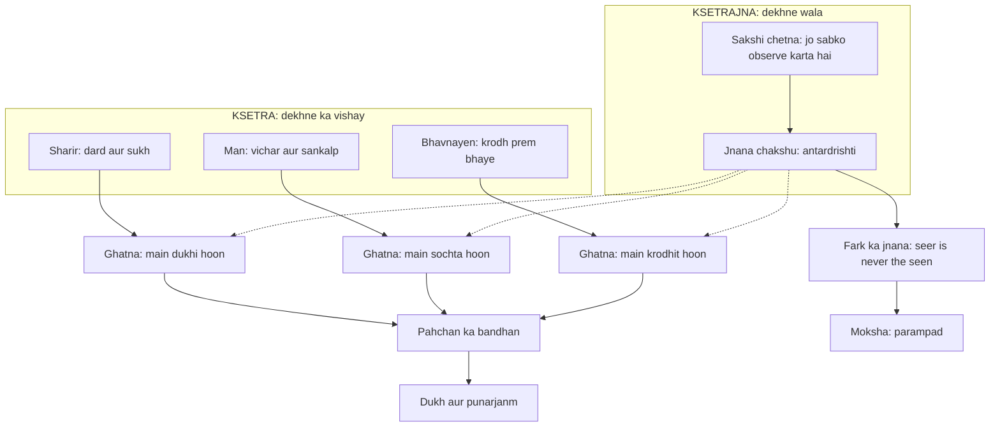

# अध्याय १३: क्षेत्र क्षेत्रज्ञ विभाग योग — "Khet alag, jaanne wala alag — sakshi wahi hai"

> **"Tum jab kehte ho 'main krodhit hoon', to ek cheez hai krodh, aur ek hai wo jo krodh ko jaan raha hai. Yahi do cheezein hain — kshetra aur kshetrajna. Aur is fark ko dekh lena hi sakshibhav hai. Puri Gita isi ek fark ke chaaro taraf ghoomti hai."**
> — **ओशो**

---

Yeh wahi din hai jab Mahabharat ka yuddha shuru ho chuka hai. Senayein aamne-saamne hain, shankh baj chuke hain, aur Arjuna — wo honest seeker — wahi khada hai jo adhyaya 1 me moh ke andhere me gira tha. Ab uska sawaal kuch aur hai. Wo Krishna se poochta hai: "Prakriti kya hai? Purush kya hai? Kshetra kya hai? Kshetrajna kya hai?" (13.1). Yani ab Arjuna ghar ke bahar ki ladai nahi dekh raha — wo andar ke maidan ko dekh raha hai. Aur Krishna, jo is kahaani me strategist aur witness dono hai, usse sabse gudh updesh deta hai: yeh sharir khet hai, aur tum khet ke jaanne wale ho.

Osho is adhyaya ko Gita ka sabse scientific adhyaya maante the. Unke liye yeh koi dharma ka prachar nahi hai — yeh ek exact observation hai, ek vigyan hai jise wo khud apne saare discourse me, apni saari meditation vidhiyo me, apne sakshatkar ke andar dekhte the. Osho kehti hai: "Kshetra kya hai? Jo kuch bhi tum dekh sakte ho, jaan sakte ho, observe kar sakte ho — wahi kshetra hai. Aur jo dekhne wala hai, wo kshetrajna hai. Yahi fark hi dhyan hai, yahi fark hi moksha hai." Is adhyaya me Krishna ne jo seedha-saada but gahra formula diya hai — "tum wo nahi ho jo tum sochte ho; tum wo ho jo soch ko dekh raha hai" — usi ko Osho ne apni poori zindagi ka centre banaya. Wo kehte hain ki Gita ka yeh adhyaya padhne se pehle aksar santa jata hai, kyunki yahan koi action ka updesh nahi, koi vrat nahi, koi mantra nahi — sirf ek drishti hai. Aur Osho ke liye drishti hi sab kuch hai.

---

## Learning Objectives

Is chapter ko complete karne ke baad aap:

1. Kshetra aur kshetrajna ka fark — Gita ke shabdon me aur Osho ki bhasha me — samajh payenge.
2. Adhyaya 13 ki chaar key shlokas (13.2, 13.8-12, 13.29, 13.34) ko Devanagari, transliteration aur Hinglish arth ke saath padh aur samjha sakenge.
3. Jnana ke 20 lakshan (13.8-12) ko ek practical checklist ki tarah apne roz ke jeevan me identify kar payenge — sirf yaad karne ke liye nahi.
4. Sakshibhav ko Osho ke drishtikon se samjhenge — "seer is never the seen" — aur isko apni daily meditation practice me lagayenge.
5. "Observer-Observed Analyzer" TypeScript tool ko run karke khud ke events ko kshetra aur kshetrajna me classify kar payenge.

---

## क्षेत्र क्षेत्रज्ञ विभाग का Parichay

Yeh adhyaya Gita ke andar sabse bada "scientific break" hai. Adhyaya 12 tak bhakti aur karm ki baatein hui, adhyaya 11 me vishwaroop ka darshan hua. Ab Krishna Arjuna ko andar ki laboratory me le jata hai. Wo kehta hai: "Yeh sharir kshetra hai, ise kshetra kehte hain. Jo is sharir ko janta hai, usse kshetrajna kehte hain" (13.1). Osho is baat ko apni tarah bolte hain: "Jo cheez object ho sakti hai, wo kabhi tum nahi ho sakte. Tumhara sharir object hai, tumhara man object hai, tumhari bhavnayen objects hain — kyunki tum inhe dekh sakte ho. Aur jo inhe dekh sakta hai, wo unme se koi nahi hai."

### Kshetra kya hai?

Osho kehte hain ki kshetra sirf sharir nahi hai — wo poori field hai jisme tumhari physical body, tumhara man, tumhari feelings, tumhare sanskar, tumhara samaj, tumhara sansar — sab kuch hai. Yehi wo "khet" hai jisme sab kuch ugta hai: krodh ugta hai, prem ugta hai, moh ugta hai, moksha bhi ugta hai. Aur is khet ka kisan alag hai. Khet me jo bhi hota hai, wo uske upar hota hai — khet khud nahi hota. Osho ka example: ek film screen par kya-kya nahi dikhta — rota hua admi, hansata hua admi, jungle, samandar — lekin screen wahi rehti hai, unchhoti. Kshetra wahi screen hai.

### Kshetrajna kya hai?

Kshetrajna wo hai jo kshetra ko janta hai. Osho ise "the observer within" kehte the — sakshi. Lekin yahan ek gehri baat hai: Krishna kehti hai ki main bhi kshetrajna hoon (13.2), aur aap bhi kshetrajna ho. Yani ek hi chetna har khet me dekhti hai. Jaise ek hi suraj sab khet par chadhta hai, ek hi roshni sab drishyon ko dikhati hai — waise hi ek hi sakshi sab shariron ke andar jagrata hai. Osho kehte hain: "Tumhare andar jo janta hai, wo mere andar bhi wahi janta hai. Jaanne wale ek hain; fields alag-alag hain. Yeh unity ka sabse scientific proof hai — aur is unity ko anubhav karna hi dhyan hai."

### Traditional Reading vs Osho ki Reading

| Sawal | Traditional Reading | Osho ki Reading |
|-------|--------------------|-----------------|
| Kshetra kya hai | Sharir aur mool prakriti (physical body + nature) | Wahi sab kuch jo jana ja sakta hai — sharir, man, bhavnayen, sansar |
| Kshetrajna kya hai | Jeevatma — bhagwan ka amsha jo sharir me bandha hai | Tumhari apni sakshi chetna — dekhne wala, observe karne wala |
| Jnana ka rasta | Shastra parayan, karma-kanda, vrat-upvaas | Sakshibhav se jeena — fark ko dekhna, khet me kho mat jaana |
| Moksha kya hai | Is sharir aur sansar se hamesha ke liye nikal jaana | Bandhan ka bram khatam hona — khet rahega, lekin pahchan nahi |
| Krishna kaun hai | Kshetrajna ke roop me bhagwan, upar aasman me | Har khet ka jaanne wala — ek hi chetna jo tumhare andar bhi hai |

Osho is table ke har cell me ek saal ki baat kar dete the. Unka zor is baat par tha ki traditional reading moksha ko ek destination maanti hai — kisi aur duniya me chale jaane ka ticket. Osho kehte hain: "Moksha ticket nahi hai, moksha aankh hai. Aankh badal gayi to yahin swarg hai; aankh wahi rahi to kisi aur duniya me bhi narak milega." Yahi is adhyaya ka krantikari khulasa hai — tumhe kisi aur jagah jaana nahi hai, tumhe apne dekhne ka tareeka badalna hai.

---

## Key Shlokas

Is adhyaya me Krishna ne 35 shlokas kahe hain. Osho ke liye in me se chaar sabse zyada krantikari hain — 13.2 jo formula deta hai, 13.8-12 jo jnana ka practical checklist hai, 13.29 jo sakshibhav ko paribhashit karta hai, aur 13.34 jo antim nishkarsh hai.

### Shloka 13.2

> क्षेत्रज्ञं चापि मां विद्धि सर्वक्षेत्रेषु भारत।
> क्षेत्रक्षेत्रज्ञयोर्ज्ञानं यत्तज्ज्ञानं मतं मम॥

**Transliteration:** kṣetrajñaṁ chāpi māṁ viddhi sarva-kṣetreṣu bhārata; kṣetra-kṣetrajñayor jñānaṁ yat taj jñānaṁ mataṁ mama

**Arth (Hinglish):** Arjuna, mujhe bhi har kshetra ka kshetrajna jaan. Jo kuch kshetra aur kshetrajna ke beech ka fark hai — usi fark ko jaanna hi asli jnana hai, yeh mera mat hai.

**Osho ka drishtikon:** Dekho, yahan Krishna apne baare me kya keh raha hai — "har kshetra ka jaanne wala main hoon." Wo khud ko aasman par nahi rakh raha, wo khud ko tumhare andar hi bata raha hai. Osho kahte hain: "Yeh sabse mahaan egalitarianism hai — bhagwan kaun hai? Wo jo tumhare andar dekh raha hai. Tumhare jaanne wale se alag koi bhagwan nahi hai. Aur fark ka jnana hi asli jnana hai." Osho ka zor hai: jnana koi information collection nahi hai — koi books ki list nahi, koi degree nahi. Jnana matlab fark ko samajhna: jo dekh raha hai wo alag hai, jo dikh raha hai wo alag hai. Aur is fark ko samajhna hi poori mukt hai.

### Shloka 13.8-12

> अमानित्वमदम्भित्वमहिंसा क्षान्तिरार्जवम्।
> आचार्योपासनं शौचं स्थैर्यमात्मविनिग्रहः॥
> इन्द्रियार्थेषु वैराग्यमनहङ्कार एव च।
> जन्ममृत्युजराव्याधिदुःखदोषानुदर्शनम्॥
> असक्तिरनभिष्वङ्गः पुत्रदारगृहादिषु।
> नित्यं च समचित्तत्वमिष्टानिष्टोपपत्तिषु॥
> मयि चानन्ययोगेन भक्तिरव्यभिचारिणी।
> विविक्तदेशसेवित्वमरतिर्जनसंसदि॥
> अध्यात्मज्ञाननित्यत्वं तत्त्वज्ञानार्थदर्शनम्।
> एतज्ज्ञानमिति प्रोक्तमज्ञानं यदतोऽन्यथा॥

**Transliteration:** amānitvam adambhitvam ahiṁsā kṣāntir ārjavam; āchāryopāsanaṁ śauchaṁ sthairyam ātma-vinigrahaḥ / indriyārtheṣu vairāgyam anahaṅkāra eva cha; janma-mṛtyu-jarā-vyādhi-duḥkha-doṣānudarśanam / asaktir anabhiṣvaṅgaḥ putra-dāra-gṛhādiṣu; nityaṁ cha sama-chittatvam iṣṭāniṣṭopapattiṣu / mayi chānanya-yogena bhaktir avyabhicāriṇī; vivikta-deśa-sevitvam aratir jana-saṁsadi / adhyātma-jñāna-nityatvaṁ tattva-jñānārtha-darśanam; etaj jñānam iti proktam ajñānaṁ yad ato 'nyathā

**Arth (Hinglish):** Abhiman ka na hona, dikhava na karna, ahimsa, kshama, seedhaapan; guru ki seva, shauch, sthirta, aur atma par niyantran; indriyon ke vishayon se veeragya aur ahankara ka na hona; janma, mrityu, boodhapa, rog aur dukh ke dosh ko baar-baar dekhte rahna; asakti, santan-patni-ghar aadi me moh ka na hona, aur priy-apriya ghatnayon me man ka sama rahna; mere prati ananya bhakti jo kabhi nahi toot-ti; ekant me rahna, bheed-bhaad se aarati; adhyatma-jnana me nirantar lage rehna, aur tattva-jnana ke arth ka darshan karna — isko jnana kehte hain. Aur jo iske alawa hai, wo ajnana hai.

**Osho ka drishtikon:** Osho is paanch shloko ko ek alag tarah se padhte hain. Traditional pandit inhe 20 commandments maante hain — karo ye, karo wo. Osho kahte hain: "Yeh rules nahi hain, yeh symptoms hain. Jaise bukhar ke saath paani lagta hai, jaise garmi ke saath pasina aata hai — waise hi sakshibhav ke saath yeh 20 cheezein apne aap ugti hain. Tumhe amanitva practice nahi karna hai; tumhe sakshi hona hai, aur amanitva apne aap aa jayega. Kyunki jab tum dekhne wale bante ho, to abhimaan kiske liye?" Osho ka yeh baat kaafi krantikari hai — wo kehte hain ki jo cheez jnana ka parinaam hai, usse jnana ka sadhan mat bana lo. Tum jo koi bhi in 20 cheezo ko mechanically practice karoge, wo tumhara naya ahankara ban jayega — "main toh amanitva practice kar raha hoon" — dekho, abhimaan wapas aa gaya!

### Shloka 13.29

> प्रकृत्या एव च कर्माणि क्रियमाणानि सर्वशः।
> यः पश्यति तथात्मानमकर्तारं स पश्यति॥

**Transliteration:** prakṛtyaiva cha karmāṇi kriyamāṇāni sarvaśaḥ; yaḥ paśyati tathātmānam akartāraṁ sa paśyati

**Arth (Hinglish):** Jo yeh dekhta hai ki saare karm prakriti se hi ho rahe hain — har taraf — aur apne aatma ko akarta (karm karne wala nahi) dekh leta hai, wo hi sahi dekhta hai.

**Osho ka drishtikon:** Osho kehte hain ki yahi Gita ka asli karmayoga hai. Karmayoga ka matlab yeh nahi ki kam karo aur usko bhagwan ko samarpit kar do — karmayoga ka matlab hai: karm prakriti ke khet me ho raha hai, aur tum uske gavah ho. Osho ka analogy: nadi bah rahi hai — uska bahna prakriti hai; nadi ke kinaare khada aadmi uska gavah hai. Wo aadmi nahi sochta "main nadi ko baha raha hoon" — nadi khud bah rahi hai, aadmi dekh raha hai. Osho kahte hain: "Tumhara krodh nahi 'tum' ho rahe — wo kshetra me ho raha hai. Tumhara prem bhi kshetra ka aayojan hai. Tum to sirf dekhte ho. Aur jab tum 'maine kiya' kahna band kar dete ho, tab pehli baar asli karma hota hai — bina karta ke karma, bina stress ke karma, bina ego ke karma." Isi ko Osho "action in inaction" kehte the — Krishna ne isi ko adhyaya 4 me kaha tha aur yahan isko phir se kshetra-kshetrajna ki bhasha me dohraya hai.

### Shloka 13.34

> क्षेत्रक्षेत्रज्ञयोरेवमन्तरं ज्ञानचक्षुषा।
> भूतप्रकृतिमोक्षं च ये विदुर्यान्ति ते परम्॥

**Transliteration:** kṣetra-kṣetrajñayor evam antaraṁ jñāna-chakṣuṣā; bhūta-prakṛti-mokṣaṁ cha ye vidur yānti te param

**Arth (Hinglish):** Jo log jnana-chakshu (antardrishti) se kshetra aur kshetrajna ka fark dekh lete hain, aur prakriti se nikalne ka marg (moksha) jaante hain — wo log param (sarvottam) pad ko prapt karte hain.

**Osho ka drishtikon:** Osho kehte hain ki is shloka me ek word sabse mehaktar hai — jnana-chakshu, knowledge-eye. "Yeh aankh koi sadharan aankh nahi hai. Isse tum bahar nahi dekhte, isse tum andar dekhte ho. Is aankh se 'main' nahi dekhta — is aankh se 'dekhta' dekhata hai." Osho ise "the third eye of witnessing" kehte the — jab yeh aankh khulti hai, to tum khud ko us bhavsagar me nahi paate jo prakriti ka hai, balki us kinare par paate ho jo kabhi nahi dubta. Unke liye moksha yahan se wahaan jaane ka safar nahi hai — moksha ek alag level par dekhne ki kala hai. "Kshetra kya hai, kshetrajna kya hai — is fark ko dekh lena hi parampad hai. Is fark ke pahle dukh hai, is fark ke baad dukh ka khel khatam."

---

## Kshetra aur Kshetrajna — Osho ki gahrai mein

### Pehli gahrai: Kshetra ka science

Osho kehte hain ki adhyaya 13 ek aisa adhyaya hai jo 20th century ke psychology ko 5000 saal peeche chhod deta hai. Modern psychology man ko hi aakhri cheez maanti hai — uske baad koi dekhne wala nahi hota. Gita kahte hain: man bhi kshetra hai — ek khet jisme sankalp-vikalp ugte hain. Osho kahte hain: "Psychologist ke liye man hi chetna hai. Gita ke liye man chetna ka drishya hai — chetna nahi. Yehi fark hai. Aur isi fark ko jagrukta se samajhna hi jnana hai." Kshetra ka science yeh hai: jo kuch bhi observation ka vishay ho — dard, sukh, vichar, bhookh, prem — sab kshetra me hota hai. Aur khet ke baare me koi bhi ghatna batao — wo usme ho sakti hai. Lekin ek ghatna kabhi nahi hoti kshetra me: wo hai "dekhna" khud. Dekhna hamesha kshetra se bahar hai. Yahi Krishna ka formula hai aur Osho ka meditation bhi.

### Doosri gahrai: Seer is never the seen

Osho is adhyaya ko "the science of the seer" kehte hain. Unka apna sutra tha: "Seer is never the seen." Man se poocho ki tum kaun ho — man ke paas sirf answers hain jo usne accumulate kiye hain. Gita kehte hain ki yeh saara accumulate hua data kshetra hai. Jo data kaise bhi nahi accumulate hota — wo dekhne wala — wahi kshetrajna hai. Osho ka analogy: "Aaina (mirror) kitne bhi chehre dekhe, kitne bhi aansu dekhe, kitni bhi muskanen dekhi — aaina unme se koi nahi ban jata. Aur tum aaine ko aaina hi rehne dete ho. Tumhare andar ka sakshi bhi waise hi rehta hai — krodh aata hai aur jata hai, sakshi rahta hai. Prem aata hai aur jata hai, sakshi rahta hai. Yehi shuchita hai — field ki nahi, drishti ki."

### Teesri gahrai: 20 lakshan — checklist ya parinaam?

Osho kehte hain ki 13.8-12 ko "jnana ka lakshan" samjho, "jnana ka niyam" nahi. Jaise nadi bahne lage to uske saath chhota-mota shor bhi hota hai — wo shor nadi nahi hai, wo nadi ka parinaam hai. Isi tarah jagrukta aane se amanitva, adambhitva, ahimsa, kshanti — yeh sab apne aap aa jaate hain. Osho kahte hain: "Agar koi tumhe bole ki krodh mat karo, to wo sirf krodh ko aur gehira karta hai. Agar koi tumhe bole ki krodh ko dekho, to krodh aur tumhare beech ek fark aa jata hai — aur wahi fark hi ahimsa hai." Osho kehte hain ki 20 lakshan ek thermometer hai: thermometer ko todne se bukhar nahi utarta. Jagrukta hi bukhar utarti hai. Aur jab jagrukta aayegi, to 20 cheezein ek saath aayengi — kyunki yeh ek hi ghatna ke 20 aayaam hain.

### Chauthi gahrai: Ek hi kshetrajna — unity of awareness

Shloka 13.2 me Krishna kehta hai "sarvakshetreshu" — har kshetra me. Osho isko baar-baar apne discourse me ghumaate the: "Ek hi roshni sab jhhaarron me ugti hai. Ek hi chetna sab shariron me jalti hai. Tumhare andar jo janta hai, mere andar bhi wahi janta hai. Isliye jab tum doosre ko pehchante ho, to tum actually khud ko pehchante ho — kyunki uske andar bhi wahi sakshi hai." Osho kehte hain ki yeh sirf ek philosophy nahi hai — yeh ek anubhav hai jo meditation ki gahrai me hota hai. Jab tum apne vicharon se upar uth jaate ho, to tum ek aise platform par khade ho jaate ho jo sabke liye common hai. Wo platform hi kshetrajna hai.



Yeh flowchart Osho ka poora model hai: niche ke char pal me field ke saath pahchan hoti hai — "main dukhi hoon" — aur upar ka jnana-chakshu un palon ko alag tarah se dekhta hai — "dukh hai, main nahi hoon." Osho kahte hain: "Fark sirf is baat ka hai ki tum jodte ho ya alag karte ho. Jodne se dukh, alag karne se azaadi."

### Jnana ke 20 lakshan — Osho ki checklist

| Cluster | Lakshan | Osho ka lens |
|---------|---------|--------------|
| Ahankara ka vishleshan | Amanitva, adambhitva, anahankara, arjava | Jab sakshi jagta hai to "main" ka theatre band ho jata hai — yeh effort nahi, consequence hai |
| Duniya se sambandh | Ahimsa, kshanti, asakti, anabhiswanga, vairagya | Chunawat matlab chhodna nahi; matlab dekhna — asakti dekhne se aati hai, chhodne se nahi |
| Sadhana ke aadhaar | Acharyopasana, shauch, sthairya, atmavinigraha, vivikta-sevitva | Yeh basis hai jis par jagrukta khadi hoti hai — lekin inhe bhi khet ka hissa hi maano |
| Antardrishti | Janma-mrityu-dosha-anudarshana, samachittatva, bhakti, arati-jan-sansadi, adhyatma-jnana-nityatva, tattva-darshana | Yeh sab ek hi aankh ke roop hain — wo aankh jo "what is" ko waisa hi dekhti hai |

Osho is table ko aksar yun samjhaate the: "20 signs list karna aasan hai, lekin in 20 ko ek saath laana tabhi possible hai jab inke peeche ki ek hi chetna jag jaye. Ek battery ho to 20 bulbs jalti hain. 20 bulbs ko alag-alag wiring karo to kabhi nahi jalenge. Jagrukta hi battery hai."

---

## TypeScript Implementation

Is tool se aap apne roz ke events ko log karte hain: jo sharir-man ki automatic pratikriya hai wo "field reaction" hai, aur jo chetna us pratikriya ko dekh rahi hai wo "witness observation" hai. Osho kehte hain: "Dekhna practice karo — pehle ek second ke liye, phir do second — phir din bhar. Khet alag, jaanne wala alag."

```typescript
/**
 * Observer-Observed Analyzer — Adhyaya 13 ka practice tool
 *
 * Kshetra = sharir + man + indriyan (jo hamesha kuch na kuch karte rehte hain)
 * Kshetrajna = wo chetna jo in sabko dekh rahi hai (sakshi)
 *
 * Osho kehte hain: "Dekhne wala jo hai, wo dekhe jaane wale me nahi hota.
 * Bas yehi fark samajhna hai, aur yehi fark hi dhyan hai."
 *
 * Tool ka use: roz ke events ko log karo —
 * 1) FieldReaction: sharir-man ki automatic pratikriya
 * 2) WitnessObservation: sakshi ne kya dekha, aur kya pahchan bhi ho gayi
 * 3) Score dekho: kitne pal me chetna sakshi thi, kitne me kho gayi
 */

interface FieldReaction {
  event: string;
  bodyResponse: string;
  mindResponse: string;
  intensity: 1 | 2 | 3 | 4 | 5;
  happenedAt: string;
}

interface WitnessObservation {
  moment: string;
  whatWasSeen: string;
  identifiedWithField: boolean;
}

interface ScoreResult {
  totalEvents: number;
  witnessedEvents: number;
  witnessedPercentage: number;
}

class ObserverObservedAnalyzer {
  private fieldLog: FieldReaction[] = [];
  private witnessLog: WitnessObservation[] = [];

  logFieldReaction(reaction: FieldReaction): void {
    this.fieldLog.push(reaction);
    console.log(`[KSETRA] ${reaction.event} (${reaction.happenedAt})`);
    console.log(`  sharir: ${reaction.bodyResponse}`);
    console.log(`  man: ${reaction.mindResponse} — intensity ${reaction.intensity}/5`);
  }

  logWitnessObservation(observation: WitnessObservation): void {
    this.witnessLog.push(observation);
    console.log(`[KSETRAJNA] ${observation.moment}`);
    console.log(`  dekha gaya: ${observation.whatWasSeen}`);
    console.log(
      observation.identifiedWithField
        ? "  note: is pal pahchan wapas aa gayi — koi baat nahi, dekhte rehna"
        : "  note: is pal chetna sakshi ban gayi"
    );
  }

  getScore(): ScoreResult {
    const totalEvents = this.fieldLog.length;
    const witnessedEvents = this.witnessLog.filter(
      (w) => !w.identifiedWithField
    ).length;
    return {
      totalEvents,
      witnessedEvents,
      witnessedPercentage:
        totalEvents === 0
          ? 0
          : Math.round((witnessedEvents / totalEvents) * 100),
    };
  }

  getOshoCommentary(score: ScoreResult): string {
    if (score.witnessedPercentage >= 70) {
      return "Kshetrajna jagta ja raha hai. Yaad rakho: yeh bhi ek stithi hai — isko bhi dekhna seekho.";
    }
    if (score.witnessedPercentage >= 40) {
      return "Kabhi sakshi, kabhi kshetra — isi jhoolne me dhyan pakta hai. Ghabrao mat, dekhte raho.";
    }
    return "Abhi tum kshetra hi ho — koi baat nahi. Fark jitni baar dikh jaye, utna hi kaafi hai. Dekhte rehna, bas.";
  }
}

function runDemo(): void {
  const analyzer = new ObserverObservedAnalyzer();

  analyzer.logFieldReaction({
    event: "Subah ke traffic jam me",
    bodyResponse: "pet me jalan, saans tez",
    mindResponse: "gaaliyan aur 'mujhe late ho jaana hai' ka bhaag",
    intensity: 4,
    happenedAt: "08:15",
  });

  analyzer.logFieldReaction({
    event: "Office me criticism milne par",
    bodyResponse: "kaan garam, chehra laal",
    mindResponse: "badla lene ki planning",
    intensity: 5,
    happenedAt: "11:40",
  });

  analyzer.logWitnessObservation({
    moment: "Traffic jam ke dauran",
    whatWasSeen: "krodh sharir me ghoom raha hai aur man gussa ka kissa suna raha hai — main dono ko dekh raha hoon",
    identifiedWithField: false,
  });

  analyzer.logWitnessObservation({
    moment: "Raat ko sone se pehle",
    whatWasSeen: "din bhar ka kshetra — ghatnayen aur pratikriyayen — ek film ki tarah gujra",
    identifiedWithField: true,
  });

  const score = analyzer.getScore();
  console.log("\n--- OBSERVER-OBSERVED SCORE ---");
  console.log(`Total events: ${score.totalEvents}`);
  console.log(`Sakshi ke saath dekhe gaye: ${score.witnessedEvents}`);
  console.log(`Witnessing percentage: ${score.witnessedPercentage}%`);
  console.log(`Osho commentary: ${analyzer.getOshoCommentary(score)}`);
}

runDemo();
```

---

## Summary

| Bindu | Saar |
|-------|------|
| Kshetra | Jo kuch bhi jana ja sakta hai — sharir, man, bhavnayen — wahi kshetra hai |
| Kshetrajna | Jo in sabko janta hai — sakshi chetna — wahi kshetrajna hai |
| 20 lakshan (13.8-12) | Jnana ke symptoms hain, niyam nahi — sakshibhav se apne aap aate hain |
| 13.29 | Karm prakriti me ho rahe hain; jo apne aap ko akarta dekhta hai, wahi sahi dekhta hai |
| Moksha (13.34) | Jnana-chakshu se fark dekhna hi parampad hai — jane ki jagah, alag se dekhna |

---

## Contradictions

- **Amanitva practice ki jaa sakti hai (traditional) vs nahi ki ja sakti (Osho):** Traditional commentary in 20 signs ko niyam maan kar practice karne ko kehti hai. Osho kehte hain: jis pal tum "amanitva practice kar rahe hoon" kaho, usi pal abhimaan wapas aa gaya — "main amanitva practice kar raha hoon" yeh hi sabse bada abhimaan hai. Yehi contradictions ka sabse bada point hai: consequences ko rules mat banao.
- **Kshetra ko chhodna hai (traditional) vs kshetra ko jaanna hai (Osho):** Traditional reading me sansar aur sharir ko tyaag ke liye kaha jata hai. Osho kehte hain: khet ko koi nahi chhod sakta — tumhare baal bhi kshetra me ugte hain. Khet chhodna impossible hai; khet ke saath pahchan chhodna possible hai. Screen ko todne se film nahi rukti — screen ko dekhne se film ka bram rukta hai.
- **Kshetrajna bhagwan hai, tum nahi (traditional) vs kshetrajna tumhara hi swaroop hai (Osho):** Pandit ise bhagwan-ki-shakti maante hain jo tumhare upar hai. Osho kehte hain: wo tumhare andar ka dekhne wala hai — "upar" kahin nahi hai, andar hai. Tum bhagwan ko kabhi nahi dekh sakte kyunki bhagwan hi dekhte hain.
- **Jnana books me hai (traditional) vs jnana fark me hai (Osho):** Shastra parayan ko jnana ka marg maana jata hai. Osho kahte hain: kisi bhi book me jnana nahi hota — books data deti hain, data kshetra ka hissa hai. Jnana to tab hota hai jab tum data ko dekhne wale ko pehchan lo.

---

## Open Questions

- Agar kshetrajna khud kshetra me dikhne wala nahi hai, to kya usse koi aur dekh sakta hai? Ya dekhne wale ka dekhne wala — yeh infinite regress kahan rukta hai?
- 13.8-12 ke 20 lakshan me se koi ek bhi bina jagrukta ke ho sakta hai? Agar nahi, to kya jagrukta hi ek-maatra sadhan hai?
- Agar ek hi kshetrajna har khet me hai, to "meri" chetna aur "tumhari" chetna me fark kyun mehsoos hota hai? Kya yeh fark bhi kshetra ki hi upaj hai?
- Krishna is adhyaya me koi meditation technique nahi deta — sirf fark batata hai. Kya fark ka gyan hi technique se zyada gahra hai, ya technique us fark ko laane ka madhyam hai?

---

## Practical Takeaways

| Situation | Gita shloka | Osho's lens | Action |
|-----------|-------------|-------------|--------|
| Krodh aaye aur tum usme behe jao | 13.2 — fark ka jnana | "Main krodhit hoon" mat bolo; "krodh hai, main dekh raha hoon" bolo | Ek din me 5 baar: krodh aate hi ek lambi saans ke saath kehna — "yeh kshetra hai" |
| Abhimaan ho ki "main itna amanitva karta hoon" | 13.8-12 — 20 lakshan | Abhimaan ka abhaav bhi abhimaan ban sakta hai | Har raat apne 20 signs me se 2 ko sirf observe karo, judge mat karo |
| Kaam me stress ho ki "sab kuch mujhe hi karna hai" | 13.29 — akarta drishti | Karm prakriti me ho raha hai; tum gavah ho | Kaam shuru karte waqt ek baar man me bolo: "prakriti karegi, main dekhoonga" |
| Dukh lag raha ho aur lage ki yeh kabhi khatam nahi hoga | 13.34 — jnana-chakshu | Dukh kshetra ki khabar hai, tumhari nahi | Dukh ke waqt 2 minute: sirf dukh ko dekhna, usme ghusna nahi |

---

## Chapter Quiz

### Question 1
Kshetra kya hai, Gita ke anusaar?

a) Sirf sharir
b) Sirf man
c) Sharir, man, indriyan aur saare anubhav ka vishay
d) Atma

<details><summary>Answer</summary>

**c) Sharir, man, indriyan aur saare anubhav ka vishay** — Krishna kehte hain ki jo kuch bhi jana ja sakta hai, wahi kshetra hai.

</details>

### Question 2
Kshetrajna kaun hai?

a) Kshetra ka malik — wo jo sab kuch jaanta hai
b) Bhagwan ka doosra naam jo aasman me rehta hai
c) Indriyan ka pratinidhi
d) Buddhi ka doosra naam

<details><summary>Answer</summary>

**a) Kshetra ka malik — wo jo sab kuch jaanta hai** — Osho kehte hain ki kshetrajna tumhare andar ka dekhne wala hai, kisi bahar ke devta ka naam nahi.

</details>

### Question 3
Shloka 13.2 me Krishna apne aap ko kya kehte hain?

a) Har kshetra ka kshetrajna
b) Kshetron ka adhipati
c) Prakriti ka upasak
d) Karm ka karta

<details><summary>Answer</summary>

**a) Har kshetra ka kshetrajna** — "सर्वक्षेत्रेषु भारत" — sabhi kshetron me jaanne wala ek hi hai, aur wo main hoon.

</details>

### Question 4
Amanitvam ka sahi matlab kya hai?

a) Kisi ko naman karna
b) Abhimaan ka na hona
c) Kisi ka maan badhana
d) Aatmavishwas ka hona

<details><summary>Answer</summary>

**b) Abhimaan ka na hona** — amanitvam ka arth hai "mamta" ka abhaav — Osho kehte hain ki yeh sakshibhav ka apne aap aane wala parinaam hai.

</details>

### Question 5
13.8-12 ki 20 baatein kya hain?

a) 20 yagya vidhiyan
b) Jnana ke 20 lakshan
c) 20 prakar ke karm
d) 20 prakar ke paap

<details><summary>Answer</summary>

**b) Jnana ke 20 lakshan** — Krishna ne inhe "एतज्ज्ञानमिति प्रोक्तम्" — jnana kehte hain, aur jo iske alawa hai wo ajnana.

</details>

### Question 6
Osho 20 lakshan ko kaise dekhte hain?

a) 20 commandments jo roz practice karni chahiye
b) Sakshibhav ke apne aap aane wale symptoms
c) 20 prakar ke sadhan jo ghar chhodkar karne hain
d) 20 mantra jo gungunane hain

<details><summary>Answer</summary>

**b) Sakshibhav ke apne aap aane wale symptoms** — Osho kehte hain: "Yeh rules nahi hain; jaise garmi ke saath pasina aata hai, waise jagrukta ke saath yeh aate hain."

</details>

### Question 7
Shloka 13.29 ke anusaar kaun sahi dekhta hai?

a) Jo bahut saare karm karta hai
b) Jo karmon ko prakriti se hote dekhta hai aur apne aatma ko akarta maanta hai
c) Jo sab karm tyag deta hai
d) Jo karmo ka hisaab rakhta hai

<details><summary>Answer</summary>

**b) Jo karmon ko prakriti se hote dekhta hai aur apne aatma ko akarta maanta hai** — yehi Osho ka "action in inaction" hai.

</details>

### Question 8
Ek hi kshetrajna har khet me hai — iska Osho ke liye kya matlab hai?

a) Bhagwan sabke baap hain
b) Ek hi sakshi chetna sab jagah dekh rahi hai — yahi unity ka anubhav hai
c) Sab sharir ek jaise hain
d) Koi bhi khet doosre se alag nahi hai

<details><summary>Answer</summary>

**b) Ek hi sakshi chetna sab jagah dekh rahi hai — yahi unity ka anubhav hai** — Osho kehte hain ki tumhare jaanne wale aur mere jaanne wale ek hain.

</details>

### Question 9
Shloka 13.34 ka "jnana-chakshu" kya hai?

a) Physical aankh ko healthy rakhna
b) Antardrishti — fark ko dekhne wali aankh
c) Tantar-mantar ki aankh
d) Book se padha hua gyan

<details><summary>Answer</summary>

**b) Antardrishti — fark ko dekhne wali aankh** — Osho ise "third eye of witnessing" kehte the.

</details>

### Question 10
Traditional reading me moksha ka matlab kya hai, aur Osho ise kaise badalte hain?

a) Traditional: moksha kisi aur lok me jaana; Osho: moksha alag drishti se dekhna hai
b) Dono ka same matlab hai
c) Traditional: moksha jaap se hota hai; Osho: moksha dhan se
d) Dono kahte hain ki moksha sharir chhodne ke baad hi hota hai

<details><summary>Answer</summary>

**a) Traditional: moksha kisi aur lok me jaana; Osho: moksha alag drishti se dekhna hai** — Osho kehte hain: "Moksha ticket nahi hai, moksha aankh hai."

</details>

---

## Exercises

1. **Din ka saakshi log:** Aaj ke din me 3 events chuno (ek office/college wala, ek ghar wala, ek akela rehne wala). Har event ke liye 4 lines likho: kya hua, sharir ne kya kiya, man ne kya socha, aur tumne kya dekha. Aakhri line hi kshetrajna hai.
2. **20-signs journal:** 13.8-12 ko 4 clusters me tod ke ek hafte ke liye har roz 2 signs observe karo — judge mat karo, sirf note karo ki wo sign "dikh raha hai ya nahi". Hafta khatam hone par dekho: jagrukta badhi to signs badhe ya nahi.
3. **5-min daily practice:** Roz subah 5 minute aankh band karke apne man me aane wale vicharon ko dekhna — jaise koi doosra aadmi apne man me dekhta hai. Har vichar ke baad bolo: "yeh kshetra hai, main nahi hoon."
4. **Seer-not-seen experiment:** Aaj jab bhi koi bhavna (krodh, hansi, darr) aaye, usi waqt man me sawaal uthao: "Yehi koi aur aa raha hai, ya main khud hoon?" — Osho kehte hain ki sawaal hi kshetra aur kshetrajna ke beech ka bridge hai.
5. **Ekta ka dhyan:** Kissi ajeeb se jaane wale aadmi ko dekho — bus driver, safai karmi, bachcha — aur ek second ke liye socho: "Uss ke andar bhi wahi dekhne wala hai jo mere andar hai." Yeh unity practice Osho ki sabse pyaari thi.
6. **Night review with tool:** Observer-Observed Analyzer TypeScript tool ko roz raat ko run karo aur din ke 3 events ko field reaction aur witness observation me classify karo. Hafta bhar score ka graph banao.

---

## Further Reading

- Osho, *Gita Darshan* (6 volumes, Bombay 1973-1976) — adhyaya 13 par unke original discourse is course ka mool aadhaar hain.
- Osho, *In Search of the Miraculous* — sakshi aur antardrishti ki gahrai ko samajhne ke liye.
- Swami Chinmayananda, *The Holy Geeta* — traditional reading ko samajhne ke liye, taaki tumhain fark dikhe.
- Eknath Easwaran, *The Bhagavad Gita* — simple English translation aur practical commentary.
- Adi Shankaracharya, *Gita Bhashya* — jnana-marg ki classical vyakhya, jisse Osho ki vyakhya ka contrast samajh aata hai.
