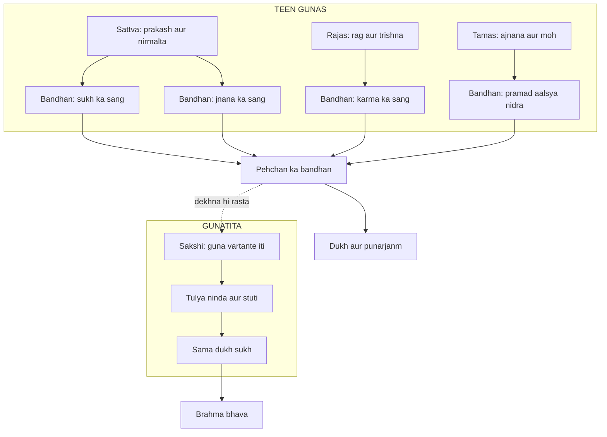

# अध्याय १४: गुणत्रय विभाग योग — "Teen gunas — tumhari psychology ka map"

> **"Sattva, rajas, tamas — yeh teen gunas tumhari psychology ka map hain. Is map ko samajh lo, to tum samajh jaoge ki tumhara man kab roshni ka hai, kab aag ka, kab andhera ka. Aur in teeno ko witness karna hi gunatita hona hai."**
> — **ओशो**

---

Mahabharat ke usi maidan par, jahaan do bade bhaari senayein aamne-saamne khadi hain, Krishna ab Arjuna ko sabse gehri psychology padha raha hai. Adhyaya 13 me usne kshetra (field) aur kshetrajna (knower) ka fark bataya tha. Ab Arjuna ke man me ek natural sawaal utha: "Yeh kshetra behave kyun karta hai jaise karta hai? Ek hi sharir me kab suraj chadhta hai, kab aag lagti hai, kab andhera chha jata hai?" Aur Krishna is sawaal ka jawab deta hai — teen gunas: sattva, rajas, tamas. Osho kehte hain ki yeh adhyaya Gita ka sabse modern psychology wala adhyaya hai — yahan Krishna 5000 saal pehle wo kaam kar raha hai jo Freud aur Jung ne 20th century me kiya.

Osho is adhyaya ko "tumhari psychology ka map" kehte the. Unke liye gunas koi cosmic powers nahi hain jo aasman me baithi hain — yeh tumhare man ki teen basic energies hain. Sattva roshni hai, rajas gati aur aakanksha hai, tamas aalsya aur andhera hai. Osho kahte hain: "Har aadmi me teeno gunas hain — percentage alag-alag. Subah jagte waqt tamas zyada hota hai, kaam me rajas, aur ek gahri shaant me sattva. Koi bhi aadmi pure sattvic nahi hai, pure tamasic nahi hai — sab mixture hain." Aur unka sabse krantikari point yeh hai: is adhyaya ka goal yeh nahi hai ki tum "sattvic" bano — goal yeh hai ki tum teeno ko ek sakshi ki tarah dekh sako. Kyunki "sattvic banna" bhi ek naya moh hai, ek naya ego hai, ek nayi jagah hai jahan tum gir sakte ho.

Krishna is adhyaya ke aakhri me gunatita (jo gunas se pare hai) ka varnan karta hai — aur phir bhakti ka marg batata hai (14.26). Osho kehte hain ki yeh dono baatein ek hi hain: gunatita hone ka ek maatra rasta hai — samarpana. Samarpana ka matlab kisi aasman ke bhagwan ko samarpit hona nahi — samarpana ka matlab apni teeno energies ko dekhne ke liye tyaag dena. "Jab tum teeno guno ko dekhne wale ban jaate ho, to tum na sattvic ho, na rajasic, na tamasic — tum theek se above ho. Aur wo 'above' hi bhagwan hai."

---

## Learning Objectives

Is chapter ko complete karne ke baad aap:

1. Sattva, rajas aur tamas — teeno gunas ko unke swabhav, unke bandhan aur unke prakash ke saath samajh payenge.
2. Adhyaya 14 ki key shlokas (14.6, 14.7, 14.8, 14.22-25, 14.26) ko Devanagari, transliteration aur Hinglish arth ke saath padh payenge.
3. Gunatita (jo gunas ke pare hai) ki pehchaan — uske 5-6 mark — apne jeevan me identify kar payenge.
4. Osho ke drishtikon ko samjhenge: sattva ko bhi ek guna maana — "sattvic banna" ka jaal kya hai.
5. "Guna Dominance Analyzer" TypeScript tool ko run karke apni sattva-rajas-tamas percentage nikaal payenge aur balance practices seekhenge.

---

## गुणत्रय विभाग का Parichay

Yeh adhyaya Gita ke andar ek "mind science" ka adhyay hai. Krishna khud ise vistar se batata hai — gunas kya hain, kaise bandhte hain, kaise uthte hain, aur jo inse pare hai uska swaroop kya hai. Osho kehte hain ki yeh adhyaya padhte waqt tumhe "sin" aur "virtue" ki bhasha bhool jaani chahiye — yahan koi paap-punya nahi hai, yahan sirf energy ka science hai. Tamas ko "paap" mat banao — tamas ke bina nidra nahi hoti, vishram nahi hota. Rajas ko "vikar" mat banao — rajas ke bina kaam nahi hota, sansar nahi chalta. Sattva ko "mukti" mat banao — sattva bhi ek bandhan hai, chahe wo sona ka bandhan ho.

### Teen gunas — teen energies

Osho ka model simple hai: man ek battery ki tarah hai jisme teen alag-alag currents hain. Sattva = light current — jab yeh active hota hai, man shant, vichar clear, sharir halka. Rajas = fire current — jab yeh active hota hai, man bhaagta hai, aakanksha jagti hai, kaam karna ho raha hai. Tamas = darkness current — jab yeh active hota hai, aalsya, nidra, moh, samajh nahi aana. Osho kahte hain: "In teeno ko koi ek doosre se achha ya bura nahi hai. Rajs ko tumse matlab hai — isse tumne bahut kuch banaya hoga. Tamas se bhi matlab hai — isse hi tum so pate ho. Sattva se bhi matlab hai — isse tumne kuch shant pal jee paaye. Mukti teeno me se kisi ko maarne se nahi, teeno ko dekhthe rehne se hai."

### Traditional Reading vs Osho ki Reading

| Sawal | Traditional Reading | Osho ki Reading |
|-------|--------------------|-----------------|
| Gunas kya hain | Prakriti ke cosmic guna — bhagwan ki maya ke hisse | Tumhare man ki teen basic psychological energies |
| Sattva ka status | Sabse ooncha — ise paana hi sadhna hai | Ek aur guna — ise bhi dekhna hai, "sattvic banna" bhi moh hai |
| Tamas ka status | Paap aur mrityu ka kaaran | Zaroori energy — nidra aur vishram isi se hota hai |
| Mukti kya hai | Sattva badhakar tamas ko khatam karna | Gunatita — teeno ko nirpeksh witness karna |
| Gunatita kaun | Sanyasi jo sansar tyaag deta hai | Wo jo bina kisi guna se pahchan ke ji raha hai — ghar me bhi ho sakta hai |
| Bhakti (14.26) | Krishna ki murti ki puja | Total samarpana — teeno guno se pahchan chhod dena |

Osho ke liye yeh table hi unke poore "Gita Darshan" ka axis hai. Wo traditional readers ko aksar kahte the: "Tumne sattva ko khalis (pure) bana diya aur tamas ko paap. Tumne man ke science ko morality bana diya. Gita ne yahan koi morality nahi di — Gita ne mirror diya hai. Mirror me apna asli chehra dekho." Osho kahte hain ki jab tak tum teeno guno ko apne andar bekhauf dekh nahi sakte, tab tak tumhare paas sattva ka dhong hai — aur dhong hamesha rajas aur tamas ko chhupa kar rakhta hai. "Jo aadmi sirf sattvic dikhta hai, wo sabse zyada tamasic hota hai — kyunki wo apna andhera dekhta hi nahi."

---

## Key Shlokas

Is adhyaya me 27 shlokas hain. Osho ke liye in me se 5 sections sabse important hain — teeno gunas ki paribhasha (14.6, 14.7, 14.8), gunatita ka varnan (14.22-25), aur bhakti ka marg (14.26).

### Shloka 14.6

> तत्र सत्त्वं निर्मलत्वात्प्रकाशकमनामयम्।
> सुखसङ्गेन बध्नाति ज्ञानसङ्गेन चानघ॥

**Transliteration:** tatra sattvaṁ nirmalatvāt prakāśakam anāmayam; sukha-saṅgena badhnāti jñāna-saṅgena chānagha

**Arth (Hinglish):** In me sattva apni nirmalta se prakashak aur rog-rahit hai — lekin yeh sukh ke sang (asakti) aur jnana ke sang se bandh deta hai, Arjuna.

**Osho ka drishtikon:** Osho kahte hain: "Yahan Gita ka sabse bada science hai — sattva bhi bandh deta hai!" Sattva ko bahut se log "mukti" maante hain, lekin Krishna kehte hain ki sattva ke saath do jaale hain: sukh ka moh — "main bahut shant hoon, bahut anand me hoon" — aur jnana ka moh — "main bahut bada gyani hoon." Osho kahte hain: "Sattva ka aakhri jaal yeh hai ki tum sochein ki tum ab spiritual ho gaye. Lekin wo 'spiritual hone' ka ahsaas hi tamas se gehira andhera hai, kyunki usme tum dekhna band kar dete ho." Sattva roshni hai — lekin roshni par bhi pahchan ho sakti hai. Jagrukta roshni ko bhi dekhne wali hai, roshni nahi.

### Shloka 14.7

> रजो रागात्मकं विद्धि तृष्णासङ्गसमुद्भवम्।
> तन्निबध्नाति कौन्तेय कर्मसङ्गेन देहिनम्॥

**Transliteration:** rajo rāgātmakaṁ viddhi tṛṣṇā-saṅga-samudbhavam; tan nibadhnāti kaunteya karma-saṅgena dehinam

**Arth (Hinglish):** Rajas ko rag (aasakti) wala jaan — iska janm trishna aur sang se hota hai. Yeh deh-dhari ko karma ke sang se bandh deta hai, Kaunteya.

**Osho ka drishtikon:** Rajas man ki fire energy hai — jis se kaam hota hai, bhag-daud hoti hai, ambition jagti hai. Osho kahte hain: "Rajas se daro mat — yeh duniya ki sabse productive energy hai. Tumhari degree isi se bani, tumhara career isi se bana, tumhara sansar isi se chalta hai. Lekin yeh bandhti hai — karm ke sang se. Yaani kaam karna bandhan nahi, 'maine kiya, mujhe hi karna hai' — yeh pahchan bandhan hai." Osho ka distinction bahut clear hai: rajas se karm hona thik hai, rajas ke saath pehchanna — "main karm karta hoon, main karta ban gaya" — yeh bandhan hai. Fire se khana pakao, fire me haath mat daalo.

### Shloka 14.8

> तमस्त्वज्ञानजं विद्धि मोहनं सर्वदेहिनाम्।
> प्रमादालस्यनिद्राभिस्तन्निबध्नाति भारत॥

**Transliteration:** tamas tv ajñāna-jaṁ viddhi mohanaṁ sarva-dehinām; pramādālasyanidrābhis tan nibadhnāti bhārata

**Arth (Hinglish):** Tamas ko ajnana se utpann jaan, jo sab deh-dhariyon ko mohit karta hai. Yeh pramad (lad-phad), aalsya aur nidra se bandh deta hai, Bharat (Arjuna).

**Osho ka drishtikon:** Osho kehte hain: "Tamas ko bhi samjho — yeh sirf bura aadmi ka guna nahi hai. Yeh tumhara deep sleep hai, yeh tumhara vishram hai, yeh tumhari root hai jis se energy jagti hai. Tamas hi ghar ka andhera hai jisme tum sote ho — bina tamas ke nidra impossible hai, aur bina nidra ke sattva kahan se aayega?" Tamas ka bandhan teen roop leta hai: pramad (bina soch ke kiye gaye karm), aalsya (energy ka rukna), aur nidra (chahet zyada, chahet gadhi). Osho kahte hain ki tamas se larna nahi hai, tamas ko dekhna hai — kyunki jab tum tamas ko dekhne lagte ho, to wo turant halka ho jata hai. "Andhere me sabse bada chiraag awareness hai."

### Shloka 14.22-25

> प्रकाशं च प्रवृत्तिं च मोहमेव च पाण्डव।
> न द्वेष्टि सम्प्रवृत्तानि न निवृत्तानि काङ्क्षति॥
> उदासीनवदासीनो गुणैर्यो न विचाल्यते।
> गुणा वर्तन्त इत्येव योऽवतिष्ठति नेङ्गते॥
> समदुःखसुखः स्वस्थः समलोष्टाश्मकाञ्चनः।
> तुल्यप्रियाप्रियो धीरस्तुल्यनिन्दात्मसंस्तुतिः॥
> मानापमानयोस्तुल्यस्तुल्यो मित्रारिपक्षयोः।
> सर्वारम्भपरित्यागी गुणातीतः स उच्यते॥

**Transliteration:** prakāśaṁ cha pravṛttiṁ cha moham eva cha pāṇḍava; na dveṣṭi sampravṛttāni na nivṛttāni kāṅkṣati / udāsīnavad āsīno guṇair yo na vichālyate; guṇā vartanta ity eva yo 'vatiṣṭhati neṅgate / sama-duḥkha-sukhaḥ svasthaḥ sama-loṣṭāśma-kāñchanaḥ; tulya-priyāpriyo dhīras tulya-nindātma-saṁstutiḥ / mānāpamānayos tulyas tulyo mitrāri-pakṣayoḥ; sarvārambha-parityāgī guṇātītaḥ sa uchyate

**Arth (Hinglish):** Jo prakash (sattva), pravritti (rajas) aur moh (tamas) — inme se na aane wali se dwesh karta hai, na jane wali ko chahata hai; jo udasheen ki tarah baitha hai, guno se hilta nahi, aur jaanta hai ki "gunas chal rahe hain" — aur khud nahi hilta; jiska dukh-sukh sama hai, jo apne me sthith hai, jiske liye mitti, patthar aur sona ek saman hain; jiske liye priy-apriya, ninda-prashansa, maan-apmaan, mitra-shatru sab same hain; aur jisne saare naye arambh tyag diye hain — usi ko gunatita kehte hain.

**Osho ka drishtikon:** Osho is varnan ko ek alag tarah se padhte hain — wo kehte hain: "Gita gunatita ka negative varnan kar raha hai — wo batata hai ki gunatita KYA NAHI hai: uske liye koi cheez badi ya chhoti nahi, uske liye koi ninda ya prashansa nahi. Lekin positive kya hai? Positive yeh hai ki wo gunas ko 'vartante' — chalta ja raha hai — yeh jaanta hai. Yeh janne wala hi gunatita hai. Guna khel rahe hain, aur wo khel dekhta hai." Osho ka kehna hai ki "sarvarbh-parityagi" ko literal mat lo — gunatita karm nahi chhodta, wo karm ka "beginning" chhodta hai — yaani wo karm par claim karna chhod deta hai. "Action bina attachment ke — yehi gunatita hai. Nahi to bhagoda sanyasi bhi gunatita ho jayega, aur wo nahi hai."

### Shloka 14.26

> मां च योऽव्यभिचारेण भक्तियोगेन सेवते।
> स गुणान्समतीत्यैतान्ब्रह्मभूयाय कल्पते॥

**Transliteration:** māṁ cha yo 'vyabhicāreṇa bhakti-yogena sevate; sa guṇān samatītyaitān brahma-bhūyāya kalpate

**Arth (Hinglish):** Jo bina kabhi tote (avyabhicharen) bhakti-yoga se mera seva karta hai, wo in sabhi guno ko paar kar ke brahma-bhava ko prapt hota hai.

**Osho ka drishtikon:** Osho kehte hain ki "bhakti" ka sabse gudh arth isi shloka me chhupa hai. Bhakti koi murti ki puja nahi hai — bhakti ka matlab hai ek aisi seva jisme tumhare "main" ka daava khatam ho jaye. "Jab tum kisi aur ko seva kar rahe ho — bina kisi return ke, bina kisi credit ke — to us pal tumhare gunas tham jaate hain. Kyunki sattva-rajas-tamas sab ego ke khel hain. Jahan ego nahi, wahan gunas bhi nahi." Osho kehte hain ki yahi ek-maatra rasta hai gunatita hone ka — "tum teeno guno ko individually maat nahi sakte, kyunki maatne wala bhi koi guna hai. Tum ek hi cheez kar sakte ho — dekhna. Aur dekhne ke aage 'seva' ka naam hai: jab dekhna itna gehira ho jaye ki tum hi na raho — sirf dekhna rahe."

---

## Gunatraya — Osho ki gahrai mein

### Pehli gahrai: Teeno gunas — man ka triad

Osho kehte hain ki gunas ka science har din me chalta hai — tumhe ise aasman me dhundhne ki zaroorat nahi. Subah uthte hi tamas; poora din rajas; aur ek cup chai ke saath shaam ko sattva. Osho kahte hain: "Yeh triad tumhare andar hamesha active hai. Isko jaanne ka ek simple test hai: kisi bhi pal poochho — 'is waqt man roshni ka hai, aag ka hai, ya andhera ka?' Yehi poochna shuru karo, aur tumne psychology ki pehli seedhi chadh li." Osho ne isse ek aur gehri jagah tak le jaate hain: teeno gunas sirf man ki state nahi — teeno hamesha "dusre ki" state hoti hai. Sattva bhi tum nahi ho, rajas bhi tum nahi ho, tamas bhi tum nahi ho — tum wo ho jo teeno ko identify karta hai. Isliye Osho kahte hain: "Guna sirf tabhi bandh sakta hai jab tum pahchano. Aur pahchan hamesha bhool hokar aati hai — 'main shant hoon' keh kar tumne sattva se pahchan li, bandh gaye."

### Doosri gahrai: Sattvic hone ka jaal

Osho is adhyaya par apne sabse tez waare inhi words me karte the: "Sattva bhi ek guna hai." Traditional spiritual path me sattva ko badhana, rajas-tamas ko ghatana goal bana diya gaya. Osho kahte hain: "Yeh bhi ek race hai — ek naya competition, naya ahankara. 'Main zyada sattvic hoon' — yeh sentence hi sattva ka antim jaal hai." Unka dar yeh tha ki jo log sirf sattva ke peechhe bhaagte hain, wo apna rajas aur tamas chhupa lete hain — aur chhupa hua andhera sabse dangerous hota hai. Osho kahte hain: "Ek sattvic saint jo apne krodh se anjaan hai, wo ek jagruk aadmi se kahin zyada khatarnak hai jo apne krodh ko jaanta hai. Kyunki jagruk aadmi ka krodh rupantarit ho sakta hai; chhupa hua krodh kabhi nahi." Goal sattva nahi hai — goal clarity hai: teeno ko bekhauf dekhna.

### Teesri gahrai: Gunatita — chautha guna nahi, dekhne wala

Krishna ke 14.22-25 ke varnan ko padh ke traditional readers soche hain ki gunatita ek nayi superior state hai. Osho kehte hain: "Gunatita chautha guna nahi hai. Gunatita wo hai jo kisi bhi guna me pahchan nahi leta. Wo subah tamasic hai, din me rajasic, shaam ko sattvic — aur in teeno ka sakshi." Osho ka example: "Nadi me teen dhaarein hain — tez, dheemi, aur gehri. Kinare khada aadmi unme se koi nahi. Nadi chalti hai, wo dekhtha hai. Nadi so sakti nahi, lekin kinara usse kaise judta hai? Waise hi tum guno se judte ho jab tak pahchan hai. Gunatita wahi kinara hai." Osho kahte hain ki gunatita ko "pichhe" nahi dekhna chahiye — yeh tumhara swabhav hai, bas pahchan ka andhera hatna baaki hai.



Yeh flowchart Osho ka guna-map hai: har guna ka apna jaal hai, aur sab jaalon ki jad ek hi hai — pahchan. Osho kahte hain: "Jaal todne ki zaroorat nahi — pahchan uthao, jaal apne aap kagal ho jata hai."

### Teeno gunas ka din chart

| Waqt | Pradhan guna | Laxan | Osho ka salah |
|------|--------------|-------|---------------|
| Subah uthne par | Tamas | Aals, "5 minute aur" | Jaagte hi 5 lambi saansen — andhera halka hota hai |
| Kaam ke dauran | Rajas | Daud, aakanksha, "aur karna hai" | Kaam shuru se pehle ek second: "main dekh raha hoon ki kaam ho raha hai" |
| Shaam ke vishram me | Sattva | Shant man, halka ahsaas | Sattva ka bhi sakshi raho — "main shant hoon" ka abhimaan mat khana |
| Raat ko nidra me | Tamas | Deep rest, sapne | Nidra me jate waqt aakhri vichar: "teeno gunas chal rahe hain, main dekh raha hoon" |

Osho kehte hain ki yeh chart sirf ek observation chart hai — ise compliance sheet mat banao. "Agar aaj subah tamas zyada hai, to usse dhundhlo. Tamas ko bhi dekhne ke liye raat ka andhera chahiye hota hai — kyunki sattva ki roshni me tamas nazar nahi aata."

---

## TypeScript Implementation

Yeh tool ek 15-sawal ka inventory hai. Har sawal ka jawab teeno me se ek option hai — sattva, rajas, ya tamas. Jawab do, aur tool aapko percentage dega: aapke man ka map kaisa hai. Osho kehte hain: "Is map se tumhe koi bhi guna 'theek' ya 'galat' nahi milta — tumhe sirf mirror milta hai. Aur mirror se poochho toh sawaal yeh nahi ki 'kaise sattvic banu' — sawaal yeh hai ki 'teeno ko kaise dekhu'."

```typescript
/**
 * Guna Dominance Analyzer — Adhyaya 14 ka practice tool
 *
 * Teen gunas: Sattva (prakash, nirmalta), Rajas (rag, kriya, trishna),
 * Tamas (aalsya, nidra, moh) — yeh tumhari psychology ka map hain.
 *
 * Osho kehte hain: "Tumhara swabhav teeno guno ka mishran hai.
 * Sawal yeh nahi ki sattvic kaisa bano — sawal yeh hai ki
 * teeno ko ek sakshi ki tarah dekhna kaisa seekho."
 *
 * Tool: 15 sawalon ka inventory — har jawab ka matlab hai ki
 * wo pal kis guna se chal raha tha. Result: teeno guno ke
 * percentage + Osho commentary + balance practices.
 */

type GunaOption = "a" | "b" | "c";
type GunaName = "sattva" | "rajas" | "tamas";

interface GunaQuestion {
  id: number;
  text: string;
  a: string;
  b: string;
  c: string;
  key: Record<GunaOption, GunaName>;
}

const QUESTIONS: GunaQuestion[] = [
  { id: 1, text: "Subah uthne par pehla ahsaas kya hota hai?", a: "halkapan aur tazgi", b: "kaam par lage ki jaldi", c: "aals aur sirf 5 minute aur", key: { a: "sattva", b: "rajas", c: "tamas" } },
  { id: 2, text: "Kaam ke waqt dimag kaise chalta hai?", a: "ek point par thira", b: "ek saath kai cheezon par daudta", c: "dheema ya bhatka hua", key: { a: "sattva", b: "rajas", c: "tamas" } },
  { id: 3, text: "Thakne par kya karte ho?", a: "shaant baith kar rest", b: "aur zyada kaam pakad lete hain", c: "mobile scroll karte rahte hain", key: { a: "sattva", b: "rajas", c: "tamas" } },
  { id: 4, text: "Kisi se ladai ke baad man kaisa hota hai?", a: "jaldi samajh aane laga", b: "badla lene ki soch", c: "daba hua krodh, samajh nahi aa rahi", key: { a: "sattva", b: "rajas", c: "tamas" } },
  { id: 5, text: "Nayi cheez seekhne ka man karta hai?", a: "ruchi aur dhyan se", b: "ek saath 10 courses shuru", c: "kal se shuru karenge", key: { a: "sattva", b: "rajas", c: "tamas" } },
  { id: 6, text: "Bhoot bhuka aata hai?", a: "bhojan shant aur poora", b: "bhojan ke beech kaam karna", c: "snacking bhar ke, kabhi kabhi skip", key: { a: "sattva", b: "rajas", c: "tamas" } },
  { id: 7, text: "Raat ko sone se pehle man kya kar raha hota hai?", a: "din ka review shant ho kar", b: "aane wale kal ki planning", c: "phone par ghante guzarna", key: { a: "sattva", b: "rajas", c: "tamas" } },
  { id: 8, text: "Kisi ka praise milne par kya hota hai?", a: "sukoon, lekin andar se shant", b: "aur bada kaam karne ki bhookh", c: "unbelievable, ek naya chakkar", key: { a: "sattva", b: "rajas", c: "tamas" } },
  { id: 9, text: "Ajeeb si frustration kab hoti hai?", a: "kam hi hoti hai, aa bhi jaye to dekh leta hoon", b: "goal miss hone par", c: "bina kisi wajah ke bhi, din bhar", key: { a: "sattva", b: "rajas", c: "tamas" } },
  { id: 10, text: "Meditation ya maun mein kaise lagte ho?", a: "sukoon milta hai", b: "begaar jaise, bas khatam ho", c: "neend aa jaati hai", key: { a: "sattva", b: "rajas", c: "tamas" } },
  { id: 11, text: "Ghar ka kaam karte waqt man kahan hota hai?", a: "us kaam ke saath", b: "baaki kaamon ki list par", c: "kisi aur jagah hi", key: { a: "sattva", b: "rajas", c: "tamas" } },
  { id: 12, text: "Doosron ki galti par kya hota hai?", a: "samajh aati hai, aur sabak bhi", b: "gussa aa jata hai, gaali de dete hain", c: "koi farak nahi padta, chalta rahta hoon", key: { a: "sattva", b: "rajas", c: "tamas" } },
  { id: 13, text: "Apne aap ko kab sabse zyada 'main' lagta hai?", a: "jab kuch achha sochta hoon", b: "jab kuch bada achieve karta hoon", c: "jab kuch nahi ho raha, khaali aur akela", key: { a: "sattva", b: "rajas", c: "tamas" } },
  { id: 14, text: "Nind aane ka pattern kaisa hai?", a: "so jaata hoon, chai se uth jaata hoon", b: "dimaag chalte rehne se late", c: "alarm ke baad bhi nahi uthta", key: { a: "sattva", b: "rajas", c: "tamas" } },
  { id: 15, text: "Aaj ke 5 minute me kaunsa guna zyada active hai?", a: "shant prakash", b: "bhagti hui aag", c: "bhaari andhera", key: { a: "sattva", b: "rajas", c: "tamas" } },
];

class GunaDominanceAnalyzer {
  private counts: Record<GunaName, number> = { sattva: 0, rajas: 0, tamas: 0 };
  private answered: number = 0;

  answer(questionId: number, option: GunaOption): void {
    const q = QUESTIONS.find((item) => item.id === questionId);
    if (!q) {
      console.log(`Sawaal ${questionId} nahi mila`);
      return;
    }
    const guna = q.key[option];
    this.counts[guna]++;
    this.answered++;
    console.log(`Q${q.id}: ${q.text}`);
    console.log(`  -> jawab ${option} = ${guna.toUpperCase()}`);
  }

  getPercentages(): Record<GunaName, number> {
    const base: Record<GunaName, number> = { sattva: 0, rajas: 0, tamas: 0 };
    if (this.answered === 0) {
      return base;
    }
    (Object.keys(base) as GunaName[]).forEach((g) => {
      base[g] = Math.round((this.counts[g] / this.answered) * 100);
    });
    return base;
  }

  getDominantGuna(): GunaName {
    const p = this.getPercentages();
    return (Object.keys(p) as GunaName[]).reduce((top, g) =>
      p[g] > p[top] ? g : top
    );
  }

  getOshoCommentary(guna: GunaName): string {
    const map: Record<GunaName, string> = {
      sattva: "Sattva pradhan hai — roshni saaf hai. Lekin Osho kehte hain: roshni par bhi pahchan mat banao. 'Main shant hoon' bhi ek bandhan hai.",
      rajas: "Rajas pradhan hai — tumhari energy aag ki hai. Osho kehte hain: aag se khana pakao, aag me haath mat daalo. Karm karo, karm se pahchan mat karo.",
      tamas: "Tamas pradhan hai — andhera gehira hai. Osho kehte hain: andhere se daro mat, andhere me hi aankh kholo. Jagrukta ka chiraag andhere me hi jalta hai.",
    };
    return map[guna];
  }

  getBalancePractice(guna: GunaName): string {
    const map: Record<GunaName, string> = {
      sattva: "Roz ek aisa kaam karo jisme koi credit na ho — seva. Sattva ko bhi seva me gholo.",
      rajas: "Din me 10 minute sirf baith kar raho — bina kaam, bina phone. Aag ko thamna seekho, bandhna nahi.",
      tamas: "Subah uth ke 5 lambi saansen aur 1 glass paani — andhera halka karo, pahchan se judo.",
    };
    return map[guna];
  }
}

function runDemo(): void {
  const analyzer = new GunaDominanceAnalyzer();

  analyzer.answer(1, "c");
  analyzer.answer(2, "b");
  analyzer.answer(3, "c");
  analyzer.answer(4, "c");
  analyzer.answer(5, "b");
  analyzer.answer(6, "a");
  analyzer.answer(7, "b");
  analyzer.answer(8, "b");
  analyzer.answer(9, "c");
  analyzer.answer(10, "c");
  analyzer.answer(11, "b");
  analyzer.answer(12, "a");
  analyzer.answer(13, "c");
  analyzer.answer(14, "c");
  analyzer.answer(15, "c");

  const p = analyzer.getPercentages();
  const dominant = analyzer.getDominantGuna();

  console.log("\n--- GUNA DOMINANCE MAP ---");
  console.log(`Sattva: ${p.sattva}% | Rajas: ${p.rajas}% | Tamas: ${p.tamas}%`);
  console.log(`Dominant guna: ${dominant.toUpperCase()}`);
  console.log(`Osho commentary: ${analyzer.getOshoCommentary(dominant)}`);
  console.log(`Balance practice: ${analyzer.getBalancePractice(dominant)}`);
}

runDemo();
```

---

## Summary

| Bindu | Saar |
|-------|------|
| Sattva | Prakash aur nirmalta — lekin sukh aur jnana ke sang se bandh bhi karta hai |
| Rajas | Rag aur trishna se utpann — karm ke sang se bandhta hai |
| Tamas | Ajnana se utpann — pramad, aalsya aur nidra se bandhta hai |
| Gunatita | Chautha guna nahi — teeno guno ka sakshi, jo "guna vartante" jaanta hai |
| Marg (14.26) | Bhakti-yoga — total samarpana, jisme guno se pahchan hi khatam ho jati hai |

---

## Contradictions

- **Sattva = goal (traditional) vs sattva = guna (Osho):** Traditional marg sattva badhane ko hi sadhna maanta hai. Osho kehte hain: sattva bhi bandhta hai — "spiritual hone" ka ahsaas hi sabse gehira moh hai. Goal koi bhi guna nahi, goal gunas ke beech ka khala hai.
- **Tamas = paap (traditional) vs tamas = zaroori (Osho):** Tamas ko vinaash ka guna maana jata hai. Osho kehte hain: tamas ke bina nidra impossible hai — tamas tumhari rest energy hai. Isse maatna nahi, isse jaanna hai.
- **Gunatita = sanyasi (traditional) vs gunatita = sakshi (Osho):** Text me "sarvarbh-parityagi" padh kar commentators ne kaha ki gunatita karm tyag deta hai. Osho kehte hain: wo karm ka arambh tyagta hai, karm nahi — action bina claim ke chalta rahta hai. Ghar me rahte hue bhi gunatita ho sakte ho.
- **Bhakti = puja (traditional) vs bhakti = samarpana (Osho):** 14.26 ko murti-puja ka marg maana jata hai. Osho kehte hain: bhakti wo seva hai jisme "main" ka daava hi nahi bachta — aur wahi ek-maatra guna-tyaag hai.

---

## Open Questions

- Agar har aadmi teeno guno ka mixture hai, to kya guna-kram (dominance) badal sakta hai? Aur badalne ka adhikaar kis ke paas hai — guna khud badlte hain, ya koi guno se upar wala?
- "Sattvic banna" ek moh hai — lekin kya sattva ka sadhan (sadhna, seva) bhi rajas se hi nahi hota? To sadhna kaun karta hai?
- Gunatita ka "sama" — sama-darshan — kya yeh insensitivity hai? Ya tumhare is "sama" ko galat samajhna bhi tamas ka khel hai?
- Krishna kehta hai bhakti-yoga se gunatita hota hai. Lekin bhakti khud kis guna se hoti hai — kya bhakti bhi ek guna hai, ya guno ke paar ki cheez hai?

---

## Practical Takeaways

| Situation | Gita shloka | Osho's lens | Action |
|-----------|-------------|-------------|--------|
| Subah nahi utha jata, aals me din nikalta hai | 14.8 — tamas aur nidra | Tamas se larna nahi, tamas ko dekhna hai | 5 din tak subah uth ke sirf 5 saans lena aur bolo: "tamas hai, main dekh raha hoon" |
| Kaam me atyadhik daud — burnout lagta hai | 14.7 — rajas aur karma-sang | Aag se khana pakao, aag me haath mat daalo | Roz 10 minute bina kaam ke baithna — fire ko thamna |
| "Main bahut spiritual ho gaya" ka ahsaas | 14.6 — sattva ka bandhan | Roshni par bhi pahchan bandhan hai | Jis pal yeh ahsaas aaye, bolo: "yeh bhi kshetra hai" |
| Jis cheez se pyaar hai usi se bandhan lagta hai | 14.22-25 — gunatita ka sama-drishti | Chunawat chhodna nahi, claim chhodna hai | Ek cheez chuno — uske saath kaam karo, uske saath pahchan mat karo |
| Bhakti karni hai lekin samajh nahi aa rahi kiski | 14.26 — bhakti-yoga | Bhakti murti ki nahi — "main" ki chhutti hai | Ek din ka ek kaam bina credit ke karo — wo hi seva hai |

---

## Chapter Quiz

### Question 1
Gita ke anusaar man aur prakriti me kitne gunas hain?

a) Do — roshni aur andhera
b) Teen — sattva, rajas, tamas
c) Char — teen + atma
d) Guna koi nahi

<details><summary>Answer</summary>

**b) Teen — sattva, rajas, tamas** — yeh teeno prakriti ke mool gunas hain, aur isi adhyaya ka vishay hain.

</details>

### Question 2
Sattva ka swabhav kya hai?

a) Aalsya aur nidra
b) Trishna aur daud
c) Nirmalta aur prakash
d) Krodh aur dwesh

<details><summary>Answer</summary>

**c) Nirmalta aur prakash** — 14.6 kehta hai "तत्र सत्त्वं निर्मलत्वात्प्रकाशकम्" — sattva nirmalta se prakashak hai.

</details>

### Question 3
Sattva kis-sang se bandh deta hai?

a) Karm aur phal ke sang se
b) Sukh aur jnana ke sang se
c) Nidra aur aals ke sang se
d) Dhan aur yogya ke sang se

<details><summary>Answer</summary>

**b) Sukh aur jnana ke sang se** — 14.6: "सुखसङ्गेन बध्नाति ज्ञानसङ्गेन च" — sukh ka moh aur jnana ka moh, dono bandhan hain.

</details>

### Question 4
Rajas kahan se utpann hota hai?

a) Ajnana se
b) Rag aur trishna se
c) Nirmalta se
d) Vairagya se

<details><summary>Answer</summary>

**b) Rag aur trishna se** — 14.7: "रजो रागात्मकं विद्धि तृष्णासङ्गसमुद्भवम्" — rajas rag aur trishna ka aayaam hai.

</details>

### Question 5
Tamas kis-se bandh deta hai?

a) Karm aur daud se
b) Pramad, aalsya aur nidra se
c) Sukh aur jnana se
d) Seva aur dhyan se

<details><summary>Answer</summary>

**b) Pramad, aalsya aur nidra se** — 14.8: "प्रमादालस्यनिद्राभिः" — yeh teen roop hain tamas ke bandhan ke.

</details>

### Question 6
Gunatita kaun hai?

a) Jo sirf sattvic ho gaya hai
b) Jo teeno guno ko nirpeksh dekhta hai aur unme pahchan nahi leta
c) Jo sab karm chhod deta hai
d) Jo sirf rajas se ladta hai

<details><summary>Answer</summary>

**b) Jo teeno guno ko nirpeksh dekhta hai aur unme pahchan nahi leta** — 14.23-24: "गुणा वर्तन्त इत्येव" — guna chalte hain, wo nahi hilta.

</details>

### Question 7
Osho ke liye "sattvic banna" kyun galat hai?

a) Kyunki sattva harmful hai
b) Kyunki "main sattvic hoon" bhi ek naya moh aur ahankara hai
c) Kyunki sattva possible nahi hai
d) Kyunki sattva sirf sanyasiyo ke liye hai

<details><summary>Answer</summary>

**b) Kyunki "main sattvic hoon" bhi ek naya moh aur ahankara hai** — Osho kehte hain: "Sattva bhi ek guna hai — roshni par pahchan bhi bandhan hai."

</details>

### Question 8
Tamas ke bina kya impossible hai?

a) Karm
b) Nidra aur vishram
c) Bhakti
d) Gyan

<details><summary>Answer</summary>

**b) Nidra aur vishram** — Osho kehte hain ki tamas ko paap mat banao — tamas hi tumhari rest energy hai.

</details>

### Question 9
Shloka 14.26 me gunatita hone ka kya marg bataya gaya hai?

a) Karm tyag
b) Bhakti-yoga se Krishna ki seva
c) Tapasya aur vrat
d) Gyan parayan

<details><summary>Answer</summary>

**b) Bhakti-yoga se Krishna ki seva** — "मां च योऽव्यभिचारेण भक्तियोगेन सेवते" — jo bina tote bhakti se seva karta hai, wo gunatit hota hai.

</details>

### Question 10
Osho ke liye "bhakti" ka asli arth kya hai?

a) Murti ki puja
b) Ek aisi seva jisme "main" ka daava khatam ho jaye
c) Mantra jaap
d) Ghar me mandir banana

<details><summary>Answer</summary>

**b) Ek aisi seva jisme "main" ka daava khatam ho jaye** — Osho kehte hain: "Jahan ego nahi, wahan gunas bhi nahi."

</details>

---

## Exercises

1. **3-day guna diary:** Teen din tak roz teen baar (subah, dopahar, raat) apne pradhan guna ko note karo. Judgement mat do — sirf note karo. Teeno din ke end me pattern dekho: kaunsa guna kab aata hai.
2. **15-question inventory:** Guna Dominance Analyzer tool ko run karo aur apna percentage nikaalo. Phir dominant guna ke liye balance practice ko 7 din tak follow karo — aur dekho percentage badla ya nahi.
3. **Guna-free moment:** Roz ek pal chuno — chai ke 2 minute — jisme tum kisi bhi guna ko na badhane ki koshish karo. Sirf baith ke dekho ki teeno gunas kaise theatre chala rahe hain. Osho kehte hain: "Isi pal me tum gunatita ho."
4. **Sattva-trap writing:** Ek paragraph likho jisme apna "main bahut spiritual hoon" waala moment yad karo. Phir likho ki us moment me asli me kya chal raha tha — ego ya sattva? Yehi Osho ka mirror hai.
5. **Seva bina credit ke:** Ek din me ek aisa kaam karo jiska credit koi nahi lega — kachra uthana, chai banana, kisi ki madad chupchap. 14.26 ki practice — isi ko Osho bhakti kehte hain.
6. **Gunatita observation:** 14.22-25 ke har ek point ko apne jeevan ki kisi ghatna se milao — ninda, prashansa, maan, apmaan, mitra, shatru. Har point ke liye ek real example likho jahan tum usme "same" nahi the. Fir socho: us point par gunatita hota to kya hota?

---

## Further Reading

- Osho, *Gita Darshan* (6 volumes, Bombay 1973-1976) — adhyaya 14 par unke original discourse is course ka mool aadhaar hain.
- Osho, *The Psychology of the Esoteric* — gunas aur chetna ke levels ka aadhunik vigyan.
- Swami Chinmayananda, *The Holy Geeta* — traditional guna-vyavastha ko samajhne ke liye.
- Eknath Easwaran, *The Bhagavad Gita* — gunas ko practical ethics se jodne ke liye.
- Adi Shankaracharya, *Gita Bhashya* — sattva ko jnana-marg ka aadhaar maanne wali classical vyakhya — contrast ke liye.
