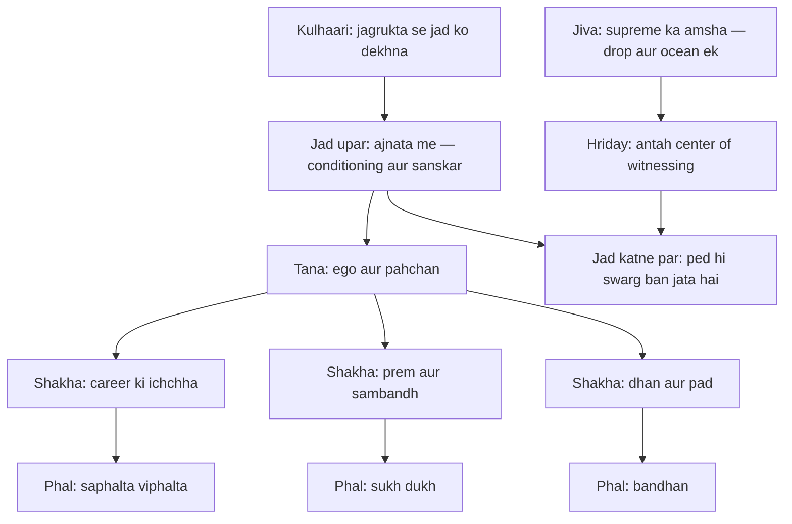
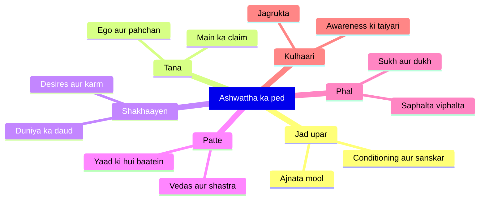

# अध्याय १५: पुरुषोत्तम योग — "Sansara ka ped — kaato isko kulhaari se"

> **"Sansara ka ped ulta hai — jad upar hai, aur shakhaayen neeche latakti hain. Yehi ped tumhara jeevan hai. Aur is ped ko kaatne ke liye ek hi kulhaari kaafi hai — jagrukta. Kulhaari jitni tez, ped utna jaldi girta hai."**
> — **ओशो**

---

Yuddh ke maidan par ab Krishna apni sabse guhya baat khol raha hai. Adhyaya 13-14 me usne field, knower aur teeno gunas ka vigyan diya tha. Ab Arjuna ek aur sawaal karta hai — aur Krishna kahte hain: "Ab main sabse guhya shastra bata raha hoon." (15.20). Wo ek ped ka chitra deta hai — ashwattha, peepal ka ped — jiska mool upar hai aur shakhaayen neeche. Osho kehte hain ki yeh adhyaya Gita ka sabse poetic adhyaya hai — yahan Krishna philosopher nahi, poet ban jata hai. Aur jo baat wo is ped ke chitra me batana chahta hai, wo Osho ki saari meditation ka antaral hai.

Osho is adhyaya ko "purushottam" — supreme person — ke naam se nahi, "sansara ke ped" ke naam se zyada yaad karte the. Unke liye yeh ped tumhare jeevan ka exact map hai: jad (jahan se tum aaye ho — conditioning, sanskar, ajnata), tana (ego — jahan sab kuch judta hai), shakhaayen (desires — jo har taraf failti hain), aur phal (outcomes — sukh dukh jo tum khaate ho). Osho kahte hain: "Jab tak tum is ped ka bhugol nahi samjhte, tab tak tum isme bhatakte rahoge. Aur jab samajh jaate ho, to tumhe pata chal jata hai ki ped ko neeche se nahi kaatna — neeche ki shakhaayen kabhi khatam nahi hoti. Kulhaari jad par lagti hai, aur jad upar hai — ajnata me, tumhare andar."

Aur is adhyaya me Osho ka sabse gahra point yeh hai: yeh ped hai bhi kya? Traditional reading kehti hai — yeh ped sansar hai, maya hai, jise kaat ke bhagwaan ke paas jaana hai. Osho kehte hain: "Yeh ped tumhara apna jeevan hai — tumhari sanskriti, tumhare sanskar, tumhari desires, tumhare karm. Isse nafrat mat karo — nafrat bhi isi ped ki ek shakha hai. Is ped ko jagrukta se kaato — aur jab jad kat jaati hai, to yeh ped swarg ban jata hai. Waise hi tumhara jeevan — jad katne ke baad — swarg hai." Isliye Osho is adhyaya ko "axe of awareness" ka adhyaya kehte the.

---

## Learning Objectives

Is chapter ko complete karne ke baad aap:

1. Adhyaya 15 ke key shlokas (15.1, 15.7, 15.15, 15.20) ko Devanagari, transliteration aur Hinglish arth ke saath samajh payenge.
2. Ashwattha — ulti jad wale ped — ka chitra samajh payenge: jad (ajnata), tana (ego), shakhaayen (desires), phal (karm-phal).
3. Osho ke "kulhaari jagrukta ki" ko samajh payenge — ped ko nafrat se nahi, awareness se kaatna.
4. Jiva ko "supreme ka amsha" aur Krishna ke "hriday me nivaas" ko Osho ke drishtikon se padh payenge — hriday = innermost center of witnessing.
5. "Sansara Tree Mapper" TypeScript tool ko run karke apne niji ped ka naksha bana payenge aur sabse moti jad ke liye awareness exercise generate kar payenge.

---

## पुरुषोत्तम योग का Parichay

Yeh adhyaya Gita ke andar ek "secrecy" ka adhyaya hai — Krishna khud ise guhyatamam (sabse guhya) kehte hain. Osho kehte hain: "Guhya hone ka matlab yeh nahi ki ise chhupaya gaya hai — guhya hone ka matlab hai ki ise sirf anubhav se samjha ja sakta hai, padh kar nahi." Isi liye Krishna is adhyaya me alag tarah se bolta hai — darshan ke roop me, chitra ke roop me. Ped ka chitra, jiva ka amsha, hriday ka nivaas — yeh sab direct experience ke liye bole gaye words hain, philosophy ke liye nahi.

### Ulta ped — ashwattha ka chitra

Peepal ka ped asli me kaisa hota hai? Uski jad neeche jati hai aur shakhaayen upar. Gita kahte hain ki is ped ka ulta hai — mool upar, shakhaayen neeche. Osho kehte hain: "Yeh sirf ek chitra hai, ise literal mat lo. Chitra ka matlab hai: tumhare jeevan ki jad wahan hai jahan tumhe dikhti nahi — tumhare bachpan me, tumhari sanskriti me, tumhare andar. Aur jo dikhta hai — tumhari desires, tumhare karm, tumhara sansar — wo sab neeche latakti hui shakhaayen hain." Osho kehte hain ki ped ka concept hi tumhare bachpan ka pehla bram hai — "tum sochte ho ki tum wahi ho jo tum dikh rahe ho. Lekin asli jad andar hai, ajnata me — aur usi jad se ped ugta hai."

### Traditional Reading vs Osho ki Reading

| Sawal | Traditional Reading | Osho ki Reading |
|-------|--------------------|-----------------|
| Ped kaun sa hai | Sansar — maya ka jaal | Tumhara apna jeevan — tumhari conditioning, desires, karm |
| Ped ko kaise kaatna hai | Sanyas — sansar tyaag karke | Jagrukta se — awareness hi kulhaari hai |
| Kaatne ke baad kya | Sansar se mukt ho kar Brahman me | Ped katne par wahi jeevan swarg ban jata hai |
| Jiva kya hai | Supreme ka alag amsha, jo sharir me bandha hai | Supreme ki ek lahar — drop aur ocean ek hain |
| Hriday ka matlab | Physical heart ya bhakti ka bhav | Innermost center of witnessing — antah chetna |
| 15.20 ka guhya | Kaafi log ise padh hi nahi paate (secret scripture) | Guhya hai kyunki experience se hi samajh aata hai |

Osho ke liye yeh table unki Gita ki vyakhya ka crown hai. Wo traditional reading ke "sansar tyaag" ko sabse bada bhram kehte the — kyunki tum sansar ho hi nahi jo tyaag sako; tumne ped ko khud hi ugaya hai. "Tyaag mat karo — dekhna seekho. Aur dekhna itna gahra ho jaye ki ped ki jad hi khatam ho jaye. Ped khatam hoga to bhi tumhari zindagi wahi rahegi — bas usme nafrat aur darr ki jagah prem aur jagrukta hogi."

### Purushottam kaun hai?

Yeh adhyaya ka naam purushottam hai — supreme person. Osho kehte hain: "Purushottam koi doosra nahi hai — purushottam wahi hai jo tum ban sakte ho jab ped ka chitra samajh jaate ho." Gita ke anusaar purush (aatma) aur prakriti (khet) me fark hai — aur purushottam wo hai jo dono ko paar kar ke apne purn swaroop me hai. Osho kehte hain: "Purushottam ka matlab supreme 'person' nahi — supreme 'witness' hai. Jab tum apne ped ki jad se upar uth jaate ho, jab tum nadi ke kinare khade hote ho — tab tum apne purushottam swaroop me ho." Isliye is adhyaya me Krishna sabse pehle ped ka chitra deta hai aur aakhri me kehta hai ki "yeh samajh lo, buddhiman ho jaoge" — kyunki ped ka gyan hi purushottam ki pehli seedhi hai.

---

## Key Shlokas

Is adhyaya me 20 shlokas hain. Osho ke liye chaar sections sabse important hain — ped ka chitra (15.1), jiva ka amsha (15.7), hriday ka nivaas (15.15), aur guhya ki ghoshna (15.20).

### Shloka 15.1

> ऊर्ध्वमूलमधःशाखमश्वत्थं प्राहुरव्ययम्।
> छन्दांसि यस्य पर्णानि यस्तं वेद स वेदवित्॥

**Transliteration:** ūrdhva-mūlam adhaḥ-śākham aśvatthaṁ prāhur avyayam; chhandāṁsi yasya parṇāni yas taṁ veda sa veda-vit

**Arth (Hinglish):** Ashwattha ped ko avyay (na samapt hone wala) kehte hain — jiska mool upar hai aur shakhaayen neeche. Jiske patte vedas (chhandas) hain — jo us ped ko jaanta hai, wo hi ved ka jaanne wala hai.

**Osho ka drishtikon:** Osho kehte hain: "Jad upar, shakhaayen neeche — yeh ek aisa chitra hai jo physics ke law ko tod deta hai. Aur isliye yeh chitra isliye hai kyunki tumhara jeevan bhi isi tarah ulta hai — dikhta hai ki tumne shuru kiya, lekin asli shuruat tumse pehle thi — tumhare bachpan me, tumhare maata-pita me, tumhari sanskriti me, aur unse pehle bhi." Ped ki jad wahan hai jahan tum kabhi na pahunchoge agar sirf neeche dekhoge. Osho kahte hain ki "ved-vit" — ved ko jaanna — ka matlab yeh nahi ki tumne vedas ko yaad kar liya. "Ved ka matlab hai jnana. Aur asli jnana yeh hai ki tum apne ped ki jad ko dekh sako — apne jeevan ka mool. Wo mool ajnata hai, aur ajnata ko dekhna hi ved-vit hona hai."

### Shloka 15.7

> ममैवांशो जीवलोके जीवभूतः सनातनः।
> मनःषष्ठानीन्द्रियाणि प्रकृतिस्थानि कर्षति॥

**Transliteration:** mamaivāṁśo jīva-loke jīva-bhūtaḥ sanātanaḥ; manaḥ-ṣaṣṭhānīndriyāṇi prakṛti-sthāni karṣati

**Arth (Hinglish):** Is jeev-lok me jeev mera hi sanatan amsha hai — lekin wo apne man (jiska man chhatha hai, paanch indriyon ke saath) ko prakriti me khinchta hai.

**Osho ka drishtikon:** Osho kehte hain: "Jeev bhagwan ka amsha hai — lekin yeh amsha ka matlab koi piece nahi hai. Ek tarah se socho: nadi me ek lahar — kya lahar samandar se alag hai? Na alag hai na samandar. Jeev bhi waise hi hai — supreme ki ek lahar jo bhatak gayi hai." Aur wo kyun bhatakti hai? Kyunki wo man aur indriyon ke saath jud gayi hai — "manah-shashthani" — paanch indriyan aur man, yeh chaar. Osho kahte hain: "Jeev ka bhatakna indriyon ki taraf kheenchne se hai — na ki indriyon ke karan. Indriyan toh prakriti ka hissa hain. Kheenchne wala man hai — aur man bhi prakriti ka hissa hai. Asli sawaal hai: kheenchne ki pahchan. Jab tum kheenchne ko dekhne lagte ho, to kheenchna khatam nahi hota — uske saath pahchan khatam hoti hai. Aur pahchan khatam hona hi amsha ka apne mool me lautna hai."

### Shloka 15.15

> सर्वस्य चाहं हृदि सन्निविष्टो मत्तः स्मृतिर्ज्ञानमपोहनं च।
> वेदैश्च सर्वैरहमेव वेद्यो वेदान्तकृद्वेदविदेव चाहम्॥

**Transliteration:** sarvasya chāhaṁ hṛdi sanniviṣṭo mattaḥ smṛtir jñānam apohanaṁ cha; vedaiś cha sarvair aham eva vedyo vedānta-kṛd veda-vid eva chāham

**Arth (Hinglish):** Main sab ke hriday me nivaas karta hoon; mujhse hi smriti, jnana aur apohan (bhoolna) aata hai. Aur saare vedon me jaanna-wala bhi main hi hoon — ved ka karta aur ved ka jaanne wala bhi main hi.

**Osho ka drishtikon:** Osho kehte hain: "Hriday yahan physical heart nahi hai — yeh tumhara innermost center hai, jahan se dekhna shuru hota hai. Wo center tumhare sharir me kahin nahi — wo tumhara hi antah chetna hai. Aur jab tum us center me pahunchte ho, to tumhe pata chalta hai ki wahan koi doosra nahi hai — wahan wahi hai jo sab me hai." Osho kahte hain ki smriti aur apohan — yaad aur bhoolna — dono usi center se aate hain. "Tum bhulte ho kyunki bhoolna bhi usi se aata hai — aur tum yaad karte ho kyunki yaad bhi usi se aati hai. Yeh dono khel hain us antah center ke. Aur isliye jnana bhi wahi hai, smriti bhi wahi hai — kyunki jo sabko janta hai, wo hi ved ka jaanne wala hai."

### Shloka 15.20

> इति गुह्यतमं शास्त्रमिदमुक्तं मयानघ।
> एतद्बुद्ध्वा बुद्धिमान्स्यात्कृतकृत्यश्च भारत॥

**Transliteration:** iti guhyatamaṁ śāstram idam uktaṁ mayā anagha; etad buddhvā buddhimān syāt kṛta-kṛtyaś cha bhārata

**Arth (Hinglish):** He anagh (paap-rahit) Arjuna, yeh sabse guhya shastra maine bata diya. Isse samajh kar hi buddhiman hota hai, aur yahi kaarya-siddh (jo karna tha ho gaya) hota hai.

**Osho ka drishtikon:** Osho kehte hain: "Guhya hone ka matlab hidden nahi — guhya hone ka matlab hai ki ise sirf anubhav se samjha ja sakta hai. Jo ise sirf padh leta hai, wo kuch nahi samjha. Jo is ped ko apne andar dekhta hai — jad, tana, shakhaayen — aur apne jeevan me kulta hai ki kaun si shakha kaun si jad se ugti hai, wo asli me buddhiman hai." Osho kahte hain ki "krit-kritya" — jo kaam kar liya — ka matlab yeh nahi ki usne koi job complete ki. "Jab tum apne ped ki jad ko dekh lete ho, to ek maatra kaam reh jata hai — jagrukta. Aur jab jagrukta puri ho jati hai, to tumhe pata chalta hai ki tumne kabhi kuch khoya hi nahi tha — tum hamesha usi ke paas the jiski talash thi."

---

## Sansara ka Ped — Osho ki gahrai mein

### Pehli gahrai: Ped ka bhugol — roots, trunk, branches, fruits

Osho kehte hain ki adhyaya 15 ka ped koi abstract symbolism nahi hai — yeh tumhara exact jeevan-map hai. Jad = tumhari deep conditioning — bachpan se jo bata diya gaya: "tum kya ho, duniya kaisi hai, tumhe kya chahiye." Tana = ego — wo center jahan se saari shakhaayen nikal-ti hain: "main" ka claim. Shakhaayen = desires — career, prem, dhan, pad, yash — har taraf failti hain. Phal = outcomes — sukh dukh, saphalta viphalta. Osho kahte hain: "Tum poore din ped ke phal todte ho — ek phal meetha, ek khatta. Aur phal ke chakkar me tumhe ped hi nahi dikhta. Lekin phal kabhi na tohode — phal to girengi aur ugengi. Ped ka swabhav badlo — jad dekhna shuru karo. Jis ped ki jad jagrukta se kat gayi, uske phal bhi swarg jaisi hoti hain."

### Doosri gahrai: Kulhaari jagrukta ki — axe of awareness

Traditional reading kehti hai ki ped ko kaatna hai — iska matlab sansar tyaag dena. Osho kehte hain: "Kulhaari kaisi honi chahiye? Jab koi ped kaatne jata hai, to wo neeche ki shakhaayen nahi todta — wo jad par maarta hai. Tumne kabhi kisi ko dekha hai ki wo ped ki 100 shakhaayen tod raha hai aur ped khada hai? Yeh to funny hai." Osho ka point: neeche ki shakhaayen — desires, habits — todte-todte tumhari zindagi kat jaayegi, aur ped wahi rahega. Kulhaari jad par lagti hai — jad upar hai, ajnata me — aur wo jad jagrukta hai. "Jagrukta se ped kaatne ka matlab: apni conditionings ko dekhna. Koi tumhe 'kamzor' kahe to tum gussa ho jaate ho — kyun? Kyunki tumne ek conditioning absorb kar li hai ki kamzor hona bura hai. Wo conditioning jad hai. Aur wo gussa shakha hai. Jagrukta se tum gusse ko nahi todte — tum jad ko dekhte ho ki yeh conditioning kab aayi, kisne di, kya uska asli sach hai. Aur jab jad kat jaati hai, shakha apne aap sukh jati hai."

### Teesri gahrai: Jiva, amsha aur hriday — Osho ka meaning of the heart

Osho kehte hain ki 15.7 aur 15.15 mil ke Gita ka sabse romantic point banate hain: jeev supreme ka amsha hai, aur supreme har jeev ke hriday me hai. "Amsha ka matlab koi tota hua hissa nahi — amsha ka matlab hai ki drop aur ocean ek hi tarah ke hain. Drop me ocean ki hi chetna hai — bas size alag hai, aur size bhi bhram hai." Aur hriday — Osho kehte hain: "Physical heart to paani aur khoon ka pump hai — Gita ka hriday wahaan nahi hai. Gita ka hriday woh center hai jahan se dekhna shuru hota hai — innermost center of witnessing. Us center ko kabhi koi sadharan eye nahi dekhta — us center se hi sab dekha jata hai." Osho kahte hain ki isi liye 15.15 kehta hai ki smriti aur apohan dono wahi se aate hain — "yaad rakhna aur bhoolna, dono ek hi source ke khel hain. Aur jo source hai — wo tumhara nivaas hai. Usi me jeev ka ghar hai."



Osho kehte hain ki is nakshe ka sabse important hissa yeh hai ki kulhaari jad par lagti hai — shakhaayon par nahi. "Ped ki shakhaayen todna — career chhodna, ghar chhodna — yeh to bahar ka khel hai. Andar ki jad wahi rahegi, aur phir se shakhaayen ug aayengi. Lekin jad ko jagrukta se dekho — aur ped apne aap badal jata hai."

### Ped ke hisse — psychological map

| Ped ka hissa | Gita ka symbol | Psychological equivalent | Osho ka lens |
|--------------|----------------|--------------------------|--------------|
| Jad (upar) | Ajnata mool — Brahman | Deep conditioning, sanskar, bachpan | "Jad wahan hai jahan tumne dekha hi nahi — wahin kulhaari lagti hai" |
| Tana | Ashwattha ka mool — ego | "Main" ka claim — pehchaan | "Tana wahi hai jahan se shakhaayen nikalti hain — sab desires ego se" |
| Shakhaayen | Desires aur karm | Career, prem, dhan, yash | "Shakhaayen todne se kuch nahi — wo hamesha ugti hain" |
| Patte | Chhandas — vedas | Scripture, yaad ki hui baatein | "Patte ped ke saath badalte hain — ped jagruk hua to patte bhi jeevit" |
| Phal | Sukh dukh, karm-phal | Outcomes | "Phal mat todo — jad dekhna seekho, phal apne aap badal jate hain" |

### Chauthi gahrai: Purushottam — supreme person ka arth

Yeh adhyaya purushottam yoga hai — lekin Osho kehte hain ki "purushottam" ko person mat samjho, consciousness samjho. "Purush ka matlab hai chetna — jo prakriti (khet) se alag hai. Aur purushottam ka matlab hai wo chetna jo apne purn swaroop me hai — jo apne mool me lout aayi hai." Isliye is adhyaya me Krishna ped se shuru karta hai — kyunki ped ko samjhe bina purushottam ko samajhna impossible hai. Osho kahte hain: "Jab tak tum apne ped ke chakkar me ho — jad, tana, shakhaayen — tab tak tum purush ho bhi aur nahi bhi. Jab ped ka chakra samajh me aa jata hai — aur tum usko dekhne wale ban jaate ho — tab tum purushottam ho." Osho kehte hain ki purushottam koi competition ka title nahi hai — "yeh tumhara ghar hai, jahan se tum kabhi aaye hi nahi the. Ped ka bhatakna hi ek bhram tha — jad wahi thi jo tum the."



Osho kehte hain ki yeh mindmap padhna nahi hai — ise dekhna hai, apne andar banana hai. "Jab tum apne ped ko is tarah se upar se dekhne lagte ho — jaise koi helicopter se dekh raha ho — to tum wahi ho jo ped ke upar hai. Aur jo ped ke upar hai, wahi purushottam hai. Ped neeche latka hai, tum upar ho — yahi ulti jad ka rahasy hai."

---

## TypeScript Implementation

Yeh tool aapke niji sansara-ped ka naksha banata hai. Roots (deep conditioning) add karo, branches (desires) add karo, aur tool sabse moti jad ko identify karke uske liye "axe of awareness" exercise generate karta hai. Osho kehte hain: "Ped ka naksha banana hi aadha kaam hai — baaki aadha kaam hai jad ko roz dekhna."

```typescript
/**
 * Sansara Tree Mapper — Adhyaya 15 ka practice tool
 *
 * Ashwattha ka ped ulta hai: jad upar (ajnata — mool chetna),
 * tana (ego), shakhaayen (desires), phal (sukh dukh).
 *
 * Osho kehte hain: "Is ped ko nafrat se mat kaato —
 * kulhaari jagrukta ki honi chahiye, aur jad upar hai,
 * isliye neeche ki shakhaayen kaatne se kuch nahi hoga."
 *
 * Tool: apne niji ped ka naksha banao — jad (deep conditioning),
 * tana (ego), shakhaayen (desires), phal (outcomes) —
 * aur sabse moti jad ke liye awareness exercise generator.
 */

interface TreeRoot {
  name: string;
  source: string;
  strength: 1 | 2 | 3 | 4 | 5;
}

interface TreeBranch {
  name: string;
  desire: string;
  fruit: string;
  feedsOnRoot: string;
}

class SansaraTreeMapper {
  private roots: TreeRoot[] = [];
  private branches: TreeBranch[] = [];

  addRoot(root: TreeRoot): void {
    this.roots.push(root);
    console.log(`[JAD] ${root.name} — source: ${root.source}, strength: ${root.strength}/5`);
  }

  addBranch(branch: TreeBranch): void {
    this.branches.push(branch);
    console.log(`[SHAKHA] ${branch.name} — desire: ${branch.desire}`);
    console.log(`  feeds on root: ${branch.feedsOnRoot}, fruit: ${branch.fruit}`);
  }

  getStrongestRoot(): TreeRoot {
    const sorted = [...this.roots].sort((a, b) => b.strength - a.strength);
    return sorted[0];
  }

  getAxeExercise(root: TreeRoot): string {
    return [
      `Axe of awareness: root "${root.name}" ki strength ${root.strength}/5 hai.`,
      `5-min practice: jab bhi ${root.name} trigger ho, 1 minute ruko.`,
      `Poochho: "Yehi baat kab aayi? Kisne mujhe yeh bataya tha?"`,
      `Source ${root.source} ko yaad karo — aur dekho ki wo baat aaj bhi true hai ya sirf bachpan ki tani hui jad hai.`,
      `Osho: "Jad ko dekhna hi kulhaari hai. Dekhna pura, katna automatic."`,
    ].join("\n");
  }

  summarize(): void {
    console.log("\n--- SANSARA TREE MAP ---");
    console.log(`Jadein (roots): ${this.roots.length}`);
    this.roots.forEach((r) => console.log(`  - ${r.name} (${r.strength}/5)`));
    console.log(`Shakhaayen (branches): ${this.branches.length}`);
    this.branches.forEach((b) => console.log(`  - ${b.name} -> fruit: ${b.fruit}`));
    const strongest = this.getStrongestRoot();
    console.log(`\nSabse moti jad: ${strongest.name} (${strongest.strength}/5)`);
    console.log(this.getAxeExercise(strongest));
  }
}

function runDemo(): void {
  const mapper = new SansaraTreeMapper();

  mapper.addRoot({
    name: "Approval seeking",
    source: "Bachpan me 'good boy' banna zaroori tha",
    strength: 5,
  });

  mapper.addRoot({
    name: "Paise ka darr",
    source: "Ghar me kabhi kabhi kami hui thi",
    strength: 4,
  });

  mapper.addRoot({
    name: "Kriti (achievement) ki bhookh",
    source: "Comparison se bada hua jeevan",
    strength: 3,
  });

  mapper.addBranch({
    name: "Soshal media ka chakkar",
    desire: "Har jagah dikhna aur approve hona",
    fruit: "Dusre ki nazar par depend karna",
    feedsOnRoot: "Approval seeking",
  });

  mapper.addBranch({
    name: "Overworking",
    desire: "Har deadline se pehle kaam khatam karna",
    fruit: "Stress aur burnout",
    feedsOnRoot: "Paise ka darr",
  });

  mapper.addBranch({
    name: "Constant courses aur certificates",
    desire: "Har koi doosre se aage rehna",
    fruit: "Kabhi poori tarah satisfied na hona",
    feedsOnRoot: "Kriti ki bhookh",
  });

  mapper.summarize();
}

runDemo();
```

---

## Summary

| Bindu | Saar |
|-------|------|
| Ashwattha ped | Ulta ped — jad upar, shakhaayen neeche; jad ajnata me, tumhare conditioning me |
| Kulhaari | Jagrukta — awareness — jad par lagti hai, shakhaayon par nahi |
| Jiva (15.7) | Supreme ka sanatan amsha — drop aur ocean ek; bhatakna man-indriyan ki pahchan se |
| Hriday (15.15) | Innermost center of witnessing — physical heart nahi; smriti-apohan dono wahi se |
| Guhya (15.20) | Sabse guhya isliye ki sirf anubhav se samjha ja sakta hai — padh kar nahi |

---

## Contradictions

- **Ped = maya jo tyaagni hai (traditional) vs ped = tumhara jeevan jo jaanna hai (Osho):** Traditional reading sansar ko maya ka jaal maan kar usse bhagane ko kehti hai. Osho kehte hain: "Tum sansar ho hi nahi jo tyaag sako — tumne ped khud ugaya hai. Nafrat bhi ped ki hi shakha hai. Jaanna hi kaatna hai."
- **Kulhaari = sanyas (traditional) vs kulhaari = jagrukta (Osho):** Ped kaatne ka matlab ghar-chhor-na aur sanyasi banna maana gaya. Osho kehte hain: sanyas bhi ek shakha hai — wo toh nayi conditioning hai. Asli kulhaari awareness hai jo jad par lagti hai — wahi sansar me rehte hue bhi chal sakti hai.
- **Jiva = alag aatma (traditional) vs jiva = supreme ki lahar (Osho):** "Mamaivamsho" ko kai commentators individual soul ka permanent amsha maante hain. Osho kehte hain: lahar samandar se alag nahi hai — alag lagna hi moh hai. Amsha ka arth unity hai, division nahi.
- **Hriday = bhakti ka bhav ya physical heart (traditional) vs hriday = witnessing ka center (Osho):** 15.15 ka "hridi" physical heart se jod kar bhakti-ras bana diya gaya. Osho kehte hain: Gita ka hriday koi organ nahi — wo antah chetna hai jahan se dekhna shuru hota hai.
- **Ved-vit = ved shastra ka pandit (traditional) vs ved-vit = jeevan ki jad ka jaanne wala (Osho):** 15.1 ko "ved padhne wala" maana ja sakta hai. Osho kehte hain: ved ka matlab jnana hai — aur jnana to tab hota hai jab tum apne ped ki jad dekho, patton ko nahi.

---

## Open Questions

- Agar jad upar hai — ajnata me — to kya koi bhi "pure" jagrukta me aakar apni saari conditioning ek saath dekh sakta hai? Ya jagrukta khud ek lambi process hai?
- Drop aur ocean ek hain — to "amsha" ka concept kyun diya gaya? Kya amsha ek aisa metaphor hai jo division ko hi myth banata hai?
- 15.15 kehta hai smriti aur apohan dono usi center se aate hain — to kya bhoolna bhi divine hai? Aur agar bhoolna divine hai, to "bhool" ke karan hona wala dukh bhi divine?
- Ped katne ke baad bhi kya jeev bhatak sakta hai? Ya jad ek baar kat jaye, to ped ka phir se ugna impossible hai?

---

## Practical Takeaways

| Situation | Gita shloka | Osho's lens | Action |
|-----------|-------------|-------------|--------|
| Koi baat trigger karti hai — jad se gussa aata hai | 15.1 — jad upar hai | Trigger hi jad ki nishani hai — trigger ko gussa na banao, map banao | Trigger aane par 1 minute: "yeh kaun si jad hai, kisne lagayi?" |
| Career me daud aur koi satisfaction nahi | 15.7 — man-indriyan kheenchte hain | Kheenchne ko dekhna — kheenchne se pahchan na karna | Din me 10 minute bina kisi desire ke baithna — man ko dekhna |
| Akelapan lagta hai — "main hi hoon" | 15.15 — hriday me nivaas | Tumhara antah center wahi hai jo sab me hai | So jaane se pehle 2 minute: "jo dekh raha hai, wahi sab me hai" |
| Purani aadat todne me fail rehna | 15.20 — guhya shastra | Aadat shakha hai — jad conditioning hai | Ek aadat chuno, uski jad ka source likho — exercise generator se practice karo |
| Koi ajeeb si sadness — jaise kuch choot gaya | 15.7 + 15.20 — amsha aur ghar | Drop ko ocean yaad nahi — isliye khali lagta hai | Roz 1 minute: "main usi ka amsha hoon jiska sab hai" |

---

## Chapter Quiz

### Question 1
Adhyaya 15 ka ped kaunsa hai?

a) Aam ka ped
b) Ashwattha (peepal) ka ped
c) Kela ka ped
d) Neem ka ped

<details><summary>Answer</summary>

**b) Ashwattha (peepal) ka ped** — 15.1: "ऊर्ध्वमूलमधःशाखमश्वत्थम्" — ashwattha ped, jiska mool upar hai.

</details>

### Question 2
Is ped ki jad kis taraf hai?

a) Neeche — zameen me
b) Upar — ajnata me
c) Beech me — tana me
d) Ped ki koi jad nahi hoti

<details><summary>Answer</summary>

**b) Upar — ajnata me** — Gita kahte hain "ऊर्ध्वमूलम्" — mool upar hai; Osho kehte hain jad tumhari conditioning me hai, andar.

</details>

### Question 3
15.1 me "chhandamsi" (vedas) ped ke kis hisse se compare kiye gaye hain?

a) Jad se
b) Tana se
c) Patte se
d) Phal se

<details><summary>Answer</summary>

**c) Patte se** — "छन्दांसि यस्य पर्णानि" — chhandas iske patte hain. Osho kehte hain: patte ped ke saath badalte hain — jeevit jnana ki nishani.

</details>

### Question 4
Is ped ko kaatne ki kulhaari kya hai, Osho ke anusaar?

a) Sanyas — ghar chhod dena
b) Jagrukta — awareness
c) Tapasya — kathin vrat
d) Dhan — bahut saara paisa

<details><summary>Answer</summary>

**b) Jagrukta — awareness** — Osho kehte hain: "Kulhaari jad par lagti hai, aur jad ko kaatne wali ek hi cheez hai — jagrukta."

</details>

### Question 5
15.7 ke anusaar jeev kya hai?

a) Supreme ka sanatan amsha
b) Ek alag atma jo kabhi supreme se judi hi nahi
c) Sharir ka naam
d) Prakriti ka pratinidhi

<details><summary>Answer</summary>

**a) Supreme ka sanatan amsha** — "ममैवांशो जीवलोके जीवभूतः सनातनः" — jeev mera hi sanatan amsha hai.

</details>

### Question 6
Jeev kis ko "karshati" (kheenchta) hai, 15.7 ke anusaar?

a) Sirf man ko
b) Man aur paanch indriyon ko
c) Sirf indriyon ko
d) Sirf buddhi ko

<details><summary>Answer</summary>

**b) Man aur paanch indriyon ko** — "मनःषष्ठानीन्द्रियाणि" — jisme man chhatha hai, paanch indriyon ke saath.

</details>

### Question 7
15.15 ke anusaar Krishna kahan nivaas karta hai?

a) Har mandir me
b) Har praani ke hriday me
c) Sirf sanyasi ke hriday me
d) Aasman me

<details><summary>Answer</summary>

**b) Har praani ke hriday me** — "सर्वस्य चाहं हृदि सन्निविष्टः" — main sab ke hriday me nivaas karta hoon.

</details>

### Question 8
Osho ke liye "hriday" ka matlab kya hai?

a) Physical heart — jo khoon pump karta hai
b) Innermost center of witnessing — antah chetna
c) Prem ka bhavna kendra
d) Chhati ka hissa

<details><summary>Answer</summary>

**b) Innermost center of witnessing — antah chetna** — Osho kehte hain: "Gita ka hriday koi organ nahi — wo center hai jahan se dekhna shuru hota hai."

</details>

### Question 9
15.15 ke anusaar smriti aur apohan (bhoolna) kahan se aate hain?

a) Man se
b) Sharir se
c) Ussi antah center se jahan supreme nivaas karta hai
d) Sansar se

<details><summary>Answer</summary>

**c) Ussi antah center se jahan supreme nivaas karta hai** — "मत्तः स्मृतिर्ज्ञानमपोहनं च" — mujhse hi smriti, jnana aur apohan.

</details>

### Question 10
Krishna adhyaya 15 ko kis naam se bulata hai?

a) Sahaj shastra
b) Guhyatamam shastra — sabse guhya
c) Saral shastra
d) Karm shastra

<details><summary>Answer</summary>

**b) Guhyatamam shastra — sabse guhya** — 15.20: "इति गुह्यतमं शास्त्रम्" — Osho kehte hain: guhya isliye ki experience se hi samajh aata hai, padh kar nahi.

</details>

---

## Exercises

1. **Tree map banao:** Paper par apna sansara-ped draw karo — upar jad (3-4 conditioning), beech me tana (ego ke claims), neeche shakhaayen (5-6 desires), aur har shakha ke phal (outcomes). Sansara Tree Mapper tool se cross-check karo.
2. **Trigger-to-root practice:** 5 din tak har trigger (jab koi baat aapko bekaabu kare) par 1 minute ka pause: "yeh kaun si jad hai? Kisne yeh conditioning di?" — journal me note karo.
3. **5-min daily axe:** Roz subah 5 minute apni sabse moti jad par dhyan — us source ko yaad karo jahan se aayi thi, aur uske aaj ke "truth value" ko test karo. Osho kehte hain: "Jad ko dekhna hi kulhaari hai."
4. **Amsha meditation:** Roz 2 minute socho: "jo mere andar dekh raha hai, wahi sab me dekh raha hai." Isse jeev-amsa aur hriday-nivaas dono ka anubhav hota hai.
5. **Phal chhodna:** Ek hafte me ek aisi cheez chuno jiska phal (result) tumhe control nahi karna — sirf karm karo, phal chhodo. Har roz us practice ka ek line journal me likho.
6. **Ped ka safar:** Adhyaya 15 ke 20 shlokas ko 4 hisso me baant kar (1-6, 7-11, 12-15, 16-20) har hisse ke baad apne ped ke naksha me naya hissa add karo — aur antim hissa complete hone par naksha ke paas likho: "ab jad dikh rahi hai."

---

## Further Reading

- Osho, *Gita Darshan* (6 volumes, Bombay 1973-1976) — adhyaya 15 par unke original discourse is course ka mool aadhaar hain.
- Osho, *The True Name* — ek upanishad par unka drishtikon, jisme jiva-bhagwan ke sambandh ki gahrai hai.
- Swami Chinmayananda, *The Holy Geeta* — traditional ashwattha symbolism ko samajhne ke liye.
- Eknath Easwaran, *The Bhagavad Gita* — ped aur hriday ke practical reading ke liye.
- Adi Shankaracharya, *Gita Bhashya* — jnana-marg ki classical vyakhya, jisse Osho ka contrast samajh aata hai.
