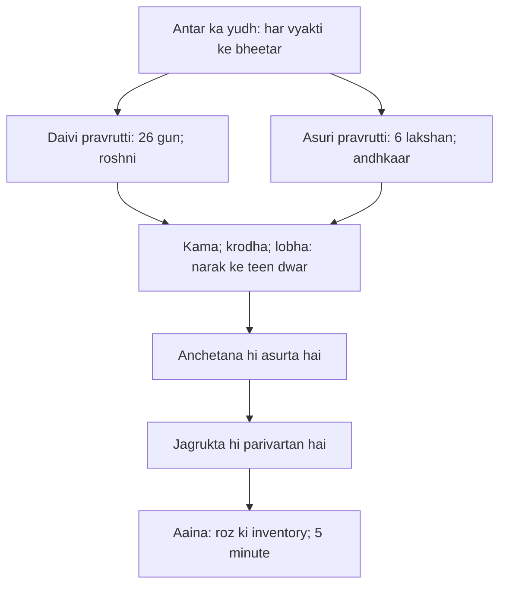
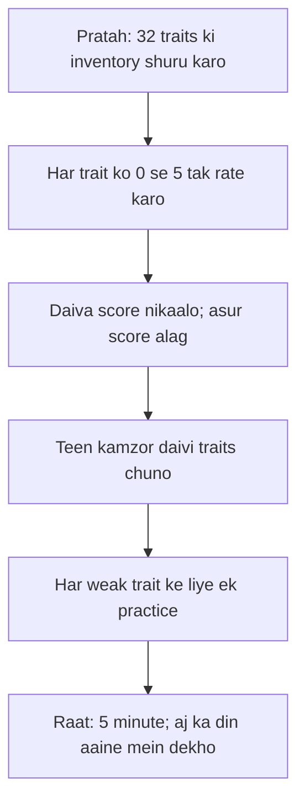

# अध्याय १६: दैवासुर सम्पद्विभाग योग — "Do prakar ke log nahin, do pravruttiyan hain"

> **"Krishna tumhe koi nayi shiksha nahin de raha. Woh to tumhare saamne ek aaina rakh raha hai. Aaina kya batata hai? Yah ki devta aur danav — dono tumhare andar maujood hain. Ab sawaal yeh hai ki tum kaunsa chehra palat ke dekhte ho."**
> — **ओशो**

---

Yudh ke solahvein din ka sawera hua. Pachis-ekkis din ki gyarah-akshauhini sena — kurukshetra ka maidaan — aur phir bhi Gita ka asli maidaan koi aur jagah hai. Krishna ne arjun ko dhanush se lekar aatma tak sab sikha diya: karma, gyan, bhakti — chaar adhyay rup mein. Ab solahvan adhyay mein woh aamne-saamne ka sach batata hai. Woh kehta hai: "Arjun, ab aaina uthao aur apna hi chehra dekho." Gita ka yeh adhyay bahar ki duniya ke baare mein nahin hai — yeh andar ki duniya ki pehli puri inventory hai.

Osho is adhyay ko kahin se bhi shastra nahin manate. Unke liye yeh Gita ka sabse psychological adhyay hai — shaayad poore sanatan darshan mein sabse pehla personality inventory. Osho kehte hain: humne apni duniya mein do boxes bana rakhe hain — achhe log aur bure log, devta aur danav, sant aur paapi. Gita ka solahvan adhyay in dono boxes ko tod deta hai. Woh batata hai ki devta aur danav log nahin hain — pravruttiyan hain, energy ke flow hain, chetna ke levels hain. Aur yeh dono pravruttiyan har vyakti ke andar ek saath bahti hain.

Osho ka focus is adhyay mein ek hi hai: jagrukta. Asurta koi aulad nahin hai jo kisi ke sir par madir se aayi — asurta anchetana hai. Aur devta banne ka koi sankalp nahin, koi vrat nahin — devta banne ka ek hi raasta hai: apne andar ke andhiyaare ko jagrukta ki roshni se dekhna. Yeh adhyay tumhe 26 gunon ki list deta hai aur 6 asuri lakshan bhi batata hai — lekin list kisi ko judge karne ke liye nahin. List aaine ke liye hai. Is chapter ko complete karne ke baad tum khud ko aise dekho jis tarah Krishna arjun ko dikhata hai — bina chhupaye, bina badal ke.

## Learning Objectives

Is chapter ko complete karne ke baad aap:

1. Samajh paoge — 26 daivi sampattiyan aur 6 asuri lakshan ek "logon ki shreni" nahin, "antah-pravruttiyon ka naksha" hain — aur is fark ko samajhna hi is adhyay ka darwaza hai.
2. Pehchan paoge — Osho ka yeh core standpoint: koi bhi vyakti poora devta ya poora danav nahin hota; har insaan mein dono dhaaraen behti hain, aur asurta ka matlab sirf "anchetana hona" hai.
3. Janoge — kama, krodha, lobha — narak ke teen dwar — Osho ki drishti mein yahan "narak" koi bhugolik jagah nahin, balki chetna ki ek dasha hai jismein tum khud ko band kar lete ho.
4. Sikho ge — 16.23-24 ke shastra ke aadhar ko Osho kaise ulta padhte hain: shastra baahar ka danda nahin, andar ki jagrukta ka ayana hai.
5. Vyavahar mein utaroge — ek daily "daiva-score" system — 26 gunon ko 0 se 5 tak rate karna aur 3 kamzor gunon ke liye ek-ek abhyas — jo is adhyay ko diary se jeewan mein le aaye.

---

## Daivasura Sampad ka Parichay

### Yeh adhyay Gita mein kahan khada hai

Gita ke do bade hisse hain — pehle 6 adhyay karma marg ke, agle 6 bhakti marg ke, aur aakhri 6 gyan marg ke. Solahvan adhyay gyan-khand ke beech mein aata hai — lekin ismein koi naya siddhant nahin hai. Yeh to ek "lagaav ka patra" hai: Krishna kehte hain, itna sab kuch samajh liya tumne — ab dekho ki tumhare andar kya chal raha hai. Shankaracharya ne is adhyay ko "svabhav-siddha gunon ki pariksha" kaha; Osho ise "chetna ka darpan" kahte hain.

Mahabharat ke katha-sootra mein yeh adhyay yudh ke solahvein din aata hai — woh din jab abhimanyu maara gaya tha. Arjun ki aankhon ke saamne uske apne bete ki mrityu — aur phir bhi Krishna gyaan hi de raha hai. Osho is jagah ko kaise dekhte hain? Arjun ki vyatha dekho — woh din-raat sirf sambandhon mein sochta hai. Krishna ise thoda hi hila paata hai. Osho kehte hain: jab tak tum apne andar ke danav ko nahi dekhte, duniya ka danav tumhe har baar haara dega. Bahar ka yudh khatam ho sakta hai; andar ka yudh khatam hone ka naam hi moksha hai.

### 26 daivi sampattiyan — checklist, fatwa nahin

Shlok 16.1 se 3 mein Krishna 26 gun ginata hai. Osho kehte hain: yeh list koi "achhe aadmi ka certificate" nahin hai — yeh ek mirror-checklist hai. Roz raat soo kar 2 minute ke liye is list ko padho aur apne din ko iske saamne rakho. Jahan tum jhooth bole, wahan satya ki kamii dikhegi. Jahan tumne krodh khaya, wahan akrodh ki kami dikhegi. Yehi toh inventory hai — aur inventory ka fayda tab hai jab woh dard de, certificate nahin.

### Devta aur danav — do dunia nahin, ek hi dunia ke do levеl

Osho is adhyay ko padhte hain jaise ek psychologist apne patient ka case-file padhta hai. Devta koi aakaash ka prani nahin; danav koi paatal ka bhut nahin. Devta = chetna, jagrukta, sakshi-bhaav. Danav = anchetana, nidra, maha-nidra. Wohi aadmi shaam tak kitna badalta hai — subah meditation mein sant, dopahar office mein lobhi, raat ko krodhi. Kaun hai woh? Koi sirf sant nahin, koi sirf danav nahin — woh dono ka sankraman hai. Osho ise "personality ka samaantar mausam" kahte hain — mausam badalna band hota hai jab tum observe karne lagte ho.

| Aayam | Paaramparik Vachan | Osho ka Padhna |
|-------|-------------------|----------------|
| Sampatti ka arth | Daivi sampatti = achhe logon ka gun; asuri sampatti = bure logon ka dosh | Sampatti = chetna ki avastha; log nahin, pravruttiyan |
| Din-bhaad | Devta log alag duniya se aaye; danav log alag yoni se | Dono har insaan ke andar ek saath rehte hain |
| Narak (16.21) | Narak = marne ke baad ki saza ki jagah | Narak = abhi, isi pal, anchetana ki dasha |
| Asurta ka kaaran | Asurta = paap-karm ka phal | Asurta = jagrukta ki kami; koi "paap" nahin, sirf nind |
| Shastra (16.23-24) | Shastra = veda-vidhi ka danda, ullanghan karne par saza | Shastra = andar ka aaina; jagrukta hi ekmatra niyam |
| Moksh ka raasta | Dono sampattiyon mein se daivi ko apnao, asuri ko chhodo | Dono ko jagrukta se dekho — dekhna hi parivartan hai |
| Krishna ka rol | Krishna = bhagwan, vyavastha ka rakhyak | Krishna = sakshi aur strategist; tumhare andar ka saakshi |

---

## Key Shlokas

### Shloka 16.1-3

> श्रीभगवानुवाच |
> अभयं सत्त्वसंशुद्धिर्ज्ञानयोगव्यवस्थितिः |
> दानं दमश्च यज्ञश्च स्वाध्यायस्तप आर्जवम् ॥ १ ॥
>
> अहिंसा सत्यमक्रोधस्त्यागः शान्तिरपैशुनम् |
> दया भूतेष्वलोलुप्त्वं मार्दवं ह्रीरचापलम् ॥ २ ॥
>
> तेजः क्षमा धृतिः शौचमद्रोहो नातिमानिता |
> भवन्ति सम्पदं दैवीमभिजातस्य भारत ॥ ३ ॥

**Transliteration:** abhayam sattva-samshuddhih jnana-yoga-vyavasthitih | danam damashcha yajnashcha svadhyayas-tapa arjavam || ahimsa satyam akrodhas-tyagah shantir-apashunam | daya bhuteshv-aloluptvam mardavam hrir-achapalam || tejah kshama dhritih shaucham-adroho naati-manita | bhavanti sampadam daivim-abhijatasya bharata ||

**Arth (Hinglish):** Krishna kehta hai — nirbhayta, chetna ki shuddhi, gyan-mein sthirta, daan, indriy-daman, yajna, svadhyay, tap, saralta; ahimsa, satya, krodh-rahitata, tyag, shanti, parishad ka bhushan bhi nahin — kahne ka bhaav yeh hai ki kisi ki ninda karna nahin; dayalu bhaav, lobh-rahitata, komalta, lajja (hri), chanchalti ka abhaav; tejas, kshama, dhriti, shauch, droh ka abhaav, abhimaan ka abhaav — yeh 26 gun daivi sampatti hain.

**Osho ka drishtikon:** Osho kehte hain, yeh list ek khoobsurat khaana-pakka list hai — 26 cheezein jo tumhare andar "kaam" karti hain. Koi bhi ise ek saath nahin kar sakta — ise ek saath karna zaroori bhi nahin. Roz ek gun chuno, us par 24 ghante jagruk raho. List padhte hi nahin — list jeete hain. Aur ek baat Osho khaas batate hain: list mein "hri" aur "achapalam" bhi hai — lajja aur sthirta. Laaj ke bina vyakti kabhi nahi badalta; sthirta ke bina koi viksit nahi hota. Yeh 26 gun koi aadarsh nahin — yeh tumhare chetna-rajya ki rekha-koshikayein hain.

### Shloka 16.4

> दम्भो दर्पोऽभिमानश्च क्रोधः पारुष्यमेव च |
> अज्ञानं चाभिजातस्य पार्थ सम्पदमासुरीम् ॥ ४ ॥

**Transliteration:** dambho darpo 'bhimanashcha krodhah parushyam-eva cha | ajnanam-chabhijatasya partha sampadam-asurim ||

**Arth (Hinglish):** Krishna kehta hai — pakhanda (dambh), garv (darpa), abhimaan, krodh, kathorta (parushya) aur ajnana — yeh chhe asuri sampatti ke chinh hain.

**Osho ka drishtikon:** Osho is shlok ko lekar kehte hain — dekho, asuri list mein sabse pahla gun "dambh" hai — pakhanda, kuch ban-ne ka dikhawa. Aur sabse aakhri hai "ajnana" — anchetana. Beech mein garv, abhimaan, krodh, kathorta. Osho kahtе hain: yeh chhe alag beemariyan nahin hain — yeh ek hi beemari ke chhe lakshan hain. Beemari ka naam hai anchetana. Pakhandi aadmi pura jagat jhooth bolta hai kyunki woh khud ko nahi jaanta. Abhimaani aadmi sabko chhota dekhta hai kyunki woh apni kamzorii ko duba deta hai. Ek hi ilaaj hai — jagrukta. Jab jagrukta aati hai, dambh ka stage khud khali ho jaata hai.

### Shloka 16.21

> त्रिविधं नरकस्येदं द्वारं नाशनमात्मनः |
> कामः क्रोधस्तथा लोभस्तस्मादेतत्त्रयं त्यजेत् ॥ २१ ॥

**Transliteration:** trividham narakasyedam dwaram nashanam-aatmanah | kamah krodhas-tatha lobhas-tasmad-etat-trayam tyajet ||

**Arth (Hinglish):** Krishna kehta hai — yeh teen dwar narak ke hain, aatma ke nash ke karan hain: kama (ichchha-bhukh), krodh aur lobh. Isliye in teenon ko chhod do.

**Osho ka drishtikon:** Osho kehte hain — "narak" ka matlab yahan kabar nahin hai. Narak woh pal hai jab tum apni ichchha mein doob kar so jaate ho, jab krodh tumhare vishesh-gyan ko kha jaata hai, jab lobh tumhe woh karwata hai jo tum kabhi nahi karte. Kama, krodh, lobh — yeh dwar hain aur yeh dwar tumhare andar khulte hain. Koi bhagwan inhe band nahi kar sakta; koi pujari inhe band nahi kar sakta. Jagrukta ke saath yeh dwar apne aap band ho jaate hain — kyunki dwar sirf andhe ko dikhte nahin. Jab tum dekhne lagte ho, dwar ke aage kharha hone ka maza hi khatam ho jaata hai.

### Shloka 16.23-24

> यः शास्त्रविधिमुत्सृज्य वर्तते कामकारतः |
> न स सिद्धिमवाप्नोति न सुखं न परां गतिम् ॥ २३ ॥
>
> तस्माच्छास्त्रं प्रमाणं ते कार्याकार्यव्यवस्थितौ |
> ज्ञात्वा शास्त्रविधानोक्तं कर्म कर्तुमिहार्हसि ॥ २४ ॥

**Transliteration:** yah shastra-vidhim-utsrijya vartate kama-karatah | na sa siddhim-avapnoti na sukham na param gatim || tasmat-shastram pramanam te karyakarya-vyavasthitau | jnatva shastra-vidhanoktam karma kartum-iharhasi ||

**Arth (Hinglish):** Krishna kehta hai — jo shastra ki vidhi ko chhod kar man-maani se chalta hai, woh na siddhi paata hai, na sukh, na param gati. Isliye tera aadhar shastra hi hai — jo karna hai, jo nahin karna hai, uski vyavastha shastra se jaan kar hi karma kar.

**Osho ka drishtikon:** Yahan Osho apna sabse kathin sawaal uthate hain — woh kahte hain, Krishna is shlok mein "shastra" kehta hai, lekin woh kis shastra ki baat kar raha hai? Veda-karmakand ki nahin — apne andar ke dharma ki, apne bheetar ke aaine ki. Osho kahte hain: shastra wohi hai jo tumhare andar ka sakshi tumhe bataaye. Bahar ka shastra tumhe rules deta hai; andar ka shastra tumhe jagrukta deta hai. Man-maani (kama-kar) tab tak bhaari padti hai jab tak tum soye ho. Jagruk aadmi ke liye shastra aur kama mein koi jhagda nahin — woh apne andar ke pravah ko dekh kar chalne wala hain. Yeh shlok osho ki nazar mein Gita ka "swatantra bhavishyavaani" hai.

---

## Do Pravruttiyan — Osho ki gahrai mein

### "Koi bhi poora devta nahin, koi bhi poora danav nahin"

Osho is adhyay par ek poora din bolte hain — aur unka baar-baar lautne wala point yahi hai: yeh classification logon ke liye nahin, pravruttiyon ke liye hai. Woh kehte hain, "Main tumse kahta hoon — tumhare andar bhi kanch ka ghar hai aur bhooton ka mahal bhi. Tum sirf yeh tay karte ho ki kiski khaatir khidki kholo."

Ek udaharan woh dete hain — Gandhi aur Hitler ki. Logo ne inhe do duniyaon ke do naaqon ki tarah dekha. Osho kahte hain: nahin — dono mein wahi 26 daivi gun aur wahi 6 asuri lakshan maujood the. Fark sirf yeh tha ki ek ne apne asuri hisse ko anchetana mein nahi rakha — woh us par jagruk tha. Dusra apne daivi hisse ko bhi chetna ki hesi mein istemaal kar raha tha. Tumhe duniya ke devta-danav ki list nahi banana — tumhe apne andar ke dono se parichay karna hai. Aur jab tak tum apne andar ke danav se dosti nahi karte, woh tumhara maalik bana rahega.

### Teen narak-dwar: anchetana ki teen gateway

Osho 16.21 ko "chetna ka security-system" kehte hain. Kama, krodh, lobh — teen dwar jo bahar se nahin, andar se khulte hain.

| Dwar | Paaramparik matlab | Osho ka arth | Jab jagrukta aati hai |
|------|-------------------|--------------|----------------------|
| Kama | Sex ya bhog ki ichchha | Har ichchha ka andha-jwalan: paise, naam, pad, bhog — kisi bhi vastu ka "aur chahiye" | Ichchha ko dekhna — usse nahin, uske aane-jane ko dekhna |
| Krodh | Gussa | Ichchha ke tootne par chetna ka dhamak — andar ka bacha | Krodh ke uthne se pehle uska sukshma sanket pakadna |
| Lobh | Lalach | Ichchha ka atkaav — jo mila use hi pakadne ka vyakulta | Udarata ki jagah se "kam nahin" ki jagah — jaise woh hai |
| Tino ka ant | Tyag se band | Dekhne se band — sakshi ki shakti | Ek baar dekh liya, phir band ho gaya |

Osho kahte hain — in dwar par police mat lagao, in dwar par roshni lagao. Tyag ka matlab yeh nahin ki tum khud ko maar-kaat ke khaali karo. Tyag ka matlab hai ki tum in dwar ko dekhne ki himmat rakho — aur jitna tum dekhte ho, utna woh band ho jaate hain. Yeh Gita ki asli raajneeti hai — bahar nahin, andar ki raajneeti.

### Aaina: shastra se jagrukta tak

Osho kehte hain, Gita ke is adhyay ka sabse bada yogan — 16.23-24 — aksar chhut jaata hai. Krishna kehta hai "shastra pramaanam" — aur logo ne ise danda bana liya. Pandit kehte hain: dekho, shastra mein likha hai, isliye karo. Osho kahte hain: Krishna ka "shastra" woh nahin hai jo bahar likha hai — woh shastra tumhare andar likha hai, tumhari chetna ki paraton mein. Aur iska pramaan bhi bahar nahin milta — pramaan tumhare andar milta hai jab tum shanti mein hote ho.

Yahin se Osho ka sabse krantikaari vichar nikalta hai: "Gita tumhe sazgaar nahi banati — Gita tumhe jagruk banati hai. Jo shastra tumhe sazgaar banaye, woh shastra nahin hai, woh saamraajya hai." Is adhyay ko padhne ke baad tum apne aap se pooch sakte ho — kya main is list ke aage pahuncha, ya list ke peeche? Agar list mere haath mein hai, toh main santa nahin — main danda uthaane wala hoon. Krishna ka shastra woh hai jo khud ko chhoda jaaye — jab woh kaam karna band kar de, tab usse chhod do.

---

## Daiva Inventory — Osho ke 26 gunon ka padhna

### Jagrukta ka flowchart — roz ka abhyas



### Roz ki inventory ka flow



Osho kehte hain — yeh inventory kisi ko judge karne ke liye nahin hai. Yeh tumhare andar ka naksha hai. Aur naksha kabhi pura nahin hota — naksha badalta hai. Ek din krodh 5 par hai, dusre din 1 par. Koi fark nahin padta — fark sirf is baat se padta hai ki tum dekh rahe ho ya nahin. Inventory ka matlab yeh nahin ki "mujhe perfect hona hai". Inventory ka matlab hai "mujhe dekhte rehna hai."

---

## TypeScript Implementation

```typescript
/**
 * ============================================================
 * Daiva-Asura Trait Inventory — Gita adhyay 16 ka daily mirror
 * ============================================================
 * Gita ke solahvan adhyay mein Krishna 26 daivi gun aur 6 asuri
 * lakshan batata hai. Osho kehte hain: yeh list judge karne ke
 * liye nahin; aaina dekhne ke liye hai.
 *
 * Yeh tool roz 32 traits ko 0 se 5 tak rate karta hai, daiva-score
 * nikalti hai, aur 3 sabse kamzor traits ke liye ek-ek abhyas
 * suggest karti hai — Osho ki tippani ke saath.
 */

interface Trait {
  id: string;
  hindiName: string;
  kind: 'daiva' | 'asura';
  oshoNote: string;
  practice: string;
}

interface TraitScore {
  traitId: string;
  score: number;
}

interface WeakTraitReport {
  trait: Trait;
  score: number;
  oshoCommentary: string;
  recommendedPractice: string;
}

const DAVA_TRAITS: Trait[] = [
  { id: 'abhayam',   hindiName: 'abhayam: nirbhayta',          kind: 'daiva', oshoNote: 'Dar anchetana ki chhaya hai', practice: 'Ek chhoti si baat par dar uthhe; use 10 second tak dekhna' },
  { id: 'sattvashuddhi', hindiName: 'sattva-shuddhi: bheetar ki safai', kind: 'daiva', oshoNote: 'Shuddhi bahar nahin; andar ki gandh kam ho', practice: 'Subah khali pet 10 minute shwas dekho' },
  { id: 'jnanayoga', hindiName: 'jnana-yoga-vyavasthiti: gyan mein sthirta', kind: 'daiva', oshoNote: 'Padhna nahin; gyan ke saath jeena', practice: 'Ek kitab ka ek anu-bhaag din mein 2 baar padho' },
  { id: 'danam', hindiName: 'danam: deyti ka bhaav',          kind: 'daiva', oshoNote: 'Dan kisi ko bada dikhane ka nahin hai', practice: 'Kisi ko bina bataye ek cheez do' },
  { id: 'damah', hindiName: 'damah: indriy ka saman',         kind: 'daiva', oshoNote: 'Dabana nahin; dekhna', practice: 'Ek bhojan mein ek cheez chhodo; uski chahat ko dekho' },
  { id: 'yajna',    hindiName: 'yajna: sajhaapana',           kind: 'daiva', oshoNote: 'Yajna karmakand nahin; din ka sannidhan', practice: 'Ek kaam shraddha se karo; jaldi mein nahin' },
  { id: 'svadhyaya', hindiName: 'svadhyaya: khud ka adhyayan', kind: 'daiva', oshoNote: 'Kitab ka adhyayan nahin; apna adhyayan', practice: 'Raat mein 5 minute: aaj ka din kaise jiya?' },
  { id: 'tapah',    hindiName: 'tapah: tapa ka tap',          kind: 'daiva', oshoNote: 'Tap sharir ko jalana nahin; chetna ko jalana', practice: 'Ek din koi ek maang mat rakho' },
  { id: 'arjavam',  hindiName: 'arjavam: seedhaapan',         kind: 'daiva', oshoNote: 'Seedhaapan naubati nahin; rishton ki safai', practice: 'Aaj ek baat sach kaho jo chhupane ka man tha' },
  { id: 'ahimsa',   hindiName: 'ahimsa: kisi ko dukh na dena', kind: 'daiva', oshoNote: 'Ahimsa keval haath ki nahin; man ki bhi', practice: 'Kisi ke liye bekaar ki aalochana mat karo' },
  { id: 'satyam',   hindiName: 'satyam: satya',               kind: 'daiva', oshoNote: 'Satya dosh nahin; pahchaan hai', practice: 'Aaj ek mithya ko pakdo; use keh do' },
  { id: 'akrodha',  hindiName: 'akrodha: krodh ki sevakta',   kind: 'daiva', oshoNote: 'Krodh ko na dabao; na do — dekh lo', practice: 'Krodh uthhe to 10 count karo; phir dekhna' },
  { id: 'tyaga',    hindiName: 'tyaga: chhodne ka bhaav',     kind: 'daiva', oshoNote: 'Tyag bhagona nahin; sambandh ka naya roop', practice: 'Ek aadat jo bhojh lagi ho; aaj hi chhodo' },
  { id: 'shanti',   hindiName: 'shanti: antah-shanti',        kind: 'daiva', oshoNote: 'Shanti bahar nahin milti; bahar ka shor kam nahin hota', practice: 'Din mein 3 baar 3 minute ka mauun' },
  { id: 'apaishunam', hindiName: 'apaishunam: ninda ka abhaav', kind: 'daiva', oshoNote: 'Ninda tumhe bada nahin banati; chhota banati hai', practice: 'Kisi ki peeth peeche uski taarif karo' },
  { id: 'daya',     hindiName: 'daya: karuna',                kind: 'daiva', oshoNote: 'Daya aansu nahin; samajh hai', practice: 'Kisi ko uski galti ke liye maaf kar do' },
  { id: 'aloluptva', hindiName: 'aloluptva: lobh ka abhaav',  kind: 'daiva', oshoNote: 'Kam mein bhi poora hona hi lobh ka ant hai', practice: 'Jo mile, use bharpur jio; aur ki ichchha ko dekho' },
  { id: 'mardavam', hindiName: 'mardavam: komalta',           kind: 'daiva', oshoNote: 'Komalta kamzori nahin; sakti ka hi roop', practice: 'Aaj kisi se narmi se baat karo; chillaana mat' },
  { id: 'hri',      hindiName: 'hri: lajja',                  kind: 'daiva', oshoNote: 'Lajja tumhe jhooth se bachati hai', practice: 'Jahan galat ho; wahin theek karne ka sankalp' },
  { id: 'achapalam', hindiName: 'achapalam: sthirta',         kind: 'daiva', oshoNote: 'Bhaag-daud mein sthirta nahin milti', practice: 'Ek kaam ko 30 minute beech mein chhode bina karo' },
  { id: 'tejas',    hindiName: 'tejas: antah-jyoti',          kind: 'daiva', oshoNote: 'Tejas aankhon mein nahin; antah mein hota hai', practice: 'Subah sooraj ki aarti 5 minute dekhna' },
  { id: 'kshama',   hindiName: 'kshama: maafi',               kind: 'daiva', oshoNote: 'Kshama kamzori nahin; bada dil hai', practice: 'Us vyakti ko maaf karo jisse kadi shikayat hai' },
  { id: 'dhriti',   hindiName: 'dhriti: dhairej',             kind: 'daiva', oshoNote: 'Dhairej bin apna kaam hi nahin banta', practice: 'Ek mushkil kaam ko aaj pura karo; bich mein mat ruko' },
  { id: 'shaucham', hindiName: 'shaucham: pavitrata',         kind: 'daiva', oshoNote: 'Pavitrata keval sharir ki nahin; soch ki bhi', practice: 'Ek din kisi galat soch ko na dohrayo' },
  { id: 'adroha',   hindiName: 'adroha: droh ka abhaav',      kind: 'daiva', oshoNote: 'Droh chhota karta hai; samajh badi karti hai', practice: 'Kisi ke khilaf badle ka vichar chhodo' },
  { id: 'naman',    hindiName: 'naati-maanita: abhimaan ka abhaav', kind: 'daiva', oshoNote: 'Abhimaan ke ant mein hi vikas aata hai', practice: 'Aaj apni taarif ko sun kar bhi apna kaam karo' },
];

const ASURA_TRAITS: Trait[] = [
  { id: 'dambha',   hindiName: 'dambha: pakhanda',            kind: 'asura', oshoNote: 'Pakhanda sabse mehnga kapda hai', practice: 'Dikhawa chhodo; asli roop mein jiyo' },
  { id: 'darpa',    hindiName: 'darpa: garv',                 kind: 'asura', oshoNote: 'Garv ke piche hamesha kamzori hoti hai', practice: 'Apni ek kamzori ko sachchaai se dekho' },
  { id: 'abhimana', hindiName: 'abhimana: abhimaan',          kind: 'asura', oshoNote: 'Abhimaan seedha nahin; teda hota hai', practice: 'Kisi ki taarif ko apne upar haavi mat hone do' },
  { id: 'krodha',   hindiName: 'krodha: gussa',               kind: 'asura', oshoNote: 'Gussa chetna ka andhkaar hai', practice: 'Gussa aane par 3 shwas; phir bolna' },
  { id: 'parushya', hindiName: 'parushya: kathorta',          kind: 'asura', oshoNote: 'Kathorta dar ki chhaya hai', practice: 'Aaj kisi se narmi se baat karo' },
  { id: 'ajnana',   hindiName: 'ajnana: anchetana',           kind: 'asura', oshoNote: 'Anchetana hi sab asurti ka ghar hai', practice: 'Din mein 3 baar 3 minute: kya kar rahe ho; dekho' },
];

class DaivaAsuraTraitInventory {
  private traitScores: Map<string, number> = new Map();

  constructor(private allTraits: Trait[] = [...DAVA_TRAITS, ...ASURA_TRAITS]) {}

  rateTrait(traitId: string, score: number): void {
    if (score < 0 || score > 5) throw new Error('Score 0 se 5 ke beech hona chahiye');
    if (!this.allTraits.some(t => t.id === traitId)) throw new Error(`Trait ${traitId} nahin mili`);
    this.traitScores.set(traitId, score);
  }

  getDaivaScore(): number {
    return DAVA_TRAITS.reduce((sum, t) => sum + (this.traitScores.get(t.id) ?? 0), 0);
  }

  getMaxDaivaScore(): number {
    return DAVA_TRAITS.length * 5;
  }

  getAsuraScore(): number {
    return ASURA_TRAITS.reduce((sum, t) => sum + (this.traitScores.get(t.id) ?? 0), 0);
  }

  getWeakestTraits(count: number): WeakTraitReport[] {
    return DAVA_TRAITS
      .map(t => ({ t, s: this.traitScores.get(t.id) ?? 0 }))
      .sort((a, b) => a.s - b.s)
      .slice(0, count)
      .map(({ t, s }) => ({
        trait: t,
        score: s,
        oshoCommentary: `Osho kehte hain: "${t.oshoNote}" — isi liye yeh trait kamzor hai.`,
        recommendedPractice: t.practice,
      }));
  }

  getOshoDailyInsight(): string {
    const daiva = this.getDaivaScore();
    const max = this.getMaxDaivaScore();
    const pct = Math.round((daiva / max) * 100);
    if (pct >= 70) return 'Aaj ka darpan khubsurat hai. Par yaad rakhna: score anant nahin hai.';
    if (pct >= 40) return 'Beech ka raasta. Aaina saaf hai; abhi bas aur dekhte rahna hai.';
    return 'Aaj andar bahut andhkaar dikha. Yeh dard hi raasta hai. Isse bhago mat.';
  }
}

function runDemo(): void {
  const inventory = new DaivaAsuraTraitInventory();

  console.log('================================================');
  console.log('  Gita Adhyay 16: Daiva-Asura Trait Inventory');
  console.log('  Osho ki drishti: "Aaina judge nahin karta;' );
  console.log('  aaina dikhata hai."');
  console.log('================================================');
  console.log('');

  inventory.rateTrait('satyam', 5);
  inventory.rateTrait('ahimsa', 4);
  inventory.rateTrait('danam', 3);
  inventory.rateTrait('krodha', 1);
  inventory.rateTrait('lobha', 2);
  inventory.rateTrait('abhayam', 1);
  inventory.rateTrait('kshama', 2);
  inventory.rateTrait('hri', 4);
  inventory.rateTrait('tapah', 3);

  console.log(`Daiva score: ${inventory.getDaivaScore()} / ${inventory.getMaxDaivaScore()}`);
  console.log(`Asura score: ${inventory.getAsuraScore()}`);
  console.log('');
  console.log('Osho ka aaj ka sandesh:');
  console.log(`  "${inventory.getOshoDailyInsight()}"`);
  console.log('');

  const weak = inventory.getWeakestTraits(3);
  console.log('Teen sabse kamzor daivi traits:');
  weak.forEach((w, i) => {
    console.log(`  ${i + 1}. ${w.trait.hindiName} (score ${w.score})`);
    console.log(`     ${w.oshoCommentary}`);
    console.log(`     Abhyas: ${w.recommendedPractice}`);
  });
}

runDemo();
```

---

## Summary

| Bindu | Saar |
|-------|------|
| **Adhyay ka mool** | Devta aur danav log nahin; do pravruttiyan hain — aur dono har vyakti mein hain |
| **26 daivi gun** | Aadarsh ka fatwa nahin; roz ki jaane wali chetna-inventory ka checklist |
| **6 asuri lakshan** | Chhe alag paap nahin; ek hi beemari — anchetana — ke chhe roop |
| **Teen narak-dwar** | Kama, krodh, lobh — isi janam mein band hone wale dwar; tyag nahin, jagrukta band karti hai |
| **Shastra ka aadhaar** | Bahar ka danda nahin; andar ka sakshi — yahi Osho ki is adhyay ki kranti hai |

---

## Contradictions

- **Devta-danav ki yoni-vibhajan:** Paaramparik vachan kehte hain ki daivi aur asuri sampatti vyakti ke janm se aati hai — "abhijatasya" (janm se). Osho ise todte hain: janm ka koi hissa kisi ko devta ya danav nahin banata; chetna ki avastha banati hai. "Abhijatasya" ka arth Osho ke liye janm nahin, jaagran hai.
- **Tyag ka arth:** Parampra mein 16.21 ke "tyajet" ka matlab kama-krodh-lobh ka nishedh aur daman hai. Osho kahte hain daman kisi ko santa nahin banata — woh to bas dar banata hai. Tyag ka matlab hai inke prati anurakti ka apne-aap girna, jagrukta se.
- **Shastra ka pramaan:** Krishna kahta hai "shastra pramanam" — parampra ise ved-vidhi ka pura aadharshilata bana deti hai. Osho kehte hain: Krishna ka shastra tumhare andar ka sakshi hai; bahar ki kitab sirf sanket hai. Jo shastra sazgaar ban jaaye, woh shastra nahin raha.
- **Krodh ka daman vs dekhna:** Paaramparik naitikta krodh ko khatam karne ki koshish karti hai. Osho kahte hain — krodh ek energy hai; use khatam karne ki koshish use aur gehrayi mein duba deti hai. Use dekhna hai — aur dekhne se woh energy rupantarit ho jaati hai.
- **Narak ka bhugol:** Parampra mein narak marne ke baad ki jagah hai. Osho kehte hain narak abhi hai — anchetana ki avastha. Jab tum lobh mein doob kar so jaate ho, usi pal tum narak mein ho.

---

## Open Questions

- Agar daivi aur asuri dono pravruttiyan har vyakti mein hain, toh kya "achha aur bura" ki bhaasha hi bhool hai? Kya Krishna is adhyay mein hume naitikta se aage — chetna ki taraf — le ja raha hai?
- Osho "shastra pramanam" ki apni vyakhya dete hain. Lekin agar sab kuch andar ka sakshi tay kare, toh shastra ki aavashyakta hi kya? Kya shastra bas "sanket" hai jo ek baar samajhne ke baad chhod diya jaaye?
- 26 gunon ki inventory — kya yeh modern psychology ke "character strength" frameworks (jaise VIA survey) ka 2000 saal purana roop hai? Agar haan, toh fark kya hai?
- Agar kama-krodh-lobh ko "dekhna" hi kaafi hai, toh kya kabhi unhe "dekhna band" bhi karna padta hai? Dekhna aur akarma ke beech ki rekhah kahan hai?

---

## Practical Takeaways

| Situation | Gita shloka | Osho's lens | Action |
|-----------|------------|-------------|--------|
| Kisi par gussa aaya; bolna hi hai | 16.21 (krodh: narak-dwar) | Gussa anchetana ka dwar hai — use dekh lo | 3 shwas ke saath 10 second ruko; phir toh bolo |
| Bade sapne hain; lekin darr bhi | 16.1 (abhayam) | Dar sirf anchetana ki chhaya hai | Aaj ek chhota sa kaam karo jo dar tha |
| Rishton mein ninda ka mahaul | 16.2 (apaishunam) | Ninda se koi bada nahin hota | Kisi ki peeth peeche taarif karo |
| Kam mein jaldi aur bhaag-daud | 16.3 (dhriti, achapalam) | Stirtha ke bina vikas nahin | Ek kaam 30 minute poora karo |
| Roz shaam ko thak ke so jana | 16.23-24 (shastra aaina) | Raat ka 5-minute aaina hi shastra hai | Soone se pehle: aaj ka din kaise jiya? |

---

## Chapter Quiz

### Question 1
Gita ke adhyay 16 mein Krishna Arjun ko kis baare mein batata hai?

a) Yudh ki raajneeti
b) Daivi aur asuri sampatti — antah-pravruttiyon ka darpan
c) Raajy-praptee ki vidhi
d) Swarg aur narak ka bhugol

<details>
<summary>Answer</summary>
b) Daivi aur asuri sampatti — 26 gun aur 6 lakshan; chetna ka aaina.
</details>

### Question 2
Shlok 16.1-3 mein kitni daivi sampattiyan ginati gayi hain?

a) 16
b) 18
c) 26
d) 32

<details>
<summary>Answer</summary>
c) 26 — abhayam se lekar naati-maanita tak.
</details>

### Question 3
Osho ke anusar "asurta" ka asli matlab kya hai?

a) Kisi paap-yoni ka janm
b) Anchetana — jagrukta ki kami
c) Kisi beemari ki avastha
d) Karmon ka phal bhugatna

<details>
<summary>Answer</summary>
b) Anchetana. Osho kehte hain asurta koi janm nahin; nind hai.
</details>

### Question 4
Shlok 16.21 mein "narak ke teen dwar" kaun se hain?

a) Mada, matsar, moh
b) Kama, krodh, lobha
c) Asatya, himsa, chori
d) Dar, darr, dridta

<details>
<summary>Answer</summary>
b) Kama, krodh, lobha — ichchha-bhukh, gussa aur lalach.
</details>

### Question 5
Shlok 16.4 mein kitne asuri lakshan bataye gaye hain?

a) 3
b) 6
c) 10
d) 16

<details>
<summary>Answer</summary>
b) 6 — dambha, darpa, abhimana, krodha, parushya aur ajnana.
</details>

### Question 6
Osho ke anusar devta aur danav — dono pravruttiyan kahan maujood hain?

a) Alag-alag yoniyon mein
b) Alag-alag karmon mein
c) Har vyakti ke andar ek saath
d) Sirf pauranik kahton mein

<details>
<summary>Answer</summary>
c) Har vyakti ke andar. Fark sirf jagrukta ka hai.
</details>

### Question 7
Osho 16.23-24 ke "shastra" ki vyakhya kya karte hain?

a) Veda-vidhi ka danda
b) Andar ka sakshi — chetna ka aaina
c) Gita ki kitab
d) Smaarak aur nishedh

<details>
<summary>Answer</summary>
b) Andar ka sakshi. Bahar ka shastra sirf sanket hai.
</details>

### Question 8
"Krodh ko na dabao, na do — kya karo" — Osho kya kahte hain?

a) Krodh ko bhagao
b) Krodh ko dekh lo
c) Krodh ko japte raho
d) Krodh ko kisi par nikalo

<details>
<summary>Answer</summary>
b) Krodh ko dekh lo. Dekhna hi rupantaran hai.
</details>

### Question 9
Osho ke anusar 26 gunon ki list ka sahī upayog kya hai?

a) Doosron ko judge karna
b) Khud ko certificate dena
c) Roz ki inventory — aaine ke saamne jaanch
d) Puja mein padhna

<details>
<summary>Answer</summary>
c) Roz ki inventory. List jeetna hai, padhna nahin.
</details>

### Question 10
Gita ke katha-sootra mein yeh adhyay kis din aata hai?

a) Pehle din
b) Solahvein din — jab abhimanyu ki mrityu hui thi
c) Aakhri din
d) Yudh se pehle

<details>
<summary>Answer</summary>
b) Solahvein din. Arjun ke saamne apne bete ki mrityu ke baad bhi Krishna ka darpan.
</details>

---

## Exercises

1. **26-gunon ki 7-din inventory:** Roz subah 2 minute ke liye 5 gun chuno aur unhe 0 se 5 rate karo. Shaam ko 5 minute ke liye wahi 5 gun phir rate karo. 7 din ke baad compare karo — score se zyada, dekhne ki shakti kitni badhi, yeh dekho.
2. **Narak-dwar ka journal:** Roz raat teen columns banao — kama, krodh, lobh — aur ek-ek line likho ki us din in teenon mein se kya hua. Judge mat karo; sirf likho. Osho kahte hain: likhna hi jagrukta ka pehla sadhan hai.
3. **5-minute aaina:** Soone se pehle apna din 5 minute ke liye dekhna — jaise doosre ka din dekhte ho. Jahan sharm aaye, wahan ruko; wahi tera is adhyay ka abhyas hai.
4. **Ek gun ka 24-ghante vrat:** Ek din chuno — jise sabse kamzor maante ho (jaise kshama) — aur poore din usi par ek khaas kaam karo. Shaam ko likho ki kya badla.
5. **"Main kya hoon" ki pehli baar likhna:** Ek page par likho — "Mere andar ka devta" aur "Mere andar ka danav" — 5-5 cheezein. Is exercise ko 30 din baad phir karo aur antar dekho.

---

## Further Reading

- Osho, *Gita Darshan*, Vol 5 — is adhyay ke 1973-76 ke Bombay (Woodlands) ke pravachan.
- *Bhagavad Gita* — Sanskrit mool, Geeta Press (Gorakhpur) ke shlok 16.1-24.
- Osho, *Krishna: The Man and His Philosophy* — Gita ke samajhne ki Osho ki vyakti-kendrit drishti.
- Swami Prabhupada, *Bhagavad-gita As It Is* — is adhyay ki paaramparik (bhakti) vyakhya; Osho se tulana karo.
- Christopher Peterson, *A Primer in Positive Psychology* — 26 gunon ki inventory ka aadhunik roop samajhne ke liye.
