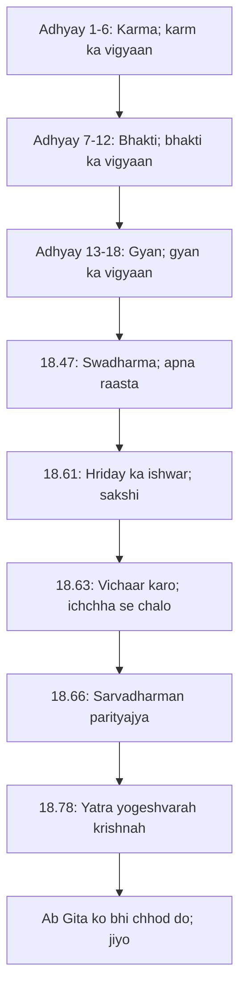
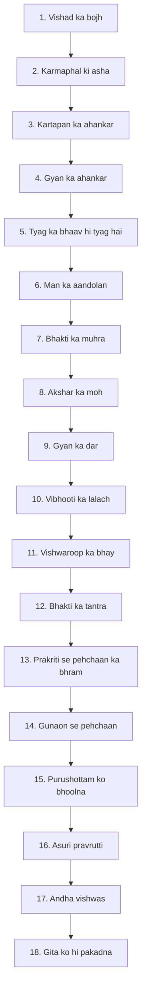

# अध्याय १८: मोक्ष संन्यास योग — "Gita ka antim shabd — Gita ko bhi chhod do"

> **"Krishna ne 17 adhyay bol kar diye. Ab aakhri adhyay mein woh sab kuch kah raha hai jo kahna baaqi tha. Aur Osho kahte hain: Gita ka asli antim shabd 'moksha' nahin — woh shabd hai 'ab jao'. Jao aur yeh sab bhool kar jiyo. Kitab wahan khatam hoti hai jahan tumhari yaatra shuru hoti hai."**
> — **ओशो**

---

Gita ka aathrahvan adhyay — sabse lamba, sabse vyapak, sabse antim. 78 shlokon ka yeh adhyay Gita ki pooree yaatra ka saar hai. Krishna ne sab kuch kah diya: karma, gyan, bhakti, gun, purushottam, daivasura — ab woh sab kuch ek saath bina. Osho is adhyay ko Gita ka "synthesis" kehte hain — chaar margon ka chauraha jahan sab raaste milte hain. Lekin Osho ki sabse badi baat is adhyay ke baare mein yeh hai: Krishna kuch "samapt" nahin kar raha — woh Arjun ko "bhеja" de raha hai. Utho, laro, jiyo.

Is adhyay ke teen khambhe hain. Pehla — swadharma (18.47): "श्रेयान्स्वधर्मो विगुणः" — apna dharma, bhaale hi adhoora ho, doosre ke dharma se behtar hai. Doosra — andar ka ishwar (18.61): "ईश्वरः सर्वभूतानां हृद्देशेऽर्जुन तिष्ठति" — ishwar tumhare hriday mein rehta hai, bahar nahin. Teesra — antim upadesh (18.66): "सर्वधर्मान्परित्यज्य मामेकं शरणं व्रज" — saare dharmon ko chhod kar mere paas aa. Osho kehte hain: yeh teen shlok Gita ke teen dwaron ka saar hain — apna raasta pehchano, andar ke swami ko pehchano, aur phir usse bhi chhod do.

Osho ka is adhyay par sabse bada vichar — "Gita ko bhi chhod do". Woh kehte hain: jis din tum Gita ko aakhri baat maanoge, usi din tumne Gita miss kar di. Gita tumhe kisi kitab ki sharan nahin de rahi — woh tumhe apne andar ki sharan de rahi hai. Aur 18.78 ka "यत्र योगेश्वरः कृष्णः" — Osho kehte hain: jahan Krishna aur Arjun dono hain, wahan vijay hai — aur yeh dono tumhare andar hain: jagrukta aur honest sawaal. Kitab ka ant nahin hua — tumhara jeewan abhi shuru hua hai.

## Learning Objectives

Is chapter ko complete karne ke baad aap:

1. Samjhenge — moksha ka arth "marne ke baad ki mukti" nahin; Osho ke liye moksha isi pal ki jagrukta hai — aur "sanyasa" sansar se bhagna nahin, sansar ke bheetar se nikalna hai.
2. Pehchanenge — swadharma vs paradharma ka mool sutra (18.47): apna adhoora dharma bhi doosre ke poore dharma se behtar — kyunki apna dharma hi tumhara aaina hai.
3. Janenge — 18.61 ka "hriday mein ishwar": ishwar bahar ka nyayadhish nahin; woh tumhare andar ka sakshi hai — aur Osho ke liye yehi Gita ka sabse bada gyan.
4. Vyavahar mein utarenge — 18.66 ka "sarvadharman parityajya": saare rules ke tyag ka arth — Osho ke liye — "Gita ko bhi chhod do" ka updesh, jo kitab ke aage ka sach hai.
5. Recap karenge — poore Gita ke 18 adhyay ek nazar mein: har adhyay ka ek-line saar, key shloka aur aadhunik prayog — ek TypeScript tool ke saath jo 18 "chhodne ki cheezein" bhi batata hai, har adhyay se ek.

---

## Moksha Sanyasa ka Parichay

### Gita ka sabse lamba adhyay — 78 shlok, ek samay

Mahabharat ke yudh ke 18 dinon mein Gita 18 adhyay — aur aakhri adhyay 78 shlokon ka. Osho kehte hain: yeh 78 shlok koi nayi shiksha nahin — yeh 700 shlokon ka "garh" hai, poore Gita ki ladai ka aakhri morcha. Krishna ko ab kuch bacha nahin hai — jo kahna tha, keh diya. Ab woh Arjun se kehta hai: "सर्वधर्मान्परित्यज्य..." — saare dharm chhod kar mere paas aa. Aur Arjun — jo poore Gita mein baar-baar poochh raha tha — ab chup ho jaata hai. Osho kehte hain: yeh maun hi moksha ki pehli jhalak hai — jab sawaal khatam ho jaate hain, tab chetna khul jaati hai.

Gita ke 18 adhyayon ko teen khandon mein dekha ja sakta hai — 1 se 6: karma (karm ka vigyaan); 7 se 12: bhakti (bhakti ka vigyaan); 13 se 18: gyan (gyan ka vigyaan). Aakhri adhyay teenon ko ek karta hai. Osho ise "kuch nahin kahna; sab kuch kahna" kehte hain — Krishna ke paas ab koi system nahin, koi philosophy nahin — sirf ek antim ishara: "Mere paas aa." Aur yehi ishara Osho ki apni drishti ka bhi core hai — gyan se pare, system se pare, sirf sakshi ke paas.

### Sanyasa ka asli arth — bhagna nahin, jagna

| Aayam | Paaramparik Sanyasa | Osho ka Sanyasa |
|-------|--------------------|-----------------|
| Arth | Ghar chhodna; van jana; ochhra pehanna | Sansar ke bheetar hi andar ka tyag |
| Kendra | Bahar ka tyag — vastu, rishte | Andar ka tyag — moh, pehchaan, dar |
| Vivah-sanyasa | Sirf brahmachari hi sanyasa le sakta hai | Grihastha bhi sanyasi ho sakta hai |
| Aasha | Sanyasa se moksha milta hai | Sanyasa moksha nahin; sanyasa jagrukta hai |
| Gita ke liye | 18.66 ka "parityajya" bahar ka tyag | "Parityajya" andar ke dharm-karm ka tyag |
| Osho ki baat | "Tum ghar chhod kar kya paaoge?" | "Tumne khud ko chhoda hai?" |

Osho kehte hain — sanyasa ka matlab yeh nahin ki tumne kapde badal liye; sanyasa ka matlab yeh hai ki tumne "maine" ka bhar utaar diya. Ek aadmi van mein ja kar bhi sansari ho sakta hai — woh apne tapas ka hisaab rakhta hai, apne mahan bhaav ka. Aur ek aadmi dukaan par bhi sanyasi ho sakta hai — woh apne kaam ko karta hai, par usmein ghulta nahin. Sanyasa ke asli test ka naam hai "jagrukta" — tum jahan ho, wahan ho; lekin tumhare bheetar ka dekhne wala wahan nahin hai. Yeh Osho ki is adhyay ki sabse bari den hai.

### "Moksha" shabd ki khoj

Moksha ka seedha arth hai — "mukti", "chhoot". Par kisse chhoot? Paaramparik vachan kahte hain — janm-maran ke bandhan se, karm-phal ke chakkar se. Osho kehte hain — yeh sab bahar ke bandhan hain; sabse bada bandhan andar hai: "main" ki pehchaan. Tum apne vichaar se chidhte ho, apne krodh se darte ho, apne atit se lipte ho — yeh sab andar ke katora hain. Moksha ka matlab hai — is chashme se bahar nikalna: dekhna ki main woh nahin hoon jo main sochta hoon.

Osho kehte hain — Gita ka moksha koi "destination" nahin hai; woh ek "direction" hai. Tum moksha ki taraf chalte ho — par kabhi pahunchte nahin, kyunki pahunchna hi ant hai. Jab tum pahunch jao, tum sirf ek vyakti ho jo pahuncha — lekin moksha toh pahunchne ki avastha nahin, dekhne ki avastha hai. Aur dekhna kabhi "ho" nahin jaata — dekhna hamesha "hota" hai. Isliye Osho kehte hain: moksha koi sthaan nahin; moksha tumhare dekhne ki gahrai ka naam hai.

---

## Key Shlokas

### Shloka 18.47

> श्रेयान्स्वधर्मो विगुणः परधर्मात्स्वनुष्ठितात् |
> स्वभावनियतं कर्म कुर्वन्नाप्नोति किल्बिषम् ॥ ४७ ॥

**Transliteration:** shreyan svadharmo vigunah paradharmat svanushthitat | svabhava-niyatam karma kurvan napnoti kilbisham ||

**Arth (Hinglish):** Krishna kehta hai — apna dharma, bhaale hi gunon se adhoora ho, doosre ke dharma se — jo poore-apoore se kiya gaya ho — behtar hai. Kyunki swabhav se niyut karm karte hue vyakti ko kilbish (paap-bhaav) nahin milta.

**Osho ka drishtikon:** Osho kehte hain — yeh Gita ka sabse "individual" shlok hai. Krishna keh raha hai: tumhe kisi aur ka raasta nahin chalna — tumhara raasta sirf tumhara hai. Ek doosre ke dharma ko "poore-apoore" chalna bhi tumhara raasta nahin ban sakta — kyunki woh tumhara nahin hai. Tumhara swadharma bhaale hi vigunah ho — adhoora, apoora, chhota — woh bhi tumhara hai, aur wahi tumhara aaina hai. Osho kahte hain: samaj tumhe hamesha "kisi aur jaisa" banne ke liye kehti hai — Gita keh rahi hai: apna swabhava jaano, aur usse jio. Yahan swadharma koi profession nahin — woh tumhare andar ki pehchaan hai.

### Shloka 18.61

> ईश्वरः सर्वभूतानां हृद्देशेऽर्जुन तिष्ठति |
> भ्रामयन्सर्वभूतानि यन्त्रारूढानि मायया ॥ ६१ ॥

**Transliteration:** ishvarah sarva-bhutanam hrid-deshe 'rjuna tishthati | bhramayan sarva-bhutani yantrarudhani mayaya ||

**Arth (Hinglish):** Krishna kehta hai — ishwar sab praniyon ke hriday mein rehta hai, he Arjun — aur maya ke yantra par chadhe sab praniyon ko woh ghuma raha hai.

**Osho ka drishtikon:** Osho kehte hain — yeh shlok Gita ka sabse gehre khazane ka darwaza hai. "ईश्वरः हृद्देशे" — ishwar tumhare bheetar hai, bahar nahin. Jo ishwar ko mandir mein dhundh rahe hain, woh mandir ke bahar khade hain. Aur "मायया भ्रामयन्" — wahi ishwar sabko maya ke yantra par ghuma raha hai. Osho is par hasa karte hain: ek hi swami jo sabko ghuma raha hai, wahi tumhare andar bhi hai. Toh ab jaan kar kya? Jab tum dekhne lagte ho — ki yantra chalta hai, mera swami andar hai — toh yantra ka jadoo khatam ho jaata hai. Maya ka arth bhi yahi hai — dekhne ki jagah so jaana. Aur ishwar ka arth bhi yahi hai — jo dekh sakta hai, uske bheetar.

### Shloka 18.63

> इति ते ज्ञानमाख्यातं गुह्याद्गुह्यतरं मया |
> विमृश्यैतदशेषेण यथेच्छसि तथा कुरु ॥ ६३ ॥

**Transliteration:** iti te jnanam-akhyatam guhyad-guhyataram maya | vimrishyaitad-asheshena yathechchhasi tatha kuru ||

**Arth (Hinglish):** Krishna kehta hai — yeh gyan, jo guhyon se bhi guhya hai, maine tumhe kah diya. Ab ise poore-apoore vichaar kar, phir jo tumhe achha lage, wahi karo.

**Osho ka drishtikon:** Osho kehte hain — is shlok mein Gita ka poora swaroop chhupa hai. Krishna kisi ko "mujhe maano" nahin keh raha — woh keh raha hai "विमृश्य" — vichaar karo, aur "यथेच्छसि तथा कुरु" — jo teri ichchha ho, wohi kar. Yehi toh Gita ko kisi aur shastra se alag karta hai — Gita tumhe choo raha hai, lekin chhod bhi raha hai. Osho kehte hain: jo guru tumhe bandh deta hai, woh guru nahin; jo guru tumhe azaad chhod deta hai — lekin jagruk kar ke — wohi satguru hai. Krishna ne Arjun ko azaad chhoda — aur wahi is Gita ka sabse bada upahaar hai: tumhari ichchha ko tumhara swatantra mil gaya.

### Shloka 18.66

> सर्वधर्मान्परित्यज्य मामेकं शरणं व्रज |
> अहं त्वा सर्वपापेभ्यो मोक्षयिष्यामि मा शुचः ॥ ६६ ॥

**Transliteration:** sarva-dharman parityajya mam ekam sharanam vraja | aham tva sarva-papebhyo mokshayishyami ma shuchah ||

**Arth (Hinglish):** Krishna kehta hai — saare dharmon ko chhod kar, mere ek sharan mein aa. Main tumhe saare paap-karmon se mukt kar doonga. Shok mat karo.

**Osho ka drishtikon:** Yahan Osho sabse kathin sawaal uthate hain — yeh "मामेकं" kaun hai? Paaramparik vachan kehte hain — Krishna bhagwan, unki sharan mein jao. Osho kehte hain: nahin — is adhyay mein Krishna ne khud bataya (18.61) ki ishwar sabke hriday mein hai. Toh "mam ekam" woh Krishna nahin jo rath par baitha hai — woh tumhare andar ka Krishna hai, tumhara apna sakshi, tumhari apni chetna. "सर्वधर्मान् परित्यज्य" ka arth — saare rules, saare systems, saare aadharon ko chhod kar apni antah-chetna ki sharan mein aa. Koi bahar ka uddharkarta nahin aayega — tumhara andar ka dekhne wala hi uddharkarta hai. Aur isi liye Osho kahte hain — Gita ka asli antim shabd hai: "Gita ko bhi chhod do."

### Shloka 18.78

> यत्र योगेश्वरः कृष्णो यत्र पार्थो धनुर्धरः |
> तत्र श्रीर्विजयो भूतिर्ध्रुवा नीतिर्मतिर्मम ॥ ७८ ॥

**Transliteration:** yatra yogeshvarah krishno yatra partho dhanur-dharah | tatra shrir-vijayo bhutir-dhruva nitir-matir-mama ||

**Arth (Hinglish):** Sanjaya kehta hai — jahan yogeshwar Krishna hain aur jahan dhanurdhar Parth (Arjun) hai, wahan shri, vijay, vibhooti aur dhrub niti hai — yeh mera (Sanjaya ka) mat hai.

**Osho ka drishtikon:** Osho kehte hain — Gita ka antim shlok ek drishya hai — Sanjaya Dhritarashtra ko bata raha hai: "Jahan yogeshwar Krishna aur dhanurdhar Arjun dono hain, wahan vijay hai." Aur Osho poochhte hain: jahan Krishna hai, wahan Arjun kyon zaroori hai? Kya Krishna akela hi vijay nahin de sakta? Jawab unka apna hai: nahin — kyunki yogeshwar (jagrukta) ke saath honest sawaal (Arjun) zaroori hai. Jagrukta bina sawaal ke sirf gyan hai; sawaal bina jagrukta ke sirf bhaag-daud. Dono milte hain toh vijay. Aur Osho kahte hain: yeh dono tumhare andar hain — tumhara dekhne wala (Krishna) aur tumhara poochhne wala (Arjun). Isliye Gita ka ant tumhe koi jawab nahin deta — woh tumhe ek nagari ke dwara par chhod deta hai.

---

## Antim Tyaga — Osho ki gahrai mein

### Swadharma: apna raasta, kisi aur ka nahin

Osho 18.47 ko Gita ka "individualism ka ghoshna-patra" kehte hain. Samaj hamesha tumhe batati hai ki "yeh raasta sahi hai" — Gita kehti hai: "tumhara raasta wahi hai jo tumhara hai." Ek udaharan Osho dete hain — do log ek dukaan par kaam karte hain. Ek ko khana pakana pasand hai, doosre ko hisaab-kitaab. Samaj dono ko ek hi raaste par dhakel degi. Gita kahti hai: tumhara swadharma wahi hai jo tumhare andar ki urja ko jagaaye — bhaale hi woh chhota ho, bhaale hi woh adhoora ho.

"विगुणः" — Osho is shabd par jor dete hain. Swadharma adhoora bhi ho sakta hai — koi bhi swadharma apoora hai, kyunki insaan apoora hai. Lekin apna adhoorapan bhi tumhara apna hai — woh tumhe jagruk banata hai. Doosre ka "poora" dharma tumhe andha bana deta hai — kyunki tum uski practice kar rahe ho, uski jagrukta nahin. Osho kehte hain: yeh duniya ke sabse krantikaari sutraon mein se ek hai — "khud ko doosra mat banao; khud ko jaano."

### Hriday ka ishwar — bahar ka nahin

18.61 ka "हृद्देशे" Osho ke liye Gita ki sabse bari kranti hai. Ishwar ko bahar se andar laane wala shlok. Osho kehte hain: mandir bahar ki jagah hai, ishwar andar ka aaina hai. Aur "यन्त्रारूढानि मायया" — yeh saara jagat ek yantra hai, aur ishwar us yantra ko chala raha hai. Jab tak tum soye ho, yantra tumhe ghumaata hai. Jab tum jagte ho, tum dekhte ho ki yantra mein koi ghumaane wala hai — aur woh tumhare andar hai.

Osho is par ek kathin baat kehte hain — kuch log ishwar ko "nyayadhish" banate hain jo saza denge; kuch log ishwar ko "palan-haar" banate hain jo rassi banayenge. Gita ka ishwar in dono se alag hai — woh tumhare andar ka sakshi hai. Sakshi kisi ko saza nahin deta; sakshi sirf dekhता है. Aur dekhte hi maya ka jadoo khatam — kyunki maya uska naam hai jo nahin dekhta. Osho kehte hain: "Ishwar tumhare bahar nahin milega; kyunki ishwar tumhare bheetar hai — tum ishwar ko le kar hi ishwar ko dhundh rahe ho."

### "Sarvadharman parityajya" — Gita ka antim virodhabhas

18.66 mein Krishna kehta hai: saare dharmon ko chhod kar mere paas aa. Aur Osho poochhte hain: kya yeh Gita ka sabse badla virodhabhas nahin? Gita ne itne adhyay dharm ke baare mein bataye — aur ab kah raha hai saare dharm chhod do? Osho ka jawab: yeh koi virodhabhas nahin — yeh Gita ka asli antim shabd hai. Dharm ke saare rules tumhe raasta dikhane ke liye the — lekin raasta dikhana aur raasta chalna alag hai. Rules seekhne ke baad unhe chhodna padta hai — warna rules hi tumhara jail ban jaate hain.

| Tyag ka star | Kya chhoda jaata hai | Osho ki tippani |
|--------------|---------------------|-----------------|
| Bahar ka tyag | Ghar, vastu, rishte | "Ghar chhod ke van mein bhi apna hi mochak hai" |
| Andar ka tyag | Moh, pehchaan, dar | "Andar ka tyag hi asli tyag hai" |
| Karm ka tyag | "Main kar raha hoon" ka bhaav | "Kartapan chhod do; karm chhodo nahin" |
| Gyan ka tyag | "Mujhe pata hai" ka abhimaan | "Pata hona hi sabse bada andha" |
| Dharm ka tyag | Saare rules, saare systems | "Gita ko bhi chhod do — yeh antim updesh hai" |

Osho kehte hain — "मामेकं शरणं व्रज" — us ek ko pakdo jo tumhare andar hamesha se tha. Aur jab tum us ek ko pehchan jaate ho, toh Gita bhi bekaar ho jaati hai — kyunki Gita tumhe wahan le gayi jahan tum khud the. Yahi Osho ki is adhyay ki sabse badi baat hai: Gita ka ant hi Gita ka asli shuru hai. Jo Gita ko aakhri maanta hai, woh Gita ko miss kar gaya. Jo Gita se aage jaata hai, uske liye Gita ne apna kaam kiya.

---

## 18 Adhyay ki Yaatra — Ek Nazar Mein

### Gita ka poora naksha



### Chhodne ki list — har adhyay se ek cheez



Osho kehte hain — yeh 18 cheezein ek saath chhodni nahin hain; yeh 18 "dekhne ki cheezein" hain. Dekho — tum kisse chidhte ho, kispe pakde ho, kisse darte ho. Chhodna dekhne se aata hai; dekhna chhodne se nahin. Isliye 18 adhyay ki yaatra ka ant — 18 cheezon ki shuruaat hai.

---

## TypeScript Implementation

```typescript
/**
 * ============================================================
 * Gita 18-Chapter Summary Generator — adhyay 18 ka recap tool
 * ============================================================
 * Gita ka aathrahvan adhyay 18 adhyayon ka saar hai. Osho kahte
 * hain: har adhyay se ek cheez chhodni hai. Yeh tool 18 adhyayon
 * ka recap tour deta hai — name; essence; key shloka; aadhunik
 * prayog — aur 18 "chhodne ki cheezein" bhi batata hai.
 */

interface ChapterSummary {
  number: number;
  name: string;
  essence: string;
  keyShloka: string;
  modernApplication: string;
}

interface DropItem {
  chapter: number;
  drop: string;
  oshoNote: string;
}

const CHAPTERS: ChapterSummary[] = [
  { number: 1,  name: 'Arjun Vishad Yoga',      essence: 'Vishad hi pehli sadhana hai',                     keyShloka: '1.47',  modernApplication: 'Failure aur confusion ko dabao mat; use dekhna seekho' },
  { number: 2,  name: 'Sankhya Yoga',           essence: 'Atma jaise hai waise hi hai; na janm na mrityu', keyShloka: '2.47',  modernApplication: 'Kaam karo; result ki chinta mat karo' },
  { number: 3,  name: 'Karma Yoga',             essence: 'Karm se bhagona nahin; karm mein jagrukta',       keyShloka: '3.20',  modernApplication: 'Office ka har kaam sadhana ban sakta hai' },
  { number: 4,  name: 'Jnana Karma Sanyasa',    essence: 'Gyan aur karm ek hi ke do roop',                 keyShloka: '4.18',  modernApplication: 'Kaam karte hue dekhna seekho' },
  { number: 5,  name: 'Karma Sanyasa Yoga',     essence: 'Asli tyag karm chhodna nahin; karm mein bhag hona', keyShloka: '5.3', modernApplication: 'Bhaag-daud mein bhi andar ka maun' },
  { number: 6,  name: 'Dhyan Yoga',             essence: 'Dhyan se shanti; shanti se atma',                 keyShloka: '6.5',   modernApplication: 'Roz 10 minute dhyan ek practice hai' },
  { number: 7,  name: 'Jnana Vijnana Yoga',     essence: 'Krishna hi brahman; sab kuch usi mein',           keyShloka: '7.7',   modernApplication: 'Ek hi sootra se duniya dekhna' },
  { number: 8,  name: 'Akshar Brahma Yoga',     essence: 'Akshar; akshar ke pare',                          keyShloka: '8.5',   modernApplication: 'Maut ka dar khatam; jeewan khul jaata hai' },
  { number: 9,  name: 'Rajavidya Rajaguhya',    essence: 'Sabse gahra gyan; sabse aasaan bhakti',           keyShloka: '9.22',  modernApplication: 'Jyada koshish nahin; shraddha se kaam' },
  { number: 10, name: 'Vibhooti Yoga',          essence: 'Sab kuch Krishna hai; vibhootiyan uski jhalak',   keyShloka: '10.20', modernApplication: 'Har cheez mein wahi dikhta hai' },
  { number: 11, name: 'Vishwaroop Darshan',     essence: 'Krishna ka vishwaroop; sab kuch ek mein',         keyShloka: '11.33', modernApplication: 'Bade drishya se dar nahin; samajh' },
  { number: 12, name: 'Bhakti Yoga',            essence: 'Bhakti ka maarg; bina maange hi milta hai',       keyShloka: '12.2',  modernApplication: 'Prem se kaam; kaam se prem' },
  { number: 13, name: 'Kshetra Kshetrajna',     essence: 'Sharir kshetra hai; atma kshetrajna',             keyShloka: '13.2',  modernApplication: 'Apne andar ke dekhne wale ko pehchano' },
  { number: 14, name: 'Gunatray Vibhag Yoga',   essence: 'Teen gun; teen rang; ek chetna',                  keyShloka: '14.20', modernApplication: 'Mood ko pehchano; use jeeto mat' },
  { number: 15, name: 'Purushottam Yoga',       essence: 'Purushottam; teeno se pare wala',                 keyShloka: '15.15', modernApplication: 'Sab kuch kar ke bhi andar khaali' },
  { number: 16, name: 'Daivasura Sampad',       essence: 'Do pravruttiyan; ek jagrukta',                    keyShloka: '16.21', modernApplication: 'Roz ki chetna-inventory' },
  { number: 17, name: 'Shraddhatray Vibhag',    essence: 'Shraddha; teen gunon ka aaina',                   keyShloka: '17.3',  modernApplication: 'Intake awareness: bhojan; media; sangati' },
  { number: 18, name: 'Moksha Sanyasa Yoga',    essence: 'Sab chhod do; ant me Gita ko bhi',                keyShloka: '18.66', modernApplication: 'System se pare; apne andar ke sakshi tak' },
];

const DROPS: DropItem[] = [
  { chapter: 1,  drop: 'Galtiyon aur asafalta ke saath pehchaan',        oshoNote: 'Vishad sirf dekhna hai; pehchaan nahin' },
  { chapter: 2,  drop: 'Karmaphal ki chinta',                            oshoNote: 'Result wahi deta hai jo karm se chidhta hai' },
  { chapter: 3,  drop: 'Kartapan ki bhaavna',                            oshoNote: 'Karm karo; "main kar raha hoon" ko dekhna' },
  { chapter: 4,  drop: 'Gyan ka ahankar',                                oshoNote: 'Jitna jaano; utna aur anjaan hi sach hai' },
  { chapter: 5,  drop: 'Tyag ke naam par bhagna',                        oshoNote: 'Bhaag ke van mein bhi wahi sanduk' },
  { chapter: 6,  drop: 'Man ke aandolan se pehchaan',                    oshoNote: 'Man yantra hai; tum yantri ho' },
  { chapter: 7,  drop: 'Bhakti ka dikhawa',                              oshoNote: 'Bhakti dikhaai nahin jaati; jeewan se dikhti hai' },
  { chapter: 8,  drop: 'Akshar ka moh — "pakka" hone ka bhaav',          oshoNote: 'Sabse pakka bhi badalta hai; isliye dekhna' },
  { chapter: 9,  drop: 'Gyan ka dar',                                    oshoNote: 'Dar gyan ka dwar nahin; dar band darwaza hai' },
  { chapter: 10, drop: 'Vibhooti ka lalach — "main wala" kaa bhaav',     oshoNote: 'Sab vibhootiyan ek hi ke hain' },
  { chapter: 11, drop: 'Vishwaroop ka bhay',                             oshoNote: 'Bade drishya ka dar chhote man ka hai' },
  { chapter: 12, drop: 'Bhakti ka tantra — prem ke badle ka hisaab',     oshoNote: 'Prem badla nahin maangta' },
  { chapter: 13, drop: 'Prakriti se pehchaan ka bhram',                  oshoNote: 'Kshetra badalta hai; kshetrajna nahin' },
  { chapter: 14, drop: 'Gunaon se pehchaan',                             oshoNote: 'Guna rang hain; tum chetna ho' },
  { chapter: 15, drop: 'Purushottam ko bhoolna',                         oshoNote: 'Sabse gahre wale ko yaad rakhna' },
  { chapter: 16, drop: 'Asuri pravrutti se pehchaan',                    oshoNote: 'Asurta nind hai; use dekhna hi jagrana hai' },
  { chapter: 17, drop: 'Andha vishwas — bina dekhne ka bharosa',         oshoNote: 'Shraddha dekhne se aati hai; vishwas dar se' },
  { chapter: 18, drop: 'Gita ko hi pakadna — sabse bada tyag',           oshoNote: 'Gita tumhe wahan le gayi; ab tum wahan ho' },
];

class GitaSummaryGenerator {
  constructor(private chapters: ChapterSummary[] = CHAPTERS, private drops: DropItem[] = DROPS) {}

  getRecapTour(): ChapterSummary[] {
    return [...this.chapters];
  }

  getChapter(number: number): ChapterSummary {
    const ch = this.chapters.find(c => c.number === number);
    if (!ch) throw new Error(`Adhyay ${number} nahin mila`);
    return ch;
  }

  getDropChecklist(): DropItem[] {
    return [...this.drops];
  }

  getOshoFarewell(): string {
    return '"Gita ka antim shabd moksha nahin hai; antim shabd hai — ab jao. ' +
           'Jao aur yeh sab bhool kar jiyo. Kitab wahan khatam hoti hai ' +
           'jahan tumhari yaatra shuru hoti hai."';
  }
}

function runDemo(): void {
  const gita = new GitaSummaryGenerator();

  console.log('================================================');
  console.log('  Gita Adhyay 18: 18-Chapter Summary Generator');
  console.log('  Osho: "Gita ko bhi chhod do."');
  console.log('================================================');
  console.log('');

  console.log('Recap Tour — 18 adhyay ek nazar mein:');
  gita.getRecapTour().forEach(ch => {
    console.log(`  ${ch.number}. ${ch.name} | ${ch.essence} | ${ch.keyShloka} | ${ch.modernApplication}`);
  });
  console.log('');

  console.log('Drop Checklist — har adhyay se ek cheez chhodni hai:');
  gita.getDropChecklist().forEach(d => {
    console.log(`  ${d.chapter}. ${d.drop}`);
    console.log(`     Osho: "${d.oshoNote}"`);
  });
  console.log('');

  console.log('Osho ka vidai-sandesh:');
  console.log(gita.getOshoFarewell());
}

runDemo();
```

---

## Summary

| Bindu | Saar |
|-------|------|
| **Adhyay ka mool** | 78 shlokon ka synthesis — 18 adhyayon ka saar; koi nayi shiksha nahin, ek antim ishara |
| **Swadharma (18.47)** | Apna adhoora dharma bhi doosre ke poore dharma se behtar — kyunki wohi tumhara aaina hai |
| **Hriday ka ishwar (18.61)** | Ishwar bahar ka nyayadhish nahin; tumhare andar ka sakshi |
| **Sarvadharman (18.66)** | Saare rules ke tyag ka arth — andar ki chetna ki sharan; Osho: "me" tumhara antaratma hai |
| **Antim shabd (18.78)** | Jagrukta (Krishna) + honest sawaal (Arjun) = vijay — aur yeh dono tumhare andar hain |

---

## Contradictions

- **"Mam ekam" ka arth:** Paaramparik vachan 18.66 mein "मामेकं" ko bhagwan Krishna — vyakti — ki sharan ka updesh maante hain. Osho kehte hain: Krishna ne khud 18.61 mein bataya ki ishwar hriday mein hai; isliye "mam ekam" tumhare andar ka sakshi hai — tumhari apni chetna.
- **Dharm ka tyag vs dharm ka palan:** Gita ne itne adhyay dharm ki shiksha di, aur 18.66 mein saare dharm chhodne ko kaha. Parampra ise "bhagwan ki sharan" se santulit karti hai. Osho kehte hain: yeh contradiction hi Gita ki kranti hai — rules seekh kar unhe chhodna hi seekh hai; warna rules jail ban jaate hain.
- **Vichaar karo vs andha sharan:** 18.63 mein Krishna kehta hai "विमृश्य यथेच्छसि तथा कुरु" — vichaar kar ke jo achha lage wohi karo. Par 18.66 mein "सर्वधर्मान् परित्यज्य" — bina vichaar ke sharan. Osho kehte hain: yeh virodhabhas nahin — pehle vichaar se turiye, phir vichaar ke pare jaaiye; dono alag levels hain.
- **Sanyasa ka arth:** Parampra mein sanyasa ka matlab ghar-sansar ka tyag hai. Osho kehte hain: sanyasa kapde aur ghar ka nahin; "maine" ke bhaar ka tyag hai — grihastha bhi sanyasi ho sakta hai.
- **Gita ka ant:** Paaramparik lekhak Gita ko "antim satya" maante hain. Osho kehte hain: jo Gita ko aakhri maanta hai, woh Gita miss kar gaya — Gita ka ant hi seekh ki shuruaat hai.

---

## Open Questions

- Agar "mam ekam" Osho ki tarah "andar ka sakshi" hai, toh bhakt-marg ki sharan (surrender) ka kya arth hai? Kya surrender kisi "doosre" ke saamne sambhav hai — ya sirf apne andar ke sakshi ke saamne?
- 18.63 "यथेच्छसि तथा कुरु" — Krishna ne Arjun ko poori swatantrata di. Lekin kya swatantrata bina jagrukta ke sambhav hai? Kaunsi pehle aati hai — ichchha ya jagrukta?
- Osho kahte hain "Gita ko bhi chhod do". Lekin agar isi updesh ko aakhri maan liya jaaye, toh kya woh khud bhi ek system nahin ban jaata? Kya "chhodna" ka updesh bhi ek pakad ban sakta hai?
- 18.78 mein "यत्र योगेश्वरः कृष्णो यत्र पार्थः" — dono ka milan zaroori hai. Lekin Krishna aur Arjun — jagrukta aur sawaal — ka milan asli jeewan mein kaise hota hai? Kya dono ek saath reh sakte hain, ya ek baar jagrukta aa jaaye toh sawaal khatam?

---

## Practical Takeaways

| Situation | Gita shloka | Osho's lens | Action |
|-----------|------------|-------------|--------|
| Doosre ke jaise banna chahte ho | 18.47 (swadharma) | Apna adhoora raasta bhi tumhara aaina hai | Aaj ek chhota sa kaam karo jo tumhara apna hai |
| Andar se koi bul-bul kar raha hai | 18.61 (hrid-desh ishwar) | Woh bul-bul sakshi ki hai; use suno | 5 minute maun; us awaz ko suno |
| Kaun sa rasta sahi hai? Sawal | 18.63 (vimrishya) | Gita tumhe jawab nahin; vichaar deti hai | Ek decision ke dono paksh 10-10 minute likho |
| Dharam-karm ka bojh lagta hai | 18.66 (sarvadharman) | Rules seekh kar chhodna hi moksha hai | Ek aisi baat jo "kar honi chahiye" thi; aaj na karo |
| Sab kuch seekh liya; ab kya? | 18.78 (yatra yogeshvarah) | Krishna + Arjun dono andar hain | Aaj ek sawaal ko jagrukta se poochho |

---

## Chapter Quiz

### Question 1
Gita ka aathrahvan adhyay kitne shlokon ka hai?

a) 47
b) 61
c) 66
d) 78

<details>
<summary>Answer</summary>
d) 78 shlok — Gita ka sabse lamba adhyay.
</details>

### Question 2
Shlok 18.47 ke anusar apna adhoora dharma kya hai?

a) Doosre ke poore dharma se behtar
b) Doosre ke dharma se bura
c) Baraabar
d) Sanyasa se hi milta hai

<details>
<summary>Answer</summary>
a) "श्रेयान्स्वधर्मो विगुणः" — apna vigunah (adhoora) dharma bhi doosre ke poore dharma se shreyan hai.
</details>

### Question 3
Shlok 18.61 ke anusar ishwar kahan rehta hai?

a) Mandir mein
b) Hriday mein
c) Himalaya mein
d) Swarg mein

<details>
<summary>Answer</summary>
b) "ईश्वरः सर्वभूतानां हृद्देशे" — sab praniyon ke hriday mein.
</details>

### Question 4
Osho ke anusar 18.66 का "मामेकं" kaun hai?

a) Krishna vyakti
b) Tumhare andar ka sakshi — tumhari chetna
c) Sanjaya
d) Bhishma

<details>
<summary>Answer</summary>
b) Osho ke anusar "mam ekam" tumhare andar ka Krishna hai — andar ka sakshi, bahar ka uddharkarta nahin.
</details>

### Question 5
Shlok 18.63 mein Krishna Arjun ko kya kaha kehta hai?

a) Sirf mujhe maano
b) Vichaar kar ke jo achha lage, wohi karo
c) Shastra pakdo
d) Yudh chhod do

<details>
<summary>Answer</summary>
b) "विमृश्यैतदशेषेण यथेच्छसि तथा कुरु" — poora vichaar kar; teri ichchha wohi karo.
</details>

### Question 6
Osho ke anusar Gita ka asli antim shabd kya hai?

a) Moksha
b) "Ab jao" — Gita ko bhi chhod do
c) Shanti
d) Bhakti

<details>
<summary>Answer</summary>
b) "Ab jao" — Gita ka ant hi seekh ki shuruaat hai; kitab ko aakhri maanna hi usse miss karna hai.
</details>

### Question 7
Shlok 18.78 के अनुसार vijay kahan hai?

a) Jahan sabse badi sena ho
b) Jahan yogeshwar Krishna aur dhanurdhar Arjun dono hon
c) Jahan sabse kathin sadhana ho
d) Jahan shastra sabse lamba ho

<details>
<summary>Answer</summary>
b) Jahan Krishna aur Arjun dono hon — jagrukta aur honest sawaal.
</details>

### Question 8
Osho ke anusar "sanyasa" ka asli arth kya hai?

a) Ghar chhodna
b) Kapde badalna
c) "Maine" ke bhaar ka tyag — andar ka tyag
d) Van mein jana

<details>
<summary>Answer</summary>
c) Sanyasa andar ka tyag hai — moh, pehchaan, dar; grihastha bhi sanyasi ho sakta hai.
</details>

### Question 9
Osho ke anusar Krishna aur Arjun dono tumhare andar kya hain?

a) Deh aur atma
b) Jagrukta (dekhne wala) aur honest sawaal (poochhne wala)
c) Raj aur pradhan
d) Man aur shwas

<details>
<summary>Answer</summary>
b) Jagrukta aur honest sawaal — dono mil kar hi vijay.
</details>

### Question 10
Osho ke anusar jo Gita ko "aakhri baat" maan leta hai, uske saath kya hota hai?

a) Woh Gita ko pura samajh gaya
b) Woh Gita miss kar gaya — kyunki Gita usse aage jaane ko kehti hai
c) Woh moksha pa jaata hai
d) Woh sanyasi ban jaata hai

<details>
<summary>Answer</summary>
b) Gita ke aage jana hi Gita ki asli seekh hai; kitab ko pakadna usse chhodna hai.
</details>

---

## Exercises

1. **18-adhyay ka recap tour:** Ek page par 18 adhyayon ke naam likho, aur har ke saamne ek line — "is adhyay se mujhe kya mila". 18 lines poora karo — bina kahen ke "nahin pata". Osho kahte hain: likhna hi yad rakhta hai.
2. **Drop checklist ka 18-din ka abhyas:** Roz ek drop item (1 se 18) ko poore din dekho — use chhodna nahin; use dekhna. Shaam ko likho: woh cheez kitni baar paas aayi, aur kitni baar tumne use dekh liya?
3. **"Mera swadharma" ki khoj:** Ek page par likho — mere 3 swadharma kya hain? Woh kaam jo mujhe thakate nahin, jo mujhe jagata hain. 30 din baad wapas aa kar padho — kya wahi hain?
4. **5-minute hriday-darshan:** Roz raat soone se pehle 5 minute ke liye apni aankhein band karo aur ishwar ko "bahar" nahin, "andar" dhundho. 7 din ke baad likho — kya badla?
5. **"Gita ko chhodne" ka din:** Ek din poora aisa jio jaise Gita ke 700 shlok tumhe yad nahin — sirf do cheezein: jagrukta aur sawaal. Shaam ko likho: kitna aasaan ya kathin tha?
6. **Antim shlok ka chintan:** 18.78 ko 7 din tak roz padho — ek minute. Har din alag arth nikalta hai? Use likho. 7 din ke baad padho — tumhari apni Gita ban gayi hai.

---

## Further Reading

- Osho, *Gita Darshan*, Vol 6 — adhyay 18 ke 1973-76 ke Bombay (Woodlands) ke pravachan; is course ki sabse bari prerna.
- *Bhagavad Gita*, Geeta Press (Gorakhpur) — shlok 18.1-78 ka mool paath; poore Gita ka samapan.
- Osho, *The Ultimate Alchemy*, Vol 1-2 — sakshi aur no-mind ki gahri vyakhya.
- Vinoba Bhave, *Geetai* — marathi mein Gita ka saral-padaant; paaramparik aur Osho ke beech ka setu.
- Aldous Huxley, *The Perennial Philosophy* — Gita ke swadharma aur tyag ka vishwa-dharmon se tulana.
