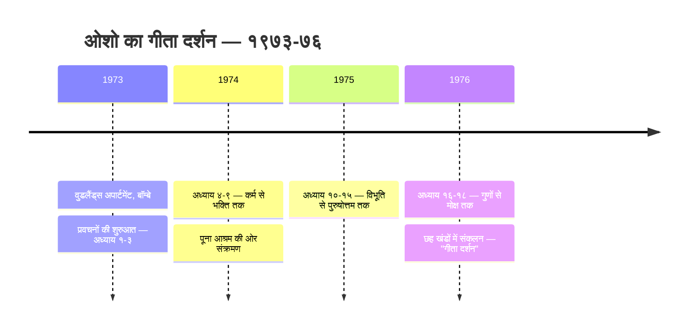
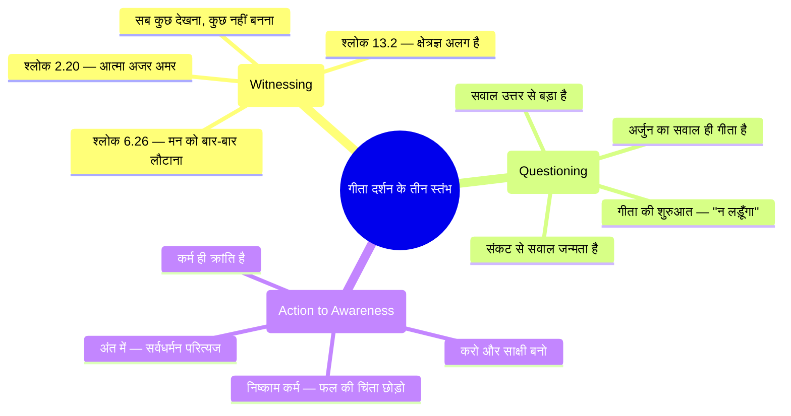

# गीता दर्शन: ओशो की दृष्टि में भगवद्गीता (Geeta Darshan — Osho's Bhagavad Gita)

> **"गीता सिर्फ एक किताब नहीं है — यह एक युद्धभूमि है। और हर साधक के भीतर एक अर्जुन है जो सवाल पूछने के लिए तैयार है।"**
> — **ओशो**

---

**ओशो वाणी:**
> "मैंने गीता पर प्रवचन दिए — गीता दर्शन — क्योंकि यह दुनिया की सबसे क्रांतिकारी किताबों में से एक है। लेकिन याद रखो: मैं कोई भक्त नहीं हूँ, कोई पंडित नहीं हूँ। मैं तो केवल एक दर्पण हूँ। मैं गीता को वैसे नहीं दोहराता जैसे पुजारी दोहराते हैं — मैं इसे खोलता हूँ ताकि तुम देख सको कि तुम्हारे भीतर क्या चल रहा है। गीता एक शास्त्र नहीं है — गीता एक दर्पण है।"

---

## सीखने के उद्देश्य (Learning Objectives)

इस कोर्स को पूरा करने के बाद आप:

1. **समझ पाएंगे** — गीता के सभी १८ अध्याय ओशो के नज़रिए से — युद्धक्षेत्र का असली संदेश, जो कर्मकांड और पूजा के पर्दे के पीछे छिपा है।
2. **जान पाएंगे** — ओशो की मूल दृष्टि: अर्जुन ही असली नायक है — उसका सवाल, उसका संकट, उसकी ईमानदारी — और कृष्ण उसका साक्षी-मित्र, रणनीतिकार।
3. **सीख पाएंगे** — हर अध्याय के ३-८ प्रमुख श्लोक — संस्कृत, अनुवाद, और ओशो की व्याख्या — स्टिथप्रज्ञ से लेकर सर्वधर्मन परित्यज तक।
4. **अनुभव कर पाएंगे** — ओशो की केंद्रीय शिक्षा: **साक्षी (witnessing)** — गीता के १८ अध्यायों की जड़, जो ध्यान से जुड़ती है।
5. **सक्षम होंगे** — १८ टाइपस्क्रिप्ट टूल्स (श्लोक एक्सप्लोरर, गुण विश्लेषक, कर्म क्लासिफायर, ध्यान लॉगर) बनाने और रोज़ के जीवन में गीता को प्रयोग करने में।

---

## गीता क्या है — ओशो की नज़र में

### युद्धभूमि की कहानी: १८ दिन, १८ अध्याय

महाभारत के युद्ध में, कुरुक्षेत्र की धरती पर, अर्जुन और कृष्ण का संवाद ही गीता है। ओशो इस संवाद को कैसे देखते हैं?

**ओशो वाणी:**
> "यह युद्ध इतिहास का युद्ध नहीं है — यह हर आदमी के भीतर चलने वाला युद्ध है। बाईं ओर कौरव हैं — पुराना, जड़, बीता हुआ। दाईं ओर पांडव हैं — नया, जीवंत, आने वाला। और बीच में खड़ा है अर्जुन — तुम। गीता तब शुरू होती है जब अर्जुन की पकड़ टूटती है, उसके हाथ काँपते हैं, धनुष गिर जाता है। और वह कहता है: 'मैं नहीं लड़ूँगा।' यही क्षण गीता का जन्म है। गीता कायरता का शास्त्र नहीं है — यह संकट का शास्त्र है।"

गीता का इतिहास संक्षेप में:

| पहलू | विवरण |
|------|--------|
| **मूल कथा** | महाभारत युद्ध (कुरुक्षेत्र, हस्तिनापुर के पास) |
| **संवाद** | अर्जुन और कृष्ण — रथ पर, युद्ध शुरू होने से ठीक पहले |
| **अध्याय** | १८ अध्याय, ७०० श्लोक |
| **संदेशवाहक** | संजय — धृतराष्ट्र को सुनाता है |
| **स्थिति** | अर्जुन का विषाद (अध्याय १) → मोक्ष संन्यास (अध्याय १८) |

### ओशो का अनोखा पाठ: अर्जुन नायक है, कृष्ण साक्षी

पारंपरिक पाठ में कृष्ण देवता हैं, अर्जुन शिष्य। ओशो इस रिश्ते को उलट देते हैं:

| आयाम | पारंपरिक पाठ | ओशो का पाठ |
|------|-------------|-----------|
| **नायक** | कृष्ण — भगवान, देवता | अर्जुन — सवाल पूछने वाला ईमानदार खोजी |
| **अर्जुन का विषाद** | कमजोरी, मोह | सबसे गहरी सच्चाई — संकट ही द्वार है |
| **कृष्ण की भूमिका** | परमेश्वर, गुरु | साक्षी, मित्र, रणनीतिकार — जो दिखाता है, थोपता नहीं |
| **सिखाने का तरीका** | आज्ञा, उपदेश | प्रश्नों से जगाना — सवाल ही उत्तर है |
| **अंतिम संदेश** | भक्ति और शरणागति | जगरूकता — सब कुछ देखना, किसी से पहचान न बनाना |

**ओशो वाणी:**
> "कृष्ण एक रणनीतिकार हैं — बहुत चतुर, बहुत कुशल। वे अर्जुन को जीत के लिए तैयार करते हैं। लेकिन गीता की असली आत्मा अर्जुन है — उसका काँपता हुआ हाथ, उसका बहता हुआ आँसू, उसका सवाल। पंडित कृष्ण को पूजते हैं; मैं अर्जुन को देखता हूँ — क्योंकि अर्जुन ही तुम हो।"

---

## ओशो का "गीता दर्शन": छह खंडों की यात्रा

ओशो ने १९७३-७६ में बॉम्बे के वुडलैंड्स अपार्टमेंट में गीता पर प्रवचन दिए — जो बाद में **"गीता दर्शन"** के छह खंडों में प्रकाशित हुए।

**ओशो वाणी:**
> "मैंने गीता दर्शन में गीता की व्याख्या नहीं की — मैंने गीता को तुम्हारे सामने खोला। हर श्लोक एक खिड़की है। कुछ खिड़कियाँ बंद हैं — उन्हें खोलने की ज़रूरत है। कुछ खिड़कियाँ टूटी हैं — उन्हें तोड़ने की ज़रूरत है। और कुछ खिड़कियाँ ऐसी हैं जिनके आगे दीवार है — उन्हें उखाड़ फेंकने की ज़रूरत है।"

---

## अध्याय सूची: १८ अध्याय = १८ अध्याय

| अध्याय | फ़ाइल | अध्याय का नाम | ओशो का केंद्रीय संदेश |
|-------|------|--------------|----------------------|
| ०१ | `01-vishada-yoga.md` | **विषाद योग** | संकट ही द्वार है — अर्जुन का विषाद असली ईमानदारी है |
| ०२ | `02-sankhya-yoga.md` | **सांख्य योग** | जगरूकता ही असली ज्ञान है — स्टिथप्रज्ञ की अवस्था |
| ०३ | `03-karma-yoga.md` | **कर्म योग** | कर्म क्रांति है, कर्तव्य नहीं — निष्काम कर्म की नई व्याख्या |
| ०४ | `04-jnana-karma-sanyasa-yoga.md` | **ज्ञान कर्म संन्यास योग** | अवतार कोई और नहीं — जगरूकता का पल |
| ०५ | `05-karma-sanyasa-yoga.md` | **कर्म संन्यास योग** | त्याग नहीं, समदृष्टि चाहिए |
| ०६ | `06-dhyana-yoga.md` | **ध्यान योग** | मन को हराओ मत, देखो — चंचल मन का साक्षी |
| ०७ | `07-jnana-vijnana-yoga.md` | **ज्ञान विज्ञान योग** | माया कोई भ्रम नहीं, भूल है |
| ०८ | `08-akshara-brahma-yoga.md` | **अक्षर ब्रह्म योग** | मौत का सवाल नहीं, जीवन का पल है |
| ०९ | `09-rajavidya-rajaguhya-yoga.md` | **राजविद्या राजगुह्य योग** | प्रेम ही सबसे बड़ा रहस्य है |
| १० | `10-vibhuti-yoga.md` | **विभूति योग** | दिव्य कहीं और नहीं — यहीं हर चीज़ में है |
| ११ | `11-vishvarupa-darshana-yoga.md` | **विश्वरूप दर्शन योग** | एक झलक — सब कुछ एक हो गया |
| १२ | `12-bhakti-yoga.md` | **भक्ति योग** | प्रेम सबसे छोटा रास्ता है |
| १३ | `13-kshetra-kshetrajna-yoga.md` | **क्षेत्र क्षेत्रज्ञ विभाग योग** | खेत अलग, जानने वाला अलग — साक्षी वही है |
| १४ | `14-gunatraya-vibhaga-yoga.md` | **गुणत्रय विभाग योग** | तीन गुण — तुम्हारे मनोविज्ञान का नक्शा |
| १५ | `15-purushottama-yoga.md` | **पुरुषोत्तम योग** | संसार का पेड़ — काटो इसे कुल्हाड़ी से |
| १६ | `16-daivasura-sampad-yoga.md` | **दैवासुर सम्पद्विभाग योग** | दो प्रकार के लोग नहीं, दो प्रवृत्तियाँ हैं |
| १७ | `17-shraddhatraya-yoga.md` | **श्रद्धात्रय विभाग योग** | श्रद्धा विश्वास नहीं, ट्रस्ट है |
| १८ | `18-moksha-sanyasa-yoga.md` | **मोक्ष संन्यास योग** | गीता का अंतिम शब्द — गीता को भी छोड़ दो |

---

## ओशो के तीन स्तंभ — जिन पर यह कोर्स टिका है

### १. साक्षी (Witnessing) — गीता की जड़

**ओशो वाणी:**
> "गीता के सात सौ श्लोकों में से एक ही श्लोक जरूरी है — 'तुम्हें अपने कर्तव्य का अधिकार है, फल का नहीं।' और उसका अर्थ समझो — करो, पूरे जोश से करो, लेकिन भीतर एक गवाह रहो जो देखता है। कर्म करते समय भी साक्षी रहो। यही गीता का सार है।"

### २. सवाल (Questioning) — अर्जुन की विरासत

**ओशो वाणी:**
> "गीता का जन्म एक सवाल से हुआ है। अगर अर्जुन ने सवाल नहीं पूछा होता, तो गीता होती ही नहीं। याद रखो — धर्म में सवाल पूछना सबसे बड़ा साधन है। सवाल तुम्हें खोलता है; उत्तर तुम्हें बंद कर देता है।"

### ३. कर्म से जगरूकता तक (Action to Awareness)

**ओशो वाणी:**
> "गीता कर्म से शुरू होती है और मोक्ष पर खत्म होती है। लेकिन मोक्ष कोई जगह नहीं है — मोक्ष तो जगरूकता की आखिरी ऊँचाई है। जहाँ तुम करते भी हो और देखते भी हो — दोनों एक साथ। यही तो चमत्कार है: कर्म करो और उसके साक्षी रहो।"

---

## यह कोर्स कैसे काम करता है

### हर अध्याय की संरचना

हर अध्याय में ये १७ घटक हैं, इसी क्रम में:

1. **अध्याय शीर्षक + ओशो का उद्धरण** — अध्याय की आत्मा एक पंक्ति में
2. **परिचय** — महाभारत की कहानी में अध्याय की जगह
3. **Learning Objectives** — ५ उद्देश्य
4. **अध्याय परिचय** — पारंपरिक पाठ बनाम ओशो के पाठ की तुलना तालिका
5. **Key Shlokas** — ३-८ प्रमुख श्लोक: देवनागरी + अनुवाद + ओशो की व्याख्या
6. **गहराई में** — मर्म विश्लेषण, और तालिकाएँ
7. **मेरमेड आरेख** — अवधारणा का चित्र
8. **TypeScript Implementation** — चलने योग्य टूल
9. **Summary** — मुख्य बिंदु तालिका
10. **Contradictions** — जहाँ ओशो परंपरा से टकराते हैं
11. **Open Questions** — खुले सवाल
12. **Practical Takeaways** — स्थिति, श्लोक, ओशो की दृष्टि, कार्य
13. **Chapter Quiz** — १० बहुविकल्पीय प्रश्न
14. **Exercises** — अभ्यास
15. **Further Reading** — आगे पढ़ने के लिए

### १८ टाइपस्क्रिप्ट टूल्स — एक नज़र में

| अध्याय | टूल | काम |
|-------|------|-----|
| ०१ | Crisis Journal Analyzer | अर्जुन के ६ संकट लक्षणों से जर्नल का विश्लेषण |
| ०२ | Sthitaprajna Checker | स्टिथप्रज्ञ के १० गुणों की स्कोरिंग |
| ०३ | Action Attachment Analyzer | कर्म में आसक्ति की पहचान |
| ०४ | Yajna Action Classifier | आधुनिक यज्ञ-कर्म का वर्गीकरण |
| ०५ | Samadrishti Equanimity Tracker | समदृष्टि सूचकांक |
| ०६ | Dhyana Session Logger | ध्यान सत्र लॉग + स्ट्रीक ट्रैकर |
| ०७ | Seeker Type Matcher | चार प्रकार के साधकों की पहचान |
| ०८ | Death Awareness Prompt Generator | मृत्यु-जागरूकता जर्नल |
| ०९ | Bhakti Path Recommender | कर्म/ज्ञान/भक्ति — तुम्हारा मार्ग |
| १० | Vibhuti Explorer | रोज़ की चीज़ों में दिव्य की खोज |
| ११ | Cosmic Glimpse Logger | एकात्मक क्षणों का लॉग |
| १२ | Bhakti-Jnana Path Comparator | भक्ति बनाम ज्ञान मार्ग तुलना |
| १३ | Observer-Observed Analyzer | क्षेत्र और क्षेत्रज्ञ का अलगाव |
| १४ | Guna Dominance Analyzer | सत्त्व/रजस/तमस स्कोर |
| १५ | Sansara Tree Mapper | तुम्हारे संसार-वृक्ष का नक्शा |
| १६ | Daiva-Asura Trait Inventory | दैवी/आसुरी गुणों की सूची |
| १७ | Shraddha Food Classifier | आहार का त्रिगुण वर्गीकरण |
| १८ | Gita Summary Generator | १८ अध्यायों का सार + ड्रॉप चेकलिस्ट |

---

## इस कोर्स को कैसे पढ़ें — ओशो के शब्दों में

**ओशो वाणी:**
> "इस किताब को पढ़ने का एक ही तरीका है — प्रयोग करो। हर अध्याय के श्लोक को पढ़ो, उसकी व्याख्या को पचाओ, और फिर उसे अपने दिन में उतारो। श्लोक दीवार पर लटकाने के लिए नहीं हैं — वे जीने के लिए हैं। एक श्लोक लो, उसे सात दिन जियो, और देखो क्या होता है।"

### सुझाया गया साप्ताहिक लय

| दिन | काम | समय |
|-----|-----|------|
| सोम-मंगल | अध्याय पढ़ो + श्लोक याद करो | ४५ मिनट |
| बुध-गुरु | TypeScript टूल चलाओ + जर्नल लिखो | ३० मिनट |
| शुक्र | क्विज़ हल करो + Contradictions पर विचार | २० मिनट |
| शनि | Exercises में से एक अभ्यास पूरा करो | ६० मिनट |
| रवि | अध्याय का सार + अगले अध्याय की तैयारी | ३० मिनट |

---

## आँकड़े

| मीट्रिक | गीता दर्शन |
|---------|-----------|
| कुल अध्याय | १८ (१८ अध्यायों के अनुसार) |
| कुल श्लोक (कवर) | ७०+ प्रमुख श्लोक |
| ओशो के प्रवचन | ६ खंड, १९७३-७६, बॉम्बे |
| मेरमेड आरेख | २४+ |
| टाइपस्क्रिप्ट टूल्स | १८ |
| क्विज़ प्रश्न | १८० (१० प्रति अध्याय) |

---

## सारांश

**ओशो वाणी:**
> "गीता सात सौ श्लोकों की किताब है, लेकिन इसका सार एक ही शब्द है — जगरूकता। जागो। देखो। साक्षी बनो। और जब साक्षी बन जाओगे, तब गीता खत्म हो जाएगी — क्योंकि तब तुम्हें किसी किताब की ज़रूरत नहीं रहेगी। गीता नाव है — पार उतरने के बाद उसे भी छोड़ देना।"

| मुख्य बिंदु | सार |
|------------|------|
| **नायक** | अर्जुन — सवाल पूछने वाला ईमानदार साधक |
| **मार्गदर्शक** | कृष्ण — रणनीतिकार, साक्षी, मित्र |
| **केंद्रीय शिक्षा** | जगरूकता और साक्षी — कर्म में भी, ध्यान में भी |
| **ओशो का योगदान** | गीता को पंडितों की पकड़ से निकालकर जीवन का प्रयोग बनाना |
| **अंतिम संदेश** | सर्वधर्मन परित्यज — सब कुछ छोड़ो, आंतरिक साक्षी में प्रवेश करो |

---

## प्रश्नोत्तरी (Quiz)

### Question 1
ओशो के अनुसार गीता का असली नायक कौन है?

a) कृष्ण — भगवान
b) अर्जुन — सवाल पूछने वाला साधक
c) संजय — सूत
d) धृतराष्ट्र — राजा

Answer

b) अर्जुन — ओशो के अनुसार अर्जुन का संकट और उसका सवाल ही गीता का जन्म है।

### Question 2
ओशो का "गीता दर्शन" कितने खंडों में है?

a) तीन
b) चार
c) छह
d) बारह

Answer

c) छह — १९७३-७६ के बॉम्बे प्रवचनों का संकलन।

### Question 3
गीता के कुल कितने श्लोक हैं?

a) ५००
b) ७००
c) १०००
d) ७०७

Answer

b) ७०० — १८ अध्यायों में।

### Question 4
ओशो की केंद्रीय शिक्षा क्या है जो गीता के साथ जुड़ती है?

a) मंत्र जाप
b) साक्षी (witnessing)
c) उपवास
d) तीर्थ यात्रा

Answer

b) साक्षी — ओशो के अनुसार गीता का सार जगरूकता है — करो और देखो।

### Question 5
ओशो के अनुसार गीता कब शुरू होती है?

a) जब कृष्ण का जन्म हुआ
b) जब अर्जुन का धनुष गिर जाता है और वह कहता है "न लड़ूँगा"
c) जब युद्ध समाप्त होता है
d) जब संजय बोलना शुरू करता है

Answer

b) जब अर्जुन का धनुष गिरता है — संकट का क्षण ही गीता का जन्म है।

### Question 6
कौन-सा श्लोक ओशो के अनुसार गीता का एक-श्लोक सार है?

a) २.४७ — कर्मण्येवाधिकारस्ते
b) १.१ — धृतराष्ट्र उवाच
c) १८.७८ — यत्र योगेश्वरः कृष्णः
d) ४.७ — यदा यदा हि धर्मस्य

Answer

a) २.४७ — कर्तव्य का अधिकार है, फल का नहीं — करो और साक्षी रहो।

### Question 7
पारंपरिक पाठ में कृष्ण की भूमिका क्या है, और ओशो इसे कैसे देखते हैं?

a) देवता बनाम रणनीतिकार
b) राजा बनाम पुजारी
c) योद्धा बनाम किसान
d) शिष्य बनाम गुरु

Answer

a) पारंपरिक पाठ में कृष्ण परमेश्वर हैं; ओशो के अनुसार वे साक्षी-मित्र और रणनीतिकार हैं।

### Question 8
इस कोर्स में कुल कितने टाइपस्क्रिप्ट टूल्स हैं?

a) ७
b) १२
c) १८
d) २४

Answer

c) १८ — हर अध्याय में एक चलने योग्य टूल।

### Question 9
गीता के अंतिम अध्याय का नाम क्या है?

a) विषाद योग
b) मोक्ष संन्यास योग
c) भक्ति योग
d) ध्यान योग

Answer

b) मोक्ष संन्यास योग — जहाँ ओशो कहते हैं कि गीता को भी छोड़ दो।

### Question 10
ओशो के अनुसार माया क्या है?

a) ब्रह्मांडीय जादू
b) भ्रम नहीं — भूल (ignorance of your own being)
c) देवी की शक्ति
d) इन्द्रजाल

Answer

b) भूल — ओशो के अनुसार माया कोई जादू नहीं, अपनी चेतना के बारे में अज्ञानता है।

---

## Exercises

1. **अपना अर्जुन ढूँढो:** उस पल को लिखो जब तुमने कहा "मैं नहीं कर सकता" — वही तुम्हारा कुरुक्षेत्र है। अध्याय १ के Crisis Journal Analyzer से उसका विश्लेषण करो।
2. **एक श्लोक, सात दिन:** श्लोक २.४७ को सात दिन हर सुबह पढ़ो, और हर शाम एक पंक्ति लिखो — आज किस काम में तुम फल की चिंता में उलझे?
3. **गुण परीक्षण:** अध्याय १४ का Guna Dominance Analyzer चलाओ — अपने सत्त्व/रजस/तमस स्कोर को जानो और एक हफ्ते बाद फिर से चलाओ।
4. **संसार-वृक्ष का नक्शा:** अध्याय १५ के Sansara Tree Mapper से अपनी जड़ें (आदतें), तना (अहंकार), शाखाएँ (इच्छाएँ) बनाओ।
5. **साक्षी का पाँच-मिनट प्रयोग:** हर दिन ५ मिनट सिर्फ देखो — श्वास, शरीर, विचार — कुछ बदलने की कोशिश मत करो। १८ दिन तक।
6. **अंतिम चेकलिस्ट:** अध्याय १८ पढ़ने के बाद "drop checklist" बनाओ — १८ चीज़ें जो तुम छोड़ना चाहते हो, हर अध्याय से एक।

---

## Further Reading

- **ओशो — गीता दर्शन (६ खंड)** — इस कोर्स का मूल स्रोत
- **गीता प्रेस, गोरखपुर — श्रीमद्भगवद्गीता** — मूल संस्कृत पाठ और सरल हिंदी अनुवाद
- **स्वामी विवेकानंद — गीता पर व्याख्यान** — कर्म योग का दूसरा गहरा पाठ
- **विनोबा भावे — गीताई** — मराठी और हिंदी में मार्मिक सार
- **टी.एस. एलियट — द फोर क्वार्टेट्स** — गीता के २.४७ से प्रभावित अंग्रेज़ी कविता
