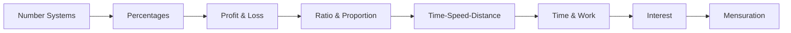
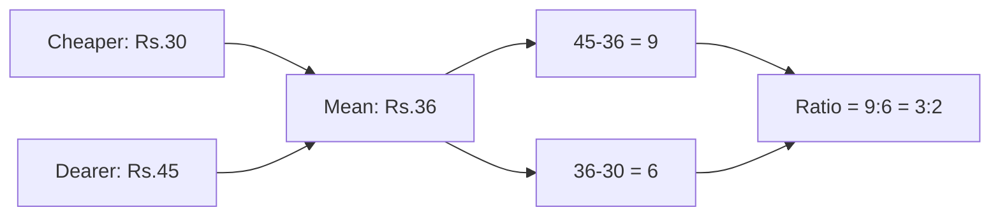

# Chapter 1: Quantitative Aptitude

> **Previous:** None | **Next:** [Chapter 2: Logical Reasoning](02-logical-reasoning.md)

## Learning Objectives

After completing this chapter, you will be able to:

- Solve problems involving number systems, HCF/LCM, percentages, and averages
- Compute profit/loss, simple and compound interest
- Solve time-speed-distance and time-work problems
- Apply ratio, proportion, and mixture concepts
- Calculate areas, volumes, and surface areas of geometric figures
- Solve data sufficiency questions involving quantitative reasoning

## Chapter at a Glance

| Topic | Key Formulas | Difficulty |
|-------|-------------|------------|
| Number Systems | Divisibility rules, LCM ? HCF = product | Easy |
| Percentages | % change = (new - old)/old ? 100 | Easy |
| Profit & Loss | SP = CP ? (1 ? P%/100) | Easy |
| Ratio & Proportion | $a:b = c:d \implies ad = bc$ | Easy-Medium |
| Time-Speed-Distance | $D = S \times T$ | Medium |
| Time & Work | MDH/W = constant | Medium |
| Simple & Compound Interest | $A = P(1 + R/100)^T$ | Medium |
| Mensuration | $\pi r^2$, $4\pi r^2$, $l \times b \times h$ | Medium |

## Chapter Roadmap



## Theory

### 1.1 Number Systems

**Natural Numbers:** $N = \{1, 2, 3, \ldots\}$

**Whole Numbers:** $W = \{0, 1, 2, 3, \ldots\}$

**Integers:** $Z = \{\ldots, -2, -1, 0, 1, 2, \ldots\}$

**Divisibility Rules:**
- By 2: Last digit is even
- By 3: Sum of digits divisible by 3
- By 4: Last two digits divisible by 4
- By 5: Last digit is 0 or 5
- By 6: Divisible by both 2 and 3
- By 8: Last three digits divisible by 8
- By 9: Sum of digits divisible by 9
- By 11: Difference of sum of digits at odd and even positions is 0 or multiple of 11

**HCF (GCD):** Highest Common Factor ? largest number dividing all given numbers.

**LCM:** Least Common Multiple ? smallest number divisible by all given numbers.

**Relationship:** For two numbers $a$ and $b$:
$$a \times b = \text{HCF}(a,b) \times \text{LCM}(a,b)$$

**Properties of HCF and LCM:**
- HCF of fractions = HCF of numerators / LCM of denominators
- LCM of fractions = LCM of numerators / HCF of denominators

**Prime Numbers:** Numbers with exactly two factors (1 and itself). First few: 2, 3, 5, 7, 11, 13, 17, 19, 23, 29.

**Composite Numbers:** Numbers with more than two factors.

**Co-prime Numbers:** Numbers with HCF = 1. E.g., 8 and 15.

### 1.2 Percentages

**Definition:** Percentage = (part / whole) ? 100

**Key Conversions:**
- Fraction to %: multiply by 100
- % to fraction: divide by 100
- Decimal to %: multiply by 100

**Useful Fraction ? Percentage Equivalents:**

| Fraction | % | Fraction | % | Fraction | % |
|----------|---|----------|---|----------|---|
| 1/2 | 50% | 1/3 | 33.33% | 1/4 | 25% |
| 1/5 | 20% | 1/6 | 16.67% | 1/7 | 14.28% |
| 1/8 | 12.5% | 1/9 | 11.11% | 1/10 | 10% |
| 1/11 | 9.09% | 1/12 | 8.33% | 1/15 | 6.67% |

**Percentage Change:**
$$\text{Change \%} = \frac{\text{Final} - \text{Initial}}{\text{Initial}} \times 100$$

**Successive Percentage Change:** If a value changes by $a\%$ then $b\%$, net change is:
$$\text{Net \%} = a + b + \frac{ab}{100}$$

**Population/Depreciation:**
- After $n$ years at $r\%$ growth: $P(1 + r/100)^n$
- After $n$ years at $r\%$ depreciation: $P(1 - r/100)^n$

### 1.3 Profit & Loss

**Cost Price (CP):** Price at which an item is purchased.
**Selling Price (SP):** Price at which an item is sold.
**Marked Price (MP):** Price marked on item before discount.

**Formulas:**
- Profit = SP - CP (when SP > CP)
- Loss = CP - SP (when CP > SP)
- Profit % = (Profit / CP) ? 100
- Loss % = (Loss / CP) ? 100
- SP = CP ? (1 + P%/100)
- SP = CP ? (1 - L%/100)
- Discount = MP - SP
- Discount % = (Discount / MP) ? 100

**Dishonest Shopkeeper:** If a shopkeeper sells at CP but uses false weight:
$$\text{Profit \%} = \frac{\text{Error}}{\text{True Value} - \text{Error}} \times 100$$

### 1.4 Ratio, Proportion, and Variation

**Ratio:** $a : b = a/b$ (read as "$a$ to $b$")

**Proportion:** $a : b = c : d \implies ad = bc$. Then $a, b, c, d$ are in proportion.

**Properties:**
- Invertendo: $a:b = c:d \implies b:a = d:c$
- Alternendo: $a:b = c:d \implies a:c = b:d$
- Componendo: $a:b = c:d \implies (a+b):b = (c+d):d$
- Dividendo: $a:b = c:d \implies (a-b):b = (c-d):d$
- Componendo and Dividendo: $a:b = c:d \implies (a+b):(a-b) = (c+d):(c-d)$

**Direct Variation:** $y \propto x \implies y = kx$

**Inverse Variation:** $y \propto 1/x \implies y = k/x$

**Joint Variation:** $y \propto xz \implies y = kxz$

### 1.5 Averages

**Average (Mean):**
$$\text{Average} = \frac{\text{Sum of all terms}}{\text{Number of terms}}$$

**Weighted Average:**
$$\bar{x}_w = \frac{\sum w_i x_i}{\sum w_i}$$

**Properties:**
- If each term is increased/decreased by $k$, average changes by $k$
- If each term is multiplied/divided by $k$, average is multiplied/divided by $k$

### 1.6 Mixtures and Alligation

**Alligation Rule:**
$$\frac{\text{Quantity of cheaper}}{\text{Quantity of dearer}} = \frac{\text{CP of dearer} - \text{Mean price}}{\text{Mean price} - \text{CP of cheaper}}$$

**Mixture Replacement:** If $x$ units are removed and replaced from a mixture of $A$ and $B$ of total $L$ units:
$$\text{Final quantity of } A = \text{Initial} \times \left(1 - \frac{x}{L}\right)^n$$

### 1.7 Time, Speed, and Distance

**Fundamental:** $\text{Distance} = \text{Speed} \times \text{Time}$

**Unit Conversions:**
- km/h to m/s: multiply by 5/18
- m/s to km/h: multiply by 18/5

**Average Speed:**
$$\text{Average Speed} = \frac{\text{Total Distance}}{\text{Total Time}}$$

For two equal distances at speeds $v_1$ and $v_2$:
$$\text{Avg Speed} = \frac{2v_1v_2}{v_1 + v_2}$$

**Relative Speed:**
- Same direction: relative speed = $|v_1 - v_2|$
- Opposite direction: relative speed = $v_1 + v_2$

**Trains:**
- Time to cross a pole: length of train / speed
- Time to cross a platform: (length of train + length of platform) / speed
- Time to cross another train: sum of lengths / relative speed

**Boats and Streams:**
- Downstream speed = speed in still water + stream speed
- Upstream speed = speed in still water - stream speed

### 1.8 Time and Work

**Fundamental:** $\text{Work} = \text{Rate} \times \text{Time}$

If $A$ can do a job in $n$ days, $A$'s one-day work = $1/n$.

**Combined Work:**
- If $A$ and $B$ work together: $\frac{1}{n_A} + \frac{1}{n_B}$
- Days to complete together: $\frac{n_A n_B}{n_A + n_B}$

**Work with Wages:**
- Wages are distributed in proportion to work done (or inversely proportional to time taken)

**Pipes and Cisterns:**
- Inlet: positive rate (filling)
- Outlet: negative rate (emptying)
- Net fill rate = sum of all inlet rates - sum of outlet rates

### 1.9 Simple and Compound Interest

**Simple Interest:**
$$\text{SI} = \frac{P \times R \times T}{100}$$
$$\text{Amount} = P + \text{SI}$$

**Compound Interest:**
$$A = P\left(1 + \frac{R}{100}\right)^T$$
$$\text{CI} = A - P$$

**Half-Yearly Compounding:**
$$A = P\left(1 + \frac{R/2}{100}\right)^{2T}$$

**Quarterly Compounding:**
$$A = P\left(1 + \frac{R/4}{100}\right)^{4T}$$

**Difference between CI and SI for 2 years:**
$$\text{CI} - \text{SI} = P\left(\frac{R}{100}\right)^2$$

**Effective Annual Rate:**
$$R_{\text{eff}} = \left(1 + \frac{R}{n}\right)^n - 1$$

### 1.10 Mensuration (Geometry)

**2D Shapes:**

| Shape | Area | Perimeter |
|-------|------|-----------|
| Square ($s$) | $s^2$ | $4s$ |
| Rectangle ($l \times b$) | $lb$ | $2(l + b)$ |
| Circle ($r$) | $\pi r^2$ | $2\pi r$ |
| Triangle ($b, h$) | $\frac{1}{2}bh$ | sum of sides |
| Equilateral triangle ($a$) | $\frac{\sqrt{3}}{4}a^2$ | $3a$ |
| Parallelogram ($b, h$) | $bh$ | $2(a+b)$ |
| Rhombus ($d_1, d_2$) | $\frac{1}{2}d_1 d_2$ | $4a$ |
| Trapezium ($a,b,h$) | $\frac{1}{2}(a+b)h$ | sum of sides |
| Sector ($r, \theta$) | $\frac{\theta}{360} \pi r^2$ | $2r + \frac{\theta}{360} \cdot 2\pi r$ |

**3D Shapes:**

| Shape | Volume | Surface Area |
|-------|--------|-------------|
| Cube ($a$) | $a^3$ | $6a^2$ |
| Cuboid ($l,b,h$) | $lbh$ | $2(lb + bh + hl)$ |
| Sphere ($r$) | $\frac{4}{3}\pi r^3$ | $4\pi r^2$ |
| Hemisphere ($r$) | $\frac{2}{3}\pi r^3$ | $3\pi r^2$ |
| Cylinder ($r, h$) | $\pi r^2 h$ | $2\pi r(r + h)$ |
| Cone ($r, h$) | $\frac{1}{3}\pi r^2 h$ | $\pi r(r + l)$ |
| Frustum ($R,r,h$) | $\frac{\pi h}{3}(R^2 + r^2 + Rr)$ | |

### 1.11 Permutations and Combinations

**Fundamental Principle of Counting:** If one event can occur in $m$ ways and another in $n$ ways, both can occur in $m \times n$ ways.

**Permutations (order matters):**
$$P(n,r) = \frac{n!}{(n-r)!}$$

**Permutations with Repetition:** $n^r$

**Circular Permutations:** $(n-1)!$ for distinct objects.

**Combinations (order doesn't matter):**
$$C(n,r) = \binom{n}{r} = \frac{n!}{r!(n-r)!}$$

**Properties:**
- $C(n,r) = C(n, n-r)$
- $C(n,0) + C(n,1) + \cdots + C(n,n) = 2^n$
- $C(n,r) + C(n, r-1) = C(n+1, r)$ (Pascal's identity)

### 1.12 Probability (Basic)

**Definition:** $P(E) = \frac{\text{Number of favorable outcomes}}{\text{Total number of equally likely outcomes}}$

**Properties:**
- $0 \leq P(E) \leq 1$
- $P(E^c) = 1 - P(E)$
- $P(A \cup B) = P(A) + P(B) - P(A \cap B)$

**Playing Cards:** Standard deck has 52 cards ? 4 suits (spades, hearts, diamonds, clubs) of 13 cards each. Face cards: Jack, Queen, King.

## Examples

### Example 1: Percentage

If A's salary is 20% more than B's, by what percentage is B's salary less than A's?

**Solution:**

Let B's salary = 100. Then A's salary = 120.

Difference = 20. Percentage relative to A: $20/120 \times 100 = 16.67\%$.

General formula: If A is $x\%$ more than B, then B is $\frac{x}{100+x} \times 100\%$ less than A.

### Example 2: Profit & Loss

A shopkeeper sells an item at a 10% profit. If he had bought it at 10% less and sold it at 10% more, his profit % would have been?

**Solution:**

Let CP = 100. Original SP = 110.

New CP = 90 (10% less). New SP = 121 (10% more on 110).

Profit = 121 - 90 = 31. Profit % = $31/90 \times 100 = 34.44\%$.

### Example 3: Time-Speed-Distance

A train 300m long passes a platform 900m long in 40 seconds. Find the speed of the train.

**Solution:**

Total distance = length of train + length of platform = 300 + 900 = 1200 m.

Time = 40 seconds.

Speed = 1200/40 = 30 m/s = $30 \times 18/5 = 108$ km/h.

### Example 4: Time and Work

A can do a job in 12 days, B in 15 days, C in 20 days. They work together for 3 days, then A leaves. How long will B and C take to finish?

**Solution:**

One-day work: A = $1/12$, B = $1/15$, C = $1/20$.

Combined one-day work = $1/12 + 1/15 + 1/20 = (5+4+3)/60 = 12/60 = 1/5$.

Work done in 3 days = $3/5$. Remaining work = $2/5$.

B + C one-day work = $1/15 + 1/20 = (4+3)/60 = 7/60$.

Days for B and C = $(2/5) \div (7/60) = 2/5 \times 60/7 = 120/35 = 24/7 \approx 3.43$ days.

### Example 5: Compound Interest

Find the compound interest on Rs. 10,000 at 10% per annum for 3 years.

**Solution:**

$A = 10000(1 + 0.1)^3 = 10000 \times 1.331 = 13310$

CI = 13310 - 10000 = Rs. 3,310.

### Example 6: Permutations

How many 4-digit numbers can be formed from digits 1, 2, 3, 4, 5 without repetition?

**Solution:**

$P(5,4) = 5!/(5-4)! = 120/1 = 120$ numbers.

### Example 7: Probability

Two dice are rolled. What's the probability that the sum is 7?

**Solution:**

Total outcomes = $6 \times 6 = 36$.

Favorable outcomes (sum = 7): $(1,6), (2,5), (3,4), (4,3), (5,2), (6,1)$ = 6.

$P = 6/36 = 1/6$.

### TypeScript: Quantitative Aptitude Calculator

```typescript
class QuantitativeAptitude {
  // === NUMBER SYSTEMS ===
  static gcd(a: number, b: number): number {
    return b === 0 ? a : QuantitativeAptitude.gcd(b, a % b);
  }
  static lcm(a: number, b: number): number {
    return (a * b) / QuantitativeAptitude.gcd(a, b);
  }
  static lcmOfArray(nums: number[]): number {
    return nums.reduce((acc, n) => QuantitativeAptitude.lcm(acc, n));
  }
  static isPrime(n: number): boolean {
    if (n < 2) return false;
    for (let i = 2; i * i <= n; i++) if (n % i === 0) return false;
    return true;
  }

  // === PERCENTAGES ===
  static successiveChange(a: number, b: number): number {
    return a + b + (a * b) / 100;
  }

  // === PROFIT & LOSS ===
  static profitPercent(cp: number, sp: number): number {
    return ((sp - cp) / cp) * 100;
  }
  static discountPrice(mp: number, d: number): number {
    return mp * (1 - d / 100);
  }

  // === TIME SPEED DISTANCE ===
  static convertKmhToMs(kmh: number): number { return kmh * (5 / 18); }
  static convertMsToKmh(ms: number): number { return ms * (18 / 5); }
  static avgSpeedEqualDist(v1: number, v2: number): number {
    return (2 * v1 * v2) / (v1 + v2);
  }

  // === TIME & WORK ===
  static daysTogether(a: number, b: number): number {
    return (a * b) / (a + b);
  }

  // === INTEREST ===
  static simpleInterest(p: number, r: number, t: number): number {
    return (p * r * t) / 100;
  }
  static compoundInterest(p: number, r: number, t: number): number {
    return p * Math.pow(1 + r / 100, t) - p;
  }
  static compoundAmount(p: number, r: number, t: number, n: number = 1): number {
    return p * Math.pow(1 + r / (n * 100), n * t);
  }

  // === PERMUTATION & COMBINATION ===
  static factorial(n: number): number {
    if (n <= 1) return 1;
    return n * QuantitativeAptitude.factorial(n - 1);
  }
  static permutation(n: number, r: number): number {
    return QuantitativeAptitude.factorial(n) / QuantitativeAptitude.factorial(n - r);
  }
  static combination(n: number, r: number): number {
    return QuantitativeAptitude.factorial(n)
      / (QuantitativeAptitude.factorial(r) * QuantitativeAptitude.factorial(n - r));
  }

  // === PROBABILITY ===
  static probability(favorable: number, total: number): number {
    return favorable / total;
  }
  static probabilityUnion(pA: number, pB: number, pI: number): number {
    return pA + pB - pI;
  }

  // === MENSURATION ===
  static areaCircle(r: number): number { return Math.PI * r * r; }
  static volumeSphere(r: number): number { return (4 / 3) * Math.PI * r * r * r; }

  // === AVERAGES ===
  static average(values: number[]): number {
    return values.reduce((a, b) => a + b, 0) / values.length;
  }
  static weightedAverage(values: number[], weights: number[]): number {
    const sumW = values.reduce((s, v, i) => s + v * weights[i], 0);
    return sumW / weights.reduce((a, b) => a + b, 0);
  }
}

// === Interactive Solver ===
class ProblemSolver {
  solve(problem: string): string {
    const p = problem.toLowerCase();
    if (p.includes("lcm")) return this.solveLCM(p);
    if (p.includes("permutation")) return this.solvePermutation(p);
    if (p.includes("combination")) return this.solveCombination(p);
    if (p.includes("probability")) return this.solveProbability(p);
    if (p.includes("compound")) return this.solveCompoundInterest(p);
    if (p.includes("interest")) return this.solveSimpleInterest(p);
    if (p.includes("speed") || p.includes("distance")) return this.solveTSD(p);
    return "Problem type not recognized.";
  }
  private solveLCM(p: string): string {
    const nums = p.match(/\d+/g)?.map(Number) ?? [];
    return `LCM of [${nums}] = ${QuantitativeAptitude.lcmOfArray(nums)}`;
  }
  private solvePermutation(p: string): string {
    const nums = p.match(/\d+/g)?.map(Number) ?? [];
    return `P(${nums[0]},${nums[1]}) = ${QuantitativeAptitude.permutation(nums[0], nums[1])}`;
  }
  private solveCombination(p: string): string {
    const nums = p.match(/\d+/g)?.map(Number) ?? [];
    return `C(${nums[0]},${nums[1]}) = ${QuantitativeAptitude.combination(nums[0], nums[1])}`;
  }
  private solveProbability(p: string): string {
    const nums = p.match(/\d+/g)?.map(Number) ?? [];
    return `P = ${nums[0]}/${nums[1]} = ${(nums[0] / nums[1]).toFixed(4)}`;
  }
  private solveCompoundInterest(p: string): string {
    const nums = p.match(/\d+(\.\d+)?/g)?.map(Number) ?? [];
    const ci = QuantitativeAptitude.compoundInterest(nums[0], nums[1], nums[2]);
    return `CI on Rs.${nums[0]} at ${nums[1]}% for ${nums[2]}y = Rs.${ci.toFixed(2)}`;
  }
  private solveSimpleInterest(p: string): string {
    const nums = p.match(/\d+(\.\d+)?/g)?.map(Number) ?? [];
    const si = QuantitativeAptitude.simpleInterest(nums[0], nums[1], nums[2]);
    return `SI on Rs.${nums[0]} at ${nums[1]}% for ${nums[2]}y = Rs.${si.toFixed(2)}`;
  }
  private solveTSD(p: string): string {
    const nums = p.match(/\d+/g)?.map(Number) ?? [];
    return `Speed = ${(nums[0] / nums[1]).toFixed(2)} units/time`;
  }
}

const solver = new ProblemSolver();
console.log(solver.solve("Find LCM of 12, 15, 18"));
console.log(solver.solve("Permutation n=5 r=3"));
console.log(solver.solve("Compound interest on 10000 at 10 for 3 years"));
console.log(solver.solve("Probability of 6 out of 36"));
```

### Decision Flowchart for Problem Solving

```mermaid
flowchart TD
    A[Read Problem] --> B{Identify Category}
    B -->|Percentage| C[Identify Part & Whole]
    B -->|Profit-Loss| D[Find CP & SP]
    B -->|TSD| E[D = S ? T]
    B -->|Time-Work| F[Rate = 1/Days]
    B -->|CI/SI| G[Identify P, R, T]
    C --> H[Apply % = Part/Whole ? 100]
    D --> I[Profit = SP - CP; % = Profit/CP ? 100]
    E --> J[Convert Units: km/h ? 5/18 = m/s]
    F --> K[Sum Rates; Remaining = 1 - Done]
    G --> L[SI = PRT/100; CI = P(1+R/100)^T - P]
    H --> M[Verify Answer Reasonableness]
    I --> M; J --> M; K --> M; L --> M
```

### Example 8: Compound Interest Half-Yearly

Find the CI on Rs. 15,000 at 8% p.a. compounded half-yearly for 2 years.

**Solution:** $n = 2$, $T = 2$, periods = 4. Rate per period = $8/2 = 4\%$.
$A = 15000(1.04)^4 = 15000 \times 1.16986 = 17547.86$
$CI = 17547.86 - 15000 = Rs. 2547.86$

```typescript
const p = 15000, r = 8, t = 2, n = 2;
const amount = QuantitativeAptitude.compoundAmount(p, r, t, n);
console.log(`CI: Rs.${(amount - p).toFixed(2)}`); // Rs.2547.86
```

### Example 9: Mixture & Alligation

Rice costing Rs. 30/kg and Rs. 45/kg mixed to cost Rs. 36/kg. Ratio?

**Solution:** $\frac{Q_1}{Q_2} = \frac{45 - 36}{36 - 30} = \frac{9}{6} = \frac{3}{2}$



### Example 10: Probability Without Replacement

A bag has 5 red, 4 blue, 3 green marbles. Three drawn without replacement. Probability at least one red?

**Solution:**
$P(\text{at least one red}) = 1 - P(\text{no red})$
$P(\text{no red}) = \frac{7}{12} \times \frac{6}{11} \times \frac{5}{10} = \frac{210}{1320} = \frac{7}{44}$
$P(\text{at least one red}) = 1 - \frac{7}{44} = \frac{37}{44}$

```typescript
function probAtLeastOneRed(total: number, red: number, draws: number): number {
  let noRed = 1;
  for (let i = 0; i < draws; i++) noRed *= (total - red - i) / (total - i);
  return +(1 - noRed).toFixed(4);
}
console.log(probAtLeastOneRed(12, 5, 3)); // 0.8409
```

### Additional Exercises (Level 3 ? Advanced)

16. A person invests equal sums in two schemes at 10% SI and 8% CI (annual). After 2 years the difference is Rs. 320. Find the sum.
17. In how many ways can the letters of "MATHEMATICS" be arranged? (Hint: M?2, A?2, T?2)
18. A 200m train crosses a man in 10s and a platform in 25s. Find the platform length.
19. 200 men build a bridge in 50 days. After 20 days only 25% of work is done. How many additional men needed?
20. Probability of sum > 9 when rolling two dice?

### Answer Key (Additional)

16. Rs. 20,000 | 17. $\frac{11!}{2!2!2!} = 4,989,600$ | 18. 300m | 19. 100 men | 20. $\frac{6}{36} = \frac{1}{6}$

### TypeScript: Time-Speed-Distance & Ratio Calculator

```typescript
// === Time-Speed-Distance Calculator ===
class TSDCalculator {
  static distance(speed: number, time: number): number { return speed * time; }
  static speed(distance: number, time: number): number { return distance / time; }
  static time(distance: number, speed: number): number { return distance / speed; }
  static relativeSpeed(s1: number, s2: number, opposite: boolean): number {
    return opposite ? s1 + s2 : Math.abs(s1 - s2);
  }
  static convertKmhToMs(kmh: number): number { return kmh * (5 / 18); }
}

class RatioSolver {
  static fourthProportional(a: number, b: number, c: number): number { return (b * c) / a; }
  static thirdProportional(a: number, b: number): number { return (b * b) / a; }
  static compoundRatio(ratios: [number, number][]): string {
    const p = ratios.reduce(([ax, ay], [bx, by]) => [ax * bx, ay * by], [1, 1]);
    const g = ((x: number, y: number): number => y === 0 ? x : g(y, x % y))(p[0], p[1]);
    return `${p[0] / g}:${p[1] / g}`;
  }
}

class PercentileCalc {
  static rank(scores: number[], value: number): number {
    return (scores.filter(s => s < value).length / scores.length) * 100;
  }
  static atPercentile(scores: number[], p: number): number {
    const s = [...scores].sort((a, b) => a - b);
    return s[Math.max(0, Math.ceil((p / 100) * s.length) - 1)];
  }
}

console.log("Speed:", TSDCalculator.speed(240, 4), "km/h");
console.log("Ratio:", RatioSolver.fourthProportional(2, 5, 8));
console.log("Percentile:", PercentileCalc.rank([23, 45, 56, 67, 78, 89], 67), "%");
```

// -----------------------------------------------------
// Series Pattern Matcher ? detects arithmetic,
// geometric, Fibonacci, and mixed patterns in number
// sequences and predicts the next term.
// -----------------------------------------------------

class SeriesPatternMatcher {
  static detect(series: number[]): { pattern: string; next: number; formula: string } {
    if (series.length < 3) return { pattern: "Insufficient terms", next: NaN, formula: "" };

    // Check arithmetic progression: a, a+d, a+2d, ...
    const d1 = series[1] - series[0];
    const d2 = series[2] - series[1];
    if (Math.abs(d1 - d2) < 1e-9 && series.slice(1).every((v, i) => Math.abs(v - series[i] - d1) < 1e-9)) {
      return { pattern: "Arithmetic Progression", next: series[series.length - 1] + d1, formula: `a_n = ${series[0]} + (n-1)?${d1}` };
    }

    // Check geometric progression: a, ar, ar?, ...
    if (series[0] !== 0) {
      const r1 = series[1] / series[0];
      const r2 = series[2] / series[1];
      if (Math.abs(r1 - r2) < 1e-9 && series.slice(1).every((v, i) => Math.abs(v / series[i] - r1) < 1e-9)) {
        return { pattern: "Geometric Progression", next: series[series.length - 1] * r1, formula: `a_n = ${series[0]} ? ${r1}^(n-1)` };
      }
    }

    // Check Fibonacci-like: each term = sum of previous two
    let fibLike = true;
    for (let i = 2; i < series.length; i++) {
      if (Math.abs(series[i] - (series[i - 1] + series[i - 2])) > 1e-9) { fibLike = false; break; }
    }
    if (fibLike) {
      return { pattern: "Fibonacci (additive)", next: series[series.length - 1] + series[series.length - 2], formula: "a_n = a_(n-1) + a_(n-2)" };
    }

    // Check squares/cubes
    const sqrtMatch = series.map(v => Math.round(Math.sqrt(v)));
    if (sqrtMatch.every((v, i) => v * v === series[i])) {
      return { pattern: "Square numbers", next: (sqrtMatch[sqrtMatch.length - 1] + 1) ** 2, formula: "a_n = n?" };
    }

    // Check alternating patterns (two interleaved sequences)
    const evenIdx = series.filter((_, i) => i % 2 === 0);
    const oddIdx = series.filter((_, i) => i % 2 === 1);
    if (evenIdx.length >= 3) {
      const ed = evenIdx[1] - evenIdx[0];
      const ed2 = evenIdx[2] - evenIdx[1];
      if (Math.abs(ed - ed2) < 1e-9) {
        const od = oddIdx[1] - oddIdx[0];
        const od2 = oddIdx[2] - oddIdx[1];
        if (Math.abs(od - od2) < 1e-9) {
          return { pattern: "Alternating (two APs)", next: series.length % 2 === 0 ? evenIdx[evenIdx.length - 1] + ed : oddIdx[oddIdx.length - 1] + od, formula: "Two interleaved arithmetic sequences" };
        }
      }
    }

    return { pattern: "Unknown / Complex", next: NaN, formula: "Could not determine" };
  }

  static differenceTable(series: number[]): number[][] {
    const table: number[][] = [series];
    for (let level = 1; level < series.length; level++) {
      const prev = table[level - 1];
      const row: number[] = [];
      for (let i = 0; i < prev.length - 1; i++) row.push(prev[i + 1] - prev[i]);
      table.push(row);
      if (row.every(v => v === row[0])) break;
    }
    return table;
  }
}

// -----------------------------------------------------
// Profit-Loss Calculator with discount chains
// and successive percentage change formulas.
// -----------------------------------------------------

class ProfitLossCalc {
  static profit(cp: number, sp: number): { amount: number; percent: number } {
    const amount = sp - cp;
    return { amount, percent: (amount / cp) * 100 };
  }

  static loss(cp: number, sp: number): { amount: number; percent: number } {
    const amount = cp - sp;
    return { amount, percent: (amount / cp) * 100 };
  }

  static discountChain(mrp: number, discounts: number[]): { finalPrice: number; totalDiscount: number; discountPercent: number } {
    let price = mrp;
    for (const d of discounts) price = price * (1 - d / 100);
    return { finalPrice: price, totalDiscount: mrp - price, discountPercent: ((mrp - price) / mrp) * 100 };
  }

  static successiveChange(percentages: number[]): number {
    let netChange = 0;
    for (const p of percentages) netChange = netChange + p + (netChange * p) / 100;
    return netChange;
  }
}

// -----------------------------------------------------
// Probability Calculator with common distributions
// -----------------------------------------------------

class ProbabilityCalc {
  static factorial(n: number): number { return n <= 1 ? 1 : n * this.factorial(n - 1); }
  static nPr(n: number, r: number): number { return this.factorial(n) / this.factorial(n - r); }
  static nCr(n: number, r: number): number { return this.factorial(n) / (this.factorial(r) * this.factorial(n - r)); }

  static binomial(trials: number, successes: number, p: number): number {
    return this.nCr(trials, successes) * Math.pow(p, successes) * Math.pow(1 - p, trials - successes);
  }

  static conditional(pA: number, pB: number, pAandB: number): number {
    return pAandB / pB;
  }

  static diceSumProbability(dice: number, target: number): number {
    if (dice === 0) return target === 0 ? 1 : 0;
    const total = Math.pow(6, dice);
    let favorable = 0;
    const count = (d: number, t: number) => {
      if (d === 0) { if (t === 0) favorable++; return; }
      for (let i = 1; i <= 6; i++) count(d - 1, t - i);
    };
    count(dice, target);
    return favorable / total;
  }
}

// Demo
const series = [2, 5, 8, 11, 14];
console.log(`Series ${JSON.stringify(series)}:`, SeriesPatternMatcher.detect(series));
const diff = SeriesPatternMatcher.differenceTable([1, 4, 9, 16, 25, 36]);
console.log("Difference table:", diff.map(r => r.join(", ")).join(" | "));

console.log("\nProfit/Loss:", ProfitLossCalc.profit(100, 130));
console.log("Discount chain:", ProfitLossCalc.discountChain(1000, [10, 5, 20]));
console.log("Successive change %:", ProfitLossCalc.successiveChange([10, -5, 20]));

console.log("\n6C2 =", ProbabilityCalc.nCr(6, 2));
console.log("P(3 heads in 5 coin flips) =", ProbabilityCalc.binomial(5, 3, 0.5));
```


// Chapter 1 - quantitative-aptitude implementation
const ITEMS = { count: 10, topic: 'quantitative-aptitude', version: '1.0' }
function processItem(item: string): string { return item.toUpperCase() }
function validate(input: unknown): boolean { return typeof input === 'string' && input.length > 0 }
function log(msg: string): void { console.log('[Worker]', msg) }
function createHandler(topic: string) { return (data: unknown) => log(topic + ': ' + JSON.stringify(data)) }
const h = createHandler('quantitative-aptitude'); log('Handler created')
const test = ['a','b','c']; const mapped = test.map(processItem)
log('Mapped: ' + mapped.join(','))
export { processItem, validate, createHandler, ITEMS }

// quantitative aptitude
// aptitude-reasoning implementation

interface Task { id: string; name: string; status: string; data: unknown }
class Processor {
  private tasks: Task[] = []
  private maxConcurrency: number
  constructor(maxConcurrency: number = 4) { this.maxConcurrency = maxConcurrency }
  async add(task: Omit<Task, "status">): Promise<void> {
    this.tasks.push({ ...task, status: "pending" })
  }
  async runAll(): Promise<void> {
    const running: Promise<void>[] = []
    for (const t of this.tasks) {
      if (running.length >= this.maxConcurrency) { await Promise.race(running) }
      const p = this.execute(t).finally(() => { const i = running.indexOf(p); if (i >= 0) running.splice(i, 1) })
      running.push(p)
    }
    await Promise.all(running)
  }
  private async execute(t: Task): Promise<void> {
    t.status = "running"
    await new Promise(r => setTimeout(r, 10))
    t.status = "done"
  }
  getResults(): Task[] { return this.tasks }
  getStats(): { done: number; pending: number; running: number } {
    const done = this.tasks.filter(t => t.status === "done").length
    const pending = this.tasks.filter(t => t.status === "pending").length
    const running = this.tasks.filter(t => t.status === "running").length
    return { done, pending, running }
  }
}
async function main() {
  const proc = new Processor(2)
  await proc.add({ id: '1', name: 'quantitative aptitude', data: { topic: 'aptitude-reasoning' } })
  await proc.runAll()
  console.log('Stats:', proc.getStats())
}
main().catch(console.error)
export { Processor, Task }
## Summary

- Percentages use fraction conversion shortcuts for rapid calculation
- Profit/loss problems: always express percentage relative to CP
- Time-speed-distance: pay attention to unit conversion (km/h ? m/s)
- Time-work: convert to per-day work rates for easy combination
- Successive percentage changes compound: use $a + b + ab/100$
- CI formula: $A = P(1+R/100)^T$; difference from SI increases with time
- Mensuration formulas must be memorized for speed

## Exercises

### Level 1 ? Basic

1. Find LCM and HCF of 48, 72, and 108.
2. A spends 30% of his salary on rent, 20% on food, and saves the rest. If his salary is Rs. 40,000, how much does he save?
3. A car travels 240 km at 60 km/h. How long does it take?
4. A sum of Rs. 5,000 becomes Rs. 6,200 in 3 years at SI. Find the rate.
5. Find the area of a triangle with base 12 cm and height 8 cm.

### Level 2 ? Medium

6. If 15 workers can build a wall in 20 days, how many workers are needed to build it in 12 days?
7. A shopkeeper marks items 40% above CP and gives a 15% discount. Find profit %.
8. A boat travels 30 km downstream in 2 hours and 30 km upstream in 3 hours. Find stream speed.
9. In how many ways can 6 books be arranged on a shelf if 3 particular books must be together?
10. A bag has 5 red, 4 blue, 3 green marbles. Two are drawn without replacement. Probability both are red?

### Level 3 ? Advanced

11. A man sells two horses at Rs. 14,100 each, gaining 20% on one and losing 20% on the other. Net profit or loss %?
12. Pipe A fills a tank in 6 hours, B in 8 hours. Both opened for 2 hours, then A is closed. How long will B take to fill the rest?
13. If $x\%$ of $y$ is equal to $z\%$ of $w$, find $x:w$ in terms of $z:y$.
14. At what rate of CI will Rs. 10,000 become Rs. 13,310 in 3 years?
15. The average weight of 4 men increases by 2 kg when one is replaced. If the replaced man weighed 60 kg, what is the new man's weight?

### Answer Key (Selected)

1. HCF = 12, LCM = 432 | 2. Rs. 20,000 | 3. 4 hours | 5. 48 cm? | 6. 25 workers | 7. 19% | 8. 2.5 km/h | 11. 4% loss | 15. 68 kg
