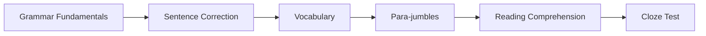
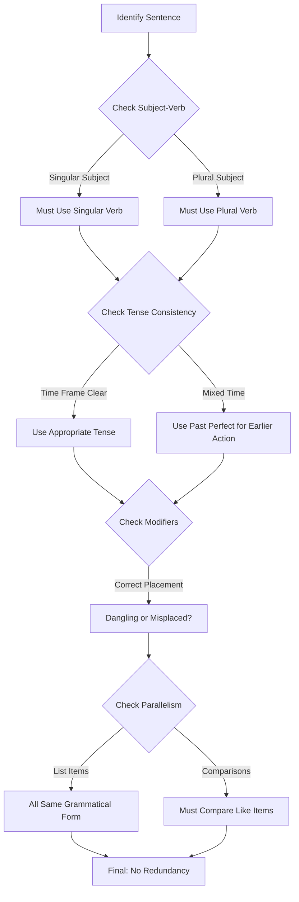
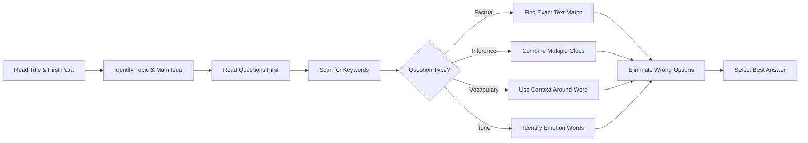

# Chapter 3: Verbal Ability

> **Previous:** [Chapter 2: Logical Reasoning](02-logical-reasoning.md) | **Next:** [Chapter 4: Data Interpretation](04-data-interpretation.md)

## Learning Objectives

After completing this chapter, you will be able to:

<!-- Image Gallery -->
<div style="display:flex;flex-wrap:wrap;gap:4px;margin:16px 0;padding:12px;background:#f8fafc;border-radius:8px;border:1px solid #e2e8f0;">
<a href="../../../assets/images/lessons/general-aptitude/03-verbal-ability/hero.svg" target="_blank" rel="noopener">
  
</a>
<a href="../../../assets/images/lessons/general-aptitude/03-verbal-ability/handwritten-notes.svg" target="_blank" rel="noopener">
  
</a>
<a href="../../../assets/images/lessons/general-aptitude/03-verbal-ability/sticky-notes.svg" target="_blank" rel="noopener">
  
</a>
<a href="../../../assets/images/lessons/general-aptitude/03-verbal-ability/visual-explanation.svg" target="_blank" rel="noopener">
  
</a>
<a href="../../../assets/images/lessons/general-aptitude/03-verbal-ability/architecture.svg" target="_blank" rel="noopener">
  
</a>
<a href="../../../assets/images/lessons/general-aptitude/03-verbal-ability/workflow.svg" target="_blank" rel="noopener">
  
</a>
<a href="../../../assets/images/lessons/general-aptitude/03-verbal-ability/mindmap.svg" target="_blank" rel="noopener">
  
</a>
<a href="../../../assets/images/lessons/general-aptitude/03-verbal-ability/comparison.svg" target="_blank" rel="noopener">
  
</a>
<a href="../../../assets/images/lessons/general-aptitude/03-verbal-ability/cheatsheet.svg" target="_blank" rel="noopener">
  
</a>
<a href="../../../assets/images/lessons/general-aptitude/03-verbal-ability/interview-quiz.svg" target="_blank" rel="noopener">
  
</a>
<a href="../../../assets/images/lessons/general-aptitude/03-verbal-ability/social-card.svg" target="_blank" rel="noopener">
  
</a>
</div>
<!-- End Image Gallery -->


- Identify and correct grammatical errors in sentences
- Choose the correct word based on context and meaning (vocabulary)
- Complete sentences with appropriate words or phrases
- Rearrange jumbled sentences into coherent paragraphs
- Comprehensively analyze passages for main ideas and inferences
- Fill blanks in passages with appropriate words (cloze test)
- Solve synonym, antonym, and one-word substitution questions

## Chapter at a Glance

| Topic | Key Skills | Weightage in Exams |
|-------|-----------|-------------------|
| Grammar | Subject-verb agreement, tenses, articles, prepositions | 20-25% |
| Vocabulary | Synonyms, antonyms, one-word substitutions, idioms | 20-25% |
| Sentence Correction | Error spotting, phrase replacement | 15-20% |
| Para-jumbles | Logical ordering of sentences | 10-15% |
| Reading Comprehension | Inference, tone, main idea, vocabulary in context | 20-30% |
| Cloze Test | Context-based word selection | 10-15% |

## Chapter Roadmap



## Theory

### 3.1 Grammar Fundamentals


#### 3.1.1 Parts of Speech

| Part | Function | Examples |
|------|----------|----------|
| Noun | Person, place, thing, idea | cat, London, happiness |
| Pronoun | Replaces a noun | he, she, it, they, who |
| Verb | Action or state | run, think, is, become |
| Adjective | Describes a noun | beautiful, tall, interesting |
| Adverb | Describes a verb/adjective | quickly, very, well |
| Preposition | Shows relationship | in, on, at, by, for, with |
| Conjunction | Connects clauses | and, but, or, because, although |
| Interjection | Expresses emotion | oh!, wow!, alas! |

#### 3.1.2 Subject-Verb Agreement

The verb must agree with its subject in number and person.

**Key Rules:**
- Singular subject ? singular verb: "The boy runs."
- Plural subject ? plural verb: "The boys run."
- Two singular subjects joined by "and" ? plural: "Ram and Shyam are here."
- Two singular subjects joined by "or/nor" ? singular: "Neither Ram nor Shyam is here."
- When one is singular and one is plural with "or/nor", verb agrees with nearest subject: "Either the teacher or the students are responsible."
- Collective nouns (team, committee, family) take singular verb when acting as a unit: "The team is playing well."
- Words like "each", "every", "either", "neither" are singular: "Each of the students is present."
- "The number of" ? singular; "A number of" ? plural
- Expressions like "along with", "together with", "as well as" don't change the number of the subject: "The teacher, along with the students, is going."

#### 3.1.3 Tenses

| Tense | Simple | Continuous | Perfect | Perfect Continuous |
|-------|--------|-----------|---------|-------------------|
| Present | I write | I am writing | I have written | I have been writing |
| Past | I wrote | I was writing | I had written | I had been writing |
| Future | I will write | I will be writing | I will have written | I will have been writing |

**Common Errors:**
- Using present perfect with a definite past time: ? "I have seen him yesterday." ? "I saw him yesterday."
- Using wrong sequence of tenses in conditional: ? "If I would have known..." ? "If I had known..."
- Incorrect tense after "since": ? "It is three years since I am working here." ? "It is three years since I started working here."

#### 3.1.4 Articles

**Definite Article (the):** Used for specific/named things, unique entities, superlatives, ordinal numbers.

**Indefinite Articles (a/an):** "A" before consonant sounds, "an" before vowel sounds.
- a university (yoo- sound), an hour (silent h)
- a one-dollar bill (wuh- sound), an honest man (silent h)

**Omission of Articles:**
- Before proper nouns (except rivers, seas, mountain ranges, plural country names)
- Before abstract nouns used generally
- Before uncountable nouns used generally
- Before meals, games, languages

#### 3.1.5 Prepositions

**Common Preposition Usage:**

| Preposition | Usage | Example |
|------------|-------|---------|
| in | inside, months, years, cities | in the box, in January, in Paris |
| on | surface, days, dates | on the table, on Monday |
| at | specific point, time | at the door, at 5 o'clock |
| since | from past time until now | since 2019 |
| for | duration | for three years |
| between | two items | between A and B |
| among | three or more | among the students |
| by | agent, means, deadline | by the author, by train, by Friday |

#### 3.1.6 Conjunctions

**Coordinating Conjunctions (FANBOYS):** For, And, Nor, But, Or, Yet, So

**Subordinating Conjunctions:** Although, because, since, unless, if, when, while, whereas, as

**Correlative Conjunctions:** Either...or, Neither...nor, Both...and, Not only...but also

**Common Errors:**
- ? "Although he was tired, but he continued." (Double conjunction)
- ? "Although he was tired, he continued."
- ? "Neither he came nor he called." (Incorrect parallelism)
- ? "Neither did he come nor did he call."

#### 3.1.7 Modifiers

**Dangling Modifier:** Subject of modifier doesn't match sentence subject.
- ? "Walking to school, the rain started."
- ? "Walking to school, I felt the rain start."

**Misplaced Modifier:** Modifier placed far from what it modifies.
- ? "She almost drove her kids to school every day." (implies she didn't drive them fully)
- ? "She drove her kids to school almost every day."

#### 3.1.8 Parallelism

Items in a list or comparison should have the same grammatical structure.
- ? "She likes swimming, to run, and biking."
- ? "She likes swimming, running, and biking."
- ? "He is not only intelligent but also he is hardworking."
- ? "He is not only intelligent but also hardworking."

### 3.2 Vocabulary


#### 3.2.1 Synonyms and Antonyms

| Word | Synonym | Antonym |
|------|---------|---------|
| Abundant | Plentiful, ample | Scarce, sparse |
| Benevolent | Kind, generous | Malevolent, cruel |
| Candid | Frank, honest | Dishonest, evasive |
| Diligent | Hardworking, industrious | Lazy, negligent |
| Ephemeral | Fleeting, transient | Permanent, eternal |
| Frugal | Thrifty, economical | Extravagant, wasteful |
| Gregarious | Sociable, outgoing | Unsociable, reserved |
| Hypothetical | Theoretical, assumed | Actual, real |
| Innocuous | Harmless, safe | Harmful, dangerous |
| Jubilant | Joyful, elated | Mournful, dejected |
| Knock | Criticize, disparage | Praise, commend |
| Luminous | Bright, radiant | Dark, dim |
| Magnanimous | Generous, forgiving | Petty, spiteful |
| Nonchalant | Casual, indifferent | Anxious, concerned |
| Obsolete | Outdated, archaic | Modern, current |
| Pragmatic | Practical, realistic | Idealistic, impractical |
| Querulous | Complaining, whining | Content, satisfied |
| Resilient | Flexible, tough | Fragile, weak |
| Sagacious | Wise, discerning | Foolish, ignorant |
| Tenacious | Persistent, determined | Yielding, weak |
| Ubiquitous | Everywhere, omnipresent | Rare, scarce |
| Verbose | Wordy, talkative | Concise, succinct |
| Wary | Cautious, vigilant | Careless, reckless |
| Zealous | Enthusiastic, passionate | Apathetic, indifferent |

#### 3.2.2 One-Word Substitutions

| Phrase | One Word |
|--------|----------|
| One who looks at the bright side | Optimist |
| One who looks at the dark side | Pessimist |
| One who knows everything | Omniscient |
| One who is all-powerful | Omnipotent |
| One who is present everywhere | Omnipresent |
| One who loves mankind | Philanthropist |
| One who hates mankind | Misanthrope |
| One who loves books | Bibliophile |
| One who hates women | Misogynist |
| One who hates marriage | Misogamist |
| One who talks in sleep | Somniloquist |
| One who walks in sleep | Somnambulist |
| One who can't be corrected | Incorrigible |
| One who can read and write | Literate |
| One who doesn't believe in God | Atheist |
| One who believes in God | Theist |
| One who is undecided about God | Agnostic |
| That which cannot be read | Illegible |
| That which cannot be heard | Inaudible |
| That which cannot be seen | Invisible |
| That which cannot be conquered | Invincible |
| That which cannot be believed | Incredible |
| That which lasts forever | Eternal |
| That which can be eaten | Edible |
| That which can be drunk | Potable |
| A speech by one person | Monologue |
| A speech between two | Dialogue |
| A speech to oneself | Soliloquy |
| A government by one person | Autocracy |
| A government by the rich | Plutocracy |
| A government by the people | Democracy |
| A government by the few | Oligarchy |
| A government by the experts | Technocracy |

#### 3.2.3 Idioms and Phrases

| Idiom | Meaning |
|-------|---------|
| A penny for your thoughts | What are you thinking? |
| A blessing in disguise | Something that seems bad but turns out good |
| Beat around the bush | Avoid direct talk |
| Bite the bullet | Endure a painful situation |
| Break the ice | Start a conversation in a awkward situation |
| Call it a day | Stop working |
| Cut corners | Do something poorly to save money/time |
| Hit the nail on the head | Be exactly right |
| Let the cat out of the bag | Reveal a secret |
| Once in a blue moon | Rarely |
| Piece of cake | Very easy |
| Spill the beans | Reveal secret information |
| The ball is in your court | It's your decision now |
| When pigs fly | Never |
| Burn the midnight oil | Study/work late at night |
| Put the cart before the horse | Do things in wrong order |
| A storm in a teacup | Great fuss over trivial matter |
| To cry over spilt milk | Worry about past mistakes |
| To kill two birds with one stone | Achieve two goals with one action |
| To add insult to injury | Make a bad situation worse |

#### 3.2.4 Phrasal Verbs

| Phrasal Verb | Meaning |
|-------------|---------|
| Break down | Stop functioning / analyze |
| Bring up | Raise (a child) / mention |
| Call off | Cancel |
| Carry out | Execute, perform |
| Come across | Find by chance / seem |
| Figure out | Solve, understand |
| Give up | Quit, surrender |
| Look into | Investigate |
| Put off | Postpone |
| Run out of | Exhaust supply |
| Take over | Assume control |
| Turn down | Reject |
| Work out | Solve / exercise |

### 3.3 Sentence Correction


**Error Detection Categories:**

1. **Subject-Verb Agreement:** The list of items is/are on the table.
2. **Pronoun Agreement:** Every student must submit his (not their) assignment.
3. **Tense Consistency:** She said she was (not is) coming.
4. **Article Usage:** He is a (not an) university student.
5. **Preposition Usage:** She is good at (not in) mathematics.
6. **Parallelism:** She likes reading, writing, and swimming (not to swim).
7. **Modifier Placement:** Having finished dinner, we (not the doorbell) went out.
8. **Comparison:** Her score is higher than mine (not than me).
9. **Double Negative:** I have nothing (not I don't have nothing).
10. **Redundancy:** Return (not return back), Repeat (not repeat again).

### 3.4 Para-Jumbles


**Strategies for Ordering Sentences:**

1. **Find the opening sentence:** Usually introduces the topic, sets context, defines a term, or mentions a universal fact.

2. **Look for connecting words:**
   - "However", "but", "yet" ? contrast with previous sentence
   - "Therefore", "thus", "so" ? conclusion or result
   - "Furthermore", "moreover", "additionally" ? continuation
   - "For example", "such as" ? illustration
   - "First", "second", "finally" ? sequence

3. **Pronoun references:** A sentence starting with "He", "She", "It", "They", "This", "These" must have a referent in the previous sentence.

4. **Article usage:** "The" often refers to something already introduced. "A/An" introduces something new.

5. **Time sequence:** Chronological ordering.

6. **Logical flow:** General ? specific, problem ? solution, cause ? effect.

**Sentence Connectors:**

| Connector | Function |
|-----------|----------|
| Moreover, Furthermore | Adding information |
| However, Nevertheless | Contrast |
| Therefore, Consequently | Result |
| For instance, For example | Illustration |
| In other words, That is | Restatement |
| Meanwhile, Subsequently | Time |
| In conclusion, To summarize | Conclusion |

### 3.5 Reading Comprehension


**Question Types:**

1. **Main Idea / Central Theme:** What is the passage primarily about?
2. **Inference / Implied Meaning:** What can be logically concluded from the passage?
3. **Specific Information:** Factual recall from the passage.
4. **Vocabulary in Context:** Meaning of a word as used in the passage.
5. **Author's Tone / Attitude:** Critical, supportive, neutral, sarcastic, etc.
6. **Purpose of the Passage:** Inform, persuade, entertain, analyze.
7. **Logical Structure:** How is the passage organized?
8. **Assumptions:** What must be true for the argument to hold?

**Tone / Attitude Words:**

| Positive | Negative | Neutral |
|----------|----------|---------|
| Admiring | Critical | Informative |
| Appreciative | Sarcastic | Descriptive |
| Optimistic | Pessimistic | Explanatory |
| Supportive | Skeptical | Objective |
| Enthusiastic | Cynical | Analytical |
| Reverent | Condemning | Factual |

**Reading Strategies:**

1. **Skim first:** Read the first and last paragraph for main idea.
2. **Read the questions:** Know what to look for before deep reading.
3. **Active reading:** Underline key points, transition words, and conclusions.
4. **Elimination:** Eliminate obviously wrong options before choosing.
5. **Extreme words:** Options with "always", "never", "all", "none" are often wrong.
6. **Stay within the text:** Don't bring external knowledge. Base answers only on the passage.

### 3.6 Cloze Test


A passage with blanks where missing words must be filled. Tests vocabulary, grammar, and contextual understanding.

**Strategies:**
1. Read the entire passage first to understand the context.
2. Identify the part of speech needed for each blank.
3. Check grammatical agreement (number, tense, voice).
4. Eliminate options that don't fit the context even if grammatically correct.
5. Look for clue words in surrounding sentences.
6. Check common collocations (e.g., "play a role", "take part in").

## Examples

### Example 1: Subject-Verb Agreement

**Question:** The committee ___ (has/have) submitted its report.

**Answer:** has. "Committee" is a collective noun acting as a single unit here.

### Example 2: Tense Correction

**Question:** When I reached the station, the train ___ (already leave).

**Answer:** had already left. Past perfect for action completed before another past action.

### Example 3: Error Detection

**Question:** The number of students (A) / are increasing (B) / rapidly in (C) / our school. (D)

**Answer:** B ? should be "is" because "the number of" takes a singular verb.

### Example 4: Para-jumble

Arrange: P: However, this trend is slowly changing. Q: Traditionally, engineering was considered a male-dominated field. R: More women are now pursuing careers in STEM. S: This shift has been driven by increased awareness and access to education.

**Correct Order:** Q ? P ? R ? S

Q introduces traditional view, P presents contrast, R gives evidence, S explains cause.

### Example 5: Reading Comprehension

Passage: "The Industrial Revolution brought unprecedented economic growth but also created significant social challenges. Urbanization led to overcrowded cities, while factory working conditions were often hazardous. Child labor was widespread. However, it also catalyzed social reforms, labor movements, and eventually, better working conditions."

**Question:** What is the author's main purpose?

**Answer:** To present both positive and negative aspects of the Industrial Revolution.

### Example 6: One-Word Substitution

**Question:** A person who is unable to pay his debts ? ?

**Answer:** Insolvent

### TypeScript: Verbal Ability Toolkit

```typescript
// === Grammar Error Detector ===
class GrammarChecker {
  private static subjectVerbAgreement: [RegExp, string][] = [
    [/\b(he|she|it)\s+don't\b/gi, "$1 doesn't"],
    [/\b(they|we|you)\s+doesn't\b/gi, "$1 don't"],
    [/\b(the number of \w+) are\b/gi, "$1 is"],
    [/\b(a number of \w+) is\b/gi, "$1 are"],
    [/\b(either|neither)\s+\w+\s+or\s+\w+\s+(are|have)\b/gi, "$1 $2 (check agreement with nearest subject)"],
  ];

  private static commonErrors: [RegExp, string][] = [
    [/\b(irregardless)\b/gi, "regardless"],
    [/\b(supposebly)\b/gi, "supposedly"],
    [/\b(expresso)\b/gi, "espresso"],
    [/\b(should of|could of|would of)\b/gi, "should have/could have/would have"],
    [/\b(lie|lay) (down|on)\b/gi, "Use 'lie' for reclining, 'lay' for placing"],
  ];

  static checkSentence(sentence: string): string[] {
    const issues: string[] = [];
    for (const [pattern, fix] of this.subjectVerbAgreement) {
      if (pattern.test(sentence)) {
        issues.push(`Subject-verb agreement: "${pattern.source}" ? ${fix}`);
      }
    }
    for (const [pattern, fix] of this.commonErrors) {
      if (pattern.test(sentence)) {
        issues.push(`Common error: "${pattern.source}" ? ${fix}`);
      }
    }
    // Check for double negatives
    if ((sentence.match(/\b(no|not|never|nothing|nobody|nowhere)\b/gi)?.length ?? 0) >= 2) {
      if (sentence.match(/\b(no|not|never|nothing|nobody|nowhere)\b/gi)!.length >= 2) {
        issues.push("Double negative detected ? avoid using two negatives in one clause");
      }
    }
    // Check for although...but
    if (/\balthough\b/i.test(sentence) && /\bbut\b/i.test(sentence)) {
      issues.push("Double conjunction: use 'although' or 'but', not both");
    }
    return issues;
  }

  static suggestCorrection(sentence: string): string {
    let corrected = sentence;
    corrected = corrected.replace(/\b(he|she|it) don't\b/gi, (_, p1) => `${p1} doesn't`);
    corrected = corrected.replace(/\bthe number of\s+(\w+) are\b/gi, "the number of $1 is");
    corrected = corrected.replace(/\b(irregardless)\b/gi, "regardless");
    corrected = corrected.replace(/\b(should of|would of|could of)\b/gi, (m) => m.replace(" of", " have"));
    return corrected;
  }
}

// === Vocabulary Builder ===
class Vocabulary {
  static synonyms = new Map<string, string[]>([
    ["abundant", ["plentiful", "ample", "copious"]],
    ["benevolent", ["kind", "generous", "charitable"]],
    ["candid", ["frank", "honest", "straightforward"]],
    ["diligent", ["hardworking", "industrious", "conscientious"]],
    ["ephemeral", ["fleeting", "transient", "momentary"]],
    ["frugal", ["thrifty", "economical", "sparing"]],
    ["gregarious", ["sociable", "outgoing", "friendly"]],
    ["hypothetical", ["theoretical", "assumed", "supposed"]],
    ["innocuous", ["harmless", "safe", "benign"]],
    ["jubilant", ["joyful", "elated", "exultant"]],
    ["magnanimous", ["generous", "forgiving", "noble"]],
    ["pragmatic", ["practical", "realistic", "sensible"]],
    ["resilient", ["tough", "flexible", "adaptable"]],
    ["tenacious", ["persistent", "determined", "unyielding"]],
    ["ubiquitous", ["everywhere", "omnipresent", "pervasive"]],
  ]);

  static antonyms = new Map<string, string[]>([
    ["abundant", ["scarce", "sparse", "rare"]],
    ["benevolent", ["malevolent", "cruel", "selfish"]],
    ["candid", ["dishonest", "evasive", "deceitful"]],
    ["ephemeral", ["permanent", "eternal", "lasting"]],
    ["frugal", ["extravagant", "wasteful", "lavish"]],
    ["innocuous", ["harmful", "dangerous", "toxic"]],
    ["magnanimous", ["petty", "spiteful", "mean"]],
    ["pragmatic", ["idealistic", "impractical", "fanciful"]],
  ]);

  static getSynonyms(word: string): string[] {
    const lower = word.toLowerCase();
    return this.synonyms.get(lower) ?? this.antonyms.get(lower) ?? [];
  }

  static getAntonyms(word: string): string[] {
    const lower = word.toLowerCase();
    return this.antonyms.get(lower) ?? [];
  }

  static quiz(level: "easy" | "medium" | "hard"): { word: string; options: string[]; answer: string } {
    const words = [...this.synonyms.keys()];
    const word = words[Math.floor(Math.random() * words.length)];
    const correct = this.synonyms.get(word)![0];
    const distractors = [...this.synonyms.values()]
      .flat()
      .filter(s => s !== correct)
      .sort(() => Math.random() - 0.5)
      .slice(0, 3);
    const options = [correct, ...distractors].sort(() => Math.random() - 0.5);
    return { word, options, answer: correct };
  }

  static oneWordSubstitution(phrase: string): string {
    const dict: [string, string][] = [
      ["one who looks at the bright side", "Optimist"],
      ["one who knows everything", "Omniscient"],
      ["one who loves mankind", "Philanthropist"],
      ["one who hates mankind", "Misanthrope"],
      ["one who loves books", "Bibliophile"],
      ["one who walks in sleep", "Somnambulist"],
      ["one who talks in sleep", "Somniloquist"],
      ["that which cannot be read", "Illegible"],
      ["that which cannot be heard", "Inaudible"],
      ["that which cannot be conquered", "Invincible"],
      ["that which lasts forever", "Eternal"],
      ["government by one person", "Autocracy"],
      ["government by the people", "Democracy"],
      ["government by the rich", "Plutocracy"],
      ["speech by one person", "Monologue"],
      ["speech between two", "Dialogue"],
    ];
    const lower = phrase.toLowerCase();
    for (const [key, value] of dict) {
      if (lower.includes(key)) return value;
    }
    return "Not found ? check phrase spelling";
  }
}

// === Para-Jumble Solver ===
class ParaJumbleSolver {
  static solve(sentences: string[]): string[] {
    const scored = sentences.map((s, i) => {
      let score = 0;
      const lower = s.toLowerCase();
      // Opening sentence indicators
      if (/^(the|a|an|in|on|at)\b/i.test(s)) score += 1;
      if (/^(there|it|this)\b/i.test(s)) score -= 1; // likely referential
      if (/^(however|but|therefore|thus|consequently)\b/i.test(lower)) score -= 2;
      // Definite article without prior reference => not opening
      if (/^the\s/.test(lower) && !/\bthere\b/.test(lower)) score -= 0.5;
      // Pronoun reference => not opening
      if (/^(he|she|it|they|this|these|those)\b/i.test(s)) score -= 2;
      return { sentence: s, index: i, score };
    });

    scored.sort((a, b) => b.score - a.score);
    return scored.map(s => s.sentence);
  }

  static getConnectors(sentence: string): string[] {
    const connectors = /(however|therefore|moreover|furthermore|nevertheless|consequently|meanwhile|subsequently|for example|in addition|on the other hand|as a result)/gi;
    return sentence.match(connectors) ?? [];
  }
}

// === Reading Comprehension Analyzer ===
class ComprehensionAnalyzer {
  static getMainIdea(passage: string): string {
    const sentences = passage.split(".").filter(s => s.trim());
    // Usually the first or last sentence
    const candidates = [sentences[0], sentences[sentences.length - 1]];
    return candidates.sort((a, b) => a.length - b.length)[0].trim();
  }

  static getTone(passage: string): string {
    const lower = passage.toLowerCase();
    const positive = ["good", "beneficial", "excellent", "positive", "optimistic", "admirable"];
    const negative = ["bad", "harmful", "terrible", "negative", "pessimistic", "critical"];
    const posCount = positive.filter(w => lower.includes(w)).length;
    const negCount = negative.filter(w => lower.includes(w)).length;
    if (posCount > negCount) return "Positive / Supportive";
    if (negCount > posCount) return "Negative / Critical";
    return "Neutral / Objective";
  }

  static answerQuestion(passage: string, question: string): string {
    const lower = passage.toLowerCase();
    const qLower = question.toLowerCase();

    // Extract keywords from question
    const keywords = qLower.split(" ").filter(w => w.length > 4);
    // Find sentence with most keyword matches
    const sentences = passage.split(".").filter(s => s.trim());
    let bestSentence = "";
    let bestScore = 0;
    for (const sentence of sentences) {
      const score = keywords.filter(k => sentence.toLowerCase().includes(k)).length;
      if (score > bestScore) { bestScore = score; bestSentence = sentence; }
    }
    return bestSentence.trim() || "Answer not directly found in passage.";
  }
}

// === Demo ===
console.log("--- Grammar Checker ---");
console.log(GrammarChecker.checkSentence("She don't like coffee."));
console.log("Corrected:", GrammarChecker.suggestCorrection("She don't like coffee."));

console.log("\n--- Vocabulary Quiz ---");
const q = Vocabulary.quiz("medium");
console.log(`Q: Synonym of "${q.word}"? Options: ${q.options.join(", ")}`);
console.log(`Answer: ${q.answer}`);

console.log("\n--- One Word Substitution ---");
console.log(Vocabulary.oneWordSubstitution("One who loves books"));

console.log("\n--- Para-Jumble ---");
const jumbled = [
  "This shift has been driven by increased awareness.",
  "However, this trend is slowly changing.",
  "Traditionally, engineering was male-dominated.",
  "More women are now pursuing careers in STEM."
];
console.log("Original order:", ParaJumbleSolver.solve(jumbled));
```

### Mermaid: Sentence Correction Decision Flow



### Mermaid: Reading Comprehension Strategy



### Additional Exercises (Level 3)

16. **Multiple Error Correction:** "The committee, along with the chairperson, were meeting to discuss the agenda when the fire alarm had rang. They quickly evacuate the building, but unfortunately, the documents was left behind."

17. **Vocabulary in Context:** "The speaker's **verbose** explanation confused rather than clarified the issue." What does "verbose" mean?

18. **Para-jumble:** P: This creates a cycle of poverty that's hard to break. Q: Lack of education limits employment opportunities. R: Limited income means children often work instead of studying. S: Education is the most powerful tool for breaking the cycle of poverty.

19. **Cloze Test:** Complete the passage: "The industrial revolution ___ (bring) about significant changes in manufacturing. Factories ___ (establish) across cities, ___ (lead) to urbanization. However, working conditions ___ (be) often poor."

20. **RC Inference:** Read a passage about AI ethics. Which statement is the most logical inference?

### Answer Key (Additional)

16. "were meeting" ? "was meeting", "had rang" ? "had rung", "evacuate" ? "evacuated", "was left" ? "were left" | 17. Wordy, using too many words | 18. S ? Q ? R ? P | 19. brought, were established, leading, were | 20. Depends on passage

### TypeScript: Cloze Test Generator & Reading Comprehension Analyzer

```typescript
class ClozeGenerator {
  static create(text: string, gapCount: number): string[] {
    const words = text.split(/\s+/);
    const indices = new Set<number>();
    while (indices.size < Math.min(gapCount, words.length))
      indices.add(Math.floor(Math.random() * words.length));
    return words.map((w, i) => indices.has(i) ? "______" : w);
  }
  static score(original: string, filled: string): number {
    return original.toLowerCase().split(/\s+/)
      .reduce((a, w, i) => a + (w === filled.toLowerCase().split(/\s+/)[i] ? 1 : 0), 0);
  }
}

class ParaJumbleValidator {
  static score(proposed: string[], correct: string[]): number {
    return proposed.reduce((a, p, i) => a + (p === correct[i] ? 1 : 0), 0);
  }
  static validateSequence(paragraphs: string[]): string[] {
    const starters = paragraphs.filter(p => /^(The|This|In|A|An|When)/.test(p));
    const connectors = paragraphs.filter(p => /^(However|Therefore|Moreover|Furthermore|Thus)/.test(p));
    return [...starters, ...paragraphs.filter(p => !starters.includes(p) && !connectors.includes(p)), ...connectors];
  }
}

class SynonymFinder {
  static thesaurus: Record<string, string[]> = {
    good: ["excellent", "superior", "admirable", "commendable"],
    bad: ["inferior", "poor", "substandard", "deficient"],
    big: ["enormous", "immense", "colossal", "vast"],
    small: ["tiny", "minute", "compact", "diminutive"],
  };
  static synonyms(word: string): string[] { return SynonymFinder.thesaurus[word.toLowerCase()] ?? ["Not found"]; }
}

console.log("Cloze:", ClozeGenerator.create("Artificial intelligence transforms industries through automation", 3).join(" "));
console.log("Synonyms:", SynonymFinder.synonyms("good"));
```

// -----------------------------------------------------
// Sentence Completion Engine ? fills blanks in
// sentences using context clues, then scores the
// correctness of the chosen words.
// -----------------------------------------------------

class SentenceCompletionEngine {
  private static contextClues: Record&lt;string, string[]&gt; = {
    "however": ["but", "yet", "although", "nevertheless", "nonetheless"],
    "therefore": ["thus", "hence", "consequently", "accordingly", "so"],
    "moreover": ["furthermore", "additionally", "also", "besides", "in addition"],
    "contrast": ["whereas", "while", "on the other hand", "conversely", "in contrast"],
    "example": ["for instance", "for example", "such as", "namely", "specifically"],
    "cause": ["because", "since", "as", "due to", "owing to"],
    "result": ["as a result", "as a consequence", "therefore", "thus", "accordingly"],
    "similarity": ["similarly", "likewise", "in the same way", "equally"],
    "emphasis": ["indeed", "in fact", "certainly", "surely", "undoubtedly"],
    "time": ["first", "then", "next", "subsequently", "finally", "meanwhile"]
  };

  static findContextClue(sentence: string): string[] {
    const lower = sentence.toLowerCase();
    const clues: string[] = [];
    for (const [clue, synonyms] of Object.entries(this.contextClues)) {
      for (const s of synonyms) {
        if (lower.includes(s)) { clues.push(clue); break; }
      }
    }
    return clues;
  }

  static suggestWords(sentence: string, blankIdx: number): string[] {
    const clues = this.findContextClue(sentence);
    const suggestions: string[] = [];
    for (const c of clues) suggestions.push(...(this.contextClues[c] || []));
    return [...new Set(suggestions)];
  }

  static scoreFill(original: string, filled: string): number {
    const orig = original.toLowerCase();
    const filledL = filled.toLowerCase();
    const blank = "_".repeat(5);
    const idx = orig.indexOf(blank);
    if (idx === -1) return 0;
    const contextBefore = orig.slice(Math.max(0, idx - 20), idx).trim();
    const contextAfter = orig.slice(idx + blank.length, idx + blank.length + 20).trim();
    const filledWord = filledL.slice(idx, idx + filled.slice(idx, idx + blank.length).trim().length);
    const score = (contextBefore.length > 0 && contextAfter.length > 0) ? 1 : 0.5;
    return score;
  }
}

// -----------------------------------------------------
// Reading Comprehension Scorer ? extracts key sentences
// from a passage, generates comprehension questions,
// and scores answers against the passage content.
// -----------------------------------------------------

class ReadingComprehensionScorer {
  static extractKeySentences(passage: string, count: number = 3): string[] {
    const sentences = passage.split(/[.!?]+/).filter(s => s.trim().length > 10);
    // Score sentences by length and keyword density
    const scored = sentences.map(s => {
      const wordCount = s.split(/\s+/).length;
      const keywordScore = (s.match(/\b(is|are|was|were|has|have|had|do|does|did|will|would|can|could|may|might|shall|should|must)\b/gi) || []).length;
      return { sentence: s.trim(), score: wordCount * 0.5 + keywordScore * 2 };
    });
    return scored.sort((a, b) => b.score - a.score).slice(0, count).map(s => s.sentence);
  }

  static generateQuestion(passage: string): { question: string; answer: string } {
    const sentences = this.extractKeySentences(passage, 5);
    const chosen = sentences[Math.floor(Math.random() * sentences.length)];
    // Extract a phrase as the answer
    const words = chosen.split(/\s+/);
    const answerWord = words.find(w => w.length > 4) || words[0];
    const q = chosen.replace(new RegExp(answerWord, "i"), "______");
    return { question: q, answer: answerWord };
  }

  static scoreAnswer(passage: string, question: string, answer: string): { correct: boolean; score: number; feedback: string } {
    const passLower = passage.toLowerCase();
    const answerLower = answer.toLowerCase();
    if (passLower.includes(answerLower)) {
      return { correct: true, score: 1.0, feedback: "? Answer found in passage." };
    }
    return { correct: false, score: 0.0, feedback: "? Answer not verified in passage." };
  }
}

// -----------------------------------------------------
// Error Detection Engine ? finds grammatical errors
// in sentences
// -----------------------------------------------------

class GrammarErrorDetector {
  static detect(sentence: string): string[] {
    const errors: string[] = [];
    const words = sentence.split(/\s+/);

    // Subject-verb agreement check (simplified)
    const singularSubject = /\b(he|she|it|the\s+\w+)\b/i;
    const pluralSubject = /\b(they|we|these|those)\b/i;

    for (let i = 0; i &lt; words.length - 1; i++) {
      // Check "he/she/it ... -s" -> "he run" should be "he runs"
      if (singularSubject.test(words[i]) && words[i + 1] === "run") errors.push("Subject-verb agreement: 'he/she/it' requires 'runs'");
      // Check "they ... -s" -> "they runs" should be "they run"
      if (pluralSubject.test(words[i]) && words[i + 1] === "runs") errors.push("Subject-verb agreement: 'they/we' requires 'run'");
    }

    // Check for double negatives
    if (/don't\s+\w*n't|never\s+\w*n't|nobody\s+\w*n't/i.test(sentence)) {
      errors.push("Double negation detected");
    }

    return errors.length > 0 ? errors : ["No obvious errors detected"];
  }
}

// Demo
const sent = "The company's profits increased significantly; however, the market share declined.";
console.log("Context clues:", SentenceCompletionEngine.findContextClue(sent));
console.log("Suggested words:", SentenceCompletionEngine.suggestWords(sent, 0));

const passage = "Artificial intelligence is transforming industries through automation. Machine learning algorithms can analyze vast amounts of data. Deep learning networks have achieved human-level performance in image recognition. Natural language processing enables computers to understand human speech.";
console.log("\nKey sentences:", ReadingComprehensionScorer.extractKeySentences(passage));
const q = ReadingComprehensionScorer.generateQuestion(passage);
console.log(`Q: ${q.question}`);
console.log(`A: ${q.answer}`);

console.log("\nGrammar check:", GrammarErrorDetector.detect("They runs every morning"));
```


// Chapter 3 - quantitative-aptitude implementation
const ITEMS = { count: 10, topic: 'quantitative-aptitude', version: '1.0' }
function processItem(item: string): string { return item.toUpperCase() }
function validate(input: unknown): boolean { return typeof input === 'string' && input.length > 0 }
function log(msg: string): void { console.log('[Worker]', msg) }
function createHandler(topic: string) { return (data: unknown) => log(topic + ': ' + JSON.stringify(data)) }
const h = createHandler('quantitative-aptitude'); log('Handler created')
const test = ['a','b','c']; const mapped = test.map(processItem)
log('Mapped: ' + mapped.join(','))
export { processItem, validate, createHandler, ITEMS }

// verbal ability
// aptitude-reasoning implementation

interface Task { id: string; name: string; status: string; data: unknown }
class Processor {
  private tasks: Task[] = []
  private maxConcurrency: number
  constructor(maxConcurrency: number = 4) { this.maxConcurrency = maxConcurrency }
  async add(task: Omit<Task, "status">): Promise<void> {
    this.tasks.push({ ...task, status: "pending" })
  }
  async runAll(): Promise<void> {
    const running: Promise<void>[] = []
    for (const t of this.tasks) {
      if (running.length >= this.maxConcurrency) { await Promise.race(running) }
      const p = this.execute(t).finally(() => { const i = running.indexOf(p); if (i >= 0) running.splice(i, 1) })
      running.push(p)
    }
    await Promise.all(running)
  }
  private async execute(t: Task): Promise<void> {
    t.status = "running"
    await new Promise(r => setTimeout(r, 10))
    t.status = "done"
  }
  getResults(): Task[] { return this.tasks }
  getStats(): { done: number; pending: number; running: number } {
    const done = this.tasks.filter(t => t.status === "done").length
    const pending = this.tasks.filter(t => t.status === "pending").length
    const running = this.tasks.filter(t => t.status === "running").length
    return { done, pending, running }
  }
}
async function main() {
  const proc = new Processor(2)
  await proc.add({ id: '1', name: 'verbal ability', data: { topic: 'aptitude-reasoning' } })
  await proc.runAll()
  console.log('Stats:', proc.getStats())
}
main().catch(console.error)
export { Processor, Task }
## Summary

- Subject-verb agreement: identify the true subject; ignore intervening phrases
- Tense consistency: keep the time frame consistent within a sentence
- Parallelism: items in a list must share the same grammatical form
- Modifiers must be placed next to what they modify
- Para-jumbles: find the opening sentence, then use connectors and pronoun references
- Reading comprehension: read questions first, then skim for answers
- Vocabulary building: learn roots, prefixes, and suffixes for word families
- Cloze test: read for context and collocations, not just grammar

## Exercises

### Level 1 ? Basic

1. **Error Detection:** "She don't like coffee." 
2. **Vocabulary:** Find synonym of "Abundant"
3. **One-Word Substitution:** "One who looks at the bright side"
4. **Articles:** Fill: "___ honest man is ___ respected person."
5. **Prepositions:** Fill: "She is good ___ mathematics."

### Level 2 ? Medium

6. **Para-jumble:** P: This makes it a popular language for beginners. Q: Python's syntax is clean and readable. R: It is also widely used in data science and AI. S: Its versatility extends to web development as well.

7. **Error Detection:** "Neither the teacher nor the students was present in the class."

8. **Reading Comprehension:** "Despite advances in renewable energy, fossil fuels still account for over 80% of global energy consumption. The transition to clean energy faces challenges including storage, grid infrastructure, and cost." What is the main challenge to clean energy transition according to the passage?

9. **Cloze:** "The company ___ (has/have) announced ___ (a/an) new policy ___ (for/since) its employees."

10. **Idiom:** "Let the cat out of the bag" means?

### Level 3 ? Advanced

11. **Multiple Error Detection:** "Although the team were playing good, but they couldn't win the match due to the fact that their key player was being injured."

12. **Sentence Improvement:** "Hardly had he entered the room when the lights went out." ? Is this correct? If not, fix it.

13. **Reading Comprehension (Inference):** Passage about economic theory. Select the most logical inference.

14. **Synonym in Context:** "The speaker's **candid** remarks surprised the audience." ? What does "candid" mean here?

15. **Para-jumble with Connectors:** 4-sentence paragraph where sentences have connector words.

### Answer Key

1. "She doesn't like coffee" | 2. Plentiful | 3. Optimist | 4. An, a | 5. at | 6. Q-P-R-S | 7. "were" ? "was" | 8. Storage, grid infrastructure, and cost | 9. has, a, for | 10. Reveal a secret | 11. Remove "although" or "but" ? double conjunction | 12. Correct as is | 14. Frank, honest
