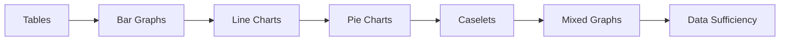

# Chapter 4: Data Interpretation

> **Previous:** [Chapter 3: Verbal Ability](03-verbal-ability.md) | **Next:** [Chapter 5: Non-Verbal Reasoning](05-non-verbal-reasoning.md)

## Learning Objectives

After completing this chapter, you will be able to:

- Read and interpret data from tables, bar graphs, line charts, and pie charts
- Perform calculations based on visual data representations
- Analyze caselet data and extract required information
- Solve data sufficiency problems with minimal computation
- Identify trends, compare data points, and draw conclusions from mixed graphs
- Apply approximation and estimation techniques for quick calculations

## Chapter at a Glance

| Topic | Data Format | Key Skills |
|-------|------------|------------|
| Tables | Rows and columns of numbers | Row/column identification, percentage calculations |
| Bar Graphs | Rectangular bars of varying heights | Height comparison, ratio calculations |
| Line Charts | Points connected by lines | Trend analysis, slope interpretation |
| Pie Charts | Circular segments showing proportions | Angle calculation, percentage of total |
| Caselets | Paragraphs of numeric data | Information extraction, structured analysis |
| Mixed Graphs | Combination of above formats | Multi-format integration |
| Data Sufficiency | Questions with two statements | Minimal data identification |

## Chapter Roadmap

## Theory

### 4.1 Tables

Tables present data in rows and columns. Questions involve:

- Reading specific values
- Computing totals, averages, percentages
- Finding ratios between data points
- Comparing rows or columns
- Identifying maximum/minimum values

**Calculation Shortcuts:**
- Percentage = (part / total) × 100
- Ratio = compare two values directly
- Average = sum of values / count
- Growth rate = ((new - old) / old) × 100

**Common Table Types:**
- **Single variable:** One category, one measure
- **Cross-tabulation (matrix):** Two or more categories crossed
- **Time series:** Data over time periods

### 4.2 Bar Graphs

**Simple Bar Graph:** Each bar represents one data point. Height/width proportional to value.

**Stacked Bar Graph:** Bars divided into segments showing sub-components. Total height = sum of components.

**Grouped/Clustered Bar Graph:** Multiple bars side by side for comparison across categories.

**Key Calculations:**
- Value from bar: read height against scale
- Difference: subtract heights
- Percentage of: one bar vs another
- Total: sum of all bars
- Proportion: individual bar / total of group

### 4.3 Line Charts

Lines connect data points to show trends over time or ordered categories.

**Key Interpretations:**
- **Upward slope:** Increasing trend
- **Downward slope:** Decreasing trend  
- **Flat line:** Constant
- **Steep slope:** Rapid change
- **Gentle slope:** Gradual change

**Key Calculations:**
- Difference between two points: $y_2 - y_1$
- Rate of change = (change in y) / (change in x)
- Percentage growth = (end - start) / start × 100
- Average = sum of values / number of periods

### 4.4 Pie Charts

Circular charts divided into sectors proportional to the data values.

**Key Facts:**
- Total angle = 360°
- Each sector angle = (value / total) × 360°
- Each sector percentage = (value / total) × 100

**Key Calculations:**
- Value of a sector = (sector angle / 360) × total
- Total from a sector = (sector value × 360) / sector angle
- Difference between two sectors = $|a - b|$
- Ratio of two sectors = $a : b$ (simplify)

**Multiple Pie Charts:**
- Each pie represents a different total
- Comparing absolute values requires knowing totals

### 4.5 Caselets

Caselets present data in narrative form rather than visual/tabular format.

**Example Caselet:** "In a company of 500 employees, 60% are male. Among the male employees, 40% work in IT, 30% in Finance, and the rest in HR. Among female employees, 50% work in IT, 25% in Finance, and 25% in HR."

**Solving Strategy:**
1. Read carefully and identify all given numbers
2. Create a table or organize data systematically
3. Calculate derived values step by step
4. Verify totals make sense

**Organizing Caselet Data:**

| Category | Male | Female | Total |
|----------|------|--------|-------|
| Total | 300 | 200 | 500 |
| IT | 120 | 100 | 220 |
| Finance | 90 | 50 | 140 |
| HR | 90 | 50 | 140 |

### 4.6 Mixed Graphs

Combine two or more types of graphs on the same or related charts.

**Common Combinations:**
- Bar graph + line chart (e.g., bars for production, line for growth %)
- Pie chart + table (breakdown + detailed data)
- Two line charts (comparison of two trends)

**Solving Strategy:**
1. Understand what each graph represents
2. Note the scales carefully (may be different for bar vs line)
3. Find connecting data points across graphs
4. Use data from one graph as input for calculations on another

### 4.7 Data Sufficiency

Each question has two statements. Determine if the statements together or individually provide enough data to answer.

**Answer Choices (standard format):**
- A: Statement (1) alone is sufficient, but (2) alone is not
- B: Statement (2) alone is sufficient, but (1) alone is not
- C: Both statements together are sufficient, but neither alone is
- D: Each statement alone is sufficient
- E: Statements together are not sufficient

**Solving Strategy:**
1. Determine what information is needed to answer
2. Mark the needed variables/relationships
3. Check each statement separately first
4. Only combine if neither alone is sufficient
5. Don't solve — just determine sufficiency
6. Don't assume data not given

## Examples

### Example 1: Table Interpretation

| Year | Revenue (Cr) | Profit (Cr) | Employees |
|------|-------------|-------------|-----------|
| 2019 | 100 | 12 | 500 |
| 2020 | 120 | 15 | 550 |
| 2021 | 150 | 18 | 600 |

**Question:** What was the profit percentage in 2021?

**Solution:**

Profit % = (Profit / Revenue) × 100 = (18 / 150) × 100 = 12%

### Example 2: Pie Chart

A pie chart shows: IT = 30%, Finance = 25%, HR = 20%, Sales = 15%, Admin = 10%. Total budget = Rs. 50 lakh.

**Question:** What is the angle of the IT sector?

**Solution:**

Angle = 30% of 360° = 0.30 × 360 = 108°

### Example 3: Caselet

In an exam, 300 students appeared. 40% passed in Physics, 50% passed in Chemistry, and 30% passed in both.

**Question:** How many failed in both?

**Solution:**

$P(P) = 0.4 \times 300 = 120$
$P(C) = 0.5 \times 300 = 150$
$P(P \cap C) = 0.3 \times 300 = 90$

$P(P \cup C) = P(P) + P(C) - P(P \cap C) = 120 + 150 - 90 = 180$

Failed in both = Total - $P(P \cup C) = 300 - 180 = 120$

### Example 4: Data Sufficiency

Q: What is the average age of employees in a company?
1. The total age of all employees is 1250 years.
2. The company has 50 employees.

**Solution:**

Average = Total age / Number of employees.
Statement 1 gives total age, but not count. Not sufficient alone.
Statement 2 gives count, but not total age. Not sufficient alone.
Both together: Average = 1250/50 = 25. Sufficient.

**Answer:** C (Both together)

## Summary

- Tables: read carefully, identify headers, compute percentages correctly
- Bar graphs: be careful with scale, especially non-zero baselines
- Line charts: understand slopes and growth rates
- Pie charts: total angle = 360°, use proportions
- Caselets: organize data into systematic tables first
- Mixed graphs: connect data across different representations
- Data sufficiency: don't solve, just check if enough data exists

## Exercises

### Level 1 — Basic

1. **Table:** In the example table above, what was the percentage increase in profit from 2019 to 2021?

2. **Pie Chart:** If a sector has angle 72° in a budget pie chart, what percentage does it represent?

3. **Data Sufficiency:** Is $x > y$? (1) $x + y = 10$ (2) $x - y = 2$

### Level 2 — Medium

4. **Bar Graph:** A company's revenue: Q1 = 50 Cr, Q2 = 65 Cr, Q3 = 45 Cr, Q4 = 80 Cr. Total expenses = 200 Cr. Profit % for the year?

5. **Caselet:** A school has 800 students — 45% boys, rest girls. 30% of boys and 40% of girls play football. How many students don't play football?

### Level 3 — Advanced

6. **Mixed Graph:** A bar graph shows monthly sales, and a line graph shows cumulative profit %. At what month does cumulative profit first exceed 15%?

7. **Data Sufficiency:** What is the value of $xy$? (1) $x^2 + y^2 = 25$ (2) $x + y = 7$

8. **Caselet with Multiple Categories:** A three-department caselet with overlapping categories.

### Answer Key

1. 50% | 2. 20% | 3. D (each alone sufficient for $x > y$ given) | 4. 20% | 5. 532 | 7. C (need both)
