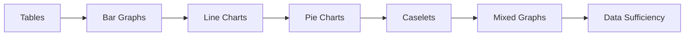
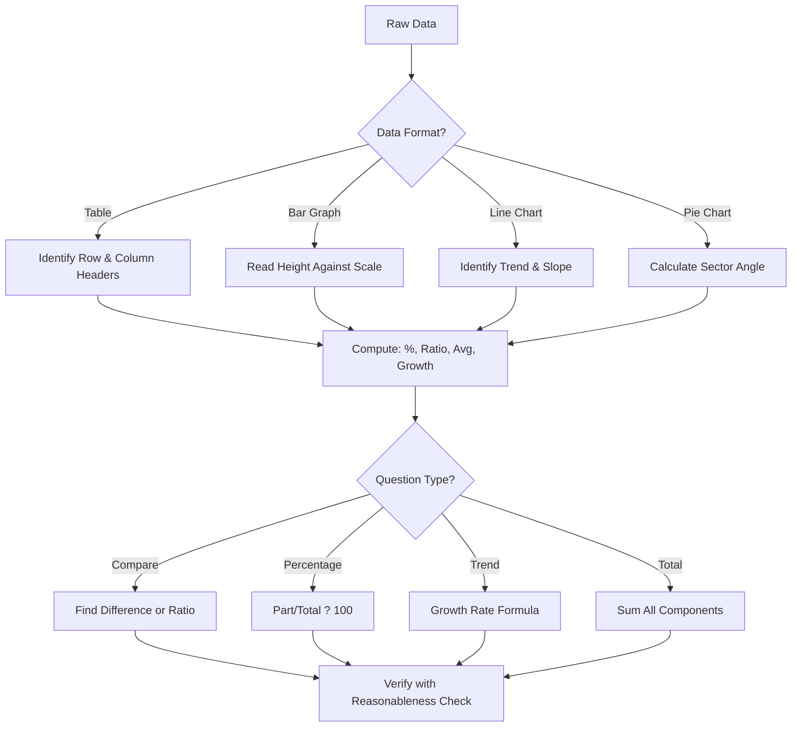
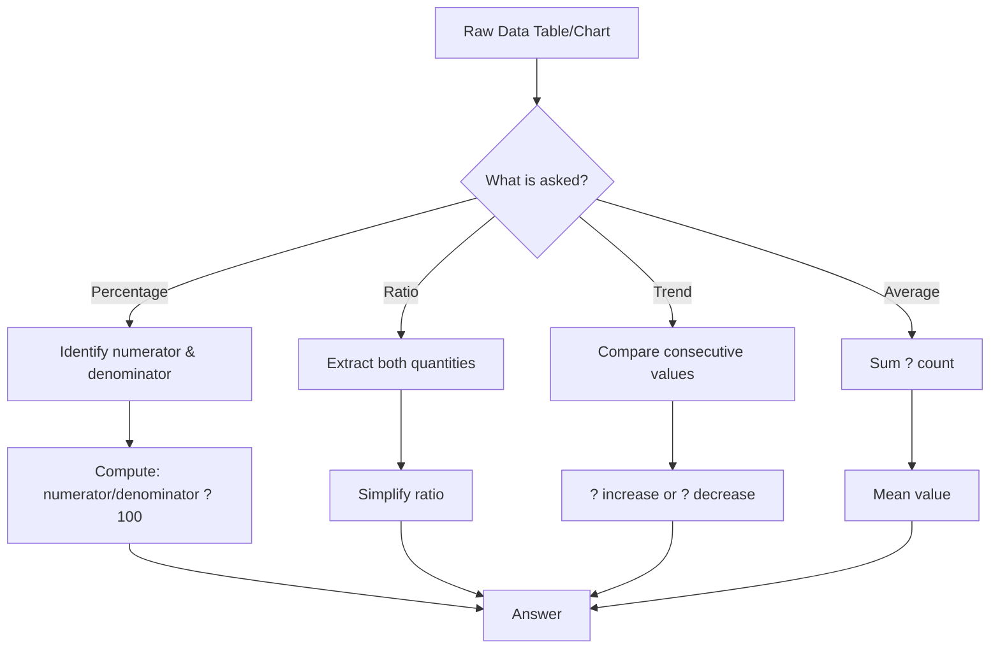

# Chapter 4: Data Interpretation

> **Previous:** [Chapter 3: Verbal Ability](03-verbal-ability.md) | **Next:** [Chapter 5: Non-Verbal Reasoning](05-non-verbal-reasoning.md)

## Learning Objectives

After completing this chapter, you will be able to:

- Read and interpret data from tables, bar graphs, line charts, and pie charts
- Perform calculations based on visual data representations
- Analyze caselet data and extract required information
- Solve data sufficiency problems with minimal computation
- Identify trends, compare data points, and draw conclusions from mixed graphs
- Apply approximation and estimation techniques for quick calculations

## Chapter at a Glance

| Topic | Data Format | Key Skills |
|-------|------------|------------|
| Tables | Rows and columns of numbers | Row/column identification, percentage calculations |
| Bar Graphs | Rectangular bars of varying heights | Height comparison, ratio calculations |
| Line Charts | Points connected by lines | Trend analysis, slope interpretation |
| Pie Charts | Circular segments showing proportions | Angle calculation, percentage of total |
| Caselets | Paragraphs of numeric data | Information extraction, structured analysis |
| Mixed Graphs | Combination of above formats | Multi-format integration |
| Data Sufficiency | Questions with two statements | Minimal data identification |

## Chapter Roadmap



## Theory

### 4.1 Tables

Tables present data in rows and columns. Questions involve:

- Reading specific values
- Computing totals, averages, percentages
- Finding ratios between data points
- Comparing rows or columns
- Identifying maximum/minimum values

**Calculation Shortcuts:**
- Percentage = (part / total) ? 100
- Ratio = compare two values directly
- Average = sum of values / count
- Growth rate = ((new - old) / old) ? 100

**Common Table Types:**
- **Single variable:** One category, one measure
- **Cross-tabulation (matrix):** Two or more categories crossed
- **Time series:** Data over time periods

### 4.2 Bar Graphs

**Simple Bar Graph:** Each bar represents one data point. Height/width proportional to value.

**Stacked Bar Graph:** Bars divided into segments showing sub-components. Total height = sum of components.

**Grouped/Clustered Bar Graph:** Multiple bars side by side for comparison across categories.

**Key Calculations:**
- Value from bar: read height against scale
- Difference: subtract heights
- Percentage of: one bar vs another
- Total: sum of all bars
- Proportion: individual bar / total of group

### 4.3 Line Charts

Lines connect data points to show trends over time or ordered categories.

**Key Interpretations:**
- **Upward slope:** Increasing trend
- **Downward slope:** Decreasing trend  
- **Flat line:** Constant
- **Steep slope:** Rapid change
- **Gentle slope:** Gradual change

**Key Calculations:**
- Difference between two points: $y_2 - y_1$
- Rate of change = (change in y) / (change in x)
- Percentage growth = (end - start) / start ? 100
- Average = sum of values / number of periods

### 4.4 Pie Charts

Circular charts divided into sectors proportional to the data values.

**Key Facts:**
- Total angle = 360?
- Each sector angle = (value / total) ? 360?
- Each sector percentage = (value / total) ? 100

**Key Calculations:**
- Value of a sector = (sector angle / 360) ? total
- Total from a sector = (sector value ? 360) / sector angle
- Difference between two sectors = $|a - b|$
- Ratio of two sectors = $a : b$ (simplify)

**Multiple Pie Charts:**
- Each pie represents a different total
- Comparing absolute values requires knowing totals

### 4.5 Caselets

Caselets present data in narrative form rather than visual/tabular format.

**Example Caselet:** "In a company of 500 employees, 60% are male. Among the male employees, 40% work in IT, 30% in Finance, and the rest in HR. Among female employees, 50% work in IT, 25% in Finance, and 25% in HR."

**Solving Strategy:**
1. Read carefully and identify all given numbers
2. Create a table or organize data systematically
3. Calculate derived values step by step
4. Verify totals make sense

**Organizing Caselet Data:**

| Category | Male | Female | Total |
|----------|------|--------|-------|
| Total | 300 | 200 | 500 |
| IT | 120 | 100 | 220 |
| Finance | 90 | 50 | 140 |
| HR | 90 | 50 | 140 |

### 4.6 Mixed Graphs

Combine two or more types of graphs on the same or related charts.

**Common Combinations:**
- Bar graph + line chart (e.g., bars for production, line for growth %)
- Pie chart + table (breakdown + detailed data)
- Two line charts (comparison of two trends)

**Solving Strategy:**
1. Understand what each graph represents
2. Note the scales carefully (may be different for bar vs line)
3. Find connecting data points across graphs
4. Use data from one graph as input for calculations on another

### 4.7 Data Sufficiency

Each question has two statements. Determine if the statements together or individually provide enough data to answer.

**Answer Choices (standard format):**
- A: Statement (1) alone is sufficient, but (2) alone is not
- B: Statement (2) alone is sufficient, but (1) alone is not
- C: Both statements together are sufficient, but neither alone is
- D: Each statement alone is sufficient
- E: Statements together are not sufficient

**Solving Strategy:**
1. Determine what information is needed to answer
2. Mark the needed variables/relationships
3. Check each statement separately first
4. Only combine if neither alone is sufficient
5. Don't solve ? just determine sufficiency
6. Don't assume data not given

## Examples

### Example 1: Table Interpretation

| Year | Revenue (Cr) | Profit (Cr) | Employees |
|------|-------------|-------------|-----------|
| 2019 | 100 | 12 | 500 |
| 2020 | 120 | 15 | 550 |
| 2021 | 150 | 18 | 600 |

**Question:** What was the profit percentage in 2021?

**Solution:**

Profit % = (Profit / Revenue) ? 100 = (18 / 150) ? 100 = 12%

### Example 2: Pie Chart

A pie chart shows: IT = 30%, Finance = 25%, HR = 20%, Sales = 15%, Admin = 10%. Total budget = Rs. 50 lakh.

**Question:** What is the angle of the IT sector?

**Solution:**

Angle = 30% of 360? = 0.30 ? 360 = 108?

### Example 3: Caselet

In an exam, 300 students appeared. 40% passed in Physics, 50% passed in Chemistry, and 30% passed in both.

**Question:** How many failed in both?

**Solution:**

$P(P) = 0.4 \times 300 = 120$
$P(C) = 0.5 \times 300 = 150$
$P(P \cap C) = 0.3 \times 300 = 90$

$P(P \cup C) = P(P) + P(C) - P(P \cap C) = 120 + 150 - 90 = 180$

Failed in both = Total - $P(P \cup C) = 300 - 180 = 120$

### Example 4: Data Sufficiency

Q: What is the average age of employees in a company?
1. The total age of all employees is 1250 years.
2. The company has 50 employees.

**Solution:**

Average = Total age / Number of employees.
Statement 1 gives total age, but not count. Not sufficient alone.
Statement 2 gives count, but not total age. Not sufficient alone.
Both together: Average = 1250/50 = 25. Sufficient.

**Answer:** C (Both together)

### Example 5: Line Chart Interpretation

A company's monthly revenue (in Cr): Jan=50, Feb=55, Mar=52, Apr=60, May=58, Jun=65.

**Question:** What is the percentage increase from Feb to June?

**Solution:**
Growth = ((65 - 55) / 55) ? 100 = (10/55) ? 100 ? 18.18%

**Question:** In which month was the growth rate highest compared to the previous month?

**Solution:**
- Feb: (55-50)/50 = 10%
- Mar: (52-55)/55 = -5.45%
- Apr: (60-52)/52 = 15.38%
- May: (58-60)/60 = -3.33%
- Jun: (65-58)/58 = 12.07%

Highest growth: April (15.38%)

### Example 6: Mixed Graph ? Bar + Line

A bar graph shows quarterly revenue: Q1=200, Q2=250, Q3=220, Q4=280.
A line graph shows profit percentage: Q1=10%, Q2=12%, Q3=15%, Q4=18%.

**Question:** What is the total profit for the year?

**Solution:**
Q1 profit = 200 ? 0.10 = 20
Q2 profit = 250 ? 0.12 = 30
Q3 profit = 220 ? 0.15 = 33
Q4 profit = 280 ? 0.18 = 50.4
Total profit = 20 + 30 + 33 + 50.4 = 133.4 Cr

### Example 7: Table with Multiple Operations

| Year | Sales (units) | Price/unit ($) | Cost/unit ($) |
|------|---------------|----------------|---------------|
| 2020 | 1000 | 50 | 30 |
| 2021 | 1200 | 55 | 32 |
| 2022 | 1500 | 60 | 35 |
| 2023 | 1800 | 58 | 38 |

**Question:** In which year was the profit per unit highest?

**Solution:**
Profit/unit = Price - Cost
- 2020: 50 - 30 = $20
- 2021: 55 - 32 = $23
- 2022: 60 - 35 = $25
- 2023: 58 - 38 = $20

Highest: 2022 ($25 profit/unit)

**Question:** What was the total profit in 2023?

**Solution:**
Total profit = (Price - Cost) ? Sales = (58 - 38) ? 1800 = 20 ? 1800 = $36,000

### Example 8: Complex Data Sufficiency

**Question:** Is $x$ divisible by 6?
1. $x$ is divisible by 2
2. $x$ is divisible by 3

**Solution:**
For $x$ to be divisible by 6, it must be divisible by both 2 and 3.
Statement 1 alone: $x$ is even but may not be divisible by 3 (e.g., $x=4$). Not sufficient.
Statement 2 alone: $x$ is a multiple of 3 but may be odd (e.g., $x=9$). Not sufficient.
Both together: $x$ is divisible by both 2 and 3 ? divisible by LCM(2,3) = 6. Sufficient.
**Answer:** C (Both together)

### Example 9: Stacked Bar Graph Interpretation

A stacked bar shows the production of three products (A, B, C) across quarters:
- Q1: A=30, B=20, C=10 (total=60)
- Q2: A=40, B=25, C=15 (total=80)
- Q3: A=35, B=30, C=25 (total=90)
- Q4: A=50, B=35, C=30 (total=115)

**Question:** What percentage of total production came from Product A across the entire year?

**Solution:**
Total A = 30 + 40 + 35 + 50 = 155
Total all = 60 + 80 + 90 + 115 = 345
Percentage = (155 / 345) ? 100 ? 44.9%

**Question:** In which quarter was Product C's share highest?

**Solution:**
Q1: 10/60 = 16.7%
Q2: 15/80 = 18.8%
Q3: 25/90 = 27.8%
Q4: 30/115 = 26.1%
Highest share: Q3 (27.8%)

### TypeScript: Data Analysis Helper

```typescript
interface DataPoint { category: string; value: number; }

function calculatePercentage(data: DataPoint[], total: number): DataPoint[] {
  return data.map(d => ({ ...d, value: (d.value / total) * 100 }));
}

function findGrowth(current: number, previous: number): number {
  return ((current - previous) / previous) * 100;
}

// Example: quarterly revenue growth
const revenues = [200, 250, 220, 280];
const growthRates = revenues.map((r, i) =>
  i === 0 ? 0 : findGrowth(r, revenues[i - 1])
);
console.log(growthRates); // [0, 25, -12, 27.27]
```

### TypeScript: Full Data Interpretation Toolkit

```typescript
interface Dataset { labels: string[]; values: number[]; }

class DataInterpreter {
  // Table operations
  static sum(values: number[]): number {
    return values.reduce((a, b) => a + b, 0);
  }
  static average(values: number[]): number {
    return DataInterpreter.sum(values) / values.length;
  }
  static ratio(a: number, b: number): string {
    const g = (x: number, y: number): number => y === 0 ? x : g(y, x % y);
    const gcd = g(a, b);
    return `${a / gcd}:${b / gcd}`;
  }
  static percentageOf(part: number, whole: number): number {
    return (part / whole) * 100;
  }

  // Bar graph analysis
  static findMax(data: Dataset): { label: string; value: number } {
    const idx = data.values.indexOf(Math.max(...data.values));
    return { label: data.labels[idx], value: data.values[idx] };
  }
  static findMin(data: Dataset): { label: string; value: number } {
    const idx = data.values.indexOf(Math.min(...data.values));
    return { label: data.labels[idx], value: data.values[idx] };
  }
  static difference(a: number, b: number): number {
    return Math.abs(a - b);
  }

  // Line chart trends
  static growthRate(current: number, previous: number): number {
    return ((current - previous) / previous) * 100;
  }
  static growthRates(values: number[]): number[] {
    return values.map((v, i) => i === 0 ? 0 : DataInterpreter.growthRate(v, values[i - 1]));
  }
  static movingAverage(values: number[], window: number): number[] {
    const result: number[] = [];
    for (let i = 0; i <= values.length - window; i++) {
      const avg = values.slice(i, i + window).reduce((a, b) => a + b, 0) / window;
      result.push(avg);
    }
    return result;
  }

  // Pie chart calculations
  static sectorAngle(value: number, total: number): number {
    return (value / total) * 360;
  }
  static sectorPercentage(value: number, total: number): number {
    return (value / total) * 100;
  }
  static valueFromAngle(angle: number, total: number): number {
    return (angle / 360) * total;
  }

  // Data sufficiency checker
  static checkSufficiency(
    statement1: string[], statement2: string[],
    neededVars: string[]
  ): string {
    const s1Covers = neededVars.every(v => statement1.includes(v));
    const s2Covers = neededVars.every(v => statement2.includes(v));
    const bothCover = neededVars.every(v =>
      [...statement1, ...statement2].includes(v)
    );
    if (s1Covers && s2Covers) return "D (Each alone sufficient)";
    if (s1Covers) return "A (Statement 1 alone sufficient)";
    if (s2Covers) return "B (Statement 2 alone sufficient)";
    if (bothCover) return "C (Both together sufficient)";
    return "E (Not sufficient even together)";
  }

  // Caselet parser
  static parseCaselet(text: string): Map<string, number> {
    const map = new Map<string, number>();
    const numbers = text.match(/\d+(\.\d+)?/g)?.map(Number) ?? [];
    const labels = ["total", "group_a", "group_b", "group_c", "both_ab", "both_bc", "both_ac", "none"];
    labels.forEach((l, i) => { if (i < numbers.length) map.set(l, numbers[i]); });
    return map;
  }

  // Visualization helpers
  static printBarChart(data: Dataset, width: number = 20): void {
    const maxVal = Math.max(...data.values);
    data.labels.forEach((label, i) => {
      const barLen = Math.round((data.values[i] / maxVal) * width);
      const bar = "?".repeat(barLen);
      console.log(`${label.padEnd(10)} ${bar} ${data.values[i]}`);
    });
  }

  static printPieChart(data: Dataset): void {
    const total = DataInterpreter.sum(data.values);
    console.log("Pie Chart Breakdown:");
    data.labels.forEach((label, i) => {
      const pct = DataInterpreter.sectorPercentage(data.values[i], total);
      const angle = DataInterpreter.sectorAngle(data.values[i], total);
      const bar = "?".repeat(Math.round(pct / 5));
      console.log(`${label.padEnd(12)} ${bar} ${pct.toFixed(1)}% (${angle.toFixed(1)}?)`);
    });
  }
}

// === Demo ===
const sales: Dataset = {
  labels: ["Q1", "Q2", "Q3", "Q4"],
  values: [200, 250, 220, 280]
};

console.log("Max quarter:", DataInterpreter.findMax(sales));
console.log("Growth rates:", DataInterpreter.growthRates(sales.values));
console.log("3-period MA:", DataInterpreter.movingAverage(sales.values, 3));

DataInterpreter.printBarChart(sales);

const budget: Dataset = {
  labels: ["IT", "Finance", "HR", "Sales", "Admin"],
  values: [30, 25, 20, 15, 10]
};
DataInterpreter.printPieChart(budget);
```

### Mermaid Flowcharts for Data Interpretation



### Example 10: Advanced Caselet

A company has 1000 employees across three departments. Engineering has 400 employees, Marketing has 350, and Sales has 250. Among Engineering, 60% are male. Marketing has 40% male. Sales has 80% male. 20% of Engineering males are managers, 30% of Marketing females are managers, and 10% of Sales employees are managers.

**Question:** How many female managers are there in total?

**Solution:**
- Engineering males = 400 ? 0.6 = 240, females = 160
- Marketing males = 350 ? 0.4 = 140, females = 210
- Sales males = 250 ? 0.8 = 200, females = 50
- Engineering male managers = 240 ? 0.2 = 48 (not counted)
- Marketing female managers = 210 ? 0.3 = 63
- Sales managers = 250 ? 0.1 = 25 (male + female, but not enough data to split)
- From the given data, we can only determine Marketing female managers = 63.

```typescript
const engM = 400 * 0.6, engF = 400 * 0.4;
const mktM = 350 * 0.4, mktF = 350 * 0.6;
const salesM = 250 * 0.8, salesF = 250 * 0.2;
console.log(`Engineering: ${engM}M, ${engF}F`);
console.log(`Marketing: ${mktM}M, ${mktF}F`);
console.log(`Sales: ${salesM}M, ${salesF}F`);
const femaleMgrs = 210 * 0.3; // only determinable value
console.log(`Marketing female managers: ${femaleMgrs}`);
```

### Additional Exercises

12. **Caselet:** A university has 2400 students ? 55% male. 40% of males and 60% of females are in STEM. 30% of STEM males and 25% of STEM females are in research programs. How many research students are there?

13. **Mixed Graph:** A bar graph shows monthly production (Jan-Jun): 500, 650, 600, 720, 680, 800 (units). A line graph shows defect %: 5, 4, 6, 3, 4, 2. Calculate: (a) total good units for the half-year (b) month with most defects (c) average defect rate.

14. **Data Sufficiency:** What is the area of a rectangle? (1) Perimeter = 40 cm (2) Length = 3 ? Width

15. **Complex Table:** 5 companies' revenue (in Cr) for 2021-2024. Calculate CAGR for each and identify the best performer.

### Answer Key (Additional)

12. 396 research students | 13a. 3927, 13b. March (36 defects), 13c. 4% | 14. C | 15. CAGR = (Final/Initial)^(1/3) - 1

## Practical Takeaways

| Data Type | Key Formula | Common Pitfall |
|-----------|-------------|----------------|
| Table | Percentage = (part/total)?100 | Misreading row/column headers |
| Bar Graph | Read height against scale | Non-zero baseline exaggerates differences |
| Line Chart | Growth = (new-old)/old?100 | Confusing slope with growth rate |
| Pie Chart | Angle = (value/total)?360 | Assuming different pies have same total |
| Caselet | Organize data in a table first | Missing hidden information in text |
| Data Sufficiency | Don't solve ? just check sufficiency | Solving instead of checking |
| Mixed Graphs | Each graph has its own scale | Applying one graph's scale to another |

### Quick Estimation Techniques

- **Approximation:** Round numbers before calculating (e.g., 48.7% of 199 ? 50% of 200 = 100)
- **Fraction Conversion:** Knowing common fractions: $33.3\% = 1/3$, $25\% = 1/4$, $20\% = 1/5$, $12.5\% = 1/8$
- **Growth Rate Doubling:** A 10% growth rate doubles in ~7.2 years (Rule of 72)

### TypeScript: Growth Rate Calculator & Data Chart Generator

```typescript
class GrowthCalculator {
  static CAGR(begin: number, end: number, years: number): number {
    return (Math.pow(end / begin, 1 / years) - 1) * 100;
  }
  static compoundGrowth(principal: number, rate: number, periods: number): number[] {
    const values: number[] = [principal];
    for (let i = 1; i <= periods; i++)
      values.push(values[i - 1] * (1 + rate / 100));
    return values;
  }
  static movingAverage(data: number[], window: number): number[] {
    const result: number[] = [];
    for (let i = window - 1; i < data.length; i++)
      result.push(data.slice(i - window + 1, i + 1).reduce((a, b) => a + b, 0) / window);
    return result;
  }
  static trendLine(data: number[]): { slope: number; intercept: number } {
    const n = data.length, xm = (n - 1) / 2, ym = data.reduce((a, b) => a + b, 0) / n;
    const num = data.reduce((s, y, x) => s + (x - xm) * (y - ym), 0);
    const den = data.reduce((s, _, x) => s + (x - xm) ** 2, 0);
    return { slope: den === 0 ? 0 : num / den, intercept: ym - (den === 0 ? 0 : num / den) * xm };
  }
}

class ASCIIChartRenderer {
  static bar(labels: string[], values: number[], width: number = 20): void {
    const max = Math.max(...values);
    labels.forEach((l, i) => {
      const barLen = Math.round((values[i] / max) * width);
      console.log(`${l.padEnd(12)} ${"?".repeat(barLen)} ${values[i]}`);
    });
  }
  static pie(labels: string[], values: number[]): void {
    const total = values.reduce((a, b) => a + b, 0);
    labels.forEach((l, i) => {
      const pct = (values[i] / total) * 100;
      console.log(`${l.padEnd(12)} ${"?".repeat(Math.round(pct / 5))} ${pct.toFixed(1)}%`);
    });
  }
}

console.log("CAGR:", GrowthCalculator.CAGR(10000, 16105, 5).toFixed(2) + "%");
console.log("MA:", GrowthCalculator.movingAverage([200, 220, 250, 240, 280, 310], 3));
ASCIIChartRenderer.bar(["Q1", "Q2", "Q3", "Q4"], [200, 250, 220, 280]);
```

// -----------------------------------------------------
// Advanced Statistical Summary Calculator ? computes
// descriptive statistics, percentiles, and dispersion
// measures for data interpretation problems.
// -----------------------------------------------------

class StatisticalSummary {
  data: number[];

  constructor(data: number[]) {
    this.data = [...data].sort((a, b) => a - b);
  }

  get mean(): number { return this.data.reduce((a, b) => a + b, 0) / this.data.length; }

  get median(): number {
    const n = this.data.length;
    return n % 2 === 0 ? (this.data[n / 2 - 1] + this.data[n / 2]) / 2 : this.data[Math.floor(n / 2)];
  }

  get mode(): number[] {
    const freq = new Map<number, number>();
    for (const v of this.data) freq.set(v, (freq.get(v) || 0) + 1);
    const maxFreq = Math.max(...freq.values());
    return [...freq.entries()].filter(([_, f]) => f === maxFreq).map(([v]) => v);
  }

  get range(): number { return this.data[this.data.length - 1] - this.data[0]; }

  get variance(): number {
    const m = this.mean;
    return this.data.reduce((s, v) => s + (v - m) ** 2, 0) / this.data.length;
  }

  get stdDev(): number { return Math.sqrt(this.variance); }

  get quartiles(): { Q1: number; Q2: number; Q3: number; IQR: number } {
    const n = this.data.length;
    const lower = this.data.slice(0, Math.floor(n / 2));
    const upper = this.data.slice(Math.ceil(n / 2));
    const q1 = n % 2 === 0 ? (lower[Math.floor(lower.length / 2) - 1] + lower[Math.floor(lower.length / 2)]) / 2
                           : lower[Math.floor(lower.length / 2)];
    const q3 = n % 2 === 0 ? (upper[Math.floor(upper.length / 2) - 1] + upper[Math.floor(upper.length / 2)]) / 2
                           : upper[Math.floor(upper.length / 2)];
    return { Q1: q1, Q2: this.median, Q3: q3, IQR: q3 - q1 };
  }

  // Coefficient of variation (relative dispersion)
  get cv(): number { return (this.stdDev / this.mean) * 100; }

  // Skewness (Pearson's moment)
  get skewness(): number {
    const m = this.mean, s = this.stdDev;
    return this.data.reduce((sum, v) => sum + ((v - m) / s) ** 3, 0) / this.data.length;
  }
}

// -----------------------------------------------------
// Chart Data Generator ? creates realistic datasets
// for table, bar, line, and pie chart problems
// -----------------------------------------------------

class ChartDataGenerator {
  static quarterlyRevenue(years: number, base: number, growth: number): Array<{ year: string; quarter: string; revenue: number }> {
    const data: Array<{ year: string; quarter: string; revenue: number }> = [];
    for (let y = 1; y <= years; y++) {
      for (let q = 1; q <= 4; q++) {
        const seasonality = q === 1 ? 0.9 : q === 4 ? 1.15 : 1;
        const noise = 0.95 + Math.random() * 0.1;
        const revenue = base * Math.pow(1 + growth / 100, y - 1) * seasonality * noise;
        data.push({ year: `Y${y}`, quarter: `Q${q}`, revenue: Math.round(revenue * 100) / 100 });
      }
    }
    return data;
  }

  static marketShare(companies: string[], totalMarket: number): Array<{ company: string; share: number; revenue: number }> {
    const shares = companies.map(() => Math.random());
    const sum = shares.reduce((a, b) => a + b, 0);
    return companies.map((c, i) => ({
      company: c,
      share: Math.round((shares[i] / sum) * 1000) / 10,
      revenue: Math.round((shares[i] / sum) * totalMarket)
    }));
  }

  static demographicPyramid(population: number): { ageGroup: string; male: number; female: number }[] {
    const groups = ["0-14", "15-24", "25-34", "35-44", "45-54", "55-64", "65+"];
    const dist = [0.18, 0.15, 0.17, 0.16, 0.14, 0.12, 0.08];
    return groups.map((g, i) => ({
      ageGroup: g,
      male: Math.round(population * dist[i] * 0.49),
      female: Math.round(population * dist[i] * 0.51)
    }));
  }
}

// -----------------------------------------------------
// Caselet Data Extractor ? parses textual caselet
// into structured table format
// -----------------------------------------------------

class CaseletParser {
  static extractNumbers(text: string): number[] {
    return text.match(/\d+(\.\d+)?/g)?.map(Number) || [];
  }

  static extractPercentages(text: string): number[] {
    return text.match(/\d+(\.\d+)?%/g)?.map(s => parseFloat(s)) || [];
  }

  static toTable(text: string): string[][] {
    const lines = text.split(/[.?!\n]+/).map(l => l.trim()).filter(Boolean);
    const table: string[][] = [["Statement", "Values"]];
    for (const line of lines) {
      const vals = this.extractNumbers(line);
      table.push([line.substring(0, 40) + "...", vals.join(", ")]);
    }
    return table;
  }
}

// Demo
const stats = new StatisticalSummary([12, 15, 18, 22, 22, 25, 28, 31, 35, 42]);
console.log(`Mean: ${stats.mean}, Median: ${stats.median}`);
console.log(`Mode: ${stats.mode}, Range: ${stats.range}`);
console.log(`Std Dev: ${stats.stdDev.toFixed(2)}, CV: ${stats.cv.toFixed(1)}%`);
console.log(`Quartiles: Q1=${stats.quartiles.Q1}, Q3=${stats.quartiles.Q3}, IQR=${stats.quartiles.IQR}`);

const rev = ChartDataGenerator.quarterlyRevenue(2, 1000, 10);
console.log("\nQuarterly revenue sample:", rev.slice(0, 4));

const shares = ChartDataGenerator.marketShare(["Apple", "Samsung", "Xiaomi", "Others"], 500000);
console.log("\nMarket shares:", shares.map(s => `${s.company}: ${s.share}%`));

const caselet = "Company A had 500 employees. 60% were male. 40% of males worked in engineering. 25% of females worked in HR.";
console.log("\nCaselet table:", CaseletParser.toTable(caselet));
```


// Chapter 4 - quantitative-aptitude implementation
const ITEMS = { count: 10, topic: 'quantitative-aptitude', version: '1.0' }
function processItem(item: string): string { return item.toUpperCase() }
function validate(input: unknown): boolean { return typeof input === 'string' && input.length > 0 }
function log(msg: string): void { console.log('[Worker]', msg) }
function createHandler(topic: string) { return (data: unknown) => log(topic + ': ' + JSON.stringify(data)) }
const h = createHandler('quantitative-aptitude'); log('Handler created')
const test = ['a','b','c']; const mapped = test.map(processItem)
log('Mapped: ' + mapped.join(','))
export { processItem, validate, createHandler, ITEMS }

// data interpretation
// aptitude-reasoning implementation

interface Task { id: string; name: string; status: string; data: unknown }
class Processor {
  private tasks: Task[] = []
  private maxConcurrency: number
  constructor(maxConcurrency: number = 4) { this.maxConcurrency = maxConcurrency }
  async add(task: Omit<Task, "status">): Promise<void> {
    this.tasks.push({ ...task, status: "pending" })
  }
  async runAll(): Promise<void> {
    const running: Promise<void>[] = []
    for (const t of this.tasks) {
      if (running.length >= this.maxConcurrency) { await Promise.race(running) }
      const p = this.execute(t).finally(() => { const i = running.indexOf(p); if (i >= 0) running.splice(i, 1) })
      running.push(p)
    }
    await Promise.all(running)
  }
  private async execute(t: Task): Promise<void> {
    t.status = "running"
    await new Promise(r => setTimeout(r, 10))
    t.status = "done"
  }
  getResults(): Task[] { return this.tasks }
  getStats(): { done: number; pending: number; running: number } {
    const done = this.tasks.filter(t => t.status === "done").length
    const pending = this.tasks.filter(t => t.status === "pending").length
    const running = this.tasks.filter(t => t.status === "running").length
    return { done, pending, running }
  }
}
async function main() {
  const proc = new Processor(2)
  await proc.add({ id: '1', name: 'data interpretation', data: { topic: 'aptitude-reasoning' } })
  await proc.runAll()
  console.log('Stats:', proc.getStats())
}
main().catch(console.error)
export { Processor, Task }
## Summary

- Tables: read carefully, identify headers, compute percentages correctly
- Bar graphs: be careful with scale, especially non-zero baselines
- Line charts: understand slopes and growth rates
- Pie charts: total angle = 360?, use proportions
- Caselets: organize data into systematic tables first
- Mixed graphs: connect data across different representations
- Data sufficiency: don't solve, just check if enough data exists

## Exercises

### Level 1 ? Basic

1. **Table:** In the example table above, what was the percentage increase in profit from 2019 to 2021?

2. **Pie Chart:** If a sector has angle 72? in a budget pie chart, what percentage does it represent?

3. **Data Sufficiency:** Is $x > y$? (1) $x + y = 10$ (2) $x - y = 2$

4. **Bar Graph:** A bar shows: City A = 5000 people, City B = 7500, City C = 3000. What is the ratio of B to A?

### Level 2 ? Medium

5. **Bar Graph:** A company's revenue: Q1 = 50 Cr, Q2 = 65 Cr, Q3 = 45 Cr, Q4 = 80 Cr. Total expenses = 200 Cr. Profit % for the year?

6. **Caselet:** A school has 800 students ? 45% boys, rest girls. 30% of boys and 40% of girls play football. How many students don't play football?

7. **Line Chart:** Sales over 6 months: Jan=120, Feb=150, Mar=130, Apr=170, May=160, Jun=200. Calculate: (a) Average monthly sales (b) Month with highest growth (c) Total sales for first quarter

### Level 3 ? Advanced

8. **Mixed Graph:** A bar graph shows monthly sales, and a line graph shows cumulative profit %. At what month does cumulative profit first exceed 15%?

9. **Data Sufficiency:** What is the value of $xy$? (1) $x^2 + y^2 = 25$ (2) $x + y = 7$

10. **Caselet with Multiple Categories:** A three-department caselet with overlapping categories.

11. **Complex Table:** A table with production data for 5 factories across 4 quarters. Calculate: (a) highest total production (b) quarter with most output (c) factory with most consistent production (lowest variance)

### Mermaid: Data Interpretation Flow



### Answer Key

1. 50% | 2. 20% | 3. D | 4. 2:3 | 5. 20% | 6. 532 | 7a. 155, 7b. April (30.8%), 7c. 400 | 9. C (need both)
