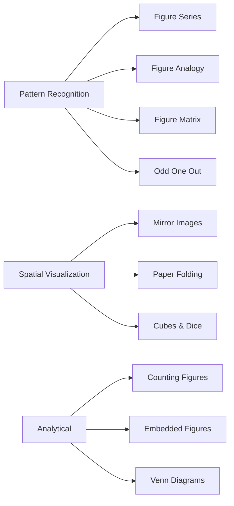

# Chapter 5: Non-Verbal Reasoning

> **Previous:** [Chapter 4: Data Interpretation](04-data-interpretation.md) | **Next:** [Chapter 6: Advanced Reasoning](06-advanced-reasoning.md)

## Learning Objectives

After completing this chapter, you will be able to:

- Identify patterns in figure series and find the next figure
- Find missing figures in analogies
- Classify figures into odd-one-out groups
- Complete matrices by identifying rule-based relationships
- Count geometric figures (triangles, squares, rectangles) in complex diagrams
- Analyze embedded figures and mirror/water images
- Solve paper folding and cutting problems
- Interpret cubes, dice, and Venn diagram problems visually

## Chapter at a Glance

| Topic | Key Skill | Question Type |
|-------|-----------|--------------|
| Figure Series | Pattern continuation | "Which figure comes next?" |
| Figure Analogy | Mapping relationships | "A:B :: C:?" |
| Odd One Out | Classification | "Which is different?" |
| Figure Matrix | Row-wise rules | "Find the missing figure" |
| Counting Figures | Systematic counting | "How many triangles?" |
| Embedded Figures | Figure detection | "Which contains X?" |
| Mirror & Water Images | Reflection | "What is the mirror image?" |
| Paper Folding | Spatial visualization | "How does it look unfolded?" |
| Cubes & Dice | 3D orientation | "Opposite face of X?" |
| Venn Diagrams | Set relationships | "Which diagram represents?" |

## Chapter Roadmap

## Theory

### 5.1 Figure Series

A sequence of figures follows a rule or pattern. Identify the next figure.

**Common Pattern Types:**

| Pattern | Description |
|---------|-------------|
| Rotation | Figure rotates by fixed angle (45°, 90°, 180°) |
| Shading | Shaded region moves or changes in a pattern |
| Number | Number of elements increases/decreases by constant |
| Position | Elements shift positions cyclically |
| Size | Element size changes progressively |
| Addition | New elements added each step |
| Subtraction | Elements removed each step |
| Mirroring | Figure is mirrored alternately |
| Combination | Multiple patterns apply simultaneously |

**Solving Strategy:**
1. Observe the first 2-3 figures carefully
2. Identify what changes (rotation, shading, count, position)
3. Identify what stays constant
4. Apply the rule to predict the next figure
5. Check all answer options before confirming

### 5.2 Figure Analogy

Format: Figure A : Figure B :: Figure C : ?

Figure B is related to Figure A in a specific way. Apply the same transformation to Figure C.

**Common Transformations:**
- Rotation + shading change
- Element addition/subtraction
- Position swapping
- Size change
- Mirror effect
- Enclosing/overlapping

**Solving Strategy:**
1. Determine exactly how Figure A transforms to Figure B
2. List all changes (e.g., rotated 90° + outer shape changes from square to circle)
3. Apply all changes to Figure C
4. Match with answer options

### 5.3 Figure Matrix

A 3×3 grid with 8 figures and one missing. Each row (or column) follows a rule.

**Common Patterns:**
- **Row-wise:** Each row follows the same transformation across columns
- **Column-wise:** Each column follows the same transformation down rows

| Type | Description |
|------|-------------|
| Element addition | Shape in col3 = shape in col1 + shape in col2 |
| Element subtraction | col3 = col1 missing parts of col2 |
| Rotation | Same element rotated across columns |
| Layering | Elements layered in a specific order |

**Solving Strategy:**
1. Check row 1 and row 2 to identify the pattern
2. Verify the same pattern applies to columns
3. Apply to row 3 (or column 3)

### 5.4 Odd One Out

Four or five figures where one is different from the rest.

**Classification Categories:**
- **Shape type:** Most are one type, one is different
- **Orientation:** Most share an orientation, one is rotated differently
- **Symmetry:** Most are symmetrical/not, one is the opposite
- **Element count:** Most have same number of elements, one differs
- **Shading pattern:** Most share shading arrangement, one differs
- **Internal/external relationship:** Most share same internal-extenal relationship

**Solving Strategy:**
1. Find what most figures have in common
2. The figure missing that commonality is the odd one
3. Multiple classification schemes may exist — the strongest commonality wins

### 5.5 Counting Figures

**Counting Triangles:**

| Figure Type | Formula / Method |
|------------|-----------------|
| Simple triangles in a grid | Count vertex-by-vertex, use combination formulas |
| Triangles with partitions | Count base segments: $\binom{n}{2}$ where $n$ = segments |
| Nested/complex | Label intersections, use systematic enumeration |

**Counting Squares/Rectangles:**
- Squares in $m \times n$ grid: $\sum_{i=1}^{m} \sum_{j=1}^{n} (m-i+1)(n-j+1)$ where $i = j$ for squares
- Rectangles in $m \times n$ grid: $\frac{m(m+1)}{2} \times \frac{n(n+1)}{2}$

**Counting Lines / Parallelograms / Circles:** Use systematic enumeration or combinatorial formulas.

### 5.6 Embedded Figures

A complex figure contains a simpler figure hidden within it.

**Solving Strategy:**
1. Identify the key features of the simple figure
2. Scan the complex figure systematically (top to bottom, left to right)
3. Look for exactly the same orientation, not rotated/mirrored
4. Compare line by line, corner by corner

### 5.7 Mirror and Water Images

**Mirror Image (Left-Right Reversal):**
- The image reverses left-to-right
- A left-facing person faces right in the mirror
- Letters: left-right reversal matters (b ↔ d visually reversed)

**Mirror Image Key Rules:**

| Original | Mirror |
|----------|--------|
| Left side | Appears on right |
| Right side | Appears on left |
| Top | Stays on top |
| Bottom | Stays on bottom |
| b | d (appearance) |
| A | A (if symmetric) |
| P | q (appearance) |

**Water Image (Top-Bottom Reversal):**
- The image inverts top-to-bottom
- Like reflection in water
- Letters invert vertically

**Water Image Key Rules:**

| Original | Water Image |
|----------|-------------|
| Top | Appears at bottom |
| Bottom | Appears at top |
| Left | Stays on left |
| Right | Stays on right |
| b | p (upside down) |
| A | V (upside down appearance) |
| T | upside-down T |

### 5.8 Paper Folding

A paper is folded and cut. Determine how it looks when unfolded.

**Solving Strategy:**
1. Track each fold operation sequentially
2. The cut goes through all layers
3. Unfold in reverse order — each fold produces symmetry
4. Each fold creates a mirror image of the cut on the other side
5. For multiple folds, multiply the pattern symmetrically

**Key Principle:**
- Fold once → pattern appears × 2 (mirrored)
- Fold twice → pattern appears × 4 (two axes of symmetry)
- Fold diagonally → pattern reflects diagonally

### 5.9 Cubes and Dice

**Cube:**
- 6 faces, 8 vertices, 12 edges
- Opposite faces: never visible together
- Adjacent faces: always visible together

**Standard Dice:**
- Opposite faces sum to 7 (1↔6, 2↔5, 3↔4)
- Adjacent faces are always next to each other

**Question Types:**
1. **Opposite face identification:** Given two/three views of a cube, find opposite face of a given face
2. **Unfolded → Folded:** Given a net, determine the folded cube appearance
3. **Folded → Unfolded:** Given a cube, find which net corresponds

**Rules for Opposite Faces:**
- In a cube net, faces separated by exactly one face are opposite
- In a folded cube, faces that never appear together on any view are opposite

### 5.10 Venn Diagrams

Venn diagrams show set relationships. They test both reasoning and set theory.

**Areas in a Two-Set Venn:**
- Only A: $A - (A \cap B)$
- Only B: $B - (A \cap B)$
- Both A and B: $A \cap B$
- Neither: $U - (A \cup B)$

**Areas in a Three-Set Venn:**
- Exactly one set
- Exactly two sets
- All three sets
- None

**Question Types:**
- Which diagram best represents relationship between given categories?
- How many belong only to a specific category?
- Find the total or missing count.

## Examples

### Example 1: Figure Series

Figures show a square rotating 45° clockwise and a dot moving one position clockwise each step.

**Deduction:** Rule = rotation 45° CW + dot moves 1 step CW. Apply to last figure.

### Example 2: Figure Analogy

A: Large square with small circle inside top-left
B: Large circle with small square inside top-left (shapes swapped)
C: Large triangle with small star inside top-left
D: Large star with small triangle inside top-left

**Answer:** Large star with small triangle inside top-left (swap shapes, same relative position).

### Example 3: Counting Triangles

A triangle divided into 4 smaller triangles by lines from one vertex to the opposite side.

Count = 1 (large) + 4 (small) = 5 triangles

### Example 4: Mirror Image

Given figure: 'b' facing left.
Mirror placed to the right.

**Answer:** 'd' (mirror reverses left-right, so 'b' becomes 'd' appearance).

### Example 5: Cube Net

Net: Top = A, Left = B, Right = C. Above B = D. Below B = E. Below C = F. Faces: B-E are opposite, C-F are opposite, A-D are opposite.

**Question:** If A is top and D is bottom, what are the visible four side faces?

**Answer:** B, C, their opposites (E, F) in appropriate orientation.

## Summary

- Figure series: identify the rule from first 2-3 figures; apply to predict next
- Figure analogy: find transformation between A→B, apply same to C→D
- Odd one out: look for the common element missing in one figure
- Figure matrix: check row-wise pattern, then column-wise
- Counting figures: use systematic methods, don't count randomly
- Embedded figures: scan systematically; don't rely on peripheral vision
- Mirror/water images: left-right vs top-bottom reversal
- Paper folding: work backward — undo each fold symmetrically
- Cubes/dice: opposite faces never appear together; standard dice sum = 7
- Venn diagrams: universal set = sum of all individual parts + none

## Exercises

### Level 1 — Basic

1. **Figure Series:** A sequence of figures rotates 90° each step. What is the 5th figure?

2. **Mirror Image:** Draw the mirror image of 'R' with mirror on the right side.

3. **Odd One Out:** Circle, Square, Triangle, Rectangle — which is fundamentally different?

4. **Venn Diagram:** In a class, 20 play cricket, 15 play football, 8 play both. How many play at least one?

### Level 2 — Medium

5. **Counting Triangles:** A triangle with 4 base segments (divided into smaller triangles). Total triangles?

6. **Cube:** Two views show: (1) Top=A, Front=B, Right=C (2) Top=A, Front=D, Right=E. Which face is opposite C?

7. **Paper Folding:** A square paper is folded once diagonally, then a corner is cut. How many holes when unfolded?

### Level 3 — Advanced

8. **Figure Matrix:** A 3×3 matrix with rotation + shading rules. Find the missing figure.

9. **Embedded Figure:** Identify which option contains the given simple figure.

10. **Complex Dice:** A special dice (non-standard) with three views shown. Find which letter is opposite a given letter.

### Answer Key

1. Rotation result (depends on specific sequence) | 2. Left-right reflection of R | 3. Circle (no straight lines) | 4. 27 | 5. Depends on partition pattern | 8. Apply row/column rule | 10. Track common faces across views
