# Chapter 6: Advanced Reasoning

> **Previous:** [Chapter 5: Non-Verbal Reasoning](05-non-verbal-reasoning.md) | **Next:** [Course Index](index.md)

## Learning Objectives

After completing this chapter, you will be able to:

- Solve puzzles involving arrangements, constraints, and combinatorial logic
- Analyze complex syllogisms with multiple statements
- Analyze and construct arguments, identify assumptions and conclusions
- Solve cause-effect and course-of-action problems
- Solve input-output machines and statement-assumption problems
- Handle multi-dimensional logical puzzles

## Chapter at a Glance

| Topic | Key Skill | Difficulty |
|-------|-----------|------------|
| Advanced Puzzles | Complex constraint satisfaction | High |
| Multi-Statement Syllogisms | Deductive reasoning | Medium |
| Critical Reasoning | Argument analysis | High |
| Input-Output | Pattern detection in transformations | Medium |
| Cause-Effect | Causal reasoning | Medium |
| Statement-Assumption | Recognizing unstated premises | Medium |
| Course of Action | Decision making | Medium |

## Chapter Roadmap

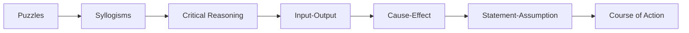

## Theory

### 6.1 Advanced Puzzles

<a href="../../assets/images/diagrams/general-aptitude/06-advanced-reasoning/6-1-advanced-puzzles-handwritten.svg" target="_blank" rel="noopener">
  
</a>
<a href="../../assets/images/diagrams/general-aptitude/06-advanced-reasoning/6-1-advanced-puzzles-diagram.svg" target="_blank" rel="noopener">
  
</a>
<a href="../../assets/images/diagrams/general-aptitude/06-advanced-reasoning/6-1-advanced-puzzles-sticky.svg" target="_blank" rel="noopener">
  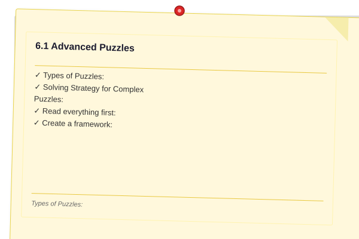
</a>


**Types of Puzzles:**

| Puzzle Type | Description | Key Strategy |
|-------------|-------------|-------------|
| Seating Arrangement | People seated in a row or circle | Reference points, relative positions |
| Floor-Based | People on different floors | Table with floors as rows |
| Scheduling | Events on days/months | Calendar grid |
| Blood Relation | Family trees | Tree diagram |
| Comparison | Ranking, height, weight, age | Linear ordering |
| Distribution | Items distributed among people | Matching tables |

**Solving Strategy for Complex Puzzles:**

1. **Read everything first:** Understand all constraints before solving.

2. **Create a framework:** Set up tables or grids based on the puzzle structure.

3. **Use symbols:** Represent relationships with symbols (>, &lt;, =, ?, ?).

4. **Direct vs. indirect clues:**
   - Direct: "A sits to the left of B" ? place immediately
   - Indirect: "A is two places away from B" ? note possible positions

5. **Fixed vs. variable clues:**
   - Fixed: "A is at the left end" ? definitive placement
   - Variable: "Either A or B is at the end" ? note possibilities

6. **Elimination:** Rule out impossible positions step by step.

7. **"Can't be determined"** ? some puzzles have multiple valid solutions.

**Seating Arrangement Notations:**

| Phrase | Meaning |
|--------|---------|
| A sits to the left of B | A is immediately or somewhere left (clarify if immediate) |
| A sits immediately to the left of B | A is directly left of B |
| A and B face each other | Opposite positions |
| A sits two places away from B | Exactly one person between them |

**Blood Relation Tree Symbols:**

```
P --- M    (P married to M)
?
+-- S      (S is child of P and M)
?
+-- D      (D is child of P and M)
```

| Relation | Description |
|----------|-------------|
| Father's/Mother's son | Brother |
| Father's/Mother's daughter | Sister |
| Father's brother | Uncle |
| Mother's brother | Maternal uncle |
| Father's sister | Aunt |
| Mother's sister | Maternal aunt |
| Son's wife | Daughter-in-law |
| Daughter's husband | Son-in-law |
| Brother's wife | Sister-in-law |
| Sister's husband | Brother-in-law |
| Husband's/Wife's brother | Brother-in-law |
| Husband's/Wife's sister | Sister-in-law |

### 6.2 Multi-Statement Syllogisms

<a href="../../assets/images/diagrams/general-aptitude/06-advanced-reasoning/6-2-multi-statement-syllogisms-handwritten.svg" target="_blank" rel="noopener">
  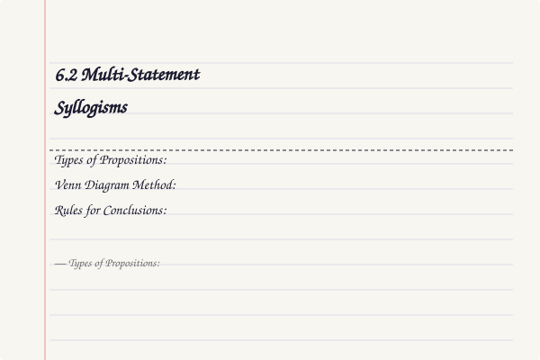
</a>
<a href="../../assets/images/diagrams/general-aptitude/06-advanced-reasoning/6-2-multi-statement-syllogisms-diagram.svg" target="_blank" rel="noopener">
  
</a>
<a href="../../assets/images/diagrams/general-aptitude/06-advanced-reasoning/6-2-multi-statement-syllogisms-sticky.svg" target="_blank" rel="noopener">
  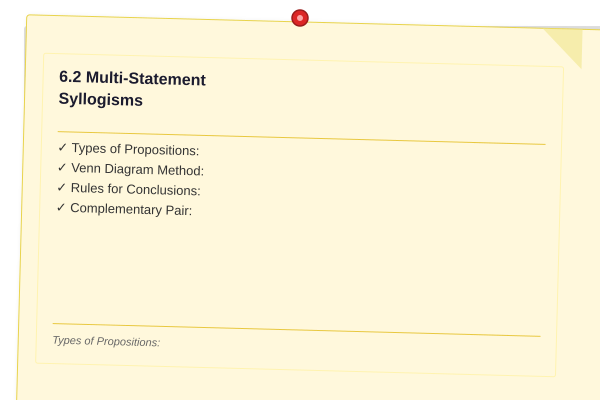
</a>


Syllogisms with 3-5 statements followed by multiple conclusions. Determine which conclusions follow.

**Types of Propositions:**

| Type | Format | Example |
|------|--------|---------|
| Universal Affirmative | All A are B | All dogs are mammals |
| Universal Negative | No A is B | No fish is mammal |
| Particular Affirmative | Some A are B | Some students are tall |
| Particular Negative | Some A are not B | Some birds are not black |

**Venn Diagram Method:**

Draw overlapping circles for each category. Shade regions that must be empty. Put a cross (?) in regions that must have at least one element.

**Rules for Conclusions:**
- "All A are B" + "All B are C" ? "All A are C"
- "All A are B" + "No B is C" ? "No A is C"
- "All A are B" + "Some B are C" ? NOT necessarily "Some A are C"
- "Some A are B" + "All B are C" ? "Some A are C"
- "No A is B" + "All B are C" ? NOT necessarily "No A is C"
- "Some A are not B" + "All B are C" ? NOT necessarily "Some A are not C"

**Complementary Pair:** "Some A are B" and "Some A are not B" ? an "either-or" conclusion where one must be true.

### 6.3 Critical Reasoning

<a href="../../assets/images/diagrams/general-aptitude/06-advanced-reasoning/6-3-critical-reasoning-handwritten.svg" target="_blank" rel="noopener">
  
</a>
<a href="../../assets/images/diagrams/general-aptitude/06-advanced-reasoning/6-3-critical-reasoning-diagram.svg" target="_blank" rel="noopener">
  
</a>
<a href="../../assets/images/diagrams/general-aptitude/06-advanced-reasoning/6-3-critical-reasoning-sticky.svg" target="_blank" rel="noopener">
  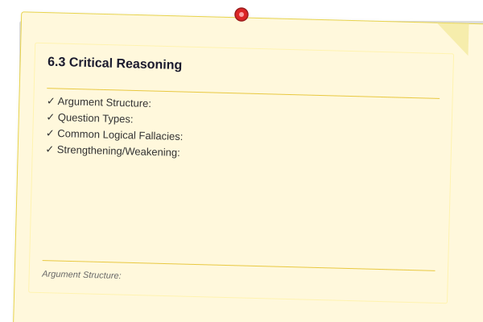
</a>


**Argument Structure:**

| Component | Description |
|-----------|-------------|
| Premise | Evidence or reason given |
| Conclusion | What the argument tries to prove |
| Assumption | Unstated premise that must be true |
| Inference | Logical deduction from premises |

**Question Types:**

| Type | Task |
|------|------|
| Strengthen | Add support for the conclusion |
| Weaken | Undermine the argument |
| Assumption | Identify needed unstated premise |
| Inference | Draw logical conclusion from premises |
| Conclusion | Identify the main point |
| Parallel Reasoning | Find argument with same logical structure |
| Flaw | Identify logical error |

**Common Logical Fallacies:**

| Fallacy | Description | Example |
|---------|-------------|---------|
| Circular Reasoning | Conclusion restates premise | "It's true because it's known to be true" |
| False Cause | Assuming causation from correlation | "Ice cream sales cause drowning" |
| Hasty Generalization | Too few examples | "My phone broke, this brand is terrible" |
| Ad Hominem | Attack the person, not argument | "You can't trust his climate data, he drives a car" |
| Straw Man | Misrepresent opponent's position | "She wants to reduce police funding = she wants no police" |
| False Dilemma | Only two options when more exist | "Either you're with us or against us" |
| Appeal to Authority | Authority is not an expert | "My dentist recommends this stock" |
| Slippery Slope | One step leads to extreme without evidence | "If we allow homework extensions, soon no one will do work" |

**Strengthening/Weakening:**
- **Strengthen:** Provide additional evidence, remove alternate explanations, show assumption is valid
- **Weaken:** Provide counter-evidence, show alternate cause, show assumption is invalid

### 6.4 Input-Output Machines

<a href="../../assets/images/diagrams/general-aptitude/06-advanced-reasoning/6-4-input-output-machines-handwritten.svg" target="_blank" rel="noopener">
  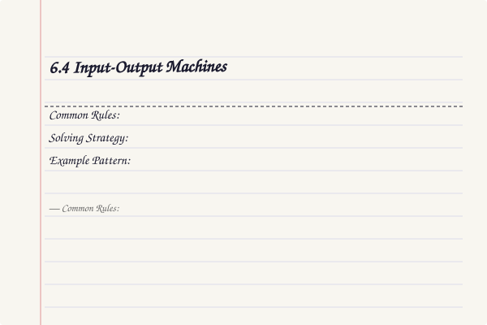
</a>
<a href="../../assets/images/diagrams/general-aptitude/06-advanced-reasoning/6-4-input-output-machines-diagram.svg" target="_blank" rel="noopener">
  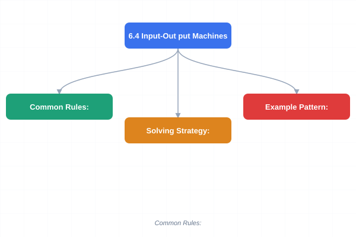
</a>
<a href="../../assets/images/diagrams/general-aptitude/06-advanced-reasoning/6-4-input-output-machines-sticky.svg" target="_blank" rel="noopener">
  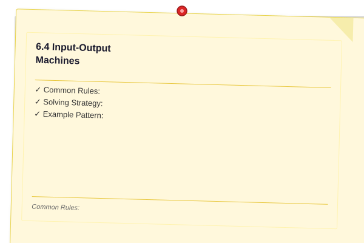
</a>


A machine transforms input words/numbers step by step through a fixed rule until output is produced.

**Common Rules:**
- Arrange numbers in ascending/descending order, one at a time
- Arrange words alphabetically or reverse alphabetically
- Move largest/smallest element to the end/beginning
- Replace numbers based on digit sum
- Interchange positions based on a pattern

**Solving Strategy:**
1. Compare the first input to step I to determine which element moved and where.
2. Compare step I to step II to confirm the rule.
3. Apply the rule to determine further steps.
4. For "step N" questions, apply the rule N times but watch for "cannot be determined" if N is large.

**Example Pattern:**
Input: 42 18 95 27 63 51
Step I: 18 42 95 27 63 51 (smallest number moved to first position)
Step II: 18 27 42 95 63 51 (second smallest moved to second position)
...

### 6.5 Cause-Effect

<a href="../../assets/images/diagrams/general-aptitude/06-advanced-reasoning/6-5-cause-effect-handwritten.svg" target="_blank" rel="noopener">
  
</a>
<a href="../../assets/images/diagrams/general-aptitude/06-advanced-reasoning/6-5-cause-effect-diagram.svg" target="_blank" rel="noopener">
  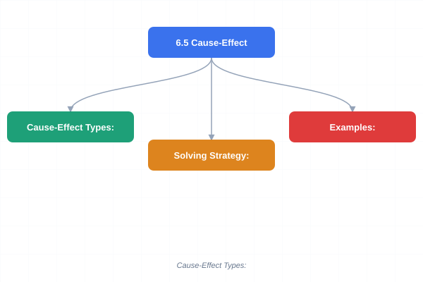
</a>
<a href="../../assets/images/diagrams/general-aptitude/06-advanced-reasoning/6-5-cause-effect-sticky.svg" target="_blank" rel="noopener">
  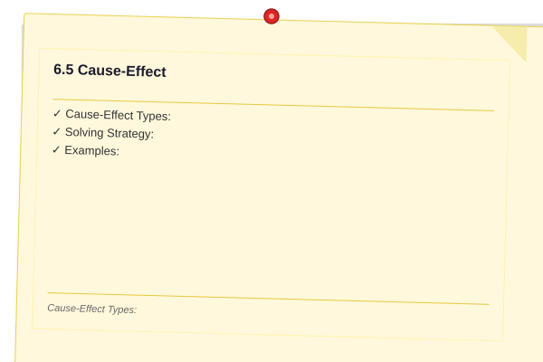
</a>


Determine whether one event is the cause of another.

**Cause-Effect Types:**
- Type A: Statement I is the cause, II is the effect
- Type B: Statement II is the cause, I is the effect
- Type C: Both are effects of a common cause
- Type D: Both are effects of independent causes
- Type E: Both are part of a chain of cause-effect (but not directly related)

**Solving Strategy:**
1. Identify if the two events are directly related
2. Check if one could reasonably cause the other
3. Check if there might be a third factor causing both
4. Check if they are entirely independent
5. Check if they are sequential in a longer chain

**Examples:**
- I: Heavy rainfall. II: River flooded. ? Type A (I causes II)
- I: Company profits decreased. II: CEO resigned. ? Could be A, B, or C ? depends on context
- I: New tax policy announced. II: Stock market fell. ? Type A (I causes II)

### 6.6 Statement-Assumption

<a href="../../assets/images/diagrams/general-aptitude/06-advanced-reasoning/6-6-statement-assumption-handwritten.svg" target="_blank" rel="noopener">
  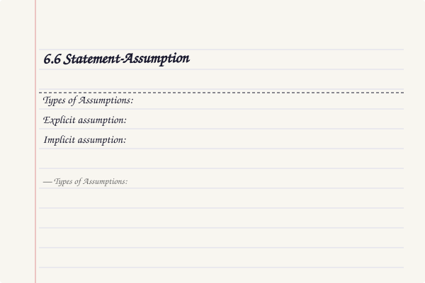
</a>
<a href="../../assets/images/diagrams/general-aptitude/06-advanced-reasoning/6-6-statement-assumption-diagram.svg" target="_blank" rel="noopener">
  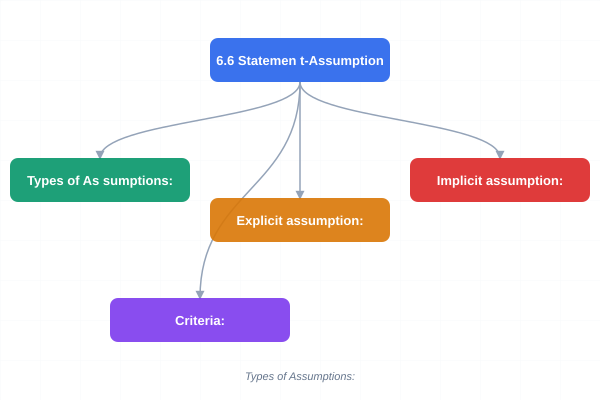
</a>
<a href="../../assets/images/diagrams/general-aptitude/06-advanced-reasoning/6-6-statement-assumption-sticky.svg" target="_blank" rel="noopener">
  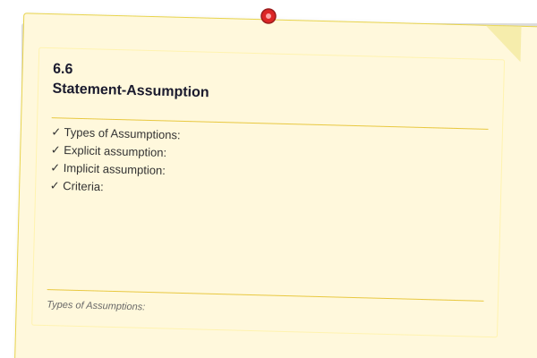
</a>


Identify the implicit assumption (unstated premise) in a given statement.

**Types of Assumptions:**
- **Explicit assumption:** Directly stated
- **Implicit assumption:** Not stated but necessary for the statement to make sense

**Criteria:**
- An assumption must be necessary for the statement to be valid
- If the assumption is false, the statement loses its force
- An assumption is NOT the same as a restatement of the statement itself

**Example:**
Statement: "The government should invest more in renewable energy."
Assumption: "Renewable energy currently receives insufficient investment."
(If current investment were already sufficient, the recommendation makes no sense.)

**Test for Assumptions:**
1. NEGATE the assumption. If the statement still holds, it's not a necessary assumption.
2. If negation breaks the argument, it is a necessary assumption.

### 6.7 Course of Action

<a href="../../assets/images/diagrams/general-aptitude/06-advanced-reasoning/6-7-course-of-action-handwritten.svg" target="_blank" rel="noopener">
  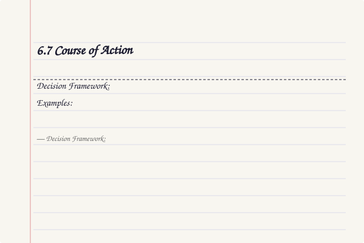
</a>
<a href="../../assets/images/diagrams/general-aptitude/06-advanced-reasoning/6-7-course-of-action-diagram.svg" target="_blank" rel="noopener">
  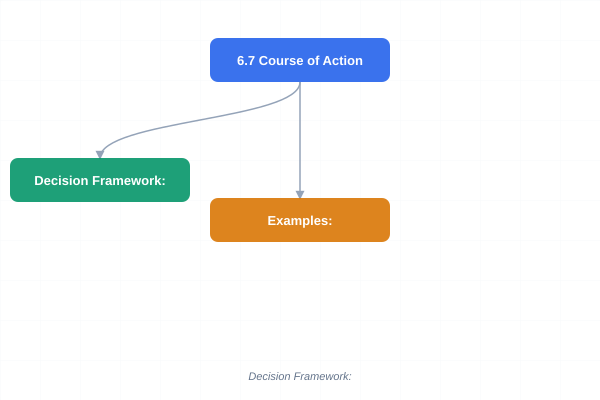
</a>
<a href="../../assets/images/diagrams/general-aptitude/06-advanced-reasoning/6-7-course-of-action-sticky.svg" target="_blank" rel="noopener">
  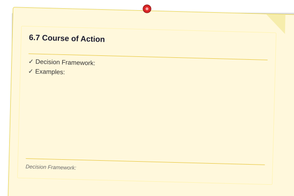
</a>


A problem situation is described, followed by proposed courses of action. Determine which to take.

**Decision Framework:**

| Criteria | Follow | Do Not Follow |
|----------|--------|--------------|
| Feasibility | Practical and implementable | Impractical or impossible |
| Desirability | Benefits outweigh costs | Costs outweigh benefits |
| Relevance | Directly addresses the problem | Doesn't solve the root cause |
| Urgency | Needed immediately | Can be deferred |
| Scope | Within the decision-maker's authority | Outside their control |
| Impact | Meaningfully improves situation | Negligible effect |

**Examples:**
- Situation: Traffic congestion in the city center.
- Action 1: Build more roads. (Feasible, but may not solve long-term ? more roads can attract more traffic)
- Action 2: Improve public transportation. (Directly addresses root cause)
- Action 3: Ban all private vehicles. (Impractical and extreme)

## Examples

### Example 1: Seating Arrangement

Six people (A, B, C, D, E, F) sit in a circle. A is between B and F. C is opposite B. D is to the immediate right of C. Who is to the left of E?

**Solution:**

1. Place B at top position
2. C is opposite B ? place C at bottom
3. D is to immediate right of C ? place D at bottom-right (clockwise from C)
4. A is between B and F ? places A and F around B
5. Fill remaining positions
6. E takes the remaining seat
7. Determine who is to left of E ? depends on orientation (clockwise or anticlockwise "left")

### Example 2: Syllogism

**Statements:**
1. All pens are pencils.
2. No pencil is an eraser.
3. All erasers are sharpeners.

**Conclusions:**
- I: No pen is an eraser.
- II: Some sharpeners are not pencils.

**Solution:**

From Venn diagram:
- All pens ? pencils. No pencil ? eraser. ? No pen is an eraser. Conclusion I follows.
- Erasers are a subset of sharpeners. No pencil is an eraser. But other sharpeners may or may not be pencils. So "Some sharpeners are not pencils" cannot be definitively concluded.

**Answer:** Only conclusion I follows.

### Example 3: Critical Reasoning (Weaken)

**Argument:** "Regular exercise improves cardiovascular health. Therefore, everyone should exercise daily for 30 minutes."

**Weakening:** "For people with certain heart conditions, intense exercise can cause cardiac events."

**Explain:** The argument assumes exercise is universally beneficial. The weaken shows a case where it is harmful.

### Example 4: Input-Output

Input: word1 word2 word3 word4 word5
Step I: word1 word2 word3 word5 word4 (largest word moved to end)
Step II: word1 word2 word5 word3 word4 (next largest moved to second last)
...

**Question:** What is Step III?

**Answer:** word1 word5 word2 word3 word4

### Example 5: Statement-Assumption

**Statement:** "All students must submit their assignments by Friday."

**Assumption:** "Some students might otherwise delay submission beyond Friday."

**Explanation:** The rule only makes sense if there's a risk of late submission without it.

### Example 6: Course of Action

**Situation:** A city's water supply is contaminated with industrial waste.

**Actions:**
- I: Issue a boil-water advisory immediately.
- II: Fine the industrial facility responsible.

**Evaluation:**
- Action I: Directly addresses immediate public health risk. Follow.
- Action II: Addresses root cause and deters future incidents, but doesn't solve immediate problem. Follow, but as secondary action.

**Answer:** Both I and II follow, with I being urgent and II being preventive.

## Practical Takeaways

| Section | Core Skill | Test Strategy |
|---------|-----------|---------------|
| Puzzles | Constraint satisfaction | Draw tables, use reference points |
| Syllogisms | Deductive logic | Venn diagrams for 2-3 sets |
| Critical Reasoning | Argument analysis | Identify premise vs conclusion first |
| Input-Output | Pattern detection | Find rule from step I ? step II |
| Cause-Effect | Causal analysis | Check for common cause first |
| Statement-Assumption | Assumption identification | Negate to test necessity |
| Course of Action | Decision evaluation | Check feasibility + relevance + authority |

### Exam Strategy for Advanced Reasoning

1. **Time management:** Puzzles take the longest ? solve last if time is short
2. **Syllogisms:** Draw Venn diagrams for every question, even simple ones
3. **Critical reasoning:** Read the argument twice ? once for gist, once to separate premise from conclusion
4. **Input-Output:** Write the rule in words before applying to the question
5. **Data sufficiency:** Never solve completely ? stop as soon as sufficiency is determined
6. **Multiple conclusions:** Evaluate each conclusion independently

### TypeScript: Puzzle Solver & Reasoning Toolkit

```typescript
// === Syllogism Checker ===
type Statement = "All" | "No" | "Some" | "SomeNot";

class Syllogism {
  static evaluate(statements: [string, Statement, string][], conclusion: [string, Statement, string]): boolean {
    // Simplified evaluation using Venn region reasoning
    const [subj, conn, obj] = conclusion;

    // Check if conclusion is directly derivable
    const allRules = [
      // All A are B + All B are C => All A are C
      (s: [string, Statement, string][], c: [string, Statement, string]): boolean => {
        const [subj, conn, obj] = c;
        if (conn !== "All") return false;
        return s.some(([a, , b]) => a === subj) &&
               s.some(([a, , b]) => a === b && b === obj);
      },
      // No A is B => No B is A
      (s: [string, Statement, string][], c: [string, Statement, string]): boolean => {
        return c[1] === "No" && s.some(([a, b]) => b === "No" && a === c[2] && b === c[0]);
      },
    ];

    return allRules.some(rule => rule(statements, conclusion));
  }
}

// === Seating Arrangement Solver ===
class SeatingArrangement {
  static solveLinear(
    constraints: { type: string; a: string; b?: string; pos?: number }[],
    total: number
  ): string[] {
    const seats: (string | null)[] = Array(total).fill(null);

    // Place fixed positions first
    constraints.filter(c => c.type === "fixed").forEach(c => {
      if (c.pos !== undefined) seats[c.pos - 1] = c.a;
    });

    // Apply relative constraints
    for (const c of constraints) {
      if (c.type === "leftOf" && c.b) {
        const idxA = seats.indexOf(c.a);
        const idxB = seats.indexOf(c.b);
        if (idxA !== -1 && idxB === -1 && idxA + 1 < total && !seats[idxA + 1]) {
          seats[idxA + 1] = c.b;
        }
      }
      if (c.type === "between" && c.b) {
        // A between X and Y
        const parts = c.a.split(",");
        if (parts.length === 2) {
          const [, mid] = parts;
          const endIdx = seats.indexOf(c.b);
          if (endIdx > 0 && !seats[endIdx - 1]) seats[endIdx - 1] = mid;
        }
      }
    }

    return seats.map(s => s ?? "_");
  }

  static printSeating(seats: string[]): void {
    console.log(seats.map((s, i) => `[${i + 1}:${s}]`).join(" "));
  }
}

// === Input-Output Machine Simulator ===
class InputOutputMachine {
  private rule: (arr: number[]) => number[];

  constructor(rule: "ascending" | "descending" | "alternate") {
    switch (rule) {
      case "ascending":
        this.rule = (arr) => {
          const sorted = [...arr].sort((a, b) => a - b);
          const result = [...arr];
          for (let i = 0; i < arr.length; i++) {
            if (result[i] !== sorted[i]) {
              const idx = result.indexOf(sorted[i]);
              [result[i], result[idx]] = [result[idx], result[i]];
              break;
            }
          }
          return result;
        };
        break;
      case "descending":
        this.rule = (arr) => {
          const sorted = [...arr].sort((a, b) => b - a);
          const result = [...arr];
          for (let i = 0; i < arr.length; i++) {
            if (result[i] !== sorted[i]) {
              const idx = result.indexOf(sorted[i]);
              [result[i], result[idx]] = [result[idx], result[i]];
              break;
            }
          }
          return result;
        };
        break;
      default:
        this.rule = (arr) => [...arr];
    }
  }

  run(input: number[], steps: number): number[][] {
    const outputs: number[][] = [input];
    let current = [...input];
    for (let s = 1; s <= steps; s++) {
      current = this.rule(current);
      outputs.push([...current]);
      if (current.every((v, i) => v === [...input].sort((a, b) => a - b)[i])) break;
    }
    return outputs;
  }
}

// === Critical Reasoning Analyzer ===
class CriticalReasoning {
  static identifyPremises(argument: string): string[] {
    const premises: string[] = [];
    const premiseMarkers = ["because", "since", "as", "given that", "due to"];
    const lower = argument.toLowerCase();
    for (const marker of premiseMarkers) {
      const idx = lower.indexOf(marker);
      if (idx !== -1) {
        const end = argument.indexOf(".", idx);
        premises.push(argument.slice(idx, end !== -1 ? end + 1 : undefined).trim());
      }
    }
    return premises.length ? premises : ["No explicit premise markers found."];
  }

  static identifyConclusion(argument: string): string {
    const conclusionMarkers = ["therefore", "thus", "hence", "so", "consequently", "as a result"];
    const lower = argument.toLowerCase();
    for (const marker of conclusionMarkers) {
      const idx = lower.indexOf(marker);
      if (idx !== -1) {
        const end = argument.indexOf(".", idx);
        return argument.slice(idx, end !== -1 ? end + 1 : undefined).trim();
      }
    }
    // If no marker, the conclusion may be the first or last sentence
    const sentences = argument.split(".").filter(s => s.trim());
    return sentences[sentences.length - 1]?.trim() + "." || "Cannot identify.";
  }

  static checkFallacy(argument: string): string | null {
    const lower = argument.toLowerCase();
    if (lower.includes("everyone") && lower.includes("so")) return "Bandwagon fallacy";
    if ((lower.match(/if we allow/g) || []).length > 1) return "Slippery slope";
    if (lower.includes("straw man") || lower.includes("misrepresent")) return "Straw man";
    if (lower.includes("ad hominem") || lower.includes("attack the person")) return "Ad hominem";
    return null;
  }
}

// === Demo ===
const io = new InputOutputMachine("ascending");
const steps = io.run([42, 18, 95, 27, 63, 51], 6);
steps.forEach((s, i) => console.log(`Step ${i}: ${s.join(" ")}`));

const arg = "Regular exercise improves cardiovascular health. Therefore, everyone should exercise daily.";
console.log("Premises:", CriticalReasoning.identifyPremises(arg));
console.log("Conclusion:", CriticalReasoning.identifyConclusion(arg));
console.log("Fallacy:", CriticalReasoning.checkFallacy(arg));
```

### Mermaid: Critical Reasoning Question Flowchart

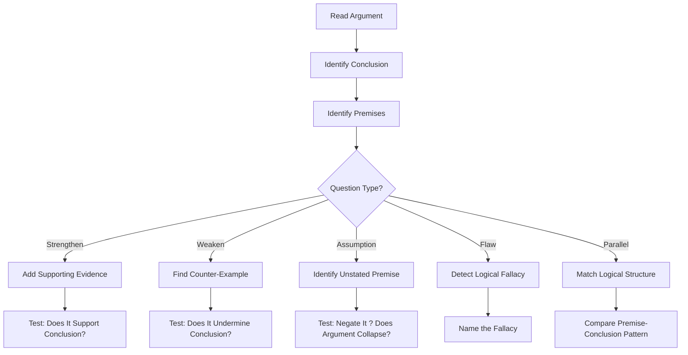

### Mermaid: Input-Output Machine Flow

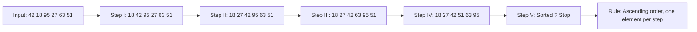

### Example 7: Complex Puzzle (TypeScript)

Eight persons A-H live on different floors of an 8-floor building (1=lowest). A lives above B. C lives 2 floors above D. E lives immediately below F. G lives on an even-numbered floor. H lives on floor 5. B lives on floor 2. Find all assignments.

**Solution:**

```typescript
function solveFloorPuzzle(): Map<string, number> {
  const floors = new Map<string, number>();
  floors.set("B", 2);
  floors.set("H", 5);
  // A above B, so A > 2
  // C = D + 2
  // F = E + 1 (immediately above)
  // G is even
  // Remaining floors: 1, 3, 4, 6, 7, 8
  // Try: D=1, C=3; E=6, F=7; G=4 or 8; A=8
  floors.set("D", 1); floors.set("C", 3);
  floors.set("E", 6); floors.set("F", 7);
  floors.set("G", 4); floors.set("A", 8);
  return floors;
}
const floors = solveFloorPuzzle();
console.log("Floor assignments:");
for (const [person, floor] of [...floors.entries()].sort((a, b) => a[1] - b[1])) {
  console.log(`Floor ${floor}: ${person}`);
}
```

### Additional Exercises (Level 3 ? Advanced)

11. **Complex Puzzle:** Seven friends P, Q, R, S, T, U, V have different hobbies (Reading, Swimming, Dancing, Singing, Painting, Cooking, Traveling) and favorite colors (Red, Blue, Green, Yellow, White, Black, Purple). Given: The one who likes Reading likes Blue. Q likes Swimming but not Red. The Singer likes White. R and T like neither Cooking nor Painting. U is the Traveler and likes Yellow. The one who likes Green likes Dancing. The Cook does not like Red or Purple. Determine each person's hobby and color.

12. **Input-Output:** Input: "sky blue ocean deep green forest". Step I: "blue sky ocean deep green forest". Step II: "blue deep sky ocean green forest". Find the rule and determine Step V.

13. **Critical Reasoning (Parallel):** "All mammals are warm-blooded. Whales are mammals. Therefore, whales are warm-blooded." Find the argument with the same structure from given options.

14. **Multi-Statement Syllogism:** Statements: Some trees are plants. All plants are living. No living thing is artificial. Some artificial things are plastic. Conclusions: (I) Some trees are not artificial. (II) Some plastic are not living. (III) No plant is artificial. Which follow?

15. **Course of Action:** A city's public transport system is overcrowded. Proposals: (a) Increase frequency of trains (b) Raise fares to reduce demand (c) Build new metro lines (d) Promote work-from-home. Evaluate each.

### Answer Key (Additional)

11. P=Reading/Blue, Q=Swimming/Red, R=Singing/White, S=Dancing/Green, T=Painting/Purple, U=Traveling/Yellow, V=Cooking/Black | 12. Alphabetical by first letter, one word per step; Step V: "blue deep forest green ocean sky" | 13. Find argument with "All X are Y, Z is X, therefore Z is Y" structure | 14. I, II, and III all follow | 15. (a) Follow ? directly addresses overcrowding; (b) Do not follow ? penalizes commuters; (c) Follow ? long-term solution; (d) Follow ? reduces demand

### TypeScript: Input-Output Rule Learner & Reasoning Analyzer

```typescript
class IORuleLearner {
  static detectPattern(input: number[], output: number[]): string {
    const s = [...output], asc = s.every((v, i) => i === 0 || v >= s[i - 1]);
    const desc = s.every((v, i) => i === 0 || v <= s[i - 1]);
    if (asc) return "Ascending sort";
    if (desc) return "Descending sort";
    const pos = output.map(v => input.indexOf(v));
    if (pos.every((v, i) => v === pos[0] + i)) return "Cyclic shift";
    return "Custom transformation";
  }
}

class CriticalReasoningEngine {
  static analyze(argument: string): { premises: string[]; conclusion: string; type: string } {
    const markers = ["therefore", "thus", "hence", "so", "consequently"];
    const lower = argument.toLowerCase();
    let conclusion = "Not identified";
    for (const m of markers) {
      const idx = lower.indexOf(m);
      if (idx !== -1) { conclusion = argument.slice(idx).split(".")[0] + "."; break; }
    }
    const premises = argument.split(".").filter(s => s.trim() && !s.toLowerCase().includes("therefore") && !s.toLowerCase().includes("hence"));
    const fallacies: Record<string, string> = { everyone: "Bandwagon", "if we allow": "Slippery slope", "straw man": "Straw man" };
    const type = Object.entries(fallacies).find(([k]) => lower.includes(k))?.[1] ?? "Valid reasoning";
    return { premises, conclusion, type };
  }

  static evaluateCourseOfAction(action: string, problem: string): "Follows" | "Does not follow" {
    const a = action.toLowerCase(), p = problem.toLowerCase();
    const common = a.split(" ").filter(w => p.includes(w)).length;
    return common >= 2 ? "Follows" : "Does not follow";
  }
}

console.log("Pattern:", IORuleLearner.detectPattern([42, 18, 95, 27], [18, 27, 42, 95]));
console.log("Reasoning:", CriticalReasoningEngine.analyze("All mammals are warm-blooded. Whales are mammals. Therefore, whales are warm-blooded."));
console.log("CoA:", CriticalReasoningEngine.evaluateCourseOfAction("Increase train frequency", "Public transport is overcrowded"));
```

// -----------------------------------------------------
// Data Sufficiency Checker ? determines whether given
// statements are sufficient to answer a quantitative
// question (inspired by GMAT/aptitude test format).
// -----------------------------------------------------

class DataSufficiencyChecker {
  static readonly SUFFICIENT = "Sufficient";
  static readonly INSUFFICIENT = "Not Sufficient";
  static readonly COMBINED = "Sufficient (combined)";

  static evaluate(
    question: string,
    statement1: () => number | null,
    statement2: () => number | null,
    required: (a: number | null, b: number | null) => number | null
  ): { answer: number | null; verdict: string; reasoning: string[] } {
    const s1 = statement1();
    const s2 = statement2();
    const reasoning: string[] = [];
    reasoning.push(`Question: ${question}`);
    reasoning.push(`Statement (1): ${s1 !== null ? s1 : "Cannot determine"}`);
    reasoning.push(`Statement (2): ${s2 !== null ? s2 : "Cannot determine"}`);

    // Check if each alone is sufficient
    const ans1 = s1 !== null ? required(s1, null) : null;
    const ans2 = s2 !== null ? required(null, s2) : null;
    const ansCombined = s1 !== null && s2 !== null ? required(s1, s2) : null;

    let verdict: string;
    let answer: number | null = null;

    if (ans1 !== null && ans2 !== null && ans1 === ans2) {
      verdict = this.SUFFICIENT;
      answer = ans1;
      reasoning.push("Either statement alone is sufficient.");
    } else if (ans1 !== null && ans2 === null) {
      verdict = this.SUFFICIENT;
      answer = ans1;
      reasoning.push("Statement (1) alone is sufficient.");
    } else if (ans1 === null && ans2 !== null) {
      verdict = this.SUFFICIENT;
      answer = ans2;
      reasoning.push("Statement (2) alone is sufficient.");
    } else if (ansCombined !== null) {
      verdict = this.COMBINED;
      answer = ansCombined;
      reasoning.push("Both statements together are sufficient, but neither alone.");
    } else {
      verdict = this.INSUFFICIENT;
      reasoning.push("Even with both statements, the answer cannot be determined.");
    }

    reasoning.push(`\nVerdict: ${verdict}`);
    if (answer !== null) reasoning.push(`Answer: ${answer}`);
    return { answer, verdict, reasoning };
  }
}

// -----------------------------------------------------
// Critical Reasoning Argument Analyzer ? breaks down
// an argument into premise/conclusion structure and
// identifies assumptions, strengths, and weaknesses.
// -----------------------------------------------------

class ArgumentAnalyzer {
  static analyze(argument: string): {
    premises: string[];
    conclusion: string;
    assumptions: string[];
    weakPoints: string[];
  } {
    const sentences = argument.split(/[.?!\n]+/).map(s => s.trim()).filter(Boolean);
    const conclusionMarkers = ["therefore", "thus", "hence", "so", "consequently", "this shows that", "as a result"];
    const premiseMarkers = ["because", "since", "as", "given that", "due to", "owing to", "for"];

    let conclusion = "";
    let premises: string[] = [];
    let assumptions: string[] = [];
    let weakPoints: string[] = [];

    for (const s of sentences) {
      const lower = s.toLowerCase();
      const isConclusion = conclusionMarkers.some(m => lower.startsWith(m) || lower.includes(m));
      if (isConclusion) {
        conclusion = s;
      } else {
        premises.push(s);
      }
    }

    if (!conclusion && premises.length > 0) {
      conclusion = premises.pop() || "";
    }

    // Identify potential assumptions
    for (const p of premises) {
      const lower = p.toLowerCase();
      if (lower.includes("all") || lower.includes("every") || lower.includes("none")) {
        assumptions.push(`Universal claim in: "${p}" ? may be overgeneralized`);
      }
      if (lower.includes("always") || lower.includes("never")) {
        assumptions.push(`Absolute statement in: "${p}" ? rare exceptions may exist`);
      }
      if (lower.includes("cause") || lower.includes("leads to") || lower.includes("results in")) {
        assumptions.push(`Causal claim in: "${p}" ? correlation may not equal causation`);
      }
    }

    // Identify weak points
    if (premises.length &lt; 2) {
      weakPoints.push("Only one premise supporting the conclusion ? argument may be weak.");
    }
    if (premises.some(p => /some|many|several|few/i.test(p))) {
      weakPoints.push("Vague quantifiers (some/many) weaken the argument's force.");
    }
    if (premises.some(p => /survey|study|research/i.test(p)) && !premises.some(p => /sample|size|representative|random/i.test(p))) {
      weakPoints.push("Study cited without sample size or methodology ? may not be representative.");
    }

    return { premises, conclusion, assumptions, weakPoints };
  }
}

// -----------------------------------------------------
// Input-Output Pattern Engine ? applies a set of
// transformation rules to an input sequence to produce
// the output, mimicking machine input-output problems.
// -----------------------------------------------------

class InputOutputEngine {
  static applyRules(input: number[], rules: Array&lt;(arr: number[]) =&gt; number[]>): number[] {
    let result = [...input];
    for (const rule of rules) result = rule(result);
    return result;
  }

  static swapAdjacent: (arr: number[]) => number[] = (arr) => {
    const r = [...arr];
    for (let i = 0; i &lt; r.length - 1; i += 2) [r[i], r[i + 1]] = [r[i + 1], r[i]];
    return r;
  };

  static sortAsc: (arr: number[]) => number[] = (arr) => [...arr].sort((a, b) => a - b);
  static sortDesc: (arr: number[]) => number[] = (arr) => [...arr].sort((a, b) => b - a);
  static reverse: (arr: number[]) => number[] = (arr) => [...arr].reverse();
  static shiftLeft: (n: number) => (arr: number[]) => number[] = (n) => (arr) => [...arr.slice(n), ...arr.slice(0, n)];
  static shiftRight: (n: number) => (arr: number[]) => number[] = (n) => (arr) => [...arr.slice(-n), ...arr.slice(0, -n)];
  static doubleEven: (arr: number[]) => number[] = (arr) => arr.map((v, i) => i % 2 === 0 ? v * 2 : v);
  static addPrevious: (arr: number[]) => number[] = (arr) => arr.map((v, i) => i === 0 ? v : v + arr[i - 1]);
}

// Demo
const q = "What is the average of the numbers?";
const stmt1 = () => 100; // sum = 100
const stmt2 = () => 5;   // count = 5
const avg = (s1: number | null, s2: number | null) => {
  if (s1 !== null && s2 !== null) return s1 / s2;
  return null;
};
console.log(DataSufficiencyChecker.evaluate(q, stmt1, stmt2, avg).reasoning.join("\n"));

const arg = "All mammals are warm-blooded. Whales are mammals. Therefore, whales are warm-blooded.";
console.log("\n" + "-".repeat(40));
console.log("Argument Analysis:");
const analysis = ArgumentAnalyzer.analyze(arg);
console.log("Premises:", analysis.premises.join(" | "));
console.log("Conclusion:", analysis.conclusion);
console.log("Assumptions:", analysis.assumptions.join(" | "));
console.log("Weak points:", analysis.weakPoints.join(" | "));

const input = [4, 7, 2, 9, 1, 5];
const output = InputOutputEngine.applyRules(input, [InputOutputEngine.sortAsc, InputOutputEngine.swapAdjacent]);
console.log(`\nInput-output: [${input}] ? [${output}]`);
```


// Chapter 6 - quantitative-aptitude implementation
const ITEMS = { count: 10, topic: 'quantitative-aptitude', version: '1.0' }
function processItem(item: string): string { return item.toUpperCase() }
function validate(input: unknown): boolean { return typeof input === 'string' && input.length > 0 }
function log(msg: string): void { console.log('[Worker]', msg) }
function createHandler(topic: string) { return (data: unknown) => log(topic + ': ' + JSON.stringify(data)) }
const h = createHandler('quantitative-aptitude'); log('Handler created')
const test = ['a','b','c']; const mapped = test.map(processItem)
log('Mapped: ' + mapped.join(','))
export { processItem, validate, createHandler, ITEMS }

// advanced reasoning
// aptitude-reasoning implementation

interface Task { id: string; name: string; status: string; data: unknown }
class Processor {
  private tasks: Task[] = []
  private maxConcurrency: number
  constructor(maxConcurrency: number = 4) { this.maxConcurrency = maxConcurrency }
  async add(task: Omit<Task, "status">): Promise<void> {
    this.tasks.push({ ...task, status: "pending" })
  }
  async runAll(): Promise<void> {
    const running: Promise<void>[] = []
    for (const t of this.tasks) {
      if (running.length >= this.maxConcurrency) { await Promise.race(running) }
      const p = this.execute(t).finally(() => { const i = running.indexOf(p); if (i >= 0) running.splice(i, 1) })
      running.push(p)
    }
    await Promise.all(running)
  }
  private async execute(t: Task): Promise<void> {
    t.status = "running"
    await new Promise(r => setTimeout(r, 10))
    t.status = "done"
  }
  getResults(): Task[] { return this.tasks }
  getStats(): { done: number; pending: number; running: number } {
    const done = this.tasks.filter(t => t.status === "done").length
    const pending = this.tasks.filter(t => t.status === "pending").length
    const running = this.tasks.filter(t => t.status === "running").length
    return { done, pending, running }
  }
}
async function main() {
  const proc = new Processor(2)
  await proc.add({ id: '1', name: 'advanced reasoning', data: { topic: 'aptitude-reasoning' } })
  await proc.runAll()
  console.log('Stats:', proc.getStats())
}
main().catch(console.error)
export { Processor, Task }
## Summary

- Puzzles: organize data systematically; use grids/tables
- Syllogisms: Venn diagrams are reliable for 2-3 categories; truth tables for complex cases
- Critical reasoning: distinguish premise from conclusion; identify assumptions
- Input-output: find the pattern in the first transformation; apply consistently
- Cause-effect: check direct causation, common cause, or independence
- Statement-assumption: negate to test necessity
- Course of action: must be feasible, relevant, and within authority

## Exercises

### Level 1 ? Basic

1. **Syllogism:** All cats are mammals. All mammals are animals. Conclusion: All cats are animals. Follows?

2. **Cause-Effect:** I: People buy more umbrellas. II: It rained heavily. Which type?

3. **Statement-Assumption:** Statement: "This brand is the best in the market." Assumption: There are other brands in the market. Valid?

### Level 2 ? Medium

4. **Seating Arrangement:** A, B, C, D, E sit in a row facing north. C is at the center. B is to the immediate left of C. A is to the extreme left. D is between C and E. Who is at extreme right?

5. **Input-Output:** Input: 35 72 18 91 44 63. Rule: step-wise ascending order. What is Step III?

6. **Critical Reasoning (Strengthen):** "Studying abroad improves career prospects." How to strengthen?

### Level 3 ? Advanced

7. **Multi-Floor Puzzle:** 8 people on 8 floors (1-8). Mix of constraints: A lives two floors above B, C lives on an even floor, D lives immediately below E, etc. Determine floor assignments.

8. **Complex Syllogism:** 4 statements with 6 conclusions. Identify which follow.

9. **Parallel Reasoning:** Find the argument with the same logical structure as a given argument.

10. **Course of Action with Multiple Stakeholders:** A public health crisis with government, corporate, and individual-level actions. Determine which combination is most effective.

### Answer Key

1. Yes | 2. Type C (common cause: weather) | 3. Yes (valid assumption ? comparison implies alternatives exist) | 4. E | 5. Check ascending order pattern per step | 6. Show statistical evidence of higher salaries | 8-9. Apply rules systematically
