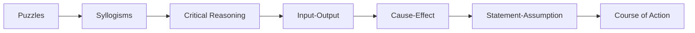

# Chapter 6: Advanced Reasoning

> **Previous:** [Chapter 5: Non-Verbal Reasoning](05-non-verbal-reasoning.md) | **Next:** [Course Index](index.md)

## Learning Objectives

After completing this chapter, you will be able to:

- Solve puzzles involving arrangements, constraints, and combinatorial logic
- Analyze complex syllogisms with multiple statements
- Analyze and construct arguments, identify assumptions and conclusions
- Solve cause-effect and course-of-action problems
- Solve input-output machines and statement-assumption problems
- Handle multi-dimensional logical puzzles

## Chapter at a Glance

| Topic | Key Skill | Difficulty |
|-------|-----------|------------|
| Advanced Puzzles | Complex constraint satisfaction | High |
| Multi-Statement Syllogisms | Deductive reasoning | Medium |
| Critical Reasoning | Argument analysis | High |
| Input-Output | Pattern detection in transformations | Medium |
| Cause-Effect | Causal reasoning | Medium |
| Statement-Assumption | Recognizing unstated premises | Medium |
| Course of Action | Decision making | Medium |

## Chapter Roadmap



## Theory

### 6.1 Advanced Puzzles

**Types of Puzzles:**

| Puzzle Type | Description | Key Strategy |
|-------------|-------------|-------------|
| Seating Arrangement | People seated in a row or circle | Reference points, relative positions |
| Floor-Based | People on different floors | Table with floors as rows |
| Scheduling | Events on days/months | Calendar grid |
| Blood Relation | Family trees | Tree diagram |
| Comparison | Ranking, height, weight, age | Linear ordering |
| Distribution | Items distributed among people | Matching tables |

**Solving Strategy for Complex Puzzles:**

1. **Read everything first:** Understand all constraints before solving.

2. **Create a framework:** Set up tables or grids based on the puzzle structure.

3. **Use symbols:** Represent relationships with symbols (>, <, =, →, ≠).

4. **Direct vs. indirect clues:**
   - Direct: "A sits to the left of B" — place immediately
   - Indirect: "A is two places away from B" — note possible positions

5. **Fixed vs. variable clues:**
   - Fixed: "A is at the left end" — definitive placement
   - Variable: "Either A or B is at the end" — note possibilities

6. **Elimination:** Rule out impossible positions step by step.

7. **"Can't be determined"** — some puzzles have multiple valid solutions.

**Seating Arrangement Notations:**

| Phrase | Meaning |
|--------|---------|
| A sits to the left of B | A is immediately or somewhere left (clarify if immediate) |
| A sits immediately to the left of B | A is directly left of B |
| A and B face each other | Opposite positions |
| A sits two places away from B | Exactly one person between them |

**Blood Relation Tree Symbols:**

```
P --- M    (P married to M)
│
├── S      (S is child of P and M)
│
└── D      (D is child of P and M)
```

| Relation | Description |
|----------|-------------|
| Father's/Mother's son | Brother |
| Father's/Mother's daughter | Sister |
| Father's brother | Uncle |
| Mother's brother | Maternal uncle |
| Father's sister | Aunt |
| Mother's sister | Maternal aunt |
| Son's wife | Daughter-in-law |
| Daughter's husband | Son-in-law |
| Brother's wife | Sister-in-law |
| Sister's husband | Brother-in-law |
| Husband's/Wife's brother | Brother-in-law |
| Husband's/Wife's sister | Sister-in-law |

### 6.2 Multi-Statement Syllogisms

Syllogisms with 3-5 statements followed by multiple conclusions. Determine which conclusions follow.

**Types of Propositions:**

| Type | Format | Example |
|------|--------|---------|
| Universal Affirmative | All A are B | All dogs are mammals |
| Universal Negative | No A is B | No fish is mammal |
| Particular Affirmative | Some A are B | Some students are tall |
| Particular Negative | Some A are not B | Some birds are not black |

**Venn Diagram Method:**

Draw overlapping circles for each category. Shade regions that must be empty. Put a cross (×) in regions that must have at least one element.

**Rules for Conclusions:**
- "All A are B" + "All B are C" ⟹ "All A are C"
- "All A are B" + "No B is C" ⟹ "No A is C"
- "All A are B" + "Some B are C" ⟹ NOT necessarily "Some A are C"
- "Some A are B" + "All B are C" ⟹ "Some A are C"
- "No A is B" + "All B are C" ⟹ NOT necessarily "No A is C"
- "Some A are not B" + "All B are C" ⟹ NOT necessarily "Some A are not C"

**Complementary Pair:** "Some A are B" and "Some A are not B" — an "either-or" conclusion where one must be true.

### 6.3 Critical Reasoning

**Argument Structure:**

| Component | Description |
|-----------|-------------|
| Premise | Evidence or reason given |
| Conclusion | What the argument tries to prove |
| Assumption | Unstated premise that must be true |
| Inference | Logical deduction from premises |

**Question Types:**

| Type | Task |
|------|------|
| Strengthen | Add support for the conclusion |
| Weaken | Undermine the argument |
| Assumption | Identify needed unstated premise |
| Inference | Draw logical conclusion from premises |
| Conclusion | Identify the main point |
| Parallel Reasoning | Find argument with same logical structure |
| Flaw | Identify logical error |

**Common Logical Fallacies:**

| Fallacy | Description | Example |
|---------|-------------|---------|
| Circular Reasoning | Conclusion restates premise | "It's true because it's known to be true" |
| False Cause | Assuming causation from correlation | "Ice cream sales cause drowning" |
| Hasty Generalization | Too few examples | "My phone broke, this brand is terrible" |
| Ad Hominem | Attack the person, not argument | "You can't trust his climate data, he drives a car" |
| Straw Man | Misrepresent opponent's position | "She wants to reduce police funding = she wants no police" |
| False Dilemma | Only two options when more exist | "Either you're with us or against us" |
| Appeal to Authority | Authority is not an expert | "My dentist recommends this stock" |
| Slippery Slope | One step leads to extreme without evidence | "If we allow homework extensions, soon no one will do work" |

**Strengthening/Weakening:**
- **Strengthen:** Provide additional evidence, remove alternate explanations, show assumption is valid
- **Weaken:** Provide counter-evidence, show alternate cause, show assumption is invalid

### 6.4 Input-Output Machines

A machine transforms input words/numbers step by step through a fixed rule until output is produced.

**Common Rules:**
- Arrange numbers in ascending/descending order, one at a time
- Arrange words alphabetically or reverse alphabetically
- Move largest/smallest element to the end/beginning
- Replace numbers based on digit sum
- Interchange positions based on a pattern

**Solving Strategy:**
1. Compare the first input to step I to determine which element moved and where.
2. Compare step I to step II to confirm the rule.
3. Apply the rule to determine further steps.
4. For "step N" questions, apply the rule N times but watch for "cannot be determined" if N is large.

**Example Pattern:**
Input: 42 18 95 27 63 51
Step I: 18 42 95 27 63 51 (smallest number moved to first position)
Step II: 18 27 42 95 63 51 (second smallest moved to second position)
...

### 6.5 Cause-Effect

Determine whether one event is the cause of another.

**Cause-Effect Types:**
- Type A: Statement I is the cause, II is the effect
- Type B: Statement II is the cause, I is the effect
- Type C: Both are effects of a common cause
- Type D: Both are effects of independent causes
- Type E: Both are part of a chain of cause-effect (but not directly related)

**Solving Strategy:**
1. Identify if the two events are directly related
2. Check if one could reasonably cause the other
3. Check if there might be a third factor causing both
4. Check if they are entirely independent
5. Check if they are sequential in a longer chain

**Examples:**
- I: Heavy rainfall. II: River flooded. ⟹ Type A (I causes II)
- I: Company profits decreased. II: CEO resigned. ⟹ Could be A, B, or C — depends on context
- I: New tax policy announced. II: Stock market fell. ⟹ Type A (I causes II)

### 6.6 Statement-Assumption

Identify the implicit assumption (unstated premise) in a given statement.

**Types of Assumptions:**
- **Explicit assumption:** Directly stated
- **Implicit assumption:** Not stated but necessary for the statement to make sense

**Criteria:**
- An assumption must be necessary for the statement to be valid
- If the assumption is false, the statement loses its force
- An assumption is NOT the same as a restatement of the statement itself

**Example:**
Statement: "The government should invest more in renewable energy."
Assumption: "Renewable energy currently receives insufficient investment."
(If current investment were already sufficient, the recommendation makes no sense.)

**Test for Assumptions:**
1. NEGATE the assumption. If the statement still holds, it's not a necessary assumption.
2. If negation breaks the argument, it is a necessary assumption.

### 6.7 Course of Action

A problem situation is described, followed by proposed courses of action. Determine which to take.

**Decision Framework:**

| Criteria | Follow | Do Not Follow |
|----------|--------|--------------|
| Feasibility | Practical and implementable | Impractical or impossible |
| Desirability | Benefits outweigh costs | Costs outweigh benefits |
| Relevance | Directly addresses the problem | Doesn't solve the root cause |
| Urgency | Needed immediately | Can be deferred |
| Scope | Within the decision-maker's authority | Outside their control |
| Impact | Meaningfully improves situation | Negligible effect |

**Examples:**
- Situation: Traffic congestion in the city center.
- Action 1: Build more roads. (Feasible, but may not solve long-term — more roads can attract more traffic)
- Action 2: Improve public transportation. (Directly addresses root cause)
- Action 3: Ban all private vehicles. (Impractical and extreme)

## Examples

### Example 1: Seating Arrangement

Six people (A, B, C, D, E, F) sit in a circle. A is between B and F. C is opposite B. D is to the immediate right of C. Who is to the left of E?

**Solution:**

1. Place B at top position
2. C is opposite B — place C at bottom
3. D is to immediate right of C — place D at bottom-right (clockwise from C)
4. A is between B and F — places A and F around B
5. Fill remaining positions
6. E takes the remaining seat
7. Determine who is to left of E — depends on orientation (clockwise or anticlockwise "left")

### Example 2: Syllogism

**Statements:**
1. All pens are pencils.
2. No pencil is an eraser.
3. All erasers are sharpeners.

**Conclusions:**
- I: No pen is an eraser.
- II: Some sharpeners are not pencils.

**Solution:**

From Venn diagram:
- All pens ⊆ pencils. No pencil ⟷ eraser. ⟹ No pen is an eraser. Conclusion I follows.
- Erasers are a subset of sharpeners. No pencil is an eraser. But other sharpeners may or may not be pencils. So "Some sharpeners are not pencils" cannot be definitively concluded.

**Answer:** Only conclusion I follows.

### Example 3: Critical Reasoning (Weaken)

**Argument:** "Regular exercise improves cardiovascular health. Therefore, everyone should exercise daily for 30 minutes."

**Weakening:** "For people with certain heart conditions, intense exercise can cause cardiac events."

**Explain:** The argument assumes exercise is universally beneficial. The weaken shows a case where it is harmful.

### Example 4: Input-Output

Input: word1 word2 word3 word4 word5
Step I: word1 word2 word3 word5 word4 (largest word moved to end)
Step II: word1 word2 word5 word3 word4 (next largest moved to second last)
...

**Question:** What is Step III?

**Answer:** word1 word5 word2 word3 word4

### Example 5: Statement-Assumption

**Statement:** "All students must submit their assignments by Friday."

**Assumption:** "Some students might otherwise delay submission beyond Friday."

**Explanation:** The rule only makes sense if there's a risk of late submission without it.

### Example 6: Course of Action

**Situation:** A city's water supply is contaminated with industrial waste.

**Actions:**
- I: Issue a boil-water advisory immediately.
- II: Fine the industrial facility responsible.

**Evaluation:**
- Action I: Directly addresses immediate public health risk. Follow.
- Action II: Addresses root cause and deters future incidents, but doesn't solve immediate problem. Follow, but as secondary action.

**Answer:** Both I and II follow, with I being urgent and II being preventive.

## Summary

- Puzzles: organize data systematically; use grids/tables
- Syllogisms: Venn diagrams are reliable for 2-3 categories; truth tables for complex cases
- Critical reasoning: distinguish premise from conclusion; identify assumptions
- Input-output: find the pattern in the first transformation; apply consistently
- Cause-effect: check direct causation, common cause, or independence
- Statement-assumption: negate to test necessity
- Course of action: must be feasible, relevant, and within authority

## Exercises

### Level 1 — Basic

1. **Syllogism:** All cats are mammals. All mammals are animals. Conclusion: All cats are animals. Follows?

2. **Cause-Effect:** I: People buy more umbrellas. II: It rained heavily. Which type?

3. **Statement-Assumption:** Statement: "This brand is the best in the market." Assumption: There are other brands in the market. Valid?

### Level 2 — Medium

4. **Seating Arrangement:** A, B, C, D, E sit in a row facing north. C is at the center. B is to the immediate left of C. A is to the extreme left. D is between C and E. Who is at extreme right?

5. **Input-Output:** Input: 35 72 18 91 44 63. Rule: step-wise ascending order. What is Step III?

6. **Critical Reasoning (Strengthen):** "Studying abroad improves career prospects." How to strengthen?

### Level 3 — Advanced

7. **Multi-Floor Puzzle:** 8 people on 8 floors (1-8). Mix of constraints: A lives two floors above B, C lives on an even floor, D lives immediately below E, etc. Determine floor assignments.

8. **Complex Syllogism:** 4 statements with 6 conclusions. Identify which follow.

9. **Parallel Reasoning:** Find the argument with the same logical structure as a given argument.

10. **Course of Action with Multiple Stakeholders:** A public health crisis with government, corporate, and individual-level actions. Determine which combination is most effective.

### Answer Key

1. Yes | 2. Type C (common cause: weather) | 3. Yes (valid assumption — comparison implies alternatives exist) | 4. E | 5. Check ascending order pattern per step | 6. Show statistical evidence of higher salaries | 8-9. Apply rules systematically
