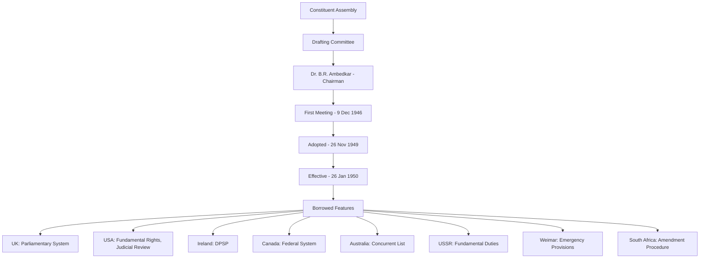
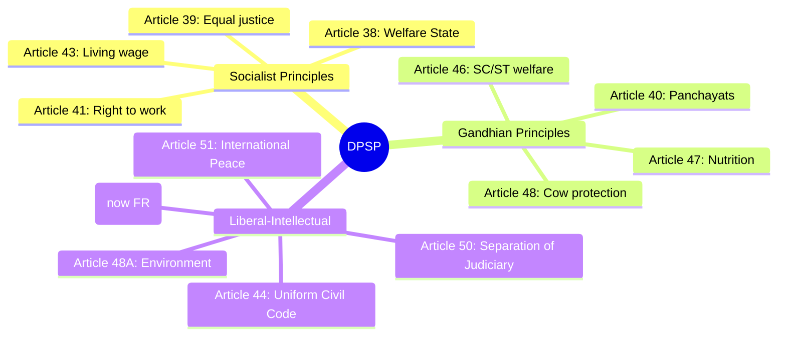
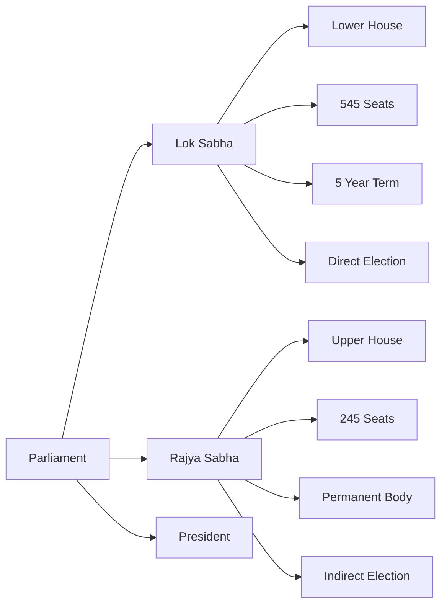
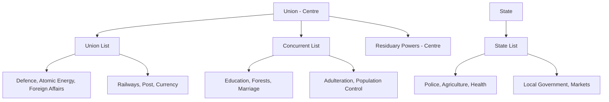

# Chapter 1: Indian Polity & Constitution

## Learning Objectives

By the end of this chapter, you will be able to:

<!-- Image Gallery -->
<div style="display:flex;flex-wrap:wrap;gap:4px;margin:16px 0;padding:12px;background:#f8fafc;border-radius:8px;border:1px solid #e2e8f0;">
<a href="../../../assets/images/lessons/general-awareness/01-indian-polity/hero.svg" target="_blank" rel="noopener">
  
</a>
<a href="../../../assets/images/lessons/general-awareness/01-indian-polity/handwritten-notes.svg" target="_blank" rel="noopener">
  
</a>
<a href="../../../assets/images/lessons/general-awareness/01-indian-polity/sticky-notes.svg" target="_blank" rel="noopener">
  
</a>
<a href="../../../assets/images/lessons/general-awareness/01-indian-polity/visual-explanation.svg" target="_blank" rel="noopener">
  
</a>
<a href="../../../assets/images/lessons/general-awareness/01-indian-polity/architecture.svg" target="_blank" rel="noopener">
  
</a>
<a href="../../../assets/images/lessons/general-awareness/01-indian-polity/workflow.svg" target="_blank" rel="noopener">
  
</a>
<a href="../../../assets/images/lessons/general-awareness/01-indian-polity/mindmap.svg" target="_blank" rel="noopener">
  
</a>
<a href="../../../assets/images/lessons/general-awareness/01-indian-polity/comparison.svg" target="_blank" rel="noopener">
  
</a>
<a href="../../../assets/images/lessons/general-awareness/01-indian-polity/cheatsheet.svg" target="_blank" rel="noopener">
  
</a>
<a href="../../../assets/images/lessons/general-awareness/01-indian-polity/interview-quiz.svg" target="_blank" rel="noopener">
  
</a>
<a href="../../../assets/images/lessons/general-awareness/01-indian-polity/social-card.svg" target="_blank" rel="noopener">
  
</a>
</div>
<!-- End Image Gallery -->


- Explain the key features, preamble, and sources of the Indian Constitution
- Distinguish between Fundamental Rights (Articles 14–32) and Directive Principles (Articles 36–51)
- Describe the structure and functioning of Parliament, Executive, and Judiciary
- Analyse Centre-State relations and the federal system
- Understand the constitutional amendment process and emergency provisions
- Solve exam-level MCQs on Indian Polity with confidence

---

## Theory

### 1.1 Constitution of India — An Overview

<a href="../../../assets/images/diagrams/general-awareness/01-indian-polity/1-1-constitution-of-india-an-overview-handwritten.svg" target="_blank" rel="noopener">
  
</a>
<a href="../../../assets/images/diagrams/general-awareness/01-indian-polity/1-1-constitution-of-india-an-overview-diagram.svg" target="_blank" rel="noopener">
  
</a>
<a href="../../../assets/images/diagrams/general-awareness/01-indian-polity/1-1-constitution-of-india-an-overview-sticky.svg" target="_blank" rel="noopener">
  
</a>


The Constitution of India was adopted on **26 November 1949** and came into effect on **26 January 1950**. It is the longest written constitution in the world, originally containing **395 Articles** divided into **22 Parts** and **8 Schedules** (now 448 Articles, 25 Parts, 12 Schedules).



#### 1.1.1 Key Features

| Feature | Description |
|---------|-------------|
| Length | Longest written constitution (448 Articles, 12 Schedules) |
| Type | Both rigid and flexible (some parts amendable by simple majority, some by special majority) |
| System | Parliamentary democracy with supremacy of constitution |
| Sovereignty | Socialist, Secular, Democratic, Republic (added "Socialist" and "Secular" by 42nd Amendment, 1976) |
| Federal | Division of powers between Union and States (Union List, State List, Concurrent List) |
| Unitary | Single citizenship, single constitution, emergency provisions make it unitary |

#### 1.1.2 The Preamble

> *WE, THE PEOPLE OF INDIA, having solemnly resolved to constitute India into a SOVEREIGN SOCIALIST SECULAR DEMOCRATIC REPUBLIC and to secure to all its citizens:*
> *JUSTICE, social, economic and political;*
> *LIBERTY of thought, expression, belief, faith and worship;*
> *EQUALITY of status and of opportunity;*
> *and to promote among them all*
> *FRATERNITY assuring the dignity of the individual and the unity and integrity of the Nation;*

Changes to the Preamble:
- **42nd Amendment (1976):** Added "Socialist", "Secular", and "Integrity"
- The Preamble is not enforceable in court but serves as the guiding light for interpretation

### 1.2 Fundamental Rights (Articles 14–32)

<a href="../../../assets/images/diagrams/general-awareness/01-indian-polity/1-2-fundamental-rights-articles-14-32-handwritten.svg" target="_blank" rel="noopener">
  
</a>
<a href="../../../assets/images/diagrams/general-awareness/01-indian-polity/1-2-fundamental-rights-articles-14-32-diagram.svg" target="_blank" rel="noopener">
  
</a>
<a href="../../../assets/images/diagrams/general-awareness/01-indian-polity/1-2-fundamental-rights-articles-14-32-sticky.svg" target="_blank" rel="noopener">
  
</a>


Fundamental Rights are guaranteed by Part III of the Constitution. They are justiciable — enforceable by courts.

| Right | Articles | Scope |
|-------|----------|-------|
| Right to Equality | 14–18 | Equality before law, prohibition of discrimination, abolition of untouchability |
| Right to Freedom | 19–22 | Freedom of speech, assembly, association, movement, residence, profession; protection against arrest |
| Right against Exploitation | 23–24 | Prohibition of human trafficking, forced labour, child labour (under 14) |
| Right to Freedom of Religion | 25–28 | Freedom of conscience, practice and propagation of religion |
| Cultural & Educational Rights | 29–30 | Protection of minorities, right to establish educational institutions |
| Right to Constitutional Remedies | 32 | Right to move Supreme Court via writs (Habeas Corpus, Mandamus, Prohibition, Certiorari, Quo Warranto) |

**Important Notes:**
- Article 32 is called the "heart and soul of the Constitution" by Dr. Ambedkar
- Fundamental Rights can be suspended during a National Emergency (except Articles 20 and 21)
- Article 21 (Right to Life and Personal Liberty) has been given the widest interpretation by courts — includes right to privacy, right to clean environment, right to education (86th Amendment)

### 1.3 Directive Principles of State Policy (Articles 36–51)

<a href="../../../assets/images/diagrams/general-awareness/01-indian-polity/1-3-directive-principles-of-state-policy-articles-36-51-handwritten.svg" target="_blank" rel="noopener">
  
</a>
<a href="../../../assets/images/diagrams/general-awareness/01-indian-polity/1-3-directive-principles-of-state-policy-articles-36-51-diagram.svg" target="_blank" rel="noopener">
  
</a>
<a href="../../../assets/images/diagrams/general-awareness/01-indian-polity/1-3-directive-principles-of-state-policy-articles-36-51-sticky.svg" target="_blank" rel="noopener">
  
</a>


Part IV contains DPSP — non-justiciable guidelines for the state to follow.

**Classification:**



**Key Differences — FR vs DPSP:**

| Aspect | Fundamental Rights | DPSP |
|--------|-------------------|------|
| Nature | Negative obligation (state shall NOT do) | Positive obligation (state SHALL do) |
| Enforceability | Justiciable (court-enforceable) | Non-justiciable |
| Part | Part III (Articles 14–32) | Part IV (Articles 36–51) |
| Amendment | Requires special majority | Can be amended by simple majority |
| Basis | Individual rights | Social welfare |

### 1.4 Fundamental Duties (Article 51A)

<a href="../../../assets/images/diagrams/general-awareness/01-indian-polity/1-4-fundamental-duties-article-51a-handwritten.svg" target="_blank" rel="noopener">
  
</a>
<a href="../../../assets/images/diagrams/general-awareness/01-indian-polity/1-4-fundamental-duties-article-51a-diagram.svg" target="_blank" rel="noopener">
  
</a>
<a href="../../../assets/images/diagrams/general-awareness/01-indian-polity/1-4-fundamental-duties-article-51a-sticky.svg" target="_blank" rel="noopener">
  
</a>


Added by the **42nd Amendment (1976)** — originally 10 duties, 11th added by 86th Amendment (2002).

1. Respect the Constitution, national flag and national anthem
2. Cherish noble ideals of the freedom struggle
3. Uphold sovereignty, unity and integrity of India
4. Defend the country when called upon
5. Promote harmony and brotherhood
6. Preserve rich heritage of composite culture
7. Protect natural environment
8. Develop scientific temper and humanism
9. Safeguard public property
10. Strive for excellence in all spheres
11. Provide opportunity for education to child/ward (6–14 years) — added by 86th Amendment

**Note:** Fundamental Duties are non-justiciable but serve as moral obligations.

### 1.5 Union Executive

<a href="../../../assets/images/diagrams/general-awareness/01-indian-polity/1-5-union-executive-handwritten.svg" target="_blank" rel="noopener">
  
</a>
<a href="../../../assets/images/diagrams/general-awareness/01-indian-polity/1-5-union-executive-diagram.svg" target="_blank" rel="noopener">
  
</a>
<a href="../../../assets/images/diagrams/general-awareness/01-indian-polity/1-5-union-executive-sticky.svg" target="_blank" rel="noopener">
  
</a>


#### 1.5.1 President

| Aspect | Detail |
|--------|--------|
| Constitutional Head | Article 52 |
| Election | Elected by Electoral College (MPs + MLAs) — proportional representation by STV |
| Tenure | 5 years |
| Qualifications | Citizen of India, 35+ years, qualified for Lok Sabha membership |
| Impeachment | For violation of Constitution — by special majority of Parliament |
| Veto Power | Absolute veto, Suspensive veto, Pocket veto |

#### 1.5.2 Prime Minister & Council of Ministers

- Article 74: Council of Ministers headed by PM to aid and advise the President
- Article 75: PM is appointed by President, other ministers on PM's advice
- PM is the real executive head (de jure = President, de facto = PM)
- Cabinet = smaller body within Council of Ministers (policy-making body)

### 1.6 Parliament

<a href="../../../assets/images/diagrams/general-awareness/01-indian-polity/1-6-parliament-handwritten.svg" target="_blank" rel="noopener">
  
</a>
<a href="../../../assets/images/diagrams/general-awareness/01-indian-polity/1-6-parliament-diagram.svg" target="_blank" rel="noopener">
  
</a>
<a href="../../../assets/images/diagrams/general-awareness/01-indian-polity/1-6-parliament-sticky.svg" target="_blank" rel="noopener">
  
</a>




| House | Composition | Term | Presiding Officer |
|-------|-------------|------|-------------------|
| Lok Sabha | 543 elected + 2 Anglo-Indian nominated (abolished by 126th CA Act 2019) | 5 years (unless dissolved earlier) | Speaker |
| Rajya Sabha | 233 elected + 12 nominated by President | Permanent (1/3 retire every 2 years) | Vice President (ex-officio Chairman) |

**Legislative Process:**
1. Bill introduced in either house (except Money Bill — introduced only in Lok Sabha)
2. Three readings in each house
3. Passed by majority of present and voting
4. President's assent (can return non-money bills for reconsideration)

**Types of Bills:**
- Ordinary Bill: Passed by simple majority
- Money Bill (Article 110): Certified by Speaker, Lok Sabha has overriding power
- Constitutional Amendment Bill: Requires special majority (2/3 of present and voting + absolute majority)
- Ordinance (Article 123): Promulgated by President when Parliament is not in session

### 1.7 Judiciary

<a href="../../../assets/images/diagrams/general-awareness/01-indian-polity/1-7-judiciary-handwritten.svg" target="_blank" rel="noopener">
  
</a>
<a href="../../../assets/images/diagrams/general-awareness/01-indian-polity/1-7-judiciary-diagram.svg" target="_blank" rel="noopener">
  
</a>
<a href="../../../assets/images/diagrams/general-awareness/01-indian-polity/1-7-judiciary-sticky.svg" target="_blank" rel="noopener">
  
</a>


| Court | Highest Level | Jurisdiction |
|-------|--------------|--------------|
| Supreme Court | Apex court (Article 124) | Original, Appellate, Advisory |
| High Court | State-level (Article 214) | Original, Appellate, Writ (Article 226) |
| District Court | District-level | Civil & Criminal |

**Judicial Review:** Power of courts to examine constitutionality of laws (Article 13, 32, 226, 227).
**Judicial Activism:** Courts stepping beyond traditional role to enforce rights (PIL — Public Interest Litigation).

### 1.8 Federal Structure

<a href="../../../assets/images/diagrams/general-awareness/01-indian-polity/1-8-federal-structure-handwritten.svg" target="_blank" rel="noopener">
  
</a>
<a href="../../../assets/images/diagrams/general-awareness/01-indian-polity/1-8-federal-structure-diagram.svg" target="_blank" rel="noopener">
  
</a>
<a href="../../../assets/images/diagrams/general-awareness/01-indian-polity/1-8-federal-structure-sticky.svg" target="_blank" rel="noopener">
  
</a>




| List | Subjects | Legislative Body |
|------|----------|-----------------|
| Union List | 100 subjects (originally 97) | Only Parliament |
| State List | 61 subjects (originally 66) | Only State Legislature |
| Concurrent List | 52 subjects (originally 47) | Both Parliament and State (Parliament prevails) |
| Residuary | Not listed in any list | Parliament (Article 248) |

**Centre-State Relations:**
- Legislative: Union list prevails over State list; Parliament can legislate on State subjects during emergency
- Administrative: Centre gives directions to states for maintaining standards
- Financial: Centre levies major taxes, shares with states (Finance Commission recommends distribution)

### 1.9 Panchayati Raj (73rd Amendment, 1992)

<a href="../../../assets/images/diagrams/general-awareness/01-indian-polity/1-9-panchayati-raj-73rd-amendment-1992-handwritten.svg" target="_blank" rel="noopener">
  
</a>
<a href="../../../assets/images/diagrams/general-awareness/01-indian-polity/1-9-panchayati-raj-73rd-amendment-1992-diagram.svg" target="_blank" rel="noopener">
  
</a>
<a href="../../../assets/images/diagrams/general-awareness/01-indian-polity/1-9-panchayati-raj-73rd-amendment-1992-sticky.svg" target="_blank" rel="noopener">
  
</a>


- Part IX (Articles 243–243O)
- Three-tier system: Gram Panchayat → Block Panchayat → Zila Parishad
- Direct elections for all seats
- Reservation for SC/ST (proportional) and women (1/3 of seats)

### 1.10 Constitutional Amendments

<a href="../../../assets/images/diagrams/general-awareness/01-indian-polity/1-10-constitutional-amendments-handwritten.svg" target="_blank" rel="noopener">
  
</a>
<a href="../../../assets/images/diagrams/general-awareness/01-indian-polity/1-10-constitutional-amendments-diagram.svg" target="_blank" rel="noopener">
  
</a>
<a href="../../../assets/images/diagrams/general-awareness/01-indian-polity/1-10-constitutional-amendments-sticky.svg" target="_blank" rel="noopener">
  
</a>


| Amendment | Year | Key Provision |
|-----------|------|---------------|
| 1st | 1951 | Added Ninth Schedule; restricted freedom of speech (reasonable restrictions) |
| 7th | 1956 | Reorganised states on linguistic basis |
| 24th | 1971 | Parliament's power to amend Fundamental Rights |
| 42nd | 1976 | Added "Socialist", "Secular", "Integrity"; added Fundamental Duties; made changes to executive |
| 44th | 1978 | Removed right to property from FR (became legal right under Article 300A); restricted emergency |
| 52nd | 1985 | Anti-defection law (Tenth Schedule) |
| 61st | 1988 | Reduced voting age from 21 to 18 |
| 73rd | 1992 | Panchayati Raj institutions |
| 74th | 1992 | Municipalities (Urban Local Bodies) |
| 86th | 2002 | Right to Education (Article 21A) — free and compulsory education for 6–14 years |
| 101st | 2016 | Goods and Services Tax (GST) |
| 103rd | 2019 | 10% EWS (Economically Weaker Sections) reservation |
| 105th | 2021 | Restored states' power to identify OBCs |
| 106th | 2022 | 1/3 reservation for women in Lok Sabha and State Assemblies |

### 1.11 Emergency Provisions

<a href="../../../assets/images/diagrams/general-awareness/01-indian-polity/1-11-emergency-provisions-handwritten.svg" target="_blank" rel="noopener">
  
</a>
<a href="../../../assets/images/diagrams/general-awareness/01-indian-polity/1-11-emergency-provisions-diagram.svg" target="_blank" rel="noopener">
  
</a>
<a href="../../../assets/images/diagrams/general-awareness/01-indian-polity/1-11-emergency-provisions-sticky.svg" target="_blank" rel="noopener">
  
</a>


| Type | Article | Grounds | Effect |
|------|---------|---------|--------|
| National Emergency | 352 | War, external aggression, armed rebellion | FRs suspended; Centre takes over state administration |
| State Emergency (President's Rule) | 356 | Failure of constitutional machinery in state | State legislature suspended; Governor rules in President's name |
| Financial Emergency | 360 | Threat to financial stability | Never imposed so far |

---

## Examples with Solved Exercises

### Example 1: Constitutional Quiz Simulator (TypeScript)

```typescript
// TypeScript quiz simulator for Indian Polity MCQs
interface PolityQuestion {
  id: number;
  question: string;
  options: string[];
  correctIndex: number;
  explanation: string;
}

class PolityQuizSimulator {
  private questions: PolityQuestion[];

  constructor() {
    this.questions = [
      {
        id: 1,
        question: 'Who is known as the "Father of the Indian Constitution"?',
        options: ['Mahatma Gandhi', 'Jawaharlal Nehru', 'Dr. B.R. Ambedkar', 'Sardar Patel'],
        correctIndex: 2,
        explanation: 'Dr. B.R. Ambedkar was the Chairman of the Drafting Committee of the Constituent Assembly.'
      },
      {
        id: 2,
        question: 'Which article of the Indian Constitution deals with the Right to Equality?',
        options: ['Articles 14-18', 'Articles 19-22', 'Articles 23-24', 'Articles 25-28'],
        correctIndex: 0,
        explanation: 'Articles 14-18 in Part III cover Right to Equality including equality before law and prohibition of discrimination.'
      },
      {
        id: 3,
        question: 'How many schedules does the Indian Constitution currently have?',
        options: ['8', '10', '12', '14'],
        correctIndex: 2,
        explanation: 'The Constitution originally had 8 Schedules; currently there are 12 Schedules after various amendments.'
      },
      {
        id: 4,
        question: 'What is the maximum gap between two sessions of Parliament?',
        options: ['3 months', '6 months', '9 months', '12 months'],
        correctIndex: 1,
        explanation: 'Article 85 stipulates that the gap between two sessions of Parliament shall not exceed 6 months.'
      },
      {
        id: 5,
        question: 'Which Amendment added the words "Socialist" and "Secular" to the Preamble?',
        options: ['24th Amendment', '42nd Amendment', '44th Amendment', '52nd Amendment'],
        correctIndex: 1,
        explanation: 'The 42nd Amendment (1976) added "Socialist", "Secular" and "Integrity" to the Preamble.'
      },
    ];
  }

  startQuiz(): { score: number; total: number; results: string[] } {
    let score = 0;
    const results: string[] = [];
    for (let i = 0; i < this.questions.length; i++) {
      const q = this.questions[i];
      // Simulate user selecting option 0 for each (for demo)
      const userChoice = 0;
      const isCorrect = userChoice === q.correctIndex;
      if (isCorrect) score++;
      results.push(`Q${q.id}: ${isCorrect ? 'Correct' : 'Wrong'} — ${q.explanation}`);
    }
    return { score, total: this.questions.length, results };
  }
}

// Demo usage
const simulator = new PolityQuizSimulator();
const result = simulator.startQuiz();
console.log(`Score: ${result.score}/${result.total}`);
result.results.forEach(r => console.log(r));
```

**Output:** Score: 0/5 — because user always selects option 0 (first choice). This simulates the need for careful reading.

---

**Q1 (Exam Style):** Which schedule of the Constitution deals with the division of powers between Union and States?

A) Fourth Schedule
B) Fifth Schedule
C) Seventh Schedule
D) Eighth Schedule

<details>
<summary>Answer</summary>
**Answer: C) Seventh Schedule**

The Seventh Schedule contains the three lists — Union List, State List, and Concurrent List — that define the legislative division of powers. The Fourth Schedule deals with Rajya Sabha seats, Fifth with Scheduled Areas, and Eighth with official languages.
</details>

---

**Q2:** The concept of "Judicial Review" in India is borrowed from which country?

A) United Kingdom
B) United States of America
C) Canada
D) Australia

<details>
<summary>Answer</summary>
**Answer: B) United States of America**

Judicial Review — the power of courts to declare laws unconstitutional — is borrowed from the USA. The Indian Supreme Court and High Courts can declare laws void if they violate Fundamental Rights.
</details>

---

**Q3:** Under which Article can the President promulgate an Ordinance when Parliament is not in session?

A) Article 72
B) Article 110
C) Article 123
D) Article 143

<details>
<summary>Answer</summary>
**Answer: C) Article 123**

Article 123 empowers the President to promulgate Ordinances when Parliament is not in session. The Ordinance has the same force as an Act of Parliament but must be approved within 6 weeks of reassembly.
</details>

---

**Q4:** The Vice President of India is the ex-officio Chairman of which house?

A) Lok Sabha
B) Rajya Sabha
C) Both Houses
D) Joint Session

<details>
<summary>Answer</summary>
**Answer: B) Rajya Sabha**

Article 63 provides for a Vice President who is the ex-officio Chairman of Rajya Sabha. The Chairman of Rajya Sabha (Vice President) does not vote unless there is a tie.
</details>

---

**Q5:** Which Fundamental Right is described by Dr. Ambedkar as the "heart and soul of the Constitution"?

A) Right to Equality (Article 14)
B) Right to Freedom (Article 19)
C) Right to Constitutional Remedies (Article 32)
D) Right to Life (Article 21)

<details>
<summary>Answer</summary>
**Answer: C) Right to Constitutional Remedies (Article 32)**

Article 32 guarantees the right to move the Supreme Court for enforcement of Fundamental Rights through writs. Dr. Ambedkar called it the "heart and soul of the Constitution" because without this right, other rights would be meaningless.
</details>

---

**Q6:** What is the minimum age required to become the President of India?

A) 30 years
B) 35 years
C) 40 years
D) 45 years

<details>
<summary>Answer</summary>
**Answer: B) 35 years**

Article 58 requires the President to be a citizen of India, at least 35 years old, and qualified to be a member of Lok Sabha.
</details>

---

**Q7:** Which of the following is NOT a writ issued by the Supreme Court?

A) Habeas Corpus
B) Mandamus
C) Subpoena
D) Certiorari

<details>
<summary>Answer</summary>
**Answer: C) Subpoena**

The five writs are: Habeas Corpus (produce body), Mandamus (command), Prohibition (prohibit), Certiorari (quash), and Quo Warranto (by what authority). Subpoena is a court summon, not a constitutional writ.
</details>

---

**Q8:** The 73rd Constitutional Amendment is associated with:

A) Reservation in education
B) Panchayati Raj institutions
C) GST implementation
D) Right to Education

<details>
<summary>Answer</summary>
**Answer: B) Panchayati Raj institutions**

The 73rd Amendment (1992) added Part IX to the Constitution, establishing a three-tier Panchayati Raj system at village, intermediate, and district levels with direct elections and reservations.
</details>

---

**Q9:** Which of the following is a feature of the Indian Constitution borrowed from the UK?

A) Judicial Review
B) Parliamentary system
C) Federal system
D) Fundamental Rights

<details>
<summary>Answer</summary>
**Answer: B) Parliamentary system**

The parliamentary system (Cabinet form of government, collective responsibility, Prime Minister as real executive) is borrowed from the UK. Judicial Review is from USA, Federal system from Canada, and Fundamental Rights from USA.
</details>

---

**Q10:** The "Doctrine of Basic Structure" was propounded by the Supreme Court in which case?

A) A.K. Gopalan case (1950)
B) Kesavananda Bharati case (1973)
C) Maneka Gandhi case (1978)
D) Golaknath case (1967)

<details>
<summary>Answer</summary>
**Answer: B) Kesavananda Bharati case (1973)**

In the Kesavananda Bharati case, the Supreme Court held that Parliament cannot amend the basic structure of the Constitution — including supremacy of the Constitution, democratic republic, secularism, separation of powers, and fundamental rights.
</details>

---

**Q11:** Which Article of the Indian Constitution abolishes untouchability?

A) Article 15
B) Article 17
C) Article 18
D) Article 23

<details>
<summary>Answer</summary>
**Answer: B) Article 17**

Article 17 abolishes "untouchability" and forbids its practice in any form. It is a Fundamental Right under the Right to Equality group. Enforcement can lead to punishment under the Protection of Civil Rights Act, 1955.
</details>

---

**Q12:** The Finance Commission of India is constituted under which Article?

A) Article 112
B) Article 267
C) Article 280
D) Article 324

<details>
<summary>Answer</summary>
**Answer: C) Article 280**

Article 280 provides for a Finance Commission to be constituted every 5 years by the President to recommend distribution of tax revenues between Union and States. The 15th Finance Commission (2021-26) was chaired by N.K. Singh.
</details>

---

**Q13:** Which of the following is NOT a part of the basic structure doctrine?

A) Federal character
B) Judicial review
C) Right to property
D) Secularism

<details>
<summary>Answer</summary>
**Answer: C) Right to property**

Right to property was a Fundamental Right (Article 31) before the 44th Amendment (1978) removed it. It is now a legal right under Article 300A and is NOT part of the basic structure doctrine.
</details>

---

**Q14:** Who appoints the Chief Election Commissioner of India?

A) Prime Minister
B) President
C) Chief Justice of India
D) Vice President

<details>
<summary>Answer</summary>
**Answer: B) President**

The President appoints the Chief Election Commissioner (CEC) and Election Commissioners. The CEC can be removed only through impeachment — same process as Supreme Court judges — to ensure independence.
</details>

---

**Q15:** The concept of "Directive Principles of State Policy" is borrowed from which country?

A) USA
B) Canada
C) Ireland
D) Australia

<details>
<summary>Answer</summary>
**Answer: C) Ireland**

DPSP (Part IV) is borrowed from the Irish Constitution. While non-justiciable, they are "fundamental in the governance of the country" and the state is obligated to apply them in making laws (Article 37).
</details>

---

**Q16:** What is the maximum strength of the Lok Sabha?

A) 500
B) 525
C) 545
D) 552

<details>
<summary>Answer</summary>
**Answer: D) 552**

The maximum strength is 552 (530 from states + 20 from UTs + 2 Anglo-Indian nominated, though the 126th Constitutional Amendment Bill ended Anglo-Indian nomination). Current working strength is 543 elected + 2 nominated.
</details>

---

**Q17:** Under which Article can the President seek the opinion of the Supreme Court on a question of law or fact?

A) Article 72
B) Article 123
C) Article 143
D) Article 213

<details>
<summary>Answer</summary>
**Answer: C) Article 143**

Article 143 gives the President the power to seek the Supreme Court's advisory opinion on any question of law or fact of public importance. The opinion is advisory, not binding.
</details>

---

**Q18:** Who was the first Law Minister of independent India?

A) Dr. B.R. Ambedkar
B) Jawaharlal Nehru
C) Sardar Patel
D) K.M. Munshi

<details>
<summary>Answer</summary>
**Answer: A) Dr. B.R. Ambedkar**

Dr. B.R. Ambedkar served as the first Law Minister of independent India (1947-1951). He was also the Chairman of the Drafting Committee of the Constitution.
</details>

---

**Q19:** The President's Rule under Article 356 can be imposed for a maximum duration of:

A) 1 year
B) 2 years
C) 3 years
D) 6 months initially (max 3 years with extensions)

<details>
<summary>Answer</summary>
**Answer: D) 6 months initially (max 3 years with extensions)**

Initially imposed for 6 months. Can be extended up to 1 year (with Parliamentary approval every 6 months). Beyond 1 year requires constitutional amendment. Absolute maximum is 3 years.
</details>

---

**Q20:** Which Constitutional Amendment granted statehood to Nagaland?

A) 11th Amendment
B) 13th Amendment
C) 14th Amendment
D) 16th Amendment

<details>
<summary>Answer</summary>
**Answer: B) 13th Amendment (1962)**

The 13th Amendment created the state of Nagaland with special protections under Article 371A regarding religious and social practices, customary law, and land ownership.
</details>

---

### 1.16 List of Presidents of India

| # | President | Term | Key Fact |
|---|-----------|------|----------|
| 1 | Dr. Rajendra Prasad | 1950–1962 | First President; served two terms |
| 2 | Dr. Sarvepalli Radhakrishnan | 1962–1967 | First philosopher-President; Teachers' Day celebrates his birthday |
| 3 | Dr. Zakir Hussain | 1967–1969 | First Muslim President; died in office |
| 4 | V.V. Giri | 1969–1974 | Only President elected as independent candidate |
| 5 | Fakhruddin Ali Ahmed | 1974–1977 | Declared Emergency in 1975 |
| 6 | Neelam Sanjiva Reddy | 1977–1982 | Youngest President; only one elected unopposed |
| 7 | Giani Zail Singh | 1982–1987 | First Sikh President |
| 8 | R. Venkataraman | 1987–1992 | Saw end of Cold War era |
| 9 | Dr. Shankar Dayal Sharma | 1992–1997 | Governor of multiple states before Presidency |
| 10 | K.R. Narayanan | 1997–2002 | First Dalit President |
| 11 | Dr. A.P.J. Abdul Kalam | 2002–2007 | "People's President"; missile scientist |
| 12 | Pratibha Patil | 2007–2012 | First woman President |
| 13 | Pranab Mukherjee | 2012–2017 | Longest-serving Finance Minister before Presidency |
| 14 | Ram Nath Kovind | 2017–2022 | Second Dalit President |
| 15 | Droupadi Murmu | 2022–Present | First tribal President; youngest to assume office |

### 1.17 List of Prime Ministers of India

| # | PM | Term | Key Contribution |
|---|----|------|------------------|
| 1 | Jawaharlal Nehru | 1947–1964 | Longest-serving (17 years); architect of modern India |
| 2 | Gulzarilal Nanda | 1964 (13 days) | Acting PM twice; first interim |
| 3 | Lal Bahadur Shastri | 1964–1966 | "Jai Jawan Jai Kisan"; died in Tashkent |
| 4 | Indira Gandhi | 1966–1977, 1980–1984 | First woman PM; nationalised banks; Emergency |
| 5 | Morarji Desai | 1977–1979 | First non-Congress PM |
| 6 | Charan Singh | 1979–1980 | Only PM who never faced Parliament |
| 7 | Rajiv Gandhi | 1984–1989 | Youngest PM (40 yrs); launched telecom/IT revolution |
| 8 | V.P. Singh | 1989–1990 | Implemented Mandal Commission report |
| 9 | Chandra Shekhar | 1990–1991 | "Young Turk" of Indian politics |
| 10 | P.V. Narasimha Rao | 1991–1996 | Father of Indian economic reforms |
| 11 | Atal Bihari Vajpayee | 1996, 1998–2004 | First non-Congress full-term PM; nuclear tests |
| 12 | H.D. Deve Gowda | 1996–1997 | From Karnataka; United Front PM |
| 13 | I.K. Gujral | 1997–1998 | Known for "Gujral Doctrine" in foreign policy |
| 14 | Manmohan Singh | 2004–2014 | First Sikh PM; architect of 1991 reforms |
| 15 | Narendra Modi | 2014–Present | Longest-serving non-Congress PM; three consecutive terms |

### 1.18 Constitutional Schedules at a Glance

| Schedule | Articles | Subject | Key Feature |
|----------|----------|---------|-------------|
| First | 1–4 | States and Union Territories | Names and territories of 28 states and 8 UTs |
| Second | 59, 65, 75, 97, 125, 148, 158, 164, 186, 221 | Salaries of dignitaries | Emoluments for President, Governors, CJI, Speaker, etc. |
| Third | 75, 99, 124, 148, 164, 188, 219 | Oaths and affirmations | Forms of oath for Ministers, MPs, Judges, CAG |
| Fourth | 80, 81 | Rajya Sabha seat allocation | Allocation of seats to states and UTs |
| Fifth | 244(1) | Scheduled Areas administration | Administration and control of Scheduled Areas |
| Sixth | 244(2) | Tribal Areas (NE states) | Administration of tribal areas in Assam, Meghalaya, Mizoram |
| Seventh | 245–255 | Union, State, Concurrent Lists | 100 (Union) + 61 (State) + 52 (Concurrent) subjects |
| Eighth | 344(1), 351 | Official languages | 22 scheduled languages (added via amendments) |
| Ninth | 31B | Land reforms validation | Acts and regulations protected from judicial review (added by 1st Amendment) |
| Tenth | 102, 191 | Anti-Defection | Disqualification of MPs/MLAs on defection (added by 52nd Amendment, 1985) |
| Eleventh | 243G | Panchayati Raj | Powers and functions of Panchayats (added by 73rd Amendment, 1992) |
| Twelfth | 243W | Municipalities | Powers and functions of Municipalities (added by 74th Amendment, 1992) |

### 1.19 Constitutional Parts — Quick Reference

| Part | Articles | Subject |
|------|----------|---------|
| I | 1–4 | Union and its Territory |
| II | 5–11 | Citizenship |
| III | 12–35 | Fundamental Rights |
| IV | 36–51 | Directive Principles of State Policy |
| IVA | 51A | Fundamental Duties |
| V | 52–151 | Union Executive and Parliament |
| VI | 152–237 | State Executive and Legislature |
| VII | 238 | Repealed (by 7th Amendment) |
| VIII | 239–242 | Union Territories |
| IX | 243–243O | Panchayats |
| IXA | 243P–243ZG | Municipalities |
| IXB | 243ZH–243ZT | Cooperative Societies |
| X | 244–244A | Scheduled and Tribal Areas |
| XI | 245–255 | Centre-State Relations |
| XII | 256–263 | Finance, Property, Contracts |
| XIII | 264–267 | Trade, Commerce within India |
| XIV | 268–293 | Services under Union and States |
| XIVA | 323A–323B | Tribunals |
| XV | 324–329 | Elections |
| XVI | 330–343 | Special provisions for SC/ST/OBC, Anglo-Indians |
| XVII | 344–351 | Official Language |
| XVIII | 352–360 | Emergency Provisions |
| XIX | 361–367 | Miscellaneous |
| XX | 368 | Amendment of Constitution |
| XXI | 369–392 | Temporary, Transitional Provisions |
| XXII | 393–395 | Short title, commencement, repeal |

### 1.20 TypeScript: Indian Polity Quiz Simulator

```typescript
/**
 * Indian Polity MCQ Quiz Simulator
 * Generates random polity questions and tracks performance
 */
interface PolityQuestion {
  id: number;
  topic: string;
  question: string;
  options: string[];
  correctAnswer: number;
  explanation: string;
  difficulty: 'easy' | 'medium' | 'hard';
}

class PolityQuizEngine {
  private questions: PolityQuestion[] = [];
  private score: number = 0;
  private totalAttempted: number = 0;

  constructor() {
    this.initializeQuestions();
  }

  private initializeQuestions(): void {
    this.questions = [
      {
        id: 1,
        topic: 'Fundamental Rights',
        question: 'Which Article of the Indian Constitution guarantees the Right to Equality?',
        options: ['Article 14', 'Article 19', 'Article 21', 'Article 32'],
        correctAnswer: 0,
        explanation: 'Article 14 guarantees equality before law and equal protection of laws.',
        difficulty: 'easy'
      },
      {
        id: 2,
        topic: 'Constitutional Amendments',
        question: 'Which amendment is known as the "Mini-Constitution" of India?',
        options: ['44th Amendment', '42nd Amendment', '52nd Amendment', '73rd Amendment'],
        correctAnswer: 1,
        explanation: 'The 42nd Amendment (1976) made extensive changes including adding Socialist and Secular to the Preamble.',
        difficulty: 'medium'
      },
      {
        id: 3,
        topic: 'Union Executive',
        question: 'Who is the ex-officio Chairman of the Rajya Sabha?',
        options: ['President', 'Prime Minister', 'Vice President', 'Speaker of Lok Sabha'],
        correctAnswer: 2,
        explanation: 'The Vice President of India is the ex-officio Chairman of Rajya Sabha (Article 63).',
        difficulty: 'easy'
      },
      {
        id: 4,
        topic: 'Supreme Court',
        question: 'Under which Article can the President consult the Supreme Court on a question of law?',
        options: ['Article 131', 'Article 143', 'Article 136', 'Article 144'],
        correctAnswer: 1,
        explanation: 'Article 143 gives the President power to seek the Supreme Court\'s advisory opinion.',
        difficulty: 'hard'
      },
      {
        id: 5,
        topic: 'Emergency Provisions',
        question: 'Who was the President of India when the National Emergency was declared in 1975?',
        options: ['V.V. Giri', 'Fakhruddin Ali Ahmed', 'Neelam Sanjiva Reddy', 'Giani Zail Singh'],
        correctAnswer: 1,
        explanation: 'President Fakhruddin Ali Ahmed declared Emergency under Article 352 on 25 June 1975.',
        difficulty: 'medium'
      }
    ];
  }

  public getRandomQuestion(): PolityQuestion {
    const randomIndex = Math.floor(Math.random() * this.questions.length);
    return this.questions[randomIndex];
  }

  public attemptQuestion(questionId: number, answer: number): boolean {
    const question = this.questions.find(q => q.id === questionId);
    if (!question) return false;

    this.totalAttempted++;
    const isCorrect = answer === question.correctAnswer;
    if (isCorrect) this.score++;
    return isCorrect;
  }

  public getPerformanceReport(): string {
    const accuracy = this.totalAttempted > 0
      ? ((this.score / this.totalAttempted) * 100).toFixed(1)
      : '0.0';
    return `
=== Polity Quiz Performance Report ===
Questions Attempted: ${this.totalAttempted}
Correct Answers: ${this.score}
Accuracy: ${accuracy}%
Topics Covered: ${[...new Set(this.questions.map(q => q.topic))].join(', ')}
====================================`;
  }
}

// Example usage
const quiz = new PolityQuizEngine();
const q = quiz.getRandomQuestion();
console.log(`Topic: ${q.topic}`);
console.log(`Q: ${q.question}`);
console.log(`Options: ${q.options.map((o, i) => `${i+1}. ${o}`).join(', ')}`);
quiz.attemptQuestion(q.id, q.correctAnswer); // simulate correct answer
console.log(quiz.getPerformanceReport());
```

**Memory Trick for All Presidents:** "Raj Radha Zakir VV Fakhruddin Neelam Giani Venkat Shankar Narayan Kalam Pratibha Pranab Ram Murmu" — first names of all presidents in order.

**Memory Trick for All PMs:** "Nehru Nanda Shastri Indira Morarji Charan Rajiv VP Chandra Rao Atal Deve Gujral Manmohan Modi" — first names of all PMs in order.

---

## Summary

- The Indian Constitution is the world's longest written constitution, adopted on 26 Nov 1949 and effective from 26 Jan 1950.
- It establishes a Sovereign Socialist Secular Democratic Republic with a Parliamentary system of government.
- Part III (Fundamental Rights — Articles 14–32) provides justiciable individual rights enforceable through writs.
- Part IV (Directive Principles — Articles 36–51) provides non-justiciable socio-economic goals.
- Part IVA (Fundamental Duties — Article 51A) lists 11 moral obligations of citizens.
- The Union Executive consists of the President (constitutional head), PM (real head), and Council of Ministers.
- Parliament comprises Lok Sabha (545 seats, 5-year term) and Rajya Sabha (245 seats, permanent).
- Supreme Court is the apex judiciary with powers of judicial review and constitutional interpretation.
- The Seventh Schedule divides legislative powers into Union List (100), State List (61), and Concurrent List (52).
- The basic structure doctrine (Kesavananda Bharati, 1973) prevents Parliament from altering the Constitution's fundamental framework.
- Emergency provisions under Articles 352, 356, and 360 allow extraordinary central powers during crises.

## Practical Takeaways

1. **For IBPS SO / RBI Exams:** Focus on Articles 14–32 (Fundamental Rights), 36–51 (DPSP), and major constitutional amendments (42nd, 44th, 73rd, 74th, 86th, 101st). Questions on these topics appear most frequently.
2. **Writs Memory Trick:** "Habeas Corpus Mandamus Prohibition Certiorari Quo Warranto" — Remember as "Hello My PC Quits Work."
3. **Creation of States:** 7th Amendment (1956) reorganised states on linguistic lines. 13th Amendment created Nagaland. Key boundary changes are favourite exam topics.
4. **Amendments to Remember:** 42nd (mini-Constitution), 44th (emergency reforms), 52nd (anti-defection), 61st (voting age 18), 73rd (Panchayati Raj), 74th (Municipalities), 101st (GST).
5. **President vs Governor:** Both are constitutional heads, but Governor has more discretion in certain matters (reporting under Article 356). Understand the distinction.
6. **Article 32 vs 226:** Article 32 gives writ jurisdiction to SC for FR enforcement only; Article 226 gives wider writ jurisdiction to High Courts for FR + other legal rights.

## Chapter Quiz

**Q1:** The phrase "We, the People of India" in the Preamble indicates that the Constitution derives its authority from:

A) The Parliament
B) The People
C) The President
D) The Judiciary

<details>
<summary>Answer</summary>
**Answer: B) The People**

The opening phrase "We, the People of India" establishes the sovereignty of the people. It means the Constitution's authority comes from the citizens of India, not from any external authority.
</details>

**Q2:** Which of the following Fundamental Rights is available only to Indian citizens and NOT to foreign nationals?

A) Right to Equality (Article 14)
B) Right to Life (Article 21)
C) Freedom of speech and expression (Article 19)
D) Right against exploitation (Article 23)

<details>
<summary>Answer</summary>
**Answer: C) Freedom of speech and expression (Article 19)**

Article 19 (freedom of speech, assembly, association, movement, residence, profession) and Articles 29-30 (cultural/educational rights) are available only to citizens. Articles 14, 21, 23, 25 are available to all persons.
</details>

**Q3:** The concept of "Collective Responsibility" of the Council of Ministers is enshrined in:

A) Article 74
B) Article 75(3)
C) Article 78
D) Article 105

<details>
<summary>Answer</summary>
**Answer: B) Article 75(3)**

Article 75(3) states that the Council of Ministers is collectively responsible to the Lok Sabha. This means the entire cabinet stands together — if a no-confidence motion is passed, the entire council must resign.
</details>

**Q4:** Under the Indian federal system, residuary powers (subjects not listed in any list) belong to:

A) State Governments
B) Union Government
C) Concurrently to both
D) The Supreme Court

<details>
<summary>Answer</summary>
**Answer: B) Union Government**

Article 248 gives Parliament exclusive power to make laws on any matter not enumerated in the Concurrent List or State List. This makes the Indian federation tilt towards the Centre (quasi-federal).
</details>

**Q5:** The Anti-Defection Law is mentioned in which Schedule of the Constitution?

A) Ninth Schedule
B) Tenth Schedule
C) Eleventh Schedule
D) Twelfth Schedule

<details>
<summary>Answer</summary>
**Answer: B) Tenth Schedule**

The Tenth Schedule (added by the 52nd Amendment, 1985) contains the Anti-Defection Law. It provides for disqualification of MPs/MLAs if they voluntarily give up party membership or vote against party directions.
</details>

**Q6:** Which Part of the Indian Constitution deals with Citizenship?

A) Part I
B) Part II
C) Part III
D) Part IV

<details>
<summary>Answer</summary>
**Answer: B) Part II (Articles 5–11)**

Part II of the Constitution deals with Citizenship. Article 5 covers citizenship at commencement; Article 6–7 cover migrants from Pakistan; Article 8 covers overseas Indians; Article 9 covers voluntary acquisition of foreign citizenship; Article 11 gives Parliament power to regulate citizenship by law.
</details>

**Q7:** The "Doctrine of Basic Structure" was propounded in which landmark case?

A) A.K. Gopalan vs State of Madras
B) Shankari Prasad vs Union of India
C) Kesavananda Bharati vs State of Kerala
D) Minerva Mills vs Union of India

<details>
<summary>Answer</summary>
**Answer: C) Kesavananda Bharati vs State of Kerala (1973)**

The Supreme Court held that Parliament cannot amend the "basic structure" of the Constitution. Key elements of basic structure include: supremacy of Constitution, republican and democratic form of government, secular character, separation of powers, and federal character.
</details>

**Q8:** Who among the following has the power to promulgate ordinances when Parliament is not in session?

A) Prime Minister
B) Chief Justice of India
C) President of India
D) Speaker of Lok Sabha

<details>
<summary>Answer</summary>
**Answer: C) President of India (Article 123)**

The President can promulgate ordinances when both Houses of Parliament are not in session. Ordinances have the same force as Acts of Parliament, but must be approved by Parliament within 6 weeks of reassembly.
</details>

**Q9:** How many Fundamental Duties are enumerated in Article 51A?

A) 10
B) 11
C) 12
D) 9

<details>
<summary>Answer</summary>
**Answer: B) 11**

Originally 10 duties were added by the 42nd Amendment (1976). An 11th duty — "to provide opportunities for education to children between 6-14 years" — was added by the 86th Amendment (2002). Fundamental Duties are non-justiciable.
</details>

**Q10:** The total number of Schedules in the Indian Constitution currently is:

A) 8
B) 10
C) 12
D) 14

<details>
<summary>Answer</summary>
**Answer: C) 12**

Originally the Constitution had 8 Schedules. Four more were added through amendments: Ninth (1st Amendment, 1951), Tenth (52nd Amendment, 1985), Eleventh (73rd Amendment, 1992), and Twelfth (74th Amendment, 1992).
</details>

---

## Exercises (40 Practice Questions)

### Section A: Multiple Choice Questions

**1.** The time gap between two sessions of Parliament should not exceed:
A) 3 months
B) 4 months
C) 6 months
D) 8 months

**2.** Who was the President of the Constituent Assembly?
A) Dr. B.R. Ambedkar
B) Dr. Rajendra Prasad
C) Jawaharlal Nehru
D) C. Rajagopalachari

**3.** How many Fundamental Duties are listed in the Indian Constitution?
A) 10
B) 11
C) 12
D) 9

**4.** Which article abolishes titles (except military and academic)?
A) Article 17
B) Article 18
C) Article 19
D) Article 21

**5.** The President can be removed from office through:
A) No-confidence motion
B) Impeachment
C) Censure motion
D) Resignation

**6.** The minimum age for voting in India was reduced from 21 to 18 by which amendment?
A) 52nd Amendment
B) 61st Amendment
C) 73rd Amendment
D) 86th Amendment

**7.** Which of the following states has a Bicameral legislature?
A) Kerala
B) Tamil Nadu
C) Uttar Pradesh
D) Rajasthan

**8.** Article 21A (Right to Education) was added by:
A) 86th Amendment
B) 93rd Amendment
C) 101st Amendment
D) 103rd Amendment

**9.** Who administers the oath of office to the President of India?
A) Prime Minister
B) Chief Justice of India
C) Vice President
D) Speaker of Lok Sabha

**10.** The Lok Sabha is also known as:
A) Council of States
B) House of the People
C) Upper House
D) Council of Ministers

### Section B: Fill in the Blanks

**11.** The Indian Constitution is the __________ written constitution in the world.

**12.** Part III of the Constitution deals with __________.

**13.** Article __________ deals with Uniform Civil Code (UCC).

**14.** The Finance Commission is constituted under Article __________.

**15.** The 101st Constitutional Amendment is related to __________.

**16.** The Chairman of Rajya Sabha is the __________ of India.

**17.** Article __________ empowers the President to grant pardons.

**18.** The doctrine of basic structure was propounded in the __________ case.

**19.** The total number of Articles in the Constitution currently is __________.

**20.** The Seventh Schedule originally had __________ subjects in the Union List.

### Section C: True/False

**21.** The Indian Constitution was adopted on 26 January 1950. (T/F)

**22.** The Vice President can be removed by a simple majority in Rajya Sabha. (T/F)

**23.** The Right to Property is a Fundamental Right. (T/F)

**24.** The 42nd Amendment added the words "Socialist" and "Secular" to the Preamble. (T/F)

**25.** Money Bills can be introduced in either House of Parliament. (T/F)

**26.** The Governor of a state is appointed by the President. (T/F)

**27.** Judicial Review is borrowed from the UK Constitution. (T/F)

**28.** The Anti-Defection Law is under the Tenth Schedule. (T/F)

**29.** A national emergency under Article 352 can be imposed only on the ground of war. (T/F)

**30.** The Chief Election Commissioner can be removed only through impeachment. (T/F)

### Section D: Additional MCQs (Exam Focus)

**31.** The "Minto-Morley Reforms" of 1909 introduced which concept in Indian governance?

A) Dyarchy
B) Separate electorates for Muslims
C) Provincial autonomy
D) Federal system

**32.** Which Article abolishes Untouchability?

A) Article 15
B) Article 16
C) Article 17
D) Article 18

**33.** The Contingency Fund of India is at the disposal of:

A) Prime Minister
B) Finance Minister
C) President
D) Parliament

**34.** The Governor of a state is appointed by:

A) Prime Minister
B) Chief Minister
C) President
D) Chief Justice of India

**35.** What is the maximum strength of the Lok Sabha?

A) 543
B) 545
C) 552
D) 550

**36.** The "CAG" (Comptroller and Auditor General) is appointed under:

A) Article 148
B) Article 149
C) Article 150
D) Article 151

**37.** Which state does NOT have a Legislative Council (Vidhan Parishad)?

A) Maharashtra
B) Karnataka
C) Tamil Nadu
D) Uttar Pradesh

**38.** The provision for "Uniform Civil Code" (UCC) is mentioned in:

A) Fundamental Rights
B) Directive Principles
C) Fundamental Duties
D) Preamble

**39.** The first Law Minister of independent India was:

A) Jawaharlal Nehru
B) B.R. Ambedkar
C) Vallabhbhai Patel
D) Rajendra Prasad

**40.** How many languages are recognised in the Eighth Schedule of the Constitution?

A) 18
B) 20
C) 22
D) 24

---

<details>
<summary>Answer Key</summary>

**Section A (1-10):**
1. C) 6 months
2. B) Dr. Rajendra Prasad
3. B) 11
4. B) Article 18
5. B) Impeachment
6. B) 61st Amendment
7. C) Uttar Pradesh (also Bihar, Maharashtra, Karnataka, Andhra Pradesh, Telangana)
8. A) 86th Amendment
9. B) Chief Justice of India
10. B) House of the People

**Section B (11-20):**
11. longest
12. Fundamental Rights
13. 44
14. 280
15. Goods and Services Tax (GST)
16. Vice President
17. 72
18. Kesavananda Bharati
19. 448
20. 97

**Section C (21-30):**
21. F (adopted 26 Nov 1949; effective 26 Jan 1950)
22. F (requires a resolution passed by Rajya Sabha with special majority and agreed to by Lok Sabha)
23. F (it was a FR before 44th Amendment 1978; now it is a legal right under Article 300A)
24. T
25. F (Money Bills can be introduced only in Lok Sabha per Article 110)
26. T
27. F (borrowed from USA)
28. T
29. F (war, external aggression, OR armed rebellion)
30. T

**Section D (31-40):**
31. B) Separate electorates for Muslims
32. C) Article 17 (abolishes "untouchability" and its practice in any form)
33. C) President (Article 267; amount is ₹500 crore as per Contingency Fund of India Act)
34. C) President (Article 155; Governor holds office during pleasure of the President)
35. C) 552 (530 from states + 20 from UTs + 2 nominated Anglo-Indians; 543 elected + 2 nominated)
36. A) Article 148 (CAG appointed by President; tenure 6 years or 65 years of age, whichever earlier)
37. C) Tamil Nadu (abolished its Legislative Council in 1986; only 6 states have one currently)
38. B) Directive Principles (Article 44: "State shall endeavour to secure UCC for citizens")
39. B) B.R. Ambedkar (served as Law Minister from 1947–1951)
40. C) 22 (originally 14 languages; expanded to 22 via amendments)
</details>

---

*Proceed to Chapter 2 — Indian Geography & Environment*
