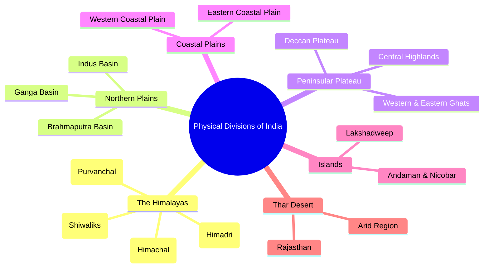
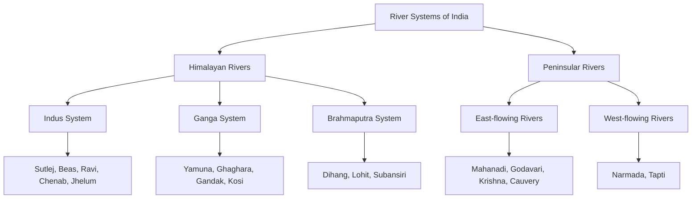
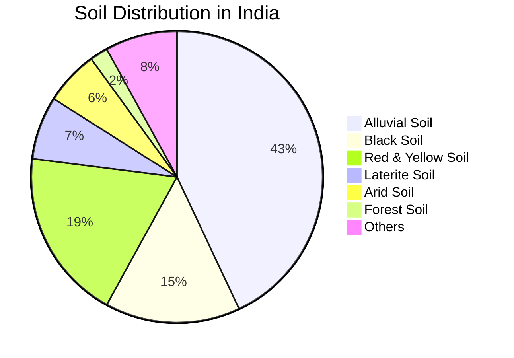

# Chapter 2: Indian Geography & Environment

## Learning Objectives

By the end of this chapter, you will be able to:

- Describe the major physical divisions of India: Himalayas, Peninsular Plateau, Coastal Plains, Islands
- Explain the Indian monsoon mechanism and seasonal climatic variations
- Identify major river systems, soil types, and natural vegetation zones
- Recall the locations and significance of national parks, wildlife sanctuaries, and biosphere reserves
- Analyse India's agricultural patterns, mineral resources, and energy infrastructure
- Understand environmental issues, biodiversity conservation, and climate change challenges
- Solve exam-level MCQs on Indian Geography confidently

---

## Theory

### 2.1 India — Physical Overview

India is the seventh-largest country in the world by area (3.287 million sq km) and the second-most populous (over 1.4 billion). It lies entirely in the Northern Hemisphere, extending from 8°4'N to 37°6'N latitude and 68°7'E to 97°25'E longitude.

**Physical Divisions:**



### 2.2 The Himalayas

The Himalayan mountain range stretches 2,500 km from the Indus River in the west to the Brahmaputra River in the east. It consists of three parallel ranges:

| Range | Average Height | Key Peaks | Features |
|-------|---------------|-----------|----------|
| Himadri (Greater Himalayas) | 6,000+ m | Mt. Everest (8,848m), Kanchenjunga (8,586m), Nanga Parbat, Nanda Devi | Perpetual snow, glaciers (Gangotri, Siachen) |
| Himachal (Lesser Himalayas) | 3,700–4,500 m | Pir Panjal, Dhaula Dhar, Mahabharat Range | Hill stations (Shimla, Mussoorie, Nainital) |
| Shiwaliks (Outer Himalayas) | 900–1,200 m | Jammu hills, Darjeeling hills | Foothills, Doons (valleys) |

**Important Himalayan Passes:**

| Pass | State | Significance |
|------|-------|-------------|
| Zoji La | Ladakh | Connects Srinagar to Leh |
| Nathu La | Sikkim | India-China border trade |
| Shipki La | Himachal Pradesh | Ancient trade route to Tibet |
| Rohtang | Himachal Pradesh | Manali to Leh highway |
| Khardung La | Ladakh | Highest motorable road |

### 2.3 The Peninsular Plateau

The Peninsular Plateau is the oldest landmass of India (part of Gondwanaland). It is composed of igneous and metamorphic rocks.

**Divisions:**

| Region | Location | Key Features |
|--------|----------|--------------|
| Central Highlands | North of Narmada River | Aravalli Range, Vindhyan Range, Malwa Plateau |
| Deccan Plateau | South of Narmada River | 600–900m elevation, slopes eastwards |
| Western Ghats | West coast (Sahyadri) | Anamudi (2,695m — highest south of Himalayas), UNESCO World Heritage |
| Eastern Ghats | East coast | Lower than Western Ghats, broken ranges |

**Difference — Western vs Eastern Ghats:**

| Feature | Western Ghats | Eastern Ghats |
|---------|---------------|---------------|
| Elevation | Higher (900–1,600m) | Lower (600–900m) |
| Continuity | Continuous | Discontinuous |
| Rivers | Few rivers flow westwards | Major rivers flow eastwards |
| Biodiversity | Very high (Western Ghats hotspot) | Moderate |
| Highest Peak | Anamudi (2,695m) | Jindhagada (1,690m) |

### 2.4 River Systems of India



#### 2.4.1 Himalayan Rivers

| River | Origin | Length (km) | Tributaries | Ends at |
|-------|--------|-------------|-------------|---------|
| Indus | Mansarovar (Tibet) | 3,180 (709 in India) | Zaskar, Sutlej, Beas, Ravi, Chenab, Jhelum | Arabian Sea (near Karachi) |
| Ganga | Gangotri Glacier | 2,525 | Yamuna, Ghaghara, Gandak, Kosi, Son, Gomti | Bay of Bengal (Ganga-Brahmaputra delta) |
| Brahmaputra | Chemayungdung (Tibet) | 2,900 (916 in India) | Lohit, Dibang, Subansiri, Manas, Tista | Bay of Bengal |
| Yamuna | Yamunotri Glacier | 1,376 | Chambal, Betwa, Ken, Sindh | Joins Ganga at Prayagraj |

#### 2.4.2 Peninsular Rivers

| River | Origin | Length (km) | Direction | Ends at |
|-------|--------|-------------|-----------|---------|
| Godavari | Trimbakeshwar (Nasik) | 1,465 | Eastward | Bay of Bengal |
| Krishna | Mahabaleshwar (Sahyadri) | 1,400 | Eastward | Bay of Bengal |
| Cauvery | Talakaveri (Kodagu) | 800 | Eastward | Bay of Bengal |
| Mahanadi | Sihawa (Chhattisgarh) | 858 | Eastward | Bay of Bengal |
| Narmada | Amarkantak (Madhya Pradesh) | 1,312 | Westward | Arabian Sea (Gulf of Khambhat) |
| Tapti | Multai (Betul, MP) | 724 | Westward | Arabian Sea |

**Key Fact:** Godavari is the largest peninsular river and the second-longest river in India after the Ganga. It is called the "Dakshin Ganga" (Ganga of the South).

### 2.5 Climate — The Indian Monsoon

```mermaid
flowchart TD
    A[Indian Monsoon Mechanism] --> B[Summer]
    A --> C[Winter]
    B --> D[Intense heating of Tibetan Plateau]
    D --> E[Low pressure over N India]
    E --> F[ITCZ moves northwards]
    F --> G[SW Monsoon winds from Indian Ocean]
    G --> H[Two branches]
    H --> H1[Arabian Sea Branch]
    H --> H2[Bay of Bengal Branch]
    H1 --> I[Western Ghats -> N India -> Punjab]
    H2 --> J[NE India -> Ganga Plains -> merges with Arabian]
    C --> K[High pressure over Tibet]
    K --> L[NE Monsoon winds]
    L --> M[Retreating Monsoon]
    M --> N[Rainfall over SE coast (Tamil Nadu)]
```

#### 2.5.1 Seasons in India

| Season | Months | Characteristics |
|--------|--------|-----------------|
| Winter | December–February | NE trade winds, dry, cold |
| Summer | March–May | Increasing temperature, low pressure, heat waves |
| SW Monsoon | June–September | Principal rainy season, 75% of annual rainfall |
| Retreating Monsoon | October–November | Cyclones in Bay of Bengal, NE monsoon rain in Tamil Nadu |

**Climatic Regions of India (Köppen Classification):**

| Region | Climate Type | States |
|--------|-------------|--------|
| Tropical Wet | Am/Aw | Western Ghats, NE India, Andaman |
| Tropical Dry | BSh | Rajasthan, Gujarat, Deccan interior |
| Subtropical Humid | Cwa | Ganga plains, Central India |
| Mountain | E | Himalayas, North-east |

### 2.6 Soils of India



| Soil Type | Area | Characteristics | Crops | Found in |
|-----------|------|-----------------|-------|----------|
| Alluvial | 43% of India | Most fertile, rich in potash & lime | Rice, wheat, sugarcane, cotton | Northern plains, river valleys |
| Black (Regur) | 15% | Clayey, moisture-retentive, self-ploughing | Cotton, sugarcane, groundnut | Maharashtra, Gujarat, MP |
| Red & Yellow | 19% | Sandy, porous, low fertility | Millets, pulses, groundnut | TN, Karnataka, Odisha, Jharkhand |
| Laterite | 7% | Leached, acidic, rich in iron oxide | Tea, coffee, cashew | Western Ghats, NE states |
| Arid/Desert | 6% | Sandy, saline, low organic matter | Drought-resistant crops | Rajasthan, Gujarat |

### 2.7 Natural Vegetation & Forests

**Forest Types (India State of Forest Report 2023):**
- Total forest cover: 7,15,343 sq km (21.76% of geographical area)
- Very dense forest: 3.04%, Moderately dense: 9.33%, Open forest: 9.39%

| Type | Annual Rainfall | States | Key Species |
|------|----------------|--------|-------------|
| Tropical Evergreen | 200+ cm | NE states, Western Ghats | Rosewood, Mahogany, Ebony |
| Tropical Deciduous (Monsoon) | 100–200 cm | Most of India | Teak, Sal, Sandalwood |
| Tropical Thorn | 50–100 cm | Rajasthan, Gujarat | Acacia, Cactus |
| Montane | Variable | Himalayas | Oak, Pine, Deodar, Rhododendron |
| Mangrove | Tidal | Sunderbans, Andaman | Sundari, Avicennia |

### 2.8 National Parks, Wildlife Sanctuaries & Biosphere Reserves

**Important National Parks:**

| Park | State | Famous For |
|------|-------|------------|
| Jim Corbett | Uttarakhand | First NP (1936), Bengal Tiger |
| Kaziranga | Assam | One-horned rhinoceros (UNESCO World Heritage) |
| Sunderbans | West Bengal | Royal Bengal Tiger (UNESCO World Heritage) |
| Ranthambore | Rajasthan | Tiger reserve, historical fort |
| Kanha | Madhya Pradesh | Tiger, Barasingha (swamp deer) |
| Gir | Gujarat | Asiatic Lion (only habitat) |
| Periyar | Kerala | Elephant reserve, tiger |
| Bandipur | Karnataka | Tiger, elephant, biosphere reserve |

**Tiger Reserves of India:** India has 54 tiger reserves under Project Tiger (launched 1973). As of 2024, India has ~3,700 tigers (75% of world's wild tiger population).

**Biosphere Reserves:**

| Reserve | State | UNESCO Recognition |
|---------|-------|-------------------|
| Nilgiri | TN, Kerala, Karnataka | Yes (first in India, 2000) |
| Sunderbans | West Bengal | Yes |
| Gulf of Mannar | Tamil Nadu | Yes |
| Nanda Devi | Uttarakhand | Yes |
| Simlipal | Odisha | Yes |
| Pachmarhi | Madhya Pradesh | Yes |

### 2.9 Agriculture & Irrigation

**Cropping Seasons:**

| Season | Months | Crops | States |
|--------|--------|-------|--------|
| Kharif | June–October | Rice, millets, cotton, sugarcane | All India (monsoon-dependent) |
| Rabi | October–March | Wheat, barley, mustard, peas | N & NW India (requires irrigation) |
| Zaid | March–June | Watermelon, cucumber, vegetables | Summer crops between seasons |

**Major Crops:**

| Crop | Largest Producer State | Conditions |
|------|-----------------------|------------|
| Rice | West Bengal | 25°C+, 150+ cm rainfall |
| Wheat | Uttar Pradesh | Cool climate, well-drained loamy soil |
| Sugarcane | Uttar Pradesh | Tropical/subtropical, 21–27°C |
| Cotton | Gujarat | Black soil, 21–32°C, 6 months frost-free |
| Tea | Assam | Tropical, well-drained acidic soil, 20–30°C |
| Coffee | Karnataka | Shade-grown, 15–28°C, 150–250 cm rainfall |
| Jute | West Bengal | Hot & humid, alluvial soil |

**Green Revolution (1960s):**
- Led by Dr. M.S. Swaminathan and Norman Borlaug
- Focused on wheat and rice (HYV seeds, fertilizers, irrigation)
- Made India self-sufficient in food grains (from net importer to exporter)

### 2.10 Minerals & Energy Resources

| Mineral | Largest Producer | Major States |
|---------|-----------------|--------------|
| Iron Ore | Odisha | Odisha, Jharkhand, Chhattisgarh |
| Coal | Jharkhand | Jharia, Raniganj, Bokaro |
| Petroleum | Rajasthan | Rajasthan (Barmer), Gujarat, Assam |
| Natural Gas | Maharashtra | Mumbai High, KG Basin |
| Bauxite | Odisha | Odisha, Gujarat, Jharkhand |
| Copper | Madhya Pradesh | Malanjkhand (MP), Rajasthan |
| Gold | Karnataka | Kolar Gold Fields, Hutti Mines |

**Energy:** India is the third-largest energy consumer in the world. Renewable energy capacity (2024): 180+ GW (4th globally). Solar (70 GW), Wind (45 GW), Hydropower (47 GW).

### 2.11 Population Geography

- India's population (2024): ~1.44 billion
- Population density (2011 Census): 382 persons/sq km
- Highest density: Bihar (1,106), lowest: Arunachal Pradesh (17)
- Literacy rate (2011): 74.04% (male 82.14%, female 65.46%)
- Sex ratio (2011): 943 females per 1,000 males
- Most populous state: Uttar Pradesh (200M+), least: Sikkim (~700K)

### 2.12 Environment, Biodiversity & Conservation

**Key Environmental Issues:**
- Air pollution: 22 of world's 30 most polluted cities are in India (IQAir 2024)
- Water pollution: 70% of surface water is polluted (CPCB)
- Deforestation: 1.4% forest loss in ISFR 2023 report
- Climate change: Extreme weather events increased 5x since 1970

**Important Acts & Organizations:**
- Wildlife Protection Act, 1972
- Forest Conservation Act, 1980
- Environment Protection Act, 1986
- National Green Tribunal (NGT) — established 2010
- Project Tiger (1973), Project Elephant (1992), Project Rhino
- ICUN Red List categories: Extinct → Extinct in Wild → Critically Endangered → Endangered → Vulnerable → Near Threatened → Least Concern

---

## Examples with Solved Exercises

### Example 1: Climate Data Analyzer (TypeScript)

```typescript
// TypeScript climate data simulator for Indian geography MCQs
interface ClimateStation {
  city: string;
  state: string;
  avgTempC: number;
  annualRainfallMM: number;
  climateType: string;
}

class GeographyQuizEngine {
  private stations: ClimateStation[] = [
    { city: 'Mawsynram', state: 'Meghalaya', avgTempC: 17, annualRainfallMM: 11872, climateType: 'Tropical Wet' },
    { city: 'Jaisalmer', state: 'Rajasthan', avgTempC: 27, annualRainfallMM: 184, climateType: 'Arid' },
    { city: 'Chennai', state: 'Tamil Nadu', avgTempC: 29, annualRainfallMM: 1400, climateType: 'Tropical Wet and Dry' },
    { city: 'Shimla', state: 'Himachal Pradesh', avgTempC: 14, annualRainfallMM: 1520, climateType: 'Subtropical Humid' },
    { city: 'Thiruvananthapuram', state: 'Kerala', avgTempC: 27, annualRainfallMM: 3100, climateType: 'Tropical Wet' },
  ];

  findWettestPlace(): ClimateStation {
    return this.stations.reduce((max, s) => s.annualRainfallMM > max.annualRainfallMM ? s : max);
  }

  findDriestPlace(): ClimateStation {
    return this.stations.reduce((min, s) => s.annualRainfallMM < min.annualRainfallMM ? s : min);
  }

  getStationByCity(city: string): ClimateStation | undefined {
    return this.stations.find(s => s.city.toLowerCase() === city.toLowerCase());
  }

  filterByClimate(climateType: string): ClimateStation[] {
    return this.stations.filter(s => s.climateType.toLowerCase().includes(climateType.toLowerCase()));
  }
}

// Demo
const geoEngine = new GeographyQuizEngine();
console.log('Wettest place:', geoEngine.findWettestPlace().city, '—', geoEngine.findWettestPlace().annualRainfallMM, 'mm');
console.log('Driest place:', geoEngine.findDriestPlace().city, '—', geoEngine.findDriestPlace().annualRainfallMM, 'mm');
console.log('Tropical Wet stations:', geoEngine.filterByClimate('Tropical Wet').length);
```

**Output:**
```
Wettest place: Mawsynram — 11872 mm
Driest place: Jaisalmer — 184 mm
Tropical Wet stations: 2
```

---

**Q1 (Exam Style):** Which is the wettest place in India?

A) Cherrapunji
B) Mawsynram
C) Agumbe
D) Mahabaleshwar

<details>
<summary>Answer</summary>
**Answer: B) Mawsynram**

Mawsynram (Meghalaya) receives an average annual rainfall of 11,872 mm, making it the wettest place in India and also the wettest place in the world. Cherrapunji (also in Meghalaya) receives about 11,430 mm annually.
</details>

---

**Q2:** The Himalayas act as a climatic barrier. Which of the following is NOT an effect of the Himalayas on Indian climate?

A) They prevent cold winds from Central Asia
B) They cause the SW monsoons to deposit rainfall in northern India
C) They cause the Thar Desert to form
D) They completely block the NE monsoon

<details>
<summary>Answer</summary>
**Answer: C) They cause the Thar Desert to form**

The Thar Desert is caused by the Aravalli range running parallel to the monsoon winds, not by the Himalayas. The Himalayas do: (a) block cold Central Asian winds, (b) force monsoon winds to rise and deposit rain, and (d) partially block the NE monsoon.
</details>

---

**Q3:** Which river is known as the "Dakshin Ganga" (Ganga of the South)?

A) Krishna
B) Godavari
C) Cauvery
D) Mahanadi

<details>
<summary>Answer</summary>
**Answer: B) Godavari**

Godavari is the largest peninsular river (1,465 km). It originates from Trimbakeshwar, Nasik and flows eastwards to the Bay of Bengal. It is called Dakshin Ganga because of its length, basin size, and cultural significance.
</details>

---

**Q4:** Black soil (Regur soil) is most suitable for which crop?

A) Rice
B) Tea
C) Cotton
D) Wheat

<details>
<summary>Answer</summary>
**Answer: C) Cotton**

Black soil (also called Regur or cotton soil) is ideal for cotton cultivation due to its moisture-retentive nature, self-ploughing property, and richness in calcium carbonate, potash, and lime. It covers most of the Deccan Plateau.
</details>

---

**Q5:** Which of the following is the only habitat of the Asiatic Lion in the wild?

A) Sunderbans National Park
B) Jim Corbett National Park
C) Gir National Park
D) Kaziranga National Park

<details>
<summary>Answer</summary>
**Answer: C) Gir National Park**

Gir Forest National Park (Gujarat) is the only natural habitat of the Asiatic Lion (Panthera leo persica). As of 2020 census, there are approximately 674 Asiatic lions in Gir.
</details>

---

**Q6:** Which state in India has the highest population density according to the 2011 Census?

A) Uttar Pradesh
B) West Bengal
C) Bihar
D) Kerala

<details>
<summary>Answer</summary>
**Answer: C) Bihar**

Bihar has the highest population density of 1,106 persons per sq km. West Bengal is second (1,029), followed by Kerala (859). The national average is 382 persons per sq km.
</details>

---

**Q7:** The Chilika Lake, the largest brackish water lagoon in India, is located in which state?

A) Andhra Pradesh
B) Tamil Nadu
C) Odisha
D) West Bengal

<details>
<summary>Answer</summary>
**Answer: C) Odisha**

Chilika Lake (largest coastal lagoon in India and second-largest in the world) is located in Odisha. It is a Ramsar site and a major wintering ground for migratory birds.
</details>

---

**Q8:** Which type of forest is most widespread in India?

A) Tropical Evergreen
B) Tropical Deciduous (Monsoon)
C) Tropical Thorn
D) Mangrove

<details>
<summary>Answer</summary>
**Answer: B) Tropical Deciduous (Monsoon)**

Tropical Deciduous forests (also called Monsoon forests) cover about 65% of India's forested area. They are found in regions receiving 100–200 cm rainfall and include valuable species like teak, sal, and sandalwood.
</details>

---

**Q9:** The Kharif cropping season begins in which month?

A) March
B) June
C) October
D) January

<details>
<summary>Answer</summary>
**Answer: B) June**

Kharif crops are sown with the onset of the SW monsoon in June and harvested in September-October. Major Kharif crops include rice, maize, jowar, bajra, cotton, and sugarcane.
</details>

---

**Q10:** Which is the longest river flowing entirely within India?

A) Ganga
B) Godavari
C) Indus
D) Brahmaputra

<details>
<summary>Answer</summary>
**Answer: A) Ganga**

The Ganga (2,525 km) is the longest river flowing entirely within India. The Indus flows primarily through Pakistan, the Brahmaputra enters from Tibet, and the Godavari is the longest peninsular river but shorter than the Ganga.
</details>

---

**Q11:** The Western Ghats were declared a UNESCO World Heritage Site in which year?

A) 2000
B) 2010
C) 2012
D) 2016

<details>
<summary>Answer</summary>
**Answer: C) 2012**

The Western Ghats (Sahyadri) were declared a UNESCO World Heritage Site in 2012. They are one of the world's eight "hottest hotspots" of biological diversity, home to over 7,400 species of flowering plants and 139 mammal species.
</details>

---

**Q12:** Which of the following states has the highest percentage of forest cover?

A) Madhya Pradesh
B) Arunachal Pradesh
C) Chhattisgarh
D) Mizoram

<details>
<summary>Answer</summary>
**Answer: D) Mizoram**

By percentage of geographical area, Mizoram has the highest forest cover at approximately 85% (ISFR 2023). By total forest area, Madhya Pradesh has the largest (77,000+ sq km), followed by Arunachal Pradesh and Chhattisgarh.
</details>

---

**Q13:** The "Mumbai High" is known for:

A) Gold deposits
B) Petroleum and natural gas reserves
C) Iron ore mines
D) Diamond extraction

<details>
<summary>Answer</summary>
**Answer: B) Petroleum and natural gas reserves**

Mumbai High (Bombay High) is an offshore oilfield located 160 km off the coast of Mumbai in the Arabian Sea. Discovered in 1974 by ONGC, it is India's largest offshore oil and natural gas field, contributing ~65% of India's domestic oil production.
</details>

---

**Q14:** Which is the only active volcano in India?

A) Barren Island
B) Narcondam
C) Baratang
D) Popa

<details>
<summary>Answer</summary>
**Answer: A) Barren Island**

Barren Island (Andaman & Nicobar Islands) is the only confirmed active volcano in India. It erupted most recently in 2024 (continuing from earlier eruptions). Narcondam is a dormant volcano.
</details>

---

**Q15:** The "Grand Anicut" (Kallanai Dam) is built across which river?

A) Godavari
B) Krishna
C) Cauvery
D) Mahanadi

<details>
<summary>Answer</summary>
**Answer: C) Cauvery**

The Kallanai Dam (Grand Anicut) is built across the Cauvery River in Tamil Nadu. It was built by King Karikala of the Chola dynasty in the 2nd century AD and is one of the oldest water-diversion structures still in use.
</details>

---

**Q16:** The concept of "Core" and "Buffer" zones is associated with:

A) Biodiversity parks
B) Biosphere reserves
C) Wildlife sanctuaries
D) National parks

<details>
<summary>Answer</summary>
**Answer: B) Biosphere reserves**

Biosphere reserves have a three-tier structure: Core zone (strictly protected), Buffer zone (limited human activity), and Transition zone (sustainable resource use). India has 18 biosphere reserves, with 12 recognized by UNESCO.
</details>

---

**Q17:** Which of the following is the largest producer of tea in India?

A) Kerala
B) Tamil Nadu
C) West Bengal
D) Assam

<details>
<summary>Answer</summary>
**Answer: D) Assam**

Assam is the largest tea-producing state in India, accounting for over 50% of the country's total tea production. The Assam tea is known for its strong, malty flavour and is grown in the Brahmaputra valley.
</details>

---

**Q18:** The "Sunderbans" delta is formed by which rivers?

A) Ganga and Yamuna
B) Ganga and Brahmaputra
C) Godavari and Krishna
D) Mahanadi and Brahmani

<details>
<summary>Answer</summary>
**Answer: B) Ganga and Brahmaputra**

The Sunderbans delta (the world's largest delta) is formed by the confluence of the Ganga and Brahmaputra rivers in the Bay of Bengal. It is a UNESCO World Heritage Site and home to the Royal Bengal Tiger.
</details>

---

**Q19:** In which state is the Simlipal Biosphere Reserve located?

A) Jharkhand
B) Chhattisgarh
C) Odisha
D) West Bengal

<details>
<summary>Answer</summary>
**Answer: C) Odisha**

Simlipal Biosphere Reserve is located in the Mayurbhanj district of Odisha. It is famous for the Simlipal National Park (tiger reserve), and is known for its population of melanistic tigers (black tigers).
</details>

---

**Q20:** Which Indian state shares the longest international border with China?

A) Uttarakhand
B) Himachal Pradesh
C) Ladakh (UT)
D) Arunachal Pradesh

<details>
<summary>Answer</summary>
**Answer: D) Arunachal Pradesh**

Arunachal Pradesh shares the longest international border with China (approximately 1,080 km) of the India-China border. The total India-China border is about 3,488 km across Ladakh, Uttarakhand, Himachal Pradesh, Sikkim, and Arunachal Pradesh.
</details>

---

## Summary

- India has six major physical divisions: Himalayas, Northern Plains, Peninsular Plateau, Coastal Plains, Islands, and the Thar Desert.
- The Himalayas consist of three parallel ranges: Himadri (Greater), Himachal (Lesser), and Shiwaliks (Outer).
- Major river systems are divided into Himalayan rivers (Indus, Ganga, Brahmaputra) and Peninsular rivers (Godavari, Krishna, Cauvery, Mahanadi, Narmada, Tapti).
- The Indian Monsoon is driven by seasonal reversal of winds due to differential heating of land and sea, with SW Monsoon bringing 75% of annual rainfall.
- Soils: Alluvial (43% — most fertile), Black (15% — cotton soil), Red/Yellow (19%), Laterite (7%).
- India's forest cover is 21.76% of total area, with Tropical Deciduous forests being the most prevalent type.
- Major conservation initiatives: Project Tiger (1973), Project Elephant (1992), 54 tiger reserves, 18 biosphere reserves.
- India ranks 4th globally in renewable energy capacity with 180+ GW installed.
- The population density is highest in Bihar (1,106/sq km) and lowest in Arunachal Pradesh (17/sq km).
- Key environmental challenges: air and water pollution, deforestation, and climate change-induced extreme weather events.

## Practical Takeaways

1. **For Exam Preparation:** Focus on river origins and tributaries — this is the most frequently tested geography topic in IBPS SO and RBI exams.
2. **Soil-Crop Linkage:** Remember the crop-to-soil mapping: Cotton ↔ Black soil, Rice ↔ Alluvial, Tea ↔ Laterite (acidic).
3. **National Park Trick:** Use acronym "KGRS" for tiger reserves — Kanha, Gir, Ranthambore, Sunderbans — memorise which state each is in.
4. **Monsoon Mechanism:** Understand the ITCZ movement. Questions on "Why does Tamil Nadu get rain in winter?" (NE Monsoon) appear very frequently.
5. **NR Intersection:** Environment and current affairs often intersect — know the COP summits, India's climate targets (Net Zero by 2070, 500 GW renewable by 2030).
6. **Map Work:** Practice locating all national parks and tiger reserves on a map. Online interactive map quizzes are helpful for this.
7. **Biosphere Reserve Mnemonic:** "Nilgiri Sunderbans Nanda Gulf Simlipal" — these are the five oldest biosphere reserves.

## Chapter Quiz

**Q1:** Which river originates from the Gangotri Glacier?

A) Yamuna
B) Ganga
C) Brahmaputra
D) Indus

<details>
<summary>Answer</summary>
**Answer: B) Ganga**

The Ganga originates from the Gangotri Glacier in the Uttarakhand Himalayas at Gomukh (4,100m elevation). The Yamuna originates from Yamunotri Glacier, and the Indus from Mansarovar Lake in Tibet.
</details>

**Q2:** Which type of soil is formed due to the leaching process in heavy rainfall areas?

A) Alluvial soil
B) Black soil
C) Laterite soil
D) Arid soil

<details>
<summary>Answer</summary>
**Answer: C) Laterite soil**

Laterite soil forms in areas of high temperature and heavy rainfall (over 200 cm). The heavy rain leaches (washes away) silica and alkalis, leaving behind iron and aluminium oxides, giving the soil its red colour.
</details>

**Q3:** The project to protect the one-horned rhinoceros is named:

A) Project Tiger
B) Project Elephant
C) Project Rhino
D) Project Hangul

<details>
<summary>Answer</summary>
**Answer: C) Project Rhino**

Project Rhino (also called Indian Rhino Vision) was launched for the conservation of the Greater One-Horned Rhinoceros found in Assam (Kaziranga, Manas, Pobitora) and West Bengal (Jaldapara, Gorumara).
</details>

**Q4:** The "Mahanadi" river originates from which state?

A) Madhya Pradesh
B) Chhattisgarh
C) Odisha
D) Jharkhand

<details>
<summary>Answer</summary>
**Answer: B) Chhattisgarh**

The Mahanadi river originates from the Sihawa range in the Dhamtari district of Chhattisgarh. It flows through Chhattisgarh and Odisha before emptying into the Bay of Bengal near Paradip.
</details>

**Q5:** Which is the highest peak in the Western Ghats?

A) Kalsubai
B) Anamudi
C) Doddabetta
D) Mahabaleshwar

<details>
<summary>Answer</summary>
**Answer: B) Anamudi**

Anamudi (2,695 m) is the highest peak in the Western Ghats, located in Kerala's Eravikulam National Park. It is also the highest peak in South India. Doddabetta (2,637 m) is the highest peak in Tamil Nadu.
</details>

---

## Exercises (30 Practice Questions)

### Section A: Multiple Choice Questions

**1.** The "Pir Panjal" is a range of the:
A) Greater Himalayas
B) Lesser Himalayas
C) Outer Himalayas
D) Purvanchal

**2.** Which of the following is the longest river in the Peninsular India?
A) Krishna
B) Godavari
C) Mahanadi
D) Cauvery

**3.** Approximately what percentage of India's total geographical area is forest cover (ISFR 2023)?
A) 15%
B) 21.76%
C) 25%
D) 30%

**4.** The highest mountain peak in India (within Indian territory) is:
A) Mt. Everest
B) Kanchenjunga
C) Nanga Parbat
D) K2

**5.** Which soil type covers the maximum area of India?
A) Red soil
B) Black soil
C) Alluvial soil
D) Laterite soil

**6.** "Project Tiger" was launched in which year?
A) 1970
B) 1972
C) 1973
D) 1975

**7.** Which of the following states is the largest producer of sugar cane?
A) Maharashtra
B) Uttar Pradesh
C) Tamil Nadu
D) Karnataka

**8.** The "Silent Valley" National Park is located in which state?
A) Karnataka
B) Tamil Nadu
C) Kerala
D) Andhra Pradesh

**9.** Which is the largest saltwater lake in India?
A) Chilika Lake
B) Sambhar Lake
C) Pulicat Lake
D) Loktak Lake

**10.** The "NE Monsoon" brings rainfall primarily to:
A) Kerala
B) Tamil Nadu
C) Maharashtra
D) West Bengal

**11.** The "Aravalli" mountain range is an example of:
A) Fold mountains
B) Block mountains
C) Residual mountains
D) Volcanic mountains

**12.** Which river flows through the "rift valley" between Vindhyas and Satpuras?
A) Tapti
B) Narmada
C) Godavari
D) Mahanadi

**13.** The "Kaziranga" National Park is located on the banks of which river?
A) Brahmaputra
B) Ganga
C) Godavari
D) Subansiri

**14.** Which of the following is NOT a biosphere reserve in India?
A) Nilgiri
B) Sunderbans
C) Periyar
D) Gulf of Mannar

**15.** The "Rabi" crop season extends from:
A) June to October
B) October to March
C) March to June
D) January to April

### Section B: Fill in the Blanks

**16.** The highest peak in India (under Indian administration) is __________.

**17.** __________ is the largest state in India by area.

**18.** The __________ river is known as the "Sorrow of Bihar".

**19.** __________ is the oldest mountain range in India.

**20.** The __________ dam is the highest dam in India.

**21.** The __________ is the largest state by forest cover in India.

**22.** __________ Lake in Manipur is the largest freshwater lake in Northeast India.

**23.** The Tehri Dam is built on the __________ river.

**24.** __________ is known as the "Sugar Bowl" of India.

**25.** The __________ Pass connects Srinagar to Leh.

### Section C: True/False

**26.** The Tropic of Cancer passes through the middle of India. (T/F)

**27.** The Eastern Ghats are higher than the Western Ghats. (T/F)

**28.** Mawsynram receives the highest rainfall in India. (T/F)

**29.** The Cauvery river dispute involves Karnataka and Tamil Nadu. (T/F)

**30.** India has the largest number of tigers in the world. (T/F)

---

<details>
<summary>Answer Key</summary>

**Section A (1-15):**
1. B) Lesser Himalayas (Himachal)
2. B) Godavari
3. B) 21.76%
4. B) Kanchenjunga (8,586m — shared with Nepal but peak is within Indian territory)
5. C) Alluvial soil
6. C) 1973
7. B) Uttar Pradesh
8. C) Kerala
9. A) Chilika Lake (Odisha)
10. B) Tamil Nadu
11. C) Residual mountains (folded remnants of ancient ranges)
12. B) Narmada
13. A) Brahmaputra
14. C) Periyar (it is a National Park/Tiger Reserve, not a Biosphere Reserve)
15. B) October to March

**Section B (16-25):**
16. Kanchenjunga
17. Rajasthan
18. Kosi
19. Aravalli
20. Tehri (on Bhagirathi river, Uttarakhand)
21. Madhya Pradesh
22. Loktak
23. Bhagirathi
24. Uttar Pradesh
25. Zoji La

**Section C (26-30):**
26. T
27. F (Western Ghats are higher)
28. T
29. T
30. T (India has ~3,700 of the world's ~5,500 wild tigers)
</details>

---

*Proceed to Chapter 3 — Indian History & Culture*
