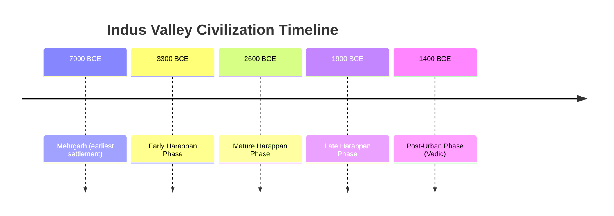
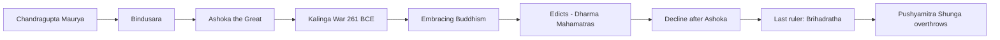
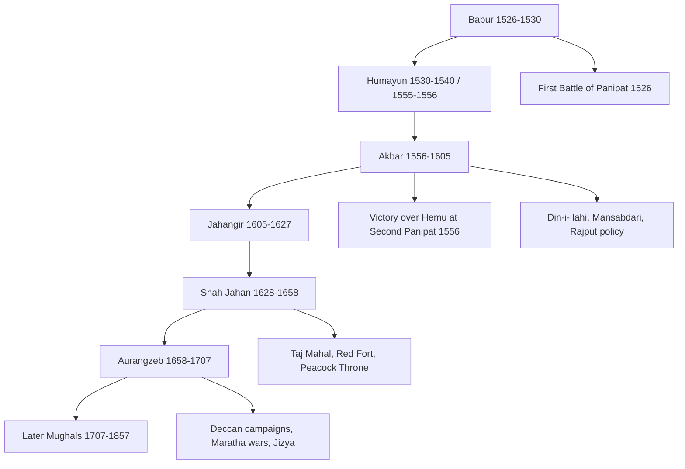
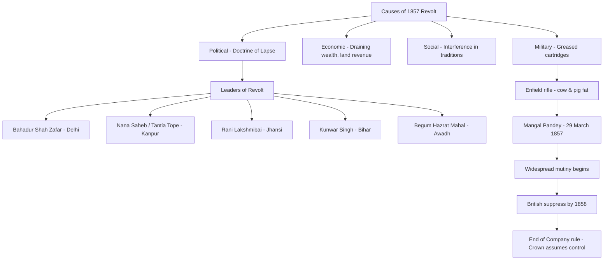
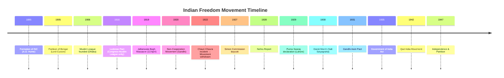

# Chapter 3: Indian History & Culture

## Learning Objectives

By the end of this chapter, you will be able to:

- Describe the Harappan Civilization and Vedic period with key features
- Trace the rise and fall of major ancient empires — Maurya and Gupta
- Explain the Delhi Sultanate, Mughal Empire, and Vijayanagara Kingdom
- Analyse the British colonial period, the Revolt of 1857, and the freedom struggle
- Identify key figures, dates, and events in India's struggle for independence
- Recall India's cultural heritage: classical dances, music, paintings, UNESCO sites
- Solve exam-level MCQs on Indian History with confidence

---

## Theory

### 3.1 Ancient India

#### 3.1.1 Indus Valley Civilization (c. 2500–1750 BCE)

Also known as the Harappan Civilization, it was one of the world's earliest urban civilizations, contemporary with Mesopotamia and Egypt.



**Key Facts:**

| Aspect | Detail |
|--------|--------|
| Major Sites | Harappa (Punjab, Pakistan), Mohenjo-Daro (Sindh), Dholavira (Gujarat), Lothal (Gujarat), Rakhigarhi (Haryana), Kalibangan (Rajasthan) |
| Town Planning | Grid system, burnt brick houses, covered drainage, Great Bath (Mohenjo-Daro) |
| Economy | Agriculture (wheat, barley), trade with Mesopotamia, seals, beads |
| Script | Not yet deciphered (pictographic, 400+ symbols) |
| Religion | Mother Goddess, Pashupati (Proto-Shiva), nature worship, no temples |
| Decline | Hypotheses: Aryan invasion, climate change, floods, river drying |

**Dholavira:** Unique for its water management system and large inscriptions. Located in the Rann of Kutch, Gujarat. Only Harappan city with a stadium.

#### 3.1.2 Vedic Period (c. 1500–600 BCE)

| Period | Literature | Society | Key Development |
|--------|-----------|---------|-----------------|
| Early Vedic (1500–1000 BCE) | Rigveda | Tribal, pastoral, egalitarian | 4 varnas in nascent form, rajan (chief) |
| Later Vedic (1000–600 BCE) | Yajur, Sama, Atharva Veda + Brahmanas | Territorial kingdoms (Janapadas), agriculture | Caste system becomes rigid, Varna → Jati |

**Important Vedic Texts:**
- **Rigveda:** Oldest, 1028 hymns, composed in praise of gods (Indra, Agni, Varuna, Surya)
- **Samaveda:** Melodies and chants
- **Yajurveda:** Ritual formulas
- **Atharvaveda:** Magic spells, medicine
- **Upanishads:** Philosophical treatises (108 total), core of Vedanta philosophy

**Key Terms:**
- Janapadas: Tribal kingdoms of Later Vedic period
- Sabha & Samiti: Tribal assemblies
- Sapta-Sindhu: Land of seven rivers (region of the Rigveda)

#### 3.1.3 Mahajanapadas & Religious Movements (600–320 BCE)

16 Mahajanapadas existed by 600 BCE. Two major religious movements emerged:
- **Buddhism** (Gautama Buddha, 563–483 BCE): Four Noble Truths, Eightfold Path, Middle Path
- **Jainism** (Mahavira, 540–468 BCE): Ahimsa, Anekantavada, Aparigraha, Triratnas

| Detail | Buddhism | Jainism |
|--------|----------|---------|
| Founder | Siddhartha Gautama (Buddha) | Vardhamana Mahavira |
| Birthplace | Lumbini (Nepal) | Kundagrama (Vaishali, Bihar) |
| Nirvana/Death | Kushinagar | Pavapuri (Bihar) |
| First Sermon | Sarnath | — |
| Sacred Texts | Tripitaka (Vinaya, Sutta, Abhidhamma) | Agamas, Angas |
| Key Teachings | Four Noble Truths, Eightfold Path | Ahimsa, Anekantavada, Aparigraha |
| Follower Spread | Sri Lanka, China, Japan, SEA | Gujarat, Rajasthan, Karnataka |

#### 3.1.4 Mauryan Empire (322–185 BCE)



**Important Facts:**
- **Chandragupta Maurya:** Founded empire with Chanakya (Kautilya) — author of *Arthashastra*
- **Ashoka (268–232 BCE):** Greatest Mauryan ruler; Kalinga War led to conversion to Buddhism
- **Ashokan Edicts:** 33 inscriptions in Prakrit, Greek, Aramaic (Brahmi and Kharosthi scripts)
- **Administration:** Centralized with provinces, district officials (Pradeshikas), spies
- **Economic:** State controlled agriculture, trade, mining; roads (Uttarapatha, Dakshinapatha)

#### 3.1.5 Gupta Period (c. 320–550 CE) — The Golden Age

| Ruler | Reign | Contribution |
|-------|-------|-------------|
| Sri Gupta | 240–280 CE | Founded Gupta dynasty |
| Chandragupta I | 320–335 CE | Started Gupta era (319-320 CE) |
| Samudragupta | 335–375 CE | "Napoleon of India", patron of arts |
| Chandragupta II (Vikramaditya) | 375–415 CE | Golden Age peak; Chinese pilgrim Fa-Hien visited |
| Kumaragupta I | 415–455 CE | Built Nalanda University |
| Skandagupta | 455–467 CE | Fought Huns |

**Achievements of Gupta Period:**
- **Science:** Aryabhata (mathematics, astronomy), Varahamihira, Sushruta (medicine), Charaka
- **Literature:** Kalidasa (Abhijnana Shakuntala, Meghaduta), Vishakhadatta, Shudraka
- **Art & Architecture:** Ajanta Ellora caves (first phase), Dashavatara Temple (Deogarh)
- **Nalanda University:** World's oldest residential university (founded 5th century CE)
- **Economic:** Extensive trade with Roman Empire, Southeast Asia; gold coins (Dinara)

### 3.2 Medieval India

#### 3.2.1 Delhi Sultanate (1206–1526 CE)

| Dynasty | Period | Founder | Key Ruler |
|---------|--------|---------|-----------|
| Slave (Mamluk) | 1206–1290 | Qutb-ud-din Aibak | Iltutmish (1236), Razia Sultana (first woman ruler) |
| Khilji | 1290–1320 | Jalal-ud-din Khilji | Alauddin Khilji (market reforms, Malik Kafur) |
| Tughlaq | 1320–1414 | Ghiyas-ud-din Tughlaq | Muhammad bin Tughlaq (token currency, capital shift) |
| Sayyid | 1414–1451 | Khizr Khan | Weak rulers, decline |
| Lodi | 1451–1526 | Bahlul Lodi | Ibrahim Lodi (defeated by Babur at Panipat) |

**Key Developments:**
- Qutb Minar built by Qutb-ud-din Aibak (completed by Iltutmish)
- Alauddin Khilji's market price control system
- Muhammad bin Tughlaq's experiments: capital transfer (Delhi to Daulatabad), token currency
- Vijayanagara Empire (1336–1646): Founded by Harihara and Bukka (Sangama dynasty)
- Bahmani Kingdom (1347–1527): First independent Muslim kingdom in Deccan

#### 3.2.2 Mughal Empire (1526–1857)



| Mughal Emperor | Reign | Key Contribution |
|----------------|-------|------------------|
| Babur | 1526–1530 | Founded Mughal rule; defeated Ibrahim Lodi (Panipat 1526) and Rana Sanga (Khanwa 1527) |
| Humayun | 1530–1556 | Lost empire to Sher Shah Suri; regained with Persian help |
| Akbar | 1556–1605 | Greatest Mughal; Mansabdari system, Din-i-Ilahi, Rajput alliance, Fatehpur Sikri, abolition of Jizya |
| Jahangir | 1605–1627 | Captivity of Guru Arjan Dev; visited by Sir Thomas Roe (English ambassador) |
| Shah Jahan | 1628–1658 | Taj Mahal (built 1632–1653), Red Fort, Jama Masjid, Peacock Throne |
| Aurangzeb | 1658–1707 | Expanded Mughal empire to its largest; reimposed Jizya, Deccan wars with Marathas; executed Guru Tegh Bahadur |

**Important Battles:**

| Battle | Year | Fought Between | Result |
|--------|------|----------------|--------|
| First Panipat | 1526 | Babur vs Ibrahim Lodi | Babur won → foundation of Mughal Empire |
| Battle of Khanwa | 1527 | Babur vs Rana Sanga | Babur won → secured Rajput submission |
| Second Panipat | 1556 | Akbar (Bairam Khan) vs Hemu | Akbar won → consolidated Mughal rule |
| Haldighati | 1576 | Akbar (Man Singh) vs Maharana Pratap | Mughals won but Pratap continued resistance |
| Plassey | 1757 | British (Clive) vs Siraj-ud-Daulah | British won → colonial era begins |

**Cultural Achievements of Mughals:**
- Akbar: Ibadat Khana (House of Worship), translation of Hindu texts
- Jahangir: Mughal painting peak, Tuzuk-i-Jahangiri (autobiography)
- Shah Jahan: Taj Mahal, Moti Masjid, Jama Masjid, Red Fort
- Architecture: Indo-Islamic fusion — domes, arches, minarets, gardens (Charbagh)

#### 3.2.3 Maratha Empire (1674–1818)

| Leader | Period | Contribution |
|--------|--------|-------------|
| Shivaji | 1627–1680 | Founded Maratha kingdom; coronation at Raigad (1674); Ashta Pradhan council |
| Sambhaji | 1680–1689 | Executed by Aurangzeb |
| Baji Rao I | 1720–1740 | Expanded Maratha power to North India |
| Third Battle of Panipat | 1761 | Marathas defeated by Ahmad Shah Abdali |
| Madhavrao | 1761–1772 | Revived Maratha power after Panipat |

### 3.3 Modern India

#### 3.3.1 British Expansion and Consolidation

| Event | Year | Details |
|-------|------|---------|
| Battle of Plassey | 1757 | Robert Clive defeated Siraj-ud-Daulah — political control of Bengal |
| Battle of Buxar | 1764 | British defeated Mir Qasim, Shuja-ud-Daulah, Shah Alam II — Diwani rights |
| Regulating Act | 1773 | First British parliamentary regulation of East India Company |
| Pitt's India Act | 1784 | Dual government system; Board of Control created |
| Charter Acts | 1813 | Ended Company's monopoly, allowed missionaries |
| | 1833 | Governor-General of India; law codification |
| Doctine of Lapse | 1848-56 | Dalhousie's policy — annexed Satara, Jhansi, Nagpur, Awadh |
| Government of India Act | 1858 | Crown takes over from Company; end of Company rule |
| Government of India Act | 1909 | Morley-Minto Reforms — separate electorates |
| Government of India Act | 1919 | Montagu-Chelmsford Reforms — Dyarchy |
| Government of India Act | 1935 | Provincial autonomy, federal structure |

#### 3.3.2 Revolt of 1857



**Causes:** Political (Doctrine of Lapse, annexation of Awadh), Economic (heavy taxation, drain of wealth), Social (interference in caste/religion), Military (greased cartridges with cow/pig fat)

**Why it Failed:** Limited geographical spread, no unified leadership, lack of modern weapons, no common ideology beyond anti-British sentiment, many Indian states/rulers remained loyal (Sikhs, Gurkhas, Scindia)

#### 3.3.3 Indian Freedom Struggle (1885–1947)



**Phases of Freedom Struggle:**

| Phase | Period | Key Features |
|-------|--------|-------------|
| Moderate Phase | 1885–1905 | Dadabhai Naoroji, Gokhale, Ranade; constitutional methods, petitions |
| Extremist Phase | 1905–1919 | Tilak, Bipin Chandra Pal, Lala Lajpat Rai (Lal-Bal-Pal); Swadeshi, Boycott |
| Gandhian Phase | 1919–1947 | Gandhi's satyagraha, non-violent mass movements |

**Key Personalities:**

| Leader | Key Contributions |
|--------|-------------------|
| **Mahatma Gandhi** | Champaran (1917), Kheda (1918), Non-Cooperation, Dandi March, Quit India |
| **Jawaharlal Nehru** | First PM, socialist vision, Panchsheel, non-alignment |
| **Subhas Chandra Bose** | INA (Azad Hind Fauj), Netaji, Indian National Army trials |
| **Bhagat Singh** | Revolutionary socialist; hanged at 23 along with Rajguru and Sukhdev |
| **Sardar Patel** | Integration of princely states (Iron Man of India) |
| **B.R. Ambedkar** | Chairman of Drafting Committee, Dalit rights, conversion to Buddhism |
| **Dadabhai Naoroji** | "Grand Old Man of India"; theory of economic drain |
| **Bal Gangadhar Tilak** | "Swaraj is my birthright"; Kesari newspaper, Home Rule League |

**Important Movements and Events:**

| Movement/Event | Year | Description |
|----------------|------|-------------|
| Partition of Bengal | 1905 | Curzon divided Bengal → Swadeshi movement |
| Swadeshi Movement | 1905–1911 | Boycott of British goods, promotion of indigenous products |
| Morley-Minto Reforms | 1909 | Separate electorates for Muslims |
| Home Rule League | 1916 | Tilak (April) & Annie Besant (September) |
| Jallianwala Bagh | 1919 | General Dyer fired on unarmed crowd (379 dead, 1,200 wounded) |
| Khilafat Movement | 1919–1924 | Ali brothers, Gandhi supported as pan-Islamic cause |
| Non-Cooperation | 1920–1922 | Boycott of courts, schools, councils; Chauri Chaura led to withdrawal |
| Simon Commission | 1927 | All-white commission; "Simon Go Back" |
| Civil Disobedience | 1930–1934 | Dandi March (12 March–6 April 1930); salt law broken |
| Quit India Movement | 1942 | "Do or Die" — mass uprising; arrested leaders |
| INA Trials | 1945 | Red Fort trials sparked mass support |
| Cabinet Mission | 1946 | Plan for united India; failed due to Muslim League |
| Partition & Independence | 15 Aug 1947 | India and Pakistan created; millions displaced |

### 3.4 Indian Culture & Heritage

#### 3.4.1 Classical Dance Forms

| Dance | Origin State | Key Exponent | Recognized as Classical |
|-------|-------------|--------------|------------------------|
| Bharatanatyam | Tamil Nadu | Rukmini Devi Arundale, M.S. Subbulakshmi | Yes |
| Kathak | Uttar Pradesh | Birju Maharaj, Shambhu Maharaj | Yes |
| Kathakali | Kerala | Kalamandalam Gopi | Yes |
| Kuchipudi | Andhra Pradesh | Mallika Sarabhai | Yes |
| Manipuri | Manipur | Guru Bipin Singh | Yes |
| Odissi | Odisha | Kelucharan Mohapatra | Yes |
| Sattriya | Assam | — | Yes |
| Mohiniyattam | Kerala | Kalamandalam Kalyanikutty Amma | Yes |

**Sangeet Natak Akademi** recognizes 8 classical dance forms of India.

#### 3.4.2 UNESCO World Heritage Sites in India (42 sites as of 2024)

| Site | State | Year Inscribed | Category |
|------|-------|----------------|----------|
| Taj Mahal | Uttar Pradesh | 1983 | Cultural |
| Ajanta Caves | Maharashtra | 1983 | Cultural |
| Ellora Caves | Maharashtra | 1983 | Cultural |
| Agra Fort | Uttar Pradesh | 1983 | Cultural |
| Mahabodhi Temple | Bihar | 2002 | Cultural |
| Kaziranga NP | Assam | 1985 | Natural |
| Sunderbans NP | West Bengal | 1987 | Natural |
| Western Ghats | Multiple | 2012 | Natural |
| Jaipur City | Rajasthan | 2019 | Cultural |
| Dholavira | Gujarat | 2021 | Cultural |
| Ramappa Temple | Telangana | 2021 | Cultural |

#### 3.4.3 Indian Paintings, Music & Architecture

| Art Form | Types | Famous Examples |
|----------|-------|-----------------|
| Classical Music | Hindustani (North), Carnatic (South) | Raga, Tala; Tansen, M.S. Subbulakshmi, Ravi Shankar |
| Folk Paintings | Madhubani (Bihar), Warli (Maharashtra), Pata-Chitra (Odisha), Miniature (Rajasthan) | Sita's wedding in Mithila (Madhubani) |
| Architecture Styles | Nagara (North), Dravida (South), Vesara (mixed), Indo-Islamic | Khajuraho, Brihadeeswara, Qutb Minar |
| Literary Traditions | Sangam literature (Tamil), Bhakti poetry | Tirukkural, Gita Govinda, Abhijnana Shakuntala |

---

## Examples with Solved Exercises

### Example 1: Historical Timeline Quiz (TypeScript)

```typescript
// TypeScript timeline-based history quiz engine
interface HistoryEvent {
  year: number;
  event: string;
  category: 'Ancient' | 'Medieval' | 'Modern' | 'Post-Independence';
}

interface HistoryQuestion {
  qtext: string;
  options: string[];
  correctIndex: number;
  explanation: string;
}

class HistoryQuizEngine {
  private events: HistoryEvent[] = [
    { year: 261, event: 'Kalinga War — Ashoka converts to Buddhism', category: 'Ancient' },
    { year: 320, event: 'Start of Gupta Era (Chandragupta I)', category: 'Ancient' },
    { year: 1206, event: 'Delhi Sultanate founded by Qutb-ud-din Aibak', category: 'Medieval' },
    { year: 1526, event: 'First Battle of Panipat — Babur defeats Ibrahim Lodi', category: 'Medieval' },
    { year: 1757, event: 'Battle of Plassey — British gain control of Bengal', category: 'Modern' },
    { year: 1857, event: 'First War of Indian Independence (Revolt of 1857)', category: 'Modern' },
    { year: 1919, event: 'Jallianwala Bagh Massacre', category: 'Modern' },
    { year: 1930, event: 'Dandi March (Salt Satyagraha)', category: 'Modern' },
    { year: 1947, event: 'Independence and Partition of India', category: 'Modern' },
    { year: 1950, event: 'India becomes Republic (26 January)', category: 'Post-Independence' },
  ];

  getQuestions(): HistoryQuestion[] {
    return [
      {
        qtext: 'In which year did the Kalinga War take place?',
        options: ['250 BCE', '261 BCE', '273 BCE', '232 BCE'],
        correctIndex: 1,
        explanation: 'The Kalinga War was fought in 261 BCE between Ashoka and the state of Kalinga (Odisha).'
      },
      {
        qtext: 'Which event happened first?',
        options: ['Battle of Plassey', 'Dandi March', 'Delhi Sultanate founded', 'Gupta Era began'],
        correctIndex: 3,
        explanation: 'Gupta Era began in 320 CE, Delhi Sultanate in 1206 CE, Battle of Plassey in 1757 CE, Dandi March in 1930 CE.'
      },
      {
        qtext: 'Who founded the Delhi Sultanate?',
        options: ['Iltutmish', 'Alauddin Khilji', 'Qutb-ud-din Aibak', 'Balban'],
        correctIndex: 2,
        explanation: 'Qutb-ud-din Aibak, a slave general of Muhammad Ghori, founded the Delhi Sultanate in 1206 CE.'
      },
    ];
  }

  filterByCategory(cat: HistoryEvent['category']): HistoryEvent[] {
    return this.events.filter(e => e.category === cat);
  }

  findEventsInCentury(century: number): HistoryEvent[] {
    const start = (century - 1) * 100;
    const end = century * 100;
    return this.events.filter(e => e.year >= start && e.year < end);
  }
}

// Demo
const hq = new HistoryQuizEngine();
console.log('Ancient events:', hq.filterByCategory('Ancient').length);
console.log('Events in 13th century:', hq.findEventsInCentury(13).map(e => e.event));
```

**Output:**
```
Ancient events: 2
Events in 13th century: Delhi Sultanate founded by Qutb-ud-din Aibak
```

---

**Q1 (Exam Style):** The Harappan site of Dholavira is located in which Indian state?

A) Rajasthan
B) Gujarat
C) Haryana
D) Punjab

<details>
<summary>Answer</summary>
**Answer: B) Gujarat**

Dholavira is located on the Khadir island in the Rann of Kutch, Gujarat. It is known for its unique water management system, signboard inscription, and stadium. It was added to UNESCO World Heritage in 2021.
</details>

---

**Q2:** Who was known as the "Napoleon of India"?

A) Chandragupta Maurya
B) Samudragupta
C) Ashoka
D) Harshavardhana

<details>
<summary>Answer</summary>
**Answer: B) Samudragupta**

Samudragupta (335–375 CE) was called the "Napoleon of India" by historian V.A. Smith for his extensive military campaigns. He did not lose a single battle during his reign.
</details>

---

**Q3:** The famous "Great Bath" is located in which Indus Valley city?

A) Harappa
B) Mohenjo-Daro
C) Lothal
D) Kalibangan

<details>
<summary>Answer</summary>
**Answer: B) Mohenjo-Daro**

The Great Bath (12m × 7m × 2.4m) is located in Mohenjo-Daro, one of the largest Harappan cities. It was likely used for ritual bathing. It is made of waterproof bricks with natural tar coating.
</details>

---

**Q4:** The "Din-i-Ilahi" was propagated by which Mughal emperor?

A) Babur
B) Humayun
C) Akbar
D) Shah Jahan

<details>
<summary>Answer</summary>
**Answer: C) Akbar**

Akbar founded Din-i-Ilahi (Divine Faith) in 1582 as a syncretic religious movement combining elements of Islam, Hinduism, Christianity, Jainism, and Zoroastrianism. It never gained significant followers.
</details>

---

**Q5:** The Partition of Bengal was annulled in which year?

A) 1905
B) 1907
C) 1911
D) 1913

<details>
<summary>Answer</summary>
**Answer: C) 1911**

Lord Curzon partitioned Bengal in 1905. The decision was reversed in 1911 during the Delhi Durbar by King George V. The capital was also shifted from Calcutta to Delhi in 1911.
</details>

---

**Q6:** Who wrote the "Arthashastra"?

A) Patanjali
B) Kautilya (Chanakya)
C) Kalidasa
D) Varahamihira

<details>
<summary>Answer</summary>
**Answer: B) Kautilya (Chanakya)**

The Arthashastra is a treatise on statecraft, economic policy, and military strategy written by Chanakya (also known as Kautilya and Vishnugupta), who was the chief advisor to Chandragupta Maurya.
</details>

---

**Q7:** The "Jallianwala Bagh Massacre" occurred in which city?

A) Lahore
B) Amritsar
C) Delhi
D) Calcutta

<details>
<summary>Answer</summary>
**Answer: B) Amritsar**

The Jallianwala Bagh Massacre occurred on 13 April 1919 (Baisakhi day) in Amritsar, Punjab. British General Dyer ordered troops to fire on an unarmed gathering. Official toll: 379 dead, 1,200 wounded.
</details>

---

**Q8:** Which movement was launched by Gandhi in response to the Rowlatt Act?

A) Non-Cooperation Movement
B) Civil Disobedience Movement
C) Rowlatt Satyagraha
D) Quit India Movement

<details>
<summary>Answer</summary>
**Answer: C) Rowlatt Satyagraha**

Gandhi launched a nationwide satyagraha against the Rowlatt Act (1919), which gave the government powers to imprison without trial. This movement culminated in the Jallianwala Bagh massacre.
</details>

---

**Q9:** The Vijayanagara Empire was founded by:

A) Krishnadevaraya
B) Harihara and Bukka
C) Devaraya II
D) Sri Ranga

<details>
<summary>Answer</summary>
**Answer: B) Harihara and Bukka**

The Vijayanagara Empire was founded in 1336 CE by Harihara I and Bukka Raya I (Sangama dynasty) under the guidance of Sant Vidyaranya. It reached its peak under Krishnadevaraya (1509–1529).
</details>

---

**Q10:** Who was the first woman ruler of the Delhi Sultanate?

A) Razia Sultana
B) Chand Bibi
C) Nur Jahan
D) Mumtaz Mahal

<details>
<summary>Answer</summary>
**Answer: A) Razia Sultana**

Razia Sultana (1236–1240) was the first and only woman ruler of the Delhi Sultanate. She was the daughter of Iltutmish and ruled for about four years before being deposed and killed.
</details>

---

**Q11:** The "Quit India Movement" was launched in which year?

A) 1940
B) 1941
C) 1942
D) 1943

<details>
<summary>Answer</summary>
**Answer: C) 1942**

The Quit India Movement (also known as the August Revolution) was launched by Gandhi on 8 August 1942 at the Bombay session of the All India Congress Committee with the slogan "Do or Die".
</details>

---

**Q12:** Who is known as the "Iron Man of India"?

A) Jawaharlal Nehru
B) Sardar Vallabhbhai Patel
C) Subhas Chandra Bose
D) B.R. Ambedkar

<details>
<summary>Answer</summary>
**Answer: B) Sardar Vallabhbhai Patel**

Sardar Patel was called the "Iron Man of India" for his role in integrating 562 princely states into the Indian Union after independence. He was India's first Home Minister and Deputy PM.
</details>

---

**Q13:** Which dance form originated in the state of Kerala?

A) Bharatanatyam
B) Kathakali
C) Kuchipudi
D) Manipuri

<details>
<summary>Answer</summary>
**Answer: B) Kathakali**

Kathakali is a classical dance-drama from Kerala, known for its elaborate costumes, makeup (green, red, black), and expressive eye movements (netra abhinaya). It is one of the 8 classical dances of India.
</details>

---

**Q14:** The famous "Brihadeeswara Temple" is located in:

A) Madurai
B) Thanjavur
C) Trichy
D) Kanchipuram

<details>
<summary>Answer</summary>
**Answer: B) Thanjavur**

The Brihadeeswara Temple (also called RajaRajeswara Temple) was built by Raja Raja Chola I in Thanjavur, Tamil Nadu. It is a UNESCO World Heritage Site and known for its 66m tall vimana (tower).
</details>

---

**Q15:** The "Third Battle of Panipat" was fought between:

A) Babur and Ibrahim Lodi
B) Akbar and Hemu
C) Marathas and Ahmad Shah Abdali
D) British and Siraj-ud-Daulah

<details>
<summary>Answer</summary>
**Answer: C) Marathas and Ahmad Shah Abdali**

The Third Battle of Panipat (1761) was fought between the Maratha Empire and the Durrani Empire of Ahmad Shah Abdali. The Marathas were decisively defeated, marking the end of Maratha expansion northwards.
</details>

---

**Q16:** The "Mayflower" movement is associated with which revolt?

A) Santhal Rebellion
B) Munda Rebellion
C) Revolt of 1857
D) Indigo Revolt

<details>
<summary>Answer</summary>
**Answer: D) Indigo Revolt (1859-60)**

The Indigo Revolt (called "Mayflower" revolt or Nil Bidroho) was led by Digambar Biswas and Bishnu Biswas in Bengal against exploitative indigo plantation practices by British planters.
</details>

---

**Q17:** Who was the founder of the Gupta Empire?

A) Chandragupta I
B) Samudragupta
C) Sri Gupta
D) Chandragupta II

<details>
<summary>Answer</summary>
**Answer: C) Sri Gupta**

Sri Gupta (240–280 CE) was the founder of the Gupta dynasty. However, it was Chandragupta I (320–335 CE) who started the Gupta era and expanded the empire significantly.
</details>

---

**Q18:** The "Swadeshi Movement" was launched in protest against:

A) Simon Commission
B) Partition of Bengal
C) Rowlatt Act
D) Government of India Act 1935

<details>
<summary>Answer</summary>
**Answer: B) Partition of Bengal**

The Swadeshi Movement (1905–1911) was launched in response to the Partition of Bengal by Lord Curzon. It promoted boycott of British goods and revival of indigenous products and industries.
</details>

---

**Q19:** The famous "Konark Sun Temple" is located in which state?

A) Tamil Nadu
B) Karnataka
C) Odisha
D) Andhra Pradesh

<details>
<summary>Answer</summary>
**Answer: C) Odisha**

The Konark Sun Temple (built by King Narasimhadeva I of the Eastern Ganga dynasty, c. 1250 CE) is located in Odisha. It is a UNESCO World Heritage Site shaped as a giant chariot with 24 wheels, drawn by 7 horses.
</details>

---

**Q20:** "Purna Swaraj" was declared at the Lahore session of INC in which year?

A) 1928
B) 1929
C) 1930
D) 1931

<details>
<summary>Answer</summary>
**Answer: B) 1929**

The historic Lahore session of INC (December 1929) under the presidency of Jawaharlal Nehru passed the "Purna Swaraj" (Complete Independence) resolution. Jawaharlal Nehru unfurled the tricolour on the banks of the Ravi river on 26 January 1930.
</details>

---

## Summary

- The **Indus Valley Civilization** (c. 2500–1750 BCE) was an advanced urban civilization with grid-based towns, drainage systems, and trade networks.
- The **Vedic period** (1500–600 BCE) gave rise to Hinduism's foundational texts — the four Vedas and the Upanishads.
- The **Mauryan Empire** (322–185 BCE) was India's first great empire, reaching its zenith under Ashoka.
- The **Gupta period** (320–550 CE) is called the "Golden Age" for achievements in science, literature, and arts.
- The **Delhi Sultanate** (1206–1526) brought Islamic rule to North India with five successive dynasties.
- The **Mughal Empire** (1526–1857) produced iconic rulers — Akbar (greatest), Shah Jahan (Taj Mahal), Aurangzeb (largest empire).
- The **Revolt of 1857** was the first major armed resistance against British rule.
- The **Indian freedom struggle** progressed through Moderate, Extremist, and Gandhian phases, culminating in independence on 15 August 1947.
- India has **8 classical dance forms**, **42 UNESCO World Heritage Sites**, and a rich tradition of classical music, painting, and architecture.

## Practical Takeaways

1. **For IBPS SO / SBI / RBI Exams:** Modern Indian History (1857–1947) has the highest weightage — focus on freedom struggle phases, important movements, and key personalities.
2. **Chronology is Critical:** Create a timeline of the freedom movement from 1857 to 1947. Drill the year-sequence repeatedly.
3. **Cultural Questions:** Expect 1-2 questions on classical dances, UNESCO sites, or temple locations. Use regional grouping to memorise.
4. **Mughal Genealogy:** Remember the succession: Babur → Humayun → Akbar → Jahangir → Shah Jahan → Aurangzeb → Later Mughals. Mnemonic: "Babur Hindustan Aaya Jahangir Shahjahan Aurangzeb"
5. **Governor-Generals and Viceroys:** Memorise key events under each: Wellesley (Subsidiary Alliance), Bentinck (Sati abolition), Dalhousie (Doctrine of Lapse), Canning (1857 Revolt), Ripon (Local Self-Government), Curzon (Partition of Bengal).
6. **Constitutional Development Track:** 1773 Regulating Act → 1858 Crown Rule → 1909 Minto-Morley → 1919 Montagu-Chelmsford → 1935 Government of India Act.

## Chapter Quiz

**Q1:** The "Cabinet Mission" came to India in which year?

A) 1942
B) 1945
C) 1946
D) 1947

<details>
<summary>Answer</summary>
**Answer: C) 1946**

The Cabinet Mission (Pethick-Lawrence, Cripps, Alexander) arrived in India in March 1946 to discuss the transfer of power. It proposed a united India with a federal structure, which was rejected by the Muslim League.
</details>

**Q2:** Which of the following is NOT a classical dance form of India?

A) Kathak
B) Bhangra
C) Kuchipudi
D) Sattriya

<details>
<summary>Answer</summary>
**Answer: B) Bhangra**

Bhangra is a folk dance from Punjab, not a classical dance form. The 8 classical dances are: Bharatanatyam, Kathak, Kathakali, Kuchipudi, Manipuri, Odissi, Sattriya, and Mohiniyattam.
</details>

**Q3:** The "Simon Commission" was sent to India in:

A) 1921
B) 1925
C) 1927
D) 1928

<details>
<summary>Answer</summary>
**Answer: D) 1928 (Commission arrived in India)**

Although appointed in 1927, the Simon Commission arrived in India in 1928. Since all members were British, it was met with the "Simon Go Back" slogan. Lala Lajpat Rai died from injuries sustained during a lathi charge.
</details>

**Q4:** The "Vedas" are how many in number?

A) 2
B) 3
C) 4
D) 5

<details>
<summary>Answer</summary>
**Answer: C) 4**

The four Vedas are: Rigveda (hymns), Samaveda (melodies), Yajurveda (ritual formulas), and Atharvaveda (magic and medicine). The Rigveda is the oldest and most important.
</details>

**Q5:** "Doctrine of Lapse" was introduced by:

A) Lord Wellesley
B) Lord Dalhousie
C) Lord Canning
D) Lord Hastings

<details>
<summary>Answer</summary>
**Answer: B) Lord Dalhousie**

Lord Dalhousie (Governor-General 1848–1856) introduced the Doctrine of Lapse, under which any princely state without a natural heir would be annexed by the British. States annexed included Satara, Jhansi, Nagpur, and Awadh.
</details>

---

## Exercises (30 Practice Questions)

### Section A: Multiple Choice Questions

**1.** The "Battle of Buxar" was fought in which year?
A) 1757
B) 1761
C) 1764
D) 1765

**2.** Who was the last Governor-General of India?
A) Lord Mountbatten
B) Lord Canning
C) Lord Dalhousie
D) C. Rajagopalachari

**3.** The "Mansabdari System" was introduced by:
A) Babur
B) Humayun
C) Akbar
D) Shah Jahan

**4.** The "Ajanta Caves" are known for:
A) Hindu sculptures
B) Buddhist paintings and murals
C) Jain temples
D) Mughal architecture

**5.** Who founded the "Indian National Army" (INA)?
A) Subhas Chandra Bose
B) Rash Behari Bose
C) Mohan Singh
D) Captain Lakshmi

**6.** The "Chauri Chaura" incident led to the withdrawal of which movement?
A) Civil Disobedience Movement
B) Non-Cooperation Movement
C) Quit India Movement
D) Swadeshi Movement

**7.** Which Sikh Guru was executed by Aurangzeb?
A) Guru Arjan Dev
B) Guru Tegh Bahadur
C) Guru Gobind Singh
D) Guru Hargobind

**8.** The "Mysore" kingdom was ruled by which dynasty?
A) Maratha
B) Wodeyar
C) Nizam
D) Nawab

**9.** The "Lucknow Pact" of 1916 was between:
A) Congress and British
B) Congress and Muslim League
C) Hindu and Muslim leaders
D) Moderates and Extremists

**10.** The "Nalanda University" in ancient India was a centre for:
A) Buddhist learning
B) Hindu philosophy
C) Military training
D) Medical research

### Section B: Fill in the Blanks

**11.** The __________ is the oldest of the four Vedas.

**12.** The Gupta period is often referred to as the __________ of Indian history.

**13.** The famous Iron Pillar is located in __________.

**14.** The __________ was the first Mughal emperor of India.

**15.** The Revolt of 1857 began at __________.

**16.** The Dandi March began from __________ and ended at __________.

**17.** The __________ founded the Ramakrishna Mission.

**18.** The Capital of India was shifted from __________ to __________ in 1911.

**19.** The __________ was the first President of the Indian National Congress.

**20.** The famous Chola Bronzes were created during the __________ period.

### Section C: True/False

**21.** The Harappan script has been fully deciphered. (T/F)

**22.** Ashoka converted to Buddhism after the Kalinga War. (T/F)

**23.** The Ajanta Caves are dedicated exclusively to Jainism. (T/F)

**24.** The "Sati" practice was formally abolished by Lord William Bentinck in 1829. (T/F)

**25.** The Quit India Movement was launched in 1942. (T/F)

**26.** Guru Gobind Singh founded the Khalsa Panth in 1699. (T/F)

**27.** The Indus Valley Civilization was contemporary with Mesopotamia. (T/F)

**28.** The Mughal Empire was founded in 1206. (T/F)

**29.** Mahatma Gandhi was the first President of the Indian National Congress. (T/F)

**30.** The Indian independence was granted on 15 August 1947. (T/F)

---

<details>
<summary>Answer Key</summary>

**Section A (1-10):**
1. C) 1764
2. D) C. Rajagopalachari (last Governor-General of independent India; first was Lord Mountbatten)
3. C) Akbar
4. B) Buddhist paintings and murals (Ajanta has both Buddhist chaityas and viharas)
5. B) Rash Behari Bose (INA was first founded by him; Subhas Chandra Bose later revived and led it)
6. B) Non-Cooperation Movement
7. B) Guru Tegh Bahadur (executed by Aurangzeb in 1675 in Delhi)
8. B) Wodeyar dynasty (Tipu Sultan was the last ruler of the independent kingdom)
9. B) Congress and Muslim League (at Lucknow session of INC)
10. A) Buddhist learning

**Section B (11-20):**
11. Rigveda
12. Golden Age
13. Mehrauli (Delhi)
14. Babur
15. Meerut
16. Sabarmati Ashram → Dandi
17. Swami Vivekananda
18. Calcutta → Delhi
19. Womesh Chandra Bonnerjee
20. Chola

**Section C (21-30):**
21. F (Harappan script remains undeciphered)
22. T
23. F (Ajanta has Buddhist and Hindu art, Ellora has Buddhist, Hindu, and Jain)
24. T
25. T
26. T
27. T
28. F (Mughal Empire founded in 1526 by Babur; Delhi Sultanate founded in 1206)
29. F (W.C. Bonnerjee was the first President of INC, 1885)
30. T
</details>

---

*Proceed to Chapter 4 — Indian Economy & Planning*
