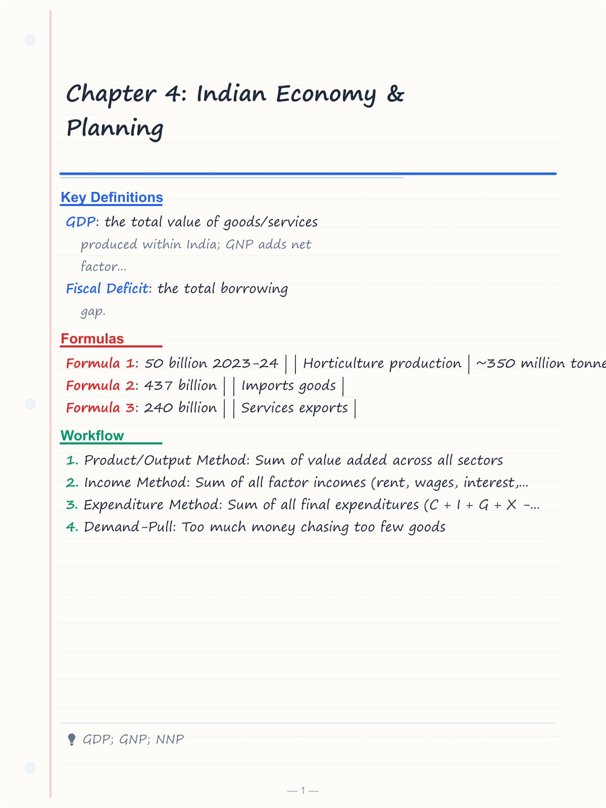
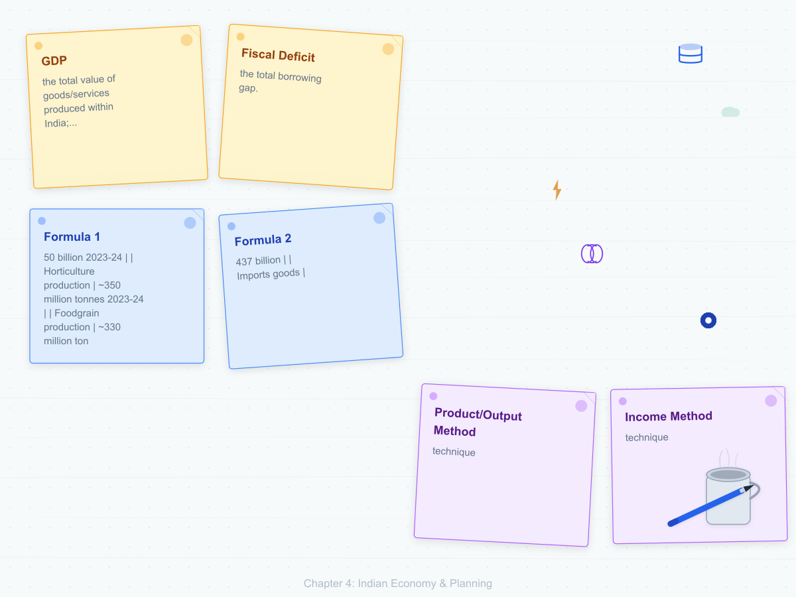
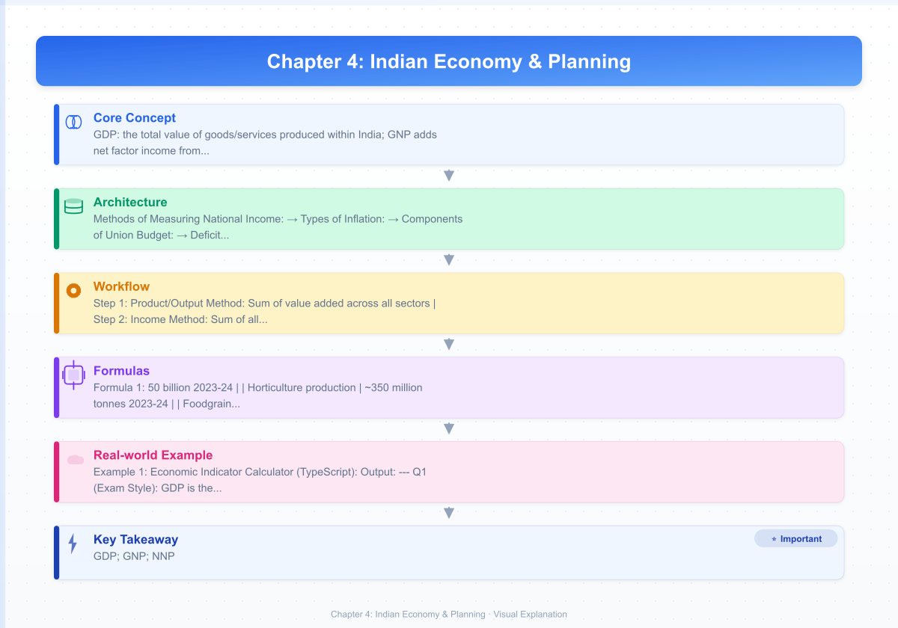
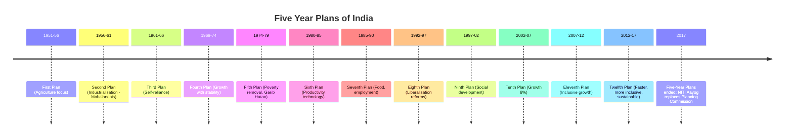
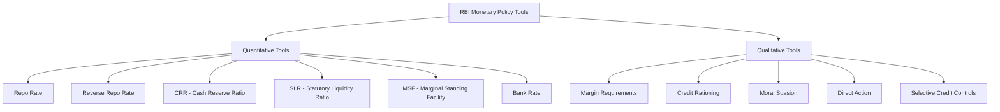
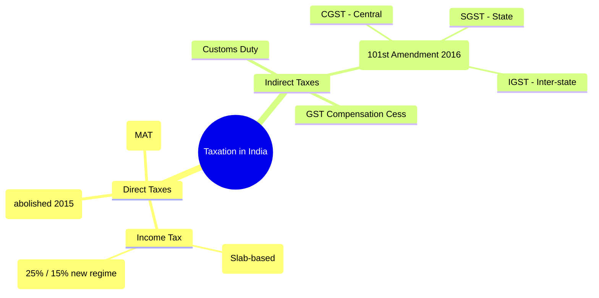
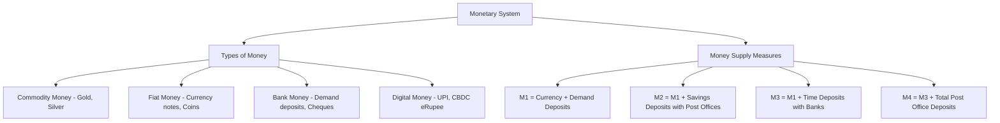

# Chapter 4: Indian Economy & Planning

## Learning Objectives

By the end of this chapter, you will be able to:

<!-- Image Gallery -->
<section class="lesson-visuals" aria-label="Visual learning resources">
  <header><span>VISUAL LEARNING</span><h2>See it. Review it. Remember it.</h2></header>
  <a class="lesson-visual-card" href="../../assets/images/lessons/general-awareness/04-indian-economy/handwritten-notes.png" target="_blank" rel="noopener">
    
    <span><strong>Handwritten notes</strong>Condensed notes for deliberate review.</span>
  </a>
  <a class="lesson-visual-card" href="../../assets/images/lessons/general-awareness/04-indian-economy/sticky-notes.png" target="_blank" rel="noopener">
    
    <span><strong>Sticky-note revision</strong>Fast recall prompts for revision.</span>
  </a>
  <a class="lesson-visual-card" href="../../assets/images/lessons/general-awareness/04-indian-economy/visual-explanation.png" target="_blank" rel="noopener">
    
    <span><strong>Visual concept guide</strong>A connected explanation of the key ideas.</span>
  </a>
</section>
<!-- End Image Gallery -->

- Define key economic indicators — GDP, GNP, NNP, CPI, WPI, GDP deflator
- Explain the Union Budget process, revenue and capital accounts, fiscal deficit
- Trace India's Five-Year Plans and the role of NITI Aayog
- Describe RBI's monetary policy tools — repo rate, reverse repo, CRR, SLR, MSF
- Distinguish between direct and indirect taxes, and understand GST
- Analyse India's economic sectors — agriculture, industry, services, foreign trade
- Recall major government schemes — Make in India, Digital India, Startup India, Ayushman Bharat
- Solve exam-level MCQs on Indian Economy with confidence

---

## Theory

### 4.1 Basic Concepts of Economics

#### 4.1.1 National Income Aggregates

| Term | Definition | Formula (if applicable) |
|------|-----------|------------------------|
| GDP (Gross Domestic Product) | Total value of all final goods/services produced within India's borders | GDP = C + I + G + (X - M) |
| GNP (Gross National Product) | GDP + Net Factor Income from Abroad | GNP = GDP + NFIA |
| NNP (Net National Product) | GNP - Depreciation | NNP = GNP - Dep |
| NDP (Net Domestic Product) | GDP - Depreciation | NDP = GDP - Dep |
| Factor Cost | Value measured at factor payments (wages, rent, interest, profit) | — |
| Market Price | Factor Cost + Indirect Taxes - Subsidies | MP = FC + NIT |

**Methods of Measuring National Income:**
1. **Product/Output Method:** Sum of value added across all sectors
2. **Income Method:** Sum of all factor incomes (rent, wages, interest, profit)
3. **Expenditure Method:** Sum of all final expenditures (C + I + G + X - M)

#### 4.1.2 Inflation

| Index | Published by | Measures | Items Covered |
|-------|-------------|----------|---------------|
| CPI (Consumer Price Index) | Ministry of Statistics (MOSPI) | Retail inflation | Food, housing, clothing, fuel, etc. |
| WPI (Wholesale Price Index) | Office of Economic Adviser | Wholesale inflation | Primary, fuel, manufactured goods |
| GDP Deflator | MOSPI | Economy-wide inflation | All goods/services in GDP |

**Types of Inflation:**
- **Demand-Pull:** Too much money chasing too few goods
- **Cost-Push:** Rising input costs (wages, raw materials) passed to consumers
- **Stagflation:** High inflation + high unemployment + low growth

### 4.2 Union Budget of India

```mermaid
flowchart TD
    A[Union Budget Process] --> B[Preparation by Ministry of Finance]
    B --> C[Budget Division compiles]
    C --> D[Consultations with ministries]
    D --> E[Finance Minister presents in Lok Sabha]
    E --> F[1st February - Annual Budget]
    E --> G[Budget documents tabled]
    G --> H[Revenue Budget]
    G --> I[Capital Budget]
    H --> H1[Revenue Receipts]
    H --> H2[Revenue Expenditure]
    I --> I1[Capital Receipts]
    I --> I2[Capital Expenditure]
    G --> J[Deficit indicators]
    J --> J1[Revenue Deficit = Rev Exp - Rev Rec]
    J --> J2[Fiscal Deficit = Total Exp - Total Rec (excluding borrowings)]
    J --> J3[Primary Deficit = Fiscal Deficit - Interest Payments]
```

**Components of Union Budget:**

| Account | Receipts | Expenditure |
|---------|----------|-------------|
| **Revenue Account** | Tax revenue (Income tax, Corporate tax, GST, Customs), Non-tax revenue (interest, dividends, fees) | Revenue expenditure (salaries, subsidies, interest payments, defence revenue expenses) |
| **Capital Account** | Borrowings (market loans), Disinvestment proceeds, Recovery of loans | Capital expenditure (infrastructure, machinery, defence equipment, loans to states) |

**Deficit Concepts:**
- **Revenue Deficit:** Revenue expenditure > Revenue receipts → indicates day-to-day expenses exceeding income
- **Fiscal Deficit:** Total expenditure > Total receipt (excluding borrowings) → overall gap
- **Primary Deficit:** Fiscal deficit - Interest payments → actual borrowing (minus past debt servicing)

**FRBM Act (Fiscal Responsibility and Budget Management Act, 2003):**
- Aims to reduce fiscal deficit to 3% of GDP and revenue deficit to 0% (targets revised multiple times)
- Current target for 2025-26: Fiscal deficit below 4.5% of GDP

### 4.3 Five-Year Plans & NITI Aayog

#### 4.3.1 Five-Year Plans (1951–2017)



| Plan | Focus | Growth Target | Actual Growth |
|------|-------|---------------|---------------|
| First (1951-56) | Agriculture, irrigation, power | 2.1% | 3.6% |
| Second (1956-61) | Heavy industry (Mahalanobis model) | 4.5% | 4.3% |
| Third (1961-66) | Self-reliance, agriculture | 5.6% | 2.8% |
| Plan Holidays (1966-69) | Annual plans due to war/drought | — | — |
| Fourth (1969-74) | Growth with stability | 5.7% | 3.3% |
| Fifth (1974-79) | Garibi Hatao, poverty removal | 4.4% | 4.8% |
| Sixth (1980-85) | Productivity, technology | 5.2% | 5.7% |
| Seventh (1985-90) | Food, employment, productivity | 5.0% | 6.0% |
| Eighth (1992-97) | Economic reforms (post-1991) | 5.6% | 6.8% |
| Ninth (1997-02) | Social development, poverty | 6.5% | 5.5% |
| Tenth (2002-07) | Growth 8%, equity | 8.0% | 7.6% |
| Eleventh (2007-12) | Inclusive growth | 9.0% | 8.0% |
| Twelfth (2012-17) | Faster, more inclusive, sustainable | 8.0% | 6.9% |

#### 4.3.2 NITI Aayog (2015–present)

- Replaced the Planning Commission on 1 January 2015
- Chairman: Prime Minister of India
- Governing Council: All Chief Ministers + Lt. Governors of UTs
- CEO (full-time administrator)
- **Key difference from Planning Commission:** NITI Aayog is not a statutory body; it is a policy think-tank with advisory role (no power to allocate funds)
- **Major Initiatives:** SDG India Index, Aspirational Districts Programme, Atal Innovation Mission, India Artificial Intelligence Mission

### 4.4 Banking & Monetary Policy

#### 4.4.1 RBI — The Central Bank

Reserve Bank of India (RBI) was established on **1 April 1935** under the RBI Act, 1934. Nationalised in **1949**. It is the central bank of India and the monetary authority.

**Monetary Policy Tools:**



| Tool | Current (2025-26 Indicative) | Description |
|------|-----------------------------|-------------|
| Repo Rate | 6.00% | Rate at which RBI lends to banks against government securities |
| Reverse Repo Rate | 5.75% | Rate at which RBI borrows from banks |
| CRR | 4.50% | % of deposits banks must keep with RBI (no interest paid by RBI) |
| SLR | 18.00% | % of deposits banks must keep in government-approved securities |
| MSF | 6.25% | Rate at which banks borrow overnight from RBI (above repo rate) |
| Bank Rate | 6.25% | Rate at which RBI lends to banks without any security |

**Monetary Policy Committee (MPC):**
- 6 members (3 from RBI + 3 external members appointed by government)
- Chaired by RBI Governor
- Meets bi-monthly to set policy rates
- Objective: Maintain price stability while keeping growth in mind (inflation target: 4% with ±2% tolerance band)

#### 4.4.2 Types of Banks in India

| Bank Type | Examples | Regulated by |
|-----------|----------|--------------|
| Scheduled Commercial Banks | SBI, HDFC, ICICI | RBI |
| Public Sector Banks (PSBs) | SBI, PNB, BOB, Canara | RBI + Government |
| Private Sector Banks | HDFC, ICICI, Kotak | RBI |
| Foreign Banks | HSBC, Standard Chartered, Citi | RBI |
| RRBs (Regional Rural Banks) | Various | Sponsor bank + NABARD |
| Co-operative Banks | Various | RBI + State Government |
| Payments Banks | Paytm Payments Bank, Airtel Payments Bank | RBI |
| Small Finance Banks | AU Bank, Equitas | RBI |

#### 4.4.3 Development Financial Institutions (DFIs)

| Institution | Established | Mandate |
|-------------|-------------|---------|
| NABARD | 1982 | Agriculture and rural development |
| SIDBI | 1990 | Small and medium enterprises |
| NHB (National Housing Bank) | 1988 | Housing finance |
| EXIM Bank | 1982 | Export and import finance |
| MUDRA Bank | 2015 | Micro-units financing (under Pradhan Mantri Mudra Yojana) |

### 4.5 Taxation System



**GST Structure:**
- **CGST** (Central GST): Collected by Centre on intra-state supply
- **SGST** (State GST): Collected by State on intra-state supply
- **IGST** (Integrated GST): Collected by Centre on inter-state supply (distributed to destination state)
- GST Council: Chaired by Union Finance Minister; includes state Finance Ministers

**GST Tax Slabs:** 0% (essential goods), 5%, 12%, 18% (standard rate), 28% (luxury/demerit goods)

### 4.6 Sectors of Indian Economy

#### 4.6.1 Agriculture

| Metric | Value |
|--------|-------|
| Share in GDP (2024-25) | ~18% |
| Employment share | ~45% |
| Largest crop by area | Rice (45+ million hectares) |
| Irrigated area | ~50% of gross cropped area |
| Agricultural exports | ~$50 billion (2023-24) |
| Horticulture production | ~350 million tonnes (2023-24) |
| Foodgrain production | ~330 million tonnes (record 2023-24) |

**Key Reforms:** PM Kisan Samman Nidhi (2019) — ₹6,000/year to small farmers; PM Fasal Bima Yojana (2016) — crop insurance; e-NAM (electronic National Agriculture Market) — 1,000+ mandis integrated.

#### 4.6.2 Industry

**Industrial Policy Evolution:**
- 1948: First Industrial Policy — mixed economy
- 1956: Second Industrial Policy — heavy industry in public sector
- 1991: New Industrial Policy — liberalisation, delicensing, FDI opening
- **Make in India (2014):** Focus on 25 sectors; target 25% of GDP from manufacturing
- **Production-Linked Incentive (PLI) Scheme (2020):** 14 sectors, ₹1.97 lakh crore outlay

**Key Industrial Corridors:** Delhi-Mumbai Industrial Corridor (DMIC), Chennai-Bangalore Industrial Corridor, Vizag-Chennai Industrial Corridor.

#### 4.6.3 Services

- Share in GDP: ~55%
- Fastest growing sector
- IT & ITeS: India's largest service export sector (~$200 billion exports in 2024-25)
- Tourism: Major employment generator (~42 million jobs)
- Banking, insurance, real estate, education, healthcare

#### 4.6.4 Foreign Trade

| Metric | Value (2023-24) |
|--------|-----------------|
| Exports (goods) | $437 billion |
| Imports (goods) | $677 billion |
| Trade deficit | $240 billion |
| Services exports | $340 billion |
| FDI equity inflows (2023-24) | ~$70 billion |
| Major export destinations | USA, UAE, Netherlands, China |
| Major import sources | China, UAE, USA, Russia |

### 4.7 Major Government Schemes

| Scheme | Year | Ministry | Description |
|--------|------|----------|-------------|
| Make in India | 2014 | DPIIT | Manufacturing push, FDI reforms |
| Digital India | 2015 | MeitY | Digital infrastructure, e-governance, digital literacy |
| Startup India | 2016 | DPIIT | Startup ecosystem, tax benefits, fund of funds |
| Ayushman Bharat (PM-JAY) | 2018 | Health | Health cover of ₹5 lakh/family/year to 10 crore families |
| PM Kisan Samman Nidhi | 2019 | Agriculture | ₹6,000/year income support to 12 crore small farmers |
| PM Awas Yojana | 2015 | Housing | Housing for all by 2022 (extended) |
| Jal Jeevan Mission | 2019 | Drinking Water | Tap water connection to every rural household |
| Ujjwala Yojana | 2016 | Petroleum | Free LPG connections to BPL households |
| Swachh Bharat Mission | 2014 | Drinking Water | Open Defecation Free (ODF) India |
| PM Mudra Yojana | 2015 | Finance | Loans up to ₹10 lakh for micro-enterprises |
| Stand-Up India | 2016 | Finance | Bank loans for SC/ST and women entrepreneurs |
| Smart Cities Mission | 2015 | Housing | 100 cities, ₹2.05 lakh crore investment |
| PM Jan Dhan Yojana | 2014 | Finance | Financial inclusion — 50+ crore accounts opened |
| Skill India | 2015 | Skill Development | Training 40 crore people by 2022 |

---

## Examples with Solved Exercises

### Example 1: Economic Indicator Calculator (TypeScript)

```typescript
// TypeScript economic indicator calculator for exam simulation
interface EconomicData {
  consumption: number; // C
  investment: number; // I
  governmentSpending: number; // G
  exports: number; // X
  imports: number; // M
  netFactorIncomeAbroad: number; // NFIA
  depreciation: number; // Dep
  indirectTaxes: number;
  subsidies: number;
  interestPayments: number; // for primary deficit
  totalBorrowings: number; // as a proxy for borrowings
}

class EconomyCalculator {
  private data: EconomicData;

  constructor(data: EconomicData) {
    this.data = data;
  }

  calculateGDP(): number {
    // GDP = C + I + G + (X - M)
    const { consumption, investment, governmentSpending, exports, imports } = this.data;
    return consumption + investment + governmentSpending + (exports - imports);
  }

  calculateGNP(): number {
    return this.calculateGDP() + this.data.netFactorIncomeAbroad;
  }

  calculateNNP(): number {
    return this.calculateGNP() - this.data.depreciation;
  }

  calculateGDPatFactorCost(): number {
    return this.calculateGDP() - (this.data.indirectTaxes - this.data.subsidies);
  }

  calculateRevenueExpenditure(): number {
    // Assume salaries + subsidies + interest make up revenue expenditure
    return this.data.governmentSpending * 0.7; // simplified
  }

  calculateRevenueReceipts(): number {
    // Assume tax revenue is 80% of government spending
    return this.data.governmentSpending * 0.8;
  }

  calculateFiscalDeficit(): number {
    // Fiscal Deficit = Total Expenditure - Total Receipts (excluding borrowings)
    const totalExp = this.data.governmentSpending + this.data.investment * 0.1;
    const totalRec = this.data.governmentSpending * 0.6; // tax + non-tax
    return totalExp - totalRec;
  }

  calculatePrimaryDeficit(): number {
    return this.calculateFiscalDeficit() - this.data.interestPayments;
  }
}

// Example for 2024-25 budget model
const sampleIndia: EconomicData = {
  consumption: 125, // lakh crore
  investment: 45,
  governmentSpending: 50,
  exports: 43,
  imports: 53,
  netFactorIncomeAbroad: -2,
  depreciation: 18,
  indirectTaxes: 15,
  subsidies: 5,
  interestPayments: 9,
  totalBorrowings: 14
};

const calc = new EconomyCalculator(sampleIndia);
console.log('GDP (lakh crore):', calc.calculateGDP().toFixed(1));
console.log('GNP (lakh crore):', calc.calculateGNP().toFixed(1));
console.log('NNP (lakh crore):', calc.calculateNNP().toFixed(1));
console.log('Fiscal Deficit (lakh crore):', calc.calculateFiscalDeficit().toFixed(1));
```

**Output:**
```
GDP (lakh crore): 210.0
GNP (lakh crore): 208.0
NNP (lakh crore): 190.0
Fiscal Deficit (lakh crore): 15.0
```

---

**Q1 (Exam Style):** GDP is the total value of all final goods and services produced:

A) Outside the domestic territory of a country
B) Within the domestic territory of a country
C) By the citizens of a country, both domestic and foreign
D) By the government of a country

<details>
<summary>Answer</summary>
**Answer: B) Within the domestic territory of a country**

GDP (Gross Domestic Product) measures the market value of all final goods and services produced **within the geographical boundaries** of a country, regardless of who produces them. Option C describes GNP.
</details>

---

**Q2:** Which of the following is included in the Capital Account of the Union Budget?

A) Revenue receipts
B) Disinvestment proceeds
C) Subsidies
D) Salaries

<details>
<summary>Answer</summary>
**Answer: B) Disinvestment proceeds**

Disinvestment proceeds are capital receipts because they involve the sale of government assets (equity in PSUs). Subsidies (C) and salaries (D) are revenue expenditure. Revenue receipts (A) are part of the revenue account.
</details>

---

**Q3:** The repo rate is the rate at which:

A) RBI borrows from commercial banks
B) Commercial banks borrow from RBI
C) Banks lend to each other
D) RBI lends to the government

<details>
<summary>Answer</summary>
**Answer: B) Commercial banks borrow from RBI**

Repo Rate is the rate at which RBI lends short-term funds to commercial banks against government securities. The reverse repo rate (A) is when RBI borrows from banks.
</details>

---

**Q4:** The "Mahalanobis Model" formed the basis of which Five-Year Plan?

A) First Plan
B) Second Plan
C) Third Plan
D) Fourth Plan

<details>
<summary>Answer</summary>
**Answer: B) Second Plan (1956-61)**

The Second Five-Year Plan was based on the Mahalanobis Model (named after statistician P.C. Mahalanobis). It focused on heavy industrialization and capital goods development, with the public sector playing a dominant role.
</details>

---

**Q5:** Who chairs the Monetary Policy Committee (MPC)?

A) Prime Minister
B) Finance Minister
C) RBI Governor
D) Chief Economic Advisor

<details>
<summary>Answer</summary>
**Answer: C) RBI Governor**

The six-member Monetary Policy Committee is chaired by the RBI Governor. Other members include the RBI Deputy Governor (monetary policy), one RBI officer, and three external members appointed by the government.
</details>

---

**Q6:** Which of the following is NOT a direct tax?

A) Income tax
B) Corporate tax
C) Goods and Services Tax (GST)
D) Wealth tax

<details>
<summary>Answer</summary>
**Answer: C) Goods and Services Tax (GST)**

GST is an indirect tax — it is collected by businesses from consumers and remitted to the government. Direct taxes (income tax, corporate tax, wealth tax) are paid directly by the person on whom they are levied.
</details>

---

**Q7:** The "Pradhan Mantri Jan Dhan Yojana" primarily aims at:

A) Health insurance for poor
B) Financial inclusion
C) Housing for all
D) Skill development

<details>
<summary>Answer</summary>
**Answer: B) Financial inclusion**

PM Jan Dhan Yojana (launched August 2014) aims at financial inclusion by ensuring access to banking services (savings accounts, overdraft, insurance) for every household. Over 50 crore accounts have been opened.
</details>

---

**Q8:** India's fiscal deficit is calculated as:

A) Total Revenue Exp - Total Revenue Rec
B) Total Exp - Total Rec (excluding borrowings)
C) Fiscal Deficit - Interest Payments
D) Total Revenue - Total Capital Exp

<details>
<summary>Answer</summary>
**Answer: B) Total Exp - Total Rec (excluding borrowings)**

Fiscal deficit = Total expenditure - Total receipts (excluding borrowings). Revenue deficit (A) = Revenue expenditure - Revenue receipts. Primary deficit (C) = Fiscal deficit - Interest payments.
</details>

---

**Q9:** The "Ayushman Bharat" scheme provides health insurance cover of:

A) ₹1 lakh per family per year
B) ₹3 lakh per family per year
C) ₹5 lakh per family per year
D) ₹10 lakh per family per year

<details>
<summary>Answer</summary>
**Answer: C) ₹5 lakh per family per year**

Ayushman Bharat (PM Jan Arogya Yojana/PM-JAY) provides a health cover of ₹5 lakh per family per year for secondary and tertiary care hospitalization to over 10 crore poor and vulnerable families.
</details>

---

**Q10:** The "WPI" stands for:

A) Wholesale Price Index
B) World Price Index
C) Weighted Price Index
D) Working Price Index

<details>
<summary>Answer</summary>
**Answer: A) Wholesale Price Index**

WPI (Wholesale Price Index) measures the changes in prices of goods sold at the wholesale level. Published by the Office of Economic Adviser, it captures price movements in primary articles, fuel & power, and manufactured products.
</details>

---

**Q11:** The "Drain of Wealth" theory was proposed by:

A) Mahatma Gandhi
B) Dadabhai Naoroji
C) R.C. Dutt
D) Jawaharlal Nehru

<details>
<summary>Answer</summary>
**Answer: B) Dadabhai Naoroji**

Dadabhai Naoroji proposed the "Drain of Wealth" theory in his book "Poverty and Un-British Rule in India" (1901), arguing that British colonial rule drained India's wealth through excessive taxation, trade policies, and home charges.
</details>

---

**Q12:** The "Make in India" initiative focuses on how many priority sectors?

A) 15
B) 20
C) 25
D) 30

<details>
<summary>Answer</summary>
**Answer: C) 25**

Make in India (launched 2014) originally identified 25 priority sectors including automobiles, aviation, biotechnology, chemicals, defence manufacturing, electronics, food processing, leather, media, mining, pharmaceuticals, railways, textiles, and tourism.
</details>

---

**Q13:** The "CRR" (Cash Reserve Ratio) is the portion of deposits that banks must keep:

A) With themselves in cash
B) With RBI in cash
C) In government securities
D) As loans to priority sector

<details>
<summary>Answer</summary>
**Answer: B) With RBI in cash**

CRR is the percentage of a bank's total deposits that must be maintained with the RBI in cash form. RBI pays no interest on CRR. Currently CRR is 4.5% (as of 2025). SLR (C) is the portion kept in government securities.
</details>

---

**Q14:** The "GST" was implemented in India on:

A) 1 April 2016
B) 1 July 2017
C) 1 April 2017
D) 1 November 2016

<details>
<summary>Answer</summary>
**Answer: B) 1 July 2017**

The Goods and Services Tax (GST) was implemented on 1 July 2017, following the 101st Constitutional Amendment Act (2016). GST subsumed 17+ central and state indirect taxes into a unified tax system.
</details>

---

**Q15:** The "NABARD" is associated with:

A) Industrial development
B) Agricultural and rural finance
C) Export promotion
D) Housing finance

<details>
<summary>Answer</summary>
**Answer: B) Agricultural and rural finance**

NABARD (National Bank for Agriculture and Rural Development) was established in 1982 to provide credit and refinance for agriculture, small-scale industries, cottage industries, and rural development activities.
</details>

---

**Q16:** Which of the following sectors contributes the most to India's GDP?

A) Agriculture
B) Industry
C) Services
D) Manufacturing

<details>
<summary>Answer</summary>
**Answer: C) Services**

The services sector contributes approximately 55% of India's GDP, making it the largest sector. Agriculture contributes ~18%, industry ~27%. Services also contribute the most to exports (IT/ITeS) and foreign exchange earnings.
</details>

---

**Q17:** The "Pradhan Mantri Fasal Bima Yojana" is a:

A) Pension scheme for farmers
B) Crop insurance scheme
C) Minimum support price scheme
D) Loan subsidy scheme

<details>
<summary>Answer</summary>
**Answer: B) Crop insurance scheme**

PM Fasal Bima Yojana (launched 2016) provides comprehensive crop insurance from pre-sowing to post-harvest. Farmers pay a low premium (2% for kharif, 1.5% for rabi, 5% for commercial crops) and the government pays the balance.
</details>

---

**Q18:** The "Eighth Five-Year Plan" was launched after which major economic event?

A) Green Revolution
B) Balance of Payments crisis (1991)
C) National Emergency
D) Liberalisation of 1991

<details>
<summary>Answer</summary>
**Answer: B) Balance of Payments crisis (1991) / Liberalisation of 1991**

The Eighth Plan (1992-97) was launched after the 1991 economic crisis, which led to structural reforms including industrial delicensing, trade liberalisation, and financial sector reforms. It achieved 6.8% growth.
</details>

---

**Q19:** The "FRBM Act" was enacted in which year?

A) 2000
B) 2003
C) 2005
D) 2010

<details>
<summary>Answer</summary>
**Answer: B) 2003**

The Fiscal Responsibility and Budget Management (FRBM) Act was enacted in 2003 to ensure fiscal discipline by setting targets for reducing fiscal deficit and revenue deficit. It became effective in 2004.
</details>

---

**Q20:** Which organisation replaced the Planning Commission in 2015?

A) Finance Commission
B) NITI Aayog
C) Economic Advisory Council
D) National Development Council

<details>
<summary>Answer</summary>
**Answer: B) NITI Aayog**

NITI Aayog (National Institution for Transforming India) replaced the Planning Commission on 1 January 2015. Unlike the Planning Commission, NITI Aayog is a policy think-tank without the power to allocate funds to states.
</details>

---

### 4.9 Indian Economy Fact Sheet (Quick Reference)

| Indicator | Current Value (2025-26 estimates) |
|-----------|-----------------------------------|
| GDP (Nominal) | ~$4.3 trillion |
| GDP Growth Rate | ~6.5% (projected) |
| GDP Rank (Nominal) | 5th (after USA, China, Germany, Japan) |
| Per Capita Income | ~$2,500 (nominal) |
| Foreign Exchange Reserves | ~$700+ billion |
| Inflation (CPI) | ~4.0–5.0% |
| Repo Rate | 6.00% (MPC decision) |
| Fiscal Deficit (% of GDP) | 4.4% (target) |
| Exports | ~$800 billion (goods + services) |
| Imports | ~$900 billion (goods + services) |
| Agricultural GDP Share | ~18% |
| Industrial GDP Share | ~27% |
| Services GDP Share | ~55% |
| Labour Force Participation | ~50% |
| Unemployment Rate | ~6–7% |
| Population Below Poverty Line | ~12–15% |
| Literacy Rate | ~77% |
| GST Collection (Monthly Avg) | ~₹1.7–1.8 lakh crore |
| Tax-GDP Ratio | ~11–12% |
| FDI Inflows | ~$50–60 billion annually |

### 4.10 Money and Banking (Based on GFG Reference)

#### 4.10.1 Functions of Money

Money serves four primary functions:
1. **Medium of Exchange** — Accepted for transactions
2. **Unit of Account** — Standard measure of value
3. **Store of Value** — Can be saved and used later
4. **Standard of Deferred Payment** — Used for future payments



#### 4.10.2 Banking System in India

| Term | Definition | Current Rate/Value |
|------|------------|--------------------|
| Repo Rate | Rate at which RBI lends to banks | 6.00% |
| Reverse Repo Rate | Rate at which RBI borrows from banks | 3.35% |
| CRR (Cash Reserve Ratio) | Banks keep % of deposits as cash with RBI | 4.50% |
| SLR (Statutory Liquidity Ratio) | Banks keep % in government securities | 18.00% |
| MSF (Marginal Standing Facility) | Emergency borrowing rate for banks | 6.25% |
| Bank Rate | Rate at which RBI lends to banks (long-term) | 6.25% |
| Base Rate | Minimum lending rate (old system) | Varies by bank |
| MCLR | Marginal Cost of Funds based Lending Rate | Varies by bank |
| EBLR | External Benchmark Lending Rate (linked to Repo) | Repo + Spread |

**Types of Banks in India:**

| Bank Type | Examples | Regulator |
|-----------|----------|-----------|
| Public Sector Banks (PSBs) | SBI, PNB, Bank of Baroda, Canara Bank | RBI |
| Private Sector Banks | HDFC, ICICI, Axis, Kotak, Yes Bank | RBI |
| Foreign Banks | HSBC, Citibank, Standard Chartered | RBI |
| Regional Rural Banks (RRBs) | Prathama Gramin Bank, etc. | NABARD |
| Co-operative Banks | State Co-op Banks, Urban Co-op Banks | RBI + State Govt |
| Payment Banks | Paytm Payments Bank, Airtel Payments Bank | RBI |
| Small Finance Banks | AU SFB, Equitas SFB, Ujjivan SFB | RBI |
| Development Banks | NABARD, SIDBI, NHB, EXIM Bank | Govt of India |

#### 4.10.3 Monetary Policy Committee (MPC)

- **Constituted under:** RBI Act, 1934 (amended in 2016)
- **Members:** 6 (3 RBI officials + 3 external members)
- **Chairperson:** RBI Governor
- **Primary Objective:** Maintain price stability (inflation target: 4% with ±2% tolerance band)
- **Meetings:** At least 4 per year (currently 6 bi-monthly meetings)
- **Decision Making:** Each member votes; Governor has casting vote in case of tie
- **Instruments:** Repo rate changes, stance changes (accommodative/neutral/withdrawal of accommodation)

#### 4.10.4 Types of Inflation (Detailed)

| Type | Rate | Description |
|------|------|-------------|
| Creeping Inflation | < 3% | Mild, considered healthy for economy |
| Walking Inflation | 3–6% | Moderate, causes concern |
| Galloping Inflation | 6–10% | High, requires policy intervention |
| Hyperinflation | > 50% monthly | Very rare; seen in Zimbabwe, Venezuela, post-WWI Germany |
| Deflation | Negative | Falling prices; can lead to recession |
| Disinflation | Decreasing | Inflation rate is falling but still positive |
| Core Inflation | — | Excludes food and fuel (volatile items) |
| Headline Inflation | — | Includes all items (CPI-based) |

#### 4.10.5 Important Banking Abbreviations

| Abbreviation | Full Form |
|--------------|-----------|
| CRR | Cash Reserve Ratio |
| SLR | Statutory Liquidity Ratio |
| MSF | Marginal Standing Facility |
| LAF | Liquidity Adjustment Facility |
| MCLR | Marginal Cost of Funds based Lending Rate |
| OMO | Open Market Operations |
| MSS | Market Stabilisation Scheme |
| RTGS | Real Time Gross Settlement |
| NEFT | National Electronic Funds Transfer |
| IMPS | Immediate Payment Service |
| UPI | Unified Payments Interface |
| CBDC | Central Bank Digital Currency (eRupee) |
| NPCI | National Payments Corporation of India |
| PSB | Public Sector Bank |
| NPA | Non-Performing Asset |
| CRAR | Capital to Risk (Weighted) Assets Ratio |
| BASEL | Basel Committee on Banking Supervision |
| CAMELS | Capital, Assets, Management, Earnings, Liquidity, Sensitivity |

### 4.11 TypeScript: Banking and Economy Analyzer

```typescript
/**
 * Indian Economy and Banking Simulator
 * Calculates monetary aggregates and assesses economic indicators
 */
interface EconomicIndicator {
  name: string;
  value: number;
  unit: string;
  trend: 'improving' | 'worsening' | 'stable';
}

class EconomyAnalyzer {
  private indicators: EconomicIndicator[] = [];

  constructor() {
    this.initializeIndicators();
  }

  private initializeIndicators(): void {
    this.indicators = [
      { name: 'GDP Growth', value: 6.5, unit: '%', trend: 'improving' },
      { name: 'Inflation (CPI)', value: 4.5, unit: '%', trend: 'stable' },
      { name: 'Fiscal Deficit', value: 4.4, unit: '% of GDP', trend: 'stable' },
      { name: 'Unemployment', value: 6.5, unit: '%', trend: 'worsening' },
      { name: 'FDI Inflow', value: 55, unit: '$ billion', trend: 'improving' },
    ];
  }

  public calculateInterest(principal: number, rate: number, tenureMonths: number): number {
    const rateMonthly = rate / 12 / 100;
    return principal * rateMonthly * tenureMonths;
  }

  public moneyMultiplier(CRR: number): number {
    return 1 / (CRR / 100);
  }

  public calculateInflationImpact(initialPrice: number, inflationRate: number, years: number): number {
    return initialPrice * Math.pow(1 + inflationRate / 100, years);
  }

  public generateEconomyHealthScore(): { score: number; rating: string } {
    let score = 0;
    for (const indicator of this.indicators) {
      if (indicator.trend === 'improving') score += 25;
      else if (indicator.trend === 'stable') score += 15;
      else score += 5;
    }
    const rating = score >= 80 ? 'Healthy' : score >= 60 ? 'Moderate' : 'Weak';
    return { score, rating };
  }

  public printReport(): void {
    console.log('=== Indian Economy Health Report ===');
    this.indicators.forEach(i => {
      const arrow = i.trend === 'improving' ? '↑' : i.trend === 'worsening' ? '↓' : '→';
      console.log(`${i.name}: ${i.value}${i.unit} ${arrow}`);
    });
    const health = this.generateEconomyHealthScore();
    console.log(`Overall Health: ${health.rating} (Score: ${health.score}/100)`);
    console.log(`Money Multiplier (CRR 4.5%): ${this.moneyMultiplier(4.5).toFixed(2)}x`);
    console.log(`₹100 item in 5 yrs at 5% inflation: ₹${this.calculateInflationImpact(100, 5, 5).toFixed(2)}`);
    console.log('====================================');
  }
}

const economy = new EconomyAnalyzer();
economy.printReport();
```

### 4.12 Additional Solved MCQs (Economy)

**Q21:** The "Liquidity Adjustment Facility" (LAF) operates through which two rates?

A) Bank Rate and MSF
B) Repo Rate and Reverse Repo Rate
C) CRR and SLR
D) Base Rate and MCLR

<details>
<summary>Answer</summary>
**Answer: B) Repo Rate and Reverse Repo Rate**

LAF is the tool used by RBI to manage liquidity in the banking system. Repo Rate (RBI lends to banks) and Reverse Repo Rate (banks lend to RBI) are the two key rates under LAF. The MSF is a separate window for emergency borrowing.
</details>

**Q22:** "Broad Money" in India is represented by:

A) M1
B) M2
C) M3
D) M4

<details>
<summary>Answer</summary>
**Answer: C) M3**

M3 = M1 + Time Deposits with Banks. M3 is called "Broad Money" and is the most commonly used measure of money supply. M1 is "Narrow Money" (Currency + Demand Deposits + Other Deposits with RBI).
</details>

**Q23:** The "Bad Bank" established in India to resolve NPAs is named:

A) ARCIL
B) NARCL (National Asset Reconstruction Company Ltd)
C) SBI CAPS
D) IDRCL

<details>
<summary>Answer</summary>
**Answer: B) NARCL (National Asset Reconstruction Company Ltd)**

NARCL (also called "Bad Bank") was established in 2021 to acquire and resolve large NPAs (stressed assets) from banks. It is backed by Government guarantee and works with IDRCL (India Debt Resolution Company Ltd) for resolution.
</details>

**Q24:** The "Hindu Rate of Growth" refers to India's GDP growth rate during:

A) 1950–1980
B) 1980–1991
C) 1991–2000
D) 2000–2010

<details>
<summary>Answer</summary>
**Answer: A) 1950–1980 (~3.5% growth rate)**

The term "Hindu Rate of Growth" was coined by economist Raj Krishna to describe India's low and stagnant GDP growth of about 3.5% per annum from 1950 to 1980, before economic liberalisation began.
</details>

**Q25:** The "Debt Waiver and Debt Relief Scheme" for farmers was announced in which year?

A) 2004
B) 2008
C) 2014
D) 2019

<details>
<summary>Answer</summary>
**Answer: B) 2008 (Agricultural Debt Waiver and Debt Relief Scheme)**

The scheme was announced in the Union Budget 2008-09 by then Finance Minister P. Chidambaram. It provided for waiver of direct agricultural loans and a one-time settlement scheme for other loans. It cost the exchequer approximately ₹71,000 crore.
</details>

---

## Summary

- **GDP** is the total value of goods/services produced within India; **GNP** adds net factor income from abroad; **NNP** deducts depreciation.
- **Inflation** is measured by CPI (retail), WPI (wholesale), and GDP Deflator (economy-wide).
- The **Union Budget** has Revenue and Capital accounts; **Fiscal Deficit** is the total borrowing gap.
- India completed **12 Five-Year Plans** (1951-2017); replaced by **NITI Aayog** in 2015 as a policy think-tank.
- **RBI's monetary tools** include Repo Rate (lending), Reverse Repo (borrowing), CRR (cash reserves), SLR (securities), MSF (emergency lending).
- **Taxation:** Direct taxes (Income Tax, Corporate Tax) are paid directly; Indirect taxes (GST, Customs) are collected by intermediaries.
- **GST** (2017) unified 17+ taxes into CGST, SGST, and IGST with slabs of 0%, 5%, 12%, 18%, 28%.
- **Services** contribute ~55% of GDP; Agriculture ~18%; Industry ~27%.
- **Major schemes:** Make in India, Digital India, Startup India, Ayushman Bharat, PM Kisan, PM Awas Yojana, Jal Jeevan Mission.

## Practical Takeaways

1. **For Exam Preparation:** Focus on budget concepts (fiscal deficit, revenue deficit, FRBM targets), RBI policy rates (changes are frequently asked), and Five-Year Plan focus areas.
2. **Rate Memorisation:** Create a rate card — Repo Rate, Reverse Repo, CRR, SLR, MSF, Bank Rate. Update whenever RBI announces changes.
3. **Plan Mnemonics:** Remember sectoral focus — First (Agriculture), Second (Industry), Eighth (Reforms), Twelfth (Inclusive growth).
4. **Scheme Memory:** Group schemes by Ministry — PM Kisan (Agriculture), Ayushman Bharat (Health), PM Awas (Housing), Jan Dhan (Finance).
5. **Tax Structure:** Know the GST slabs — Essentials (0%, 5%), Standard (12%, 18%), Luxury (28%). No questions on specific items, but the slab logic matters.
6. **Current Context:** The Economic Survey (tabled before Union Budget) and the Union Budget itself are must-read documents. Expect 2-3 questions directly from the latest budget.
7. **SDG Index:** NITI Aayog's SDG India Index and Aspirational Districts Programme are frequently asked about in RBI Grade B exams.

## Chapter Quiz

**Q1:** The "Base Year" for calculating GDP in India is currently:

A) 2004-05
B) 2010-11
C) 2011-12
D) 2015-16

<details>
<summary>Answer</summary>
**Answer: C) 2011-12**

India's GDP is calculated with 2011-12 as the base year (revised from 2004-05 in January 2015). CPI also uses 2012 as the base year (revised from 2010).
</details>

**Q2:** The difference between "Revenue Deficit" and "Fiscal Deficit" is:

A) Capital expenditure
B) Interest payments
C) Revenue expenditure
D) Borrowings

<details>
<summary>Answer</summary>
**Answer: B) Interest payments**

Primary Deficit = Fiscal Deficit - Interest Payments. Revenue Deficit focuses only on revenue account, while Fiscal Deficit includes both revenue and capital accounts. The difference between fiscal deficit and primary deficit is interest payments.
</details>

**Q3:** Which Five-Year Plan had the highest actual growth rate?

A) Eighth Plan
B) Ninth Plan
C) Tenth Plan
D) Eleventh Plan

<details>
<summary>Answer</summary>
**Answer: C) Tenth Plan (2002-07) achieved 7.6%**

The Tenth Plan achieved an actual growth rate of 7.6% (targeted 8.0%). The Eleventh Plan achieved 8.0% actual but lower than Tenth in terms of target achievement. The Twelfth Plan achieved the lowest at 6.9% against 8.0% target.
</details>

**Q4:** The primary function of the Monetary Policy Committee (MPC) is to:

A) Set the fiscal deficit target
B) Determine the repo rate
C) Approve the Union Budget
D) Regulate stock markets

<details>
<summary>Answer</summary>
**Answer: B) Determine the repo rate**

The MPC determines the policy interest rate (repo rate) required to achieve the inflation target (4% with ±2% tolerance). It meets six times a year and decisions are made by majority vote.
</details>

**Q5:** "Pradhan Mantri Mudra Yojana" provides loans under which categories?

A) Shishu, Kishore, Tarun
B) Silver, Gold, Platinum
C) Small, Medium, Large
D) Basic, Standard, Premium

<details>
<summary>Answer</summary>
**Answer: A) Shishu, Kishore, Tarun**

MUDRA loans are categorised as: Shishu (up to ₹50,000), Kishore (₹50,001–₹5 lakh), and Tarun (₹5,00,001–₹10 lakh). The scheme aims to support micro and small enterprises.
</details>

---

## Exercises (30 Practice Questions)

### Section A: Multiple Choice Questions

**1.** The "DOT" (Digital Oceanic and Terrestrial) is associated with which scheme?
A) Digital India
B) Smart Cities
C) BharatNet
D) Startup India

**2.** Which year is known as the "Year of the Great Divide" in Indian economic history?
A) 1965-66
B) 1973-74
C) 1990-91
D) 2008-09

**3.** The "India Stack" includes all of the following EXCEPT:
A) Aadhaar
B) UPI
C) DigiLocker
D) PayTM

**4.** "SLR" is maintained by banks in the form of:
A) Cash with RBI
B) Gold and government securities
C) Cash with the bank itself
D) Loans to priority sector

**5.** The "Hawala" scandal is associated with which decade?
A) 1970s
B) 1980s
C) 1990s
D) 2000s

**6.** The "Finance Commission" is constituted every:
A) 3 years
B) 5 years
C) 6 years
D) 10 years

**7.** Which of the following is NOT a part of "India's external debt"?
A) Commercial borrowings
B) NRI deposits
C) Short-term trade credit
D) Domestic government bonds

**8.** The "SEBI" was established as a statutory body in:
A) 1988
B) 1990
C) 1992
D) 1995

**9.** "Unified Payments Interface (UPI)" was launched by:
A) RBI
B) SBI
C) NPCI
D) Ministry of Finance

**10.** The "Monetary Policy Committee" consists of how many members?
A) 4
B) 5
C) 6
D) 7

### Section B: Fill in the Blanks

**11.** The base year for India's GDP calculation is __________.

**12.** The __________ is the constitutional body that recommends distribution of tax revenue between Centre and States.

**13.** The __________ Act was enacted in 2003 to promote fiscal discipline.

**14.** The __________ is the apex development bank for agriculture in India.

**15.** The __________ replaces the Planning Commission in 2015.

**16.** The __________ rate is the rate at which RBI lends to banks without any security.

**17.** The __________ is the difference between Total Expenditure and Total Receipts (excluding borrowings).

**18.** The union budget is presented on __________ every year.

**19.** The __________ was launched to provide health insurance of ₹5 lakh per family.

**20.** The __________ sector contributes the largest share to India's GDP.

### Section C: True/False

**21.** GDP at factor cost includes indirect taxes. (T/F)

**22.** The RBI was nationalised in 1949. (T/F)

**23.** NITI Aayog has the power to allocate funds to states. (T/F)

**24.** GST is a direct tax. (T/F)

**25.** The "Make in India" initiative was launched in 2014. (T/F)

**26.** India's fiscal deficit target under FRBM is 3% of GDP. (T/F)

**27.** The Eleventh Five-Year Plan emphasized "Inclusive Growth". (T/F)

**28.** The "Repo Rate" is the rate at which RBI borrows from banks. (T/F)

**29.** The "Eighth Five-Year Plan" was launched after the 1991 economic reforms. (T/F)

**30.** PM Jan Dhan Yojana provides life insurance cover. (T/F)

### Section D: Additional MCQs (Exam Focus — Banking & Money)

**31.** The "Mint Street" is associated with which institution?

A) Bombay Stock Exchange
B) Reserve Bank of India
C) Securities and Exchange Board of India
D) Ministry of Finance

**32.** Which committee recommended the establishment of NABARD?

A) Narasimham Committee
B) Sivaraman Committee
C) Kelkar Committee
D) Rangarajan Committee

**33.** "Open Market Operations" (OMO) refers to:

A) Sale/purchase of government securities by RBI
B) Trading of stocks by corporates
C) Foreign exchange trading
D) Commodity trading

**34.** The "Kisan Credit Card" (KCC) scheme was launched in which year?

A) 1995
B) 1998
C) 2000
D) 2004

**35.** What is the minimum tenure of a Treasury Bill?

A) 14 days
B) 28 days
C) 91 days
D) 182 days

**36.** Which of the following is NOT a function of the RBI?

A) Banker to the Government
B) Banker to the Banks
C) Fiscal policy formulation
D) Issue of currency

**37.** The "Export-Import Bank of India" (EXIM Bank) was established in:

A) 1980
B) 1982
C) 1991
D) 2000

**38.** "Rating Agencies" in India are regulated by:

A) RBI
B) SEBI
C) IRDAI
D) Ministry of Finance

**39.** The concept of "Universal Banking" was recommended by:

A) Narasimham Committee (I)
B) Narasimham Committee (II)
C) Khan Committee
D) RBI Working Group

**40.** India's first payment bank "Airtel Payments Bank" was launched in:

A) 2016
B) 2017
C) 2018
D) 2020

---

<details>
<summary>Answer Key</summary>

**Section A (1-10):**
1. C) BharatNet (digital connectivity to gram panchayats)
2. A) 1965-66 (severe drought + war → sharp decline in agriculture → great divide)
3. D) PayTM (it is a private company product, not part of India Stack)
4. B) Gold and government securities
5. C) 1990s (the hawala scam involved politicians and business, 1991-1996)
6. B) 5 years (Article 280)
7. D) Domestic government bonds (these are internal debt, not external)
8. C) 1992 (SEBI Act, 1992 gave it statutory powers; established as non-statutory body in 1988)
9. C) NPCI (National Payments Corporation of India)
10. C) 6

**Section B (11-20):**
11. 2011-12
12. Finance Commission
13. FRBM (Fiscal Responsibility and Budget Management)
14. NABARD
15. NITI Aayog
16. Bank Rate
17. Fiscal Deficit
18. 1st February
19. Ayushman Bharat / PM-Jan Arogya Yojana
20. Services

**Section C (21-30):**
21. F (GDP at factor cost excludes indirect taxes and includes subsidies; GDP at market price includes indirect taxes)
22. T
23. F (NITI Aayog is a think-tank without fund allocation powers)
24. F (GST is an indirect tax)
25. T
26. T (with temporary relaxations allowed)
27. T
28. F (Repo Rate is the rate at which RBI lends to banks; Reverse Repo is when RBI borrows from banks)
29. T
30. T (accidental death coverage of ₹2 lakh and life insurance coverage)

**Section D (31-40):**
31. B) Reserve Bank of India (Mint Street is the location of RBI headquarters in Mumbai)
32. B) Sivaraman Committee (1979; led to establishment of NABARD in 1982)
33. A) Sale/purchase of government securities by RBI (to regulate money supply)
34. B) 1998 (launched by NABARD to provide short-term credit to farmers)
35. C) 91 days (T-bills are issued for 91, 182, and 364 days by the Government)
36. C) Fiscal policy formulation (done by Ministry of Finance; RBI handles monetary policy)
37. B) 1982 (EXIM Bank Act 1981 came into effect on 1 January 1982)
38. B) SEBI (Securities and Exchange Board of India regulates credit rating agencies)
39. C) Khan Committee (1998; recommended universal banking — merging financial services)
40. B) 2017 (launched in January 2017; first payments bank to begin operations)
</details>

---

*Proceed to Chapter 5 — General Science & Technology*
