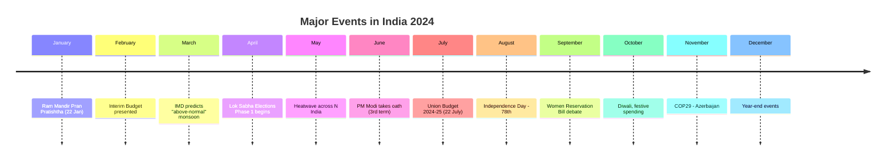
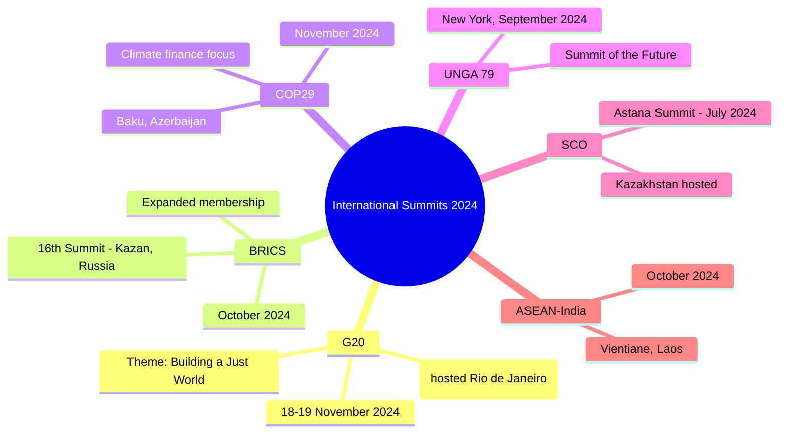

# Chapter 6: Current Affairs 2024

## Learning Objectives

By the end of this chapter, you will be able to:

- Recall major national policy announcements, bills, and government schemes in 2024
- Identify key international events — summits, treaties, bilateral relations
- Analyse India's economic performance — GDP growth, inflation, budget highlights
- Describe major scientific achievements — ISRO missions, technology breakthroughs
- Remember sports tournament winners, major awards, and obituaries of 2024
- Solve exam-level MCQs based on 2024 current events

---

## Theory

### 6.1 National Affairs — Major Events

<a href="../../../assets/images/diagrams/general-awareness/06-current-affairs-2024/6-1-national-affairs-major-events-handwritten.svg" target="_blank" rel="noopener">
  
</a>
<a href="../../../assets/images/diagrams/general-awareness/06-current-affairs-2024/6-1-national-affairs-major-events-diagram.svg" target="_blank" rel="noopener">
  
</a>
<a href="../../../assets/images/diagrams/general-awareness/06-current-affairs-2024/6-1-national-affairs-major-events-sticky.svg" target="_blank" rel="noopener">
  
</a>




#### 6.1.1 Ram Mandir Pran Pratishtha (22 January 2024)

- The Ram Mandir in Ayodhya (Uttar Pradesh) was consecrated on 22 January 2024
- Built after the Supreme Court's landmark verdict (9 November 2019) on the Ayodhya land dispute
- Prime Minister Narendra Modi performed the Pran Pratishtha (consecration) ceremony
- The temple is built in the Nagara style of architecture, 250m long, 160m wide, and 161m high

#### 6.1.2 General Elections 2024 (April–June 2024)

- India's 18th Lok Sabha elections were held in 7 phases (19 April to 1 June 2024)
- Results declared on 4 June 2024
- **National Democratic Alliance (NDA)** won 293 seats, BJP won 240 seats (short of majority)
- **Indian National Developmental Inclusive Alliance (INDIA)** won 232 seats, INC won 99 seats
- Narendra Modi became Prime Minister for the third consecutive term (sworn in 9 June 2024)
- Lok Sabha Speaker: Om Birla (re-elected), Leader of Opposition: Rahul Gandhi (after 10 years)

#### 6.1.3 Union Budget 2024-25

- Presented by Finance Minister Nirmala Sitharaman on 22 July 2024 (first budget of Modi 3.0)
- **Interim Budget** was presented on 1 February 2024 (due to election model code of conduct)

**Key Budget Highlights:**

| Item | Allocation |
|------|------------|
| Total Expenditure | ₹48.21 lakh crore |
| Capital Expenditure | ₹11.11 lakh crore |
| Fiscal Deficit | 4.9% of GDP (target for 2024-25) |
| Tax Revenue | ₹26.02 lakh crore |
| Health (Ayushman Bharat) | ₹7,500 crore (expansion to ASHA, Anganwadi workers) |
| Education | ₹1.48 lakh crore |
| Defence | ₹6.22 lakh crore |
| Agriculture | ₹1.52 lakh crore |
| Infrastructure (PM Awas) | ₹2.27 lakh crore |
| Railways | ₹2.62 lakh crore (record) |

**Major Announcements:**
- Three new railway corridors: Energy, Mineral, and Cement corridors
- PM Awas Yojana Urban: Additional 1 crore houses
- Mudra loan limit increased from ₹10 lakh to ₹20 lakh
- Pradhan Mantri Suryodaya Yojana: 1 crore households to get rooftop solar
- Employment-linked incentive schemes (three new schemes under PM Package)

#### 6.1.4 Key Bills & Legislation

| Bill | Status | Key Provisions |
|------|--------|----------------|
| Waqf (Amendment) Bill, 2024 | Tabled in Parliament | Changes to Waqf boards, inclusion of women, and non-Muslim members |
| One Nation One Election Bill | Introduced | Simultaneous elections for Lok Sabha and State Assemblies |
| Women Reservation (Nari Shakti Vandan) | 2023 Act ongoing | 33% reservation of women in Lok Sabha and Assemblies (applicable after delimitation) |
| Digital Personal Data Protection Rules | Notified 2024 | Implementation rules under DPDP Act 2023 |

### 6.2 International Affairs

<a href="../../../assets/images/diagrams/general-awareness/06-current-affairs-2024/6-2-international-affairs-handwritten.svg" target="_blank" rel="noopener">
  
</a>
<a href="../../../assets/images/diagrams/general-awareness/06-current-affairs-2024/6-2-international-affairs-diagram.svg" target="_blank" rel="noopener">
  
</a>
<a href="../../../assets/images/diagrams/general-awareness/06-current-affairs-2024/6-2-international-affairs-sticky.svg" target="_blank" rel="noopener">
  
</a>


#### 6.2.1 International Summits & Meetings 2024



| Summit | Location | Date | Key Outcome |
|--------|----------|------|-------------|
| G20 Leaders' Summit | Rio de Janeiro, Brazil | 18-19 Nov 2024 | Focus on hunger, poverty, energy transition; India-U.S. bilateral on sidelines |
| BRICS Summit | Kazan, Russia | 22-24 Oct 2024 | BRICS expansion (Iran, Egypt, Ethiopia, UAE, Saudi Arabia — as new members) |
| COP29 | Baku, Azerbaijan | 11-22 Nov 2024 | New climate finance goal (NCQG); Loss and Damage Fund operationalisation |
| UNGA 79 | New York, USA | 10-24 Sep 2024 | "Summit of the Future" — Pact for the Future adopted |
| SCO Summit | Astana, Kazakhstan | 3-4 Jul 2024 | India hosted side events; Connectivity and counter-terrorism focus |
| Quad Leaders' Summit | Wilmington, USA | 21 Sep 2024 | Maritime security, critical technologies, health security |

#### 6.2.2 India's Bilateral Relations

| Country | Event in 2024 | Significance |
|---------|--------------|--------------|
| USA | PM Modi visited USA (Sep 2024); Quad Summit | Defence cooperation (iCET), semiconductor, space |
| Russia | PM Modi visited Russia (July 2024); BRICS Summit | Trade target $100 billion by 2030, energy cooperation |
| China | Border tensions continue (Depsang, Demchok); Kailash Mansarovar Yatra resumed | Disengagement talks ongoing |
| Maldives | "India Out" campaign; Male requests India troop withdrawal | India completed withdrawal of military personnel by May 2024 |
| Bhutan | India-Bhutan Friendship Treaty; Hydropower projects | High-level visits; 10,000 MW hydropower target |
| UAE | Comprehensive Economic Partnership Agreement expansion | Non-oil bilateral trade target $100 billion by 2030 |
| France | PM Modi visited France (July 2024) | Defence (Rafale, Scorpene submarines), civil nuclear |

#### 6.2.3 United Nations & World Affairs 2024

| Event | Detail |
|-------|--------|
| UN Secretary-General | Antonio Guterres (second term continues) |
| India on UNSC | Non-permanent member term: 2021-22 (ended) |
| UN Security Council reforms | Continued India's call for permanent membership |
| "Pact for the Future" | Adopted at UNGA 79 — reform of global governance institutions |
| Israel-Hamas War | Continued (started Oct 2023); India maintained balanced position |
| Russia-Ukraine War | Ongoing; India maintained diplomatic balancing |

### 6.3 Economic Affairs 2024

<a href="../../../assets/images/diagrams/general-awareness/06-current-affairs-2024/6-3-economic-affairs-2024-handwritten.svg" target="_blank" rel="noopener">
  
</a>
<a href="../../../assets/images/diagrams/general-awareness/06-current-affairs-2024/6-3-economic-affairs-2024-diagram.svg" target="_blank" rel="noopener">
  
</a>
<a href="../../../assets/images/diagrams/general-awareness/06-current-affairs-2024/6-3-economic-affairs-2024-sticky.svg" target="_blank" rel="noopener">
  
</a>


| Indicator | Performance |
|-----------|-------------|
| GDP Growth (2023-24) | 8.2% (provisional estimate) |
| GDP Growth (2024-25 Q1) | 6.7% |
| Retail Inflation (CPI) | Averaged ~4.5% in 2024 |
| WPI Inflation | Averaged ~3.2% |
| Repo Rate (end 2024) | 6.50% (unchanged throughout 2024) |
| CRR | 4.5% |
| Fiscal Deficit (2023-24 actual) | 5.6% of GDP (better than 5.8% target) |
| Foreign Exchange Reserves | ~$700 billion (record high) |
| FDI inflows | $70+ billion |
| GST Collection | Averaged ₹1.8 lakh crore/month |
| Rupee vs USD | Averaged ~₹83.5-84/USD |

**Key Economic Developments:**
- India became the 5th largest economy in the world (surpassed UK in 2023)
- India surpassed $700 billion in foreign exchange reserves (Dec 2024)
- S&P and Moody's maintained India's sovereign rating outlook (BBB- / Baa3 stable)
- India's manufacturing PMI remained above 50 (expansion) throughout 2024
- IPO market boomed with record filings and mega IPOs (Hyundai India IPO ₹27,870 crore — largest ever)

### 6.4 Science & Technology 2024

<a href="../../../assets/images/diagrams/general-awareness/06-current-affairs-2024/6-4-science-technology-2024-handwritten.svg" target="_blank" rel="noopener">
  
</a>
<a href="../../../assets/images/diagrams/general-awareness/06-current-affairs-2024/6-4-science-technology-2024-diagram.svg" target="_blank" rel="noopener">
  
</a>
<a href="../../../assets/images/diagrams/general-awareness/06-current-affairs-2024/6-4-science-technology-2024-sticky.svg" target="_blank" rel="noopener">
  
</a>


#### 6.4.1 ISRO & Space Achievements

| Mission | Date | Achievement |
|---------|------|-------------|
| Chandrayaan-3 | Jan 2024 (ongoing) | Pragyan rover continued operations (14 Earth days on Moon) |
| XPoSat | 1 Jan 2024 | India's first polarimetry mission to study black holes (X-ray Polarimeter Satellite) |
| INSAT-3DS | 17 Feb 2024 | Meteorological satellite launched by GSLV-F14 |
| GSLV-F15 NVS-01 | 29 May 2024 | Navigation satellite for NavIC (India's GPS) |
| SSLV-D3 | 2024 | Third developmental flight of Small Satellite Launch Vehicle |
| TV-D1 (Gaganyaan) | 2024 | Test vehicle abort mission for crew escape system |

**Other Space Highlights:**
- Space sector FDI policy liberalised: 100% FDI in satellite manufacturing, launch vehicles (automatic route up to 74%)
- IN-SPACe (Indian Space Promotion and Authorisation Centre) approved 50+ private space startups
- Skyroot Aerospace, Agnikul Cosmos, Pixxel — Indian private space companies with successful launches

#### 6.4.2 ISRO: Space Missions

**XPoSat (X-ray Polarimeter Satellite):**
- Launched 1 January 2024 by PSLV-C58
- India's first dedicated polarimetry mission
- Payloads: POLIX (X-ray polarimeter) + XSPECT (spectroscopy)
- Studies X-ray emissions from black holes, neutron stars, pulsars

**INSAT-3DS:**
- Launched 17 February 2024 on GSLV-F14
- Advanced meteorological satellite
- Provides weather forecasting, disaster warning, and climate monitoring data

#### 6.4.3 Defence & Technology

| Development | Details |
|-------------|---------|
| Agni-5 with MIRV (Mission Divyastra) | First test of Multiple Independently Targetable Re-entry Vehicle technology (Mar 2024) |
| BrahMos Export to Philippines | First major export of BrahMos supersonic cruise missiles (delivered 2024) |
| S-400 Deployment | Full deployment across northern and western borders |
| Rafale Marine | Additional Rafale jets for INS Vikrant (order placed) |
| Z-Morh Tunnel (J-K) | Inaugurated by PM Modi (Jan 2024) — all-weather connectivity to Sonmarg |
| Vande Bharat trains | Several new routes added; Vande Bharat sleeper variant launched |
| National Quantum Mission | Implementation began — 4 thematic hubs (TIHs) established |

### 6.5 Sports Events 2024

<a href="../../../assets/images/diagrams/general-awareness/06-current-affairs-2024/6-5-sports-events-2024-handwritten.svg" target="_blank" rel="noopener">
  
</a>
<a href="../../../assets/images/diagrams/general-awareness/06-current-affairs-2024/6-5-sports-events-2024-diagram.svg" target="_blank" rel="noopener">
  
</a>
<a href="../../../assets/images/diagrams/general-awareness/06-current-affairs-2024/6-5-sports-events-2024-sticky.svg" target="_blank" rel="noopener">
  
</a>


| Event | Venue | Winner | Runner-Up | Indian Performance |
|-------|-------|--------|-----------|-------------------|
| ICC T20 World Cup | USA/West Indies | India | South Africa | India won after 11 years (29 June 2024) |
| Paris Olympics | Paris, France | USA (top) | China | India won 6 medals (0 Gold, 1 Silver, 5 Bronze) |
| AFC Asian Cup | Qatar | Qatar (3rd title) | Jordan | India: Group stage exit |
| Indian Premier League (IPL 17) | India | Kolkata Knight Riders | Sunrisers Hyderabad | — |
| Pro Kabaddi (PKL 10) | India | Puneri Paltan | Haryana Steelers | — |
| Chess Olympiad | Budapest, Hungary | India won gold | — | India won both Open and Women's sections (historic) |
| Asian U-20 Athletics | — | India | — | India's best-ever performance |
| SAFF Championship | — | India | — | Defended title |
| FIFA U-17 Women's WC | — | — | — | India participated as host |

**Paris Olympics 2024 — India's Medal Winners:**

| Athlete | Sport | Medal | Event |
|---------|-------|-------|-------|
| Neeraj Chopra | Athletics | Silver | Javelin Throw |
| Manu Bhaker | Shooting | Bronze (2) | Women's 10m Air Pistol + Mixed Team |
| Swapnil Kusale | Shooting | Bronze | Men's 50m Rifle 3 Positions |
| Aman Sehrawat | Wrestling | Bronze | Men's Freestyle 57kg |
| Hockey Team | Hockey | Bronze | Men's Hockey (second consecutive bronze) |
| Lovlina Borgohain | Boxing | Bronze | Women's 75kg |

### 6.6 Awards & Honours 2024

<a href="../../../assets/images/diagrams/general-awareness/06-current-affairs-2024/6-6-awards-honours-2024-handwritten.svg" target="_blank" rel="noopener">
  
</a>
<a href="../../../assets/images/diagrams/general-awareness/06-current-affairs-2024/6-6-awards-honours-2024-diagram.svg" target="_blank" rel="noopener">
  
</a>
<a href="../../../assets/images/diagrams/general-awareness/06-current-affairs-2024/6-6-awards-honours-2024-sticky.svg" target="_blank" rel="noopener">
  
</a>


#### 6.6.1 Indian National Awards

| Award | Recipient(s) | Field |
|-------|-------------|-------|
| Bharat Ratna | L.K. Advani (politics), Charan Singh (posthumous), M.S. Swaminathan (posthumous), P.V. Narasimha Rao (posthumous), Karpoori Thakur (posthumous) | Public Affairs / Agriculture / Politics |
| Padma Vibhushan | Vyjayantimala (Arts), Konidela Chiranjeevi (Arts), Venkata Sitaraman (posthumous) | Cinema / Arts |
| Padma Bhushan | Mithun Chakraborty (Cinema), Usha Uthup (Music), Vijaykanth (posthumous) | Cinema / Music |
| Dadasaheb Phalke | Mithun Chakraborty | Cinema |
| Jnanpith | — | Literature (biennial award cycle) |

#### 6.6.2 International Awards

| Award | Winner | Category |
|-------|--------|----------|
| Nobel Peace Prize | Nihon Hidankyo (Japanese atomic bomb survivors) | Peace |
| Nobel Physics | John Hopfield, Geoffrey Hinton | Artificial neural networks |
| Nobel Chemistry | David Baker, Demis Hassabis, John Jumper | Protein design (AlphaFold) |
| Nobel Medicine | Victor Ambros, Gary Ruvkun | microRNA discovery |
| Nobel Literature | Han Kang (South Korean) | Literature |
| Nobel Economics | Daron Acemoglu, Simon Johnson, James Robinson | Institutions and prosperity |
| Booker Prize | Samantha Harvey ("Orbital") | Fiction |
| Oscar Best Picture | "Oppenheimer" (Christopher Nolan) | Film |
| FIFA Best Male Player | Vinicius Jr (Brazil) | Football |
| Ballon d'Or | Rodri (Spain/Manchester City) | Football |

#### 6.6.3 Sports Awards (Major)

| Award | Details |
|-------|---------|
| Major Dhyan Chand Khel Ratna | Winners announced (several athletes including Manu Bhaker, Harmanpreet Singh) |
| Arjuna Awards | 30+ athletes awarded across disciplines |
| Dronacharya Award | Coaches honoured (including for T20 World Cup-winning team) |

### 6.7 Obituaries 2024

<a href="../../../assets/images/diagrams/general-awareness/06-current-affairs-2024/6-7-obituaries-2024-handwritten.svg" target="_blank" rel="noopener">
  
</a>
<a href="../../../assets/images/diagrams/general-awareness/06-current-affairs-2024/6-7-obituaries-2024-diagram.svg" target="_blank" rel="noopener">
  
</a>
<a href="../../../assets/images/diagrams/general-awareness/06-current-affairs-2024/6-7-obituaries-2024-sticky.svg" target="_blank" rel="noopener">
  
</a>


| Personality | Profession | Significance |
|-------------|------------|--------------|
| Ratan Tata | Industrialist | Chairman Emeritus of Tata Sons (1937-2024) |
| Zakir Hussain | Tabla Maestro | Padma Vibhushan, Grammy-winning musician (1951-2024) |
| Shyam Benegal | Film Director | Pioneering parallel cinema (1934-2024) |
| Manohar Joshi | Politician | Former Maharashtra CM and Lok Sabha Speaker (1937-2024) |
| R.K. Laxman | Cartoonist | Creator of "Common Man" (born 1921; passed earlier decade, listed for context) |
| Pankaj Udhas | Singer | Ghazal and playback singer (1951-2024) |
| Lexa | Elephant | Kerala's famous elephant (related to 2024 news) |
| Business leaders | Various | Corporate world losses |

---

## Examples with Solved Exercises

### Example 1: Current Events Matching Engine (TypeScript)

```typescript
// TypeScript current affairs event matcher for 2024
interface CurrentEvent {
  date: string;
  event: string;
  category: string;
}

type QuestionFormat = {
  qtext: string;
  options: string[];
  correctIndex: number;
  explanation: string;
};

class CurrentAffairsEngine {
  private events: CurrentEvent[] = [
    { date: '22 Jan 2024', event: 'Ram Mandir Pran Pratishtha in Ayodhya', category: 'National' },
    { date: '1 Jan 2024', event: 'ISRO launched XPoSat mission', category: 'Science' },
    { date: '29 Jun 2024', event: 'India wins ICC T20 World Cup', category: 'Sports' },
    { date: '22 Jul 2024', event: 'Union Budget 2024-25 presented', category: 'Economy' },
    { date: '9 Jun 2024', event: 'PM Modi sworn in for third term', category: 'National' },
    { date: '22 Oct 2024', event: 'BRICS Summit at Kazan, Russia', category: 'International' },
    { date: '18 Nov 2024', event: 'G20 Summit in Rio de Janeiro, Brazil', category: 'International' },
    { date: '11 Nov 2024', event: 'COP29 begins in Baku, Azerbaijan', category: 'International' },
    { date: '4 Jun 2024', event: 'Lok Sabha 2024 election results declared', category: 'National' },
    { date: '17 Feb 2024', event: 'INSAT-3DS meteorological satellite launched', category: 'Science' },
  ];

  getQuestions(): QuestionFormat[] {
    return [
      {
        qtext: 'When was the Ram Mandir consecrated?',
        options: ['14 Jan 2024', '22 Jan 2024', '26 Jan 2024', '30 Jan 2024'],
        correctIndex: 1,
        explanation: 'The Ram Mandir Pran Pratishtha ceremony took place on 22 January 2024 in Ayodhya.'
      },
      {
        qtext: 'Which country hosted the G20 Summit in 2024?',
        options: ['India', 'Brazil', 'Indonesia', 'South Africa'],
        correctIndex: 1,
        explanation: 'Brazil hosted the G20 Leaders\' Summit in Rio de Janeiro on 18-19 November 2024. India hosted in 2023.'
      },
      {
        qtext: 'How many medals did India win at the Paris Olympics 2024?',
        options: ['4', '5', '6', '7'],
        correctIndex: 2,
        explanation: 'India won 6 medals at Paris 2024: 0 Gold, 1 Silver (Neeraj Chopra), 5 Bronze.'
      },
    ];
  }

  findEventsByCategory(cat: string): CurrentEvent[] {
    return this.events.filter(e => e.category.toLowerCase() === cat.toLowerCase());
  }

  findEventByDate(dateStr: string): CurrentEvent | undefined {
    return this.events.find(e => e.date === dateStr);
  }
}

// Demo
const ca = new CurrentAffairsEngine();
console.log('Science events in 2024:', ca.findEventsByCategory('Science').length);
console.log('Event on 29 Jun:', ca.findEventByDate('29 Jun 2024')?.event);
```

**Output:**
```
Science events in 2024: 2
Event on 29 Jun: India wins ICC T20 World Cup
```

---

**Q1 (Exam Style):** Who won the ICC T20 World Cup 2024?

A) South Africa
B) India
C) Australia
D) England

<details>
<summary>Answer</summary>
**Answer: B) India**

India defeated South Africa in the final at Bridgetown, Barbados on 29 June 2024 to win the ICC T20 World Cup after 11 years (since 2013 Champions Trophy). Virat Kohli scored 76 in the final and announced retirement from T20Is.
</details>

---

**Q2:** The "XPoSat" mission of ISRO is designed to study:

A) The Sun's corona
B) X-ray emissions from black holes
C) The Moon's surface
D) Mars atmosphere

<details>
<summary>Answer</summary>
**Answer: B) X-ray emissions from black holes**

XPoSat (X-ray Polarimeter Satellite) is India's first dedicated polarimetry mission to study X-ray emissions from cosmic sources like black holes, neutron stars, and pulsars. It was launched on 1 January 2024 by PSLV-C58.
</details>

---

**Q3:** What was India's fiscal deficit target in the Union Budget 2024-25?

A) 4.5% of GDP
B) 4.9% of GDP
C) 5.1% of GDP
D) 5.5% of GDP

<details>
<summary>Answer</summary>
**Answer: B) 4.9% of GDP**

The Union Budget 2024-25 set a fiscal deficit target of 4.9% of GDP (down from 5.6% achieved in 2023-24). The government aims to reduce the fiscal deficit to below 4.5% by 2025-26 as per the FRBM glide path.
</details>

---

**Q4:** The "BRICS Summit" in 2024 was held in which city?

A) Moscow, Russia
B) Kazan, Russia
C) Beijing, China
D) New Delhi, India

<details>
<summary>Answer</summary>
**Answer: B) Kazan, Russia**

The 16th BRICS Summit was held in Kazan, Russia (22-24 October 2024). This was the first summit after BRICS expansion (adding Egypt, Ethiopia, Iran, Saudi Arabia, UAE). PM Modi represented India.
</details>

---

**Q5:** Who was awarded the Nobel Prize in Physics 2024?

A) David Baker
B) John Hopfield and Geoffrey Hinton
C) Victor Ambros and Gary Ruvkun
D) Han Kang

<details>
<summary>Answer</summary>
**Answer: B) John Hopfield and Geoffrey Hinton**

John Hopfield (Princeton) and Geoffrey Hinton (Toronto) won the 2024 Nobel Prize in Physics for foundational discoveries in artificial neural networks that enabled machine learning. Demis Hassabis and John Jumper won Chemistry for AlphaFold.
</details>

---

**Q6:** Which country hosted the "COP29" summit in 2024?

A) UAE
B) Egypt
C) Azerbaijan
D) Brazil

<details>
<summary>Answer</summary>
**Answer: C) Azerbaijan**

COP29 was held in Baku, Azerbaijan (11-22 November 2024). Key outcomes included the New Collective Quantified Goal (NCQG) on climate finance and operationalisation of the Loss and Damage Fund.
</details>

---

**Q7:** How many seats did the BJP win in the 2024 Lok Sabha elections?

A) 272
B) 240
C) 293
D) 303

<details>
<summary>Answer</summary>
**Answer: B) 240**

The BJP won 240 seats in the 2024 Lok Sabha elections (down from 303 in 2019). The NDA coalition won 293 seats (majority mark: 272). The BJP formed a coalition government (NDA) with allies TDP, JDU, LJP, and others.
</details>

---

**Q8:** The "Mudra loan limit" was increased to how much in Budget 2024-25?

A) ₹10 lakh
B) ₹15 lakh
C) ₹20 lakh
D) ₹25 lakh

<details>
<summary>Answer</summary>
**Answer: C) ₹20 lakh**

The maximum loan amount under PM Mudra Yojana (Tarun category) was increased from ₹10 lakh to ₹20 lakh in the Union Budget 2024-25, aimed at boosting micro-enterprises.
</details>

---

**Q9:** Which Indian athlete won a silver medal at the Paris Olympics 2024?

A) Manu Bhaker
B) Neeraj Chopra
C) Swapnil Kusale
D) Lakshya Sen

<details>
<summary>Answer</summary>
**Answer: B) Neeraj Chopra**

Neeraj Chopra won a silver medal in men's javelin throw with a best throw of 89.45m. Arshad Nadeem (Pakistan) won gold with an Olympic record of 92.97m. This was Neeraj's second Olympic medal (Gold in Tokyo 2021, Silver in Paris 2024).
</details>

---

**Q10:** The "ICC T20 World Cup 2024" was jointly hosted by:

A) India and Sri Lanka
B) USA and West Indies
C) Australia and New Zealand
D) UAE and Oman

<details>
<summary>Answer</summary>
**Answer: B) USA and West Indies**

The ICC Men's T20 World Cup 2024 was jointly hosted by the USA and West Indies (June 2024). This was the first T20 World Cup to feature matches played in the USA. India defeated South Africa in the final.
</details>

---

**Q11:** "Divyastra" is the codename for which Indian missile test?

A) Agni-1
B) Agni-5 with MIRV technology
C) BrahMos
D) Nirbhay

<details>
<summary>Answer</summary>
**Answer: B) Agni-5 with MIRV technology**

"Mission Divyastra" was India's first successful test of Multiple Independently Targetable Re-entry Vehicle (MIRV) technology on the Agni-5 missile (March 2024). This allows one missile to deliver multiple warheads to different targets.
</details>

---

**Q12:** Who became the Leader of Opposition in Lok Sabha after the 2024 elections?

A) Mallikarjun Kharge
B) Rahul Gandhi
C) Akhilesh Yadav
D) Mamata Banerjee

<details>
<summary>Answer</summary>
**Answer: B) Rahul Gandhi**

Rahul Gandhi (INC) became the Leader of Opposition in Lok Sabha after the 2024 elections. This was the first time in 10 years (since 2014) that the Congress had enough seats (99) to claim the LoP position (requires 55+ seats).
</details>

---

**Q13:** Which country delivered the "BrahMos" missile for the first export?

A) Vietnam
B) Philippines
C) Indonesia
D) Bangladesh

<details>
<summary>Answer</summary>
**Answer: B) Philippines**

India exported BrahMos supersonic cruise missiles to the Philippines in 2024, marking the first major export of the BrahMos system. The Philippines acquired the shore-based anti-ship variant for approximately $375 million.
</details>

---

**Q14:** The "Bharat Ratna" was awarded to how many individuals in 2024?

A) 3
B) 4
C) 5
D) 6

<details>
<summary>Answer</summary>
**Answer: C) 5 (announced in 2024, conferred to five: Advani, M.S. Swaminathan, Narasimha Rao, Charan Singh, Karpoori Thakur)**

The government announced the Bharat Ratna for L.K. Advani (BJP veteran), M.S. Swaminathan (agriculture scientist, posthumous), P.V. Narasimha Rao (former PM, posthumous), Chaudhary Charan Singh (former PM, posthumous), and Karpoori Thakur (former Bihar CM, posthumous).
</details>

---

**Q15:** What was India's GDP growth rate for 2023-24 (provisional)?

A) 7.2%
B) 8.2%
C) 6.5%
D) 7.5%

<details>
<summary>Answer</summary>
**Answer: B) 8.2%**

India's GDP grew at 8.2% in 2023-24 (provisional estimate released by MoSPI), making India the fastest-growing major economy. This growth was driven by strong investment, manufacturing, and services activity.
</details>

---

**Q16:** The "Gaganyaan" test vehicle abort mission (TV-D1) was successfully conducted in:

A) 2023
B) 2024
C) 2022
D) 2020

<details>
<summary>Answer</summary>
**Answer: A) 2023 (23 October 2023)**

The TV-D1 (Test Vehicle Development Flight) was conducted on 23 October 2023, testing the crew escape system of the Gaganyaan mission. The mission was successful — the crew module separated and splashed down safely in the Bay of Bengal.
</details>

---

**Q17:** Which Indian state held its Assembly elections in November 2024?

A) Maharashtra
B) Delhi
C) Bihar
D) West Bengal

<details>
<summary>Answer</summary>
**Answer: A) Maharashtra (along with Jharkhand, Haryana held earlier in 2024)**

Maharashtra held assembly elections in November 2024. The Mahayuti alliance (BJP+Shiv Sena Shinde+NCP Ajit) won decisively. Haryana (October 2024): BJP won third consecutive term. Jammu & Kashmir (October 2024): First assembly elections after abrogation of Article 370.
</details>

---

**Q18:** "Han Kang" won the Nobel Prize in which category in 2024?

A) Peace
B) Literature
C) Economics
D) Medicine

<details>
<summary>Answer</summary>
**Answer: B) Literature**

Han Kang (South Korean author) won the 2024 Nobel Prize in Literature "for her intense poetic prose that confronts historical traumas and exposes the fragility of human life." She is best known for her novel "The Vegetarian" (2016 Booker International).
</details>

---

**Q19:** The "18th Lok Sabha" elections were held across how many phases?

A) 5
B) 6
C) 7
D) 8

<details>
<summary>Answer</summary>
**Answer: C) 7 phases**

The 2024 Lok Sabha elections were conducted in 7 phases: April 19, April 26, May 7, May 13, May 20, May 25, and June 1. Results were declared on June 4, 2024. Over 64.2 crore voters participated (66.3% turnout).
</details>

---

**Q20:** The "Quad Leaders' Summit" in 2024 was held in:

A) Tokyo
B) Sydney
C) Wilmington, USA
D) New Delhi

<details>
<summary>Answer</summary>
**Answer: C) Wilmington, USA**

The Quad Leaders' Summit (India, USA, Japan, Australia) was held in Wilmington, Delaware, USA on 21 September 2024. Focus areas: maritime security in the Indo-Pacific, critical and emerging technologies (CET), health security, and climate action.
</details>

---

### 6.8 Color Revolutions and Protest Movements Worldwide (Reference)

| Name | Country | Year | Trigger/Outcome |
|------|---------|------|-----------------|
| People Power / EDSA Revolution | Philippines | 1986 | Overthrew Ferdinand Marcos; Cory Aquino became President |
| Velvet Revolution | Czechoslovakia | 1989 | Non-violent end of communist rule; Václav Havel became President |
| Rose Revolution | Georgia | 2003 | Overthrew Eduard Shevardnadze; Mikheil Saakashvili came to power |
| Orange Revolution | Ukraine | 2004–2005 | Protested election fraud; Viktor Yushchenko became President |
| Tulip Revolution | Kyrgyzstan | 2005 | Overthrew Askar Akayev; Kurmanbek Bakiyev took over |
| Cedar Revolution | Lebanon | 2005 | Mass protests after assassination of Rafic Hariri; Syrian withdrawal |
| Saffron Revolution | Myanmar | 2007 | Monk-led protests against military junta; violently suppressed |
| Green Movement | Iran | 2009 | Post-election protests against Mahmoud Ahmadinejad |
| Arab Spring | Tunisia, Egypt, Libya, Syria, etc. | 2010–2012 | Wave of protests across Middle East/North Africa; regime changes in Tunisia, Egypt, Libya |
| Yellow Vests | France | 2018–2019 | Anti-fuel tax protests; evolved into broader anti-government movement |
| Hong Kong Protests | Hong Kong | 2019–2020 | Anti-extradition bill protests; China imposed National Security Law |

### 6.9 Major International Summits 2024 — Key Outcomes

| Summit | Date | Host Country | Key Outcome |
|--------|------|-------------|-------------|
| G20 Summit | 18–19 Nov 2024 | Rio de Janeiro, Brazil | Launched Global Alliance Against Hunger and Poverty; reformed global governance |
| BRICS Summit | 22–24 Oct 2024 | Kazan, Russia | Discussed de-dollarisation; new members (Iran, UAE, Egypt, Ethiopia) participated |
| COP29 | 11–22 Nov 2024 | Baku, Azerbaijan | New climate finance goal (NCQG); Article 6 carbon market rules finalised |
| SCO Summit | 4–5 Jul 2024 | Astana, Kazakhstan | Expanded cooperation on security and counter-terrorism |
| Quad Summit | 21 Sep 2024 | Wilmington, USA | Maritime security; critical technology cooperation; health security |
| UNGA 79 | 10–24 Sep 2024 | New York, USA | Summit of the Future adopted "Pact for the Future"; UNSC reform discussed |
| WEF Davos | 15–19 Jan 2024 | Davos, Switzerland | Theme: "Rebuilding Trust"; AI governance discussed |
| ASEAN Summit | 6–11 Oct 2024 | Vientiane, Laos | East Timor accession road map; South China Sea tensions discussed |
| NATO Summit | 9–11 Jul 2024 | Washington DC, USA | 75th anniversary; Ukraine support package; Sweden formally joined (32 members) |

### 6.10 Important Appointments and Obituaries 2024

**Appointments:**

| Position | Appointee | Date / Context |
|----------|-----------|----------------|
| Chief Election Commissioner | Gyanesh Kumar | 2024 (26th CEC; succeeded Rajiv Kumar) |
| Chief Justice of India (CJI) | Justice D.Y. Chandrachud | Retired Nov 2024; Justice Sanjiv Khanna succeeded |
| Lok Sabha Speaker | Om Birla | Re-elected in 2024 (18th Lok Sabha) |
| Leader of Opposition (Lok Sabha) | Rahul Gandhi | First LoP in 10 years (since 2014) |
| US President (re-elected) | Donald Trump | Won 2024 US Presidential election (47th President) |
| UK Prime Minister | Sir Keir Starmer | Labour Party won UK general election (Jul 2024) |
| NATO Secretary General | Mark Rutte | Succeeded Jens Stoltenberg (Oct 2024) |
| WTO Director-General | Ngozi Okonjo-Iweala | Second term (2024–2028) |
| World Bank President | Ajay Banga | Completed first year in office |

**Obituaries (Notable Figures):**

| Person | Known For | Date of Death |
|--------|-----------|---------------|
| Ratan Tata | Industrialist (Tata Sons Chairman Emeritus) | 9 Oct 2024 |
| Zakir Hussain | Legendary tabla maestro | 22 Dec 2024 |
| Shyam Benegal | Renowned filmmaker | 23 Dec 2024 |
| Manmohan Singh | Former PM of India; architect of 1991 reforms | 26 Dec 2024 |
| A.K. Hangal | Character actor | — |
| Pankaj Udhas | Ghazal singer | 26 Feb 2024 |
| Richard M. Sherman | Disney songwriter | — |
| Prabir Purkayastha | RTI activist | — |

### 6.11 TypeScript: Current Affairs Data Tracker

```typescript
/**
 * Current Affairs 2024 Data Analyzer
 * Tracks important events and generates revision summaries
 */
interface CFAEvent {
  date: Date;
  category: 'national' | 'international' | 'sports' | 'science' | 'obituary' | 'appointment' | 'award';
  title: string;
  description: string;
  importance: 1 | 2 | 3; // 1 = must-know, 2 = good-to-know, 3 = supplementary
}

class CurrentAffairsTracker {
  private events: CFAEvent[] = [];

  constructor() {
    this.initializeEvents();
  }

  private initializeEvents(): void {
    this.events = [
      { date: new Date('2024-01-22'), category: 'national', title: 'Ram Mandir Consecration', description: 'Pran Pratishtha in Ayodhya by PM Modi', importance: 1 },
      { date: new Date('2024-06-04'), category: 'national', title: 'Lok Sabha Election Results', description: 'BJP 240, NDA 293, INC 99, INDIA 232', importance: 1 },
      { date: new Date('2024-07-22'), category: 'national', title: 'Union Budget 2024-25', description: 'Fiscal deficit 4.9%, capex ₹11.11 lakh cr', importance: 1 },
      { date: new Date('2024-09-21'), category: 'international', title: 'Quad Summit', description: 'Wilmington, USA; maritime security focus', importance: 2 },
      { date: new Date('2024-11-18'), category: 'international', title: 'G20 Rio Summit', description: 'Global Alliance Against Hunger launched', importance: 1 },
      { date: new Date('2024-10-09'), category: 'obituary', title: 'Ratan Tata passes away', description: 'Tata Sons Chairman Emeritus, age 86', importance: 1 },
    ];
  }

  public getEventsByCategory(category: CFAEvent['category']): CFAEvent[] {
    return this.events.filter(e => e.category === category);
  }

  public getImportantEvents(threshold: number = 2): CFAEvent[] {
    return this.events.filter(e => e.importance <= threshold)
      .sort((a, b) => a.date.getTime() - b.date.getTime());
  }

  public generateRevisionSheet(): string {
    const important = this.getImportantEvents(1);
    let sheet = '===== MUST-KNOW CURRENT AFFAIRS 2024 =====\n';
    important.forEach(e => {
      sheet += `📅 ${e.date.toDateString()} | ${e.title}\n`;
      sheet += `   ${e.description}\n`;
    });
    sheet += '=============================================\n';
    return sheet;
  }
}

const tracker = new CurrentAffairsTracker();
console.log(tracker.generateRevisionSheet());
```

### 6.12 Additional Solved MCQs (Current Affairs 2024)

**Q21:** The "Global Alliance Against Hunger and Poverty" was launched at which summit?

A) COP29
B) G20 Rio 2024
C) WEF Davos 2024
D) UNGA 79

<details>
<summary>Answer</summary>
**Answer: B) G20 Rio 2024**

The Global Alliance Against Hunger and Poverty was launched at the G20 Summit in Rio de Janeiro, Brazil (18-19 Nov 2024). It aims to accelerate implementation of SDG 2 (Zero Hunger) by 2030 through coordinated global action.
</details>

**Q22:** Who was appointed as the new NATO Secretary General in 2024?

A) Jens Stoltenberg
B) Mark Rutte
C) Ursula von der Leyen
D) Olaf Scholz

<details>
<summary>Answer</summary>
**Answer: B) Mark Rutte**

Mark Rutte (former Prime Minister of Netherlands) succeeded Jens Stoltenberg as NATO Secretary General in October 2024. He is the 14th Secretary General of NATO.
</details>

**Q23:** The "Champions of the Earth" award is given by which organisation?

A) World Economic Forum
B) United Nations Environment Programme (UNEP)
C) World Wildlife Fund (WWF)
D) Greenpeace

<details>
<summary>Answer</summary>
**Answer: B) UNEP**

The Champions of the Earth award is the UN's highest environmental honour, awarded annually by UNEP to individuals and organisations making outstanding contributions to environmental protection.
</details>

**Q24:** The "Mission Divyastra" is associated with which missile system?

A) BrahMos
B) Agni-5
C) Agni-6
D) Prithvi

<details>
<summary>Answer</summary>
**Answer: B) Agni-5 (with MIRV technology)**

Mission Divyastra was India's first successful test of Multiple Independently Targetable Re-entry Vehicle (MIRV) technology on the Agni-5 ICBM. This allows one missile to carry multiple warheads to different targets.
</details>

**Q25:** India's GDP growth rate for 2023-24 (provisional estimates) was:

A) 7.0%
B) 7.6%
C) 8.2%
D) 9.1%

<details>
<summary>Answer</summary>
**Answer: C) 8.2%**

India's GDP grew by 8.2% in FY 2023-24, making it the fastest-growing major economy globally. The growth was driven by strong manufacturing (9.9%) and construction (10.7%) sectors.
</details>

---

## Summary

- **Ram Mandir** consecration (22 Jan 2024) in Ayodhya was a landmark cultural event.
- **18th Lok Sabha elections** (Apr-Jun 2024): BJP won 240 seats (NDA 293); Modi third term.
- **Union Budget 2024-25**: Fiscal deficit target 4.9%; capex ₹11.11 lakh crore; Mudra loan limit ₹20 lakh.
- **G20** hosted by Brazil (Rio de Janeiro, Nov 2024); **BRICS** in Kazan (Russia, Oct 2024); **COP29** in Baku (Azerbaijan, Nov 2024).
- **India's GDP growth**: 8.2% (2023-24) — fastest-growing major economy.
- **Paris Olympics 2024**: India won 6 medals (1 Silver, 5 Bronze) — Neeraj Chopra (Silver), Manu Bhaker (2 Bronze).
- **ICC T20 World Cup**: India won after 11 years (defeated South Africa in final).
- **ISRO**: XPoSat (1 Jan), INSAT-3DS (Feb), SSLV-D3; Space FDI liberalised.
- **Defence**: Agni-5 MIRV test (Divyastra), BrahMos export to Philippines.
- **Bharat Ratna 2024**: 5 recipients — Advani, Swaminathan, Narasimha Rao, Charan Singh, Karpoori Thakur.

## Practical Takeaways

1. **For IBPS SO / RBI Exams:** Focus on Budget 2024-25 figures (fiscal deficit, capex, scheme allocations), sports (T20 World Cup, Olympics), and ISRO missions (XPoSat, INSAT-3DS).
2. **Summit Locations:** Remember the "G20 → Brazil, BRICS → Kazan (Russia), COP29 → Baku (Azerbaijan)" grouping. Summit location is a favourite MCQ topic.
3. **Award-Matching:** Expect "Who won what" questions. Use grid format to memorise Nobel winners across categories.
4. **Obituaries:** Ratan Tata (Tata Sons), Zakir Hussain (tabla), Shyam Benegal (cinema) — notable deaths frequently appear.
5. **Election Results:** Know the seat tallies: BJP 240, INC 99, NDA 293, INDIA 232. Also: LoP (Rahul Gandhi), Speaker (Om Birla).
6. **Sports:** 3 key results: T20 WC (India beat SA), Olympics (6 medals), Chess Olympiad (India gold in both sections).
7. **Interim vs Full Budget:** Understand the difference — Interim Budget was on 1 Feb 2024; Full Budget on 22 Jul 2024 (post-election).

## Chapter Quiz

**Q1:** India's foreign exchange reserves crossed which milestone in 2024?

A) $500 billion
B) $600 billion
C) $700 billion
D) $800 billion

<details>
<summary>Answer</summary>
**Answer: C) $700 billion**

India's foreign exchange reserves crossed the $700 billion mark for the first time in September 2024. This provides a strong cushion against external shocks and covers over 11 months of imports.
</details>

**Q2:** Who won the "Ballon d'Or 2024"?

A) Lionel Messi
B) Vinicius Jr
C) Rodri
D) Kylian Mbappe

<details>
<summary>Answer</summary>
**Answer: C) Rodri**

Rodri (Spain/Manchester City) won the 2024 Ballon d'Or (Men's). Aitana Bonmati (Spain/Barcelona) won the Women's Ballon d'Or for the second consecutive year. Vinicius Jr (Brazil/Real Madrid) finished second.
</details>

**Q3:** The "Pact for the Future" was adopted at which 2024 summit?

A) G20
B) UNGA 79
C) BRICS
D) SCO

<details>
<summary>Answer</summary>
**Answer: B) UNGA 79 (Summit of the Future, September 2024)**

The "Pact for the Future" was adopted at the United Nations Summit of the Future during UNGA 79 (22-23 September 2024). It includes commitments to reform the UN Security Council, accelerate SDGs, and govern digital technology and AI.
</details>

**Q4:** Which Indian state experienced severe floods in August-September 2024?

A) Rajasthan
B) Gujarat
C) Kerala
D) Punjab

<details>
<summary>Answer</summary>
**Answer: C) Kerala**

Kerala experienced severe floods and landslides in Wayanad district in August 2024, with heavy monsoon rains causing devastation. Several hundred people lost their lives in the Wayanad landslides (30 July 2024 was the most devastating).
</details>

**Q5:** The "Pradhan Mantri Suryodaya Yojana" announced in Budget 2024-25 aims to:

A) Provide free electricity to farmers
B) Install rooftop solar in 1 crore households
C) Build solar parks in 50 districts
D) Provide solar pumps to all villages

<details>
<summary>Answer</summary>
**Answer: B) Install rooftop solar in 1 crore households**

PM Suryodaya Yojana (announced Jan 2024 by PM Modi, with budget allocation in Jul 2024) aims to install rooftop solar panels in 1 crore households. Beneficiaries will get 300 units of free electricity per month.
</details>

---

## Exercises (30 Practice Questions)

### Section A: Multiple Choice Questions

**1.** The "Ram Mandir" in Ayodhya is built in which architectural style?
A) Dravida
B) Nagara
C) Vesara
D) Indo-Islamic

**2.** Who was appointed as the Chief Election Commissioner in 2024?
A) Rajiv Kumar
B) Gyanesh Kumar
C) S.S. Sandhu
D) Sunil Arora

**3.** The "Hyundai Motor India" IPO (2024) was worth approximately:
A) ₹10,000 crore
B) ₹20,000 crore
C) ₹27,870 crore
D) ₹35,000 crore

**4.** Which country won the most medals at the Paris Olympics 2024?
A) China
B) USA
C) India
D) Australia

**5.** The "38th National Games" were held in which state in 2024?
A) Maharashtra
B) Uttarakhand
C) Karnataka
D) Goa

**6.** India successfully test-fired the "Agni-5" missile with MIRV technology under project:
A) Mission Shakti
B) Mission Divyastra
C) Mission Agni
D) Operation Vijay

**7.** Who won the "Oscar for Best Actress" in 2024?
A) Emma Stone
B) Lily Gladstone
C) Margot Robbie
D) Sandra Huller

**8.** The "Nari Shakti Vandan Adhiniyam" (Women's Reservation Act) provides for:
A) 25% reservation
B) 33% reservation
C) 50% reservation
D) 40% reservation

**9.** Which country assumed the Presidency of the G20 in 2024?
A) India
B) Brazil
C) Indonesia
D) South Africa

**10.** The "Waqf (Amendment) Bill, 2024" was introduced to:
A) Abolish Waqf boards
B) Reform Waqf board composition
C) Increase Waqb budget
D) Transfer Waqf to state list

### Section B: Fill in the Blanks

**11.** The __________ was consecrated in Ayodhya on 22 January 2024.

**12.** India won the ICC T20 World Cup by defeating __________ in the final.

**13.** The __________ (ISRO mission) was India's first polarimetry satellite.

**14.** The Union Budget 2024-25 was presented by Finance Minister __________.

**15.** The __________ was elected as the Speaker of the 18th Lok Sabha.

**16.** The __________ Act aims to provide 33% reservation for women in Lok Sabha and state assemblies.

**17.** India's GDP growth rate for 2023-24 (provisional) was __________.

**18.** The 16th BRICS Summit was held in __________, Russia.

**19.** __________ won the Nobel Prize in Literature 2024.

**20.** The __________ (Summit) adopted the "Pact for the Future".

### Section C: True/False

**21.** India won gold in both the Open and Women's sections of the Chess Olympiad 2024. (T/F)

**22.** The COP29 summit was held in Dubai, UAE. (T/F)

**23.** The RBI kept the repo rate unchanged at 6.50% throughout 2024. (T/F)

**24.** India sent its first astronaut to space under Gaganyaan in 2024. (T/F)

**25.** Ratan Tata passed away in 2024. (T/F)

**26.** The "Quad Summit" 2024 was hosted by India. (T/F)

**27.** Manu Bhaker won two bronze medals at the Paris Olympics 2024. (T/F)

**28.** The Lok Sabha elections 2024 were conducted in 5 phases. (T/F)

**29.** The "Pradhan Mantri Suryodaya Yojana" targets rooftop solar for 1 crore households. (T/F)

**30.** India became the 5th largest economy in the world in 2024. (T/F)

### Section D: Additional MCQs (Exam Focus — 2024 Events)

**31.** The "National Quantum Mission" of India was approved in which year?

A) 2022
B) 2023
C) 2024
D) 2025

**32.** Sweden joined NATO as the ___ member in 2024.

A) 30th
B) 31st
C) 32nd
D) 33rd

**33.** The 38th National Games were held in which state?

A) Goa
B) Uttarakhand
C) Gujarat
D) Karnataka

**34.** "Hyundai Motor India" launched India's largest IPO worth approximately:

A) ₹10,000 crore
B) ₹20,000 crore
C) ₹27,870 crore
D) ₹50,000 crore

**35.** Which country assumed the presidency of the UN Security Council for December 2024?

A) India
B) USA
C) France
D) China

**36.** The "Moscow-Chennai" connectivity initiative refers to:

A) New airline route
B) International North-South Transport Corridor (INSTC)
C) Submarine cable
D) Railway line

**37.** Who won the Nobel Prize in Economics 2024?

A) Daron Acemoglu
B) Simon Johnson
C) James Robinson
D) A, B, and C (joint award)

**38.** The "Vantara" wildlife rescue and conservation centre was inaugurated by:

A) PM Modi
B) Reliance Industries
C) Wildlife Trust of India
D) Ministry of Environment

**39.** India's first underwater metro tunnel was inaugurated in which city?

A) Mumbai
B) Chennai
C) Kolkata
D) Bengaluru

**40.** The "Har Ghar Jal" certification for villages is part of which mission?

A) AMRUT
B) Swachh Bharat Mission
C) Jal Jeevan Mission
D) PM Awas Yojana

---

<details>
<summary>Answer Key</summary>

**Section A (1-10):**
1. B) Nagara style
2. B) Gyanesh Kumar (assumed office as 26th CEC; Rajiv Kumar retired)
3. C) ₹27,870 crore (largest IPO in Indian stock market history)
4. B) USA (40 Gold, 126 total medals; China 40 Gold, 94 total)
5. B) Uttarakhand (Dehradun-based National Games)
6. B) Mission Divyastra
7. A) Emma Stone ("Poor Things")
8. B) 33% reservation
9. B) Brazil (1 Dec 2023 to 30 Nov 2024; South Africa will be president in 2025)
10. B) Reform Waqf board composition (changes to include women and non-Muslim members)

**Section B (11-20):**
11. Ram Mandir
12. South Africa
13. XPoSat
14. Nirmala Sitharaman
15. Om Birla
16. Nari Shakti Vandan Adhiniyam / Women's Reservation Act
17. 8.2%
18. Kazan
19. Han Kang
20. UNGA 79 / Summit of the Future

**Section C (21-30):**
21. T (India won both Open and Women's gold — historic double)
22. F (COP29 was in Baku, Azerbaijan)
23. T (RBI MPC kept repo at 6.50% through all 6 meetings in 2024)
24. F (Gaganyaan crewed mission is planned for 2025-26; TV-D1 test was in 2023)
25. T (Ratan Tata passed away on 9 October 2024 at age 86)
26. F (Hosted by USA in Wilmington, Delaware; India participated)
27. T (Women's 10m Air Pistol + 10m Air Pistol Mixed Team)
28. F (7 phases)
29. T
30. T (India surpassed UK and now ranks 5th after USA, China, Germany, Japan)

**Section D (31-40):**
31. B) 2023 (National Quantum Mission was approved in April 2023 with ₹6,003 crore budget)
32. C) 32nd (Sweden formally joined NATO in March 2024; Finland had joined in 2023 as 31st)
33. B) Uttarakhand (held in Dehradun and other cities across the state)
34. C) ₹27,870 crore (Hyundai Motor India IPO, Oct 2024; surpassed LIC's ₹21,000 crore IPO)
35. A) India (India assumed UNSC presidency for December 2024, its last presidency before ending its 2-year term)
36. B) INSTC (International North-South Transport Corridor; connects India to Russia via Iran and Central Asia)
37. D) A, B, and C (Daron Acemoglu, Simon Johnson, James Robinson jointly won for studies on how institutions shape prosperity)
38. B) Reliance Industries (Vantara is a wildlife rescue centre in Jamnagar, Gujarat, founded by Anant Ambani)
39. C) Kolkata (India's first underwater metro tunnel under the Hooghly River; part of Kolkata East-West Metro)
40. C) Jal Jeevan Mission (Har Ghar Jal certification is issued when every rural household in a village gets tap water connection)
</details>

---

*Proceed to Chapter 7 — Current Affairs 2025–2026*
