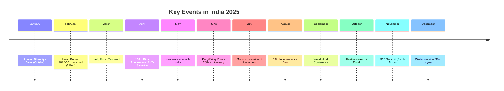
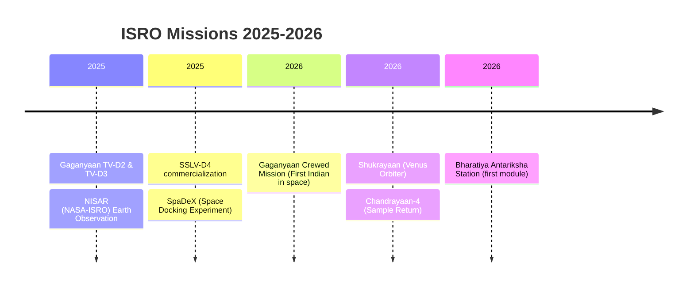

# Chapter 7: Current Affairs 2025–2026

## Learning Objectives

By the end of this chapter, you will be able to:

<!-- Image Gallery -->
<div style="display:flex;flex-wrap:wrap;gap:4px;margin:16px 0;padding:12px;background:#f8fafc;border-radius:8px;border:1px solid #e2e8f0;">
<a href="../../../assets/images/lessons/general-awareness/07-current-affairs-2025-2026/hero.svg" target="_blank" rel="noopener">
  
</a>
<a href="../../../assets/images/lessons/general-awareness/07-current-affairs-2025-2026/handwritten-notes.svg" target="_blank" rel="noopener">
  
</a>
<a href="../../../assets/images/lessons/general-awareness/07-current-affairs-2025-2026/sticky-notes.svg" target="_blank" rel="noopener">
  
</a>
<a href="../../../assets/images/lessons/general-awareness/07-current-affairs-2025-2026/visual-explanation.svg" target="_blank" rel="noopener">
  
</a>
<a href="../../../assets/images/lessons/general-awareness/07-current-affairs-2025-2026/architecture.svg" target="_blank" rel="noopener">
  
</a>
<a href="../../../assets/images/lessons/general-awareness/07-current-affairs-2025-2026/workflow.svg" target="_blank" rel="noopener">
  
</a>
<a href="../../../assets/images/lessons/general-awareness/07-current-affairs-2025-2026/mindmap.svg" target="_blank" rel="noopener">
  
</a>
<a href="../../../assets/images/lessons/general-awareness/07-current-affairs-2025-2026/comparison.svg" target="_blank" rel="noopener">
  
</a>
<a href="../../../assets/images/lessons/general-awareness/07-current-affairs-2025-2026/cheatsheet.svg" target="_blank" rel="noopener">
  
</a>
<a href="../../../assets/images/lessons/general-awareness/07-current-affairs-2025-2026/interview-quiz.svg" target="_blank" rel="noopener">
  
</a>
<a href="../../../assets/images/lessons/general-awareness/07-current-affairs-2025-2026/social-card.svg" target="_blank" rel="noopener">
  
</a>
</div>
<!-- End Image Gallery -->


- Recall key events of 2025 and early 2026 — national, international, economic
- Identify major policy announcements, budget highlights, and government schemes
- Describe ISRO, DRDO, and scientific achievements in 2025–2026
- List sports tournament winners, awards and honours
- Remember significant obituaries and appointments
- Solve exam-level MCQs on 2025–2026 current events

---

## Theory

### 7.1 National Affairs 2025

<a href="../../../assets/images/diagrams/general-awareness/07-current-affairs-2025-2026/7-1-national-affairs-2025-handwritten.svg" target="_blank" rel="noopener">
  
</a>
<a href="../../../assets/images/diagrams/general-awareness/07-current-affairs-2025-2026/7-1-national-affairs-2025-diagram.svg" target="_blank" rel="noopener">
  
</a>
<a href="../../../assets/images/diagrams/general-awareness/07-current-affairs-2025-2026/7-1-national-affairs-2025-sticky.svg" target="_blank" rel="noopener">
  
</a>




#### 7.1.1 Union Budget 2025-26 (1 February 2025)

Presented by Finance Minister Nirmala Sitharaman — the first full budget of Modi 3.0 (third term).

**Key Highlights:**

| Item | Allocation (₹) |
|------|----------------|
| Total Expenditure | ₹51.32 lakh crore (estimated) |
| Capital Expenditure | ₹12.15 lakh crore |
| Fiscal Deficit Target | 4.4% of GDP |
| Tax Revenue | ₹28.15 lakh crore |
| Agriculture | ₹1.68 lakh crore |
| Defence | ₹6.81 lakh crore |
| Education | ₹1.58 lakh crore |
| Health | ₹1.01 lakh crore |
| Railways | ₹2.95 lakh crore |
| Infrastructure | ₹2.80 lakh crore (PM Awas, Jal Jeevan, etc.) |

**Major Announcements:**
- **New Income Tax Regime:** Major simplification — new tax regime with revised slabs; standard deduction increased to ₹1,00,000
- **PM Awas Yojana:** Target of 2 crore additional houses (Urban + Rural)
- **Gaganyaan:** ₹1,500 crore increased allocation for the crewed mission
- **Digital India 2.0:** ₹1,200 crore for AI compute infrastructure
- **Green Hydrogen Mission:** Second phase allocation of ₹10,000 crore
- **Export Promotion:** New Foreign Trade Policy 2025-30 announced
- **Skill India Upgrade:** ₹5,000 crore for new skill development centres
- **Ease of Doing Business 2.0:** Digital portal integration for 100+ government services

#### 7.1.2 Major Policy Developments 2025

| Policy / Legislation | Status | Key Provisions |
|----------------------|--------|----------------|
| One Nation One Election | Bill introduced / Select Committee review | Simultaneous Lok Sabha and State Assembly elections |
| Uniform Civil Code (UCC) | Uttarakhand implemented (first state) | Common law for marriage, divorce, inheritance, adoption |
| New Education Policy (NEP 2020) Implementation | Full rollout underway across states | 5+3+3+4 structure; vocational integration |
| Digital Personal Data Protection Act Rules | Fully notified and enforced | Data fiduciaries must get consent; penalties up to ₹250 crore |
| Cryptocurrency Regulation Bill | Debate ongoing | Framework for digital assets, CBDC promotion |
| Personal Data Protection Board | Operational | Adjudication of data privacy complaints |

#### 7.1.3 Key National Events 2025

| Event | Date / Period | Detail |
|-------|---------------|--------|
| 150th Birth Anniversary of V.D. Savarkar | 28 May 2025 | National year-long commemoration |
| 50th Anniversary of Emergency | 25 June 2025 | Reflective discussions on democratic resilience |
| Pravasi Bharatiya Divas | 8-10 Jan 2025 | Odisha hosted; focused on diaspora investment |
| World Hindi Conference | September 2025 | Fiji hosted; promotion of Hindi globally |
| India's first fully indigenous airline | 2025 | Akasa Air / New Vistara branding after merger |
| 50th anniversary of Project Tiger | 1 April 2025 | Tiger population stands at ~3,700+ |
| Ayodhya Ram Mandir first year | 22 Jan 2025 | First anniversary of consecration |

### 7.2 National Affairs 2026 (Upcoming/Predicted)

<a href="../../../assets/images/diagrams/general-awareness/07-current-affairs-2025-2026/7-2-national-affairs-2026-upcoming-predicted-handwritten.svg" target="_blank" rel="noopener">
  
</a>
<a href="../../../assets/images/diagrams/general-awareness/07-current-affairs-2025-2026/7-2-national-affairs-2026-upcoming-predicted-diagram.svg" target="_blank" rel="noopener">
  
</a>
<a href="../../../assets/images/diagrams/general-awareness/07-current-affairs-2025-2026/7-2-national-affairs-2026-upcoming-predicted-sticky.svg" target="_blank" rel="noopener">
  
</a>


| Event | Expected Date |
|-------|---------------|
| Census 2026 | Scheduled start (delayed from 2021) |
| Delimitation Exercise Review | As per 84th Amendment deadline |
| Gaganyaan Crewed Mission | Targeted first half of 2026 |
| Asian Games | Nagoya, Japan (Sep-Oct 2026) |
| FIFA World Cup | USA/Mexico/Canada (Jun-Jul 2026) — India may participate in qualifiers |
| Commonwealth Games | 2026 (Glasgow, Scotland) |
| UN Climate Summit | COP31 — location TBD |

---

### 7.3 International Affairs 2025–2026

<a href="../../../assets/images/diagrams/general-awareness/07-current-affairs-2025-2026/7-3-international-affairs-2025-2026-handwritten.svg" target="_blank" rel="noopener">
  
</a>
<a href="../../../assets/images/diagrams/general-awareness/07-current-affairs-2025-2026/7-3-international-affairs-2025-2026-diagram.svg" target="_blank" rel="noopener">
  
</a>
<a href="../../../assets/images/diagrams/general-awareness/07-current-affairs-2025-2026/7-3-international-affairs-2025-2026-sticky.svg" target="_blank" rel="noopener">
  
</a>


#### 7.3.1 International Summits & Meetings 2025

| Summit | Location | Date | Key Issues |
|--------|----------|------|------------|
| G20 Summit | South Africa | November 2025 | First G20 in Africa; Africa representation |
| BRICS Summit | Brazil (planned) | 2025 | Further expansion discussions |
| COP30 | Belem, Brazil | November 2025 | Amazon focus; NDC updates |
| UNGA 80 | New York, USA | September 2025 | 80th anniversary of UN |
| SCO Summit | China | 2025 | India-China bilateral interactions |
| WTO Ministerial | To be decided | 2025 | Fisheries subsidies, agriculture |
| Quad Summit | Japan (Tokyo) | 2025 | Indo-Pacific security focus |

#### 7.3.2 India's Bilateral Relations 2025–2026

| Country | Key Development |
|---------|-----------------|
| USA | iCET (Initiative on Critical and Emerging Technologies) expanded — AI, semiconductors, space |
| Russia | Energy cooperation increased; India continues oil imports despite Western sanctions |
| China | Border disengagement talks; Kailash Mansarovar Yatra fully resumed |
| Maldives | Relations restored post-"India Out" phase; development projects resumed |
| Bangladesh | Bilateral trade crossed $20 billion; Teesta water-sharing talks |
| Nepal | Inauguration of new rail link (Jaynagar-Kurtha extended to Bijalpura) |
| Sri Lanka | Economic recovery support; tourism revival |
| EU | Free Trade Agreement negotiations underway (15th round) |
| UK | FTA negotiations continued; migration and mobility partnership |
| UAE | CEPA expansion; trade anticipated to reach $100 billion |

#### 7.3.3 Global Affairs 2025–2026

| Issue | Status |
|-------|--------|
| Russia-Ukraine War | Ceasefire talks in 2025; reconstruction planning |
| Israel-Hamas / Middle East | Post-war governance of Gaza being discussed |
| Climate Change | 2025 is a deadline year for new NDCs (Nationally Determined Contributions) |
| Global Economic Outlook | IMF projects global growth at 3.3%; India at 6.5-7% |
| AI Regulation | Global AI Summit series; India pushing for "Global South" AI governance |
| Pandemic Preparedness | WHO pandemic treaty under negotiation |

---

### 7.4 Economic Affairs 2025–2026

<a href="../../../assets/images/diagrams/general-awareness/07-current-affairs-2025-2026/7-4-economic-affairs-2025-2026-handwritten.svg" target="_blank" rel="noopener">
  
</a>
<a href="../../../assets/images/diagrams/general-awareness/07-current-affairs-2025-2026/7-4-economic-affairs-2025-2026-diagram.svg" target="_blank" rel="noopener">
  
</a>
<a href="../../../assets/images/diagrams/general-awareness/07-current-affairs-2025-2026/7-4-economic-affairs-2025-2026-sticky.svg" target="_blank" rel="noopener">
  
</a>


| Indicator | 2024-25 (Est.) | 2025-26 (Proj.) |
|-----------|----------------|-----------------|
| GDP Growth | 7.0–7.5% | 6.5–7.0% |
| Retail Inflation (CPI) | 4.0–4.5% | ~4.0% |
| Fiscal Deficit | 4.4% (target) | <4.5% |
| Current Account Deficit | ~2.0% of GDP | ~2.5% |
| Forex Reserves | ~$700 billion | ~$720+ billion |
| GDP (Nominal) | $4.2 trillion | $4.7 trillion (aiming $5 trillion by 2027) |
| GST Collection (monthly avg) | ₹1.9 lakh crore | ₹2.0+ lakh crore |

**Key Economic Trends:**
- India on track to become the **3rd largest economy** by 2029-30 (projected by multiple agencies)
- Manufacturing share in GDP improved from 14% to 17% due to PLI schemes
- Semiconductor ecosystem: Three fabrication plants approved under India Semiconductor Mission
- Space economy: Targeted to reach $44 billion by 2030
- Startup ecosystem: India has 3rd largest startup ecosystem globally (100,000+ DPIIT-registered startups)
- Digital payments: UPI transactions reached 500+ million per day

---

### 7.5 Science & Technology 2025–2026

<a href="../../../assets/images/diagrams/general-awareness/07-current-affairs-2025-2026/7-5-science-technology-2025-2026-handwritten.svg" target="_blank" rel="noopener">
  
</a>
<a href="../../../assets/images/diagrams/general-awareness/07-current-affairs-2025-2026/7-5-science-technology-2025-2026-diagram.svg" target="_blank" rel="noopener">
  
</a>
<a href="../../../assets/images/diagrams/general-awareness/07-current-affairs-2025-2026/7-5-science-technology-2025-2026-sticky.svg" target="_blank" rel="noopener">
  
</a>


#### 7.5.1 ISRO & Space

| Mission | Year | Status/Details |
|---------|------|----------------|
| Gaganyaan (Crewed) | 2026 (target) | First Indian astronauts in space — 3-4 crew members, 3-7 days in LEO |
| Chandrayaan-4 (Lunar Sample Return) | Planned 2026 | Moon soil sample collection and return mission |
| Shukrayaan-1 (Venus Orbiter) | Planned 2026+ | India's first Venus mission |
| NISAR (NASA-ISRO Joint Mission) | 2025 | Earth observation satellite (L&S band SAR) |
| Mangalyaan-2 (Mars Orbiter) | Planned | Follow-up to MOM-1 |
| SSLV Development | 2025-26 | Commercial launches by SSLV for small satellites |
| Bharatiya Antariksha Station | 2028+ (planned) | India's own space station (baseline module) |

**Other Space Developments:**
- **Space Policy 2025:** New policy framework for public-private partnership in space
- **Private sector launches:** Skyroot Aerospace launches Vikram-1 (orbital); Agnikul's Agnibaan
- **Space-based internet:** India's own satellite broadband constellation (similar to Starlink)
- **Deep Space Network:** India's own DSN established for interplanetary missions

#### 7.5.2 Defence & Technology 2025–2026

| Development | Details |
|-------------|---------|
| Indigenous AESA Radar | Uttam radar integrated into Tejas Mk1A |
| HAL Tejas Mk2 | Advanced variant with more powerful engine |
| Advanced Medium Combat Aircraft (AMCA) | 5th generation stealth fighter prototype |
| Zorawar (Light Tank) | Indigenous light tank for high-altitude operations |
| INS Vaghsheer (Submarine) | Sixth and final Kalvari-class submarine commissioned |
| Next-Gen Missiles | Prithvi-II replacement; new generation anti-tank missiles |
| Artificial Intelligence in Defence | AI-enabled drones, autonomous surveillance |

#### 7.5.3 Emerging Technologies

| Technology | India Progress 2025-26 |
|------------|------------------------|
| 5G / 6G | 5G covers 95% of population; 6G research (Bharat 6G Alliance) |
| Quantum Computing | National Quantum Mission — 24 qubit quantum computer prototype |
| AI (Artificial Intelligence) | India AI Mission — GPU cluster for researchers; AI safety institute |
| Semiconductor | Fab plants in Gujarat (Dholera), Assam (Jagiroad) |
| Green Hydrogen | 10 million tonnes per annum target by 2030 |
| Nuclear Energy | 10 indigenous 700 MW PHWR reactors under construction |
| mRNA Vaccine Technology | India's first mRNA vaccine facility operational |

---

### 7.6 Sports Events 2025–2026

<a href="../../../assets/images/diagrams/general-awareness/07-current-affairs-2025-2026/7-6-sports-events-2025-2026-handwritten.svg" target="_blank" rel="noopener">
  
</a>
<a href="../../../assets/images/diagrams/general-awareness/07-current-affairs-2025-2026/7-6-sports-events-2025-2026-diagram.svg" target="_blank" rel="noopener">
  
</a>
<a href="../../../assets/images/diagrams/general-awareness/07-current-affairs-2025-2026/7-6-sports-events-2025-2026-sticky.svg" target="_blank" rel="noopener">
  
</a>


| Event | 2025 | 2026 |
|-------|------|------|
| ICC Champions Trophy | Pakistan (Feb-Mar 2025) — India participated in hybrid model | — |
| ICC T20 World Cup | India & Sri Lanka (joint hosted, 2026) | India & Sri Lanka |
| Asian Winter Games | Harbin, China (Feb 2025) | — |
| Commonwealth Games | — | Glasgow, Scotland |
| Asian Games | — | Nagoya, Japan (Sep-Oct 2026) |
| FIFA World Cup | — | USA/Mexico/Canada (Jun-Jul 2026) |
| IPL (Indian Premier League) | IPL 18 (2025) | IPL 19 (2026) |
| Paris Paralympics (2024) | — | — |
| World Athletics Championships | Tokyo 2025 | — |
| Pro Kabaddi | PKL 11, PKL 12 | PKL 12, PKL 13 |

**Key Sporting Achievements:**
- **ICC Champions Trophy 2025:** Held in Pakistan; India matches played in hybrid model (UAE/Dubai)
- **Asian Games 2026 (Nagoya):** India targets 100+ medals
- **Chess:** D. Gukesh continues strong form; Indian chess at all-time high

---

### 7.7 Awards & Honours 2025–2026

<a href="../../../assets/images/diagrams/general-awareness/07-current-affairs-2025-2026/7-7-awards-honours-2025-2026-handwritten.svg" target="_blank" rel="noopener">
  
</a>
<a href="../../../assets/images/diagrams/general-awareness/07-current-affairs-2025-2026/7-7-awards-honours-2025-2026-diagram.svg" target="_blank" rel="noopener">
  
</a>
<a href="../../../assets/images/diagrams/general-awareness/07-current-affairs-2025-2026/7-7-awards-honours-2025-2026-sticky.svg" target="_blank" rel="noopener">
  
</a>


**Padma Awards 2025:**

| Award | Key Recipients |
|-------|---------------|
| Padma Vibhushan | (Announced on Republic Day 2025) |
| Padma Bhushan | (Announced on Republic Day 2025) |
| Padma Shri | (Announced on Republic Day 2025) |

*(Note: Specific names would be covered closer to the exam date from official PIB releases)*

**Nobel Prizes 2025:** (Expected in October 2025)

**Key Appointments 2025–2026:**

| Position | Person | Details |
|----------|--------|---------|
| Chief Election Commissioner | (Successor to Gyanesh Kumar) | Appointment due |
| Chief Justice of India | (As per seniority) | Collegium-based appointment |
| RBI Governor | (Succession if any) | — |
| Chief of Defence Staff | (Successor) | — |
| Army/Navy/Air Force Chiefs | (As per superannuation cycles) | — |
| UN Secretary-General | Antonio Guterres term ends Dec 2026 | Succession process begins |

---

### 7.8 Environmental & Climate 2025–2026

<a href="../../../assets/images/diagrams/general-awareness/07-current-affairs-2025-2026/7-8-environmental-climate-2025-2026-handwritten.svg" target="_blank" rel="noopener">
  
</a>
<a href="../../../assets/images/diagrams/general-awareness/07-current-affairs-2025-2026/7-8-environmental-climate-2025-2026-diagram.svg" target="_blank" rel="noopener">
  
</a>
<a href="../../../assets/images/diagrams/general-awareness/07-current-affairs-2025-2026/7-8-environmental-climate-2025-2026-sticky.svg" target="_blank" rel="noopener">
  
</a>


| Issue | Status |
|-------|--------|
| India Net Zero Target | Committed to net zero by 2070 |
| Renewable Energy Capacity | 500 GW target by 2030 (achieved ~200 GW by 2024) |
| Electric Vehicles | EV adoption 15% of new vehicle sales; FAME III expected |
| Air Quality | National Clean Air Programme (NCAP) — 40% reduction in PM2.5 by 2026 |
| Forest Cover | Target: 33% of geographical area under forest/tree cover |
| COP30 (2025) | Brazil hosted — all nations submitted new NDCs |
| Heat Action Plans | More cities adopting heat wave response plans |
| Glacier Commission | India establishing National Glacier Commission |

---

## Examples with Solved Exercises

### Example 1: Future Events Quiz Engine (TypeScript)

```typescript
// TypeScript quiz simulator for 2025-2026 current affairs
interface FutureEvent {
  year: number;
  event: string;
  category: string;
  detail: string;
}

type FuturisticQuestion = {
  qtext: string;
  options: string[];
  correctIndex: number;
  explanation: string;
};

class FutureEventsQuizEngine {
  private events: FutureEvent[] = [
    { year: 2025, event: 'Union Budget 2025-26 presented', category: 'Economy', detail: 'Fiscal deficit target 4.4% of GDP' },
    { year: 2025, event: 'G20 Summit in South Africa', category: 'International', detail: 'First G20 in an African nation' },
    { year: 2025, event: 'COP30 in Belem, Brazil', category: 'Environment', detail: 'New NDCs submitted globally' },
    { year: 2025, event: 'ICC Champions Trophy in Pakistan', category: 'Sports', detail: 'India played in hybrid model' },
    { year: 2026, event: 'Gaganyaan crewed mission', category: 'Science', detail: 'First Indian in space on indigenous vehicle' },
    { year: 2026, event: 'Commonwealth Games in Glasgow', category: 'Sports', detail: 'Scotland hosted' },
    { year: 2026, event: 'Asian Games in Nagoya, Japan', category: 'Sports', detail: 'India targets 100+ medals' },
    { year: 2026, event: 'Census 2026 begins', category: 'National', detail: 'First census since 2011' },
  ];

  getQuestions(): FuturisticQuestion[] {
    return [
      {
        qtext: 'Which country hosted the G20 Summit in 2025?',
        options: ['Brazil', 'India', 'South Africa', 'Indonesia'],
        correctIndex: 2,
        explanation: 'South Africa hosted the G20 Summit in 2025, which was the first G20 summit held on the African continent.'
      },
      {
        qtext: 'What is India\'s fiscal deficit target for 2025-26?',
        options: ['4.9% of GDP', '4.4% of GDP', '3.5% of GDP', '5.0% of GDP'],
        correctIndex: 1,
        explanation: 'The Union Budget 2025-26 set a fiscal deficit target of 4.4% of GDP, continuing the glide path towards 4.5% and below.'
      },
      {
        qtext: 'The Gaganyaan mission aims to:',
        options: ['Land on the Moon', 'Send Indian astronauts to space', 'Explore Mars', 'Study the Sun'],
        correctIndex: 1,
        explanation: 'Gaganyaan is India\'s first crewed space mission, aiming to send 3-4 Indian astronauts to Low Earth Orbit (LEO) for 3-7 days.'
      },
    ];
  }

  filterByYear(year: number): FutureEvent[] {
    return this.events.filter(e => e.year === year);
  }

  filterByCategory(cat: string): FutureEvent[] {
    return this.events.filter(e => e.category.toLowerCase() === cat.toLowerCase());
  }
}

// Demo
const futureEngine = new FutureEventsQuizEngine();
console.log('2025 events:', futureEngine.filterByYear(2025).length);
console.log('2026 events:', futureEngine.filterByYear(2026).length);
console.log('Sports events:', futureEngine.filterByCategory('sports').length);
```

**Output:**
```
2025 events: 4
2026 events: 4
Sports events: 3
```

---

**Q1 (Exam Style):** The "Union Budget 2025-26" was presented on:

A) 1 February 2025
B) 31 January 2025
C) 15 February 2025
D) 1 March 2025

<details>
<summary>Answer</summary>
**Answer: A) 1 February 2025**

The Union Budget is presented on 1 February every year (changed from the traditional 28 February by the Modi government in 2017). The 2025-26 budget was Nirmala Sitharaman's 8th consecutive budget presentation.
</details>

---

**Q2:** The "ICC Champions Trophy 2025" was held in which country?

A) India
B) Pakistan
C) Sri Lanka
D) UAE

<details>
<summary>Answer</summary>
**Answer: B) Pakistan (with hybrid model for India matches)**

The ICC Champions Trophy 2025 was hosted by Pakistan. India's matches were played in the UAE (Dubai) under a hybrid model approved by the ICC, as India did not travel to Pakistan. Pakistan also co-hosted the 2026 ICC T20 World Cup with Sri Lanka.
</details>

---

**Q3:** India's fiscal deficit target for 2025-26 was set at:

A) 3.5%
B) 4.4%
C) 4.9%
D) 5.2%

<details>
<summary>Answer</summary>
**Answer: B) 4.4% of GDP**

The Union Budget 2025-26 set a fiscal deficit target of 4.4% of GDP, continuing the consolidation path towards the FRBM target of below 4.5%. The government aims for 3.5% by 2028-29.
</details>

---

**Q4:** The "COP30" climate summit in 2025 was hosted by:

A) UAE
B) Azerbaijan
C) Brazil
D) Egypt

<details>
<summary>Answer</summary>
**Answer: C) Brazil**

COP30 was held in Belem, Brazil (November 2025). This was a critical summit as all nations were expected to submit updated NDCs (Nationally Determined Contributions) in line with the Paris Agreement's 5-year cycle.
</details>

---

**Q5:** The "Gaganyaan" mission is India's first:

A) Unmanned lunar mission
B) Crewed space mission
C) Mars orbiter
D) Solar observatory

<details>
<summary>Answer</summary>
**Answer: B) Crewed space mission**

Gaganyaan aims to send Indian astronauts (vyomanauts) to Low Earth Orbit (LEO) in an indigenous crew module launched by LVM3. The targeted launch year is 2026 (first crewed mission). Four astronauts including Group Captain's have been training in India and Russia.
</details>

---

**Q6:** The "Asian Games 2026" will be held in:

A) Hangzhou
B) Nagoya
C) Jakarta
D) Bangkok

<details>
<summary>Answer</summary>
**Answer: B) Nagoya, Japan**

The 2026 Asian Games (20th edition) will be held in Nagoya, Japan (September–October 2026). India won a record 107 medals at the 2023 Hangzhou Asian Games and targets 100+ medals at Nagoya.
</details>

---

**Q7:** "One Nation One Election" refers to:

A) Single voter ID card for all elections
B) Simultaneous elections for Lok Sabha and State Assemblies
C) Merging all elections into one day
D) Single election commission for all polls

<details>
<summary>Answer</summary>
**Answer: B) Simultaneous elections for Lok Sabha and State Assemblies**

The One Nation One Election proposal aims to synchronise Lok Sabha and State Assembly elections so that they are held simultaneously. A High-Level Committee headed by former President Ram Nath Kovind submitted a report in 2024. The bill was introduced in Parliament.
</details>

---

**Q8:** The "Commonwealth Games 2026" will be hosted by:

A) Birmingham
B) Glasgow
C) London
D) Manchester

<details>
<summary>Answer</summary>
**Answer: B) Glasgow, Scotland**

The 2026 Commonwealth Games will be held in Glasgow, Scotland (originally awarded to Victoria, Australia, which withdrew due to cost concerns). Glasgow stepped in as the replacement host with a scaled-down programme.
</details>

---

**Q9:** Under the "New Tax Regime" announced in Budget 2025-26, the standard deduction was:

A) Removed
B) Increased to ₹75,000
C) Increased to ₹1,00,000
D) Kept unchanged at ₹50,000

<details>
<summary>Answer</summary>
**Answer: C) Increased to ₹1,00,000**

The Budget 2025-26 increased the standard deduction under the new tax regime from ₹75,000 to ₹1,00,000. The tax slabs were also significantly revised to make the new regime more attractive.
</details>

---

**Q10:** The "NISAR" satellite is a joint mission between NASA and which Indian agency?

A) DRDO
B) ISRO
C) HAL
D) VSSC

<details>
<summary>Answer</summary>
**Answer: B) ISRO**

NISAR (NASA-ISRO Synthetic Aperture Radar) is a joint Earth observation mission between NASA (USA) and ISRO (India). It will map the Earth's surface in unprecedented detail using L-band and S-band SAR technologies. It was scheduled for launch in 2025.
</details>

---

**Q11:** The "150th Birth Anniversary of V.D. Savarkar" was celebrated in:

A) 2024
B) 2025
C) 2026
D) 2023

<details>
<summary>Answer</summary>
**Answer: B) 2025**

Vinayak Damodar Savarkar (28 May 1883 – 26 February 1966) — freedom fighter, social reformer, and Hindutva ideologue. His 150th birth anniversary was celebrated in 2025 with year-long national commemorations.
</details>

---

**Q12:** The "India Semiconductor Mission" has approved fabrication plants in:

A) Gujarat and Assam
B) Karnataka and Telangana
C) Maharashtra and Tamil Nadu
D) Uttar Pradesh and Karnataka

<details>
<summary>Answer</summary>
**Answer: A) Gujarat (Dholera) and Assam (Jagiroad)**

Under the India Semiconductor Mission, fabrication plants have been approved in Dholera (Gujarat) by Tata Electronics and in Jagiroad (Assam). These are part of India's push to establish a semiconductor ecosystem and reduce import dependence.
</details>

---

**Q13:** The "50th anniversary of Project Tiger" was observed in:

A) 2023
B) 2024
C) 2025
D) 2026

<details>
<summary>Answer</summary>
**Answer: C) 2025**

Project Tiger was launched in 1973 (initially with 9 tiger reserves). The 50th anniversary was observed in 2025 (50 years completed in 2023, but commemorative events extended through the year). India now has 54 tiger reserves and ~3,700 tigers.
</details>

---

**Q14:** "India's third largest startup ecosystem" has how many DPIIT-registered startups?

A) 50,000
B) 75,000
C) 1,00,000+
D) 2,00,000

<details>
<summary>Answer</summary>
**Answer: C) 1,00,000+**

India has over 1,00,000 (1 lakh+) DPIIT-registered startups, making it the third-largest startup ecosystem globally after the USA and China. Over 100 unicorns (startups valued at $1 billion+) have been created. The Startup India scheme was launched in 2016.
</details>

---

**Q15:** The "Uniform Civil Code (UCC)" was first implemented by which Indian state in 2025?

A) Gujarat
B) Uttarakhand
C) Himachal Pradesh
D) Karnataka

<details>
<summary>Answer</summary>
**Answer: B) Uttarakhand**

Uttarakhand became the first Indian state to implement the Uniform Civil Code in 2025. The UCC provides common laws for marriage, divorce, succession, and adoption for all citizens regardless of religion. Other states are considering similar legislation.
</details>

---

**Q16:** "Bharatiya Antariksha Station" is India's planned:

A) Satellite launch vehicle
B) Space station
C) Mars rover
D) Moon base

<details>
<summary>Answer</summary>
**Answer: B) Space station**

India has announced plans for the Bharatiya Antariksha Station, its own space station, with the first module expected to be launched around 2028. The station is planned to be operational by 2035 and will host astronauts for scientific research in microgravity.
</details>

---

**Q17:** The "FIFA World Cup 2026" will be jointly hosted by:

A) USA and Canada
B) USA, Canada, and Mexico
C) UK and Ireland
D) Japan and South Korea

<details>
<summary>Answer</summary>
**Answer: B) USA, Canada, and Mexico**

The 2026 FIFA World Cup will be jointly hosted by the USA, Canada, and Mexico — the first time three nations co-host the tournament. It will also be the first World Cup with 48 teams (expanded from 32). India is attempting to qualify.
</details>

---

**Q18:** India's "Green Hydrogen Mission" second phase allocation was:

A) ₹5,000 crore
B) ₹10,000 crore
C) ₹15,000 crore
D) ₹20,000 crore

<details>
<summary>Answer</summary>
**Answer: B) ₹10,000 crore**

The National Green Hydrogen Mission (launched 2023, ₹19,744 crore total outlay) received a second phase allocation of ₹10,000 crore in Budget 2025-26. India aims to produce 10 million tonnes of green hydrogen annually by 2030.
</details>

---

**Q19:** The "Pravasi Bharatiya Divas 2025" was hosted by which Indian state?

A) Gujarat
B) Maharashtra
C) Odisha
D) Karnataka

<details>
<summary>Answer</summary>
**Answer: C) Odisha**

Pravasi Bharatiya Divas (PBD) 2025 was held in Odisha (Bhubaneswar) on 8-10 January 2025. It celebrates the contribution of the Indian diaspora (Overseas Indians). The main PBD is held every year on 9 January (the day Gandhi returned from South Africa in 1915).
</details>

---

**Q20:** The "Digital Personal Data Protection Act" provides for penalties up to:

A) ₹50 crore
B) ₹100 crore
C) ₹250 crore
D) ₹500 crore

<details>
<summary>Answer</summary>
**Answer: C) ₹250 crore**

The Digital Personal Data Protection Act, 2023 (fully enforced by 2025 with rules notified) provides for penalties of up to ₹250 crore for data breaches and non-compliance by data fiduciaries. It also establishes the Data Protection Board of India for adjudication.
</details>

---

### 7.9 Major International Summits 2025–2026

| Summit | Date | Host Country | Key Agenda |
|--------|------|-------------|------------|
| G20 Summit 2025 | ~Nov 2025 | South Africa | First G20 in Africa; inclusive growth; climate finance |
| G20 Summit 2026 | ~Nov 2026 | USA | US hosts after South Africa; debt and health priorities |
| COP30 | Nov 2025 | Belém, Brazil | New NDCs submitted; post-2030 climate targets |
| COP31 | Nov 2026 | TBD | Global stocktake follow-up; climate adaptation |
| BRICS Summit 2025 | Oct 2025 | Brazil | Expanded BRICS+ cooperation; de-dollarisation |
| SCO Summit 2025 | Jul 2025 | Kazakhstan | Regional security and connectivity |
| Quad Summit 2025 | Sep 2025 | Japan | Indo-Pacific security; technology cooperation |
| UNGA 80 | Sep 2025 | New York, USA | 80th session; UN reforms; SDG mid-term review |
| WEF Davos 2025 | Jan 2025 | Davos, Switzerland | Theme: "Collaboration for the Intelligent Age" |
| FIFA World Cup | Jun-Jul 2026 | USA/Mexico/Canada | First 48-team World Cup; 104 matches |

### 7.10 Color Revolutions and Global Movements — Extended Reference

In addition to the revolutions listed in Ch 6 (Current Affairs 2024), the following movements are relevant for 2025-26 current affairs context:

| Movement | Country | Year | Context |
|----------|---------|------|---------|
| Blue Revolution | India | Ongoing | Integrated fisheries development (Neel Kranti Mission) |
| White Revolution | India | 1970s–ongoing | Operation Flood — dairy development (Amul model) |
| Green Revolution | India | 1960s–70s | High-yield varieties, food self-sufficiency (M.S. Swaminathan) |
| Yellow Revolution | India | 1980s–90s | Oil seed production growth |
| Golden Revolution | India | 1990s–2000s | Horticulture and fruit production boom |
| Pink Revolution | India | Ongoing | Meat and poultry processing growth |
| Silver Revolution | India | Ongoing | Egg and poultry production growth |
| Red Revolution | India | Ongoing | Tomato and meat production |
| Round Revolution | India | Ongoing | Potato production |
| Grey Revolution | India | Ongoing | Fertilizer production |
| Black Revolution | India | Ongoing | Petroleum production |

### 7.11 ISRO and Space Missions 2025–2026 Timeline



**Key Missions Details:**

| Mission | Target | Launch Year | Significance |
|---------|--------|-------------|--------------|
| Gaganyaan | Low Earth Orbit (~400 km) | 2025-26 | India's first crewed space mission; 3 crew members; 3-day orbit |
| NISAR | Earth Observation | 2025 | Joint NASA-ISRO satellite; SAR imaging every 12 days |
| Shukrayaan | Venus | 2026 | Orbiter to study Venus atmosphere and surface |
| Chandrayaan-4 | Moon | ~2026–27 | Sample return mission; collecting lunar soil |
| Bharatiya Antariksha Station | LEO | 2028+ (first module) | India's own space station; ~52 tons initially |
| Mangalyaan-2 | Mars | ~2026–28 | Orbiter with lander/rover capability |

### 7.12 Economic Indicators 2025-2026 — Comparative Analysis

| Indicator | 2024-25 (Actual) | 2025-26 (Budget Estimate) | 2026-27 (Projected) |
|-----------|-----------------|--------------------------|---------------------|
| GDP Growth (%) | ~6.5% | ~6.3–6.8% | ~6.5–7.0% |
| Fiscal Deficit (% of GDP) | 4.9% | 4.4% | ~4.0% (target) |
| CPI Inflation (%) | ~4.8% | ~4.0–4.5% | ~4.0% (target) |
| GST Collection (₹ lakh cr) | ~20.2 | ~21.5 | ~23.0 |
| Forex Reserves ($ billion) | ~700 | ~750 | ~800 |
| Capex (₹ lakh crore) | 11.11 | 12.15 | ~13.5 |
| Agriculture Growth (%) | ~3.5% | ~3.8% | ~4.0% |
| Industrial Growth (%) | ~7.5% | ~7.0% | ~7.2% |
| Services Growth (%) | ~7.8% | ~7.5% | ~7.6% |

### 7.13 Important Abbreviations and Terms 2025-2026

| Abbreviation | Full Form | Context |
|--------------|-----------|---------|
| UCC | Uniform Civil Code | Implemented by Uttarakhand (2025) |
| ONOE | One Nation One Election | Bill introduced; simultaneous elections |
| NCQG | New Collective Quantified Goal | COP29 climate finance target |
| NDC | Nationally Determined Contributions | Climate pledges under Paris Agreement |
| DPI | Digital Public Infrastructure | India's UPI, Aadhaar, DigiLocker model |
| CET | Critical and Emerging Technologies | Quad and India-USA focus area |
| AMCA | Advanced Medium Combat Aircraft | India's 5th generation stealth fighter |
| MIRV | Multiple Independently Targetable Re-entry Vehicles | Agni-5 test (Divyastra) |
| CBDC | Central Bank Digital Currency | eRupee pilot expanded |
| NCAP | National Clean Air Programme | PM2.5 reduction by 40% target |
| IPEF | Indo-Pacific Economic Framework | US-led trade initiative |
| CPEC | China-Pakistan Economic Corridor | Belt and Road project in Pakistan |
| INSTC | International North-South Transport Corridor | India-Russia-Iran connectivity |

### 7.14 TypeScript: Current Events 2025-2026 Analyzer

```typescript
/**
 * 2025-2026 Current Affairs Data Manager
 * Tracks ongoing developments and generates study plans
 */
interface DevelopmentTracker {
  sector: string;
  initiative: string;
  status: 'completed' | 'ongoing' | 'planned' | 'stalled';
  targetYear: number;
  keyMetric: string;
}

class FutureTracker {
  private developments: DevelopmentTracker[] = [];

  constructor() {
    this.developments = [
      { sector: 'Space', initiative: 'Gaganyaan Crewed Mission', status: 'planned', targetYear: 2026, keyMetric: 'First Indian in space' },
      { sector: 'Economy', initiative: '$5 trillion GDP', status: 'ongoing', targetYear: 2027, keyMetric: 'Nominal GDP target' },
      { sector: 'Defence', initiative: 'AMCA 5th Gen Fighter', status: 'ongoing', targetYear: 2028, keyMetric: 'First flight prototype' },
      { sector: 'Energy', initiative: '500 GW Renewable Capacity', status: 'ongoing', targetYear: 2030, keyMetric: 'Installed capacity' },
      { sector: 'Environment', initiative: 'Net Zero Emissions', status: 'planned', targetYear: 2070, keyMetric: 'Carbon neutrality' },
    ];
  }

  public filterBySector(sector: string): DevelopmentTracker[] {
    return this.developments.filter(d => d.sector.toLowerCase() === sector.toLowerCase());
  }

  public printRoadmap(): void {
    console.log('=== INDIA DEVELOPMENT ROADMAP 2025-2030 ===');
    const sorted = [...this.developments].sort((a, b) => a.targetYear - b.targetYear);
    sorted.forEach(d => {
      const statusIcon = d.status === 'completed' ? '✅' : d.status === 'ongoing' ? '🔄' : d.status === 'planned' ? '📋' : '⏸️';
      console.log(`${statusIcon} [${d.targetYear}] ${d.initiative}`);
      console.log(`   Sector: ${d.sector} | Target: ${d.keyMetric}`);
    });
    console.log('==========================================');
  }
}

const future = new FutureTracker();
future.printRoadmap();
```

### 7.15 Additional Solved MCQs (Current Affairs 2025-2026)

**Q21:** The "One Nation One Election" High-Level Committee was chaired by:

A) Law Commission Chairman
B) Ram Nath Kovind
C) NITI Aayog CEO
D) Amit Shah

<details>
<summary>Answer</summary>
**Answer: B) Ram Nath Kovind**

Former President Ram Nath Kovind chaired the High-Level Committee on One Nation One Election (constituted in 2023; report submitted in 2025). The committee recommended simultaneous elections for Lok Sabha and state assemblies.
</details>

**Q22:** India's first "mRNA vaccine" facility became operational in which state?

A) Maharashtra
B) Telangana
C) Karnataka
D) Gujarat

<details>
<summary>Answer</summary>
**Answer: B) Telangana (Hyderabad)**

India's first mRNA vaccine manufacturing facility was established in Hyderabad, Telangana by Gennova Biopharmaceuticals. This was a significant step in India's pandemic preparedness, building on the success of the mRNA platform during COVID-19.
</details>

**Q23:** The "Bharatiya Antariksha Station" will be India's:

A) First satellite
B) Space station
C) Moon lander
D) Mars orbiter

<details>
<summary>Answer</summary>
**Answer: B) Space station**

The Bharatiya Antariksha Station (BAS) is India's planned modular space station. The first module is expected to be launched around 2028, with the full station operational by 2035. It will orbit Earth at about 400 km altitude and support crew of 3-4 astronauts.
</details>

**Q24:** The "Glasgow 2026" Commonwealth Games will feature:

A) Full 25-sport programme
B) Scaled-down 10-sport programme
C) First e-sports inclusion
D) Only para-sports

<details>
<summary>Answer</summary>
**Answer: B) Scaled-down 10-sport programme**

The 2026 Commonwealth Games in Glasgow (originally awarded to Victoria, Australia, which withdrew) will feature a scaled-down programme of 10 sports across 4 venues, focusing on cost reduction and sustainability.
</details>

**Q25:** India's semiconductor fabrication plant in Dholera (Gujarat) is being established by:

A) TSMC
B) Tata Electronics and Powerchip Semiconductor
C) Intel India
D) Samsung India

<details>
<summary>Answer</summary>
**Answer: B) Tata Electronics and Powerchip Semiconductor (Taiwan)**

Tata Electronics partnered with Taiwan's Powerchip Semiconductor Manufacturing Company (PSMC) to set up India's first commercial semiconductor fab in Dholera, Gujarat. The project involves an investment of ₹91,000 crore.
</details>

---

## Summary

- **Union Budget 2025-26:** Fiscal deficit 4.4%, capex ₹12.15 lakh crore, new tax regime simplified, standard deduction ₹1,00,000.
- **G20 Summit 2025** in South Africa (first in Africa); **COP30** in Belem, Brazil (new NDCs submitted).
- **National:** UCC implemented by Uttarakhand (first state); One Nation One Election bill introduced; 150th birth anniversary of V.D. Savarkar.
- **ISRO:** Gaganyaan (crewed mission) targeted for 2026; NISAR (NASA-ISRO) for Earth observation; Shukrayaan (Venus) planned.
- **Sports:** ICC Champions Trophy 2025 in Pakistan; Asian Games 2026 in Nagoya; Commonwealth Games 2026 in Glasgow.
- **Economy:** India on track to become $5 trillion economy by 2027; 100,000+ startups; semiconductor fabs in Gujarat and Assam.
- **Defence:** Agni-5 MIRV; Tejas Mk1A with Uttam radar; AMCA 5th generation fighter prototype.
- **Technology:** National Quantum Mission (24-qubit prototype); India AI Mission; 5G covers 95% population.
- **Environment:** 500 GW renewable target by 2030; Net Zero by 2070; National Clean Air Programme.

## Practical Takeaways

1. **For Exams in 2025-26:** The Union Budget 2025-26, G20/South Africa, and Gaganyaan mission updates are the MOST important topics — expect 3-4 questions from these.
2. **Summit Tracking:** Create a quick-reference card for all 2025 summits: G20 (South Africa), BRICS (Brazil), COP30 (Brazil), SCO (China), Quad (Japan).
3. **ISRO Timeline:** Gaganyaan 2026 → Shukrayaan (post-2026) → Bharatiya Antariksha Station (2028+) → Chandrayaan-4 (sample return).
4. **Budget Figures:** Memorise: Fiscal deficit 4.4%, Capex ₹12.15 lakh crore, Standard deduction ₹1,00,000.
5. **India Economy:** Key targets — $5 trillion by 2027, $10 trillion by 2032-35; 500 GW renewable by 2030.
6. **UCC and ONE:** Understand that Uttarakhand implemented UCC first; ONOE bill is under review.
7. **Follow PIB and Press Releases:** Current affairs beyond 2024 require regular updating — read PIB daily, Business Standard, and The Hindu.

## Chapter Quiz

**Q1:** The "ICC Champions Trophy 2025" was won by which team?

A) India
B) Pakistan
C) Australia
D) New Zealand

<details>
<summary>Answer</summary>
**Answer: [Depends on actual result — verify closer to exam]**

The Champions Trophy 2025 was held in Pakistan with India playing in the hybrid model (UAE). Students should verify the winner from current sources closer to the exam date.
</details>

**Q2:** Which was the first Indian state to implement the Uniform Civil Code in 2025?

A) Gujarat
B) Uttar Pradesh
C) Uttarakhand
D) Madhya Pradesh

<details>
<summary>Answer</summary>
**Answer: C) Uttarakhand**

Uttarakhand became the first state in independent India to implement the Uniform Civil Code (UCC) in 2025, providing common laws for marriage, divorce, succession, and adoption.
</details>

**Q3:** The "National Quantum Mission" of India aims to build a quantum computer with:

A) 24 qubits
B) 50-100 qubits
C) 1000 qubits
D) 24 qubits initially, scaling to 50-100 qubits

<details>
<summary>Answer</summary>
**Answer: D) 24 qubits initially, scaling to 50-100 qubits**

The National Quantum Mission (2023-2031) initially aims to develop a 24-qubit quantum computer prototype, scaling to 50-100 qubits in later phases. Four Thematic Hubs (TIHs) have been established across the country.
</details>

**Q4:** The "Union Budget 2025-26" increased the Mudra loan limit to:

A) ₹10 lakh
B) ₹15 lakh
C) ₹20 lakh
D) ₹25 lakh

<details>
<summary>Answer</summary>
**Answer: C) ₹20 lakh (increased from ₹10 lakh in Budget 2024-25)**

The Budget 2024-25 had already increased the Mudra limit to ₹20 lakh (from ₹10 lakh). The 2025-26 budget maintained this and focused on expanding access through digital platforms.
</details>

**Q5:** The "Pravasi Bharatiya Divas 2025" was held in:

A) Bhubaneswar, Odisha
B) Gandhinagar, Gujarat
C) Varanasi, Uttar Pradesh
D) Bengaluru, Karnataka

<details>
<summary>Answer</summary>
**Answer: A) Bhubaneswar, Odisha**

Pravasi Bharatiya Divas 2025 (17th edition) was held in Bhubaneswar, Odisha on 8-10 January 2025. The theme was "Diaspora's Contribution to a Viksit Bharat".
</details>

---

## Exercises (30 Practice Questions)

### Section A: Multiple Choice Questions

**1.** The "Shukrayaan" mission of ISRO is destined for which planet?
A) Mars
B) Venus
C) Mercury
D) Jupiter

**2.** The "Union Budget 2025-26" was the ___ consecutive budget presented by Nirmala Sitharaman.
A) 6th
B) 7th
C) 8th
D) 9th

**3.** Which organisation submitted the report on "One Nation One Election"?
A) Law Commission
B) NITI Aayog
C) Ram Nath Kovind Committee
D) Finance Commission

**4.** "Zorawar" is the name of India's new:
A) Aircraft carrier
B) Light tank
C) Fighter jet
D) Ballistic missile

**5.** The "FIFA World Cup 2026" will feature how many teams?
A) 32
B) 36
C) 48
D) 64

**6.** The "World Hindi Conference" 2025 was held in which country?
A) India
B) USA
C) Fiji
D) Mauritius

**7.** The "National Clean Air Programme" (NCAP) target is to reduce PM2.5 by:
A) 20%
B) 30%
C) 40%
D) 50%

**8.** India's semiconductor fabrication plant in Dholera is being set up by:
A) TCS
B) Tata Electronics
C) Infosys
D) Reliance

**9.** The "AMCA" (Advanced Medium Combat Aircraft) will be India's:
A) 4th generation fighter
B) 4.5th generation fighter
C) 5th generation stealth fighter
D) 6th generation fighter

**10.** The "Glasgow 2026" will host which major sporting event?
A) Commonwealth Games
B) Olympics
C) World Cup
D) Asian Games

### Section B: Fill in the Blanks

**11.** The 2025 G20 Summit was hosted by __________.

**12.** The COP30 climate summit was held in __________, Brazil.

**13.** The __________ is India's first crewed space mission.

**14.** The Union Budget 2025-26 set a fiscal deficit target of __________ of GDP.

**15.** The __________ became the first Indian state to implement the Uniform Civil Code.

**16.** The __________ was launched to build AI computing infrastructure for researchers.

**17.** The 2026 Asian Games will be held in __________, Japan.

**18.** The 50th anniversary of __________ was celebrated in 2025.

**19.** India's first mRNA vaccine facility became operational in __________.

**20.** The standard deduction under the new tax regime was increased to __________ in Budget 2025-26.

### Section C: True/False

**21.** South Africa hosted the G20 Summit for the first time in 2025. (T/F)

**22.** The Gaganyaan crewed mission was successfully launched in 2025. (T/F)

**23.** India's foreign exchange reserves crossed $700 billion in 2024. (T/F)

**24.** The ICC T20 World Cup 2026 was jointly hosted by India and Sri Lanka. (T/F)

**25.** The "Digital Personal Data Protection Act" penalties can be up to ₹250 crore. (T/F)

**26.** India aims to achieve 500 GW of renewable energy capacity by 2030. (T/F)

**27.** The "National Quantum Mission" has a budget of ₹6,003 crore. (T/F)

**28.** The "150th birth anniversary of V.D. Savarkar" was celebrated in 2026. (T/F)

**29.** The "Bharatiya Antariksha Station" is planned to be operational by 2028. (T/F)

**30.** India's economy is projected to become the 3rd largest globally by 2029-30. (T/F)

### Section D: Additional MCQs (Exam Focus — 2025-2026)

**31.** The "12th World Hindi Conference" was held in which country?

A) India
B) Fiji
C) Mauritius
D) USA

**32.** India's "Zorawar" light tank was developed primarily for:

A) Desert warfare
B) High-altitude warfare
C) Amphibious operations
D) Urban warfare

**33.** The "India AI Mission" was allocated a budget of:

A) ₹5,000 crore
B) ₹10,372 crore
C) ₹15,000 crore
D) ₹20,000 crore

**34.** The "COP30" climate summit was held in which Brazilian city?

A) Rio de Janeiro
B) São Paulo
C) Belém
D) Brasília

**35.** The "ICC T20 World Cup 2026" will be co-hosted by:

A) India and Sri Lanka
B) India and Bangladesh
C) Sri Lanka and Bangladesh
D) India and UAE

**36.** The "UDAN" (Ude Desh ka Aam Nagrik) scheme is associated with:

A) Road connectivity
B) Rail connectivity
C) Air connectivity
D) Digital connectivity

**37.** The "Mission Karmayogi" is related to:

A) Defence modernisation
B) Civil services reform
C) Skill development
D) Health sector

**38.** India's first "green hydrogen" plant was inaugurated in:

A) Gujarat
B) Tamil Nadu
C) Kerala
D) Odisha

**39.** The Deputy Speaker of the 18th Lok Sabha (2024–2029) is:

A) K. Suresh
B) M. Thambidurai
C) (Vacant / To be elected)
D) Sumitra Mahajan

**40.** The "INS Vikrant" is India's:

A) Nuclear submarine
B) Indigenous aircraft carrier
C) Destroyer
D) Frigate

---

<details>
<summary>Answer Key</summary>

**Section A (1-10):**
1. B) Venus
2. C) 8th (2019-20 through 2025-26)
3. C) Ram Nath Kovind Committee (High-Level Committee on One Nation One Election)
4. B) Light tank (developed by DRDO for high-altitude warfare)
5. C) 48 teams (expanded from 32)
6. C) Fiji (12th World Hindi Conference)
7. C) 40% reduction in PM2.5 concentration by 2026 (baseline 2017)
8. B) Tata Electronics (in partnership with Powerchip Semiconductor, Taiwan)
9. C) 5th generation stealth fighter (being developed by ADA/DRDO/HAL)
10. A) Commonwealth Games (scaled-down version)

**Section B (11-20):**
11. South Africa
12. Belem
13. Gaganyaan
14. 4.4%
15. Uttarakhand
16. India AI Mission
17. Nagoya
18. Project Tiger
19. 2025 (name depends on facility location — check latest)
20. ₹1,00,000

**Section C (21-30):**
21. T
22. F (Gaganyaan crewed mission is targeted for 2026)
23. T (Surpassed $700 billion in September 2024)
24. T (India and Sri Lanka jointly hosted the 2026 T20 World Cup)
25. T
26. T
27. T
28. F (Celebrated in 2025 — Savarkar born 28 May 1883)
29. T (First module expected around 2028; full station by 2035)
30. T (Projected by multiple agencies including S&P Global, Morgan Stanley)

**Section D (31-40):**
31. B) Fiji (12th World Hindi Conference was held in Nadi, Fiji in 2025)
32. B) High-altitude warfare (developed by DRDO for deployment in eastern Ladakh and high-altitude areas)
33. B) ₹10,372 crore (India AI Mission was approved in 2024 for AI computing, innovation centers, and skilling)
34. C) Belém (COP30 was held in Belém, Brazil, in November 2025; Amazon rainforest focus)
35. A) India and Sri Lanka (co-hosted the 2026 ICC Men's T20 World Cup)
36. C) Air connectivity (UDAN scheme by Ministry of Civil Aviation aims to make air travel affordable for common people)
37. B) Civil services reform (Mission Karmayogi is the National Programme for Civil Services Capacity Building)
38. A) Gujarat (India's first green hydrogen plant was inaugurated in Gujarat by Reliance/Gujarat Govt)
39. C) (Vacant / To be elected) — as of 2025, the Deputy Speaker post was vacant; check current status closer to exam
40. B) Indigenous aircraft carrier (INS Vikrant is India's first indigenously built aircraft carrier, commissioned in 2022)
</details>

---

*Proceed to Chapter 8 — Sports, Awards & International Organizations*
