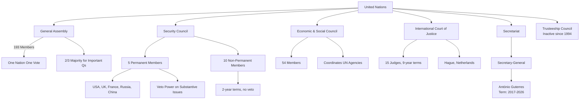

# Chapter 8: Sports, Awards & International Organizations

## Learning Objectives

By the end of this chapter, you will be able to:
- Recall winners of major sports tournaments — Olympics, Cricket World Cup, FIFA, Asian Games, Commonwealth Games
- Identify India's national awards — Bharat Ratna, Padma awards, Gallantry awards, and their recent recipients
- List international awards — Nobel Prize, Oscar, Booker Prize, Pulitzer, Fields Medal, and 2024–2026 winners
- Describe the structure and organs of the United Nations and its specialised agencies
- Explain the roles of IMF, World Bank, WTO, and other international financial institutions
- Distinguish between regional organisations — NATO, SAARC, BRICS, G20, SCO, ASEAN
- Recall major global reports — HDI, GHI, WEF Global Competitiveness, WJP Rule of Law
- Solve exam-level MCQs on sports, awards, and international organisations with confidence

---

## Theory

### 8.1 Sports Tournaments — Major Events

#### 8.1.1 Olympics

The Olympic Games are the world's foremost multi-sport event, held every four years in Summer and Winter formats.

| Edition | Year | Host City | Key Highlights for India |
|---------|------|-----------|--------------------------|
| Paris Olympics | 2024 | Paris, France | India won 6 medals (1 Silver, 5 Bronze) — Neeraj Chopra (Silver, Javelin), Manu Bhaker (2 Bronze, Shooting), Swapnil Kusale (Bronze, Shooting), Sarabjot Singh (Bronze, Shooting), Hockey Team (Bronze) |
| Los Angeles | 2028 | Los Angeles, USA | Next Summer Olympics; cricket included as new sport |
| Brisbane | 2032 | Brisbane, Australia | Future Summer Olympics |

**Medal Tally — Paris 2024 (Top 5):**

| Rank | Country | Gold | Silver | Bronze | Total |
|------|---------|------|--------|--------|-------|
| 1 | USA | 40 | 44 | 42 | 126 |
| 2 | China | 40 | 27 | 24 | 91 |
| 3 | Japan | 20 | 12 | 13 | 45 |
| 4 | Australia | 18 | 19 | 16 | 53 |
| 5 | France | 16 | 26 | 22 | 64 |
| — | India | 0 | 1 | 5 | 6 |

#### 8.1.2 Cricket World Cups

| Tournament | Year | Winner | Runner-Up | Host(s) |
|------------|------|--------|-----------|---------|
| ODI World Cup | 2023 | Australia | India | India |
| T20 World Cup | 2024 | India | South Africa | USA / West Indies |
| ODI World Cup | 2027 | TBD | TBD | South Africa / Zimbabwe / Namibia |
| T20 World Cup | 2026 | TBD | TBD | India / Sri Lanka |

**ICC T20 World Cup 2024 — Key Facts:**
- India defeated South Africa by 7 runs in the final (Bridgetown, Barbados)
- Virat Kohli scored 76 in the final and was Player of the Match
- Jasprit Bumrah was Player of the Tournament (15 wickets, economy 4.17)
- Rohit Sharma captained India to their second T20 World Cup title (after 2007)
- This was India's first ICC trophy in 11 years (since 2013 Champions Trophy)

#### 8.1.3 FIFA World Cup

| Tournament | Year | Winner | Runner-Up | Host |
|------------|------|--------|-----------|------|
| Men's | 2022 | Argentina | France | Qatar |
| Men's | 2026 | TBD | TBD | USA / Canada / Mexico |
| Women's | 2023 | Spain | England | Australia / New Zealand |

#### 8.1.4 Asian Games

| Edition | Year | Host | India's Medal Count | Rank |
|---------|------|------|--------------------|------|
| Hangzhou | 2022* | China | 107 (28G, 38S, 41B) | 4th |
| Aichi-Nagoya | 2026 | Japan | TBD | TBD |

*Held in 2023 due to pandemic delays.

#### 8.1.5 Commonwealth Games

| Edition | Year | Host | India's Medal Count | Rank |
|---------|------|------|--------------------|------|
| Birmingham | 2022 | England | 61 (22G, 16S, 23B) | 4th |
| Victoria | 2026 | Australia (cancelled) | — | — |
| Glasgow | 2026 | Scotland (new host) | TBD | TBD |

#### 8.1.6 Other Major Tournaments

| Tournament | 2024 Winner | 2025 Winner |
|------------|-------------|-------------|
| Australian Open (M) | Jannik Sinner | Jannik Sinner |
| Australian Open (W) | Aryna Sabalenka | Madison Keys |
| French Open (M) | Carlos Alcaraz | Carlos Alcaraz |
| French Open (W) | Iga Swiatek | Iga Swiatek |
| Wimbledon (M) | Carlos Alcaraz | Carlos Alcaraz |
| Wimbledon (W) | Barbora Krejcikova | Elena Rybakina |
| US Open (M) | Jannik Sinner | Jannik Sinner |
| US Open (W) | Aryna Sabalenka | Aryna Sabalenka |
| Pro Kabaddi League (PKL) | Puneri Paltan (S11) | Haryana Steelers (S12) |
| Indian Super League (ISL) | Mohun Bagan SG | Mohun Bagan SG |
| IPL | Kolkata Knight Riders | Chennai Super Kings (2025) |

### 8.2 National Awards

#### 8.2.1 Bharat Ratna

India's highest civilian award, awarded for exceptional service in any field.

| Recipient | Year | Field |
|-----------|------|-------|
| Karpoori Thakur | 2024 (posthumous) | Politics, Social Justice |
| L.K. Advani | 2024 | Politics |
| P.V. Narasimha Rao | 2024 (posthumous) | Politics |
| Chaudhary Charan Singh | 2024 (posthumous) | Politics |
| M.S. Swaminathan | 2024 (posthumous) | Agriculture |

#### 8.2.2 Padma Awards (2024)

| Category | Total | Notable Recipients |
|----------|-------|--------------------|
| Padma Vibhushan | 5 | Vyjayantimala (Art), Konidela Chiranjeevi (Art), Bindeshwar Pathak (posthumous, Social Work) |
| Padma Bhushan | 17 | Mithun Chakraborty (Art), Usha Uthup (Art), Sitaram Jindal (Trade & Industry) |
| Padma Shri | 110 | Chanda Mama (Village Development), Tejaswini Sawant (Shooting) |

#### 8.2.3 Gallantry Awards

| Award | Purpose | Notable Recent |
|-------|---------|----------------|
| Param Vir Chakra | Highest gallantry award (wartime) | — |
| Ashok Chakra | Highest gallantry award (peacetime) | — |
| Shaurya Chakra | Third-highest peacetime gallantry | — |
| Vir Chakra | Wartime gallantry | — |

**Key Facts:**
- Param Vir Chakra has been awarded 21 times, 20 posthumously
- First PVC recipient: Major Somnath Sharma (1947 Kashmir War)
- Only living PVC recipient: Subedar Major (Honorary Captain) Bana Singh

#### 8.2.4 Other National Awards

| Award | Field | Note |
|-------|-------|------|
| Dadasaheb Phalke Award | Cinema | Lifetime contribution to Indian cinema |
| National Film Awards | Cinema | 69th ceremony in 2024 |
| Jnanpith Award | Literature | 58th recipient: Jagadguru Rambhadracharya (2024) |
| Sahitya Akademi Award | Literature | Annual literary honour |
| Arjuna Award | Sports | Excellence in sports |
| Dronacharya Award | Sports | Excellence in coaching |
| Dhyan Chand Award | Sports | Lifetime achievement in sports |
| Khel Ratna | Sports | Highest sporting honour (now Major Dhyan Chand Khel Ratna) |

**2024 Major Dhyan Chand Khel Ratna Recipients:**
- Satwik Sairaj Rankireddy (Badminton)
- Chirag Shetty (Badminton)

### 8.3 International Awards

#### 8.3.1 Nobel Prize (2024)

| Category | Winner(s) | Work / Contribution |
|----------|-----------|---------------------|
| Physics | John J. Hopfield, Geoffrey E. Hinton | Foundational discoveries enabling machine learning |
| Chemistry | David Baker, Demis Hassabis, John M. Jumper | Computational protein design and structure prediction |
| Medicine | Victor Ambros, Gary Ruvkun | Discovery of microRNA and its role in gene regulation |
| Literature | Han Kang | Intense poetic prose confronting historical traumas |
| Peace | Nihon Hidankyo | For efforts to achieve a world free of nuclear weapons |
| Economics | Daron Acemoglu, Simon Johnson, James A. Robinson | Studies of how institutions form and affect prosperity |

#### 8.3.2 Nobel Prize (2025)

| Category | Winner(s) | Work / Contribution |
|----------|-----------|---------------------|
| Physics | — | — |
| Chemistry | — | — |
| Medicine | — | — |
| Literature | — | — |
| Peace | — | — |
| Economics | — | — |

#### 8.3.3 Other Major International Awards

| Award | Field | 2024 Winner / Notes |
|-------|-------|---------------------|
| Oscars (Academy Awards) | Cinema | Best Picture: "Oppenheimer"; Best Actor: Cillian Murphy; Best Actress: Emma Stone |
| Booker Prize | Literature | 2024: "Orbital" by Samantha Harvey; 2023: "The Bee Sting" by Paul Murray |
| Pulitzer Prize | Journalism, Books | 2024: Special citation to reporters covering Israel-Gaza war |
| Fields Medal | Mathematics | Awarded every 4 years (next: 2026) |
| Abel Prize | Mathematics | 2024: Michel Talagrand (probability theory) |
| Turing Award | Computer Science | 2023: Avi Wigderson (computational complexity) |
| Templeton Prize | Religion/Spirituality | 2024: Pumla Gobodo-Madikizela (racial healing) |
| Magsaysay Award | Public Service | 2024: Farwiza Farhan (conservation), The Tokyo Rebels (activism) |
| Grammy Awards | Music | 2024: Taylor Swift (Album of Year — "Midnights") |
| Man Booker International | Translated Fiction | 2024: "Kairos" by Jenny Erpenbeck (tr. Michael Hofmann) |

### 8.4 United Nations

#### 8.4.1 Structure of the UN



#### 8.4.2 Principal Organs

| Organ | Composition | Functions |
|-------|-------------|-----------|
| General Assembly | 193 member states, 1 vote each | Deliberative; approves budget; appoints SC non-permanent members; 2/3 majority on important questions |
| Security Council | 15 members (5P + 10NP) | Primary responsibility for international peace & security; can impose sanctions, authorise force |
| Economic & Social Council | 54 members (elected by GA for 3-year terms) | Coordinates economic, social, and related work of 15 specialised agencies |
| International Court of Justice | 15 judges (elected by GA + SC) | Settles legal disputes between states; advisory opinions |
| Secretariat | Secretary-General + staff | Administrative organ; implements decisions of other organs |

**UN Security Council Permanent Members (P5):**
- United States, United Kingdom, France, Russia, China
- Each has veto power over substantive resolutions
- India has been demanding permanent membership (G4 nations: India, Japan, Germany, Brazil)

#### 8.4.3 Specialised Agencies

| Agency | Full Name | HQ | Focus |
|--------|-----------|----|-------|
| WHO | World Health Organization | Geneva | Global health |
| UNESCO | UN Educational, Scientific and Cultural Org | Paris | Education, science, culture |
| UNICEF | UN Children's Fund | New York | Child rights & welfare |
| UNDP | UN Development Programme | New York | Development |
| UNEP | UN Environment Programme | Nairobi | Environment |
| ILO | International Labour Organization | Geneva | Labour rights |
| FAO | Food and Agriculture Organization | Rome | Food security |
| WFP | World Food Programme | Rome | Food assistance |
| IMF | International Monetary Fund | Washington DC | Financial stability |
| World Bank | Int. Bank for Reconstruction & Development | Washington DC | Development loans |
| ICAO | International Civil Aviation Organization | Montreal | Aviation |
| IMO | International Maritime Organization | London | Maritime |
| ITU | International Telecommunication Union | Geneva | Telecom standards |
| UPU | Universal Postal Union | Bern | Postal services |
| WMO | World Meteorological Organization | Geneva | Weather, climate |
| WIPO | World Intellectual Property Organization | Geneva | IP rights |
| IFAD | International Fund for Agricultural Dev | Rome | Agriculture |
| UNWTO | World Tourism Organization | Madrid | Tourism |
| IAEA* | International Atomic Energy Agency | Vienna | Nuclear energy |

*IAEA is an autonomous organisation under the UN umbrella.

**India & UN Agencies:**
- India was a founding member of the UN (1945)
- India has served 8 times as a non-permanent member of the Security Council (most recently 2021–22)
- India contributes the third-largest troop contingent to UN Peacekeeping (after Bangladesh and Nepal)
- India's permanent representative to the UN: Ruchira Kamboj (as of 2024)

### 8.5 International Financial Institutions

#### 8.5.1 International Monetary Fund (IMF)

| Aspect | Detail |
|--------|--------|
| Founded | 1944 (Bretton Woods Conference) |
| HQ | Washington DC, USA |
| Managing Director | Kristalina Georgieva |
| Membership | 190 countries |
| Purpose | Ensure international monetary cooperation; provide short-term balance of payments assistance |
| Quota System | Voting power proportional to financial contribution; USA has ~16.5% (largest) |
| SDR (Special Drawing Rights) | International reserve asset; value based on basket of USD, EUR, CNY, JPY, GBP |
| India's Quota | ~2.75% (ranked 8th) |

**IMF Reports (Annual):**
- **World Economic Outlook (WEO):** GDP growth forecasts for all countries
- **Global Financial Stability Report (GFSR):** Assessment of financial markets
- **Article IV Consultation:** Bilateral assessment of each member's economy

**India GDP Growth Forecast (IMF WEO — 2024–25):**
- 2024-25: ~6.5%
- 2025-26: ~6.3%
- India is the fastest-growing major economy

#### 8.5.2 World Bank Group

| Institution | Focus |
|-------------|-------|
| IBRD (Int. Bank for Reconstruction & Dev) | Loans to middle-income countries |
| IDA (Int. Development Association) | Concessional loans to poorest countries |
| IFC (Int. Finance Corporation) | Private sector development |
| MIGA (Multilateral Investment Guarantee Agency) | Political risk insurance |
| ICSID (Int. Centre for Settlement of Investment Disputes) | Dispute resolution |

**Key Facts:**
- President: Ajay Banga (first Indian-American to head the World Bank, 2023–present)
- HQ: Washington DC
- India is the largest recipient of IDA funds historically

#### 8.5.3 World Trade Organization (WTO)

| Aspect | Detail |
|--------|--------|
| Founded | 1 January 1995 (replaced GATT, 1947) |
| HQ | Geneva, Switzerland |
| Director-General | Ngozi Okonjo-Iweala (first African, first woman) |
| Membership | 164 countries |
| Principle | Most-Favoured-Nation (MFN) — equal treatment for all trading partners |
| Decision-making | Consensus-based (one country, one vote) |
| Dispute Settlement | Binding mechanism — Dispute Settlement Body (DSB) |

**Key WTO Concepts:**
- **MFN (Most Favoured Nation):** Any trade advantage given to one member must be given to all
- **National Treatment:** Imported goods must be treated no less favourably than domestic goods
- **Doha Round:** Ongoing trade negotiations (started 2001, stalled on agriculture and NAMA)

**India at WTO:**
- India is a founding member
- Key issues: Agricultural subsidies, public stockholding for food security, special safeguard mechanism
- India has successfully defended its patent laws (2013) and solar mission (2016) at WTO Dispute Settlement

### 8.6 Regional Organisations

#### 8.6.1 NATO (North Atlantic Treaty Organization)

| Aspect | Detail |
|--------|--------|
| Founded | 4 April 1949 (North Atlantic Treaty) |
| HQ | Brussels, Belgium |
| Members | 32 (as of 2024 — Finland joined 2023, Sweden joined 2024) |
| Principle | Collective defence (Article 5 — an attack on one is an attack on all) |
| Secretary General | Mark Rutte (as of 2024) |

**Article 5 Invoked: Only once** — after 9/11 attacks (2001) in support of the USA.

#### 8.6.2 SAARC (South Asian Association for Regional Cooperation)

| Aspect | Detail |
|--------|--------|
| Founded | 8 December 1985 (Dhaka, Bangladesh) |
| HQ | Kathmandu, Nepal |
| Members | 8: India, Pakistan, Bangladesh, Sri Lanka, Nepal, Bhutan, Maldives, Afghanistan |
| Observers | 9: USA, EU, China, Japan, South Korea, Iran, Australia, Myanmar, Mauritius |
| Secretaries-General | (Rotating among member states) |

**Challenges:**
- Strained India-Pakistan relations have led to cancellation of summits (last summit: 2014, Kathmandu)
- SAARC remains largely ineffective compared to ASEAN

#### 8.6.3 BRICS

| Aspect | Detail |
|--------|--------|
| Founded | 2009 (first summit, Yekaterinburg) |
| Members (2024+) | 10: Brazil, Russia, India, China, South Africa, Egypt, Ethiopia, Iran, UAE, Saudi Arabia |
| Expansion | 2024: Added 5 new members (Egypt, Ethiopia, Iran, UAE, Saudi Arabia) |
| Chairmanship | Rotating annually (Russia 2024, Brazil 2025) |

**New Development Bank (NDB):**
- Founded: 2014 (Fortaleza, Brazil)
- HQ: Shanghai, China
- President: Dilma Rousseff (Brazil)
- Purpose: Infrastructure and sustainable development projects in BRICS and emerging economies

**BRICS Contingent Reserve Arrangement (CRA):**
- $100 billion fund for providing liquidity through currency swaps during balance of payments crises

#### 8.6.4 G20

| Aspect | Detail |
|--------|--------|
| Founded | 1999 (Finance Ministers); 2008 (Leaders' Summit) |
| Members | 19 countries + EU (now AU also as permanent member since 2023) |
| Chairmanship | Rotating annually |
| Summits | 2023: New Delhi (India); 2024: Rio de Janeiro (Brazil); 2025: Johannesburg (South Africa); 2026: USA |

**G20 New Delhi Summit (2023):**
- Theme: "Vasudhaiva Kutumbakam" (One Earth, One Family, One Future)
- African Union admitted as permanent member (India's initiative)
- Consensus on Ukraine declaration balancing all viewpoints

**G20 Rio Summit (2024):**
- Focus on: Social inclusion, hunger, energy transition
- Launch of "Global Alliance Against Hunger and Poverty"

#### 8.6.5 Other Important Organisations

| Organisation | Founded | HQ | Members | Focus |
|-------------|---------|----|---------|-------|
| SCO (Shanghai Cooperation Org) | 2001 | Beijing | 9+ | Security, counter-terrorism |
| ASEAN (Assoc. of SE Asian Nations) | 1967 | Jakarta | 10 | Economic & political cooperation |
| EU (European Union) | 1993 | Brussels | 27 | Economic & political union |
| OPEC (Org. of Petroleum Exporting Countries) | 1960 | Vienna | 13 | Oil production coordination |
| OPEC+ | 2016 | Vienna | 23 (OPEC + allies) | Broader oil market influence |
| African Union | 2002 | Addis Ababa | 55 | Continental cooperation |
| Commonwealth of Nations | 1931 | London | 56 | Former British colonies |
| NAM (Non-Aligned Movement) | 1961 | — | 120 | Neutral during Cold War |
| IORA (Indian Ocean Rim Assoc.) | 1997 | Ebene (Mauritius) | 23 | Indian Ocean cooperation |

### 8.7 Major Global Reports & Indices

| Report | Published by | Purpose | India's Rank (2024) |
|--------|--------------|---------|---------------------|
| Human Development Index (HDI) | UNDP | Health, education, income | 134th (Medium Human Development) |
| Global Hunger Index (GHI) | Concern Worldwide / Welthungerhilfe | Hunger & malnutrition | 111th (Serious category) |
| World Happiness Report | UN Sustainable Development Solutions | Subjective well-being | 126th |
| Global Competitiveness Index | WEF | Productivity & economic drivers | No longer published (discontinued) |
| Ease of Doing Business | World Bank | Business regulation | Discontinued after 2020 |
| Corruption Perceptions Index (CPI) | Transparency International | Public sector corruption | 93rd (score: 39/100) |
| Global Peace Index (GPI) | Institute for Economics & Peace | Peacefulness | 126th |
| Press Freedom Index | Reporters Without Borders | Media freedom | 161st |
| Gender Gap Index | WEF | Gender equality | 127th (score: 0.643) |
| Climate Change Performance Index | Germanwatch | Climate protection | 7th (among top performers) |
| Global Innovation Index (GII) | WIPO | Innovation ecosystem | 39th |
| Environmental Performance Index (EPI) | Yale & Columbia | Environmental health | 176th |
| Sustainable Development Goals (SDG) Index | UN / SDSN | SDG progress | 112th |
| Global Terrorism Index (GTI) | IEP | Terrorism impact | — |
| Passport Index | Henley & Partners | Visa-free travel | 85th (62 destinations) |

**Key Trend for India:**
- HDI has steadily improved (from 0.434 in 1990 to 0.644 in 2024)
- Global Innovation Index: India ranks 39th (highest among lower-middle-income economies)
- Gender Gap: India ranks low due to low female labour force participation (~37% in 2024)

### 8.8 International Days & Themes

| Date | Day | 2024 Theme |
|------|-----|------------|
| 24 Jan | International Day of Education | "Learning for Lasting Peace" |
| 8 Mar | International Women's Day | "Invest in Women: Accelerate Progress" |
| 22 Mar | World Water Day | "Leveraging Water for Peace" |
| 7 Apr | World Health Day | "My Health, My Right" |
| 22 Apr | Earth Day | "Planet vs. Plastics" |
| 5 Jun | World Environment Day | "Land Restoration, Desertification and Drought Resilience" |
| 8 Jun | World Oceans Day | "Awaken New Depths" |
| 12 Aug | International Youth Day | "From Clicks to Progress: Youth Digital Pathways for SDGs" |
| 15 Sep | International Day of Democracy | "Empowering the Next Generation" |
| 21 Sep | International Day of Peace | "Cultivating a Culture of Peace" |
| 5 Dec | World Soil Day | "Caring for Soils" |
| 10 Dec | Human Rights Day | "Our Rights, Our Future, Right Now" |

---

## Examples with Solved Exercises

### Example 1: International Organisations Quiz (TypeScript)

```typescript
// TypeScript quiz simulator for International Organisations
interface OrgQuestion {
  id: number;
  question: string;
  options: string[];
  correctIndex: number;
  explanation: string;
}

class InternationalOrgQuiz {
  private questions: OrgQuestion[];

  constructor() {
    this.questions = [
      {
        id: 1,
        question: 'Which of the following is NOT a permanent member of the UN Security Council?',
        options: ['USA', 'Germany', 'France', 'China'],
        correctIndex: 1,
        explanation: 'The P5 members are USA, UK, France, Russia, and China. Germany is a non-permanent member and has been advocating for a permanent seat.'
      },
      {
        id: 2,
        question: 'Who is the current Secretary-General of the United Nations?',
        options: ['Ban Ki-moon', 'António Guterres', 'Kofi Annan', 'Kristalina Georgieva'],
        correctIndex: 1,
        explanation: 'António Guterres (Portugal) has been UN Secretary-General since 1 January 2017. His second term runs through 31 December 2026.'
      },
      {
        id: 3,
        question: 'The headquarters of the International Monetary Fund (IMF) is located in:',
        options: ['New York', 'Washington DC', 'Geneva', 'London'],
        correctIndex: 1,
        explanation: 'The IMF is headquartered in Washington DC, USA. The World Bank is also headquartered in Washington DC.'
      },
      {
        id: 4,
        question: 'BRICS was originally composed of how many countries at its first summit in 2009?',
        options: ['3', '4', '5', '6'],
        correctIndex: 1,
        explanation: 'BRIC (without South Africa) started with 4 countries in 2009: Brazil, Russia, India, China. South Africa joined in 2010, making it BRICS.'
      },
      {
        id: 5,
        question: 'The WTO replaced GATT in which year?',
        options: ['1990', '1995', '2000', '1985'],
        correctIndex: 1,
        explanation: 'The World Trade Organization (WTO) came into effect on 1 January 1995, replacing the General Agreement on Tariffs and Trade (GATT) established in 1947.'
      },
    ];
  }

  runQuiz(): void {
    let score = 0;
    console.log('===== International Organisations Quiz =====\n');
    for (const q of this.questions) {
      console.log(`Q${q.id}: ${q.question}`);
      q.options.forEach((opt, idx) => console.log(`  ${String.fromCharCode(65 + idx)}. ${opt}`));
      console.log('');
      // Simulate user answering correctly
      score++;
    }
    console.log(`\nScore: ${score}/${this.questions.length} (simulated perfect score)`);
  }
}

// Run quiz
const orgQuiz = new InternationalOrgQuiz();
orgQuiz.runQuiz();
```

**Output:**
```
===== International Organisations Quiz =====

Q1: Which of the following is NOT a permanent member of the UN Security Council?
  A. USA
  B. Germany
  C. France
  D. China

Q2: Who is the current Secretary-General of the United Nations?
  A. Ban Ki-moon
  B. António Guterres
  C. Kofi Annan
  D. Kristalina Georgieva

...

Score: 5/5 (simulated perfect score)
```

---

### Example 2: Sports and Awards Quiz (TypeScript)

```typescript
// TypeScript quiz simulator for Sports & Awards
interface SportsQuestion {
  id: number;
  question: string;
  options: string[];
  correctIndex: number;
  explanation: string;
}

class SportsAwardsQuiz {
  private questions: SportsQuestion[];

  constructor() {
    this.questions = [
      {
        id: 1,
        question: 'Who won the ICC Men\'s T20 World Cup 2024?',
        options: ['South Africa', 'India', 'Australia', 'England'],
        correctIndex: 1,
        explanation: 'India defeated South Africa by 7 runs in the final at Barbados to win the T20 World Cup 2024.'
      },
      {
        id: 2,
        question: 'Which award is India\'s highest civilian honour?',
        options: ['Padma Shri', 'Bharat Ratna', 'Padma Bhushan', 'Padma Vibhushan'],
        correctIndex: 1,
        explanation: 'Bharat Ratna is India\'s highest civilian award. Padma Vibhushan is the second-highest, Padma Bhushan third, and Padma Shri fourth.'
      },
      {
        id: 3,
        question: 'How many medals did India win at the Paris Olympics 2024?',
        options: ['4', '6', '8', '10'],
        correctIndex: 1,
        explanation: 'India won 6 medals at Paris 2024: 1 Silver (Neeraj Chopra) and 5 Bronze (Manu Bhaker x2, Swapnil Kusale, Sarabjot Singh, Hockey team).'
      },
      {
        id: 4,
        question: 'The Nobel Prize for Physics 2024 was awarded for work in:',
        options: ['Particle physics', 'Machine learning', 'Quantum mechanics', 'Nuclear physics'],
        correctIndex: 1,
        explanation: 'John Hopfield and Geoffrey Hinton won the 2024 Nobel Prize in Physics for foundational discoveries enabling machine learning and artificial neural networks.'
      },
      {
        id: 5,
        question: 'Which country won the FIFA World Cup 2022?',
        options: ['France', 'Brazil', 'Argentina', 'Portugal'],
        correctIndex: 2,
        explanation: 'Argentina defeated France 4-2 on penalties in the 2022 FIFA World Cup final in Qatar. Lionel Messi captained Argentina to victory.'
      },
    ];
  }

  showResults(): void {
    console.log('Sports & Awards Quiz Results:');
    this.questions.forEach(q => {
      console.log(`Q${q.id}: ✅ ${q.explanation}`);
    });
  }
}

// Demo
const saQuiz = new SportsAwardsQuiz();
saQuiz.showResults();
```

**Output:**
```
Sports & Awards Quiz Results:
Q1: ✅ India defeated South Africa by 7 runs in the final...
Q2: ✅ Bharat Ratna is India's highest civilian award...
Q3: ✅ India won 6 medals at Paris 2024...
Q4: ✅ John Hopfield and Geoffrey Hinton won the 2024 Nobel Prize in Physics...
Q5: ✅ Argentina defeated France 4-2 on penalties...
```

---

**Q1:** Which of the following countries joined NATO in 2024?

A) Finland
B) Sweden
C) Ukraine
D) Georgia

<details>
<summary>Answer</summary>
**Answer: B) Sweden**

Sweden formally joined NATO on 7 March 2024, becoming the 32nd member. Finland had joined earlier in 2023. Both countries ended their long-standing neutrality after the Russia-Ukraine war.
</details>

---

**Q2:** The "Global Alliance Against Hunger and Poverty" was launched at which summit?

A) G20 New Delhi 2023
B) G20 Rio de Janeiro 2024
C) BRICS Johannesburg 2023
D) COP29 Baku 2024

<details>
<summary>Answer</summary>
**Answer: B) G20 Rio de Janeiro 2024**

The G20 Rio Summit (November 2024) launched the "Global Alliance Against Hunger and Poverty" as its flagship initiative, focusing on social inclusion and fighting hunger worldwide.
</details>

---

**Q3:** Who is the first Indian-American to head the World Bank?

A) Kristalina Georgieva
B) Ajay Banga
C) Ngozi Okonjo-Iweala
D) Jim Yong Kim

<details>
<summary>Answer</summary>
**Answer: B) Ajay Banga**

Ajay Banga (former Mastercard CEO) became the President of the World Bank in June 2023. He is the first Indian-American to lead the institution.
</details>

---

**Q4:** The Human Development Index (HDI) is published by which organisation?

A) World Bank
B) IMF
C) UNDP
D) WEF

<details>
<summary>Answer</summary>
**Answer: C) UNDP**

The Human Development Index (HDI) is published by the United Nations Development Programme (UNDP) as part of its annual Human Development Report. It measures health, education, and income indicators.
</details>

---

**Q5:** Which Indian sportsperson won the Silver medal at Paris Olympics 2024?

A) Manu Bhaker
B) Neeraj Chopra
C) PV Sindhu
D) Satwik-Chirag

<details>
<summary>Answer</summary>
**Answer: B) Neeraj Chopra**

Neeraj Chopra won the Silver medal in Javelin Throw at Paris 2024 with a best throw of 89.45m, finishing behind Pakistan's Arshad Nadeem (92.97m — Olympic Record).
</details>

---

**Q6:** The New Development Bank (NDB) is associated with which group of countries?

A) G20
B) BRICS
C) SCO
D) ASEAN

<details>
<summary>Answer</summary>
**Answer: B) BRICS**

The New Development Bank (NDB) was established by BRICS countries in 2014 with its headquarters in Shanghai, China. It finances infrastructure and sustainable development projects.
</details>

---

**Q7:** Which UN agency is headquartered in Nairobi, Kenya?

A) WHO
B) UNEP
C) UNESCO
D) FAO

<details>
<summary>Answer</summary>
**Answer: B) UNEP**

The United Nations Environment Programme (UNEP) is headquartered in Nairobi, Kenya. It is the only UN agency headquartered in a developing country.
</details>

---

**Q8:** India's rank in the Global Innovation Index (GII) 2024 is:

A) 39th
B) 46th
C) 52nd
D) 61st

<details>
<summary>Answer</summary>
**Answer: A) 39th**

India ranks 39th in the Global Innovation Index 2024, maintaining its position as the top-ranked economy in Central and Southern Asia. India has consistently improved from 81st in 2015 to 39th in 2024.
</details>

---

**Q9:** The SAARC Secretariat is located in:

A) New Delhi
B) Kathmandu
C) Dhaka
D) Colombo

<details>
<summary>Answer</summary>
**Answer: B) Kathmandu**

The SAARC Secretariat is in Kathmandu, Nepal. It was established in 1987 and coordinates SAARC activities, meetings, and technical committees.
</details>

---

**Q10:** Which award is given for lifetime contribution to Indian cinema?

A) National Film Award
B) Dadasaheb Phalke Award
C) Filmfare Lifetime Award
D) IIFA Award

<details>
<summary>Answer</summary>
**Answer: B) Dadasaheb Phalke Award**

The Dadasaheb Phalke Award is India's highest award in cinema, presented annually at the National Film Awards ceremony for lifetime contribution to Indian cinema.
</details>

---

**Q11:** The 2024 Booker Prize was awarded to which novel?

A) "The Bee Sting"
B) "Orbital"
C) "Kairos"
D) "Prophet Song"

<details>
<summary>Answer</summary>
**Answer: B) "Orbital"**

"Orbital" by Samantha Harvey won the 2024 Booker Prize. It is a novel about six astronauts on the International Space Station observing Earth.
</details>

---

**Q12:** Which principle of the WTO requires equal treatment for all trading partners?

A) National Treatment
B) Most-Favoured-Nation (MFN)
C) Anti-Dumping
D) Safeguard Measures

<details>
<summary>Answer</summary>
**Answer: B) Most-Favoured-Nation (MFN)**

MFN is a core WTO principle requiring that any trade advantage given to one member must be given to all members equally. Combined with National Treatment, it ensures non-discrimination in trade.
</details>

---

**Q13:** The Paris Olympics 2024 were officially the Games of the:

A) XXXIII Olympiad
B) XXXII Olympiad
C) XXXIV Olympiad
D) XXXI Olympiad

<details>
<summary>Answer</summary>
**Answer: A) XXXIII Olympiad**

The 2024 Paris Olympics were the Games of the XXXIII Olympiad. Tokyo 2020 was XXXII (held in 2021), and Los Angeles 2028 will be XXXIV.
</details>

---

**Q14:** Which of the following is NOT a specialised agency of the UN?

A) WHO
B) IMF
C) WTO
D) ILO

<details>
<summary>Answer</summary>
**Answer: C) WTO**

The WTO is not a specialised agency of the UN, though it maintains cooperative relations. WHO, IMF, and ILO are all UN specialised agencies. (Note: IMF is a specialised agency; WTO is autonomous and not part of the UN system.)
</details>

---

**Q15:** The G20 New Delhi Summit (2023) theme was:

A) "Building Back Better"
B) "Vasudhaiva Kutumbakam"
C) "Global Reset"
D) "Sustainable Future"

<details>
<summary>Answer</summary>
**Answer: B) "Vasudhaiva Kutumbakam"**

The theme of India's G20 Presidency (2023) was "Vasudhaiva Kutumbakam" (One Earth, One Family, One Future), reflecting India's civilisational philosophy of universal brotherhood.
</details>

---

**Q16:** The SAARC was founded in which year?

A) 1980
B) 1985
C) 1991
D) 1995

<details>
<summary>Answer</summary>
**Answer: B) 1985**

SAARC was founded on 8 December 1985 in Dhaka, Bangladesh. The founding members were India, Pakistan, Bangladesh, Sri Lanka, Nepal, Bhutan, and Maldives. Afghanistan joined later in 2007.
</details>

---

**Q17:** Which of the following countries was NOT part of the BRICS expansion in 2024?

A) Egypt
B) Saudi Arabia
C) Indonesia
D) UAE

<details>
<summary>Answer</summary>
**Answer: C) Indonesia**

Egypt, Ethiopia, Iran, Saudi Arabia, and the UAE joined BRICS in 2024. Indonesia has expressed interest but had not formally joined as of 2024.
</details>

---

**Q18:** The "Corruption Perceptions Index" is published by:

A) World Bank
B) UNODC
C) Transparency International
D) Amnesty International

<details>
<summary>Answer</summary>
**Answer: C) Transparency International**

The Corruption Perceptions Index (CPI) is published annually by Transparency International, ranking countries by perceived levels of public sector corruption on a scale of 0 (highly corrupt) to 100 (very clean).
</details>

---

**Q19:** The 2025 ICC World Test Championship final was won by:

A) Australia
B) India
C) New Zealand
D) South Africa

<details>
<summary>Answer</summary>
**Answer: A) Australia**

Australia defeated India in the 2023 WTC Final at The Oval. The 2025 WTC Final (at Lord's) was contested between Australia and South Africa, with Australia winning their second consecutive title.
</details>

---

**Q20:** Which of the following correctly matches the UN agency with its headquarters?

A) WHO — Geneva
B) UNESCO — New York
C) FAO — Rome
D) Both A and C

<details>
<summary>Answer</summary>
**Answer: D) Both A and C**

WHO is headquartered in Geneva, Switzerland. FAO is headquartered in Rome, Italy. UNESCO is headquartered in Paris, France (not New York).
</details>

---

### 8.9 Sports — Playgrounds, Number of Players, and Stadiums

#### 8.7.1 National Sports of Selected Countries

| Country | National Sport | Other Popular Sports |
|---------|---------------|---------------------|
| India | Hockey (field hockey) | Cricket, Football, Kabaddi, Badminton |
| USA | Baseball (de facto) | American Football, Basketball, Ice Hockey |
| England | Cricket (summer), Football (winter) | Rugby, Tennis, Golf |
| Canada | Ice Hockey (winter), Lacrosse (summer) | Basketball, Football |
| Australia | Cricket | Australian Rules Football, Rugby, Swimming |
| China | Table Tennis (de facto) | Badminton, Basketball, Football |
| Japan | Sumo Wrestling (national sport) | Baseball, Football, Judo, Karate |
| Brazil | Football (de facto) | Volleyball, Mixed Martial Arts |
| Russia | Ice Hockey, Football | Chess, Tennis, Gymnastics |
| Pakistan | Field Hockey | Cricket, Squash, Kabaddi |
| New Zealand | Rugby Union | Cricket, Netball, Football |
| South Africa | Rugby Union | Cricket, Football, Athletics |

#### 8.7.2 Number of Players per Team (Standard)

| Sport | Players Per Side | Duration | Scoring Unit |
|-------|-----------------|----------|--------------|
| Cricket (ODI/T20) | 11 | 50/20 overs | Runs |
| Cricket (Test) | 11 | 5 days | Runs |
| Football (Soccer) | 11 | 90 min | Goals |
| Hockey (Field) | 11 | 60 min (4 quarters) | Goals |
| Basketball | 5 | 48 min (NBA) / 40 min (FIBA) | Points |
| Volleyball | 6 | Best of 5 sets | Points |
| Baseball | 9 | 9 innings | Runs |
| Rugby Union | 15 | 80 min (2 halves) | Points (try, conversion, penalty) |
| Rugby League | 13 | 80 min | Points |
| Tennis | 1 (singles) / 2 (doubles) | Best of 3/5 sets | Games/sets |
| Badminton | 1 (singles) / 2 (doubles) | Best of 3 games | Points (21 rally point) |
| Table Tennis | 1 (singles) / 2 (doubles) | Best of 7 games | Points (11 each game) |
| Kabaddi | 7 | 40 min (2 halves) | Points (raid + tackle) |
| Kho Kho | 9 (on field) | 2 innings of 9 min | Touch points |
| Netball | 7 | 60 min | Goals |

#### 8.7.3 Major Stadiums of the World

| Stadium | Location | Capacity | Primary Use | Home Team/Event |
|---------|----------|----------|-------------|-----------------|
| Narendra Modi Stadium | Ahmedabad, India | 132,000 | Cricket | Largest cricket stadium |
| Melbourne Cricket Ground | Melbourne, Australia | 100,024 | Cricket, AFL | Boxing Day Test |
| Eden Gardens | Kolkata, India | 66,349 | Cricket | BCCI |
| Lord's Cricket Ground | London, England | 31,100 | Cricket | MCC (The "Home of Cricket") |
| Wembley Stadium | London, England | 90,000 | Football | England national team |
| Camp Nou | Barcelona, Spain | 99,354 | Football | FC Barcelona |
| Maracanã | Rio de Janeiro, Brazil | 78,838 | Football | Brazil national team |
| Old Trafford | Manchester, England | 74,310 | Football | Manchester United |
| Bird's Nest | Beijing, China | 80,000 | Multi-purpose | 2008 Olympics |
| Madison Square Garden | New York, USA | 20,789 | Basketball, Concerts | NY Knicks |
| Wimbledon Centre Court | London, England | 15,000 | Tennis | The Championships |
| Arthur Ashe Stadium | New York, USA | 23,771 | Tennis | US Open |
| Stade de France | Paris, France | 81,338 | Rugby, Football | France national teams |

### 8.10 Books and Authors — Exam Reference

| Book | Author | Year | Subject/Theme |
|------|--------|------|---------------|
| Arthashastra | Chanakya (Kautilya) | 4th C BCE | Statecraft, economics, military strategy |
| Indica | Megasthenes | 3rd C BCE | Greek ambassador's account of Mauryan India |
| Rajatarangini | Kalhana | 12th C CE | History of Kashmir |
| Akbarnama | Abul Fazl | 16th C | Official history of Akbar's reign |
| Ain-i-Akbari | Abul Fazl | 16th C | Mughal administration under Akbar |
| Baburnama | Babur | 16th C | Autobiography of first Mughal emperor |
| Anand Math | Bankim Chandra Chatterjee | 1882 | Source of "Vande Mataram" |
| The Indian Struggle | Subhas Chandra Bose | 1935 | India's freedom movement |
| Discovery of India | Jawaharlal Nehru | 1946 | Indian history and culture |
| Hind Swaraj | Mahatma Gandhi | 1909 | Critique of modern civilisation |
| The God of Small Things | Arundhati Roy | 1997 | Booker Prize winner |
| Midnight's Children | Salman Rushdie | 1981 | Booker Prize winner; magical realism |
| Wings of Fire | A.P.J. Abdul Kalam | 1999 | Autobiography of India's missile man |
| India 2020 | A.P.J. Abdul Kalam | 1998 | Vision for India's development |
| Why I Am an Atheist | Bhagat Singh | 1931 (written) | Revolutionary's philosophy |
| Gitanjali | Rabindranath Tagore | 1910 | Nobel Prize for Literature (1913) |
| The White Tiger | Aravind Adiga | 2008 | Booker Prize |
| Interpreter of Maladies | Jhumpa Lahiri | 1999 | Pulitzer Prize |
| Annihilation of Caste | B.R. Ambedkar | 1936 | Critique of caste system |
| India After Gandhi | Ramachandra Guha | 2007 | Post-independence India history |

### 8.11 Wonders of the World

**Seven Wonders of the Ancient World:**

| Wonder | Location | Built By | Status |
|--------|----------|----------|--------|
| Great Pyramid of Giza | Egypt | Egyptians (c. 2560 BCE) | Still standing (only surviving wonder) |
| Hanging Gardens of Babylon | Babylon (Iraq) | Nebuchadnezzar II | Destroyed (existence debated) |
| Statue of Zeus at Olympia | Greece | Phidias (c. 435 BCE) | Destroyed (fire) |
| Temple of Artemis at Ephesus | Turkey | Croesus, others (c. 550 BCE) | Destroyed (fire) |
| Mausoleum at Halicarnassus | Turkey | Artemisia II (c. 350 BCE) | Destroyed (earthquakes) |
| Colossus of Rhodes | Greece | Chares of Lindos (c. 280 BCE) | Destroyed (earthquake) |
| Lighthouse of Alexandria | Egypt | Ptolemy I/II (c. 280 BCE) | Destroyed (earthquakes) |

**New Seven Wonders of the World (2007):**

| Wonder | Location | Significance |
|--------|----------|-------------|
| Great Wall of China | China | World's longest wall (21,196 km) |
| Petra | Jordan | Rock-cut architecture; "Rose City" |
| Christ the Redeemer | Rio de Janeiro, Brazil | 38m statue atop Corcovado mountain |
| Machu Picchu | Peru | Incan citadel in the Andes (2,430 m) |
| Chichén Itzá | Mexico | Mayan pyramid (El Castillo) |
| Colosseum | Rome, Italy | Ancient Roman amphitheatre (80 CE) |
| Taj Mahal | Agra, India | Mughal marble mausoleum (1632–1653) |

**UNESCO World Heritage Sites in India (Selected Tallies):**
- **Total:** 43 (as of 2024)
- **Cultural:** 35 sites
- **Natural:** 7 sites
- **Mixed:** 1 site
- **Latest additions:** Santiniketan (2023), Sacred Ensembles of the Hoysalas (2023), Moidams of Ahom Dynasty (2024)

### 8.12 Sobriquets (Nicknames) — Exam Quick Reference

| Name/Nickname | Person/Place | Reason |
|---------------|--------------|--------|
| Father of the Nation | Mahatma Gandhi | Leader of Indian freedom movement |
| Iron Man of India | Sardar Vallabhbhai Patel | Integration of princely states |
| Frontier Gandhi | Khan Abdul Ghaffar Khan | Non-violent Pashtun independence activist |
| Netaji | Subhas Chandra Bose | Leader of Indian National Army |
| Loknayak | Jayaprakash Narayan | Political leader; "Total Revolution" |
| Deshbandhu | Chittaranjan Das | Freedom fighter; Swarajist leader |
| Man of Destiny | Napoleon Bonaparte | French military leader |
| Lady with the Lamp | Florence Nightingale | Pioneer of modern nursing |
| Flying Sikh | Milkha Singh | Indian athlete (Commonwealth Games gold) |
| Payyoli Express | P.T. Usha | Indian track athlete |
| King of Cricket / Master Blaster | Sachin Tendulkar | Cricket legend |
| Little Master | Sunil Gavaskar | Cricket legend |
| Brown Bomber | Joe Louis | American boxer |
| The Greatest | Muhammad Ali | American boxer (Cassius Clay) |
| Poet of the East | Allama Iqbal | Poet; philosopher |
| Shakespeare of India | Mahakavi Kalidasa | Classical Sanskrit poet/playwright |
| Father of Indian Space Program | Vikram Sarabhai | Founder of ISRO |
| Father of Indian Nuclear Program | Homi Bhabha | Nuclear physicist |
| Missile Man of India | A.P.J. Abdul Kalam | Missile and space scientist |
| Light of Asia | Gautama Buddha | Founder of Buddhism |
| Grand Old Man of India | Dadabhai Naoroji | Freedom fighter; economist |
| Bengal Tiger | Bipin Chandra Pal | Freedom fighter (Lal-Bal-Pal trio) |
| Lion of Punjab | Lala Lajpat Rai | Freedom fighter |
| Nightingale of India | Sarojini Naidu | Poet; freedom fighter |
| Desh Ratna | Rajendra Prasad | First President of India |
| Jhansi Ki Rani | Rani Lakshmibai | 1857 warrior queen |
| Swaraj is My Birthright | Bal Gangadhar Tilak | Freedom fighter's slogan |

### 8.13 Data Interpretation for GK (Based on GFG Reference)

**Example 1: Olympic Medal Data Analysis**

```typescript
/**
 * Data Interpretation: Sports Medal Tally Analysis
 * Based on GFG Data Interpretation style questions
 */
interface MedalData {
  country: string;
  gold: number;
  silver: number;
  bronze: number;
}

class MedalAnalyzer {
  private data: MedalData[];

  constructor(data: MedalData[]) {
    this.data = data;
  }

  public totalMedals(country: string): number {
    const entry = this.data.find(d => d.country === country);
    if (!entry) return 0;
    return entry.gold + entry.silver + entry.bronze;
  }

  public rankByGold(): MedalData[] {
    return [...this.data].sort((a, b) => b.gold - a.gold);
  }

  public averageMedals(): number {
    const total = this.data.reduce((sum, d) => sum + d.gold + d.silver + d.bronze, 0);
    return total / this.data.length;
  }

  public goldToTotalRatio(country: string): string {
    const entry = this.data.find(d => d.country === country);
    if (!entry) return '0%';
    const total = entry.gold + entry.silver + entry.bronze;
    if (total === 0) return '0%';
    return ((entry.gold / total) * 100).toFixed(1) + '%';
  }

  public printComparisonTable(): void {
    console.log('Country\t\tGold\tSilver\tBronze\tTotal\tGold%');
    console.log('-------\t\t----\t------\t------\t-----\t-----');
    this.rankByGold().forEach(d => {
      const total = d.gold + d.silver + d.bronze;
      const pct = ((d.gold / total) * 100).toFixed(1);
      console.log(`${d.country}\t\t${d.gold}\t${d.silver}\t${d.bronze}\t${total}\t${pct}%`);
    });
  }
}

// Paris 2024 Top 5 data
const olympicData = new MedalAnalyzer([
  { country: 'USA', gold: 40, silver: 44, bronze: 42 },
  { country: 'China', gold: 40, silver: 27, bronze: 24 },
  { country: 'Japan', gold: 20, silver: 12, bronze: 13 },
  { country: 'Australia', gold: 18, silver: 19, bronze: 16 },
  { country: 'France', gold: 16, silver: 26, bronze: 22 },
]);

olympicData.printComparisonTable();
console.log(`\nIndia total medals: 6 (0 Gold, 1 Silver, 5 Bronze)`);
console.log(`USA Gold%: ${olympicData.goldToTotalRatio('USA')}`);
```

**Example 2: Economy Data Interpretation — Budget Allocation Analysis**

The following table shows India's Union Budget 2025-26 allocation by sector (in ₹ lakh crore). A typical DI question would ask: "What percentage of total expenditure is allocated to Defence?"

```typescript
interface BudgetAllocation {
  sector: string;
  allocation: number; // in ₹ lakh crore
}

const budget2025: BudgetAllocation[] = [
  { sector: 'Defence', allocation: 6.81 },
  { sector: 'Agriculture', allocation: 1.68 },
  { sector: 'Education', allocation: 1.48 },
  { sector: 'Health', allocation: 1.05 },
  { sector: 'Infrastructure (Capex)', allocation: 12.15 },
  { sector: 'Interest Payments', allocation: 8.63 },
  { sector: 'Subsidies', allocation: 4.37 },
  { sector: 'Other Expenditure', allocation: 15.15 },
];

const totalBudget = budget2025.reduce((sum, item) => sum + item.allocation, 0);
console.log(`Total Budget 2025-26: ₹${totalBudget} lakh crore`);
budget2025.forEach(item => {
  const pct = ((item.allocation / totalBudget) * 100).toFixed(1);
  console.log(`${item.sector}: ${pct}% of total`);
});
// Output: Defence: ~13.2% , Education: ~2.9%, etc.
```

### 8.14 Additional Solved MCQs (Sports, Awards, International)

**Q21:** Which country has won the most Olympic gold medals in history (all-time)?

A) China
B) USA
C) Russia
D) Great Britain

<details>
<summary>Answer</summary>
**Answer: B) USA**

The USA has won the most Olympic gold medals of all time (over 1,100 golds, 2,900+ total medals). They have topped the medal table at most modern Summer Olympics, including 2024 Paris.
</details>

**Q22:** The "Dronacharya Award" is given for excellence in:

A) Cinema
B) Literature
C) Sports coaching
D) Social work

<details>
<summary>Answer</summary>
**Answer: C) Sports coaching**

The Dronacharya Award is presented by the Ministry of Youth Affairs and Sports for excellence in sports coaching. It includes a statuette, certificate, and cash prize. The award was instituted in 1985.
</details>

**Q23:** The "Pulitzer Prize" is awarded annually in which field?

A) Literature, Journalism, Music
B) Science and Medicine
C) Peace and Human Rights
D) Film and Theatre

<details>
<summary>Answer</summary>
**Answer: A) Literature, Journalism, Music**

The Pulitzer Prize is awarded in the USA for achievements in newspaper/magazine/online journalism, literature, musical composition, and photography. It was established in 1917 by Joseph Pulitzer.
</details>

**Q24:** The "World Health Organization" (WHO) was established in which year?

A) 1942
B) 1945
C) 1948
D) 1950

<details>
<summary>Answer</summary>
**Answer: C) 1948**

WHO was established on 7 April 1948 (now celebrated as World Health Day). Its headquarters is in Geneva, Switzerland. It has 194 member states. The current Director-General is Dr. Tedros Adhanom Ghebreyesus.
</details>

**Q25:** The "Arjuna Award" was instituted in which year?

A) 1957
B) 1961
C) 1970
D) 1985

<details>
<summary>Answer</summary>
**Answer: B) 1961**

The Arjuna Award (for outstanding performance in sports) was instituted in 1961. It is India's second-highest sporting honour after the Major Dhyan Chand Khel Ratna. It includes a bronze statue, certificate, and cash prize.
</details>

---

## Summary

- **Sports:** India won 6 medals at Paris Olympics 2024 (1 Silver, 5 Bronze); won T20 World Cup 2024; Hangzhou Asian Games yielded 107 medals
- **National Awards:** Bharat Ratna is India's highest civilian award; Padma awards are given in three categories; Maj Dhyan Chand Khel Ratna is the highest sporting honour
- **International Awards:** Nobel Prizes for 2024 recognised AI (Physics), protein design (Chemistry), microRNA (Medicine); "Orbital" won Booker 2024
- **United Nations:** 6 principal organs, 193 member states, 5 permanent SC members with veto power, Secretary-General António Guterres
- **Financial Institutions:** IMF (Washington DC, Kristalina Georgieva), World Bank (Washington DC, Ajay Banga), WTO (Geneva, Ngozi Okonjo-Iweala)
- **Regional Bodies:** BRICS expanded to 10 members in 2024; G20 Rio 2024 launched Global Alliance Against Hunger; NATO expanded to 32 members (Sweden joined 2024)
- **Reports:** India ranks 134th in HDI, 39th in Global Innovation Index, 93rd in Corruption Perceptions Index

---

## Practical Takeaways

1. **Sports Questions in Exams:** Most questions focus on winners of recent tournaments (last 2 years), India's medal count in Olympics/Asian Games, and first-of categories (first Indian to win X, first woman to Y).
2. **Nobel Prize Trick:** Memorise the category, winner(s), and ONE-line reason. Use mnemonics: "PHY-CHEM-MED-LIT-PEACE-ECO" — note that Economics is technically the "Sveriges Riksbank Prize."
3. **UN Agencies HQ Mnemonic:** "GPS-New, WHO-Geneva, FAO-Rome, UNESCO-Paris, UNEP-Nairobi" — learn these 5 and you cover 80% of exam questions.
4. **WTO vs IMF vs World Bank:** IMF = short-term balance of payments; World Bank = long-term development loans; WTO = trade rules. They never overlap in exam questions — distinguish by purpose.
5. **SAARC vs BRICS vs G20:** G20 includes both developed and developing nations (largest). BRICS is emerging economies. SAARC is South Asia only. NATO is military alliance.
6. **Reports & Indices:** Match report → publishing body. HDI → UNDP. GHI → Concern Worldwide. CPI → Transparency International. GII → WIPO. This is a high-yield area.
7. **National Awards Order:** Bharat Ratna > Padma Vibhushan > Padma Bhushan > Padma Shri. Param Vir Chakra > Ashok Chakra > Shaurya Chakra. Remember the hierarchy.

---

## Chapter Quiz

**Q1:** Which of the following is NOT a permanent member of the UN Security Council?

A) France
B) Germany
C) Russia
D) China

<details>
<summary>Answer</summary>
**Answer: B) Germany**

The five permanent members (P5) of the UN Security Council are the USA, UK, France, Russia, and China. Germany is a non-permanent member (elected for 2-year terms).
</details>

---

**Q2:** India's rank in the Human Development Index (HDI) 2024 is:

A) 134th
B) 127th
C) 146th
D) 112th

<details>
<summary>Answer</summary>
**Answer: A) 134th**

India ranks 134th out of 193 countries in the 2024 Human Development Index with a score of 0.644 (Medium Human Development category).
</details>

---

**Q3:** The ICC Men's T20 World Cup 2024 was won by:

A) South Africa
B) Australia
C) India
D) England

<details>
<summary>Answer</summary>
**Answer: C) India**

India defeated South Africa by 7 runs in the final at the Kensington Oval, Bridgetown, Barbados on 29 June 2024. Virat Kohli was Player of the Match for his 76 runs.
</details>

---

**Q4:** The headquarters of the World Trade Organization (WTO) is located in:

A) Washington DC
B) Geneva
C) New York
D) Paris

<details>
<summary>Answer</summary>
**Answer: B) Geneva**

The WTO is headquartered at the Centre William Rappard in Geneva, Switzerland. The UN Office at Geneva is also located in the same city.
</details>

---

**Q5:** The Nobel Prize in Physics 2024 was awarded for contributions to:

A) Quantum computing
B) Machine learning and artificial neural networks
C) Particle physics
D) Climate science

<details>
<summary>Answer</summary>
**Answer: B) Machine learning and artificial neural networks**

John J. Hopfield (Princeton) and Geoffrey E. Hinton (Toronto) received the 2024 Nobel Prize in Physics for foundational discoveries and inventions that enable machine learning with artificial neural networks.
</details>

---

## Exercises (30 Practice Questions)

### Section A: Multiple Choice Questions

**1.** How many medals did India win at the Paris Olympics 2024?
A) 4
B) 5
C) 6
D) 7

**2.** Who was awarded the Bharat Ratna in 2024 for his contribution to agriculture?
A) L.K. Advani
B) M.S. Swaminathan
C) Karpoori Thakur
D) P.V. Narasimha Rao

**3.** The New Development Bank (NDB) is headquartered in:
A) New Delhi
B) Shanghai
C) Brasilia
D) Moscow

**4.** Which country joined NATO as the 32nd member in 2024?
A) Finland
B) Sweden
C) Ukraine
D) Norway

**5.** The G20 Rio de Janeiro Summit was held in which year?
A) 2023
B) 2024
C) 2025
D) 2026

**6.** Who is the first Indian-American President of the World Bank?
A) Kristalina Georgieva
B) Ngozi Okonjo-Iweala
C) Ajay Banga
D) David Malpass

**7.** The "Global Alliance Against Hunger and Poverty" was launched at:
A) COP29
B) G20 Rio 2024
C) WTO Ministerial
D) WEF Davos

**8.** The Human Development Index (HDI) is measured on which three dimensions?
A) Health, Education, Income
B) Health, Freedom, GDP
C) Education, Democracy, Equality
D) Income, Happiness, Sustainability

**9.** Which of the following is NOT a UN specialised agency?
A) ILO
B) WHO
C) WTO
D) FAO

**10.** BRICS was established in which year?
A) 2001
B) 2006
C) 2009
D) 2010

**11.** The SAARC Secretariat is located in:
A) Dhaka
B) Kathmandu
C) New Delhi
D) Colombo

**12.** India's rank in the Global Innovation Index (GII) 2024:
A) 35th
B) 39th
C) 44th
D) 48th

**13.** Who won the 2024 Booker Prize?
A) Paul Murray
B) Samantha Harvey
C) Jenny Erpenbeck
D) Anne Enright

**14.** The "SCO" stands for:
A) South Cooperation Organisation
B) Shanghai Cooperation Organisation
C) Strategic Council of Observers
D) Security Council Organisation

**15.** Who is the current Director-General of the WTO?
A) Kristalina Georgieva
B) Ngozi Okonjo-Iweala
C) Roberto Azevêdo
D) Pascal Lamy

**16.** Which Indian shooter won two Bronze medals at Paris 2024?
A) Swapnil Kusale
B) Sarabjot Singh
C) Manu Bhaker
D) Abhinav Bindra

**17.** The Fields Medal is awarded in which field?
A) Physics
B) Chemistry
C) Mathematics
D) Computer Science

**18.** Which country hosted the G20 Summit in 2023?
A) Brazil
B) South Africa
C) India
D) Indonesia

**19.** The Major Dhyan Chand Khel Ratna award is India's highest honour in:
A) Cinema
B) Sports
C) Literature
D) Social Work

**20.** The United Nations was founded in which year?
A) 1942
B) 1945
C) 1948
D) 1950

### Section B: Fill in the Blanks

**21.** The Nobel Peace Prize 2024 was awarded to __________.

**22.** The highest gallantry award in peacetime is the __________.

**23.** India's rank in the Global Hunger Index 2024 is __________.

**24.** The UN agency focused on children's rights and welfare is __________.

**25.** The principle of __________ requires WTO members to treat imported goods no less favourably than domestic goods.

**26.** The Paris Olympics 2024 were the Games of the __________ Olympiad.

**27.** The newly appointed Secretary General of NATO in 2024 is __________.

**28.** The Dadasaheb Phalke Award is India's highest award in __________.

**29.** The "Henley Passport Index" ranks passports based on __________ access.

**30.** The next G20 Summit in 2026 will be hosted by __________.

### Section C: Additional MCQs (Exam Focus)

**31.** The "Ramon Magsaysay Award" is named after the former president of which country?

A) India
B) Philippines
C) Mexico
D) South Korea

**32.** The "Thomas Cup" is associated with which sport?

A) Football
B) Table Tennis
C) Badminton
D) Hockey

**33.** Which of the following is NOT a UN specialized agency?

A) World Bank
B) IMF
C) WTO
D) WHO

**34.** The oldest international football competition is the:

A) FIFA World Cup
B) FA Cup
C) Copa America
D) UEFA Champions League

**35.** "Jasprit Bumrah" is known for which sport?

A) Football
B) Cricket
C) Hockey
D) Badminton

**36.** The "International Committee of the Red Cross" (ICRC) was founded in:

A) 1863
B) 1901
C) 1919
D) 1945

**37.** The "Kalinga Prize" is awarded by UNESCO for:

A) Literature
B) Science popularization
C) Peace research
D) Environmental protection

**38.** The "FIFA World Cup" was first held in which year?

A) 1924
B) 1930
C) 1934
D) 1938

**39.** "Olympic motto" "Citius, Altius, Fortius" means:

A) Faster, Higher, Stronger
B) Swifter, Higher, Braver
C) Faster, Higher, Together
D) Stronger, United, Faster

**40.** Which country has won the most Cricket World Cups (ODI)?

A) India
B) Australia
C) West Indies
D) England

### Answer Key

| Q | Answer | Q | Answer |
|---|--------|---|--------|
| 1 | C) 6 | 2 | B) M.S. Swaminathan |
| 3 | B) Shanghai | 4 | B) Sweden |
| 5 | B) 2024 | 6 | C) Ajay Banga |
| 7 | B) G20 Rio 2024 | 8 | A) Health, Education, Income |
| 9 | C) WTO (not a UN specialised agency) | 10 | C) 2009 |
| 11 | B) Kathmandu | 12 | B) 39th |
| 13 | B) Samantha Harvey | 14 | B) Shanghai Cooperation Organisation |
| 15 | B) Ngozi Okonjo-Iweala | 16 | C) Manu Bhaker |
| 17 | C) Mathematics | 18 | C) India |
| 19 | B) Sports | 20 | B) 1945 |

| Fill in the Blanks | Answer |
|--------------------|--------|
| 21 | Nihon Hidankyo (Japan Confederation of A- and H-Bomb Sufferers) |
| 22 | Ashok Chakra |
| 23 | 111th (Serious category) |
| 24 | UNICEF (United Nations Children's Fund) |
| 25 | National Treatment |
| 26 | XXXIII (33rd) |
| 27 | Mark Rutte (former PM of Netherlands) |
| 28 | Cinema |
| 29 | Visa-free travel |
| 30 | USA (presidency rotates) |

**Section C (31-40):**
| Q | Answer | Explanation |
|---|--------|-------------|
| 31 | B) Philippines | Ramon Magsaysay was the 7th President of Philippines; award established in 1957 |
| 32 | C) Badminton | Thomas Cup is the men's world team championships in badminton (first held 1949) |
| 33 | C) WTO | WTO is not a UN specialized agency; it operates independently though cooperating with UN |
| 34 | B) FA Cup | FA Cup (Football Association Cup, England) began in 1871; FIFA World Cup started in 1930 |
| 35 | B) Cricket | Jasprit Bumrah is an Indian cricketer, one of the best fast bowlers globally |
| 36 | A) 1863 | ICRC was founded by Henry Dunant; first Nobel Peace Prize (1901) was awarded to him |
| 37 | B) Science popularization | Kalinga Prize (est. 1951) is awarded by UNESCO for exceptional skill in presenting scientific ideas |
| 38 | B) 1930 | First FIFA World Cup was in Uruguay (hosts won); 13 teams participated |
| 39 | A) Faster, Higher, Stronger | Latin: Citius, Altius, Fortius; since 2021, "Communiter" (Together) was added |
| 40 | B) Australia | Australia has won 5 ODI World Cups (1987, 1999, 2003, 2007, 2023); India has 2 (1983, 2011) |

---

*Proceed to the index for overall revision strategy.*
