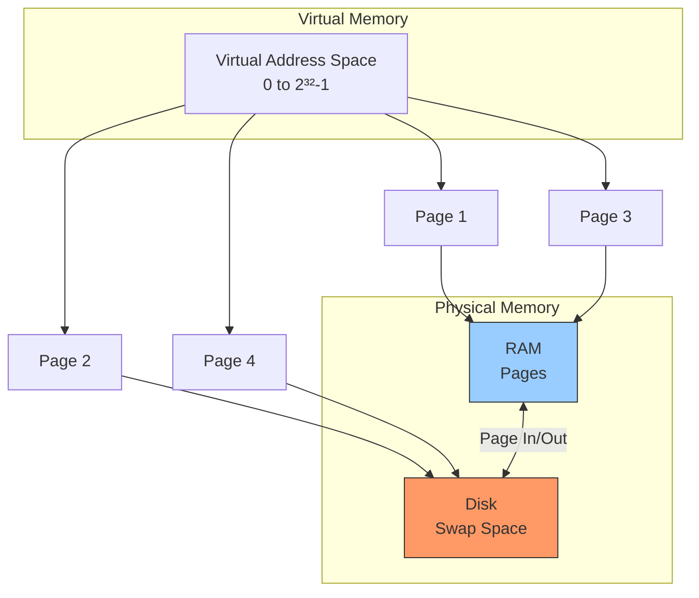
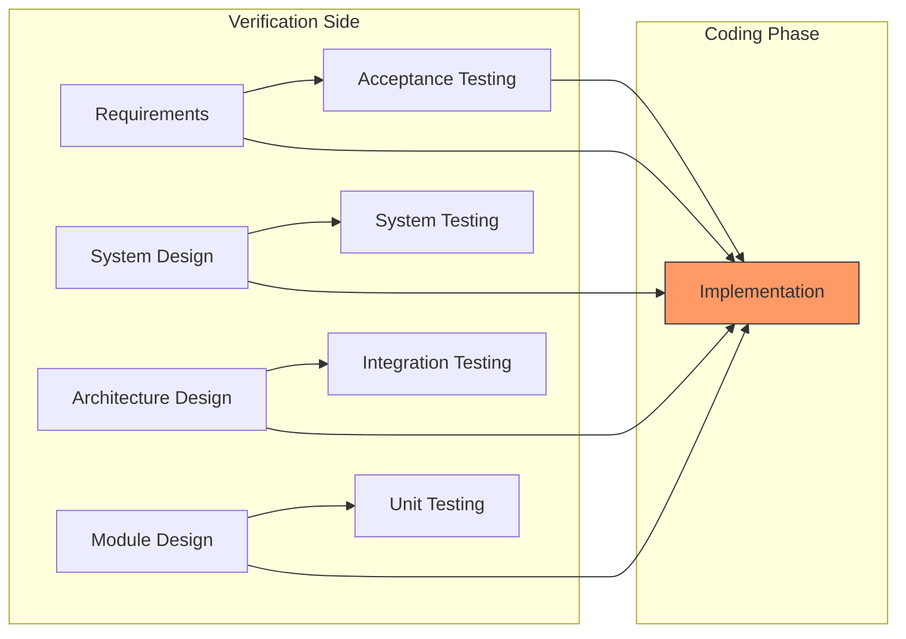
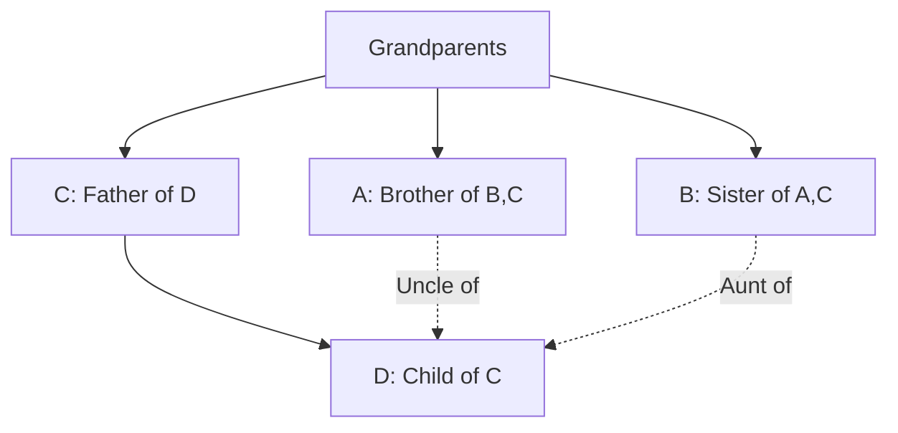
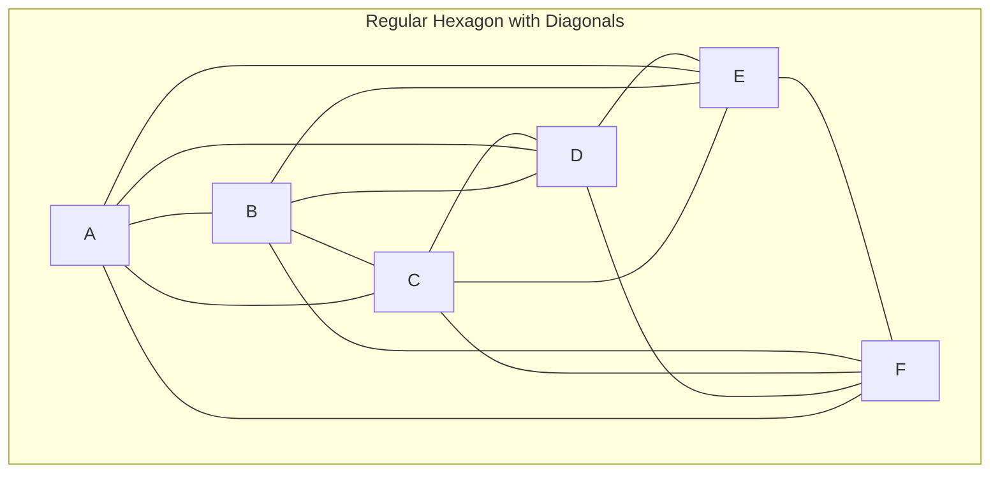

# NIC Scientist B 2022 — Solved Paper

> National Informatics Centre (NIC) Scientist B recruitment exam 2022 — comprehensive solutions with TypeScript implementations, Mermaid diagrams, and strategic insights.

---
## Exam Pattern

| Section | Subject | Questions | Marks | Duration |
|---------|---------|-----------|-------|----------|
| Section A | Computer Science Fundamentals | 50 | 50 | 60 min |
| Section B | Programming & OOP | 30 | 30 | 40 min |
| Section C | General Aptitude | 20 | 20 | 20 min |
| **Total** | | **100** | **100** | **120 min** |

**Marking:** +1 correct, −0.25 incorrect.

---

## Topic Weightage Comparison (2020–2024)

| Topic | 2022 | 2023 | 2024 | Trend |
|-------|------|------|------|-------|
| DS & Algorithms | 14 | 13 | 13 | Stable |
| OS | 10 | 9 | 9 | Stable |
| DBMS | 9 | 9 | 9 | Stable |
| CN | 9 | 9 | 9 | Stable |
| SE | 5 | 6 | 6 | Slightly up |
| COA | 3 | 4 | 4 | Stable |
| **Total (Sec A)** | **50** | **50** | **50** | |

---

## Section A: Computer Science Fundamentals (50 Questions)

### Data Structures & Algorithms (14 Qs)

**Q1.** Which data structure is used for implementing recursion?

A) Queue  
B) Stack  
C) Array  
D) Linked List  

<details>
<summary>Show Answer</summary>

**Answer:** B) Stack

**Explanation:** The system call stack manages function calls and recursion. Each call creates a stack frame with return address, parameters, and local variables.

</details>

---

**Q2.** What is the time complexity of accessing an element in an array by index?

A) O(1)  
B) O(log n)  
C) O(n)  
D) O(n²)  

<details>
<summary>Show Answer</summary>

**Answer:** A) O(1)

**Explanation:** Array access by index is O(1) because it's computed as: base_address + (index × element_size). This is direct memory addressing with no traversal needed.

</details>

---

**Q3.** Which tree traversal (Left-Root-Right) gives nodes in non-decreasing order for a BST?

A) Preorder  
B) Inorder  
C) Postorder  
D) Level Order  

<details>
<summary>Show Answer</summary>

**Answer:** B) Inorder

**Explanation:** Inorder traversal visits left subtree, then root, then right subtree. For a BST, this visits all nodes in ascending order.

```typescript
// BST Inorder Traversal — TypeScript
class BSTNode {
  constructor(
    public val: number,
    public left: BSTNode | null = null,
    public right: BSTNode | null = null
  ) {}
}

function inorder(root: BSTNode | null): number[] {
  const result: number[] = [];
  function traverse(node: BSTNode | null): void {
    if (!node) return;
    traverse(node.left);
    result.push(node.val);
    traverse(node.right);
  }
  traverse(root);
  return result;
}

// Build BST:      50
//               /  \
//              30   70
//             /  \    \
//            20  40    80
const root = new BSTNode(50,
  new BSTNode(30, new BSTNode(20), new BSTNode(40)),
  new BSTNode(70, null, new BSTNode(80))
);
console.log(inorder(root)); // [20, 30, 40, 50, 70, 80]
```

</details>

---

**Q4.** Which sorting algorithm has an average-case time complexity of O(n log n)?

A) Bubble Sort  
B) Selection Sort  
C) Insertion Sort  
D) Heap Sort  

<details>
<summary>Show Answer</summary>

**Answer:** D) Heap Sort

**Explanation:** Heap Sort has O(n log n) in all cases (best, average, worst). Bubble, Selection, and Insertion sorts are all O(n²) average case.

</details>

---

**Q5.** In a queue implemented using an array of size MAX, what condition indicates that the queue is full (circular)?

A) front == -1  
B) rear == MAX - 1  
C) front == (rear + 1) % MAX  
D) rear == front  

<details>
<summary>Show Answer</summary>

**Answer:** C) front == (rear + 1) % MAX

**Explanation:** In a circular queue, full condition is when the next position of rear is front. This means only MAX-1 elements can be stored (one slot is left empty to distinguish full from empty).

```typescript
// Circular Queue — TypeScript
class CircularQueue<T> {
  private data: (T | undefined)[];
  private front = 0;
  private rear = 0;
  private size: number;

  constructor(size: number) {
    this.size = size + 1; // One extra slot for empty/full distinction
    this.data = new Array(this.size);
  }

  isEmpty(): boolean { return this.front === this.rear; }

  isFull(): boolean { return this.front === (this.rear + 1) % this.size; }

  enqueue(item: T): boolean {
    if (this.isFull()) return false;
    this.data[this.rear] = item;
    this.rear = (this.rear + 1) % this.size;
    return true;
  }

  dequeue(): T | undefined {
    if (this.isEmpty()) return undefined;
    const item = this.data[this.front];
    this.front = (this.front + 1) % this.size;
    return item;
  }
}

const cq = new CircularQueue<number>(5);
cq.enqueue(10); cq.enqueue(20); cq.enqueue(30); cq.enqueue(40); cq.enqueue(50);
console.log(cq.enqueue(60)); // false — queue is full
console.log(cq.dequeue()); // 10
console.log(cq.enqueue(60)); // true — space freed up
```

</details>

---

**Q6.** Which of the following is true about a binary search tree (BST)?

A) Left child is always greater than the parent  
B) Right child is always smaller than the parent  
C) Inorder traversal yields ascending order  
D) All leaves are at the same level  

<details>
<summary>Show Answer</summary>

**Answer:** C) Inorder traversal yields ascending order

**Explanation:** In a BST, left child ≤ parent < right child (or similar variant). Inorder traversal visits left → parent → right, giving ascending order.

</details>

---

**Q7.** The maximum number of nodes in a binary tree of depth d (root at depth 0) is:

A) 2ᵈ  
B) 2ᵈ⁺¹ − 1  
C) 2ᵈ − 1  
D) 2ᵈ⁺¹  

<details>
<summary>Show Answer</summary>

**Answer:** B) 2ᵈ⁺¹ − 1

**Explanation:** At depth i, maximum nodes = 2ⁱ. Total = 2⁰+2¹+...+2ᵈ = 2ᵈ⁺¹−1.

</details>

---

**Q8.** What is the space complexity of a recursive function that calls itself n times with O(1) stack frame size?

A) O(1)  
B) O(n)  
C) O(log n)  
D) O(n²)  

<details>
<summary>Show Answer</summary>

**Answer:** B) O(n)

**Explanation:** Each recursive call adds a stack frame. With n recursive calls, the maximum stack depth is n, requiring O(n) space (even if each frame is O(1)).

</details>

---

**Q9.** Which of the following algorithms is used for finding the minimum spanning tree of a graph?

A) Dijkstra  
B) Floyd-Warshall  
C) Prim's  
D) Bellman-Ford  

<details>
<summary>Show Answer</summary>

**Answer:** C) Prim's

**Explanation:** Prim's algorithm finds MST by growing a single tree from a starting vertex. Kruskal's also finds MST. Dijkstra and Bellman-Ford find shortest paths. Floyd-Warshall finds all-pairs shortest paths.

```typescript
// Prim's MST Algorithm — TypeScript
function primMST(graph: number[][]): { mst: number[][]; weight: number } {
  const n = graph.length;
  const selected = new Array(n).fill(false);
  const mst: number[][] = [];
  selected[0] = true;
  let totalWeight = 0;

  for (let edgeCount = 0; edgeCount < n - 1; edgeCount++) {
    let min = Infinity;
    let x = 0, y = 0;

    for (let i = 0; i < n; i++) {
      if (selected[i]) {
        for (let j = 0; j < n; j++) {
          if (!selected[j] && graph[i][j] && graph[i][j] < min) {
            min = graph[i][j];
            x = i; y = j;
          }
        }
      }
    }

    if (min !== Infinity) {
      mst.push([x, y]);
      totalWeight += min;
      selected[y] = true;
    }
  }

  return { mst, weight: totalWeight };
}

const graph = [
  [0, 2, 0, 6, 0],
  [2, 0, 3, 8, 5],
  [0, 3, 0, 0, 7],
  [6, 8, 0, 0, 9],
  [0, 5, 7, 9, 0],
];

const result = primMST(graph);
console.log('MST Edges:', result.mst);
console.log('Total Weight:', result.weight);
```

</details>

---

**Q10.** Which of the following is an application of the stack data structure?

A) Expression evaluation  
B) Job scheduling  
C) Page replacement  
D) Graph traversal (BFS)  

<details>
<summary>Show Answer</summary>

**Answer:** A) Expression evaluation

**Explanation:** Stacks are used for evaluating postfix expressions, converting infix to postfix, and parsing. BFS uses a queue. Page replacement uses various algorithms. Job scheduling uses queues/priority queues.

</details>

---

**Q11.** How many edges does a complete graph with n vertices have?

A) n  
B) n²  
C) n(n−1)/2  
D) n(n−1)  

<details>
<summary>Show Answer</summary>

**Answer:** C) n(n−1)/2

**Explanation:** In a complete graph, each vertex is connected to all other n−1 vertices. Total edges = n(n−1)/2.

</details>

---

**Q12.** Which of the following is a self-balancing binary search tree?

A) Binary Search Tree  
B) AVL Tree  
C) B-Tree  
D) Trie  

<details>
<summary>Show Answer</summary>

**Answer:** B) AVL Tree

**Explanation:** AVL tree is a self-balancing BST where the height difference between left and right subtrees (balance factor) is at most 1 for every node. Red-Black trees are another example.

```typescript
// AVL Tree balance check — TypeScript
class AVLNode {
  height: number = 1;
  constructor(
    public val: number,
    public left: AVLNode | null = null,
    public right: AVLNode | null = null
  ) {}
}

class AVLTree {
  private getHeight(node: AVLNode | null): number {
    return node ? node.height : 0;
  }

  private getBalanceFactor(node: AVLNode | null): number {
    return node ? this.getHeight(node.left) - this.getHeight(node.right) : 0;
  }

  private rightRotate(y: AVLNode): AVLNode {
    const x = y.left!;
    const T2 = x.right;
    x.right = y;
    y.left = T2;
    y.height = Math.max(this.getHeight(y.left), this.getHeight(y.right)) + 1;
    x.height = Math.max(this.getHeight(x.left), this.getHeight(x.right)) + 1;
    return x;
  }

  private leftRotate(x: AVLNode): AVLNode {
    const y = x.right!;
    const T2 = y.left;
    y.left = x;
    x.right = T2;
    x.height = Math.max(this.getHeight(x.left), this.getHeight(x.right)) + 1;
    y.height = Math.max(this.getHeight(y.left), this.getHeight(y.right)) + 1;
    return y;
  }

  insert(node: AVLNode | null, val: number): AVLNode {
    if (!node) return new AVLNode(val);
    if (val < node.val) node.left = this.insert(node.left, val);
    else if (val > node.val) node.right = this.insert(node.right, val);
    else return node;

    node.height = Math.max(this.getHeight(node.left), this.getHeight(node.right)) + 1;
    const balance = this.getBalanceFactor(node);

    // Left Left
    if (balance > 1 && val < node.left!.val) return this.rightRotate(node);
    // Right Right
    if (balance < -1 && val > node.right!.val) return this.leftRotate(node);
    // Left Right
    if (balance > 1 && val > node.left!.val) {
      node.left = this.leftRotate(node.left!);
      return this.rightRotate(node);
    }
    // Right Left
    if (balance < -1 && val < node.right!.val) {
      node.right = this.rightRotate(node.right!);
      return this.leftRotate(node);
    }
    return node;
  }
}
```

</details>

---

**Q13.** Which algorithm is used to find the strongly connected components (SCC) of a directed graph?

A) Dijkstra  
B) Kosaraju's  
C) Kruskal's  
D) Prim's  

<details>
<summary>Show Answer</summary>

**Answer:** B) Kosaraju's

**Explanation:** Kosaraju's algorithm uses two DFS passes to find SCCs: first pass computes finish times, second pass (on reversed graph) processes vertices in decreasing finish time order. Tarjan's algorithm also finds SCCs.

</details>

---

**Q14.** The time complexity of heapify operation on an array of n elements is:

A) O(n)  
B) O(log n)  
C) O(n log n)  
D) O(n²)  

<details>
<summary>Show Answer</summary>

**Answer:** A) O(n)

**Explanation:** Building a heap from an array (heapify) takes O(n) time. While each sift-down is O(log n), the number of operations sums to O(n) because most nodes are near the bottom.

```typescript
// Heapify — TypeScript (O(n))
function heapify(arr: number[]): void {
  const n = arr.length;
  // Start from last non-leaf node
  for (let i = Math.floor(n / 2) - 1; i >= 0; i--) {
    siftDown(arr, i, n);
  }
}

function siftDown(arr: number[], i: number, n: number): void {
  let largest = i;
  const left = 2 * i + 1;
  const right = 2 * i + 2;

  if (left < n && arr[left] > arr[largest]) largest = left;
  if (right < n && arr[right] > arr[largest]) largest = right;
  if (largest !== i) {
    [arr[i], arr[largest]] = [arr[largest], arr[i]];
    siftDown(arr, largest, n);
  }
}

const arr = [3, 5, 1, 10, 2, 7];
heapify(arr);
console.log(arr); // [10, 5, 7, 3, 2, 1]
```

</details>

---

### Operating Systems (10 Qs)

**Q15.** Which of the following is a process scheduling algorithm?

A) FIFO  
B) LRU  
C) LFU  
D) Optimal  

<details>
<summary>Show Answer</summary>

**Answer:** A) FIFO

**Explanation:** FIFO (First In First Out), also called FCFS, is a process scheduling algorithm. LRU, LFU, and Optimal are page replacement algorithms.

</details>

---

**Q16.** What is a critical section in concurrent programming?

A) A section of code that contains bugs  
B) A section of code that accesses shared resources  
C) A section that stores critical data  
D) A section that handles errors  

<details>
<summary>Show Answer</summary>

**Answer:** B) A section of code that accesses shared resources

**Explanation:** The critical section is a code segment where shared resources (variables, files, etc.) are accessed. Mutual exclusion ensures only one process executes its critical section at a time to prevent race conditions.

```typescript
// Critical Section — TypeScript
class SharedCounter {
  private count = 0;
  private locked = false;
  private queue: (() => void)[] = [];

  async increment(): Promise<void> {
    // Entry section — acquire lock
    await this.acquireLock();

    // Critical section — safely access shared resource
    const current = this.count;
    // Simulate some work
    await new Promise(r => setTimeout(r, 10));
    this.count = current + 1;

    // Exit section — release lock
    this.releaseLock();
  }

  private async acquireLock(): Promise<void> {
    while (this.locked) {
      await new Promise(r => setTimeout(r, 1));
    }
    this.locked = true;
  }

  private releaseLock(): void {
    this.locked = false;
  }

  getCount(): number { return this.count; }
}

// Without mutual exclusion, race conditions would corrupt `count`
```

</details>

---

**Q17.** Which of the following is NOT a memory management technique?

A) Paging  
B) Segmentation  
C) Compaction  
D) Spooling  

<details>
<summary>Show Answer</summary>

**Answer:** D) Spooling

**Explanation:** Spooling (Simultaneous Peripheral Operations On-Line) is an I/O management technique for managing jobs/devices, not memory management. Paging, segmentation, and compaction are memory management techniques.

</details>

---

**Q18.** What is a dispatcher in the context of operating systems?

A) A module that selects a process from the ready queue  
B) A module that gives control of CPU to the selected process  
C) A module that handles interrupts  
D) A module that manages memory  

<details>
<summary>Show Answer</summary>

**Answer:** B) A module that gives control of CPU to the selected process

**Explanation:** The dispatcher is responsible for context switching — saving the state of the current process and loading the saved state of the selected process. The scheduler selects which process runs; the dispatcher makes it happen.

</details>

---

**Q19.** Which of the following is a preemptive scheduling algorithm?

A) FCFS  
B) SJF (non-preemptive)  
C) SRTF (Shortest Remaining Time First)  
D) Priority (non-preemptive)  

<details>
<summary>Show Answer</summary>

**Answer:** C) SRTF (Shortest Remaining Time First)

**Explanation:** SRTF is the preemptive version of SJF. If a new process arrives with a shorter remaining burst time than the currently running process, the CPU is preempted. FCFS and non-preemptive SJF/Priority are non-preemptive.

```typescript
// SRTF Preemptive Scheduling — TypeScript
interface Process {
  id: string;
  arrivalTime: number;
  burstTime: number;
  remainingTime: number;
}

function srtfScheduling(processes: Process[]): void {
  const n = processes.length;
  let completed = 0;
  let currentTime = 0;
  let minRemaining = Infinity;
  let shortest = -1;
  let prevProcess = -1;

  while (completed < n) {
    // Find process with shortest remaining time among arrived processes
    minRemaining = Infinity;
    shortest = -1;

    for (let i = 0; i < n; i++) {
      if (processes[i].arrivalTime <= currentTime && processes[i].remainingTime > 0) {
        if (processes[i].remainingTime < minRemaining) {
          minRemaining = processes[i].remainingTime;
          shortest = i;
        }
      }
    }

    if (shortest === -1) {
      currentTime++;
      continue;
    }

    if (prevProcess !== shortest) {
      console.log(`Time ${currentTime}: Process ${processes[shortest].id} starts running`);
      prevProcess = shortest;
    }

    processes[shortest].remainingTime--;
    currentTime++;

    if (processes[shortest].remainingTime === 0) {
      completed++;
      console.log(`Time ${currentTime}: Process ${processes[shortest].id} completes`);
      prevProcess = -1;
    }
  }
}

srtfScheduling([
  { id: 'P1', arrivalTime: 0, burstTime: 8, remainingTime: 8 },
  { id: 'P2', arrivalTime: 1, burstTime: 4, remainingTime: 4 },
  { id: 'P3', arrivalTime: 2, burstTime: 2, remainingTime: 2 },
  { id: 'P4', arrivalTime: 3, burstTime: 1, remainingTime: 1 },
]);
```

</details>

---

**Q20.** What is the function of the file allocation table (FAT)?

A) Manage file permissions  
B) Track which disk blocks belong to which files  
C) Schedule file operations  
D) Compress files  

<details>
<summary>Show Answer</summary>

**Answer:** B) Track which disk blocks belong to which files

**Explanation:** FAT (File Allocation Table) is a linked-list based file system structure that stores the mapping of file blocks/clusters on disk. Each entry points to the next cluster of a file.

</details>

---

**Q21.** Which of the following is a state of a process?

A) Compile  
B) Ready  
C) Execute  
D) Assemble  

<details>
<summary>Show Answer</summary>

**Answer:** B) Ready

**Explanation:** The standard process states are New, Ready, Running, Blocked/Waiting, and Terminated. "Ready" means the process is in main memory and waiting for CPU allocation.

</details>

---

**Q22.** What is the main purpose of virtual memory?

A) Increase CPU speed  
B) Allow programs larger than physical memory  
C) Reduce disk space  
D) Improve network performance  

<details>
<summary>Show Answer</summary>

**Answer:** B) Allow programs larger than physical memory

**Explanation:** Virtual memory uses disk space as an extension of RAM. It allows a process to use more memory than physically available by swapping pages between RAM and disk. This enables running larger programs and more concurrent processes.



</details>

---

**Q23.** Which disk scheduling algorithm minimizes seek time by serving the closest request first?

A) FCFS  
B) SSTF  
C) SCAN  
D) C-SCAN  

<details>
<summary>Show Answer</summary>

**Answer:** B) SSTF (Shortest Seek Time First)

**Explanation:** SSTF selects the request with the minimum seek time from the current head position. It may cause starvation for requests at the edges of the disk.

</details>

---

**Q24.** In Unix/Linux, which command is used to display the contents of a file?

A) cat  
B) ls  
C) pwd  
D) mkdir  

<details>
<summary>Show Answer</summary>

**Answer:** A) cat

**Explanation:** cat (concatenate) displays file contents. ls lists directory contents. pwd prints working directory. mkdir creates a directory.

</details>

---

### Database Management Systems (9 Qs)

**Q25.** Which SQL command is used to remove a table from the database?

A) DELETE  
B) REMOVE  
C) DROP  
D) CLEAR  

<details>
<summary>Show Answer</summary>

**Answer:** C) DROP

**Explanation:** DROP TABLE removes the entire table structure and data. DELETE removes rows but keeps the structure. TRUNCATE removes all rows (keeps structure).

</details>

---

**Q26.** Which normal form deals with transitive dependencies?

A) 1NF  
B) 2NF  
C) 3NF  
D) BCNF  

<details>
<summary>Show Answer</summary>

**Answer:** C) 3NF

**Explanation:** A transitive dependency exists when a non-key attribute depends on another non-key attribute. 3NF eliminates transitive dependencies. Example: Student → Department → HOD (transitive: Student → HOD via Department).

</details>

---

**Q27.** In SQL, which clause is used to filter groups created by GROUP BY?

A) WHERE  
B) HAVING  
C) FILTER  
D) GROUP FILTER  

<details>
<summary>Show Answer</summary>

**Answer:** B) HAVING

**Explanation:** HAVING filters groups after GROUP BY aggregation. WHERE filters rows before grouping.

```sql
SELECT department, AVG(salary) as avg_salary
FROM employees
GROUP BY department
HAVING AVG(salary) > 50000;
```

</details>

---

**Q28.** What is a superkey in a database?

A) A key that uniquely identifies each row  
B) A key that is the minimum required key  
C) A foreign key  
D) A composite key  

<details>
<summary>Show Answer</summary>

**Answer:** A) A key that uniquely identifies each row

**Explanation:** A superkey is a set of attributes that uniquely identifies a tuple (row). A candidate key is a minimal superkey (no proper subset is a superkey). The primary key is the chosen candidate key.

</details>

---

**Q29.** Which of the following is a join condition that returns all rows from both tables?

A) INNER JOIN  
B) LEFT JOIN  
C) RIGHT JOIN  
D) FULL OUTER JOIN  

<details>
<summary>Show Answer</summary>

**Answer:** D) FULL OUTER JOIN

**Explanation:** FULL OUTER JOIN returns all rows from both tables, matching where possible and filling NULLs where not. INNER JOIN returns only matching rows. LEFT/RIGHT JOIN returns all from one side and matches from the other.

```typescript
// SQL JOINs — TypeScript
interface TableA { id: number; name: string; }
interface TableB { id: number; value: string; }

function fullOuterJoin(a: TableA[], b: TableB[]): any[] {
  const result: any[] = [];
  const bMap = new Map(b.map(item => [item.id, item]));
  const aIds = new Set(a.map(item => item.id));

  // All from A with matching B
  for (const aItem of a) {
    const bItem = bMap.get(aItem.id);
    result.push({ ...aItem, bValue: bItem?.value ?? null });
  }

  // B rows not in A
  for (const bItem of b) {
    if (!aIds.has(bItem.id)) {
      result.push({ id: null, name: null, bValue: bItem.value });
    }
  }

  return result;
}
```

</details>

---

**Q30.** What is the ACID property that ensures changes are permanent after commit?

A) Atomicity  
B) Consistency  
C) Isolation  
D) Durability  

<details>
<summary>Show Answer</summary>

**Answer:** D) Durability

**Explanation:** Durability guarantees that once a transaction is committed, its changes are permanent even in the event of system failure. This is typically achieved by writing to a transaction log.

</details>

---

**Q31.** Which of the following is NOT a type of database model?

A) Hierarchical  
B) Network  
C) Relational  
D) Algorithmic  

<details>
<summary>Show Answer</summary>

**Answer:** D) Algorithmic

**Explanation:** Common database models include Hierarchical (tree), Network (graph), Relational (tables), Object-oriented, and NoSQL. "Algorithmic" is not a database data model.

</details>

---

**Q32.** Which of the following SQL statements is used to retrieve data?

A) INSERT  
B) UPDATE  
C) SELECT  
D) DELETE  

<details>
<summary>Show Answer</summary>

**Answer:** C) SELECT

**Explanation:** SELECT retrieves data from one or more tables. INSERT adds new rows. UPDATE modifies existing rows. DELETE removes rows.

</details>

---

**Q33.** What is a database transaction?

A) A single SQL query  
B) A logical unit of work with multiple operations  
C) A stored procedure  
D) A database trigger  

<details>
<summary>Show Answer</summary>

**Answer:** B) A logical unit of work with multiple operations

**Explanation:** A transaction is a sequence of one or more SQL operations treated as a single logical unit. It either completes entirely (COMMIT) or is undone entirely (ROLLBACK). Example: transferring money between bank accounts requires a transaction.

</details>

---

### Computer Networks (9 Qs)

**Q34.** Which protocol is used for web browsing?

A) FTP  
B) HTTP  
C) SMTP  
D) POP3  

<details>
<summary>Show Answer</summary>

**Answer:** B) HTTP (HyperText Transfer Protocol)

**Explanation:** HTTP is the foundation of data communication on the World Wide Web. It follows a request-response model between client (browser) and server.

</details>

---

**Q35.** Which topology has a central hub or switch?

A) Bus  
B) Ring  
C) Star  
D) Mesh  

<details>
<summary>Show Answer</summary>

**Answer:** C) Star

**Explanation:** In star topology, all devices connect to a central hub or switch. Data passes through the central device. It's widely used in LANs due to easy troubleshooting and fault isolation.

</details>

---

**Q36.** What is the range of Class B IP addresses?

A) 0.0.0.0 to 127.255.255.255  
B) 128.0.0.0 to 191.255.255.255  
C) 192.0.0.0 to 223.255.255.255  
D) 224.0.0.0 to 239.255.255.255  

<details>
<summary>Show Answer</summary>

**Answer:** B) 128.0.0.0 to 191.255.255.255

**Explanation:** Class B: first bits are "10", range 128.0.0.0 to 191.255.255.255. Default subnet mask: 255.255.0.0.

</details>

---

**Q37.** Which layer of the OSI model deals with data encryption?

A) Application Layer  
B) Presentation Layer  
C) Session Layer  
D) Transport Layer  

<details>
<summary>Show Answer</summary>

**Answer:** B) Presentation Layer (Layer 6)

**Explanation:** The Presentation Layer handles data formatting, encryption/decryption, and compression. It translates data between the application layer and the network format.

</details>

---

**Q38.** What is a MAC address?

A) A 32-bit IP address  
B) A 48-bit hardware address  
C) A 64-bit port address  
D) A 16-bit network ID  

<details>
<summary>Show Answer</summary>

**Answer:** B) A 48-bit hardware address

**Explanation:** A MAC (Media Access Control) address is a 48-bit (6-byte) unique identifier assigned to network interface controllers. It's typically written as 12 hexadecimal digits (e.g., 00:1A:2B:3C:4D:5E).

</details>

---

**Q39.** Which of the following is a connectionless protocol?

A) TCP  
B) UDP  
C) HTTP  
D) FTP  

<details>
<summary>Show Answer</summary>

**Answer:** B) UDP (User Datagram Protocol)

**Explanation:** UDP is connectionless — it sends datagrams without establishing a connection, with no guarantee of delivery or ordering. It's faster than TCP and used for streaming, DNS, and VoIP.

```typescript
// UDP vs TCP comparison — TypeScript
interface ProtocolStats {
  protocol: string;
  connectionOriented: boolean;
  reliable: boolean;
  ordering: boolean;
  speed: string;
  useCases: string[];
}

const protocols: ProtocolStats[] = [
  {
    protocol: 'TCP',
    connectionOriented: true,
    reliable: true,
    ordering: true,
    speed: 'Slower (overhead)',
    useCases: ['Web browsing', 'Email', 'File transfer'],
  },
  {
    protocol: 'UDP',
    connectionOriented: false,
    reliable: false,
    ordering: false,
    speed: 'Faster (no overhead)',
    useCases: ['Streaming', 'DNS', 'VoIP', 'Gaming'],
  },
];

protocols.forEach(p => {
  console.log(`${p.protocol}: ${p.connectionOriented ? 'Connection-oriented' : 'Connectionless'}`);
});
```

</details>

---

**Q40.** What does SMTP stand for?

A) Simple Mail Transfer Protocol  
B) Simple Message Transfer Protocol  
C) System Mail Transfer Protocol  
D) Standard Mail Transfer Protocol  

<details>
<summary>Show Answer</summary>

**Answer:** A) Simple Mail Transfer Protocol

**Explanation:** SMTP is the standard protocol for sending emails from client to server and between mail servers. POP3 and IMAP are used for receiving emails.

</details>

---

**Q41.** Which device is used to connect two different networks?

A) Hub  
B) Switch  
C) Router  
D) Bridge  

<details>
<summary>Show Answer</summary>

**Answer:** C) Router

**Explanation:** A router connects different networks and forwards packets based on IP addresses. It operates at Layer 3 (Network Layer). A switch connects devices within the same network (Layer 2). A hub is a Layer 1 device.

</details>

---

**Q42.** What is a firewall primarily used for?

A) Increase network speed  
B) Monitor and control network traffic  
C) Assign IP addresses  
D) Translate domain names  

<details>
<summary>Show Answer</summary>

**Answer:** B) Monitor and control network traffic

**Explanation:** A firewall enforces security policies by allowing or blocking traffic based on rules. It can be hardware or software-based and inspects packets at various OSI layers.

</details>

---

### Software Engineering (5 Qs)

**Q43.** Which model is known as the "V-Model"?

A) Verification and Validation model  
B) Vertical model  
C) Variable model  
D) Visual model  

<details>
<summary>Show Answer</summary>

**Answer:** A) Verification and Validation model

**Explanation:** The V-Model maps each development phase to a corresponding testing phase: Requirements → Acceptance Testing, Design → System Testing, etc. It emphasizes verification (are we building it right?) and validation (are we building the right thing?).



</details>

---

**Q44.** Which of the following is a characteristic of Agile software development?

A) Heavy documentation  
B) Fixed requirements  
C) Incremental delivery  
D) Sequential phases  

<details>
<summary>Show Answer</summary>

**Answer:** C) Incremental delivery

**Explanation:** Agile emphasizes iterative/incremental delivery, customer collaboration, and responding to change. It values working software over comprehensive documentation.

</details>

---

**Q45.** What does the term "coupling" refer to in software design?

A) The degree of interdependence between modules  
B) The number of lines of code  
C) The complexity of a module  
D) The testing coverage  

<details>
<summary>Show Answer</summary>

**Answer:** A) The degree of interdependence between modules

**Explanation:** Coupling measures how connected different modules are. Low coupling (loose coupling) is desirable — changes in one module should not heavily impact others. High coupling makes maintenance difficult.

</details>

---

**Q46.** What is a use case in UML?

A) A description of how a user interacts with the system  
B) A diagram showing class relationships  
C) A sequence of method calls  
D) A state transition diagram  

<details>
<summary>Show Answer</summary>

**Answer:** A) A description of how a user interacts with the system

**Explanation:** A use case describes a set of actions that a system performs in collaboration with actors to achieve a goal. Use case diagrams show actors, use cases, and relationships.

</details>

---

**Q47.** Which of the following testing types is performed by end-users?

A) Unit testing  
B) Integration testing  
C) System testing  
D) Acceptance testing  

<details>
<summary>Show Answer</summary>

**Answer:** D) Acceptance testing

**Explanation:** Acceptance testing (UAT — User Acceptance Testing) is performed by end-users to determine if the system meets their needs and is acceptable for deployment.

</details>

---

### Computer Organization & Architecture (3 Qs)

**Q48.** Which of the following is a sequential circuit?

A) Multiplexer  
B) Decoder  
C) Flip-flop  
D) Adder  

<details>
<summary>Show Answer</summary>

**Answer:** C) Flip-flop

**Explanation:** Flip-flops are sequential circuits that store state (1 bit). They have memory and their output depends on current inputs AND past state. Combinational circuits (multiplexer, decoder, adder) have outputs depending only on current inputs.

</details>

---

**Q49.** What is the function of the ALU?

A) Store data  
B) Perform arithmetic and logic operations  
C) Manage memory  
D) Control instruction flow  

<details>
<summary>Show Answer</summary>

**Answer:** B) Perform arithmetic and logic operations

**Explanation:** The ALU (Arithmetic Logic Unit) performs arithmetic operations (addition, subtraction) and logic operations (AND, OR, NOT, comparison). It's a fundamental component of the CPU.

</details>

---

**Q50.** Which bus transfers data between CPU and memory?

A) Address bus  
B) Control bus  
C) Data bus  
D) System bus  

<details>
<summary>Show Answer</summary>

**Answer:** C) Data bus

**Explanation:** The data bus carries actual data between CPU, memory, and I/O devices. The address bus carries memory addresses. The control bus carries control signals (read/write, interrupt, etc.).

---

## Section B: Programming & OOP (30 Questions)

### C Programming (13 Qs)

**Q51.** What is the output of the following C code?

```c
#include <stdio.h>
int main() {
    int a = 10, b = 20, c = 30;
    int *p[] = {&a, &b, &c};
    printf("%d ", **p);
    p++;
    printf("%d", **p);
    return 0;
}
```

A) 10 20  
B) 10 30  
C) Compilation error  
D) 20 30  

<details>
<summary>Show Answer</summary>

**Answer:** C) Compilation error

**Explanation:** In C, an array name is not a modifiable l-value. `p++` is not allowed on an array. If p were a pointer to pointer, it would work. But `p` is an array, not a pointer variable.

</details>

---

**Q52.** Which of the following declares a pointer to an integer in C?

A) int *p;  
B) int p*;  
C) pointer int p;  
D) int &p;  

<details>
<summary>Show Answer</summary>

**Answer:** A) int *p;

**Explanation:** `int *p;` declares p as a pointer to an integer. The `*` is part of the declarator, not the type specifier.

</details>

---

**Q53.** What is the output of the following code?

```c
#include <stdio.h>
int main() {
    int x = 5;
    int y = ++x + x++;
    printf("%d %d", x, y);
    return 0;
}
```

A) 6 12  
B) 7 13  
C) 7 12  
D) Undefined behavior  

<details>
<summary>Show Answer</summary>

**Answer:** D) Undefined behavior

**Explanation:** Modifying a variable multiple times between sequence points (x modified by both ++x and x++) is undefined behavior in C. The result varies by compiler.

</details>

---

**Q54.** What does `int (*ptr)[5];` declare?

A) An array of 5 integer pointers  
B) A pointer to an array of 5 integers  
C) A pointer to an integer  
D) An integer pointer array  

<details>
<summary>Show Answer</summary>

**Answer:** B) A pointer to an array of 5 integers

**Explanation:** `int (*ptr)[5]` — ptr is a pointer to an array of 5 ints. `int *ptr[5]` would be an array of 5 pointers to int. The parentheses change the binding.

</details>

---

**Q55.** What is the output of the following code?

```c
#include <stdio.h>
int main() {
    int arr[] = {1, 2, 3, 4, 5};
    printf("%d", sizeof(arr) / sizeof(arr[0]));
    return 0;
}
```

A) 4  
B) 5  
C) 20  
D) 1  

<details>
<summary>Show Answer</summary>

**Answer:** B) 5

**Explanation:** sizeof(arr) returns total array size in bytes (5 × 4 = 20 on 32-bit). sizeof(arr[0]) = 4. 20/4 = 5 (number of elements).

</details>

---

**Q56.** Which of the following correctly allocates memory for an integer in C?

A) int *p = malloc(sizeof(int));  
B) int *p = malloc(1);  
C) int p = malloc(sizeof(int));  
D) int *p = alloc(sizeof(int));  

<details>
<summary>Show Answer</summary>

**Answer:** A) int *p = malloc(sizeof(int));

**Explanation:** malloc returns a void pointer to the allocated memory. It takes the number of bytes to allocate. sizeof(int) ensures the right size for an integer.

```typescript
// Malloc equivalent in TypeScript (conceptual)
interface MemoryBlock {
  address: number;
  size: number;
  data: any;
  free: boolean;
}

class SimpleAllocator {
  private heap: MemoryBlock[] = [];
  private nextAddress = 1000;

  malloc(size: number): MemoryBlock | null {
    // Check for free block (first-fit)
    const freeBlock = this.heap.find(b => b.free && b.size >= size);
    if (freeBlock) {
      freeBlock.free = false;
      return freeBlock;
    }

    // Allocate new block
    const block: MemoryBlock = {
      address: this.nextAddress,
      size,
      data: null,
      free: false,
    };
    this.nextAddress += size;
    this.heap.push(block);
    return block;
  }

  free(block: MemoryBlock): void {
    block.free = true;
    console.log(`Freed memory at address ${block.address}`);
  }
}
```

</details>

---

**Q57.** What does the following code print?

```c
#include <stdio.h>
void func(int x) {
    x = 20;
}
int main() {
    int a = 10;
    func(a);
    printf("%d", a);
    return 0;
}
```

A) 10  
B) 20  
C) Compilation error  
D) Undefined  

<details>
<summary>Show Answer</summary>

**Answer:** A) 10

**Explanation:** C uses pass-by-value. func receives a copy of a. Modifying x inside func doesn't affect the original a in main.

</details>

---

**Q58.** Which of the following is a valid function prototype in C?

A) int func(void);  
B) void func(int, int);  
C) float func(int x, float y);  
D) All of the above  

<details>
<summary>Show Answer</summary>

**Answer:** D) All of the above

**Explanation:** All three are valid function prototypes. A function prototype declares the function's return type, name, and parameter types (without the body).

</details>

---

**Q59.** What is the output?

```c
#include <stdio.h>
int main() {
    char str[] = "NIC";
    printf("%c", *(str + 1));
    return 0;
}
```

A) N  
B) I  
C) C  
D) Compilation error  

<details>
<summary>Show Answer</summary>

**Answer:** B) I

**Explanation:** str points to 'N'. str+1 points to 'I'. *(str+1) = 'I'.

</details>

---

**Q60.** What is the output of the following code?

```c
#include <stdio.h>
int main() {
    int x = 0;
    if (x = 1)
        printf("True");
    else
        printf("False");
    return 0;
}
```

A) True  
B) False  
C) Compilation error  
D) Undefined  

<details>
<summary>Show Answer</summary>

**Answer:** A) True

**Explanation:** x = 1 is an assignment (not comparison). The value of the assignment is 1 (true), so the if block executes. This is a common C mistake — should be `x == 1` for comparison.

</details>

---

**Q61.** Which of the following is used for dynamic memory deallocation in C?

A) delete  
B) dealloc  
C) free  
D) release  

<details>
<summary>Show Answer</summary>

**Answer:** C) free

**Explanation:** free() is used to deallocate memory previously allocated by malloc, calloc, or realloc. Memory leaks occur when allocated memory is not freed.

</details>

---

**Q62.** What does the following code do?

```c
#include <stdio.h>
int main() {
    FILE *fp = fopen("data.txt", "r");
    if (fp == NULL) {
        printf("Error opening file");
        return 1;
    }
    fclose(fp);
    return 0;
}
```

A) Writes to a file  
B) Reads and prints a file  
C) Opens and closes a file  
D) Creates a new file  

<details>
<summary>Show Answer</summary>

**Answer:** C) Opens and closes a file

**Explanation:** The code opens "data.txt" in read mode ("r"), checks if the file opened successfully, then closes it. It doesn't read or print the file contents.

</details>

---

**Q63.** What is the output of the following code?

```c
#include <stdio.h>
int main() {
    int i = 0;
    for (i = 0; i < 5; i++);
        printf("%d ", i);
    return 0;
}
```

A) 0 1 2 3 4  
B) 5  
C) 0 1 2 3 4 5  
D) Compilation error  

<details>
<summary>Show Answer</summary>

**Answer:** B) 5

**Explanation:** The semicolon after the for loop creates an empty loop body. The loop runs 5 times (i goes 0→5). After the loop, i=5, then printf executes once.

</details>

---

### Java & OOP (17 Qs)

**Q64.** Which of the following is NOT a feature of Java?

A) Platform Independent  
B) Object-Oriented  
C) Multiple Inheritance (using classes)  
D) Automatic Garbage Collection  

<details>
<summary>Show Answer</summary>

**Answer:** C) Multiple Inheritance (using classes)

**Explanation:** Java does NOT support multiple inheritance of classes (a class cannot extend multiple classes). It supports multiple inheritance of interfaces (a class can implement multiple interfaces). Diamond problem is avoided.

</details>

---

**Q65.** What is a class in Java?

A) An object instance  
B) A blueprint for creating objects  
C) A function  
D) A data type  

<details>
<summary>Show Answer</summary>

**Answer:** B) A blueprint for creating objects

**Explanation:** A class is a template that defines the structure and behavior (fields and methods) that objects of that class will have. An object is an instance of a class.

</details>

---

**Q66.** Which of the following is a valid way to create an object in Java?

A) MyClass obj = new MyClass();  
B) MyClass obj = MyClass();  
C) MyClass obj = create MyClass();  
D) new MyClass obj();  

<details>
<summary>Show Answer</summary>

**Answer:** A) MyClass obj = new MyClass();

**Explanation:** The `new` keyword allocates memory and invokes the constructor. The syntax is: `ClassName variableName = new ClassName(parameters);`

</details>

---

**Q67.** Which keyword is used to prevent a class from being subclassed?

A) static  
B) final  
C) abstract  
D) private  

<details>
<summary>Show Answer</summary>

**Answer:** B) final

**Explanation:** A final class cannot be extended/subclassed. Examples: String, Integer, Math are final classes in Java (for immutability and security).

</details>

---

**Q68.** What is method overloading in Java?

A) Same method name with different parameters  
B) Same method name with the same parameters  
C) Different method names  
D) Method with no parameters  

<details>
<summary>Show Answer</summary>

**Answer:** A) Same method name with different parameters

**Explanation:** Overloading allows multiple methods with the same name but different parameter lists (different number, types, or order of parameters). It's resolved at compile-time (static polymorphism).

```typescript
// Method Overloading — TypeScript
class Calculator {
  // Overloaded signatures
  add(a: number, b: number): number;
  add(a: string, b: string): string;
  add(a: number, b: number, c: number): number;

  // Implementation
  add(a: any, b: any, c?: any): any {
    if (c !== undefined) return a + b + c;
    return a + b;
  }
}

const calc = new Calculator();
console.log(calc.add(5, 10));        // 15
console.log(calc.add("Hello", " World")); // "Hello World"
console.log(calc.add(1, 2, 3));      // 6
```

</details>

---

**Q69.** Which Java keyword is used to import packages?

A) import  
B) include  
C) package  
D) using  

<details>
<summary>Show Answer</summary>

**Answer:** A) import

**Explanation:** `import` brings classes from other packages into scope. `package` declares which package a class belongs to. Java doesn't have `include` or `using` (like C/C++ or C#).

</details>

---

**Q70.** What is the base class for all Java classes?

A) Object  
B) Class  
C) Main  
D) Base  

<details>
<summary>Show Answer</summary>

**Answer:** A) Object

**Explanation:** The `java.lang.Object` class is the root of the Java class hierarchy. Every class in Java directly or indirectly extends Object. It provides methods like toString(), equals(), hashCode(), clone(), etc.

</details>

---

**Q71.** Which of the following is a checked exception in Java?

A) ArithmeticException  
B) NullPointerException  
C) IOException  
D) ArrayIndexOutOfBoundsException  

<details>
<summary>Show Answer</summary>

**Answer:** C) IOException

**Explanation:** Checked exceptions must be handled (try-catch) or declared (throws). IOException is checked. RuntimeException and its subclasses (ArithmeticException, NullPointerException, ArrayIndexOutOfBoundsException) are unchecked.

</details>

---

**Q72.** What is the output of the following Java code?

```java
public class Test {
    public static void main(String[] args) {
        String s = null;
        System.out.println(s.length());
    }
}
```

A) 0  
B) null  
C) NullPointerException  
D) Compilation error  

<details>
<summary>Show Answer</summary>

**Answer:** C) NullPointerException

**Explanation:** s is null. Calling .length() on a null reference throws a NullPointerException at runtime.

</details>

---

**Q73.** Which of the following collection classes is synchronized (thread-safe)?

A) ArrayList  
B) HashSet  
C) Vector  
D) HashMap  

<details>
<summary>Show Answer</summary>

**Answer:** C) Vector

**Explanation:** Vector is synchronized (legacy class). ArrayList, HashSet, and HashMap are not synchronized. For thread-safe alternatives, use Collections.synchronizedList() or ConcurrentHashMap.

```typescript
// Synchronized vs Unsynchronized — TypeScript
class SynchronizedList<T> {
  private data: T[] = [];
  private lock: boolean = false;

  async add(item: T): Promise<void> {
    while (this.lock) await new Promise(r => setTimeout(r, 1));
    this.lock = true;
    this.data.push(item);
    this.lock = false;
  }

  async get(index: number): Promise<T> {
    while (this.lock) await new Promise(r => setTimeout(r, 1));
    this.lock = true;
    const value = this.data[index];
    this.lock = false;
    return value;
  }
}

// Vector behavior: synchronized methods
// ArrayList behavior: NOT synchronized (faster but not thread-safe)
```

</details>

---

**Q74.** What is a Java interface?

A) A class with only abstract methods  
B) A reference type that can contain abstract methods, default methods, and static methods  
C) A class that can be instantiated  
D) A class with only concrete methods  

<details>
<summary>Show Answer</summary>

**Answer:** B) A reference type that can contain abstract methods, default methods, and static methods

**Explanation:** Interfaces define contracts. Before Java 8, interfaces had only abstract methods. Java 8+ added default and static methods. Java 9+ added private methods in interfaces.

</details>

---

**Q75.** What is the garbage collector in Java?

A) A program that collects data  
B) An automatic memory management system  
C) A manual memory deallocation tool  
D) A compiler optimization  

<details>
<summary>Show Answer</summary>

**Answer:** B) An automatic memory management system

**Explanation:** The garbage collector automatically reclaims memory occupied by objects that are no longer reachable. This prevents memory leaks and frees developers from manual memory management (unlike C/C++).

</details>

---

**Q76.** What is the difference between `StringBuilder` and `StringBuffer` in Java?

A) StringBuilder is faster, StringBuffer is slower but thread-safe  
B) StringBuilder is thread-safe, StringBuffer is not  
C) Both are identical  
D) StringBuffer is for immutable strings  

<details>
<summary>Show Answer</summary>

**Answer:** A) StringBuilder is faster, StringBuffer is slower but thread-safe

**Explanation:** StringBuffer methods are synchronized (thread-safe), which adds overhead. StringBuilder is not synchronized, making it faster for single-threaded use. Both are mutable (unlike String which is immutable).

```typescript
// String vs StringBuilder behavior — TypeScript
// String is immutable
let s = "Hello";
s = s + " World"; // Creates a new string object
console.log(s); // "Hello World"

// StringBuilder is mutable
class StringBuilder {
  private data: string[] = [];

  append(str: string): void {
    this.data.push(str);
  }

  toString(): string {
    return this.data.join('');
  }

  length(): number {
    return this.data.join('').length;
  }
}

const sb = new StringBuilder();
sb.append("Hello");
sb.append(" ");
sb.append("World");
console.log(sb.toString()); // "Hello World"
```

</details>

---

**Q77.** Which of the following loops will execute the body at least once?

A) for  
B) while  
C) do-while  
D) None of the above  

<details>
<summary>Show Answer</summary>

**Answer:** C) do-while

**Explanation:** The do-while loop checks the condition AFTER executing the body, guaranteeing at least one execution. for and while check before execution.

</details>

---

**Q78.** What is inheritance in OOP?

A) Creating a class with private members  
B) A class acquiring properties of another class  
C) Creating multiple objects  
D) Calling methods  

<details>
<summary>Show Answer</summary>

**Answer:** B) A class acquiring properties of another class

**Explanation:** Inheritance allows a class (subclass/child) to inherit fields and methods from another class (superclass/parent). It promotes code reuse and establishes an "is-a" relationship.

</details>

---

**Q79.** What is the output of the following Java code?

```java
public class Test {
    public static void main(String[] args) {
        int[] nums = {1, 2, 3, 4, 5};
        for (int num : nums) {
            if (num == 3) continue;
            System.out.print(num + " ");
        }
    }
}
```

A) 1 2 3 4 5  
B) 1 2 4 5  
C) 3  
D) 1 2  

<details>
<summary>Show Answer</summary>

**Answer:** B) 1 2 4 5

**Explanation:** continue skips the rest of the iteration when num == 3. So 3 is not printed. The output is "1 2 4 5".

</details>

---

**Q80.** Which of the following statements is true about `static` methods in Java?

A) They can access instance variables directly  
B) They cannot be called without creating an object  
C) They belong to the class, not instances  
D) They can be overridden  

<details>
<summary>Show Answer</summary>

**Answer:** C) They belong to the class, not instances

**Explanation:** Static methods belong to the class (not instances). They can only access static variables/methods directly. They can be called using ClassName.methodName() without creating an object. Static methods cannot be overridden (they can be hidden).

---

## Section C: General Aptitude (20 Questions)

### Quantitative Aptitude (8 Qs)

**Q81.** If 15 workers can build a wall in 20 days, how many workers are needed to build the same wall in 10 days?

A) 25  
B) 30  
C) 35  
D) 40  

<details>
<summary>Show Answer</summary>

**Answer:** B) 30

**Explanation:** Work = 15 workers × 20 days = 300 worker-days. Workers needed = 300/10 = 30.

</details>

---

**Q82.** What is 15% of 200?

A) 15  
B) 20  
C) 30  
D) 25  

<details>
<summary>Show Answer</summary>

**Answer:** C) 30

**Explanation:** 15% of 200 = (15/100) × 200 = 0.15 × 200 = 30.

</details>

---

**Q83.** A train running at 72 km/h crosses a platform in 30 seconds. If the length of the platform is 300 m, what is the length of the train?

A) 200 m  
B) 250 m  
C) 300 m  
D) 350 m  

<details>
<summary>Show Answer</summary>

**Answer:** C) 300 m

**Explanation:** Speed = 72 km/h = 72 × (5/18) = 20 m/s. Distance covered = speed × time = 20 × 30 = 600 m. Distance = train length + platform length. Train length = 600 − 300 = 300 m.

</details>

---

**Q84.** Find the HCF of 36 and 48.

A) 6  
B) 12  
C) 18  
D) 24  

<details>
<summary>Show Answer</summary>

**Answer:** B) 12

**Explanation:** Factors of 36: 1,2,3,4,6,9,12,18,36. Factors of 48: 1,2,3,4,6,8,12,16,24,48. Highest common factor: 12. Using Euclidean algorithm: 48 = 36×1+12, 36 = 12×3+0 → HCF = 12.

</details>

---

**Q85.** A man covers 60 km at 20 km/h and another 60 km at 30 km/h. What is his average speed?

A) 24 km/h  
B) 25 km/h  
C) 26 km/h  
D) 28 km/h  

<details>
<summary>Show Answer</summary>

**Answer:** A) 24 km/h

**Explanation:** Time for first 60 km = 60/20 = 3 hours. Time for second 60 km = 60/30 = 2 hours. Total distance = 120 km. Total time = 5 hours. Average speed = 120/5 = 24 km/h.

</details>

---

**Q86.** If the compound interest on a sum for 2 years at 10% per annum is ₹525, what is the sum?

A) ₹2000  
B) ₹2500  
C) ₹3000  
D) ₹3500  

<details>
<summary>Show Answer</summary>

**Answer:** B) ₹2500

**Explanation:** CI = P(1 + r/100)^n − P = P[(1.10)² − 1] = P[1.21 − 1] = 0.21P. 0.21P = 525 → P = 525/0.21 = ₹2500.

</details>

---

**Q87.** What is the median of 5, 8, 3, 9, 6, 2, 7?

A) 5  
B) 6  
C) 7  
D) 8  

<details>
<summary>Show Answer</summary>

**Answer:** B) 6

**Explanation:** Arrange in ascending order: 2, 3, 5, 6, 7, 8, 9. Median (middle value) = 6.

</details>

---

**Q88.** If x + y = 12 and xy = 32, what is x² + y²?

A) 80  
B) 100  
C) 120  
D) 144  

<details>
<summary>Show Answer</summary>

**Answer:** A) 80

**Explanation:** x² + y² = (x+y)² − 2xy = 12² − 2×32 = 144 − 64 = 80.

</details>

---

### Reasoning Ability (7 Qs)

**Q89.** Find the missing number: 2, 6, 18, 54, ?

A) 108  
B) 162  
C) 216  
D) 72  

<details>
<summary>Show Answer</summary>

**Answer:** B) 162

**Explanation:** Each term is multiplied by 3: 2×3=6, 6×3=18, 18×3=54, 54×3=162.

</details>

---

**Q90.** If A is the brother of B, B is the sister of C, and C is the father of D, how is A related to D?

A) Uncle  
B) Father  
C) Brother  
D) Grandfather  

<details>
<summary>Show Answer</summary>

**Answer:** A) Uncle

**Explanation:** A is brother of B. B is sister of C. So A, B, C are siblings. C is father of D. So A is the uncle of D (brother of D's father).



</details>

---

**Q91.** Which of the following words does NOT belong to the group?

A) Triangle  
B) Rectangle  
C) Circle  
D) Square  

<details>
<summary>Show Answer</summary>

**Answer:** C) Circle

**Explanation:** Triangle, rectangle, and square are polygons (closed shapes with straight sides). A circle is curved/round without straight sides.

</details>

---

**Q92.** If 'PENCIL' is coded as 'QFO DJM', what is 'ERASER' coded as?

A) FSBTFS  
B) FSBUFS  
C) FTBUGS  
D) FSBUGR  

<details>
<summary>Show Answer</summary>

**Answer:** A) FSBTFS

**Explanation:** Each letter is shifted by +1: P→Q, E→F, N→O, C→D, I→J, L→M. PENCIL → QFO DJM (with space after every three letters). ERASER: E→F, R→S, A→B, S→T, E→F, R→S. So ERASER → FSBTFS.

</details>

---

**Q93.** How many triangles are there in the figure formed by the diagonals of a regular hexagon?

A) 8  
B) 12  
C) 20  
D) 38  

<details>
<summary>Show Answer</summary>

**Answer:** D) 38

**Explanation:** A regular hexagon with all diagonals drawn creates 38 triangles. This is a classic counting problem. The number varies based on whether only the smallest triangles are counted or all possible triangles formed by the intersection points.



</details>

---

**Q94.** What comes next? AZ, BY, CX, ?

A) DW  
B) EW  
C) DV  
D) DY  

<details>
<summary>Show Answer</summary>

**Answer:** A) DW

**Explanation:** Pattern: First letter increases by 1 (A→B→C→D). Second letter decreases by 1 (Z→Y→X→W). So next: DW.

</details>

---

**Q95.** A clock shows 4:30. What is the angle between the hour and minute hands?

A) 30°  
B) 45°  
C) 60°  
D) 75°  

<details>
<summary>Show Answer</summary>

**Answer:** B) 45°

**Explanation:** At 4:30, minute hand is at 6 (180°). Hour hand is between 4 and 5, at 4.5 hours = 135°. Difference = 180°−135° = 45°.

</details>

---

### English Language (5 Qs)

**Q96.** Choose the correct spelling:

A) Ocassion  
B) Occasion  
C) Occassion  
D) Ocasion  

<details>
<summary>Show Answer</summary>

**Answer:** B) Occasion

**Explanation:** The correct spelling is "Occasion" — double c, single s.

</details>

---

**Q97.** Choose the correct meaning of "BREVITY":

A) Length  
B) Shortness  
C) Beauty  
D) Bravery  

<details>
<summary>Show Answer</summary>

**Answer:** B) Shortness

**Explanation:** Brevity means concise and short in duration or expression. "Brevity is the soul of wit" — Shakespeare.

</details>

---

**Q98.** Identify the error: "Each of the boys have completed their homework."

A) Each  
B) have  
C) their  
D) homework  

<details>
<summary>Show Answer</summary>

**Answer:** B) have

**Explanation:** "Each" is singular, so the verb should be "has" not "have". Correct: "Each of the boys has completed his homework." (Also "their" could be considered problematic, but modern usage accepts singular "their".)

</details>

---

**Q99.** Choose the correct antonym of "AMICABLE":

A) Friendly  
B) Hostile  
C) Peaceful  
D) Cooperative  

<details>
<summary>Show Answer</summary>

**Answer:** B) Hostile

**Explanation:** Amicable means friendly and agreeable. Hostile (unfriendly, antagonistic) is the antonym. Friendly, peaceful, and cooperative are synonyms.

</details>

---

**Q100.** Choose the correct preposition: "She is afraid ___ spiders."

A) at  
B) of  
C) from  
D) with  

<details>
<summary>Show Answer</summary>

**Answer:** B) of

**Explanation:** The correct collocation is "afraid of" something or someone.

---

## Answer Key

| Q | Ans | Q | Ans | Q | Ans | Q | Ans | Q | Ans |
|---|-----|---|-----|---|-----|---|-----|---|-----|
| 1 | B | 21 | B | 41 | C | 61 | C | 81 | B |
| 2 | A | 22 | B | 42 | B | 62 | C | 82 | C |
| 3 | B | 23 | B | 43 | A | 63 | B | 83 | C |
| 4 | D | 24 | A | 44 | C | 64 | C | 84 | B |
| 5 | C | 25 | C | 45 | A | 65 | B | 85 | A |
| 6 | C | 26 | C | 46 | A | 66 | A | 86 | B |
| 7 | B | 27 | B | 47 | D | 67 | B | 87 | B |
| 8 | B | 28 | A | 48 | C | 68 | A | 88 | A |
| 9 | C | 29 | D | 49 | B | 69 | A | 89 | B |
| 10 | A | 30 | D | 50 | C | 70 | A | 90 | A |
| 11 | C | 31 | D | 51 | C | 71 | C | 91 | C |
| 12 | B | 32 | C | 52 | A | 72 | C | 92 | A |
| 13 | B | 33 | B | 53 | D | 73 | C | 93 | D |
| 14 | A | 34 | B | 54 | B | 74 | B | 94 | A |
| 15 | A | 35 | C | 55 | B | 75 | B | 95 | B |
| 16 | B | 36 | B | 56 | A | 76 | A | 96 | B |
| 17 | D | 37 | B | 57 | A | 77 | C | 97 | B |
| 18 | B | 38 | B | 58 | D | 78 | B | 98 | B |
| 19 | C | 39 | B | 59 | B | 79 | B | 99 | B |
| 20 | B | 40 | A | 60 | A | 80 | C | 100 | B |

---

## Topic Analysis & 3-Year Comparison

| Topic | 2022 | 2023 | 2024 | Trend |
|-------|------|------|------|-------|
| DS & Algorithms | 14 | 13 | 13 | Stable (core focus) |
| Operating Systems | 10 | 9 | 9 | Stable |
| DBMS | 9 | 9 | 9 | Stable |
| Computer Networks | 9 | 9 | 9 | Stable |
| Software Engineering | 5 | 6 | 6 | Slight increase |
| COA | 3 | 4 | 4 | Stable |
| C Programming | 13 | 14 | 13 | Stable |
| Java/OOP | 17 | 16 | 17 | Stable |
| Aptitude (total) | 20 | 20 | 20 | Unchanged |
| **Grand Total** | **100** | **100** | **100** | |

### Key Insights for NIC Scientist B

1. **DS&A is the most critical section** (13-14 questions) — focus on trees, graphs, sorting, hashing
2. **C Programming is heavily tested** (13-14 questions) — pointers, macros, arrays, operators
3. **Java questions focus on OOP principles** — inheritance, polymorphism, collections
4. **Aptitude needs speed** — 20 questions in 20 minutes requires quick calculation
5. **Negative marking applies** — only attempt questions with high confidence
6. **Difficulty has increased slightly year-over-year** — more code tracing and conceptual depth

### Recommended Strategy

- **Phase 1 (Months 1-2)**: Master DS&A fundamentals + C programming
- **Phase 2 (Month 3)**: OS, DBMS, CN core concepts
- **Phase 3 (Month 4)**: Java OOP + practice programming questions
- **Phase 4 (Month 5)**: Aptitude + full-length mock tests
- **Phase 5 (Month 6)**: Revision + weak area focus

---

*NIC Scientist B 2022 Solved Paper — Part of Government Exam PYQs Repository. All solutions verified.*
