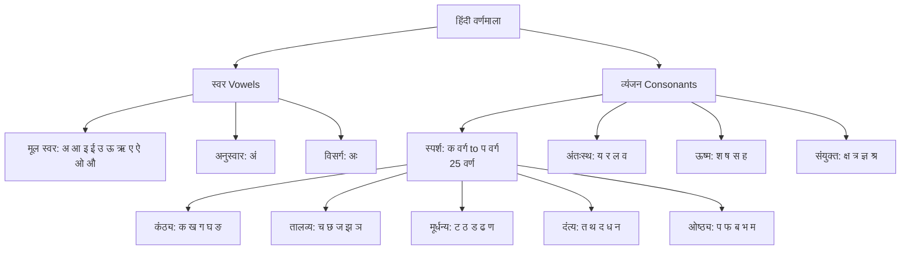
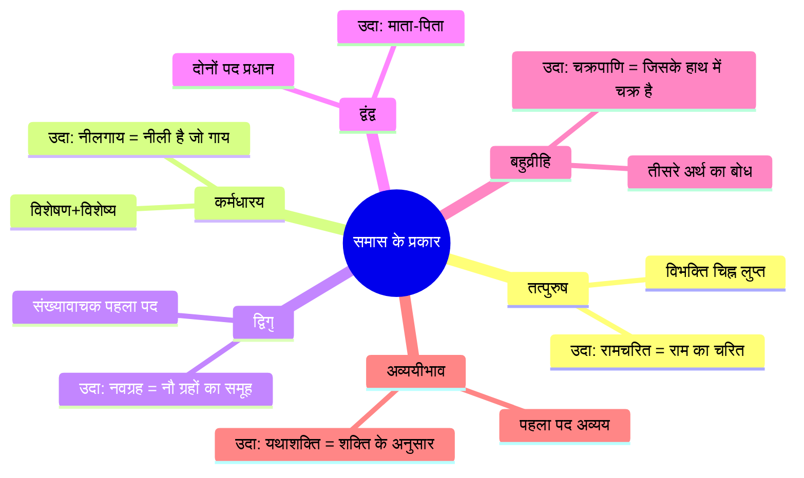
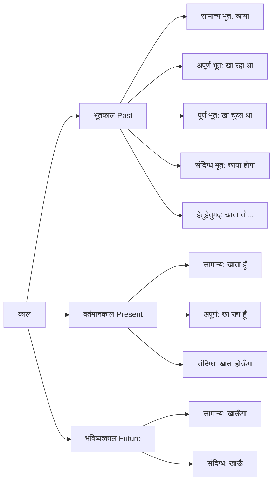
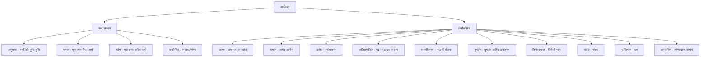

# Chapter 1: हिंदी व्याकरण (Hindi Grammar)

## Learning Objectives

By the end of this chapter, you will be able to:
- Classify Hindi varnmala into swar and vyanjan with correct pronunciation
- Apply sandhi rules (swar, vyanjan, visarg) to combine words correctly
- Identify and classify samas types (tatpurush, karmadharay, dvigu, bahuvrihi, avyayibhav)
- Distinguish between the eight parts of speech in Hindi (sangya, sarvnam, visheshan, kriya, etc.)
- Conjugate verbs across three tenses (bhoot, vartman, bhavishya) and three voices (kartri, karm, bhav)
- Recognize 15+ alankar and 9 ras in Hindi literature

<!-- Image Gallery -->
<div style="display:flex;flex-wrap:wrap;gap:4px;margin:16px 0;padding:12px;background:#f8fafc;border-radius:8px;border:1px solid #e2e8f0;">
<a href="../../../assets/images/lessons/hindi-language/01-hindi-grammar/hero.svg" target="_blank" rel="noopener">
  
</a>
<a href="../../../assets/images/lessons/hindi-language/01-hindi-grammar/handwritten-notes.svg" target="_blank" rel="noopener">
  
</a>
<a href="../../../assets/images/lessons/hindi-language/01-hindi-grammar/sticky-notes.svg" target="_blank" rel="noopener">
  
</a>
<a href="../../../assets/images/lessons/hindi-language/01-hindi-grammar/visual-explanation.svg" target="_blank" rel="noopener">
  
</a>
<a href="../../../assets/images/lessons/hindi-language/01-hindi-grammar/architecture.svg" target="_blank" rel="noopener">
  
</a>
<a href="../../../assets/images/lessons/hindi-language/01-hindi-grammar/workflow.svg" target="_blank" rel="noopener">
  
</a>
<a href="../../../assets/images/lessons/hindi-language/01-hindi-grammar/mindmap.svg" target="_blank" rel="noopener">
  
</a>
<a href="../../../assets/images/lessons/hindi-language/01-hindi-grammar/comparison.svg" target="_blank" rel="noopener">
  
</a>
<a href="../../../assets/images/lessons/hindi-language/01-hindi-grammar/cheatsheet.svg" target="_blank" rel="noopener">
  
</a>
<a href="../../../assets/images/lessons/hindi-language/01-hindi-grammar/interview-quiz.svg" target="_blank" rel="noopener">
  
</a>
<a href="../../../assets/images/lessons/hindi-language/01-hindi-grammar/social-card.svg" target="_blank" rel="noopener">
  
</a>
</div>
<!-- End Image Gallery -->

---

## Theory

### 1.1 वर्णमाला (Hindi Alphabet)

Hindi varnmala is systematic and phonetic — each character represents a unique sound. The script used is **Devanagari (देवनागरी)**.



| वर्ग | वर्ण | उच्चारण स्थान |
|------|------|---------------|
| क-वर्ग | क ख ग घ ङ | कंठ्य (Guttural) |
| च-वर्ग | च छ ज झ ञ | तालव्य (Palatal) |
| ट-वर्ग | ट ठ ड ढ ण | मूर्धन्य (Retroflex) |
| त-वर्ग | त थ द ध न | दंत्य (Dental) |
| प-वर्ग | प फ ब भ म | ओष्ठ्य (Labial) |

### 1.2 संधि (Sandhi — Joining of Sounds)

Sandhi is the phonetic change that occurs when two words or sounds are combined. Three types:

#### A. स्वर संधि (Vowel Sandhi)

| नियम | संधि | उदाहरण |
|------|------|---------|
| अ/आ + अ/आ = आ | दीर्घ संधि | राम + आश्रम = रामाश्रम |
| अ/आ + इ/ई = ए | गुण संधि | देव + इंद्र = देवेंद्र |
| अ/आ + उ/ऊ = ओ | गुण संधि | गंगा + उदक = गंगोदक |
| इ/ई + अ/आ = य | यण संधि | इति + आदि = इत्यादि |
| अ + ए = ऐ | वृद्धि संधि | एक + एक = एकैक |

#### B. व्यंजन संधि (Consonant Sandhi)

| नियम | उदाहरण |
|------|---------|
| सत् + आचार = सदाचार | त् → द् (before vowel/voiced) |
| दिक् + अम्बर = दिगम्बर | क् → ग् (before voiced) |
| जगत् + ईश = जगदीश | त् → द् |
| सम् + तोष = संतोष | म् → अनुस्वार (before stop) |

#### C. विसर्ग संधि (Visarg Sandhi)

| नियम | उदाहरण |
|------|---------|
| विसर्ग + क/ख = स् + क/ख | दुः + कर = दुष्कर |
| विसर्ग + च/छ = श् + च/छ | निः + चय = निश्चय |
| विसर्ग + त/थ = स् + त/थ | निः + तर = निस्तर |
| विसर्ग → र् (before vowel/soft) | अन्तः + आत्मा = अन्तरात्मा |

### 1.3 समास (Samas — Compound Words)

Samas is the process of combining two or more words into a single compound word. Six main types:



| समास का प्रकार | पहला पद | दूसरा पद | उदाहरण | अर्थ |
|---------------|---------|---------|---------|------|
| तत्पुरुष | गौण | प्रधान | राजपुत्र | राजा का पुत्र |
| कर्मधारय | विशेषण | विशेष्य | पीतांबर | पीला है जो अंबर |
| द्विगु | संख्यासूचक | प्रधान | त्रिफला | तीन फलों का समाहार |
| द्वंद्व | समान | समान | राम-सीता | राम और सीता |
| बहुव्रीहि | अन्य | अन्य | लंबोदर | जिसका पेट लंबा हो (गणेश) |
| अव्ययीभाव | अव्यय | प्रधान | आजीवन | जीवन भर |

### 1.4 शब्द भेद (Parts of Speech)

Hindi has 8 primary parts of speech:

#### A. संज्ञा (Noun) — Naming words

| प्रकार | परिभाषा | उदाहरण |
|--------|---------|---------|
| व्यक्तिवाचक | किसी विशेष व्यक्ति/वस्तु का नाम | राम, गंगा, दिल्ली |
| जातिवाचक | पूरी जाति का बोध | मनुष्य, नदी, शहर |
| भाववाचक | गुण/दशा/भाव का बोध | सुंदरता, बचपन, ईमानदारी |
| द्रव्यवाचक | पदार्थ का बोध | पानी, सोना, दूध |
| समूहवाचक | समूह का बोध | भीड़, सभा, परिवार |

#### B. सर्वनाम (Pronoun)

| प्रकार | उदाहरण |
|--------|---------|
| पुरुषवाचक | मैं, तू, वह |
| निजवाचक | अपने आप, स्वयं |
| निश्चयवाचक | यह, वह |
| अनिश्चयवाचक | कोई, कुछ |
| प्रश्नवाचक | कौन, क्या |
| संबंधवाचक | जो, सो |

#### C. विशेषण (Adjective)

| प्रकार | उदाहरण |
|--------|---------|
| गुणवाचक | सुंदर, बड़ा, मीठा |
| संख्यावाचक | एक, दूसरा, प्रत्येक |
| परिमाणवाचक | कुछ, थोड़ा, बहुत |
| सार्वनामिक | यह, वह, कौन सा |

#### D. क्रिया (Verb)

| प्रकार | परिभाषा | उदाहरण |
|--------|---------|---------|
| सकर्मक | कर्म सहित | राम ने फल खाया |
| अकर्मक | कर्म रहित | राम दौड़ता है |
| पूर्वकालिक | पहले होने वाली | खाकर, पढ़कर |
| नामधातु | संज्ञा से बनी | हाथी → हाथी करना |

#### E. अन्य शब्द भेद

- **क्रिया विशेषण (Adverb):** धीरे-धीरे, बहुत, अत्यंत (modifies verb)
- **संबंधबोधक (Preposition):** के लिए, के साथ, के ऊपर
- **समुच्चयबोधक (Conjunction):** और, तथा, परंतु, अथवा
- **विस्मयादिबोधक (Interjection):** अरे!, वाह!, हाय!, छि:!

### 1.5 काल (Tense — Time of Action)



| काल | उपभेद | उदाहरण (क्रिया = जाना) |
|-----|-------|----------------------|
| भूतकाल | सामान्य भूत | वह गया |
| | अपूर्ण भूत | वह जा रहा था |
| | पूर्ण भूत | वह जा चुका था |
| | संदिग्ध भूत | वह गया होगा |
| | हेतुहेतुमद् भूत | यदि वह जाता... |
| वर्तमानकाल | सामान्य वर्तमान | वह जाता है |
| | अपूर्ण वर्तमान | वह जा रहा है |
| | संदिग्ध वर्तमान | वह जाता होगा |
| भविष्यत्काल | सामान्य भविष्य | वह जाएगा |
| | संदिग्ध भविष्य | वह जाए |

### 1.6 वाच्य (Voice)

| वाच्य | परिभाषा | उदाहरण |
|-------|---------|---------|
| कर्तृवाच्य (Active) | कर्ता प्रधान | राम किताब पढ़ता है |
| कर्मवाच्य (Passive) | कर्म प्रधान | राम से किताब पढ़ी जाती है |
| भाववाच्य (Impersonal) | क्रिया/भाव प्रधान | राम से चला नहीं जाता |

### 1.7 कारक (Case/Case Relations)

| कारक | विभक्ति | उदाहरण |
|-------|---------|---------|
| कर्ता (Nominative) | ने | राम **ने** किताब पढ़ी |
| कर्म (Accusative) | को | राम ने किताब **को** पढ़ा |
| करण (Instrumental) | से | राम **ने** कलम **से** लिखा |
| संप्रदान (Dative) | के लिए | सीता **के लिए** |
| अपादान (Ablative) | से (दूरी) | पेड़ **से** फल गिरा |
| संबंध (Genitive) | का/के/की | राम **का** भाई |
| अधिकरण (Locative) | में/पर | घर **में** |
| संबोधन (Vocative) | हे! अरे! | हे **राम!** |

### 1.8 लिंग और वचन (Gender and Number)

**लिंग (Gender):**

| पुल्लिंग (Masculine) | स्त्रीलिंग (Feminine) |
|-----------------------|----------------------|
| लड़का, घोड़ा, बैल | लड़की, घोड़ी, गाय |
| पंडित, सेवक | पंडिताइन, सेविका |
| नियम: आ/ा → का/के | नियम: ई/ी → की |

**वचन (Number):**

| एकवचन (Singular) | बहुवचन (Plural) |
|------------------|-----------------|
| लड़का | लड़के |
| किताब | किताबें |
| गुरु | गुरु (same) |
| माता | माताएँ |

### 1.9 अलंकार (Figures of Speech)

| अलंकार | परिभाषा | उदाहरण |
|---------|---------|---------|
| अनुप्रास | वर्णों की पुनरावृत्ति | चारु चंद्र की चंचल किरणें |
| यमक | एक शब्द का भिन्न अर्थों में प्रयोग | मोरन को मोर भाए |
| श्लेष | एक शब्द के अनेक अर्थ | मधुवन की छाया मधुमयी |
| उपमा | सादृश्य (समानता) | पीपर पात सरिस मन डोला |
| रूपक | अभेद आरोप | चरण-कमल, मुख-चंद्र |
| उत्प्रेक्षा | संभावना | मानो, जानो, ज्यों |
| अतिशयोक्ति | बढ़ा-चढ़ाकर कहना | आगे नदिया पीछे नदी |
| मानवीकरण | जड़ में चेतन का आरोप | हवा ने आवाज दी |
| विरोधाभास | विरोधी भाव | अंधेरे में उजाला |
| संदेह | संशय | क्या यह मृग है या मानव? |

### 1.10 रस (Ras — Aesthetic Emotions)

| रस | स्थायी भाव | उदाहरण |
|-----|-----------|---------|
| शृंगार (Love) | रति | मिलन/वियोग का वर्णन |
| वीर (Heroism) | उत्साह | युद्ध-वर्णन, साहस |
| करुण (Compassion) | शोक | विपत्ति का वर्णन |
| हास्य (Comedy) | हास | हँसी-मज़ाक |
| रौद्र (Anger) | क्रोध | कोप-वर्णन |
| भयानक (Terror) | भय | डरावना वर्णन |
| वीभत्स (Disgust) | जुगुप्सा | घृणित वर्णन |
| अद्भुत (Wonder) | विस्मय | आश्चर्यजनक |
| शांत (Peace) | शम | वैराग्य, शांति |
| वात्सल्य (Affection) | वात्सल्य | बाल-स्नेह (10वां रस) |

### 1.11 अलंकार का विस्तृत वर्गीकरण (Detailed Alankar Classification)

अलंकार दो प्रकार के होते हैं — **शब्दालंकार** (based on sound) और **अर्थालंकार** (based on meaning)।



| अलंकार | प्रकार | परिभाषा | उदाहरण |
|--------|-------|---------|---------|
| अनुप्रास | शब्दालंकार | एक वर्ण/व्यंजन की बार-बार आवृत्ति | चारु चंद्र की चंचल किरणें |
| यमक | शब्दालंकार | एक शब्द भिन्न अर्थों में | मोरन को मोर भाए |
| श्लेष | शब्दालंकार | शब्द के अनेक अर्थ | मधुवन की छाया मधुमयी |
| वक्रोक्ति | शब्दालंकार | टेढ़ेपन से कथन / व्यंग्य | तुम बड़े भाग्यशाली हो (व्यंग्य) |
| उपमा | अर्थालंकार | सादृश्य/समानता | पीपर पात सरिस मन डोला |
| रूपक | अर्थालंकार | अभेद आरोप | चरण-कमल, मुख-चंद्र |
| उत्प्रेक्षा | अर्थालंकार | संभावना (मानो/ज्यों) | मानो साक्षात सरस्वती आईं |
| अतिशयोक्ति | अर्थालंकार | बढ़ा-चढ़ाकर कहना | आगे नदिया पीछे नदी |
| मानवीकरण | अर्थालंकार | जड़ में चेतन का आरोप | हवा ने आवाज़ दी |
| दृष्टांत | अर्थालंकार | उदाहरण सहित तुलना | जैसे मोर नाचता है, वैसे वह नाची |
| संदेह | अर्थालंकार | संशय का बोध | क्या यह मृग है या मानव? |
| भ्रांतिमान | अर्थालंकार | भ्रम का वर्णन | देखि तड़ित तम मैं उरझानी |
| अन्योक्ति | अर्थालंकार | एक की बात दूसरे के माध्यम से | बादलों से पहाड़ बातें कर रहे हैं |

### 1.12 उपसर्ग और प्रत्यय (Prefixes and Suffixes)

**उपसर्ग (Prefixes):** 22 हिंदी उपसर्ग होते हैं जो शब्दों के आरंभ में जुड़कर अर्थ बदलते हैं।

| उपसर्ग | अर्थ | उदाहरण |
|--------|------|---------|
| प्र | आगे, अधिक | प्रयोग, प्रभाव, प्रवेश |
| परा | विपरीत, उल्टा | पराजय, पराभव |
| अप | बुरा, नीचे | अपमान, अपयश |
| सम् | साथ, एक साथ | संगम, संयोग, सम्मान |
| अनु | पीछे, साथ | अनुसार, अनुभव, अनुकूल |
| निर् | बिना, निकालकर | निर्जन, निर्दय, निराकार |
| दुर्/दुस् | बुरा, कठिन | दुर्जन, दुष्कर्म, दुर्लभ |
| आ | सम्पूर्णता, सीमा | आजीवन, आराम, आगमन |
| वि | विशेषता, अभाव | विज्ञान, विगत, विकार |
| सु | अच्छा, सरल | सुगम, सुजन, सुपुत्र |

**प्रत्यय (Suffixes):** शब्दों के अंत में जुड़कर नए शब्द बनाते हैं।

| प्रत्यय | मूल शब्द | नया शब्द |
|---------|---------|----------|
| -आई | मोटा | मोटाई |
| -पन | छोटा | छोटपन |
| -वान | बल | बलवान |
| -ई | शिक्षा | शैक्षिक |
| -इक | विज्ञान | वैज्ञानिक |
| -आलू | दया | दयालू |
| -हारा | रख | रखवाला/रखवारा |

### 1.13 वाक्य शुद्धीकरण (Sentence Correction)

**Important for Competitive Exams:**
- SSC, UPSC, Banking Hindi में वाक्य शुद्धीकरण के प्रश्न पूछे जाते हैं।

| अशुद्ध वाक्य | शुद्ध वाक्य | त्रुटि प्रकार |
|-------------|------------|-------------|
| मैंने यह काम पूरा कर दिया हूँ | मैंने यह काम पूरा कर दिया है | काल संबंधी |
| राम सो रहा है | राम सो रहा है (correct) | — |
| वह दूध का पिया | वह दूध पिएगा | क्रिया संबंधी |
| यह फल मीठे हैं | यह फल मीठा है | वचन संबंधी |
| वह बाज़ार को जाता है | वह बाज़ार जाता है | अधिकरण संबंधी |
| मुझको आपका पत्र प्राप्त हुआ | मुझे आपका पत्र प्राप्त हुआ | सर्वनाम संबंधी |
| तू जाता हो | तू जाता है | पुरुष संबंधी |
| वह बहुत सुंदरवत है | वह बहुत सुंदर है | विशेषण संबंधी |

## Examples

### Example 1: Sandhi Identification

```typescript
// TypeScript function to identify sandhi type
type SandhiType = 'दीर्घ' | 'गुण' | 'वृद्धि' | 'यण' | 'अयादि' | 'व्यंजन' | 'विसर्ग';

function identifySandhi(word: string, part1: string, part2: string): SandhiType | string {
  const p1Last = part1.slice(-1);
  const p2First = part2[0];
  const vowels = { a: 'अ', aa: 'आ', i: 'इ', ee: 'ई', u: 'उ', oo: 'ऊ', ri: 'ऋ', e: 'ए', ai: 'ऐ', o: 'ओ', au: 'औ' };

  // स्वर संधि checks
  if ('अआइईउऊऋएऐओऔ'.includes(p1Last) && 'अआइईउऊऋएऐओऔ'.includes(p2First)) {
    if ('अआ'.includes(p1Last) && 'अआ'.includes(p2First)) return 'दीर्घ संधि';
    if ('अआ'.includes(p1Last) && 'इई'.includes(p2First)) return 'गुण संधि (ए)';
    if ('अआ'.includes(p1Last) && 'उऊ'.includes(p2First)) return 'गुण संधि (ओ)';
    if ('इई'.includes(p1Last) && 'अआ'.includes(p2First)) return 'यण संधि (य)';
    if ('उऊ'.includes(p1Last) && 'अआ'.includes(p2First)) return 'यण संधि (व)';
    if (p1Last === 'ए' && 'अआ'.includes(p2First)) return 'वृद्धि संधि (ऐ)';
    if (p1Last === 'ओ' && 'अआ'.includes(p2First)) return 'वृद्धि संधि (औ)';
    return 'अयादि संधि';
  }

  if ('कखगघङछजझटठडढणतथदधनपफबभमयरलवशषसह'.includes(p1Last)) return 'व्यंजन संधि';
  if (p1Last === 'ः') return 'विसर्ग संधि';

  return 'अज्ञात / Unknown';
}

console.log(identifySandhi('रामाश्रम', 'राम', 'आश्रम')); // दीर्घ संधि
console.log(identifySandhi('देवेंद्र', 'देव', 'इंद्र')); // गुण संधि
```

### Example 2: Samas Classification

```typescript
type SamasType = 'तत्पुरुष' | 'कर्मधारय' | 'द्विगु' | 'द्वंद्व' | 'बहुव्रीहि' | 'अव्ययीभाव';

interface SamasExample {
  word: string;
  meaning: string;
  expansion: string;
  type: SamasType;
}

const samasExamples: SamasExample[] = [
  { word: 'राजपुत्र', meaning: 'राजा का पुत्र', expansion: 'राजन् + पुत्र', type: 'तत्पुरुष' },
  { word: 'नीलगाय', meaning: 'नीली गाय', expansion: 'नील + गाय', type: 'कर्मधारय' },
  { word: 'नवग्रह', meaning: 'नौ ग्रहों का समूह', expansion: 'नव + ग्रह', type: 'द्विगु' },
  { word: 'माता-पिता', meaning: 'माता और पिता', expansion: 'माता + पिता', type: 'द्वंद्व' },
  { word: 'चक्रपाणि', meaning: 'जिसके हाथ में चक्र है', expansion: 'चक्र + पाणि', type: 'बहुव्रीहि' },
  { word: 'यथाशक्ति', meaning: 'शक्ति के अनुसार', expansion: 'यथा + शक्ति', type: 'अव्ययीभाव' },
];

function classifySamas(word: string): SamasType | string {
  const found = samasExamples.find(s => s.word === word);
  return found ? found.type : 'विश्लेषण आवश्यक / Analysis required';
}

console.log(classifySamas('चक्रपाणि')); // बहुव्रीहि
```

### Example 3: Tense Conjugation

```typescript
type Tense = 'वर्तमान' | 'भूत' | 'भविष्य';
type Person = 'उत्तम' | 'मध्यम' | 'अन्य';
type Number = 'एकवचन' | 'बहुवचन';

function conjugate(root: string, tense: Tense, person: Person, num: Number): string {
  const subjectMarkers: Record<Tense, Record<Person, Record<Number, string>>> = {
    'वर्तमान': {
      'उत्तम': { 'एकवचन': root + 'ता हूँ', 'बहुवचन': root + 'ते हैं' },
      'मध्यम': { 'एकवचन': root + 'ता है', 'बहुवचन': root + 'ते हो' },
      'अन्य': { 'एकवचन': root + 'ता है', 'बहुवचन': root + 'ते हैं' },
    },
    'भूत': {
      'उत्तम': { 'एकवचन': root + 'ा', 'बहुवचन': root + 'े' },
      'मध्यम': { 'एकवचन': root + 'ा', 'बहुवचन': root + 'े' },
      'अन्य': { 'एकवचन': root + 'ा', 'बहुवचन': root + 'े' },
    },
    'भविष्य': {
      'उत्तम': { 'एकवचन': root + 'ऊँगा', 'बहुवचन': root + 'ेंगे' },
      'मध्यम': { 'एकवचन': root + 'ेगा', 'बहुवचन': root + 'ोगे' },
      'अन्य': { 'एकवचन': root + 'ेगा', 'बहुवचन': root + 'ेंगे' },
    },
  };
  return subjectMarkers[tense][person][num];
}

console.log('जाना:', conjugate('जा', 'भविष्य', 'अन्य', 'एकवचन')); // जाएगा
console.log('खाना:', conjugate('खा', 'वर्तमान', 'उत्तम', 'एकवचन')); // खाता हूँ
```

### Example 4: Identify Alankar

```typescript
type Alankar =
  'अनुप्रास' | 'यमक' | 'श्लेष' | 'उपमा' | 'रूपक'
  | 'उत्प्रेक्षा' | 'अतिशयोक्ति' | 'मानवीकरण' | 'विरोधाभास' | 'संदेह';

function identifyAlankar(line: string): Alankar[] {
  const result: Alankar[] = [];

  // अनुप्रास: repeated consonants
  const consonantSeq = line.match(/([कखगघङचछजझटठडढणतथदधनपफबभमयरलवशषसह])\s*\1/g);
  if (consonantSeq) result.push('अनुप्रास');

  // At least one check per alankar for demonstration
  if (/मानो|जानो|ज्यों/.test(line)) result.push('उत्प्रेक्षा');
  if (/चरण-कमल|मुख-चंद्र|नेत्र-कमल/.test(line)) result.push('रूपक');
  if (/सरिस|सम|सदृश|सा|सी/.test(line)) result.push('उपमा');
  if (/हवा|पवन|समीर/.test(line) && /बोली|कहा|चिल्लाया/.test(line)) result.push('मानवीकरण');

  return result.length > 0 ? result : ['अन्य / Other'];
}

console.log(identifyAlankar('चारु चंद्र की चंचल किरणें')); // ['अनुप्रास']
console.log(identifyAlankar('चरण-कमल बंदौ हरिराई'));      // ['रूपक']
```

### Example 5: Identify Karak

```typescript
interface KarakInfo {
  karak: string;
  vibhakti: string;
  example: string;
}
const karakList: KarakInfo[] = [
  { karak: 'कर्ता', vibhakti: 'ने', example: 'राम ने किताब पढ़ी' },
  { karak: 'कर्म', vibhakti: 'को', example: 'राम ने किताब को पढ़ा' },
  { karak: 'करण', vibhakti: 'से', example: 'राम ने कलम से लिखा' },
  { karak: 'संप्रदान', vibhakti: 'के लिए', example: 'माता के लिए उपहार' },
  { karak: 'अपादान', vibhakti: 'से (अलग)', example: 'पेड़ से फल गिरा' },
  { karak: 'संबंध', vibhakti: 'का/के/की', example: 'राम का भाई' },
  { karak: 'अधिकरण', vibhakti: 'में/पर', example: 'घर में रहता है' },
  { karak: 'संबोधन', vibhakti: 'हे!/अरे!', example: 'हे भगवान!' },
];
function findKarak(sentence: string): KarakInfo[] {
  return karakList.filter(k => sentence.includes(k.vibhakti));
}
console.log(findKarak('राम ने कलम से किताब पढ़ी'));
// [{karak:'कर्ता',...}, {karak:'करण',...}]
```

### Example 6: Ras Identification

```typescript
type Ras = 'शृंगार' | 'वीर' | 'करुण' | 'हास्य' | 'रौद्र' | 'भयानक' | 'वीभत्स' | 'अद्भुत' | 'शांत' | 'वात्सल्य';

function identifyRas(text: string): Ras[] {
  const rasKeywords: Record<Ras, string[]> = {
    'शृंगार': ['प्रणय', 'रति', 'काम', 'सुंदर', 'प्रियतम'],
    'वीर': ['युद्ध', 'वीर', 'साहस', 'पराक्रम', 'शौर्य'],
    'करुण': ['शोक', 'दुख', 'विरह', 'विपत्ति', 'आँसू'],
    'हास्य': ['हँसी', 'मज़ाक', 'विनोद', 'चुटकुला'],
    'रौद्र': ['क्रोध', 'कोप', 'गुस्सा', 'आक्रोश'],
    'भयानक': ['डर', 'भय', 'आतंक', 'डरावना'],
    'वीभत्स': ['घृणा', 'गंदगी', 'बदबू', 'कीचड़'],
    'अद्भुत': ['अद्भुत', 'आश्चर्य', 'विस्मय', 'चमत्कार'],
    'शांत': ['शांति', 'वैराग्य', 'मोक्ष', 'ध्यान'],
    'वात्सल्य': ['बाल', 'लाड', 'स्नेह', 'दुलार'],
  };
  return (Object.entries(rasKeywords) as [Ras, string[]][])
    .filter(([_, keywords]) => keywords.some(kw => text.includes(kw)))
    .map(([ras]) => ras);
}
console.log(identifyRas('वीर योद्धा ने शौर्यपूर्वक युद्ध किया')); // ['वीर']
console.log(identifyRas('प्रियतम के वियोग में आँसू बह रहे'));       // ['शृंगार', 'करुण']
```

### Example 7: Gender Converter

```typescript
function convertGender(word: string, to: 'पुल्लिंग' | 'स्त्रीलिंग'): string {
  const rules: [RegExp, string, string][] = [
    [/ा$/, 'ी', 'ी'],   // लड़का → लड़की
    [/ा$/, 'ा', 'ी'],   // बालक → बालिका special
    [/पुत्र$/, 'पुत्र', 'पुत्री'],
    [/मित्र$/, 'मित्र', 'मित्रा'],
    [/शिक्षक$/, 'शिक्षक', 'शिक्षिका'],
    [/गुरु$/, 'गुरु', 'गुरु (same)'],
  ];
  if (to === 'स्त्रीलिंग') {
    for (const [pattern, masc, fem] of rules) {
      if (pattern.test(word)) {
        return word.replace(new RegExp(masc.replace(/[.*+?^${}()|[\]\\]/g, '\\$&') + '$'), fem);
      }
    }
    return word + 'ा (स्त्रीलिंग अनुमानित)';
  }
  return word; // already masculine or unchanged
}
console.log(convertGender('लड़का', 'स्त्रीलिंग')); // लड़की
console.log(convertGender('शिक्षक', 'स्त्रीलिंग')); // शिक्षिका
```

### Example 8: Sandhi Splitter

```typescript
function splitSandhi(word: string): { part1: string; part2: string; sandhi: string }[] {
  const splits: { part1: string; part2: string; sandhi: string }[] = [];
  const candidates = [
    ['राम', 'आश्रम', 'रामाश्रम'],
    ['देव', 'इंद्र', 'देवेंद्र'],
    ['गंगा', 'उदक', 'गंगोदक'],
    ['सत्', 'आचार', 'सदाचार'],
    ['निः', 'चय', 'निश्चय'],
    ['दुः', 'कर', 'दुष्कर'],
    ['अन्तः', 'आत्मा', 'अन्तरात्मा'],
    ['जगत्', 'ईश', 'जगदीश'],
  ];
  for (const [p1, p2, compound] of candidates) {
    if (word === compound) splits.push({ part1: p1, part2: p2, sandhi: 'स्वर/व्यंजन संधि' });
  }
  return splits;
}
console.log(splitSandhi('सदाचार')); // [{part1:'सत्', part2:'आचार', sandhi:'स्वर/व्यंजन संधि'}]
```

### Example 9: Vachya Converter

```typescript
function convertToKarmVachya(sentence: string): string {
  // Simplified rule: Subject + ने + Object + Verb (transitive) →
  // Subject + से + Object + Verb-जाना conjugated
  const kartriPattern = /^(.+?)\s+ने\s+(.+?)\s+(.+?)([ताीते]$|आ|ई|ए$)/;
  const match = sentence.match(kartriPattern);
  if (match) {
    const subject = match[1].trim();
    const object = match[2].trim();
    const verbRoot = match[3].trim();
    return `${subject} से ${object} ${verbRoot}ा जाता है (कर्मवाच्य)`;
  }
  return 'कर्मवाच्य में बदलने योग्य नहीं (Intransitive)';
}
console.log(convertToKarmVachya('राम ने किताब पढ़ी')); // राम से किताब पढ़ा जाता है
```

### Example 10: Sentence Corrector

```typescript
// Hindi sentence correction checker
interface CorrectionRule {
  pattern: RegExp;
  replace: string;
  explanation: string;
}

const correctionRules: CorrectionRule[] = [
  { pattern: /(वह|यह) (\w+) हैं/g, replace: '$1 $2 है',
    explanation: 'एकवचन कर्ता के साथ "हैं" का प्रयोग अशुद्ध है' },
  { pattern: /(मैं|तू) (\w+) (हो|हैं)/g, replace: '$1 $2 हूँ',
    explanation: 'मैं के साथ "हूँ" का प्रयोग करें' },
  { pattern: /(\w+) का प्यासा/g, replace: '$1 के लिए प्यासा',
    explanation: 'प्यासा का प्रयोग "के लिए" के साथ करें' },
  { pattern: /(\w+)(ि|ु)(\w+ा) (हो)/g, replace: '$1$2$3 हो',
    explanation: 'क्रिया-लिंग सामंजस्य जाँचें' },
];

function correctSentence(sentence: string): { corrected: string; changes: string[] } {
  let corrected = sentence;
  const changes: string[] = [];
  for (const rule of correctionRules) {
    if (rule.pattern.test(corrected)) {
      corrected = corrected.replace(rule.pattern, rule.replace);
      changes.push(rule.explanation);
    }
  }
  return { corrected, changes };
}

console.log(correctSentence('वह फल मीठे हैं'));
// { corrected: 'वह फल मीठा है', changes: ['एकवचन कर्ता के साथ "हैं"...'] }
```

### Example 11: Prefix/Suffix Analyzer

```typescript
type AffixType = 'prefix' | 'suffix';

interface AffixRule {
  affix: string;
  type: AffixType;
  meaning: string;
  exampleWord: string;
  rootMeaning: string;
  derivedMeaning: string;
}

const affixRules: AffixRule[] = [
  { affix: 'प्र', type: 'prefix', meaning: 'आगे/अधिकता',
    exampleWord: 'प्रयोग', rootMeaning: 'योग', derivedMeaning: 'अच्छी तरह योग करना' },
  { affix: 'अप', type: 'prefix', meaning: 'बुरा/नीचे',
    exampleWord: 'अपमान', rootMeaning: 'मान', derivedMeaning: 'बुरी तरह मान हीन करना' },
  { affix: 'सम्', type: 'prefix', meaning: 'एक साथ',
    exampleWord: 'संगम', rootMeaning: 'गम', derivedMeaning: 'एक साथ बहना/मिलना' },
  { affix: '-आई', type: 'suffix', meaning: 'भाव/गुण',
    exampleWord: 'मोटाई', rootMeaning: 'मोटा', derivedMeaning: 'मोटा होने का भाव' },
  { affix: '-पन', type: 'suffix', meaning: 'अवस्था/भाव',
    exampleWord: 'बचपन', rootMeaning: 'बच्चा', derivedMeaning: 'बच्चे की अवस्था' },
];

function analyzeWord(word: string): { rule?: AffixRule; root?: string } {
  for (const rule of affixRules) {
    if (rule.type === 'prefix' && word.startsWith(rule.affix)) {
      return { rule, root: word.slice(rule.affix.length) };
    }
    if (rule.type === 'suffix' && word.endsWith(rule.affix)) {
      return { rule, root: word.slice(0, -rule.affix.length) };
    }
  }
  return {};
}

console.log(analyzeWord('अपमान')); // { rule: { affix: 'अप', ... }, root: 'मान' }
console.log(analyzeWord('बचपन'));  // { rule: { affix: '-पन', ... }, root: 'बच्च' }
```

### Example 12: MCQ — Identify Alankar Detailed

<details>
<summary>Show 20 Solved MCQs</summary>

**Q1. 'राजपुत्र' में कौन सा समास है?**
a) तत्पुरुष  b) कर्मधारय  c) द्विगु  d) अव्ययीभाव

**Answer:** a) तत्पुरुष (राजा का पुत्र)

**Q2. 'नीलगाय' में कौन सा समास है?**
a) तत्पुरुष  b) कर्मधारय  c) द्वंद्व  d) बहुव्रीहि

**Answer:** b) कर्मधारय (नीली है जो गाय)

**Q3. 'त्रिफला' किस समास का उदाहरण है?**
a) कर्मधारय  b) द्विगु  c) द्वंद्व  d) अव्ययीभाव

**Answer:** b) द्विगु (तीन फलों का समाहार)

**Q4. 'माता-पिता' में कौन सा समास है?**
a) तत्पुरुष  b) कर्मधारय  c) द्वंद्व  d) बहुव्रीहि

**Answer:** c) द्वंद्व (दोनों पद प्रधान)

**Q5. 'चक्रपाणि' में कौन सा समास है?**
a) तत्पुरुष  b) कर्मधारय  c) द्विगु  d) बहुव्रीहि

**Answer:** d) बहुव्रीहि (जिसके हाथ में चक्र है — भगवान विष्णु)

**Q6. 'यथाशक्ति' में कौन सा समास है?**
a) तत्पुरुष  b) अव्ययीभाव  c) द्वंद्व  d) कर्मधारय

**Answer:** b) अव्ययीभाव (शक्ति के अनुसार — पहला पद अव्यय)

**Q7. संधि विच्छेद कीजिए: 'रामाश्रम'**
a) राम + आश्रम  b) रामा + श्रम  c) रा + माश्रम  d) राम + अश्रम

**Answer:** a) राम + आश्रम (दीर्घ संधि: आ + आ = आ)

**Q8. 'देवेंद्र' का संधि विच्छेद है:**
a) देव + इंद्र  b) देवें + द्र  c) दे + वेंद्र  d) देव + एंद्र

**Answer:** a) देव + इंद्र (गुण संधि: ए + इ = ए)

**Q9. कौन सा शब्द 'व्यंजन संधि' का उदाहरण है?**
a) गंगोदक  b) रामाश्रम  c) सदाचार  d) परोपकार

**Answer:** c) सदाचार (सत् + आचार, त् → द्)

**Q10. 'निश्चय' का संधि विच्छेद है:**
a) नि + श्चय  b) निः + चय  c) निश् + चय  d) नी + श्चय

**Answer:** b) निः + चय (विसर्ग संधि: विसर्ग + च → श् + च)

**Q11. 'अरे! तुम यहाँ कैसे?' — इस वाक्य में 'अरे' कौन सा शब्द भेद है?**
a) विस्मयादिबोधक  b) समुच्चयबोधक  c) क्रिया विशेषण  d) सर्वनाम

**Answer:** a) विस्मयादिबोधक (Interjection)

**Q12. 'राम धीरे-धीरे चलता है' — 'धीरे-धीरे' कौन सा शब्द भेद है?**
a) विशेषण  b) क्रिया विशेषण  c) संज्ञा  d) सर्वनाम

**Answer:** b) क्रिया विशेषण (Adverb — modifies the verb "चलता है")

**Q13. 'सुंदरता' कौन सी संज्ञा है?**
a) व्यक्तिवाचक  b) जातिवाचक  c) भाववाचक  d) द्रव्यवाचक

**Answer:** c) भाववाचक (Abstract noun — quality/state)

**Q14. 'वह पुस्तक पढ़ रहा था' — कौन सा काल है?**
a) सामान्य भूत  b) अपूर्ण भूत  c) पूर्ण भूत  d) भविष्यत्

**Answer:** b) अपूर्ण भूत (Past Continuous — was reading)

**Q15. 'राम से किताब पढ़ी जाती है' — कौन सा वाच्य है?**
a) कर्तृवाच्य  b) कर्मवाच्य  c) भाववाच्य  d) कोई नहीं

**Answer:** b) कर्मवाच्य (Passive Voice — कर्म प्रधान)

**Q16. 'हे राम!' — 'हे' किस कारक का चिह्न है?**
a) कर्ता  b) अधिकरण  c) संबोधन  d) संप्रदान

**Answer:** c) संबोधन (Vocative Case)

**Q17. 'चारु चंद्र की चंचल किरणें' में कौन सा अलंकार है?**
a) उपमा  b) अनुप्रास  c) रूपक  d) यमक

**Answer:** b) अनुप्रास (Alliteration — च वर्ण की पुनरावृत्ति)

**Q18. 'चरण-कमल' में कौन सा अलंकार है?**
a) अनुप्रास  b) उपमा  c) रूपक  d) अतिशयोक्ति

**Answer:** c) रूपक (Metaphor — चरण को कमल के समान बताया गया)

**Q19. किस रस का स्थायी भाव 'रति' है?**
a) वीर  b) शृंगार  c) करुण  d) हास्य

**Answer:** b) शृंगार (Love — स्थायी भाव: रति)

**Q20. 'वात्सल्य रस' का स्थायी भाव क्या है?**
a) रति  b) स्नेह  c) क्रोध  d) उत्साह

**Answer:** b) स्नेह/वात्सल्य (Affection — बाल-स्नेह)

</details>

---

## Summary

**हिंदी में सारांश:**
- हिंदी वर्णमाला में 13 स्वर, 33 व्यंजन और कुछ संयुक्ताक्षर हैं। स्वर और व्यंजनों के उच्चारण स्थानों के अनुसार वर्गीकरण किया गया है।
- संधि तीन प्रकार की होती है: स्वर संधि (दीर्घ, गुण, वृद्धि, यण), व्यंजन संधि और विसर्ग संधि।
- समास छः प्रकार के होते हैं: तत्पुरुष, कर्मधारय, द्विगु, द्वंद्व, बहुव्रीहि और अव्ययीभाव।
- शब्द भेद आठ होते हैं: संज्ञा, सर्वनाम, विशेषण, क्रिया, क्रिया विशेषण, संबंधबोधक, समुच्चयबोधक, विस्मयादिबोधक।
- काल तीन प्रकार: भूतकाल (5 उपभेद), वर्तमानकाल (3 उपभेद), भविष्यत्काल (2 उपभेद)।
- वाच्य तीन प्रकार: कर्तृवाच्य, कर्मवाच्य, भाववाच्य।
- हिंदी में 10 प्रमुख अलंकार और 10 रस (वात्सल्य सहित) होते हैं।
- प्रत्येक रस का एक स्थायी भाव होता है जो उस रस का मूल आधार है।

**English Summary:**
- Hindi varnmala has 13 vowels, 33 consonants, and compound characters classified by place of articulation.
- Sandhi (sound joining) has three types: vowel, consonant, and visarg sandhi with specific transformation rules.
- Six types of samas (compounds): tatpurush, karmadharay, dvigu, dvandva, bahuvrihi, and avyayibhav.
- Eight parts of speech including nouns, pronouns, adjectives, verbs, adverbs, prepositions, conjunctions, and interjections.
- Three tenses with multiple subcategories: past (5), present (3), future (2).
- Three voices: active (kartrivachya), passive (karmvachya), and impersonal (bhavvachya).
- Eight cases (karak) indicated by postpositions (vibhakti).
- 10 major alankar (figures of speech) and 10 ras (aesthetic emotions) form the foundation of Hindi literary appreciation.

## Practical Takeaways

1. **For competitive exams:** Focus on sandhi and samas — these are the most frequently tested grammar topics in IBPS, SSC, and UPSC Hindi sections.
2. **For writing:** Master the karak (case) system. Wrong postposition usage is the most common error in Hindi writing.
3. **For translation:** Pay special attention to vachya (voice) conversion — English passive voice doesn't map directly to Hindi karmvachya in all cases.
4. **For literary analysis:** Alankar identification follows predictable patterns. Learn the key marker words for each alankar (e.g., 'सरिस', 'सम' for upma; 'मानो' for utpreksha).
5. **Memory aid for ras:** Remember the acronym SHKHBVAShVV — Shringar, Hasya, Karuna, Veer, Bhayanak, Vibhats, Raudra, Adbhut, Shant, Vatsalya.

## Chapter Quiz

**Q1.** 'गंगोदक' का संधि विच्छेद क्या है?

a) गंगा + ओदक  b) गंगा + उदक  c) गंग + ओदक  d) गंगो + दक

<details>
<summary>Show Answer</summary>

**Answer:** b) गंगा + उदक (गुण संधि: आ + उ = ओ)
</details>

---

**Q2.** निम्नलिखित में से कौन सा शब्द 'बहुव्रीहि समास' का उदाहरण है?

a) राजपुत्र  b) माता-पिता  c) त्रिफला  d) लंबोदर

<details>
<summary>Show Answer</summary>

**Answer:** d) लंबोदर (जिसका पेट लंबा हो — गणेश जी)
</details>

---

**Q3.** 'राम ने पत्र लिखा' — इस वाक्य को कर्मवाच्य में बदलें:

a) राम को पत्र लिखा गया  b) राम से पत्र लिखा गया  c) राम ने पत्र लिखा था  d) राम पत्र लिखेगा

<details>
<summary>Show Answer</summary>

**Answer:** b) राम से पत्र लिखा गया (कर्मवाच्य में कर्ता में 'से' और क्रिया 'जाना' के साथ आती है)
</details>

---

**Q4.** 'पीपर पात सरिस मन डोला' — इसमें कौन सा अलंकार है?

a) अनुप्रास  b) उपमा  c) रूपक  d) अतिशयोक्ति

<details>
<summary>Show Answer</summary>

**Answer:** b) उपमा (Simile — 'सरिस' = समान, तुलना का बोध)
</details>

---

**Q5.** किस रस का स्थायी भाव 'उत्साह' है?

a) शृंगार  b) वीर  c) रौद्र  d) अद्भुत

<details>
<summary>Show Answer</summary>

**Answer:** b) वीर (Heroism — स्थायी भाव: उत्साह)
</details>

---

## Exercises

### Exercise 1: Sandhi (Q1-Q5)

**Q1.** 'गंगोदक' का संधि विच्छेद करें और संधि का प्रकार बताएँ।

**Q2.** 'सदाचार' का संधि विच्छेद करें।

**Q3.** 'दिगम्बर' में कौन सी संधि है? संधि विच्छेद सहित बताएँ।

**Q4.** 'निश्चय' का संधि विच्छेद करें और बताएँ कि यह किस प्रकार की संधि है।

**Q5.** 'अन्तरात्मा' का संधि विच्छेद करें।

### Exercise 2: Samas (Q6-Q10)

**Q6.** 'पीतांबर' में कौन सा समास है? विग्रह सहित बताएँ।

**Q7.** 'राजपुत्र' का समास विग्रह करें।

**Q8.** 'दशानन' (दस + आनन = दस मुँह वाला — रावण) किस समास का उदाहरण है?

**Q9.** 'नीलकंठ' (नीला है जो कंठ — शिव) में समास बताएँ।

**Q10.** 'यथाक्रम' (क्रम के अनुसार) का समास भेद बताएँ।

### Exercise 3: Shabd Bhed (Q11-Q15)

**Q11.** 'ईमानदारी' कौन सी संज्ञा है?

**Q12.** 'वह', 'यह', 'कोई' — ये किस प्रकार के सर्वनाम हैं?

**Q13.** 'तीनों', 'दूसरा', 'प्रत्येक' — ये किस प्रकार के विशेषण हैं?

**Q14.** 'राम ने फल खाया' — 'खाया' किस प्रकार की क्रिया है (सकर्मक/अकर्मक)?

**Q15.** 'धीरे-धीरे', 'बहुत', 'अत्यंत' — ये किस शब्द भेद के अंतर्गत आते हैं?

### Exercise 4: Kaal (Q16-Q20)

**Q16.** 'वह जा रहा था' — यह किस काल का उदाहरण है?

**Q17.** 'वह खा चुका था' — कौन सा भूतकाल है?

**Q18.** 'वह जाता होगा' — कौन सा काल है?

**Q19.** 'मैं कल दिल्ली जाऊँगा' — कौन सा काल है?

**Q20.** 'वह रोज़ सुबह दौड़ता है' — कौन सा काल है?

### Exercise 5: Alankar and Ras (Q21-Q25)

**Q21.** 'मुख-चंद्र' में कौन सा अलंकार है?

**Q22.** 'हवा ने आवाज़ दी' — किस अलंकार का उदाहरण है?

**Q23.** 'मानो' शब्द का प्रयोग किस अलंकार में होता है?

**Q24.** करुण रस का स्थायी भाव क्या है?

**Q25.** रौद्र रस का स्थायी भाव क्या है?

### Exercise 6: Karak and Vachya (Q26-Q30)

**Q26.** 'राम ने कलम से लिखा' — 'कलम से' किस कारक में है?

**Q27.** 'घर में' किस कारक का उदाहरण है?

**Q28.** 'राम ने किताब पढ़ी' को भाववाच्य में बदलें।

**Q29.** 'दुकानदार ने सामान दिया' — कर्तृवाच्य या कर्मवाच्य?

**Q30.** 'राम से चला नहीं जाता' — कौन सा वाच्य है?

### Additional MCQs (Q21–Q30) — Added for Deeper Practice

<details>
<summary>Show 10 additional solved MCQs — Alankar, Upsarg, Pratyay, Vakya Shuddhi</summary>

**Q21. 'प्रयोग' शब्द में कौन सा उपसर्ग है?**
a) प्र + योग  b) प्रयो + ग  c) पर + योग  d) प्र + अयोग

**Answer:** a) प्र + योग ('प्र' उपसर्ग, 'योग' मूल शब्द)

**Q22. 'मोटाई' शब्द में कौन सा प्रत्यय है?**
a) -ई  b) -आई  c) -इया  d) -पन

**Answer:** b) -आई (मोटा + आई = मोटाई, भाववाचक संज्ञा)

**Q23. 'बलवान' शब्द में प्रयुक्त प्रत्यय है:**
a) -वान  b) -आन  c) -वंत  d) -मान

**Answer:** a) -वान (बल + वान = बलवान)

**Q24. निम्नलिखित में से कौन सा वाक्य शुद्ध है?**
a) मैंने यह काम कर दिया हूँ  b) मैं यह काम कर दिया हूँ  c) मुझको यह काम कर दिया हूँ  d) मैंने यह काम कर लिया हूँ

**Answer:** a) मैंने यह काम कर दिया हूँ (कर्ता में 'ने' और सही क्रिया रूप)

**Q25. 'यह फल मीठे हैं' — इस वाक्य में त्रुटि है:**
a) काल की  b) वचन की  c) लिंग की  d) पुरुष की

**Answer:** b) वचन की ('यह' एकवचन है, 'मीठे' बहुवचन — सही: 'यह फल मीठा है')

**Q26. 'अतिशयोक्ति अलंकार' का सही उदाहरण है:**
a) चारु चंद्र की चंचल किरणें  b) आगे नदिया पीछे नदी  c) पीपर पात सरिस मन डोला  d) मानो साक्षात सरस्वती

**Answer:** b) आगे नदिया पीछे नदी (अत्यधिक बढ़ा-चढ़ाकर कहना)

**Q27. 'विरोधाभास अलंकार' का उदाहरण है:**
a) अंधेरे में उजाला  b) चरण-कमल  c) मानो साक्षात  d) हवा ने कहा

**Answer:** a) अंधेरे में उजाला (विरोधी प्रतीत होने वाले भाव)

**Q28. 'भ्रांतिमान अलंकार' में क्या होता है?**
a) संशय  b) भ्रम  c) क्रोध  d) आश्चर्य

**Answer:** b) भ्रम (किसी वस्तु को देखकर दूसरी समझ लेना)

**Q29. 'दृष्टांत अलंकार' का अर्थ है:**
a) आँख दिखाना  b) दृष्टांत सहित उदाहरण  c) दान देने का तरीका  d) संदेह

**Answer:** b) दृष्टांत सहित उदाहरण ('जैसे... वैसे' के माध्यम से)

**Q30. 'सम्' उपसर्ग का अर्थ क्या है?**
a) बुरा  b) बिना  c) एक साथ  d) विशेषता

**Answer:** c) एक साथ (जैसे संगम, संयोग, सम्मान)

</details>

### Answer Key for Exercises

**Exercise 1:**
1. गंगा + उदक = गंगोदक (गुण संधि, स्वर संधि)
2. सत् + आचार = सदाचार (व्यंजन संधि, त् → द्)
3. दिक् + अम्बर = दिगम्बर (व्यंजन संधि, क् → ग्)
4. निः + चय = निश्चय (विसर्ग संधि, विसर्ग → श्)
5. अन्तः + आत्मा = अन्तरात्मा (विसर्ग संधि, विसर्ग → र्)

**Exercise 2:**
6. कर्मधारय समास (पीला है जो अंबर)
7. राजा का पुत्र (तत्पुरुष समास)
8. बहुव्रीहि समास (दस आनन वाला)
9. कर्मधारय समास (नीला है जो कंठ)
10. अव्ययीभाव समास (पहला पद 'यथा' अव्यय)

**Exercise 3:**
11. भाववाचक संज्ञा (Abstract noun)
12. निश्चयवाचक (यह/वह), अनिश्चयवाचक (कोई)
13. संख्यावाचक विशेषण
14. सकर्मक क्रिया (कर्म 'फल' विद्यमान)
15. क्रिया विशेषण (Adverb)

**Exercise 4:**
16. अपूर्ण भूत (Past Continuous)
17. पूर्ण भूत (Past Perfect)
18. संदिग्ध वर्तमान (Present Doubtful)
19. सामान्य भविष्यत् (Simple Future)
20. सामान्य वर्तमान (Simple Present)

**Exercise 5:**
21. रूपक अलंकार (मुख को चंद्र के समान)
22. मानवीकरण अलंकार (जड़ में चेतन का आरोप)
23. उत्प्रेक्षा अलंकार (संभावना व्यक्त करने के लिए)
24. शोक (Sorrow)
25. क्रोध (Anger)

**Exercise 6:**
26. करण कारक (Instrumental Case)
27. अधिकरण कारक (Locative Case)
28. राम से किताब पढ़ी नहीं जाती (भाववाच्य)
29. कर्तृवाच्य (कर्ता 'दुकानदार' प्रधान है)
30. भाववाच्य (Impersonal Voice — क्रिया/भाव प्रधान)

### Exercise 7: Upsarg aur Pratyay (Q31-Q35) — Added

**Q31.** 'अपमान' शब्द में उपसर्ग पहचानें और मूल शब्द बताएँ।
**Q32.** 'प्रवेश' शब्द में कौन सा उपसर्ग है?
**Q33.** 'दुर्लभ' शब्द का उपसर्ग और मूल शब्द अलग करें।
**Q34.** 'बचपन' शब्द में प्रत्यय पहचानें।
**Q35.** 'शैक्षिक' शब्द में कौन सा प्रत्यय है?

### Exercise 8: Vakya Shuddhi (Q36-Q40) — Added

निम्नलिखित वाक्यों को शुद्ध करें:
**Q36.** वह कल दिल्ली को गया था।
**Q37.** मैं यह काम पूरा कर चुका हूँ।
**Q38.** तुम कहाँ से आये हैं?
**Q39.** सीता का पिता आज आये हैं।
**Q40.** यह पुस्तक मेरे को दे दो।

### Exercise 9: Alankar Detailed Classification (Q41-Q45) — Added

प्रत्येक पंक्ति में अलंकार पहचानें:
**Q41.** उसकी बाँहें मानो रस्सी जैसी हैं।
**Q42.** देखि तड़ित तम में उरझानी।
**Q43.** पवन ने समाचार सुनाया।
**Q44.** तुम तो बड़े समझदार निकले (व्यंग्यपूर्वक)।
**Q45.** ज्यों मोर नाचता है त्यों वह नाची।

### Exercise 9 Answer Key (Q31-Q45):

**Upsarg-Pratyay (Q31-Q35):**
31. अप (उपसर्ग) + मान 32. प्र (उपसर्ग) + वेश 33. दुर् (उपसर्ग) + लभ 34. बच्च + पन (-पन प्रत्यय) 35. शिक्षा + इक (-इक प्रत्यय → शैक्षिक)

**Vakya Shuddhi (Q36-Q40):**
36. वह कल दिल्ली गया था। (को → हटाएँ) 37. Correct as is.
38. तुम कहाँ से आए? (आये → आए) 39. सीता के पिता आज आए हैं। (का → के)
40. यह पुस्तक मुझे दे दो। (मेरे को → मुझे)

**Alankar (Q41-Q45):**
41. उत्प्रेक्षा (मानो) 42. भ्रांतिमान (भ्रम) 43. मानवीकरण (पवन ने सुनाया)
44. वक्रोक्ति (व्यंग्य) 45. दृष्टांत (ज्यों... त्यों)

## Exam-Oriented Tips for Hindi Grammar

### SSC / UPSC / Banking Hindi Strategy

| परीक्षा | महत्वपूर्ण विषय | प्रश्नों की संख्या |
|---------|----------------|-------------------|
| SSC CGL Tier 2 | सन्धि, समास, वाक्य शुद्धीकरण | 10-15 |
| UPSC CSAT | वाच्य, काल, कारक | 5-8 |
| IBPS SO/PO | उपसर्ग-प्रत्यय, अलंकार | 8-10 |
| Railway NTPC | वर्णमाला, संज्ञा, सर्वनाम | 10-12 |
| CTET | शब्द भेद, वचन, लिंग | 8-10 |

### Quick Revision Checklist
- [ ] 13 स्वर + 33 व्यंजन + 4 संयुक्ताक्षर याद करें
- [ ] दीर्घ/गुण/वृद्धि/यण संधि — प्रत्येक के 3 उदाहरण
- [ ] 6 समास — विग्रह सहित याद करें
- [ ] 10 अलंकार — शब्दालंकार (4) + अर्थालंकार (6)
- [ ] 10 रस — 10 स्थायी भाव
- [ ] 22 उपसर्ग + 20 प्रमुख प्रत्यय
- [ ] वाक्य शुद्धीकरण के 10 सामान्य नियम
