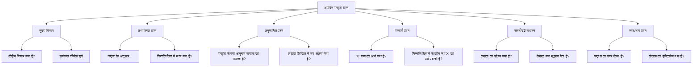
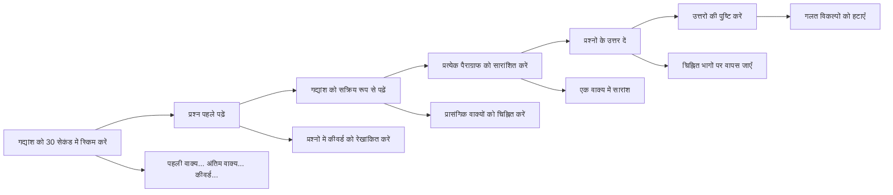
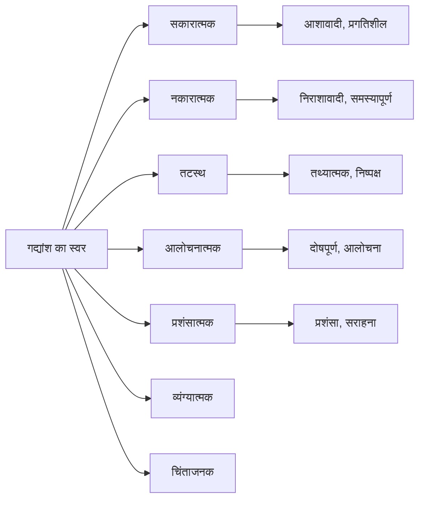

# Chapter 2: अपठित गद्यांश (Unseen Passage Comprehension)

## Learning Objectives

By the end of this chapter, you will be able to:
- Read and comprehend unseen Hindi passages of 100–300 words
- Identify the main idea (मुख्य विचार) of a passage quickly
- Answer factual, inferential, and vocabulary-based questions accurately
- Distinguish between direct, inferred, and tone-based questions in Hindi
- Apply the SQ3R method specifically adapted for Hindi passages

---

## Theory

### 2.1 अपठित गद्यांश क्या है? (What is Unseen Passage Comprehension?)

अपठित गद्यांश एक ऐसा गद्यांश होता है जिसे छात्र ने पहले कभी नहीं पढ़ा होता। सरकारी परीक्षाओं में हिंदी खंड में 2–3 अपठित गद्यांश दिए जाते हैं, जिन पर आधारित प्रश्न पूछे जाते हैं। यह छात्र की भाषा समझ, शब्द ज्ञान और विश्लेषण क्षमता का परीक्षण करता है।

**सरकारी परीक्षाओं में महत्व:**
- IBPS SO / PO Prelims — हिंदी में 2 गद्यांश, 8–10 प्रश्न
- SSC CGL Tier 2 — 2–3 गद्यांश
- UPSC Prelims (CSAT) — हिंदी में 1–2 गद्यांश
- Railway NTPC — 2 गद्यांश
- CTET / State TET — 2–3 गद्यांश

### 2.2 गद्यांश के प्रकार (Types of Passages)

| प्रकार | विषय क्षेत्र | उदाहरण विषय |
|--------|-------------|-------------|
| **वैज्ञानिक** (Scientific) | विज्ञान, प्रौद्योगिकी | AI, Climate Change, Space |
| **सामाजिक** (Social) | शिक्षा, स्वास्थ्य, महिला सशक्तिकरण | बेटी बचाओ, आयुष्मान भारत |
| **आर्थिक** (Economic) | बैंकिंग, वित्त, व्यापार | डिजिटल पेमेंट, मुद्रास्फीति |
| **सांस्कृतिक** (Cultural) | इतिहास, कला, साहित्य | भारतीय संस्कृति, त्योहार |
| **दार्शनिक** (Philosophical) | नैतिकता, मूल्य | नेतृत्व, ईमानदारी |
| **पर्यावरणीय** (Environmental) | पारिस्थितिकी, जलवायु | जल संरक्षण, वन्य जीव |

### 2.3 प्रश्नों के प्रकार (Types of Questions)



#### A. मुख्य विचार प्रश्न (Main Idea Questions)
- "गद्यांश का मुख्य विचार क्या है?"
- "गद्यांश के लिए सर्वश्रेष्ठ शीर्षक चुनें।"
- **रणनीति:** पहले और अंतिम पैराग्राफ को पढ़ें। बहुत संकीर्ण या बहुत व्यापक विकल्पों को हटाएँ।

#### B. तथ्यात्मक प्रश्न (Factual Questions)
- "गद्यांश के अनुसार निम्नलिखित में से कौन सा कथन सत्य है?"
- "भारत में डिजिटल भुगतान का प्रतिशत कितना है?"
- **रणनीति:** विकल्पों के कीवर्ड को गद्यांश में ढूँढ़ें और सीधे जाँचें।

#### C. अनुमानित प्रश्न (Inference Questions)
- "गद्यांश से क्या अनुमान लगाया जा सकता है?"
- "लेखक का तात्पर्य है:"
- **रणनीति:** उत्तर गद्यांश में सीधे नहीं दिया होता। दो या अधिक तथ्यों को मिलाकर निष्कर्ष निकालना होता है।

#### D. शब्दार्थ प्रश्न (Vocabulary in Context)
- "गद्यांश में 'प्रदूषण' शब्द का अर्थ क्या है?"
- **रणनीति:** शब्द के चारों ओर के संदर्भ को पढ़ें। प्रत्येक विकल्प को शब्द के स्थान पर रखकर देखें।

#### E. स्वर/भाव प्रश्न (Tone Questions)
- "गद्यांश का स्वर कैसा है?"
- **सामान्य स्वर:** विश्लेषणात्मक, आलोचनात्मक, प्रशंसात्मक, तटस्थ, आशावादी, निराशावादी, तथ्यात्मक।

### 2.4 अपठित गद्यांश की रणनीति (Strategy for Unseen Passages)



**SQ3R विधि (Hindi के लिए अनुकूलित):**
1. **सर्वेक्षण (Survey):** 30 सेकंड में गद्यांश को स्किम करें — प्रत्येक पैराग्राफ की पहली पंक्ति, तिथियाँ, विशेष नाम, कीवर्ड देखें।
2. **प्रश्न (Question):** पहले प्रश्नों को पढ़ें। प्रत्येक प्रश्न में कीवर्ड को रेखांकित करें।
3. **पठन (Read):** गद्यांश को सक्रिय रूप से पढ़ें — प्रश्नों को ध्यान में रखते हुए। प्रासंगिक वाक्यों को मानसिक रूप से चिह्नित करें।
4. **स्मरण (Recite):** प्रत्येक पैराग्राफ के बाद, एक वाक्य में मानसिक सारांश बनाएँ।
5. **समीक्षा (Review):** चिह्नित भागों पर वापस जाकर प्रश्नों के उत्तर दें।

### 2.5 समय प्रबंधन (Time Management)

| चरण | समय |
|------|------|
| सर्वेक्षण (Survey) | 30 सेकंड |
| प्रश्न पढ़ना | 1 मिनट |
| सक्रिय पठन | 3–4 मिनट |
| उत्तर देना | 3–4 मिनट |
| **कुल प्रति गद्यांश** | **7–9 मिनट** |

### 2.6 सामान्य गलतियाँ (Common Mistakes)

1. **बिना गद्यांश पढ़े उत्तर देना:** पिछले ज्ञान के आधार पर उत्तर चुनना — गलतियों का सबसे बड़ा कारण।
2. **चरम शब्दों को अनदेखा करना:** हमेशा, कभी नहीं, पूर्णतः — ऐसे शब्दों वाले विकल्प प्रायः गलत होते हैं।
3. **अनुमान और तथ्य में भ्रम:** तथ्यात्मक प्रश्न में अनुमान लगाना गलत है।
4. **समय का दुरुपयोग:** एक प्रश्न पर बहुत अधिक समय लगाना।

---

## Examples

### 2.7 गद्यांश के स्वर (Tone of Passages)



**सामान्य स्वर शब्दावली (Common Tone Vocabulary):**
- विश्लेषणात्मक (Analytical) — तथ्यों और आंकड़ों पर आधारित
- प्रशंसात्मक (Appreciative) — किसी की सराहना करता हुआ
- आलोचनात्मक (Critical) — दोषों को उजागर करता हुआ
- तटस्थ (Neutral) — बिना पक्ष लिए
- आशावादी (Optimistic) — सकारात्मक दृष्टिकोण
- निराशावादी (Pessimistic) — नकारात्मक दृष्टिकोण
- व्यंग्यात्मक (Satirical) — हास्य या कटाक्ष के माध्यम से
- चिंताजनक (Concerned) — चिंता व्यक्त करता हुआ

### 2.8 गद्यांश हल करने की उन्नत तकनीकें (Advanced Techniques)

| तकनीक | विवरण | उदाहरण |
|--------|-------|---------|
| **कीवर्ड हाइलाइटिंग** | प्रश्नों के कीवर्ड को गद्यांश में ढूँढ़ें | प्रश्न में "जलवायु परिवर्तन" → गद्यांश में ढूँढ़ें |
| **एलिमिनेशन विधि** | गलत विकल्पों को हटाकर सही तक पहुँचें | बहुत व्यापक/बहुत संकीर्ण विकल्प हटाएँ |
| **पैराग्राफ मैपिंग** | प्रत्येक पैराग्राफ का एक-वाक्य सारांश | पैरा 1 = समस्या, पैरा 2 = कारण, पैरा 3 = समाधान |
| **एंटी-एलिमिनेशन** | प्रश्न में दिए गए "नहीं" / "छोड़कर" पर ध्यान दें | "निम्नलिखित में **से कौन सा सत्य नहीं है**" |

### 2.9 सरकारी परीक्षाओं में पूछे गए गद्यांश के प्रकार (Past Exam Trends)

| परीक्षा | वर्ष | विषय | प्रश्न प्रकार |
|---------|------|------|--------------|
| SSC CGL 2024 | 2024 | डिजिटल इंडिया, कृषि सुधार | तथ्यात्मक, मुख्य विचार |
| UPSC CSAT 2024 | 2024 | भारतीय लोकतंत्र, जल संकट | अनुमानित, स्वर |
| IBPS PO 2024 | 2024 | बैंकिंग क्षेत्र, UPI | शब्दार्थ, तथ्यात्मक |
| Railway NTPC 2024 | 2024 | पर्यावरण, विज्ञान | मुख्य विचार, शीर्षक |
| CTET 2024 | 2024 | शिक्षा नीति, बाल मनोविज्ञान | तथ्यात्मक, उद्देश्य |

### Example 1: Passage Analysis with TypeScript

```typescript
// TypeScript utility for passage analysis
interface Question {
  id: number;
  type: 'main-idea' | 'factual' | 'inference' | 'vocabulary' | 'tone';
  question: string;
  options: string[];
  correctAnswer: number; // index
  explanation: string;
}

interface Passage {
  title: string;
  text: string;
  source: string;
  questions: Question[];
}

// Analyze the passage for key indicators
function analyzePassage(passage: Passage): {
  wordCount: number;
  mainTopic: string;
  tone: string;
  keyPhrases: string[];
} {
  const words = passage.text.split(/\s+/).filter(w => w.length > 0);
  const wordCount = words.length;

  // Simple tone detection
  const positiveWords = ['सफल', 'लाभ', 'सुधार', 'वृद्धि', 'प्रगति'];
  const negativeWords = ['समस्या', 'चुनौती', 'कमी', 'दोष', 'संकट'];
  const positiveCount = positiveWords.filter(w => passage.text.includes(w)).length;
  const negativeCount = negativeWords.filter(w => passage.text.includes(w)).length;
  const tone = positiveCount > negativeCount ? 'सकारात्मक/प्रशंसात्मक' :
               negativeCount > positiveCount ? 'आलोचनात्मक/समस्यापूर्ण' : 'तटस्थ/विश्लेषणात्मक';

  // Extract key phrases (proper nouns, numbers)
  const keyPhrases = words.filter(w => /^[A-Z]/.test(w) || /\d/.test(w));

  return { wordCount, mainTopic: passage.title, tone, keyPhrases };
}

const samplePassage: Passage = {
  title: 'डिजिटल इंडिया',
  text: 'डिजिटल इंडिया भारत सरकार का एक महत्वाकांक्षी कार्यक्रम है...',
  source: 'समसामयिक घटनाएँ',
  questions: []
};

console.log(analyzePassage(samplePassage));
```

### Example 2: Passage 1 — विज्ञान (Science)

*भारत का चंद्रयान-3 मिशन भारतीय अंतरिक्ष अनुसंधान संगठन (ISRO) का एक ऐतिहासिक अभियान था। 23 अगस्त 2023 को चंद्रयान-3 के लैंडर 'विक्रम' ने चंद्रमा के दक्षिणी ध्रुव पर सफलतापूर्वक सॉफ्ट लैंडिंग की। यह उपलब्धि भारत को चंद्रमा के दक्षिणी ध्रुव पर उतरने वाला दुनिया का पहला देश बनाती है। इस मिशन का उद्देश्य चंद्रमा की सतह पर पानी की बर्फ और खनिजों का अध्ययन करना था। प्रज्ञान रोवर ने चंद्रमा की सतह पर 14 दिनों तक भ्रमण कर महत्वपूर्ण डेटा एकत्र किया। इस मिशन की सफलता ने भारत को अंतरिक्ष अनुसंधान के क्षेत्र में एक नई ऊँचाई पर पहुँचा दिया और दुनिया भर में भारत की वैज्ञानिक क्षमता का लोहा मनवाया।*

1. चंद्रयान-3 ने चंद्रमा पर लैंडिंग कब की?
   a) 23 अगस्त 2022  b) 23 अगस्त 2023  c) 15 अगस्त 2023  d) 23 जुलाई 2023

<details>
<summary>उत्तर दिखाएँ</summary>

**उत्तर:** b) 23 अगस्त 2023 — गद्यांश में स्पष्ट रूप से 23 अगस्त 2023 का उल्लेख है।
</details>

2. चंद्रयान-3 के लैंडर का नाम क्या है?
   a) प्रज्ञान  b) विक्रम  c) मंगलयान  d) आदित्य

<details>
<summary>उत्तर दिखाएँ</summary>

**उत्तर:** b) विक्रम — लैंडर का नाम 'विक्रम' है, रोवर का नाम 'प्रज्ञान' है।
</details>

### Example 3: Passage 2 — समाज (Society)

*भारत में बाल शिक्षा के क्षेत्र में समग्र प्रगति हुई है, फिर भी कई चुनौतियाँ बनी हुई हैं। राष्ट्रीय शिक्षा नीति 2020 के अंतर्गत 6 से 14 वर्ष के सभी बच्चों के लिए निःशुल्क और अनिवार्य शिक्षा का प्रावधान है। हालाँकि, ग्रामीण क्षेत्रों में विद्यालयों की कमी, शिक्षकों का अभाव और आर्थिक विवशताएँ अभी भी बाधा बनी हुई हैं। सर्व शिक्षा अभियान के तहत सरकार ने हजारों नए विद्यालय खोले हैं और मिड-डे मील योजना के माध्यम से बच्चों को पोषण प्रदान किया जाता है। डिजिटल शिक्षा को बढ़ावा देने के लिए DIKSHA प्लेटफॉर्म विकसित किया गया है, जो शिक्षकों और छात्रों को डिजिटल संसाधन प्रदान करता है।*

3. राष्ट्रीय शिक्षा नीति 2020 के अनुसार कितने वर्ष तक की शिक्षा निःशुल्क और अनिवार्य है?
   a) 6–12 वर्ष  b) 6–14 वर्ष  c) 5–14 वर्ष  d) 6–16 वर्ष

<details>
<summary>उत्तर दिखाएँ</summary>

**उत्तर:** b) 6–14 वर्ष — RTE Act 2009 और NEP 2020 के अनुसार 6 से 14 वर्ष के बच्चों के लिए निःशुल्क शिक्षा।
</details>

4. DIKSHA प्लेटफॉर्म किसके लिए विकसित किया गया है?
   a) केवल शिक्षकों के लिए  b) डिजिटल शिक्षा संसाधन प्रदान करने के लिए  c) ऑनलाइन परीक्षा के लिए  d) नौकरी के लिए

<details>
<summary>उत्तर दिखाएँ</summary>

**उत्तर:** b) डिजिटल शिक्षा संसाधन प्रदान करने के लिए — DIKSHA एक डिजिटल शिक्षण प्लेटफॉर्म है।
</details>

### Example 4: Passage 3 — अर्थव्यवस्था (Economy)

*भारतीय अर्थव्यवस्था में डिजिटल भुगतान क्रांति ने वित्तीय समावेशन को एक नया आयाम दिया है। UPI (यूनिफाइड पेमेंट्स इंटरफेस) ने भुगतान प्रणाली को सरल और सुलभ बना दिया है। 2024 में UPI के माध्यम से 200 अरब से अधिक लेन-देन हुए। इस सफलता के बावजूद, ग्रामीण क्षेत्रों में डिजिटल साक्षरता का अभाव और साइबर धोखाधड़ी बड़ी चुनौतियाँ हैं। सरकार ने साइबर सुरक्षा बढ़ाने और डिजिटल साक्षरता अभियान चलाने के लिए कई कदम उठाए हैं। RBI ने भुगतान प्रणाली को सुरक्षित बनाने के लिए नए नियम भी लागू किए हैं।*

5. UPI के माध्यम से 2024 में कितने लेन-देन हुए?
   a) 100 अरब  b) 150 अरब  c) 200 अरब  d) 250 अरब

<details>
<summary>उत्तर दिखाएँ</summary>

**उत्तर:** c) 200 अरब — 2024 में UPI के माध्यम से 200 अरब से अधिक लेन-देन हुए।
</details>

6. डिजिटल भुगतान के संदर्भ में कौन सी चुनौतियाँ हैं?
   a) उच्च लागत  b) डिजिटल साक्षरता का अभाव और साइबर धोखाधड़ी  c) बैंकों की कमी  d) इंटरनेट की धीमी गति

<details>
<summary>उत्तर दिखाएँ</summary>

**उत्तर:** b) डिजिटल साक्षरता का अभाव और साइबर धोखाधड़ी — ग्रामीण क्षेत्रों में ये दो प्रमुख बाधाएँ हैं।
</details>

### Example 5: Passage 4 — पर्यावरण (Environment)

*जलवायु परिवर्तन आज मानव जाति के सामने सबसे गंभीर चुनौतियों में से एक है। बढ़ता तापमान, ग्लेशियरों का पिघलना और चरम मौसम की घटनाएँ इसके प्रमुख लक्षण हैं। भारत ने पेरिस समझौते के तहत 2030 तक 500 GW गैर-जीवाश्म ईंधन क्षमता स्थापित करने का लक्ष्य रखा है। सौर और पवन ऊर्जा में भारी निवेश किया जा रहा है। हालाँकि, कोयला-आधारित ऊर्जा पर निर्भरता और वनों का कटान अभी भी गंभीर चिंता के विषय हैं। राष्ट्रीय हरित रणनीति के तहत वन क्षेत्र बढ़ाने और प्रदूषण कम करने के प्रयास किए जा रहे हैं।*

7. भारत ने पेरिस समझौते के तहत 2030 तक कितनी गैर-जीवाश्म क्षमता स्थापित करने का लक्ष्य रखा है?
   a) 300 GW  b) 400 GW  c) 500 GW  d) 600 GW

<details>
<summary>उत्तर दिखाएँ</summary>

**उत्तर:** c) 500 GW — पेरिस समझौते के तहत भारत का लक्ष्य 2030 तक 500 GW गैर-जीवाश्म क्षमता है।
</details>

8. गद्यांश के अनुसार जलवायु परिवर्तन के लक्षण क्या हैं?
   a) केवल बढ़ता तापमान  b) बढ़ता तापमान, ग्लेशियरों का पिघलना, चरम मौसम  c) केवल वनों का कटान  d) केवल प्रदूषण

<details>
<summary>उत्तर दिखाएँ</summary>

**उत्तर:** b) बढ़ता तापमान, ग्लेशियरों का पिघलना, चरम मौसम — तीनों लक्षण गद्यांश में उल्लिखित हैं।
</details>

### Example 6: Passage 5 — संस्कृति (Culture)

*भारतीय संस्कृति विविधता में एकता का सबसे उत्कृष्ट उदाहरण है। यहाँ अनेक धर्म, भाषाएँ, रीति-रिवाज और परंपराएँ सह-अस्तित्व में रहती हैं। लोक संगीत, नृत्य, चित्रकला और शिल्पकला भारतीय संस्कृति की समृद्ध विरासत को दर्शाते हैं। रंगोली, मेहंदी, और त्योहार जैसे दीपावली, होली, ईद, और क्रिसमस इस सांस्कृतिक विविधता के जीवंत उदाहरण हैं। योग और आयुर्वेद ने वैश्विक स्तर पर भारतीय संस्कृति को पहचान दिलाई है। संयुक्त राष्ट्र ने 21 जून को अंतर्राष्ट्रीय योग दिवस घोषित किया है।*

9. गद्यांश का मुख्य विचार क्या है?
   a) भारतीय त्योहार  b) भारतीय संस्कृति की विविधता  c) योग का महत्व  d) भारतीय भाषाएँ

<details>
<summary>उत्तर दिखाएँ</summary>

**उत्तर:** b) भारतीय संस्कृति की विविधता — गद्यांश विविधता में एकता पर केंद्रित है।
</details>

10. अंतर्राष्ट्रीय योग दिवस कब मनाया जाता है?
    a) 21 जून  b) 21 जुलाई  c) 21 मार्च  d) 21 दिसंबर

<details>
<summary>उत्तर दिखाएँ</summary>

**उत्तर:** a) 21 जून — संयुक्त राष्ट्र ने 21 जून को अंतर्राष्ट्रीय योग दिवस घोषित किया है।
</details>

### Example 7: Passage 6 — शिक्षा (Education)

*राष्ट्रीय शिक्षा नीति 2020 भारतीय शिक्षा प्रणाली में एक महत्वपूर्ण परिवर्तन लेकर आई है। 10+2 के पुराने ढाँचे को बदलकर 5+3+3+4 का नया ढाँचा लागू किया गया है। नई नीति में बहुभाषावाद पर विशेष बल दिया गया है — कक्षा 5 तक मातृभाषा या क्षेत्रीय भाषा में शिक्षा अनिवार्य की गई है। उच्च शिक्षा में अंतःविषयक पाठ्यक्रम को बढ़ावा दिया गया है और कला तथा विज्ञान के बीच की दूरी को कम किया गया है। नई शिक्षा नीति में 6% GDP शिक्षा पर खर्च करने का लक्ष्य रखा गया है।*

11. NEP 2020 ने 10+2 को बदलकर कौन सा नया ढाँचा लागू किया?
    a) 4+4+3+5  b) 5+3+3+4  c) 3+5+3+4  d) 5+4+3+3

<details>
<summary>उत्तर दिखाएँ</summary>

**उत्तर:** b) 5+3+3+4 — नया ढाँचा: 5 वर्ष (फाउंडेशन) + 3 (प्रारंभिक) + 3 (मध्य) + 4 (माध्यमिक)।
</details>

12. NEP 2020 के अनुसार कितने प्रतिशत GDP शिक्षा पर खर्च करने का लक्ष्य है?
    a) 4%  b) 5%  c) 6%  d) 7%

<details>
<summary>उत्तर दिखाएँ</summary>

**उत्तर:** c) 6% — NEP 2020 ने सार्वजनिक शिक्षा व्यय को GDP के 6% तक बढ़ाने का लक्ष्य रखा है।
</details>

### Example 3B: TypeScript — Passage Difficulty Analyzer

```typescript
interface PassageStats {
  wordCount: number;
  uniqueWords: number;
  avgWordLength: number;
  difficultWords: string[];
  readabilityScore: 'Easy' | 'Medium' | 'Hard';
  estimatedTimeMinutes: number;
}

function analyzePassageDifficulty(text: string): PassageStats {
  const words = text.split(/[\s,।;:]+/).filter(w => w.length > 0);
  const wordCount = words.length;
  const uniqueWords = new Set(words).size;

  const difficultWordsList = words.filter(w => w.length > 6);
  const avgWordLength = words.reduce((sum, w) => sum + w.length, 0) / wordCount;

  let readabilityScore: 'Easy' | 'Medium' | 'Hard';
  if (avgWordLength < 4 && uniqueWords/wordCount < 0.5) readabilityScore = 'Easy';
  else if (avgWordLength < 6 || uniqueWords/wordCount < 0.65) readabilityScore = 'Medium';
  else readabilityScore = 'Hard';

  const estimatedTimeMinutes = Math.max(3, Math.ceil(wordCount / 40));

  return {
    wordCount, uniqueWords, avgWordLength: Math.round(avgWordLength * 100) / 100,
    difficultWords: difficultWordsList.slice(0, 10),
    readabilityScore, estimatedTimeMinutes
  };
}

const passage = "भारतीय संविधान विश्व का सबसे बड़ा लिखित संविधान है। इसे 26 नवंबर 1949 को अपनाया गया और 26 जनवरी 1950 को लागू किया गया।";
console.log(analyzePassageDifficulty(passage));
// { wordCount: ~14, readabilityScore: 'Easy', estimatedTimeMinutes: 3 }
```

### Example 3C: TypeScript — Question Type Classifier

```typescript
type QuestionType = 'factual' | 'inference' | 'main-idea' | 'vocabulary' | 'tone';

function classifyQuestion(question: string): { type: QuestionType; confidence: number } {
  const patterns: [RegExp, QuestionType, number][] = [
    [/गद्यांश के अनुसार|कितना है|कब हुआ|कहाँ है|कौन सा/, 'factual', 0.9],
    [/अनुमान|निष्कर्ष|का तात्पर्य|का आशय/, 'inference', 0.85],
    [/मुख्य विचार|शीर्षक|केंद्रीय भाव|संदेश/, 'main-idea', 0.9],
    [/अर्थ|पर्याय|विलोम|शब्दार्थ/, 'vocabulary', 0.9],
    [/स्वर|दृष्टिकोण|भाव|लेखक का/, 'tone', 0.85],
  ];

  for (const [regex, type, confidence] of patterns) {
    if (regex.test(question)) return { type, confidence };
  }
  return { type: 'factual', confidence: 0.4 }; // default
}

console.log(classifyQuestion("गद्यांश के अनुसार GDP कितनी है?"));   // factual
console.log(classifyQuestion("गद्यांश से क्या निष्कर्ष निकाला जा सकता है?")); // inference
console.log(classifyQuestion("गद्यांश का उपयुक्त शीर्षक क्या है?")); // main-idea
```

### Examples 8-20: Additional MCQs (Solved)

<details>
<summary>Show additional solved MCQs</summary>

**Passage 7: स्वास्थ्य (Health)**

*आयुष्मान भारत प्रधानमंत्री जन आरोग्य योजना (AB-PMJAY) दुनिया की सबसे बड़ी स्वास्थ्य बीमा योजना है। यह 10 करोड़ से अधिक परिवारों को प्रति परिवार 5 लाख रुपये तक का स्वास्थ्य कवर प्रदान करती है। इस योजना के तहत अस्पताल में भर्ती होने से जुड़े सभी खर्च कवर किए जाते हैं। आयुष्मान भारत योजना के तहत अब तक 5 करोड़ से अधिक मरीजों को लाभ मिल चुका है। यह योजना विशेष रूप से गरीब और कमजोर वर्गों के लिए बनाई गई है।*

Q13. AB-PMJAY प्रति परिवार कितने रुपये का स्वास्थ्य कवर प्रदान करती है?
    a) 2 लाख  b) 3 लाख  c) 5 लाख  d) 7 लाख

<details>
<summary>Show Answer</summary>
**उत्तर:** c) 5 लाख — प्रति परिवार 5 लाख रुपये तक का कवर।
</details>

Q14. आयुष्मान भारत योजना से अब तक कितने मरीजों को लाभ मिल चुका है?
    a) 2 करोड़  b) 3 करोड़  c) 4 करोड़  d) 5 करोड़

<details>
<summary>Show Answer</summary>
**उत्तर:** d) 5 करोड़ — 5 करोड़ से अधिक मरीजों को लाभ।
</details>

**Passage 8: कृषि (Agriculture)**

*भारत की अर्थव्यवस्था में कृषि का महत्वपूर्ण स्थान है। देश की लगभग 60% जनसंख्या प्रत्यक्ष या अप्रत्यक्ष रूप से कृषि पर निर्भर है। प्रधानमंत्री किसान सम्मान निधि (PM-KISAN) योजना के तहत किसानों को प्रति वर्ष 6,000 रुपये की आर्थिक सहायता दी जाती है। फसल बीमा योजना (PMFBY) के माध्यम से किसानों को प्राकृतिक आपदाओं से सुरक्षा प्रदान की जाती है। इसके बावजूद, किसानों की आय में अस्थिरता और कर्ज का बोझ बड़ी चुनौतियाँ हैं।*

Q15. भारत की कितनी प्रतिशत जनसंख्या कृषि पर निर्भर है?
    a) 40%  b) 50%  c) 60%  d) 70%

<details>
<summary>Show Answer</summary>
**उत्तर:** c) 60% — देश की लगभग 60% जनसंख्या कृषि पर निर्भर है।
</details>

**Passage 9: महिला सशक्तिकरण (Women Empowerment)**

*महिला सशक्तिकरण भारत सरकार की प्राथमिकताओं में से एक है। बेटी बचाओ, बेटी पढ़ाओ योजना के तहत बालिका शिक्षा और लिंगानुपात में सुधार लाने के प्रयास किए गए हैं। महिला हेल्पलाइन 181 और वन स्टॉप सेंटर महिलाओं के लिए आपातकालीन सहायता प्रदान करते हैं। महिलाओं के लिए आरक्षण विधेयक (नारी शक्ति वंदन अधिनियम) 2023 में पारित किया गया, जिसमें लोकसभा और राज्य विधानसभाओं में महिलाओं के लिए 33% सीटें आरक्षित की गई हैं।*

Q16. नारी शक्ति वंदन अधिनियम में महिलाओं के लिए कितने प्रतिशत आरक्षण प्रावधान है?
    a) 25%  b) 30%  c) 33%  d) 50%

<details>
<summary>Show Answer</summary>
**उत्तर:** c) 33% — लोकसभा और राज्य विधानसभाओं में महिलाओं के लिए 33% सीटें आरक्षित।
</details>

**Passage 10: राष्ट्रीय सुरक्षा (National Security)**

*भारत की राष्ट्रीय सुरक्षा रणनीति में आतंकवाद विरोधी अभियान, सीमा सुरक्षा और साइबर सुरक्षा प्रमुख स्तंभ हैं। आतंकवाद से निपटने के लिए केंद्रीय रिजर्व पुलिस बल (CRPF) और आतंकवाद निरोधक दस्ता (ATS) सक्रिय भूमिका निभाते हैं। सीमाओं की सुरक्षा के लिए सीमा सुरक्षा बल (BSF) तैनात है। साइबर सुरक्षा के लिए भारतीय कंप्यूटर आपातकालीन प्रतिक्रिया टीम (CERT-In) कार्य करती है। राष्ट्रीय सुरक्षा गार्ड (NSG) विशेष अभियानों के लिए तैनात किया जाता है।*

Q17. साइबर सुरक्षा के लिए भारत में कौन सी संस्था कार्य करती है?
    a) BSF  b) CRPF  c) CERT-In  d) NSG

<details>
<summary>Show Answer</summary>
**उत्तर:** c) CERT-In — भारतीय कंप्यूटर आपातकालीन प्रतिक्रिया टीम।
</details>

**Passage 11: भारतीय संविधान (Indian Constitution)**

*भारतीय संविधान विश्व का सबसे बड़ा लिखित संविधान है। इसे 26 नवंबर 1949 को अपनाया गया और 26 जनवरी 1950 को लागू किया गया। संविधान की प्रस्तावना में भारत को एक संप्रभु, समाजवादी, धर्मनिरपेक्ष, लोकतांत्रिक गणराज्य घोषित किया गया है। मौलिक अधिकारों में समानता का अधिकार (अनुच्छेद 14-18), स्वतंत्रता का अधिकार (19-22) और शोषण के विरुद्ध अधिकार शामिल हैं। संविधान में मौलिक कर्तव्यों को 1976 में 42वें संशोधन द्वारा जोड़ा गया।*

Q18. भारतीय संविधान को कब अपनाया गया?
    a) 26 जनवरी 1950  b) 26 नवंबर 1949  c) 15 अगस्त 1947  d) 26 नवंबर 1950

<details>
<summary>Show Answer</summary>
**उत्तर:** b) 26 नवंबर 1949 — इस दिन संविधान को अपनाया गया (26 जनवरी 1950 को लागू हुआ)।
</details>

**Passage 12: विज्ञान और प्रौद्योगिकी (Science & Technology)**

*भारत ने सेमीकंडक्टर विनिर्माण में आत्मनिर्भर बनने के लिए इंडिया सेमीकंडक्टर मिशन शुरू किया है। इस मिशन के तहत देश में सेमीकंडक्टर फैब्रिकेशन इकाइयाँ स्थापित करने के लिए 76,000 करोड़ रुपये का प्रोत्साहन पैकेज दिया गया है। 5G प्रौद्योगिकी के विस्तार के साथ, भारत में डिजिटल परिवर्तन की गति तेज हुई है। कृत्रिम बुद्धिमत्ता, मशीन लर्निंग और ब्लॉकचेन जैसी उभरती प्रौद्योगिकियों में भारतीय स्टार्टअप महत्वपूर्ण योगदान दे रहे हैं।*

Q19. इंडिया सेमीकंडक्टर मिशन के लिए कितने करोड़ रुपये का प्रोत्साहन पैकेज दिया गया?
    a) 50,000  b) 60,000  c) 76,000  d) 1,00,000

<details>
<summary>Show Answer</summary>
**उत्तर:** c) 76,000 करोड़ रुपये का प्रोत्साहन पैकेज।
</details>

**Passage 13: स्वच्छ भारत (Clean India)**

*स्वच्छ भारत मिशन भारत सरकार का एक राष्ट्रव्यापी अभियान है जिसका उद्देश्य देश को खुले में शौच मुक्त बनाना और स्वच्छता सुनिश्चित करना है। 2 अक्टूबर 2014 को शुरू किए गए इस मिशन के तहत 10 करोड़ से अधिक शौचालय बनाए गए। स्वच्छ भारत मिशन (ग्रामीण) ने 2024 तक 100% खुले में शौच मुक्त होने का लक्ष्य प्राप्त किया। शहरी क्षेत्रों में कचरा प्रबंधन और स्रोत पर कचरा अलग करने पर जोर दिया जा रहा है। विश्व बैंक ने भारत के स्वच्छता प्रयासों की सराहना की है।*

Q20. स्वच्छ भारत मिशन कब शुरू किया गया?
    a) 2 अक्टूबर 2014  b) 2 अक्टूबर 2015  c) 15 अगस्त 2014  d) 26 जनवरी 2015

<details>
<summary>Show Answer</summary>
**उत्तर:** a) 2 अक्टूबर 2014 — महात्मा गांधी की जयंती के दिन।
</details>

</details>

---

## Summary

**हिंदी में सारांश:**
- अपठित गद्यांश सरकारी परीक्षाओं का एक महत्वपूर्ण भाग है, जो पढ़ने और समझने की क्षमता का परीक्षण करता है।
- छह प्रकार के प्रश्न होते हैं: मुख्य विचार, तथ्यात्मक, अनुमानित, शब्दार्थ, स्वर, और संदर्भ/उद्देश्य।
- SQ3R विधि (सर्वेक्षण-प्रश्न-पठन-स्मरण-समीक्षा) अपठित गद्यांश को हल करने की सबसे प्रभावी रणनीति है।
- विषय विविधता: विज्ञान, समाज, अर्थव्यवस्था, पर्यावरण, संस्कृति, शिक्षा — सभी पर ध्यान देना आवश्यक है।
- प्रति गद्यांश 7-9 मिनट का समय देना चाहिए।

**English Summary:**
- Unseen passage comprehension is a vital component of Hindi sections in government exams.
- Six question types exist: main idea, factual, inference, vocabulary, tone, and purpose.
- The SQ3R method (Survey-Question-Read-Recite-Review) is the most effective strategy.
- Topics span science, society, economy, environment, culture, and education.
- Allocate 7–9 minutes per passage, using the time-splitting strategy outlined above.

## Practical Takeaways

1. **सर्वेक्षण आदत बनाएँ:** किसी भी गद्यांश को पढ़ने से पहले 30 सेकंड का सर्वेक्षण करने की आदत डालें। पहले और अंतिम पैराग्राफ की पहली-दूसरी पंक्तियाँ सबसे महत्वपूर्ण होती हैं।
2. **प्रश्न पहले, गद्यांश बाद में:** प्रश्न पहले पढ़ने से आपको पता होता है कि गद्यांश में क्या खोजना है। यह समय बचाता है और सटीकता बढ़ाता है।
3. **चरम शब्दों से सावधान:** "हमेशा", "कभी नहीं", "पूर्णतः", "सभी" — ऐसे शब्द वाले विकल्प प्रायः गलत होते हैं क्योंकि गद्यांश आमतौर पर बारीकियों को स्वीकार करते हैं।
4. **समाचार पत्र पढ़ें:** सरकारी परीक्षाओं के गद्यांश प्रायः समसामयिक घटनाओं पर आधारित होते हैं। नियमित रूप से हिंदी समाचार पत्र (दैनिक जागरण, अमर उजाला, हिंदुस्तान) पढ़ें।
5. **मॉक टेस्ट दें:** नियमित मॉक टेस्ट से समय प्रबंधन और सटीकता दोनों में सुधार होता है।

## Chapter Quiz

**Q1.** निम्नलिखित में से कौन सा प्रश्न 'अनुमानित प्रश्न' का उदाहरण है?

a) गद्यांश के अनुसार GDP कितनी है?
b) गद्यांश का मुख्य विचार क्या है?
c) गद्यांश से क्या निष्कर्ष निकाला जा सकता है?
d) लेखक ने किस शब्द का प्रयोग किया है?

<details>
<summary>Show Answer</summary>

**उत्तर:** c) गद्यांश से क्या निष्कर्ष निकाला जा सकता है? — अनुमान प्रश्नों में उत्तर सीधे नहीं मिलता, बल्कि तथ्यों को मिलाकर निकालना होता है।
</details>

---

**Q2.** SQ3R विधि में 'Q' का क्या अर्थ है?

a) Quality  b) Question  c) Quick  d) Query

<details>
<summary>Show Answer</summary>

**उत्तर:** b) Question — SQ3R में Q का अर्थ प्रश्न (Question) है, यानी पहले प्रश्नों को पढ़ना।
</details>

---

**Q3.** किस प्रकार के प्रश्न में उत्तर गद्यांश में सीधे (verbatim) मिलता है?

a) अनुमानित  b) तथ्यात्मक  c) मुख्य विचार  d) स्वर

<details>
<summary>Show Answer</summary>

**उत्तर:** b) तथ्यात्मक (Factual) — तथ्यात्मक प्रश्नों के उत्तर सीधे गद्यांश में उपलब्ध होते हैं।
</details>

---

**Q4.** अपठित गद्यांश के लिए प्रति गद्यांश कितना समय देना चाहिए?

a) 3–5 मिनट  b) 5–7 मिनट  c) 7–9 मिनट  d) 10–12 मिनट

<details>
<summary>Show Answer</summary>

**उत्तर:** c) 7–9 मिनट — सर्वेक्षण (30 सेकंड), प्रश्न पढ़ना (1 मिनट), पठन (3-4 मिनट), उत्तर (3-4 मिनट)।
</details>

---

**Q5.** निम्नलिखित में से कौन सा गद्यांश के स्वर (tone) का उदाहरण नहीं है?

a) विश्लेषणात्मक  b) प्रशंसात्मक  c) लंबा  d) आलोचनात्मक

<details>
<summary>Show Answer</summary>

**उत्तर:** c) लंबा — लंबा (long) कोई स्वर नहीं है। स्वर से तात्पर्य लेखक के दृष्टिकोण से है, न कि गद्यांश की लंबाई से।
</details>

---

## Exercises

### Exercise 1: गद्यांश पठन — विज्ञान (Q1-Q5)

*भारत ने हाल ही में आदित्य-L1 मिशन के तहत सूर्य के अध्ययन के लिए अपना पहला सौर मिशन लॉन्च किया। यह अंतरिक्ष यान सूर्य-पृथ्वी के L1 लैग्रेंज बिंदु पर स्थापित किया गया है, जो पृथ्वी से लगभग 1.5 मिलियन किलोमीटर दूर है। इस मिशन के माध्यम से वैज्ञानिक कोरोनल मास इजेक्शन, सौर वायु और सूर्य के चुंबकीय क्षेत्र का अध्ययन करेंगे। आदित्य-L1 पर सात पेलोड लगाए गए हैं जो अलग-अलग तरंगदैर्ध्य में सूर्य का अवलोकन करेंगे। इस मिशन से अंतरिक्ष मौसम की भविष्यवाणी में सुधार होने की उम्मीद है।*

1. आदित्य-L1 मिशन का मुख्य उद्देश्य क्या है?
2. L1 बिंदु पृथ्वी से कितनी दूर है?
3. आदित्य-L1 पर कितने पेलोड लगाए गए हैं?
4. इस मिशन से किस क्षेत्र में सुधार की उम्मीद है?
5. गद्यांश का स्वर कैसा है?

### Exercise 2: गद्यांश पठन — अर्थव्यवस्था (Q6-Q10)

*भारतीय रिज़र्व बैंक (RBI) मुद्रास्फीति और विकास के बीच संतुलन बनाने का कार्य करता है। मौद्रिक नीति समिति (MPC) हर दो महीने में बैठक कर रेपो रेट पर निर्णय लेती है। 2025 में RBI ने आर्थिक सुधार को ध्यान में रखते हुए रेपो रेट में 0.25% की कटौती की। RBI का मुख्य उद्देश्य मुद्रास्फीति को 4% के आसपास (+/- 2%) नियंत्रित करना है। डिजिटल मुद्रा (CBDC) के पायलट प्रोजेक्ट में 1.5 मिलियन उपयोगकर्ता भाग ले रहे हैं।*

6. MPC कितने दिनों में एक बार बैठक करती है?
7. 2025 में RBI ने रेपो रेट में कितनी कटौती की?
8. RBI का मुख्य मुद्रास्फीति लक्ष्य क्या है?
9. CBDC के पायलट प्रोजेक्ट में कितने उपयोगकर्ता हैं?
10. 'रेपो रेट' का संदर्भ में क्या अर्थ है?

### Exercise 3: गद्यांश पठन — पर्यावरण (Q11-Q15)

*गंगा नदी भारत की सबसे पवित्र नदी है, लेकिन प्रदूषण के कारण यह संकट में है। नमामि गंगे मिशन के तहत सरकार ने नदी की सफाई के लिए 20,000 करोड़ रुपये से अधिक खर्च किए हैं। सीवेज ट्रीटमेंट प्लांट बनाए गए हैं और औद्योगिक अपशिष्ट के निर्वहन पर सख्त नियम लागू किए गए हैं। गंगा डॉल्फिन, जो एक लुप्तप्राय प्रजाति है, गंगा की सफाई का एक महत्वपूर्ण संकेतक है। हाल ही में गंगा में डॉल्फिन की संख्या में वृद्धि हुई है, जो एक सकारात्मक संकेत है।*

11. नमामि गंगे मिशन के तहत कितने रुपये खर्च किए गए हैं?
12. गंगा की सफाई के लिए क्या-क्या कदम उठाए गए हैं?
13. गंगा में डॉल्फिन की संख्या में वृद्धि क्या दर्शाती है?
14. गंगा डॉल्फिन किस प्रजाति की श्रेणी में आती है?
15. गद्यांश का मुख्य संदेश क्या है?

### Exercise 4: गद्यांश पठन — शिक्षा (Q16-Q20)

*दीक्षा (DIKSHA) प्लेटफॉर्म राष्ट्रीय शिक्षा नीति 2020 के डिजिटल दृष्टिकोण का एक प्रमुख उदाहरण है। इस प्लेटफॉर्म पर स्कूली शिक्षा से लेकर व्यावसायिक प्रशिक्षण तक के डिजिटल संसाधन उपलब्ध हैं। शिक्षक प्रशिक्षण के लिए विशेष मॉड्यूल विकसित किए गए हैं। कोविड-19 महामारी के दौरान DIKSHA ने 10 करोड़ से अधिक छात्रों को ऑनलाइन शिक्षा प्रदान करने में महत्वपूर्ण भूमिका निभाई। प्लेटफॉर्म पर 35 राज्यों और केंद्र शासित प्रदेशों की सामग्री उपलब्ध है।*

16. DIKSHA प्लेटफॉर्म पर किस प्रकार के संसाधन उपलब्ध हैं?
17. कोविड-19 के दौरान DIKSHA ने कितने छात्रों को शिक्षा प्रदान की?
18. DIKSHA प्लेटफॉर्म पर कितने राज्यों की सामग्री उपलब्ध है?
19. DIKSHA किस शिक्षा नीति का हिस्सा है?
20. DIKSHA में शिक्षकों के लिए क्या विशेष सुविधा है?

### Exercise 5: गद्यांश पठन — संस्कृति और इतिहास (Q21-Q25)

*भारतीय संगीत की दो मुख्य शैलियाँ हैं — हिंदुस्तानी (उत्तर भारतीय) और कर्नाटक (दक्षिण भारतीय) संगीत। हिंदुस्तानी शैली में ख्याल और ध्रुपद प्रमुख गायन शैलियाँ हैं। तानसेन, जो अकबर के दरबार के नवरत्नों में से एक थे, हिंदुस्तानी संगीत के सबसे प्रसिद्ध संगीतकार माने जाते हैं। कर्नाटक संगीत में त्यागराज, मुथुस्वामी दीक्षितार और श्यामा शास्त्री — ये त्रिमूर्ति — सबसे प्रसिद्ध हैं। स्वर और राग भारतीय संगीत के मूल तत्व हैं।*

21. भारतीय संगीत की दो मुख्य शैलियाँ कौन सी हैं?
22. हिंदुस्तानी संगीत की प्रमुख गायन शैलियाँ कौन सी हैं?
23. तानसेन किसके दरबार में थे?
24. कर्नाटक संगीत की त्रिमूर्ति में कौन-कौन शामिल हैं?
25. भारतीय संगीत के मूल तत्व क्या हैं?

### Exercise 6: शब्दार्थ और अनुमान (Q26-Q30)

**प्रत्येक प्रश्न में गद्यांश से लिए गए शब्द का अर्थ बताएँ या अनुमान लगाएँ:**

*गद्यांश: "प्रौद्योगिकी के तीव्र विकास ने वैश्विक अर्थव्यवस्था को पुनर्गठित कर दिया है। कृत्रिम बुद्धिमत्ता और ऑटोमेशन के कारण कई पारंपरिक नौकरियाँ समाप्त हो रही हैं, जबकि नए अवसर सृजित हो रहे हैं। इस परिवर्तन के लिए कर्मचारियों को निरंतर कौशल विकास (upskilling) की आवश्यकता है। जो लोग इस बदलाव को अपना लेते हैं, वे नई अर्थव्यवस्था में सफल होंगे।"*

26. 'पुनर्गठित' शब्द का अर्थ क्या है?
27. 'सृजित' का विलोम शब्द क्या होगा?
28. 'अपना लेते हैं' का संदर्भ में अर्थ क्या है?
29. 'तीव्र' का पर्यायवाची क्या है?
30. गद्यांश से क्या अनुमान लगाया जा सकता है?

### Exercise 7: गद्यांश पठन — खेल और युवा (Q31-Q35) — Added

*भारत में खेलों का विकास तेजी से हो रहा है। खेलो इंडिया योजना के तहत देशभर में खेल अकादमियाँ स्थापित की जा रही हैं। 2024 पेरिस ओलंपिक में भारत ने 6 पदक जीते, जिसमें नीरज चोपड़ा का स्वर्ण पदक विशेष उल्लेखनीय है। युवा मामलों और खेल मंत्रालय ने खिलाड़ियों को अंतर्राष्ट्रीय स्तर पर प्रोत्साहित करने के लिए कई योजनाएँ शुरू की हैं। राष्ट्रीय खेल पुरस्कार जैसे खेल रत्न और अर्जुन पुरस्कार खिलाड़ियों को प्रोत्साहित करते हैं। निजी क्षेत्र भी खेलों में निवेश बढ़ा रहा है।*

31. खेलो इंडिया योजना के तहत क्या स्थापित किया जा रहा है?
32. 2024 पेरिस ओलंपिक में भारत ने कितने पदक जीते?
33. नीरज चोपड़ा ने कौन सा पदक जीता?
34. राष्ट्रीय खेल पुरस्कारों का उद्देश्य क्या है?
35. गद्यांश का मुख्य विचार क्या है?

### Exercise 8: गद्यांश पठन — प्रौद्योगिकी (Q36-Q40) — Added

*भारत में 5G तकनीक के विस्तार ने डिजिटल क्रांति को गति दी है। 2024 के अंत तक देश के 500 से अधिक शहरों में 5G सेवाएँ उपलब्ध हो गईं। इस तकनीक से इंटरनेट की गति 10 Gbps तक पहुँच गई है, जो मौजूदा 4G से 100 गुना तेज़ है। 5G के माध्यम से टेलीमेडिसिन, स्मार्ट सिटी, स्वायत्त वाहन और IoT जैसे क्षेत्रों में नए अवसर खुले हैं। टेलीकॉम कंपनियाँ 5G स्पेक्ट्रम में भारी निवेश कर रही हैं। सरकार का लक्ष्य 2026 तक हर गाँव में हाई-स्पीड इंटरनेट पहुँचाना है।*

36. 2024 के अंत तक कितने शहरों में 5G सेवाएँ उपलब्ध हुईं?
37. 5G तकनीक की अधिकतम गति कितनी है?
38. 5G, 4G से कितनी गुना तेज़ है?
39. 5G से किन क्षेत्रों में नए अवसर खुले हैं?
40. सरकार का लक्ष्य क्या है?

### Exercise 9: गद्यांश पठन — नारी सशक्तिकरण (Q41-Q45) — Added

*भारत में महिला सशक्तिकरण के क्षेत्र में उल्लेखनीय प्रगति हुई है। नारी शक्ति वंदन अधिनियम 2023 के तहत लोकसभा और राज्य विधानसभाओं में महिलाओं के लिए 33% सीटें आरक्षित की गई हैं। महिला साक्षरता दर 2011 में 65.46% से बढ़कर 2024 में 77% हो गई है। स्टार्टअप इकोसिस्टम में महिला उद्यमियों की भागीदारी 14% से बढ़कर 20% हो गई है। सुकन्या समृद्धि योजना और महिला हेल्पलाइन 181 जैसी योजनाएँ महिलाओं को सशक्त बना रही हैं। बेटी बचाओ, बेटी पढ़ाओ योजना ने लिंगानुपात में सुधार लाने में महत्वपूर्ण भूमिका निभाई है।*

41. नारी शक्ति वंदन अधिनियम में महिलाओं के लिए कितने प्रतिशत आरक्षण है?
42. 2024 में महिला साक्षरता दर कितनी है?
43. स्टार्टअप में महिला उद्यमियों की भागीदारी कितनी है?
44. बेटी बचाओ, बेटी पढ़ाओ योजना का उद्देश्य क्या है?
45. गद्यांश का स्वर कैसा है?

### Exercise 10: Tone और Main Idea अभ्यास (Q46-Q50) — Added

प्रत्येक वाक्यांश का स्वर (Tone) पहचानें:
46. "भारत ने चंद्रमा पर सफलतापूर्वक सॉफ्ट लैंडिंग की — यह एक ऐतिहासिक उपलब्धि है।"
47. "बढ़ता प्रदूषण और जलवायु परिवर्तन मानवता के लिए गंभीर खतरा है।"
48. "UPI ने डिजिटल भुगतान को सरल और सुलभ बना दिया है।"
49. "ग्रामीण क्षेत्रों में अभी भी शिक्षा का अभाव और गरीबी बड़ी चुनौतियाँ हैं।"
50. "कहने को तो सरकार ने कई योजनाएँ बनाईं, पर धरातल पर कुछ नहीं बदला।"

### Answer Key for Exercises

**Exercise 1 (Q1-Q5):**
1. सूर्य के अध्ययन के लिए 2. 1.5 मिलियन किलोमीटर 3. सात पेलोड 4. अंतरिक्ष मौसम की भविष्यवाणी 5. सकारात्मक/आशावादी

**Exercise 2 (Q6-Q10):**
6. दो महीने (बाय-मंथली) 7. 0.25% 8. 4% (+/- 2%) 9. 1.5 मिलियन 10. वह ब्याज दर जिस पर RBI बैंकों को ऋण देता है

**Exercise 3 (Q11-Q15):**
11. 20,000 करोड़ रुपये से अधिक 12. सीवेज ट्रीटमेंट प्लांट, औद्योगिक अपशिष्ट नियंत्रण 13. गंगा की सफाई की सफलता 14. लुप्तप्राय (Endangered) 15. गंगा संरक्षण के प्रयास सफल हो रहे हैं

**Exercise 4 (Q16-Q20):**
16. स्कूली शिक्षा से व्यावसायिक प्रशिक्षण तक डिजिटल संसाधन 17. 10 करोड़ से अधिक 18. 35 राज्य और केंद्र शासित प्रदेश 19. NEP 2020 20. विशेष शिक्षक प्रशिक्षण मॉड्यूल

**Exercise 5 (Q21-Q25):**
21. हिंदुस्तानी और कर्नाटक 22. ख्याल और ध्रुपद 23. अकबर के दरबार 24. त्यागराज, मुथुस्वामी दीक्षितार, श्यामा शास्त्री 25. स्वर और राग

**Exercise 6 (Q26-Q30):**
26. पुनः संगठित करना / नए सिरे से ढाँचा बदलना 27. नष्ट (destroyed) या समाप्त 28. स्वीकार करना / के अनुसार ढल जाना 29. तेज़ / तीक्ष्ण / प्रखर 30. प्रौद्योगिकी के विकास के साथ नौकरियों का स्वरूप बदल रहा है और upskilling आवश्यक है

**Exercise 7 (Q31-Q35):**
31. खेल अकादमियाँ 32. 6 पदक 33. स्वर्ण पदक 34. खिलाड़ियों को प्रोत्साहित करना 35. भारत में खेलों का तेजी से विकास

**Exercise 8 (Q36-Q40):**
36. 500 से अधिक शहर 37. 10 Gbps 38. 100 गुना 39. टेलीमेडिसिन, स्मार्ट सिटी, स्वायत्त वाहन, IoT 40. 2026 तक हर गाँव में हाई-स्पीड इंटरनेट

**Exercise 9 (Q41-Q45):**
41. 33% 42. 77% 43. 20% 44. लिंगानुपात सुधार और बालिका शिक्षा को बढ़ावा 45. सकारात्मक/प्रशंसात्मक

**Exercise 10 (Q46-Q50):**
46. प्रशंसात्मक/गर्वपूर्ण 47. चिंताजनक 48. सकारात्मक/प्रशंसात्मक 49. आलोचनात्मक/चिंताजनक 50. व्यंग्यात्मक

## Exam-Oriented Tips for Comprehension

### परीक्षा-वार रणनीति (Exam-Specific Strategy)

| परीक्षा | गद्यांशों की संख्या | कुल अंक | अनुशंसित समय | मुख्य फोकस |
|---------|-------------------|--------|-------------|-----------|
| SSC CGL Tier 2 | 2-3 | 15-20 | 20 मिनट | तथ्यात्मक, मुख्य विचार |
| UPSC CSAT | 2 (Hindi) | 10-15 | 15 मिनट | अनुमानित, स्वर, शब्दार्थ |
| IBPS PO Mains | 2-3 | 15 | 18 मिनट | आर्थिक, बैंकिंग शब्दावली |
| Railway NTPC | 2 | 10 | 15 मिनट | विज्ञान, सामान्य ज्ञान |
| CTET | 2-3 | 12 | 15 मिनट | शिक्षा, बाल मनोविज्ञान |

### Quick Revision Checklist
- [ ] SQ3R तकनीक का अभ्यास करें (Survey-Question-Read-Recite-Review)
- [ ] प्रतिदिन 1 हिंदी समाचार पत्र का संपादकीय पढ़ें
- [ ] 6 प्रकार के प्रश्न पहचानना सीखें
- [ ] तथ्यात्मक और अनुमानित प्रश्नों में अंतर समझें
- [ ] चरम शब्दों वाले विकल्पों से सावधान रहें
- [ ] प्रति गद्यांश 7-9 मिनट का समय सीमा निर्धारित करें
- [ ] पिछले 5 वर्षों के परीक्षा प्रश्न हल करें
