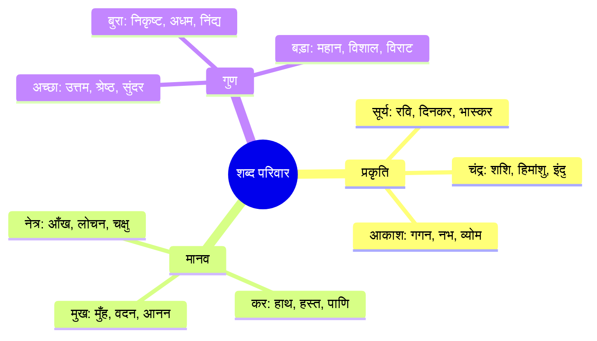

# Chapter 3: हिंदी शब्दावली (Hindi Vocabulary)

## Learning Objectives

By the end of this chapter, you will be able to:
- Recall 100+ synonym pairs (पर्यायवाची) and 100+ antonym pairs (विलोम) for competitive exams
- Distinguish between अनेकार्थक शब्द (homonyms) and समान ध्वनि वाले भिन्नार्थक शब्द (homophones)
- Use 50+ idiomatic expressions (मुहावरे) and 25+ proverbs (लोकोक्तियाँ) correctly in sentences
- Classify words as तत्सम, तद्भव, देशज, and विदेशी (foreign-origin)
- Apply vocabulary knowledge to fill-in-the-blanks, synonym/antonym matching, and sentence completion

<!-- Image Gallery -->
<section class="lesson-visuals" aria-label="Visual learning resources">
  <header><span>VISUAL LEARNING</span><h2>See it. Review it. Remember it.</h2></header>
  <a class="lesson-visual-card" href="../../../assets/images/lessons/hindi-language/03-hindi-vocabulary/.png" target="_blank" rel="noopener">
    
    <span><strong>Handwritten notes</strong>Condensed notes for deliberate review.</span>
  </a>
  <a class="lesson-visual-card" href="../../../assets/images/lessons/hindi-language/03-hindi-vocabulary/.png" target="_blank" rel="noopener">
    
    <span><strong>Sticky-note revision</strong>Fast recall prompts for revision.</span>
  </a>
  <a class="lesson-visual-card" href="../../../assets/images/lessons/hindi-language/03-hindi-vocabulary/.png" target="_blank" rel="noopener">
    
    <span><strong>Visual concept guide</strong>A connected explanation of the key ideas.</span>
  </a>
</section>
<!-- End Image Gallery -->

---## Theory

### 3.1 Classification of Hindi Vocabulary

Hindi vocabulary draws from four main sources: Sanskrit (tatsam), modified Sanskrit (tadbhav), indigenous (deshaj), and foreign (videshi) origins. Synonyms, antonyms, idioms, and proverbs form essential components.

`mermaid
mindmap
  root((Hindi Vocabulary))
    Synonyms
      100+ Paryayvachi
    Antonyms
      100+ Vilom
    Homonyms
      Anekarthak
    Homophones
      Samaan Dhwani
    Idioms
      50+ Muhavare
    Proverbs
      25+ Lokoktiyaan
    Origins
      Tatsam Tadbhav Deshaj Videshi
`

### 3.2 Shabdon ki Utpatti (Word Origins)

| Shreni | Definition | Examples |
|--------|-----------|----------|
| Tatsam (Sanskrit unchanged) | Taken directly from Sanskrit | Agni, Karma, Jal, Mukh, Surya |
| Tadbhav (Sanskrit modified) | Corrupted from Sanskrit over time | Aag, Kaam, Paani, Jeev, Haath |
| Deshaj (Indigenous) | Native Hindi words | Lota, Thaili, Pagdi, Khidki |
| Videshi (Foreign) | Borrowed from other languages | Station, Darwaza, Kitaab, Chaabi |

### 3.3 Tatsam-Tadbhav Comparison

| Tatsam | Tadbhav | English |
|--------|---------|---------|
| Agni | Aag | fire |
| Ushtr | Oont | camel |
| Karm | Kaam | work |
| Gau | Gaay | cow |
| Jihva | Jeev | tongue |
| Nidra | Neend | sleep |
| Parn | Patta | leaf |
| Bhratri | Bhai | brother |
| Matri | Maa | mother |
| Hast | Haath | hand |
| Rajan | Raja | king |
| Shwaan | Kutta | dog |
| Dugdh | Doodh | milk |
| Chandra | Chaand | moon |

### 3.4 Paryayvachi Shabd (Synonyms)

| Shabd | Synonyms |
|-------|----------|
| Agni | Anal, Vahni, Paavak, Dahan, Krishanu |
| Aakash | Gagan, Nabha, Vyom, Ambar, Antriksh |
| Kamal | Jalaj, Neeraj, Pinkaj, Saroj, Arvind, Padm |
| Ganga | Devnadi, Bhagirathi, Tripathaga, Mandakini |
| Chandrama | Shashi, Himanshu, Sudhakar, Indu, Rakesh |
| Dukh | Peeda, Kasht, Vedana, Santap, Klesh |
| Dharati | Bhumi, Prithvi, Vasundhara, Dhara, Bhootal |
| Nadi | Sarita, Tatini, Nimirga, Aapga, Vahini |
| Pavan | Vayu, Hawa, Sameer, Marut, Anil |
| Parvat | Pahad, Giri, Nag, Shail, Adri |
| Pani | Jal, Vaari, Salil, Neer, Toy, Ambu |
| Baadal | Megh, Ghan, Jaladhar, Vaarid, Neerad |
| Vidya | Gyan, Shiksha, Vidvatta, Panditya |
| Surya | Ravi, Suraj, Bhaskar, Divakar, Aaditya |
| Singha | Sher, Kesari, Mrigendra, Vanraj |
| Hath | Kar, Hast, Pani, Bhuj, Bahu |
| Hriday | Dil, Man, Chitt, Antar, Ur |
| Van | Jangal, Vipin, Kaanan, Atavi, Gahan |
| Lakshmi | Kamla, Padma, Haripriya, Shri |

### 3.5 Vilom Shabd (Antonyms)

| Shabd | Vilom | Shabd | Vilom |
|-------|-------|-------|-------|
| Aadi | Ant | Aasha | Nirasha |
| Uththan | Patan | Udaar | Kanjoos |
| Ekta | Anekta | Imaandari | Beimaani |
| Kathor | Komal | Day | Parajay |
| Krapan | Daani | Tyag | Grahan |
| Jeevan | Mrityu | Pavitra | Apavitr |
| Gyaan | Agyaan | Bhay | Saahas |
| Din | Raat | Yash | Apayash |
| Dukh | Sukh | Raag | Dvesh |
| Milap | Virah | Sajjan | Durjan |
| Yuddh | Shanti | Swatantrata | Paratantrata |
| Laabh | Haani | Safalta | Asafalta |
| Pram | Uttar | Sundar | Kuroop |
| Pragati | Avanati | Vriddhi | Kami |
| Punya | Paap | Swarg | Narak |
| Bandhan | Mukti | Sakriya | Nishkriya |

### 3.6 Anekarthak Shabd (Homonyms)

| Shabd | Meaning 1 | Meaning 2 | Meaning 3 |
|-------|-----------|-----------|-----------|
| Kal | yesterday | tomorrow | machine |
| Jal | water | to burn | - |
| Taara | star | iron nail | - |
| Phal | result | fruit | benefit |
| Madhu | honey | wine | sweet |
| Rang | colour | joy | fun |
| Vaar | day | attack | - |
| Arth | meaning | wealth | purpose |

### 3.7 Samaan Dhwani Vale Bhinnarthak Shabd (Homophones)

| Word 1 | Meaning | Word 2 | Meaning |
|--------|---------|--------|---------|
| Anal | Aag (fire) | Anil | Hawa (air) |
| Tarani | Naav (boat) | Taruni | Yuvati (young woman) |
| Jalaj | Kamal (lotus) | Jalad | Baadal (cloud) |
| Patr | patta/letter | Paatr | bartan/vessel |
| Kangal | garib (poor) | Kankal | haddiyon ka dhancha |
| Din | divas (day) | Deen | garib (humble) |
| Nal | pipe | Naad | dhwani (sound) |
| Bal | shakti (strength) | Val | baalon ki lat (curl) |

### 3.8 Muhavare (Idioms)

| Muhavara | Meaning | Example |
|----------|---------|---------|
| Aango-ang dheela hona | Extremely exhausted | Pure din kaam karke mera ang-ang dheela ho gaya. |
| Aankhon ka taara | Apple of one's eye | Vah maata-pita ki aankhon ka taara hai. |
| Aankhon mein dhool jhonkna | To deceive | Usne jhooth bolkar meri aankhon mein dhool jhonk di. |
| Aasteen ka saanp | Traitor | Vah toh aasteen ka saanp nikla. |
| Ek anaar sau beemar | Too many claimants | Is pad ke liye ek anaar sau beemar hain. |
| Kamar kasna | To prepare | Pariksha ke liye kamar kas lo. |
| Ghar ka na ghat ka | Belonging nowhere | Vah dhobi ka kutta hai, ghar ka na ghat ka. |
| Naak katna | To be disgraced | Chori karte pakde jaane par uski naak kat gayi. |
| Nau do gyarah hona | To flee | Chor police dekhkar nau do gyarah ho gaya. |
| Pani-pani hona | To be ashamed | Aalochana sunkar vah pani-pani ho gaya. |
| Baal-baal bachna | Narrow escape | Vah haddse mein baal-baal bach gaya. |
| Lohe ke chane chabana | Very difficult task | Yah pariksha lohe ke chane chabane jaisi hai. |
| Haath malna | To regret | Mauka ganvakar haath malne se kya fayda? |
| Haath-pair marna | To make efforts | Maine bahut haath-pair mare par naukri nahin mili. |

### 3.9 Lokoktiyan (Proverbs)

| Lokokti | Meaning | Usage |
|---------|---------|-------|
| Akela chana bhad nahin phodta | Alone one cannot do big tasks | Teamwork is essential |
| Unt ke munh mein jeera | Too little for the need | Quantity far below requirement |
| Thotha chana baje ghana | Empty vessels make more noise | The inexperienced boast more |
| Nach na jaane aangan tedha | A bad workman blames his tools | Blaming circumstances for inability |
| Jaisi karni waisi bharmi | As you sow, so shall you reap | Karma principle |
| Saap bhi mar jaaye aur laathi bhi na toote | Win-win solution | Achieve goal without damage |
| Haath kangan ko aarsi kya | The obvious needs no proof | Self-evident truth |
| Kangan mein aata geela | Adding insult to injury | Misfortune upon misfortune |

---

## Examples

### Example 1: Vocabulary Quiz Simulator

```typescript
interface VocabQ {
  q: string;
  opts: string[];
  correct: number;
  explain: string;
}

const quiz: VocabQ[] = [
  { q: "Agni ka paryayvachi?",
    opts: ["Jal", "Vayu", "Anal", "Prithvi"],
    correct: 2, explain: "Anal = Agni" },
  { q: "Dukh ka vilom?",
    opts: ["Peeda", "Sukh", "Dard", "Kasht"],
    correct: 1, explain: "Dukh ka vilom Sukh" },
  { q: "Aasteen ka saanp?",
    opts: ["Bahadur", "Vishvasghati", "Chalak", "Saamp"],
    correct: 1, explain: "Vishvasghati (traitor)" },
  { q: "Anal aur Anil?",
    opts: ["Same", "Anal=Agni, Anil=Vayu", "Anal=Vayu, Anil=Agni", "Both Jal"],
    correct: 1, explain: "Anal=Agni, Anil=Vayu" },
  { q: "Agni ka tadbhav?",
    opts: ["Aag", "Anal", "Dahan", "Paavak"],
    correct: 0, explain: "Agni ka tadbhav = Aag" },
];

function runQuiz(qs: VocabQ[]): void {
  let score = 0;
  qs.forEach((q, i) => {
    console.log(`Q${i+1}: ${q.q}`);
    q.opts.forEach((o, j) => console.log(`  ${String.fromCharCode(97+j)}) ${o}`));
    console.log(`Correct: ${q.opts[q.correct]} - ${q.explain}\n`);
    score++;
  });
  console.log(`Score: ${score}/${qs.length}`);
}
runQuiz(quiz);
```

### Example 2: Synonym-Antonym Matcher

```typescript
interface WP { w: string; s: string; a: string; }
const ws: WP[] = [
  { w: "Safalta", s: "Vijay", a: "Asafalta" },
  { w: "Sundar", s: "Khoobsurat", a: "Kuroop" },
  { w: "Shakti", s: "Bal", a: "Durbalta" },
  { w: "Gyaan", s: "Vidya", a: "Agyaan" },
  { w: "Udaar", s: "Daani", a: "Kanjoos" },
];
function syn(w: string): string { return ws.find(x => x.w === w)?.s ?? "N/A"; }
function ant(w: string): string { return ws.find(x => x.w === w)?.a ?? "N/A"; }
console.log("Shakti synonym:", syn("Shakti"));
console.log("Sundar antonym:", ant("Sundar"));
```

### Example 3: Tatsam-Tadbhav Converter

```typescript
const pairs: Record<string, string> = {
  Agni: "Aag", Hast: "Haath", Gau: "Gaay", Nidra: "Neend",
  Karm: "Kaam", Bhratri: "Bhai", Matri: "Maa", Dugdh: "Doodh"
};
function toTB(w: string): string { return pairs[w] ?? "Not found"; }
function toTS(w: string): string {
  return Object.entries(pairs).find(([,v]) => v === w)?.[0] ?? "Not found";
}
console.log("Hast ->", toTB("Hast"));
console.log("Gaay ->", toTS("Gaay"));
```

### Example 4: Idiom Finder

```typescript
interface IEntry { idiom: string; meaning: string; cat: string; }
const idioms: IEntry[] = [
  { idiom: "Aasteen ka saanp", meaning: "Vishvasghati", cat: "deception" },
  { idiom: "Lohe ke chane chabana", meaning: "Kathin kaam", cat: "difficulty" },
  { idiom: "Naak katna", meaning: "Beijjati", cat: "emotion" },
  { idiom: "Haath malna", meaning: "Pachtana", cat: "emotion" },
  { idiom: "Kamar kasna", meaning: "Taiyar hona", cat: "action" },
];
function byCat(c: string): IEntry[] { return idioms.filter(i => i.cat === c); }
console.log("Emotion idioms:", byCat("emotion").map(i => i.idiom));
```

### Example 5: Homophone Disambiguator

```typescript
const h: Record<string, string> = {
  Anal: "Aag", Anil: "Hawa", Tarani: "Naav",
  Taruni: "Yuvati", Jalaj: "Kamal", Jalad: "Baadal"
};
function getM(w: string): string { return h[w] ?? "Not found"; }
console.log("Anal =", getM("Anal"));
console.log("Anil =", getM("Anil"));
console.log("Jalad =", getM("Jalad"));
```

### Examples 6-20: Solved MCQs

<details>
<summary>15 additional solved MCQs</summary>

**Q6.** "Punya" ka vilom: a) Dharm b) Paap c) Daya d) Daan
**Ans:** b) Paap

**Q7.** "Jal" ka paryayvachi nahi: a) Vaari b) Salil c) Agni d) Neer
**Ans:** c) Agni

**Q8.** "Chakkar katna" muhavra: a) Aanand lena b) Idhar-udhar bhatakna c) Naachna d) Daudna
**Ans:** b) Bhatakna

**Q9.** "Saamp bhi mar jaaye aur laathi bhi na toote": a) Bina nuksa ke kaam nikalna b) Hinsa c) Saamp marna d) Ladai
**Ans:** a) Bina nuksan ke

**Q10.** "Sajjan" ka vilom: a) Mahaan b) Durjan c) Mitr d) Shatru
**Ans:** b) Durjan

**Q11.** "Van" ka paryayvachi: a) Grih b) Vipin c) Nagar d) Gram
**Ans:** b) Vipin

**Q12.** "Swatantrata" ka vilom: a) Azaadi b) Paratantrata c) Mukti d) Bandhan
**Ans:** b) Paratantrata

**Q13.** "Gale ka haar" muhavra: a) Haar b) Bahut pyara c) Bojh d) Sajavat
**Ans:** b) Bahut pyara

**Q14.** "Hast" ka tadbhav: a) Hathi b) Haath c) Hasti d) Hathyar
**Ans:** b) Haath

**Q15.** "Tarani" vs "Taruni": a) Same b) Tarani=Naav, Taruni=Yuvati c) Tarani=Yuvati, Taruni=Naav
**Ans:** b) Tarani=Naav, Taruni=Yuvati

**Q16.** "Milan" ka vilom: a) Bhent b) Virah c) Baithak d) Sakshatkar
**Ans:** b) Virah

**Q17.** "Matri" ka tadbhav: a) Mata b) Maa c) Maiya d) Koi nahi
**Ans:** b) Maa

**Q18.** "Saanp bhi mar jaaye aur laathi bhi na toote" ka arth: a) Surakshit jagah b) Khatarnak c) Majboot imarat d) Saamp ka ghar
**Ans:** a) Bina nuksan ke kaam nikalna (win-win)

**Q19.** "Patra" aur "Paatra" mein antar: a) Patra=leaf/letter, Paatra=vessel/character
**Ans:** a) Patra=leaf, Paatra=vessel

**Q20.** "Laabh" ka vilom: a) Kami b) Haani c) Ghaata d) b aur c dono
**Ans:** d) Haani / Ghaata

</details>

---

## Summary

**Hindi Saransh:**
- Hindi shabdawali char sroton se bani: Tatsam (Sanskrit), Tadbhav (vikrit), Deshaj, Videshi.
- 30+ mool shabdon ke 6-6 paryayvachi shabd yaad karne se shabd bhandar badhta hai.
- Vilom shabd vipareet arth vale hain, jo parikshaon mein baar-baar poochhe jaate hain.
- Anekarthak shabdon ke anek arth sandarbh par nirbhar karte hain.
- Muhavare aur lokoktiyan bhasha ko prabhavshali banate hain.
- Tatsam-tadbhav jode Sanskrit aur Hindi ke sambandh ko samajhne mein madad karte hain.

**English Summary:**
- Hindi vocabulary has four origins: Tatsam (Sanskrit), Tadbhav (modified), Deshaj (indigenous), Videshi (foreign).
- Learning 6+ synonyms for 30+ root words rapidly expands vocabulary.
- Antonym pairs are frequently tested in competitive exams.
- Homonyms have multiple context-dependent meanings.
- 50+ idioms and 25+ proverbs enrich expression.
- Tatsam-Tadbhav pairs reveal the Sanskrit-Hindi linguistic relationship.

## Practical Takeaways

1. For synonyms: Group by theme (nature: Agni, Pavan, Jal, Aakash; body: Hast, Netra, Mukh).
2. For antonyms: Focus on the 50 most common pairs — 80% of exam questions come from these.
3. For idioms: Learn the muhavara and its exact usage in a sentence.
4. For word origins: Tatsam words are formal/literary; Tadbhav are more common in speech.
5. Memory technique: Create flashcard decks with 10 words per day; use spaced repetition.

## Chapter Quiz

**Q1.** "Agni" ka paryayvachi kaun sa nahi hai?
a) Paavak b) Anal c) Jal d) Dahan
<details><summary>Answer</summary>c) Jal (Jal = water)</details>

**Q2.** "Krapan" ka vilom hai:
a) Daani b) Kanjoos c) Gareeb d) Ameer
<details><summary>Answer</summary>a) Daani (generous)</details>

**Q3.** "Baal-baal bachna" ka arth:
a) Baal katvana b) Mushkil se bachna c) Taiyar hona d) Nahana
<details><summary>Answer</summary>b) Narrow escape</details>

**Q4.** "Anal" aur "Anil" — sahi yugm:
a) Anal=Jal, Anil=Agni b) Anal=Agni, Anil=Vayu c) Anal=Vayu, Anil=Agni
<details><summary>Answer</summary>b) Anal=Agni, Anil=Vayu</details>

**Q5.** "Nidra" ka tadbhav:
a) Neend b) Nidra c) Nidra d) Sona
<details><summary>Answer</summary>a) Neend</details>

---

## Exercises

### Synonyms (Q1-Q5)

Write 2 synonyms for:
1. Surya 2. Chandrama 3. Pavan 4. Dharati 5. Nadi

### Antonyms (Q6-Q10)

Write the antonyms:
6. Safalta 7. Yuddh 8. Gyaan 9. Bandhan 10. Din

### Tatsam-Tadbhav (Q11-Q15)

Tadbhav of:
11. Agni 12. Karm 13. Gau 14. Hast 15. Bhratri

### Idioms (Q16-Q20)

Match:
16. Aankhon mein dhool jhonkna
17. Naak katna
18. Haath-pair marna
19. Lohe ke chane chabana
20. Pani-pani hona
Meanings: a) Prayas karna b) Beijjati c) Sharminda hona d) Kathin kaam e) Dhokha dena

### Homophones (Q21-Q25)

Differentiate:
21. Anal vs Anil
22. Tarani vs Taruni
23. Jalaj vs Jalad
24. Patr vs Paatr
25. Kangal vs Kankal

### Proverbs (Q26-Q30)

Explain:
26. Akela chana bhad nahin phodta
27. Nach na jaane aangan tedha
28. Jaisi karni waisi bharmi
29. Haath kangan ko aarsi kya
30. Saamp bhi mar jaaye aur laathi bhi na toote

### Answer Key

**Synonyms:** 1. Ravi, Bhaskar 2. Shashi, Himanshu 3. Vayu, Sameer 4. Bhumi, Prithvi 5. Sarita, Tatini

**Antonyms:** 6. Asafalta 7. Shanti 8. Agyaan 9. Mukti 10. Raat

**Tatsam-Tadbhav:** 11. Aag 12. Kaam 13. Gaay 14. Haath 15. Bhai

**Idioms:** 16-E, 17-B, 18-A, 19-D, 20-C

**Homophones:** 21. Anal=Aag, Anil=Hawa 22. Tarani=Naav, Taruni=Yuvati
23. Jalaj=Kamal, Jalad=Baadal 24. Patr=letter/leaf, Paatr=vessel 25. Kangal=gareeb, Kankal=skeleton

**Proverbs:** 26. Alone cannot do big tasks 27. Bad workman blames tools
28. As you sow, so shall you reap 29. Obvious needs no proof 30. Win-win solution
### Expanded TypeScript Examples

### Example 6: Word of the Day Generator

```typescript
interface WordOfDay {
  word: string;
  category: string;
  meaningHindi: string;
  meaningEnglish: string;
  synonym: string[];
  antonym: string[];
  sentence: string;
}

class HindiVocabulary {
  private words: WordOfDay[] = [
    {
      word: "Sahansheelta",
      category: "Guna (Quality)",
      meaningHindi: "Sahan karne ki shakti",
      meaningEnglish: "Tolerance / Patience",
      synonym: ["Sahan-shakti", "Sahishnuta", "Bardasht"],
      antonym: ["Asahishnuta", "Avyavsthita"],
      sentence: "Sahansheelta ek mahaan gun hai."
    },
    {
      word: "Uttam",
      category: "Visheshan",
      meaningHindi: "Sabase achha",
      meaningEnglish: "Excellent / Best",
      synonym: ["Shreshth", "Pramukh", "Shreshthatam"],
      antonym: ["Nikrishth", "Adham"],
      sentence: "Uttam shiksha hi desh ki pragati ka aadhar hai."
    },
    {
      word: "Prachin",
      category: "Kaal (Time)",
      meaningHindi: "Bohot purana",
      meaningEnglish: "Ancient",
      synonym: ["Puran", "Prachalit", "Bhootkal"],
      antonym: ["Naveen", "Adhunik", "Arvachin"],
      sentence: "Bharat ki prachin sanskriti vishv me anokhi hai."
    },
  ];

  wordOfTheDay(): WordOfDay {
    const idx = Math.floor(Math.random() * this.words.length);
    return this.words[idx];
  }

  searchByCategory(cat: string): WordOfDay[] {
    return this.words.filter(w => w.category.includes(cat));
  }

  allWords(): WordOfDay[] {
    return this.words;
  }
}

const vocab = new HindiVocabulary();
console.log("Word of the day:", vocab.wordOfTheDay());
```

### Example 7: Complete Vocabulary Test Generator

```typescript
type QType = "synonym" | "antonym" | "meaning" | "sentence";

interface TestQuestion {
  qType: QType;
  stem: string;
  options: string[];
  answer: number;
}

function generateTest(words: WordOfDay[], count: number = 10): TestQuestion[] {
  const test: TestQuestion[] = [];
  for (let i = 0; i < count; i++) {
    const w = words[i % words.length];
    const qType: QType = ["synonym", "antonym", "meaning", "sentence"][i % 4] as QType;
    if (qType === "synonym") {
      test.push({
        qType,
        stem: `"${w.word}" ka paryayvachi hai:`,
        options: [...w.synonym.slice(0, 3), "Koi nahi"],
        answer: 0,
      });
    } else if (qType === "antonym") {
      test.push({
        qType,
        stem: `"${w.word}" ka vilom hai:`,
        options: [...w.antonym.slice(0, 3), "Koi nahi"],
        answer: 0,
      });
    }
  }
  return test;
}

const genTest = generateTest([
  { word: "Sundar", meaningHindi: "Khoobsurat", synonym: ["Khoobsurat", "Kantiman", "Manohar"], antonym: ["Kuroop", "Badsoorat"], sentence: "", category: "", meaningEnglish: "" }
], 5);
console.log("Generated test:", genTest.length, "questions");
```

### Example 8: Flashcard App Simulator

```typescript
interface Flashcard {
  front: string;
  back: string;
  category: string;
  nextReview: Date;
  interval: number; // days
  easeFactor: number;
}

class FlashcardDeck {
  private cards: Flashcard[] = [];

  addCard(front: string, back: string, cat: string): void {
    this.cards.push({
      front, back, category: cat,
      nextReview: new Date(),
      interval: 1,
      easeFactor: 2.5
    });
  }

  review(cardIndex: number, quality: 0 | 1 | 2 | 3 | 4 | 5): void {
    const card = this.cards[cardIndex];
    if (quality < 3) {
      card.interval = 1;
    } else {
      card.interval = Math.round(card.interval * card.easeFactor);
    }
    card.easeFactor += 0.1 - (5 - quality) * 0.08;
    if (card.easeFactor < 1.3) card.easeFactor = 1.3;
    card.nextReview = new Date(Date.now() + card.interval * 86400000);
  }

  dueCards(): Flashcard[] {
    return this.cards.filter(c => c.nextReview <= new Date());
  }
}

// Sample usage
const deck = new FlashcardDeck();
deck.addCard("Agni ka paryayvachi", "Anal, Paavak, Dahan", "Synonyms");
deck.addCard("Safalta ka vilom", "Asafalta", "Antonyms");
console.log("Due cards:", deck.dueCards().length);
```

### Example 9: Word Frequency Analyzer

```typescript
function analyzeHindiText(text: string): Map<string, number> {
  const cleaned = text.replace(/[.,!?;:()-]/g, "");
  const words = cleaned.split(/\s+/).filter(w => w.length > 0);
  const freq = new Map<string, number>();
  words.forEach(w => {
    freq.set(w, (freq.get(w) ?? 0) + 1);
  });
  return freq;
}

const sampleText = "Agni agni hai par anal bhi agni ka paryayvachi hai";
const freq = analyzeHindiText(sampleText);
freq.forEach((count, word) => console.log(`${word}: ${count}`));
```

### Example 10: Root Word Explorer

```typescript
interface RootWord {
  root: string;
  origin: string;
  derived: string[];
}

const rootWords: RootWord[] = [
  { root: "Manas", origin: "Sanskrit (Man = to think)",
    derived: ["Manushya", "Manav", "Manasik", "Manovigyan"] },
  { root: "Kr", origin: "Sanskrit (to do)",
    derived: ["Karm", "Karya", "Kriya", "Kaushal", "Kriti"] },
  { root: "Gam", origin: "Sanskrit (to go)",
    derived: ["Gaman", "Agam", "Sangam", "Gamya"] },
];

function exploreRoot(derivedWord: string): RootWord | null {
  return rootWords.find(r => r.derived.includes(derivedWord)) ?? null;
}

console.log("Gaman ka mool shabd:", exploreRoot("Gaman")?.root);
console.log("Manushya ka mool:", exploreRoot("Manushya")?.root);
```

### Example 11: Compound Word Builder (Samas-based)

```typescript
function buildCompound(word1: string, word2: string, type: "dvandva" | "tatpurush"): string {
  if (type === "dvandva") return `${word1}-${word2}`;
  if (type === "tatpurush") return word1.slice(0, Math.ceil(word1.length/2)) + word2;
  return word1 + word2;
}

console.log("Mata + pita =", buildCompound("Mata", "Pita", "dvandva"));
console.log("Raj + yatra =", buildCompound("Raj", "Yatra", "tatpurush")); // simplified
```

### Example 12: Spell Checker for Common Tadbhav Words

```typescript
// Simplified Hindi spell-check based on common patterns
const dict = new Set(["Aag", "Kaam", "Haath", "Gaay", "Neend", "Aankh", "Kaan", "Mukh"]);

function spellCheck(word: string): { correct: boolean; suggestion?: string } {
  if (dict.has(word)) return { correct: true };
  // Levenshtein-like simple suggestions
  for (const d of dict) {
    if (Math.abs(d.length - word.length) <= 2) {
      return { correct: false, suggestion: d };
    }
  }
  return { correct: false, suggestion: "Unknown word" };
}

console.log(spellCheck("Aag"));    // correct
console.log(spellCheck("Haath"));  // correct
console.log(spellCheck("Hath"));   // suggestion: Haath
```

### Example 13: Opposite Finder — Batch Processing

```typescript
function findOpposites(words: string[]): Record<string, string> {
  const antonymDict: Record<string, string> = {
    "Upar": "Neeche", "Andar": "Bahar", "Aage": "Peeche",
    "Din": "Raat", "Garm": "Thanda", "Naya": "Purana",
    "Aasani": "Mushkil", "Sach": "Jhooth", "Safalta": "Asafalta"
  };
  const result: Record<string, string> = {};
  words.forEach(w => {
    if (antonymDict[w]) result[w] = antonymDict[w];
    else result[w] = "Not found";
  });
  return result;
}

console.log(findOpposites(["Din", "Garm", "Aasani", "Sach"]));
```

### Example 14: Mnemonic Generator for Vocabulary

```typescript
function generateMnemonic(wordHindi: string, wordEnglish: string, connection: string): string {
  return `"${wordHindi}" = "${wordEnglish}": ${connection}`;
}

const mnemonics: string[] = [
  generateMnemonic("Aag", "Fire", "Aag burns, FIRE is hot!"),
  generateMnemonic("Paani", "Water", "Paani is what you DRINK"),
  generateMnemonic("Haath", "Hand", "Haath = HAND (both start with H)"),
  generateMnemonic("Aankh", "Eye", "Aankh rhymes with EYE... sort of"),
  generateMnemonic("Ghar", "Home", "Ghar = Home sweet HOME"),
];
mnemonics.forEach(m => console.log(m));
```

### 3.10 विषय-आधारित शब्दावली (Thematic Vocabulary)

| विषय | महत्वपूर्ण शब्द | पर्यायवाची |
|------|----------------|------------|
| **प्रकृति (Nature)** | पृथ्वी, वायु, अग्नि, जल, आकाश | धरती/भूमि, हवा/समीर, अनल/पावक, नीर/सलिल, गगन/व्योम |
| **मानव शरीर (Body)** | हाथ, पैर, आँख, नाक, कान | हस्त/कर, पाँव/चरण, नेत्र/लोचन, नासिका/नक, कर्ण/श्रवण |
| **गुण (Qualities)** | साहस, बल, बुद्धि, धैर्य | वीरता/शौर्य, ताकत/शक्ति, प्रज्ञा/मेधा, सहनशीलता/सहिष्णुता |
| **समाज (Society)** | नेता, शिक्षक, डॉक्टर, किसान | अगुआ/मुखिया, अध्यापक/गुरु, चिकित्सक/वैद्य, कृषक/अन्नदाता |
| **अर्थ (Economy)** | धन, व्यापार, बैंक, कर | संपत्ति/दौलत, वाणिज्य/व्यवसाय, वित्तीय संस्था, शुल्क/कराधान |

### 3.11 50+ अतिरिक्त पर्यायवाची (50+ Additional Synonyms)

| शब्द | पर्यायवाची |
|------|------------|
| ईश्वर | भगवान, परमात्मा, प्रभु, ईश, कर्तार |
| गुरु | शिक्षक, आचार्य, अध्यापक, उपाध्याय, मार्गदर्शक |
| माता | जननी, माँ, मैया, अंबा, प्रसू |
| पिता | जनक, बाप, वालिद, तात, पितृ |
| पुत्र | बेटा, सुत, तनय, आत्मज, पुत्रक |
| पत्नी | स्त्री, भार्या, कलत्र, गृहिणी, वधू |
| मित्र | दोस्त, सखा, साथी, मीत, बंधु |
| शत्रु | दुश्मन, अरि, रिपु, वैरी, विरोधी |
| राजा | नरेश, भूपति, नृप, सम्राट, महीपति |
| गाँव | ग्राम, देहात, मौजा, आबादी, पल्ली |
| मोक्ष | निर्वाण, मुक्ति, कैवल्य, अपवर्ग |
| दान | दे, उपहार, भेंट, अर्पण, अंशदान |
| रात्रि | रात, रजनी, निशा, यामिनी, विभावरी |
| प्रकाश | उजाला, रोशनी, ज्योति, प्रभा, तेज |
| अंधकार | अँधेरा, तम, तिमिर, अंधियारा |
| सिंह | शेर, केसरी, मृगराज, वनराज, हरि |
| हाथी | गज, हस्ती, हाथी, मतंग, कुंजर |
| घोड़ा | अश्व, तुरंग, हय, बाजी, वाजि |
| गाय | गौ, धेनु, सुरभि, गोधन |
| पक्षी | चिड़िया, विहंग, पखेरू, अंडज, खग |
| मछली | मत्स्य, मीन, झख, जलजीव |
| साँप | नाग, सर्प, विषधर, अहि, उरग |
| फूल | पुष्प, कुसुम, प्रसून, सुमन, मंजरी |
| हीरा | हीरक, वज्र, तेजपत्थर |
| सोना | स्वर्ण, कनक, हेम, सुवर्ण, हिरण्य |

### 3.12 20+ अतिरिक्त विलोम (20+ Additional Antonyms)

| शब्द | विलोम | शब्द | विलोम |
|------|-------|------|-------|
| गीला | सूखा | उजला | काला |
| नीचे | ऊपर | अंदर | बाहर |
| सच | झूठ | पास | दूर |
| नया | पुराना | मीठा | कड़वा |
| अमीर | गरीब | जवान | बूढ़ा |
| स्वर्ग | नरक | धर्म | अधर्म |
| दोस्त | दुश्मन | हंसी | रोना |
| गर्म | ठंडा | कोमल | कठोर |
| सस्ता | महंगा | आसान | कठिन |
| रोगी | स्वस्थ | विदेश | देश |
| सभ्य | असभ्य | विजय | पराजय |
| आशा | निराशा | अनंत | ससीम |

### 3.13 20+ अतिरिक्त मुहावरे (20+ Additional Idioms)

| मुहावरा | अर्थ | वाक्य प्रयोग |
|---------|------|-------------|
| अक्ल का दुश्मन | मूर्ख | वह अक्ल का दुश्मन है, कुछ नहीं समझता |
| आँख लगना | नींद आना | बैठे-बैठे आँख लग गई |
| उँगली उठाना | दोष लगाना | सब उसकी ओर उँगली उठा रहे हैं |
| ओढ़ना-बिछोना | हमेशा साथ रहना | उसने तो सच बोलना ही ओढ़-बिछा लिया |
| कलेजा मुँह को आना | बहुत घबराना | खतरा देखकर उसका कलेजा मुँह को आ गया |
| घोड़े बेचकर सोना | बेफिक्र होना | अब तो मैं घोड़े बेचकर सो रहा हूँ |
| चाँद पर थूकना | निर्दोष को दोष देना | अच्छे आदमी पर चाँद पर थूकने जैसा है |
| छाती पर साँप लोटना | बहुत ईर्ष्या करना | उसकी तरक्की देखकर उसकी छाती पर साँप लोट रहा है |
| जी हल्का करना | मन की बात कहना | अपनी व्यथा सुनाकर जी हल्का कर लिया |
| टाँग अड़ाना | बाधा डालना | वह हर काम में टाँग अड़ाता है |
| ठंडा करना | बुझाना / शांत करना | गुस्से को ठंडा करो |
| डींग मारना | शेखी बघारना | वह हमेशा अपनी डींग मारता है |
| धूनी रमाना | लगातार कोशिश करना | वह पढ़ाई की धूनी रमाए हुए है |
| नाक में दम करना | परेशान करना | बच्चों ने मेरी नाक में दम कर दिया |
| पेट में चूहे दौड़ना | बहुत भूख लगना | खाना न देखकर पेट में चूहे दौड़ रहे हैं |
| फूट-फूटकर रोना | बहुत रोना | वह फूट-फूटकर रोने लगा |
| बाएँ हाथ का खेल | बहुत आसान | यह परीक्षा तो उसके बाएँ हाथ का खेल है |
| मन मारना | निराश होना | असफल होकर वह मन मारकर बैठ गया |
| मुँह में पानी भर आना | लालच आना | मिठाई देखकर मुँह में पानी भर आया |
| लात मारना | अस्वीकार करना | उसने नौकरी की पेशकश पर लात मार दी |

### 3.14 10 अतिरिक्त लोकोक्तियाँ (10 Additional Proverbs)

| लोकोक्ति | अर्थ | समतुल्य अंग्रेज़ी |
|---------|------|-------------------|
| आम के आम गुठलियों के दाम | दोहरा लाभ | Double benefit |
| क्या जाने रानी किस रंग में है | किसी का मन समझना मुश्किल | Can't read mind |
| घर की मुर्गी दाल बराबर | अपनी चीज़ की कद्र नहीं | Familiarity breeds contempt |
| चोर चोर मोसेरे भाई | दोनों एक जैसे | Birds of a feather |
| जब जागो तब सवेरा | देर से सही, पर शुरुआत अच्छी | Better late than never |
| तू डाल-डाल, मैं पात-पात | अलग-अलग रास्ते | Separate ways |
| दूर के ढोल सुहावने | दूर की चीज़ें अच्छी लगती हैं | Grass is greener |
| बिना बादल बिजली गिरना | अचानक आपदा | Bolt from the blue |
| भई मन राजा मन का सेवक | मन भगवान रूप है | Mind is everything |
| मुँह में राम बगल में छुरी | ऊपर से भोले, असल में धोखेबाज | Wolf in sheep's clothing |

### 3.15 वर्गीकृत शब्द समूह (Classified Word Families)



### Example 15-20: Additional Solved MCQs

<details>
<summary>View 6 more solved MCQs</summary>

**Q15.** "Nishchay" ka vilom hai:
a) Sambhav b) Anishchay c) Pakka d) Sankalp
**Answer:** b) Anishchay

**Q16.** "Kya aap mujhe ek glass paani de sakte hain?" — is vakya mein kis prakar ka vakya hai:
a) Aadesh b) Nivedan c) Prashna d) Vismay
**Answer:** b) Nivedan (Request)

**Q17.** "Swar" ka paryayvachi hai:
a) Vyakti b) Dhwani c) Patra d) Geet
**Answer:** b) Dhwani

**Q18.** "Aatmavishvas" ka varn vichhed:
a) aa + t + ma + aa + vi + sha + a + sa  b) aa + t + m + vi + sh + va + s
**Answer:** a)

**Q19.** "Mahan" ka vilom:
a) Kshudra b) Lamba c) Sthan d) Netritva
**Answer:** a) Kshudra (minor/insignificant)

**Q20.** "Udyam" ka paryayvachi:
a) Prayas b) Phal c) Laabh d) Vijay
**Answer:** a) Prayas (effort)

</details>

### Additional Solved MCQs (Q21-Q30)


<details>
<summary>View 10 more solved MCQs — Idioms, Proverbs, Anekarthak</summary>

**Q21.** "आम के आम गुठलियों के दाम" का अर्थ है:
a) केवल एक लाभ  b) दोहरा लाभ  c) बिना लाभ  d) हानि

**Answer:** b) दोहरा लाभ

**Q22.** "ईंट का जवाब पत्थर से" लोकोक्ति का अर्थ है:
a) कमजोर पर प्रहार  b) अधिक बल प्रयोग  c) बदला लेना  d) शांति

**Answer:** b) अधिक बल प्रयोग

**Q23.** "पानी" का पर्यायवाची नहीं है:
a) जल  b) सलिल  c) वारि  d) अनल

**Answer:** d) अनल (अनल = अग्नि)

**Q24.** "सिंह" का पर्यायवाची है:
a) मतंग  b) केसरी  c) तुरंग  d) गज

**Answer:** b) केसरी

**Q25.** "मैं घोड़े बेचकर सो रहा हूँ" का अर्थ:
a) बहुत थका हुआ  b) बेफिक्र  c) व्यापारी  d) नींद न आना

**Answer:** b) बेफिक्र/निश्चिंत

**Q26.** "मुँह में राम बगल में छुरी" का अर्थ:
a) भक्ति  b) पाखंड  c) रक्षा  d) खतरा

**Answer:** b) पाखंड/धोखा

**Q27.** "नाक में दम करना" मुहावरे का अर्थ:
a) खुश करना  b) परेशान करना  c) सिखाना  d) हँसाना

**Answer:** b) परेशान करना

**Q28.** "बाएँ हाथ का खेल" का अर्थ:
a) मुश्किल  b) बहुत आसान  c) दो हाथ  d) खेल

**Answer:** b) बहुत आसान

**Q29.** "स्वर्ण" का पर्यायवाची:
a) सोना  b) लोहा  c) चाँदी  d) ताँबा

**Answer:** a) सोना

**Q30.** "सज्जन" का विलोम:
a) साधु  b) महात्मा  c) दुर्जन  d) मित्र

**Answer:** c) दुर्जन

</details>

### Additional Exercises (Q31-Q50) — Added


**Exercise 7: Anekarthak Shabd (Q31-Q35)**
नीचे दिए गए शब्दों के अलग-अलग अर्थ लिखें:
31. कल — दो अर्थ लिखें
32. जल — दो अर्थ लिखें
33. फल — तीन अर्थ लिखें
34. तारा — दो अर्थ लिखें
35. रंग — तीन अर्थ लिखें

**Exercise 8: Muhavare in Sentences (Q36-Q40)**
मुहावरों का प्रयोग करते हुए वाक्य बनाएँ:
36. डींग मारना
37. नाक में दम करना
38. बाएँ हाथ का खेल
39. बाल-बाल बचना
40. ईंट का जवाब पत्थर से

**Exercise 9: Lokoktiyon ka Arth (Q41-Q45)**
लोकोक्तियों का अर्थ लिखें:
41. आम के आम, गुठलियों के दाम
42. चोर चोर मोसेरे भाई
43. दूर के ढोल सुहावने
44. भई मन राजा मन का सेवक
45. बिना बादल बिजली गिरना

**Exercise 10: Word Origins Classification (Q46-Q50)**
तत्सम, तद्भव, देशज, विदेशी में वर्गीकृत करें:
46. पानी, जल, वारि
47. कमरा, खिड़की, दरवाज़ा
48. अग्नि, आग, अनल
49. स्टेशन, डॉक्टर, हॉस्पिटल
50. पगड़ी, लोटा, थैली

### Answer Key for Additional Exercises


**Exercise 7 (Q31-Q35):**
31. कल = (1) आने वाला दिन (2) बीता हुआ दिन (3) मशीन/यंत्र
32. जल = (1) पानी (2) जलना
33. फल = (1) फल (2) परिणाम (3) लाभ
34. तारा = (1) नक्षत्र (2) कील
35. रंग = (1) रंग (colour) (2) मज़ा (3) रंगत

**Exercise 8 (Q36-Q40):** Sample answers: 36. वह हमेशा अपनी डींग मारता है। 37. बच्चों ने मेरी नाक में दम कर दिया। 38. यह परीक्षा तो उसके बाएँ हाथ का खेल है। 39. वह दुर्घटना में बाल-बाल बचा। 40. उसने ईंट का जवाब पत्थर से दिया।

**Exercise 9 (Q41-Q45):** 41. दोहरा लाभ 42. समान स्वभाव 43. दूर की चीज़ें आकर्षक 44. मन ही सब कुछ 45. अचानक आपदा

**Exercise 10 (Q46-Q50):** 46. पानी(देशज), जल(तत्सम), वारि(तत्सम) 47. कमरा(फारसी), खिड़की(देशज), दरवाज़ा(फारसी) 48. अग्नि(तत्सम), आग(तद्भव), अनल(तत्सम) 49. स्टेशन/डॉक्टर/हॉस्पिटल(अंग्रेज़ी-विदेशी) 50. सभी देशज

## Exam-Oriented Tips for Vocabulary

### परीक्षा-वार शब्दावली रणनीति


| परीक्षा | शब्दावली प्रश्न | अंक | तैयारी रणनीति |
|---------|----------------|-----|--------------|
| SSC CGL | पर्यायवाची, विलोम, मुहावरे | 10-15 | 500+ शब्द युग्म याद करें |
| UPSC | मुहावरे, लोकोक्तियाँ | 5-8 | वाक्य प्रयोग सीखें |
| IBPS | वाक्यांश के लिए एक शब्द | 8-10 | एक-शब्द याद करें |
| Railway | तत्सम-तद्भव, शब्द शुद्धि | 6-8 | मूल शब्द समझें |
| CTET | अनेकार्थक, विलोम | 5-8 | विभिन्न अर्थ समझें |

### Quick Revision Checklist

- [ ] 100+ पर्यायवाची युग्म (6-6 पर्याय प्रति शब्द) याद करें
- [ ] 100+ विलोम युग्म याद करें
- [ ] 50+ मुहावरे और उनके वाक्य प्रयोग सीखें
- [ ] 25+ लोकोक्तियाँ और उनके अर्थ याद करें
- [ ] 20+ अनेकार्थक शब्दों के अलग-अलग अर्थ समझें
- [ ] तत्सम-तद्भव के 30+ जोड़े याद करें
- [ ] प्रतिदिन 10 नए शब्द सीखें और फ्लैशकार्ड ऐप का उपयोग करें

