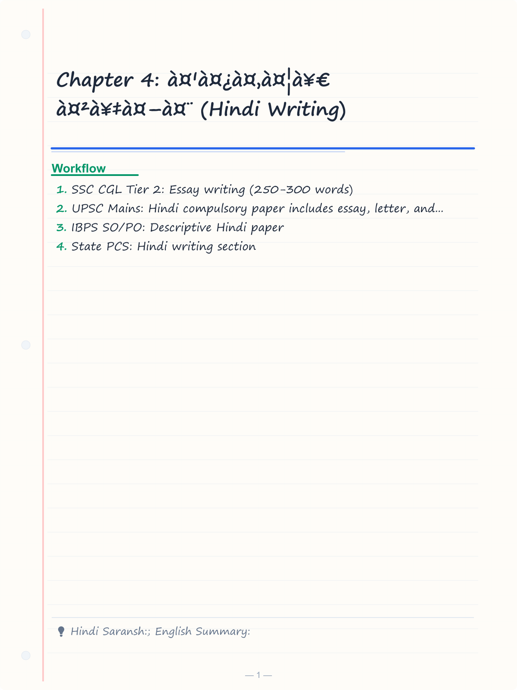
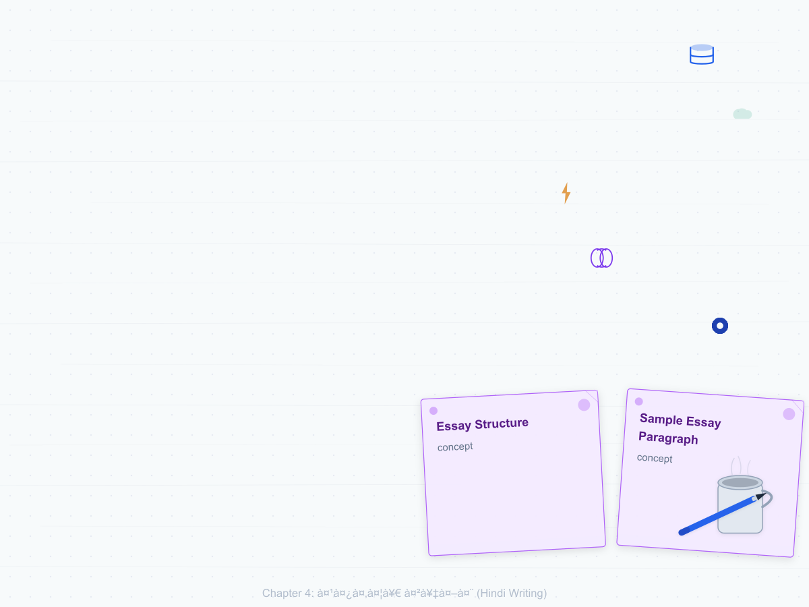
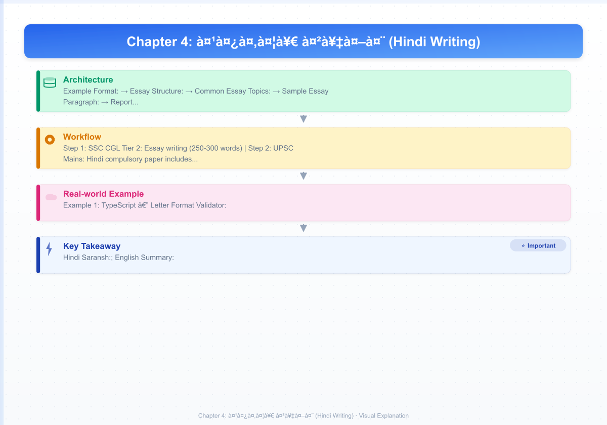
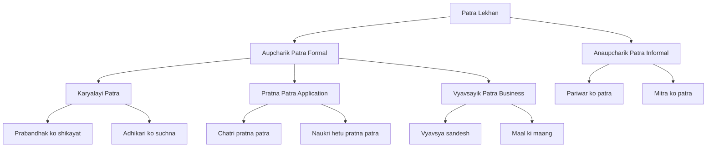
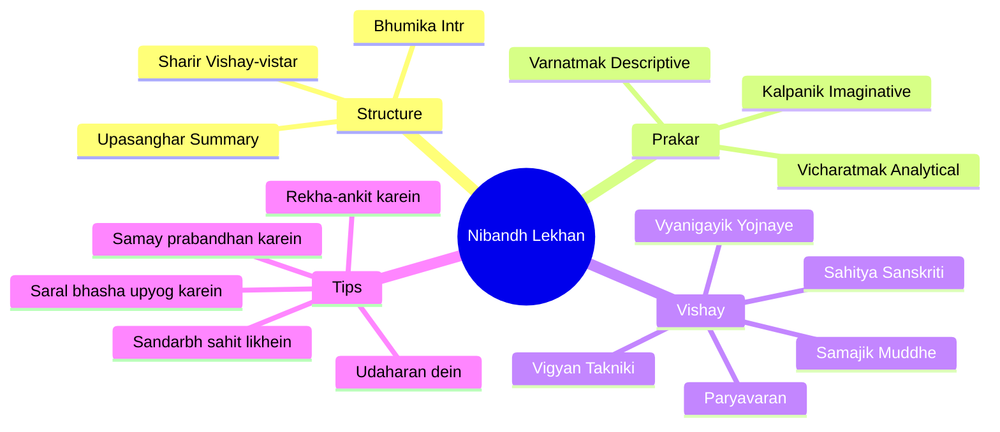

# Chapter 4: हिंदी लेखन (Hindi Writing)

## Learning Objectives

By the end of this chapter, you will be able to:
- Write formal and informal letters (पत्र) in the correct Hindi format
- Draft applications (प्रार्थना पत्र) and business correspondence
- Structure essays (निबंध) on common exam topics
- Write reports, summaries, and dialogues in Hindi
- Use official Hindi (कार्यालयी हिंदी) terminology for government documentation

<!-- Image Gallery -->
<section class="lesson-visuals" aria-label="Visual learning resources">
  <header><span>VISUAL LEARNING</span><h2>See it. Review it. Remember it.</h2></header>
  <a class="lesson-visual-card" href="../../assets/images/lessons/hindi-language/04-hindi-writing/handwritten-notes.png" target="_blank" rel="noopener">
    
    <span><strong>Handwritten notes</strong>Condensed notes for deliberate review.</span>
  </a>
  <a class="lesson-visual-card" href="../../assets/images/lessons/hindi-language/04-hindi-writing/sticky-notes.png" target="_blank" rel="noopener">
    
    <span><strong>Sticky-note revision</strong>Fast recall prompts for revision.</span>
  </a>
  <a class="lesson-visual-card" href="../../assets/images/lessons/hindi-language/04-hindi-writing/visual-explanation.png" target="_blank" rel="noopener">
    
    <span><strong>Visual concept guide</strong>A connected explanation of the key ideas.</span>
  </a>
</section>
<!-- End Image Gallery -->

---

## Theory

### 4.1 Importance of Hindi Writing in Competitive Exams

Hindi writing is a high-scoring section in many government exams:
- SSC CGL Tier 2: Essay writing (250-300 words)
- UPSC Mains: Hindi compulsory paper includes essay, letter, and precis
- IBPS SO/PO: Descriptive Hindi paper
- State PCS: Hindi writing section
- CTET: Hindi pedagogy includes writing skills

### 4.2 Letter Writing (पत्र लेखन)



#### A. औपचारिक पत्र (Formal Letter) Format

```
सेवा में,
श्रीमान _______________ (पदनाम/संस्था का नाम)
_______________ (पता)
_______________ (शहर, पिन कोड)

दिनांक: ____/____/_______

विषय: _______________

महोदय/महोदया,

[पत्र का मुख्य भाग — 3-4 पैराग्राफ]
1. परिचय और विषय का उल्लेख
2. समस्या/अनुरोध का विवरण
3. समाधान/कार्रवाई का अनुरोध
4. धन्यवाद

भवदीय,
_______________ (हस्ताक्षर)
_______________ (नाम)
_______________ (पता)
_______________ (संपर्क)
```

#### B. अनौपचारिक पत्र (Informal Letter) Format

```
पता: _______________
दिनांक: ____/____/_______

प्रिय _______________,

[पत्र का मुख्य भाग]
1. कुशलक्षेम
2. समाचार और घटनाएँ
3. भावनाएँ और अनुभव
4. आगामी योजनाएँ

आपका अपना,
_______________
```

### 4.3 Application Writing (प्रार्थना पत्र)

| Type | Recipient | Purpose |
|------|-----------|---------|
| Chhutti hetu | Pradhanacharya | Leave application |
| Scholarship hetu | Adhikari | Scholarship request |
| Naukri hetu | Prabandhak | Job application |
| Fees maafi hetu | Pradhanacharya | Fee concession |
| Library card hetu | Pustakalayadhyaksh | Library card request |

**Example Format:**

```
सेवा में,
श्रीमान प्रधानाचार्य,
____________________ (विद्यालय का नाम)
____________________ (पता)

दिनांक: 15/08/2026

विषय: दो दिन की छुट्टी हेतु प्रार्थना पत्र

महोदय,

सविनय निवेदन है कि मैं कक्षा __ का छात्र/छात्रा ____ हूँ। कल दिनांक 16/08/2026 को मेरे बड़े भाई का विवाह है। इस कारण मैं दिनांक 16/08/2026 से 17/08/2026 तक विद्यालय में उपस्थित नहीं हो पाऊँगा/हूँगी।

अतः आपसे विनम्र निवेदन है कि मुझे दो दिन की छुट्टी प्रदान करने की कृपा करें।

धन्यवाद सहित,
आपका आज्ञाकारी छात्र,
_______________
कक्षा: ___
अनुक्रमांक: ___
```

### 4.4 Essay Writing (निबंध लेखन)



**Essay Structure:**

| Section | Content | % of Essay |
|---------|---------|-----------|
| Bhumika (Introduction) | Topic definition, context, importance | 15% |
| Vistar (Body) | Analysis with examples, data, arguments | 70% |
| Upasanghar (Conclusion) | Summary, suggestion, future outlook | 15% |

**Common Essay Topics:**
1. Digital India: Journey and Impact
2. Climate Change and Its Effects on India
3. Nari Sashaktikaran (Women Empowerment)
4. Bharat ki Sanskritik Vividhta (Cultural Diversity)
5. Yuvaon ka Desh Nirman Mein Yogdan
6. Jal Sanrakshan ki Aavashyakta
7. Swachh Bharat Abhiyan: Safalta aur Chunautiyan
8. Vigyan aur Prodyogiki: Vardan ya Abhishap
9. Bhartiya Arthvyavastha mein Digital Payment ki Bhumika
10. Shiksha ka Adhikar: Labh aur Chunautiyan

**Sample Essay Paragraph:**

```
Vishay: Paryavaran Sanrakshan

Bhumika: Paryavaran sanrakshan aaj ki sabase badi chunauti hai. Badhti hui jansankhya
aur audyogikaran ke karan paryavaran par gahra prabhav pada hai. Jal, vayu aur mitti
pradushan se jeven sankat mein hai.

Sharir: Paryavaran pradushan ke pramukh karan: audhyogik yantron se dhuwan, motar
gadiyon ka pradushan, rasayanik khadon ka upyog, vanon ki kati. Iske parinam:
global warming, asaman varsha, rogo ki vriddhi. Paryavaran sanrakshan ke upay:
vanaropan, rasayanik khadon ka kam upyog, solar urja ka upyog, jansanchar ke
madhyam se jagrukta.

Upasanghar: Paryavaran sanrakshan har nagrik ka kartavy hai. "Prakriti ki raksha,
kal ki suraksha" — is mantr ke saath hamein paryavaran ki suraksha ke liye age
aana hoga. Kiwi nahi chhodna, ilaaj chuna hoga.
```

### 4.5 Report Writing (रिपोर्ट लेखन)

**Report Components:**
1. Shikashak (Heading) — Title
2. Sthan aur Tarikh (Place & Date)
3. Pranamika (Salutation / Address to authority)
4. Ghatna ka Vivran (Details of event)
5. Siddhi aur Chunautiyan (Achievements & Challenges)
6. Suggestion (Recommendations)
7. Hastaakshan (Signature with designation)

**Sample Report Start:**

```
प्रतिवेदन / रिपोर्ट

विषय: विद्यालय में मनाए गए "हिंदी दिवस" का प्रतिवेदन

दिनांक: 15 सितंबर 2026

महोदय,

निवेदन है कि दिनांक 14 सितंबर 2026 को हमारे विद्यालय में हिंदी दिवस बड़े
हर्षोल्लास के साथ मनाया गया। इस अवसर पर निम्नलिखित कार्यक्रम आयोजित किए गए:

1. प्रार्थना सभा में हिंदी दिवस का महत्व बताया गया।
2. निबंध प्रतियोगिता, वाद-विवाद प्रतियोगिता और कविता पाठ का आयोजन हुआ।
3. प्राचार्य महोदय ने हिंदी भाषा के इतिहास पर प्रकाश डाला।
4. विजेताओं को पुरस्कार वितरित किए गए।

यह प्रतिवेदन आपकी जानकारी में प्रस्तुत किया जाता है।

आपका आज्ञाकारी,
सचिव / कार्यक्रम संयोजक
```

### 4.6 Summary Writing (सारांश लेखन)

**Rules:** Write in 1/3 of original text, only main ideas, in your own words.

| Step | Action |
|------|--------|
| 1 | Pure gadyansh ko 2 baar dhyan se padhein |
| 2 | Mukhya binduon ko underline karein |
| 3 | Apne shabdon mein saransh likhein |
| 4 | Mool gadyansh ka 1/3 se adhik na ho |
| 5 | Kisi bhi vyaktigat rai ko na jodein |

### 4.7 Dialogue Writing (संवाद लेखन)

**Guidelines:**
- Bhasha sahitiyik aur svabhavik ho
- Patron ke anuroop bhasha ho (buddhiman, anpadh, bachcha, vidwan)
- Vaky chhote aur spasht hone chahiye
- Bhavon ko vyakt karne ka avsar mile

### 4.8 Office Hindi (कार्यालयी हिंदी)

| English Term | Hindi Equivalent |
|-------------|------------------|
| Office Order | Karyalaya Aadesh |
| Memorandum | Smriti Patra (Geet-Patra) |
| Circular | Paripatra |
| Notification | Adhisuchna |
| Notice | Suchna |
| File | Mistak (File) |
| Section | Khand |
| Reference | Sandarbh/Sankhya |
| Endorsement | Anumanjuri |
| D.O. Letter | Sandesh Patra |
| Cipher | Guptalekh |
| Pension | Vetan ki sampatti |
| Leave | Chhutti |
| Pay Scale | Vetan Sreni |
| Designation | Padnam |
| Under Consideration | Vicharadheen |
| With Reference to | Sandarbh mein |
| Kindly refer to | Kripa dekhein |
| For necessary action | Avashyak karyvahi hetu |

**Office Drafting Tips:**
1. Bhasha saral aur spasht ho
2. Samasya ka mul karan batayein
3. Nirdesh vicharon se do-chaar karein
4. Sachchai aur satyata ka sada dhyaan rakhein
5. Atyadhik takniki shabdon se bachein

### 4.9 ईमेल लेखन (Email Writing in Hindi)

सरकारी कार्यालयों में अब ईमेल संचार का प्रचलन बढ़ गया है। हिंदी में ईमेल लेखन के नियम:

**ईमेल प्रारूप:**
```
प्रेषक (From): नाम <email@domain.com>
दिनांक (Date): DD/MM/YYYY
विषय (Subject): [संक्षिप्त और स्पष्ट]
प्रति (To): प्राप्तकर्ता का ईमेल
सीसी (CC): संबंधित अधिकारी

आदरणीय महोदय/महोदया,

ईमेल का मुख्य भाग — स्पष्ट, संक्षिप्त और औपचारिक भाषा में।

- विषय का उल्लेख करें
- मुख्य बिंदु संक्षेप में लिखें
- आवश्यक कार्रवाई का अनुरोध करें

धन्यवाद सहित,
आपका विश्वासी,
[नाम]
[पदनाम]
[संपर्क सूचना]
```

### 4.10 कार्यालयी पत्र (Official Letters — Extended)

| पत्र का प्रकार | उद्देश्य | प्रमुख तत्व |
|---------------|---------|-------------|
| आदेश पत्र (Order Letter) | किसी वस्तु/सेवा का ऑर्डर | वस्तु का विवरण, मात्रा, मूल्य, डिलीवरी तिथि |
| शिकायत पत्र (Complaint Letter) | दोष/समस्या की शिकायत | समस्या का विवरण, अपेक्षित समाधान |
| निमंत्रण पत्र (Invitation) | कार्यक्रम में आमंत्रण | तिथि, स्थान, समय, कार्यक्रम विवरण |
| अनुस्मारक पत्र (Reminder) | बकाया भुगतान/कार्रवाई हेतु | मूल पत्र का संदर्भ, शेष राशि, अंतिम तिथि |
| परिपत्र (Circular) | सामूहिक सूचना | विषय, सभी संबंधितों के लिए निर्देश |

### 4.11 निबंध — विस्तृत नमूने (Extended Essay Samples)

**नमूना 1: डिजिटल इंडिया — यात्रा और प्रभाव**

*भूमिका:* डिजिटल इंडिया भारत सरकार का एक महत्वाकांक्षी कार्यक्रम है जिसका उद्देश्य देश को डिजिटल रूप से सशक्त बनाना है। 2015 में शुरू की गई इस योजना ने भारत के डिजिटल परिदृश्य को पूरी तरह बदल दिया है।

*शरीर:* डिजिटल इंडिया के प्रमुख स्तंभ हैं — डिजिटल बुनियादी ढाँचा, डिजिटल सेवाएँ और डिजिटल साक्षरता। UPI ने भुगतान प्रणाली को क्रांतिकारी बनाया है — 2024 में 200 अरब से अधिक लेन-देन। आधार ने पहचान प्रणाली को सरल बनाया है। डिजीलॉकर ने दस्तावेज़ प्रबंधन को आसान किया है। कोविड-19 के दौरान डिजिटल सेवाओं ने महत्वपूर्ण भूमिका निभाई। हालाँकि, ग्रामीण क्षेत्रों में डिजिटल विभाजन और साइबर सुरक्षा चुनौतियाँ अभी भी बनी हैं।

*उपसंहार:* डिजिटल इंडिया ने भारत को आत्मनिर्भर और सशक्त बनाने की दिशा में एक मजबूत कदम उठाया है। इसके लाभ सुनिश्चित करने के लिए डिजिटल साक्षरता और साइबर सुरक्षा पर ध्यान देना आवश्यक है।

**नमूना 2: जल संरक्षण की आवश्यकता और उपाय**

*भूमिका:* जल ही जीवन है। पृथ्वी पर केवल 2.5% जल पीने योग्य है, और इसका भी अधिकांश भाग ग्लेशियरों में बंद है। बढ़ती जनसंख्या और औद्योगीकरण के कारण जल संकट गंभीर होता जा रहा है।

*शरीर:* भारत में जल संकट के प्रमुख कारण: भूजल का अत्यधिक दोहन, जल स्रोतों का प्रदूषण, वर्षा जल का संचय न करना, फसलों के लिए अत्यधिक पानी का उपयोग। समाधान: वर्षा जल संचयन, जल-कुशल सिंचाई (ड्रिप इरिगेशन), नदी जोड़ो परियोजना, जल जागरूकता अभियान। सरकार ने जल शक्ति मंत्रालय बनाया है और नमामि गंगे जैसी योजनाएँ चला रही है।

*उपसंहार:* जल संरक्षण हर नागरिक का कर्तव्य है। "जल बचाओ, जीवन बचाओ" — इस संकल्प को हमें अपने दैनिक जीवन में उतारना होगा।

### 4.12 आधिकारिक रिपोर्ट नमूना (Official Report Sample)

```
दिनांक: 30 जून 2026

प्रति,
श्रीमान कार्यालय अध्यक्ष,
कार्यालय नाम, पता

विषय: वार्षिक हिंदी कार्यशाला की रिपोर्ट

महोदय,

यह वार्षिक हिंदी कार्यशाला की रिपोर्ट प्रस्तुत की जाती है:

1. कार्यशाला का आयोजन दिनांक 25-26 जून 2026 को कार्यालय सभागार में किया गया।
2. कुल 85 प्रतिभागियों ने भाग लिया।
3. मुख्य वक्ता डॉ. सुनील शर्मा (हिंदी विभाग, दिल्ली विश्वविद्यालय) रहे।
4. कार्यशाला में कार्यालयी हिंदी, पत्र लेखन और अनुवाद पर सत्र आयोजित किए गए।
5. प्रतिभागियों ने कार्यशाला को अत्यंत उपयोगी बताया।

अनुशंसाएँ:
- प्रतिवर्ष ऐसी कार्यशाला आयोजित की जाए
- दो दिन के बजाय तीन दिन की कार्यशाला अधिक लाभदायक होगी

भवदीय,
(हस्ताक्षर)
राजेश कुमार
कार्यक्रम समन्वयक
```

### 4.9 Precis Writing (Precis / Saransh)

| Element | Description |
|---------|-------------|
| Title | Saransh ke anukul shikshak |
| Length | Mool path ka 1/3 |
| Language | Saral, spasht aur mool bhav ke anusar |
| Points | Keval mukhya bindu |
| Avoid | Udaharan, aankde, vyaktigat mat |

**Steps:**
1. Gadyansh ko 2-3 baar samajh kar padhein
2. Mukhya binduon ko alag karein
3. Mool gadyansh ke bhav ko banaaye rakhein
4. Saransh ko vyavsthith roop se likhein
5. Shikshak avashyak hai

---

## Examples

### Example 1: TypeScript — Letter Format Validator

```typescript
interface Letter {
  type: "formal" | "informal";
  to: string;
  subject: string;
  body: string;
  date: string;
  signature: string;
}

function validateLetter(letter: Letter): string[] {
  const errors: string[] = [];
  if (!letter.to) errors.push("प्राप्तकर्ता (to) अनिवार्य है");
  if (!letter.subject && letter.type === "formal") errors.push("विषय अनिवार्य है");
  if (!letter.body || letter.body.length < 20) errors.push("पत्र का मुख्य भाग बहुत छोटा है");
  if (!letter.signature) errors.push("हस्ताक्षर अनिवार्य है");
  if (!letter.date) errors.push("दिनांक अनिवार्य है");
  if (letter.type === "formal" && !letter.body.includes("भवदीय")) errors.push("'भवदीय' का प्रयोग आवश्यक है");
  return errors;
}

const sampleLetter: Letter = {
  type: "formal",
  to: "Pradhanacharya Mahoday",
  subject: "Chhutti hetu pratna patra",
  body: "Sewamein, main aapko soochit karana chahta hoon...",
  date: "15/08/2026",
  signature: "Ram Sharma, K. 12"
};

console.log(validateLetter(sampleLetter));
```

### Example 2: TypeScript — Essay Outliner

```typescript
interface EssayOutline {
  title: string;
  intro: string;
  bodyPoints: string[];
  conclusion: string;
  wordCount: number;
}

function createEssayOutline(title: string, keywords: string[]): EssayOutline {
  return {
    title,
    intro: `${title}: ${title} aaj ke samay ka ek mahatvapurn vishay hai...`,
    bodyPoints: keywords.map(k => `${k} ka vishleshan aur uske prabhav`),
    conclusion: `Upasanghar: ${title} ke mahatva ko samajhte hue ise apnana hoga.`,
    wordCount: 300
  };
}

const outline = createEssayOutline("Paryavaran Sanrakshan",
  ["Karan", "Prabhav", "Samadhan", "Sarkari yojnaye"]);
console.log("Essay outline ready:", outline.title);
outline.bodyPoints.forEach(bp => console.log("Point:", bp));
```

### Example 3: TypeScript — Official Letter Generator

```typescript
function generateApplication(
  name: string, class_: string, rollNo: string,
  purpose: string, leaveDays: number, fromDate: string,
  toDate: string
): string {
  const body = `Sewamein, main ${class_} ka chatra ${name} (Anukramank: ${rollNo}) hoon.
Mujhe ${purpose} ke karan dinank ${fromDate} se ${toDate} tak (${leaveDays} din) school
aana sambhav nahin hoga. Aapse nivedan hai ki mujhe ${leaveDays} din ki chhutti
pradan karne ki kripa karein.

Dhanyavad sahit,
Apna aagyakari chatra,
${name}
Kaksha: ${class_}
Anukramank: ${rollNo}`;
  return body;
}

const app = generateApplication("Ravi", "10th", "101", "Bade bhai ke vivah", 2, "16/08/26", "17/08/26");
console.log(app);
```

### Example 4: TypeScript — Report Generator

```typescript
interface ReportEvent {
  eventName: string;
  date: string;
  venue: string;
  activities: string[];
  participants: number;
  winner: string;
  suggestions: string[];
}

function generateReport(event: ReportEvent): string {
  let report = `विषय: ${event.eventName} का प्रतिवेदन\n\n`;
  report += `दिनांक: ${event.date}\nस्थान: ${event.venue}\n\n`;
  report += `कार्यक्रम विवरण:\n`;
  event.activities.forEach((a, i) => report += `${i+1}. ${a}\n`);
  report += `\nप्रतिभागी: ${event.participants}\n`;
  report += `विजेता: ${event.winner}\n\n`;
  report += `सुझाव:\n`;
  event.suggestions.forEach(s => report += `- ${s}\n`);
  return report;
}

const report = generateReport({
  eventName: "Hind Diwash Samaroh",
  date: "14 September 2026",
  venue: "School Parishar",
  activities: ["Prathna sabha", "Nibandh spardha", "Kavita path", "Puraskar vitaran"],
  participants: 250,
  winner: "Priya Verma (Kaksha 12)",
  suggestions: ["Aur adhik karyakram hone chahiye", "Samay prabandhan behtar karein"]
});
console.log(report);
```

### Example 5-20: Solved MCQs

<details>
<summary>View 16 solved MCQs on Hindi Writing</summary>

**Q1.** Aupcharik patra mein kin cheezon ka hona anivarya hai?
a) Vishesh shikshak, sewa mein, dinank, vishay, bhavdeey
b) Sewa mein, vishay, date, aapka, vishvas
c) Aadar, dinank, gehrai, lekhak
d) Sewa mein, vishay, dinank, bhavdeey
**Answer:** d) Sewa mein, vishay, dinank, bhavdeey

**Q2.** Nibandh lekhan mein sabse lambe bhag kaun sa hota hai?
a) Bhumika b) Sharir c) Upasanghar d) Shikshak
**Answer:** b) Sharir (Body — 70% of essay)

**Q3.** Saransh lekhan mein mool gadyansh ka kitne bhag ka saransh likhna chahiye?
a) Aadha b) 1/3 c) 1/4 d) 1/5
**Answer:** b) 1/3 (Ek-tihai)

**Q4.** Karyalayi Hindi mein "Memorandum" ka kya Hindi shabd hai?
a) Smriti patra b) Karyalay adesh c) Paripatra d) Adhisoochana
**Answer:** a) Smriti patra (Geet-patra)

**Q5.** Anaupcharik patra mein "Sewa mein" ka upyog kahan kiya jata hai?
a) Hamesha b) Kabhi nahi c) Keval formal mein d) Kuch logo ke saath
**Answer:** b) Kabhi nahi — Anaupcharik patra mein "Sewa mein" nahi likha jaata

**Q6.** Prarthana patra mein "Vishay" ke baad kya aata hai?
a) Sewa mein b) Mahoday c) Patra ka mukhya bhag d) Dinank
**Answer:** b) Mahoday / Mahodaya (aadar shabd)

**Q7.** Nibandh mein kitne bhag hote hain?
a) 2 b) 3 c) 4 d) 5
**Answer:** b) 3 (Bhumika, Sharir, Upasanghar)

**Q8.** Karyalayi Hindi mein "Circular" ka kya shabd hai?
a) Adesh b) Geet patra c) Paripatra d) Gutalekh
**Answer:** c) Paripatra

**Q9.** Report lekhan mein kin cheezon ka ullakh avashyak hai?
a) Sthan, dinank, ghatna, vivran b) Kavita, kahani c) Khoj, shod, nibandh d) Samachar, patr
**Answer:** a) Sthan, dinank, ghatna, vivran

**Q10.** Sanwad lekhan mein kya mahatvapurna hai?
a) Kavita b) Patron ke anuroop bhasha c) Khand d) Shikshak
**Answer:** b) Patron ke anuroop bhasha honi chahiye

**Q11.** "D.O. Letter" ka Hindi kya hai?
a) Karyalay patra b) Sandesh patra c) Prartna patra d) Vyavsayik patra
**Answer:** b) Sandesh patra

**Q12.** Nibandh ke sharir mein pramukh roop se kya hota hai?
a) Nishkarsh b) Udaharan aur vishleshan c) Parichay d) Aahvan
**Answer:** b) Udaharan aur vishleshan

**Q13.** Prarup (format) ke anusaar patra kitne prakar ke hote hain?
a) 2 b) 3 c) 4 d) 5
**Answer:** a) 2 (Aupcharik aur Anaupcharik)

**Q14.** Karyalayi Hindi mein "Pension" ka kya shabd hai?
a) Vetan b) Sampatti c) Chhutti d) Bhata
**Answer:** b) Sampatti

**Q15.** Saransh lekhan mein kitne pratishat tak shabd rakha jaata hai?
a) 25% b) 33% c) 40% d) 50%
**Answer:** b) 33% (1/3)

**Q16.** Hindi mein nibandh ki shuruaat kis bhag se hoti hai?
a) Sharir b) Shikshak c) Bhumika d) Upasanghar
**Answer:** c) Bhumika (Introduction)

</details>

---

## Summary

**Hindi Saransh:**
- Patra lekhan do prakar ka hota hai: Aupcharik aur Anaupcharik. Dono ke alag-alag format hote hain.
- Aupcharik patra mein "Sewa mein", vishay aur bhavdeey anivarya hain.
- Nibandh ke teen bhag hote hain: Bhumika, Sharir (sabse bada), Upasanghar.
- Report mein ghatna ka vivran, sthan, dinank aur sujhao anivarya hain.
- Saransh mool gadyansh ka 1/3 aur apne shabdon mein likhna chahiye.
- Karyalayi Hindi mein angrezi shabdon ke liye Hindi shabdon ko yaad karna avashyak hai.

**English Summary:**
- Letter writing has two types: Formal (Aupcharik) and Informal (Anaupcharik) with different formats.
- Formal letters require "Sewa mein", subject (vishay), and "Bhavdeey" as essential elements.
- Essays have three parts: Introduction (Bhumika), Body (Sharir — 70%), Conclusion (Upasanghar).
- Reports must include event details, place, date, and recommendations.
- Summaries should be 1/3 of original text written in one's own words.
- Office Hindi requires knowledge of Hindi equivalents for English administrative terms.

## Practical Takeaways

1. For letters: Memorize the format structure — "Sewa mein" and "Bhavdeey" are non-negotiable for formal letters.
2. For essays: Use the 15-70-15 rule — 15% intro, 70% body (with 3-4 arguments), 15% conclusion.
3. For reports: Include the 5 Ws — Kya (what), Kahan (where), Kab (when), Kaun (who), Kyun (why).
4. For office drafting: Keep sentences under 20 words; use active voice; avoid Persian/Arabic synonyms where Hindi wording exists.
5. For competitive exams: Practice writing on current topics within a 30-minute time limit for essays.

## Chapter Quiz

**Q1.** Nibandh ke kis bhag mein visheshan aur udaharan die jaate hain?
a) Bhumika b) Sharir c) Upasanghar d) Shikshak
<details><summary>Answer</summary>b) Sharir — Body mein vishleshan aur udaharan hote hain.</details>

**Q2.** "Sewa mein" ka upyog kis patra mein hota hai?
a) Anaupcharik b) Aupcharik c) Dono mein d) Kisi mein nahi
<details><summary>Answer</summary>b) Aupcharik formal patra mein</details>

**Q3.** Saransh mool gadyansh se kitna chhota hona chahiye?
a) 1/2 b) 1/3 c) 1/4 d) 3/4
<details><summary>Answer</summary>b) 1/3 (33% of original)</details>

**Q4.** Hindi mein "Office Order" ka kya shabd hai?
a) Smriti patra b) Karyalay adesh c) Paripatra d) Guptalekh
<details><summary>Answer</summary>b) Karyalay adesh</details>

**Q5.** Anaupcharik patra kis bhasha mein likha jaata hai?
a) Kathan bhasha b) Atyadhik aupcharik c) Kashtpurn d) Kavita-maya
<details><summary>Answer</summary>a) Kathan bhasha (normal conversational Hindi)</details>

---

## Exercises

### Letter Writing (Q1-Q5)
1. Apne pradhanacharya ko 3 din ki chhutti ke liye prarthna patra likhein.
2. Apne mitra ko janmdin ki badhai ka patra likhein.
3. Prakashan vibhag ko kitaab maangne ka vyavsayik patra likhein.
4. Nagar nigam adhikari ko gali ki safai ke liye patra likhein.
5. Apne pita ko pariksha parinam ke vishay mein batate hue patra likhein.

### Essay Writing (Q6-Q10)
Outline the structure for these topics:
6. Bharat mein digital shiksha ka vikas
7. Jal sanrakshan ki avashyakta aur upay
8. Yuva pidhi aur desh nirman
9. Mahila sashaktikaran: Chunautiyan aur samadhan
10. Swachh Bharat Abhiyan: Ek safalta ki kahani

### Report Writing (Q11-Q15)
Write short reports on:
11. Vidyalay mein van mahotsav karyakram
12. Grameen kshetra mein swachhta abhiyan
13. School sports day ka prativendan
14. Vigyan pradarshani ka aayojan
15. Nukkar natak ke madhyam se jagrukta abhiyan

### Summary Writing (Q16-Q20)
Write a 1/3 summary of:
16. "Jal hi jeevan hai — jal sanrakshan ka mahtva..."
17. "Bharatiya sanskriti vishwa ki sabase prachin sanskritiyon mein se ek hai..."
18. "Digital India ne bharat ke arthik paridrishya ko badal diya hai..."
19. "Shaikshik kshetra mein prodyogiki ke naye prayog..."
20. "Paryavaran pradushan ek gahan samasya..."

### Dialogue Writing (Q21-Q25)
21. Teacher aur student ke beech pariksha ki taiyari par sanwad (8 lines)
22. Doctor aur patient ke beech sanwad (6 lines)
23. Do mitron ke beech paryatan yojana par baat-cheet (10 lines)
24. Pustakalayadhyaksh aur chatra ke beech library card ke liye sanwad
25. Mata aur putri ke beech ghar ki safai par sanwad

### Office Hindi (Q26-Q30)
Translate to Hindi:
26. "This is to inform you that..."
27. With reference to your letter dated...
28. For necessary action please
29. Under consideration
30. Endorsement and approval required

### Answer Key
(Answers: See theory sections above for formats and terminology)

**Letters (Q1-Q5):** Follow the formal/informal letter formats given in 4.2.

**Essays (Q6-Q10):** Each should have Bhumika (2-3 lines), Sharir (8-10 lines with 3-4 points), Upasanghar (2-3 lines).

**Reports (Q11-Q15):** Must include — Shikshak, Sthan, Dinank, Ghatna vivran, Siddhiyan, Sujhao.

**Summary (Q16-Q20):** Original text ka 1/3, kewal mukhya bindu, apne shabdon mein.

**Dialogue (Q21-Q25):** Patron ke anuroop bhasha, chhote vaky, bhavon ka pradarshan.

**Office Hindi (Q26-Q30):**
26. Aapko soochit kiya jata hai ki...
27. Aapke patra dinank... ke sandarbh mein
28. Avashyak karyvahi hetu kripa karein
29. Vicharadheen
30. Anumanjuri aur swikriti avashyak

### Additional Solved MCQs (Q17-Q30) — Added

<details>
<summary>View 14 more solved MCQs — Email, Essay, Report, Office Hindi</summary>

**Q17.** ईमेल लेखन में 'CC' का क्या अर्थ है? a) Chief Copy  b) Carbon Copy  c) Complete Copy  d) Central Copy

**Answer:** b) Carbon Copy

**Q18.** शिकायत पत्र में सबसे महत्वपूर्ण तत्व क्या है? a) शिकायतकर्ता का नाम  b) समस्या का स्पष्ट विवरण  c) दिनांक  d) हस्ताक्षर

**Answer:** b) समस्या का स्पष्ट विवरण

**Q19.** निबंध के किस भाग में लेखक अपना दृष्टिकोण प्रस्तुत करता है? a) भूमिका  b) शरीर  c) उपसंहार  d) शीर्षक

**Answer:** c) उपसंहार

**Q20.** कार्यालयी पत्र में "परिपत्र" का अर्थ है: a) निजी पत्र  b) सामूहिक सूचना पत्र  c) शिकायत पत्र  d) निमंत्रण

**Answer:** b) सामूहिक सूचना पत्र

**Q21.** औपचारिक ईमेल में 'विषय' पंक्ति होनी चाहिए: a) लंबी और विस्तृत  b) संक्षिप्त और स्पष्ट  c) मज़ेदार  d) केवल एक शब्द

**Answer:** b) संक्षिप्त और स्पष्ट

**Q22.** निबंध में उपसंहार का मुख्य उद्देश्य क्या है? a) नया तर्क देना  b) निष्कर्ष निकालना  c) परिचय देना  d) आलोचना करना

**Answer:** b) निष्कर्ष निकालना

**Q23.** अनुस्मारक पत्र कब लिखा जाता है? a) पहली बार संपर्क करते समय  b) पिछले पत्र का उत्तर न मिलने पर  c) कार्यक्रम के बाद  d) शिकायत के लिए

**Answer:** b) पिछले पत्र का उत्तर न मिलने पर

**Q24.** "विचाराधीन" का अंग्रेज़ी अनुवाद: a) In progress  b) Under consideration  c) Approved  d) Rejected

**Answer:** b) Under consideration

**Q25.** कार्यालयी हिंदी में "अधिसूचना" का अर्थ: a) Notice  b) Notification  c) Circular  d) Memorandum

**Answer:** b) Notification

**Q26.** निबंध लेखन में भूमिका में कितने प्रतिशत शब्द होने चाहिए? a) 10%  b) 15%  c) 25%  d) 30%

**Answer:** b) 15%

**Q27.** रिपोर्ट लेखन में किन 5 बातों का उल्लेख आवश्यक है? a) नाम, पता, फोन, ईमेल  b) क्या, कहाँ, कब, कौन, क्यों  c) विषय, दिनांक, समय, वक्ता  d) प्रस्तावना, मुख्य भाग, निष्कर्ष

**Answer:** b) क्या, कहाँ, कब, कौन, क्यों (5 Ws)

**Q28.** औपचारिक पत्र में "भवदीय" के बाद क्या लिखा जाता है? a) नाम  b) पता  c) दिनांक  d) हस्ताक्षर और नाम

**Answer:** d) हस्ताक्षर और नाम

**Q29.** डिजिटल इंडिया निबंध का उपसंहार: a) असफल  b) डिजिटल इंडिया से भारत सशक्त  c) केवल समस्याएँ  d) केवल इतिहास

**Answer:** b) डिजिटल इंडिया से भारत सशक्त

**Q30.** जल संरक्षण निबंध के शरीर में क्या शामिल होना चाहिए? a) केवल समस्या  b) समस्या, कारण, समाधान  c) केवल आँकड़े  d) केवल सरकारी योजनाएँ

**Answer:** b) समस्या, कारण, समाधान

</details>

### Additional Exercises (Q31-Q50) — Added

**Exercise 7: Email Writing (Q31-Q35)**
औपचारिक ईमेल लिखें:
31. प्रबंधक को बैठक की सूचना
32. सहकर्मी को रिपोर्ट भेजना
33. ग्राहक को ऑर्डर देरी हेतु क्षमा
34. कार्यशाला में पंजीकरण
35. आपूर्तिकर्ता को शिकायत

**Exercise 8: Essay Outline (Q36-Q40)**
निबंध रूपरेखा बनाएँ:
36. कृत्रिम बुद्धिमत्ता: अवसर और चुनौतियाँ
37. ग्रामीण भारत में शिक्षा
38. योग: स्वास्थ्य का प्राकृतिक मार्ग
39. भारतीय किसान: संघर्ष और समाधान
40. स्वच्छ भारत: उपलब्धियाँ

**Exercise 9: Report (Q41-Q45)**
रिपोर्ट लिखें:
41. विज्ञान दिवस रिपोर्ट
42. स्वास्थ्य शिविर रिपोर्ट
43. साक्षरता अभियान रिपोर्ट
44. वार्षिक बैठक रिपोर्ट
45. नुक्कड़ नाटक रिपोर्ट

**Exercise 10: Translation (Q46-Q50)**
हिंदी में अनुवाद करें:
46. The matter is under consideration.
47. Approval of the competent authority is required.
48. Please submit the report by 5 PM.
49. This is issued with the approval of the Director.
50. Kindly refer to the attached documents.

### Answer Key

**Q46-Q50:** 46. मामला विचाराधीन है। 47. सक्षम प्राधिकारी की अनुमति अपेक्षित है। 48. कृपया रिपोर्ट शाम 5 बजे तक प्रस्तुत करें। 49. यह निदेशक की अनुमति से जारी किया गया है। 50. कृपया संलग्न दस्तावेज़ देखें।

## Exam-Oriented Tips for Hindi Writing

### परीक्षा-वार रणनीति

| परीक्षा | लेखन प्रकार | अंक | अभ्यास सुझाव |
|---------|------------|-----|-------------|
| SSC CGL | निबंध (250-300 शब्द) | 20 | साप्ताहिक 2 निबंध |
| UPSC Mains | निबंध+पत्र+सारांश | 30 | समसामयिक विषय |
| IBPS PO | पत्र+निबंध | 15 | बैंकिंग विषय |
| State PCS | आधिकारिक पत्र+रिपोर्ट | 20 | कार्यालयी प्रारूप |
| CTET | बाल-केंद्रित निबंध | 10 | शैक्षिक विषय |

### निबंध में अच्छे अंक के टिप्स
1. **समय प्रबंधन:** 5 मि. योजना + 20 मि. लेखन + 5 मि. संशोधन
2. **संरचना:** भूमिका 15% : शरीर 70% : उपसंहार 15%
3. **भाषा:** सरल, शुद्ध हिंदी — कठिन शब्दों से बचें
4. **उदाहरण:** प्रत्येक तर्क के साथ उदाहरण दें
5. **निष्कर्ष:** सकारात्मक संदेश के साथ समाप्त करें

### सामान्य गलतियाँ
- "सेवा में" के बाद "महोदय" भूल जाना
- विषय न लिखना
- अनौपचारिक पत्र में "भवदीय" का प्रयोग
- हस्ताक्षर/नाम न लिखना
- तारीख का उल्लेख न करना