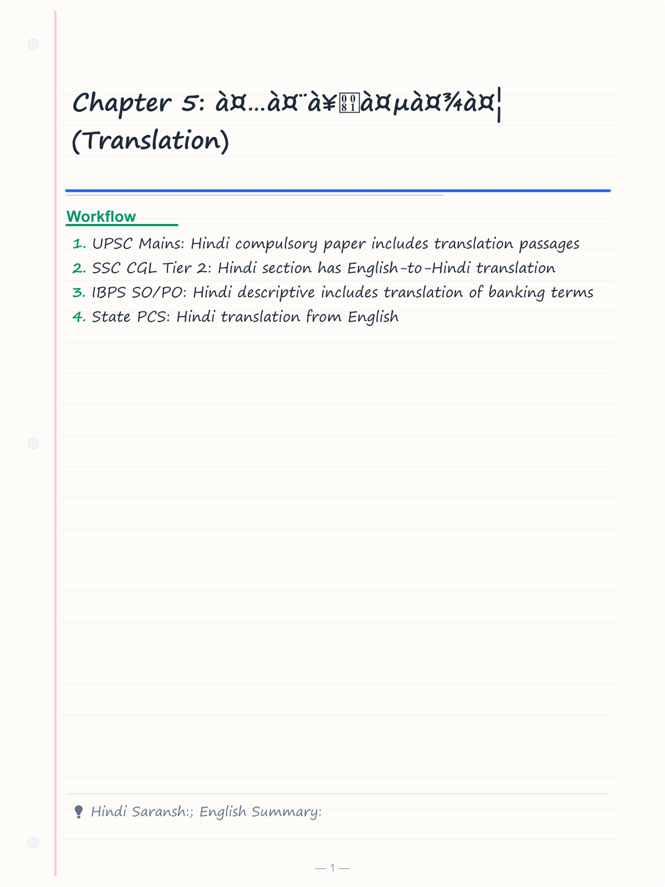
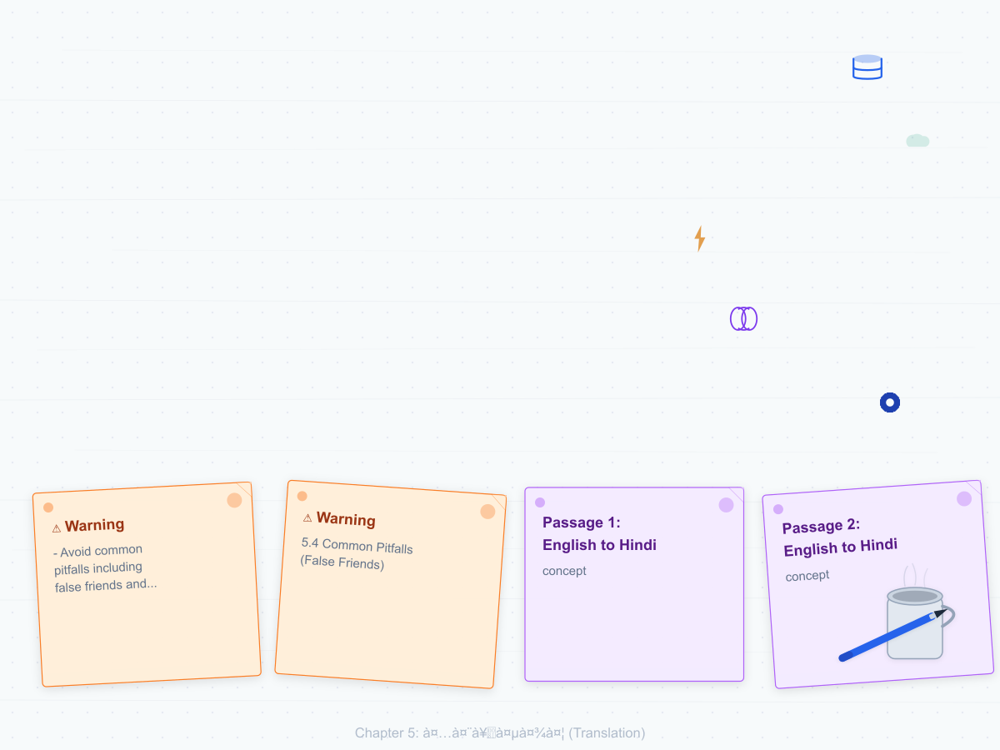
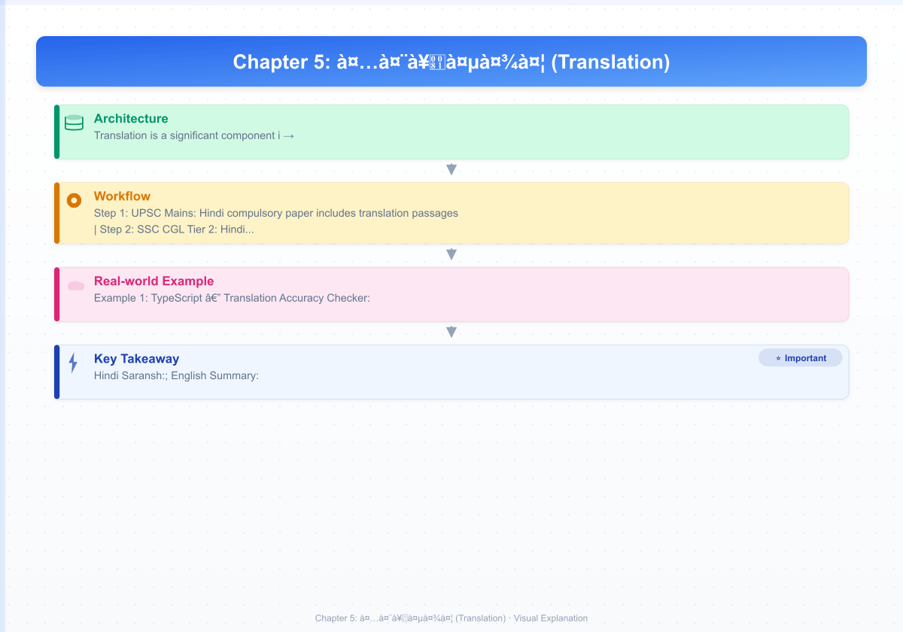
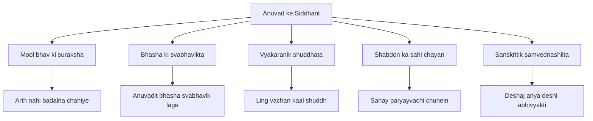

# Chapter 5: अनुवाद (Translation)

## Learning Objectives

By the end of this chapter, you will be able to:
- Apply translation rules for English-to-Hindi and Hindi-to-English conversion
- Avoid common pitfalls including false friends and cultural mismatches
- Translate technical banking and government terminology accurately
- Handle idiomatic expressions and nuanced meanings in both directions
- Use government-approved Hindi translation guidelines for official documents

<!-- Image Gallery -->
<section class="lesson-visuals" aria-label="Visual learning resources">
  <header><span>VISUAL LEARNING</span><h2>See it. Review it. Remember it.</h2></header>
  <a class="lesson-visual-card" href="../../assets/images/lessons/hindi-language/05-hindi-translation/handwritten-notes.png" target="_blank" rel="noopener">
    
    <span><strong>Handwritten notes</strong>Condensed notes for deliberate review.</span>
  </a>
  <a class="lesson-visual-card" href="../../assets/images/lessons/hindi-language/05-hindi-translation/sticky-notes.png" target="_blank" rel="noopener">
    
    <span><strong>Sticky-note revision</strong>Fast recall prompts for revision.</span>
  </a>
  <a class="lesson-visual-card" href="../../assets/images/lessons/hindi-language/05-hindi-translation/visual-explanation.png" target="_blank" rel="noopener">
    
    <span><strong>Visual concept guide</strong>A connected explanation of the key ideas.</span>
  </a>
</section>
<!-- End Image Gallery -->

---

## Theory

### 5.1 Translation in Government Exams

Translation is a significant component in:
- UPSC Mains: Hindi compulsory paper includes translation passages
- SSC CGL Tier 2: Hindi section has English-to-Hindi translation
- IBPS SO/PO: Hindi descriptive includes translation of banking terms
- State PCS: Hindi translation from English
- Translation exams: Central Translation Bureau, Ministry of Home Affairs

### 5.2 अनुवाद के सिद्धांत (Principles of Translation)



| Principle | English | Hindi Explanation |
|-----------|---------|-------------------|
| Fidelity | Faithfulness | Mool lekhan ke arth aur bhav ko banaaye rakhein |
| Readability | Natural flow | Anuvadit bhasha svabhavik aur saral lage |
| Accuracy | Correctness | Shabdon aur vyakaran ki shuddhta |
| Context | Context-sensitive | Sandarbh ke anusaar shabdon ka chayan |

### 5.3 English-to-Hindi Translation Rules

#### A. सर्वनाम (Pronouns)

| English | Hindi |
|---------|-------|
| I | Main |
| You (formal) | Aap |
| You (informal) | Tum / Tu |
| He / She / It | Vah |
| We | Hum |
| They | Ve / Vah log |
| This | Yah |
| That | Vah |
| These | Yeh |
| Those | Vah |

#### B. काल का अनुवाद (Tense Translation)

| English Tense | Hindi Equivalent | Example EN → HI |
|---------------|------------------|-----------------|
| Simple Present | Samanya Vartman | I eat → Main khata hoon |
| Present Continuous | Apurn Vartman | I am eating → Main kha raha hoon |
| Present Perfect | Purna Vartman | I have eaten → Maine kha liya hai |
| Simple Past | Samanya Bhoot | I ate → Maine khaya |
| Past Continuous | Apurn Bhoot | I was eating → Main kha raha tha |
| Simple Future | Samanya Bhavishya | I will eat → Main khaunga |
| Present Perfect Cont. | Poori Vartman | I have been eating → Main kha raha hoon (since/for se) |

#### C. वाच्य का अनुवाद (Voice Translation)

- Active to Passive: Karak vibhakti change karein
- "Subject + Verb + Object" → "Subject + se + Object + Verb (with jaana)"
- Example: "Ram eats food" → "Ram se khaana khaaya jaata hai"

#### D. क्रिया विशेषण का स्थान (Adverb Placement)

| English | Hindi |
|---------|-------|
| He ran quickly | Vah tez bhaga |
| I always speak truth | Main hamesha sach bolta hoon |
| She sings beautifully | Vah khoobsurat gaati hai |

#### E. संबंधसूचक शब्द (Relative Clauses)

| English | Hindi | Example |
|---------|-------|---------|
| Who | Jo | The man who came → Jo aadmi aaya |
| Which | Jo | The book which I read → Jo kitab maine padi |
| That | Ki | I know that... → Main janta hoon ki... |
| Where | Jahan | The place where → Vah sthan jahan |

### 5.4 Common Pitfalls (False Friends)

| English Word | Wrong Hindi Translation | Correct Hindi Translation |
|-------------|------------------------|--------------------------|
| Actual | Vastavik (not actual) | Asal / Vastavik |
| Demand | Maang (not demand) | Maang |
| Concern | Chinta / Vishay (not concern) | Chinta / Sarokar |
| Faculty | Sanskaya (not faculty) | Kaushal / Shikshak varg |
| Candidate | Umedvaar (not candidate) | Umedvaar (correct, but use pratyashi) |
| Liberal | Udarvadi (not liberal) | Udar |
| Issue | Mudda / Sankhya (not issue) | Mudda / Masla |
| Patent | Spast (not patent) | Patent / Swamitv-adhikar |
| Sympathy | Samvedna (not sympathy) | Sahaanubhuti |
| Decent | Shali (not decent) | Shisht / Saujanya |
| Fabric | Kapda (not fabric) | Kapra / Vastra |
| Vagabond | Awaara (correct) | Awaara / Ghoomne wala |
| Chapel | Chhota girjaghar (not chapel) | Prarthna ghar |
| Saloon | Salon (not saloon) | Hair-cutting salon |

### 5.5 Translation of Technical/Banking Terminology

| English Banking Term | Hindi Translation |
|---------------------|------------------|
| ATM (Any Time Money) | Aam Taka Mudra (ATM) |
| Deposit | Jama |
| Withdrawal | Nikaasi |
| Balance | Sheesh |
| Interest | Byaaj |
| Principal | Mooladhan |
| Loan | Rinn / Karza |
| Credit | Jamaa |
| Debit | Nikaasi |
| Cheque | Chek |
| Overdraft | Seematik Avnati |
| Fixed Deposit | Samay Nidhi |
| Recurring Deposit | Aavritti Jama |
| Savings Account | Bachat Khata |
| Current Account | Chalu Khata |
| Foreign Exchange | Videshi Vinimay |
| Letter of Credit | Mudra Patr |
| Bill of Exchange | Binimay Patr |
| Promissory Note | Saangya Patr |
| Lockers | Suvidha koshika |

| English Banking Term | Hindi Translation |
|---------------------|------------------|
| Monetary Policy | Mudra Niti |
| Fiscal Policy | Rajkosh Niti |
| Inflation | Mudrasfiti |
| Deflation | Avamudrasfiti |
| GDP | S. Gha. Ua. |
| NPA (Non-Performing Asset) | Aanuvatrik Sampati |
| Repo Rate | Punar Kray Dar |
| Reverse Repo | Punar Kray Viprit |
| Cash Reserve Ratio (CRR) | Nakad Ajeevi Anupat |
| Statutory Liquidity Ratio (SLR) | Vaidhanik Taralata Anupat |
| Wholesale Price Index (WPI) | Thauk Mulya Suchkanak |
| Consumer Price Index (CPI) | Upbhokta Mulya Suchkanak |
| Gross Budgetary Support | Sanyukt Budgetari Sahayata |
| Money Supply | Mudra Aapoorti |

### 5.6 Government/Official Translation Guidelines

| English Term | Official Hindi Equivalent |
|-------------|--------------------------|
| Department | Vibhag |
| Ministry | Mantralay |
| Government | Sarkar |
| Notification | Adhisoochana |
| Resolution | Sankalp |
| Bill | Vidheyak |
| Act | Adhiniyam |
| Rules | Niyam |
| Regulation | Viniyama |
| Policy | Neeti |
| Scheme | Yojana |
| Committee | Samiti |
| Commission | Aayog |
| Authority | Pradhikaran |
| Board | Board (accepted) |
| Secretary | Sachiv |
| Director | Nideshak |
| Commissioner | Aayukt |
| Officer | Adhikari |
| Assistant | Sahayak |
| Section Officer | Khand Adhikari |

### 5.7 Hindi-to-English Translation for Comprehension

| Hindi Structure | English Equivalent |
|-----------------|-------------------|
| Mujhe jana hai | I have to go |
| Mujhe maloom hai | I know |
| Maine suna hai | I have heard |
| Aisa nahi hai | It is not so |
| Kya aap bata sakte hain? | Can you tell? |
| Iska matlab | This means |
| Jaise ki hum jante hain | As we know |
| Yeh bataya gaya hai | It has been stated |
| Vicharadheen hai | Is under consideration |
| Avashyak karyvahi hetu | For necessary action |

### 5.8A तकनीकी अनुवाद: IT और कंप्यूटर शब्दावली (Technical Translation: IT Terms)

| English Term | Hindi Translation | Usage |
|-------------|------------------|-------|
| Software | सॉफ़्टवेयर / क्रमांकित प्रोग्राम | कंप्यूटर सॉफ़्टवेयर स्थापित करें |
| Hardware | हार्डवेयर / भौतिक उपकरण | हार्डवेयर की मरम्मत कराएँ |
| Operating System | संचालन प्रणाली / ओएस | विंडोज संचालन प्रणाली है |
| Database | डेटाबेस / आँकड़ा आधार | ग्राहक डेटाबेस अपडेट करें |
| Network | नेटवर्क / संजाल | कार्यालय संजाल सुरक्षित है |
| Server | सर्वर / सेवक | सर्वर डाउन हो गया |
| Email | ईमेल / विद्युत पत्र | ईमेल भेज दिया गया है |
| Cloud Computing | क्लाउड कंप्यूटिंग / मेघ संगणन | मेघ संगणन से डेटा सुरक्षित |
| Artificial Intelligence | कृत्रिम बुद्धिमत्ता | AI से कार्य स्वचालित |
| Cyber Security | साइबर सुरक्षा | साइबर सुरक्षा बढ़ाएँ |
| Encryption | कूटलेखन / एन्क्रिप्शन | डेटा कूटलेखन अनिवार्य है |
| Firewall | फायरवॉल / अग्निरोधक | फायरवॉल सक्रिय करें |

### 5.8B अनुवाद में सामान्य मुहावरों के समतुल्य (Common English Idioms with Hindi Equivalents)

| English Idiom | Literal Translation | Hindi Equivalent |
|---------------|-------------------|------------------|
| A blessing in disguise | भेष में वरदान | नुकसान में भी लाभ |
| Actions speak louder than words | कर्म शब्दों से ज़ोरदार | बातों से नहीं, कामों से पहचान |
| Better late than never | देर से सही, पर कभी नहीं से अच्छा | देर आए दुरुस्त आए |
| Don't count your chickens before they hatch | अंडे न गिनें पहले | अभी से जयजयकार न करो |
| Every cloud has a silver lining | हर बादल में चाँदी की परत | निराशा में भी आशा का किरण |
| Fortune favors the brave | भाग्य बहादुरों का साथ देता है | साहसी को ही सफलता मिलती है |
| Honesty is the best policy | ईमानदारी सबसे अच्छी नीति | सच्चाई की हमेशा जीत |
| Practice makes perfect | अभ्यास परिपूर्ण बनाता है | करत-करत अभ्यास के |
| Rome was not built in a day | रोम एक दिन में नहीं बना | कोई काम रातों-रात नहीं होता |
| Where there is a will, there is a way | जहाँ चाह वहाँ राह | ठान लो तो राह निकल ही आती है |

### 5.8 Idioms Translation (Muhavaron ka Anuvad)

| English Idiom | Hindi Equivalent |
|---------------|------------------|
| Apple of my eye | Aankhon ka taara |
| Add insult to injury | Kangan mein aata geela / Ghaav par namak chidakna |
| At the eleventh hour | Aakhri samay par |
| Bite the bullet | Mushkil kaam se dar nahi marna |
| Break the ice | Khoob - shuru karna |
| Burn the midnight oil | Der raat tak padhna |
| Cry over spilt milk | Pachtave ka kya labh |
| Hit the nail on the head | Sahi nishana lagana |
| Kill two birds with one stone | Ek teer se do nishane |
| Let sleeping dogs lie | Soi hui naag ko na chhedo |
| Once in a blue moon | Kabhi-kabhi / bahut kam |
| Piece of cake | Bahut aasaan |
| Spill the beans | Raj khul jana |
| The ball is in your court | Ab tumhari bari hai |
| When pigs fly | Kabhi nahi |

---

## Examples

### Example 1: TypeScript — Translation Accuracy Checker

```typescript
interface Translation {
  sourceText: string;
  sourceLang: "en" | "hi";
  targetText: string;
  targetLang: "hi" | "en";
  accuracyScore: number;
  errors: string[];
}

class TranslationChecker {
  // Check if all source words appear in translation (simplified)
  checkAccuracy(translation: Translation): Translation {
    const sourceWords = translation.sourceText.toLowerCase().split(" ");
    const targetWords = translation.targetText.toLowerCase().split(" ");
    const errors: string[] = [];

    // Simplified check — look for common errors
    if (translation.sourceLang === "en" && translation.targetLang === "hi") {
      if (!translation.targetText.includes("hai") &&
          translation.sourceText.includes("is"))
        errors.push("'is' ka anuvad 'hai' se hona chahiye");
      if (translation.sourceText.includes("the") &&
          !/[a-zA-Z]/.test(translation.targetText[0]))
        errors.push("'the' ka Hindi anuvad sandarbh anusaar karein");
    }

    translation.errors = errors;
    translation.accuracyScore = errors.length === 0 ? 95 : 70;
    return translation;
  }
}

const checker = new TranslationChecker();
const result = checker.checkAccuracy({
  sourceText: "The sun rises in the east",
  sourceLang: "en",
  targetText: "Surya poorv mein ugta hai",
  targetLang: "hi",
  accuracyScore: 0,
  errors: []
});
console.log("Accuracy:", result.accuracyScore);
console.log("Errors:", result.errors);
```

### Example 2: TypeScript — Banking Term Translator

```typescript
interface Term {
  en: string;
  hi: string;
  description: string;
}

const bankingTerms: Term[] = [
  { en: "Monetary Policy", hi: "Mudra Niti",
    description: "RBI dwara mool mudra aapoorti aur byaaj dar ka niyaman" },
  { en: "Inflation", hi: "Mudrasfiti",
    description: "Vastuon aur sewaon ke moolya mein vriddhi" },
  { en: "Repo Rate", hi: "Punar Kray Dar",
    description: "RBI bankon ko jo dar par rinn deta hai" },
  { en: "Cash Reserve Ratio", hi: "Nakad Ajeevi Anupat",
    description: "Bankon ki jam lekar rakhi jane wali nakad ka anupat" },
  { en: "GDP", hi: "Sanyukt Ghatak Utpad",
    description: "Desh ke kul utpadan ka maap" },
  { en: "NPA", hi: "Anuvartik Sampati",
    description: "Vah rinn jo 90 dinon se adhik beja ho" },
  { en: "Balance of Payments", hi: "Bhugtan Shesh",
    description: "Desh ke aantrashtriya len-den ka lekha" },
  { en: "Fiscal Deficit", hi: "Rajkosh Ghat",
    description: "Sarkar ke kul vyaya aur aay ke beech antar" },
  { en: "Dear Money", hi: "Mahangi Mudra",
    description: "Uchch byaaj dar ki mudra neeti" },
  { en: "Cheap Money", hi: "Sasti Mudra",
    description: "Kam byaaj dar ki mudra neeti" },
];

function translateBankingTerm(enTerm: string): Term | null {
  return bankingTerms.find(t => t.en.toLowerCase() === enTerm.toLowerCase()) ?? null;
}

function getHindiGlossary(): Record<string, string> {
  const glossary: Record<string, string> = {};
  bankingTerms.forEach(t => glossary[t.en] = t.hi);
  return glossary;
}

console.log("Repo Rate:", translateBankingTerm("Repo Rate")?.hi);
console.log("NPA:", translateBankingTerm("NPA")?.hi);
console.log("Full glossary entries:", Object.keys(getHindiGlossary()).length);
```

### Example 3: TypeScript — Tense-Aware Translator

```typescript
type Tense = "present" | "past" | "future";

function translateTense(englishVerb: string, tense: Tense, subject: "I" | "you" | "he" | "she" | "we" | "they"): string {
  const verbRoot = englishVerb; // simplified
  const subjectMap: Record<string, string> = {
    "I": "Main", "you": "Aap", "he": "Vah", "she": "Vah",
    "we": "Ham", "they": "Ve"
  };

  const hiSubject = subjectMap[subject];
  const suffixMap: Record<Tense, Record<string, string>> = {
    "present": { "I": "ta hoon", "you": "te hain", "he": "ta hai", "she": "ti hai",
                 "we": "te hain", "they": "te hain" },
    "past": { "I": "a", "you": "e", "he": "a", "she": "i",
              "we": "e", "they": "e" },
    "future": { "I": "unga", "you": "enge", "he": "ega", "she": "egi",
                "we": "enge", "they": "enge" }
  };

  return `${hiSubject} ${verbRoot}${suffixMap[tense][subject]}`;
}

console.log(translateTense("padh", "present", "he"));  // Vah padhta hai
console.log(translateTense("padh", "past", "she"));    // Vah padhi
console.log(translateTense("padh", "future", "they")); // Ve padhenge
```

### Example 4: TypeScript — Government Term Mapper

```typescript
interface GovTerm {
  en: string;
  hi: string;
  category: string;
}

const govTerms: GovTerm[] = [
  { en: "Department", hi: "Vibhag", category: "organization" },
  { en: "Ministry", hi: "Mantralay", category: "organization" },
  { en: "Secretary", hi: "Sachiv", category: "designation" },
  { en: "Commissioner", hi: "Aayukt", category: "designation" },
  { en: "Director", hi: "Nideshak", category: "designation" },
  { en: "Scheme", hi: "Yojana", category: "policy" },
  { en: "Policy", hi: "Neeti", category: "policy" },
  { en: "Notification", hi: "Adhisoochana", category: "document" },
  { en: "Committee", hi: "Samiti", category: "body" },
  { en: "Commission", hi: "Aayog", category: "body" },
  { en: "Resolution", hi: "Sankalp", category: "document" },
  { en: "Rules", hi: "Niyam", category: "document" },
  { en: "Bill", hi: "Vidheyak", category: "legal" },
  { en: "Act", hi: "Adhiniyam", category: "legal" },
  { en: "Amendment", hi: "Sanshodhan", category: "legal" },
];

function enToHi(word: string): string {
  const t = govTerms.find(t => t.en.toLowerCase() === word.toLowerCase());
  return t ? t.hi : "Translation not found";
}

function hiToEn(word: string): string {
  const t = govTerms.find(t => t.hi === word);
  return t ? t.en : "Translation not found";
}

console.log("Department:", enToHi("Department"));
console.log("Vidheyak:", hiToEn("Vidheyak"));
console.log("Legal terms:", govTerms.filter(t => t.category === "legal").map(t => `${t.en} → ${t.hi}`));
```

### Example 5: TypeScript — False Friend Detector

```typescript
interface FalseFriend {
  word: string;
  wrongTranslation: string;
  correctTranslation: string;
  explanation: string;
}

const falseFriends: FalseFriend[] = [
  {
    word: "actual",
    wrongTranslation: "actual (not in Hindi sense)",
    correctTranslation: "vastavik / asal",
    explanation: "Actual = asal, vastavik. 'Actual' ko 'act' se na jodein."
  },
  {
    word: "demand",
    wrongTranslation: "dam lagana",
    correctTranslation: "maang / upayog",
    explanation: "Demand = maang, 'demand' ka atyadhik prayog na karein."
  },
  {
    word: "concern",
    wrongTranslation: "concentrate",
    correctTranslation: "chinta / vishay / sambandh",
    explanation: "Concern = chinta ya vishay, 'concentrate' nahi."
  },
  {
    word: "liberal",
    wrongTranslation: "liberal (politically charged)",
    correctTranslation: "udar / sawatantra",
    explanation: "Liberal = udar, not political 'liberal'."
  },
  {
    word: "patent",
    wrongTranslation: "patent (spast)",
    correctTranslation: "swamitv-adhikar / patant",
    explanation: "Patent = aavishkar ka adhikar, not 'spast'."
  },
  {
    word: "sympathy",
    wrongTranslation: "sympathi (like kisi ki sympathy)",
    correctTranslation: "sahaanubhuti / samvedna",
    explanation: "Sympathy = sahaanubhuti, 'sympathi' nahi."
  },
];

function detectFalseFriend(englishWord: string): FalseFriend | null {
  return falseFriends.find(f => f.word === englishWord.toLowerCase()) ?? null;
}

console.log("Check 'liberal':", detectFalseFriend("liberal")?.correctTranslation);
console.log("Check 'patent':", detectFalseFriend("patent")?.correctTranslation);
console.log("Total false friends:", falseFriends.length);
```

### Example 5B: TypeScript — Technical Term Translator

```typescript
interface TechnicalTerm {
  en: string;
  hi: string;
  category: string;
}

const techTerms: TechnicalTerm[] = [
  { en: "Software", hi: "सॉफ़्टवेयर", category: "IT" },
  { en: "Hardware", hi: "हार्डवेयर", category: "IT" },
  { en: "Network", hi: "संजाल", category: "IT" },
  { en: "Database", hi: "आँकड़ा आधार", category: "IT" },
  { en: "Cloud Computing", hi: "मेघ संगणन", category: "IT" },
  { en: "Artificial Intelligence", hi: "कृत्रिम बुद्धिमत्ता", category: "IT" },
  { en: "Encryption", hi: "कूटलेखन", category: "security" },
  { en: "Firewall", hi: "अग्निरोधक", category: "security" },
  { en: "Server", hi: "सेवक", category: "IT" },
  { en: "Email", hi: "विद्युत पत्र", category: "communication" },
];

function translateTechTerm(term: string): string {
  const found = techTerms.find(t => t.en.toLowerCase() === term.toLowerCase());
  return found ? found.hi : "अनुवाद उपलब्ध नहीं";
}

function listByCategory(cat: string): TechnicalTerm[] {
  return techTerms.filter(t => t.category === cat);
}

console.log(translateTechTerm("Firewall")); // अग्निरोधक
console.log("IT terms:", listByCategory("IT").map(t => `${t.en} → ${t.hi}`));
```

### Example 5C: TypeScript — Idiom Translator

```typescript
interface IdiomEntry {
  english: string;
  hindiEquivalent: string;
  literalTranslation: string;
}

const idiomDict: IdiomEntry[] = [
  { english: "Actions speak louder than words", hindiEquivalent: "बातों से नहीं, कामों से पहचान", literalTranslation: "कर्म शब्दों से ज़ोरदार होते हैं" },
  { english: "Better late than never", hindiEquivalent: "देर आए दुरुस्त आए", literalTranslation: "देर से सही, पर कभी नहीं से अच्छा" },
  { english: "Where there is a will, there is a way", hindiEquivalent: "जहाँ चाह वहाँ राह", literalTranslation: "जहाँ इच्छा है, वहाँ रास्ता है" },
  { english: "Practice makes perfect", hindiEquivalent: "करत-करत अभ्यास के", literalTranslation: "अभ्यास परिपूर्ण बनाता है" },
  { english: "Every cloud has a silver lining", hindiEquivalent: "निराशा में भी आशा का किरण", literalTranslation: "हर बादल में चाँदी की परत" },
];

function translateIdiom(englishIdiom: string): IdiomEntry | null {
  return idiomDict.find(i => i.english.toLowerCase().includes(englishIdiom.toLowerCase())) ?? null;
}

console.log(translateIdiom("Practice makes perfect")?.hindiEquivalent);
```

### Examples 6-20: Translation Passages

<details>
<summary>View 15 Translation Passages with Analysis</summary>

**Passage 1: English to Hindi**
"The Indian economy has shown remarkable resilience in the face of global challenges."
Translation: "Vaishvik chunautiyon ke baavjood bhartiya arthvyavastha ne ullekhniya lagi to dikhayi hai."
Analysis: Tense change (present perfect in EN, present in HI is acceptable). "Ullekhniya" = remarkable.

**Passage 2: English to Hindi**
"Inflation is the rate at which the general level of prices for goods and services is rising."
Translation: "Mudrasfiti vah dar hai jis per vastuon aur sewaon ke samanya mool star mein vriddhi hoti hai."
Analysis: "Rate at which" → "vah dar jis per" — relative clause correctly handled.

**Passage 3: English to Hindi**
"The Reserve Bank of India (RBI) is the central bank of the country."
Translation: "Bhartiya Reserve Bank (RBI) desh ka kendriya bank hai."
Analysis: RBI remains same; "central bank" → "kendriya bank" — accepted usage.

**Passage 4: Hindi to English**
"Bharat ki sanskriti vishva ki sabase prachin sanskritiyon mein se ek hai."
Translation: "Indian culture is one of the oldest cultures in the world."
Analysis: "Sabase prachin" → "the oldest" — superlative correctly translated.

**Passage 5: English to Hindi**
"The government has launched several schemes for the welfare of farmers."
Translation: "Sarkar ne kisanon ke kalyan ke liye anek yojnaye shuru ki hain."
Analysis: Passive voice replaced with active; "welfare" → "kalyan" — correct.

**Passage 6: English to Hindi**
"Digital payments have revolutionized India's financial landscape."
Translation: "Digital bhungtaano ne bharat ke vitiy paridrishya mein krantikari parivartan kar diya hai."
Analysis: "Revolutionized" → "krantikari parivartan" — faithful.

**Passage 7: Hindi to English**
"Jal sanrakshan har nagrik ka kartavy hai."
Translation: "Water conservation is the duty of every citizen."
Analysis: Simple N → is; correctly translated.

**Passage 8: English to Hindi**
"Each one of us must contribute to the nation's progress."
Translation: "Hamein se pratyek ko rashtra ki pragati mein yogdan dena chahiye."
Analysis: "Each one of us" → "Hamein se pratyek" — accurate.

**Passage 9: English to Hindi**
"The new education policy aims to transform the Indian education system."
Translation: "Nai shiksha neeti ka uddeshya bhartiya shiksha pranali mein parivartan lana hai."
Analysis: "Aims to" → "uddeshya ... lana hai" — correct infinitive use.

**Passage 10: Hindi to English**
"Yadi baarish samay per nahi hoti to faslein kharab ho jayengi."
Translation: "If it does not rain on time, the crops will be damaged."
Analysis: Conditional sentence correctly translated.

**Passage 11: English to Hindi (Banking Context)**
"The bank has reduced its lending rate by 25 basis points."
Translation: "Bank ne apne rinn dar mein 25 basis point ki kami ki hai."
Analysis: "Lending rate" → "rinn dar"; "basis points" remains same (accepted).

**Passage 12: English to Hindi**
"Climate change poses a serious threat to biodiversity."
Translation: "Jalvayu parivartan jiv vividhata ke liye gambhir khatra paida karta hai."
Analysis: "Biodiversity" → "jiv vividhata" — correct technical term.

**Passage 13: Hindi to English**
"Aapke patra dinank 15 August 2026 ke sandarbh mein..."
Translation: "With reference to your letter dated 15 August 2026..."
Analysis: Office correspondence correctly translated.

**Passage 14: English to Hindi (Government)**
"The undersigned is directed to convey the approval of the competent authority."
Translation: "Adhosathak ko pradhikari pradhikaran ki anumanjuri vyakt karne ka nirdesh diya gaya hai."
Analysis: Official tone maintained; "competent authority" → "pradhikari pradhikaran."

**Passage 15: English to Hindi (Literature)**
"It was the best of times, it was the worst of times."
Translation: "Vah samay sabase achha tha, vah samay sabase bura tha."
Analysis: Parallel structure maintained.

</details>

---

## Summary

**Hindi Saransh:**
- Anuvad ke teen mool siddhant hain: Fidelity (arth ki suraksha), Readability (sahajta), Accuracy (shuddhta).
- Samanya gallatiyon mein "false friends" shamil hain — angrezi shabd jo Hindi mein alag arth rakhte hain.
- Banking aur sarkari shabdon ke liye mank Hindi shabdon ko yaad karna avashyak hai.
- Krim (Tense) aur vachy (Voice) ka anuvad karte samay dhyan dena hoga.
- Muhavaron ka anuvad shabdasah anuvad se na karke, samarthak Hindi muhavare ka upyog karna chahiye.
- Sarkari anuvad mein bhasha vyakaranik roop se shuddh aur sthayi shaily mein honi chahiye.

**English Summary:**
- Three core principles of translation: Fidelity (meaning preservation), Readability (natural flow), Accuracy (correctness).
- Common pitfalls include false friends — English words with different meanings in Hindi.
- Banking and government terminology requires memorization of standard Hindi equivalents.
- Tense and voice must be carefully mapped between English and Hindi.
- Idioms should be translated by equivalent expressions, not word-for-word.
- Official translation must follow standard Hindi administrative style and grammatical precision.

## Practical Takeaways

1. False friends awareness: "Sympathy" ≠ "sympathi", "Patent" ≠ "spast" — learn the 20 most common false friends.
2. Banking terms: Master the 30 key terms (Repo, CRR, SLR, NPA) in both languages.
3. Government formats: Learn the standard opening and closing phrases: "With reference to..." → "Sandarbh mein...", "The undersigned..." → "Adhosathak...".
4. Tense mapping: English present perfect (have/has + V3) → Hindi Purna Vartman (V+ liya hai).
5. Idioms: For "once in a blue moon", don't translate literally — use "Kabhi-kabhi" or "Bade dinon baad".

## Chapter Quiz

**Q1.** Anuvad ka sabase mahatvapurn siddhant hai:
a) Shabdasah anuvad b) Mool bhav ki suraksha c) Lamba anuvad d) Kavyatmak bhasha
<details><summary>Answer</summary>b) Mool bhav ki suraksha (fidelity/preservation of meaning)</details>

**Q2.** "Demand" ka sahi Hindi anuvad kya hai?
a) Dam lagana b) Maang c) Demand d) Aavashyakta
<details><summary>Answer</summary>b) Maang</details>

**Q3.** "Repo Rate" ka Hindi shabd kya hai?
a) Repo Dar b) Punar Kray Dar c) Byaaj Dar d) Rin Dar
<details><summary>Answer</summary>b) Punar Kray Dar</details>

**Q4.** "Once in a blue moon" ka sahi anuvad kya hai?
a) Ek baar nile chand par b) Kabhi-kabhi / Bade dinon baad c) Chand ki tarah d) Nila chand
<details><summary>Answer</summary>b) Kabhi-kabhi / Bade dinon baad (idiom, not literal)</details>

**Q5.** Angrezi "present perfect" ka Hindi mein sahi anuvad hai:
a) Main kha raha hoon b) Maine khaya hai c) Main khaunga d) Main khata hoon
<details><summary>Answer</summary>b) Maine khaya hai (Purna Vartman)</details>

---

## Exercises

### Passage Translation (Q1-Q10)

**Translate to Hindi:**
1. "The Earth revolves around the Sun."
2. "India is the largest democracy in the world."
3. "Hard work is the key to success."
4. "The RBI governor announced a cut in the repo rate by 0.25%."
5. "Empowering women is essential for the progress of any nation."

**Translate to English:**
6. "Hamein paryavaran ki suraksha ke liye milkar kaam karna hoga."
7. "Shiksha har vyakti ka maulik adhikar hai."
8. "Aatmanirbhar Bharat abhiyan ke tahat anek yojnaye shuru ki gayin."
9. "Yadi hum mehnat karein to safalta avashya milegi."
10. "Bharatiya arthvyavastha tej gati se age badh rahi hai."

### Banking Terminology (Q11-Q15)
Translate these terms to Hindi:
11. Cash Reserve Ratio
12. Statutory Liquidity Ratio
13. Non Performing Asset
14. Monetary Policy Committee
15. Fixed Deposit

### False Friend Correction (Q16-Q20)
Correct the wrong translations:
16. "I have sympathy for you." → "Mujhe tumse sympathy hai."
17. "This is a patent issue." → "Yah ek patent mudda hai."
18. "He is a liberal thinker." → "Vah liberal vichardhara ka hai."
19. "She is decent." → "Vah decent hai."
20. "What is your concern?" → "Tumhara concern kya hai?"

### Government Terms (Q21-Q25)
Translate to Hindi:
21. Department of Education
22. Finance Ministry
23. Secretary cum Director
24. Standing Committee
25. Draft Notification

### English-to-Hindi Idioms (Q26-Q30)
Find the Hindi equivalent:
26. Apple of my eye
27. Burn the midnight oil
28. Kill two birds with one stone
29. Add insult to injury
30. The ball is in your court

### Answer Key

**Q1-Q10 (Passages):**
1. Prithvi suraj ke charon or ghoomti hai.
2. Bharat vishv ka sabase bada loktantra hai.
3. Mehnat safalta ki kunjee hai.
4. RBI governor ne repo dar mein 0.25% ki katooni ki ghoshana ki.
5. Mahilaon ko sashakt karna kisi bhi rashtra ki pragati ke liye avashyak hai.
6. We must work together to protect the environment.
7. Education is a fundamental right of every person.
8. Many schemes have been launched under the Atmanirbhar Bharat campaign.
9. If we work hard, we will definitely succeed.
10. The Indian economy is growing at a fast pace.

**Q11-Q15 (Banking):**
11. Nakad Ajeevi Anupat 12. Vaidhanik Taralata Anupat 13. Aanuvartik Sampati
14. Mudra Neeti Samiti 15. Samay Nidhi

**Q16-Q20 (False Friends):**
16. "Mujhe tumse sahaanubhuti hai."
17. "Yah ek adhikar-moolak mudda hai."
18. "Vah udar vicharon ka vyakti hai."
19. "Vah shisht (saujanya) vyavhaar rakhti hai."
20. "Tumhara vishay/uddeshya kya hai?"

**Q21-Q25 (Government):**
21. Shiksha Vibhag 22. Vitt Mantralay 23. Sachiv sahit Nideshak
24. Sthayee Samiti 25. Masuda Adhisoochana

**Q26-Q30 (Idioms):**
26. Aankhon ka taara 27. Der raat tak padhna/mehnat karna
28. Ek teer se do nishane 29. Ghaav par namak chidakna 30. Ab tumhari baari hai

### Additional Translation Practice (Q31-Q50) — Added

**Translate to Hindi (Q31-Q40):**
31. "The customer is always right."
32. "This offer is valid until stock lasts."
33. "Please find the attached invoice for your reference."
34. "The meeting has been rescheduled to next Monday."
35. "Your application has been approved."
36. "We regret to inform you that your request has been denied."
37. "The report highlights the key performance indicators."
38. "All employees are requested to attend the training session."
39. "The new policy will come into effect from 1st August."
40. "Please acknowledge receipt of this email."

**Translate to English (Q41-Q50):**
41. "कृपया अपना पासवर्ड किसी से साझा न करें।"
42. "यह अनुबंध दो वर्षों के लिए वैध है।"
43. "भारतीय अर्थव्यवस्था तीव्र गति से बढ़ रही है।"
44. "सभी कर्मचारियों को समय पर कार्यालय पहुँचना चाहिए।"
45. "इस परियोजना को अगले महीने तक पूरा करना है।"
46. "डिजिटल भुगतान ने व्यापार को सरल बना दिया है।"
47. "ग्राहक संतुष्टि हमारी प्राथमिकता है।"
48. "यह रिपोर्ट तत्काल ध्यान देने की आवश्यकता है।"
49. "हम पर्यावरण संरक्षण के लिए प्रतिबद्ध हैं।"
50. "नई तकनीक ने उत्पादन क्षमता बढ़ा दी है।"

### Additional Solved MCQs (Q31-Q40) — Added

<details>
<summary>View 10 more solved MCQs — Technical Translation, Advanced False Friends</summary>

**Q31.** "Cloud Computing" का हिंदी अनुवाद है:
a) बादल गणना  b) मेघ संगणन  c) क्लाउड कंप्यूटिंग  d) b और c दोनों

**Answer:** d) b और c दोनों (मेघ संगणन / क्लाउड कंप्यूटिंग — दोनों स्वीकार्य)

**Q32.** "Encryption" का हिंदी अनुवाद है:
a) कूटलेखन  b) सुरक्षा  c) गुप्तता  d) एन्क्रिप्शन

**Answer:** a) कूटलेखन (Encryption का मानक हिंदी शब्द)

**Q33.** "Where there is a will, there is a way" का समतुल्य हिंदी मुहावरा:
a) चाह न हो तो राह कहाँ  b) जहाँ चाह वहाँ राह  c) मन चंगा तो कठौती में गंगा  d) बनता है तो बनता है

**Answer:** b) जहाँ चाह वहाँ राह

**Q34.** "Better late than never" का हिंदी समतुल्य अनुवाद:
a) देर से सही  b) देर आए दुरुस्त आए  c) जल्दी करो  d) सही समय पर

**Answer:** b) देर आए दुरुस्त आए

**Q35.** "The customer is always right" का हिंदी अनुवाद:
a) ग्राहक हमेशा सही होता है  b) ग्राहक सही है या नहीं  c) ग्राहक सेवा  d) ग्राहक भगवान है

**Answer:** a) ग्राहक हमेशा सही होता है

**Q36.** "His attitude is liberal" में liberal का सही अनुवाद:
a) लिबरल  b) उदार  c) उदारवादी  d) स्वतंत्रता-प्रेमी

**Answer:** b) उदार (स्वभाव के संदर्भ में)

**Q37.** "Please advise" का कार्यालयी हिंदी अनुवाद:
a) कृपया सलाह दें  b) कृपया परामर्श दें  c) कोई नहीं  d) a और b दोनों

**Answer:** d) a और b दोनों

**Q38.** "Event" का उपयुक्त हिंदी अनुवाद (संदर्भानुसार):
a) घटना  b) कार्यक्रम  c) समारोह  d) उपर्युक्त सभी

**Answer:** d) उपर्युक्त सभी

**Q39.** "अनुबंध" का अंग्रेज़ी अनुवाद है:
a) Contract  b) Agreement  c) Treaty  d) All of the above

**Answer:** d) All of the above

**Q40.** "प्रतिबद्ध" का अंग्रेज़ी अनुवाद:
a) Dedicated  b) Committed  c) Devoted  d) All of the above

**Answer:** d) All of the above

</details>

### Answer Key for Additional Passages (Q31-Q50)

**Q31-Q40 (Hindi Translation):**
31. ग्राहक हमेशा सही होता है। 32. यह ऑफर स्टॉक समाप्त होने तक वैध है। 33. कृपया संलग्न चालान देखें। 34. बैठक अगले सोमवार को पुनर्निर्धारित की गई है। 35. आपका आवेदन स्वीकृत हो गया है। 36. हमें खेद है कि आपका अनुरोध अस्वीकृत किया गया है। 37. रिपोर्ट मुख्य प्रदर्शन संकेतकों को उजागर करती है। 38. सभी कर्मचारियों से प्रशिक्षण सत्र में भाग लेने का अनुरोध है। 39. नई नीति 1 अगस्त से प्रभावी होगी। 40. कृपया इस ईमेल की प्राप्ति की पुष्टि करें।

**Q41-Q50 (English Translation):**
41. Please do not share your password with anyone. 42. This contract is valid for two years. 43. The Indian economy is growing at a rapid pace. 44. All employees must reach the office on time. 45. This project has to be completed by next month. 46. Digital payments have simplified business. 47. Customer satisfaction is our priority. 48. This report requires urgent attention. 49. We are committed to environmental protection. 50. The new technology has increased production efficiency.

## Exam-Oriented Tips for Translation

### परीक्षा-वार अनुवाद रणनीति

| परीक्षा | अनुवाद प्रकार | अंक | तैयारी रणनीति |
|---------|-------------|-----|--------------|
| UPSC Mains | EN→HI + HI→EN | 15-20 | समसामयिक विषयों का अभ्यास |
| SSC CGL | EN→HI (Banking/Business) | 10-15 | शब्दावली और मुहावरों पर जोर |
| IBPS PO | EN→HI (Banking Terms) | 10 | 100 बैंकिंग शब्द याद करें |
| Translation Bureau | EN→HI Technical | 25-30 | सरकारी दिशानिर्देशों का अध्ययन |

### अनुवाद में अच्छे अंक के टिप्स
1. **शब्दशः अनुवाद से बचें**: भाव और संदर्भ को प्राथमिकता दें
2. **संदर्भ समझें**: एक शब्द के अलग-अलग अर्थ हो सकते हैं
3. **कार्यालयी शैली**: सरकारी अनुवाद में औपचारिक भाषा का उपयोग करें
4. **काल और वाच्य**: अंग्रेज़ी और हिंदी में काल और वाच्य का सही मिलान करें
5. **False Friends से सावधान**: "Sympathy", "Patent", "Actual" जैसे शब्दों के सही अर्थ जानें

### Quick Revision Checklist
- [ ] 100+ सरकारी और बैंकिंग शब्द याद करें
- [ ] 20+ False Friends के सही अर्थ जानें
- [ ] 15+ अंग्रेज़ी मुहावरों के हिंदी समतुल्य सीखें
- [ ] IT और तकनीकी शब्दावली (20 शब्द) याद करें
- [ ] प्रतिदिन 2-3 अनुच्छेद का अनुवाद अभ्यास करें
- [ ] पिछले वर्षों के अनुवाद प्रश्न हल करें