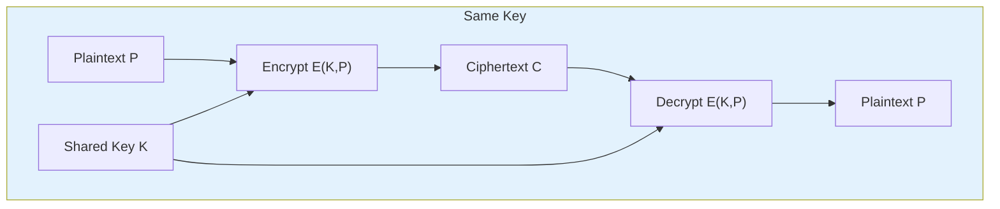
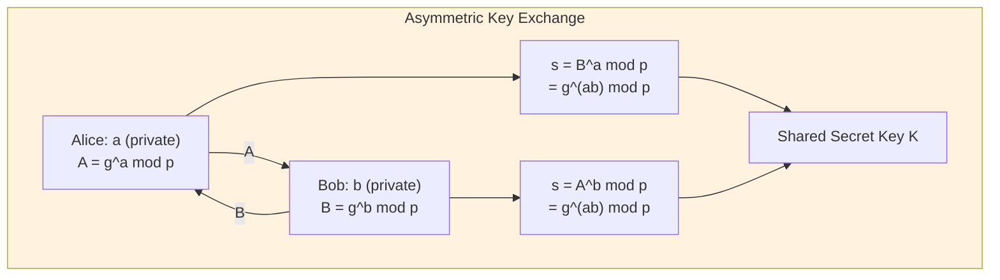
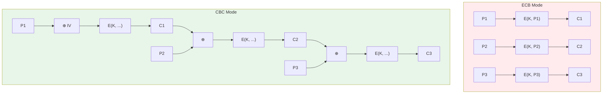
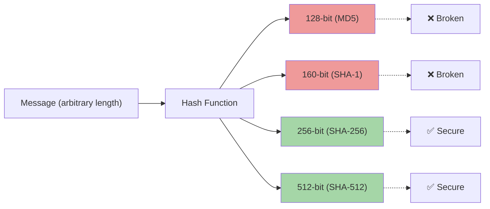

# Chapter 1: Cryptography Fundamentals

> **Exam Weightage:** 4–6 Qs in IBPS SO IT Officer Mains (Professional Knowledge — Cryptography section)
>
> **Key Topics:** Symmetric vs Asymmetric, DES, AES, RSA, Diffie-Hellman, Hash Functions, Block Cipher Modes

---

## Learning Objectives

After completing this chapter you will be able to:

- Distinguish between symmetric and asymmetric encryption across key management, performance, and use cases.
- Explain the internal architecture of DES, 3DES, and AES.
- Describe RSA key generation, encryption, and decryption using modular arithmetic.
- Walk through the Diffie-Hellman key exchange protocol and its vulnerability to MITM.
- Compare stream ciphers vs block ciphers with examples.
- Analyze ECB, CBC, CFB, OFB, and CTR modes — their strengths, weaknesses, and typical use cases.
- Identify properties and applications of hash functions (MD5, SHA-1, SHA-256).
- Solve exam-style MCQs on algorithm parameters (key sizes, block sizes, rounds).

---

## Theory

### 1.1 Symmetric Encryption

Symmetric encryption uses a **single shared secret key** for both encryption and decryption. Both sender and receiver must possess the same key, which must be securely distributed beforehand.

#### 1.1.1 DES (Data Encryption Standard)

- **Key Size:** 56 bits (64-bit key with 8 parity bits)
- **Block Size:** 64 bits
- **Rounds:** 16 Feistel rounds
- **Design:** Feistel network structure
- **Status:** Deprecated due to short key length (brute-force feasible with modern hardware)
- **Attack:** In 1999, the EFF's Deep Crack broke DES in ~22 hours; today it can be broken in minutes with FPGA clusters.

**DES Structure:**
- Initial Permutation (IP) — reorders bits
- 16 rounds of Feistel function (expansion, XOR with round key, S-box substitution, P-box permutation)
- Final Permutation (IP⁻¹) — inverse of IP
- Round key generation: 56-bit key produces sixteen 48-bit round keys

#### 1.1.2 3DES (Triple DES)

- Applies DES three times: **Encrypt–Decrypt–Encrypt (EDE)** with either two keys (112-bit) or three keys (168-bit)
- Effective security ≈ 80 bits for 2-key, ≈ 112 bits for 3-key
- **Status:** Deprecated by NIST in 2023 (phased out by 2030)
- Slower than AES due to triple pass

**3DES-EDE formula:** C = E_{K3}(D_{K2}(E_{K1}(P)))

#### 1.1.3 AES (Advanced Encryption Standard)

- **Block Size:** 128 bits (fixed)
- **Key Sizes:** 128, 192, or 256 bits
- **Rounds:** 10 (128-bit key), 12 (192-bit), 14 (256-bit)
- **Structure:** Substitution-Permutation Network (SPN), **not** Feistel
- **Algorithm:** Rijndael (designed by Daemen and Rijmen)

**AES Round Operations (per round except last):**
1. **SubBytes** — non-linear S-box substitution (16x16 lookup table)
2. **ShiftRows** — byte transposition (each row shifted left by 0,1,2,3 positions)
3. **MixColumns** — matrix multiplication over GF(2⁸); mixes each column
4. **AddRoundKey** — XOR with 128-bit round key derived via key expansion

**Security:** AES-128 requires 2¹²⁸ brute-force attempts — considered infeasible with classical computation. AES-256 is approved for TOP SECRET data by NSA.

#### 1.1.4 Comparison Table

| Feature | DES | 3DES | AES |
|---------|-----|------|-----|
| Key Size | 56 bits | 112/168 bits | 128/192/256 bits |
| Block Size | 64 bits | 64 bits | 128 bits |
| Rounds | 16 | 48 (3×16) | 10/12/14 |
| Structure | Feistel | Feistel | SPN |
| Current Status | Insecure | Deprecated | Secure (standard) |
| Speed | Slow | Very slow | Fast (hardware accelerated) |

### 1.2 Asymmetric Encryption

Asymmetric (public-key) cryptography uses a **key pair**: a public key (shared openly) and a private key (kept secret). What one encrypts, only the other can decrypt.

#### 1.2.1 RSA (Rivest–Shamir–Adleman)

**Key Generation:**
1. Choose two large primes p and q (e.g., 2048-bit modulus → p,q ≈ 1024 bits each)
2. Compute n = p × q (modulus)
3. Compute φ(n) = (p−1)(q−1) (Euler's totient)
4. Choose e such that 1 &lt; e &lt; φ(n) and gcd(e, φ(n)) = 1 (common e = 65537)
5. Compute d ≡ e⁻¹ mod φ(n) (modular inverse — private exponent)
6. Public key = (e, n); Private key = (d, n)

**Encryption:** C = Mᵉ mod n

**Decryption:** M = Cᵈ mod n

**Security Basis:** Integer factorization problem — given n = p×q, factoring large n (1024+ bits) is computationally infeasible.

**Recommended Key Sizes (2025):**
- RSA-2048: minimum acceptable (equivalent to 112-bit symmetric)
- RSA-3072: recommended (equivalent to 128-bit symmetric)
- RSA-4096: high security (equivalent to 192-bit symmetric), but slower

**Limitations:**
- Much slower than symmetric encryption (100–1000×)
- Maximum message length ≤ key size (typically encrypt only symmetric keys / hashes)
- Vulnerable to quantum attack via Shor's algorithm

#### 1.2.2 Diffie-Hellman (DH) Key Exchange

**Purpose:** Allow two parties to agree on a shared secret key over an insecure channel.

**Protocol (simplified):**
1. Agree on public parameters: a large prime p and a generator g (primitive root mod p)
2. Alice chooses private a, computes A = gᵃ mod p, sends A to Bob
3. Bob chooses private b, computes B = gᵇ mod p, sends B to Alice
4. Alice computes shared secret: s = Bᵃ mod p = g^(ab) mod p
5. Bob computes shared secret: s = Aᵇ mod p = g^(ab) mod p

**Security Basis:** Discrete Logarithm Problem (DLP) — given gᵃ mod p, finding a is computationally infeasible for large p (2048+ bits).

**Weakness:** Vulnerable to Man-in-the-Middle (MITM) attack if not combined with authentication (hence ECDHE used in TLS, which adds ephemeral keys + signing).

**Elliptic Curve DH (ECDH):** Uses elliptic curve groups instead of prime fields. Same protocol, smaller key sizes (256-bit ECC ≈ 3072-bit RSA). Used in TLS 1.3.

#### 1.2.3 Symmetric vs Asymmetric — Exam Focus

| Parameter | Symmetric | Asymmetric |
|-----------|-----------|------------|
| Keys | Single shared secret | Public-private pair |
| Key distribution | Problematic (secure channel needed) | Solves key distribution |
| Speed | Fast (Gbps hardware) | Slow (Kbps software) |
| Key size | 128–256 bits | 2048–4096 bits |
| Use case | Bulk data encryption | Key exchange, signatures |
| Algorithms | AES, ChaCha20, DES, 3DES | RSA, ECC, DH, DSA |
| Confidentiality | Yes | Yes |
| Authentication | No (without MAC) | Yes (digital signatures) |
| Non-repudiation | No | Yes |

**Hybrid Encryption (best practice):** Use asymmetric (RSA/ECDH) to exchange a symmetric session key, then use symmetric (AES) for bulk data. Used in TLS, PGP, HTTPS.

### 1.3 Stream Ciphers vs Block Ciphers

#### 1.3.1 Block Ciphers

- Encrypt data in fixed-size blocks (64 or 128 bits)
- Require a mode of operation for data longer than one block
- Examples: AES (128-bit blocks), DES (64-bit blocks)
- **Padding needed** when plaintext is not a multiple of block size (PKCS#7, ANSI X.923)

#### 1.3.2 Stream Ciphers

- Encrypt data one bit or byte at a time
- Generate a keystream (pseudo-random) and XOR with plaintext
- No padding required — suitable for real-time communication
- **RC4** (Ron's Code 4): historically popular (WEP, SSL), now broken (biases in keystream)
- **ChaCha20**: modern stream cipher (used in TLS 1.3, SSH), designed by Bernstein. Immune to RC4's weaknesses. 256-bit key, 96-bit nonce.

| Feature | Block Cipher | Stream Cipher |
|---------|-------------|---------------|
| Processing unit | Block (64/128 bits) | Bit/byte |
| Padding | Required | Not required |
| Error propagation | Block-wide | Limited (1 bit error → 1 bit plaintext error) |
| Hardware speed | Fast with AES-NI | Fast with SIMD |
| Examples | AES, DES, Blowfish | ChaCha20, RC4, Salsa20 |
| Use cases | Disk encryption, file encryption | Real-time audio/video, TLS |

### 1.4 Block Cipher Modes of Operation

#### 1.4.1 ECB (Electronic Codebook)

- Each block encrypted independently with the same key
- **Problem:** Identical plaintext blocks produce identical ciphertext blocks — leaks patterns
- **Exam tip:** NEVER use ECB for anything except single-block messages
- **Example failure:** Encrypting an image of a penguin in ECB reveals the penguin's silhouette

**Encryption:** Cᵢ = E(K, Pᵢ)

**Decryption:** Pᵢ = D(K, Cᵢ)

#### 1.4.2 CBC (Cipher Block Chaining)

- Each plaintext block XORed with previous ciphertext block before encryption
- Requires an Initialization Vector (IV) for the first block
- **IV must be random and never reused with the same key**
- **Encryption is serial** (cannot parallelize); **decryption is parallelizable**
- Padding oracle attacks possible if error messages leak padding validity

**Encryption:** Cᵢ = E(K, Pᵢ ⊕ Cᵢ₋₁); C₀ = IV

**Decryption:** Pᵢ = D(K, Cᵢ) ⊕ Cᵢ₋₁

#### 1.4.3 CFB (Cipher Feedback)

- Converts block cipher into a stream cipher
- Encrypts the IV/ciphertext to produce keystream, then XOR with plaintext
- **Self-synchronizing:** if ciphertext byte corrupted, recovery after one block
- Mostly replaced by CTR mode

**Encryption:** Cᵢ = Pᵢ ⊕ E(K, Cᵢ₋₁); C₀ = IV

**Decryption:** Pᵢ = Cᵢ ⊕ E(K, Cᵢ₋₁)

#### 1.4.4 OFB (Output Feedback)

- Generates keystream independent of plaintext/ciphertext
- Keystream generated by repeatedly encrypting the previous keystream block
- **Error propagation:** bit error in ciphertext → same bit error in plaintext
- **Not self-synchronizing:** must resync if keystream falls out of sync

**Encryption:** Oᵢ = E(K, Oᵢ₋₁); Cᵢ = Pᵢ ⊕ Oᵢ; O₀ = IV

#### 1.4.5 CTR (Counter Mode)

- Encrypts successive counter values (incremented 1, 2, 3, ...) to produce keystream
- **Fully parallelizable** (both encryption and decryption)
- Random access: any block can be decrypted independently
- Nonce + counter is used as input; nonce must be unique per session
- Current recommended mode (alongside GCM which adds authentication)

**Encryption:** Cᵢ = Pᵢ ⊕ E(K, Nonce || Counterᵢ)

| Mode | Parallel | Random Access | Error Prop. | Stream? | Recommended? |
|------|----------|---------------|-------------|---------|--------------|
| ECB | Yes | Yes | None | No | ❌ |
| CBC | Decrypt only | No | Block+1 | No | ⚠️ (padding oracle) |
| CFB | Decrypt only | No | Limited | Yes | ⚠️ |
| OFB | No | No | None | Yes | ⚠️ |
| CTR | Yes | Yes | None | Yes | ✅ (use GCM for auth) |

### 1.5 Hash Functions

A cryptographic hash function H maps an arbitrary-length message M to a fixed-length digest h = H(M) with these properties:

| Property | Description | Exam Significance |
|----------|-------------|-------------------|
| **Pre-image resistance** (one-way) | Given h, finding M such that H(M) = h is infeasible | Protects stored passwords |
| **Second pre-image resistance** (weak collision) | Given M₁, finding M₂ ≠ M₁ with H(M₁) = H(M₂) is infeasible | Prevents substitution |
| **Collision resistance** (strong collision) | Finding any M₁ ≠ M₂ with H(M₁) = H(M₂) is infeasible | Essential for signatures |

#### 1.5.1 MD5 (Message Digest 5)

- **Output:** 128 bits (32 hex chars)
- **Designer:** Ron Rivest
- **Status:** **Broken** — collision resistance defeated (2004, Wang et al.)
- Can find collisions in under 1 second on modern hardware
- **Still used for:** Checksums (non-security), but NOT recommended

#### 1.5.2 SHA-1 (Secure Hash Algorithm 1)

- **Output:** 160 bits (40 hex chars)
- **Designer:** NSA
- **Status:** **Broken** — SHAttered attack (2017, Google/Microsoft): first practical collision
- **Attack cost:** ~110 GPU-years → ~$75K at cloud rates
- NIST deprecated SHA-1 for digital signatures in 2011

#### 1.5.3 SHA-256 (Secure Hash Algorithm 2)

- **Output:** 256 bits (64 hex chars)
- **Designer:** NSA
- **Status:** **Secure** (as of 2025)
- **Internal:** 64 rounds of compression function (Merkle-Damgård construction)
- **Block size:** 512 bits processed per round
- **Security level:** 128 bits (birthday bound = 2¹²⁸)

**SHA-2 Family:**

| Algorithm | Output Size | Security Level | Block Size |
|-----------|-------------|----------------|------------|
| SHA-224 | 224 bits | 112 bits | 512 bits |
| SHA-256 | 256 bits | 128 bits | 512 bits |
| SHA-384 | 384 bits | 192 bits | 1024 bits |
| SHA-512 | 512 bits | 256 bits | 1024 bits |

**Key Takeaways for Exams:**
- MD5 = 128-bit output, broken, collision attack feasible in seconds
- SHA-1 = 160-bit output, broken, SHAttered collision demonstrated in 2017
- SHA-256 = 256-bit output, secure, 64 rounds, block size 512 bits
- SHA-512 = 512-bit output, 80 rounds, block size 1024 bits
- Birthday attack: for n-bit hash, collision can be found in ~2^(n/2) attempts

#### 1.5.4 Applications of Hash Functions

- **Password storage:** Store hash(password) instead of plaintext; add salt to prevent rainbow table attacks
- **Digital signatures:** Hash the message, then sign the hash (instead of the full message)
- **Message integrity:** Compare received hash with computed hash to detect tampering
- **Blockchain:** Chain of blocks linked via previous block hash (Bitcoin uses SHA-256 double hash)
- **Git:** Commit IDs are SHA-1 hashes (Git 2.0+ transitioning to SHA-256)

### 1.6 Solved MCQs (Exam Style)

**Q1.** In CBC mode of AES, if one bit of the ciphertext block C₂ gets corrupted during transmission, which plaintext blocks will be affected during decryption?

A) Only P₂  
B) P₂ and P₃  
C) P₂ only if the error occurs in C₂'s last bit  
D) P₁, P₂, and P₃  

Show Answer

**Answer: B) P₂ and P₃**

**Explanation:** In CBC decryption, Pᵢ = D(K, Cᵢ) ⊕ Cᵢ₋₁. If C₂ is corrupted, P₂ decryption produces garbage (because D(K, C₂) is wrong). Additionally, P₃ = D(K, C₃) ⊕ C₂ — since C₂ is used in XOR, P₃ will have a bit error at the same position as the corrupted bit in C₂. Block P₄ onward are unaffected because they depend on C₃ (uncorrupted).

---

**Q2.** Which of the following is NOT a property of a cryptographic hash function?

A) Pre-image resistance  
B) Collision resistance  
C) Reversibility  
D) Deterministic output  

Show Answer

**Answer: C) Reversibility**

**Explanation:** Hash functions are one-way (pre-image resistant). Given a digest h, finding any message M such that H(M) = h should be computationally infeasible. Reversibility is explicitly NOT a property — that would make them useless for integrity checking and password storage.

---

**Q3.** What is the effective key length of 3DES when using two keys?

A) 56 bits  
B) 112 bits  
C) 128 bits  
D) 168 bits  

Show Answer

**Answer: B) 112 bits**

**Explanation:** With two keys (K₁ and K₂), 3DES-EDE uses E(K₁, D(K₂, E(K₁, P))). Although the total key material is 112 bits, the meet-in-the-middle attack reduces effective security to ~80 bits. Therefore, NIST considers 3DES to provide only 80 bits of security despite 112-bit key length. After 2023, NIST deprecated 3DES entirely.

---

**Q4.** In Diffie-Hellman key exchange, which mathematical problem provides security?

A) Integer Factorization Problem  
B) Discrete Logarithm Problem  
C) Subset Sum Problem  
D) Traveling Salesman Problem  

Show Answer

**Answer: B) Discrete Logarithm Problem**

**Explanation:** Diffie-Hellman's security relies on the difficulty of computing discrete logarithms in a finite cyclic group (Zp* or elliptic curve group). Given gᵃ mod p and g, it is computationally infeasible to find a for sufficiently large prime p (2048+ bits). RSA, on the other hand, relies on the integer factorization problem (factoring n = p × q).

---

**Q5.** AES-256 uses how many rounds?

A) 10  
B) 12  
C) 14  
D) 16  

Show Answer

**Answer: C) 14**

**Explanation:** AES round count depends on key size: AES-128 → 10 rounds, AES-192 → 12 rounds, AES-256 → 14 rounds. The block size is always 128 bits regardless of key size. Each round consists of SubBytes, ShiftRows, MixColumns, and AddRoundKey (except the final round which omits MixColumns).

---

**Q6.** Which block cipher mode is vulnerable to padding oracle attacks?

A) CTR  
B) GCM  
C) CBC  
D) OFB  

Show Answer

**Answer: C) CBC**

**Explanation:** CBC mode uses PKCS#7 padding when the plaintext length is not a multiple of the block size. If an implementation distinguishes between valid and invalid padding (e.g., by returning different error messages), an attacker can iteratively modify ciphertext bytes and observe responses to recover plaintext byte by byte. This is the padding oracle attack, demonstrated against SSL/TLS (POODLE attack). GCM (Galois/Counter mode) provides authentication and does not use padding.

---

**Q7.** What is the output length of SHA-256?

A) 128 bits  
B) 160 bits  
C) 256 bits  
D) 512 bits  

Show Answer

**Answer: C) 256 bits**

**Explanation:** SHA-256 produces a 256-bit (32-byte) digest. MD5 = 128 bits, SHA-1 = 160 bits, SHA-256 = 256 bits, SHA-512 = 512 bits. Despite the name, SHA-256 processes data in 512-bit blocks (not 256-bit blocks) and uses 64 rounds in its compression function.

---

**Q8.** Which of the following modes allow parallel encryption?

A) CBC and CFB  
B) ECB and CTR  
C) OFB and CFB  
D) CBC and OFB  

Show Answer

**Answer: B) ECB and CTR**

**Explanation:** ECB encrypts each block independently, so all blocks can be encrypted in parallel. CTR mode encrypts counter values (independent of plaintext), so all keystream blocks can be generated in parallel, then XORed with plaintext blocks. CBC and CFB require the previous ciphertext block to encrypt the current block, making them inherently serial.

---

**Q9.** The Feistel structure is used in which of the following ciphers?

A) AES  
B) DES  
C) ChaCha20  
D) RSA  

Show Answer

**Answer: B) DES**

**Explanation:** DES uses a 16-round Feistel network where each round splits the block into left and right halves. AES uses a Substitution-Permutation Network (SPN) — not Feistel. ChaCha20 is a stream cipher (ARX construction), and RSA is an asymmetric algorithm (not a block cipher).

---

**Q10.** In RSA, what does φ(n) represent?

A) n/2  
B) The number of integers coprime to n  
C) The private exponent  
D) The public modulus  

Show Answer

**Answer: B) The number of integers coprime to n**

**Explanation:** Euler's totient function φ(n) = (p−1)(q−1) for n = p×q where p and q are distinct primes. It represents the count of integers between 1 and n that are coprime to n. It is used to compute the private exponent d = e⁻¹ mod φ(n). The security of RSA depends on the difficulty of computing φ(n) without knowing p and q (equivalent to factoring n).

---

## Summary

1. **Symmetric encryption** (AES, DES, 3DES) uses one shared key for encrypt/decrypt. Fast (hardware accelerated) but key distribution is challenging.

2. **DES** is obsolete (56-bit key). **3DES** is deprecated. **AES** is the current standard (128/192/256-bit keys, 128-bit blocks, 10/12/14 rounds, SPN structure).

3. **Asymmetric encryption** (RSA, ECC) uses public-private key pairs. RSA security relies on integer factorization; ECC relies on elliptic curve discrete log. Hybrid encryption combines asymmetric key exchange with symmetric bulk encryption.

4. **Diffie-Hellman** key exchange establishes a shared secret over an insecure channel. Security depends on the discrete logarithm problem. Vulnerable to MITM without authentication.

5. **Block ciphers** operate on fixed-size blocks with padding; **stream ciphers** operate on bit/byte streams without padding. ECB leaks patterns, CBC requires random IV, CTR is parallelizable. GCM (CTR + authentication tag) is the current recommended mode.

6. **Hash functions** (MD5-broken, SHA-1-broken, SHA-256-secure) produce fixed-length digests. Properties: pre-image resistance, second pre-image resistance, collision resistance. Birthday attack: 2^(n/2) complexity for collision.

7. **Key sizes comparison:** RSA-2048 ≈ ECC-224 ≈ AES-112; RSA-3072 ≈ ECC-256 ≈ AES-128; RSA-4096 ≈ ECC-384 ≈ AES-192.

## Practical Takeaways

- **For encryption:** Always use AES-256-GCM or AES-256-CTR + HMAC. Never use ECB. Never reuse IV/nonce with the same key.
- **For hashing:** Use SHA-256 or SHA-512. Never use MD5 or SHA-1 for security-critical operations.
- **For key exchange:** Use ECDHE (Elliptic Curve Diffie-Hellman Ephemeral) for forward secrecy. Use TLS 1.3 which mandates it.
- **For passwords:** Use a dedicated password hashing function (bcrypt, Argon2, PBKDF2) — not a general-purpose hash.
- **For exam prep:** Memorize algorithm parameters (key/block sizes, rounds) and know which algorithms are broken. Focus on conceptual difference between symmetric/asymmetric, ECB failure mode, birthday attack bound, and the specific properties of hash functions.

---

## Chapter Quiz (5 MCQs)

**Q1.** Which of the following correctly matches the algorithm to its structure?

A) AES — Feistel network  
B) DES — Substitution-Permutation Network  
C) AES — Substitution-Permutation Network  
D) Both DES and AES — Feistel network  

Show Answer

**Answer: C) AES — Substitution-Permutation Network**

**Explanation:** AES uses an SPN structure (SubBytes, ShiftRows, MixColumns, AddRoundKey), whereas DES uses a Feistel network (split block into L/R halves, apply round function to right half, XOR with left half, swap). SPN ciphers are generally faster in hardware because all operations can be applied to the entire block at once.

---

**Q2.** In CTR mode, the encryption of block i can be expressed as:

A) Cᵢ = E(K, Pᵢ ⊕ Counterᵢ)  
B) Cᵢ = Pᵢ ⊕ E(K, Counterᵢ)  
C) Cᵢ = Pᵢ ⊕ E(K, Cᵢ₋₁)  
D) Cᵢ = E(K, Cᵢ₋₁) ⊕ Pᵢ  

Show Answer

**Answer: B) Cᵢ = Pᵢ ⊕ E(K, Counterᵢ)**

**Explanation:** CTR mode encrypts counter values to produce a keystream, which is then XORed with plaintext: Cᵢ = Pᵢ ⊕ E(K, Nonce || Counterᵢ). Option A would be ECB-like (encrypting plaintext directly). Option C describes CFB mode. Option D describes OFB mode.

---

**Q3.** Which hash function has the smallest output size among those that are still considered secure?

A) SHA-256  
B) SHA-384  
C) SHA-512  
D) SHA-224  

Show Answer

**Answer: D) SHA-224**

**Explanation:** SHA-224 produces a 224-bit digest and is still considered secure (112-bit security level). SHA-256 is also secure but produces a larger output. SHA-384 (192-bit security) and SHA-512 (256-bit security) are larger still. MD5 (128-bit) and SHA-1 (160-bit) are both broken and not considered secure.

---

**Q4.** What is the primary reason ECB mode is insecure for encrypting multi-block messages?

A) It is slower than other modes  
B) It requires a random IV  
C) Identical plaintext blocks produce identical ciphertext blocks  
D) It cannot handle messages longer than 64 bytes  

Show Answer

**Answer: C) Identical plaintext blocks produce identical ciphertext blocks**

**Explanation:** ECB's fatal flaw is that each plaintext block is encrypted independently. If two plaintext blocks are identical (e.g., repeated patterns in images, documents, or structured data), their ciphertext blocks will also be identical. This leaks significant information about the plaintext structure. The classic demonstration is the "ECB penguin" image where the encrypted image still reveals the outline of the penguin.

---

**Q5.** The birthday attack on a hash function with output size n bits reduces the expected number of attempts to find a collision from approximately 2ⁿ to:

A) 2  
B) n  
C) 2^(n/2)  
D) 2^(2n)  

Show Answer

**Answer: C) 2^(n/2)**

**Explanation:** The birthday paradox states that in a set of roughly √(2×2ⁿ) ≈ 2^(n/2) randomly chosen items, there is a >50% probability of two items colliding. For a hash function with n-bit output, this means a collision can be found in ~2^(n/2) attempts rather than ~2ⁿ attempts required for a pre-image. This is why hash functions need output sizes of at least 256 bits (128-bit birthday bound).

---

> **Next Chapter:** [Chapter 2 — Network Security](/courses/information-security/02-network-security/)
