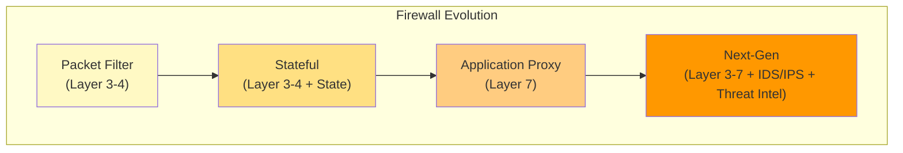
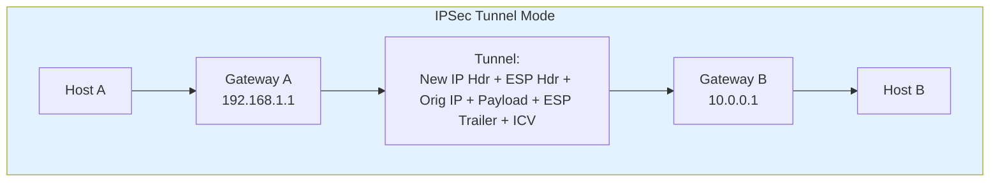
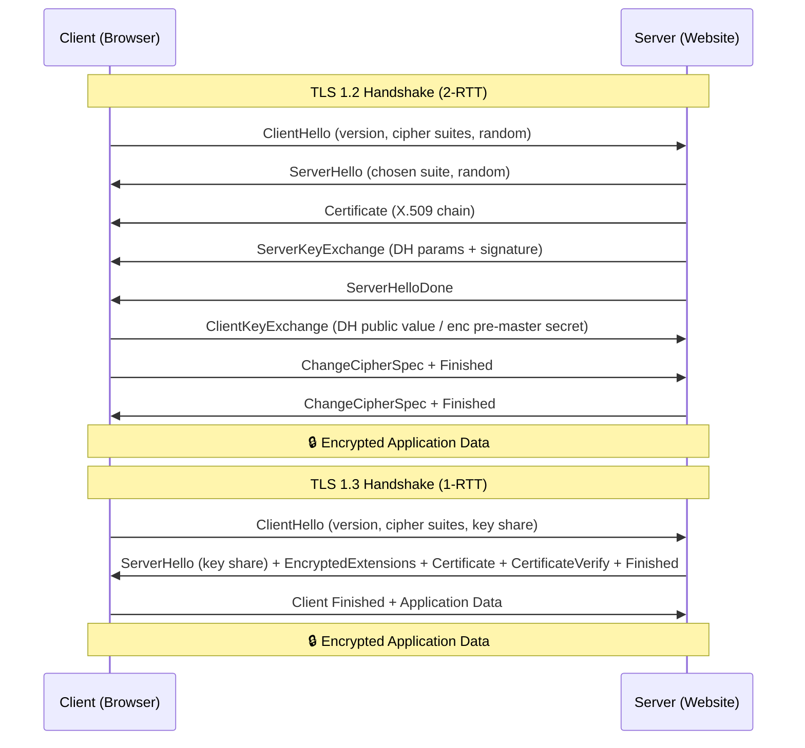
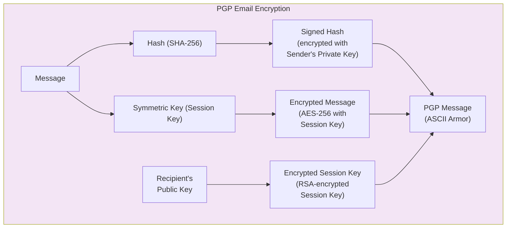
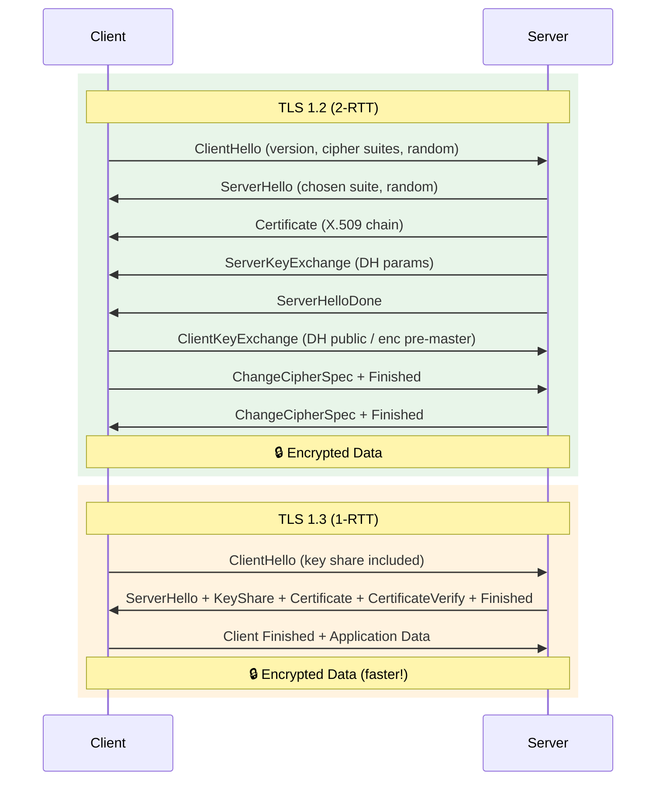

# Chapter 2: Network Security

> **Exam Weightage:** 4–5 Qs in IBPS SO IT Officer Mains (Firewalls, IDS/IPS, VPN, SSL/TLS, Secure Protocols)
>
> **Key Topics:** Firewall types, IDS/IPS, VPN (IPSec, SSL/TLS), SSL/TLS handshake, HTTPS vs HTTP, SSH, PGP, S/MIME

---

## Learning Objectives

After completing this chapter you will be able to:

<!-- Image Gallery -->
<section class="lesson-visuals" aria-label="Visual learning resources">
  <header><span>VISUAL LEARNING</span><h2>See it. Review it. Remember it.</h2></header>
  <a class="lesson-visual-card" href="../../../assets/images/lessons/information-security/02-network-security/handwritten-notes.svg" target="_blank" rel="noopener">
    
    <span><strong>Handwritten notes</strong>Condensed notes for deliberate review.</span>
  </a>
  <a class="lesson-visual-card" href="../../../assets/images/lessons/information-security/02-network-security/sticky-notes.svg" target="_blank" rel="noopener">
    
    <span><strong>Sticky-note revision</strong>Fast recall prompts for revision.</span>
  </a>
  <a class="lesson-visual-card" href="../../../assets/images/lessons/information-security/02-network-security/visual-explanation.svg" target="_blank" rel="noopener">
    
    <span><strong>Visual concept guide</strong>A connected explanation of the key ideas.</span>
  </a>
</section>
<!-- End Image Gallery -->

- Classify firewalls by generation and explain filtering mechanisms (packet filter, stateful, application proxy, NGFW).
- Distinguish between IDS and IPS across detection methods (signature-based vs anomaly-based).
- Describe VPN architectures and compare IPSec vs SSL/TLS VPNs.
- Walk through the TLS 1.2 handshake step by step.
- Explain the differences between HTTPS and HTTP from a security perspective.
- Describe SSH architecture (transport, auth, connection layers) and port forwarding.
- Compare PGP and S/MIME for secure email.
- Solve exam-style MCQs on protocol ports, handshake phases, and firewall placement.

---

## Theory

### 2.1 Firewalls

A firewall is a network security device that monitors and controls incoming and outgoing network traffic based on predetermined security rules. It acts as a barrier between trusted internal networks and untrusted external networks (e.g., the internet).

#### 2.1.1 Packet Filter Firewall (Stateless / Layer 3)

- Examines each packet independently (no context of previous packets)
- Filters based on: source IP, destination IP, source port, destination port, protocol (TCP/UDP/ICMP)
- Operates at **Network Layer (Layer 3)** and **Transport Layer (Layer 4)**
- **Speed:** Very fast (simple rule matching)
- **Limitation:** Cannot detect attacks spread across multiple packets; no application-layer awareness; vulnerable to IP spoofing
- **Example:** Access Control Lists (ACLs) on routers

**Rule Example:** `deny tcp any 10.0.0.0/24 eq 23` (block Telnet to internal network)

#### 2.1.2 Stateful Inspection Firewall (Dynamic Packet Filter)

- Maintains a **state table** of active connections (connection tracking)
- Examines packets in context of the connection's state (NEW, ESTABLISHED, RELATED, INVALID)
- Only allows incoming packets that correspond to an outgoing connection (unless explicitly permitted)
- Operates at **Layer 3 and Layer 4** with state awareness
- **Speed:** Fast (but slightly slower than stateless due to state lookup)
- **Advantage:** Automatically allows return traffic for legitimate outbound connections
- **Example:** Check Point FireWall-1, iptables with conntrack

**Connection states:**
- **NEW:** First packet of a new connection
- **ESTABLISHED:** Part of an existing connection
- **RELATED:** Part of a related connection (e.g., FTP data channel)
- **INVALID:** Not part of any known connection (dropped)

#### 2.1.3 Application Proxy Firewall (Application Gateway)

- Intermediary: client connects to proxy, proxy connects to destination
- Full **application-layer awareness (Layer 7)** — understands protocol semantics
- Can inspect, modify, or block content within application protocol
- **Two types:** Forward proxy (outbound) and Reverse proxy (inbound)
- **Speed:** Slowest due to full protocol parsing (terminates and re-establishes connections)
- **Security:** Highest — can filter commands, block malicious content, perform DPI (Deep Packet Inspection)
- **Examples:** Squid (web proxy), HAProxy, Nginx reverse proxy

**Advantages over stateful inspection:**
- Can detect and block application-layer attacks (SQLi, XSS, command injection)
- Hides internal network structure (NAT at application layer)
- Content caching improves performance for frequently accessed resources

#### 2.1.4 Next-Generation Firewall (NGFW)

- Integrates: stateful inspection + application proxy + IDS/IPS + threat intelligence
- Identifies applications regardless of port/protocol (e.g., Facebook over port 80 vs port 443)
- User identity awareness (integration with AD/LDAP)
- TLS/SSL inspection (decrypt, inspect, re-encrypt)
- Sandboxing for unknown threats
- **Vendors:** Palo Alto Networks, Fortinet, Cisco Firepower

| Firewall Type | Layer | Stateful? | App Aware? | Speed | Security |
|--------------|-------|-----------|------------|-------|----------|
| Packet Filter | 3–4 | No | No | Very Fast | Low |
| Stateful | 3–4 | Yes | No | Fast | Medium |
| Proxy | 7 | Yes | Yes | Slow | High |
| NGFW | 3–7 | Yes | Yes | Moderate | Very High |



### 2.2 IDS/IPS (Intrusion Detection / Prevention Systems)

#### 2.2.1 IDS vs IPS

| Feature | IDS (Intrusion Detection System) | IPS (Intrusion Prevention System) |
|---------|----------------------------------|-----------------------------------|
| Action | Monitor and alert (passive) | Block and prevent (inline) |
| Network placement | Out-of-band (port mirror/span) | Inline (traffic flows through) |
| Response | Sends alert to admin | Drops/rejects/resets connection |
| Latency impact | None (monitoring only) | Adds latency (must inspect before forwarding) |
| False positive | Generates unnecessary alerts | Blocks legitimate traffic (more severe) |
| Single point of failure | No (sensors fail → still reachable) | Yes (if inline device fails → traffic stops) |

#### 2.2.2 Signature-Based Detection

- Matches traffic patterns against a database of known attack signatures
- **Signature examples:** Specific byte sequences in payload, known malware hashes, port/protocol anomalies
- **Advantage:** Low false positive rate; fast matching; immediately effective against known attacks
- **Disadvantage:** Cannot detect zero-day attacks; requires frequent signature updates
- **Detection rate:** ~100% for known attacks, ~0% for unknown variants

#### 2.2.3 Anomaly-Based Detection

- Builds a baseline model of "normal" traffic (ML/statistical profiling)
- Flags deviations exceeding a threshold as anomalous
- **Advantage:** Can detect zero-day attacks and unknown variants
- **Disadvantage:** High false positive rate (legitimate traffic may deviate from baseline)
- **Types:** Statistical anomaly detection, protocol anomaly detection, behavioral analysis

| Detection Method | Known Attacks | Unknown Attack | False Positive | False Negative | Maintenance |
|-----------------|---------------|----------------|----------------|----------------|-------------|
| Signature-based | ✅ Excellent | ❌ None | Low | Low (known) | High (signature updates) |
| Anomaly-based | ✅ Good | ✅ Possible | High | Medium | High (baseline tuning) |
| Hybrid | ✅ Excellent | ✅ Good | Medium | Low | Very High |

### 2.3 VPN (Virtual Private Network)

A VPN creates an encrypted tunnel between two endpoints over a public network, providing confidentiality, integrity, and authentication.

#### 2.3.1 IPSec VPN

**Protocol architecture:**
- **Authentication Header (AH):** Provides integrity + authentication (no encryption). Protocol 51. Verifies source and ensures packet integrity.
- **Encapsulating Security Payload (ESP):** Provides confidentiality + integrity + authentication (encryption + optional auth). Protocol 50. Most commonly used.

**Two Modes:**

| Mode | What is Protected | Use Case | Header | IP Header |
|------|------------------|----------|--------|-----------|
| Transport Mode | Payload only (IP header unchanged) | End-to-end (host-to-host) | Original IP header preserved | New IP header inserted before AH/ESP header |
| Tunnel Mode | Entire IP packet (encapsulated) | Gateway-to-gateway (site-to-site) | Original packet wrapped in new IP header | New IP header with gateway addresses |

**IPSec Key Exchange — IKE (Internet Key Exchange):**
- **Phase 1:** Establish ISAKMP SA (Main mode — 6 messages, or Aggressive mode — 3 messages). Authenticates peers and establishes a secure channel.
- **Phase 2:** Establish IPSec SA (Quick mode — 3 messages). Negotiates AH/ESP parameters and generates session keys.
- **Port:** UDP 500 (IKE), UDP 4500 (NAT-Traversal)

**Security Associations (SA):** Unidirectional (two SAs needed for bidirectional communication). Each SA identified by SPI (Security Parameter Index).



#### 2.3.2 SSL/TLS VPN

- Uses SSL/TLS protocol (TCP 443) for secure tunnel — same protocol as HTTPS
- **Advantages over IPSec:**
  - No client software needed (works in browser)
  - Bypasses NAT/firewalls easily (TCP 443 almost always open)
  - Granular access control (per-application, not full network)
  - Easier configuration and deployment
- **Disadvantages:**
  - Higher latency (TCP-over-TCP problem)
  - Not suitable for all applications (non-web apps need client)
  - Generally lower throughput than IPSec
- **Two types:**
  - **SSL Portal VPN:** Single web page lists accessible applications (browser-based)
  - **SSL Tunnel VPN:** Full network tunnel via browser plugin or dedicated client

#### 2.3.3 IPSec vs SSL VPN — Comparison

| Feature | IPSec VPN | SSL/TLS VPN |
|---------|-----------|-------------|
| OSI Layer | Network (Layer 3) | Application (Layer 7) / Transport (Layer 4) |
| Encryption | IKE + ESP (AES, 3DES) | TLS (AES-GCM, ChaCha20) |
| Authentication | Pre-shared keys, certificates, EAP | Certificates, passwords, 2FA |
| Client required | Yes (IPSec stack) | Browser only (portal); optional client (tunnel) |
| Port | UDP 500/4500 (may be blocked) | TCP 443 (rarely blocked) |
| NAT traversal | Complex (NAT-T needed) | Transparent (TCP 443) |
| Granular access | Full network access | Per-application control |
| Deployment complexity | High | Low |

### 2.4 SSL/TLS Protocol

#### 2.4.1 SSL vs TLS

| Feature | SSL 3.0 | TLS 1.0 | TLS 1.1 | TLS 1.2 | TLS 1.3 |
|---------|---------|---------|---------|---------|---------|
| Year | 1996 | 1999 | 2006 | 2008 | 2018 |
| Status | Deprecated | Deprecated | Deprecated | Current (transitioning) | Current (recommended) |
| Key exchange | RSA, DH | RSA, DH | RSA, DH | RSA, DH, ECDH, ECDHE | ECDHE, DHE (no RSA key exchange) |
| Cipher suites | RC4, CBC | RC4, CBC | CBC | CBC, GCM, CCM, ChaCha20 | AEAD only (GCM, ChaCha20-Poly1305) |
| Handshake | Full | Full | Full | Full (with extensions) | 1-RTT (0-RTT resume) |
| Forward secrecy | Optional | Optional | Optional | Optional | Mandatory |

#### 2.4.2 TLS 1.2 Handshake (10 messages)

1. **ClientHello** — Client sends: TLS version, cipher suites list (e.g., TLS_ECDHE_RSA_WITH_AES_256_GCM_SHA384), random nonce, session ID
2. **ServerHello** — Server responds with: chosen TLS version, chosen cipher suite, random nonce, session ID
3. **Certificate** — Server sends its X.509 certificate chain (server + intermediate CAs)
4. **ServerKeyExchange** — Server sends ephemeral DH parameters (p, g, g^b mod p signed with RSA private key) — only for DHE/ECDHE cipher suites
5. **CertificateRequest** — Optional: server requests client certificate (mutual TLS)
6. **ServerHelloDone** — Server signals end of hello messages
7. **ClientCertificate** — Optional: client sends its certificate (if requested)
8. **ClientKeyExchange** — Client sends pre-master secret encrypted with server's public key (RSA) or DH public value (DHE/ECDHE)
9. **CertificateVerify** — Optional: client proves possession of private key by signing handshake messages
10. **ChangeCipherSpec + Finished** — Both sides switch to encrypted mode and send Finished message (MAC of all handshake messages)

**Key derivation chain:** Pre-Master Secret → Master Secret (48 bytes, via PRF) → Key material (encryption key, MAC key, IV for both directions)

#### 2.4.3 TLS 1.3 Handshake (optimized)

- **1-RTT** (one round trip) for full handshake vs 2-RTT in TLS 1.2
- **0-RTT** (zero round trip) for session resumption (early data)
- **Key exchange:** Only DHE/ECDHE (no RSA key exchange — forward secrecy mandatory)
- **Encryption:** Only AEAD ciphers (AES-GCM, ChaCha20-Poly1305)
- Certificate encryption: entire certificate chain is encrypted (privacy improvement)
- Removed: compression, renegotiation, CBC mode, RC4, 3DES, static RSA/DH

**TLS 1.3 Handshake Messages:**
1. ClientHello (contains key share — g^a already included)
2. ServerHello (contains key share — g^b) + EncryptedExtensions + Certificate + CertificateVerify + Finished
3. Client Finished + Application Data



### 2.5 HTTPS vs HTTP

| Feature | HTTP | HTTPS |
|---------|------|-------|
| Protocol | HyperText Transfer Protocol | HTTP over TLS |
| Default port | 80 | 443 |
| Encryption | None (plaintext) | TLS encryption (AES-GCM, ChaCha20) |
| Integrity | None (no tamper detection) | HMAC / AEAD authentication tag |
| Authentication | None (no server identity check) | X.509 certificate validation |
| Performance | Faster (no crypto overhead) | Slightly slower (crypto handshake + encrypt) |
| SEO ranking | Lower | Higher (Google ranking boost) |
| Browser indicator | "Not secure" | Padlock icon, "Secure" |

**Mixed Content Warning:** HTTPS page loading HTTP resources (images, scripts) may trigger browser warnings — "This page is not fully secure."

### 2.6 SSH (Secure Shell)

- **Purpose:** Secure remote login, command execution, port forwarding
- **Default port:** TCP 22
- **Protocol layers:**
  1. **Transport Layer (Key exchange, server auth, encryption)** — Establishes encrypted tunnel (Diffie-Hellman key exchange, host key verification)
  2. **User Authentication Layer** — Authenticates client to server (password, public key, GSSAPI)
  3. **Connection Layer** — Multiplexes multiple channels (shell, exec, port forwarding) over single connection

#### 2.6.1 SSH Authentication Methods

| Method | Description | Security Level |
|--------|-------------|----------------|
| Password | Client sends password (encrypted over tunnel) | Low (phishing, brute-force) |
| Public Key | Client proves possession of private key | High (key pair) |
| Keyboard-Interactive | Server challenges client (OTP, 2FA) | Very High |
| Host-based | Authentication based on client host identity | Medium |

#### 2.6.2 SSH Port Forwarding

- **Local forwarding (-L):** Forward local port → remote host via SSH server (`ssh -L 8080:internal:80 user@gateway`)
- **Remote forwarding (-R):** Forward SSH server port → local machine (`ssh -R 8080:localhost:80 user@gateway`)
- **Dynamic forwarding (-D):** SOCKS proxy via SSH (`ssh -D 1080 user@gateway`)

### 2.7 Secure Email: PGP and S/MIME

#### 2.7.1 PGP (Pretty Good Privacy)

- **Creator:** Phil Zimmermann (1991)
- **Standard:** OpenPGP (RFC 4880)
- **Encryption method:** Hybrid encryption
  - Generate random session key → encrypt message with symmetric cipher (AES-256)
  - Encrypt session key with recipient's RSA public key
  - Sign message hash with sender's private key
- **Key management:** Web of Trust (decentralized — users sign each other's keys)
- **Output format:** Radix-64 (ASCII armor — converts binary to printable text)

**PGP Message Structure:**
1. Session key packet (encrypted with recipient's public key)
2. Signature packet (hash of message signed with sender's private key)
3. Data packet (message compressed + encrypted with session key)

#### 2.7.2 S/MIME (Secure / Multipurpose Internet Mail Extensions)

- **Standard:** PKCS#7 / Cryptographic Message Syntax (CMS)
- **Dependency:** Requires X.509 PKI hierarchy (certificates issued by trusted CAs)
- **Key management:** Centralized (CA hierarchy — similar to HTTPS certificates)
- **Encryption:** Same hybrid approach as PGP
- **Integration:** Built into most email clients (Outlook, Apple Mail, Thunderbird)

#### 2.7.3 PGP vs S/MIME — Comparison

| Feature | PGP | S/MIME |
|---------|-----|--------|
| Trust model | Web of Trust (decentralized) | CA hierarchy (centralized) |
| Certificate format | OpenPGP key format | X.509 certificates |
| Key distribution | Keyservers / direct exchange | CA-issued certificates |
| Revocation | Certificate revocation certificates | CRL / OCSP |
| Adoption | Tech community, developers | Enterprise, government |
| Standard | RFC 4880 (OpenPGP) | RFC 5751 (S/MIME) |



### 2.8 Solved MCQs (Exam Style)

**Q1.** Which type of firewall maintains a state table of active connections?

A) Packet filter firewall  
B) Stateful inspection firewall  
C) Application proxy firewall  
D) Circuit-level gateway  

<details>
<summary>Show Answer</summary>

**Answer: B) Stateful inspection firewall**

**Explanation:** Stateful firewalls maintain a connection state table tracking each active session. They record connection state (NEW, ESTABLISHED, RELATED, INVALID) and make filtering decisions based on both the packet header and the connection's state. Packet filter firewalls examine each packet independently without context. Application proxy firewalls also maintain state but at the application layer.
</details>

---

**Q2.** Which default port does IKE use for establishing IPSec Security Associations?

A) TCP 500  
B) UDP 500  
C) UDP 4500  
D) TCP 443  

<details>
<summary>Show Answer</summary>

**Answer: B) UDP 500**

**Explanation:** Internet Key Exchange (IKE) uses UDP port 500 for Phase 1 (ISAKMP SA establishment) and Phase 2 (IPSec SA negotiation). UDP 4500 is used for IPSec NAT-Traversal (NAT-T) when IPSec packets pass through NAT devices. TCP 500 is not a standard port; IKE is always UDP-based.
</details>

---

**Q3.** In TLS 1.2 handshake, what information does the ServerHello message NOT contain?

A) Chosen cipher suite  
B) Server's X.509 certificate  
C) Server random nonce  
D) Chosen TLS version  

<details>
<summary>Show Answer</summary>

**Answer: B) Server's X.509 certificate**

**Explanation:** ServerHello contains the chosen TLS version, cipher suite, and random nonce. The certificate is sent in a separate Certificate message after ServerHello. The handshake order is: ClientHello → ServerHello → Certificate → ServerKeyExchange (if using DHE/ECDHE) → ServerHelloDone.
</details>

---

**Q4.** Which of the following is NOT a layer of the SSH protocol architecture?

A) Transport Layer  
B) User Authentication Layer  
C) Connection Layer  
D) Presentation Layer  

<details>
<summary>Show Answer</summary>

**Answer: D) Presentation Layer**

**Explanation:** SSH has three protocol layers: (1) Transport Layer — handles key exchange, server authentication, encryption, and integrity; (2) User Authentication Layer — authenticates the client to the server; (3) Connection Layer — multiplexes multiple channels (shell, exec, port forwarding) over the single encrypted tunnel. Presentation Layer is an OSI layer, not part of SSH.
</details>

---

**Q5.** What is the primary advantage of anomaly-based IDS over signature-based IDS?

A) Lower false positive rate  
B) Can detect zero-day attacks  
C) Requires less maintenance  
D) Faster packet processing  

<details>
<summary>Show Answer</summary>

**Answer: B) Can detect zero-day attacks**

**Explanation:** Anomaly-based detection builds a baseline of normal activity and flags deviations. This allows it to detect previously unknown attacks (zero-day exploits) that have no known signature. The disadvantage is a higher false positive rate. Signature-based IDS can only detect attacks for which signatures exist, making it blind to zero-day threats.
</details>

---

**Q6.** In IPSec, which protocol provides both encryption and authentication?

A) AH only  
B) ESP only  
C) Both AH and ESP  
D) IKE  

<details>
<summary>Show Answer</summary>

**Answer: B) ESP only**

**Explanation:** ESP (Encapsulating Security Payload) provides confidentiality (encryption), integrity, and authentication (optional auth trailer). AH (Authentication Header) provides integrity and authentication only — no encryption. IKE handles key exchange, not data protection. ESP is the most commonly used IPSec protocol.
</details>

---

**Q7.** An NGFW typically does NOT include which of the following capabilities?

A) Stateful inspection  
B) Application identification  
C) Packet routing protocol support (BGP/OSPF)  
D) Intrusion prevention  

<details>
<summary>Show Answer</summary>

**Answer: C) Packet routing protocol support (BGP/OSPF)**

**Explanation:** NGFW integrates stateful inspection, application awareness, IDS/IPS, TLS inspection, and threat intelligence. However, routing protocol support (BGP, OSPF) is typically handled by routers or Layer 3 switches, not NGFWs. An NGFW may use static routing but does not participate in dynamic routing protocols.
</details>

---

**Q8.** PGP uses which key management model?

A) Centralized CA hierarchy  
B) Web of Trust  
C) Key Distribution Center  
D) Public Key Infrastructure  

<details>
<summary>Show Answer</summary>

**Answer: B) Web of Trust**

**Explanation:** PGP uses a decentralized Web of Trust model where users sign each other's public keys to establish trust. There is no central Certificate Authority. S/MIME, by contrast, uses a centralized CA hierarchy (X.509 PKI) similar to HTTPS certificates.
</details>

---

**Q9.** In IPSec tunnel mode, how is the original IP packet handled?

A) Original packet is encrypted but the IP header is unchanged  
B) Original packet is discarded and a new IP header is created  
C) Entire original IP packet is encapsulated in a new IP packet  
D) Original IP header is replaced with the SPI  

<details>
<summary>Show Answer</summary>

**Answer: C) Entire original IP packet is encapsulated in a new IP packet**

**Explanation:** In tunnel mode, the entire original IP packet (IP header + payload) is encrypted and placed inside a new IP packet. The new outer IP header contains the tunnel endpoints (gateway IPs). In transport mode, only the payload is encrypted, and the original IP header is preserved. Tunnel mode is used for site-to-site VPNs.
</details>

---

**Q10.** Which TLS version made forward secrecy mandatory?

A) TLS 1.0  
B) TLS 1.1  
C) TLS 1.2  
D) TLS 1.3  

<details>
<summary>Show Answer</summary>

**Answer: D) TLS 1.3**

**Explanation:** TLS 1.3 mandates forward secrecy by removing RSA key exchange and static DH cipher suites. Both TLS 1.2 and earlier allowed non-ECDHE cipher suites (like RSA key exchange) which do not provide forward secrecy. TLS 1.3 requires ECDHE or DHE for key exchange, ensuring that compromise of the server's long-term private key does not compromise past session keys.
</details>

---

## 📝 Solved Examples (20 MCQs)

**Q1.** A packet filter firewall examines which layers of the OSI model?

A) Layer 1–2 only  
B) Layer 3–4 (Network and Transport)  
C) Layer 5–7 (Session to Application)  
D) Layer 2–3 only

<details>
<summary>Show Answer</summary>

**Answer: B) Layer 3–4**

**Explanation:** Packet filter firewalls operate at Layer 3 (Network) and Layer 4 (Transport). They examine source/destination IP addresses, port numbers, and protocol (TCP/UDP/ICMP). They do NOT maintain connection state (stateless) and cannot inspect application-layer content. Stateful firewalls also operate at Layers 3–4 but add connection tracking. Application proxy firewalls operate at Layer 7.
</details>

---

**Q2.** A stateful firewall sees a packet with SYN=1, ACK=0 from an internal IP to an external IP. What state does it record?

A) INVALID  
B) NEW  
C) ESTABLISHED  
D) RELATED

<details>
<summary>Show Answer</summary>

**Answer: B) NEW**

**Explanation:** A packet with SYN=1 and ACK=0 is the first packet of a TCP connection (the SYN packet initiating the three-way handshake). The firewall records this as a NEW connection in its state table. For the return SYN-ACK packet (SYN=1, ACK=1), it matches the ESTABLISHED state. Packets that don't match any known connection are marked INVALID and dropped. RELATED applies to secondary connections (e.g., FTP data channel).
</details>

---

**Q3.** In TLS 1.3, how many round trips are required for a full handshake?

A) 0-RTT  
B) 1-RTT  
C) 2-RTT  
D) 3-RTT

<details>
<summary>Show Answer</summary>

**Answer: B) 1-RTT**

**Explanation:** TLS 1.3 reduces the full handshake to 1-RTT (one round trip). The client includes its key share (ECDHE public value) in the ClientHello. The server responds with its key share, certificate, and CertificateVerify in a single flight. TLS 1.2 required 2-RTT (ClientHello → ServerHello + Certificate → ClientKeyExchange → Finished). TLS 1.3 also supports 0-RTT for session resumption (early data), but this is optional and carries replay risks.
</details>

---

**Q4.** In IPSec tunnel mode, what is the total number of IP headers in the final packet?

A) 1 (outer header only)  
B) 2 (outer header + inner original header)  
C) 3 (outer, inner, and tunnel header)  
D) 1 encrypted header only

<details>
<summary>Show Answer</summary>

**Answer: B) 2 headers**

**Explanation:** In tunnel mode, the entire original IP packet (IP header + payload) is encapsulated within a new IP packet:
- **Outer IP header:** Contains tunnel endpoint IPs (gateway addresses) — visible in cleartext
- **Inner IP header:** Original source/destination IPs — fully encrypted

In transport mode, only the payload is encrypted (original IP header preserved), so there is 1 IP header.
</details>

---

**Q5.** An IDS is deployed in which network configuration?

A) Inline (traffic flows through)  
B) Out-of-band (via port mirror/SPAN)  
C) On the endpoint only  
D) On the router itself

<details>
<summary>Show Answer</summary>

**Answer: B) Out-of-band (via port mirror/SPAN)**

**Explanation:** IDS (Intrusion Detection System) is deployed out-of-band — it receives a copy of network traffic via a switch SPAN port or network tap. It monitors passively and cannot block traffic. IPS (Intrusion Prevention System) is deployed inline — traffic physically flows through it, allowing it to drop or reject malicious packets in real time. An IDS failure does not disrupt network traffic; an IPS failure does.
</details>

---

**Q6.** What is the key exchange algorithm used in TLS 1.3 that provides forward secrecy?

A) RSA key exchange  
B) Static DH  
C) ECDHE (Elliptic Curve Diffie-Hellman Ephemeral)  
D) Pre-shared key

<details>
<summary>Show Answer</summary>

**Answer: C) ECDHE**

**Explanation:** TLS 1.3 mandates ECDHE (or DHE) for key exchange. RSA key exchange and static DH were removed. ECDHE generates ephemeral (temporary) key pairs per session — the private key is discarded after the handshake. This ensures forward secrecy: even if the server's long-term private signing key is compromised, past session keys cannot be recovered. The "E" in ECDHE stands for Ephemeral.
</details>

---

**Q7.** What is the amplification factor of an NTP amplification attack?

A) Up to 50×  
B) Up to 556×  
C) Up to 10×  
D) Up to 1000×

<details>
<summary>Show Answer</summary>

**Answer: B) Up to 556×**

**Explanation:** NTP amplification attacks exploit the `monlist` command (or `MON_GETLIST` in older NTP) which returns a list of up to 600 recent clients. A small query (~60 bytes) can generate a response of up to ∼ 33,000 bytes, giving an amplification factor of up to 556×. DNS amplification is ∼50×, Memcached can reach ∼51,000× (but fewer vulnerable servers).
</details>

---

**Q8.** In SSH, which layer handles user authentication?

A) Transport Layer  
B) User Authentication Layer  
C) Connection Layer  
D) Application Layer

<details>
<summary>Show Answer</summary>

**Answer: B) User Authentication Layer**

**Explanation:** SSH has three protocol layers:
1. **Transport Layer:** Key exchange, server authentication, encryption, integrity (establishes secure tunnel)
2. **User Authentication Layer:** Authenticates client to server (password, public key, GSSAPI, keyboard-interactive)
3. **Connection Layer:** Multiplexes multiple channels (shell, exec, port forwarding, SFTP) over the single encrypted tunnel

The Transport Layer must complete before user authentication begins.
</details>

---

**Q9.** A company deploys an NGFW. Which capability distinguishes it from a traditional stateful firewall?

A) Stateful packet inspection  
B) Application identification regardless of port/protocol  
C) NAT support  
D) VPN termination

<details>
<summary>Show Answer</summary>

**Answer: B) Application identification regardless of port/protocol**

**Explanation:** NGFW's key differentiator is **application awareness** — it can identify applications (Facebook, Skype, Salesforce) even when they use non-standard ports or hide over port 443 (TLS). Traditional stateful firewalls filter by IP/port only. Additional NGFW capabilities: TLS inspection (decrypt, inspect, re-encrypt), user identity awareness (integrated with AD/LDAP), threat intelligence feeds, and sandboxing. Stateful inspection (A), NAT (C), and VPN (D) are all available in traditional firewalls.
</details>

---

**Q10.** Which secure email standard uses a centralized CA hierarchy for trust?

A) PGP  
B) S/MIME  
C) OpenPGP  
D) GPG

<details>
<summary>Show Answer</summary>

**Answer: B) S/MIME**

**Explanation:** S/MIME (Secure/Multipurpose Internet Mail Extensions) relies on a centralized X.509 PKI hierarchy — certificates are issued by trusted Certificate Authorities (CAs), the same infrastructure used for HTTPS. PGP (and its implementations OpenPGP, GPG) uses a decentralized Web of Trust model where users sign each other's keys. S/MIME is preferred in enterprise environments with existing PKI; PGP is common in technical/open-source communities.
</details>

---

**Q11.** An anomaly-based IDS has a high false positive rate. What is the primary cause?

A) Signatures are outdated  
B) Normal traffic patterns may deviate from the baseline  
C) The IDS cannot detect known attacks  
D) The IDS is deployed out-of-band

<details>
<summary>Show Answer</summary>

**Answer: B) Normal traffic patterns may deviate from the baseline**

**Explanation:** Anomaly-based detection builds a statistical baseline of "normal" behavior. Legitimate traffic that deviates from this baseline (e.g., an employee working unusual hours, a software update causing unusual traffic patterns) is flagged as anomalous — resulting in false positives. High FP rates are the primary disadvantage of anomaly-based IDS. Hybrid systems (signature + anomaly) try to balance detection rate with false positives.
</details>

---

**Q12.** In IPSec, which protocol provides authentication header (integrity + auth) without encryption?

A) ESP  
B) AH  
C) IKE  
D) ISAKMP

<details>
<summary>Show Answer</summary>

**Answer: B) AH (Authentication Header)**

**Explanation:** AH (Protocol 51) provides integrity and authentication for IP packets but does NOT encrypt the payload. It computes an Integrity Check Value (ICV) over the IP header + payload (with mutable fields excluded). ESP (Protocol 50) provides both encryption (confidentiality) and optional authentication. AH is rarely used alone in practice — ESP with authentication is preferred. IKE (UDP 500) handles key exchange.
</details>

---

**Q13.** What is the default lifetime of a Kerberos Ticket Granting Ticket (TGT)?

A) 1 hour  
B) 8 hours  
C) 24 hours  
D) 7 days

<details>
<summary>Show Answer</summary>

**Answer: B) 8 hours (typical Windows domain default)**

**Explanation:** TGT lifetime is configurable but the Windows Domain default is typically 8 hours. After TGT expiry, the client must re-authenticate to the AS. Individual Service Tickets (ST) have shorter lifetimes (commonly 1 hour). When a ST expires, the client can request a new one from the TGS using the TGT without re-entering the password — as long as the TGT is still valid.
</details>

---

**Q14.** Which firewall type terminates the client connection and establishes a new connection to the server?

A) Packet filter  
B) Stateful inspection  
C) Application proxy  
D) Circuit-level gateway

<details>
<summary>Show Answer</summary>

**Answer: C) Application proxy**

**Explanation:** Application proxy firewalls act as intermediaries: the client connects to the proxy, which fully terminates the TCP connection, inspects/validates the application-layer content, and then establishes a separate TCP connection to the destination server. This creates two independent TCP connections: client ↔ proxy and proxy ↔ server. This allows deep inspection of application protocols (HTTP, FTP, SMTP) but adds latency. Packet filter and stateful firewalls pass packets transparently without terminating connections.
</details>

---

**Q15.** A connection from an internal host to an external server shows these states in the firewall log: NEW, ESTABLISHED, ESTABLISHED, FIN. Which firewall type maintains this state information?

A) Packet filter  
B) Stateful inspection  
C) Application proxy  
D) Circuit-level gateway

<details>
<summary>Show Answer</summary>

**Answer: B) Stateful inspection**

**Explanation:** Stateful firewalls maintain a connection state table tracking the lifecycle of each TCP/UDP connection: NEW (first SYN), ESTABLISHED (ongoing), FIN/CLOSE (termination), or INVALID (no matching connection). The state is tracked using the 5-tuple (src IP, dst IP, src port, dst port, protocol). Packet filters examine each packet independently without state awareness.
</details>

---

**Q16.** In TLS 1.2, which message contains the server's X.509 certificate?

A) ServerHello  
B) Certificate  
C) ServerKeyExchange  
D) ServerHelloDone

<details>
<summary>Show Answer</summary>

**Answer: B) Certificate**

**Explanation:** In TLS 1.2 handshake order: ClientHello → ServerHello → **Certificate** (server's X.509 certificate chain) → ServerKeyExchange (if using DHE/ECDHE) → CertificateRequest (optional) → ServerHelloDone. The Certificate message is separate from ServerHello (which only contains version, cipher suite, and random nonce). The client verifies the certificate chain before trusting the server.
</details>

---

**Q17.** SSH port forwarding with `-D 1080` creates what type of proxy?

A) HTTP proxy  
B) SOCKS proxy  
C) Transparent proxy  
D) Reverse proxy

<details>
<summary>Show Answer</summary>

**Answer: B) SOCKS proxy**

**Explanation:** `ssh -D 1080 user@gateway` creates a SOCKS5 dynamic forwarding proxy on local port 1080. Applications configured to use SOCKS5 proxy (localhost:1080) will tunnel their traffic through the SSH connection. Local forwarding (`-L`) forwards a specific local port to a remote destination. Remote forwarding (`-R`) exposes a local service to the remote network. SOCKS proxy is versatile — it handles any TCP application protocol.
</details>

---

**Q18.** What is the primary security disadvantage of using SSL VPN over IPSec VPN?

A) TCP-over-TCP performance issue  
B) No encryption  
C) Requires pre-shared keys  
D) Cannot authenticate users

<details>
<summary>Show Answer</summary>

**Answer: A) TCP-over-TCP performance issue**

**Explanation:** SSL VPNs encapsulate TCP traffic within TLS (which itself runs over TCP). When packet loss occurs, both the inner TCP and outer TLS attempt retransmission, causing a cascading failure known as "TCP meltdown" or TCP-over-TCP problem. IPSec operates at Layer 3 (IP level), so it does not suffer from this issue. SSL VPNs are still widely used for their ease of deployment (browser-based, no client, TCP 443 usually open).
</details>

---

**Q19.** In PGP, the session key is encrypted with which key?

A) Sender's private key  
B) Sender's public key  
C) Recipient's public key  
D) Recipient's private key

<details>
<summary>Show Answer</summary>

**Answer: C) Recipient's public key**

**Explanation:** PGP uses hybrid encryption:
1. Generate a random session key (e.g., AES-256 key)
2. Encrypt the message with the session key (symmetric — fast)
3. Encrypt the session key with the **recipient's RSA public key** (asymmetric — only recipient can decrypt)
4. Optionally: sign the message hash with the sender's private key

The recipient decrypts the session key using their private key, then uses it to decrypt the message. This combines symmetric speed with asymmetric key management.
</details>

---

**Q20.** Which OWASP Mobile Top 10 risk involves improper certificate validation allowing MITM attacks on mobile banking apps?

A) M1 — Improper Platform Usage  
B) M2 — Insecure Data Storage  
C) M3 — Insecure Communication  
D) M4 — Insecure Authentication

<details>
<summary>Show Answer</summary>

**Answer: C) M3 — Insecure Communication**

**Explanation:** M3 (Insecure Communication) covers: no TLS enforcement, improper certificate validation (accepting self-signed certs or disabled hostname verification), using outdated TLS versions (SSL 3.0, TLS 1.0), weak cipher suites, and cleartext HTTP traffic. In mobile banking, this allows MITM attacks where an attacker with network access (public Wi-Fi, rogue cell tower) can intercept or modify traffic between the app and the server. Mitigation: SSL pinning (certificate/public key pinning) and strict TLS configuration.
</details>

---

### TypeScript Implementation: TLS 1.3 Handshake Simulator

```typescript
/**
 * TLS 1.3 Handshake Simulator
 * Demonstrates the 1-RTT handshake with ECDHE key exchange
 */
import * as crypto from 'crypto';

interface TLSClientHello {
  version: string;
  cipherSuites: string[];
  random: string;
  keyShare: { group: string; key: string };  // ECDHE public key (hex)
  supportedGroups: string[];
}

interface TLSServerHello {
  version: string;
  chosenCipherSuite: string;
  random: string;
  keyShare: { group: string; key: string };
  certificate: string; // PEM-encoded
  certificateVerify: string; // signature (hex)
}

class TLSHandshakeSimulator {
  private sharedSecret: Buffer | null = null;

  // Simulate client generating first message with key share
  clientHello(): { message: TLSClientHello; privateKey: crypto.KeyObject } {
    const ecdh = crypto.createECDH('prime256v1');
    ecdh.generateKeys();

    return {
      message: {
        version: 'TLS 1.3',
        cipherSuites: [
          'TLS_AES_256_GCM_SHA384',
          'TLS_CHACHA20_POLY1305_SHA256'
        ],
        random: crypto.randomBytes(32).toString('hex'),
        keyShare: {
          group: 'prime256v1 (P-256)',
          key: ecdh.getPublicKey('hex')
        },
        supportedGroups: ['P-256', 'P-384', 'X25519']
      },
      privateKey: ecdh
    };
  }

  // Simulate server processing ClientHello and responding
  serverHello(clientHello: TLSClientHello, serverKeyPair: { privateKey: crypto.KeyObject }): {
    message: TLSServerHello;
    computedSharedSecret: Buffer;
  } {
    const serverEcdh = crypto.createECDH('prime256v1');
    serverEcdh.generateKeys();

    // Server computes shared secret from client's public key
    const sharedSecret = serverEcdh.computeSecret(
      Buffer.from(clientHello.keyShare.key, 'hex'),
      'hex',
      'hex'
    );

    return {
      message: {
        version: 'TLS 1.3',
        chosenCipherSuite: 'TLS_AES_256_GCM_SHA384',
        random: crypto.randomBytes(32).toString('hex'),
        keyShare: {
          group: 'prime256v1 (P-256)',
          key: serverEcdh.getPublicKey('hex')
        },
        certificate: '-----BEGIN CERTIFICATE-----\n...server cert...\n-----END CERTIFICATE-----',
        certificateVerify: crypto.randomBytes(64).toString('hex') // simplified
      },
      computedSharedSecret: Buffer.from(sharedSecret, 'hex')
    };
  }

  // Client computes shared secret from server's public key
  clientFinish(serverHello: TLSServerHello, clientKeyPair: crypto.KeyObject): Buffer {
    const sharedSecret = (clientKeyPair as crypto.ECDH).computeSecret(
      Buffer.from(serverHello.keyShare.key, 'hex'),
      'hex',
      'hex'
    );
    this.sharedSecret = Buffer.from(sharedSecret, 'hex');
    return this.sharedSecret;
  }

  // Derive AES-256 key from shared secret using HKDF (simplified)
  deriveEncryptionKey(sharedSecret: Buffer): Buffer {
    // TLS 1.3 uses HKDF-Extract and HKDF-Expand
    // Simplified: SHA-256 of shared secret (actual TLS uses labeled HKDF)
    return crypto.createHash('sha256').update(sharedSecret).digest();
  }

  runFullHandshake(): void {
    console.log('=== TLS 1.3 Handshake Simulation ===\n');

    // Step 1: ClientHello (includes key share)
    const { message: clientHello, privateKey: clientPriv } = this.clientHello();
    console.log('1. ClientHello sent');
    console.log(`   Key share group: ${clientHello.keyShare.group}`);
    console.log(`   Client public key (hex): ${clientHello.keyShare.key.slice(0, 32)}...`);
    console.log(`   Supported: ${clientHello.cipherSuites.join(', ')}\n`);

    // Step 2: Server processes and responds
    const serverPriv = crypto.createECDH('prime256v1');
    serverPriv.generateKeys();
    const { message: serverHello } = this.serverHello(clientHello, { privateKey: serverPriv });
    console.log('2. ServerHello received');
    console.log(`   Chosen cipher: ${serverHello.chosenCipherSuite}`);
    console.log(`   Server public key (hex): ${serverHello.keyShare.key.slice(0, 32)}...\n`);

    // Step 3: Client computes shared secret
    const clientShared = this.clientFinish(serverHello, clientPriv);
    console.log('3. Client computed shared secret');

    // Step 4: Derive encryption keys
    const clientKey = this.deriveEncryptionKey(clientShared);
    console.log(`4. Client derived AES-256 key (hex): ${clientKey.toString('hex').slice(0, 32)}...`);

    // Verify both sides get same key
    const serverShared = Buffer.from(serverPriv.computeSecret(
      Buffer.from(clientHello.keyShare.key, 'hex'),
      'hex',
      'hex'
    ), 'hex');
    const serverKey = this.deriveEncryptionKey(serverShared);

    console.log(`5. Server derived same key: ${clientKey.equals(serverKey)}`);
    console.log('\n=== Handshake Complete (1-RTT) ===');
    console.log('Forward Secrecy: ✅ (ephemeral keys discarded after session)');
    console.log('AEAD Encryption Ready: ✅');
  }
}

// Run demo
const tls = new TLSHandshakeSimulator();
tls.runFullHandshake();
```

### TypeScript Implementation: Firewall Rule Simulator

```typescript
/**
 * Firewall Rule Simulator
 * Implements stateless packet filter and stateful inspection firewall
 */

interface Packet {
  srcIp: string;
  dstIp: string;
  srcPort: number;
  dstPort: number;
  protocol: 'TCP' | 'UDP' | 'ICMP';
  flags: string[]; // TCP flags: SYN, ACK, FIN, RST
}

interface FirewallRule {
  id: string;
  action: 'ALLOW' | 'DENY';
  srcIp?: string;
  dstIp?: string;
  srcPort?: number;
  dstPort?: number;
  protocol?: 'TCP' | 'UDP' | 'ICMP';
  priority: number;
  log: boolean;
}

interface ConnectionState {
  srcIp: string;
  dstIp: string;
  srcPort: number;
  dstPort: number;
  protocol: string;
  state: 'NEW' | 'ESTABLISHED' | 'RELATED' | 'INVALID';
  lastSeen: number;
}

class FirewallSimulator {
  private rules: FirewallRule[] = [];
  private stateTable: ConnectionState[] = [];
  private stats = { allowed: 0, denied: 0, logged: 0 };

  addRule(rule: FirewallRule): void {
    this.rules.push(rule);
    this.rules.sort((a, b) => b.priority - a.priority);
  }

  private matchRule(packet: Packet): FirewallRule | null {
    for (const rule of this.rules) {
      if (rule.protocol && rule.protocol !== packet.protocol) continue;
      if (rule.srcPort && rule.srcPort !== packet.srcPort) continue;
      if (rule.dstPort && rule.dstPort !== packet.dstPort) continue;
      if (rule.srcIp && !this.ipMatch(rule.srcIp, packet.srcIp)) continue;
      if (rule.dstIp && !this.ipMatch(rule.dstIp, packet.dstIp)) continue;
      return rule;
    }
    return null;
  }

  private ipMatch(pattern: string, ip: string): boolean {
    if (pattern.includes('/')) {
      const [base, mask] = pattern.split('/');
      const maskBits = parseInt(mask);
      const ipNum = this.ipToNumber(ip);
      const baseNum = this.ipToNumber(base);
      const shift = 32 - maskBits;
      return (ipNum >> shift) === (baseNum >> shift);
    }
    return pattern === ip;
  }

  private ipToNumber(ip: string): number {
    return ip.split('.').reduce((acc, oct) => (acc << 8) + parseInt(oct), 0) >>> 0;
  }

  private getConnectionState(packet: Packet): ConnectionState | undefined {
    return this.stateTable.find(s =>
      s.srcIp === packet.srcIp &&
      s.dstIp === packet.dstIp &&
      s.srcPort === packet.srcPort &&
      s.dstPort === packet.dstPort &&
      s.protocol === packet.protocol
    );
  }

  private updateStateTable(packet: Packet, state: ConnectionState['state']): void {
    const existing = this.getConnectionState(packet);
    if (existing) {
      existing.state = state === 'ESTABLISHED' ? 'ESTABLISHED' : state;
      existing.lastSeen = Date.now();
    } else {
      this.stateTable.push({
        srcIp: packet.srcIp,
        dstIp: packet.dstIp,
        srcPort: packet.srcPort,
        dstPort: packet.dstPort,
        protocol: packet.protocol,
        state,
        lastSeen: Date.now()
      });
    }
  }

  // Stateful inspection
  private statefulInspect(packet: Packet): boolean {
    const isSyn = packet.flags.includes('SYN') && !packet.flags.includes('ACK');
    const isAck = packet.flags.includes('ACK');
    const isRst = packet.flags.includes('RST');
    const isFin = packet.flags.includes('FIN');

    if (isSyn) {
      // New outbound connection
      this.updateStateTable(packet, 'NEW');
      return true;
    }

    const connState = this.getConnectionState(packet);
    if (!connState) return false; // INVALID - no matching connection

    if (isRst || isFin) {
      this.stateTable = this.stateTable.filter(s => s !== connState);
      return true; // Allow termination
    }

    if (isAck && connState.state === 'NEW') {
      this.updateStateTable(packet, 'ESTABLISHED');
      return true;
    }

    return connState.state === 'ESTABLISHED' || connState.state === 'RELATED';
  }

  processPacket(packet: Packet): { action: string; rule?: string; reason: string } {
    // Stateful inspection first
    if (!this.statefulInspect(packet)) {
      this.stats.denied++;
      return { action: 'DENY', reason: `INVALID state - no matching connection ${packet.srcIp}:${packet.srcPort} → ${packet.dstIp}:${packet.dstPort}` };
    }

    // Rule matching
    const rule = this.matchRule(packet);
    if (!rule) {
      this.stats.denied++;
      return { action: 'DENY', reason: 'No matching rule (implicit deny)' };
    }

    if (rule.log) this.stats.logged++;

    if (rule.action === 'DENY') {
      this.stats.denied++;
      return { action: 'DENY', rule: rule.id, reason: `Blocked by rule ${rule.id}` };
    }

    this.stats.allowed++;
    return { action: 'ALLOW', rule: rule.id, reason: `Allowed by rule ${rule.id}` };
  }

  getStats() {
    return this.stats;
  }
}

// Demo
const fw = new FirewallSimulator();
fw.addRule({ id: 'R1', action: 'DENY', dstPort: 22, protocol: 'TCP', priority: 100, log: true });
fw.addRule({ id: 'R2', action: 'ALLOW', srcIp: '10.0.0.0/8', priority: 50, log: false });
fw.addRule({ id: 'R3', action: 'ALLOW', dstPort: 443, protocol: 'TCP', priority: 40, log: false });

const testPackets: Packet[] = [
  { srcIp: '10.0.0.5', dstIp: '8.8.8.8', srcPort: 50000, dstPort: 443, protocol: 'TCP', flags: ['SYN'] },
  { srcIp: '10.0.0.5', dstIp: '8.8.8.8', srcPort: 50000, dstPort: 22, protocol: 'TCP', flags: ['SYN'] },
  { srcIp: '192.168.1.100', dstIp: '10.0.0.1', srcPort: 40000, dstPort: 443, protocol: 'TCP', flags: ['SYN'] },
  { srcIp: '10.0.0.5', dstIp: '8.8.8.8', srcPort: 50000, dstPort: 443, protocol: 'TCP', flags: ['ACK'] },
];

for (const pkt of testPackets) {
  const result = fw.processPacket(pkt);
  console.log(`${result.action}: ${pkt.srcIp}:${pkt.srcPort} → ${pkt.dstIp}:${pkt.dstPort} [${result.reason}]`);
}
console.log('Stats:', fw.getStats());
```

### Mermaid Diagram: TLS Handshake Comparison (1.2 vs 1.3)



### Zero-Trust Architecture (ZTA)

**Core Principle:** "Never trust, always verify." No entity is trusted by default — every access request must be authenticated, authorized, and continuously validated.

**Key Components of Zero Trust:**
1. **Identity-based access:** Authentication required for every request (not just perimeter)
2. **Micro-segmentation:** Network divided into smallest possible zones (per-workload or per-device)
3. **Least privilege:** Minimum access required, just-in-time (JIT) access elevation
4. **Continuous monitoring:** Every access logged and analyzed in real-time
5. **Device health checks:** Only compliant devices can access resources
6. **Encrypted traffic:** All traffic encrypted, even within the network

**Zero Trust vs Traditional Security:**
| Aspect | Traditional (Perimeter) | Zero Trust |
|--------|------------------------|------------|
| Trust model | Trust internal, distrust external | Never trust, always verify |
| Access basis | Network location (IP) | Identity + device + context |
| Segmentation | Broad (internal vs DMZ) | Micro-segmentation (per-workload) |
| Authentication | At perimeter only | Every access request |
| Visibility | Limited | Full (all traffic logged) |

## 📖 Exercise Bank (30 Questions)

**Q1.** Compare the security level and performance of stateful inspection vs application proxy firewalls.

**Q2.** A packet arrives with source IP = 192.168.1.1, dest port = 443, SYN=1. Walk through how a stateful firewall processes this packet and what state table entry is created.

**Q3.** In IPSec transport mode, explain which parts of the packet are encrypted vs authenticated when using ESP.

**Q4.** Draw the TLS 1.2 handshake sequence with all 10 messages in order. Label each message's purpose.

**Q5.** Calculate the total overhead (in bytes) added by TLS 1.3 record layer for a 1000-byte HTTP response. (TCP header = 20, IP = 20, TLS record = 5, AEAD tag = 16)

**Q6.** Explain why NTP amplification factor (556×) is higher than DNS amplification (50×). What mitigations exist?

**Q7.** A company needs remote access for 500 employees. Compare IPSec VPN vs SSL VPN for this use case across: client requirement, NAT traversal, granular access control, and performance.

**Q8.** In SSH public key authentication, describe the exact cryptographic steps from key generation to successful login.

**Q9.** A network has an IDS deployed out-of-band. An attacker sends a malicious packet. Why can't the IDS block it? What change is needed to enable blocking?

**Q10.** In PGP, what is the purpose of ASCII Armor? How does it relate to Radix-64 encoding?

**Q11.** Calculate the maximum number of concurrent connections a stateful firewall can track if each state entry uses 256 bytes and the firewall has 4 GB of RAM dedicated to the state table.

**Q12.** Compare signature-based vs anomaly-based IDS across: detection rate for zero-day attacks, false positive rate, maintenance overhead, and hardware requirements.

**Q13.** In TLS 1.3, why was RSA key exchange removed? What attack did it enable?

**Q14.** A DNS amplification attack sends a 60-byte query to an open resolver. The response is 3000 bytes. What is the amplification factor? If 10,000 such queries are sent simultaneously, what is the total traffic directed at the victim?

**Q15.** Describe the differences between TLS 1.2 and TLS 1.3 in terms of: handshake round trips, cipher suites, forward secrecy, and removed features.

**Q16.** For S/MIME encrypted email, what certificates does the sender need? What certificates does the recipient need?

**Q17.** How does OCSP stapling improve TLS handshake privacy compared to standard OCSP?

**Q18.** In a zero-trust architecture, what happens when an employee's device fails a health check (e.g., missing security patches)?

**Q19.** A firewall has these rules in order: (1) ALLOW from 10.0.0.0/8, (2) DENY to any, (3) ALLOW port 80. A packet from 10.1.0.5 to 8.8.8.8:80 arrives. Is it allowed or denied? Why?

**Q20.** Explain SYN cookies in detail: how they work, what problem they solve, and the cryptographic mechanism they use.

**Q21.** In SSH port forwarding, what is the difference between `-L 8080:internal:80` and `-R 8080:localhost:80`? Give a use case for each.

**Q22.** Compare WPA2 vs WPA3 for Wi-Fi security. What key exchange improvement does WPA3 introduce?

**Q23.** A NGFW performs TLS inspection. Walk through the steps: how does the firewall decrypt, inspect, and re-encrypt HTTPS traffic?

**Q24.** Calculate the CPU overhead of interrupt-driven I/O for a 10 Gbps NIC: interrupt per packet (1500 bytes), 200 cycles per interrupt, CPU = 3 GHz.

**Q25.** What is DNSSEC and how does it prevent DNS cache poisoning? Compare DNSSEC with DNS over HTTPS (DoH).

**Q26.** In Kerberos authentication, why does the client need to send an authenticator along with the TGT to the TGS?

**Q27.** Explain the concept of "identity-aware" firewalling in NGFWs. How does the firewall associate traffic with specific users?

**Q28.** A malicious insider uses SSH tunneling to bypass the corporate firewall. How would you detect this? What controls could prevent it?

**Q29.** For the OWASP Mobile Top 10, describe how M2 (Insecure Data Storage) manifests in a mobile banking app and what protections should be implemented.

**Q30.** You are designing a firewall rule set for a small business. List the minimum rules you would implement for: web server (port 80/443), email server (SMTP 25/587, IMAP 993), SSH administration (port 22 from office IP), and general outbound internet access.

**Answer Key:**

<details>
<summary>Show Answer Key</summary>

**A1.** Stateful inspection: faster (no termination), moderate security (IP/port + state), suitable for high-throughput. Application proxy: slower (terminates connections), highest security (full app-layer inspection), suitable for DMZ/protected segments. NGFW combines both.

**A2.** SYN=1, ACK=0 → NEW connection. Firewall creates state entry: {src: 192.168.1.1:443, dst: server:ephemeral, state: NEW}. Return SYN-ACK matches ESTABLISHED.

**A3.** ESP in transport mode: Original IP header (not encrypted, unauthenticated in ESP), ESP header, Payload (encrypted by ESP), ESP trailer (padded), ESP Auth (ICV). TCP payload encrypted, IP header preserved.

**A4.** Order: (1) ClientHello, (2) ServerHello, (3) Certificate, (4) ServerKeyExchange, (5) CertificateRequest (opt), (6) ServerHelloDone, (7) ClientCertificate (opt), (8) ClientKeyExchange, (9) CertificateVerify (opt), (10) ChangeCipherSpec + Finished (client), (11) ChangeCipherSpec + Finished (server). Total 10-13 messages, 2-RTT.

**A5.** Total = HTTP(1000) + TLS record(5) + AEAD tag(16) + nonce(8 implicit) = 1029 bytes. IP(20) + TCP(20) + payload(1029) = 1069 bytes on wire. Overhead = 69 bytes.

**A6.** NTP monlist returns up to 600 addresses (~33 KB) for a 60-byte query (556×). DNS DNSSEC responses are ~3 KB for ~60-byte query (50×). Mitigation: disable monlist (upgrade NTP), BCP 38 filtering, rate limiting.

**A7.** IPSec: requires client software, NAT issues (NAT-T needed), full network access, higher throughput, complex setup. SSL VPN: browser-based/web client, no NAT issues (TCP 443), per-app granular access, TCP-over-TCP performance, easy setup.

**A8.** Steps: (1) User generates RSA/ECDSA key pair locally. (2) Public key copied to server's ~/.ssh/authorized_keys. (3) Client sends public key fingerprint. (4) Server challenges by encrypting random with public key. (5) Client decrypts with private key and returns hash. (6) Server verifies → authenticated.

**A9.** IDS receives copy of traffic (passive). It can alert but not block. To block, deploy IPS (inline) or integrate IDS with firewall (block via API/SCAP). Alternatively, reconfigure switch to route traffic through IPS.

**A10.** ASCII Armor (Radix-64) converts binary PGP data (encrypted message + keys) to printable ASCII using base64 with CRC-24 checksum and header/footer lines. Ensures email-safe transmission (email protocols may corrupt binary data).

**A11.** 4 GB = 4 × 2^30 = 4,294,967,296 bytes. State entries = 4,294,967,296 / 256 = 16,777,216 ≈ 16.8 million concurrent connections.

**A12.** Signature: 0% zero-day detection, low FP, high signature maintenance, moderate CPU. Anomaly: can detect zero-days, high FP, low maintenance, high CPU (baseline training). Hybrid: best overall.

**A13.** RSA key exchange lacks forward secrecy — if server's private key is compromised, all past session keys can be decrypted. TLS 1.3 mandates (EC)DHE for key exchange, ensuring forward secrecy.

**A14.** Amplification = 3000/60 = 50×. Total traffic = 10000 × 3000 = 30,000,000 bytes = 30 MB directed at victim. The attacker only sent 10000 × 60 = 600 KB.

**A15.** TLS 1.2: 2-RTT, CBC + GCM + ChaCha20, optional forward secrecy, supports RSA key exchange. TLS 1.3: 1-RTT, AEAD only (GCM, ChaCha20-Poly1305), mandatory forward secrecy, removed RSA key exchange, static DH, compression, renegotiation.

**A16.** Sender needs: recipient's certificate (to encrypt session key). Recipient needs: sender's certificate (+ chain) to verify signature, their own private key to decrypt. Both need CA certificates to validate chains.

**A17.** Standard OCSP: client directly queries CA's OCSP responder, revealing which websites the client visits. OCSP stapling: server fetches OCSP response and provides it during TLS handshake — CA learns nothing about clients. Privacy win.

**A18.** In ZTA: device is denied access (or placed in quarantine VLAN). User can access only from a compliant device. Remediation: update OS/patch, then recheck. Continuous compliance ensures devices are never trusted indefinitely.

**A19.** Rule (1) matches (10.0.0.0/8 includes 10.1.0.5) → ALLOW. Rules processed top-down; first match applies. Even though (2) DENY to any would match, it's not reached because (1) matched first.

**A20.** SYN cookies: server encodes connection parameters (MSS, timestamp) in SYN-ACK sequence number using cryptographic hash with server secret. No memory allocated until ACK received. Defends against SYN flood by eliminating half-open queue exhaustion. The hash is verified when ACK returns.

**A21.** `-L 8080:internal:80`: local port 8080 forwarded to internal:80 through SSH server. Use: access internal web server from outside. `-R 8080:localhost:80`: server port 8080 forwarded to local machine's port 80. Use: expose local dev server to internet via SSH server.

**A22.** WPA2: CCMP/AES encryption, pre-shared key or 802.1X, vulnerable to KRACK (key reinstallation attack). WPA3: SAE (Simultaneous Authentication of Equals) replaces PSK handshake, provides forward secrecy, protects against dictionary attacks, uses 192-bit security suite (WPA3-Enterprise).

**A23.** (1) Firewall intercepts ClientHello → acts as MITM. (2) Establishes TLS with client (presents its own cert — requires client to trust firewall's CA cert). (3) Establishes separate TLS with actual server. (4) Decrypts client traffic, inspects application content (rules/IPS), re-encrypts for server. (5) Returns server response through reverse process.

**A24.** Packet rate = 10 Gbps / (1500 × 8) = 833,333 pkt/s. Interrupts/s = 833,333. Cycles/s = 833,333 × 200 = 166,666,600. CPU time = 166.7M / 3G = 5.6%. With interrupt coalescing (16 packets per interrupt): 0.35%.

**A25.** DNSSEC signs DNS records with digital signatures (RRSIG). Resolver validates signature using DNSKEY (public key). Prevents cache poisoning because forged records won't verify. DoH encrypts DNS queries in HTTPS (privacy) but doesn't validate origin — DNSSEC + DoH provides both security and privacy.

**A26.** The authenticator (client ID + timestamp, encrypted with TGS session key) proves the client knows the TGS session key. Without it, anyone possessing the TGT (which is encrypted with KDC's key, but could be replayed) could request service tickets. Timestamp prevents replay.

**A27.** NGFW integrates with AD/LDAP/IdP. When user authenticates (via captive portal, 802.1X, or mapping IP→user from AD logs), firewall associates traffic flows with user identity. Policies then apply per-user: "Allow user Alice to access HR app, block user Bob" regardless of IP.

**A28.** Detection: Deep packet inspection (SSH traffic on unusual ports/time), volume analysis (large data transfers via SSH), SSH protocol anomalies. Prevention: application-layer firewalls that block SSH port forwarding (`-L`/`-R` flags), allow SSH only through jump hosts with logging, DLP systems.

**A29.** M2 in banking: storing session tokens in SharedPreferences (Android) or NSUserDefaults (iOS), caching transaction data in SQLite without encryption, logging sensitive data, backup exposure. Protections: use EncryptedSharedPreferences, Android Keystore/iOS Keychain, disable backups, never log sensitive data.

**A30.** Minimum rules: ALLOW any → web-srv:80/443 (HTTP/HTTPS), ALLOW office-IP → mail-srv:25 (SMTP), ALLOW office-IP → mail-srv:587 (submission), ALLOW any → mail-srv:993 (IMAPS), ALLOW office-IP → admin-srv:22 (SSH), ALLOW internal → any (outbound established), DENY all else.
</details>

## Summary

1. **Firewalls** evolved from stateless packet filters (Layer 3–4) → stateful inspection (with connection tracking) → application proxy (full Layer 7 awareness) → NGFW (integrated IDS/IPS, app identity, threat intel).

2. **IDS** monitors and alerts (passive, out-of-band); **IPS** blocks in real-time (inline). Signature-based detection is accurate for known attacks; anomaly-based can detect zero-days but has higher false positives.

3. **IPSec VPN** operates at Layer 3 (Network) with two modes — Transport (end-to-end) and Tunnel (site-to-site). Uses IKE (UDP 500/4500) for key exchange. ESP provides encryption + authentication; AH provides authentication only.

4. **SSL/TLS VPN** operates at Layer 4/7, uses TCP 443, requires no client for portal access. Easier to deploy than IPSec but may have TCP-over-TCP performance issues.

5. **TLS handshake:** TLS 1.2 = 2-RTT (ClientHello → ServerHello + Certificate + KeyExchange → ClientKeyExchange → Finished). TLS 1.3 = 1-RTT (client sends key share in ClientHello). Forward secrecy mandatory in TLS 1.3.

6. **HTTPS** = HTTP over TLS (port 443). Provides encryption + integrity + server authentication. **SSH** (port 22) has three layers: Transport, Authentication, Connection. Supports port forwarding.

7. **Secure email:** PGP uses Web of Trust, hybrid encryption, ASCII armor. S/MIME uses X.509 CA hierarchy. Both provide encryption + digital signatures for email.

## Practical Takeaways

- **For exam:** Remember firewall types in order of evolution. Know IDS vs IPS placement (out-of-band vs inline). Memorize default ports (HTTP 80, HTTPS 443, SSH 22, IKE 500/UDP, NAT-T 4500/UDP, SMTPS 465, IMAPS 993).
- **For deployment:** Always use NGFW with IPS enabled for perimeter security. Place IDS sensors at critical network segments (DMZ, internal network, data center). Use TLS 1.3 exclusively — disable SSL 3.0, TLS 1.0, and TLS 1.1.
- **For VPN:** Use IPSec for site-to-site VPNs (full network connectivity). Use SSL VPN for remote user access (per-application, browser-based). Always enable forward secrecy.
- **For secure email:** PGP is suitable for technical teams requiring decentralized trust. S/MIME is better for enterprise environments with existing PKI infrastructure.

---

## Chapter Quiz (5 MCQs)

**Q1.** Which IPSec protocol provides confidentiality (encryption) but NOT authentication?

A) AH  
B) ESP  
C) IKE  
D) None of the above — ESP provides both encryption and authentication  

<details>
<summary>Show Answer</summary>

**Answer: D) None of the above — ESP provides both encryption and authentication**

**Explanation:** ESP provides both confidentiality (encryption) and optionally authentication (integrity check value / ICV). AH provides authentication only (no encryption). IKE is a key exchange protocol. There is no IPSec protocol that provides encryption without authentication.
</details>

---

**Q2.** In which firewall type does the firewall terminate the client connection and establish a separate connection to the server?

A) Packet filter firewall  
B) Stateful inspection firewall  
C) Application proxy firewall  
D) Circuit-level gateway  

<details>
<summary>Show Answer</summary>

**Answer: C) Application proxy firewall**

**Explanation:** Application proxy firewalls act as intermediaries: the client connects to the proxy, which validates the request at the application layer, and then establishes a new connection to the destination server. This means there are two separate TCP connections: client ↔ proxy and proxy ↔ server. Packet filter and stateful inspection firewalls forward packets transparently without terminating connections.
</details>

---

**Q3.** The primary difference between TLS 1.2 and TLS 1.3 handshake is that TLS 1.3:

A) Uses CBC mode for encryption  
B) Reduces handshake from 2-RTT to 1-RTT  
C) Supports RSA key exchange  
D) Does not support elliptic curve cryptography  

<details>
<summary>Show Answer</summary>

**Answer: B) Reduces handshake from 2-RTT to 1-RTT**

**Explanation:** TLS 1.3 reduces the full handshake from two round trips (TLS 1.2) to one round trip by sending the client's key share in the initial ClientHello. Additionally, the server's Certificate and CertificateVerify messages are sent immediately after ServerHello, eliminating the separate round trip. TLS 1.3 also removed CBC mode, RSA key exchange, and made forward secrecy mandatory — all of which are opposite to options A, C, and D.
</details>

---

**Q4.** S/MIME relies on which trust infrastructure?

A) Web of Trust  
B) CA hierarchy with X.509 certificates  
C) Decentralized blockchain  
D) Pre-shared keys  

<details>
<summary>Show Answer</summary>

**Answer: B) CA hierarchy with X.509 certificates**

**Explanation:** S/MIME depends on a centralized Public Key Infrastructure (PKI) with Certificate Authorities issuing X.509 certificates. Recipients verify senders' certificates against trusted root CAs. This is the same trust model used for HTTPS. PGP uses Web of Trust (decentralized) instead.
</details>

---

**Q5.** In a TLS 1.2 handshake using RSA key exchange, the pre-master secret is:

A) Derived via Diffie-Hellman computation  
B) Sent in cleartext by the server  
C) Encrypted with the server's RSA public key and sent by the client  
D) Computed independently by both parties  

<details>
<summary>Show Answer</summary>

**Answer: C) Encrypted with the server's RSA public key and sent by the client**

**Explanation:** In RSA key exchange (TLS 1.2 and earlier), the client generates a random 46-byte pre-master secret, encrypts it with the server's RSA public key (obtained from the server's certificate), and sends it in the ClientKeyExchange message. Both sides then independently derive the master secret and session keys from this pre-master secret. This method does NOT provide forward secrecy because if the server's private key is later compromised, all past session keys can be derived.
</details>

---

> **Next Chapter:** [Chapter 3 — Cyber Threats & Attacks](/courses/information-security/03-cyber-threats-attacks/)
